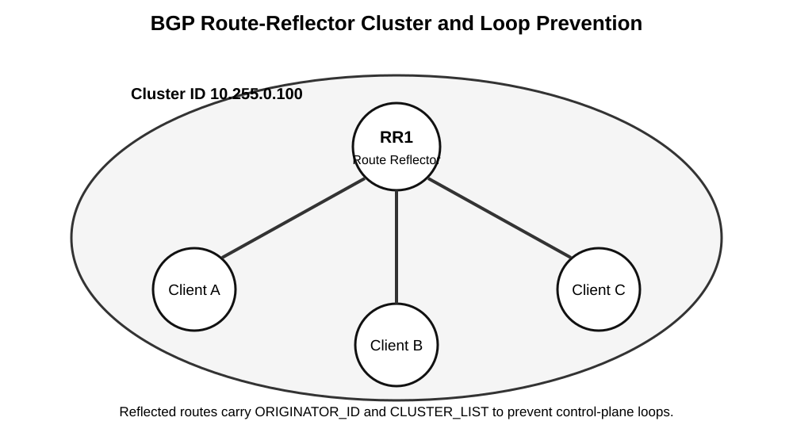

# BGP Clusters: Route Reflectors, Cluster IDs, and Hierarchical Design

> **Generated:** 2026-08-29 14:55 PDT  
> **Primary standard:** RFC 4456 — BGP Route Reflection  
> **GitHub rendering note:** Images are stored as normal repository assets and referenced by relative path so they render correctly in GitHub Markdown.

## Sources

- https://www.rfc-editor.org/rfc/rfc4456.html
- https://www.cisco.com/c/en/us/td/docs/routers/ios/config/17-x/ip-routing/b-ip-routing/m_irg-multicluster-id.html
- https://www.cisco.com/c/en/us/support/docs/ip/border-gateway-protocol-bgp/200153-BGP-Route-Reflection-and-Multiple-Cluste.html
- https://www.cisco.com/c/en/us/td/docs/iosxr/cisco8000/bgp/bgp-config-cisco8000/r-wrapper-bgp-routing-optimisation-and-convergence-techniques/c-bgp-route-reflectors.html
- https://www.juniper.net/documentation/us/en/software/junos/bgp/topics/topic-map/bgp-rr.html
- https://www.juniper.net/documentation/us/en/software/junos/cli-reference/topics/ref/statement/cluster-edit-protocols-bgp.html

## Overview

A **BGP cluster** is a control-plane grouping used by **BGP route reflection**. It is not an IP subnet, VRF, forwarding domain, or separate autonomous system.

Normal Internal BGP (IBGP) does not advertise a route learned from one IBGP peer to another IBGP peer. Without route reflection, routers requiring complete IBGP visibility therefore need a logical full mesh.

For `N` routers:

```text
IBGP sessions = N x (N - 1) / 2
```

| Routers | Sessions |
|---:|---:|
| 10 | 45 |
| 50 | 1,225 |
| 100 | 4,950 |

A **route reflector (RR)** relaxes this split-horizon rule for selected IBGP peers called **route-reflector clients**.



**What this image shows:** RR1 and three RR clients inside one logical cluster.

**What matters:** Clients do not need a full IBGP mesh with each other. The RR reflects eligible routes while adding route-reflection loop-prevention attributes.

**What to verify:** Confirm every intended client has an established IBGP session to the RR, is configured as an RR client on the reflector, and uses the intended cluster ID.

## Core concepts

| Term | Meaning |
|---|---|
| **Route reflector** | IBGP speaker allowed to reflect certain IBGP-learned routes. |
| **RR client** | IBGP peer for which the RR performs route reflection. |
| **Non-client** | Ordinary IBGP neighbor of an RR. |
| **Cluster** | Logical RR/client reflection domain. |
| **Cluster ID** | 32-bit identifier used in RR loop prevention. |
| **ORIGINATOR_ID** | BGP router ID of the original IBGP speaker that introduced a reflected route. |
| **CLUSTER_LIST** | Ordered list of cluster IDs traversed by the reflected route. |

## Reflection rules

A route reflector follows these practical rules:

| Route learned by RR from | To RR clients | To IBGP non-clients |
|---|---:|---:|
| EBGP peer | Yes | Yes |
| Locally originated | Yes | Yes |
| RR client | Yes | Yes |
| IBGP non-client | Yes | No |

Memory aid:

```text
Client -> RR -> Client       allowed
Client -> RR -> Non-client   allowed
Non-client -> RR -> Client   allowed
Non-client -> RR -> Non-client   not normally reflected
```

## Cluster ID

RFC 4456 defines the cluster identifier as a 4-byte value. Vendors commonly display it in dotted-decimal form:

```text
10.255.0.100
```

A cluster ID is **not** an ASN, route distinguisher, route target, next hop, subnet, or forwarding identifier. It exists for route-reflection control-plane loop prevention.

Some implementations can use the BGP router ID as an implicit/default cluster ID when none is explicitly configured. Explicit IDs usually make operations and troubleshooting more deterministic.

## ORIGINATOR_ID

When a route is first reflected, the RR adds **ORIGINATOR_ID** if it is not already present.

Example:

```text
Original client router ID: 10.0.0.1
Prefix:                    203.0.113.0/24

Reflected attribute:
ORIGINATOR_ID = 10.0.0.1
```

If that route later returns to the original router, the router recognizes its own BGP identifier and rejects the route.

## CLUSTER_LIST

Each RR adds its cluster ID when reflecting a route.

Example:

```text
Client A
   |
   v
RR1 cluster 100
   |
   v
RR2 cluster 200
```

After RR1:

```text
ORIGINATOR_ID = 10.0.0.1
CLUSTER_LIST  = 100
```

After RR2:

```text
ORIGINATOR_ID = 10.0.0.1
CLUSTER_LIST  = 200 100
```

If RR1 receives this route again and sees cluster `100` already present, it rejects the update.

## Loop-prevention summary

```text
AS_PATH        -> prevents inter-AS loops
ORIGINATOR_ID  -> prevents reflected route returning to original IBGP speaker
CLUSTER_LIST   -> prevents reflected route re-entering an RR cluster
```

## Control plane versus data plane

A route reflector does not need to forward the traffic for routes it reflects.

Control plane:

```text
Edge -> RR -> Client
```

Possible data path:

```text
Client -> P1 -> P2 -> Edge
```

This distinction matters because the RR may select a best path based on its own IGP view even though traffic never crosses the RR.

## Route-reflector path hiding

A conventional RR usually reflects its selected best path rather than every candidate.

```text
Edge-A ---\
           RR ---- Client-X
Edge-B ---/
```

If the RR selects Edge-A, Client-X may never learn Edge-B, even if Edge-B would be preferable from Client-X's location.

Possible mitigation, depending on vendor and release:

- BGP Add-Path
- Optimal Route Reflection (ORR)
- topologically diverse route reflectors
- improved RR placement
- designs that preserve alternate-path visibility

RR redundancy does not automatically equal path diversity.

## Redundant route reflectors

A common design is:

```text
RR1       RR2
 \       /
  \     /
   Client
```

This protects against a single RR failure. However, both RRs may still select and advertise the same path.

### Same or different cluster IDs?

There is no universal rule that every redundant RR pair must share one cluster ID.

A shared cluster ID can make sense when both RRs intentionally form one logical cluster. But in some topologies, especially inter-cluster or hierarchical designs, using the same cluster ID can cause one RR to reject a route already reflected by the other.

Before choosing IDs, determine:

- whether both RRs serve the same client set,
- whether the RRs peer directly,
- whether they are clients of an upper-tier RR,
- whether RR2 must accept a route already reflected by RR1,
- whether they represent one logical cluster or separate reflection domains.

## Multiple clusters and hierarchy

Large networks can divide the AS into several clusters:

```text
Cluster A -> RR-A
Cluster B -> RR-B
Cluster C -> RR-C
```

The RRs then need an intentional inter-cluster distribution topology.

A hierarchical design can use lower-tier RRs as clients of upper-tier RRs:

```text
             RR-Core
            /   |   \
         RR-A  RR-B  RR-C
          |     |     |
       clients clients clients
```

Advantages:

- fewer RR-to-RR sessions,
- geographic hierarchy,
- improved scaling.

Tradeoffs:

- additional control-plane hops,
- greater path-hiding potential,
- longer CLUSTER_LIST values,
- more complicated policy and troubleshooting.

## Cisco IOS XE example

```cli
router bgp 65000
 bgp router-id 10.255.0.11
 bgp cluster-id 10.255.0.100
 neighbor 10.255.0.21 remote-as 65000
 neighbor 10.255.0.21 update-source Loopback0
 address-family ipv4
  neighbor 10.255.0.21 activate
  neighbor 10.255.0.21 route-reflector-client
 exit-address-family
```

Client:

```cli
router bgp 65000
 bgp router-id 10.255.0.21
 neighbor 10.255.0.11 remote-as 65000
 neighbor 10.255.0.11 update-source Loopback0
 address-family ipv4
  neighbor 10.255.0.11 activate
 exit-address-family
```

The client does not mark itself as a client; that configuration exists on the RR.

## Cisco multiple cluster IDs

Cisco supports multiple/per-neighbor cluster IDs on applicable software.

Representative documented syntax:

```cli
router bgp 6500
 neighbor 2001:DB8:1::1 cluster-id 0.0.0.6
```

This is useful when one RR participates in more than one logical reflection domain.

## Cisco IOS XR example

```cli
router bgp 65000
 bgp router-id 10.255.0.11
 bgp cluster-id 10.255.0.100
 neighbor 10.255.0.21
  remote-as 65000
  update-source Loopback0
  address-family ipv4 unicast
   route-reflector-client
  !
 !
!
```

Always verify syntax against the exact IOS XR release.

## Junos example

```cli
set routing-options router-id 10.255.0.11
set routing-options autonomous-system 65000
set protocols bgp group RR-CLIENTS type internal
set protocols bgp group RR-CLIENTS local-address 10.255.0.11
set protocols bgp group RR-CLIENTS cluster 10.255.0.100
set protocols bgp group RR-CLIENTS neighbor 10.255.0.21
set protocols bgp group RR-CLIENTS neighbor 10.255.0.22
```

Juniper documents the cluster identifier as a 4-byte value. Some platform/release combinations may also have licensing requirements for advanced BGP functionality.

## Next-hop behavior

Route reflection does not inherently perform `next-hop-self`.

A reflected route can remain valid in BGP yet fail forwarding if the client cannot resolve the BGP next hop.

Classic symptom:

```text
BGP prefix received:       yes
Best path selected:        maybe
Next hop resolvable:       no
Installed in routing table: no
Forwarding:                no
```

Always verify IGP/underlay reachability to the BGP next hop.

## Failure behavior

With one RR, its failure removes the client's primary reflection source.

With dual RRs, the client can continue using the surviving RR if that RR has equivalent route visibility.

Convergence depends on:

- BGP session failure detection,
- BFD where supported/configured,
- IGP convergence,
- alternate route visibility,
- BGP best-path recalculation,
- RIB/FIB programming,
- next-hop resolution.

Hierarchical designs should avoid making a single upper-tier RR a control-plane single point of failure.

## Verification — Cisco IOS / IOS XE

```cli
show ip bgp summary
show ip bgp 203.0.113.0/24
show running-config | section router bgp
show ip route <BGP_NEXT_HOP>
show ip cef <BGP_NEXT_HOP>
```

On reflected routes, look for:

- Originator / ORIGINATOR_ID
- Cluster list
- next hop
- local preference
- AS path
- best-path status

## Verification — IOS XR

```cli
show bgp ipv4 unicast summary
show bgp ipv4 unicast 203.0.113.0/24 detail
show running-config router bgp
```

## Verification — Junos

```cli
show bgp summary
show bgp neighbor <NEIGHBOR_IP>
show route 203.0.113.0/24 detail
show route advertising-protocol bgp <NEIGHBOR_IP> 203.0.113.0/24 detail
show route receive-protocol bgp <NEIGHBOR_IP> 203.0.113.0/24 detail
```

Detailed route output can expose `Cluster list` and `Originator ID`.

## Troubleshooting

### Client receives no routes

Check:

1. BGP session state.
2. ASN and address family.
3. RR-client configuration on the RR.
4. Whether the RR has the route.
5. Export policy.
6. Client-to-client reflection settings.
7. CLUSTER_LIST loop prevention.
8. ORIGINATOR_ID loop prevention.
9. Next-hop reachability.

### One cluster cannot learn another cluster's routes

Check:

1. Are the RRs actually peered?
2. Is the client/non-client relationship correct?
3. Did the route originate from a client or non-client?
4. Does CLUSTER_LIST already contain the receiving RR's cluster ID?
5. Are shared cluster IDs suppressing a path that must be accepted?
6. Is an upper-tier RR missing?
7. Is policy filtering inter-cluster advertisements?

### Route exists on RR but not client

Cisco:

```cli
show ip bgp <PREFIX>
show ip bgp neighbors <CLIENT_IP> advertised-routes
```

Junos:

```cli
show route <PREFIX> detail
show route advertising-protocol bgp <CLIENT_IP> <PREFIX> detail
```

### Route disappears after adding another RR

Inspect `CLUSTER_LIST` and cluster IDs first. Same-cluster loop prevention may be rejecting the route exactly as designed.

### Suboptimal routing

Compare:

1. all candidate paths seen by the RR,
2. the RR-selected best path,
3. what the RR advertises,
4. what the client would choose with full visibility.

This often reveals RR path hiding.

## Common mistakes

- Treating cluster ID like an ASN.
- Assuming cluster IDs influence packet forwarding.
- Forgetting next-hop reachability.
- Assuming every redundant RR pair must use one shared cluster ID.
- Assuming two RRs automatically provide alternate-path visibility.
- Building mutual-client hierarchies without understanding direction.
- Ignoring path hiding.
- Changing cluster IDs without considering route churn or session resets.

## Key takeaways

- BGP clusters are route-reflection control-plane constructs.
- Route reflectors scale IBGP by relaxing normal IBGP split-horizon rules.
- ORIGINATOR_ID protects the original IBGP speaker.
- CLUSTER_LIST protects route-reflector clusters from loops.
- Route reflectors do not need to be in the forwarding path.
- Redundant RRs improve availability but do not automatically provide multiple usable paths.
- Hierarchical reflection improves scale at the cost of visibility and operational complexity.
- Cluster-ID strategy must match the actual topology and vendor behavior.
- During troubleshooting, inspect BGP session state, RR-client role, ORIGINATOR_ID, CLUSTER_LIST, policy, and next-hop resolution.

## Sources

- RFC 4456 — https://www.rfc-editor.org/rfc/rfc4456.html
- Cisco IOS XE BGP Multiple Cluster IDs — https://www.cisco.com/c/en/us/td/docs/routers/ios/config/17-x/ip-routing/b-ip-routing/m_irg-multicluster-id.html
- Cisco Route Reflection and Multiple Cluster IDs — https://www.cisco.com/c/en/us/support/docs/ip/border-gateway-protocol-bgp/200153-BGP-Route-Reflection-and-Multiple-Cluste.html
- Cisco IOS XR Route Reflectors — https://www.cisco.com/c/en/us/td/docs/iosxr/cisco8000/bgp/bgp-config-cisco8000/r-wrapper-bgp-routing-optimisation-and-convergence-techniques/c-bgp-route-reflectors.html
- Juniper BGP Route Reflectors — https://www.juniper.net/documentation/us/en/software/junos/bgp/topics/topic-map/bgp-rr.html
- Juniper `cluster` statement — https://www.juniper.net/documentation/us/en/software/junos/cli-reference/topics/ref/statement/cluster-edit-protocols-bgp.html
