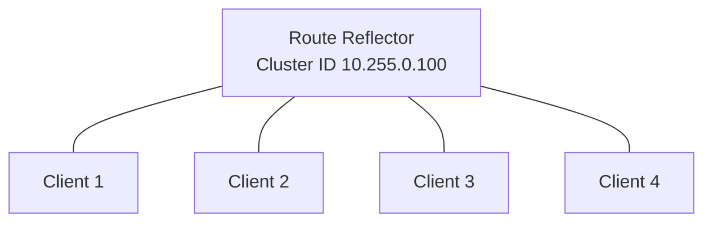
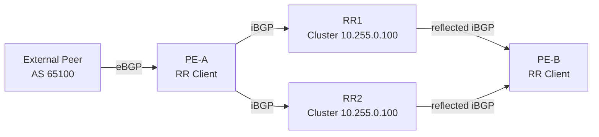
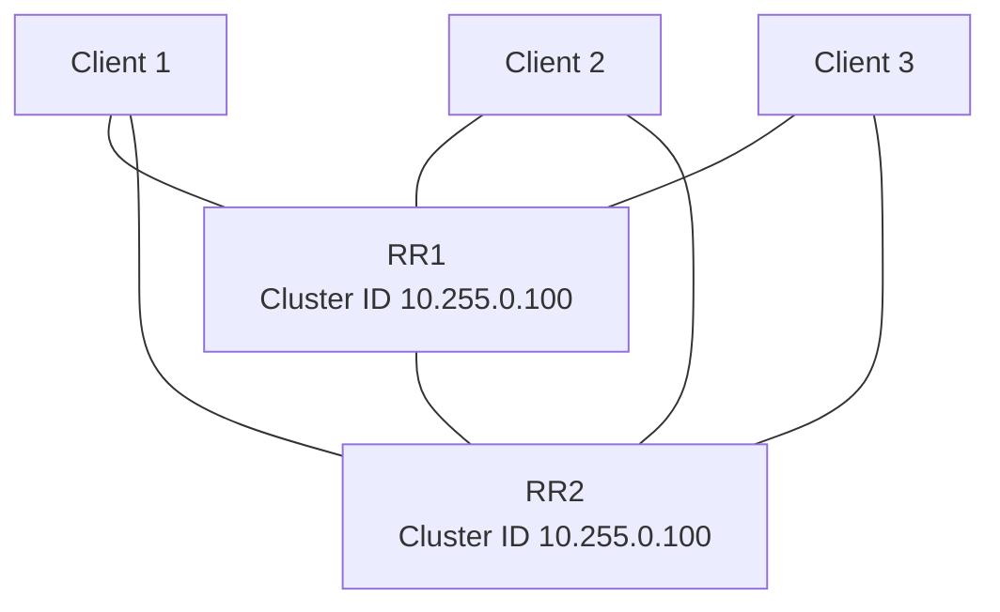

# BGP Clusters and Route Reflectors — Comprehensive Study Guide

> **Topic:** BGP route-reflector clusters, cluster IDs, CLUSTER_LIST, ORIGINATOR_ID, redundant route reflectors, hierarchical reflection, loop prevention, path-selection implications, configuration, verification, failover, and troubleshooting.

## Supporting URLs

- RFC 4456: https://www.rfc-editor.org/rfc/rfc4456.html
- Cisco BGP command reference: https://www.cisco.com/c/en/us/td/docs/ios/iproute_bgp/command/reference/irg_book/irg_bgp1.html
- Cisco IOS XE Internal BGP features: https://test-supplychain.cisco.com/c/en/us/td/docs/routers/ios/config/17-x/ip-routing/b-ip-routing/m_irg-int-features-0.html
- Cisco ASR 9000 BGP commands: https://www.cisco.com/c/en/us/td/docs/routers/asr9000/software/routing/command/reference/b-routing-cr-asr9000/bgp-commands.html
- Juniper BGP Route Reflectors: https://www.juniper.net/documentation/us/en/software/junos/bgp/topics/topic-map/bgp-rr.html
- Juniper `cluster` statement: https://www.juniper.net/documentation/us/en/software/junos/cli-reference/topics/ref/statement/cluster-edit-protocols-bgp.html
- FRRouting BGP: https://docs.frrouting.net/en/stable-9.0/bgp.html

## Overview

A **BGP cluster** is a route-reflection construct inside one BGP Autonomous System (AS). It normally consists of one or more **Route Reflectors (RRs)** plus the **RR clients** they serve.

Without route reflection, ordinary Internal BGP (IBGP) requires a logical full mesh because an IBGP speaker does not normally advertise an IBGP-learned route to another IBGP peer. For `n` routers, the number of sessions is:

```text
n × (n - 1) / 2
```

Route reflection removes that scaling requirement by allowing an RR to advertise selected IBGP-learned routes onward to other IBGP peers. Because this relaxes the normal IBGP advertisement rule, RFC 4456 defines two loop-prevention attributes:

- **ORIGINATOR_ID** — identifies the router ID of the original IBGP speaker.
- **CLUSTER_LIST** — records the cluster IDs through which a reflected route has passed.

## Architecture

### Single cluster


**What this image shows:** A single RR at the center of Cluster 127 with multiple IBGP clients.

**What matters:** Clients do not need to peer with every other client; the RR provides the control-plane distribution function.

**What to verify:** Each client has an established IBGP session to the RR and reflected routes carry the expected ORIGINATOR_ID and CLUSTER_LIST attributes.



### Client versus non-client

An RR's IBGP neighbors are either **clients** or **non-clients**.

| Best route learned from | Advertise to clients? | Advertise to non-clients? |
|---|---:|---:|
| eBGP peer | Yes | Yes |
| RR client | Yes | Yes |
| IBGP non-client | Yes | No |

The last row is critical: an RR does not normally reflect a route learned from one non-client to another non-client. Non-clients therefore retain the normal IBGP full-mesh requirement unless another reflection hierarchy solves it.

## Core concepts

### Cluster ID

The **cluster ID** is a 4-byte identifier used by route reflectors for loop prevention. It is commonly written in dotted-decimal form such as `10.255.0.100`, but it is an identifier rather than necessarily a forwarding address.

For a single RR, many implementations use the RR's router ID as the implicit cluster ID if none is configured.

For a classic redundant Cisco RR design, both RRs serving the same cluster can use the same explicit cluster ID while retaining unique BGP router IDs:

```text
RR1 router ID:   10.255.0.11
RR2 router ID:   10.255.0.12
Shared cluster:  10.255.0.100
```

Do not confuse the two concepts:

- **Router ID** identifies an individual BGP speaker.
- **Cluster ID** identifies a route-reflector cluster.

### ORIGINATOR_ID

ORIGINATOR_ID is an optional, non-transitive BGP path attribute created by a route reflector. It records the BGP router ID of the speaker that originally introduced the route into the reflection topology.

Example:

```text
Client R1 router-id = 10.255.1.1
R1 advertises 192.0.2.0/24 to RR1
RR1 reflects it
ORIGINATOR_ID = 10.255.1.1
```

If the reflected update returns to R1, R1 can recognize itself as the originator and reject it.

### CLUSTER_LIST

CLUSTER_LIST is an optional, non-transitive path attribute that records cluster IDs traversed by a reflected route.

Example:

```text
Client-A -> RR Cluster 10 -> RR Cluster 20 -> Client-B
```

A conceptual cluster list could be:

```text
20.20.20.20 10.10.10.10
```

If an RR receives a reflected route whose CLUSTER_LIST already contains that RR's local cluster ID, the route is rejected as a reflection loop.

### Memory aid

```text
ORIGINATOR_ID = protects the original router
CLUSTER_LIST  = protects the reflection cluster
```

## Control-plane behavior

### Route learned from a client

When a client sends a best path to the RR, the RR:

1. receives the route over IBGP;
2. runs normal BGP best-path selection;
3. inserts ORIGINATOR_ID if one is not already present;
4. adds the appropriate cluster ID to CLUSTER_LIST;
5. reflects the selected route to eligible clients and non-clients.

### Route learned from a non-client

The RR can reflect the route to clients, but not normally to another non-client.

### Client-to-client reflection

Client-to-client reflection is normally enabled. Cisco provides a control such as:

```cli
no bgp client-to-client reflection
```

Do not disable this unless the design deliberately provides another mechanism for clients to exchange those routes.

## Data-plane behavior

Route reflection is fundamentally a **control-plane** function. Traffic does not have to traverse the route reflector.

The receiving client resolves the BGP NEXT_HOP through its own Routing Information Base (RIB) and Forwarding Information Base (FIB). In many service-provider designs the RR is not in the forwarding path at all.

Juniper explicitly documents **non-forwarding route reflectors**, where the RR primarily performs control-plane work and does not need to install reflected routes into a forwarding table.

## Update flow example



Suppose CE advertises `203.0.113.0/24` to PE-A.

1. PE-A learns and selects the eBGP route.
2. PE-A advertises it to RR1 and RR2.
3. The RR associates PE-A's router ID with ORIGINATOR_ID.
4. The RR associates the local cluster ID with CLUSTER_LIST.
5. PE-B receives the reflected route.
6. PE-B resolves the BGP NEXT_HOP through its underlay/IGP and forwards toward PE-A or the advertised next hop, not toward the RR merely because the RR advertised the route.

If the reflected route later returns to cluster `10.255.0.100` with that cluster ID already present in CLUSTER_LIST, it is rejected.

## Redundant route reflectors

A single RR can become a control-plane single point of failure. Production designs commonly use two RRs per cluster.



A good redundant pair should have intentionally consistent:

- client membership;
- address-family activation;
- routing policy;
- next-hop reachability;
- route visibility;
- failure-domain design.

Cisco guidance for classic shared-cluster redundancy notes that RRs in one cluster should maintain stable peer relationships and identical client/non-client sets.

## Multiple clusters


**What this image shows:** Multiple RRs each serving a client group, with the RRs interconnected.

**What matters:** Route reflection removes the client full mesh, but inter-cluster propagation still requires a correct RR topology.

**What to verify:** Inter-RR sessions are established, cluster IDs are distinct where clusters are intended to be different, and CLUSTER_LIST grows as routes cross reflection boundaries.

## Hierarchical route reflection


**What this image shows:** Lower-tier RRs serve local clusters and a higher-tier RR reflects routes among lower-tier RRs.

**What matters:** Hierarchical reflection reduces the RR full mesh at very large scale but increases path-visibility and policy complexity.

**What to verify:** Upper- and lower-tier client relationships are intentional, CLUSTER_LIST is correct, and required alternative paths are not hidden.

## Path-selection implications

Route reflection is not only a session-scaling feature. It changes **path visibility**.

An RR normally runs BGP best-path selection and advertises selected path(s), so a client may not see every path that existed in the original full mesh.

Example:

```text
PE1 has Path A
PE2 has Path B
RR receives A and B
RR selects A
Client may receive only A
```

This can cause **path hiding**. The client might have preferred Path B had it seen both.

Technologies that can mitigate specific designs include:

- BGP Add-Path;
- Optimal Route Reflection (ORR);
- Best External;
- localized RR placement;
- IGP metric alignment.

These are separate features and must be explicitly validated for the target platform.

### Hot-potato routing issue

If an RR in New York selects a best exit based on its own IGP cost, a client in Los Angeles may receive a path that is optimal from New York but suboptimal from Los Angeles. This is one reason large networks carefully place RRs or use ORR/Add-Path.

## Layer 2 versus Layer 3

The cluster itself is not a Layer 2 construct. RR and clients do not need to share a VLAN or Ethernet segment.

At Layer 3, the BGP peers need IP reachability, usually between loopback interfaces. An IGP such as OSPF or IS-IS commonly provides this underlay reachability.

## Cisco IOS / IOS XE configuration

### RR

```cli
router bgp 65000
 bgp router-id 10.255.0.11
 bgp cluster-id 10.255.0.100
 neighbor 10.255.1.1 remote-as 65000
 neighbor 10.255.1.1 update-source Loopback0
 neighbor 10.255.1.1 route-reflector-client
 neighbor 10.255.1.2 remote-as 65000
 neighbor 10.255.1.2 update-source Loopback0
 neighbor 10.255.1.2 route-reflector-client
```

Depending on IOS XE release and address-family style, `route-reflector-client` can appear under the relevant address family.

### Client

```cli
router bgp 65000
 bgp router-id 10.255.1.1
 neighbor 10.255.0.11 remote-as 65000
 neighbor 10.255.0.11 update-source Loopback0
```

The client does not configure itself as a reflector client; that designation is made on the RR.

## Cisco IOS XR configuration

Representative Cisco-documented syntax:

```cli
router bgp 65534
 bgp cluster-id 1
 neighbor 192.168.70.24
  remote-as 65534
  address-family ipv4 unicast
   route-reflector-client
```

Validate exact hierarchy on the target IOS XR release.

## Junos OS configuration

Representative pattern:

```cli
set routing-options autonomous-system 65000
set routing-options router-id 10.255.0.11
set protocols bgp group RR-CLIENTS type internal
set protocols bgp group RR-CLIENTS cluster 10.255.0.100
set protocols bgp group RR-CLIENTS local-address 10.255.0.11
set protocols bgp group RR-CLIENTS neighbor 10.255.1.1
set protocols bgp group RR-CLIENTS neighbor 10.255.1.2
commit
```

Juniper warns that some route-reflection configuration changes, including adding a cluster ID in certain circumstances, can reset existing BGP sessions. Treat cluster changes as control-plane-impacting changes.

## FRRouting configuration

```cli
router bgp 65000
 bgp router-id 10.255.0.11
 bgp cluster-id 10.255.0.100
 neighbor 10.255.1.1 remote-as 65000
 neighbor 10.255.1.1 route-reflector-client
 neighbor 10.255.1.2 remote-as 65000
 neighbor 10.255.1.2 route-reflector-client
```

## Expected behavior

After a correct deployment:

1. RR/client sessions are `Established`.
2. A route learned by Client A can be visible to Client B without a direct A-B IBGP session.
3. Reflected routes contain ORIGINATOR_ID.
4. Reflected routes contain CLUSTER_LIST.
5. The RR does not normally become the BGP NEXT_HOP merely because it reflected the route.
6. A route returning to its originator is rejected.
7. A route returning to a cluster already in CLUSTER_LIST is rejected.
8. Loss of one RR should not remove route visibility if the client has a healthy redundant RR with equivalent routes and policy.

## Verification

### Cisco

```cli
show ip bgp summary
show ip bgp <PREFIX>
show ip bgp neighbors <NEIGHBOR_IP>
```

`show ip bgp <PREFIX>` can display route-reflection fields including **Originator** and **Cluster list**.

Some IOS XE releases also support:

```cli
show ip bgp cluster-ids
```

for per-neighbor cluster features. Confirm support on the exact release.

### Junos OS

```cli
show bgp summary
show bgp neighbor
show bgp group
show route <PREFIX> extensive
show route advertising-protocol bgp <NEIGHBOR_ADDRESS> extensive
show route receive-protocol bgp <NEIGHBOR_ADDRESS> detail
```

Juniper documents `Cluster list` and `Originator ID` fields for reflected BGP routes.

## Failover and convergence

If a client peers to RR1 and RR2 and RR1 fails:

1. the client detects the failed BGP session;
2. routes learned only through RR1 are invalidated;
3. equivalent paths learned from RR2 can remain or become best;
4. RIB/FIB state is updated as required;
5. forwarding follows the surviving valid next hop.

Convergence depends on:

- BGP hold timers;
- BFD where used and supported;
- route scale;
- availability of a preexisting alternate path;
- BGP best-path recomputation;
- RIB/FIB programming time.

A second RR is not sufficient if it has incomplete routes, different policy, broken underlay reachability, or the same physical failure domain as RR1.

## Common mistakes

### Router ID equals cluster ID

Not necessarily. They are different identifiers even if the same numeric value is used in a simple deployment.

### Duplicate cluster IDs in unrelated reflection domains

If an RR receives a route with its own cluster ID already in CLUSTER_LIST, it rejects the route. Accidental reuse can therefore cause route loss.

### Forgetting the non-client rule

A route learned from one non-client is not normally reflected to another non-client.

### Disabling client-to-client reflection without a replacement path

This can prevent clients from learning one another's routes.

### Believing the RR must forward the traffic

Route reflection is a control-plane function; forwarding uses BGP NEXT_HOP resolution.

### Ignoring path hiding

The RR may reflect only its selected path even when a client would have selected a different path if it had full visibility.

## Troubleshooting by symptom

### RR/client session down

Check:

```cli
show ip bgp summary
```

or Junos:

```cli
show bgp summary
```

Then verify:

- loopback reachability;
- TCP/179 filtering;
- remote AS;
- update source/local address;
- authentication;
- TTL/multihop requirements;
- VRF/routing-instance context.

### Client does not learn another client's route

Check:

1. both neighbors are configured as RR clients on the RR;
2. client-to-client reflection has not been disabled;
3. the route is the RR's selected path;
4. export policy is not filtering it;
5. the correct address family is active.

### Route disappears at another RR

Inspect CLUSTER_LIST. If the receiving RR finds its own cluster ID, rejection is expected. Investigate accidental duplicate cluster IDs or an incorrect RR hierarchy.

### Route exists on RR but not client

Check:

- best-path status;
- RR-client designation;
- export policy;
- address-family activation;
- ORIGINATOR_ID loop detection;
- CLUSTER_LIST loop detection.

### Route exists but forwarding fails

Separate control plane from data plane:

```text
BGP route exists
      ↓
NEXT_HOP reachable?
      ↓
route installed in RIB?
      ↓
FIB programmed?
      ↓
return path valid?
```

Cisco:

```cli
show ip bgp <PREFIX>
show ip route <NEXT_HOP>
show ip cef <PREFIX> detail
```

Junos:

```cli
show route <PREFIX> extensive
show route <NEXT_HOP>
show route forwarding-table destination <PREFIX>
```

### Route choice appears geographically wrong

Compare what the RR receives and selects against what the client would prefer based on local IGP cost. This can indicate path hiding or a need for ORR/Add-Path/localized RRs rather than a broken BGP session.

## Exam-focused distinctions

| Statement | Correct? | Reason |
|---|---:|---|
| A BGP cluster is an RR plus its clients | Yes | RFC 4456 terminology |
| Clients must be fully meshed | No | Route reflection removes that requirement |
| Non-clients automatically receive routes from other non-clients through the RR | No | Non-client-to-non-client reflection is not normal behavior |
| ORIGINATOR_ID identifies the original BGP speaker | Yes | Originator loop prevention |
| CLUSTER_LIST records reflector clusters traversed | Yes | Cluster loop prevention |
| Cluster ID must be a routable IP address | No | It is a 4-byte identifier |
| Router ID and cluster ID must always match | No | Different roles |
| Traffic must traverse the RR | No | RR is primarily control plane |
| Multiple RRs can provide redundancy | Yes | Common design |
| Route reflection can hide alternate paths | Yes | RR normally reflects selected path(s) |

## Key takeaways

1. A cluster is the RR plus its clients.
2. Route reflection deliberately relaxes the ordinary IBGP advertisement rule.
3. ORIGINATOR_ID protects the originating router from reflected loops.
4. CLUSTER_LIST protects the RR cluster from reflected loops.
5. Router ID and cluster ID are not the same concept.
6. Redundant RRs should have intentionally consistent route visibility and policy.
7. The RR usually does not need to be in the data path.
8. Non-clients retain ordinary IBGP advertisement restrictions.
9. Route reflection can create path hiding.
10. At larger scale, RR placement, Add-Path, ORR, and hierarchical design become important.

## Sources

1. RFC 4456 — https://www.rfc-editor.org/rfc/rfc4456.html
2. Cisco IOS BGP Command Reference — https://www.cisco.com/c/en/us/td/docs/ios/iproute_bgp/command/reference/irg_book/irg_bgp1.html
3. Cisco IOS XE Internal BGP Features — https://test-supplychain.cisco.com/c/en/us/td/docs/routers/ios/config/17-x/ip-routing/b-ip-routing/m_irg-int-features-0.html
4. Cisco ASR 9000 BGP Commands — https://www.cisco.com/c/en/us/td/docs/routers/asr9000/software/routing/command/reference/b-routing-cr-asr9000/bgp-commands.html
5. Juniper BGP Route Reflectors — https://www.juniper.net/documentation/us/en/software/junos/bgp/topics/topic-map/bgp-rr.html
6. Juniper `cluster` Statement — https://www.juniper.net/documentation/us/en/software/junos/cli-reference/topics/ref/statement/cluster-edit-protocols-bgp.html
7. FRRouting BGP — https://docs.frrouting.net/en/stable-9.0/bgp.html

### Image sources

- https://www.juniper.net/documentation/us/en/software/junos/bgp/images/jn-001489.png
- https://www.juniper.net/documentation/us/en/software/junos/bgp/images/jn-001490.png
- https://www.juniper.net/documentation/us/en/software/junos/bgp/images/jn-001491.png

## Accuracy notes

- **Source information:** RFC route-reflection behavior, Cisco cluster-ID/client configuration, Junos cluster configuration/verification, and FRR RR syntax are based on the cited documentation.
- **Additional explanation:** Packet/update walkthroughs, memory aids, failure-domain advice, and troubleshooting trees are explanatory context.
- **Reasonable inference:** Operational effects of inconsistent policy, failure-domain placement, and path hiding depend on platform, release, topology, and scale.