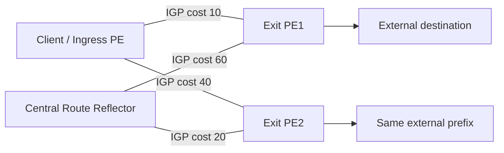
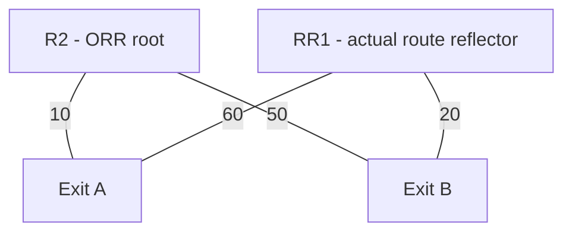
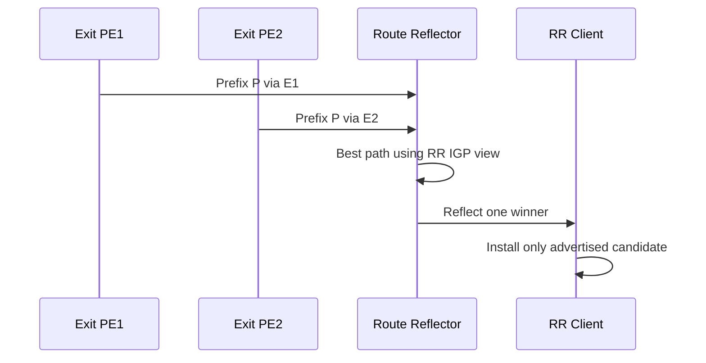
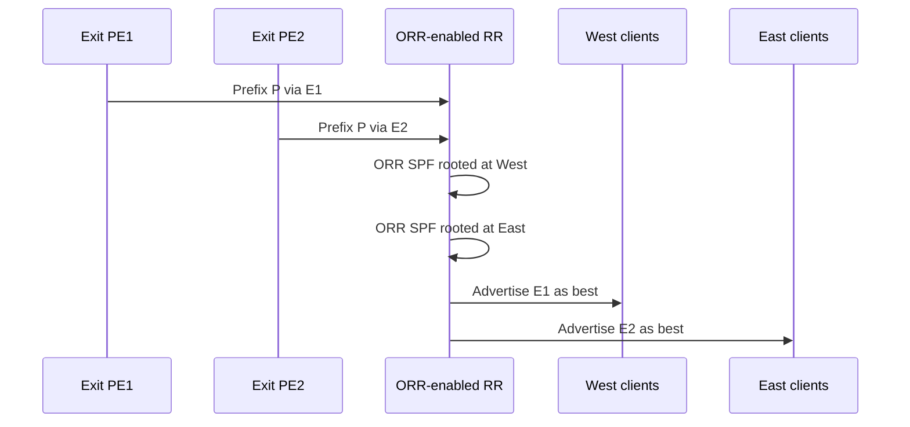
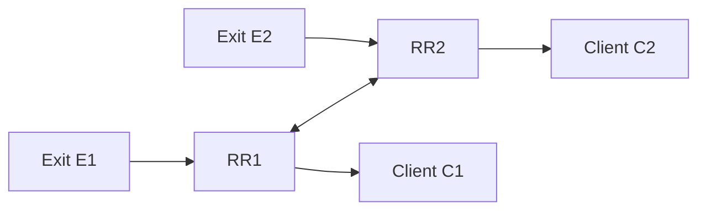

# BGP Optimal Route Reflection (ORR) — Comprehensive Study Guide

> **Topic:** Border Gateway Protocol (BGP) Optimal Route Reflection (ORR)
>
> **Primary standards/source basis:** RFC 9107, Cisco IOS XR BGP ORR documentation, Juniper Junos BGP ORR documentation
>
> **Supplied topic:** Optimal Route Reflection (ORR)

## Source URLs

- RFC 9107 — BGP Optimal Route Reflection: https://www.rfc-editor.org/rfc/rfc9107.html
- Cisco IOS XR — BGP optimal route reflectors: https://www.cisco.com/c/en/us/td/docs/iosxr/cisco8000/bgp/bgp-config-cisco8000/r-wrapper-bgp-routing-optimisation-and-convergence-techniques/c-bgp-optimal-route-reflectors.html
- Cisco TAC — Border Gateway Protocol (BGP) Optimal Route Reflection: https://www.cisco.com/c/en/us/support/docs/ip/border-gateway-protocol-bgp/212881-border-gateway-protocol-bgp-optimal-ro.html
- Juniper — BGP Optimal Route Reflection: https://www.juniper.net/documentation/us/en/software/junos/bgp/topics/topic-map/bgp-optimal-route-reflection.html
- Juniper — `optimal-route-reflection` CLI statement: https://www.juniper.net/documentation/us/en/software/junos/cli-reference/topics/ref/statement/protocols-bgp-group-optimal-route-reflection.html
- RFC 4456 — BGP Route Reflection: https://www.rfc-editor.org/rfc/rfc4456.html
- RFC 7911 — Advertisement of Multiple Paths in BGP (ADD-PATH): https://www.rfc-editor.org/rfc/rfc7911.html

---

## Overview

**BGP Optimal Route Reflection (ORR)** is an enhancement to BGP route reflection that lets a route reflector choose and advertise the BGP path that is best **from the perspective of its clients**, rather than always choosing the best path from the route reflector's own position in the Interior Gateway Protocol (IGP) topology.

This matters because a conventional route reflector normally performs one BGP best-path calculation and reflects that winner to many clients. If the route reflector is physically or logically far away from those clients, the route reflector's lowest-IGP-cost exit may not be the client's lowest-IGP-cost exit. The result can be **suboptimal hot-potato routing**, unnecessary transport across the backbone, and a control-plane dependency on where the route reflector happens to be located.

ORR changes that model. It allows the route reflector to calculate one or more client-oriented views by using an alternate IGP root and, where supported, client-group-specific BGP policy. In effect, the RR asks:

> “If I were located where this client or client group is located, which BGP path would I choose?”

The RR then reflects that path to the corresponding client or client group.

### Core idea in one sentence

**Traditional RR:** choose the best path from the RR's viewpoint.  
**ORR:** choose the best path from the RR client's viewpoint.

---

## Why Route Reflection Can Produce Suboptimal Routing

### The original iBGP scaling problem

Within a single Autonomous System (AS), ordinary Internal BGP (iBGP) does not advertise a route learned from one iBGP neighbor to another iBGP neighbor. A full mesh therefore requires every BGP router to peer with every other BGP router.

For `N` routers, the number of iBGP sessions is:

```text
N × (N - 1) / 2
```

A route reflector (RR), standardized in RFC 4456, removes the need for this full mesh by reflecting routes between its clients.

### The hidden consequence

An RR does more than distribute paths: unless additional mechanisms are used, it normally advertises only the path that **it** selected as best.

One of the BGP best-path tie-break steps compares the IGP metric to the BGP next hop. This is the mechanism that often implements **hot-potato routing** — leaving the AS through the nearest equivalent exit.

The problem is that “nearest” depends on where the comparison is performed.



In this example:

- The **client** prefers `E1` because cost `10 < 40`.
- The **RR** prefers `E2` because cost `20 < 60`.
- A traditional RR may therefore advertise only the E2 path to the client.
- The client never learns E1 and cannot choose its locally optimal hot-potato exit.

### Cisco ORR topology example


**What this image shows:** Cisco's ORR example in which multiple Provider Edge (PE) routers advertise the same prefix and the RR's own best path is not necessarily the best path from every ingress PE's viewpoint.

**What matters:** A route reflector that advertises a single global best path can unintentionally force multiple ingress routers toward an exit that is topologically farther away from them.

**What to verify:** Compare the IGP cost from the RR to each candidate BGP next hop with the cost from each RR client to those same next hops. If the ranking differs, conventional reflection can change hot-potato behavior.

Image source page: https://www.cisco.com/c/en/us/support/docs/ip/border-gateway-protocol-bgp/212881-border-gateway-protocol-bgp-optimal-ro.html

---

## What ORR Actually Changes

RFC 9107 describes two related changes that an ORR implementation can make to the route-reflector decision process.

### 1. Use a different IGP location for next-hop cost

Instead of computing the IGP metric from the route reflector itself to the BGP `NEXT_HOP`, ORR can compute the metric from a **selected IGP location** — normally the RR client, a representative router in that Point of Presence (PoP), or another logical root selected for a client group.

Conceptually:

```text
Traditional RR comparison:
    cost(RR -> BGP_NEXT_HOP_A)
    cost(RR -> BGP_NEXT_HOP_B)

ORR comparison for Client-X:
    cost(Client-X -> BGP_NEXT_HOP_A)
    cost(Client-X -> BGP_NEXT_HOP_B)
```

The route reflector obtains those costs by computing a shortest-path tree rooted at the selected client location.

### 2. Run multiple route selections

One route reflector may serve clients in many different topological locations. A single alternate root is therefore not enough.

ORR can run multiple route-selection views, for example:

```text
ORR group WEST  -> root = Los Angeles PE
ORR group CENTRAL -> root = Dallas PE
ORR group EAST -> root = New York PE
```

Each group can receive a different best route for the same prefix.

---

## Reverse SPF (rSPF)

Cisco commonly describes the ORR topology calculation as **Reverse Shortest Path First (rSPF)**.

The terminology can be misleading: ORR does not reverse packet forwarding. Instead, the route reflector runs an SPF calculation **as though another router were the root of the shortest-path tree**.

Suppose the actual RR is `RR1`, but ORR root `R2` represents a group of clients.



The normal RR SPF tree says B is closer. The ORR/rSPF tree rooted at R2 says A is closer. For clients assigned to the R2 ORR group, the RR should therefore prefer A when all higher-priority BGP attributes are equal.

### Why a link-state IGP is important

To calculate an SPF tree rooted at another router, the RR needs topology information rather than just a list of destination routes. Link-state protocols such as:

- Open Shortest Path First (OSPF)
- Intermediate System to Intermediate System (IS-IS)

provide the required topology view.

RFC 9107 also permits topology knowledge to be obtained through BGP Link State (BGP-LS), depending on implementation.

---

## ORR Does Not Override Higher-Priority BGP Policy

A very important exam and design point:

> **ORR does not mean “always choose the physically closest egress.”**

The IGP-cost comparison occurs relatively late in the BGP decision process. Higher-priority attributes can still select a path before ORR's IGP perspective becomes relevant.

For example, assume two routes exist:

```text
Path A:
  LOCAL_PREF 200
  IGP cost from client 50

Path B:
  LOCAL_PREF 100
  IGP cost from client 10
```

Path A still wins because Local Preference is considered before IGP cost.

ORR normally changes the **viewpoint used for the IGP cost tie-break**, not the entire meaning of BGP policy.

RFC 9107 also allows implementations to support different policy perspectives for different client groups. That is a broader mechanism than simply changing IGP root, but it is implementation dependent.

---

## Control-Plane Behavior

### Without ORR

1. Multiple egress routers advertise paths to the RR.
2. The RR receives the candidate paths.
3. The RR performs a conventional best-path calculation using its own IGP cost.
4. The RR selects one global best path.
5. The RR reflects that path to many or all clients.
6. Clients cannot choose a path they never received.



### With ORR

1. Multiple egress routers advertise paths to the RR.
2. The RR retains the paths required for ORR calculations.
3. The RR obtains the IGP topology.
4. The RR calculates a shortest-path view for each configured ORR root/client group.
5. The RR runs the relevant BGP path-selection portion for each view.
6. Different groups can receive different best paths for the same prefix.



### Data-plane impact

ORR itself is a **control-plane feature**. The route reflector does not need to forward the data traffic.

The data plane changes indirectly because clients install a different BGP next hop based on the route the RR reflects to them.

That separation is important:

- **Control plane:** RR calculates client-specific best paths.
- **Data plane:** RR clients forward packets toward their selected/advertised egress.

---

## Packet Flow Example

Assume prefix `203.0.113.0/24` is learned at two border routers:

```text
Egress PE-A -> 203.0.113.0/24
Egress PE-B -> 203.0.113.0/24
```

For ingress PE-WEST:

```text
IGP cost WEST -> PE-A = 10
IGP cost WEST -> PE-B = 70
```

For ingress PE-EAST:

```text
IGP cost EAST -> PE-A = 80
IGP cost EAST -> PE-B = 15
```

### Traditional RR

If the central RR is closer to PE-B:

```text
IGP cost RR -> PE-A = 50
IGP cost RR -> PE-B = 20
```

then it may advertise PE-B to both clients.

Result:

```text
WEST client -> backbone -> PE-B -> external AS
EAST client -> PE-B -> external AS
```

WEST carries traffic much farther across the AS than necessary.

### ORR

For the WEST ORR group, the RR uses the WEST root and advertises PE-A.
For the EAST ORR group, it uses the EAST root and advertises PE-B.

Result:

```text
WEST client -> PE-A -> external AS
EAST client -> PE-B -> external AS
```

This restores the behavior one would expect if every client had visibility to all equal-policy paths and could perform the IGP-cost tie-break locally.

---

## Client Grouping and ORR Roots

Running a unique SPF for every client can consume significant CPU and memory on a large route reflector. ORR therefore supports the idea of grouping clients that share similar topology and policy.

Typical grouping boundaries include:

- Point of Presence (PoP)
- Metro area
- Region
- Edge cluster
- Access aggregation area

For example:

```text
ORR group NYC:
  root = NYC-PE1
  clients = NYC-PE2, NYC-PE3, NYC-PE4

ORR group CHI:
  root = CHI-PE1
  clients = CHI-PE2, CHI-PE3

ORR group LAX:
  root = LAX-PE1
  clients = LAX-PE2, LAX-PE3, LAX-PE4
```

### When grouping is safe

Grouping works well when all clients in the group have approximately the same IGP ranking toward all candidate egress points.

### When grouping becomes inaccurate

If two clients are in the same group but their shortest-path rankings differ, the representative ORR root may still produce a suboptimal path for one of them.

So there is a tradeoff:

| ORR granularity | Accuracy | RR CPU/memory | Operational complexity |
|---|---:|---:|---:|
| One root for all clients | Low | Lowest | Lowest |
| Root per region/PoP | High in well-designed topologies | Moderate | Moderate |
| Root per client | Highest | Highest | Highest |

RFC 9107 deliberately allows implementation flexibility here.

---

## Primary and Backup ORR Roots

A logical ORR root may become unreachable or may disappear from the IGP topology.

For resilience, implementations can support one or more backup roots.

Conceptually:

```text
ORR group WEST
  primary root   = PE-W1
  backup root    = PE-W2
```

If `PE-W1` disappears, the RR can switch to `PE-W2` as the viewpoint for the group.

Juniper documents an `igp-primary` and optional `igp-backup` mechanism. Cisco IOS XR implementations have also documented primary/secondary/tertiary root support in some releases/features.

Always verify the exact root count and failover behavior for the software release you operate.

---

## ORR and ADD-PATH

ORR and BGP ADD-PATH solve related but different problems.

### ADD-PATH

BGP ADD-PATH, RFC 7911, permits a BGP speaker to advertise multiple paths for the same Network Layer Reachability Information (NLRI).

That can let an RR client receive enough candidate paths to choose its own local winner.

### ORR

ORR keeps the optimization intelligence at the RR. The client may receive only one path, but the RR chooses that path from the client's perspective.

### Comparison

| Feature | ORR | ADD-PATH |
|---|---|---|
| Primary purpose | Client-perspective best-path reflection | Advertise multiple paths for same NLRI |
| Client must support feature | Not necessarily | Yes, ADD-PATH capability must be negotiated |
| Additional path advertisements | Not required to client | Yes |
| RR CPU impact | Multiple SPF/path-selection views | More path processing/storage/advertisements |
| Client RIB impact | Usually smaller | Larger due to multiple received paths |
| Can preserve hot-potato behavior | Yes | Yes, if client receives relevant exits |

### Critical RFC 9107 deployment point

For optimal routing **between different RR clusters**, each route reflector needs access to all paths that are eligible for the ORR decision. RFC 9107 says BGP ADD-PATH is needed **between route reflectors** to satisfy this requirement when otherwise only one path would be propagated between clusters.

This is a very important distinction:

```text
ADD-PATH between RRs may be required so ORR has all candidates.
ADD-PATH to every RR client is not inherently required for ORR.
```

---

## ORR and Route Reflector Placement

### Traditional design pressure

Before ORR, route reflectors were often placed so that their IGP viewpoint approximated the viewpoint of their clients. This can lead to “in-path” or per-PoP RR placement.

### With ORR

The control-plane function can be centralized or virtualized without forcing its physical location to dictate egress selection.

This is especially useful with:

- virtual route reflectors (vRRs)
- Network Functions Virtualization (NFV)
- centralized control-plane clusters
- large multi-region service-provider backbones

Cisco explicitly highlights ORR as a mechanism that enables a virtual RR to be placed in a central data center while still giving distributed clients locally appropriate paths.

---

## ORR, Hot-Potato Routing, and Cold-Potato Routing

### Hot-potato routing

Hot potato means exiting the AS as quickly as practical through the nearest acceptable egress.

ORR is particularly valuable when the network wants to retain hot-potato routing despite centralized route reflection.

### Cold-potato routing

Some networks intentionally carry traffic farther inside their own backbone before handing it to another AS. This may be driven by:

- business policy
- transit cost
- peering arrangements
- performance engineering
- content delivery strategy

ORR does not force hot-potato routing. If Local Preference, communities, policies, or another higher-priority attribute selects a remote egress, that policy still wins.

---

## Cisco IOS XR ORR — Concept and Configuration

> **Important:** Cisco syntax and prerequisites vary by platform and IOS XR release. Use the command reference for your exact release.

Cisco IOS XR defines an ORR policy/group and associates that group with RR clients.

A simplified documented pattern is:

```cli
router bgp <AS_NUMBER>
 address-family ipv4 unicast
  optimal-route-reflection <ORR_GROUP_NAME> <ORR_ROOT_ADDRESS>
 !
 neighbor <CLIENT_ADDRESS>
  remote-as <AS_NUMBER>
  address-family ipv4 unicast
   optimal-route-reflection <ORR_GROUP_NAME>
   route-reflector-client
  !
 !
!
```

Example based on current Cisco IOS XR documentation:

```cli
configure
router bgp 6500
 address-family ipv4 unicast
  optimal-route-reflection g1 192.0.2.2
 !
 neighbor 10.0.0.1
  address-family ipv4 unicast
   optimal-route-reflection g1
  !
 !
commit
```

### What the configuration means

- `optimal-route-reflection g1 192.0.2.2`
  - Creates ORR group `g1`.
  - Uses `192.0.2.2` as the root/viewpoint for that group.

- `optimal-route-reflection g1` under the neighbor address family
  - Associates that RR client with the ORR group.

- `route-reflector-client`
  - Makes the neighbor an RR client as usual.

### Cisco topology discovery prerequisites

Cisco documentation describes the need for sufficient link-state topology knowledge to build the ORR SPF/rSPF database. Depending on release, this can involve OSPF/IS-IS link-state distribution and MPLS Traffic Engineering router-ID information.

Do **not** assume every IOS XR ORR release has identical underlay requirements. Validate:

- supported IGP
- required link-state distribution command
- MPLS TE dependency
- address families supported
- BGP-LU limitations
- multiple-topology limitations

### Current Cisco 8000 restrictions documented in 2026

Cisco's current IOS XR 8000 documentation lists these restrictions:

- ORR considers only IGP-learned routes for rSPF.
- BGP Label Unicast (BGP-LU) routes are outside ORR calculations.
- Multiple IGP topologies are not supported.

These restrictions are platform/release-specific implementation statements; check your own code train before applying them universally.

---

## Cisco Verification

One well-known IOS XR verification command is:

```cli
show orrspf database detail
```

It can expose information such as:

```text
ORR policy: <GROUP>
Configured root: primary: <ROOT>
Actual Root: <ROOT>
Prefix                                  Cost
<IGP_NODE_A>                            <COST>
<IGP_NODE_B>                            <COST>
...
```

### What to verify

1. The expected ORR group exists.
2. The configured primary root is correct.
3. The actual root is the expected active root.
4. Candidate BGP next-hop/router-ID addresses appear in the ORR SPF database.
5. Their costs match the IGP topology from the root's perspective.
6. The RR client is actually attached to the intended ORR group.
7. The client receives the expected path.

Also verify BGP route advertisement and received routes using the platform's BGP show commands, for example:

```cli
show bgp ipv4 unicast <PREFIX>
```

and commands that display what the RR advertises to a specific neighbor.

---

## Juniper Junos ORR — Concept and Configuration

Juniper documents BGP ORR with OSPF and IS-IS as the IGP.

The feature is configured at the BGP group level with:

```cli
set protocols bgp group <GROUP_NAME> optimal-route-reflection igp-primary <PRIMARY_NODE>
```

Optionally:

```cli
set protocols bgp group <GROUP_NAME> optimal-route-reflection igp-backup <BACKUP_NODE>
```

The Junos `optimal-route-reflection` statement was introduced in Junos OS Release **23.1R1**, according to the Juniper CLI reference.

### Conceptual configuration

```cli
set protocols bgp group ORR-WEST type internal
set protocols bgp group ORR-WEST neighbor <CLIENT_1>
set protocols bgp group ORR-WEST neighbor <CLIENT_2>
set protocols bgp group ORR-WEST optimal-route-reflection igp-primary <WEST_ROOT>
set protocols bgp group ORR-WEST optimal-route-reflection igp-backup <WEST_BACKUP_ROOT>
```

### Juniper verification commands

Juniper documents these commands for ORR verification/troubleshooting:

```cli
show bgp group
show isis bgp-orr
show ospf bgp-orr
show ospf route
show route
show route advertising-protocol bgp <PEER>
```

### What each check tells you

#### `show bgp group`

Confirms the ORR-enabled BGP group and configured primary/backup root information.

#### `show ospf bgp-orr`

Shows the OSPF-derived ORR metric database.

#### `show isis bgp-orr`

Shows the IS-IS-derived ORR metric database.

#### `show route advertising-protocol bgp <PEER>`

Confirms the actual route selected and advertised to a particular RR client.

This last check is especially important because a healthy ORR SPF database does not prove the final BGP advertisement is correct.

---

## Juniper Route-Resolution Limitation

Juniper documentation calls out an important implementation consideration: ORR works when the BGP next hop is resolved through the IGP.

For many VPN families in an MPLS network, the next hop may normally resolve through `inet.3` using:

- Label Distribution Protocol (LDP)
- Resource Reservation Protocol Traffic Engineering (RSVP-TE)

rather than directly through OSPF/IS-IS.

Juniper therefore notes that ORR does not simply operate when route resolution is through MPLS/LDP/RSVP in that normal form; the route-resolution design may need to be changed so the relevant next-hop metric is based on the IGP.

This is a major troubleshooting point for:

- Layer 3 VPN
- Layer 2 VPN
- Virtual Private LAN Service (VPLS)
- Multicast VPN (MVPN)
- Ethernet VPN (EVPN)

Do not assume that enabling ORR under the BGP group automatically makes all VPN address families use ORR correctly.

---

## Recursive Next-Hop Resolution

RFC 9107 addresses the case where the BGP next hop is itself recursively resolved through another BGP route.

The essential requirement is that the metric used for the ORR comparison should represent the **final IGP cost** to the recursively resolved next hop.

If an implementation cannot determine that final metric, RFC 9107 says such paths should be treated as least preferred for the next-hop metric comparison, while still remaining valid candidate paths for the broader BGP decision process.

### Why this matters

A route can be BGP-valid yet still be unsuitable for an accurate ORR IGP-cost comparison if the RR cannot determine the real underlay distance to the resolved next hop.

---

## ORR with Multiple Route Reflectors

Redundant route reflectors are normal. The hard part is making sure every ORR decision has access to every path that could be optimal for a client.

Consider two RR clusters:



If RR1 learns only RR2's single conventional best path, RR1 may never see another RR2 path that would actually be better from C1's perspective.

That means ORR cannot magically optimize a candidate path it never learned.

### Design rule

**ORR accuracy is bounded by path visibility.**

RFC 9107 specifically points to ADD-PATH between route reflectors so each RR can learn all eligible paths needed for optimal cross-cluster decisions.

---

## Failover and Convergence

ORR adds another layer of control-plane computation, but the major convergence stages remain familiar:

```text
1. Failure occurs.
2. IGP topology changes or BGP path is withdrawn.
3. RR updates link-state / reachability information.
4. ORR SPF/rSPF view is recomputed if needed.
5. BGP best-path processing runs for affected ORR groups.
6. RR sends UPDATE/WITHDRAW to clients.
7. Client updates RIB/FIB.
8. Traffic follows the new egress.
```

### What ORR does not replace

ORR does not replace:

- Bidirectional Forwarding Detection (BFD)
- IGP fast convergence
- Prefix Independent Convergence (PIC)
- next-hop tracking
- fast reroute

These mechanisms address different parts of failure detection and forwarding convergence.

### Root failure

If the configured ORR root disappears:

- an implementation with a backup root can switch viewpoints;
- otherwise the ORR group may lose its intended reference point or fall back according to vendor behavior.

Always verify the vendor's behavior under root failure rather than assuming silent fallback to the RR's own location.

---

## ORR vs BGP PIC

These features are complementary, not interchangeable.

| Topic | ORR | BGP PIC |
|---|---|---|
| Problem solved | RR advertises client-optimal path | Fast forwarding convergence after path failure |
| Primary plane | Control plane | RIB/FIB convergence architecture |
| Changes which exit is selected | Yes | Not primarily |
| Pre-installs backup forwarding state | Not inherently | Yes, depending on PIC type/platform |
| Removes RR viewpoint bias | Yes | No |

A design may use ORR to make the **right primary egress** visible and PIC to make failure to the backup **fast**.

---

## ORR vs Best External

**Best External** and **ORR** also solve different problems.

Best External allows BGP to advertise a useful external alternate even when the overall best path is internal. ORR determines which candidate should be considered best from the perspective of a client or group.

They can both improve path diversity/selection, but they operate at different points and should not be treated as substitutes.

---

## ORR vs Diverse-Path / Shadow Route Reflector Designs

Before ORR or ADD-PATH, operators sometimes deployed additional RRs with intentionally different path-selection behavior so clients could receive more than one distinct route.

ORR is more explicit: the RR directly computes the best path for a selected client viewpoint.

Diverse-path designs may still be useful in some environments, but ORR generally provides a cleaner semantic answer to the problem of route-reflector location bias.

---

## Architecture Design Guidelines

### 1. Identify where hot-potato behavior matters

ORR provides the most value when multiple egress points advertise equivalent BGP paths and ingress routers should choose the nearest egress.

### 2. Map client topology groups

Group clients by locations where IGP-cost rankings to candidate exits are equivalent or very similar.

### 3. Select stable root nodes

Choose roots that:

- are always present in the IGP under normal conditions;
- accurately represent the group;
- have stable router IDs / loopbacks;
- have a backup if supported.

### 4. Verify full candidate-path visibility

Ask:

```text
Does this RR actually know every path that could be best for this client group?
```

If not, ORR cannot choose correctly.

### 5. Understand route-resolution behavior

Confirm whether the BGP next hop is resolved through:

- OSPF
- IS-IS
- LDP
- RSVP-TE
- Segment Routing
- BGP-LU
- recursively through another BGP route

Vendor ORR support can differ dramatically depending on that resolution chain.

### 6. Capacity-plan the RR

More ORR groups can mean:

- more SPF/rSPF calculations
- more per-group databases
- more BGP decision processing
- more distinct update groups
- more memory
- more CPU during IGP churn

### 7. Test failures, not just steady state

Test:

- egress failure
- IGP link failure
- ORR root failure
- RR failover
- loss of ADD-PATH visibility between RRs
- route-policy change
- next-hop resolution change

---

## Common Mistakes

### Mistake 1 — “ORR sends every path to the client”

False. That is closer to ADD-PATH. ORR can still advertise only one path; it simply computes the winner from a client-oriented perspective.

### Mistake 2 — “ORR makes IGP metric the top BGP attribute”

False. Higher-priority BGP attributes still win.

### Mistake 3 — “If the RR has ORR, the clients also need ORR support”

Not necessarily. A major ORR advantage is that the intelligence can live on the RR while clients receive ordinary BGP advertisements.

### Mistake 4 — “ORR works even if the RR never learned the alternate path”

False. ORR can choose only among candidates it knows.

### Mistake 5 — “Every client requires its own ORR root”

Not necessarily. Similar clients can share an ORR group/root.

### Mistake 6 — “A centralized RR is always bad for hot-potato routing”

Without mechanisms such as ORR or sufficient path diversity, it can be. With ORR, physical RR location can be decoupled from the client's path-selection viewpoint.

### Mistake 7 — “MPLS underlay details do not matter”

They can matter significantly. Some implementations require next-hop resolution through the IGP and have limitations with LDP/RSVP/BGP-LU or multiple IGP topologies.

---

## Troubleshooting by Symptom

## Symptom: Client receives the wrong egress route

### Check 1 — Is the client assigned to the expected ORR group?

**Where:** Route reflector BGP configuration.

**What it tests:** Configuration scope.

**Success:** Neighbor/peer group references the intended ORR policy/group.

**Failure means:** RR may perform ordinary best-path reflection or use the wrong root.

**Next action:** Correct the neighbor/group association and commit/apply.

### Check 2 — Is the actual ORR root correct?

**Where:** RR ORR/SPF operational database.

Cisco example:

```cli
show orrspf database detail
```

Juniper examples:

```cli
show bgp group
show ospf bgp-orr
show isis bgp-orr
```

**Success:** Active root equals expected primary or valid backup.

**Failure means:** Primary may be unreachable, not represented in link-state data, or configured incorrectly.

**Next action:** Verify root loopback/router ID and IGP topology advertisement.

---

## Symptom: ORR database does not contain candidate egress nodes

### Check — Does the RR have complete link-state topology?

**Where:** RR IGP/link-state database.

**What it tests:** Whether the RR can calculate the alternate-root SPF.

**Success:** All relevant nodes/links are present.

**Failure means:** Missing topology distribution, area/level scope, link-state export, or vendor-specific TE information.

**Next action:** Fix IGP/BGP-LS/link-state distribution before troubleshooting BGP path selection.

---

## Symptom: ORR metrics look correct but the chosen BGP path is still different

### Check — Compare higher-priority BGP attributes

Inspect:

- Weight, if vendor-specific and applicable
- Local Preference
- locally originated status
- AS_PATH length
- Origin
- MED under the platform's comparison rules
- route policy
- communities that affect policy

**Success:** Candidate paths are tied until the IGP-cost comparison.

**Failure means:** ORR is not the deciding step.

**Next action:** Fix policy if the higher-priority attribute is unintended.

---

## Symptom: ORR works inside a cluster but not across RR clusters

### Check — Does each RR learn all eligible paths?

**Where:** BGP RIB on each RR.

**What it tests:** Candidate path visibility.

**Success:** All paths that could be optimal are present.

**Failure means:** A remote RR may be advertising only one best path.

**Next action:** Evaluate ADD-PATH between route reflectors as described by RFC 9107.

---

## Symptom: ORR does not affect VPN/EVPN routes

### Check — How is the BGP next hop resolved?

**Where:** Routing table / resolution table.

**What it tests:** Whether the implementation derives the metric from the supported IGP view.

**Success:** Next-hop resolution method matches vendor ORR requirements.

**Failure means:** The path may be resolving through MPLS/LDP/RSVP or another unsupported mechanism.

**Next action:** Follow the vendor's documented resolution-table design for the specific address family.

---

## Symptom: CPU spikes after enabling ORR

### Check — Number of ORR roots/groups and IGP churn

**Where:** RR control-plane CPU, SPF statistics, BGP process statistics.

**What it tests:** Computation scaling.

**Success:** ORR recomputation remains within platform capacity.

**Failure means:** Too many unique roots, too much topology churn, or insufficient RR resources.

**Next action:** Consolidate clients into topology-equivalent groups where safe and reassess RR sizing.

---

## Verification Workflow

Use this end-to-end method after deployment.

### Step 1 — Verify BGP sessions

Confirm all RR-client and RR-to-RR sessions are Established.

### Step 2 — Verify candidate paths on the RR

For a test prefix, confirm the RR sees every expected egress path.

### Step 3 — Verify link-state topology

Confirm the RR's topology database contains the ORR root and all relevant egress nodes.

### Step 4 — Verify ORR root and SPF costs

Confirm the ORR database produces the same costs you calculate manually from the root.

### Step 5 — Verify selected path per group

For one prefix advertised from multiple exits, determine which path should win for each client group.

### Step 6 — Verify RR advertisement

Inspect the route advertised to each client.

### Step 7 — Verify client RIB

Confirm the client selects the expected BGP route.

### Step 8 — Verify client FIB

Confirm the forwarding entry resolves toward the expected egress.

### Step 9 — Test failover

Withdraw or fail the preferred egress and measure:

```text
Failure detection
-> IGP/BGP update
-> ORR recomputation
-> RR advertisement
-> client RIB update
-> client FIB update
```

---

## Worked Example

Assume AS 65000 has a centralized RR and two egress routers advertising `198.51.100.0/24`.

```text
RR location: Denver
Client WEST: Los Angeles
Client EAST: New York
Egress A: San Jose
Egress B: Ashburn
```

IGP costs:

| Viewpoint | To Egress A | To Egress B | Preferred |
|---|---:|---:|---|
| RR Denver | 30 | 20 | B |
| WEST | 10 | 70 | A |
| EAST | 80 | 10 | B |

### Conventional RR result

RR selects B and advertises B to both WEST and EAST.

### ORR result

- WEST group root calculates A as best.
- EAST group root calculates B as best.

So the same prefix can be reflected as:

```text
WEST receives: 198.51.100.0/24 via Egress A
EAST receives: 198.51.100.0/24 via Egress B
```

This is the central benefit of ORR.

---

## Exam / Interview Memory Aids

### Memory aid 1

**RR location should not dictate client exit. ORR moves the IGP viewpoint to the client.**

### Memory aid 2

**ORR = client-specific best path. ADD-PATH = multiple paths.**

### Memory aid 3

**ORR cannot choose a path the RR never learned.**

### Memory aid 4

**BGP policy first, client-perspective IGP metric later.**

### Memory aid 5

**More ORR roots = more accuracy, but more RR computation.**

---

## Configuration Summary

### Cisco IOS XR conceptual flow

```text
1. Ensure BGP RR operation is working.
2. Ensure link-state IGP/topology information required by the platform is available.
3. Define ORR group + root(s).
4. Associate RR client(s) with ORR group.
5. Commit.
6. Verify ORR SPF database.
7. Verify per-client BGP advertisements.
8. Test failure and backup-root behavior.
```

### Juniper conceptual flow

```text
1. Ensure OSPF or IS-IS topology is available.
2. Build BGP RR group.
3. Enable optimal-route-reflection under group.
4. Configure igp-primary.
5. Optionally configure igp-backup.
6. Commit.
7. Verify show bgp group.
8. Verify show ospf bgp-orr / show isis bgp-orr.
9. Verify route advertisements to clients.
10. Confirm route-resolution method is supported for the address family.
```

---

## Key Takeaways

- Route reflection solves the iBGP full-mesh problem but can distort hot-potato routing because the RR normally selects a single best path from **its own** IGP location.
- ORR lets the RR calculate path preference from a selected **client or client-group IGP viewpoint**.
- The RR can advertise different best paths for the same prefix to different clients or groups.
- ORR is primarily a **control-plane path-selection enhancement**; clients then install/forward according to the routes they receive.
- Link-state topology information is fundamental because the RR needs to compute shortest paths rooted at locations other than itself.
- ORR does not override higher-priority BGP attributes.
- Client grouping trades precision against CPU, memory, and operational complexity.
- Accurate ORR requires complete visibility to all eligible candidate paths.
- RFC 9107 specifically notes ADD-PATH between route reflectors when needed to make those candidates available across RR clusters.
- Vendor implementation restrictions matter, especially around BGP-LU, MPLS route resolution, multiple IGP topologies, supported address families, and release-specific topology-distribution requirements.
- ORR complements mechanisms such as ADD-PATH, BGP PIC, BFD, and IGP fast convergence; it does not replace them.

---

## Sources

1. IETF RFC 9107 — **BGP Optimal Route Reflection (BGP ORR)**  
   https://www.rfc-editor.org/rfc/rfc9107.html

2. Cisco — **BGP optimal route reflectors**, BGP Configuration Guide for Cisco 8000 Series Routers, Cisco IOS XR Releases  
   https://www.cisco.com/c/en/us/td/docs/iosxr/cisco8000/bgp/bgp-config-cisco8000/r-wrapper-bgp-routing-optimisation-and-convergence-techniques/c-bgp-optimal-route-reflectors.html

3. Cisco TAC — **Border Gateway Protocol (BGP) Optimal Route Reflection**  
   https://www.cisco.com/c/en/us/support/docs/ip/border-gateway-protocol-bgp/212881-border-gateway-protocol-bgp-optimal-ro.html

4. Juniper Networks — **BGP Optimal Route Reflection**  
   https://www.juniper.net/documentation/us/en/software/junos/bgp/topics/topic-map/bgp-optimal-route-reflection.html

5. Juniper Networks — **optimal-route-reflection** CLI reference  
   https://www.juniper.net/documentation/us/en/software/junos/cli-reference/topics/ref/statement/protocols-bgp-group-optimal-route-reflection.html

6. IETF RFC 4456 — **BGP Route Reflection: An Alternative to Full Mesh Internal BGP (IBGP)**  
   https://www.rfc-editor.org/rfc/rfc4456.html

7. IETF RFC 7911 — **Advertisement of Multiple Paths in BGP**  
   https://www.rfc-editor.org/rfc/rfc7911.html
