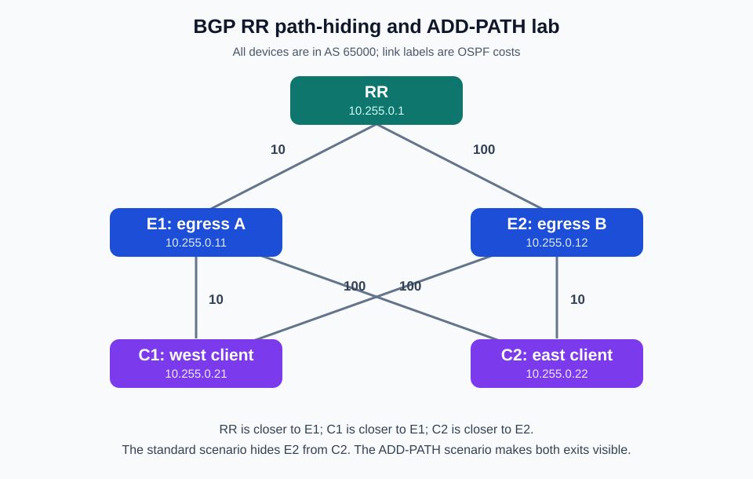
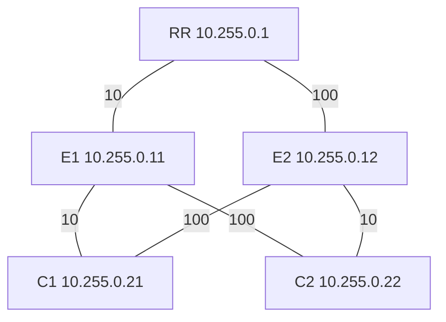
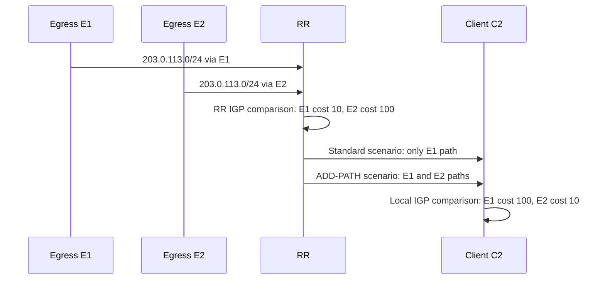
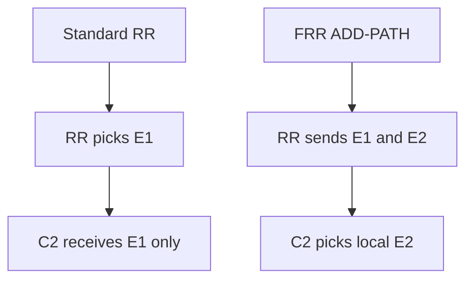
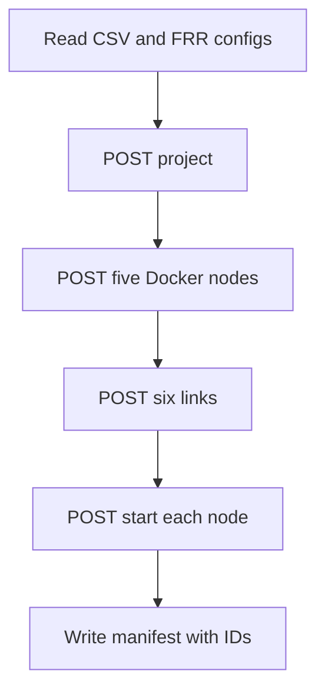

# FRR BGP ORR-Behavior / ADD-PATH Lab for GNS3

> **Runnable material:** [`labs/bgp-orr-frr-gns3-lab`](labs/bgp-orr-frr-gns3-lab/README.md). Change into that folder before running the commands below.


> **Scope:** BGP route-reflection path hiding, client-versus-RR IGP viewpoint, and BGP ADD-PATH as an FRRouting (FRR) emulation of the outcome ORR is designed to deliver.
>
> **Important accuracy note:** This is **not a native RFC 9107 BGP Optimal Route Reflection (ORR) configuration**. Current FRR BGP documentation contains conventional route-reflection and ADD-PATH commands, but no native ORR command or per-client alternate IGP-root calculation. The lab intentionally demonstrates the problem and then uses ADD-PATH so each client can make the IGP-cost tie-break from its own location.
>
> **Evidence boundary:** Route-reflection and `addpath-tx-all-paths` are documented FRR functions. The five-node topology, equal-attribute test prefix, and expected path-selection comparison are the lab design built around those functions.

## What this lab proves

A centralized route reflector (RR) is closer to egress `E1`, while client `C2` is closer to egress `E2`. Both egresses originate the same test prefix, `203.0.113.0/24`, with equal BGP attributes.

| Scenario | What RR sends to C2 | Expected C2 egress | Why |
|---|---|---|---|
| `standard` | Only RR-selected best path, via E1 | E1 | Conventional RR path hiding prevents C2 from seeing E2. |
| `addpath` | Both E1 and E2 paths | E2 | C2 sees both candidates and chooses the lower local IGP cost. |

This reproduces the *outcome* of ORR—client-appropriate egress selection—but shifts the intelligence to the client. Native ORR would instead have the RR calculate a client/group-specific view and could advertise only one selected path to each client.

## Source coverage

- [RFC 9107 — BGP Optimal Route Reflection](https://www.rfc-editor.org/rfc/rfc9107.html)
- [RFC 7911 — Advertisement of Multiple Paths in BGP](https://www.rfc-editor.org/rfc/rfc7911.html)
- [FRR BGP documentation](https://docs.frrouting.org/en/latest/bgp.html)
- [FRR 10.7 VTY shell and integrated-config documentation](https://docs.frrouting.org/en/stable-10.7/vtysh.html)
- [FRR Docker image build documentation](https://docs.frrouting.org/projects/dev-guide/en/latest/building-docker.html)
- [GNS3 v2 controller API endpoints](https://gns3-server.readthedocs.io/en/stable/endpoints.html)
- [GNS3 project API](https://gns3-server.readthedocs.io/en/stable/api/v2/controller/project/projects.html), [node API](https://gns3-server.readthedocs.io/en/stable/api/v2/controller/node/projectsprojectidnodes.html), and [link API](https://gns3-server.readthedocs.io/en/stable/api/v2/controller/link/projectsprojectidlinks.html)

## Prerequisites

- A Linux GNS3 Docker compute with Docker available. The custom image must be built on the same compute selected by `--compute-id`.
- GNS3 controller API v2 reachability; the script defaults to `http://127.0.0.1:3080`. Run it only when `GET /v2/version` succeeds. A v3-only deployment needs a separately verified v3 implementation; the script does not guess a compatibility layer.
- Python 3.10+ on the system that runs the script. The automation uses only the Python standard library.
- At least 5 Docker nodes and 6 Ethernet links of lab capacity.
- OSPF and BGP enabled in the FRR container. The bundled Docker entrypoint writes the intended `frr.conf` and `daemons` before starting FRR.

The bundle pins its base to `quay.io/frrouting/frr:10.7.0` through the included Dockerfile. The fixed local GNS3 node image is named `orr-frr:10.7.0-r3`; the revisioned tag prevents a newly created project from silently reusing an older broken lab image.

## Lab topology



**What this image shows:** The five-router OSPF underlay, with one central RR, two candidate egresses, and two RR clients.

**What matters:** RR has a lower OSPF cost to E1 (`10` versus `100` to E2), C1 is also closer to E1, and C2 is closer to E2 (`10` versus `100` to E1).

**What to verify:** The loopback reachability and OSPF cost ranking must match the table below before evaluating BGP behavior.



All routers are in AS `65000`. BGP sessions use loopback addresses; OSPF advertises the loopbacks and all six point-to-point links in area `0.0.0.0`.

| Link | IPv4 subnet | Endpoint addresses | OSPF cost |
|---|---|---|---|
| RR–E1 | `10.0.0.0/30` | RR `10.0.0.1`, E1 `10.0.0.2` | 10 each way |
| RR–E2 | `10.0.0.4/30` | RR `10.0.0.5`, E2 `10.0.0.6` | 100 each way |
| E1–C1 | `10.0.0.8/30` | E1 `10.0.0.9`, C1 `10.0.0.10` | 10 each way |
| E1–C2 | `10.0.0.12/30` | E1 `10.0.0.13`, C2 `10.0.0.14` | 100 each way |
| E2–C1 | `10.0.0.16/30` | E2 `10.0.0.17`, C1 `10.0.0.18` | 100 each way |
| E2–C2 | `10.0.0.20/30` | E2 `10.0.0.21`, C2 `10.0.0.22` | 10 each way |

## Control plane and data plane

The egresses each install a static discard route for `203.0.113.0/24` and originate it into iBGP. This is deliberately a **control-plane test prefix**. It is not an Internet reachability test; traffic sent to it will be discarded at the selected egress.



In ordinary reflection, the RR performs one best-path calculation and hides its non-best candidate. In the ADD-PATH scenario, the RR sends all known paths to C1 and C2 using FRR's `neighbor <PEER> addpath-tx-all-paths`, so each client has enough visibility to use its own next-hop IGP metric.



## Bundle layout

```text
bgp-orr-frr-gns3-lab/
├── nodes.csv                         # Names, roles, diagram coordinates
├── links.csv                         # GNS3 Docker adapter map and labels
├── topology.mmd                      # Standalone Mermaid source
├── configs/
│   ├── common/                       # E1, E2, C1, C2 FRR configurations
│   ├── standard/RR.conf              # Conventional RR behavior
│   └── addpath/RR.conf               # RR sends all paths to clients
├── docker/
│   ├── Dockerfile
│   ├── daemons
│   ├── orr-lab-start
│   └── vtysh.conf
└── scripts/
    ├── build-image.sh
    └── gns3_create_lab.py
```

The only configuration difference between the scenarios is on `RR`:

```cli
address-family ipv4 unicast
 neighbor 10.255.0.21 addpath-tx-all-paths
 neighbor 10.255.0.22 addpath-tx-all-paths
exit-address-family
```

FRR documents `addpath-tx-all-paths` as transmitting all known paths to a peer. It is intentionally configured only toward the two clients, not toward E1 or E2.

### Docker adapter mapping

In `links.csv`, `a_adapter` and `b_adapter` are Docker adapter indices, not port numbers within one adapter. A GNS3 Docker node exposes one Ethernet port per adapter: adapter `0` / port `0` is Linux `eth0`, adapter `1` / port `0` is `eth1`, and so on. The GNS3 creator sends `adapter_number=N` and `port_number=0`; this is why the FRR interface names match the CSV.

## Build the image

From the lab directory, run this on the GNS3 Docker compute—not merely on a separate desktop where the controller cannot access the image:

```bash
chmod +x docker/orr-lab-start scripts/build-image.sh scripts/gns3_create_lab.py
./scripts/build-image.sh
```

The build creates `orr-frr:10.7.0-r3` and deliberately uses `--no-cache`. Create a **new** GNS3 project after rebuilding: GNS3 nodes receive their base64-encoded configuration when the project is created, so rebuilding the image does not repair an already-created Docker node.

The startup helper consumes two generated environment variables:

- `FRR_CONFIG_B64`: the node-specific `/etc/frr/frr.conf`.
- `FRR_DAEMONS_B64`: enables `zebra`, `bgpd`, `ospfd`, `staticd`, and `mgmtd`.

This avoids a host-volume path dependency and means each GNS3-created Docker node carries its own configuration. It also avoids creating or modifying a global GNS3 template.

### GNS3 console behavior

After startup logs finish, the GNS3 **Telnet console** opens directly to the FRR `vtysh` prompt (for example, `E1#`). This is expected to take a few seconds while `watchfrr` starts the daemons. The image includes `/etc/frr/vtysh.conf`, where the vtysh-only `service integrated-vtysh-config` setting belongs. Before opening the CLI, the startup helper verifies that `router bgp 65000` reached the running configuration and retries `vtysh -b` once if it did not. If you type `exit`, the console opens `vtysh` again instead of stopping the Docker node.

## Create the GNS3 project

### Baseline: demonstrate route-reflector path hiding

```bash
python3 scripts/gns3_create_lab.py \
  --server http://127.0.0.1:3080 \
  --scenario standard
```

### ADD-PATH: restore client-local candidate visibility

Create this as a separate project so both states can be compared side by side:

```bash
python3 scripts/gns3_create_lab.py \
  --server http://127.0.0.1:3080 \
  --scenario addpath
```

For an authenticated controller, provide the authentication method it is configured to accept. The script supports HTTP basic authentication and repeatable explicit headers:

```bash
python3 scripts/gns3_create_lab.py \
  --server https://gns3.example.net \
  --header "Authorization: Bearer <TOKEN>" \
  --scenario addpath
```

Do not use `--insecure` unless you understand why TLS validation is failing and are on a controlled lab connection.

### GNS3 REST workflow used by the script



The script uses documented controller endpoints, not the lower-level compute endpoints:

- `POST /v2/projects`
- `POST /v2/projects/{project_id}/nodes`
- `POST /v2/projects/{project_id}/links`
- `POST /v2/projects/{project_id}/nodes/{node_id}/start`

Run a safe preflight that reads all files and prints the topology without contacting GNS3:

```bash
python3 scripts/gns3_create_lab.py --scenario addpath --dry-run
```

## Configuration details

### OSPF underlay

Every physical link is configured as OSPF point-to-point. The loopback is advertised in OSPF, while `passive-interface default` prevents unwanted neighbor attempts on it. Each physical interface has `no ip ospf passive`, the current VRF-aware FRR form that overrides that default and allows adjacencies.

The key condition is the next-hop cost ranking:

| BGP decision viewpoint | Cost to E1 | Cost to E2 | Intended winner |
|---|---:|---:|---|
| RR | 10 | 100 | E1 |
| C1 | 10 | 100 | E1 |
| C2 | 100 | 10 | E2 |

### BGP route reflector

RR is the only reflector. E1, E2, C1, and C2 are all iBGP clients. The RR preserves egress next hops when it reflects the routes; no `next-hop-self` is configured on the reflected updates. That preservation is necessary—C2 must be able to compare the E1 and E2 next hops through OSPF.

### BGP origin

E1 and E2 each configure:

```cli
ip route 203.0.113.0/24 Null0
!
router bgp 65000
 address-family ipv4 unicast
  network 203.0.113.0/24
 exit-address-family
```

The static route satisfies BGP's `network` requirement. It also explains why the lab has no end-to-end ping success expectation for that prefix.

## Verification and expected behavior

Give OSPF and iBGP time to establish, then open a console to the named node in GNS3. Run the commands through `vtysh`.

### 1. Verify OSPF

Run on every node:

```bash
vtysh -c 'show ip ospf neighbor'
vtysh -c 'show ip route 10.255.0.1'
```

**Success:** All directly connected OSPF neighbors are Full, and every node can route to RR's loopback.

**Failure means:** BGP sessions sourced from loopbacks cannot establish. Check the `links.csv` adapter map, interface addresses, and whether `ospfd` is enabled.

### 2. Verify iBGP sessions

Run on RR:

```bash
vtysh -c 'show bgp ipv4 unicast summary'
```

**Success:** Four iBGP sessions are Established: E1, E2, C1, and C2.

**Failure means:** Confirm loopback reachability first; then check `remote-as 65000`, `update-source lo`, and the per-node configuration embedded by the GNS3 script.

### 3. Verify that RR learns both candidates

Run on RR:

```bash
vtysh -c 'show bgp ipv4 unicast 203.0.113.0/24'
```

**Success:** RR has two valid candidate paths. E1 is its best because RR's IGP cost to E1 is lower.

**Failure means:** One egress may not be originating the prefix. Verify the static Null0 route, `network` statement, and `staticd` status on both egresses.

### 4. Compare C2 between scenarios

Run this on C2 in each project:

```bash
vtysh -c 'show bgp ipv4 unicast 203.0.113.0/24'
vtysh -c 'show ip route 10.255.0.11'
vtysh -c 'show ip route 10.255.0.12'
```

| Project | Expected C2 observation |
|---|---|
| `standard` | Only E1's reflected path is available; C2 selects E1 despite E2 being topologically closer. |
| `addpath` | E1 and E2 are both available; C2 selects E2 because its local IGP cost is lower. |

This is the central comparison. Use the BGP output itself to establish path visibility; do not infer visibility only from an installed route.

## Failover and convergence tests

### Test A: remove E2 in the ADD-PATH project

1. In GNS3, stop `E2`.
2. On C2, rerun the BGP prefix command.
3. Verify C2 now uses E1.
4. Start E2 and verify C2 returns to E2 after OSPF and BGP reconverge.

This demonstrates that ADD-PATH provides a visible alternate. The lab does not enable BFD or PIC, so this test measures normal OSPF/BGP control-plane convergence rather than a tuned fast-convergence design.

### Test B: remove C2–E2 underlay connectivity

1. In GNS3, disconnect or suspend the C2–E2 link.
2. Confirm that C2 still sees both BGP paths in the ADD-PATH project.
3. Confirm its IGP distance to E2 becomes worse than the E1 distance.
4. Verify C2 changes its installed BGP path to E1.

This separates BGP path visibility from next-hop reachability: ADD-PATH may keep both BGP candidates visible, but the client still needs a resolvable, usable next hop.

## Common mistakes and troubleshooting

### Docker node exits immediately

**Check:** Build `orr-frr:10.7.0-r3` on the same Docker compute as the node, and inspect the node console.

**Likely cause:** The image is missing, or the start command cannot find `/usr/local/bin/orr-lab-start`.

**Next action:** Run `./scripts/build-image.sh` on that compute. Do not substitute the upstream image directly unless you also supply an equivalent configuration bootstrap mechanism.

### `show running-config` contains only interfaces and addresses

**Symptom:** The RR (or another router) has interface descriptions and IP addresses but is missing `router ospf`, interface OSPF commands, and `router bgp 65000`.

**Cause:** That is a partial FRR startup configuration load, not an expected minimal RR configuration. Earlier versions of this bundle could start without `/etc/frr/vtysh.conf` and used FRR's deprecated global `no passive-interface` syntax. The fixed image installs `vtysh.conf`, keeps its vtysh-only setting out of `frr.conf`, uses `no ip ospf passive` on each transit interface, and verifies that BGP loaded before presenting the prompt.

**Next action:** Rebuild with `./scripts/build-image.sh`, delete the affected GNS3 project, and run `gns3_create_lab.py` again. On the new RR console, verify:

```cli
show running-config | include router ospf
show running-config | include router bgp
show ip ospf neighbor
show bgp ipv4 unicast summary
```

The first two commands must show `router ospf` and `router bgp 65000`; do not proceed to the ORR/ADD-PATH comparison until they do.

### OSPF works, but BGP sessions stay Active or Idle

**Check:** From each client, verify `show ip route 10.255.0.1` and then inspect the BGP neighbor configuration.

**Likely cause:** BGP sessions use loopbacks, so adjacency-level connectivity alone is insufficient. A missing loopback LSA, incorrect `update-source lo`, or wrong `remote-as` is usually responsible.

**Next action:** Validate OSPF loopback routes before debugging TCP/179.

### ADD-PATH project still shows only one path at C2

**Check:** On RR, inspect the running configuration and confirm the `addpath-tx-all-paths` commands are under the IPv4 unicast address family for C1 and C2.

**Likely cause:** The project was built with `--scenario standard`, the RR config did not load, or one path is absent at RR.

**Next action:** Compare RR's BGP prefix output first, then rebuild a separate `addpath` project. The script intentionally does not edit an active project in place.

### C2 receives both paths but prefers E1

**Check:** Compare C2's OSPF route cost to `10.255.0.11` and `10.255.0.12`; inspect BGP attributes for non-IGP-cost differences.

**Likely cause:** The intended IGP metric ranking was altered, or one route has a higher-priority BGP attribute difference such as Local Preference, AS_PATH, Origin, or MED.

**Next action:** Restore equal BGP policy, then validate the six OSPF costs against the topology table.

### `203.0.113.0/24` is absent at RR

**Check:** On E1 and E2, inspect `show ip route 203.0.113.0/24` and the BGP network statement.

**Likely cause:** FRR only originates a `network` prefix when the exact route is present in its routing table. Staticd or the static Null0 route may be absent.

**Next action:** Check the common E1/E2 configs and confirm the image entrypoint enabled `staticd`.

### The GNS3 API script returns 404 or node creation fails

**Check:** Run `python3 scripts/gns3_create_lab.py --dry-run`, then test the controller URL and selected `--compute-id`.

**Likely cause:** The target uses an API version or authentication mechanism different from the documented v2 controller endpoints, or Docker is unavailable on that compute.

**Next action:** Confirm the GNS3 controller version and the Docker compute status. Supply credentials with `--username`/`--password` or the explicit `--header` facility as appropriate.

## Native ORR versus this FRR lab

| Capability | Native ORR implementation | This FRR lab |
|---|---|---|
| Calculates a client/group-specific alternate IGP root at RR | Yes | No |
| Requires ADD-PATH to each client | No | Yes |
| Client needs ADD-PATH support | Not necessarily | Yes |
| RR can send only one client-specific winner | Yes | No; sends path diversity |
| Demonstrates RR path-hiding issue | Yes | Yes |
| Restores C2's locally appropriate egress | Yes | Yes |

If you need to practice true ORR configuration, use a platform with documented native support such as Cisco IOS XR or Junos. Keep this FRR lab as the clean comparison for why ORR or ADD-PATH is necessary: a traditional RR can otherwise turn its own IGP location into an unintended network-wide egress policy.

## Key takeaways

- Standard route reflection is a control-plane scaling technique, but its single best-path advertisement can hide a client's better egress.
- ORR changes the **RR's path-selection viewpoint**. ADD-PATH changes **path visibility**.
- FRR's documented `addpath-tx-all-paths` makes this lab's client-local decision possible; it is not a native ORR replacement in every scale, policy, or operational sense.
- Preserve the egress BGP next hop and ensure OSPF can resolve it. Otherwise the client cannot compare IGP cost correctly.
- The test prefix is intentionally discarded. Use BGP RIB, FIB/route resolution, and GNS3 link state to verify behavior rather than expecting successful payload delivery.

## Sources

1. [RFC 9107 — BGP Optimal Route Reflection](https://www.rfc-editor.org/rfc/rfc9107.html)
2. [RFC 7911 — Advertisement of Multiple Paths in BGP](https://www.rfc-editor.org/rfc/rfc7911.html)
3. [FRR BGP documentation](https://docs.frrouting.org/en/latest/bgp.html)
4. [FRR 10.7 VTY shell and integrated-config documentation](https://docs.frrouting.org/en/stable-10.7/vtysh.html)
5. [FRR 10.7.0 release](https://github.com/FRRouting/frr/releases/tag/frr-10.7.0)
6. [FRR Docker build documentation](https://docs.frrouting.org/projects/dev-guide/en/latest/building-docker.html)
7. [GNS3 v2 controller endpoint index](https://gns3-server.readthedocs.io/en/stable/endpoints.html)
8. [GNS3 create-project API](https://gns3-server.readthedocs.io/en/stable/api/v2/controller/project/projects.html)
9. [GNS3 create-node API](https://gns3-server.readthedocs.io/en/stable/api/v2/controller/node/projectsprojectidnodes.html)
10. [GNS3 create-link API](https://gns3-server.readthedocs.io/en/stable/api/v2/controller/link/projectsprojectidlinks.html)
