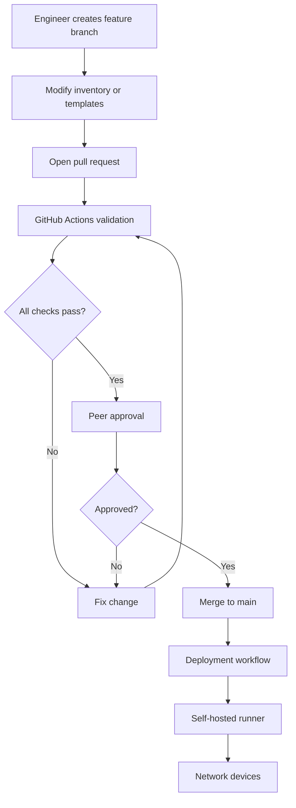

# GitHub Branch Protection and Rulesets Guide

> Supplied topic: Setting up branch protection in GitHub  
> Primary documentation: https://docs.github.com/en/repositories/configuring-branches-and-merges-in-your-repository/managing-protected-branches  
> Rulesets documentation: https://docs.github.com/en/repositories/configuring-branches-and-merges-in-your-repository/managing-rulesets/about-rulesets  
> Available rules: https://docs.github.com/en/repositories/configuring-branches-and-merges-in-your-repository/managing-rulesets/available-rules-for-rulesets  
> Creating rulesets: https://docs.github.com/en/repositories/configuring-branches-and-merges-in-your-repository/managing-rulesets/creating-rulesets-for-a-repository  
> Status checks: https://docs.github.com/en/pull-requests/reference/status-checks

## Overview

Branch protection prevents important branches such as `main` from being changed in unsafe ways. Typical protections require work to arrive through a pull request, require approvals, require automated checks to pass, block force pushes, prevent deletion, and optionally require signed commits or a linear history.

GitHub now provides two related mechanisms:

1. **Classic branch protection rules** — the long-standing per-repository protection mechanism.
2. **Repository rulesets** — the newer and generally more flexible policy system. Rulesets can target branches or tags, support bypass lists, expose rule insights, and layer with other rulesets and existing branch protection rules.

For a new setup, **rulesets are usually the better starting point** unless you specifically need to maintain an existing classic branch-protection configuration.

## Source coverage

This guide covers:

- Repository rulesets
- Classic protected branches
- Pull-request requirements
- Required approvals
- Required status checks
- Conversation resolution
- Signed commits
- Linear history
- Force-push and deletion protection
- Bypass permissions
- Merge queues and deployment gates
- Recommended settings for infrastructure and network-automation repositories
- Validation and troubleshooting

## Availability and prerequisites

GitHub documents that rulesets are available:

- For **public repositories** on GitHub Free and GitHub Free for organizations.
- For **public and private repositories** on GitHub Pro, GitHub Team, and GitHub Enterprise Cloud.

To create or modify repository rulesets, you need repository **admin** access or a custom role with permission to edit repository rules.

Protected branches are also available for public repositories on GitHub Free and for private repositories on paid plans that include the feature.

## Rulesets versus classic branch protection

| Capability | Rulesets | Classic branch protection |
|---|---|---|
| Protect branches | Yes | Yes |
| Protect tags | Yes | No |
| Multiple policies can layer | Yes | Limited |
| Bypass actors | Yes | Yes, depending on rule/type |
| Rule insights/visibility | Yes | Less flexible |
| Restrict file paths/extensions/sizes with push rulesets | Yes, supported plans/use cases | No |
| Recommended for new policy design | Usually | Mainly for existing setups |

### Important behavior: rule layering

If several rulesets target the same branch, GitHub aggregates them. If the same rule is defined differently, the **most restrictive effective requirement applies**.

Rulesets also layer with classic branch-protection rules. This means an old branch-protection rule can still affect a branch even after a new ruleset is created.

## Recommended protection policy for `main`

For a production-oriented repository, a strong baseline is:

- Require a pull request before merging.
- Require at least **1 approval** for a personal/small-team repository or **2 approvals** for higher-risk production changes.
- Dismiss stale approvals when new commits are pushed.
- Require approval of the most recent reviewable push when appropriate.
- Require status checks to pass before merging.
- Require conversation resolution before merging.
- Block force pushes.
- Restrict branch deletion.
- Apply rules to administrators as well, unless you have a carefully controlled bypass policy.
- Optionally require signed commits.
- Optionally require linear history.
- Optionally require successful deployment to a staging environment before merge.
- Consider a merge queue for busy repositories with frequent concurrent pull requests.

For a GitOps/network-automation repository, also consider required checks for:

```text
YAML lint
JSON/YAML schema validation
Jinja2 template rendering
Python linting/unit tests
Ansible lint
Terraform validate/plan
Batfish validation
pyATS tests
Configuration diff validation
Vendor-specific syntax checks
Secret scanning
CodeQL / code scanning where applicable
```

## GUI setup using repository rulesets

### 1. Open repository settings

Navigate to the repository and select:

**Settings** → **Rules** → **Rulesets**


**What this image shows:** The repository settings navigation with **Rules → Rulesets** selected.

**What matters:** Rulesets are configured under the repository's code-and-automation settings, not under the normal branch dropdown.

**What to verify:** Confirm you have permission to edit rules and that you are changing the intended repository.

### 2. Create a branch ruleset

Select:

**New ruleset** → **New branch ruleset**

Give the ruleset a descriptive name, for example:

```text
Protect main
```

Set the enforcement status to **Active** when you are ready for the policy to take effect.

### 3. Define the target branch

Under the target branches section, add the default branch or explicitly target:

```text
main
```

If you use multiple protected release branches, you can use additional branch patterns as appropriate.

Examples:

```text
main
release/*
production/*
```

Be cautious with broad patterns. A ruleset targeting more branches than intended can unexpectedly block developer workflows.

### 4. Require pull requests

Enable **Require a pull request before merging**.

Recommended settings for a production repository:

```text
Required approvals: 1 or 2
Dismiss stale pull request approvals: Enabled
Require review from Code Owners: Enable when CODEOWNERS is used
Require approval of the most recent reviewable push: Consider enabling
```

Why this matters: direct pushes bypass the normal review-and-validation process. Requiring pull requests moves changes through a visible review path.

### 5. Require status checks

Enable **Require status checks to pass before merging**.

Then add the exact checks you want to enforce, such as:

```text
lint
unit-tests
validate-configs
security-scan
batfish-validation
```

GitHub Actions creates **checks** that can be selected as required status checks.

If you enable **Require branches to be up to date before merging**, the pull request must be tested against the latest target branch state. GitHub documents that a required check must be configured for this setting to take effect.

### 6. Require conversation resolution

Enable **Require conversation resolution before merging**.

This prevents merging while review threads remain unresolved.

### 7. Block dangerous history changes

Enable or retain:

- **Block force pushes**
- **Restrict deletions**

Blocking force pushes protects approved commit history from being rewritten after review. Preventing deletion protects long-lived branches from accidental removal.

### 8. Optional: require signed commits

Enable **Require signed commits** if you want GitHub to require cryptographically verified commits.

This provides stronger authorship and integrity assurance, but it adds operational requirements for contributors and automation accounts.

### 9. Optional: require linear history

Enable **Require linear history** if you want to prohibit merge commits on the protected branch.

GitHub requires the repository to allow squash merging or rebase merging before this rule can be used.

A linear history can make the repository easier to audit and revert, but it changes the merge model.

### 10. Optional: require deployments before merge

If you use GitHub Environments and deployment workflows, enable **Require deployments to succeed before merging**.

This can implement a pipeline such as:

```text
Pull request
    |
    v
Lint / validate / test
    |
    v
Deploy to lab or staging
    |
    v
Automated validation
    |
    v
Approval
    |
    v
Merge to main
```

For network automation, this can be valuable when a lab, virtual topology, or staging environment is available.

### 11. Configure bypass permissions carefully

Rulesets can allow selected users, teams, roles, or GitHub Apps to bypass rules.

Keep bypass access small. A common mistake is granting broad administrator bypass and then relying on human discipline rather than policy enforcement.

A safer model is:

```text
Normal engineers  -> no bypass
Automation bot    -> only required bypasses
Repository admins -> bypass only if operationally necessary
Emergency process -> documented and auditable
```

## Classic branch protection procedure

If you use classic protection instead of rulesets:

1. Open the repository.
2. Select **Settings**.
3. Select **Branches**.
4. Under branch protection rules, create a rule.
5. Set the branch name pattern, commonly `main`.
6. Enable the protections you need.

Typical options include:

- Require a pull request before merging.
- Require approvals.
- Require status checks.
- Require conversation resolution.
- Require signed commits.
- Require linear history.
- Require merge queue.
- Require deployments to succeed before merging.
- Lock the branch if a read-only branch is needed.

## Suggested policy for a network GitOps repository

For a repository that acts as a network configuration source of truth, consider this workflow:



### Recommended required checks

```text
validate-yaml
render-templates
python-tests
ansible-lint
batfish
config-policy
secret-scan
```

The key design principle is that **branch protection decides whether a change may enter the source-of-truth branch**. The deployment workflow should separately decide whether and how an approved change is pushed to the network.

## CODEOWNERS integration

A `CODEOWNERS` file can automatically request specific reviewers for sensitive paths.

Example:

```text
# Core routing templates
/templates/bgp/       @network-core-team
/templates/ospf/      @network-core-team

# Firewall policy
/firewalls/            @security-team

# GitHub Actions
/.github/workflows/    @automation-team
```

With the pull-request rule set to **Require review from Code Owners**, changes to these paths require the designated owner review.

## Status-check behavior

A required status check must succeed before GitHub allows the pull request to merge.

GitHub distinguishes between:

- **Checks** — detailed check runs, commonly produced by GitHub Actions or GitHub Apps.
- **Commit statuses** — simpler status values produced by integrations or API clients.

One important detail: GitHub documents that a skipped GitHub Actions job reports as **Success**, so a skipped job does not block a merge merely because it is configured as a required check. Workflow conditions therefore need careful design.

## Merge queue

A merge queue is useful when many approved pull requests are waiting to merge. It helps ensure that a pull request remains valid when tested in sequence with other queued changes.

Without a queue, two pull requests can independently pass CI and then conflict logically when merged one after another.

For small repositories, a merge queue may be unnecessary. For high-change infrastructure repositories, it can significantly reduce race conditions.

## Verification

After creating the ruleset, test it instead of assuming it works.

### Test 1: direct push

Try to push directly to `main` from a non-bypass account.

Expected result:

```text
Push rejected if the ruleset prohibits direct updates.
```

### Test 2: pull request without approval

Open a pull request.

Expected result:

```text
Merge blocked until required approvals are present.
```

### Test 3: failing CI check

Intentionally make a test branch fail one required check.

Expected result:

```text
Merge blocked because the required status check is failing.
```

### Test 4: unresolved review thread

Leave a review conversation unresolved.

Expected result:

```text
Merge blocked when conversation resolution is required.
```

### Test 5: force push

Attempt a force push to the protected branch from a non-bypass account.

Expected result:

```text
Force push rejected.
```

## Common mistakes

### Protecting the wrong pattern

A ruleset configured for `master` does nothing for a repository whose default branch is `main`.

**Verify:** the exact branch target.

### Creating a ruleset but leaving it disabled

Rulesets have an enforcement state. A correctly configured but disabled ruleset does not enforce the policy.

**Verify:** enforcement is **Active**.

### Required checks never appear

A status check often needs to have run in the repository before it can be conveniently selected/configured as a required check.

**Verify:** the corresponding GitHub Actions workflow has executed and the check name is correct.

### Allowing administrators to bypass everything

This can make the policy largely procedural rather than technical.

**Verify:** bypass permissions are intentionally limited.

### Requiring “up to date” without a required check

GitHub documents that the up-to-date requirement only takes effect when a required status check has been defined.

### Overlapping rulesets

Two rulesets may both target `main`. GitHub aggregates them, with the most restrictive applicable rule taking effect.

**Verify:** inspect every active ruleset targeting the branch.

### Mixing classic protection and rulesets without reviewing both

Classic branch protection and rulesets can both apply at the same time.

**Verify:** inspect both configuration areas when behavior seems more restrictive than expected.

## Troubleshooting

### Symptom: I cannot merge even though my new ruleset looks correct

**Check:** whether another active ruleset or classic branch-protection rule also targets the branch.

**Expected success:** all effective policies are understood.

**Failure meaning:** another rule may be imposing additional requirements.

**Next action:** inspect the branch's effective rules and ruleset insights.

### Symptom: required check is stuck or missing

**Check:** GitHub Actions workflow trigger and job name.

**Expected success:** the required check runs for the pull request's head commit.

**Failure meaning:** the workflow may not trigger on `pull_request`, the job may be conditionally skipped, or the required check name may not match.

**Next action:** inspect the Actions run and the exact check names on the pull request.

### Symptom: admins can still merge around policy

**Check:** bypass permissions and administrator enforcement.

**Expected success:** only explicitly authorized actors can bypass.

**Failure meaning:** an administrator or role has bypass access.

**Next action:** tighten bypass settings.

### Symptom: developers cannot rename or update the default branch

**Check:** whether force pushes/updates are blocked by a ruleset and whether the actor has bypass permission.

**Expected success:** administrative branch changes are performed by an authorized actor.

**Failure meaning:** the policy is intentionally preventing the operation.

**Next action:** temporarily use an authorized bypass process rather than disabling protections globally.

## Configuration summary

A strong baseline for `main` is:

```text
Target: main
Enforcement: Active
Require pull request: Yes
Approvals: 1-2
Dismiss stale approvals: Yes
Require status checks: Yes
Require conversation resolution: Yes
Block force pushes: Yes
Restrict deletion: Yes
Require signed commits: Optional
Require linear history: Optional
Require deployment: Optional
Merge queue: Optional
Bypass: Minimal
```

For a network-source-of-truth repository, the most valuable controls are usually:

```text
Pull request required
+ peer approval
+ required CI validation
+ no direct push to main
+ no force push
+ no deletion
+ tightly controlled bypass
```

## Key takeaways

- GitHub **rulesets** are the modern, flexible way to protect branches and tags.
- Classic branch protection still works and may coexist with rulesets.
- Requiring pull requests without requiring automated checks leaves a major gap.
- Required status checks are especially valuable for infrastructure-as-code and network automation.
- Rulesets can layer; the most restrictive effective rule wins when policies overlap.
- Protecting `main` should be paired with a tested pull-request workflow, not treated as a checkbox exercise.
- In GitOps, branch protection guards the source of truth; deployment authorization should remain a separate controlled step.

## Sources

- https://docs.github.com/en/repositories/configuring-branches-and-merges-in-your-repository/managing-protected-branches
- https://docs.github.com/en/repositories/configuring-branches-and-merges-in-your-repository/managing-protected-branches/managing-a-branch-protection-rule
- https://docs.github.com/en/repositories/configuring-branches-and-merges-in-your-repository/managing-rulesets/about-rulesets
- https://docs.github.com/en/repositories/configuring-branches-and-merges-in-your-repository/managing-rulesets/creating-rulesets-for-a-repository
- https://docs.github.com/en/repositories/configuring-branches-and-merges-in-your-repository/managing-rulesets/available-rules-for-rulesets
- https://docs.github.com/en/repositories/configuring-branches-and-merges-in-your-repository/managing-rulesets/managing-rulesets-for-a-repository
- https://docs.github.com/en/pull-requests/reference/status-checks
- https://docs.github.com/en/rest/branches/branch-protection
