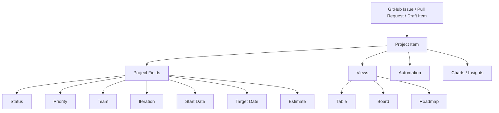
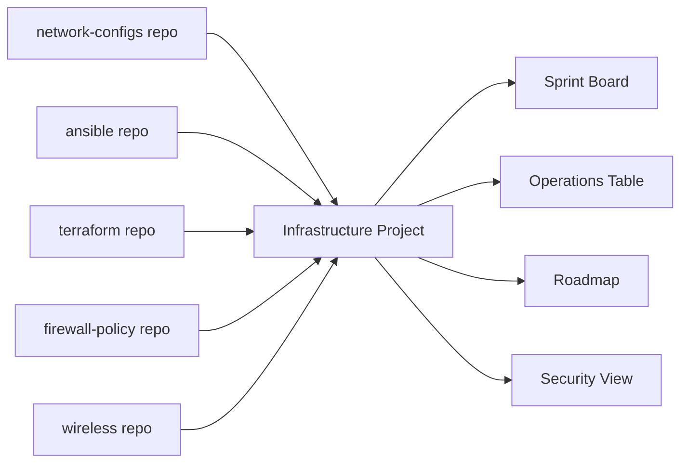
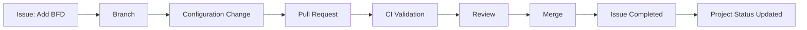
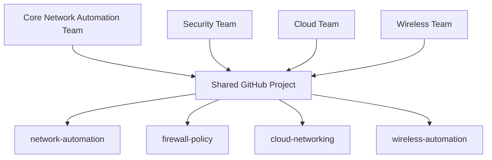
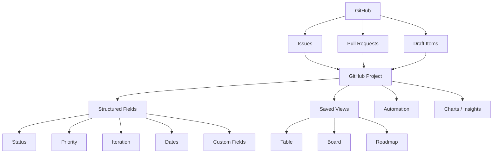

# GitHub Projects vs Projects (classic): Advantages, Differences, and Migration

> **Current as of August 30, 2026**
>
> **Primary sources**
> - https://docs.github.com/en/issues/planning-and-tracking-with-projects
> - https://docs.github.com/en/issues/planning-and-tracking-with-projects/learning-about-projects/about-projects
> - https://docs.github.com/en/issues/planning-and-tracking-with-projects/customizing-views-in-your-project/changing-the-layout-of-a-view
> - https://docs.github.com/en/issues/planning-and-tracking-with-projects/learning-about-projects/best-practices-for-projects
> - https://github.blog/changelog/2024-05-23-sunset-notice-projects-classic/
> - https://docs.github.com/en/graphql/overview/breaking-changes
>
> **Important:** GitHub Projects (classic) is no longer the active product on GitHub.com. GitHub sunset Projects (classic) on **August 23, 2024** and automatically migrated eligible unmigrated classic projects to the current Projects experience. GitHub Enterprise Server removed Projects (classic) in **GHES 3.17**. The REST API for Projects (classic) was sunset on **April 1, 2025**.

## Overview

GitHub has had two generations of project-management functionality:

1. **Projects (classic)** — the older card-and-column Kanban board.
2. **Projects** — the current planning system built around GitHub Issues and Pull Requests, with table, board, and roadmap views, custom fields, saved views, charts, automation, iteration planning, templates, and richer cross-repository tracking.

The simplest way to remember the difference is:

> **Projects (classic) was primarily a board. Current GitHub Projects is a lightweight work-management database with multiple views.**

For any new implementation in 2026, use **GitHub Projects**. Projects (classic) should be viewed only as a historical product or a migration concept.

## Executive comparison

| Capability | GitHub Projects | Projects (classic) |
|---|---|---|
| Current product | **Yes** | **No — retired** |
| GitHub.com availability | Yes | Sunset Aug. 23, 2024 |
| GHES availability | Current Projects supported by applicable GHES versions | Removed in GHES 3.17 |
| Primary data model | Items + fields + views | Cards + columns |
| Table/spreadsheet view | **Yes** | No |
| Kanban board | **Yes** | Yes |
| Roadmap/timeline | **Yes** | No |
| Multiple saved views | **Yes** | Limited/no equivalent |
| Custom fields | **Yes** | Very limited metadata model |
| Iteration/sprint fields | **Yes** | No native equivalent |
| Date fields | **Yes** | No native equivalent |
| Number fields | **Yes** | No native equivalent |
| Single-select fields | **Yes** | Column/category model |
| Multi-select fields | **Yes** in current Projects | No |
| Filter/group/sort | **Extensive** | Basic |
| Charts/insights | **Yes** | Limited |
| Project templates | **Yes** | Limited classic templates/workflows |
| Cross-repository planning | **Strong** | Possible but much less flexible |
| Draft planning items | **Yes** | Notes/cards |
| Status updates | **Yes** | No comparable current feature set |
| Automation | **Built-in workflows + API/Actions options** | Classic automation presets |
| GitHub API direction | Current GraphQL/Projects APIs | Classic APIs retired/deprecated |
| Recommended for new work | **Yes** | **No** |

## 1. Projects (classic): what it was

Projects (classic) used a traditional Kanban model.

```text
+----------------+----------------+----------------+
|     To do      |  In Progress   |      Done      |
+----------------+----------------+----------------+
| Issue #21      | Issue #18      | Issue #11      |
| Upgrade IOS-XE | Test BGP BFD   | Add NTP        |
|                |                |                |
| Note: research | PR #44         | Issue #12      |
+----------------+----------------+----------------+
```

Work existed as **cards** placed into **columns**. Cards could represent issues, pull requests, or notes. The board itself carried much of the workflow meaning: moving a card from `To Do` to `In Progress` represented status.

This was intuitive, but restrictive because the column location was doing double duty as both visualization and data.

## 2. Current GitHub Projects: different architecture

Current Projects separates the **work item**, its **metadata**, and the **view used to visualize it**.



A single issue can have metadata such as:

```text
Status        = In Progress
Priority      = High
Team          = Network Automation
Iteration     = Sprint 12
Start Date    = 2026-08-31
Target Date   = 2026-09-04
Estimate      = 5
Environment   = Production
```

Different users can visualize the same underlying items differently without duplicating the work.

## 3. Biggest advantage: multiple views over one dataset

Current Projects lets you create multiple saved views over the same work.

### Operations view

```text
Filter: Status != Done
Group by: Device Type
Sort: Priority
```

### Engineering sprint view

```text
Filter: Iteration = @current
Group by: Status
Layout: Board
```

### Management roadmap

```text
Layout: Roadmap
Start: Start Date
End: Target Date
Group by: Program
```

### Security backlog

```text
Filter:
Team = Security
Priority = High
```

Projects (classic) could not model this nearly as cleanly because board columns were the primary organizational structure.

## 4. Table layout

The table layout behaves like a structured spreadsheet of issues, pull requests, draft issues, GitHub metadata, and custom project fields. You can add or hide fields, sort, filter, group, bulk-edit values, and save the configuration as a view.

| Issue | Status | Priority | Device | Iteration | Engineer |
|---|---|---|---|---|---|
| Add BFD to WAN | In Progress | High | C8500 | Sprint 8 | Mike |
| Update firewall rules | Ready | Medium | PA-5450 | Sprint 8 | Alex |
| Validate BGP policy | Backlog | High | C8500 | Sprint 9 | Sarah |
| Upgrade controller | Done | Medium | C9800 | Sprint 7 | Mike |

Projects (classic) had no equivalent rich tabular data model.

## 5. Board layout

Current Projects still provides Kanban. The important difference is that board columns are derived from a field such as `Status` or another single-select/iteration field.

```text
Backlog → Ready → In Progress → Review → Done
```

Dragging an item between columns updates the underlying field value. This is more powerful than using card location as the primary data structure.

## 6. Roadmap layout

A major capability absent from classic is **Roadmap**. GitHub's roadmap provides a timeline view based on date or iteration fields.

```text
August                       September
28  29  30  31   1   2   3   4   5

BGP redesign
    [=======================]

Firewall migration
            [========================]

Wireless upgrade
                    [==================]
```

You can visualize start dates, target dates, iterations, milestones, work distribution, and program timelines. You can also drag items on the timeline to adjust planning dates.

Classic mostly answered: **What state is this task in?** Modern Projects can also answer: **When should it happen? How long will it take? What overlaps? Which iteration owns it?**

## 7. Custom fields

Custom fields are one of the strongest reasons to use current Projects. Examples include:

```text
Priority
Risk
Customer
Device Type
Change Window
Environment
Site
Region
Team
Application
Estimate
Target Date
Sprint
```

For network engineering:

| Field | Example |
|---|---|
| Status | In Progress |
| Priority | P1 |
| Platform | Cisco Catalyst 9300 |
| Site | DAL-01 |
| Change Window | Sept 5 |
| Engineer | Mike |
| Risk | Medium |
| Validation | Batfish |
| Automation | Ansible |
| Target Date | 2026-09-05 |

Classic often forced users to encode this information in labels, titles, issue bodies, or columns.

## 8. Iterations and sprint planning

Projects supports iteration fields, which are useful for sprint planning.

```text
Sprint 21
Aug 31 – Sep 13

Sprint 22
Sep 14 – Sep 27

Sprint 23
Sep 28 – Oct 11
```

You can create views for `@current` and `@next` iterations. Classic had no proper iteration data model.

## 9. Advanced filtering

Current Projects supports richer filtering, grouping, and sorting. A project can span repositories such as:

```text
network-configs
network-automation
firewall-policies
wireless-controller
infrastructure-docs
```

while exposing views filtered by team, platform, priority, status, iteration, or other structured fields.

## 10. Cross-repository planning



This is especially useful for InnerSource and platform teams: repositories keep their ownership boundaries while program planning happens in one Project.

## 11. Automation

Projects supports built-in workflows and broader automation through GitHub Actions, APIs, GraphQL, GitHub CLI, and GitHub Apps.

Typical ideas:

```text
Issue added → Set Status = Todo
```

```text
Pull request merged → issue closes → project reflects updated state
```

```text
Issue reopened → workflow updates project status
```

This makes Projects useful as part of a DevOps or Infrastructure-as-Code workflow.

## 12. Insights and charts

Modern Projects can visualize project information with configurable charts, such as items by status, priority, repository, or iteration. Classic visually showed cards in columns but did not provide the same structured analytics model.

## 13. Templates

Organizations can create project templates. A network engineering template might define:

```text
Status
Priority
Risk
Platform
Environment
Site
Change Date
Rollback Tested
Owner
```

with views such as Backlog, Current Changes, Implementation Board, Management Roadmap, and Completed Changes.

## 14. Single source of truth

GitHub recommends Projects as a single source of truth when work already lives in GitHub Issues and Pull Requests.

Instead of maintaining:

```text
GitHub Issues + Spreadsheet + Trello + Email status + PowerPoint roadmap
```

you can often use:

```text
GitHub Issues / Pull Requests
            ↓
       GitHub Project
       /     |      \
   Table    Board   Roadmap
```

Projects does not replace Git itself or repository controls; it is the planning layer.

## 15. Projects and Pull Requests



This makes Projects a strong fit for GitOps.

## 16. Network automation example

Suppose GitHub is the source of truth for Cisco configurations. Repositories might include:

```text
network-configs
ansible-network
batfish-validation
network-documentation
```

One organization Project could be named `Enterprise Network Engineering` with fields for Status, Priority, Platform, Site, Engineer, Change Window, Iteration, Risk, and Validation Method.

A work item could be:

```text
Issue: Enable BFD between C8500 and PA-5450
Repository: network-configs
Status: In Progress
Priority: High
Platform: Cisco C8500 / Palo Alto PA-5450
Iteration: Sprint 34
Validation: Batfish + lab test
Target: September 6
```

Classic could show this work on a board, but modern Projects is much better for querying and reporting the metadata.

## 17. Historical advantages of Projects (classic)

Classic did have strengths: simplicity, immediate visual workflow, small-team usability, and low cognitive load. A `Todo | Doing | Done` board was easy to understand.

However, those historical advantages are no longer a reason to adopt it because GitHub retired the product.

## 18. Advantages of current GitHub Projects

The major advantages are:

1. Flexible data model
2. Multiple views over the same work
3. Table layout
4. Kanban layout
5. Roadmap layout
6. Custom fields
7. Iterations
8. Cross-repository planning
9. Filtering/grouping/sorting
10. Charts and insights
11. Project templates
12. Automation
13. Better enterprise scaling
14. Current API support
15. Ongoing GitHub investment

The key conceptual improvement is:

```text
Classic:
Board determines how work is organized.

Current Projects:
Structured data determines what work is;
views determine how you look at it.
```

## 19. Limitations of current Projects

Modern Projects is more powerful but requires more design. Teams need to decide fields, statuses, views, iterations, automation, and templates. Without governance, overlapping fields like `Priority`, `Urgency`, and `Severity` can become inconsistent.

GitHub Projects also is not necessarily a replacement for every specialized enterprise portfolio or service-management platform. Organizations with deep Jira, Azure Boards, or ServiceNow workflows may still need those tools.

## 20. GitHub Projects vs Jira

| Area | GitHub Projects | Jira |
|---|---|---|
| Native GitHub integration | Excellent | Integration required |
| Developer workflow | Excellent | Excellent with integration |
| Simple setup | Strong | Can be heavier |
| Custom fields | Strong | Very strong |
| Enterprise workflow engine | Moderate/strong | Very strong |
| Portfolio management | Improving | Mature |
| Source-code proximity | Excellent | External |
| Infrastructure GitOps | Excellent fit | Common but less native |
| Issue/PR linkage | Native | Integration |
| Roadmaps | Yes | Yes |
| Scrum/Kanban | Flexible | Mature |

## 21. GitHub Projects in an InnerSource model



Each team can contribute through issues, branches, pull requests, reviews, CODEOWNERS, and CI/CD while a Project provides shared planning across repository boundaries.

## 22. Classic retirement timeline

GitHub announced the sunset in May 2024.

### GitHub.com

```text
May 23, 2024
Creation of new classic projects disabled.
Migration tooling/banner available.

August 23, 2024
Projects (classic) officially sunset.
Eligible unmigrated projects automatically migrated.
```

GitHub noted that automatic migration only included cards updated within the previous year and had exceptions where Projects had been disabled at the organization level.

### REST API

```text
April 1, 2025
Projects (classic) REST API sunset.
```

### GitHub Enterprise Server

```text
GHES 3.14
Classic marked for deprecation.

GHES 3.17
Projects (classic) removed.
```

### GitHub CLI

GitHub later noted that CLI versions older than **2.82.1** would fail to fetch projects after **October 22, 2025**, so current CLI versions should be used.

## 23. Migration concept

Historically, migration changed the model from:

```text
Classic Project → Columns → Cards
```

to:

```text
Current Project → Items → Fields → Views
```

A classic `In Progress` column maps conceptually to `Status = In Progress`, and a board view groups on Status. The same Status field can now also be used in tables, roadmaps, filters, charts, and automation.

## 24. Recommended design for a new Project

Start small with:

```text
Status
Priority
Owner
Iteration
Target Date
```

For network engineering, add fields such as Platform, Environment, Site, Risk, and Change Window only when they support an actual workflow or report.

## 25. Example recommended views

### Backlog

```text
Layout: Table
Filter: Status = Backlog
Sort: Priority
```

### Current sprint

```text
Layout: Board
Filter: Iteration = @current
Columns: Status
```

### Change calendar

```text
Layout: Roadmap
Dates: Start Date / Target Date
```

### High-risk work

```text
Layout: Table
Filter: Risk = High
Status != Done
```

### My work

```text
Layout: Table
Filter: assignee:@me
Status != Done
```

## 26. Common mistakes

- Recreating classic Projects exactly instead of using structured fields.
- Creating too many fields before understanding the workflow.
- Creating a separate Project for every repository and recreating silos.
- Duplicating detailed issue content in project fields.
- Using labels for every project-management property when a field would be cleaner.
- Assuming Projects replaces branch protection, rulesets, CODEOWNERS, PR review, Actions, scanning, or deployment controls.

## 27. Troubleshooting

### Issue does not appear in expected view

Check whether the issue is actually added to the Project, whether it satisfies the view filter, whether required fields are missing, whether it is archived, and whether the user has access to the underlying repository.

### Item appears in table but not board

Check the field used for board columns. If the board groups by `Status` and Status is empty, the item may appear outside the expected column grouping.

### Item missing from roadmap

Verify that Start Date, Target Date, or Iteration is populated and that the roadmap view is configured to use those fields.

### Automation does not update a field

Verify the workflow is enabled, the trigger is correct, the item is in the project, the field still exists, and Actions/API credentials have sufficient permissions.

### Legacy script fails

Determine whether it uses retired classic concepts such as `Project`, `ProjectColumn`, or `ProjectCard`. Modern integrations should use the current Projects APIs/tooling.

## 28. Current Projects architecture summary



## Final recommendation

For new deployments:

> **Use current GitHub Projects. Do not design anything around Projects (classic).**

Projects (classic) matters only for historical documentation, old integrations, or understanding a migration.

For a GitHub-based network automation/InnerSource environment, an organization-level Project provides a strong shared planning layer across repositories while Issues and Pull Requests remain the units of engineering work.

```text
Repositories = where code/configuration lives
Issues       = what needs to be done
Pull Requests = proposed implementation/change
Projects     = planning and coordination
Actions      = automated validation/deployment
Rulesets/CODEOWNERS = governance and change control
```

## Key takeaways

1. Projects (classic) is retired.
2. Current Projects is the sensible choice for new GitHub planning workflows.
3. Classic was primarily a Kanban board.
4. Current Projects uses structured items, fields, and saved views.
5. Current Projects supports table, board, and roadmap layouts.
6. Custom fields and iterations provide much richer planning.
7. Cross-repository Projects are valuable for platform, DevOps, and InnerSource teams.
8. Projects integrates naturally with Issues and Pull Requests.
9. Projects is a planning layer, not a replacement for Git governance or CI/CD.
10. Older scripts using classic Project/Card/Column APIs should be migrated.

## Sources

- GitHub Docs — Planning and tracking with Projects  
  https://docs.github.com/en/issues/planning-and-tracking-with-projects

- GitHub Docs — About Projects  
  https://docs.github.com/en/issues/planning-and-tracking-with-projects/learning-about-projects/about-projects

- GitHub Docs — Changing the layout of a view  
  https://docs.github.com/en/issues/planning-and-tracking-with-projects/customizing-views-in-your-project/changing-the-layout-of-a-view

- GitHub Docs — Best practices for Projects  
  https://docs.github.com/en/issues/planning-and-tracking-with-projects/learning-about-projects/best-practices-for-projects

- GitHub Docs — Customizing the roadmap layout  
  https://docs.github.com/en/issues/planning-and-tracking-with-projects/customizing-views-in-your-project/customizing-the-roadmap-layout

- GitHub Changelog — Sunset Notice: Projects (classic)  
  https://github.blog/changelog/2024-05-23-sunset-notice-projects-classic/

- GitHub Docs — GraphQL breaking changes  
  https://docs.github.com/en/graphql/overview/breaking-changes

- GitHub Changelog — Timestamp fields in GitHub Projects  
  https://github.blog/changelog/2026-05-15-timestamp-fields-in-github-projects/
