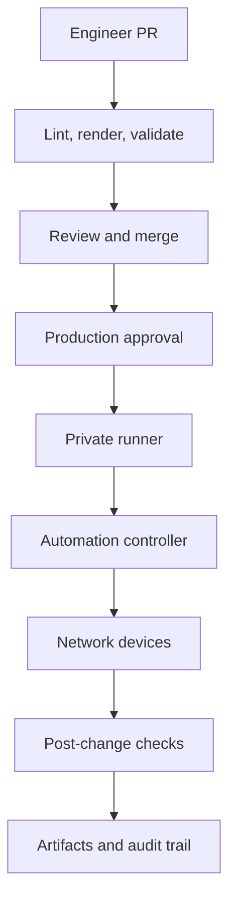
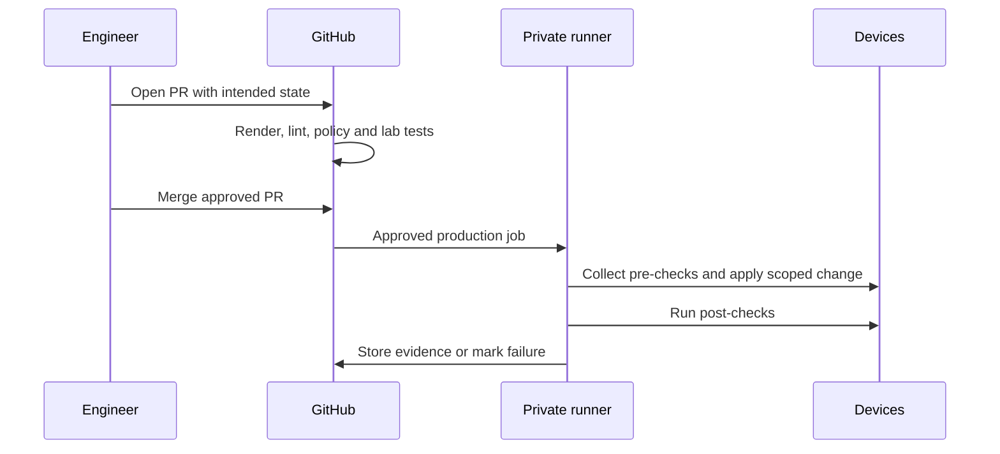

# Network Automation Using GitHub

> A practical GitOps / NetDevOps guide for making GitHub the reviewed source of truth for network configuration and safely deploying changes to Cisco and other network platforms.
>
> Supplied topic: Network automation using GitHub
>
> Primary sources: [GitHub Actions environments](https://docs.github.com/actions/deployment/targeting-different-environments/using-environments-for-deployment), [GitHub Actions secure use](https://docs.github.com/en/actions/reference/security/secure-use), [GitHub Actions secrets](https://docs.github.com/actions/security-guides/using-secrets-in-github-actions), [Cisco automation with Ansible](https://developer.cisco.com/automation-ansible/), [Cisco infrastructure as code](https://developer.cisco.com/iac/)

## Overview

Yes—GitHub can be the source of truth for Cisco network configurations, and GitHub Actions can safely initiate configuration changes. The important qualifier is that GitHub should orchestrate a controlled automation system, rather than blindly SSHing a full configuration to every device after each commit.

The common model is:

1. Engineers change intended state in a branch or pull request (PR).
2. Continuous integration (CI) renders templates and validates syntax, policy, and topology intent.
3. Review and approval merge the PR.
4. A deployment workflow, normally from a protected branch and gated production environment, runs from a private runner that can reach the management network.
5. The automation tool calculates and applies a small, auditable change, validates the result, and records artifacts.



**What this diagram shows:** GitHub governs desired state and workflow, while a runner inside—or securely connected to—the management network performs device access.

**What matters:** production credentials are not exposed to PR validation, and a failed validation must stop before device mutation.

**What to verify:** the runner can reach only required management endpoints; engineers cannot bypass the PR and production-approval controls.

## What GitHub is—and is not—in this design

| Component | Responsibility | Not its job |
|---|---|---|
| Git repository | Versioned desired state, templates, inventories, tests, change history | Storing plaintext passwords or raw dynamic state |
| Pull request | Peer review, diff discussion, automated validation | An authorization to change production by itself |
| GitHub Actions | CI/CD workflow orchestration, evidence, approval gates | A replacement for a network controller or secrets manager |
| Runner | Executes automation code | A general-purpose jump host shared with untrusted PRs |
| Ansible / Nornir / Terraform / vendor API / NSO | Connects to devices and reconciles configuration | Source of intent unless it also commits discovered state back through review |
| Network controller | Optional vendor-aware abstraction, inventory, and API | An excuse to skip validation and rollback planning |

This is often called **GitOps** or **NetDevOps**. Git holds the intended configuration; an automated workflow makes the deployed network converge toward that reviewed intent.

## Recommended repository layout

```text
network-automation/
├── inventory/
│   ├── production.yml
│   └── lab.yml
├── group_vars/
│   ├── campus.yml
│   └── wan.yml
├── host_vars/
│   └── cat9k-dc1-01.yml
├── templates/
│   ├── iosxe_interfaces.j2
│   └── iosxe_bgp.j2
├── playbooks/
│   ├── validate.yml
│   ├── deploy.yml
│   └── backup.yml
├── tests/
│   ├── pyats/
│   └── policies/
├── docs/
└── .github/workflows/
    ├── ci.yml
    ├── deploy-lab.yml
    └── deploy-production.yml
```

Keep secret material outside this tree. Store references, not passwords—for example, a device name or vault path that the runner resolves at deployment time.

## Control plane versus data plane

Automation is a **management/control-plane** activity: API, NETCONF, RESTCONF, SSH, or a controller API conveys configuration and retrieves operational state. It does not carry end-user packets. A successful API response only confirms the management operation; it does not prove the forwarding/data plane works.

For every change, post-deployment tests should prove the relevant result: BGP neighbor state and route presence for routing; interface/VLAN state for switching; policy hit behavior for firewalls; tunnel and SLA state for SD-WAN.

## Cisco implementation choices

Cisco supports several automation paths. The right choice depends on platform and operational model.

| Target | Typical automation interface | GitHub-driven use |
|---|---|---|
| IOS XE / Catalyst | Ansible `cisco.ios` collection, NETCONF/RESTCONF, CLI transport | Render and apply interfaces, routing, ACLs; capture backups and show-command evidence |
| IOS XR | Ansible `cisco.iosxr`, NETCONF/gNMI/model-driven APIs | Service-provider routing intent and transactional/model-driven workflows |
| NX-OS | Ansible `cisco.nxos`, NX-API, NETCONF | Data-center VLAN, VRF, EVPN/VXLAN and routing changes |
| Meraki | Dashboard API / Ansible `cisco.meraki` | API-driven branch configuration and templates |
| Catalyst Center | APIs / Ansible collections | Intent, inventory, image, and template workflows |
| Cisco SD-WAN | vManage APIs / provider or Ansible tooling | Templates and policy deployment under CI gates |
| NSO | NSO RESTCONF/NETCONF/API | Service-model commits with validation and rollback controls |

Cisco’s automation material positions Ansible and infrastructure-as-code patterns across IOS XE, NX-OS, Meraki, SD-WAN, Catalyst Center, and other Cisco platforms. Exact module availability and device support are collection- and software-version-specific; validate in a lab against your target release before production use.

## A safe deployment pattern

### 1. Treat inventory and variables as intent

Use structured YAML/JSON to declare values such as interfaces, VLAN IDs, BGP neighbors, prefixes, or policy objects. Generate device-specific CLI/API payloads from templates. Avoid making raw full-device `running-config` files the primary editable format: they include volatile data, defaults, and device-local ordering that make review noisy and dangerous.

### 2. Validate in pull requests

PR checks should include:

- YAML and template linting
- Rendered configuration review/diff
- Schema validation (valid prefix, VLAN range, interface name, peer ASN)
- Policy-as-code checks (for example, block `0.0.0.0/0` redistribution unless an exception is present)
- Unit tests for Jinja filters and data models
- Lab or emulator tests where feasible
- A planned-change report listing target devices and intended commands

Do not allow a PR from a fork or an untrusted branch to access production secrets or a production-capable self-hosted runner.

### 3. Separate plan from apply

The most valuable operational safeguard is a two-step workflow:

- **Plan:** read state, render proposed configuration, and show the precise diff—no device changes.
- **Apply:** only after merge and approval, re-render from the merge commit, validate preconditions, apply the scoped change, then verify postconditions.

This prevents a reviewer from approving one change while a later branch commit deploys something else.

### 4. Gate production deployments

Create GitHub Environments such as `lab`, `staging`, and `production`. GitHub environments can require reviewers, restrict deployment branches, and control access to environment secrets. A job referencing a protected environment waits before it runs and before it can access that environment’s secrets.

Recommended production gate:

| Control | Recommendation |
|---|---|
| Trigger | Only a merge to protected `main`, or an explicit tagged release |
| Approval | Network-change approver not allowed to approve their own change where policy requires separation |
| Secrets | Environment-scoped only; never available to PR CI |
| Target scope | Explicit inventory limit, such as `--limit site-a` |
| Change window | Validate workflow input or external ITSM approval before apply |
| Evidence | Upload rendered diff, before/after checks, and task logs as artifacts |

### 5. Use a private, disposable runner

Devices on RFC 1918 management networks cannot normally be reached by GitHub-hosted runners. Use a hardened self-hosted runner or private networking option. Put it in a restricted management subnet with least-privilege firewall rules to device management interfaces and secret services.

GitHub cautions that self-hosted runners are not inherently clean ephemeral machines and can be persistently compromised. Prefer ephemeral runners (fresh VM/container per job), dedicated runner groups, branch restrictions, minimal token permissions, and no production runner access for untrusted workflow code.

## Example: GitHub Actions calling Ansible for Cisco IOS XE

This is an illustrative workflow skeleton—not a drop-in production file. It shows the control boundaries. Pin third-party actions to reviewed commit SHAs in a production implementation.

```yaml
name: Deploy approved IOS XE change

on:
  workflow_dispatch:
    inputs:
      site:
        description: Target inventory group
        required: true
        type: choice
        options: [site-a, site-b]

permissions:
  contents: read

jobs:
  validate:
    runs-on: ubuntu-latest
    steps:
      - uses: actions/checkout@<PINNED_COMMIT_SHA>
      - name: Install automation dependencies
        run: pip install -r requirements.txt
      - name: Lint and render
        run: ansible-playbook -i inventory/production.yml playbooks/validate.yml --limit ${{ inputs.site }}

  deploy:
    needs: validate
    runs-on: [self-hosted, network-production]
    environment: production
    concurrency:
      group: network-production-${{ inputs.site }}
      cancel-in-progress: false
    steps:
      - uses: actions/checkout@<PINNED_COMMIT_SHA>
      - name: Apply only the approved target scope
        env:
          ANSIBLE_VAULT_PASSWORD_FILE: /run/secrets/ansible-vault-password
        run: ansible-playbook -i inventory/production.yml playbooks/deploy.yml --limit ${{ inputs.site }}
      - name: Verify forwarding and control-plane state
        run: ansible-playbook -i inventory/production.yml playbooks/validate.yml --limit ${{ inputs.site }}
```

`environment: production` is the GitHub gate. `concurrency` prevents two changes to the same site from running at once. `--limit` deliberately constrains blast radius. A real design should source short-lived credentials from a secrets manager and should not place a vault password or device password in the repository.

### Illustrative Ansible task pattern

```yaml
- name: Deploy interface description with an idempotent resource module
  cisco.ios.ios_interfaces:
    config:
      - name: GigabitEthernet1/0/10
        description: "User access - Finance"
        enabled: true
    state: merged
```

Run it against a lab device first. Use resource modules and `state: merged`/equivalent carefully: understand exactly which objects are managed, and avoid replace/overridden modes until the source data fully describes the managed scope.

## Change lifecycle and rollback



### Rollback principles

- Make rollback a tested procedure, not merely `git revert`.
- Capture a pre-change configuration backup and relevant state.
- Prefer device/platform transaction features when available.
- Define objective failure criteria: neighbor down, expected route absent, loss above threshold, failed health check, or API commit failure.
- Decide whether rollback is automatic or requires an operator. Automatic rollback can reduce outage time but can also worsen an ambiguous incident.
- Revert through the same reviewed deployment workflow; avoid ad-hoc manual fixes except for emergency containment, then reconcile the repository immediately.

## Reconciliation and drift management

Manual changes will happen. Do not silently overwrite them. Run a scheduled, read-only job that collects sanitized configuration/state, normalizes it, and compares it to intent.

| Drift result | Recommended response |
|---|---|
| Expected operational value changed | Update inventory/state record through a PR if it represents a legitimate new baseline |
| Unauthorized config difference | Create an alert and investigate; do not automatically overwrite unless policy explicitly permits it |
| Device unreachable | Alert separately—lack of evidence is not proof of compliance |
| Generator/template mismatch | Fix the model and validate in lab before deployment |

For backups, a dedicated repository or encrypted object store is often better than mixing complete device configurations with declarative source files. Protect backups because they can contain usernames, SNMP strings, certificates, PSKs, and topology details.

## Secrets and identity

Never commit these to Git:

- Device usernames/passwords or SSH private keys
- SNMP community strings or SNMPv3 credentials
- VPN pre-shared keys, certificates, tokens, API keys
- Full unredacted configuration backups

Use environment-scoped secrets or, preferably, a secrets manager reachable from the runner. Give the deploy identity only the privileges required for its target platforms and sites. For cloud services, GitHub documents OpenID Connect (OIDC) as a way to obtain short-lived cloud credentials instead of storing long-lived cloud secrets. For on-prem devices, use a dedicated AAA identity and restrict it by TACACS+/RADIUS role, source IP, command authorization, and logging.

## Common mistakes

| Mistake | Why it fails | Better approach |
|---|---|---|
| GitHub Action SSHes directly from the public internet to routers | Requires exposed management access and broadens attack surface | Run deployments from a private management runner |
| Full `running-config` overwrite | Volatile lines and unknown defaults create large blast radius | Manage a defined feature scope with idempotent APIs/modules |
| Deploy on every push | A typo can enter production with no review | PR CI, protected branch, environment approval, explicit production trigger |
| Store credentials in YAML or GitHub repository variables | Secrets leak through commits, logs, forks, or access scope | Secret manager/environment secrets and masking; short-lived identity where possible |
| Use same runner for PRs and production | Untrusted code can compromise a persistent runner | Separate, ephemeral, restricted production runner group |
| Treat config success as service success | CLI/API success does not prove forwarding | Add post-checks tied to the requested network outcome |
| Ignore manual changes | Drift makes later automation surprises likely | Scheduled, read-only drift detection and a reconciliation process |

## Implementation roadmap

1. **Start read-only:** back up sanitized configs; collect facts, BGP/session state, interfaces, and inventory.
2. **Build a lab:** Cisco DevNet sandboxes, CML, or non-production equipment are useful for testing automation. Cisco publishes examples that use IOS XE sandbox environments for Ansible practice.
3. **Choose one small use case:** interface descriptions, NTP/DNS, an access VLAN, or a standard BGP neighbor template—not core routing redesign.
4. **Create PR validation:** lint structured data, render config, and publish a human-readable plan.
5. **Deploy to lab automatically:** confirm idempotence and post-checks.
6. **Introduce protected production environment:** dedicated runner, scoped target, approval, maintenance window, evidence, and rollback.
7. **Add drift detection and reusable workflows:** standardize controls as the number of sites and device types grows.

## Key takeaways

- GitHub is an excellent source of truth for reviewed network intent and audit history.
- GitHub Actions can reconfigure Cisco equipment, usually by invoking Ansible, an API client, or a controller integration from a private runner.
- A production design needs PR validation, protected branches, protected environments, least-privilege secrets, restricted/ephemeral runners, small blast radius, post-change verification, and rollback.
- Start declarative and read-only, prove a narrow workflow in a lab, then expand feature by feature.

## Sources

- GitHub Docs: [Managing environments for deployment](https://docs.github.com/actions/deployment/targeting-different-environments/using-environments-for-deployment)
- GitHub Docs: [Secure use reference](https://docs.github.com/en/actions/reference/security/secure-use)
- GitHub Docs: [Using secrets in GitHub Actions](https://docs.github.com/actions/security-guides/using-secrets-in-github-actions)
- GitHub Docs: [Security hardening your deployments](https://docs.github.com/actions/how-tos/secure-your-work/security-harden-deployments)
- GitHub Docs: [Deployments and environments](https://docs.github.com/en/actions/reference/workflows-and-actions/deployments-and-environments)
- Cisco DevNet: [Get started with Ansible tutorials with Cisco products](https://developer.cisco.com/automation-ansible/)
- Cisco DevNet: [Infrastructure as Code](https://developer.cisco.com/iac/)
- Cisco Code Exchange: [GitHub Actions configuration-backup example](https://developer.cisco.com/codeexchange/github/repo/wwt/network-config-scraper/)
- Cisco Code Exchange: [Ansible IOS XE Always-On Demo](https://developer.cisco.com/codeexchange/github/repo/barweiss45/Ansible-IOSXE-Always-On-Demo/)
