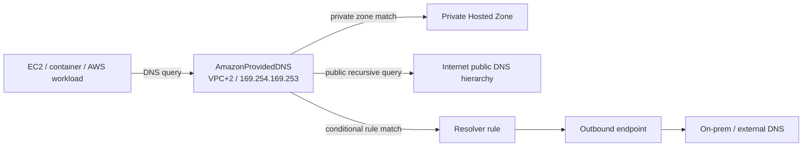
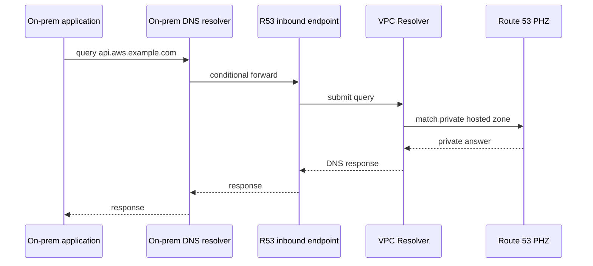
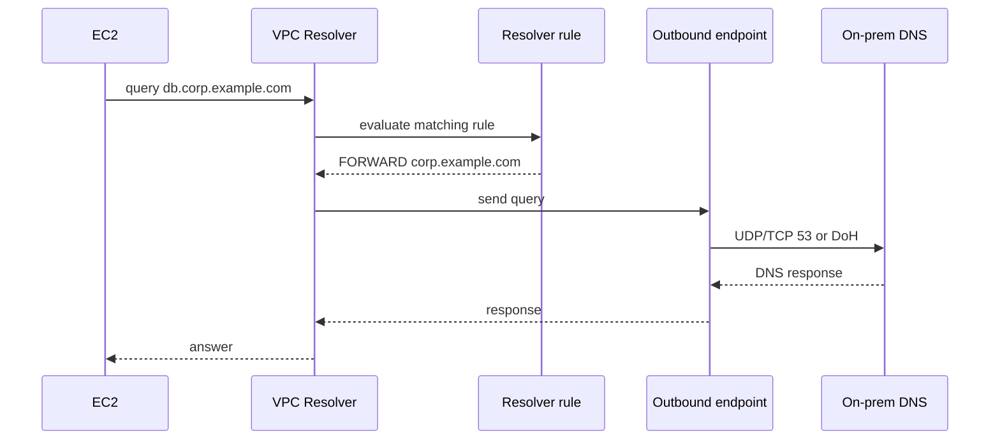
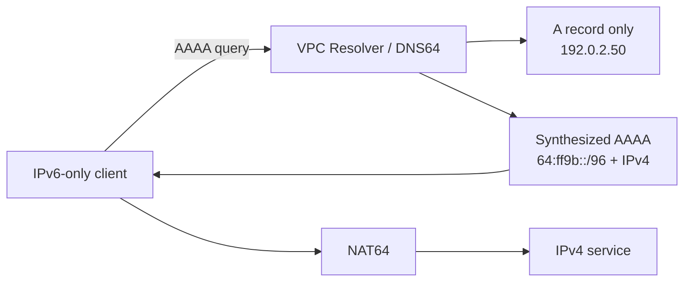
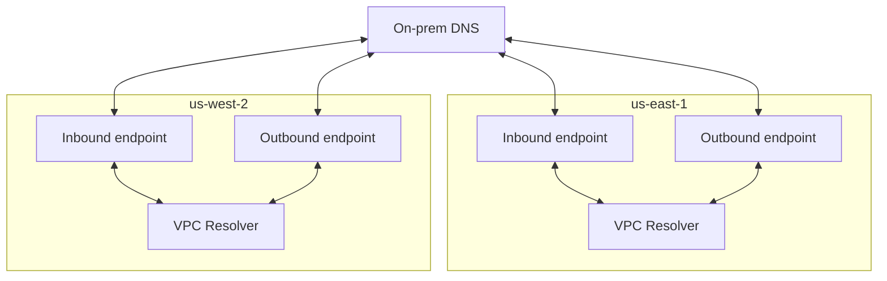
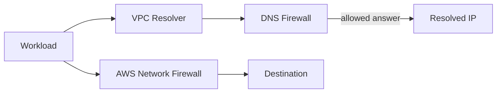
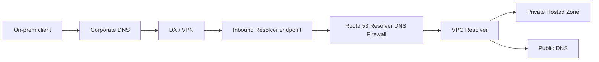
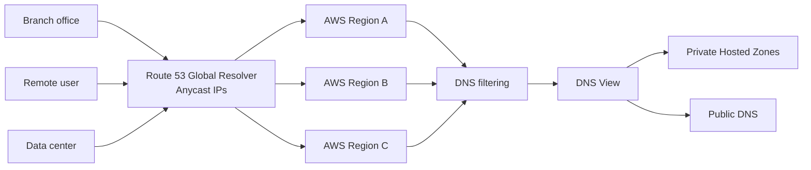
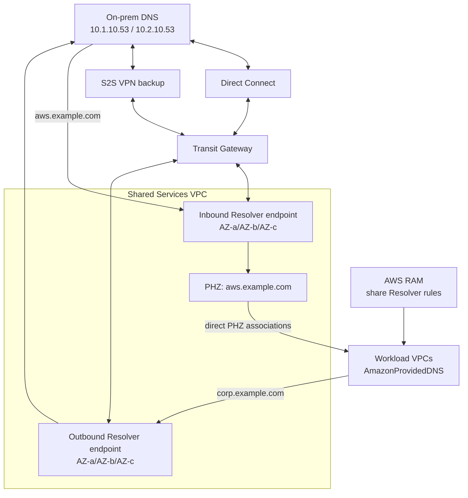
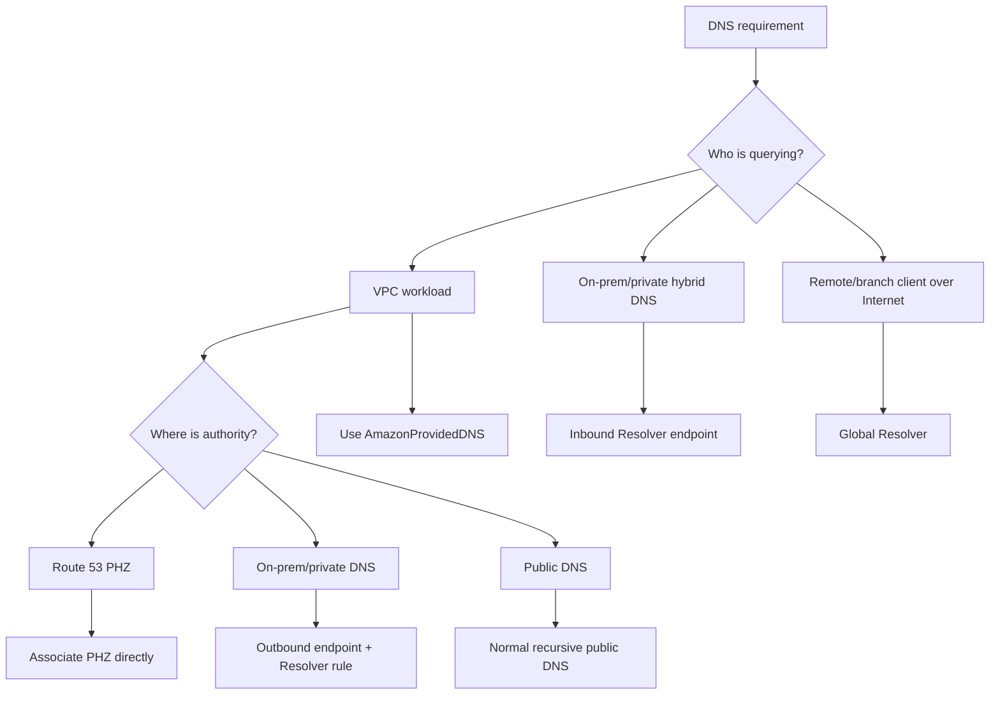

# AWS DNS for Network Experts
## Route 53 VPC Resolver, Inbound/Outbound Endpoints, Hybrid DNS, Private DNS, DNS Firewall, DNSSEC, Global Resolver, and Enterprise Design

> **Study-guide focus:** What an AWS Advanced Networking–level engineer should know about DNS in AWS, with emphasis on Amazon Route 53 VPC Resolver, hybrid DNS, inbound and outbound Resolver endpoints, Resolver rules, private hosted zones, centralized multi-account DNS, DNS security, scaling, resiliency, and troubleshooting.
>
> **Current context:** AWS renamed the former **Route 53 Resolver** service to **Route 53 VPC Resolver** after introducing **Route 53 Global Resolver**. Global Resolver became generally available in March 2026.
>
> **Source information vs. explanation:** Statements identified as source information are grounded in AWS documentation or AWS technical content. Additional explanation expands networking behavior without claiming undocumented AWS internals.

---

## Supplied topic

AWS DNS resolvers, inbound and outbound endpoints, and the DNS knowledge expected of an AWS networking expert.

## Key supporting URLs

1. https://docs.aws.amazon.com/vpc/latest/userguide/AmazonDNS-concepts.html
2. https://docs.aws.amazon.com/Route53/latest/DeveloperGuide/resolver.html
3. https://docs.aws.amazon.com/Route53/latest/DeveloperGuide/resolver-overview-DSN-queries-to-vpc.html
4. https://docs.aws.amazon.com/Route53/latest/DeveloperGuide/resolver-forwarding-inbound-queries.html
5. https://docs.aws.amazon.com/Route53/latest/DeveloperGuide/resolver-overview-forward-vpc-to-network-using-rules.html
6. https://docs.aws.amazon.com/Route53/latest/DeveloperGuide/resolver-choose-vpc.html
7. https://docs.aws.amazon.com/Route53/latest/DeveloperGuide/resolver-forwarding-inbound-queries-values.html
8. https://docs.aws.amazon.com/Route53/latest/DeveloperGuide/resolver-forwarding-outbound-queries-endpoint-values.html
9. https://docs.aws.amazon.com/Route53/latest/DeveloperGuide/outbound-delegation-tutorial.html
10. https://docs.aws.amazon.com/Route53/latest/DeveloperGuide/resolver-query-logs.html
11. https://docs.aws.amazon.com/Route53/latest/DeveloperGuide/resolver-dns-firewall.html
12. https://docs.aws.amazon.com/Route53/latest/DeveloperGuide/profiles.html
13. https://docs.aws.amazon.com/Route53/latest/DeveloperGuide/gr-what-is-global-resolver.html
14. https://docs.aws.amazon.com/Route53/latest/DeveloperGuide/gr-how-it-works.html
15. https://aws.amazon.com/blogs/networking-and-content-delivery/centralized-dns-management-of-hybrid-cloud-with-amazon-route-53-and-aws-transit-gateway/
16. https://aws.amazon.com/blogs/networking-and-content-delivery/how-to-achieve-dns-high-availability-with-route-53-resolver-endpoints/
17. https://aws.amazon.com/blogs/networking-and-content-delivery/integrating-your-directory-services-dns-resolution-with-amazon-route-53-resolvers/
18. https://aws.amazon.com/blogs/networking-and-content-delivery/securing-hybrid-workloads-using-amazon-route-53-resolver-dns-firewall/
19. https://aws.amazon.com/blogs/networking-and-content-delivery/streamline-hybrid-dns-management-using-amazon-route-53-resolver-endpoints-delegation/
20. https://aws.amazon.com/blogs/networking-and-content-delivery/encrypt-dns-queries-using-dns-over-https-doh-with-amazon-route-53-resolver-endpoints/
21. https://aws.amazon.com/about-aws/whats-new/2026/03/amazon-route-53-global-resolver/
22. https://aws.amazon.com/blogs/networking-and-content-delivery/shared-dns-views-for-multi-account-environments-with-amazon-route-53-global-resolver/

---

# 1. The mental model: AWS has multiple DNS roles

One of the biggest sources of confusion is treating “Route 53” as one DNS server. It is a family of DNS capabilities.

| Capability | Role | Typical client/source |
|---|---|---|
| Route 53 public hosted zone | Authoritative public DNS | Internet recursive resolvers |
| Route 53 private hosted zone (PHZ) | Authoritative private DNS visible to associated VPCs | VPC Resolver |
| Route 53 **VPC Resolver** | Recursive resolver built into VPCs | EC2, ECS, EKS nodes/pods depending on DNS configuration, managed AWS services |
| VPC Resolver **inbound endpoint** | Entry point from external/hybrid DNS into the VPC Resolver | On-premises resolver, another private DNS domain |
| VPC Resolver **outbound endpoint** | Exit path from VPC Resolver to external DNS servers | VPC clients resolving on-premises/private external zones |
| Resolver forwarding rule | Conditional forwarding policy | VPC Resolver |
| Resolver delegation rule | Authority/delegation-aware path through an outbound endpoint | VPC Resolver |
| Route 53 Resolver DNS Firewall | Filters DNS queries handled by VPC Resolver | VPC workloads and hybrid clients forwarded through inbound endpoints |
| Resolver query logging | DNS observability | VPC/endpoint queries |
| Route 53 Profiles | Centralized reusable VPC DNS configuration | Multi-account/multi-VPC environments |
| Route 53 Global Resolver | Internet-reachable anycast recursive resolver for authorized clients | Branches, remote users, data centers, distributed clients |

The architectural distinction to remember is:

- **Hosted zones are authoritative DNS data.**
- **VPC Resolver is recursive DNS resolution.**
- **Resolver endpoints are network integration interfaces for the recursive resolver.**
- **Resolver rules decide when recursion leaves AWS and goes to another DNS authority/resolver.**

---

# 2. AmazonProvidedDNS / VPC+2

Every VPC has access to the Route 53 VPC Resolver, also called **AmazonProvidedDNS**. AWS documents the resolver at:

- `169.254.169.253` for IPv4
- `fd00:ec2::253` for IPv6
- the primary IPv4 VPC CIDR **plus 2**

Example:

```text
VPC CIDR:     10.20.0.0/16
VPC Resolver: 10.20.0.2
Link-local:   169.254.169.253
```

The VPC Resolver can resolve EC2/VPC-specific names, Route 53 Private Hosted Zone records associated with the VPC, public DNS names through recursion, and names covered by associated Resolver rules.



**Expert rule:** Do not point every EC2 instance directly at inbound or outbound endpoint IPs. Endpoints are integration points around the VPC Resolver; they do not replace the normal per-VPC recursive resolver design.

---

# 3. VPC DNS attributes and DHCP options

Before troubleshooting higher layers, check the VPC DNS attributes:

- `enableDnsSupport`
- `enableDnsHostnames`

The VPC DHCP option set commonly advertises `AmazonProvidedDNS`. If an EC2 instance unexpectedly uses a corporate DNS server, inspect:

1. DHCP option set.
2. OS resolver configuration.
3. DHCP client behavior.
4. `systemd-resolved` / NetworkManager behavior on Linux.
5. Active Directory domain-join software that may have changed DNS.
6. Container or Kubernetes DNS configuration.

---

# 4. The core hybrid DNS problem

A hybrid enterprise usually has two authoritative worlds:

```text
On-premises:
corp.example.com
ad.example.com
legacy.internal

AWS:
aws.example.com
app.example.com
service.internal
PrivateLink private DNS names
AWS-generated service names
```

Without a deliberate integration design:

- AWS workloads cannot resolve private on-premises zones.
- On-premises clients cannot resolve Route 53 PHZ names.
- Active Directory can accidentally become a DNS choke point.
- recursive forwarding loops can occur.
- overlapping private namespaces can generate surprising answers.

Resolver endpoints are AWS’s managed mechanism for joining these DNS domains.

---

# 5. AWS official hybrid Resolver endpoint architecture


**What this image shows**

AWS’s hybrid DNS pattern places a Private Hosted Zone in a shared-services VPC, an **inbound** Route 53 Resolver endpoint for queries entering AWS, an **outbound** Route 53 Resolver endpoint for queries leaving AWS, conditional forwarding between AWS and corporate DNS, and private connectivity through VPN or Direct Connect.

**What matters**

- **Inbound:** external DNS → AWS VPC Resolver.
- **Outbound:** AWS VPC Resolver → external DNS.

**What to verify**

- The private hosted zone is associated with a VPC that can answer the inbound query.
- On-premises DNS forwards the AWS private suffix to **all** inbound endpoint IPs.
- Resolver rules for on-premises suffixes are associated with every VPC that needs them.
- The outbound endpoint can route to the target DNS servers.
- Security groups/NACLs allow the chosen DNS protocol.

Source page: https://docs.aws.amazon.com/whitepapers/latest/hybrid-cloud-dns-options-for-vpc/route-53-resolver-endpoints-and-forwarding-rules.html

---

# 6. Inbound Resolver endpoints

An **inbound endpoint** lets DNS queries coming from outside the normal VPC Resolver client path enter Route 53 VPC Resolver.

Typical sources include on-premises resolvers, enterprise Active Directory DNS, another private network, and hybrid or multi-cloud DNS infrastructure.



Inbound endpoint IP addresses come from selected VPC subnets. For normal private hybrid use, on-premises must have Layer 3 reachability to those IPs through Direct Connect, Site-to-Site VPN, Transit Gateway-connected hybrid architecture, or another supported private path.

The endpoint is not a traditional DNS appliance that happens to sit in a subnet. AWS creates endpoint network interfaces while the managed VPC Resolver performs the DNS service.

## High availability

Use multiple Availability Zones. Configure on-premises DNS to use **all inbound endpoint IP addresses**, not only one. For critical environments, AWS technical guidance recommends considering three AZs where available.

---

# 7. Default forwarding inbound vs delegation inbound

Modern Route 53 VPC Resolver supports more than the classic forwarder model.

## Default inbound endpoint

Classic use case:

```text
On-prem DNS:
aws.example.com -> conditional forward -> 10.100.10.53, 10.100.20.53
```

The on-premises resolver forwards queries to inbound endpoint IPs.

## Delegation inbound endpoint

AWS also supports DNS delegation use cases. Instead of only saying “forward queries for this suffix,” you can create a DNS authority/delegation relationship for a subdomain.

Conceptual example:

```text
Corporate DNS owns:
example.com

Delegated AWS subdomain:
aws.example.com

Parent authority:
aws.example.com NS -> Route 53 Resolver inbound delegation endpoint targets
```

This is useful when you want a real DNS namespace hierarchy rather than a mesh of conditional forwarders.

AWS documentation currently states that **Do53 is the only protocol available for delegation inbound endpoints**.

---

# 8. Outbound Resolver endpoints

An **outbound endpoint** lets the VPC Resolver send selected queries to external DNS resolvers such as BIND, Microsoft AD DNS, Infoblox, BlueCat, or DNS services in another cloud/private network.



The application continues to use `AmazonProvidedDNS`; it does not need to know that the final authority is on premises.

---

# 9. Resolver rules

Resolver rules are central to outbound DNS behavior.

## Auto-defined rules

AWS creates rules for certain AWS-specific namespaces to preserve normal AWS resolution behavior.

## Forwarding rules

A forwarding rule says: for this DNS namespace, forward matching queries through this outbound endpoint to these target resolver IP addresses.

```text
Domain: corp.example.com
Rule type: FORWARD
Outbound endpoint: rslvr-out-...
Targets:
  10.1.10.53
  10.2.10.53
```

## System rules

A system rule can override a broader forwarding rule for a more specific namespace.

Example:

```text
Forward:
example.com -> corporate DNS

System:
aws.example.com -> resolve locally through VPC Resolver
```

## Recursive rule

AWS documents an automatically created recursive rule called the **Internet Resolver**, which handles names not matched by other applicable rules.

---

# 10. DNS rule specificity

A useful operational mental model is to compare Resolver rule selection to prefix specificity in routing.

Suppose:

```text
Forward rule: example.com
System rule: aws.example.com
Forward rule: database.aws.example.com
```

The more specific DNS namespace can alter the resolution path:

```text
database.aws.example.com
        > aws.example.com
        > example.com
        > recursive/default behavior
```

This is a troubleshooting analogy, not a claim that AWS internally performs an IP-style longest-prefix lookup.

---

# 11. Outbound delegation rules

A forwarding rule and a delegation rule are not identical.

**Forwarding:** “If query name matches X, send it to resolver Y.”

**Delegation:** “If DNS authority/referral information says this subdomain is delegated, reach the delegated authoritative servers through the specified outbound endpoint.”

AWS documents an outbound delegation CLI pattern:

```cli
aws route53resolver create-resolver-rule \
  --region <REGION> \
  --creator-request-id <UNIQUE_REQUEST_ID> \
  --delegation-record <DOMAIN_NAME> \
  --name <RULE_NAME> \
  --rule-type DELEGATE \
  --resolver-endpoint-id <OUTBOUND_ENDPOINT_ID>
```

Then associate the rule with VPCs that need that behavior.

Delegation helps create a clean enterprise namespace such as:

```text
example.com
├── corp.example.com        on-premises
├── aws.example.com         Route 53 private DNS
└── research.example.com    another private authority
```

---

# 12. Centralized DNS in multi-account AWS

A common design uses a network/shared-services account containing inbound endpoint, outbound endpoint, Resolver rules, centralized logging, DNS Firewall controls, and sometimes PHZ ownership/associations. AWS Resource Access Manager (RAM) can share Resolver rules.


**What this image shows**

A shared-services VPC contains Resolver endpoint infrastructure and Route 53 VPC Resolver. Multiple application VPCs use shared forwarding rules, while private hosted zones can be associated across accounts. Hybrid connectivity is provided through Transit Gateway and VPN/Direct Connect.

**What matters**

AWS explicitly recommends **associating private hosted zones directly with the VPCs that need them** rather than using Resolver forwarding merely to make one VPC’s PHZ visible to another VPC. This avoids unnecessary forwarding dependencies, cost, cross-AZ dependency, and complexity.

**What to verify**

- Rule share exists in RAM.
- Consumer account accepted the RAM share when required.
- Resolver rule is associated with the correct VPC.
- PHZ is associated with intended VPCs.
- Central outbound endpoint has reachability to on-prem DNS.
- No overlapping namespace creates a more-specific-rule surprise.

Source: https://aws.amazon.com/blogs/networking-and-content-delivery/centralized-dns-management-of-hybrid-cloud-with-amazon-route-53-and-aws-transit-gateway/

---

# 13. Route 53 Profiles

Route 53 Profiles help standardize DNS configuration across VPCs and accounts. AWS documents Profile association for resources/settings including DNS Firewall rule groups, interface VPC endpoints, Resolver query logging configurations, reverse-DNS behavior, DNS Firewall failure mode, and DNSSEC validation configuration.

The design moves from repeated per-VPC work:

```text
for each VPC:
  associate rules
  associate query logging
  associate DNS firewall rules
  set DNSSEC validation
  manage private DNS controls
```

toward:

```text
Define DNS posture once
        ↓
Route 53 Profile
        ↓
Associate many VPCs
```

This is especially useful for landing zones and AWS Organizations.

---

# 14. Private Hosted Zones

A Route 53 Private Hosted Zone is authoritative private DNS data visible through associated private DNS contexts.

```text
Zone: prod.example.com

A:
api.prod.example.com -> 10.20.30.40

Alias:
db.prod.example.com -> internal load balancer

CNAME:
service.prod.example.com -> app.prod.example.com
```

A PHZ association is a **control-plane relationship**. A zone does not become visible merely because one VPC can route to another.

```text
VPC peering/TGW routing ≠ automatic private DNS visibility
```

Design network reachability and DNS namespace visibility separately.

---

# 15. Split-horizon / split-view DNS

AWS supports public and private versions of the same domain.

```text
Public hosted zone:
example.com
www.example.com -> public ALB

Private hosted zone:
example.com
www.example.com -> internal ALB
```

Internet clients can receive a public answer while VPC clients associated with the PHZ receive a private answer.

When “DNS works on my laptop but not in EC2,” ask which resolver each client used, whether a PHZ exists for the suffix, whether the PHZ is associated with the VPC, whether a more-specific Resolver rule applies, whether Global Resolver DNS Views are involved, and whether the laptop is using corporate/VPN/public DNS.

---

# 16. PrivateLink and private DNS

Interface VPC endpoints commonly depend on private DNS.

Conceptually:

```text
Public service hostname:
service.region.amazonaws.com

Inside VPC with Private DNS enabled:
service.region.amazonaws.com
     ↓
resolves to private IP addresses of interface endpoint ENIs
```

This lets applications keep using normal AWS service FQDNs while traffic is privately redirected to the interface endpoint.

Troubleshooting checklist:

- Is **Private DNS** enabled on the interface endpoint?
- Are VPC DNS attributes enabled?
- Is the client using AmazonProvidedDNS?
- Is corporate DNS overriding an AWS namespace?
- Is a forwarding rule catching `amazonaws.com` too broadly?
- Is the endpoint available in the client’s Region?
- Does the endpoint policy permit the operation?

---

# 17. Active Directory and AWS DNS

A naïve design points every VPC workload directly to AD DNS. That can break or complicate AWS service private names, create centralized bottlenecks, add inter-AZ/VPC traffic, and make AD a dependency for otherwise native AWS DNS resolution.

AWS technical guidance favors using VPC Resolver as the normal resolver and selectively forwarding AD zones to AD DNS when possible.


**What this image shows**

Workloads use `AmazonProvidedDNS`. A Resolver forwarding rule sends the AD namespace to AWS Managed Microsoft AD DNS IPs through an outbound Resolver endpoint. AWS-native names, PHZs, VPC endpoints, EFS names, and public names stay with AmazonProvidedDNS.

**What matters**

This preserves the distributed VPC Resolver as the default path while treating AD as authoritative only for its namespace.

**What to verify**

- The AD FQDN has a forwarding rule.
- Both AD DNS target IPs are present for redundancy.
- Resolver rule is associated with the VPC.
- Clients still use AmazonProvidedDNS.
- Do not create a loop where AD forwards the same AD zone back to VPC Resolver.

Source: https://aws.amazon.com/blogs/networking-and-content-delivery/integrating-your-directory-services-dns-resolution-with-amazon-route-53-resolvers/

---

# 18. DNS protocol: UDP, TCP, DoH, DoH-FIPS

DNS is not UDP-only.

## Do53

Classic DNS on port 53. UDP handles many normal queries; TCP is also required in DNS behavior for larger responses, retries, and other cases. Security design must allow the protocol behavior you need.

## DNS over HTTPS (DoH)

AWS supports DoH on Resolver endpoints. Benefits include encryption and protection of query contents from passive observation. Trade-offs include more session/cryptographic overhead and lower per-interface query capacity than UDP in AWS published guidance.

## DoH-FIPS

AWS documents DoH-FIPS for **inbound** endpoints. AWS also documents a known issue involving incorrect source-IP reporting in VPC Resolver query logging for DoH/DoH-FIPS inbound endpoints.

## Safe protocol transition

AWS warns against a disruptive direct switch from Do53-only to DoH-only. Safer migration:

```text
Do53 only
   ↓
Do53 + DoH
   ↓
verify clients moved
   ↓
DoH only
```

---

# 19. IPv6, dual-stack, DNS64, and NAT64

Modern Route 53 Resolver endpoints support IPv4/IPv6 configurations, including dual-stack choices. AWS also exposes DNS64 configuration for inbound endpoints.

DNS64 lets the resolver synthesize an AAAA record for an IPv4-only destination; NAT64 translates the traffic.



**DNS64** solves the name-to-synthesized-IPv6-address problem. **NAT64** solves packet translation. You need both for end-to-end IPv6-only → IPv4-only access.

---

# 20. Endpoint scaling and QPS

AWS technical guidance documents approximately **10,000 DNS queries per second per Resolver endpoint IP/ENI for UDP**, with actual capacity affected by query type, response size, target DNS server health, target response time, round-trip latency, protocol, and connection tracking.

DoH throughput is significantly lower than plain UDP in AWS guidance.

A particularly important networking detail: restrictive security-group behavior that causes connection tracking can reduce achievable Resolver endpoint QPS substantially. AWS’s HA post notes scenarios around **1,500 QPS**.

Therefore capacity is not simply:

```text
number of ENIs × 10,000
```

It is closer to:

```text
effective QPS =
f(
  protocol,
  response size,
  latency,
  target DNS performance,
  connection tracking,
  redundancy behavior,
  failure capacity
)
```

---

# 21. Capacity planning for failure

AWS’s HA guidance recommends planning for reduced capacity after an endpoint interface failure.

Simple model:

```text
(n - 1) × nominal per-interface capacity
```

Example:

```text
6 endpoint IPs
best-case single-interface-loss design capacity:
(6 - 1) × 10,000 = 50,000 QPS
```

This is an engineering model, not a guarantee of application throughput.

---

# 22. Outbound query redundancy behavior

AWS high-availability technical guidance describes VPC Resolver generating redundant outbound queries and forwarding through multiple active outbound endpoint interfaces.

Packet captures can therefore show multiple source endpoint addresses and repeated query traffic. Do not diagnose duplicate DNS packets as a forwarding loop until you determine whether the packets are normal Resolver redundancy behavior, retransmissions, low-TTL application behavior, or actual recursion loops.

---

# 23. Dedicated endpoint subnets

AWS HA guidance recommends dedicated endpoint subnets such as `/28` or `/27` with their own route table.

Benefits:

- clean route control
- simpler firewall/NACL design
- predictable IP consumption
- operational separation
- easier troubleshooting
- future ENI expansion

Example:

```text
Shared-services VPC 10.100.0.0/16

AZ-a resolver subnet 10.100.10.0/28
AZ-b resolver subnet 10.100.20.0/28
AZ-c resolver subnet 10.100.30.0/28
```

---

# 24. Security groups for Resolver endpoints

Resolver endpoint ENIs use security groups.

For Do53, consider both UDP/53 and TCP/53. For DoH, allow the configured HTTPS-based DNS behavior.

For hybrid DNS, restrict sources/destinations to approved DNS servers where appropriate, but understand the connection-tracking/performance trade-off. Verify return traffic and ensure NACLs do not silently block required traffic.

---

# 25. Routing requirements

Resolver endpoints are placed in subnets, so normal IP routing still matters.

Outbound example:

```text
Outbound endpoint ENI
    ↓
resolver subnet route table
    ↓
Transit Gateway / VGW / other next hop
    ↓
Direct Connect / VPN
    ↓
on-prem DNS target IP
```

Separate the planes when troubleshooting.

**Control plane**

- endpoint exists
- rule exists
- rule associated
- PHZ associated
- RAM sharing correct

**Data plane**

- route exists
- SG allows traffic
- NACL allows traffic
- DX/VPN/TGW path exists
- return path exists
- target DNS server is listening

---

# 26. Transit Gateway and DNS

Transit Gateway commonly centralizes the IP path toward shared Resolver endpoints, but TGW does not make private hosted zones visible.

```text
Transit Gateway = IP connectivity
Route 53 PHZ association = DNS namespace visibility
Resolver rules = DNS forwarding policy
RAM = cross-account sharing/control-plane distribution
```

---

# 27. Cross-Region design

Resolver endpoints are **Regional**.

For multi-Region enterprise design:

- deploy endpoints in each required Region,
- associate Regional Resolver rules,
- ensure private connectivity in each Region,
- design independent failure domains,
- avoid unnecessary cross-Region DNS dependencies.



Do not treat one Region’s Resolver endpoints as a global DNS service. For globally reachable recursive DNS from distributed external clients, evaluate **Route 53 Global Resolver**.

---

# 28. Query logging

Route 53 Resolver query logging can capture queries originating in selected VPCs, entering through inbound endpoints, using outbound endpoints for recursive resolution, and evaluated by DNS Firewall.

AWS documents fields such as Region, VPC ID, source IP, resource/instance identifiers where applicable, timestamp, queried name, and record type.

Query logging is useful for proving which resolver saw the query, identifying query name/type, distinguishing `NOERROR`, `NXDOMAIN`, and `SERVFAIL`, spotting repeated lookups, tracing DNS Firewall actions, and understanding hybrid paths.

---

# 29. Public hosted-zone logs vs Resolver query logs

Do not confuse authoritative public Route 53 query logging with recursive VPC Resolver query logging.

```text
Client -> VPC Resolver -> public authoritative Route 53
```

can involve two different observability perspectives:

1. recursive client-side Resolver query logging,
2. authoritative public-hosted-zone query logging.

---

# 30. DNS Firewall

Route 53 Resolver DNS Firewall filters DNS queries handled by VPC Resolver.

Use cases include blocking known malicious domains, allow-listing approved domains, alerting on suspicious domains, reducing DNS exfiltration risk, applying AWS-managed threat intelligence/domain lists, and enforcing centralized DNS policy.

AWS documents rule actions including:

- `ALLOW`
- `BLOCK`
- `ALERT`

---

# 31. DNS Firewall vs AWS Network Firewall

These controls solve different problems.

**DNS Firewall** asks: “What domains are applications allowed to resolve?”

**AWS Network Firewall** controls routed network/application traffic.



DNS policy and packet/application policy are complementary.

---

# 32. DNS Firewall failure mode

AWS documents a DNS Firewall failure mode choice: whether DNS should fail open or fail closed when DNS Firewall cannot evaluate a query. AWS technical guidance notes blocking/closed behavior as the default.

This should be an explicit architecture decision based on availability and security requirements.

---

# 33. Extending DNS Firewall to on-premises

AWS documents a hybrid pattern where on-premises DNS sends queries into a VPC Resolver inbound endpoint so DNS Firewall can apply policy.



This can centralize DNS filtering for hybrid clients.

---

# 34. DNSSEC: signing vs validation

DNSSEC has two distinct roles.

**DNSSEC signing** protects records published by an authoritative Route 53 hosted zone.

**DNSSEC validation** verifies DNSSEC signatures during recursive resolution.

Ask whether you are signing your own zone or validating someone else’s signed zone. Route 53 Profiles can centrally manage DNSSEC validation settings for associated VPCs.

---

# 35. Practical Resolver evaluation model

A useful troubleshooting sequence is:

1. Client decides which recursive DNS server to query.
2. If it uses AmazonProvidedDNS, VPC Resolver receives the query.
3. Resolver checks applicable private DNS context and rules.
4. The most specific applicable namespace behavior wins.
5. DNS Firewall may allow/block/alert.
6. Query may resolve from PHZ/VPC context, recurse publicly, forward through outbound endpoint, or follow delegation logic.
7. Response returns and may be cached according to TTL.

For an exact edge case involving a PHZ/rule conflict, always check current AWS documentation.

---

# 36. DNS caching and TTL

Caching can make troubleshooting deceptive. After a DNS change, stale data can remain in authoritative/recursive caches, OS stub resolvers, JVM/application caches, browsers, local proxies, AD DNS, or container/node-level DNS caches.

Useful direct tests:

```cli
dig @10.20.0.2 app.example.com A
```

```cli
dig @169.254.169.253 app.example.com A
```

Windows:

```cli
nslookup app.example.com 10.20.0.2
```

Compare direct Resolver behavior with the application’s normal path.

---

# 37. Negative caching and NXDOMAIN

`NXDOMAIN` can be cached. A record created after an earlier negative answer may still appear absent until negative-cache behavior expires.

Check the exact FQDN, zone association, SOA/negative-cache settings, recursive cache, and application cache before blaming Route 53 propagation.

---

# 38. Common DNS response meanings

| Result | Meaning | Typical troubleshooting direction |
|---|---|---|
| `NOERROR` with answer | Successful response | verify answer is correct |
| `NOERROR` no answer | Response succeeded but requested RRset may not exist | inspect record type/authority |
| `NXDOMAIN` | Name does not exist in answering namespace | suffix, PHZ visibility, rule path |
| `SERVFAIL` | Resolver could not complete resolution | upstream failure, DNSSEC, loop, timeout |
| timeout | no response | routing, SG, NACL, endpoint, DNS server, tunnel/DX |
| `REFUSED` | Server intentionally refused | ACL/policy/server config |

---

# 39. Avoid forwarding loops

Classic failure:

```text
AWS:
corp.example.com -> forward to on-prem

On-prem:
corp.example.com -> forward to AWS
```

Possible loop:

```text
VPC Resolver
  -> outbound endpoint
     -> on-prem DNS
        -> inbound endpoint
           -> VPC Resolver
              -> outbound endpoint
                 ...
```

Symptoms include SERVFAIL, timeouts, high query volume, and endpoint metric spikes.

Document for every suffix its authoritative owner, recursive path, forwarding direction, delegation direction, and fallback behavior.

---

# 40. Avoid forwarding `.` unless you mean it

A rule for the root domain effectively creates a catch-all forward path.

This may intentionally send all AWS DNS queries to corporate DNS, but it also makes public resolution depend on corporate DNS, increases latency, makes hybrid outages application-wide DNS outages, and creates more opportunities for loops/AWS namespace conflicts.

Prefer specific forwarding when practical.

---

# 41. Do not use endpoint forwarding merely to share PHZs

AWS centralized DNS guidance recommends direct PHZ association for VPCs that need a private hosted zone.

Bad pattern:

```text
VPC-A PHZ
  ↓ inbound/outbound Resolver endpoint chain
VPC-B
```

Preferred:

```text
PHZ
 ├─ associated with VPC-A
 └─ associated with VPC-B
```

Use forwarding when the authoritative DNS really exists in another DNS environment.

---

# 42. DNS and routing are separate planes

A client may resolve an address but have no route to it. A client may be able to route to an IP but not resolve the private name.

Always test both:

```text
DNS plane:
name -> address

Network plane:
source -> address -> return path
```

---

# 43. Route 53 public authoritative routing policies

An AWS network expert should know Route 53 authoritative routing policies:

- Simple
- Weighted
- Latency-based
- Failover
- Geolocation
- Geoproximity
- Multi-value answer
- IP-based routing

These control which authoritative DNS answer Route 53 gives; they are not VPC route-table packet forwarding.

---

# 44. Alias records

Route 53 **Alias** records are AWS-specific virtual records that can point to supported AWS resources while behaving differently from normal CNAMEs.

Common targets include supported Elastic Load Balancing, CloudFront, API Gateway, S3 website, and other Route 53/AWS resource targets documented by AWS.

Alias records can be used at a zone apex where a normal CNAME cannot.

---

# 45. Health checks and DNS failover

Route 53 public authoritative DNS can use health checks and failover routing.

DNS failover does not move existing TCP sessions. It changes DNS answers for new resolutions after health state changes and cache/TTL behavior.

```text
RTO via DNS failover
≈ detection + health evaluation + DNS cache expiry + application retry
```

DNS is not an inline data-plane load balancer.

---

# 46. Route 53 Global Resolver

Route 53 Global Resolver became generally available in March 2026. It is an **internet-reachable anycast recursive DNS resolver** for authorized clients such as remote users, branches, on-premises locations, and distributed enterprise endpoints.

It can resolve public internet domains and private domains associated through Route 53 private DNS/DNS View mechanisms.

Core distinction:

```text
VPC Resolver:
regional/VPC-oriented recursive DNS
reached from VPC workloads or privately through Resolver endpoints

Global Resolver:
global internet-reachable anycast recursive DNS
for authenticated/authorized distributed clients
```

---

# 47. Global Resolver anycast behavior

AWS states that Global Resolver uses anycast addresses and routes clients to a participating AWS Region.



AWS also supports adding/removing Regions for Global Resolver participation.

---

# 48. Global Resolver authentication/access

AWS documentation describes access-source controls based on client source IP/CIDR and token-based access for encrypted protocols. Global Resolver supports Do53, DoH, and DoT.

This is broader than VPC Resolver endpoint protocol options.

---

# 49. Global Resolver DNS Views

A DNS View controls which private DNS namespace is visible to a set of Global Resolver clients.

Example:

```text
Engineering view:
eng.internal
shared.internal

Finance view:
finance.internal
shared.internal
```

AWS added sharing of DNS Views between accounts through RAM in June 2026 and published additional multi-account guidance in August 2026.

---

# 50. Global Resolver vs inbound Resolver endpoint

| Question | VPC Resolver inbound endpoint | Route 53 Global Resolver |
|---|---|---|
| Reachability | Usually private hybrid path | Internet-reachable anycast |
| Scope | Regional / VPC integration | Global distributed clients |
| Typical source | corporate DNS server | branch, remote user, data center |
| Private DNS | VPC Resolver/associated namespace | DNS views/private hosted-zone associations |
| HA model | multiple endpoint IPs/AZs + client failover | anycast across selected Regions |
| Encryption | DoH, DoH-FIPS as supported | DoH/DoT |
| Use case | hybrid DNS bridge | enterprise global recursive DNS |

For classic data centers connected by Direct Connect, inbound Resolver endpoints remain a strong fit. For globally distributed clients needing public + Route 53 private DNS through one secure service, Global Resolver may simplify architecture.

---

# 51. Route 53 Resolver on Outposts

AWS also documents Route 53 Resolver on Outposts capabilities. This matters when workloads run on AWS Outposts and local DNS resolution/hybrid DNS must work with on-premises locality and availability requirements.

Always validate current supported Regions, Outposts configurations, endpoint features, and quotas before final design.

---

# 52. EKS and CoreDNS

Amazon EKS normally adds another DNS layer: **CoreDNS**.

```text
Pod
 ↓
CoreDNS service
 ↓
node/VPC resolver path
 ↓
AmazonProvidedDNS
 ↓
PHZ / public recursion / Resolver rule
```

Kubernetes DNS failures can occur at Pod `/etc/resolv.conf`, CoreDNS service, CoreDNS pods, kube-proxy/networking, node resolver path, VPC Resolver, Route 53 rule/PHZ, or outbound endpoint/upstream DNS.

Do not jump directly to Route 53 when a pod cannot resolve a name.

---

# 53. ECS and container DNS

ECS tasks inherit DNS behavior according to launch type, network mode, VPC configuration, and platform/OS resolver configuration. For `awsvpc` tasks, think of the task ENI as part of the VPC DNS/networking context.

Always determine what resolver is actually configured inside the container.

---

# 54. AWS Cloud Map / service discovery

AWS Cloud Map provides service discovery and can integrate with DNS namespaces.

Distinguish:

```text
Route 53 hosted zone:
authoritative DNS records

Cloud Map:
service registry/discovery abstraction that can use DNS and API discovery
```

---

# 55. Reverse DNS

Reverse DNS uses `in-addr.arpa` for IPv4 and `ip6.arpa` for IPv6. Hybrid environments often need reverse lookup forwarding/delegation.

Example:

```text
10.50.0.0/16 is on-premises

AWS workloads need PTR lookup:
50.10.in-addr.arpa -> on-prem DNS
```

Create policy for the reverse namespace; do not assume forward DNS rules automatically cover PTR lookups.

---

# 56. Overlapping namespaces

Consider:

```text
AWS PHZ: example.com
On-prem authoritative zone: example.com
```

This is an architectural conflict unless intentionally implementing split-view DNS. Symptoms include different answers depending on resolver path, records appearing “missing,” forwarding rules overriding local expectations, and PHZ associations changing which authority is used.

Prefer delegated subdomains when practical:

```text
example.com
├── corp.example.com  on-prem
└── aws.example.com   AWS
```

---

# 57. Overlapping IP CIDRs and DNS

DNS can be perfectly configured while IP overlap makes returned addresses unusable.

```text
On-prem server DNS:
db.corp.example.com -> 10.20.5.10

AWS VPC CIDR:
10.20.0.0/16
```

A VPC client sees `10.20.5.10` as local VPC space. Resolver endpoints cannot fix CIDR overlap. You need network redesign, translation, proxying, private NAT/other architecture, or a different connectivity strategy.

---

# 58. Multi-cloud DNS

Resolver endpoints can integrate AWS with DNS servers reachable in Azure, Google Cloud, colocation, or other private networks.

```text
AWS VPC Resolver
  -> outbound rule
  -> outbound endpoint
  -> private routed path
  -> other-cloud DNS resolver

Other cloud
  -> conditional forward
  -> AWS inbound endpoint
  -> VPC Resolver
```

Key concerns: routing, asymmetric paths, transit/firewall state, overlapping suffixes, overlapping IP space, MTU/fragmentation, TCP/53 support, encrypted DNS support, and latency.

---

# 59. MTU and large DNS responses

Traditional DNS often starts with UDP, but larger responses may require EDNS0 behavior, fragmentation, or retry over TCP.

Hybrid paths containing VPN, firewalls, SD-WAN, NAT, inspection, or custom MTU can break large DNS responses while simple A queries continue to work.

Symptom:

```text
small A query works
DNSSEC / large TXT / large response fails
```

Check TCP/53, fragmentation/PMTUD, firewall handling, EDNS0, MTU, and DNSSEC response sizes.

---

# 60. DNS troubleshooting methodology

## Phase 1 — identify the exact client resolver

Linux:

```cli
cat /etc/resolv.conf
```

```cli
resolvectl status
```

Windows:

```cli
ipconfig /all
```

Do not continue until you know which recursive resolver the client is actually querying.

## Phase 2 — query the intended resolver directly

```cli
dig @169.254.169.253 db.corp.example.com A
```

```cli
dig @10.20.0.2 db.corp.example.com A
```

For inbound endpoint testing:

```cli
dig @10.100.10.53 api.aws.example.com A
```

If direct query works but the application fails, focus on local/client DNS behavior.

## Phase 3 — DNS trace where appropriate

For public DNS:

```cli
dig +trace example.com
```

`+trace` does not reproduce the exact private VPC Resolver/PHZ/conditional-forwarding path.

## Phase 4 — inspect control plane

Check:

- PHZ exists
- record exists
- PHZ associated with client VPC
- Resolver rule exists
- correct rule type
- rule associated with client VPC
- RAM sharing correct
- endpoint operational
- correct protocol
- target DNS IPs correct
- DNS Firewall policy
- Profile associations
- DNSSEC validation state

## Phase 5 — inspect data plane

Check:

- endpoint subnet route table
- TGW/VGW path
- DX/VPN state
- firewall policy
- security group
- NACL
- return path
- UDP/53
- TCP/53
- DoH path when used

## Phase 6 — inspect logs/metrics

Resolver query logs answer: Was the query seen? Which name/type? Which source? What response code? Was DNS Firewall applied?

CloudWatch endpoint metrics include inbound/outbound query-volume metrics, including aggregate/per-IP views documented by AWS.

---

# 61. Symptom-based troubleshooting

## AWS workload cannot resolve on-premises name

Check client uses AmazonProvidedDNS, forwarding rule suffix, rule association, outbound endpoint status, target DNS IPs, route from endpoint subnet to on-prem, SG/NACL, DX/VPN/TGW path, on-prem DNS ACL, return route, and forwarding loops.

## On-premises cannot resolve Route 53 private name

Check corporate conditional forward/delegation, all inbound endpoint IPs, private reachability, endpoint SG/NACL, PHZ visibility, record existence, conflicting on-prem authoritative zone, DNS Firewall, and Resolver query logs.

## Works in one VPC but not another

Check PHZ association, Resolver rule association, RAM share, Route 53 Profile, VPC DNS attributes, DHCP option set, Region, TGW route, and security controls.

## Works in one AZ but not another

For inbound endpoints, verify all forwarding targets, subnet route tables, NACLs, tunnel paths, and resolver failover behavior. For outbound endpoints, inspect endpoint metrics and on-prem firewall rules for every source endpoint IP.

## Intermittent timeout at high load

Check QPS per endpoint IP, number of endpoint ENIs, DoH vs UDP, SG connection tracking, target DNS latency/capacity, hybrid RTT, large response/TCP fallback, low TTL, and `(n-1)` failure capacity.

## EC2 resolves public AWS service address instead of interface endpoint

Check interface endpoint Private DNS, client Resolver choice, VPC DNS support, broad corporate forwarders, and private-hosted-zone conflicts.

## `SERVFAIL` after enabling DNSSEC validation

Check signature/DS-chain correctness, larger packet handling, upstream manipulation, and whether DNSSEC validation is applied as intended.

---

# 62. Packet-capture expectations

On an application ENI you may see:

```text
source = application
destination = AmazonProvidedDNS
UDP/53
```

You generally do not see the whole internal recursive process.

At on-prem DNS, a forwarded AWS query should appear sourced from the **outbound Resolver endpoint IP(s)** rather than the original EC2 application IP. This source abstraction matters for DNS ACLs, logging, and packet capture.

---

# 63. Corporate DNS firewall rules

If corporate DNS only permits queries from legacy DNS appliances, add all AWS outbound Resolver endpoint source IPs.

Example:

```text
Allow DNS from:
10.100.10.53
10.100.20.53
10.100.30.53
```

Do not allow only one IP if you expect high availability.

---

# 64. Resolver endpoint IP management

AWS guidance recommends manually specifying inbound endpoint private IPs in some hybrid designs so the same addresses can be reused if an endpoint is accidentally deleted/recreated. This can keep corporate DNS configuration stable during recovery.

Validate current AWS behavior and IP availability before relying on reuse as a disaster-recovery mechanism.

---

# 65. Monitoring design

Minimum useful monitoring:

**VPC Resolver:** query logs where required, dashboards for error codes, anomalous NXDOMAIN rates, suspicious domains, and latency symptoms.

**Endpoints:** CloudWatch inbound/outbound query-volume metrics and alarms before sustained capacity pressure.

**Hybrid network:** DX/VPN health, TGW route availability, firewall denies, DNS server CPU/QPS, and query latency.

**DNS Firewall:** blocked domains, alert actions, advanced threat findings, and Firewall Manager compliance when centrally managed.

---

# 66. High-availability design checklist

- at least two endpoint AZs
- three AZs for critical environments where appropriate
- multiple target DNS servers in outbound rules
- on-prem DNS configured with all inbound endpoint IPs
- redundant DX/VPN
- independent route paths where possible
- sufficient QPS after one interface fails
- redundant upstream DNS servers
- appropriate TTL/caching
- CloudWatch alarms
- Resolver logs
- documented endpoint IPs

---

# 67. Failure scenario: one outbound endpoint AZ lost

Expected design behavior:

- VPC applications continue using AmazonProvidedDNS.
- Resolver uses remaining outbound endpoint interfaces.
- DNS continues toward on-prem targets.
- capacity is reduced.
- no client DNS reconfiguration should be required.

It can still fail if capacity was sized only for normal load, on-prem firewall allows only the failed endpoint source, route tables differ across endpoint subnets, or target DNS is not redundant.

---

# 68. Failure scenario: one inbound endpoint AZ lost

VPC Resolver remains available, but corporate DNS must fail over to another inbound endpoint IP. Failover time can therefore depend on the third-party DNS resolver’s timeout, retry, and forwarder-selection behavior.

---

# 69. Failure scenario: Direct Connect path lost

If hybrid DNS depends on Direct Connect, a DX outage can become a DNS outage even when Resolver endpoints are healthy.

Resilience options include VPN backup, redundant DX, alternate data-center DNS, regional DNS authorities, reducing unnecessary on-prem dependencies through AWS private zones, and Global Resolver for appropriate distributed-client use cases.

DNS availability includes the network carrying DNS.

---

# 70. Cost architecture

Resolver endpoints have hourly/query-related pricing components according to current AWS pricing.

Optimization themes:

- centralize outbound endpoints where appropriate,
- share rules through RAM,
- avoid one endpoint per workload VPC without a reason,
- associate PHZs directly instead of forwarding between VPCs,
- balance added ENIs for capacity/HA against cost,
- use caching and appropriate TTLs.

Always check current Route 53 pricing before final design.

---

# 71. Common design mistakes

1. Pointing VPC clients directly to endpoint IPs instead of AmazonProvidedDNS.
2. Creating only one inbound endpoint IP.
3. Corporate DNS forwarding to only one inbound endpoint.
4. Outbound rule containing only one target DNS server.
5. Forgetting PHZ association.
6. Assuming TGW routing automatically shares DNS namespaces.
7. Using Resolver forwarding to share a PHZ that should simply be associated.
8. Broad `.` forwarding without understanding the failure dependency.
9. Forwarding `amazonaws.com` too broadly and breaking PrivateLink/service private DNS.
10. DNS loops.
11. Allowing UDP/53 but not TCP/53.
12. On-prem firewall allowing only one outbound endpoint source IP.
13. Under-sizing endpoint QPS.
14. Ignoring connection tracking.
15. Ignoring TTL/caching.
16. Confusing DNS Firewall with AWS Network Firewall.
17. Confusing DNSSEC signing with validation.
18. Confusing Global Resolver with VPC Resolver inbound endpoints.
19. Forgetting Regional boundaries.
20. Overlapping private namespaces without explicit delegation.
21. Overlapping CIDRs that make correct DNS answers unreachable.

---

# 72. AWS Advanced Networking Specialty-style scenario

### Scenario

```text
On-prem:
corp.example.com
AD DNS: 10.1.10.53, 10.2.10.53

AWS:
aws.example.com PHZ
20 workload VPCs across 6 accounts
shared-services VPC
Transit Gateway
Direct Connect + VPN backup
```

### Strong architecture



### Design decisions

- Workloads use AmazonProvidedDNS.
- `corp.example.com` forwarding rule uses the outbound endpoint.
- Outbound rule points at both AD DNS IPs.
- Rule is shared through RAM.
- `aws.example.com` PHZ is directly associated with workload VPCs where practical.
- On-prem DNS forwards/delegates `aws.example.com` to all inbound endpoint IPs.
- Resolver endpoint subnets have routes through TGW.
- DX and VPN provide path resilience.
- Resolver query logging and DNS Firewall are centrally governed.
- Profiles standardize DNS posture across workload VPCs.

---

# 73. Expert decision tree: which AWS DNS feature?



---

# 74. Inbound vs outbound endpoint comparison

| Feature | Inbound endpoint | Outbound endpoint |
|---|---|---|
| Direction | External → AWS Resolver | AWS Resolver → External |
| Usually configured on | Corporate DNS forwarder/delegation | Route 53 Resolver rule |
| Endpoint IPs used by | External DNS server | AWS managed forwarding process |
| Needs target DNS server list | No classic inbound forward target list | Yes for forwarding rules |
| Typical authority | PHZ/AWS/private names | on-prem/AD/private external names |
| Multi-AZ | Yes | Yes |
| Regional | Yes | Yes |
| DoH | Supported | Supported |
| DoH-FIPS | Inbound supported | not documented as outbound feature |
| Delegation | inbound delegation category | outbound delegation rules |

---

# 75. VPC Resolver vs Global Resolver

| Area | VPC Resolver | Global Resolver |
|---|---|---|
| Reachability | VPC-native/private endpoint integration | global internet-reachable anycast |
| Scope | VPC/Region | global |
| Client | AWS workload | branches, remote users, data centers |
| Public recursive DNS | Yes | Yes |
| Route 53 private DNS | PHZ associated with VPC context | PHZ through DNS view associations |
| Hybrid endpoint model | inbound/outbound endpoints | different architecture |
| Encryption | endpoint DoH / inbound DoH-FIPS | DoH/DoT options |
| Access authorization | private network/SG + DNS architecture | access sources/tokens |
| Multi-account policy | RAM, Profiles | DNS view sharing via RAM |

---

# 76. Verification command set

These are client-side verification examples and do not modify AWS.

## Linux

```cli
cat /etc/resolv.conf
```

```cli
resolvectl status
```

```cli
dig example.com
```

```cli
dig @169.254.169.253 example.com
```

```cli
dig @<INBOUND_ENDPOINT_IP> <PRIVATE_AWS_NAME>
```

```cli
dig <ON_PREM_NAME> A
```

```cli
dig <NAME> AAAA
```

```cli
dig <NAME> TXT
```

```cli
dig -x <IP_ADDRESS>
```

## Windows

```cli
ipconfig /all
```

```cli
nslookup <NAME>
```

```cli
nslookup <NAME> <DNS_SERVER_IP>
```

```cli
Resolve-DnsName <NAME>
```

---

# 77. AWS-side verification checklist

## Inbound endpoints

Verify status, VPC, subnet/AZ, IP addresses, security groups, endpoint category/type, protocol, and DNS64 setting where used.

## Outbound endpoints

Verify status, VPC, subnet/AZ, source IP addresses, security group, and protocol.

## Rules

Verify domain, rule type, outbound endpoint, target IPs, VPC associations, and RAM sharing.

## Private Hosted Zones

Verify zone name, record existence, VPC associations, account ownership/sharing model.

## Profiles

Verify associated VPCs, rule resources, query logging, DNS Firewall groups, DNSSEC settings, and failure-mode settings.

---

# 78. Route 53 console navigation concepts

AWS console layout changes, but conceptually:

1. Open **Route 53**.
2. Locate **Resolver / VPC Resolver** features.
3. Choose **Inbound endpoints**, **Outbound endpoints**, **Rules**, **Query logging**, **DNS Firewall**, or **Profiles**.
4. For authoritative DNS, use **Hosted zones** and **Health checks**.
5. For newer global recursive service functions, use **Global Resolver** and DNS Views.
6. After changes, verify both control plane and actual query behavior before considering deployment complete.

---

# 79. Practical build sequence for hybrid DNS

## Phase 1 — network

1. Build DX/VPN/TGW connectivity.
2. Verify routes between Resolver endpoint subnets and corporate DNS.
3. Reserve endpoint subnet CIDRs.
4. Design SG/NACL policy.

## Phase 2 — AWS → on-prem

1. Create outbound endpoint in multiple AZs.
2. Create forwarding rule for `corp.example.com`.
3. Add at least two target DNS IPs.
4. Associate rule with test VPC.
5. Query from test EC2 using AmazonProvidedDNS.
6. Check Resolver query logs and on-prem DNS logs.
7. Share rule through RAM.
8. Associate additional VPCs.

## Phase 3 — on-prem → AWS

1. Create inbound endpoint across multiple AZs.
2. Create/associate private hosted zone.
3. Add test record.
4. Configure corporate conditional forwarder/delegation to all inbound endpoint IPs.
5. Test from data center.
6. Validate failover by testing each endpoint target.

## Phase 4 — security/operations

1. Enable Resolver query logging.
2. Apply DNS Firewall.
3. Add CloudWatch alarms.
4. Use Route 53 Profiles for standardized VPC DNS posture where appropriate.
5. Test AZ, tunnel, and DNS-server failures.

---

# 80. Certification-grade facts to remember

- VPC Resolver is available by default in VPCs.
- VPC+2 and `169.254.169.253` are key resolver addresses.
- Inbound endpoint = DNS **into** AWS Resolver.
- Outbound endpoint = DNS **out of** AWS Resolver.
- Applications should normally keep using AmazonProvidedDNS.
- Forwarding rules are associated with VPCs.
- Resolver rules can be shared through RAM.
- Direct PHZ association is preferred over Resolver forwarding merely to share private zones between VPCs.
- Resolver endpoints are Regional.
- Multi-AZ endpoint design is required for serious HA.
- Corporate DNS should use all inbound endpoint IPs.
- Outbound rules should use multiple target DNS IPs.
- QPS is per endpoint IP/ENI and is affected by protocol, latency, target health, and connection tracking.
- UDP/53 is not the whole story; TCP/53 matters.
- DoH is supported on Resolver endpoints.
- DoH-FIPS is an inbound capability.
- Resolver DNS Firewall controls DNS queries, not general packet flows.
- Route 53 Profiles centralize DNS configuration.
- DNSSEC signing and validation are different.
- DNS64 and NAT64 solve different halves of IPv6-to-IPv4 access.
- Route 53 Global Resolver is a global anycast recursive DNS service for authorized distributed clients.
- Global Resolver is distinct from VPC Resolver.
- Global Resolver DNS Views can be shared across AWS accounts through RAM.
- DNS failure analysis must cover both control plane and network data plane.

---

# 81. Final architecture principles

1. **Keep VPC workloads on AmazonProvidedDNS whenever practical.**
2. **Use forwarding only for namespaces whose authority really exists elsewhere.**
3. **Associate PHZs directly instead of forwarding through another VPC solely for visibility.**
4. **Use inbound endpoints to expose VPC Resolver capabilities to hybrid DNS.**
5. **Use outbound endpoints to reach corporate/private external DNS.**
6. **Use delegation where a true hierarchical private namespace is more appropriate than conditional forwarding.**
7. **Centralize endpoint infrastructure without sacrificing Regional resiliency.**
8. **Share control-plane objects through RAM/Profiles rather than duplicating everything.**
9. **Design endpoint QPS for failure capacity.**
10. **Treat DNS as a critical dependency with its own observability, security, and failure testing.**
11. **Separate authoritative DNS, recursive DNS, routing, and security concepts.**
12. **Know when Global Resolver is a better fit than Regional inbound endpoints for distributed clients.**

---

# Sources

## AWS documentation

- Amazon DNS / AmazonProvidedDNS: https://docs.aws.amazon.com/vpc/latest/userguide/AmazonDNS-concepts.html
- Route 53 VPC Resolver overview: https://docs.aws.amazon.com/Route53/latest/DeveloperGuide/resolver.html
- Hybrid DNS / Resolver endpoint overview: https://docs.aws.amazon.com/Route53/latest/DeveloperGuide/resolver-overview-DSN-queries-to-vpc.html
- Inbound forwarding: https://docs.aws.amazon.com/Route53/latest/DeveloperGuide/resolver-forwarding-inbound-queries.html
- Resolver rules: https://docs.aws.amazon.com/Route53/latest/DeveloperGuide/resolver-overview-forward-vpc-to-network-using-rules.html
- Resolver endpoint design considerations: https://docs.aws.amazon.com/Route53/latest/DeveloperGuide/resolver-choose-vpc.html
- Inbound endpoint values and protocols: https://docs.aws.amazon.com/Route53/latest/DeveloperGuide/resolver-forwarding-inbound-queries-values.html
- Outbound endpoint values and protocols: https://docs.aws.amazon.com/Route53/latest/DeveloperGuide/resolver-forwarding-outbound-queries-endpoint-values.html
- Outbound delegation tutorial: https://docs.aws.amazon.com/Route53/latest/DeveloperGuide/outbound-delegation-tutorial.html
- Resolver query logging: https://docs.aws.amazon.com/Route53/latest/DeveloperGuide/resolver-query-logs.html
- DNS Firewall: https://docs.aws.amazon.com/Route53/latest/DeveloperGuide/resolver-dns-firewall.html
- DNS Firewall rule groups: https://docs.aws.amazon.com/Route53/latest/DeveloperGuide/resolver-dns-firewall-rule-groups.html
- Route 53 Profiles: https://docs.aws.amazon.com/Route53/latest/DeveloperGuide/profiles.html
- Route 53 Global Resolver: https://docs.aws.amazon.com/Route53/latest/DeveloperGuide/gr-what-is-global-resolver.html
- Global Resolver operation: https://docs.aws.amazon.com/Route53/latest/DeveloperGuide/gr-how-it-works.html

## AWS architecture / community technical content

- Hybrid Cloud DNS whitepaper — Resolver endpoints and forwarding rules: https://docs.aws.amazon.com/whitepapers/latest/hybrid-cloud-dns-options-for-vpc/route-53-resolver-endpoints-and-forwarding-rules.html
- Centralized DNS management with Route 53 and Transit Gateway: https://aws.amazon.com/blogs/networking-and-content-delivery/centralized-dns-management-of-hybrid-cloud-with-amazon-route-53-and-aws-transit-gateway/
- DNS HA with Route 53 Resolver endpoints: https://aws.amazon.com/blogs/networking-and-content-delivery/how-to-achieve-dns-high-availability-with-route-53-resolver-endpoints/
- Directory Service / Active Directory integration: https://aws.amazon.com/blogs/networking-and-content-delivery/integrating-your-directory-services-dns-resolution-with-amazon-route-53-resolvers/
- Hybrid DNS Firewall design: https://aws.amazon.com/blogs/networking-and-content-delivery/securing-hybrid-workloads-using-amazon-route-53-resolver-dns-firewall/
- Resolver endpoint DNS delegation: https://aws.amazon.com/blogs/networking-and-content-delivery/streamline-hybrid-dns-management-using-amazon-route-53-resolver-endpoints-delegation/
- DNS-over-HTTPS with Resolver endpoints: https://aws.amazon.com/blogs/networking-and-content-delivery/encrypt-dns-queries-using-dns-over-https-doh-with-amazon-route-53-resolver-endpoints/
- Route 53 Global Resolver GA: https://aws.amazon.com/about-aws/whats-new/2026/03/amazon-route-53-global-resolver/
- Shared DNS Views for multi-account Global Resolver: https://aws.amazon.com/blogs/networking-and-content-delivery/shared-dns-views-for-multi-account-environments-with-amazon-route-53-global-resolver/

---

## Validation notes

- The three embedded AWS diagrams use stable AWS documentation/CloudFront HTTPS URLs.
- The guide distinguishes VPC Resolver from the newer Route 53 Global Resolver.
- No simulated AWS CLI output is presented as vendor output.
- The AWS CLI configuration example is based on AWS’s documented delegation-rule syntax and uses explicit placeholders.
- The guide includes Layer 3 connectivity, DNS control-plane behavior, packet/query flow, high availability, security, logging, verification, troubleshooting, multi-account design, IPv6/DNS64, and 2026 Global Resolver features.
