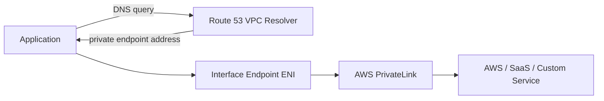
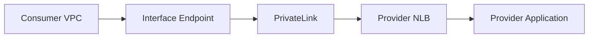
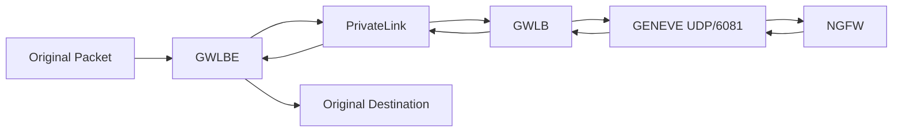
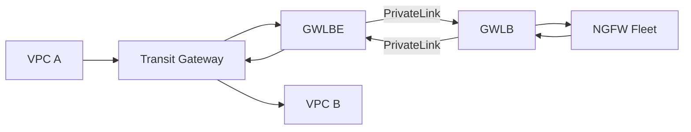
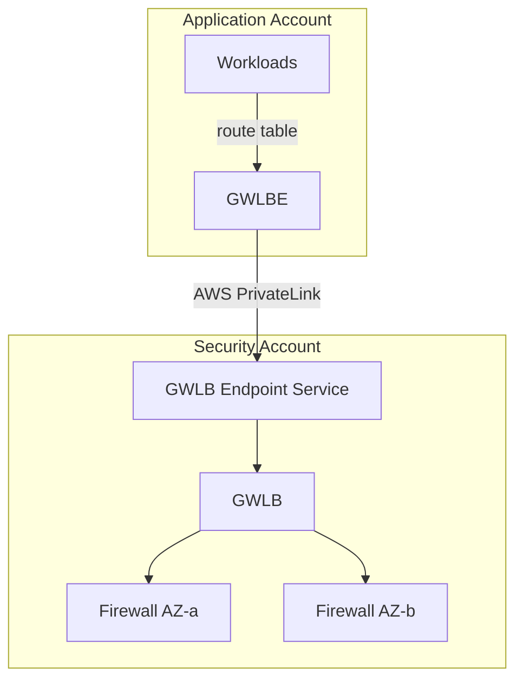

# AWS PrivateLink, VPC Endpoints, and Gateway Load Balancer Firewall Inspection
## Architecture, use cases, packet flows, inspection designs, limitations, and AWS Advanced Networking–level troubleshooting

> **Core question:** What does AWS PrivateLink actually do, what are the VPC endpoint types, and when can PrivateLink participate in inline firewall inspection through Gateway Load Balancer (GWLB)?
>
> **Critical distinction:** Standard **Interface VPC Endpoints** are service-access constructs. They are not generic bump-in-the-wire firewall insertion points. **Gateway Load Balancer Endpoints (GWLBE)** are the PrivateLink-powered endpoint type designed for transparent route-table steering to virtual appliances such as NGFWs, IPS/IDS platforms, and other network functions.

## Supporting URLs

- https://docs.aws.amazon.com/vpc/latest/privatelink/what-is-privatelink.html
- https://docs.aws.amazon.com/vpc/latest/privatelink/concepts.html
- https://docs.aws.amazon.com/vpc/latest/privatelink/interface-endpoints.html
- https://docs.aws.amazon.com/vpc/latest/privatelink/create-interface-endpoint.html
- https://docs.aws.amazon.com/vpc/latest/privatelink/create-endpoint-service.html
- https://docs.aws.amazon.com/vpc/latest/privatelink/privatelink-access-resources.html
- https://docs.aws.amazon.com/vpc/latest/privatelink/vpc-endpoints-access.html
- https://docs.aws.amazon.com/vpc/latest/privatelink/vpc-limits-endpoints.html
- https://docs.aws.amazon.com/vpc/latest/privatelink/gateway-load-balancer-endpoints.html
- https://docs.aws.amazon.com/vpc/latest/privatelink/create-gateway-load-balancer-endpoint-service.html
- https://docs.aws.amazon.com/whitepapers/latest/aws-privatelink/use-case-examples.html
- https://aws.amazon.com/blogs/networking-and-content-delivery/scaling-network-traffic-inspection-using-aws-gateway-load-balancer/
- https://aws.amazon.com/blogs/networking-and-content-delivery/centralized-inspection-architecture-with-aws-gateway-load-balancer-and-aws-transit-gateway/
- https://aws.amazon.com/blogs/networking-and-content-delivery/introducing-aws-gateway-load-balancer-supported-architecture-patterns/
- https://aws.amazon.com/blogs/networking-and-content-delivery/design-your-firewall-deployment-for-internet-ingress-traffic-flows/
- https://aws.amazon.com/blogs/networking-and-content-delivery/introducing-aws-gateway-load-balancer-target-failover-for-existing-flows/

---

# 1. What AWS PrivateLink is

AWS PrivateLink provides private service/resource connectivity over the AWS network. A consumer can reach a supported AWS service, SaaS application, endpoint service, resource, or service network without exposing the destination through public Internet routing. PrivateLink is **service-oriented connectivity**, not general-purpose VPC-to-VPC routing.

This distinction explains why PrivateLink is especially useful for:

- private AWS API access from isolated subnets,
- private SaaS delivery,
- shared services across accounts,
- overlapping CIDR environments,
- cross-account security services,
- resource-specific access,
- and Gateway Load Balancer appliance insertion.

PrivateLink does not automatically give the provider arbitrary routed access back into a consumer VPC.

---

# 2. AWS PrivateLink endpoint types

AWS currently documents these VPC endpoint categories:

| Endpoint type | Uses PrivateLink? | Steering method | Primary purpose |
|---|---:|---|---|
| **Interface endpoint** | Yes | DNS to endpoint ENIs | Private access to AWS, SaaS, or custom services |
| **Gateway Load Balancer endpoint** | Yes | Route table | Transparent virtual-appliance insertion |
| **Resource endpoint** | Yes | Endpoint/resource access | Direct access to shared resource |
| **Service-network endpoint** | Yes | Service network | Access VPC Lattice service networks |
| **Gateway endpoint** | **No** | Route table/prefix list | S3 and DynamoDB |

A common exam trap is treating all VPC endpoints as PrivateLink. **S3/DynamoDB gateway endpoints do not use PrivateLink.**


**What this image shows:** A consumer VPC uses different endpoint types to connect privately to AWS services, a provider endpoint service, a third-party service, a shared VPC resource, and a VPC Lattice service network.

**What matters:** Choose the endpoint type based on whether you need DNS-addressed service access, direct resource access, service-network access, or route-table-driven appliance insertion.

**What to verify:** Endpoint type, subnet/AZ selection, endpoint state, DNS, endpoint policy, security groups, and provider permissions.

---

# 3. Interface VPC endpoints

An Interface Endpoint creates requester-managed endpoint ENIs with private IP addresses in selected subnets. Applications normally reach them through DNS.



For supported AWS services, enabling **Private DNS** allows an application to keep using the normal regional service hostname while Route 53 VPC Resolver returns the interface endpoint addresses inside the VPC.

Interface endpoint ENIs can have security groups. If HTTPS traffic to an endpoint resolves correctly but fails to connect, verify that the endpoint SG permits inbound TCP/443 from the client network/SG.

Endpoint policies, where supported, are IAM resource policies. They control which principals/actions/resources may use the endpoint. They are not packet firewalls.

---

# 4. Endpoint services: provider and consumer model

A provider can publish an application through a PrivateLink **endpoint service**. A conventional application endpoint service uses an NLB. A virtual-appliance service uses GWLB.



The provider controls allowed principals and may require explicit endpoint-connection acceptance. The consumer owns its VPC endpoint, local subnet selection, endpoint security groups, and endpoint policy where supported.

This is a much narrower trust model than peering or Transit Gateway because the consumer reaches the published service, not arbitrary provider prefixes.

---

# 5. Why overlapping CIDRs are a major PrivateLink use case

Suppose both sides use `10.0.0.0/16`.

With VPC peering or Transit Gateway, overlapping prefixes are a major routing problem. With PrivateLink, the consumer accesses an endpoint ENI inside **its own VPC**; it does not need a route to the provider VPC CIDR. This is one of the reasons PrivateLink is heavily used for SaaS and shared services.

---

# 6. Common PrivateLink use cases

## Private access to supported AWS APIs

A private EC2 instance can reach supported AWS services through interface endpoints instead of using a NAT Gateway solely for the API path.

## Private SaaS access

A SaaS provider can publish an NLB-backed endpoint service to many customer VPCs without exposing a public application endpoint.

## Shared services across accounts

Central platform services such as artifact repositories, licensing services, telemetry APIs, identity APIs, and internal automation services can be exposed as narrow PrivateLink services rather than giving application VPCs broad routed access to a shared-services VPC.

## Microservices

PrivateLink can expose a service boundary across accounts/VPCs without creating full network trust.

## Resource endpoints

Newer PrivateLink resource endpoints can provide direct private access to resources such as databases, EC2/application endpoints, IP targets, and other supported resource configurations without requiring an NLB in every design.

## Service-network endpoints

Service-network endpoints provide access to VPC Lattice service networks and are useful when the consumer needs access to multiple services through a common service-network abstraction.

---

# 7. Gateway Load Balancer and PrivateLink

The most important firewall-inspection relationship is:

> **A Gateway Load Balancer endpoint is a PrivateLink-powered VPC endpoint that is usable as a route-table next hop.**

This is what makes PrivateLink capable of participating in transparent firewall inspection.

The path is:

```text
Spoke/workload VPC route
        ↓
Gateway Load Balancer Endpoint (GWLBE)
        ↓
AWS PrivateLink
        ↓
Gateway Load Balancer
        ↓
GENEVE
        ↓
NGFW / IPS / IDS appliance fleet
```

The firewall performs the inspection. PrivateLink supplies the private endpoint-to-service transport. GWLB performs flow distribution, health checks, stickiness, and GENEVE handling.

---

# 8. AWS official distributed GWLB architecture


**What this image shows:** A spoke VPC has GWLBE endpoints in multiple AZs. An appliance VPC contains GWLB and horizontally scalable virtual appliances.

**What matters:** The GWLBE-to-GWLB connection crosses the service boundary through AWS PrivateLink. The appliance VPC can even be owned by a separate security account.

**What to verify:** GWLBE per AZ, endpoint-service permissions, GWLB target health, appliance GENEVE support, and spoke route-table steering.

---

# 9. GWLBE is route-driven; interface endpoints are DNS-driven

This distinction is essential.

## Interface endpoint

```text
Application resolves service DNS
  ↓
private interface endpoint ENI
  ↓
PrivateLink service
```

## GWLBE

```text
Application sends ordinary packet
  ↓
VPC route-table lookup
  ↓
GWLBE selected as next hop
  ↓
GWLB/firewall service
```

A standard Interface Endpoint is not normally used as `0.0.0.0/0` next hop. A GWLBE is explicitly designed to be a route target for appliance insertion.

---

# 10. GWLB / GENEVE packet operation

GWLB uses **GENEVE (Generic Network Virtualization Encapsulation)**. AWS documents this high-level packet operation:

1. Packet is routed to GWLBE.
2. GWLBE sends it privately to GWLB through PrivateLink.
3. GWLB selects a target appliance using a flow hash.
4. GWLB encapsulates the original packet in GENEVE over UDP/6081.
5. Appliance decapsulates the original packet.
6. Firewall/IPS inspects it and allows or drops it.
7. Allowed packet is re-encapsulated and returned to GWLB.
8. GWLB removes GENEVE.
9. Packet returns through PrivateLink to the originating GWLBE.
10. Normal VPC routing resumes from the GWLBE side.



---

# 11. Outbound Internet inspection

AWS’s documented distributed pattern sends workload default traffic to the local GWLBE.


**What this image shows:** Application traffic takes a default route to GWLBE, traverses PrivateLink, GWLB, and a virtual appliance, and then returns to the GWLBE before continuing toward the Internet.

**What matters:** The GWLBE subnet’s route table controls the **post-inspection next hop**. Inspection can succeed at the firewall while the application still fails if the post-inspection route is wrong.

**What to verify:** Workload route, GWLBE route, NAT/IGW/TGW next hop, target health, firewall policy, and return symmetry.

A common egress design is:

```text
Workload
  ↓
GWLBE
  ↓ PrivateLink
GWLB
  ↓
Firewall
  ↓
GWLB/GWLBE
  ↓
NAT Gateway
  ↓
Internet Gateway
  ↓
Internet
```

Putting NAT **after** firewall inspection allows the firewall to see the workload private source address. NAT placement should always be deliberate.

---

# 12. Internet ingress inspection

For Internet ingress, AWS VPC **Ingress Routing** can steer packets arriving through an Internet Gateway to a GWLBE before they reach the destination subnet/load balancer.


**What this image shows:** The IGW ingress route table points protected subnet prefixes at the correct GWLBE. The packet traverses the same inspection service path before reaching the application.

**What matters:** A stateful firewall must see both forward and return directions.

**What to verify:** IGW edge-associated route table, AZ-specific GWLBE target, return route through GWLBE, and firewall session state.

Example ingress route concept:

```text
Destination        Target
10.0.10.0/24       vpce-gwlbe-az-a
10.0.20.0/24       vpce-gwlbe-az-b
```

---

# 13. Inspect before or after an ALB?

## Inspect before ALB

```text
Internet → IGW ingress route → GWLB firewall → ALB → application
```

The firewall sees the original client-facing network flow before ALB terminates it.

## Inspect after ALB

```text
Internet → ALB → firewall → backend
```

The firewall sees the ALB-to-backend connection because ALB is a Layer-7 proxy.

Choose placement based on what security context you need.

Also note AWS’s documented limitation: **NLB client IP preservation is not supported when traffic is routed through a Gateway Load Balancer endpoint**, even when the NLB target is in the same VPC. Do not assume client-IP semantics from an NLB diagram without validating the exact path.

---

# 14. TLS inspection

GWLB does not decrypt TLS. It transports packets to a firewall.

The firewall vendor/application architecture determines whether HTTPS can be decrypted and inspected. Requirements can include certificates, trust configuration, inbound decryption keys, forward-proxy CA trust, TLS-version support, policy, and compliance approval.

Think:

```text
GWLB = insertion and scaling
NGFW = inspection/decryption/security policy
```

---

# 15. Distributed vs centralized GWLB inspection

## Distributed endpoint model

GWLBE exists in each spoke/AZ; firewalls remain centralized behind GWLB.

**Advantages**

- simple route target in each spoke,
- zonal locality,
- no TGW required merely to reach security service,
- strong cross-account firewall-as-a-service model.

**Trade-offs**

- many endpoints,
- endpoint cost,
- route-table automation needed at scale.

## Centralized inspection VPC model

```text
Spoke VPCs
  ↓
Transit Gateway / Cloud WAN
  ↓
Inspection VPC
  ↓
GWLBE
  ↓ PrivateLink
GWLB
  ↓
firewall fleet
```

**Advantages**

- fewer GWLBE deployments,
- centralized route governance.

**Trade-offs**

- more TGW/Cloud WAN route-table complexity,
- symmetry becomes critical,
- possible cross-AZ charges,
- larger shared failure domain.

---

# 16. Transit Gateway appliance mode

Stateful firewalls require symmetric routing. Transit Gateway can otherwise select different AZ paths for forward and reverse traffic. **Appliance mode** is designed for stateful middlebox VPC attachments so bidirectional flows remain consistently associated with the inspection attachment/AZ path.

Without symmetry:

```text
Forward: Spoke A → TGW → firewall AZ-a → Spoke B
Return:  Spoke B → TGW → firewall AZ-b → Spoke A
```

The second firewall may have no state for the original flow.

For centralized stateful inspection, verify appliance mode and both TGW route tables before troubleshooting firewall policy.

---

# 17. East-west inspection

GWLB can inspect east-west traffic if routing forces that traffic through a GWLBE.

Examples:

- VPC A → VPC B,
- application VPC → shared services,
- VPC → on-premises,
- on-premises → VPC,
- inter-segment Cloud WAN traffic.



The difficult part is almost always ensuring the return path cannot bypass the inspection attachment.

---

# 18. Hybrid Direct Connect / VPN inspection

A centralized inspection VPC can inspect hybrid traffic:

```text
On-premises
  ↕ Direct Connect / VPN
Transit Gateway
  ↕
Inspection VPC
  ↕
GWLBE → PrivateLink → GWLB → NGFW
  ↕
Workload VPCs
```

Verify:

- DX/VPN routes,
- TGW propagation/associations,
- appliance mode,
- reverse routes,
- appliance policy/NAT,
- no direct propagated bypass route.

---

# 19. GWLB availability and scaling

AWS documents that each GWLBE can support up to **10 Gbps per AZ and automatically scale up to 100 Gbps**. Validate current documentation/quotas for production design.

AWS recommends deploying a GWLBE in each AZ where traffic originates so traffic remains zonally aligned where possible.

GWLB health-checks appliance targets and can use Auto Scaling groups. Vendor integration must still handle:

- bootstrap,
- licensing,
- policy sync,
- GENEVE readiness,
- registration/deregistration,
- graceful flow handling.

Cross-zone load balancing can increase target availability but may introduce inter-AZ data transfer and latency.

---

# 20. Existing-flow failover

GWLB supports target-failover capabilities for existing flows, but redirecting a flow to another firewall does not automatically guarantee that the new firewall possesses application/session state.

For seamless failover, also evaluate:

- vendor session synchronization,
- TCP reset/reconnect behavior,
- deregistration delay,
- target health-check timing,
- appliance autoscaling/bootstrap timing.

---

# 21. When PrivateLink **can** provide firewall inspection

### YES: use a GWLB-powered endpoint service

```text
Route table → GWLBE → PrivateLink → GWLB → firewall fleet
```

This is transparent service insertion.

### NO: standard interface endpoint is not a generic inline firewall

```text
DNS → Interface Endpoint → PrivateLink → service
```

An interface endpoint may connect to a security product’s API or SaaS service, but that does not make it an inline packet-inspection path for arbitrary workload traffic.

---

# 22. Can you inspect traffic going to a PrivateLink interface endpoint?

Not automatically.

A workload calling a service through an interface endpoint sends traffic to a local endpoint ENI. The managed PrivateLink service path behind that endpoint is not an arbitrary routed transit segment that you can simply insert a firewall into.

If policy requires inspection of a specific PrivateLink service flow, validate whether AWS supports a route topology that can place GWLBE before the endpoint ENI. Do not assume that adding both endpoint types causes chaining.

For AWS APIs, native controls may often provide richer enforcement:

- IAM,
- endpoint policies,
- service/resource policies,
- CloudTrail,
- security groups,
- private DNS.

---

# 23. More-specific routes can bypass firewall inspection

A route to GWLBE only captures traffic for which it is the selected route.

Example:

```text
S3 managed prefix list → S3 gateway endpoint
0.0.0.0/0            → GWLBE
```

S3 traffic follows the more-specific managed prefix-list route and bypasses the default GWLBE route.

Similarly:

```text
10.0.0.0/8 → TGW
0.0.0.0/0  → GWLBE
```

Traffic to `10.50.1.10` uses TGW instead of GWLBE.

An AWS network expert reviews **every more-specific route** when proving that traffic cannot bypass inspection.

---

# 24. NAT placement matters

## Firewall before NAT

```text
Workload → GWLB firewall → NAT Gateway → Internet
```

Firewall sees workload private source IP.

## NAT before firewall

```text
Workload → NAT → firewall → Internet
```

Firewall sees translated source.

If NGFW policy needs per-workload attribution, firewall-before-NAT is usually easier to reason about.

---

# 25. PrivateLink vs other AWS networking constructs

| Feature | PrivateLink | Transit Gateway | VPC Peering |
|---|---|---|---|
| Model | Service/resource connectivity | Routed transit | Direct VPC routing |
| Broad network access | No | Yes | Yes |
| Transitive routing | No | Yes | No |
| Overlapping CIDRs | Often manageable | Problematic | Unsupported/problematic |
| Best use | Private service exposure | Multi-VPC/hybrid transit | Simple VPC-to-VPC routing |
| Firewall insertion | GWLBE/GWLB | Route through inspection VPC | Manual routing patterns |

PrivateLink and Transit Gateway are complementary. A centralized firewall architecture often uses both.

---

# 26. PrivateLink vs NAT Gateway

PrivateLink is not general Internet egress.

- Need arbitrary Internet access: NAT Gateway or other egress design.
- Need private access to a supported AWS API: Interface VPC Endpoint.
- Need S3/DynamoDB private route: Gateway Endpoint.
- Need transparent third-party firewall insertion: GWLBE/GWLB.

---

# 27. PrivateLink vs AWS Network Firewall

AWS Network Firewall is a managed firewall platform. GWLB is the service-insertion/scaling layer for third-party/custom appliances.

```text
Third-party NGFW:
route → GWLBE → PrivateLink → GWLB → Palo Alto/Fortinet/Check Point/etc.

AWS Network Firewall:
route → AWS Network Firewall endpoint → managed firewall engine
```

The two solve similar placement problems with different firewall platforms.

---

# 28. Cross-account firewall-as-a-service

A strong enterprise design is to place GWLB and appliances in a dedicated security account while application teams create GWLBE endpoints in their own accounts.



This gives the security team centralized control without requiring every application VPC to route directly into the firewall VPC.

---

# 29. Common mistakes

1. Treating every VPC endpoint as PrivateLink.
2. Treating an Interface Endpoint as a generic route next hop.
3. Assuming GWLBE itself is the firewall.
4. Forgetting post-inspection GWLBE subnet routes.
5. Routing forward path through firewall but letting return path bypass it.
6. Forgetting TGW appliance mode.
7. Creating only one GWLBE and forcing other AZs across it.
8. Putting NAT before inspection unintentionally.
9. Assuming GWLB decrypts TLS.
10. Assuming ALB preserves the original TCP flow to the backend.
11. Assuming NLB client-IP preservation always works through GWLBE.
12. Ignoring more-specific routes such as S3 gateway-endpoint prefix lists.
13. Ignoring target health or vendor GENEVE support.
14. Assuming PrivateLink provides provider-initiated reverse connectivity.
15. Assuming PrivateLink endpoint policies replace network-security policy.

---

# 30. Troubleshooting: Interface Endpoint

## DNS resolves publicly instead of to endpoint IPs

Check:

- Private DNS enabled,
- VPC DNS support/hostnames,
- client uses Route 53 VPC Resolver,
- no conflicting private hosted zone,
- endpoint state is Available,
- service supports private DNS.

## Private endpoint IP resolves but TCP fails

Check:

- endpoint SG inbound,
- client SG egress,
- NACL,
- service port,
- endpoint policy,
- IAM/resource policy,
- provider acceptance,
- provider target health.

---

# 31. Troubleshooting: GWLBE

## Traffic bypasses firewall

Check:

1. workload subnet route table,
2. longest-prefix route selection,
3. correct GWLBE target,
4. TGW/Cloud WAN bypass routes,
5. IGW ingress route for inbound flows,
6. S3/DynamoDB gateway endpoint routes.

## SYN reaches firewall but SYN-ACK never returns

Check:

1. return route,
2. TGW appliance mode,
3. destination VPC route table,
4. IGW ingress route,
5. firewall NAT/security policy,
6. AZ symmetry,
7. wrong GWLBE selected.

## One AZ fails

Check:

- local GWLBE exists,
- correct subnet association,
- GWLB enabled in AZ,
- healthy target exists in AZ,
- cross-zone setting,
- NAT/TGW path,
- vendor bootstrap/license state.

## Firewall permits traffic but application still times out

Firewall allow proves only one stage. Check post-inspection route, NAT/IGW/TGW path, NACL/SG, MTU/PMTUD, and application listener.

---

# 32. Useful AWS CLI verification

```cli
aws ec2 describe-vpc-endpoints
```

```cli
aws ec2 describe-vpc-endpoint-services
```

```cli
aws ec2 describe-vpc-endpoint-service-configurations
```

```cli
aws elbv2 describe-load-balancers
```

```cli
aws elbv2 describe-target-health \
  --target-group-arn <TARGET_GROUP_ARN>
```

```cli
aws ec2 describe-route-tables \
  --route-table-ids <ROUTE_TABLE_ID>
```

For centralized Transit Gateway designs:

```cli
aws ec2 describe-transit-gateway-vpc-attachments
```

**Success looks like:** VPC endpoint available, endpoint-service connection accepted, GWLB targets healthy, and all intended forward/return routes reference the correct GWLBE/TGW/IGW/NAT next hops.

---

# 33. Design checklist

Before approving a PrivateLink/GWLB firewall design, verify:

- endpoint type is appropriate,
- GWLBE exists in every required AZ,
- endpoint-service permissions are correct,
- GWLB targets healthy,
- appliance supports GENEVE UDP/6081,
- workload routes steer intended traffic to GWLBE,
- return traffic is symmetric,
- IGW ingress routing is configured for Internet inbound inspection,
- TGW appliance mode is enabled for centralized stateful inspection where required,
- NAT order is intentional,
- more-specific routes do not bypass inspection,
- ALB/NLB source-IP behavior is understood,
- TLS decryption requirements are handled by the firewall,
- cross-zone behavior is deliberate,
- failover has been tested,
- VPC Flow Logs and firewall logs are available,
- cost model includes endpoints, GWLB, appliances, TGW, NAT, and cross-AZ transfer.

---

# 34. AWS Advanced Networking Specialty facts to remember

- PrivateLink is service/resource-oriented connectivity, not generic transit routing.
- Interface endpoints are generally DNS-addressed.
- GWLBE is route-table-addressed.
- GWLBE uses PrivateLink to reach a GWLB endpoint service.
- GWLB uses GENEVE UDP/6081 toward appliances.
- The appliance performs actual firewall/IPS inspection.
- GWLBE can be used for inbound, outbound, east-west, and hybrid inspection when routing is designed correctly.
- Internet ingress inspection commonly relies on IGW ingress routing.
- Centralized stateful TGW inspection commonly relies on appliance mode.
- S3/DynamoDB gateway endpoints can bypass a default-route GWLBE because their routes are more specific.
- Interface endpoint traffic is not automatically chained through GWLBE.
- PrivateLink helps with overlapping CIDRs because consumers connect to local endpoint addresses rather than provider CIDRs.
- Gateway VPC endpoints are not PrivateLink.
- ALB is a Layer-7 proxy; GWLB is transparent L3 service insertion.
- NLB client IP preservation has a documented limitation when traffic is routed through GWLBE.
- TLS inspection is performed by the NGFW, not GWLB.

---

# Sources

## AWS documentation

- AWS PrivateLink overview: https://docs.aws.amazon.com/vpc/latest/privatelink/what-is-privatelink.html
- PrivateLink concepts and endpoint types: https://docs.aws.amazon.com/vpc/latest/privatelink/concepts.html
- Interface endpoints: https://docs.aws.amazon.com/vpc/latest/privatelink/interface-endpoints.html
- Create interface endpoint: https://docs.aws.amazon.com/vpc/latest/privatelink/create-interface-endpoint.html
- Create endpoint service: https://docs.aws.amazon.com/vpc/latest/privatelink/create-endpoint-service.html
- Resource endpoints: https://docs.aws.amazon.com/vpc/latest/privatelink/privatelink-access-resources.html
- Endpoint policies: https://docs.aws.amazon.com/vpc/latest/privatelink/vpc-endpoints-access.html
- PrivateLink quotas: https://docs.aws.amazon.com/vpc/latest/privatelink/vpc-limits-endpoints.html
- Gateway Load Balancer endpoints: https://docs.aws.amazon.com/vpc/latest/privatelink/gateway-load-balancer-endpoints.html
- GWLB endpoint service: https://docs.aws.amazon.com/vpc/latest/privatelink/create-gateway-load-balancer-endpoint-service.html

## AWS technical content

- AWS PrivateLink use cases: https://docs.aws.amazon.com/whitepapers/latest/aws-privatelink/use-case-examples.html
- Scaling network traffic inspection with GWLB: https://aws.amazon.com/blogs/networking-and-content-delivery/scaling-network-traffic-inspection-using-aws-gateway-load-balancer/
- Centralized GWLB + TGW inspection: https://aws.amazon.com/blogs/networking-and-content-delivery/centralized-inspection-architecture-with-aws-gateway-load-balancer-and-aws-transit-gateway/
- GWLB supported patterns: https://aws.amazon.com/blogs/networking-and-content-delivery/introducing-aws-gateway-load-balancer-supported-architecture-patterns/
- Internet ingress firewall design: https://aws.amazon.com/blogs/networking-and-content-delivery/design-your-firewall-deployment-for-internet-ingress-traffic-flows/
- GWLB target failover: https://aws.amazon.com/blogs/networking-and-content-delivery/introducing-aws-gateway-load-balancer-target-failover-for-existing-flows/

## Validation notes

- Embedded diagrams use stable AWS documentation/AWS-owned CloudFront image URLs.
- Interface Endpoint and GWLBE behavior are explicitly separated.
- No vendor-specific CLI/output is fabricated.
- GENEVE, route symmetry, TGW appliance mode, ingress routing, ALB/NLB behavior, endpoint policies, overlapping CIDRs, and route-bypass risks are covered.