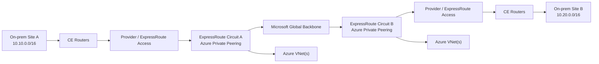
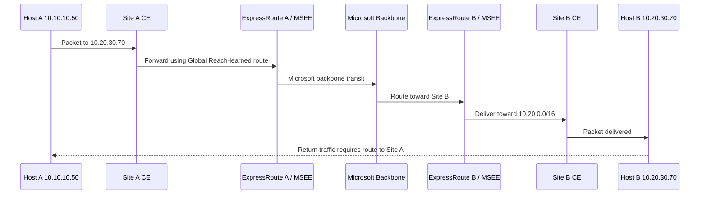
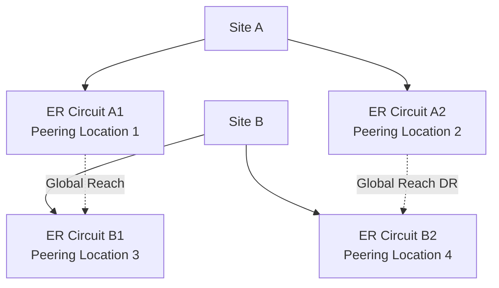

# Azure ExpressRoute Global Reach — Comprehensive Study Guide

> **Primary topic:** Azure ExpressRoute Global Reach  
> **Last reviewed:** 2026-09-04  
> **Focus:** architecture, Layer 3 routing, BGP behavior, circuit-to-circuit connectivity, configuration, verification, design, limitations, failover, and troubleshooting

## Supplied and supporting URLs

**Primary Microsoft documentation**

- https://learn.microsoft.com/en-us/azure/expressroute/expressroute-global-reach
- https://learn.microsoft.com/en-us/azure/expressroute/expressroute-howto-set-global-reach
- https://learn.microsoft.com/en-us/azure/expressroute/expressroute-introduction
- https://learn.microsoft.com/en-us/azure/expressroute/expressroute-routing
- https://learn.microsoft.com/en-us/azure/expressroute/expressroute-prerequisites
- https://learn.microsoft.com/en-us/azure/expressroute/expressroute-faqs
- https://learn.microsoft.com/en-us/azure/azure-resource-manager/management/azure-subscription-service-limits
- https://learn.microsoft.com/en-us/troubleshoot/azure/expressroute/expressroute-troubleshooting-expressroute-overview

**Official Microsoft images used in this guide**

- https://learn.microsoft.com/en-us/azure/expressroute/media/expressroute-global-reach/dual-circuit.png
- https://learn.microsoft.com/en-us/azure/expressroute/media/expressroute-global-reach/global-reach.png
- https://learn.microsoft.com/en-us/azure/expressroute/media/expressroute-global-reach/global-reach-infrastructure.png

---

## Overview

Azure **ExpressRoute Global Reach** extends ExpressRoute so that two or more on-premises networks attached to different ExpressRoute circuits can communicate with each other over Microsoft's global backbone.

Normal ExpressRoute is primarily a private Layer 3 connection between:

```text
On-premises network <-> ExpressRoute circuit <-> Microsoft cloud / Azure
```

Global Reach adds another connectivity function:

```text
On-premises site A
    |
ExpressRoute circuit A
    |
Microsoft global network
    |
ExpressRoute circuit B
    |
On-premises site B
```

The important conceptual distinction is:

| Capability | What it connects |
|---|---|
| Standard ExpressRoute private peering | On-premises networks to Azure VNets/private Azure resources |
| ExpressRoute Premium | Extends Azure/Microsoft-service reach across geopolitical boundaries and raises some limits |
| ExpressRoute Global Reach | Connects **on-premises networks to other on-premises networks** through ExpressRoute circuits |
| Azure VPN Gateway | Encrypted IPsec connectivity over public IP transport |
| Azure Virtual WAN | Microsoft-managed transit architecture for branches, VNets, VPN, ExpressRoute, and hubs |

Global Reach is therefore a **WAN-transit capability**, not merely an Azure VNet feature.

---

## Source coverage and information classification

This guide distinguishes three types of statements:

- **Source information:** explicitly documented by Microsoft.
- **Additional explanation:** networking context added to make the documented behavior easier to understand.
- **Reasonable inference:** conclusions derived from documented architecture but not explicitly stated as a product guarantee.

Where behavior is version-, SKU-, geography-, or provider-dependent, verify the current Microsoft documentation before production implementation.

---

# 1. Why Global Reach exists

Consider two corporate sites:

```text
San Francisco
10.0.1.0/24
     |
     | ExpressRoute Circuit A
     |
Microsoft backbone
     |
Azure resources
```

and:

```text
London
10.0.2.0/24
     |
     | ExpressRoute Circuit B
     |
Microsoft backbone
     |
Azure resources
```

Without Global Reach, both on-premises sites can use their ExpressRoute circuits to reach Azure resources, but the two on-premises networks are not automatically connected to each other through ExpressRoute.

Microsoft illustrates the pre-Global-Reach state as follows:


**What this image shows:**  
Each site has an ExpressRoute circuit and can reach Azure VNets, but there is no Microsoft-backbone transit path between the two on-premises sites.

**What matters:**  
An ExpressRoute circuit is not automatically a general-purpose transit router between customer sites. Global Reach is the feature that explicitly enables on-premises-to-on-premises exchange through linked circuits.

**What to verify:**  
Before designing around Global Reach, confirm that the circuits are in supported peering locations, Azure private peering is configured, and the circuits are provisioned.

With Global Reach enabled, Microsoft shows the design this way:


**What this image shows:**  
Two ExpressRoute circuits are linked so that the on-premises networks can exchange traffic through the Microsoft global network.

**What matters:**  
The green path represents a customer WAN transit path through Microsoft. Azure VNet connectivity remains available independently.

**What to verify:**  
Confirm that on-premises routes from one site are actually learned at the other site, that return routing is present, and that circuit bandwidth is sufficient for both Azure-bound and site-to-site traffic.

---

# 2. Architecture

## 2.1 Logical components

A typical Global Reach design contains:

1. **Customer Edge (CE) routers**
2. **Connectivity provider network**, unless ExpressRoute Direct is used
3. **Microsoft Enterprise Edge (MSEE) routers**
4. **ExpressRoute circuit A**
5. **ExpressRoute circuit B**
6. **Azure private peering**
7. **Global Reach circuit connection**
8. Customer prefixes advertised from both sides using Border Gateway Protocol (BGP)

Conceptually:



Global Reach links the private-peering routing domains of the two circuits.

---

## 2.2 Layer 2 versus Layer 3 responsibilities

### Layer 2

The underlying ExpressRoute circuit includes Layer 2 connectivity between the customer/provider edge and the Microsoft edge.

Layer 2 responsibilities can include:

- physical connectivity
- provider Ethernet transport
- VLAN handoff
- ARP/neighbor resolution on Ethernet-based peerings
- redundant circuit paths

Global Reach itself is **not a Layer 2 extension between data centers**.

It does **not** stretch:

- VLANs
- broadcast domains
- MAC tables
- Spanning Tree domains

### Layer 3

Global Reach operates as a Layer 3 routing service.

Relevant Layer 3 elements include:

- IPv4 and optionally IPv6 prefixes
- external BGP (eBGP)
- autonomous system numbers
- route advertisements
- next-hop reachability
- prefix limits
- route filtering
- failover between redundant BGP paths

If an application requires the same Layer 2 subnet at both sites, Global Reach is not the mechanism for that requirement.

---

# 3. Control plane

## 3.1 BGP foundation

ExpressRoute routing uses **eBGP** between the customer/provider side and Microsoft Enterprise Edge routers.

Microsoft's documented Azure private peering model uses:

- redundant BGP sessions
- Microsoft ASN **12076**
- customer ASN supplied as part of the peering configuration
- private or public IPv4 addresses for private-peering link subnets
- either one `/29` split into two `/30` subnets or two `/30` subnets for IPv4 private peering

Global Reach depends on Azure private peering already being operational.

### Important distinction

The `/29` used to configure **Global Reach** is not the same thing as the `/29` or `/30` space used for Azure private peering.

For Global Reach, Microsoft requires a dedicated IPv4 `/29` address prefix used by the circuit-connection mechanism.

That prefix:

- must not overlap Azure VNets
- must not overlap on-premises networks
- should not overlap private-peering link ranges
- is not an application subnet

For IPv6 Global Reach, Microsoft documents a `/125` prefix.

---

## 3.2 Route propagation concept

Assume:

```text
Site A advertises: 10.10.0.0/16
Site B advertises: 10.20.0.0/16
```

Before Global Reach:

```text
Circuit A learns Site A routes.
Circuit B learns Site B routes.
There is no customer-site transit between the two circuits.
```

After Global Reach:

```text
Circuit A side can receive 10.20.0.0/16.
Circuit B side can receive 10.10.0.0/16.
```

This enables:

```text
10.10.10.5 -> 10.20.20.8
```

to traverse:

```text
Site A
 -> CE
 -> ExpressRoute A
 -> Microsoft backbone
 -> ExpressRoute B
 -> CE
 -> Site B
```

The remote-site routes are received through the Azure private peering context.

---

# 4. Data plane and packet flow

## 4.1 Site A to Site B

Example:

```text
Source:      10.10.10.50
Destination: 10.20.30.70
```

Packet flow:

1. A host in Site A sends a packet toward `10.20.30.70`.
2. Site A routing forwards the packet toward its ExpressRoute CE path.
3. The provider network, if present, transports the packet toward the Microsoft Enterprise Edge.
4. Microsoft has learned the Site B prefix through Circuit B.
5. Global Reach permits the traffic to cross the Microsoft backbone from the Circuit A routing domain toward Circuit B.
6. Circuit B forwards the packet toward Site B.
7. Site B routing delivers the packet to `10.20.30.70`.
8. The return path must have a route back to `10.10.10.0/24` or a covering prefix.

A routing diagram:



---

## 4.2 Does traffic enter an Azure VNet?

Not inherently.

Global Reach site-to-site transit is between ExpressRoute circuits over Microsoft's network. A VNet does not need to be inserted as a transit hop merely to enable Global Reach.

This is a major architectural point:

```text
Global Reach != hairpin through an Azure VNet
```

and:

```text
Global Reach != VNet peering
```

Azure VNets can still be connected to the same circuits, but the on-premises transit function is provided by the Global Reach relationship.

---

# 5. Global Reach as a WAN extension

Microsoft explicitly positions Global Reach as a complement to a service-provider WAN.

A representative use case is:

- an organization has a strong provider presence in one geography
- the same provider is weak or unavailable in another geography
- local providers connect regional sites to ExpressRoute
- Global Reach carries inter-site traffic over Microsoft's backbone

Microsoft illustrates this model here:


**What this image shows:**  
Regional sites can use different local service providers and still be connected through the Microsoft global network.

**What matters:**  
Global Reach can reduce dependency on a single global MPLS/IPVPN provider and can act as a private WAN interconnect between ExpressRoute-connected locations.

**What to verify:**  
Validate provider handoffs, supported ExpressRoute peering locations, circuit capacities, routing policies, operational responsibility boundaries, and whether Premium is required for cross-geopolitical connectivity.

---

# 6. Prerequisites

Before enabling Global Reach, Microsoft requires or recommends the following.

## 6.1 ExpressRoute prerequisites

Both circuits must be:

- provisioned
- operational
- configured with Azure private peering
- created at different supported peering locations
- associated with supported Global Reach countries/regions

Microsoft also recommends robust ExpressRoute redundancy.

For production architecture, evaluate:

- dual physical provider paths
- redundant customer routers
- redundant BGP sessions
- separate peering locations
- preferably multiple ExpressRoute circuits for disaster recovery

---

## 6.2 Premium requirement

If two ExpressRoute circuits are in the **same geopolitical region**, Global Reach does not inherently require Premium.

If the circuits are in **different geopolitical regions**, Microsoft requires **ExpressRoute Premium on both circuits**.

This is different from saying that Global Reach always requires Premium.

---

# 7. Supported Global Reach locations

Microsoft currently documents Global Reach availability in the following locations:

- Australia
- Belgium
- Brazil
- Canada
- Denmark
- France
- Germany
- Hong Kong SAR
- India
- Ireland
- Italy
- Japan
- Netherlands
- New Zealand
- Norway
- Poland
- Singapore
- South Africa — Johannesburg only
- South Korea
- Spain
- Sweden
- Switzerland
- Taiwan
- United Kingdom
- United States

Availability is tied to ExpressRoute peering locations. Always verify the current Microsoft list before final design.

---

# 8. Addressing requirements

## 8.1 IPv4 Global Reach connection subnet

Microsoft requires a dedicated:

```text
/29 IPv4 subnet
```

for the Global Reach connection.

Example:

```text
192.168.250.0/29
```

Do **not** use this range for:

- Azure VNet address space
- on-premises LAN addressing
- private-peering subnet addressing
- another Global Reach connection if it would conflict

The address space is infrastructure addressing associated with the circuit-to-circuit connection.

---

## 8.2 IPv6

Microsoft supports IPv6 for Global Reach.

For IPv6, specify:

```text
/125
```

and use:

```powershell
-AddressPrefixType IPv6
```

Example:

```text
2001:db8:100::/125
```

`2001:db8::/32` is documentation space; use an appropriate production prefix in a real environment.

---

# 9. Same-subscription configuration using Azure PowerShell

The following syntax is based on Microsoft's current documented procedure.

## Step 1 — Sign in

```powershell
Connect-AzAccount
```

If multiple subscriptions exist:

```powershell
Get-AzSubscription
```

Select the desired subscription:

```powershell
Select-AzSubscription -SubscriptionName "Name of subscription"
```

---

## Step 2 — Retrieve both ExpressRoute circuits

```powershell
$ckt_1 = Get-AzExpressRouteCircuit `
    -Name "Your_circuit_1_name" `
    -ResourceGroupName "Your_resource_group"

$ckt_2 = Get-AzExpressRouteCircuit `
    -Name "Your_circuit_2_name" `
    -ResourceGroupName "Your_resource_group"
```

### What this does

Retrieves the Azure resource objects so their IDs and peering configuration can be referenced.

### What to verify

Inspect:

```powershell
$ckt_1
$ckt_2
```

Confirm:

- correct circuits
- provisioned circuit state
- private peering is present
- expected subscription and resource group

---

## Step 3 — Add the Global Reach connection

Microsoft's documented syntax is:

```powershell
Add-AzExpressRouteCircuitConnectionConfig `
    -Name 'Your_connection_name' `
    -ExpressRouteCircuit $ckt_1 `
    -PeerExpressRouteCircuitPeering $ckt_2.Peerings[0].Id `
    -AddressPrefix '__.__.__.__/29'
```

Example with documentation-style addressing:

```powershell
Add-AzExpressRouteCircuitConnectionConfig `
    -Name 'GR-SiteA-SiteB' `
    -ExpressRouteCircuit $ckt_1 `
    -PeerExpressRouteCircuitPeering $ckt_2.Peerings[0].Id `
    -AddressPrefix '192.168.250.0/29'
```

> **Important:** Do not blindly assume `Peerings[0]` is Azure private peering in an automated script. Inspect the object and verify that the ID used ends in `/peerings/AzurePrivatePeering`.

A private-peering resource ID resembles:

```text
/subscriptions/<SUBSCRIPTION_ID>/resourceGroups/<RESOURCE_GROUP>/providers/Microsoft.Network/expressRouteCircuits/<CIRCUIT_NAME>/peerings/AzurePrivatePeering
```

---

## Step 4 — Commit the ExpressRoute circuit object

```powershell
Set-AzExpressRouteCircuit -ExpressRouteCircuit $ckt_1
```

This saves the staged connection configuration to Azure.

### Success condition

After completion, the on-premises networks behind both circuits can exchange routes and traffic, assuming the local network routing policies permit it.

---

# 10. IPv6 configuration

Microsoft documents the IPv6 Global Reach connection as:

```powershell
Add-AzExpressRouteCircuitConnectionConfig `
    -Name 'Your_connection_name' `
    -ExpressRouteCircuit $ckt_1 `
    -PeerExpressRouteCircuitPeering $ckt_2.Peerings[0].Id `
    -AddressPrefix '__.__.__.__/125' `
    -AddressPrefixType IPv6
```

The documentation uses placeholder formatting; for actual IPv6, supply a valid IPv6 `/125`.

Then save:

```powershell
Set-AzExpressRouteCircuit -ExpressRouteCircuit $ckt_1
```

---

# 11. Circuits in different Azure subscriptions

If the two circuits are owned by different Azure subscriptions, Global Reach requires an authorization workflow.

## Step 1 — Generate authorization on Circuit 2

```powershell
$ckt_2 = Get-AzExpressRouteCircuit `
    -Name "Your_circuit_2_name" `
    -ResourceGroupName "Your_resource_group"

Add-AzExpressRouteCircuitAuthorization `
    -ExpressRouteCircuit $ckt_2 `
    -Name "Name_for_auth_key"

Set-AzExpressRouteCircuit -ExpressRouteCircuit $ckt_2
```

Record:

- authorization key
- Circuit 2 private-peering resource ID

---

## Step 2 — Configure Circuit 1

```powershell
Add-AzExpressRouteCircuitConnectionConfig `
    -Name 'Your_connection_name' `
    -ExpressRouteCircuit $ckt_1 `
    -PeerExpressRouteCircuitPeering "circuit_2_private_peering_id" `
    -AddressPrefix '__.__.__.__/29' `
    -AuthorizationKey '########-####-####-####-############'
```

Then:

```powershell
Set-AzExpressRouteCircuit -ExpressRouteCircuit $ckt_1
```

### Why authorization is required

The subscription that owns Circuit 1 cannot arbitrarily attach to a circuit owned in another subscription. The authorization proves that the owner of Circuit 2 has delegated permission for the link.

---

# 12. Azure portal configuration concept

Microsoft also documents a portal workflow.

At a high level:

1. Open the first **ExpressRoute circuit**.
2. Open the **Global Reach** configuration area / select **Add Global Reach**.
3. Select the remote ExpressRoute circuit when both are in the same subscription.
4. Enter a configuration name.
5. Enter the dedicated `/29` IPv4 Global Reach subnet.
6. If IPv6 is needed, select support for both address families and specify the `/125`.
7. Select **Add**.
8. Select **Save** to apply the configuration.
9. Verify the Global Reach relationship appears in the circuit overview.

For different subscriptions:

1. Generate an authorization on the remote circuit.
2. On the first circuit, select **Add Global Reach**.
3. Choose **Redeem authorization**.
4. Enter the authorization key.
5. Enter the remote circuit resource ID.
6. Provide the Global Reach `/29`.
7. Add `/125` IPv6 addressing if required.
8. Save.

Microsoft documents the Global Reach relationship as bidirectional once established.

---

# 13. Verification

## 13.1 Verify the Azure connection object

Retrieve the circuit:

```powershell
$ckt_1 = Get-AzExpressRouteCircuit `
    -Name "Your_circuit_1_name" `
    -ResourceGroupName "Your_resource_group"
```

Display it:

```powershell
$ckt_1
```

Look for:

```text
CircuitConnectionStatus
```

Microsoft documents the meaningful states as including:

```text
Connected
Disconnected
```

A successful configuration should show the Global Reach circuit connection as connected.

---

## 13.2 Verify BGP routes

Global Reach is useful only if routes are being propagated as intended.

On the on-premises CE router, verify:

- remote-site prefixes exist
- their next hop is the expected ExpressRoute path
- the route source is BGP
- the expected path wins against MPLS, SD-WAN, VPN, or other WAN routes
- return routing exists

Generic examples:

```text
show bgp ipv4 unicast 10.20.0.0/16
show ip route 10.20.0.0
```

Exact command syntax depends on the router vendor.

Do not assume that merely seeing the Global Reach object as Connected proves end-to-end reachability.

---

## 13.3 Check ExpressRoute BGP route information from Azure

Useful Azure PowerShell operations include ExpressRoute route-table inspection commands for the private peering context.

Also verify traffic counters:

```powershell
Get-AzExpressRouteCircuitStats `
    -ResourceGroupName <ResourceGroupName> `
    -ExpressRouteCircuitName <CircuitName> `
    -PeeringType 'AzurePrivatePeering'
```

Microsoft documents counters including:

```text
PrimaryBytesIn
PrimaryBytesOut
SecondaryBytesIn
SecondaryBytesOut
```

### What success looks like

During an active test:

- byte counters should increment
- the intended primary/secondary paths should carry traffic
- remote-site prefixes should be visible at both sides
- application probes should complete end-to-end

---

# 14. Route limits

Global Reach does not create an unlimited routing table.

Microsoft documents Azure private-peering customer advertisement limits of:

| Circuit tier | Maximum IPv4 on-prem routes advertised to Microsoft |
|---|---:|
| Standard | 4,000 |
| Premium | 10,000 |

Microsoft documents an IPv6 on-premises route advertisement limit of 100 routes for Azure private peering.

### Important Global Reach implication

The routes received from Microsoft through Azure private peering can include both:

- Azure VNet routes
- remote on-premises routes learned through Global Reach

Therefore, the receiving CE router must be sized and configured for the total resulting prefix set.

Microsoft specifically advises configuring an appropriate maximum-prefix limit on the on-premises router.

---

# 15. Connection-count limits

Global Reach connections count against the ExpressRoute circuit's supported VNet/connection capacity.

Microsoft's current published Premium limits vary by circuit bandwidth.

Examples:

| ExpressRoute circuit bandwidth | Standard/local-style connection limit | Premium connection limit |
|---:|---:|---:|
| 50 Mbps | 10 | 20 |
| 100 Mbps | 10 | 25 |
| 200 Mbps | 10 | 25 |
| 500 Mbps | 10 | 40 |
| 1 Gbps | 10 | 50 |
| 2 Gbps | 10 | 60 |
| 5 Gbps | 10 | 75 |
| 10 Gbps | 10 | 100 |
| 40/100 Gbps ExpressRoute Direct where applicable | 10 | 100 |

A Global Reach relationship consumes from the same overall connection pool used for ExpressRoute VNet connections.

Example:

```text
10-Gbps Premium circuit
maximum connection capacity = 100
```

A possible allocation could be:

```text
5 Global Reach connections
95 ExpressRoute gateway/VNet connections
```

or another valid combination up to the applicable limit.

Always check current Azure limits because service limits can change.

---

# 16. Throughput

Microsoft states that the throughput between on-premises networks using Global Reach is capped by the smaller of the two ExpressRoute circuits.

Example:

```text
Circuit A = 10 Gbps
Circuit B = 2 Gbps
```

The Global Reach path cannot exceed the effective smaller-circuit constraint:

```text
<= 2 Gbps
```

Additionally, Microsoft notes that:

```text
premises-to-Azure traffic
+
premises-to-premises Global Reach traffic
```

share ExpressRoute circuit bandwidth.

This matters during:

- data-center replication
- large backups
- migrations
- storage synchronization
- east-west application bursts

A circuit sized only for Azure access may become oversubscribed after Global Reach is introduced.

---

# 17. High availability

## 17.1 Redundant BGP sessions

Microsoft ExpressRoute requires redundant BGP sessions for high availability.

A single circuit typically presents redundant Microsoft edge paths.

The customer should preserve both paths.

Avoid designs that intentionally drive all traffic through only one member unless there is a deliberate and validated reason.

---

## 17.2 Disaster-recovery circuits

Microsoft strongly recommends separate ExpressRoute circuits in different peering locations for strong disaster recovery.

Global Reach does not eliminate the need for circuit-level resiliency.

A robust design may look like:



This reduces dependency on a single:

- provider handoff
- peering facility
- ExpressRoute circuit
- customer edge pair

---

# 18. Failover and convergence

Global Reach relies on the underlying routing state.

A failure can occur at multiple layers:

1. physical interface failure
2. provider transport failure
3. BGP session failure
4. ExpressRoute circuit failure
5. Global Reach relationship failure
6. remote site routing failure
7. local route-preference failure

Typical control-plane behavior:

```text
Failure detected
 -> BGP adjacency/path removed
 -> affected prefixes withdrawn
 -> alternate BGP path evaluated
 -> local routing table updated
 -> forwarding table programmed
 -> traffic resumes on surviving path
```

Actual convergence time depends on:

- how the failure is detected
- provider architecture
- BGP timers
- customer routing design
- competing WAN paths
- application retry behavior

Do not assume Global Reach itself guarantees subsecond convergence.

---

# 19. Global Reach versus common alternatives

## 19.1 Global Reach versus MPLS L3VPN

| Feature | Global Reach | Provider MPLS/IPVPN |
|---|---|---|
| Transit backbone | Microsoft | Telecom/service provider |
| Primary use | Interconnect ER-attached sites | Enterprise WAN |
| Routing | BGP-based | Often BGP/OSPF/static via provider VPN |
| Cloud integration | Native ExpressRoute context | Provider-dependent |
| Provider diversity | Can combine multiple regional providers | Usually provider-specific |
| Layer | Layer 3 | Usually Layer 3 VPN |
| Internet encryption | Not an Internet VPN | Not inherently Internet encrypted |

Global Reach can complement rather than necessarily replace MPLS.

---

## 19.2 Global Reach versus site-to-site VPN

| Feature | Global Reach | S2S VPN |
|---|---|---|
| Transport | Microsoft/private ExpressRoute ecosystem | Public Internet or private IP underlay |
| Encryption | ExpressRoute does not inherently mean end-to-end IPsec | IPsec encryption |
| Predictability | Private connectivity model | Internet-dependent unless private underlay |
| Bandwidth | ExpressRoute circuit-dependent | Gateway/Internet-dependent |
| Use case | Enterprise private WAN extension | Encrypted tunnels |

A key security point:

**Private transport is not the same as payload encryption.**

If the workload requires cryptographic confidentiality in transit, use appropriate encryption at the network or application layer.

---

## 19.3 Global Reach versus Azure Virtual WAN

Azure Virtual WAN is a Microsoft-managed hub-and-transit platform integrating:

- branch VPN
- ExpressRoute
- VNet connectivity
- SD-WAN integrations
- routing
- secured virtual hubs

Global Reach is narrower: it links ExpressRoute circuits to connect on-premises sites.

Choose based on whether you need:

```text
simple ER-circuit-to-ER-circuit transit
```

or a broader:

```text
managed cloud WAN hub architecture
```

---

# 20. Security considerations

Global Reach expands the reachable network domain.

Before enabling it, treat it as a significant routing and segmentation change.

Questions to ask:

- Which on-premises prefixes should Site A learn from Site B?
- Are overlapping RFC1918 ranges present?
- Does the firewall policy permit the new traffic?
- Is route leakage acceptable?
- Are regulatory boundaries crossed?
- Does inter-site traffic need inspection?
- Does traffic require encryption?
- Will the path bypass an existing MPLS firewall or SD-WAN security stack?

Global Reach provides reachability; it does not replace enterprise segmentation policy.

---

# 21. Firewall inspection implications

Global Reach site-to-site traffic does not automatically traverse a Network Virtual Appliance (NVA) in an Azure VNet.

If the security architecture requires inspection, explicitly design the traffic path.

Possible architectures include:

- firewalls at each data-center edge
- provider-managed security
- application-layer security
- a different Azure transit architecture, such as Virtual WAN secured hub, where appropriate
- deliberate routing through inspection infrastructure

Do not assume that an Azure Firewall or third-party NVA attached elsewhere in Azure automatically inspects Global Reach traffic.

---

# 22. Overlapping prefixes

Overlapping address space is one of the most serious practical problems when interconnecting previously separate networks.

Example:

```text
Site A: 10.10.0.0/16
Site B: 10.10.0.0/16
```

BGP cannot create normal deterministic end-to-end reachability when both enterprises use the same destination prefix without additional address-translation or segmentation mechanisms.

Before enabling Global Reach:

1. inventory all site prefixes
2. check for overlap
3. check Azure VNet prefixes
4. check Global Reach `/29` prefixes
5. check private-peering link prefixes
6. plan NAT or readdressing if required

---

# 23. Routing-policy interactions

Global Reach can introduce a new path to prefixes that already exist through:

- MPLS
- SD-WAN
- IPsec VPN
- direct inter-data-center links
- another ExpressRoute circuit

This creates a BGP path-selection problem.

Example:

```text
Site A -> Site B
```

could be learned via:

```text
Path 1: MPLS
Path 2: ExpressRoute Global Reach
```

Your CE route policy determines which path wins.

Common BGP attributes that may influence selection include:

- weight on some vendors
- LOCAL_PREF
- locally originated status
- AS_PATH
- origin type
- MED in applicable comparisons
- eBGP versus iBGP preference
- IGP metric to BGP next hop
- vendor-specific policy

Design the preferred/backup behavior before turning on Global Reach.

---

# 24. Asymmetric routing

Microsoft states that ExpressRoute does not require forward and return traffic to traverse identical router pairs.

However, enterprise stateful firewalls can care deeply about symmetry.

Potential issue:

```text
Forward:
Site A -> Global Reach -> Site B

Return:
Site B -> MPLS -> Site A
```

IP routing may technically work, while a stateful firewall drops the return packets because it did not see the original session.

Validate:

- route preference in both directions
- firewall state
- NAT placement
- ECMP behavior
- path consistency where required

---

# 25. Route aggregation

Aggregation reduces:

- route-table scale
- update volume
- maximum-prefix risk
- operational complexity

Instead of advertising:

```text
10.20.1.0/24
10.20.2.0/24
10.20.3.0/24
...
```

a site may be able to advertise:

```text
10.20.0.0/16
```

only if that aggregate accurately represents reachable networks and black-holing risk is understood.

Do not advertise a broad summary for addresses that are reachable elsewhere unless the routing design intentionally handles the unused or remote subranges.

---

# 26. Common mistakes

## Mistake 1 — Assuming ExpressRoute already provides site-to-site transit

It does not automatically provide on-premises-to-on-premises transit between separate circuits.

**Fix:** Enable Global Reach between the appropriate circuit private-peerings.

---

## Mistake 2 — Using a Global Reach `/29` that overlaps production addressing

**Symptom:** Configuration may fail or routing becomes ambiguous.

**Fix:** Allocate a dedicated infrastructure `/29` that is not used in Azure VNets, on-premises networks, or peerings.

---

## Mistake 3 — Linking circuits at unsupported locations

**Symptom:** Global Reach cannot be enabled.

**Fix:** Verify both peering locations are in Microsoft's current supported Global Reach geography list.

---

## Mistake 4 — Missing Premium for cross-geopolitical connection

**Symptom:** Connection cannot be established between circuits in separate geopolitical regions.

**Fix:** Enable Premium on both circuits where Microsoft requires it.

---

## Mistake 5 — Global Reach says Connected, but remote routes are absent

Possible causes:

- on-premises route is not advertised to Microsoft
- route filtering
- BGP policy rejection
- maximum-prefix protection
- wrong circuit/private-peering selected
- overlapping routes

**Fix:** Troubleshoot the route advertisement chain, not just the Azure object state.

---

## Mistake 6 — Forgetting shared bandwidth

**Symptom:** Increased packet loss or latency after enabling site-to-site replication.

**Fix:** Capacity-plan Azure and Global Reach traffic together.

---

## Mistake 7 — Assuming traffic is encrypted because ExpressRoute is private

**Fix:** Use IPsec, MACsec where supported/appropriate, TLS, or application encryption when encryption is a requirement.

---

## Mistake 8 — Unexpected Global Reach path wins over MPLS/SD-WAN

**Fix:** Design BGP policy before enabling route propagation.

---

# 27. Troubleshooting by symptom

## Symptom: Global Reach connection is Disconnected

### Where to check

Azure ExpressRoute circuit object.

### What to test

```powershell
$ckt_1 = Get-AzExpressRouteCircuit `
    -Name "Your_circuit_1_name" `
    -ResourceGroupName "Your_resource_group"

$ckt_1
```

Review:

```text
CircuitConnectionStatus
```

### Expected success

```text
Connected
```

### Failure means

The circuit-to-circuit relationship is not operational.

### Next actions

Verify:

- both circuits are provisioned
- Azure private peering is operational
- correct remote private-peering ID
- valid Global Reach `/29`
- supported peering locations
- Premium on both circuits if cross-geopolitical
- authorization key validity for cross-subscription designs

---

## Symptom: Connection is Connected but Site A cannot reach Site B

### Where to check

Both customer edge routers and the ExpressRoute routing view.

### What to test

Confirm Site B's prefix is learned at Site A.

Generic:

```text
show bgp ipv4 unicast <SITE_B_PREFIX>
show route <SITE_B_PREFIX>
```

### Expected success

A valid BGP route via ExpressRoute.

### If it fails

Check whether Site B is advertising the route to ExpressRoute.

### Next action

Trace the route hop-by-hop:

```text
Site B LAN
 -> Site B CE
 -> ExpressRoute B
 -> Global Reach
 -> ExpressRoute A
 -> Site A CE
```

Then repeat for the return path.

---

## Symptom: One-way traffic

### Most likely categories

- missing return route
- asymmetric path through a firewall
- NAT mismatch
- route-policy mismatch
- ACL/firewall rule

### What to verify

```text
Site A routing to Site B
Site B routing to Site A
firewall session table
NAT translation
BGP next hops
```

---

## Symptom: Intermittent packet loss

Check:

- primary and secondary BGP paths
- provider circuit health
- ExpressRoute counters
- oversubscription
- MTU/fragmentation problems
- stateful firewall asymmetry
- application timeout behavior

Microsoft troubleshooting guidance separates ExpressRoute into:

```text
Customer network
Provider network
Microsoft network
```

Use that boundary model to isolate responsibility.

---

## Symptom: Routes disappear after adding many branches

Possible cause:

```text
maximum-prefix threshold
```

or a platform route-table scale limit.

Compare received prefixes against:

- CE platform capacity
- configured BGP maximum-prefix
- ExpressRoute route limits
- Premium versus Standard route limit

---

## Symptom: Global Reach configuration works in one subscription but not across subscriptions

Verify:

1. authorization was created on the remote circuit
2. the authorization key was saved
3. correct private-peering resource ID is supplied
4. the authorization is still valid/unused as required
5. the user has appropriate RBAC permissions

---

# 28. Disable Global Reach

Microsoft documents removal as:

```powershell
$ckt_1 = Get-AzExpressRouteCircuit `
    -Name "Your_circuit_1_name" `
    -ResourceGroupName "Your_resource_group"

Remove-AzExpressRouteCircuitConnectionConfig `
    -Name "Your_connection_name" `
    -ExpressRouteCircuit $ckt_1

Set-AzExpressRouteCircuit -ExpressRouteCircuit $ckt_1
```

For IPv6:

```powershell
$ckt_1 = Get-AzExpressRouteCircuit `
    -Name "Your_circuit_1_name" `
    -ResourceGroupName "Your_resource_group"

Remove-AzExpressRouteCircuitConnectionConfig `
    -Name "Your_connection_name" `
    -ExpressRouteCircuit $ckt_1 `
    -AddressPrefixType IPv6

Set-AzExpressRouteCircuit -ExpressRouteCircuit $ckt_1
```

After removal, the two on-premises networks no longer have Global Reach connectivity through that relationship.

---

# 29. Update an existing connection

Microsoft documents:

```powershell
$ckt_1 = Get-AzExpressRouteCircuit `
    -Name "Your_circuit_1_name" `
    -ResourceGroupName "Your_resource_group"

$ckt_2 = Get-AzExpressRouteCircuit `
    -Name "Your_circuit_2_name" `
    -ResourceGroupName "Your_resource_group"
```

Define new address space:

```powershell
$addressSpace = 'aa:bb::0/125'
$addressPrefixType = 'IPv6'
```

Update:

```powershell
Set-AzExpressRouteCircuitConnectionConfig `
    -Name "Your_connection_name" `
    -ExpressRouteCircuit $ckt_1 `
    -PeerExpressRouteCircuitPeering $ckt_2.Peerings[0].Id `
    -AddressPrefix $addressSpace `
    -AddressPrefixType $addressPrefixType
```

Commit:

```powershell
Set-AzExpressRouteCircuit -ExpressRouteCircuit $ckt_1
```

---

# 30. Design example — primary Global Reach, backup MPLS

Assume:

```text
Site A <-> ExpressRoute A
Site B <-> ExpressRoute B
Site A <-> MPLS <-> Site B
```

The organization wants:

```text
Primary = Global Reach
Backup  = MPLS
```

A conceptual policy model could be:

```text
Routes learned through ExpressRoute Global Reach:
  higher local preference

Routes learned through MPLS:
  lower local preference
```

The exact implementation is vendor-specific.

The reverse policy must be considered at both sites so stateful security devices do not create asymmetric flows.

---

# 31. Design example — MPLS primary, Global Reach backup

This may be preferable when:

- MPLS already has mature QoS
- firewall insertion is tied to MPLS
- voice traffic is engineered through provider classes
- Global Reach is intended for disaster recovery

Conceptually:

```text
MPLS routes:
  preferred

Global Reach routes:
  less preferred
```

During MPLS failure:

```text
MPLS BGP routes withdrawn
 -> Global Reach BGP paths become best
 -> forwarding converges onto ExpressRoute
```

Test this failure mode in both directions.

---

# 32. Design example — international provider extension

A company has:

```text
US WAN provider: strong coverage
Asia WAN provider: separate local carrier
```

Use:

```text
US sites
 -> US provider
 -> US ExpressRoute circuit
 -> Global Reach
 -> Asia ExpressRoute circuit
 -> Asia local provider
 -> Asia sites
```

This is close to the use case Microsoft explicitly depicts.

Benefits can include:

- provider diversity
- reduced dependence on one global carrier
- Microsoft backbone for inter-region transit
- common BGP-based routing model

But operational ownership now spans:

- enterprise networking team
- regional carriers
- Microsoft
- cloud subscription administration

Document escalation boundaries.

---

# 33. Operational checklist

Before enablement:

- [ ] Both ExpressRoute circuits are provisioned.
- [ ] Azure private peering is up on both circuits.
- [ ] Peering locations support Global Reach.
- [ ] Premium is enabled on both circuits if crossing geopolitical regions.
- [ ] Dedicated nonoverlapping IPv4 `/29` is reserved.
- [ ] IPv6 `/125` is reserved if IPv6 is needed.
- [ ] Remote on-premises prefixes do not overlap.
- [ ] BGP maximum-prefix thresholds are sized correctly.
- [ ] CE router route scale is sufficient.
- [ ] Circuit bandwidth is capacity-planned for added site-to-site traffic.
- [ ] Route policy between Global Reach and MPLS/SD-WAN/VPN is defined.
- [ ] Firewall symmetry is reviewed.
- [ ] Encryption requirements are addressed separately.
- [ ] Failover paths are tested.
- [ ] Monitoring is configured.

After enablement:

- [ ] `CircuitConnectionStatus` is Connected.
- [ ] Site A learns Site B prefixes.
- [ ] Site B learns Site A prefixes.
- [ ] Forward and return paths are correct.
- [ ] Primary/secondary ExpressRoute paths are healthy.
- [ ] Byte counters increase during testing.
- [ ] Application traffic succeeds.
- [ ] MTU-sensitive applications are tested.
- [ ] Failover behavior is validated.
- [ ] Route-table growth is within limits.

---

# 34. Exam and interview distinctions

## "Does ExpressRoute Global Reach connect VNets?"

Not primarily.

Global Reach connects **on-premises networks through ExpressRoute circuits**.

VNet connectivity is an ExpressRoute private-peering/VNet gateway function.

---

## "Is Global Reach a Layer 2 DCI technology?"

No.

It is Layer 3 routing connectivity.

---

## "Does Global Reach require Premium?"

Not always.

Premium is required when the linked circuits are in different geopolitical regions. Circuits in the same geopolitical region can use Global Reach without that specific Premium requirement.

---

## "What routing protocol underpins ExpressRoute?"

BGP.

---

## "What special IPv4 subnet is needed for Global Reach?"

A dedicated `/29`.

---

## "What about IPv6?"

Global Reach supports IPv6 using a `/125` connection prefix.

---

## "What determines Global Reach throughput?"

Microsoft states that throughput between on-premises networks is capped by the smaller of the two ExpressRoute circuits, and that premises-to-premises traffic shares the circuit with premises-to-Azure traffic.

---

## "Does Global Reach encrypt customer traffic?"

Do not equate private connectivity with cryptographic encryption. Use appropriate encryption mechanisms when required.

---

# 35. Configuration summary

```text
1. Provision two ExpressRoute circuits.
2. Configure Azure private peering on both.
3. Verify both circuits are in supported Global Reach locations.
4. Enable Premium on both if cross-geopolitical.
5. Reserve a dedicated /29 for IPv4 Global Reach.
6. Reserve /125 if IPv6 is required.
7. Link the private peering of Circuit A to Circuit B.
8. Use authorization if circuits belong to different subscriptions.
9. Save/commit the circuit configuration.
10. Verify CircuitConnectionStatus = Connected.
11. Verify remote-site BGP routes on both CEs.
12. Test forward and return paths.
13. Test failover.
14. Monitor route scale and bandwidth.
```

---

# 36. Key takeaways

1. **Global Reach is an on-premises-to-on-premises transit feature built on ExpressRoute.**
2. It uses Microsoft's global network to connect networks behind different ExpressRoute circuits.
3. It is a **Layer 3/BGP** solution, not VLAN stretching.
4. Azure private peering must already be configured.
5. A dedicated nonoverlapping **IPv4 `/29`** is used for the Global Reach connection.
6. IPv6 Global Reach uses a **`/125`**.
7. **Premium is required when linking circuits across geopolitical regions.**
8. Remote-site routes learned through Global Reach contribute to the routing scale seen by the on-premises CE.
9. Standard private-peering IPv4 route advertisement limits are lower than Premium limits.
10. Site-to-site traffic and Azure-bound traffic share ExpressRoute circuit capacity.
11. Global Reach does not automatically force inter-site traffic through an Azure firewall/NVA.
12. Private connectivity does not automatically mean encrypted traffic.
13. Overlapping prefixes, asymmetric routing, firewall state, and competing MPLS/SD-WAN routes are common production design issues.
14. Verify both the Azure connection state **and the actual BGP/data-plane behavior**.

---

# Sources

## Microsoft Learn

- Azure ExpressRoute Global Reach overview  
  https://learn.microsoft.com/en-us/azure/expressroute/expressroute-global-reach

- Configure ExpressRoute Global Reach  
  https://learn.microsoft.com/en-us/azure/expressroute/expressroute-howto-set-global-reach

- ExpressRoute overview  
  https://learn.microsoft.com/en-us/azure/expressroute/expressroute-introduction

- ExpressRoute routing requirements  
  https://learn.microsoft.com/en-us/azure/expressroute/expressroute-routing

- ExpressRoute prerequisites and checklist  
  https://learn.microsoft.com/en-us/azure/expressroute/expressroute-prerequisites

- ExpressRoute FAQ  
  https://learn.microsoft.com/en-us/azure/expressroute/expressroute-faqs

- Azure subscription and service limits  
  https://learn.microsoft.com/en-us/azure/azure-resource-manager/management/azure-subscription-service-limits

- Verify/troubleshoot ExpressRoute connectivity  
  https://learn.microsoft.com/en-us/troubleshoot/azure/expressroute/expressroute-troubleshooting-expressroute-overview

## Official Microsoft image sources

- No-Global-Reach dual-circuit diagram  
  https://learn.microsoft.com/en-us/azure/expressroute/media/expressroute-global-reach/dual-circuit.png

- Global Reach circuit-link diagram  
  https://learn.microsoft.com/en-us/azure/expressroute/media/expressroute-global-reach/global-reach.png

- Global Reach service-provider WAN use case  
  https://learn.microsoft.com/en-us/azure/expressroute/media/expressroute-global-reach/global-reach-infrastructure.png
