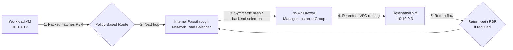
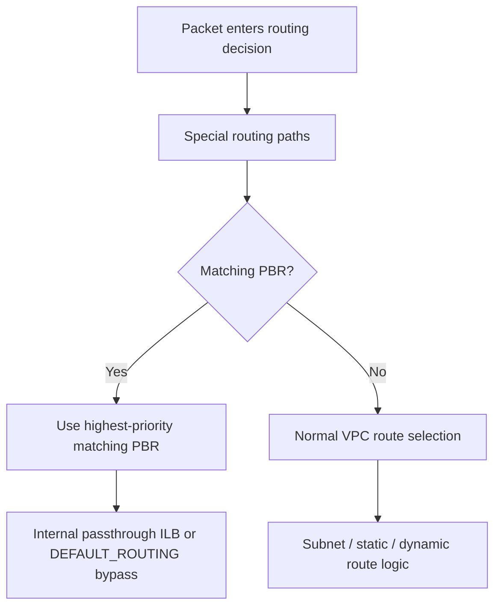
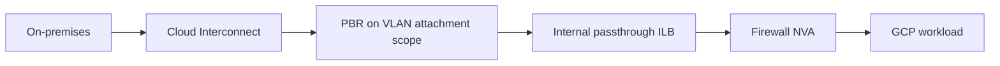
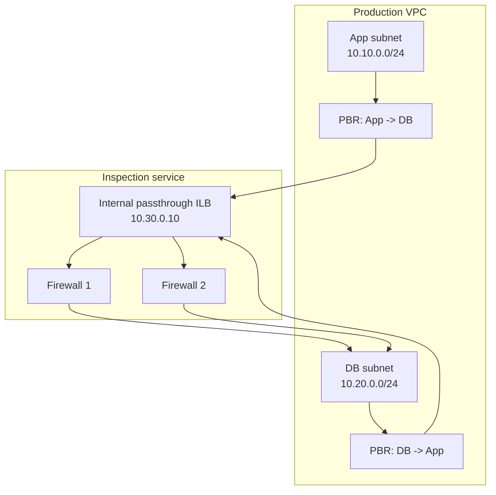
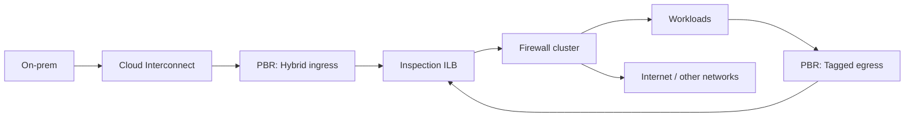

# Google Cloud Policy-Based Routing (PBR) — Comprehensive Study Guide

> **Topic:** Google Cloud Virtual Private Cloud (VPC) Policy-Based Routes  
> **Last reviewed:** 2026-09-05  
> **Primary sources:**  
> https://docs.cloud.google.com/vpc/docs/policy-based-routes  
> https://docs.cloud.google.com/vpc/docs/use-policy-based-routes  
> https://docs.cloud.google.com/vpc/docs/routes  
> https://docs.cloud.google.com/load-balancing/docs/internal/setting-up-ilb-next-hop  
> https://docs.cloud.google.com/load-balancing/docs/internal/ilb-next-hop-overview  
> https://cloud.google.com/blog/products/networking/routing-in-a-google-cloud-vpc-network  
> https://cloud.google.com/blog/products/networking/policy-based-routing-network-patterns-for-virtual-appliances  
> https://registry.terraform.io/providers/hashicorp/google/latest/docs/resources/network_connectivity_policy_based_route

## Overview

Google Cloud **Policy-Based Routing (PBR)** lets you select a next hop using more than the packet's destination prefix. A policy-based route can classify traffic using:

- Source IP range
- Destination IP range
- IP protocol (`TCP`, `UDP`, or `ALL`)
- Route scope, such as:
  - all eligible VMs/VPN tunnels/Interconnect attachments in the VPC
  - only VMs with selected network tags
  - VLAN attachments in one region or all regions

The usual next hop is an **internal passthrough Network Load Balancer (ILB)** whose backend instances are **network virtual appliances (NVAs)** such as third-party firewalls, routers, IDS/IPS appliances, NAT gateways, or other packet-processing systems.

The core reason to use PBR is **service insertion**. Instead of relying only on topology and destination-prefix routing, you can intentionally redirect selected flows through a security or networking appliance.

## Why PBR exists

Traditional VPC routing is fundamentally destination-based. The network decides how to forward a packet by looking for a matching route to the destination IP address.

That is not always enough.

Examples:

- You want traffic from one application tier to pass through a firewall before reaching another tier.
- You want only a subset of VMs to use a centralized NVA.
- You want traffic entering from Cloud Interconnect to be inspected before reaching workloads.
- You want internet-bound traffic from selected instances to use a custom appliance instead of the normal default path.
- You need a bypass policy for Google APIs, Private Service Connect, GKE control-plane ranges, or other sensitive destinations.

PBR gives you an additional policy stage that is evaluated before normal subnet, static, and dynamic routes, subject to Google Cloud's special route-path behavior.

## Key architectural idea

The most common design looks like this:



### What this diagram means

1. A workload emits a packet.
2. Google Cloud checks whether a matching PBR applies to that packet and endpoint.
3. The packet is redirected to the internal passthrough Network Load Balancer.
4. The ILB selects a healthy NVA backend.
5. The NVA inspects, filters, NATs, or routes the packet.
6. When the NVA sends the packet back into the VPC fabric, another routing lookup occurs.
7. You must design the **return path** carefully so stateful firewalls see both directions of a session.

## Official Google Cloud traffic-flow image


**What this image shows:** A workload VM that would normally reach another VM directly through a local VPC subnet route is redirected by a policy-based route to an internal Layer-4 load balancer, which forwards the traffic to an NVA group before the traffic reaches the final destination.

**What matters:** PBR can override the normal destination-based route choice for the selected flow. This is what makes east-west firewall insertion possible without redesigning the entire VPC around multiple transit subnets.

**What to verify:** Confirm that the source VM is in PBR scope, the source/destination/protocol match criteria are correct, the ILB is healthy, the NVA backend has IP forwarding enabled, and the return path is symmetric.

Source page: https://cloud.google.com/blog/products/networking/routing-in-a-google-cloud-vpc-network

## PBR is Layer 3 / Layer 4 policy, not application routing

PBR operates on IP information.

It can match:

- source IP
- destination IP
- protocol

It does **not** match:

- TCP or UDP port number
- URL
- hostname
- HTTP method
- user identity
- application ID

Therefore, PBR should be viewed as a **Layer 3 / Layer 4 service-insertion feature**, not an application-aware policy engine.

If you need application-layer filtering, the NVA or firewall behind the ILB performs that function.

## Control plane versus data plane

### Control plane

The control plane contains:

- the PBR resource
- route classification criteria
- route priority
- network scope
- VM network tags or Interconnect scope
- internal passthrough ILB frontend
- backend service
- health checks
- NVA backend instance group

The PBR itself does not process packets. It programs forwarding intent in Google Cloud's virtual networking fabric.

### Data plane

The data plane performs the actual packet forwarding:

1. Packet exits a VM, VPN tunnel, or eligible Interconnect attachment.
2. Special routing paths are considered.
3. Matching PBRs are evaluated.
4. If a PBR wins, the packet is sent to the ILB next hop.
5. ILB chooses a healthy backend.
6. NVA processes the original packet.
7. Packet returns to the VPC fabric.
8. A new forwarding decision is made.

## Routing order

Google Cloud documentation states that policy-based routes are evaluated before subnet routes, static routes, and dynamic routes, but after special routing paths.

A simplified mental model is:



This explains why PBR is useful for forced service insertion: it is evaluated before the normal destination-based routes.

## PBR priority behavior

Lower numeric priority values are preferred.

For example:

| Route | Priority | Result |
|---|---:|---|
| `pbr-bypass-googleapis` | 100 | Wins if it matches |
| `pbr-inspect-app` | 500 | Used if priority-100 route does not match |
| `pbr-inspect-all` | 1000 | Lower preference |

Important: PBR does **not** use longest-prefix match as the tie-breaker between multiple equally prioritized PBRs.

If two PBRs have the same priority and both match, Google Cloud can select one using an internal algorithm. For predictable operation, give PBRs in the same VPC unique priorities.

## The next hop

A PBR next hop is normally the IP address of a valid **internal passthrough Network Load Balancer**.

The ILB:

- is regional
- can use global access
- fronts one or more NVA instances
- uses health checks
- provides backend resiliency
- can preserve original packet addressing because it is a passthrough load balancer
- is used as a service insertion point

Google recommends enabling **global access** for the ILB when traffic can originate in other regions.

The backend NVA VMs must have **IP forwarding enabled**.

## Why put an ILB in front of NVAs?

Directing PBR to a single firewall VM would create a single point of failure and would make scaling more difficult.

Using an internal passthrough ILB provides:

- health-based backend selection
- multiple firewall/router instances
- scale-out appliance architecture
- more resilient service insertion
- flow distribution
- a stable next-hop IP for the PBR
- better support for stateful appliance patterns when symmetry is designed correctly

## Official NVA insertion image


**What this image shows:** Policy-based routing steers selected traffic toward an internal load balancer, while the load balancer provides resilience and affinity across a group of virtual appliances.

**What matters:** PBR is the traffic-steering mechanism; the ILB provides resilient appliance abstraction. These are separate roles.

**What to verify:** Ensure the PBR points to the ILB frontend address, not directly to an appliance VM, and validate ILB backend health.

Source page: https://cloud.google.com/blog/products/networking/policy-based-routing-network-patterns-for-virtual-appliances

# Common use cases

## 1. East-west firewall inspection

Example:

- VM1: `10.10.0.2`
- VM2: `10.10.0.3`
- firewall ILB VIP: `10.10.10.20`

Without PBR:

```text
10.10.0.2 -> local VPC subnet route -> 10.10.0.3
```

With PBR:

```text
10.10.0.2 -> PBR -> 10.10.10.20 ILB -> firewall -> 10.10.0.3
```

This is useful when you want intra-VPC flows to cross a stateful security appliance.

## 2. Selective internet egress through a firewall

You can apply a PBR only to VMs with a network tag such as:

```text
inspect-egress
```

Then direct their `0.0.0.0/0` traffic to the firewall ILB.

This provides a policy-driven egress design where only selected workloads use the custom firewall path.

Be careful with `0.0.0.0/0`. Broad PBRs can accidentally intercept Google API, Private Service Connect, GKE, or control-plane traffic.

## 3. Hybrid-cloud ingress inspection from Cloud Interconnect

You can scope PBR to VLAN attachments for Cloud Interconnect in:

- a specific region
- all regions

Example flow:



This lets you inspect hybrid traffic without making every workload subnet depend on the same topology.

Note: Only Cloud Interconnect VLAN attachments using **Dataplane v2** can use PBR.

## 4. Traffic steering for different workload classes

Use VM network tags:

```text
pci
restricted
legacy
inspection-required
```

You can apply PBR only to VMs with those tags.

This is useful when some workloads must cross a firewall and others should use normal routing.

## 5. Custom NAT or routing appliances

PBR can direct selected flows toward NVAs that perform:

- custom NAT
- routing
- firewalling
- IDS/IPS
- traffic analysis
- protocol gateways

The PBR is only responsible for steering; the appliance performs the actual packet-processing function.

# Configuration prerequisites

Before creating the PBR:

1. Install or update the Google Cloud CLI.
2. Enable the Network Connectivity API.
3. Create or identify the target VPC.
4. Create an internal passthrough Network Load Balancer.
5. Prefer enabling global access if traffic can originate from multiple regions.
6. Ensure NVA backend VMs have IP forwarding enabled.
7. Configure health checks.
8. Configure firewall rules that allow health checks and appliance data traffic.
9. Confirm your return-path design.
10. Ensure the account has the necessary IAM permissions.

Google documents `roles/compute.networkAdmin` as the predefined role commonly used for PBR operations.

## Enable the Network Connectivity API

```cli
gcloud services enable networkconnectivity.googleapis.com
```

## Verify API enablement

```cli
gcloud services list --enabled \
  --filter="NAME:networkconnectivity.googleapis.com"
```

Success means the Network Connectivity API appears in the output.

# Google Cloud Console procedure

Google currently exposes PBR creation in the **Routes** interface.

## Create a PBR in the Console

1. Open **VPC network > Routes**.
2. Click **Route management**.
3. Click **Create route**.
4. Enter the route **Name**.
5. Optionally enter a **Description**.
6. Under **Network**, choose the VPC.
7. Under **Route type**, select **Policy-based route**.
8. Select the **IP version**.
9. In **Route scope**, choose one of:
   - all VMs, VLAN attachments, and VPN tunnels
   - selected VMs by network tag
   - VLAN attachments
10. In **Classification criteria**, enter:
    - **Source IP range**
    - **Destination IP range**
    - **Protocol**
11. Enter the **Priority**.
12. In **Next hop**, select:
    - an internal passthrough Network Load Balancer forwarding-rule IP, or
    - **Skip other policy-based routes**
13. Click **Create**.

## What to verify before clicking Create

- The source CIDR is what you intend.
- The destination CIDR does not unintentionally include Google APIs or GKE control-plane ranges.
- The VM tags are correct.
- The PBR priority is unique.
- The next-hop IP is the ILB frontend IP.
- The ILB belongs to the same VPC or an allowed peered VPC.
- ILB backend health is green.
- Your return path will pass through the correct stateful NVA if required.

# Console route-table screenshot


**What this image shows:** The effective route table contains a policy-based route with a selected source/destination match and VM tag scope.

**What matters:** The PBR appears alongside normal routing information, but it is evaluated according to the PBR stage of the routing order rather than as a simple longest-prefix route.

**What to verify:** Confirm the policy's source, destination, priority, and scope/tag information match your intended workload set.

Source page: https://cloud.google.com/blog/products/networking/routing-in-a-google-cloud-vpc-network

# gcloud CLI examples

## Example 1 — VM1 to VM2 through a firewall

The following example is adapted from Google's documented PBR pattern:

```cli
gcloud network-connectivity policy-based-routes create pbr1 \
  --source-range=10.10.0.2/32 \
  --destination-range=10.10.0.3/32 \
  --ip-protocol=ALL \
  --protocol-version=IPv4 \
  --network="projects/<PROJECT_ID>/global/networks/vpc1" \
  --next-hop-ilb-ip=10.10.10.20 \
  --description="intra-vpc traffic inspection route" \
  --priority=500 \
  --tags=client
```

### Placeholder explanation

- `<PROJECT_ID>`: GCP project ID
- `vpc1`: VPC containing the source workload
- `10.10.0.2/32`: source VM
- `10.10.0.3/32`: destination VM
- `10.10.10.20`: ILB frontend VIP
- `client`: network tag on the source VM
- priority `500`: PBR preference relative to other PBRs

## Example 2 — Inspect all egress from tagged VMs

```cli
gcloud network-connectivity policy-based-routes create pbr-egress-inspection \
  --source-range=0.0.0.0/0 \
  --destination-range=0.0.0.0/0 \
  --ip-protocol=ALL \
  --protocol-version=IPv4 \
  --network="projects/<PROJECT_ID>/global/networks/prod-vpc" \
  --next-hop-ilb-ip=10.20.10.10 \
  --description="send tagged workload egress to firewall service" \
  --priority=1000 \
  --tags=inspect-egress
```

This is intentionally broad. In production, pair a design like this with higher-priority bypass PBRs for destinations that must not traverse the NVA.

## Example 3 — Bypass PBR for Google Private API VIPs

Google documents the Private Google Access VIPs:

- `private.googleapis.com`: `199.36.153.8/30`
- `restricted.googleapis.com`: `199.36.153.4/30`

A higher-priority skip rule can allow selected traffic to continue into the normal routing process.

```cli
gcloud network-connectivity policy-based-routes create pbr-bypass-restricted-googleapis \
  --source-range=0.0.0.0/0 \
  --destination-range=199.36.153.4/30 \
  --ip-protocol=ALL \
  --protocol-version=IPv4 \
  --network="projects/<PROJECT_ID>/global/networks/prod-vpc" \
  --next-hop-other-routes=DEFAULT_ROUTING \
  --description="bypass firewall PBR for restricted.googleapis.com VIP" \
  --priority=100 \
  --tags=inspect-egress
```

A separate route can be created for `199.36.153.8/30` if required.

The important detail is that the bypass route has a **lower numeric priority** than the general inspection PBR.

## Example 4 — Apply PBR to Interconnect VLAN attachments

```cli
gcloud network-connectivity policy-based-routes create pbr-interconnect-inspection \
  --source-range=10.100.0.0/16 \
  --destination-range=10.20.0.0/16 \
  --ip-protocol=ALL \
  --protocol-version=IPv4 \
  --network="projects/<PROJECT_ID>/global/networks/transit-vpc" \
  --next-hop-ilb-ip=10.20.10.10 \
  --description="inspect traffic entering from interconnect" \
  --priority=500 \
  --interconnect-attachment-region=us-central1
```

To apply the PBR to all eligible Interconnect attachments in the VPC:

```cli
--interconnect-attachment-region=all
```

## List PBRs

```cli
gcloud network-connectivity policy-based-routes list
```

## Describe a PBR

```cli
gcloud network-connectivity policy-based-routes describe pbr1
```

Useful fields to inspect include:

- name
- network
- filter
- source range
- destination range
- protocol
- priority
- next hop
- VM tags or Interconnect scope
- warnings

## Delete a PBR

PBRs cannot be updated in place. To change one, delete and recreate it.

```cli
gcloud network-connectivity policy-based-routes delete pbr1
```

# Terraform

The current HashiCorp Google provider resource is:

```text
google_network_connectivity_policy_based_route
```

## Terraform example — existing ILB

This is the cleanest approach when the firewall/NVA load balancer already exists.

```hcl
terraform {
  required_providers {
    google = {
      source  = "hashicorp/google"
      version = "~> 7.0"
    }
  }
}

provider "google" {
  project = var.project_id
  region  = var.region
}

variable "project_id" {
  type = string
}

variable "region" {
  type    = string
  default = "us-central1"
}

variable "network_name" {
  type    = string
  default = "prod-vpc"
}

variable "firewall_ilb_ip" {
  type        = string
  description = "Frontend IP address of the internal passthrough Network Load Balancer"
}

data "google_compute_network" "prod" {
  name = var.network_name
}

resource "google_network_connectivity_policy_based_route" "inspect_egress" {
  name        = "pbr-inspect-egress"
  description = "Inspect tagged workloads through the firewall ILB"
  network     = data.google_compute_network.prod.id
  priority    = 1000

  filter {
    protocol_version = "IPV4"
    ip_protocol      = "ALL"
    src_range        = "0.0.0.0/0"
    dest_range       = "0.0.0.0/0"
  }

  next_hop_ilb_ip = var.firewall_ilb_ip

  virtual_machine {
    tags = ["inspect-egress"]
  }

  labels = {
    purpose = "firewall-inspection"
  }
}
```

## Terraform bypass PBR

```hcl
resource "google_network_connectivity_policy_based_route" "bypass_restricted_googleapis" {
  name        = "pbr-bypass-restricted-googleapis"
  description = "Bypass inspection PBR for restricted Google APIs VIP"
  network     = data.google_compute_network.prod.id
  priority    = 100

  filter {
    protocol_version = "IPV4"
    ip_protocol      = "ALL"
    src_range        = "0.0.0.0/0"
    dest_range       = "199.36.153.4/30"
  }

  next_hop_other_routes = "DEFAULT_ROUTING"

  virtual_machine {
    tags = ["inspect-egress"]
  }
}
```

## Terraform Interconnect-scoped PBR

```hcl
resource "google_network_connectivity_policy_based_route" "interconnect_inspection" {
  name        = "pbr-interconnect-inspection"
  description = "Inspect selected hybrid traffic entering through Cloud Interconnect"
  network     = data.google_compute_network.prod.id
  priority    = 500

  filter {
    protocol_version = "IPV4"
    ip_protocol      = "ALL"
    src_range        = "10.100.0.0/16"
    dest_range       = "10.20.0.0/16"
  }

  next_hop_ilb_ip = var.firewall_ilb_ip

  interconnect_attachment {
    region = "us-central1"
  }
}
```

To apply to all eligible attachments, the provider supports:

```hcl
interconnect_attachment {
  region = "all"
}
```

# Terraform lab skeleton for the ILB/NVA side

The following is a teaching skeleton. It demonstrates the major objects required around a next-hop ILB. It is not a vendor firewall deployment and does not replace the appliance vendor's deployment guide.

```hcl
resource "google_compute_network" "inspection" {
  name                    = "inspection-vpc"
  auto_create_subnetworks = false
}

resource "google_compute_subnetwork" "inspection" {
  name          = "inspection-subnet"
  region        = var.region
  network       = google_compute_network.inspection.id
  ip_cidr_range = "10.20.10.0/24"
}

resource "google_compute_health_check" "nva" {
  name = "nva-health-check"

  tcp_health_check {
    port = 22
  }
}

resource "google_compute_instance_template" "nva" {
  name_prefix  = "nva-"
  machine_type = "e2-medium"

  can_ip_forward = true

  disk {
    source_image = "debian-cloud/debian-12"
    auto_delete  = true
    boot         = true
  }

  network_interface {
    network    = google_compute_network.inspection.id
    subnetwork = google_compute_subnetwork.inspection.id
  }

  metadata_startup_script = <<-EOT
    #!/bin/bash
    sysctl -w net.ipv4.ip_forward=1
  EOT
}

resource "google_compute_region_instance_group_manager" "nva" {
  name               = "nva-mig"
  region             = var.region
  base_instance_name = "nva"
  target_size        = 2

  version {
    instance_template = google_compute_instance_template.nva.id
  }
}

resource "google_compute_region_backend_service" "nva" {
  name                  = "nva-ilb-backend"
  region                = var.region
  load_balancing_scheme = "INTERNAL"
  protocol              = "TCP"
  health_checks         = [google_compute_health_check.nva.id]
  session_affinity      = "CLIENT_IP"

  backend {
    group = google_compute_region_instance_group_manager.nva.instance_group
  }
}

resource "google_compute_address" "nva_ilb" {
  name         = "nva-ilb-ip"
  region       = var.region
  address_type = "INTERNAL"
  subnetwork   = google_compute_subnetwork.inspection.id
  address      = "10.20.10.10"
}

resource "google_compute_forwarding_rule" "nva_ilb" {
  name                  = "nva-ilb-fr"
  region                = var.region
  load_balancing_scheme = "INTERNAL"
  network               = google_compute_network.inspection.id
  subnetwork            = google_compute_subnetwork.inspection.id
  backend_service       = google_compute_region_backend_service.nva.id
  ip_address            = google_compute_address.nva_ilb.address
  ip_protocol           = "TCP"
  ports                 = ["80"]
  allow_global_access   = true
}
```

### Important note about ports and protocol

Google documents an important next-hop behavior: when an internal passthrough Network Load Balancer is used as a route next hop, the forwarding rule's configured TCP/UDP port does not limit the packet protocols/ports forwarded as route-next-hop traffic in the way an ordinary service VIP would.

For designs that intentionally use multiple L3 protocols as normal ILB traffic, Google also supports `L3_DEFAULT` with an `UNSPECIFIED` backend service and all ports. Follow the load-balancer documentation for your specific appliance design.

# End-to-end Terraform example

Once the ILB VIP exists, add the PBR:

```hcl
resource "google_network_connectivity_policy_based_route" "workload_to_nva" {
  name        = "pbr-workload-to-nva"
  description = "Steer selected workload traffic through NVA service"
  network     = google_compute_network.inspection.id
  priority    = 500

  filter {
    protocol_version = "IPV4"
    ip_protocol      = "ALL"
    src_range        = "10.20.20.0/24"
    dest_range       = "10.30.30.0/24"
  }

  next_hop_ilb_ip = google_compute_address.nva_ilb.address

  virtual_machine {
    tags = ["client"]
  }

  depends_on = [
    google_compute_forwarding_rule.nva_ilb
  ]
}
```

# Terraform workflow

```cli
terraform init
terraform fmt
terraform validate
terraform plan
terraform apply
```

After deployment:

```cli
gcloud network-connectivity policy-based-routes list
gcloud network-connectivity policy-based-routes describe pbr-workload-to-nva
```

# Packet flow example — east-west inspection

Assume:

```text
Source workload:        10.10.0.2
Destination workload:   10.10.0.3
Firewall ILB:           10.10.10.20
Firewall backends:      10.10.10.11-13
PBR priority:           500
VM network tag:         client
```

## Forward path

1. `10.10.0.2` sends a packet to `10.10.0.3`.
2. A normal VPC route exists for the destination subnet.
3. Before that route is used, Google Cloud evaluates PBR.
4. PBR matches:
   - source `10.10.0.2/32`
   - destination `10.10.0.3/32`
   - protocol `ALL`
   - VM tag `client`
5. Packet is sent to ILB `10.10.10.20`.
6. ILB picks a healthy firewall NVA.
7. NVA permits the packet and returns it to the VPC fabric.
8. NVA itself should not accidentally match the same workload PBR, otherwise recursive re-steering can occur.
9. Normal routing forwards the packet to `10.10.0.3`.

## Return path

For a stateful firewall, you generally want:

```text
10.10.0.3 -> same firewall service -> 10.10.0.2
```

This might require:

- a separate reverse-direction PBR
- appropriate tags on the destination-side workloads
- a design that preserves symmetric flow selection

# Return-path image


**What this image shows:** Return traffic from workloads can be matched by a PBR and sent to the internal passthrough ILB so the same NVA service processes both directions.

**What matters:** Stateful appliances depend on bidirectional visibility. If only one direction traverses the firewall, sessions can fail even though basic routing looks correct.

**What to verify:** Validate that the reverse-direction source/destination matches the intended PBR and that the appliance sees both directions of the same session.

Source page: https://cloud.google.com/blog/products/networking/policy-based-routing-network-patterns-for-virtual-appliances

# Symmetry and stateful firewalls

Stateful firewalls maintain session state.

If forward traffic uses:

```text
VM-A -> Firewall-A -> VM-B
```

but return traffic uses:

```text
VM-B -> direct route -> VM-A
```

the firewall sees only half the flow.

Potential symptoms:

- SYN packets seen but no valid return state
- reset connections
- application timeouts
- firewall drops marked as asymmetric or out-of-state
- traffic works for stateless protocols but not stateful applications

PBR design is therefore not just about the forward path. Always design both directions.

# Bypass policies

One of the most important PBR design techniques is the **skip PBR**.

A skip PBR uses:

```text
nextHopOtherRoutes = DEFAULT_ROUTING
```

or:

```cli
--next-hop-other-routes=DEFAULT_ROUTING
```

A higher-priority skip route lets matching traffic bypass lower-priority inspection PBRs and continue through the normal VPC routing process.

Typical bypass candidates include:

- Google API VIPs
- Private Service Connect addresses
- GKE control-plane addresses
- appliance management networks
- monitoring/health-check destinations
- destinations that must not cross the NVA

# GKE considerations

PBR can interfere with GKE.

Google specifically warns against PBR destination ranges that include:

- GKE node IP addresses
- Pod IP addresses
- private control-plane endpoints

For private GKE clusters, pay special attention to the `--master-ipv4-cidr` control-plane range.

A broad `0.0.0.0/0` PBR can be dangerous in a VPC that also hosts GKE.

# Private Service Connect considerations

PBR cannot route packets to Private Service Connect endpoints or backends in the ordinary NVA-service-insertion manner.

Recommended approach:

- limit PBR scope using tags
- avoid unnecessarily broad source/destination matches
- create higher-priority `DEFAULT_ROUTING` bypass PBRs where appropriate

# Google APIs and services

Google Cloud does not support forcing traffic to Google APIs and services through other VM instances or custom next hops such as NVA backends behind a next-hop ILB.

Therefore, if a broad inspection PBR includes Google API ranges, design bypasses.

Documented Private Google Access VIPs:

```text
private.googleapis.com     199.36.153.8/30
restricted.googleapis.com  199.36.153.4/30
```

# Cloud Interconnect considerations

PBR can be scoped to VLAN attachments, but:

- it cannot target only one specific VLAN attachment
- scope is regional or all eligible attachments
- only Dataplane v2 VLAN attachments can use PBR

# VPC Peering behavior

Policy-based routes are **not exported across VPC Network Peering**.

However, Google allows the PBR's next-hop ILB to reside in:

- the same VPC
- a VPC connected through VPC Network Peering

Do not confuse:

- **route propagation** — PBR itself is not exchanged through peering
- **next-hop placement** — an ILB in a peered VPC can be a valid PBR next hop when requirements are met

# Network Connectivity Center behavior

PBRs are not exchanged between Network Connectivity Center spokes and hubs.

If you are building a large transit architecture, account for this explicitly rather than assuming PBR becomes a transit-wide policy object.

# IPv6

PBR supports IPv4 and IPv6.

If you create an IPv6 PBR:

- specify `IPv6`
- use IPv6 source/destination ranges
- use an IPv6 next-hop ILB address
- ensure the ILB subnets are configured with IPv6 ranges

# Important limitations

| Limitation | Operational impact |
|---|---|
| No port matching | Cannot send TCP/443 one way and TCP/80 another using PBR alone |
| No in-place update | Delete and recreate route to change it |
| No PBR propagation over VPC Peering | PBR policy is local to the VPC |
| No PBR propagation through NCC | Must create policy where needed |
| PSC endpoint/backend restrictions | Use bypass rules and careful scoping |
| GKE risk | Avoid intercepting node, pod, and control-plane ranges |
| Interconnect requires Dataplane v2 | Legacy VLAN attachments cannot use PBR |
| Equal priority is nondeterministic | Use unique priority values |
| Dedicated ILB VIP required | Shared ILB VIPs are unsupported for PBR next hop |
| NVA needs IP forwarding | Otherwise the appliance cannot transit arbitrary source traffic |

# Verification

## 1. Verify the PBR exists

```cli
gcloud network-connectivity policy-based-routes list
```

## 2. Describe the route

```cli
gcloud network-connectivity policy-based-routes describe <ROUTE_NAME>
```

Check:

- correct network
- correct priority
- correct source and destination
- correct protocol
- correct VM tags or Interconnect scope
- correct ILB IP
- warnings

## 3. Check VM network tags

```cli
gcloud compute instances describe <INSTANCE_NAME> \
  --zone=<ZONE> \
  --format="get(tags.items)"
```

If the tag is missing, the PBR will not apply to that VM when using tag scope.

## 4. Check ILB backend health

```cli
gcloud compute backend-services get-health <BACKEND_SERVICE_NAME> \
  --region=<REGION>
```

Success means the intended NVA backend instances are healthy.

## 5. Check IP forwarding on NVA VMs

```cli
gcloud compute instances describe <NVA_INSTANCE> \
  --zone=<ZONE> \
  --format="get(canIpForward)"
```

Expected result:

```text
True
```

## 6. Validate with Connectivity Tests

Google Cloud **Network Intelligence Center Connectivity Tests** supports PBR.

Use it to evaluate:

- source endpoint
- destination endpoint
- PBR match
- next hop
- firewall rules
- routing behavior

This is one of the best first tools when the packet path is not behaving as expected.

## 7. Use packet capture on the NVA

On Linux-based appliances:

```cli
sudo tcpdump -ni any host 10.10.0.2 and host 10.10.0.3
```

What to verify:

- forward packet reaches NVA
- source and destination are preserved as expected
- return packet reaches the same inspection path
- no unexpected NAT is occurring

## 8. Use VPC Flow Logs

Enable VPC Flow Logs on relevant subnets to confirm:

- source
- destination
- bytes
- accepted/denied flows
- workload endpoints

Flow Logs do not replace firewall packet captures but are very useful for path correlation.

# Troubleshooting by symptom

## Symptom: PBR exists but traffic bypasses the firewall

Check:

1. **Scope**
   - Is the source VM tagged correctly?
   - Is the PBR scoped to the correct VPC?
   - For Interconnect, is the correct region used?

2. **Classification**
   - Does source CIDR include the actual source?
   - Does destination CIDR include the actual destination?
   - Is the protocol correct?

3. **Priority**
   - Is a higher-priority skip PBR matching first?

4. **Special routing path**
   - Is this traffic handled by a Google special route path?

5. **Unsupported destination**
   - Is the destination a PSC endpoint or Google API path that should not be forced through an NVA?

Next action: run Connectivity Tests and describe the PBR.

## Symptom: Traffic reaches the ILB but not the NVA

Check:

- backend service health
- health-check firewall rules
- instance-group membership
- NVA boot state
- forwarding rule address
- network/subnet placement

Next action:

```cli
gcloud compute backend-services get-health <BACKEND_SERVICE> \
  --region=<REGION>
```

## Symptom: NVA receives traffic but destination is unreachable

Check:

- `canIpForward`
- guest OS IP forwarding
- appliance routing table
- appliance policy
- return route
- SNAT/DNAT behavior
- VPC firewall rules
- destination-side route/PBR

Failure at this stage often means the PBR itself is functioning correctly and the problem is inside or beyond the appliance.

## Symptom: Forward direction works but application sessions fail

Likely cause: asymmetry.

Check:

- reverse-direction PBR
- ILB session-affinity design
- whether both directions hit the same stateful NVA
- appliance session table

Next action: packet-capture both directions and inspect firewall session state.

## Symptom: Google APIs stop working after adding `0.0.0.0/0` inspection

Likely cause: broad PBR interception.

Check for:

- `199.36.153.8/30`
- `199.36.153.4/30`
- PSC endpoint addresses
- Google API destinations

Next action: add a higher-priority `DEFAULT_ROUTING` bypass PBR for the required Google API ranges.

## Symptom: GKE control plane loses communication

Likely cause: PBR destination overlaps node, pod, or control-plane address ranges.

Next action:

- identify the cluster node CIDR
- identify pod CIDRs
- identify control-plane private endpoint range
- remove overlap or create carefully designed bypasses

## Symptom: Changing Terraform fields forces replacement

Expected behavior.

Google PBR resources cannot be updated in place. Terraform changes can therefore produce delete/recreate behavior.

Review `terraform plan` carefully before applying.

# Common mistakes

1. Treating PBR as longest-prefix routing.
2. Giving multiple matching PBRs the same priority.
3. Forgetting that lower priority number wins.
4. Applying a `0.0.0.0/0` PBR to all VMs without bypasses.
5. Forgetting return-path symmetry.
6. Putting the NVA itself in the same tag scope and causing re-steering.
7. Forgetting `can_ip_forward`.
8. Forgetting guest/appliance IP forwarding.
9. Using a shared ILB VIP.
10. Expecting PBR to match TCP/UDP ports.
11. Expecting PBR to propagate over VPC Peering.
12. Expecting PBR to propagate through Network Connectivity Center.
13. Intercepting GKE control-plane, node, or pod ranges.
14. Sending Google API traffic to an NVA.
15. Forgetting ILB global access when sources are in multiple regions.
16. Assuming PBR automatically creates a firewall policy; it only redirects traffic.

# Design example — centralized inspection



This design inserts a resilient stateful firewall service between application and database tiers.

# Design example — hybrid ingress and workload egress



This pattern shows how PBR can be attached to different ingress/egress points while reusing the same appliance service.

# PBR versus normal static routes

| Feature | Static route | Policy-based route |
|---|---|---|
| Matches destination | Yes | Yes |
| Matches source | No | Yes |
| Matches IP protocol | No | Yes |
| Matches VM network tags | Some static-route tag patterns exist, but behavior differs | Yes, explicit PBR scope |
| Evaluated before normal VPC routes | No | Yes |
| Typical NVA use | Destination-prefix steering | Selective service insertion |
| Can skip other PBRs | No | Yes |
| Longest-prefix behavior | Yes in normal route evaluation | PBR matching is not longest-prefix selection |

# PBR versus firewall policy

Do not confuse the two.

**PBR answers:**

> Where should this packet go next?

**Firewall policy answers:**

> Should this traffic be allowed, denied, inspected, NATed, or logged?

In an NVA design:

```text
PBR -> sends packet to firewall
Firewall -> applies security policy
```

# Configuration summary

## Minimum viable PBR

```cli
gcloud network-connectivity policy-based-routes create <ROUTE_NAME> \
  --source-range=<SOURCE_CIDR> \
  --destination-range=<DEST_CIDR> \
  --ip-protocol=ALL \
  --protocol-version=IPv4 \
  --network="projects/<PROJECT_ID>/global/networks/<VPC_NAME>" \
  --next-hop-ilb-ip=<ILB_IP> \
  --priority=<PRIORITY>
```

## Tagged VM version

```cli
... \
  --tags=<NETWORK_TAG>
```

## Interconnect version

```cli
... \
  --interconnect-attachment-region=<REGION_OR_ALL>
```

## Bypass version

```cli
... \
  --next-hop-other-routes=DEFAULT_ROUTING
```

# Key takeaways

- GCP PBR is primarily a **service-insertion mechanism**.
- It matches **source, destination, protocol, and scope**, not ports.
- Matching PBRs are considered before normal subnet/static/dynamic routing.
- The usual next hop is an **internal passthrough Network Load Balancer**.
- The ILB fronts one or more **NVA/firewall backends**.
- NVA VMs must support packet forwarding.
- Stateful firewall designs require **symmetric forward and return paths**.
- Broad PBRs should be paired with carefully designed **bypass routes**.
- PBR does not propagate through **VPC Peering** or **Network Connectivity Center**.
- GKE, Private Service Connect, and Google APIs require special care.
- PBRs cannot be modified in place; changes require delete/recreate.
- Unique priorities are important because equal-priority PBRs are not resolved by longest-prefix matching.
- Use **Connectivity Tests**, backend health checks, VM-tag verification, Flow Logs, and packet capture when troubleshooting.

# Sources

## Google Cloud documentation

- https://docs.cloud.google.com/vpc/docs/policy-based-routes
- https://docs.cloud.google.com/vpc/docs/use-policy-based-routes
- https://docs.cloud.google.com/vpc/docs/routes
- https://docs.cloud.google.com/vpc/docs/quota
- https://docs.cloud.google.com/load-balancing/docs/internal/setting-up-ilb-next-hop
- https://docs.cloud.google.com/load-balancing/docs/internal/ilb-next-hop-overview
- https://docs.cloud.google.com/load-balancing/docs/internal
- https://docs.cloud.google.com/load-balancing/docs/internal/setting-up-ilb-multiple-protocols
- https://docs.cloud.google.com/network-connectivity/docs/reference/networkconnectivity/rest/v1/projects.locations.global.policyBasedRoutes
- https://docs.cloud.google.com/sdk/gcloud/reference/network-connectivity/policy-based-routes/create
- https://docs.cloud.google.com/sdk/gcloud/reference/network-connectivity/policy-based-routes/describe

## Google Cloud architecture/blog material

- https://cloud.google.com/blog/products/networking/routing-in-a-google-cloud-vpc-network
- https://cloud.google.com/blog/products/networking/policy-based-routing-network-patterns-for-virtual-appliances

## Terraform

- https://registry.terraform.io/providers/hashicorp/google/latest/docs/resources/network_connectivity_policy_based_route
- https://docs.cloud.google.com/load-balancing/docs/internal/int-tcp-udp-lb-tf-module-examples

## Image URLs used

- https://storage.googleapis.com/gweb-cloudblog-publish/images/10-pbr-traffic-flow.max-2200x2200.png
- https://storage.googleapis.com/gweb-cloudblog-publish/images/11-pbr-route.max-1400x1400.png
- https://storage.googleapis.com/gweb-cloudblog-publish/images/NVA_Blog_Figure_2.max-1000x1000.jpg
- https://storage.googleapis.com/gweb-cloudblog-publish/images/NVA_Blog_Figure_5.max-1000x1000.jpg
