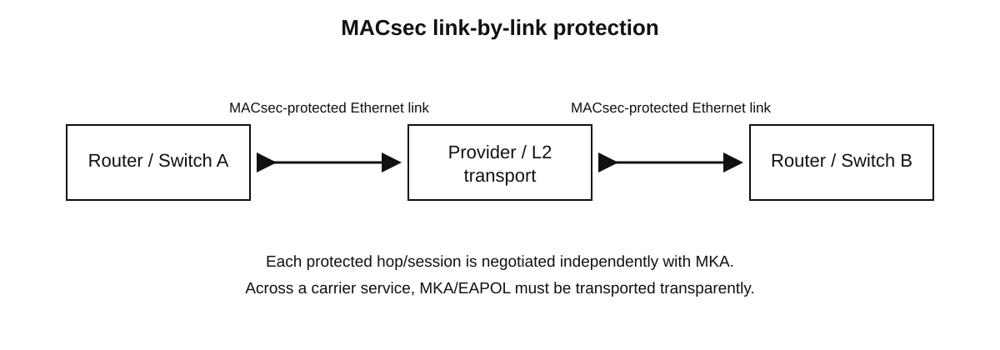
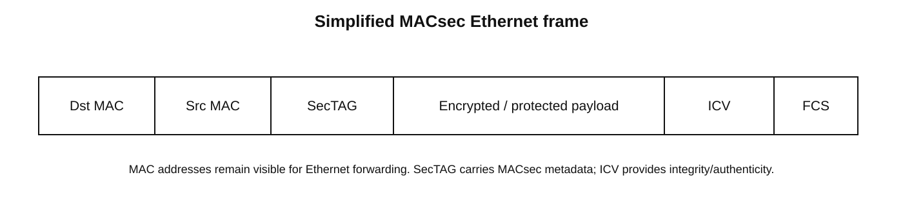

# MACsec (IEEE 802.1AE) — Comprehensive Network Engineering Study Guide

> **Topic:** Media Access Control Security (MACsec), IEEE 802.1AE, MACsec Key Agreement (MKA), Connectivity Association Keys (CAKs), Secure Association Keys (SAKs), WAN MACsec, replay protection, verification, and troubleshooting.
>
> **Primary sources**
> - https://www.cisco.com/c/en/us/td/docs/iosxr/cisco8000/macsec/configuration-guide/macsec-config-guide-cisco8000/fundamentals-of-macsec-encryption-overview/key-concepts-for-macsec-encryption.html
> - https://www.cisco.com/c/en/us/td/docs/routers/ios/config/17-x/sec-vpn/b-security-vpn/m_wan_macsec_MKA_support_enhancements.html
> - https://www.juniper.net/documentation/us/en/software/junos/security-services/security-services.pdf
>
> **Supporting sources**
> - https://www.cisco.com/c/en/us/support/docs/routers/catalyst-8500-series-edge-platforms/222261-configure-wan-macsec-on-catalyst-8500-wi.html
> - https://www.cisco.com/c/en/us/td/docs/switches/datacenter/nexus7000/sw/security/config/cisco_nexus7000_security_config_guide_8x/configuring_macsec_key_agreement.html
> - https://www.juniper.net/documentation/us/en/software/junos/cli-reference/topics/ref/statement/macsec-edit-security.html
> - https://www.juniper.net/documentation/us/en/software/junos/cli-reference/topics/ref/statement/security-mode-edit-security-macsec.html
> - https://www.juniper.net/documentation/us/en/software/junos/cli-reference/topics/ref/statement/cipher-suite-edit-security-macsec.html
> - https://www.juniper.net/documentation/us/en/software/junos/cli-reference/topics/ref/statement/macsec-eapol-addressmx-series.html

## Overview

**Media Access Control Security (MACsec)** is an IEEE 802.1AE Layer 2 security technology that protects Ethernet traffic on a link. Its major goals are **confidentiality, integrity, origin authenticity, and replay protection**. Cisco describes MACsec as standards-based Layer 2 hop-by-hop encryption; Juniper describes it as security for point-to-point Ethernet links.

MACsec is useful when the physical or provider Ethernet path cannot be fully trusted but you want encryption below Layer 3. Common uses include campus access, switch-to-switch trunks, router-to-router links, data-center interconnects, Metro Ethernet, and WAN Layer 2 services.

A critical design point: **MACsec protects Ethernet links, not arbitrary end-to-end IP paths**. If traffic crosses multiple independently secured hops, each MACsec adjacency protects its own hop.



**What this image shows:** A simplified link-by-link MACsec deployment across Ethernet-facing nodes.

**What matters:** MACsec is applied to Ethernet links. Across a provider network, the service must transparently carry the frames and MKA/EAPOL control traffic required by the deployment.

**What to verify:** Confirm both endpoints support the same MACsec mode/cipher and that intermediate transport does not consume MKA/EAPOL frames.

## Why use MACsec?

| Requirement | MACsec fit |
|---|---|
| Encrypt Ethernet links at Layer 2 | Excellent |
| Preserve normal IP routing/BGP/OSPF behavior above the link | Excellent |
| Protect campus access/trunks | Excellent when supported |
| Protect Metro Ethernet / E-Line / E-LAN | Good if provider transparently carries required frames |
| Encrypt an arbitrary routed Internet path | Poor; use IPsec/TLS instead |
| Encrypt selected applications only | Poor; use TLS/application security |

### MACsec vs IPsec

**MACsec operates at Layer 2.** It protects Ethernet frames on a link.

**IPsec operates at Layer 3.** It protects IP packets and can build routed tunnels across multiple hops.

MACsec is often attractive for directly connected high-speed links because routing protocols continue to operate normally over the secured Ethernet. IPsec is normally a better fit when security endpoints are separated by an arbitrary routed network.

## Architecture and core concepts

### Connectivity Association (CA)

A **Connectivity Association** is the logical security relationship among MACsec participants permitted to communicate securely.

### Connectivity Association Key (CAK)

The **CAK** is bootstrap key material used by MKA to authenticate participants and protect key-management operations. In static-CAK deployments, matching CAK material is configured on both peers.

### Connectivity Association Key Name (CKN)

The **CKN** identifies the CAK. It is not itself the traffic-encryption key.

### MACsec Key Agreement (MKA)

**MKA** manages the secure MACsec relationship. It authenticates participants, selects/elects a **key server**, distributes fresh Secure Association Keys, and maintains/rekeys Secure Associations.

MKA protocol data units (MKPDUs) are carried in **EAPOL** (Extensible Authentication Protocol over LAN). The commonly used EAPOL destination MAC is `01:80:C2:00:00:03`. Cisco and Juniper documentation both note that provider equipment can consume/drop such link-local frames unless they are transparently carried or an alternate supported destination is configured.

### Secure Association Key (SAK)

The **SAK** is the key used by the MACsec data plane to protect Ethernet frames. MKA distributes and rotates SAKs.

### Secure Channel (SC)

A **Secure Channel** is a unidirectional MACsec security relationship associated with a transmitting participant.

### Secure Association (SA)

A **Secure Association** is an instance inside a Secure Channel that uses a particular SAK. Multiple SAs enable smooth key rotation.

### Secure Channel Identifier (SCI)

The **SCI** uniquely identifies a Secure Channel. It is commonly derived from the system MAC address and a port identifier.

## Control-plane behavior: MKA

A useful operational sequence is:

1. **Peer discovery** — peers exchange MKPDUs using EAPOL.
2. **Peer authentication** — peers prove possession of the appropriate CAK or derive key material through a dynamic authentication process.
3. **Key-server election** — MKA determines which participant becomes key server.
4. **SAK generation/distribution** — the key server creates fresh traffic-protection keys and distributes them securely.
5. **SA installation** — devices program active transmit/receive Secure Associations into the data plane.
6. **Rekeying** — new SAKs/SAs are installed before old ones are retired.

Cisco Nexus documentation illustrates the process as PSK configuration → ICV validation → key-server selection → SAK distribution → encrypted data exchange.

## Data-plane behavior

Once MKA establishes usable Secure Associations, the MACsec data path protects eligible Ethernet frames.



**What this image shows:** Destination/source MAC addresses, MACsec Security Tag (SecTAG), protected payload, Integrity Check Value (ICV), and FCS.

**What matters:** Ethernet source and destination MAC addresses remain visible for forwarding. MACsec inserts security metadata and protects the payload using authenticated encryption. Cisco documentation states that MACsec encrypts the frame except for the source and destination MAC addresses.

**What to verify:** On a capture point between peers, original Layer 3/Layer 4 payload should not be readable when encryption is active, while Ethernet addressing remains visible.

### Cipher suites

Common MACsec cipher suites use **Galois/Counter Mode Advanced Encryption Standard (GCM-AES)**:

- `GCM-AES-128`
- `GCM-AES-256`

Juniper documents GCM-AES-128 and GCM-AES-256 support on applicable platforms. Exact cipher support is hardware/software dependent.

### Integrity without encryption

Some implementations can apply MACsec integrity/authentication without confidentiality. Juniper documents that in supported modes, traffic can remain cleartext while the MACsec header and integrity checks still apply.

## Replay protection

MACsec tracks packet numbers associated with a Secure Association. Receivers can reject duplicated or old frames.

A **replay window** permits limited out-of-order delivery. This is important with link aggregation or provider transports that may reorder frames.

- Too small a replay window can drop legitimate reordered packets.
- Too large a replay window accepts a broader sequence range.
- Disabling replay protection removes a meaningful security control.

Cisco IOS XE supports `macsec replay-protection window-size <N>` on applicable platforms.

## Static CAK vs dynamic CAK

### Static CAK / pre-shared key

Static CAK is common for infrastructure links.

**Advantages:**
- Simple control plane.
- No PKI/RADIUS dependency.
- Predictable for router-to-router and switch-to-switch links.

**Tradeoffs:**
- Key distribution is sensitive.
- Rotation must be planned.
- Large environments require disciplined secrets management.

### Dynamic CAK

Dynamic CAK typically relies on **IEEE 802.1X**, often using **EAP-TLS**, to authenticate and derive keying material.

**Advantages:**
- Scales better for identity-driven/access deployments.
- Centralized authentication and certificate lifecycle.

**Tradeoffs:**
- AAA/PKI dependencies.
- More components to troubleshoot.
- Support varies by platform/interface.

Juniper documents dynamic CAK for switch-to-host scenarios and notes that dynamic mode is not supported on logical interfaces in the cited reference.

## WAN MACsec

WAN MACsec enables practical MACsec deployments across transparent Layer 2 services such as E-Line, E-LAN, EoMPLS, VPLS, and similar transport.

The key issue is **control-frame transparency**. Because MKA uses EAPOL, provider devices can terminate/filter the default link-local destination.

Cisco Nexus documentation notes support in certain releases for alternate EAPOL destination MAC/EtherType values. Juniper also supports configurable EAPOL destination addressing on applicable platforms.

### Provider questions to ask

1. Does the service pass EAPOL/MKA end-to-end?
2. Does it preserve required source/destination MAC behavior?
3. Are link-local multicast MAC addresses filtered?
4. Can the service reorder frames enough to affect replay protection?
5. Does the service MTU accommodate MACsec overhead?
6. Are VLAN/QinQ tags preserved as expected?
7. Are there bandwidth or ASIC restrictions for MACsec line-rate encryption?

## MTU and overhead

MACsec adds SecTAG and ICV overhead. Frames that were already near the maximum MTU can exceed the physical or provider service limit after MACsec is enabled.

Juniper documents `enable-auto-mtu-update` on supported platforms/releases to account for MACsec header overhead, but this is platform-specific.

Verify:
- Physical-interface MTU.
- Logical/subinterface MTU.
- Provider service MTU.
- Any MPLS/VXLAN/QinQ overhead.
- Layer 3 PMTU behavior.

## Link aggregation / Port-Channel considerations

Cisco IOS XE documentation includes a Port-Channel example where MACsec is configured on **member interfaces** and notes that the interfaces should be shut before enabling or removing MACsec in that documented procedure.

Important questions:
- Is MACsec applied per physical member or on the bundle?
- Does each member require unique keying material?
- How does frame reordering affect replay counters?
- What happens during member failure/rejoin?
- Is every participating port backed by MACsec-capable hardware?

## Cisco IOS XE static-PSK example

The following pattern is based on Cisco IOS XE WAN MACsec/MKA documentation. Replace placeholders with platform-approved key material.

```cli
key chain MACSEC-KC macsec
 key 01
  key-string <MACSEC_PRESHARED_KEY>
  cryptographic-algorithm aes-128-cmac
!
mka policy MACSEC-POLICY
 macsec-cipher-suite gcm-aes-256
!
interface GigabitEthernet0/0/0
 mka policy MACSEC-POLICY
 mka pre-shared-key key-chain MACSEC-KC
 macsec
 macsec replay-protection window-size 10
```

### Command explanation

`key chain MACSEC-KC macsec`
: Creates a MACsec key chain.

`key 01`
: Defines a key entry/identifier. Cisco has release-specific CKN behavior; validate requirements for the exact software train.

`key-string <MACSEC_PRESHARED_KEY>`
: Configures secret keying material. Never place production CAKs in source control.

`cryptographic-algorithm aes-128-cmac`
: Defines the key-chain authentication/integrity algorithm shown in the documented IOS XE example.

`mka policy MACSEC-POLICY`
: Creates an MKA policy.

`macsec-cipher-suite gcm-aes-256`
: Requests GCM-AES-256 traffic protection where supported.

`mka pre-shared-key key-chain MACSEC-KC`
: Associates the static MACsec key chain with the interface.

`macsec`
: Enables MACsec on the interface.

`macsec replay-protection window-size 10`
: Uses a 10-packet replay acceptance window in this example.

### Expected success

The interface remains operational, MKA forms a live session, a key server is selected, SAKs are installed, and protected transmit/receive counters increase.

## Cisco Port-Channel pattern

Cisco's IOS XE example applies MACsec to Port-Channel member interfaces:

```cli
interface TenGigabitEthernet0/1/1
 mka policy policy1
 mka pre-shared-key key-chain kc1
 macsec
 channel-group 2 mode active
!
interface TenGigabitEthernet0/1/2
 mka policy policy1
 mka pre-shared-key key-chain kc2
 macsec
 channel-group 2 mode active
```

Do not assume identical syntax across Catalyst, ASR, C8500, Nexus, or IOS XR. MACsec is highly ASIC/interface dependent.

## Junos static-CAK pattern

Juniper's MACsec guides define a **connectivity association** and then apply it to an interface. A representative study pattern is:

```cli
set security macsec connectivity-association CA_BASIC security-mode static-cak
set security macsec connectivity-association CA_BASIC pre-shared-key ckn <CKN_HEX>
set security macsec connectivity-association CA_BASIC pre-shared-key cak <CAK_HEX>
set security macsec interfaces <INTERFACE_NAME> connectivity-association CA_BASIC
```

The exact hierarchy and key formats vary by Junos release/platform. Validate with current CLI help and the platform's MACsec guide before committing.

## Dynamic MACsec / 802.1X concept

```text
Endpoint/Peer A             AAA / RADIUS / PKI              Endpoint/Peer B
     |                              |                              |
     |--- 802.1X / EAP-TLS -------->|                              |
     |<-- authentication result ----|                              |
     |                              |<-------- EAP-TLS ------------|
     |                              |--------- result ------------->|
     |                                                             |
     |<================ MKA / EAPOL ===============================>|
     |      CAK relationship, key-server election, SAK distribution|
     |<================= encrypted MACsec data ====================>|
```

Exact behavior depends on authenticator/supplicant roles and the platform implementation.

## Packet/session flow

1. An upper-layer payload reaches the egress Ethernet interface.
2. Normal switching/routing determines destination MAC/VLAN handling.
3. MACsec selects the active transmit Secure Association.
4. A packet number is assigned.
5. A SecTAG is inserted.
6. Protected fields are encrypted/authenticated with the active SAK.
7. An ICV is appended.
8. The peer identifies the Secure Channel/Secure Association.
9. Replay logic validates the packet number.
10. Integrity/authenticity validation checks the ICV.
11. The payload is decrypted if confidentiality is enabled.
12. The original Ethernet payload is delivered to the normal forwarding pipeline.

## Failover and convergence

MACsec does not replace switching/routing convergence.

### Physical-link failure

When the interface goes down, routing/switching protocols react normally. MACsec state for that adjacency is lost or suspended with the link.

### Rekey

MKA installs a new Secure Association before retiring the old one. Implementations are designed for hitless or near-hitless rekeying when healthy.

### Peer restart

After reboot, MKA must re-establish the relationship and reinstall SAKs. With fail-closed/must-secure policy, data remains blocked until security is restored.

### Bundle-member failure

In a supported LAG design, remaining members may continue forwarding using their own MACsec state. Test real hardware behavior, especially replay counters and rejoin events.

## Must-secure vs should-secure

Some Cisco platforms expose policies equivalent to:

- **must-secure** — do not forward unprotected data when MACsec cannot be established.
- **should-secure** — prefer MACsec but potentially permit cleartext depending on implementation.

Fail-closed operation is stronger security but turns MKA/keying errors into outages. Monitoring is essential.

## Verification

Exact commands vary by Cisco family/software release. Representative Cisco-style checks include:

```cli
show mka sessions
show mka sessions detail
show macsec interface
```

Verify exact command syntax for the target device.

### What to look for

- MKA session is secured/live.
- Peer MAC/SCI is expected.
- Key-server role is stable.
- Cipher suite matches policy.
- Active transmit and receive SAs exist.
- Packet numbers advance.
- Protected/encrypted counters increment.
- Invalid ICV, late, and replay counters remain zero or explainable.
- Rekey events complete normally.
- Unexpected cleartext counters do not increase.

### Packet-capture verification

A capture on the provider-facing wire should show:
- Source/destination MAC addresses.
- EAPOL/MKA during establishment/rekey.
- MACsec framing/SecTAG.
- Unreadable IP/TCP/UDP payload when encryption is enabled.

A capture inside a switch/router may show plaintext if the capture point is before encryption or after decryption.

## Common mistakes

1. Treating MACsec as an IP tunnel.
2. Provider service drops EAPOL/MKA.
3. CAK/CKN mismatch.
4. Cipher mismatch.
5. Static CAK on one side and dynamic CAK on the other.
6. MTU not adjusted for MACsec overhead.
7. Replay window too small for actual reordering.
8. Unsupported port, transceiver mode, or line card.
9. MACsec applied at the wrong interface scope.
10. Unexpected outage caused by must-secure/fail-closed behavior.
11. Production CAKs committed to Git.
12. Assuming every packet-capture point shows ciphertext.

## Troubleshooting by symptom

### Symptom: MKA session never appears

**Where:** Both endpoints and the provider Ethernet path.

**Check:**
- Interface up/up?
- Matching CAK/CKN?
- Same security mode?
- EAPOL transmitted/received?
- Provider filtering link-local multicast?
- Correct alternate EAPOL destination if the WAN design needs it?

**Success:** Both peers exchange MKPDUs and join the same Connectivity Association.

**Failure means:** Control-plane adjacency cannot form.

**Next action:** Capture provider-facing traffic and prove EAPOL delivery before changing cryptography.

### Symptom: MKA is up but traffic does not pass

Check active SAKs, cipher compatibility, bidirectional SAs, ICV errors, replay/late counters, VLAN state, MTU, and fail-closed policy.

**Success:** Protected TX/RX counters increase in both directions without integrity/replay errors.

### Symptom: Small pings work, large packets fail

Likely **MTU/overhead**.

Check physical/logical/provider MTU and any VLAN/MPLS/VXLAN/QinQ overhead. Use controlled DF-bit testing where appropriate.

### Symptom: Intermittent drops on a Port-Channel

Check MACsec state per member, LACP churn, replay/late counters, per-member key/policy consistency, and provider reordering.

### Symptom: Session fails only across provider service

Test the same peers back-to-back. If local MACsec works, verify the carrier transports EAPOL destination `01:80:C2:00:00:03` or configure a supported alternate destination/L2 protocol tunneling method.

## Security and operational guidance

- Store CAKs in an enterprise secrets manager.
- Prefer unique keys per link/security domain.
- Plan overlapping key lifetimes for rotation.
- Monitor rekey, ICV, and replay counters.
- Prefer hardware-supported cipher suites for high-throughput links.
- Test fail-closed behavior before production.
- Lab-test interoperability when mixing vendors.
- Document provider EAPOL/L2 protocol handling.
- Remember that MACsec complements, not replaces, firewalling, routing policy, endpoint authentication, and application security.

## Configuration summary

| Item | Purpose | Peer relationship |
|---|---|---|
| MACsec enablement | Turns on link protection | Both ends required |
| Security mode | Static CAK vs dynamic CAK | Must be compatible |
| CKN | Identifies CAK | Must match as required |
| CAK | Bootstraps/authenticates MKA | Must match/derive consistently |
| Cipher suite | Data-plane cryptography | Must be compatible |
| Replay policy/window | Anti-replay behavior | Operationally compatible |
| EAPOL destination handling | Carries MKA | Transport must pass it |
| MTU | Accommodates overhead | Entire path must support effective size |

## Key takeaways

- MACsec is **Layer 2 Ethernet security** standardized by **IEEE 802.1AE**.
- **MKA** establishes and maintains the secure relationship.
- **CAK/CKN** bootstrap and identify the association; **SAKs** protect actual data frames.
- MACsec commonly uses **GCM-AES** and can provide confidentiality plus integrity/authenticity.
- Replay protection is based on packet numbers and an acceptance window.
- WAN MACsec succeeds only when the provider service carries MKA/EAPOL correctly.
- Hardware/interface/software support is as important as configuration syntax.
- MTU, Port-Channel behavior, provider frame handling, and key lifecycle are common failure points.
- Verify both **control plane** (MKA/key server/SAKs) and **data plane** (protected counters/ICV/replay behavior).

## Sources

1. Cisco 8000 MACsec Configuration Guide — Key concepts for MACsec encryption  
   https://www.cisco.com/c/en/us/td/docs/iosxr/cisco8000/macsec/configuration-guide/macsec-config-guide-cisco8000/fundamentals-of-macsec-encryption-overview/key-concepts-for-macsec-encryption.html
2. Cisco IOS XE 17 Security and VPN Configuration Guide — WAN MACsec and MKA Support Enhancements  
   https://www.cisco.com/c/en/us/td/docs/routers/ios/config/17-x/sec-vpn/b-security-vpn/m_wan_macsec_MKA_support_enhancements.html
3. Cisco Catalyst 8500 — Configure WAN MACsec on subinterfaces  
   https://www.cisco.com/c/en/us/support/docs/routers/catalyst-8500-series-edge-platforms/222261-configure-wan-macsec-on-catalyst-8500-wi.html
4. Cisco Nexus 7000 — Configuring MACsec Key Agreement  
   https://www.cisco.com/c/en/us/td/docs/switches/datacenter/nexus7000/sw/security/config/cisco_nexus7000_security_config_guide_8x/configuring_macsec_key_agreement.html
5. Juniper Junos Security Services Administration Guide — MACsec examples  
   https://www.juniper.net/documentation/us/en/software/junos/security-services/security-services.pdf
6. Juniper `macsec` CLI reference  
   https://www.juniper.net/documentation/us/en/software/junos/cli-reference/topics/ref/statement/macsec-edit-security.html
7. Juniper `security-mode` MACsec reference  
   https://www.juniper.net/documentation/us/en/software/junos/cli-reference/topics/ref/statement/security-mode-edit-security-macsec.html
8. Juniper `cipher-suite` MACsec reference  
   https://www.juniper.net/documentation/us/en/software/junos/cli-reference/topics/ref/statement/cipher-suite-edit-security-macsec.html
9. Juniper `eapol-address` MACsec reference  
   https://www.juniper.net/documentation/us/en/software/junos/cli-reference/topics/ref/statement/macsec-eapol-addressmx-series.html

---

> **Version/platform caution:** MACsec support is highly dependent on device family, ASIC/line card, interface type, transceiver mode, software release, and whether the deployment uses physical interfaces, subinterfaces, or link aggregation. Treat the examples as study references grounded in vendor documentation, not as universal syntax for every platform.