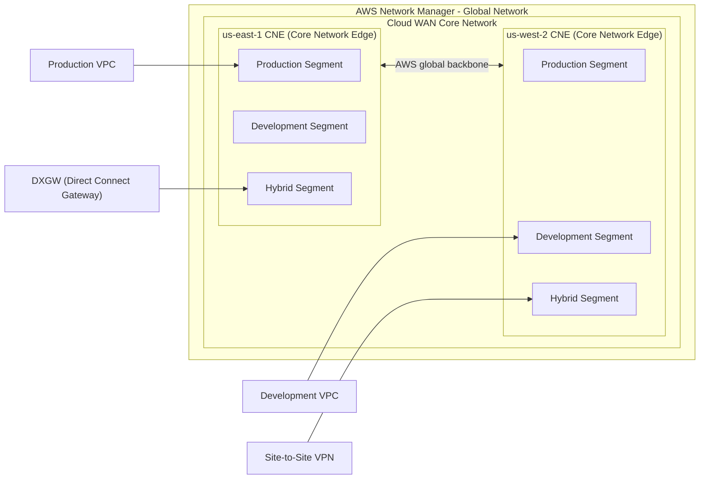
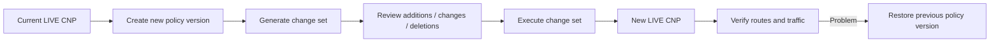
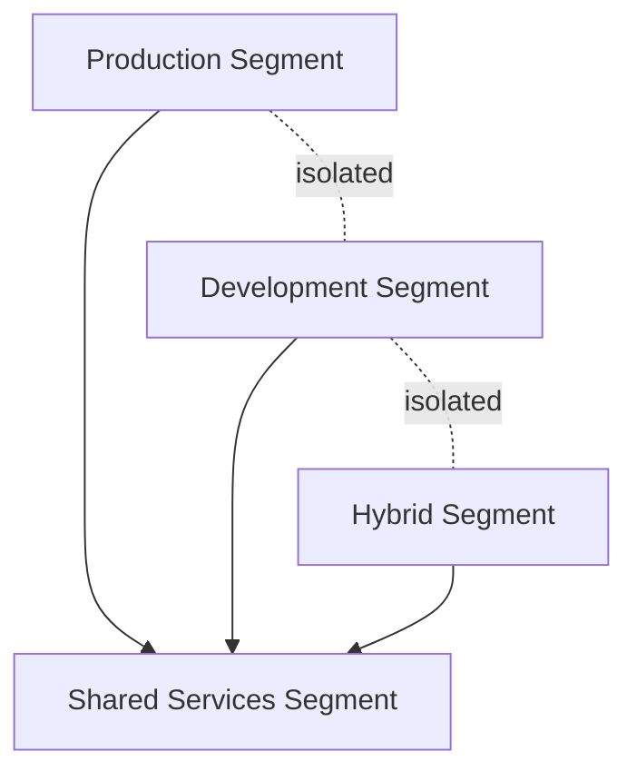
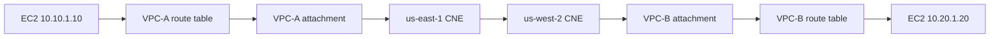
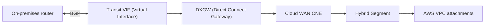
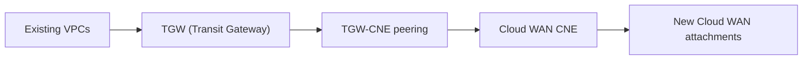
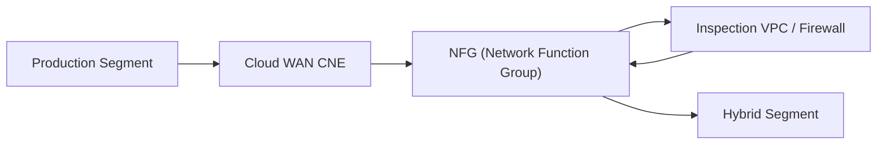
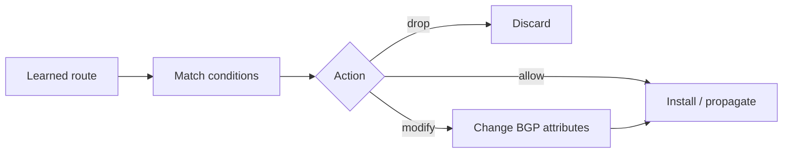
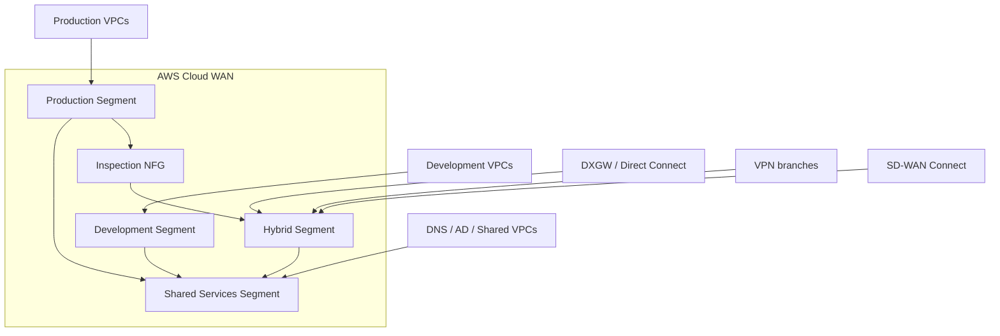

# AWS Cloud WAN — Comprehensive Network Engineering Study Guide

> **Topic:** AWS Cloud WAN  
> **Generated:** 2026-09-05  
> **Updated:** 2026-09-05 — expanded AWS networking acronyms and terms inline for easier reading  
> **Scope:** Architecture, Core Network Policy, segmentation, routing, Direct Connect, VPN/Connect, service insertion, Routing Policy, packet flow, configuration, verification, scale, pricing, and troubleshooting.

## Supplied and supporting URLs

### Primary AWS documentation
- https://docs.aws.amazon.com/network-manager/latest/cloudwan/what-is-cloudwan.html
- https://docs.aws.amazon.com/network-manager/latest/cloudwan/cloudwan-policies-json.html
- https://docs.aws.amazon.com/network-manager/latest/cloudwan/cloudwan-policy-examples.html
- https://docs.aws.amazon.com/network-manager/latest/cloudwan/cloudwan-routing-policies.html
- https://docs.aws.amazon.com/network-manager/latest/cloudwan/cloudwan-policy-service-insertion.html
- https://docs.aws.amazon.com/network-manager/latest/cloudwan/cloudwan-vpc-attachment.html
- https://docs.aws.amazon.com/network-manager/latest/cloudwan/cloudwan-dxattach-about.html
- https://docs.aws.amazon.com/network-manager/latest/cloudwan/cloudwan-quotas.html
- https://docs.aws.amazon.com/network-manager/latest/cloudwan/cloudwan-metrics.html
- https://docs.aws.amazon.com/cli/latest/reference/networkmanager/

### AWS architecture and feature references
- https://docs.aws.amazon.com/whitepapers/latest/aws-vpc-connectivity-options/aws-cloud-wan.html
- https://aws.amazon.com/blogs/networking-and-content-delivery/simplify-global-hybrid-connectivity-with-aws-cloud-wan-and-aws-direct-connect-integration/
- https://aws.amazon.com/blogs/networking-and-content-delivery/simplify-hybrid-inspection-using-aws-cloud-wan-service-insertion/
- https://aws.amazon.com/blogs/networking-and-content-delivery/aws-cloud-wan-routing-policy-fine-grained-controls-for-your-global-network-part-1/
- https://aws.amazon.com/cloud-wan/pricing/

---

## Quick acronym and term glossary

Use this table whenever an AWS Cloud WAN acronym appears later in the guide.

| Term | Meaning |
|---|---|
| **AWS Cloud WAN** | AWS managed global Layer 3 WAN service. |
| **WAN (Wide Area Network)** | A network connecting geographically separated sites, data centers, branches, or cloud Regions. |
| **VPC (Virtual Private Cloud)** | An isolated virtual network inside AWS. |
| **CNE (Core Network Edge)** | The AWS-managed **regional router** for a Cloud WAN Core Network. Each enabled Cloud WAN Region has a CNE. |
| **CNP (Core Network Policy)** | The JSON policy that defines Cloud WAN Regions, segments, attachment classification, sharing, routing, and service insertion. |
| **Segment** | A Cloud WAN Layer 3 routing domain, similar in concept to a VRF. |
| **VRF (Virtual Routing and Forwarding)** | A logically separate routing table/routing domain on a router. |
| **Attachment** | The logical connection that joins a VPC, VPN, Direct Connect gateway, TGW route table, or SD-WAN resource to Cloud WAN. |
| **NFG (Network Function Group)** | A logical group of firewall or other network-function attachments used for service insertion. |
| **TGW (Transit Gateway)** | AWS regional Layer 3 transit hub for VPCs, VPNs, and Direct Connect. |
| **DX (Direct Connect)** | AWS dedicated private connectivity between a customer/on-premises network and AWS. |
| **DXGW (Direct Connect Gateway)** | AWS routing construct that connects Direct Connect virtual interfaces to supported AWS routing services such as Cloud WAN. |
| **VIF (Virtual Interface)** | Logical Direct Connect interface carrying BGP and customer routes. A Transit VIF is used with a Direct Connect Gateway. |
| **BGP (Border Gateway Protocol)** | Dynamic routing protocol used to exchange IP prefixes and path attributes. |
| **ASN (Autonomous System Number)** | Number identifying a BGP autonomous routing domain. |
| **VPN (Virtual Private Network)** | Encrypted tunnel used to connect networks over an untrusted transport such as the Internet. |
| **IPsec (Internet Protocol Security)** | Protocol suite used to encrypt and authenticate IP traffic; commonly used by Site-to-Site VPN. |
| **SD-WAN (Software-Defined Wide Area Network)** | Centrally controlled WAN architecture that can steer application traffic over multiple transports. |
| **GRE (Generic Routing Encapsulation)** | Tunneling protocol used by traditional Connect peers. |
| **GWLB (Gateway Load Balancer)** | AWS service that transparently distributes flows across virtual network/security appliances. |
| **ANFW (AWS Network Firewall)** | AWS managed stateful network firewall service. |
| **ECMP (Equal-Cost Multi-Path)** | Forwarding across multiple routes with equal routing cost. |
| **NAT (Network Address Translation)** | Translation of source or destination IP addresses, often used for Internet egress. |
| **CIDR (Classless Inter-Domain Routing)** | Prefix notation such as `10.0.0.0/16`. |
| **NACL (Network Access Control List)** | Stateless subnet-level packet filtering in a VPC. |
| **NVA (Network Virtual Appliance)** | A virtual router, firewall, IDS/IPS, or similar networking appliance. |
| **MTU (Maximum Transmission Unit)** | Largest packet size that can traverse a link/path without fragmentation. |
| **MSS (Maximum Segment Size)** | Maximum TCP payload size advertised by an endpoint. |
| **PMTUD (Path MTU Discovery)** | Process endpoints use to discover the smallest MTU along a path. |
| **HA (High Availability)** | Redundant design intended to keep service available after a component or path failure. |

---

## Overview

**AWS Cloud WAN** is AWS's managed, policy-driven **WAN (Wide Area Network)** service for interconnecting **VPCs (Virtual Private Clouds)**, branch sites, data centers, **VPNs (Virtual Private Networks)**, **SD-WAN (Software-Defined Wide Area Network)** appliances, **TGWs (Transit Gateways)**, and **DXGWs (Direct Connect Gateways)** through a centrally managed global Layer 3 routing fabric.

The most important mental model is:

- **AWS Network Manager** — the management and visualization plane.
- **Global Network** — the top-level logical container in Network Manager.
- **Core Network** — the AWS-managed global Layer 3 WAN fabric.
- **CNE (Core Network Edge)** — the AWS-managed **regional routing node** inside Cloud WAN. Think of a CNE as the Cloud WAN router for one AWS Region.
- **Segment** — a separate global Layer 3 routing domain, similar to a **VRF (Virtual Routing and Forwarding)**.
- **Attachment** — the connection that joins a VPC, VPN, Connect/SD-WAN resource, TGW route table, or DXGW to Cloud WAN.
- **CNP (Core Network Policy)** — the versioned JSON blueprint that defines Regions, segments, attachment policies, sharing, routing behavior, and service insertion.
- **Routing Policy** — advanced route filtering and BGP policy controlling which routes are accepted, advertised, summarized, or modified.
- **NFG (Network Function Group)** — a collection of firewall or network-appliance attachments used when Cloud WAN must steer traffic through inspection.

Cloud WAN is fundamentally a **Layer 3 routed service**. It does not stretch Ethernet broadcast domains between Regions or sites. It exchanges IP reachability and forwards packets according to Cloud WAN routing tables and learned dynamic routes.

---

## Why Cloud WAN exists

A large enterprise often grows into multiple separate AWS networking constructs:

- a **TGW (Transit Gateway)** in each Region
- TGW peering
- **DXGWs (Direct Connect Gateways)**
- Site-to-Site VPN
- SD-WAN appliances
- VPC peering
- many independent route tables
- inspection VPCs
- separate regional routing policies

That model can work, but operational complexity increases rapidly.

Cloud WAN allows the architect to describe intent centrally:

```text
Create Production, Development, Shared Services, and Hybrid routing domains.

Attach workloads by tags.

Allow Production and Development to reach Shared Services.

Keep Production and Development isolated from each other.

Force selected traffic through centralized inspection.

Create Regional Cloud WAN routing nodes and inter-Region connectivity automatically.
```

Cloud WAN then implements the routing intent across the AWS backbone.

---

## Architecture

### AWS reference architecture


**What this image shows**

The AWS diagram shows AWS Network Manager containing a Global Network and a Cloud WAN Core Network. Multiple AWS Regions contain **CNEs (Core Network Edges)**, while Development, Production, and Shared segments span the global core. VPC, VPN, and SD-WAN attachments connect into those routing domains.

**What matters**

The colored segment bars are logical Layer 3 routing domains, not physical links. A segment can exist on multiple CNEs in multiple AWS Regions. AWS creates and manages the inter-CNE connectivity.

**What to verify**

- every required Region has a CNE
- every attachment is associated with the intended segment
- segment sharing is intentional
- route propagation matches the desired isolation model

### Logical topology



### Control plane versus data plane

| Plane | Responsibility |
|---|---|
| **Management plane** | Network Manager, APIs, CLI, policy versions, topology visualization |
| **Control plane** | CNP evaluation, segment membership, route propagation, BGP route learning, CNE route calculation |
| **Data plane** | Actual packet forwarding through a local CNE, the AWS backbone, a remote CNE, and the destination attachment |

The **CNP (Core Network Policy)** is control-plane intent. It does not process packets itself. AWS uses it to build the routing state that the CNEs use to forward packets.

---

## Core concepts

### Global Network (top-level Network Manager container)

A **Global Network** is the top-level container in AWS Network Manager. It is primarily an organizational, management, and monitoring construct.

### Core Network (AWS-managed global Layer 3 fabric)

The **Core Network** is the AWS-managed Layer 3 WAN fabric inside the Global Network.

A Global Network can have one associated Cloud WAN Core Network.

### CNE (Core Network Edge — the regional Cloud WAN router)

A **CNE (Core Network Edge)** is the regional routing point for AWS Cloud WAN.

The simplest way to remember it is:

> **CNE = the AWS-managed Cloud WAN router for one AWS Region.**

When an AWS Region is added to the Core Network Policy, AWS creates a CNE for that Region.

Important characteristics:

- one CNE per enabled Region per Core Network
- attachments connect into a CNE
- CNEs exchange routes across the Cloud WAN core
- inter-CNE traffic travels over the AWS global backbone
- the CNE performs Layer 3 routing for Cloud WAN segments in that Region
- AWS manages the CNE; you do not log into it like a customer router

A useful comparison is:

```text
Traditional enterprise WAN:
Branch -> CE router -> Provider PE router -> WAN -> Provider PE router -> Branch

AWS Cloud WAN:
VPC/Site -> Attachment -> CNE -> AWS backbone -> CNE -> Attachment -> VPC/Site
```

### Segment (Cloud WAN routing domain, similar to a VRF)

A **segment** is a dedicated Layer 3 routing domain.

Conceptually, it is similar to a **VRF (Virtual Routing and Forwarding)** on an enterprise router.

Example:

```text
Production Segment
  us-east-1 CNE routing table
  us-west-2 CNE routing table
  eu-west-1 CNE routing table

Development Segment
  us-east-1 CNE routing table
  us-west-2 CNE routing table
  eu-west-1 CNE routing table
```

Segments are commonly used for:

- Production
- Development
- PCI
- Shared Services
- Corporate
- Partners
- Guest
- IoT
- Hybrid/on-premises
- regulated business units

By default, separate segments represent separate routing domains. Cross-segment reachability is controlled by policy.

### Attachment (connection from a resource into Cloud WAN)

An **attachment** brings a resource into Cloud WAN.

Common attachment types include:

- VPC attachment
- Site-to-Site VPN attachment
- Connect attachment
- Tunnel-less Connect attachment
- TGW route table attachment
- DXGW attachment

An attachment is associated with either:

- a segment, or
- an **NFG (Network Function Group)**

It cannot be simultaneously associated with both.

### CNP (Core Network Policy — the Cloud WAN JSON blueprint)

The **CNP (Core Network Policy)** is the versioned JSON document describing the desired global network.

Important policy sections can include:

```text
version
core-network-configuration
segments
network-function-groups
segment-actions
attachment-policies
routing-policies
attachment-routing-policy-rules
```

AWS converts this declarative policy into actual routing behavior.

---

## Layer 2 and Layer 3 behavior

### Layer 2

Cloud WAN is not an Ethernet extension service.

It does not provide:

- VLAN stretching
- MAC learning across Regions
- STP propagation
- broadcast-domain extension
- native Layer 2 pseudowires

### Layer 3

Cloud WAN provides routed IP connectivity.

Routes can originate from:

- VPC CIDRs
- BGP over Site-to-Site VPN
- BGP through Direct Connect gateway attachments
- BGP over Connect attachments
- TGW route table attachments
- static routes in the Core Network Policy
- segment sharing
- service insertion behavior

---

## Core Network Policy lifecycle

Cloud WAN policies are versioned.



Recommended operational practice:

- store CNP JSON in Git
- peer-review network policy changes
- validate JSON automatically
- review Cloud WAN change sets before execution
- capture pre/post route state
- document a rollback policy version

---

## Example Core Network Policy

The following is an illustrative Cloud WAN policy pattern. Validate values against the current AWS schema before production use.

```json
{
  "version": "2021.12",
  "core-network-configuration": {
    "asn-ranges": ["64512-65534"],
    "edge-locations": [
      {"location": "us-east-1"},
      {"location": "us-west-2"}
    ]
  },
  "segments": [
    {
      "name": "production",
      "description": "Production workloads",
      "require-attachment-acceptance": false
    },
    {
      "name": "development",
      "description": "Development workloads",
      "require-attachment-acceptance": false
    },
    {
      "name": "shared",
      "description": "Shared services",
      "require-attachment-acceptance": true
    }
  ],
  "segment-actions": [
    {
      "action": "share",
      "mode": "attachment-route",
      "segment": "shared",
      "share-with": ["production", "development"]
    }
  ],
  "attachment-policies": [
    {
      "rule-number": 100,
      "condition-logic": "and",
      "conditions": [
        {"type": "tag-exists", "key": "Environment"},
        {
          "type": "tag-value",
          "key": "Environment",
          "operator": "equals",
          "value": "production"
        }
      ],
      "action": {
        "association-method": "constant",
        "segment": "production"
      }
    }
  ]
}
```

### Attachment Policy behavior

An **Attachment Policy** determines where an attachment belongs.

Example question it answers:

```text
This VPC attachment has tag Environment=production.
Which Cloud WAN segment should it join?
```

Rules are processed in rule-number order. The first matching rule is used.

```text
100 = highly specific rule
200 = less specific rule
300 = catch-all rule
```

A broad rule placed first can accidentally classify an attachment into the wrong segment.

Also remember: Cloud WAN evaluates tags on the **attachment**, not merely tags on the attached VPC.

---

## Segmentation design



A common enterprise design is:

| Segment | Purpose | Typical connectivity |
|---|---|---|
| Production | Production VPCs | Shared Services + controlled hybrid connectivity |
| Development | Dev/test VPCs | Shared Services, optional Internet |
| Shared | DNS, AD, monitoring, tooling | Shared into approved segments |
| Hybrid | Data centers and branches | Shared with approved application segments |
| Inspection | Firewall/security services | Commonly represented through an NFG rather than an ordinary workload segment |

### Isolation

A segment can be configured as isolated.

Isolation is especially important for same-segment service insertion. Without isolation, attachments in the same segment may be able to communicate directly instead of traversing the inspection path.

---

## VPC attachments

A **VPC attachment** connects a VPC to a Cloud WAN CNE.

When creating the attachment, select one subnet from each Availability Zone that should participate.

Important considerations:

- select one attachment subnet per AZ
- other subnets in the same AZ can route through the attachment
- VPC route tables still need routes toward Cloud WAN
- Security Groups still apply
- NACLs still apply
- appliance mode is important for stateful inspection designs

### Example VPC route concept

```text
Application subnet route table

10.0.0.0/16     local
10.0.0.0/8      Cloud WAN attachment path
0.0.0.0/0       local or centralized egress design
```

The exact routing depends on whether Cloud WAN carries all traffic, only enterprise RFC1918 prefixes, or selected destinations.

---

## Packet flow: VPC to VPC across Regions

Assume:

```text
VPC-A: 10.10.0.0/16
Region: us-east-1
Segment: Production

VPC-B: 10.20.0.0/16
Region: us-west-2
Segment: Production
```



Flow:

1. EC2 sends the packet to the VPC router.
2. The VPC route table points the destination prefix toward Cloud WAN.
3. The VPC attachment delivers the packet to the local **CNE (Core Network Edge)**.
4. The CNE performs a route lookup in the Production segment.
5. The route points toward the remote CNE.
6. Traffic crosses the AWS global backbone.
7. The remote CNE forwards to the destination VPC attachment.
8. The destination VPC route table forwards to the target subnet.
9. Security Groups and NACLs must permit the traffic.
10. The return path must have valid routing back to the source.

---

## Direct Connect (DX) integration

Modern Cloud WAN supports native **DXGW (Direct Connect Gateway)** attachments.

Older designs often required:

```text
On-premises
   |
Direct Connect
   |
Transit VIF
   |
DXGW
   |
TGW
   |
Cloud WAN peering
```

A modern native design can be:



### Direct Connect route propagation

Inbound:

```text
On-premises BGP
 -> Transit VIF
 -> DXGW
 -> Cloud WAN Direct Connect attachment
 -> CNE segment route table
 -> other CNEs/Regions as policy permits
```

Outbound:

```text
VPC or other attachment route
 -> CNE
 -> Direct Connect attachment
 -> DXGW
 -> Transit VIF
 -> on-premises BGP router
```

Key points:

- a DXGW attachment is associated with a Cloud WAN segment
- multiple DXGWs can connect to the same segment
- different DXGWs can connect to different segments
- BGP path information matters for primary/backup routing
- Cloud WAN Routing Policy can further control route propagation

---

## Site-to-Site VPN (Virtual Private Network)

Cloud WAN can directly attach AWS Site-to-Site VPN connections.

For highly available designs, dynamic routing with **BGP (Border Gateway Protocol)** is generally preferred because routes can be learned and withdrawn dynamically as tunnel state changes.

```text
Branch router
   |
IPsec tunnel
   |
AWS Site-to-Site VPN
   |
Cloud WAN CNE
   |
Segment routing
   |
Destination attachment
```

Dynamically routed VPN paths can participate in ECMP where AWS supports it.

---

## Connect and SD-WAN (Software-Defined Wide Area Network)

Cloud WAN Connect is designed for third-party routers, SD-WAN platforms, and network virtual appliances.

Connect can use:

- GRE-based Connect peers
- Tunnel-less Connect where supported
- BGP for route exchange

Common integrations include:

- Cisco SD-WAN
- Fortinet Secure SD-WAN
- Palo Alto Networks virtual appliances
- branch aggregation routers
- third-party routing/security appliances

Cloud WAN can provide the global AWS transport while the SD-WAN platform continues to provide application steering, branch policy, SLA logic, and security functions.

---

## Transit Gateway (TGW) interoperability

Cloud WAN and TGW can coexist.

This is useful when:

- migrating an existing TGW estate into Cloud WAN
- preserving regional TGWs for legacy resources
- extending TGW route-table segmentation into Cloud WAN
- connecting existing regional designs during a phased migration



This allows gradual migration rather than requiring a big-bang cutover.

---

## Service insertion (steering traffic through firewalls/network appliances)

Cloud WAN service insertion allows traffic to be redirected through centralized network/security functions.

Examples:

- **ANFW (AWS Network Firewall)**
- **GWLB (Gateway Load Balancer)**
- third-party NGFWs
- IDS/IPS appliances
- inspection VPCs
- routing/security NVAs

The key construct is the **NFG (Network Function Group)**.

### NFG (Network Function Group)

An NFG is a logical group of Cloud WAN attachments that contain network functions such as firewalls.



Important considerations:

- an attachment belongs to a segment or an NFG, not both
- inspection VPCs may require appliance mode for stateful path symmetry
- isolated mode is important for same-segment service insertion
- service insertion can steer same-Region and cross-Region traffic
- NFG placement influences latency and inter-Region cost

### `send-via`

`send-via` forces traffic between selected segments through an NFG.

```text
Production
 -> Inspection NFG
 -> Hybrid
```

### `send-to`

`send-to` redirects traffic toward an NFG for a defined use case such as centralized egress.

### Edge override

If inspection exists in selected Regions only, an edge override can influence which inspection Region is used.

This helps avoid unnecessary traffic tromboning and reduces latency/inter-Region data transfer.

---

## Stateful firewall symmetry

Stateful firewalls expect both directions of a session to traverse compatible state.

Bad example:

```text
Forward:
VPC-A -> Firewall-A -> VPC-B

Return:
VPC-B -> Firewall-B -> VPC-A
```

If Firewall-B does not share Firewall-A's session state, the return traffic can be dropped.

Preferred design:

```text
Forward:
VPC-A -> Inspection stack -> VPC-B

Return:
VPC-B -> Same inspection path -> VPC-A
```

Cloud WAN service insertion and appliance mode help support deterministic stateful forwarding.

---

## Routing Policy (advanced route filtering and BGP policy)

A Cloud WAN **Routing Policy** is different from an **Attachment Policy**.

### Attachment Policy

Answers:

```text
Which segment or NFG should this attachment join?
```

### Routing Policy

Answers:

```text
Which routes should be accepted?
Which routes should be dropped?
Which prefixes should be summarized?
How should BGP path attributes be modified?
Which routes should be advertised toward a specific attachment or Region?
```

Routing Policy can provide fine-grained control such as:

- route filtering
- route summarization
- path preference
- BGP communities
- LOCAL_PREF-related policy
- AS_PATH manipulation
- MED manipulation
- route control across attachments
- route control across segment sharing
- route control between CNEs/Regions

Routing policies are directional:

```text
inbound
outbound
```

### Routing-policy pipeline



### Example: overlapping prefix filter

Suppose a VPC exposes:

```text
10.0.0.0/16
10.1.0.0/16
```

but `10.0.0.0/16` overlaps an enterprise network.

Conceptual policy:

```text
IF prefix == 10.0.0.0/16
THEN drop

ELSE allow normal propagation
```

This prevents an overlapping prefix from contaminating the wider routing domain.

### BGP traffic engineering

Routing Policy can support traditional BGP traffic-engineering concepts.

**LOCAL_PREF (Local Preference)**

```text
Preferred path -> higher LOCAL_PREF
Backup path    -> lower LOCAL_PREF
```

**AS_PATH prepending**

```text
Primary advertisement:
64512 65010

Backup advertisement:
64512 64512 64512 65010
```

The longer AS_PATH is typically less preferred by remote BGP routers, all else being equal.

**MED (Multi-Exit Discriminator)** can influence ingress preference under the BGP comparison rules where MED is evaluated.

**BGP communities** are route labels that can be used for classification, filtering, and downstream policy.

---

## Shared Services design

A Shared Services segment commonly contains:

- Active Directory
- DNS
- NTP
- PKI
- logging
- monitoring
- package repositories
- vulnerability scanners
- management hosts
- proxies

Common intent:

```text
Production  ----\
Development -----+--> Shared Services
Hybrid      -----/
```

The goal is usually spoke-to-shared reachability without automatically permitting all spokes to communicate with each other.

---

## Multi-account operation

Cloud WAN can be shared across AWS accounts using **AWS RAM (Resource Access Manager)**.

A common enterprise ownership model is:

```text
Central Network Account
  Cloud WAN Core Network
  CNP
  segmentation
  inspection architecture

Production Account
  Production VPC attachments

Development Account
  Development VPC attachments

Shared Services Account
  DNS / identity / monitoring VPCs
```

The central networking team controls the WAN policy while application teams retain ownership of their VPC resources.

---

## Home Region

AWS Network Manager uses a home Region for aggregated management/topology information.

AWS documentation identifies **US West (Oregon), `us-west-2`**, as the Cloud WAN home Region.

The home Region is a management concept. It does not mean every packet traverses `us-west-2`.

---

## AWS CLI workflow

AWS CLI v2 exposes Cloud WAN through the `networkmanager` command namespace.

Useful commands include:

```cli
aws networkmanager create-global-network
aws networkmanager create-core-network
aws networkmanager put-core-network-policy
aws networkmanager get-core-network-policy
aws networkmanager get-core-network-change-set
aws networkmanager execute-core-network-change-set
aws networkmanager create-vpc-attachment
aws networkmanager create-site-to-site-vpn-attachment
aws networkmanager create-direct-connect-gateway-attachment
aws networkmanager list-attachments
aws networkmanager get-network-routes
aws networkmanager start-route-analysis
aws networkmanager get-route-analysis
aws networkmanager list-core-network-policy-versions
```

### Put a Core Network Policy

```cli
aws networkmanager put-core-network-policy \
  --core-network-id <CORE_NETWORK_ID> \
  --policy-document file://cloudwan-policy.json
```

Where:

- `<CORE_NETWORK_ID>` = the ID of the Cloud WAN Core Network
- `cloudwan-policy.json` = your local CNP JSON file

### Inspect the active policy

```cli
aws networkmanager get-core-network-policy \
  --core-network-id <CORE_NETWORK_ID>
```

### Inspect routes

```cli
aws networkmanager get-network-routes \
  --core-network-id <CORE_NETWORK_ID> \
  --segment-name <SEGMENT_NAME> \
  --edge-location <AWS_REGION>
```

Use this to verify whether a prefix exists in a particular segment and CNE.

---

## Console configuration workflow

1. Open **AWS Network Manager**.
2. Under **Connectivity**, choose **Cloud WAN**.
3. Open the desired **Global network**.
4. Open the **Core network**.
5. Choose **Policy versions**.
6. Create a new policy version.
7. Configure **edge locations** (AWS Regions that need CNEs).
8. Configure **segments**.
9. Configure **attachment policies**.
10. Configure optional **NFGs (Network Function Groups)** and service insertion.
11. Configure optional **Routing Policies**.
12. Generate the change set.
13. Review additions, modifications, and deletions.
14. Execute the change set.
15. Verify attachment state, segment association, routes, BGP, and application traffic.

---

## Verification checklist

### Core Network

Verify:

```text
Core Network state = AVAILABLE
Policy state = LIVE
Expected CNEs exist
Expected segments exist
```

### Attachments

```cli
aws networkmanager list-attachments \
  --core-network-id <CORE_NETWORK_ID>
```

Check:

- attachment type
- attachment state
- AWS account owner
- edge location / Region
- segment or NFG association
- attachment tags

### Routes

```cli
aws networkmanager get-network-routes \
  --core-network-id <CORE_NETWORK_ID> \
  --segment-name production \
  --edge-location us-east-1
```

Verify:

- local VPC routes
- remote-Region routes
- hybrid prefixes
- expected inspection next hop
- no unexpected overlapping prefixes

### Direct Connect

On the customer router verify:

```text
BGP session = Established
Expected AWS prefixes are received
Expected on-premises prefixes are advertised
AS_PATH is sensible
Primary/backup path is correct
```

### VPN

Verify:

```text
IPsec tunnels are UP
BGP sessions are Established
Expected prefixes are sent and received
ECMP behavior matches design
```

### Inspection

Verify both directions:

```text
Forward traffic reaches firewall
Return traffic reaches compatible firewall state
Firewall policy allows the session
NAT behavior is intentional
Appliance mode is enabled where required
```

---

## Route Analysis

AWS Network Manager includes route-analysis functions that help troubleshoot multi-hop Cloud WAN paths.

A path may involve:

```text
VPC route table
 -> VPC attachment
 -> source CNE
 -> service insertion / NFG
 -> remote CNE
 -> destination attachment
 -> destination VPC route table
```

Useful CLI commands include:

```cli
aws networkmanager start-route-analysis
aws networkmanager get-route-analysis
```

Route analysis helps identify the point where reachability stops instead of assuming every failure is BGP-related.

---

## CloudWatch monitoring

Cloud WAN exports metrics to **Amazon CloudWatch**.

Useful monitoring dimensions include:

```text
CoreNetwork
EdgeLocation
Attachment
AvailabilityZone
```

Recommended monitoring areas:

- attachment traffic anomalies
- VPN tunnel state
- Direct Connect/BGP health
- route-count utilization
- attachment and CNE quota utilization
- packet drops where applicable

---

## Scale and quotas

AWS service quotas change, so always validate them in current AWS documentation before production design.

Representative documented defaults include:

| Item | Representative default |
|---|---:|
| Global Networks per AWS account | 5 |
| Core Networks per Global Network | 1 |
| CNEs per Region per Core Network | 1 |
| Segments per Core Network | 40 |
| Core Network Policy size | 1 MB |
| Attachments per Core Network | 5,000 |
| Connect peers per Connect attachment | 4 |
| TGW peers | 50 |
| Direct Connect attachments per Core Network | 40 |
| Routes across all Core Network segments | 10,000 |
| VPN routes advertised to Core Network | 1,000 |
| Routes advertised from Core Network over VPN | 5,000 |
| Connect routes advertised to Core Network | 1,000 |
| Routes advertised from Core Network over Connect | 5,000 |

Representative bandwidth-related limits documented by AWS include:

- VPC attachment: up to 100 Gbps per Availability Zone
- VPC attachment: up to 7.5 million packets per second per AZ
- VPN tunnel: up to approximately 1.25 Gbps
- GRE Connect peer: up to approximately 5 Gbps
- up to four Connect peers per Connect attachment

Always validate current service quotas and platform-specific limits before design approval.

---

## MTU (Maximum Transmission Unit)

AWS documents a Cloud WAN core-network MTU of up to 8500 bytes for supported VPC-to-VPC paths.

Hybrid paths such as VPN can have lower effective MTU because of tunneling overhead.

Important terms:

- **MTU (Maximum Transmission Unit)** — maximum packet size a path supports without fragmentation.
- **MSS (Maximum Segment Size)** — maximum TCP payload size advertised by endpoints.
- **PMTUD (Path MTU Discovery)** — method endpoints use to learn the smallest MTU along the path.

Common MTU symptom:

```text
Ping works.
Small HTTP requests work.
Large transfers stall.
TLS sessions hang or reset.
```

Check:

1. packet size
2. Don't Fragment behavior
3. ICMP Fragmentation Needed / IPv6 Packet Too Big messages
4. VPN/IPsec overhead
5. firewall MSS adjustment
6. intermediate appliance MTU

---

## Pricing model

Cloud WAN cost can include several components:

```text
CNE-hours
+ attachment-hours
+ data processing
+ inter-Region transfer
+ Direct Connect or VPN charges
+ firewall/GWLB/NAT charges
+ EC2 appliance charges
```

AWS currently lists Cloud WAN pricing components such as:

- CNE hourly charges
- attachment hourly charges
- per-GB data processing
- standard inter-Region transfer where applicable

Always check current regional pricing before finalizing a design.

---

## Cloud WAN versus Transit Gateway

| Capability | Cloud WAN | TGW (Transit Gateway) |
|---|---|---|
| Primary scope | Global | Regional |
| Inter-Region fabric | Built into Cloud WAN | Customer configures TGW peering |
| Segmentation | Global segments | Regional TGW route tables |
| Policy model | Declarative Core Network Policy | Route-table centric |
| Direct Connect | Native DXGW attachment | DXGW-to-TGW association |
| VPN | Native attachment | Native attachment |
| SD-WAN/Connect | Supported | Supported |
| Global route policy | Cloud WAN Routing Policy | TGW route tables + BGP behavior |
| Best fit | Large global multi-Region networks | Regional or smaller transit architectures |

Cloud WAN and TGW can coexist, especially during migration.

---

## High availability and convergence

Cloud WAN HA occurs at multiple layers.

### CNE layer

AWS manages the CNE infrastructure.

### Inter-Region layer

CNEs use the AWS global backbone.

### VPC layer

Use attachment subnets across multiple Availability Zones.

### Direct Connect

Use resilient Direct Connect designs with:

- redundant physical connections
- diverse Direct Connect locations where required
- multiple Transit VIFs
- deliberate BGP policy

### VPN

Use both AWS VPN tunnels and dynamic BGP routing where possible.

### SD-WAN / Connect

Use:

- redundant appliances
- multiple Connect peers
- multiple Availability Zones
- BGP
- platform-specific HA

### Firewall

Validate that both session directions follow compatible stateful inspection paths.

---

## Failure scenario: Direct Connect primary path fails

Assume two Direct Connect paths advertise the same on-premises prefix.

```text
Primary DX
Backup DX
```

Typical sequence:

1. Physical or BGP state fails on the primary path.
2. The route is withdrawn.
3. The DXGW updates Cloud WAN reachability.
4. The CNE recomputes the best route.
5. The backup route becomes active.
6. Forwarding updates.
7. Return routing must also converge.
8. Stateful sessions may reset depending on firewall/NAT architecture.

Test actual convergence for critical applications rather than assuming routing failover alone guarantees uninterrupted sessions.

---

## Common mistakes

### 1. Tagging the VPC but not the attachment

Attachment Policies evaluate Cloud WAN attachment metadata.

**Fix:** verify the tag exists on the Cloud WAN attachment itself.

### 2. Wrong Attachment Policy order

A broad rule matches before a specific rule.

**Fix:** put more-specific rules earlier/lower in rule-number order.

### 3. Forgetting the VPC route table

The CNE has the correct destination route, but the VPC never sends traffic to Cloud WAN.

**Fix:** add or correct the VPC route.

### 4. Forgetting the return path

Forward traffic arrives, but replies leave through another route.

**Fix:** verify both directions independently.

### 5. Overlapping CIDRs

Overlapping prefixes can create ambiguous reachability.

**Fix:** use address governance and Routing Policy filters where appropriate.

### 6. Missing appliance mode

Stateful inspection traffic returns through an incompatible AZ/path.

**Fix:** enable the required appliance mode and validate symmetry.

### 7. Same-segment inspection without isolation

Attachments communicate directly and bypass inspection.

**Fix:** use isolated mode when required for same-segment service insertion.

### 8. Treating a CNE like a customer-managed TGW

A CNE is an AWS-managed Cloud WAN routing node.

**Fix:** manage behavior through Cloud WAN policy and Network Manager rather than expecting to configure the CNE like a router appliance.

### 9. Treating Cloud WAN as Layer 2

Applications expect broadcast adjacency or VLAN stretch.

**Fix:** redesign for Layer 3 routed connectivity.

### 10. Ignoring MTU differences

Small packets work but large flows fail.

**Fix:** validate MTU, MSS, PMTUD, VPN overhead, and firewall behavior.

---

## Troubleshooting by symptom

### Symptom: VPCs in the same segment cannot communicate

Check:

1. Are both VPC attachments `AVAILABLE`?
2. Are both associated with the intended segment?
3. Does the source VPC route table contain the destination prefix?
4. Does the source CNE route table contain the destination route?
5. Does the destination VPC have a return route?
6. Do Security Groups allow the flow?
7. Do NACLs allow both directions?
8. Is a Routing Policy filtering the prefix?
9. Is service insertion expected?
10. Is there an overlapping CIDR?

Expected successful path:

```text
Source VPC route table
 -> attachment
 -> source CNE segment route
 -> remote CNE
 -> destination attachment
 -> destination VPC route table
```

### Symptom: attachment is created but not associated with a segment

Check:

- attachment tags
- Attachment Policy rule order
- `require-attachment-acceptance`
- segment existence in that Region
- policy execution state

### Symptom: Direct Connect BGP is up but routes are missing

Check:

1. Is the DXGW attachment `AVAILABLE`?
2. Is it associated with the correct segment?
3. Is the expected CNE/Region included?
4. Are the VPC routes present in that segment?
5. Is Routing Policy filtering advertisements?
6. Is the customer router rejecting the AS_PATH?
7. Are route quotas being approached?

### Symptom: traffic bypasses the firewall

Check:

- service insertion action
- source/destination segment pair
- NFG attachment membership
- same-segment isolation
- conflicting static routes
- active policy version

### Symptom: firewall sees only one direction

Check:

- appliance mode
- service insertion path
- edge override
- VPC route tables
- return-path BGP preference
- NAT behavior
- multi-Region asymmetry

### Symptom: traffic takes an unexpected Region

Check:

- local route availability
- DXGW CNE association
- CNE route preference
- service insertion placement
- edge override
- Routing Policy
- advertisements from multiple hybrid sites

### Symptom: policy generation fails

Check:

- JSON syntax
- policy schema version
- invalid segment reference
- nonexistent NFG
- invalid edge location
- unsupported construct
- policy size
- Routing Policy features used with an incompatible schema version

---

## Global enterprise design example

### Requirements

- Production and Development isolated
- both need Shared Services
- branches connect through VPN or SD-WAN
- data centers connect through Direct Connect
- Hybrid-to-Production traffic must be inspected
- regional inspection stacks
- summarized routes toward on-premises



Policy intent:

```text
Production <-> Hybrid
  must traverse Inspection NFG

Development <-> Production
  denied

Development -> Shared Services
  allowed

Production -> Shared Services
  allowed

Hybrid -> Shared Services
  allowed
```

Routing Policy intent:

```text
Inbound from on-premises:
  drop overlapping enterprise prefixes

Outbound to on-premises:
  summarize workload CIDRs

Preferred hybrid path:
  Direct Connect primary
  VPN secondary
```

---

## Infrastructure as Code considerations

Cloud WAN is a strong Infrastructure as Code candidate because the network policy itself is declarative.

Recommended repository model:

```text
cloudwan/
  core-network.tf
  policy.json
  variables.tf
  outputs.tf
  attachments/
  tests/
```

Pipeline checks should include:

- JSON validation
- allowed AWS Region list
- duplicate CIDR detection
- Attachment Policy ordering
- segment-name validation
- NFG references
- CNP schema version
- prohibited default-route changes
- route-count estimates
- change-set review

A safer production workflow is:

```text
Pull request
 -> lint
 -> network/security review
 -> Cloud WAN change-set generation
 -> human approval
 -> execute change set
 -> post-change route validation
```

---

## Configuration validation checklist

Before deployment:

- [ ] required AWS Regions identified
- [ ] CNE ASN ranges reviewed
- [ ] segment taxonomy defined
- [ ] CIDR plan checked for overlap
- [ ] attachment-tag standard defined
- [ ] Attachment Policy order reviewed
- [ ] acceptance requirements defined
- [ ] segment sharing documented
- [ ] service insertion paths documented
- [ ] NFG placement documented
- [ ] stateful firewall symmetry validated
- [ ] DXGW-to-segment mapping documented
- [ ] VPN/Connect redundancy documented
- [ ] Routing Policy schema version confirmed
- [ ] route filters reviewed
- [ ] summaries reviewed
- [ ] quotas checked
- [ ] MTU reviewed
- [ ] pricing estimate completed
- [ ] rollback policy version identified
- [ ] route snapshots captured
- [ ] monitoring/alarms configured

---

## Security considerations

Cloud WAN provides segmentation and routing control, but it is not itself a complete firewall.

Security enforcement can occur at multiple layers:

```text
Cloud WAN segment isolation
Cloud WAN Routing Policy
ANFW (AWS Network Firewall)
GWLB + third-party firewall
VPC Security Groups
NACLs
application controls
on-premises firewall policy
```

A route existing does not mean traffic is authorized.

Similarly, a Security Group allowing traffic does not help if the Cloud WAN routing domain has no route.

Treat **reachability** and **authorization** as separate controls.

---

## Key interview and certification distinctions

### CNE vs Segment

**CNE (Core Network Edge)** = the regional Cloud WAN router.

**Segment** = the logical routing domain carried by that CNE.

Think:

```text
CNE = router
Segment = VRF-like routing table/domain on the Cloud WAN fabric
```

### Cloud WAN segment vs VPC subnet

**Segment** = global Layer 3 routing domain.

**VPC subnet** = Availability Zone-scoped IP subnet inside a VPC.

### Attachment Policy vs Routing Policy

**Attachment Policy**:

```text
Where does this attachment belong?
```

**Routing Policy**:

```text
What should happen to routes learned from or advertised toward this attachment/path?
```

### NFG vs Segment

**Segment** = workload routing domain.

**NFG** = collection of network-function attachments used for service insertion.

### Cloud WAN vs TGW

Cloud WAN automatically builds a managed inter-CNE global fabric.

TGW is primarily regional and requires explicit inter-Region TGW peering where global connectivity is needed.

### Native Direct Connect vs older TGW-based integration

Current Cloud WAN can attach a DXGW directly.

Older architectures may still use TGW between Direct Connect and Cloud WAN for migration or legacy interoperability.

---

## High-value troubleshooting mental model

When a Cloud WAN flow fails, troubleshoot in this order:

```text
1. Endpoint
2. VPC route table
3. VPC attachment
4. Source CNE
5. Source segment route table
6. Routing Policy
7. Service insertion / NFG
8. Inter-CNE path
9. Destination CNE
10. Destination segment route table
11. Destination attachment
12. Destination VPC/on-prem route
13. Security policy
14. Return path
```

This prevents wasting time on BGP when the actual issue is an Attachment Policy, tag, VPC route, firewall path, or return route.

---

## Configuration summary

```text
Global Network
└── Core Network
    ├── CNE us-east-1
    ├── CNE us-west-2
    ├── CNE eu-west-1
    ├── Segments
    │   ├── Production
    │   ├── Development
    │   ├── Shared Services
    │   └── Hybrid
    ├── Network Function Groups
    │   └── InspectionNFG
    ├── Attachment Policies
    ├── Segment Actions
    ├── Service Insertion
    └── Routing Policies

Attachments
├── VPC
├── Site-to-Site VPN
├── DXGW (Direct Connect Gateway)
├── Connect / SD-WAN
└── TGW Route Table
```

---

## Key takeaways

1. **Cloud WAN is a policy-driven global Layer 3 WAN**, not an Ethernet extension service.
2. **CNE (Core Network Edge)** means the AWS-managed **regional Cloud WAN router**.
3. **Segments are global routing domains**, similar conceptually to VRFs.
4. **Attachments connect resources into Cloud WAN**.
5. **Attachment Policies decide where attachments belong**.
6. **Routing Policies control route filtering, propagation, summarization, and BGP path behavior**.
7. **NFGs (Network Function Groups)** contain firewall/network-function attachments for service insertion.
8. **Native DXGW attachments** simplify modern hybrid Cloud WAN designs.
9. **Appliance mode and path symmetry matter** for stateful firewalls.
10. **Cloud WAN and TGW can coexist**, especially during migration.
11. **Troubleshooting requires checking both VPC routing and Cloud WAN CNE/segment routing**.
12. **Quotas, MTU, routing policy, and cost should be designed intentionally**.
13. **Policy versioning and change-set review fit naturally into GitOps workflows**.

---

## Sources

### AWS Cloud WAN documentation
- https://docs.aws.amazon.com/network-manager/latest/cloudwan/what-is-cloudwan.html
- https://docs.aws.amazon.com/network-manager/latest/cloudwan/cloudwan-policies-json.html
- https://docs.aws.amazon.com/network-manager/latest/cloudwan/cloudwan-policy-examples.html
- https://docs.aws.amazon.com/network-manager/latest/cloudwan/cloudwan-create-policy-version.html
- https://docs.aws.amazon.com/network-manager/latest/cloudwan/cloudwan-routing-policies.html
- https://docs.aws.amazon.com/network-manager/latest/cloudwan/cloudwan-route-policy.html
- https://docs.aws.amazon.com/network-manager/latest/cloudwan/cloudwan-policy-attachment-routing.html
- https://docs.aws.amazon.com/network-manager/latest/cloudwan/cloudwan-policy-service-insertion.html
- https://docs.aws.amazon.com/network-manager/latest/cloudwan/cloudwan-policy-network-function-groups.html
- https://docs.aws.amazon.com/network-manager/latest/cloudwan/cloudwan-vpc-attachment.html
- https://docs.aws.amazon.com/network-manager/latest/cloudwan/cloudwan-dxattach-about.html
- https://docs.aws.amazon.com/network-manager/latest/cloudwan/cloudwan-quotas.html
- https://docs.aws.amazon.com/network-manager/latest/cloudwan/cloudwan-metrics.html
- https://docs.aws.amazon.com/network-manager/latest/cloudwan/cloudwan-networks-working-with.html

### AWS CLI
- https://docs.aws.amazon.com/cli/latest/reference/networkmanager/

### AWS architecture references
- https://docs.aws.amazon.com/whitepapers/latest/aws-vpc-connectivity-options/aws-cloud-wan.html
- https://docs.aws.amazon.com/whitepapers/latest/building-scalable-secure-multi-vpc-network-infrastructure/aws-cloud-wan.html
- https://aws.amazon.com/blogs/networking-and-content-delivery/simplify-global-hybrid-connectivity-with-aws-cloud-wan-and-aws-direct-connect-integration/
- https://aws.amazon.com/blogs/networking-and-content-delivery/simplify-hybrid-inspection-using-aws-cloud-wan-service-insertion/
- https://aws.amazon.com/blogs/networking-and-content-delivery/aws-cloud-wan-routing-policy-fine-grained-controls-for-your-global-network-part-1/

### Pricing
- https://aws.amazon.com/cloud-wan/pricing/

---

> **Version note:** AWS networking services evolve quickly. Routing Policy, native Direct Connect Gateway attachments, service insertion, quotas, pricing, and Region availability should always be checked against current AWS documentation before production deployment.
