# AWS Cloud WAN — Comprehensive Network Engineering Study Guide

> **Topic:** AWS Cloud WAN  
> **Generated:** 2026-09-05  
> **Scope:** Architecture, core network policy, segmentation, routing, Direct Connect, VPN/Connect, service insertion, routing policy, packet flow, configuration, verification, scale, pricing, and troubleshooting.

## Supplied and supporting URLs

### Primary AWS documentation
- https://docs.aws.amazon.com/network-manager/latest/cloudwan/what-is-cloudwan.html
- https://docs.aws.amazon.com/network-manager/latest/cloudwan/cloudwan-policies-json.html
- https://docs.aws.amazon.com/network-manager/latest/cloudwan/cloudwan-policy-examples.html
- https://docs.aws.amazon.com/network-manager/latest/cloudwan/cloudwan-routing-policies.html
- https://docs.aws.amazon.com/network-manager/latest/cloudwan/cloudwan-policy-service-insertion.html
- https://docs.aws.amazon.com/network-manager/latest/cloudwan/cloudwan-vpc-attachment.html
- https://docs.aws.amazon.com/network-manager/latest/cloudwan/cloudwan-dxattach-about.html
- https://docs.aws.amazon.com/network-manager/latest/cloudwan/cloudwan-quotas.html
- https://docs.aws.amazon.com/network-manager/latest/cloudwan/cloudwan-metrics.html
- https://docs.aws.amazon.com/cli/latest/reference/networkmanager/

### AWS architecture and feature references
- https://docs.aws.amazon.com/whitepapers/latest/aws-vpc-connectivity-options/aws-cloud-wan.html
- https://aws.amazon.com/blogs/networking-and-content-delivery/simplify-global-hybrid-connectivity-with-aws-cloud-wan-and-aws-direct-connect-integration/
- https://aws.amazon.com/blogs/networking-and-content-delivery/simplify-hybrid-inspection-using-aws-cloud-wan-service-insertion/
- https://aws.amazon.com/blogs/networking-and-content-delivery/aws-cloud-wan-routing-policy-fine-grained-controls-for-your-global-network-part-1/
- https://aws.amazon.com/cloud-wan/pricing/

---

## Overview

**AWS Cloud WAN** is AWS's managed, policy-driven Wide Area Network service for interconnecting Amazon Virtual Private Clouds (VPCs), branch sites, data centers, virtual private networks (VPNs), software-defined WAN (SD-WAN) appliances, AWS Transit Gateways, and AWS Direct Connect gateways through a centrally managed global routing fabric.

The important mental model is:

- **AWS Network Manager** is the management and visualization plane.
- A **Global Network** is the top-level logical container.
- A **Core Network** is the AWS-managed routed WAN fabric inside that global network.
- A **Core Network Edge (CNE)** is the Regional routing endpoint created and managed by AWS.
- A **Segment** is a globally consistent Layer 3 routing domain, conceptually similar to a Virtual Routing and Forwarding (VRF) instance.
- An **Attachment** connects a VPC, VPN, Connect/SD-WAN resource, Transit Gateway route table, or Direct Connect gateway to the core network.
- A **Core Network Policy (CNP)** declaratively defines Regions, segments, attachment classification, sharing, static routing, service insertion, and advanced routing behavior.
- **Routing Policies** add route filtering, summarization, BGP path manipulation, and community-based controls.

Cloud WAN is fundamentally a **Layer 3 routed service**. It does not stretch Ethernet broadcast domains between Regions or sites. The service exchanges IP reachability and forwards packets according to route tables generated from the core network policy and learned dynamic routes.

---

## Why Cloud WAN exists

A large enterprise often starts with separate networking constructs:

- Transit Gateway per Region
- Transit Gateway peering
- Direct Connect gateways
- Site-to-Site VPN
- SD-WAN appliances
- VPC peering
- route tables
- inspection VPCs
- independent regional routing policies

That works, but the operational burden grows quickly.

Cloud WAN addresses this by allowing the network architect to express intent:

```text
Create production, development, shared-services, and hybrid routing domains.

Attach workloads by tags.

Make shared services reachable from production and development.

Keep production and development isolated from one another.

Send selected traffic through inspection.

Create the required CNEs and inter-Region connectivity automatically.
```

Cloud WAN then implements that policy across the AWS backbone.

---

## Architecture

### AWS reference architecture


**What this image shows**

The AWS diagram shows AWS Network Manager containing a Global Network and Cloud WAN Core Network. Multiple AWS Regions contain Core Network Edges, while Development, Production, and Shared segments span the global core. VPC, VPN, and SD-WAN attachments connect into those routing domains.

**What matters**

The colored segment bars should be thought of as **logical Layer 3 routing domains**, not physical pipes. A segment can span several CNEs in multiple Regions. AWS builds the inter-CNE connectivity.

**What to verify**

Verify that:
- every desired Region exists as a CNE,
- each attachment is associated with the intended segment,
- segment sharing is intentional,
- route propagation and policy behavior match the intended isolation model.

### Logical topology

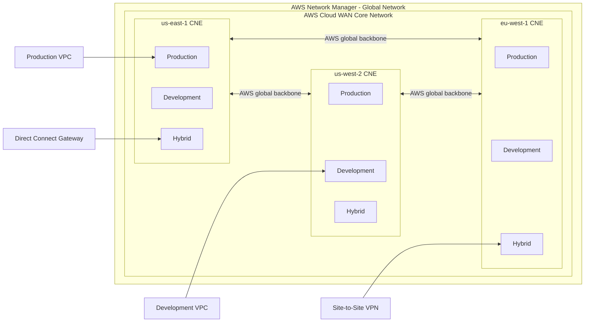

### Control plane versus data plane

| Plane | Responsibility |
|---|---|
| Management plane | Network Manager, APIs, CLI, policy versions, visualization |
| Control plane | Policy evaluation, segment membership, route propagation, BGP route learning, CNE route calculation |
| Data plane | Packet forwarding through local CNE, AWS backbone, remote CNE, and destination attachment |

The **core network policy is control-plane intent**. It does not process packets itself. It causes AWS to create and modify the routing state that the CNEs use to forward packets.

---

## Core concepts

## Global Network

A Global Network is the top-level container in Network Manager. It can contain Cloud WAN resources and registered Transit Gateway-related resources.

A Global Network is primarily an organizational and monitoring construct.

## Core Network

The Core Network is the AWS-managed Layer 3 WAN fabric.

Each Global Network can have only one associated Cloud WAN core network.

## Core Network Edge

A CNE is the Regional routing point for Cloud WAN.

When you add a Region to the core network policy, AWS creates a CNE in that Region.

Important characteristics:

- one CNE per Region per core network
- attachments connect to a CNE
- CNEs are fully meshed across enabled Regions
- inter-CNE traffic travels over the AWS global backbone
- CNE behavior inherits many Transit Gateway characteristics
- the CNE is managed by AWS rather than configured as a normal customer-owned Transit Gateway

## Segment

A segment is a dedicated routing domain.

Think of it as similar to a global VRF:

```text
Production segment
  us-east-1 route table
  us-west-2 route table
  eu-west-1 route table

Development segment
  us-east-1 route table
  us-west-2 route table
  eu-west-1 route table
```

By default, attachments in one segment do not automatically communicate with attachments in another segment.

Segments are useful for:

- Production
- Development
- PCI
- Shared services
- Partners
- Corporate
- Guest
- IoT
- Hybrid/on-premises
- Acquisitions
- regulated business units

## Attachment

An attachment brings a resource into Cloud WAN.

AWS Cloud WAN supports attachment types including:

- VPC
- Site-to-Site VPN
- Connect
- Tunnel-less Connect
- Transit Gateway route table
- Direct Connect gateway

An attachment is associated with either:

- a segment, or
- a Network Function Group

It cannot be simultaneously associated with both.

## Core Network Policy

The policy is a versioned JSON document that describes the desired global network.

Major sections include:

```text
version
core-network-configuration
segments
network-function-groups
segment-actions
attachment-policies
routing-policies
attachment-routing-policy-rules
```

The service turns that document into actual routing configuration.

---

## Layer 2 and Layer 3 behavior

### Layer 2

Cloud WAN is not an Ethernet extension service.

It does not provide:

- VLAN stretching
- MAC learning across CNEs
- STP propagation
- broadcast-domain extension
- native Layer 2 pseudowires

### Layer 3

Cloud WAN provides routed IP connectivity.

Routes can come from:

- VPC CIDRs
- BGP over Site-to-Site VPN
- BGP over Direct Connect gateway attachments
- BGP over Connect attachments
- Transit Gateway route table attachments
- static routes in the core network policy
- segment sharing
- service insertion-generated forwarding behavior

IPv4 and IPv6 are supported.

---

## Core Network Policy lifecycle

Cloud WAN policies are versioned.

A safe workflow is:

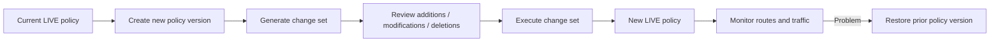

Operationally, this is important because a network policy change can affect multiple Regions and many attachments at once.

### Recommended practice

For large environments, maintain:

- a development/test Cloud WAN
- policy JSON in Git
- peer review
- automated JSON validation
- documented rollback policy version
- pre/post route snapshots

---

## Example core network policy

The following is an **illustrative Cloud WAN policy pattern**. Adapt the values and validate them against the current AWS policy schema before production use.

```json
{
  "version": "2021.12",
  "core-network-configuration": {
    "asn-ranges": [
      "64512-65534"
    ],
    "edge-locations": [
      {
        "location": "us-east-1"
      },
      {
        "location": "us-west-2"
      }
    ]
  },
  "segments": [
    {
      "name": "production",
      "description": "Production workloads",
      "require-attachment-acceptance": false
    },
    {
      "name": "development",
      "description": "Development workloads",
      "require-attachment-acceptance": false
    },
    {
      "name": "shared",
      "description": "Shared services",
      "require-attachment-acceptance": true
    }
  ],
  "segment-actions": [
    {
      "action": "share",
      "mode": "attachment-route",
      "segment": "shared",
      "share-with": [
        "production",
        "development"
      ]
    }
  ],
  "attachment-policies": [
    {
      "rule-number": 100,
      "condition-logic": "and",
      "conditions": [
        {
          "type": "tag-exists",
          "key": "Environment"
        },
        {
          "type": "tag-value",
          "key": "Environment",
          "operator": "equals",
          "value": "production"
        }
      ],
      "action": {
        "association-method": "constant",
        "segment": "production"
      }
    }
  ]
}
```

### Critical attachment-policy behavior

Attachment policies are processed in rule-number order.

The first matching rule is used.

That means rule order is equivalent to an access-control policy:

```text
100 highly specific rule
200 less specific rule
300 catch-all rule
```

A broad rule placed first can accidentally classify attachments into the wrong segment.

Also note that Cloud WAN evaluates **tags on the attachment**, not simply the tags on the attached VPC resource.

---

## Segmentation design

### Example

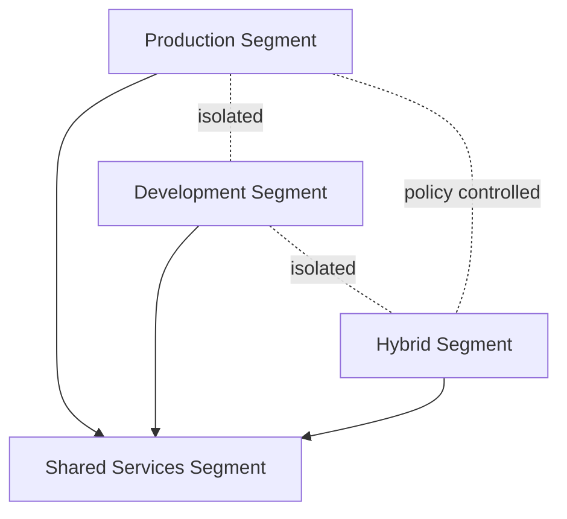

A common model is:

| Segment | Purpose | Typical connectivity |
|---|---|---|
| Production | Production VPCs | Shared + controlled hybrid |
| Development | Dev/test VPCs | Shared, optionally Internet |
| Shared | DNS, AD, tooling, proxies | Shared into selected segments |
| Hybrid | Data centers and branches | Shared with approved application segments |
| Inspection | Firewall appliances | Used as Network Function Group rather than normal workload segment |

### Isolation

A segment can be configured as isolated.

Isolation is especially important for **same-segment service insertion**. Without isolation, attachments in a segment could communicate directly and bypass the inspection path.

---

## VPC attachments

When creating a VPC attachment, you select one subnet from each Availability Zone that should participate.

Those subnets are attachment subnets for the CNE.

Important considerations:

- Select one subnet per AZ.
- Other subnets in the same AZ can route through the attachment.
- Local Zone subnets cannot be selected as Cloud WAN VPC attachment subnets.
- Route tables in the VPC still need routes pointing toward the Cloud WAN attachment.
- Security groups and Network ACLs remain relevant.
- Appliance mode is important for stateful inspection VPCs.

### Example VPC routing concept

```text
Application subnet route table

10.0.0.0/16     local
0.0.0.0/0       Cloud WAN / transit attachment path
10.0.0.0/8      Cloud WAN attachment
```

Exact routing depends on whether you are sending all traffic, corporate RFC1918 space, or specific remote prefixes through Cloud WAN.

---

## Packet flow: VPC to VPC in different Regions

Assume:

```text
VPC-A 10.10.0.0/16
Region us-east-1
Production segment

VPC-B 10.20.0.0/16
Region us-west-2
Production segment
```

### Forward direction

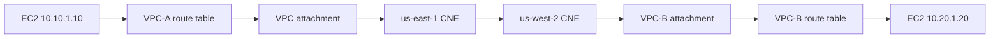

1. The source host sends the packet to its VPC router.
2. The VPC route table selects the Cloud WAN path for `10.20.0.0/16`.
3. The local CNE performs a segment route lookup.
4. The destination route points to the remote CNE.
5. The packet crosses the AWS global backbone.
6. The remote CNE forwards to VPC-B attachment.
7. VPC-B routes the packet to the destination subnet.
8. Security groups/NACLs must permit the flow.

The return path performs the reverse sequence.

---

## Direct Connect integration

Modern Cloud WAN supports **native Direct Connect gateway attachments**.

This is a significant improvement over older architectures that required:

```text
Direct Connect
    |
Transit VIF
    |
Direct Connect Gateway
    |
Transit Gateway
    |
Cloud WAN peering
```

Modern architecture:

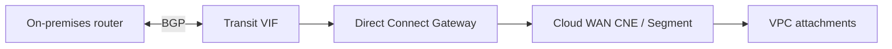

### Direct Connect route propagation

Inbound:

```text
On-premises BGP
   -> Transit VIF
   -> Direct Connect Gateway
   -> Cloud WAN Direct Connect attachment
   -> associated CNE segment route tables
   -> other Regions in the same segment
```

Outbound:

```text
VPC/other segment routes
   -> local CNE
   -> Direct Connect gateway attachment
   -> Direct Connect Gateway
   -> Transit VIF
   -> on-premises BGP router
```

The native integration dynamically propagates routes in both directions.

### Key design points

- A Direct Connect gateway can be associated with only one Cloud WAN segment.
- Multiple Direct Connect gateways can attach to the same segment.
- Different Direct Connect gateways can be associated with different segments.
- A Direct Connect attachment can be associated with all CNEs or a subset.
- Associating all CNEs where the segment exists generally produces simpler, more optimal routing.
- AS_PATH information is retained toward on-premises, improving route visibility.
- MED is non-transitive and Direct Connect gateway behavior must be considered when designing path selection.
- Direct Connect BGP communities affect Direct Connect routing behavior but do not automatically control Cloud WAN core routing behavior.

---

## Site-to-Site VPN

Cloud WAN can directly attach Site-to-Site VPN connectivity.

Dynamic routing with BGP is generally preferable for highly available designs because the CNE can learn and withdraw routes based on tunnel/BGP state.

### VPN packet path

```text
Branch router
   |
IPsec tunnel
   |
AWS Site-to-Site VPN
   |
Cloud WAN CNE
   |
Segment routing
   |
Destination attachment
```

Cloud WAN supports ECMP across eligible dynamically routed VPN paths.

Static-routing VPNs do not provide the same ECMP capability.

---

## Connect and SD-WAN

Cloud WAN Connect is intended for integrating software-defined WAN and network virtual appliances.

Connect can use:

- GRE-based Connect peers
- Tunnel-less Connect, where supported

BGP is used to exchange prefixes.

Common use cases:

- Cisco SD-WAN
- Fortinet Secure SD-WAN
- Palo Alto Networks SD-WAN/NVA designs
- branch aggregation
- third-party virtual routers
- cloud transit appliances

Cloud WAN handles global transport while the SD-WAN platform can continue to handle application policy, SLA steering, branch overlay functions, and security policies.

---

## Transit Gateway interoperability

Cloud WAN can peer with Transit Gateway.

This is useful when:

- migrating existing TGW networks into Cloud WAN
- keeping regional TGWs for services that depend on them
- extending TGW route-table segmentation into Cloud WAN
- connecting legacy architectures

A Cloud WAN CNE and Transit Gateway peer in the same Region.

Transit Gateway route table attachments can then map TGW routing domains to Cloud WAN segments.

### Migration model

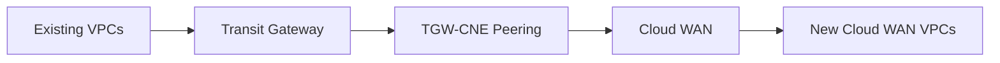

This allows gradual migration rather than a big-bang cutover.

---

## Service insertion

Cloud WAN service insertion allows traffic to be redirected through centralized network/security functions.

Examples:

- AWS Network Firewall
- Gateway Load Balancer
- third-party NGFW
- IDS/IPS
- inspection appliances
- routing/security NVAs

The major construct is the **Network Function Group (NFG)**.

### Concept

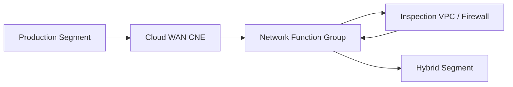

A Network Function Group is a collection of Cloud WAN attachments containing network functions.

### Restrictions and behavior

Important AWS-documented considerations include:

- an attachment can belong to a segment or NFG, not both
- only one attachment per NFG per Region
- appliance mode must be enabled for an inspection VPC when required for flow symmetry
- isolated mode is required for same-segment service insertion
- static routes are not automatically propagated into NFG route tables
- service insertion can steer same-segment or cross-segment flows
- the capability works for same-Region and cross-Region traffic
- routing views can display expected blackhole defaults in some service insertion scenarios even while steering is functioning as intended

---

## `send-via`, `send-to`, and inspection paths

Service insertion actions determine where traffic is redirected.

Conceptually:

### Send-via

Traffic between segments is forced through an NFG.

```text
Production
   -> Inspection NFG
   -> Hybrid
```

### Send-to

Traffic is sent toward a network function group for a defined destination/use case such as centralized egress.

### Edge override

In a multi-Region topology, not every Region may contain an inspection VPC.

Cloud WAN can otherwise select a remote inspection edge according to its internal ordered behavior.

`edge-override` allows you to specify the desired inspection Region for selected source edge locations.

Example concept:

```json
{
  "action": "send-via",
  "segment": "Production",
  "mode": "single-hop",
  "when-sent-to": {
    "segments": [
      "Hybrid"
    ]
  },
  "via": {
    "network-function-groups": [
      "InspectionNFG"
    ],
    "with-edge-overrides": [
      {
        "edge-sets": [
          [
            "us-west-2"
          ]
        ],
        "use-edge-location": "us-west-1"
      }
    ]
  }
}
```

This can reduce tromboning, latency, and unnecessary inter-Region transfer.

---

## Stateful firewall symmetry

Stateful firewalls require the forward and reverse directions of a session to pass through compatible firewall state.

### Bad path

```text
Forward:
VPC-A -> Firewall-A -> VPC-B

Return:
VPC-B -> Firewall-B -> VPC-A
```

If Firewall-B does not have synchronized session state, the return packet may be dropped.

### Better path

```text
Forward:
VPC-A -> Inspection VPC us-west-1 -> VPC-B

Return:
VPC-B -> Inspection VPC us-west-1 -> VPC-A
```

Cloud WAN service insertion plus appliance mode is designed to help preserve deterministic steering for these stateful flows.

---

## Routing Policy

Cloud WAN Routing Policy adds fine-grained route control.

This is different from basic segment attachment policy.

### Attachment policy

Determines:

```text
Which segment does this attachment join?
```

### Routing policy

Determines:

```text
Which routes are accepted, rejected, summarized, advertised, or preferred?
```

This separation is important.

### Routing Policy capabilities

AWS documents support for:

- route filtering
- route summarization
- path preference
- BGP communities
- LOCAL_PREF-related behavior
- AS_PATH manipulation
- MED manipulation
- route control across attachments
- route control across segment shares
- route control across CNE-to-CNE Region propagation

Routing policies are directional:

```text
inbound
outbound
```

### Routing policy pipeline

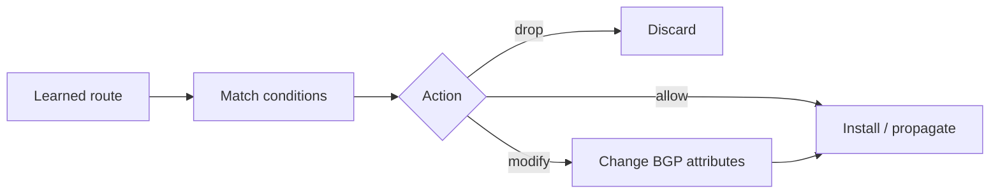

### Why it matters

Previously, architects often needed extra virtual routers or complicated segmentation simply to control route distribution.

Routing Policy allows network-level controls such as:

```text
Block an overlapping VPC prefix.
Advertise only an aggregate to on-premises.
Prefer one VPN site for a default route.
Apply AS_PATH prepending toward selected peers.
Use BGP communities for classification.
Prevent selected routes from crossing Regions.
```

### Version requirement

AWS introduced Routing Policy with the newer Cloud WAN policy schema. AWS's launch guidance identifies policy version `2025.11` as the required version for this capability.

Always verify your active policy version before attempting to configure Routing Policies.

---

## Routing policy example: overlapping prefix filter

Scenario:

```text
VPC A primary CIDR:   10.0.0.0/16
VPC A secondary CIDR: 10.1.0.0/16

Another network already uses 10.0.0.0/16.
```

Goal:

```text
Drop 10.0.0.0/16
Allow 10.1.0.0/16
```

Conceptual inbound policy:

```text
IF prefix == 10.0.0.0/16
THEN drop

ELSE permit normal propagation
```

This prevents overlapping prefixes from contaminating the segment routing domain.

---

## BGP traffic engineering

With Routing Policy, Cloud WAN can participate in more traditional enterprise WAN traffic engineering.

Examples:

### Local preference

Use a higher preference for the preferred route.

```text
Primary path  -> higher local preference
Backup path   -> lower local preference
```

### AS_PATH prepending

Make one advertisement less attractive externally.

```text
Primary:
64512 65010

Backup:
64512 64512 64512 65010
```

### MED

Can influence preferred ingress when compared under appropriate BGP conditions.

Remember that MED is non-transitive, so its usefulness depends on where it is evaluated.

### Communities

Communities are labels attached to BGP routes.

They can be used for:

- classification
- filtering
- policy selection
- route preference
- downstream automation

Support varies by attachment type and feature. Confirm current AWS documentation before relying on a community at a specific boundary.

---

## Route evaluation considerations

For every packet, think in two stages:

```text
1. Is a route present in the Cloud WAN segment route table?
2. If multiple routes exist, which route wins?
```

Then separately validate:

```text
3. Is the VPC route table correct?
4. Is the remote/on-prem route correct?
5. Is security policy allowing the packet?
```

A route can exist in Cloud WAN and traffic can still fail because the source VPC never sends traffic toward the attachment.

---

## Centralized Internet egress

Cloud WAN can support centralized egress architectures.

Example:

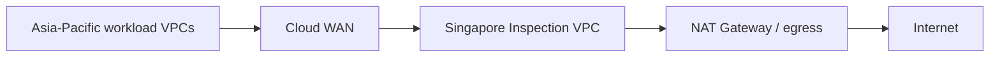

A global enterprise may define:

- Singapore for APAC
- Frankfurt for Europe
- N. Virginia for North America

Routing Policy can help keep Internet-bound traffic within the intended geographic egress architecture.

---

## Shared services

Shared Services is one of the most useful segment designs.

Typical services:

- Active Directory
- DNS
- NTP
- PKI
- logging
- monitoring
- package repositories
- vulnerability scanning
- management jump hosts
- proxy services

Example:

```text
Production  ----\
Development -----+--> Shared Services
Corporate  ------/
```

The goal is normally **spoke-to-shared reachability without spoke-to-spoke reachability**.

Be careful that segment sharing does not unintentionally create transitive reachability between otherwise isolated domains.

---

## Multi-account operation

Cloud WAN can be shared using AWS Resource Access Manager.

The core network owner controls:

- core network
- policy
- segment definitions
- policy execution
- network-wide routing behavior

Attachment owners can create and manage attachments within their permissions.

This enables a central networking team to own the WAN while application teams own VPCs.

A recommended enterprise pattern is:

```text
Network account
    Cloud WAN core network
    centralized policy
    security/inspection

Application account A
    production VPC attachments

Application account B
    development VPC attachments

Shared services account
    DNS / identity / tooling
```

---

## Home Region

Cloud WAN Network Manager uses a home Region for aggregated management and topology information.

AWS documentation currently identifies **US West (Oregon), `us-west-2`**, as the Cloud WAN home Region.

The home Region is not the same thing as the data-plane location of every packet.

Your data-plane CNEs can operate in many AWS Regions.

---

## AWS CLI workflow

AWS CLI v2 exposes Cloud WAN under the `networkmanager` namespace.

Useful commands include:

```cli
aws networkmanager create-global-network
aws networkmanager create-core-network
aws networkmanager put-core-network-policy
aws networkmanager get-core-network-policy
aws networkmanager get-core-network-change-set
aws networkmanager execute-core-network-change-set
aws networkmanager create-vpc-attachment
aws networkmanager create-site-to-site-vpn-attachment
aws networkmanager create-direct-connect-gateway-attachment
aws networkmanager list-attachments
aws networkmanager get-network-routes
aws networkmanager start-route-analysis
aws networkmanager get-route-analysis
aws networkmanager list-core-network-policy-versions
```

### Put a policy

The exact parameters depend on your core network ID and JSON file.

Typical workflow:

```cli
aws networkmanager put-core-network-policy \
  --core-network-id <CORE_NETWORK_ID> \
  --policy-document file://cloudwan-policy.json
```

Then inspect the generated change set before applying.

### Inspect policy

```cli
aws networkmanager get-core-network-policy \
  --core-network-id <CORE_NETWORK_ID>
```

### Inspect routes

```cli
aws networkmanager get-network-routes \
  --core-network-id <CORE_NETWORK_ID> \
  --segment-name <SEGMENT_NAME> \
  --edge-location <AWS_REGION>
```

Use this to determine:

- whether a prefix exists,
- route type,
- destination attachment,
- edge location,
- blackhole state where relevant.

Do not diagnose Cloud WAN only from the VPC route table. The CNE segment route table is equally important.

---

## Console configuration workflow

### 1. Create or open Global Network

In the AWS console:

1. Open **Network Manager**.
2. Under **Connectivity**, choose **Cloud WAN**.
3. Open the desired **Global network**.
4. Open **Core network**.

### 2. Create policy version

1. Choose **Policy versions**.
2. Choose **Create policy version**.
3. Select **Visual editor** or **JSON**.

### 3. Configure network

Define:

- ASN ranges
- edge locations / AWS Regions
- inside CIDRs when required for Connect-related designs

### 4. Configure segments

Create logical routing domains.

For each segment, decide:

- attachment acceptance
- isolation
- Regions
- sharing behavior

### 5. Configure attachment policies

Create tag-based classification rules.

Verify rule order carefully.

### 6. Configure optional service insertion

Create:

- Network Function Group
- NFG attachment policy
- service insertion segment action

### 7. Configure optional Routing Policies

If using advanced routing:

- ensure policy schema supports Routing Policy
- create routing policy
- create ordered match/action rules
- create attachment routing policy associations/labels as required

### 8. Generate and review changes

Do not immediately execute large changes.

Review:

- additions
- deletions
- changed segment associations
- route impacts
- CNE additions/removals

### 9. Apply

Execute the generated change set.

### 10. Verify

Check:

- policy execution status
- attachment state
- segment association
- route tables
- BGP on hybrid devices
- application path
- CloudWatch telemetry

---

## Verification checklist

### Core network

Verify:

```text
Core network state = AVAILABLE
Policy state = LIVE
Expected CNEs exist
Expected segments exist
```

### Attachments

Check:

```cli
aws networkmanager list-attachments \
  --core-network-id <CORE_NETWORK_ID>
```

Verify:

- attachment type
- attachment state
- owner account
- edge location
- segment
- tags

### Routes

Use:

```cli
aws networkmanager get-network-routes \
  --core-network-id <CORE_NETWORK_ID> \
  --segment-name production \
  --edge-location us-east-1
```

Verify:

- expected local VPC routes
- expected remote-region routes
- expected hybrid prefixes
- expected service insertion next hop
- no unexpected overlapping route

### VPC

Verify:

```text
Subnet route table
Security group
NACL
Attachment subnet
AZ mapping
```

### Direct Connect

Verify on the on-premises router:

```text
BGP session Established
Expected AWS prefixes received
Expected local prefixes advertised
AS_PATH is sensible
Primary/backup path is correct
```

### VPN

Verify:

```text
IPsec tunnel UP
BGP Established
Prefixes sent/received
Correct ECMP behavior
```

### Inspection

Verify both directions:

```text
Forward traffic reaches firewall
Return traffic reaches same stateful path
Firewall policy permits the session
NAT behavior is intentional
Appliance mode is enabled where required
```

---

## Route Analysis

Network Manager includes route-analysis capabilities.

Route analysis is particularly valuable for global networks because a path may cross:

```text
VPC route table
   -> CNE route table
   -> CNE-to-CNE path
   -> inspection attachment
   -> second segment
   -> destination attachment
```

CLI commands include:

```cli
aws networkmanager start-route-analysis
aws networkmanager get-route-analysis
```

Use route analysis to narrow down where reachability stops rather than assuming the problem is BGP.

---

## CloudWatch monitoring

Cloud WAN exports metrics to CloudWatch.

Useful dimensions include:

```text
CoreNetwork
EdgeLocation
Attachment
AvailabilityZone
```

Cloud WAN also exposes usage metrics that can be compared with service quotas.

Recommended alarms:

- attachment traffic anomalies
- VPN tunnel status through related VPN metrics
- Direct Connect BGP/connection health through related DX metrics
- route-count utilization approaching quota
- CNE/attachment usage approaching quota
- packet drops where applicable

For Cloud WAN metrics, AWS notes that `Sum` is the meaningful statistic for the documented counters.

---

## Important quotas and scale limits

AWS quotas change, so always validate them before production design.

Representative documented defaults include:

| Item | Default |
|---|---:|
| Global networks per AWS account | 5 |
| Core networks per global network | 1 |
| Edges per Region per core network | 1 |
| Segments per core network | 40 |
| Policy size | 1 MB |
| Attachments per core network | 5,000 |
| Connect peers per Connect attachment | 4 |
| Transit Gateway peers | 50 |
| Direct Connect attachments per core network | 40 |
| Routes across all core network segments | 10,000 |
| VPN routes advertised to core network | 1,000 |
| Routes advertised from core network over VPN | 5,000 |
| Connect routes advertised to core network | 1,000 |
| Routes advertised from core network over Connect | 5,000 |

### Bandwidth-related documented limits

Representative values include:

- VPC attachment: up to 100 Gbps per Availability Zone
- VPC attachment: up to 7.5 million packets per second per AZ
- VPN tunnel: up to 1.25 Gbps
- GRE Connect peer: up to 5 Gbps
- up to four Connect peers per Connect attachment
- Tunnel-less Connect: significantly higher bandwidth, subject to documented platform limits

These are service limits, not guaranteed application throughput.

---

## MTU

AWS documents the Cloud WAN core network MTU as:

```text
8500 bytes for traffic between VPCs
```

This includes supported Cloud WAN VPC paths such as Transit Gateway peering and Tunnel-less Connect VPC attachment scenarios described by AWS.

VPN paths are typically constrained to lower MTU, with AWS documenting 1500-byte support at the Cloud WAN service level before tunnel overhead considerations.

Important details:

- packets larger than the supported core-network MTU are dropped
- Cloud WAN enforces TCP Maximum Segment Size (MSS) clamping
- Path MTU Discovery support differs by attachment type
- AWS documents PMTUD support for traffic ingressing VPC attachments
- PMTUD is not supported in the same way on Connect, Site-to-Site VPN, Direct Connect, and peering attachments

### Troubleshooting MTU

Symptoms:

```text
Ping works.
Small HTTP requests work.
Large transfers stall.
TLS connections hang.
```

Check:

1. packet size
2. DF bit behavior
3. ICMP Fragmentation Needed / IPv6 Packet Too Big
4. VPN overhead
5. firewall MSS adjustment
6. intermediate appliance MTU

---

## Pricing model

Cloud WAN pricing has several components.

### Core Network Edge

AWS pricing currently lists a fixed hourly CNE charge.

At the time of review, AWS shows:

```text
$0.50 per CNE per hour
```

### Attachments

Attachments have hourly charges that vary by Region.

Examples include:

- VPC
- VPN
- Direct Connect
- Connect/SD-WAN
- peering connections

### Data processing

AWS currently lists:

```text
$0.02 per GB
```

for data sent into the CNE from supported attachments.

### Inter-Region transfer

Standard AWS data-transfer charges can apply in addition to Cloud WAN charges.

### Service insertion

AWS documents no additional Cloud WAN feature charge specifically for service insertion beyond the underlying Cloud WAN and appliance/service charges.

### Routing Policy

AWS documents no additional charge specifically for enabling Routing Policy.

### Cost design implication

A multi-Region Cloud WAN is not merely:

```text
attachment cost
```

It can include:

```text
CNE-hours
+ attachment-hours
+ data processing
+ inter-Region transfer
+ Direct Connect/VPN charges
+ firewall/GWLB/NAT charges
+ EC2 appliance charges
```

Therefore, optimize:

- number of CNE Regions
- inspection placement
- cross-Region flows
- centralized egress architecture
- number of attachments
- route design

---

## Cloud WAN versus Transit Gateway

| Capability | Cloud WAN | Transit Gateway |
|---|---|---|
| Primary scope | Global | Regional |
| Inter-Region fabric | Built in | TGW peering configured by customer |
| Intent-based policy | Yes | More route-table centric |
| Global segmentation | Native segments | Separate TGW route tables + peering design |
| Central topology view | Strong | Available via Network Manager but more manually composed |
| Direct Connect | Native DX gateway attachment | DXGW-TGW association |
| VPN | Native attachment | Native attachment |
| SD-WAN Connect | Native | Native TGW Connect |
| Global automation | Major design goal | Customer automation usually needed |
| Advanced global route policy | Cloud WAN Routing Policy | TGW route-table/BGP behavior |
| Best fit | large multi-Region/global networks | regional hubs and smaller multi-Region estates |

### Rule of thumb

Use Transit Gateway when:

- you operate primarily in one or a few Regions
- routing is relatively simple
- your organization already has mature TGW automation
- you want explicit regional control

Use Cloud WAN when:

- the network is genuinely global
- consistent segmentation matters
- many accounts/Regions are involved
- you want one declarative network policy
- you need central service insertion and advanced global routing control

They can coexist.

---

## Cloud WAN versus a traditional MPLS WAN

Cloud WAN segments resemble MPLS Layer 3 VPN VRFs conceptually.

Traditional model:

```text
Site
 -> CE
 -> PE
 -> MPLS backbone
 -> PE
 -> CE
 -> Site
```

Cloud WAN model:

```text
VPC / Site
 -> Attachment
 -> CNE
 -> AWS global backbone
 -> CNE
 -> Attachment
 -> VPC / Site
```

The analogy is useful, but Cloud WAN does not expose PE-router configuration to you. The control plane is driven by AWS API/policy.

---

## High availability and convergence

Cloud WAN HA exists at multiple layers.

### CNE layer

AWS manages the CNE infrastructure.

### Inter-Region layer

CNEs form a resilient AWS backbone mesh.

### VPC layer

Use attachment subnets across multiple Availability Zones.

### Direct Connect

Use resilient Direct Connect design:

- multiple physical connections
- diverse locations
- multiple transit VIFs
- appropriate BGP policy

### VPN

Use both AWS VPN tunnels and dynamic routing.

### SD-WAN/Connect

Use:

- redundant appliances
- multiple Connect peers
- multiple AZs
- BGP
- appliance/platform HA

### Firewall

Use a distributed stateful appliance architecture or service that can preserve expected symmetry.

---

## Failure scenario: local Direct Connect path fails

Assume two Direct Connect paths advertise the same on-prem prefix.

```text
Primary DX
Backup DX
```

Sequence:

1. BGP or physical DX state fails on primary.
2. Route is withdrawn.
3. Direct Connect gateway updates Cloud WAN.
4. CNE recomputes best route.
5. Backup route becomes active.
6. CNE forwarding updates.
7. Return path must also converge toward the backup.
8. Existing stateful sessions may reset depending on firewall/NAT architecture.

For critical applications, test convergence rather than relying solely on routing theory.

---

## Failure scenario: inspection VPC unavailable

If a Region's inspection attachment is unavailable, service insertion behavior depends on:

- NFG membership
- available inspection attachment in other Regions
- edge override configuration
- service insertion mode
- route propagation

Potential symptom:

```text
Traffic still works but suddenly hairpins through another Region.
```

Consequences:

- higher latency
- higher inter-Region data transfer
- different firewall state
- capacity pressure on backup inspection stack

Monitor not just availability but **path location**.

---

## Common mistakes

### 1. Tagging the VPC instead of the attachment

Cloud WAN attachment policy evaluates attachment metadata.

Fix:
- confirm the tag exists on the Cloud WAN attachment itself.

### 2. Wrong attachment-policy order

A broad rule matches before a specific rule.

Fix:
- place specific rules at lower rule numbers.

### 3. Forgetting VPC routes

Cloud WAN route table is correct, but VPC route table has no route to remote prefixes.

Fix:
- add/verify the VPC route pointing toward the Cloud WAN attachment path.

### 4. Forgetting return routing

The forward path works, but the remote network routes replies elsewhere.

Fix:
- verify both directions.

### 5. Assuming segment sharing is automatically transitive

Segment sharing changes route visibility according to explicit policy.

Fix:
- inspect actual segment route tables.

### 6. Ignoring overlapping CIDRs

Overlapping routes can cause ambiguous reachability.

Fix:
- use address governance and Routing Policy filters.

### 7. Misunderstanding Direct Connect legacy guidance

Older AWS articles required TGW between DXGW and Cloud WAN.

Modern Cloud WAN supports native Direct Connect gateway attachments.

Fix:
- use current documentation for greenfield designs.

### 8. Missing appliance mode

Stateful inspection returns on a different AZ/path.

Fix:
- enable the required appliance mode and validate route symmetry.

### 9. Same-segment inspection without isolation

Attachments communicate directly and bypass the firewall.

Fix:
- use isolated mode for same-segment service insertion.

### 10. Assuming a CNE is a user-managed TGW

Although the CNE inherits characteristics from Transit Gateway, it is AWS-managed as part of Cloud WAN.

Fix:
- manage it through Cloud WAN policy and Network Manager.

### 11. Treating Cloud WAN as Layer 2

Applications depend on broadcast adjacency.

Fix:
- redesign for routed IP connectivity.

### 12. Forgetting MTU differences

Large packets fail on hybrid paths.

Fix:
- test PMTUD, MSS, and tunnel overhead.

---

## Troubleshooting by symptom

## Symptom: VPCs in the same segment cannot communicate

Check:

1. Is each VPC attachment `AVAILABLE`?
2. Are both attachments associated with the same segment?
3. Does the source VPC route table contain the destination prefix?
4. Does the source CNE route table contain the destination route?
5. Does the destination VPC route back to the source?
6. Do security groups permit the flow?
7. Do NACLs permit both directions?
8. Is a routing policy filtering the prefix?
9. Is service insertion expected?
10. Is the destination CIDR overlapping another route?

Success looks like:

```text
source VPC RT -> CNE route -> destination attachment -> destination VPC RT
```

---

## Symptom: attachment is created but not associated with a segment

Check:

- attachment tags
- attachment policy rule order
- `require-attachment-acceptance`
- segment existence in the attachment Region
- policy execution status

If acceptance is required, the attachment can wait until the core-network owner approves it.

---

## Symptom: Direct Connect BGP is up but AWS routes are missing

Check:

1. Is the Direct Connect gateway attachment `AVAILABLE`?
2. Is it associated with the correct segment?
3. Is the correct CNE/Region selected?
4. Are the VPC routes present in that segment?
5. Is the segment isolated?
6. Is a Routing Policy filtering outbound advertisements?
7. Is on-premises rejecting the AWS AS_PATH?
8. Does the route exceed a quota?
9. Are you relying on obsolete allowed-prefix behavior from a TGW architecture?

---

## Symptom: on-premises routes are visible in one Region but not another

Check:

- which CNEs are associated with the DX gateway attachment
- whether the segment spans both Regions
- inter-Region Routing Policy
- route filtering
- AS_PATH selection
- isolated segment behavior

A Direct Connect gateway associated to only a subset of CNEs receives and advertises behavior based on those selected edges.

---

## Symptom: traffic bypasses firewall

Check:

- service insertion action
- source/destination segment pair
- NFG attachment membership
- attachment belongs to NFG rather than ordinary segment
- same-segment isolation
- conflicting static route
- policy version is actually LIVE

Use `get-network-routes` to inspect the effective next hop.

---

## Symptom: firewall sees one direction only

Check:

- appliance mode
- service insertion action
- edge override
- VPC route tables
- different-region return path
- NAT
- multiple default routes
- asymmetric BGP preference on Direct Connect/VPN

Stateful traffic requires path symmetry.

---

## Symptom: traffic takes an unexpected Region

Check:

- local route availability
- DX gateway CNE association
- CNE route preference
- service insertion ordered edge selection
- edge override
- Routing Policy local preference/AS path behavior
- route advertisements from multiple sites

---

## Symptom: new routes do not appear immediately in an NFG route view

AWS notes that BGP route updates for Network Function Group route tables can sometimes take up to approximately 30 minutes to appear in `GetNetworkRoutes` or the console.

This display delay does not necessarily mean forwarding is broken.

Validate actual packet forwarding and related telemetry before assuming the policy failed.

---

## Symptom: policy generation fails

Check:

- JSON syntax
- policy version/schema
- invalid segment reference
- nonexistent NFG
- service insertion referencing an attachment not included correctly
- invalid edge location
- duplicate/unsupported construct
- size over 1 MB
- Routing Policy used with an older policy version

---

## Symptom: application works in one Region but fails in another

Compare:

```text
CNE existence
segment presence
attachment state
local route table
remote route table
routing policy association
inspection NFG presence
edge override
security group
NACL
MTU
```

Do not assume the policy is identical merely because the segment name is the same.

---

## Design example: global enterprise WAN

### Requirements

- Production and Development isolated
- both need Shared Services
- branches connect through VPN or SD-WAN
- data centers use Direct Connect
- all hybrid-to-production traffic inspected
- regional inspection stacks
- production routes summarized to on-premises

### Logical design

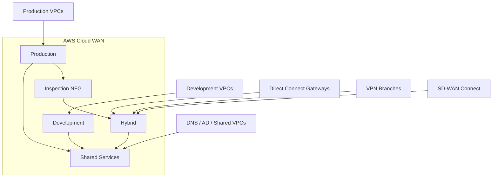

### Policy intent

```text
Production <-> Hybrid
    must pass Inspection NFG

Development <-> Production
    denied

Development -> Shared
    allowed

Production -> Shared
    allowed

Hybrid -> Shared
    allowed
```

### Routing policy

```text
Inbound from on-prem:
    drop overlapping enterprise prefixes

Outbound to on-prem:
    summarize workload CIDRs

Preferred hybrid path:
    Direct Connect primary
    VPN secondary
```

---

## Design example: regional Internet egress

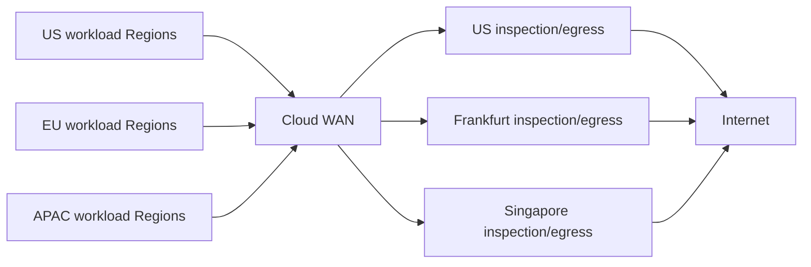

Goals:

- regulatory locality
- lower latency
- predictable firewall path
- controlled egress IPs
- centralized logging

Use service insertion and Routing Policy together where appropriate.

---

## Terraform / Infrastructure as Code considerations

Cloud WAN is a strong candidate for Infrastructure as Code because the policy itself is declarative.

Recommended pattern:

```text
Git repository
  cloudwan/
    core-network.tf
    policy.json
    variables.tf
    outputs.tf
    attachments/
    tests/
```

Keep the policy JSON version-controlled even if Terraform creates the surrounding resources.

Pipeline checks should include:

- JSON validation
- allowed Region list
- duplicate CIDR detection
- attachment-policy ordering
- segment name validation
- NFG references
- policy-schema version
- prohibited default-route changes
- route-count estimates
- change-set review

Do not blindly auto-apply a global core-network change in production.

A controlled workflow is preferable:

```text
pull request
 -> lint
 -> security review
 -> Cloud WAN change-set generation
 -> human review
 -> approved execution
 -> post-change route validation
```

---

## Operational commands reference

### List core networks

```cli
aws networkmanager list-core-networks
```

### List policy versions

```cli
aws networkmanager list-core-network-policy-versions \
  --core-network-id <CORE_NETWORK_ID>
```

### Get active policy

```cli
aws networkmanager get-core-network-policy \
  --core-network-id <CORE_NETWORK_ID>
```

### List attachments

```cli
aws networkmanager list-attachments \
  --core-network-id <CORE_NETWORK_ID>
```

### Inspect routes

```cli
aws networkmanager get-network-routes \
  --core-network-id <CORE_NETWORK_ID> \
  --segment-name <SEGMENT_NAME> \
  --edge-location <AWS_REGION>
```

### Route analysis

```cli
aws networkmanager start-route-analysis <OPTIONS>
aws networkmanager get-route-analysis <OPTIONS>
```

### Direct Connect attachment

```cli
aws networkmanager create-direct-connect-gateway-attachment <OPTIONS>
```

Use `aws networkmanager <command> help` or the current AWS CLI reference for the full parameter schema.

---

## Configuration validation checklist

Before deploying:

- [ ] Required Regions identified
- [ ] CNE ASN ranges do not conflict with enterprise BGP design
- [ ] segment taxonomy defined
- [ ] CIDR plan reviewed for overlap
- [ ] attachment tag standard defined
- [ ] attachment-policy order reviewed
- [ ] acceptance requirements defined
- [ ] segment sharing documented
- [ ] service insertion paths documented
- [ ] stateful symmetry validated
- [ ] Direct Connect gateway segment mapping documented
- [ ] VPN/Connect redundancy documented
- [ ] Routing Policy schema version confirmed
- [ ] route filters reviewed
- [ ] summaries reviewed
- [ ] CNE and attachment quotas checked
- [ ] MTU reviewed
- [ ] pricing estimate completed
- [ ] rollback policy version identified
- [ ] route snapshots captured
- [ ] monitoring/alarms configured

---

## Security considerations

Cloud WAN provides segmentation and routing control, but it is not itself a complete firewall.

Security enforcement can occur at several layers:

```text
Cloud WAN segment isolation
Cloud WAN Routing Policy
AWS Network Firewall
Gateway Load Balancer + third-party NGFW
VPC security groups
Network ACLs
application security controls
on-premises firewall policy
```

A route existing does not imply traffic is authorized.

Likewise, a security group allowing traffic does not help if the Cloud WAN routing domain does not contain a route.

Security architecture should treat **reachability** and **authorization** as separate controls.

---

## Key interview and certification distinctions

### Cloud WAN segment vs VPC subnet

A segment is a **global Layer 3 routing domain**.

A subnet is an **Availability Zone-scoped VPC IP network**.

### Cloud WAN vs TGW peering

Cloud WAN automatically creates a managed inter-CNE fabric.

Transit Gateway requires the architect to explicitly design regional TGWs and inter-Region peerings.

### Attachment policy vs Routing Policy

Attachment Policy:

```text
Which segment/NFG should this attachment join?
```

Routing Policy:

```text
What should happen to routes learned from or advertised toward this resource/path?
```

### Service insertion vs static routing

Static routes can steer traffic, but service insertion provides a policy-driven model designed for centralized network functions and multi-Region inspection.

### NFG vs segment

Segment:
- workload routing domain

NFG:
- collection of network-function attachments used as service-chain targets

An attachment cannot belong to both at the same time.

### Native Direct Connect vs legacy TGW integration

Current Cloud WAN can attach a Direct Connect gateway directly.

Older designs may still use TGW for migration or interoperability.

---

## High-value troubleshooting mental model

When a Cloud WAN flow fails, troubleshoot in this order:

```text
1. Endpoint
2. VPC route table
3. VPC attachment
4. Source segment route table
5. Routing Policy
6. Service insertion / NFG
7. Inter-CNE path
8. Destination segment route table
9. Destination attachment
10. Destination VPC/on-prem route
11. Security policy
12. Return path
```

This prevents wasted time looking at BGP when the actual issue is an attachment tag or VPC route.

---

## Configuration summary

A production Cloud WAN implementation typically contains:

```text
Global Network
└── Core Network
    ├── CNE us-east-1
    ├── CNE us-west-2
    ├── CNE eu-west-1
    ├── Segments
    │   ├── Production
    │   ├── Development
    │   ├── Shared
    │   └── Hybrid
    ├── Network Function Groups
    │   └── InspectionNFG
    ├── Attachment Policies
    ├── Segment Actions
    ├── Service Insertion
    └── Routing Policies

Attachments
├── VPC
├── Site-to-Site VPN
├── Direct Connect Gateway
├── Connect / SD-WAN
└── TGW Route Table
```

---

## Key takeaways

1. **Cloud WAN is a policy-driven global Layer 3 WAN**, not an Ethernet extension service.
2. **Segments are global routing domains** comparable conceptually to VRFs.
3. **CNEs are AWS-managed Regional routing endpoints** connected through the AWS backbone.
4. **Attachment policies classify attachments into segments/NFGs** and are rule-order sensitive.
5. **Routing Policies control route propagation and BGP attributes**, separate from segment classification.
6. **Native Direct Connect gateway attachment** removes the need for TGW in many greenfield hybrid designs.
7. **Service insertion** provides global traffic steering through inspection/security functions.
8. **Appliance mode and route symmetry matter** for stateful firewalls.
9. **Cloud WAN and Transit Gateway can coexist**, especially during migration.
10. **Troubleshooting requires checking both VPC routing and Cloud WAN segment routing**.
11. **Route scale, MTU, attachment limits, and cost must be designed intentionally**.
12. **Policy versioning and change-set review are major operational advantages** and should be integrated into GitOps workflows.

---

## Sources

### AWS Cloud WAN documentation
- https://docs.aws.amazon.com/network-manager/latest/cloudwan/what-is-cloudwan.html
- https://docs.aws.amazon.com/network-manager/latest/cloudwan/cloudwan-policies-json.html
- https://docs.aws.amazon.com/network-manager/latest/cloudwan/cloudwan-policy-examples.html
- https://docs.aws.amazon.com/network-manager/latest/cloudwan/cloudwan-create-policy-version.html
- https://docs.aws.amazon.com/network-manager/latest/cloudwan/cloudwan-routing-policies.html
- https://docs.aws.amazon.com/network-manager/latest/cloudwan/cloudwan-route-policy.html
- https://docs.aws.amazon.com/network-manager/latest/cloudwan/cloudwan-policy-attachment-routing.html
- https://docs.aws.amazon.com/network-manager/latest/cloudwan/cloudwan-policy-service-insertion.html
- https://docs.aws.amazon.com/network-manager/latest/cloudwan/cloudwan-policy-network-function-groups.html
- https://docs.aws.amazon.com/network-manager/latest/cloudwan/cloudwan-vpc-attachment.html
- https://docs.aws.amazon.com/network-manager/latest/cloudwan/cloudwan-dxattach-about.html
- https://docs.aws.amazon.com/network-manager/latest/cloudwan/cloudwan-quotas.html
- https://docs.aws.amazon.com/network-manager/latest/cloudwan/cloudwan-metrics.html
- https://docs.aws.amazon.com/network-manager/latest/cloudwan/cloudwan-networks-working-with.html

### AWS CLI
- https://docs.aws.amazon.com/cli/latest/reference/networkmanager/

### AWS architecture references
- https://docs.aws.amazon.com/whitepapers/latest/aws-vpc-connectivity-options/aws-cloud-wan.html
- https://docs.aws.amazon.com/whitepapers/latest/building-scalable-secure-multi-vpc-network-infrastructure/aws-cloud-wan.html
- https://aws.amazon.com/blogs/networking-and-content-delivery/simplify-global-hybrid-connectivity-with-aws-cloud-wan-and-aws-direct-connect-integration/
- https://aws.amazon.com/blogs/networking-and-content-delivery/simplify-hybrid-inspection-using-aws-cloud-wan-service-insertion/
- https://aws.amazon.com/blogs/networking-and-content-delivery/aws-cloud-wan-routing-policy-fine-grained-controls-for-your-global-network-part-1/

### Pricing
- https://aws.amazon.com/cloud-wan/pricing/

---

> **Version note:** AWS networking services evolve quickly. Routing Policy, native Direct Connect gateway attachments, service insertion, attachment support, route quotas, pricing, and Region availability should always be checked against the current AWS documentation before production deployment.
