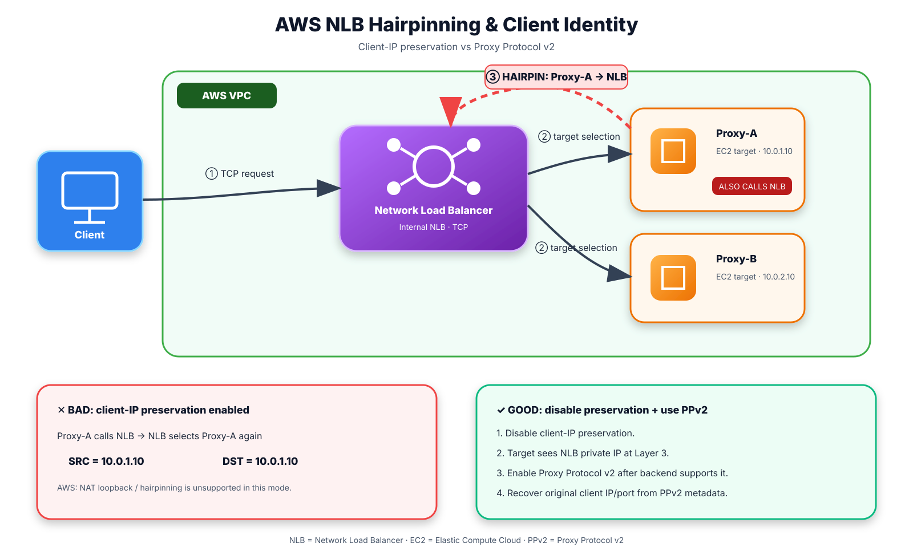
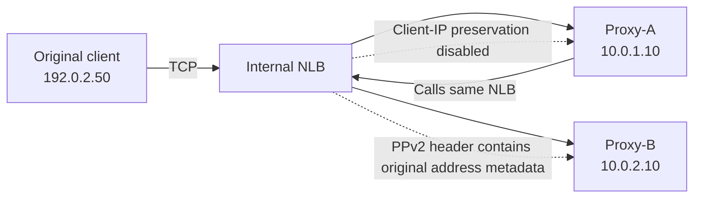

# AWS NLB Hairpinning, Client-IP Preservation, and Proxy Protocol v2

> **Primary source:** https://docs.aws.amazon.com/elasticloadbalancing/latest/network/load-balancer-target-groups.html  
> **Supporting source:** https://docs.aws.amazon.com/elasticloadbalancing/latest/network/load-balancer-troubleshooting.html  
> **Target-group attributes:** https://docs.aws.amazon.com/elasticloadbalancing/latest/network/edit-target-group-attributes.html

## The exam question in plain English

A group of backend proxy servers is registered behind an **internal Network Load Balancer (NLB)**.

Those same proxy servers must sometimes connect to the NLB themselves.

The application also needs to know the **real client IP address**.

That creates a conflict:

- **Client-IP preservation** lets the target see the original client IP directly in the IP header.
- But AWS does **not support NAT loopback / hairpinning when client-IP preservation is enabled**.
- Therefore, when a target must call the NLB it is itself registered behind, the safe design is to **disable client-IP preservation**.
- If the application still needs the original client IP, use **Proxy Protocol v2 (PPv2)**, provided the target application/proxy understands PPv2.

## What “hairpinning” means

Hairpinning means traffic leaves a server, goes through a load balancer, and can come right back to the same server.

Example:

```text
Proxy-A
  |
  | TCP connection to internal NLB
  v
Internal NLB
  |
  | target selection chooses Proxy-A
  v
Proxy-A
```

Proxy-A is simultaneously:

1. the **client** initiating the connection, and
2. the **target** chosen by the NLB.

AWS calls this **NAT loopback**, also commonly called **hairpinning**.

## Why client-IP preservation breaks this path

Assume:

- Proxy-A = `10.0.1.10`
- NLB DNS name = `internal-service.example`
- Proxy-A connects to the NLB
- NLB selects Proxy-A as the target

With client-IP preservation enabled, the target receives the original source IP.

Conceptually:

```text
Before NLB:

Source:      10.0.1.10   (Proxy-A)
Destination: NLB

After NLB selects Proxy-A:

Source:      10.0.1.10
Destination: 10.0.1.10   (Proxy-A)
```

The target can therefore see a flow whose source and destination address are effectively the same host. AWS documents that if an instance is a client of an NLB it is registered with, the connection can time out when the NLB sends the request back to that same instance.

This is why AWS states that **NAT loopback is not supported when client-IP preservation is enabled**.

## The correct design



[Open or edit the draw.io source](images/09-05-26-10-38_AWS_NLB_Hairpinning_Flow.drawio)

**What this image shows:** A registered proxy target can also initiate a connection to the same internal NLB. The dashed return path illustrates the hairpin/NAT-loopback case where the NLB can select that same proxy as the destination.

**What matters:** With client-IP preservation enabled, the self-hairpin case is unsupported. The recommended design is to disable client-IP preservation and, when the application still requires the original client identity, carry that information in the Proxy Protocol v2 header.

**What to verify:** Confirm `preserve_client_ip.enabled=false`, confirm `proxy_protocol_v2.enabled=true` only after the backend listener supports PPv2, and test from a registered target through the NLB to prove the exact hairpin path works.

### Mermaid version



For a backend that must call its own NLB:

1. **Disable client-IP preservation** on the TCP/TLS target group where AWS permits it.
2. The target then sees the NLB node's private IP as the network-layer source rather than the original source IP.
3. **Enable Proxy Protocol v2** if the application needs the original source address.
4. Make sure the backend proxy/application can parse PPv2 **before** enabling it.

## Why Proxy Protocol v2 solves the identity requirement

Proxy Protocol v2 does not rely on preserving the client's address in the normal IP header.

Instead, the NLB prepends a binary metadata header to the TCP stream.

Conceptually:

```text
IP header seen by target
------------------------
Source IP: NLB private IP
Destination IP: target IP

Proxy Protocol v2 metadata
--------------------------
Original source IP: 192.0.2.50
Original source port: <client-port>
Original destination: <service-address/port>

Application payload
-------------------
<normal TCP application data>
```

So the two requirements are separated:

- **Network-layer source address:** changed so the hairpin path can work.
- **Client identity:** carried separately through PPv2.

## Why the other answer choices are wrong

### “Keep preservation enabled and add a broader route to the same target”

Wrong.

This is not fundamentally a route-selection problem. AWS explicitly documents a **feature limitation**: NAT loopback is unsupported while client-IP preservation is enabled.

Adding routes does not change the source/destination behavior that causes the issue.

### “Switch the listener to UDP so preservation can be disabled”

Wrong.

AWS documents that client-IP preservation is enabled and **cannot be disabled** for UDP-family target-group protocols such as UDP and TCP_UDP.

Changing TCP to UDP would also change the application transport protocol and would not be an appropriate workaround.

### “Register the same host twice by instance ID”

Wrong.

Registering the target twice does not remove the possibility that the NLB selects the same physical backend that originated the connection.

It also does not change the underlying client-IP-preservation limitation.

### “Disable client-IP preservation and enable Proxy Protocol v2 only after targets can parse it”

**Correct.**

This directly follows AWS guidance:

- disable client-IP preservation for the hairpin case;
- use Proxy Protocol v2 when the original client address is still required.

## Important PPv2 warning

Do **not** simply turn on Proxy Protocol v2 and assume the application will ignore it.

AWS prepends the PPv2 header to TCP data. If the application is not expecting that binary header, it may interpret those bytes as application data and fail.

Therefore:

```text
Application supports PPv2?
        |
        +-- No --> configure/upgrade proxy or application first
        |
        +-- Yes --> enable PPv2 on the NLB target group
```

Common proxies that may support Proxy Protocol include HAProxy, NGINX, Envoy, and others, but their specific listener configuration must explicitly enable support.

## AWS CLI example

For a compatible TCP target group, disabling client-IP preservation uses the target-group attribute:

```cli
aws elbv2 modify-target-group-attributes \
  --target-group-arn <TARGET_GROUP_ARN> \
  --attributes Key=preserve_client_ip.enabled,Value=false
```

Enable Proxy Protocol v2:

```cli
aws elbv2 modify-target-group-attributes \
  --target-group-arn <TARGET_GROUP_ARN> \
  --attributes Key=proxy_protocol_v2.enabled,Value=true
```

`<TARGET_GROUP_ARN>` is the ARN of the NLB target group.

Before enabling PPv2, verify that the application or proxy listening on the target port expects a Proxy Protocol v2 header.

## Target-group protocol caveat

AWS currently documents these important defaults/constraints:

| Target-group case | Client-IP preservation |
|---|---|
| Instance target group | Enabled by default |
| IP target group using TCP/TLS | Disabled by default |
| UDP / TCP_UDP / QUIC / TCP_QUIC | Enabled and cannot be disabled |

For TCP and TLS target groups, the `preserve_client_ip.enabled` attribute can be used where supported.

## Packet-flow comparison

### Preservation enabled — problematic self-hairpin

```text
Proxy-A 10.0.1.10
   |
   | src=10.0.1.10
   v
   NLB
   |
   | NLB chooses Proxy-A
   | original source preserved
   v
Proxy-A 10.0.1.10

Result:
source = 10.0.1.10
destination = 10.0.1.10

AWS: NAT loopback/hairpinning is unsupported in this mode.
```

### Preservation disabled + PPv2 — preferred design

```text
Proxy-A
   |
   | connects to NLB
   v
   NLB
   |
   | source presented to target = NLB private IP
   | PPv2 metadata carries original address information
   v
Proxy-A or Proxy-B
```

The target no longer depends on the original client IP remaining in the IP header, so the self-referential path can be supported while client identity is recovered from PPv2.

## How to remember this for the exam

Think:

> **Hairpin requires SNAT-like behavior; identity moves into metadata.**

Or even shorter:

```text
NLB target calls its own NLB?
        |
        v
Disable client-IP preservation
        |
        v
Need original client IP?
        |
        v
Use Proxy Protocol v2
```

## Testing and verification

### 1. Verify target-group attributes

```cli
aws elbv2 describe-target-group-attributes \
  --target-group-arn <TARGET_GROUP_ARN>
```

Look for:

```text
preserve_client_ip.enabled
proxy_protocol_v2.enabled
```

### 2. Test the exact hairpin path

From a registered target:

```cli
nc -vz <INTERNAL_NLB_DNS_NAME> <PORT>
```

or use the application's normal TCP request.

The important test is not merely client-to-NLB connectivity. It is:

```text
registered target -> same NLB -> potentially same registered target
```

### 3. Verify PPv2 parsing

Check the backend proxy/application logs.

Success means the application:

- accepts the connection;
- parses the PPv2 header correctly;
- records the intended originating address metadata.

If the application immediately resets or emits malformed-protocol errors after PPv2 is enabled, verify that PPv2 support is enabled on the listening socket.

## Common mistakes

- Treating hairpin failure as a routing-table problem.
- Keeping client-IP preservation enabled and assuming cross-zone load balancing eliminates the risk.
- Enabling PPv2 before the backend supports it.
- Confusing PPv2 with HTTP `X-Forwarded-For`; PPv2 operates below HTTP and can carry connection metadata for raw TCP services.
- Testing only from an external client instead of testing from a target that is itself registered behind the NLB.
- Forgetting that client-IP-preservation behavior depends on target type and target-group protocol.

## Troubleshooting by symptom

### Target can reach other services but times out when calling its own NLB

Check `preserve_client_ip.enabled`.

If enabled, compare the design with AWS's documented NAT-loopback restriction. For supported TCP/TLS configurations, disable preservation and retest.

### Application breaks immediately after PPv2 is enabled

The target likely is not parsing the Proxy Protocol v2 binary header.

Disable PPv2 temporarily or configure the application/proxy listener to expect PPv2.

### Application works but logs only the NLB address

That is expected when preservation is disabled unless the application is extracting the original address from PPv2.

Verify:

- PPv2 is enabled on the target group.
- PPv2 parsing is enabled on the application.
- Logs are configured to use the PPv2-provided address.

## Key takeaway

The question is testing one very specific AWS design rule:

> **An NLB target that must call the same NLB should not rely on client-IP preservation because NLB NAT loopback/hairpinning is unsupported with preservation enabled. Disable preservation, and if the original client address is still required, recover it with Proxy Protocol v2 after confirming the target can parse PPv2.**

## Sources

- AWS — Target groups for your Network Load Balancers  
  https://docs.aws.amazon.com/elasticloadbalancing/latest/network/load-balancer-target-groups.html
- AWS — Edit target group attributes for your Network Load Balancer  
  https://docs.aws.amazon.com/elasticloadbalancing/latest/network/edit-target-group-attributes.html
- AWS — Troubleshoot your Network Load Balancer  
  https://docs.aws.amazon.com/elasticloadbalancing/latest/network/load-balancer-troubleshooting.html
