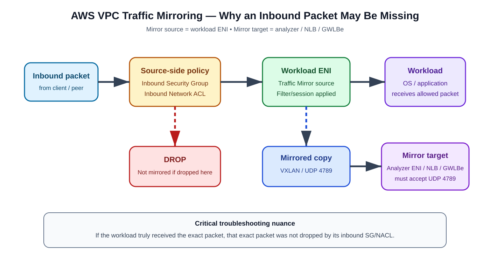
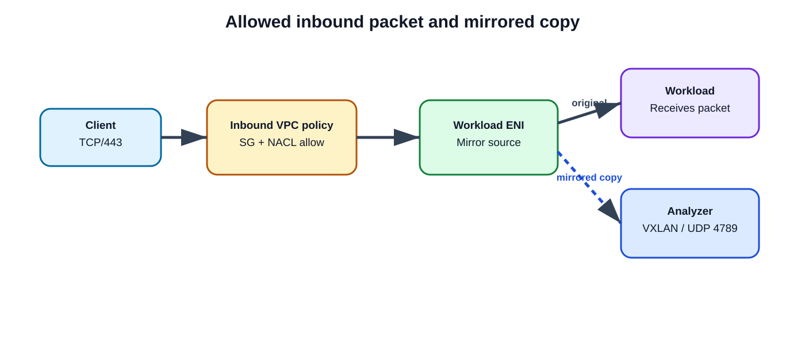
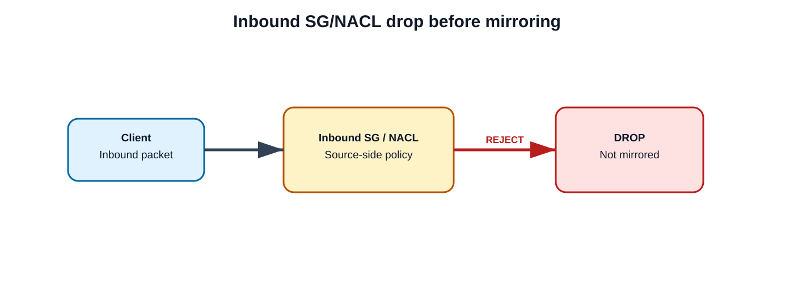
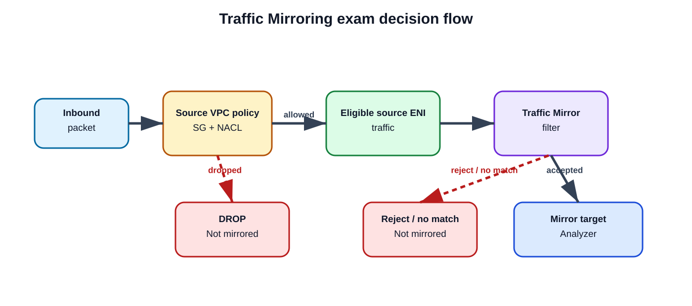

# AWS VPC Traffic Mirroring: Why an Inbound Packet Can Be Missing from the Analyzer

## Exam scenario

> **Question:** An analyzer reports no inbound packet that the workload says it received. Which source-side fact can explain the absence?
>
> - All inbound traffic is mirrored before any VPC policy.
> - The NLB always converts VXLAN to TCP.
> - A Traffic Mirror session decrypts TLS automatically.
> - **Inbound traffic dropped by the source security group or network ACL is not mirrored.**

**Best answer:** **Inbound traffic dropped by the source Security Group (SG) or Network Access Control List (NACL) is not mirrored.**

AWS documents that inbound traffic dropped at a Traffic Mirror source because of inbound security-group or inbound network-ACL rules is not mirrored.

> **Important nuance:** If the workload truly received the **exact same packet**, then that exact packet was not dropped by the workload's inbound SG/NACL. In a real incident, that wording should push you to validate the exact ENI, flow 5-tuple, timestamps, mirror filter, target path, VXLAN handling, and analyzer state.

---

## Supplied and supporting URLs

- AWS Traffic Mirror targets and source-side routing/security behavior: https://docs.aws.amazon.com/vpc/latest/mirroring/traffic-mirroring-targets.html
- AWS — How Traffic Mirroring works: https://docs.aws.amazon.com/vpc/latest/mirroring/traffic-mirroring-how-it-works.html
- AWS — Traffic Mirror filters: https://docs.aws.amazon.com/vpc/latest/mirroring/traffic-mirroring-filters.html
- AWS — Traffic Mirror packet format: https://docs.aws.amazon.com/vpc/latest/mirroring/traffic-mirroring-packet-formats.html
- AWS — Traffic Mirror connectivity: https://docs.aws.amazon.com/vpc/latest/mirroring/traffic-mirroring-connection.html
- AWS — Traffic Mirroring limitations: https://docs.aws.amazon.com/vpc/latest/mirroring/traffic-mirroring-network-limitations.html
- AWS — Getting started: https://docs.aws.amazon.com/vpc/latest/mirroring/traffic-mirroring-getting-started.html
- AWS CLI — `create-traffic-mirror-filter`: https://docs.aws.amazon.com/cli/latest/reference/ec2/create-traffic-mirror-filter.html
- AWS CLI — `create-traffic-mirror-filter-rule`: https://docs.aws.amazon.com/cli/latest/reference/ec2/create-traffic-mirror-filter-rule.html
- AWS CLI — `create-traffic-mirror-session`: https://docs.aws.amazon.com/cli/latest/reference/ec2/create-traffic-mirror-session.html

---

## 1. Core concept

**Source information:** AWS states that inbound traffic dropped at the Traffic Mirror source because of inbound SG or inbound NACL rules is not mirrored. AWS also documents that mirrored outbound traffic is not subject to the outbound SG rules of the Traffic Mirror source.

**Additional explanation:** Traffic Mirroring is not a tap that sees every packet before all VPC policy. A mirror session observes eligible traffic from an ENI, applies the configured Traffic Mirror filter, and sends accepted copies toward the configured target.

**Reasonable inference:** If traffic is rejected before it becomes eligible at the source ENI, the analyzer cannot receive a mirrored copy from that session.

---

## 2. Packet path and capture point



[Open the editable draw.io diagram](images/09-05-26-11-22_aws_vpc_traffic_mirroring_ingress_capture_path.drawio)

**What this image shows:** The inbound packet encounters source-side VPC policy, then reaches the workload ENI if allowed. Eligible traffic can be copied to the mirror target. A packet rejected by the source inbound SG/NACL is not mirrored.

**What matters:** Original workload delivery and mirror-copy delivery are separate outcomes.

**What to verify:** Source ENI, inbound SG/NACL policy, session state, filter rules, route to target, and analyzer support for VXLAN over UDP/4789.

---

## 3. What a Traffic Mirror session contains

A session joins three components:

1. **Source** — an eligible Elastic Network Interface (ENI).
2. **Filter** — ingress/egress rules deciding which packets are copied.
3. **Target** — a monitoring ENI, Network Load Balancer (NLB), or Gateway Load Balancer endpoint (GWLBe).

For accepted traffic, AWS encapsulates the mirrored copy with **Virtual Extensible LAN (VXLAN)** and sends it toward the target. Traffic Mirroring does not convert the packet to ordinary TCP and does not automatically decrypt TLS.

### VXLAN transport

The mirror target path must support the encapsulated traffic. Where security groups apply, allow the required mirrored transport, commonly **UDP destination port 4789**.

---

## 4. Why the SG/NACL answer is correct

Consider a client sending TCP/443 to an EC2 workload.

### Case A — packet is allowed



[Open the editable draw.io diagram](images/09-05-26-11-22_aws_vpc_traffic_mirroring_allowed_packet_flow.drawio)

**What this image shows:** The allowed packet reaches the workload ENI. The original continues to the workload while a matching Traffic Mirror copy is sent toward the analyzer using VXLAN over UDP/4789.

**What matters:** Successful workload delivery does not by itself prove the mirror copy reached the analyzer.

**What to verify:** Correct source ENI, accepted filter rule, mirror-target reachability, UDP/4789 handling, and VXLAN decapsulation.

### Case B — source inbound policy drops the packet



[Open the editable draw.io diagram](images/09-05-26-11-22_aws_vpc_traffic_mirroring_dropped_packet_flow.drawio)

**What this image shows:** The source-side inbound SG or NACL rejects the packet. The packet does not reach the workload ENI as allowed traffic and no mirrored copy is generated for that packet.

**What matters:** This is the AWS-documented behavior the exam distractor is testing.

**What to verify:** Correlate the exact flow and timestamp with SG/NACL policy and VPC Flow Logs.

---

## 5. Security Group versus Network ACL

| Property | Security Group | Network ACL |
|---|---|---|
| Scope | ENI/resource association | Subnet |
| State model | Stateful | Stateless |
| Rule behavior | Allow rules | Allow and deny rules |
| Relevance here | Inbound SG rejection can prevent inbound traffic from being mirrored | Inbound NACL rejection can prevent inbound traffic from being mirrored |

The question is not asking which policy engine made the decision. It is testing the broader source-side fact that a policy rejection can make an inbound packet absent from the mirror feed.

---

## 6. The tricky phrase: “the workload says it received it”

If the workload truly received **that exact packet**, it cannot simultaneously have been dropped by the workload's own inbound SG or NACL.

### Exam interpretation

The correct documented fact remains:

> **Inbound traffic dropped by the source security group or NACL is not mirrored.**

### Real-world interpretation

Validate that both observations refer to the same traffic:

- source and destination IP addresses
- source and destination ports
- protocol
- timestamp and time zone
- source ENI
- connection attempt
- Availability Zone and path
- ingress versus egress direction
- same packet rather than a retry or the same higher-layer transaction

A load balancer, proxy, retry, multiple ENIs, or multiple backend targets can make two observations appear to refer to the same packet when they do not.

---

## 7. Traffic Mirror filters can also hide packets

A Traffic Mirror filter is independent of SGs and NACLs.

AWS evaluates filter rules in ascending rule-number order. The first matching rule determines the action. A filter without matching accept rules does not mirror the traffic.

Example policy logic:

```text
Rule 10: reject TCP/22
Rule 20: accept all other IPv4 TCP
```

SSH traffic matching rule 10 is not mirrored even when the workload is otherwise allowed to receive it.

Ingress and egress are separate directions. An ingress rule does not automatically mirror egress traffic.

---

## 8. TLS is not automatically decrypted

The distractor **“A Traffic Mirror session decrypts TLS automatically”** is false.

Traffic Mirroring copies packet data. It does not automatically terminate or decrypt Transport Layer Security (TLS). A mirrored HTTPS packet remains encrypted unless a separate security platform performs lawful TLS inspection under its own policy and architecture.

Seeing encrypted TCP/443 in the analyzer therefore indicates normal packet copying, not a mirroring failure.

---

## 9. Mirror-target requirements

A mirror target can be:

- network interface
- Network Load Balancer
- Gateway Load Balancer endpoint

For high availability, AWS supports load-balanced target designs such as NLB or GWLBe.

Verify:

- route reachability from mirror source to target
- target-side security policy
- UDP/4789 where applicable
- analyzer VXLAN support
- adequate throughput and packets-per-second capacity
- correct analyzer interface and decapsulation view

---

## 10. CLI configuration pattern

Use placeholders and replace them with real resource IDs from your environment.

### Create the filter

```cli
aws ec2 create-traffic-mirror-filter \
  --description "Inbound TCP mirror filter"
```

Record the returned `<TRAFFIC_MIRROR_FILTER_ID>`.

### Add an ingress accept rule

```cli
aws ec2 create-traffic-mirror-filter-rule \
  --traffic-mirror-filter-id <TRAFFIC_MIRROR_FILTER_ID> \
  --traffic-direction ingress \
  --rule-number 100 \
  --rule-action accept \
  --protocol 6 \
  --source-cidr-block 0.0.0.0/0 \
  --destination-cidr-block 0.0.0.0/0 \
  --description "Mirror inbound IPv4 TCP"
```

- `<TRAFFIC_MIRROR_FILTER_ID>` — Traffic Mirror filter ID, beginning with `tmf-`
- `6` — IP protocol number for TCP

### Create the mirror session

```cli
aws ec2 create-traffic-mirror-session \
  --network-interface-id <SOURCE_ENI_ID> \
  --traffic-mirror-target-id <TRAFFIC_MIRROR_TARGET_ID> \
  --traffic-mirror-filter-id <TRAFFIC_MIRROR_FILTER_ID> \
  --session-number 1 \
  --description "Inbound workload inspection"
```

- `<SOURCE_ENI_ID>` — ENI being mirrored
- `<TRAFFIC_MIRROR_TARGET_ID>` — target ID beginning with `tmt-`
- `<TRAFFIC_MIRROR_FILTER_ID>` — filter ID beginning with `tmf-`

---

## 11. Verification workflow

### Check the source ENI and session

```cli
aws ec2 describe-traffic-mirror-sessions
```

**Success:** The expected source ENI, filter, and target are associated with the active session.

**Failure means:** The wrong ENI or stale session may be under observation.

### Check the filter

```cli
aws ec2 describe-traffic-mirror-filters
```

Verify direction, rule number, action, protocol, CIDR blocks, and port ranges.

**Success:** The missing flow matches an `accept` rule before a matching `reject` rule.

### Check the SG/NACL decision

Inspect the security groups on the source ENI and the NACL associated with the subnet. If VPC Flow Logs are enabled, correlate by timestamp and 5-tuple.

**Success:** An allowed workload flow should correlate with an `ACCEPT` outcome rather than a source-side policy rejection.

### Check target transport

The analyzer path must be able to receive and interpret the VXLAN-encapsulated mirrored traffic. Confirm UDP/4789 and VXLAN decapsulation where applicable.

---

## 12. Other reasons a mirrored packet may be absent

Source-side SG/NACL rejection is not the only possibility. Also investigate:

- mirror filter excludes the flow
- wrong ENI is configured as the source
- wrong traffic direction is configured
- target is unreachable
- target-side policy blocks mirrored traffic
- analyzer does not parse VXLAN
- packet-length configuration truncates data
- instance bandwidth or packets-per-second pressure drops mirrored packets
- timestamp mismatch
- load balancing or multiple ENIs lead to correlation with the wrong path

AWS documents that mirrored packets can be dropped under bandwidth/PPS pressure and that production traffic is prioritized.

---

## 13. Troubleshooting by symptom

### Workload receives traffic but analyzer sees nothing

**Where:** Mirror session, filter, ENI, target path, analyzer.

**What it tests:** Whether the exact packet was eligible for copying and whether the copy reached the analyzer.

**Expected success:** Correct ENI + matching accept rule + reachable target + successful VXLAN decoding.

**Next action if it fails:** Correlate the exact 5-tuple and timestamp before attributing the absence to an SG/NACL drop.

### VPC Flow Logs show REJECT and analyzer sees nothing

**Where:** Source SG/NACL and Flow Log entry.

**What it tests:** Whether source-side VPC policy rejected the flow.

**Expected result:** A source-side inbound rejection is consistent with AWS documentation that the packet is not mirrored.

### Analyzer sees UDP/4789 but no original TCP flow

**Where:** Analyzer software and decapsulation configuration.

**What it tests:** Whether VXLAN is being decoded.

**Expected success:** The analyzer exposes the inner original packet after decapsulation.

### Only some mirrored packets disappear during high load

**Where:** EC2/network performance metrics and mirror-target capacity.

**What it tests:** Bandwidth and packets-per-second pressure.

**Next action:** Correlate mirror loss with utilization and review the AWS Traffic Mirroring network limitations.

---

## 14. Common mistakes

| Mistake | Why it is wrong |
|---|---|
| Assuming mirroring sees traffic before all VPC policy | AWS explicitly documents source-side inbound SG/NACL drops as not mirrored. |
| Assuming an NLB converts VXLAN to TCP | Mirrored traffic uses VXLAN encapsulation; the analyzer/target design must handle it. |
| Expecting automatic TLS decryption | Traffic Mirroring copies encrypted packets; it does not decrypt TLS. |
| Creating a filter but no useful accept rules | The filter can exclude the entire flow. |
| Configuring ingress and expecting egress automatically | Direction is explicit in mirror filter rules. |
| Ignoring the target path | The copy still needs routing, security policy, capacity, and decapsulation. |
| Treating “workload received it” as proof the analyzer must see it | ENI selection, filters, target delivery, capacity, and correlation can still differ. |

---

## 15. Exam memory aid



[Open the editable draw.io diagram](images/09-05-26-11-22_aws_vpc_traffic_mirroring_exam_memory_flow.drawio)

**What this image shows:** The decision path from source-side VPC policy through ENI eligibility and Traffic Mirror filtering to the analyzer.

**What matters:** A packet can disappear from the mirror feed at multiple stages. Source-side SG/NACL rejection and mirror-filter rejection are different causes.

**What to verify:** Identify which stage rejected or lost the exact flow rather than treating “not visible in analyzer” as a single failure mode.

Remember the three distractor killers:

- **VPC policy:** source-side inbound SG/NACL rejection can make a packet absent from Traffic Mirroring.
- **VXLAN:** Traffic Mirroring encapsulates copies in VXLAN; it does not mean an NLB converts VXLAN to TCP.
- **TLS:** Traffic Mirroring does not automatically decrypt TLS.

---

## 16. Source information, additional explanation, and inference

### Source information

Confirmed by AWS documentation:

- Traffic Mirroring copies eligible traffic from source ENIs to mirror targets.
- Matching mirrored packets are VXLAN encapsulated.
- Target paths must permit and process the mirrored transport.
- Inbound traffic dropped at the source by inbound SG or inbound NACL rules is not mirrored.
- Traffic Mirror filters determine which traffic is copied.
- Empty or nonmatching filter rules result in traffic not being mirrored.
- Mirrored packets can be dropped because of bandwidth/PPS limitations.

### Additional explanation

Troubleshoot the problem as four separate questions:

1. Was the original packet allowed to reach the workload?
2. Was the packet accepted by the Traffic Mirror filter?
3. Was the VXLAN copy successfully delivered to the target?
4. Could the analyzer decapsulate and display the inner packet?

### Reasonable inference

If the application truly received the exact flow but the analyzer did not, investigation should move away from an SG/NACL drop of that exact packet and toward ENI selection, mirror filtering, target delivery, analyzer decapsulation, resource limits, or event correlation.

---

## Sources

1. AWS VPC Traffic Mirror targets and routing/security behavior  
   https://docs.aws.amazon.com/vpc/latest/mirroring/traffic-mirroring-targets.html
2. AWS — How Traffic Mirroring works  
   https://docs.aws.amazon.com/vpc/latest/mirroring/traffic-mirroring-how-it-works.html
3. AWS — Traffic Mirror filters  
   https://docs.aws.amazon.com/vpc/latest/mirroring/traffic-mirroring-filters.html
4. AWS — Traffic Mirror packet format  
   https://docs.aws.amazon.com/vpc/latest/mirroring/traffic-mirroring-packet-formats.html
5. AWS — Traffic Mirror connectivity  
   https://docs.aws.amazon.com/vpc/latest/mirroring/traffic-mirroring-connection.html
6. AWS — Traffic Mirroring limitations  
   https://docs.aws.amazon.com/vpc/latest/mirroring/traffic-mirroring-network-limitations.html
7. AWS CLI — Traffic Mirror filter/session commands  
   https://docs.aws.amazon.com/cli/latest/reference/ec2/create-traffic-mirror-filter.html  
   https://docs.aws.amazon.com/cli/latest/reference/ec2/create-traffic-mirror-filter-rule.html  
   https://docs.aws.amazon.com/cli/latest/reference/ec2/create-traffic-mirror-session.html
