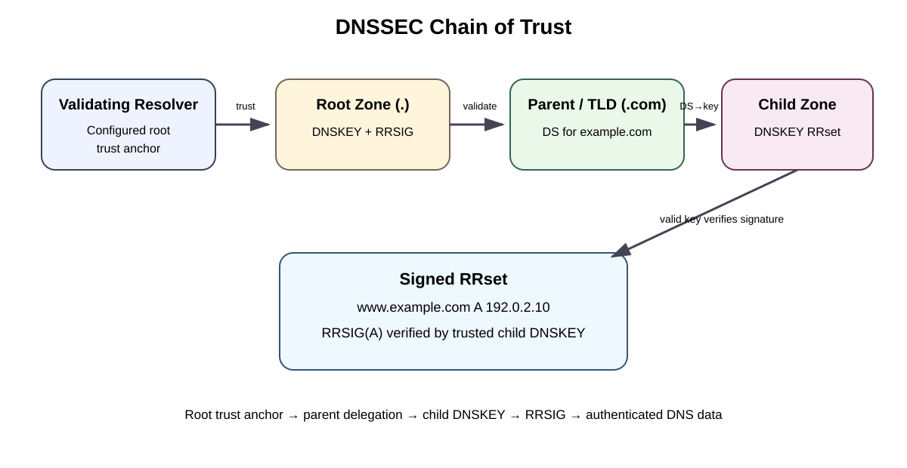
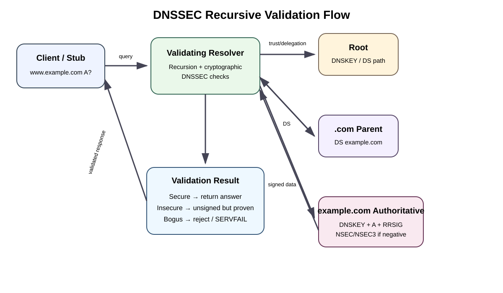

# DNSSEC (Domain Name System Security Extensions) — Comprehensive Network & Security Study Guide

> **Purpose:** Explain DNSSEC from a network-engineering and security-operations perspective: what it protects, how the chain of trust works, signing versus validation, DNSSEC records, packet/query flow, key management, negative answers, deployment, verification, migration, failure modes, and troubleshooting.

## Source classification

- **Source information** — behavior stated by an RFC, ICANN, or vendor documentation.
- **Additional explanation** — teaching detail added to connect source material into an operational model.
- **Reasonable inference** — an operational conclusion that follows from documented behavior but is not itself a vendor guarantee.

## Supplied and supporting URLs

- RFC 4033 — https://www.rfc-editor.org/rfc/rfc4033.html
- RFC 4034 — https://www.rfc-editor.org/rfc/rfc4034.html
- RFC 4035 — https://www.rfc-editor.org/rfc/rfc4035.html
- RFC 5155 — https://www.rfc-editor.org/rfc/rfc5155.html
- RFC 9904 — https://www.rfc-editor.org/rfc/rfc9904.html
- ICANN DNSSEC overview — https://www.icann.org/resources/pages/dnssec-what-is-it-why-important-2019-03-05-en
- AWS Route 53 DNSSEC signing — https://docs.aws.amazon.com/Route53/latest/DeveloperGuide/dns-configuring-dnssec.html
- AWS Route 53 chain of trust — https://docs.aws.amazon.com/Route53/latest/DeveloperGuide/dns-configuring-dnssec-enable-signing.html
- AWS Route 53 Resolver DNSSEC validation — https://docs.aws.amazon.com/Route53/latest/DeveloperGuide/resolver-dnssec-validation.html
- Cloudflare DNSSEC — https://developers.cloudflare.com/dns/dnssec/
- Cloudflare key management — https://developers.cloudflare.com/dns/dnssec/validation-and-key-management/
- Cloudflare NSEC3 — https://developers.cloudflare.com/dns/dnssec/enable-nsec3/

---

## 1. DNSSEC in one sentence

**DNSSEC lets a validating DNS resolver verify that DNS data is authentic and has not been altered since it was signed by the authoritative zone.**

**Source information:** RFC 4033 defines DNSSEC as providing data-origin authentication, data-integrity assurance, and authenticated denial of existence. DNSSEC does **not** provide confidentiality.

DNSSEC helps detect forged DNS data such as cache-poisoning responses, spoofed answers, modified signed data, and false claims that signed names or record types do not exist.

DNSSEC does **not** encrypt DNS, hide the queried name, replace TLS/HTTPS, prove that a web application is trustworthy, or prevent an authorized DNS administrator from publishing a bad record. DNS over HTTPS (DoH) and DNS over TLS (DoT) address DNS transport confidentiality and are separate from DNSSEC.

---

## 2. Important terminology

| Term | Meaning | Operational purpose |
|---|---|---|
| DNSSEC | Domain Name System Security Extensions | Cryptographically authenticates DNS data |
| RRset | Resource Record Set | Records with the same owner, class, and type |
| RRSIG | Resource Record Signature | Digital signature covering an RRset |
| DNSKEY | DNS Public Key | Publishes DNSSEC public-key material in a zone |
| DS | Delegation Signer | Parent record containing a digest that identifies a child DNSKEY |
| KSK | Key Signing Key | Commonly signs the DNSKEY RRset |
| ZSK | Zone Signing Key | Commonly signs normal zone RRsets |
| NSEC | Next Secure | Authenticated denial of existence |
| NSEC3 | Hashed Next Secure | Hashed authenticated denial designed to reduce direct zone enumeration |
| Trust anchor | Key material trusted without deriving trust through another DNSSEC delegation | Usually the DNS root trust anchor |
| AD | Authenticated Data | Response flag signaling authenticated data |
| CD | Checking Disabled | Query flag asking a validator not to perform its normal checks |
| DO | DNSSEC OK | EDNS flag indicating DNSSEC records can be returned |

**Additional explanation:** KSK and ZSK describe operational roles. DNSSEC itself operates on DNSKEY records and signatures; providers may implement different key-management models.

---

## 3. DNSSEC chain of trust



[Download/edit the matching draw.io diagram](images/09-05-26-12-14_dnssec_chain_of_trust.drawio)

**What this image shows:** The validating resolver starts with trusted root key material, follows the signed DNS hierarchy, authenticates the parent DS, matches that DS to a child DNSKEY, and then uses the authenticated child key to validate the RRSIG covering the requested RRset.

**What matters:** The parent publishes a **DS**, not simply a copy of the child public key. The child publishes the DNSKEY. A mismatch between the parent DS and the currently served child DNSKEY can make the zone Bogus to validating resolvers.

**What to verify:** For a signed child, confirm that the DS returned by the parent corresponds to a DNSKEY currently served by the child.

Conceptually:

```text
Root trust anchor
       |
       v
Validate root DNSKEY
       |
       v
Validate parent/TLD DNSKEY
       |
       v
Validate child DS in parent
       |
       v
Match DS digest to child DNSKEY
       |
       v
Use trusted child DNSKEY to verify RRSIG
       |
       v
Authenticated DNS RRset
```

---

## 4. KSK and ZSK

### Key Signing Key (KSK)

The KSK commonly signs the **DNSKEY RRset**. Because a parent DS normally identifies the KSK or another secure-entry-point DNSKEY, a KSK change can require coordination with the registrar/parent.

### Zone Signing Key (ZSK)

The ZSK commonly signs normal authoritative RRsets such as A, AAAA, MX, TXT, CNAME, and NS records.

### Why separate them?

- ZSKs can often be rotated without modifying the parent DS.
- KSKs can be managed more conservatively because they participate in the parent-child trust relationship.
- Managed DNS services may automate much of this process.

A simplified model is:

```text
Parent DS
   |
   v
KSK DNSKEY
   | signs DNSKEY RRset
   v
ZSK DNSKEY
   | signs zone RRsets
   v
A / AAAA / MX / TXT / ...
```

---

## 5. Core DNSSEC resource records

### DNSKEY

Presentation format:

```text
<name> <TTL> IN DNSKEY <flags> <protocol> <algorithm> <public-key>
```

Illustrative format only:

```text
example.com. 3600 IN DNSKEY 257 3 13 <BASE64_PUBLIC_KEY>
```

`257` is commonly associated with a zone key carrying the Secure Entry Point bit, protocol is normally `3`, and the algorithm is an IANA DNSSEC algorithm number.

### DS

The DS record authenticating a delegation is published in the **parent zone**.

```text
<child-name> <TTL> IN DS <key-tag> <algorithm> <digest-type> <digest>
```

It identifies a child DNSKEY through the key tag, DNSSEC algorithm, digest type, and cryptographic digest.

### RRSIG

RRSIG contains the digital signature for an RRset. Important fields include:

- Type covered.
- Algorithm.
- Labels.
- Original TTL.
- Signature expiration.
- Signature inception.
- Key tag.
- Signer name.
- Signature.

Because inception and expiration are part of the signature metadata, accurate time is operationally important.

### NSEC

NSEC provides authenticated denial that a queried name or record type does not exist. Because NSEC links authoritative names in canonical order, conventional NSEC can allow zone-name enumeration.

### NSEC3

RFC 5155 introduced NSEC3 as an alternative denial mechanism. It hashes owner names, reducing direct zone enumeration while adding operational and computational tradeoffs.

---

## 6. Recursive DNSSEC validation flow



[Download/edit the matching draw.io diagram](images/09-05-26-12-14_dnssec_validation_flow.drawio)

**What this image shows:** A stub client sends a normal DNS query to a validating recursive resolver. The resolver performs recursion and collects the DS, DNSKEY, RRSIG, and—when needed—NSEC/NSEC3 records required to establish a validation result.

**What matters:** The stub client normally does not walk the DNS hierarchy itself. The recursive resolver validates on the client's behalf.

**What to verify:** Confirm that the recursive resolver is actually validating rather than merely returning DNSSEC records.

Typical flow:

1. Client asks its recursive resolver for `www.example.com A`.
2. Resolver checks cache.
3. Resolver follows the DNS hierarchy if required.
4. Resolver starts from its root trust anchor.
5. It validates the parent chain.
6. It obtains the child DS from the parent.
7. It retrieves the child DNSKEY RRset.
8. It confirms that an authenticated DS corresponds to an appropriate child DNSKEY.
9. It retrieves the requested RRset and RRSIG.
10. It verifies the signature.
11. A successful signed chain is **Secure**.
12. A securely proven unsigned child can be **Insecure**.
13. A chain that should validate but does not is **Bogus**, commonly causing `SERVFAIL`.

---

## 7. Secure, Insecure, Bogus, and Indeterminate

| State | Meaning | Typical behavior |
|---|---|---|
| Secure | Chain of trust and signatures validate | Answer accepted |
| Insecure | Validator securely proves delegation to an unsigned zone | Unsigned answer can be accepted |
| Bogus | DNSSEC was expected but validation failed | Commonly `SERVFAIL` |
| Indeterminate | Security status cannot yet be determined | Resolver/context dependent |

A critical distinction is that an unsigned child is not automatically Bogus. If the signed parent securely proves that the child has no DS, the child can be classified Insecure. A **stale DS** is more dangerous: it tells validators that the child is signed using key material that the child may no longer serve.

---

## 8. DNSSEC versus encryption

| Requirement | Technology |
|---|---|
| Authenticate DNS data | DNSSEC |
| Detect DNS tampering | DNSSEC |
| Encrypt client-to-resolver DNS | DoT / DoH |
| Authenticate HTTPS server/application | TLS certificate validation |
| Encrypt application traffic | TLS |

DNSSEC, DoH/DoT, and TLS can be used together because they solve different problems.

---

## 9. DO, AD, and CD

### DO — DNSSEC OK

DO is carried in EDNS and indicates that the requester can receive DNSSEC-related records.

```cli
dig +dnssec example.com A
```

### AD — Authenticated Data

A validating resolver may set the AD flag when it considers the returned data authenticated.

```cli
dig @<VALIDATING_RESOLVER> example.com A +dnssec
```

Look for `ad` in the response flags where supported.

### CD — Checking Disabled

The CD flag asks the validating resolver not to perform its normal validation for that query.

A useful comparison is:

```cli
dig @<VALIDATING_RESOLVER> example.com A +dnssec
dig @<VALIDATING_RESOLVER> example.com A +dnssec +cd
```

**Additional explanation:** If normal validation produces `SERVFAIL` but the same resolver returns otherwise available data with checking disabled, that strongly points toward DNSSEC validation failure.

---

## 10. Verification with `dig`

Check a parent DS:

```cli
dig DS example.com +dnssec
```

Retrieve child DNSKEY:

```cli
dig DNSKEY example.com +dnssec
```

Retrieve signed application data:

```cli
dig A example.com +dnssec
```

Query an authoritative server directly:

```cli
dig @<AUTHORITATIVE_DNS_SERVER> example.com DNSKEY +dnssec
```

Trace the delegation and DNSSEC material:

```cli
dig +trace +dnssec example.com A
```

Test authenticated denial:

```cli
dig does-not-exist.example.com A +dnssec
```

Do not assume a resolver validates merely because it returns RRSIG/DNSKEY records.

---

## 11. Packet, EDNS, firewall, and MTU considerations

DNSSEC responses can be significantly larger because replies may include RRSIG, DNSKEY, DS, NSEC/NSEC3, and additional signatures. RFC 4033 notes the need for EDNS support for the larger messages DNSSEC introduces.

Network engineers should verify:

- UDP/53 is permitted.
- TCP/53 is permitted where required for fallback or resolver behavior.
- EDNS is not stripped or damaged.
- DNS proxies and security appliances understand DNSSEC.
- Path MTU and fragmented UDP behavior are understood.
- Large DNSKEY and signed-answer responses are not being silently dropped.

Useful comparison:

```cli
dig <DOMAIN> DNSKEY +dnssec
dig <DOMAIN> DNSKEY +dnssec +tcp
```

If TCP works but UDP consistently fails for larger responses, inspect EDNS, fragmentation, MTU, NAT, and firewall behavior.

---

## 12. Current cryptographic-algorithm guidance

**Source information:** RFC 9904, published November 2025, **obsoletes RFC 8624** and moves the canonical DNSSEC algorithm implementation/deployment recommendation status to the IANA DNSSEC algorithm registries.

Operationally:

- Do not treat an old blog's algorithm recommendation as permanent.
- Check current IANA registry recommendations and vendor support.
- Confirm registrar and TLD support before production changes.
- Coordinate algorithm changes with parent DS handling.

Provider examples:

- Cloudflare's 2026 documentation describes Algorithm 13 (ECDSA Curve P-256 with SHA-256) as its preferred DNSSEC cipher choice.
- Route 53's documented DNSSEC workflow uses ECDSAP256SHA256 / algorithm 13 and SHA-256 / DS digest type 2.

Those are **provider-specific documented choices**, not a universal rule for every DNSSEC implementation.

---

## 13. Safe generic deployment sequence

1. Confirm the authoritative provider supports DNSSEC.
2. Confirm the registrar/TLD accepts the required DS and algorithm parameters.
3. Establish monitoring first.
4. Enable child-zone signing.
5. Verify DNSKEY, RRSIG, and negative-answer behavior directly on all authoritative servers.
6. Obtain the correct DS parameters from the authoritative provider.
7. Publish the DS through the registrar/parent workflow.
8. Allow for TTL/caching behavior.
9. Test with multiple validating resolvers.
10. Continue monitoring for validation failures.

### Why ordering matters

Publishing a DS before the child is correctly signed tells validators that a secure child should exist when the required key/signature state may not be available. Similarly, removing a child key while its DS remains cached or published can make the zone Bogus.

---

## 14. DNS-provider migration

One of the highest-risk DNSSEC operations is changing authoritative DNS providers.

Broken pattern:

```text
Parent still has DS for old provider KSK
                |
Nameservers now point to new provider
                |
New provider serves different DNSKEY
                |
Parent DS != current child DNSKEY
                |
DNSSEC validation fails
                |
SERVFAIL at validating resolvers
```

Cloudflare explicitly warns that changing nameservers while an incompatible old DS remains can cause connectivity errors.

Safer approaches depend on provider capability:

- Correctly disable DNSSEC before the migration, then sign on the new provider and publish the new DS.
- Or use a documented multi-signer/migration procedure that maintains a continuous chain of trust.

Do not casually delete KSK/DNSKEY/DS data during an active migration.

---

## 15. Key rollover

### ZSK rollover

The ZSK usually signs normal RRsets and can normally be rotated without a parent DS change. The old and new signing states must overlap long enough to account for caches and signature validity.

### KSK rollover

KSK rollover is more sensitive because the parent DS relationship may change. Correct sequencing must account for:

- Old DNSKEY.
- New DNSKEY.
- Old DS.
- New DS.
- DNS TTLs.
- Signature validity windows.
- Registrar/registry publication delay.

A classic failure is a parent DS that points only to a key the child no longer serves.

---

## 16. Signature timing and clock synchronization

RRSIG records include inception and expiration times. A validator checks whether a signature is currently valid. Investigate:

- Expired signatures.
- Signatures not yet valid.
- Bad signer clocks.
- Bad resolver clocks.
- NTP failures.

AWS Route 53 specifically cautions operators to consider resolver clock skew during DNSSEC activation.

---

## 17. Amazon Route 53 specifics

### Authoritative DNSSEC signing

Route 53 supports DNSSEC signing for public hosted zones.

AWS documents:

- **KSK:** backed by an asymmetric customer-managed AWS KMS key owned/managed by the customer.
- **ZSK:** managed by Route 53.

AWS recommends monitoring DNSSEC signing errors because a broken signing state can affect zone availability.

### Signed-zone TTL limit

**Source information:** When Route 53 DNSSEC signing is enabled, Route 53 limits record TTLs in that hosted zone to **one week**. A configured TTL higher than one week is served with the one-week limit.

### AWS CLI workflow

AWS documents this pattern to create a KSK:

```cli
aws --region us-east-1 route53 create-key-signing-key \
  --hosted-zone-id <HOSTED_ZONE_ID> \
  --key-management-service-arn <KMS_KEY_ARN> \
  --name <KSK_NAME> \
  --status ACTIVE \
  --caller-reference <UNIQUE_STRING>
```

Enable hosted-zone signing:

```cli
aws --region us-east-1 route53 enable-hosted-zone-dnssec \
  --hosted-zone-id <HOSTED_ZONE_ID>
```

Placeholders:

- `<HOSTED_ZONE_ID>` — Route 53 public hosted-zone ID.
- `<KMS_KEY_ARN>` — compatible asymmetric customer-managed KMS key ARN.
- `<KSK_NAME>` — unique KSK name.
- `<UNIQUE_STRING>` — request caller reference.

After signing becomes effective, publish the Route 53-provided DS information at the parent/registrar.

### Route 53 Resolver validation nuance

Route 53 VPC Resolver can perform DNSSEC validation for public signed names during recursive resolution.

AWS currently documents important behavior for the VPC Resolver / AmazonProvidedDNS:

- It ignores the client's DO and CD bits.
- Even with DNSSEC validation enabled, it does not return DNSSEC records or set AD in the response.
- AWS states that performing your own DNSSEC validation through that VPC Resolver behavior is not currently supported; use your own recursive resolution when that is required.

Therefore, do not expect AmazonProvidedDNS to look exactly like a traditional validating BIND/Unbound resolver in `dig +dnssec` output.

---

## 18. NSEC versus NSEC3

| Feature | NSEC | NSEC3 |
|---|---|---|
| Authenticated denial | Yes | Yes |
| Owner names in denial chain | Clear ordered names | Hashed names |
| Direct zone-walking concern | Higher | Reduced |
| Computational complexity | Lower | Higher |
| Primary RFC | RFC 4034/4035 | RFC 5155 |

**Source information:** RFC 5155 introduced NSEC3 because ordinary NSEC's ordered chain allows zone enumeration.

**Provider nuance:** Cloudflare documents a compact denial implementation using NSEC and allows NSEC3 where required. Do not assume every provider implements negative answers the same way.

---

## 19. Common misconceptions

### “DNSSEC encrypts DNS.”
False. DNSSEC authenticates signed DNS data.

### “If I see RRSIG, validation works.”
False. A resolver can return DNSSEC records without validating them.

### “No DS means the domain is broken.”
False. A securely proven no-DS delegation can mean the child is intentionally unsigned and therefore Insecure.

### “DS belongs in the child zone.”
For delegation authentication, DS is published in the **parent**.

### “DNSSEC validates the destination server.”
DNSSEC validates DNS data. TLS/application-layer security is separate.

---

## 20. Caching and convergence

DNSSEC changes are affected by cached:

- DS.
- DNSKEY.
- NS.
- Signed application RRsets.
- Negative answers.

**Reasonable inference:** A zone can look correct when queried directly at its authoritative servers while some clients still fail because their recursive resolvers hold older delegation or key material. TTL planning and overlap are therefore essential during activation, rollover, migration, and rollback.

---

## 21. Symptom-based troubleshooting

### Symptom: Validating resolver returns `SERVFAIL`; non-validating resolver works

**Where:** Parent delegation, child authoritative DNS, recursive validator.

```cli
dig @<VALIDATING_RESOLVER> <DOMAIN> A +dnssec
dig @<VALIDATING_RESOLVER> <DOMAIN> A +dnssec +cd
dig DS <DOMAIN> +dnssec
dig DNSKEY <DOMAIN> +dnssec
```

**What it tests:** Whether disabling checking exposes otherwise available data and whether DS/DNSKEY state is consistent.

**Likely failures:** stale DS, missing DNSKEY, bad RRSIG, unsupported algorithm, expired/not-yet-valid signature, broken trust chain.

**Next action:** Find the first broken trust link from the parent DS toward the signed child RRset.

### Symptom: Domain broke immediately after changing nameservers

```cli
dig NS <DOMAIN>
dig DS <DOMAIN> +dnssec
dig @<NEW_AUTH_SERVER> <DOMAIN> DNSKEY +dnssec
```

**What to verify:** The current parent DS must correspond to key material served by the current authoritative provider.

### Symptom: Some users work and others fail

```cli
dig @<RESOLVER_1> <DOMAIN> A +dnssec
dig @<RESOLVER_2> <DOMAIN> A +dnssec
dig +trace +dnssec <DOMAIN> A
```

Investigate cache state, rollover timing, algorithm support, trust-anchor state, and middleboxes.

### Symptom: Small DNS responses work; DNSKEY/large signed answers fail

```cli
dig <DOMAIN> DNSKEY +dnssec
dig <DOMAIN> DNSKEY +dnssec +tcp
```

Investigate EDNS, fragmentation, PMTU, UDP/53, TCP/53, NAT, and DNS inspection devices.

### Symptom: RRSIG is present but validation suddenly fails

Inspect RRSIG inception/expiration and resolver/signer clocks.

```cli
dig <DOMAIN> A +dnssec
```

### Symptom: Negative answers fail validation

```cli
dig definitely-not-present.<DOMAIN> A +dnssec
```

Verify the NSEC/NSEC3 denial proof and its signatures.

---

## 22. Production checklist

### Before signing

- [ ] Confirm authoritative-provider DNSSEC support.
- [ ] Confirm registrar/TLD DS and algorithm support.
- [ ] Establish availability/validation monitoring.
- [ ] Confirm resolver/network EDNS support and required DNS transports.
- [ ] Confirm reliable NTP/time synchronization.
- [ ] Document rollback.

### After child signing, before DS

- [ ] Query DNSKEY from every authoritative server.
- [ ] Verify RRSIG on normal RRsets.
- [ ] Verify NSEC/NSEC3 negative-answer behavior.
- [ ] Confirm all authoritative servers are consistent.

### After DS publication

- [ ] Confirm the parent returns the intended DS.
- [ ] Confirm the DS corresponds to a live child DNSKEY.
- [ ] Test multiple validating resolvers.
- [ ] Monitor for `SERVFAIL` and reachability problems.
- [ ] Preserve overlap during rollover.

### Before authoritative-provider migration

- [ ] Choose disable/re-enable or documented continuous multi-signer migration.
- [ ] Account for DS, DNSKEY, NS, and negative TTLs.
- [ ] Do not strand an old DS at the parent.

---

## 23. Exam/interview quick reference

1. **DNSSEC provides authenticity/integrity, not encryption.**
2. **RRSIG signs an RRset.**
3. **DNSKEY publishes the public key.**
4. **DS is in the parent and authenticates a child DNSKEY.**
5. **The root trust anchor starts the validation chain.**
6. **KSK commonly signs DNSKEY; ZSK commonly signs ordinary RRsets.**
7. **NSEC/NSEC3 authenticate negative answers.**
8. **A proven unsigned child is Insecure, not necessarily Bogus.**
9. **A stale DS can make a healthy authoritative zone fail for validating resolvers.**
10. **`SERVFAIL` that disappears with checking disabled is a strong DNSSEC clue.**
11. **Larger signed responses make EDNS, UDP size, TCP/53, MTU, and middleboxes relevant.**
12. **Rollover and provider migration require TTL/cache-aware coordination.**

---

## Sources

- https://www.rfc-editor.org/rfc/rfc4033.html
- https://www.rfc-editor.org/rfc/rfc4034.html
- https://www.rfc-editor.org/rfc/rfc4035.html
- https://www.rfc-editor.org/rfc/rfc5155.html
- https://www.rfc-editor.org/rfc/rfc9904.html
- https://www.icann.org/resources/pages/dnssec-what-is-it-why-important-2019-03-05-en
- https://www.icann.org/en/icann-acronyms-and-terms/domain-name-system-security-extensions-en
- https://docs.aws.amazon.com/Route53/latest/DeveloperGuide/dns-configuring-dnssec.html
- https://docs.aws.amazon.com/Route53/latest/DeveloperGuide/dns-configuring-dnssec-enable-signing.html
- https://docs.aws.amazon.com/Route53/latest/DeveloperGuide/resolver-dnssec-validation.html
- https://docs.aws.amazon.com/Route53/latest/DeveloperGuide/dns-configuring-dnssec-troubleshoot.html
- https://developers.cloudflare.com/dns/dnssec/
- https://developers.cloudflare.com/dns/dnssec/validation-and-key-management/
- https://developers.cloudflare.com/dns/dnssec/enable-nsec3/

---

## Final mental model

```text
Root trust anchor
  proves root/parent key chain
        |
        v
Parent DS
  identifies/authenticates child DNSKEY
        |
        v
Child DNSKEY
  verifies RRSIG
        |
        v
Requested DNS RRset
```

> **Most important operational rule:** The parent DS and the child signing keys must remain cryptographically consistent throughout activation, rollover, migration, and rollback. When they are not, validating resolvers are designed to reject the data rather than return DNS information they can no longer authenticate.
