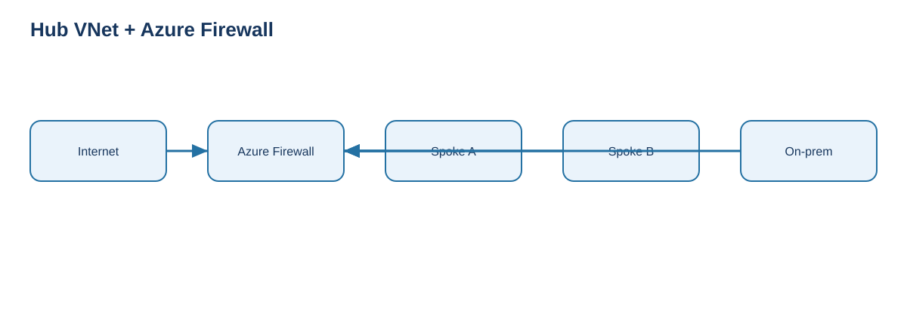
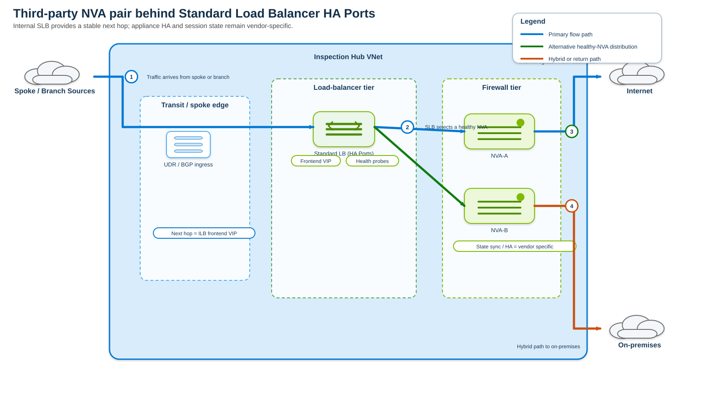
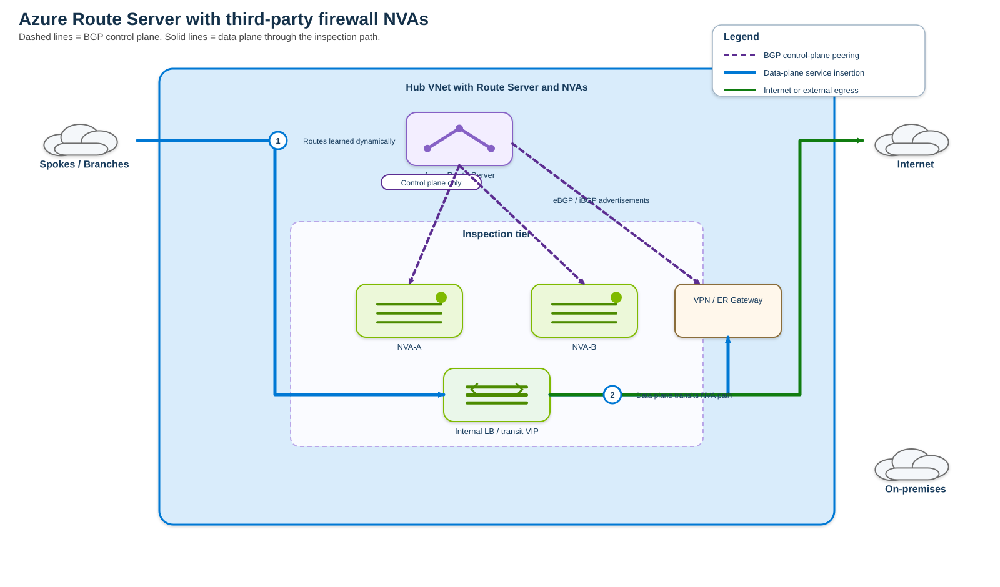
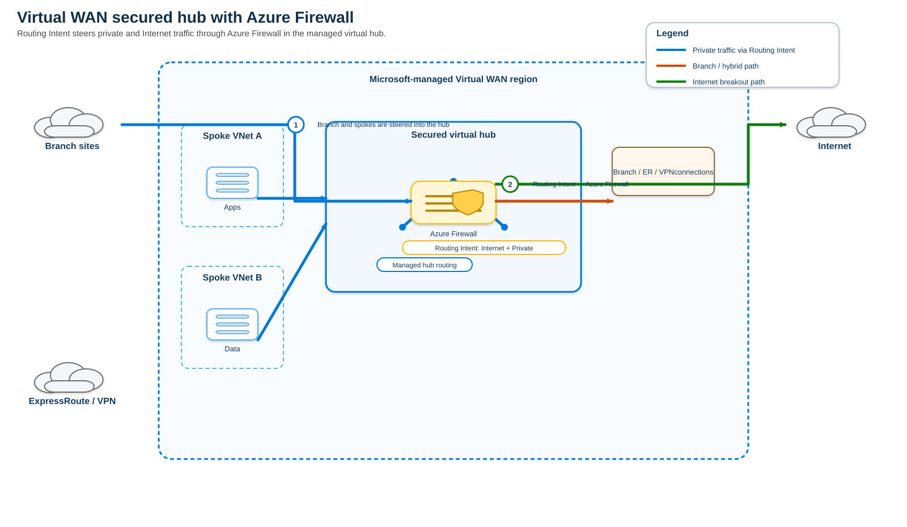
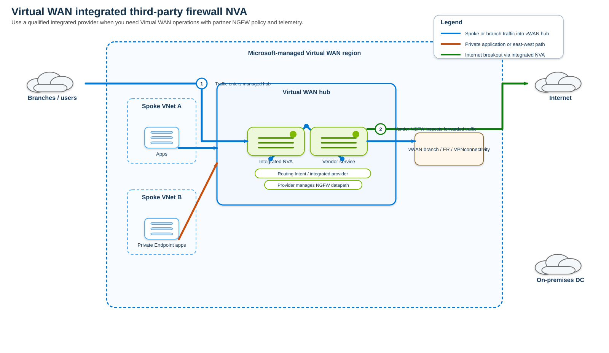
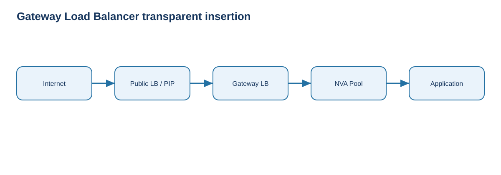
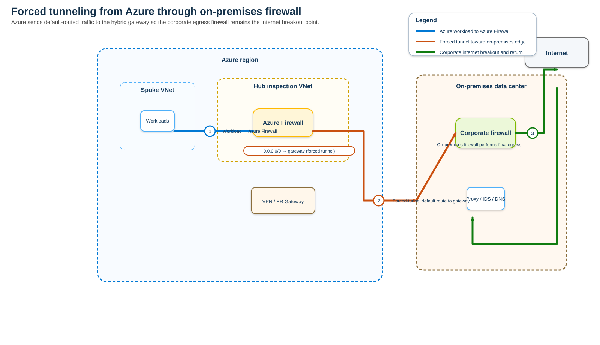
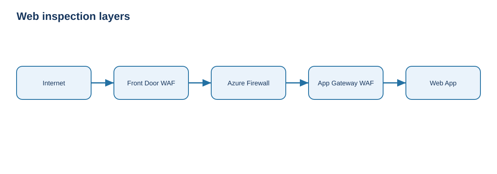
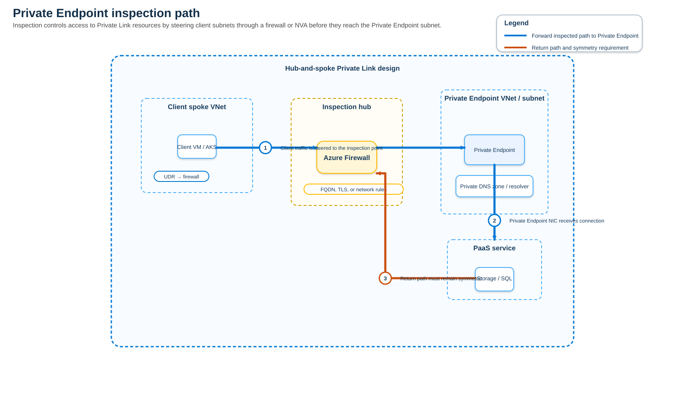

# Azure Firewall Inspection Methods — Comprehensive Architecture and Operations Study Guide

**Last validated:** 2026-09-05  
**Scope:** Microsoft Azure network and application inspection methods, with emphasis on traffic steering, symmetry, stateful firewall behavior, hybrid routing, high availability, and design tradeoffs.

> **Source information** = behavior explicitly documented by Microsoft or a named vendor source.  
> **Additional explanation** = explanatory networking context added to make the documented behavior easier to understand.  
> **Reasonable inference** = a design conclusion drawn from documented behavior; it is identified as inference and should be validated for the exact product/version/vendor appliance before production deployment.

---

## Supplied and Supporting URLs

No source URL was supplied in the question. The guide was built from current Microsoft documentation, especially:

- https://learn.microsoft.com/en-us/azure/networking/design-guide/azure-firewall
- https://learn.microsoft.com/en-us/azure/networking/design-guide/hub-spoke
- https://learn.microsoft.com/en-us/azure/architecture/networking/architecture/hub-spoke
- https://learn.microsoft.com/en-us/azure/firewall-manager/vhubs-and-vnets
- https://learn.microsoft.com/en-us/azure/firewall-manager/secured-virtual-hub
- https://learn.microsoft.com/en-us/azure/firewall-manager/secure-cloud-network
- https://learn.microsoft.com/en-us/azure/virtual-wan/howto-firewall
- https://learn.microsoft.com/en-us/azure/virtual-wan/about-nva-hub
- https://learn.microsoft.com/en-us/azure/virtual-wan/how-to-nva-hub
- https://learn.microsoft.com/en-us/azure/virtual-wan/static-routes-firewall-basic
- https://learn.microsoft.com/en-us/azure/virtual-wan/hybrid-firewall-spoke-static
- https://learn.microsoft.com/en-us/azure/load-balancer/gateway-overview
- https://learn.microsoft.com/en-us/azure/load-balancer/load-balancer-ha-ports-overview
- https://learn.microsoft.com/en-us/azure/route-server/configure-route-server
- https://learn.microsoft.com/en-us/azure/route-server/route-server-faq
- https://learn.microsoft.com/en-us/azure/route-server/secure-route-server
- https://learn.microsoft.com/en-us/azure/firewall/management-nic
- https://learn.microsoft.com/en-us/azure/firewall/premium-features
- https://learn.microsoft.com/en-us/azure/firewall/features-by-sku
- https://learn.microsoft.com/en-us/azure/firewall/integrate-with-nat-gateway
- https://learn.microsoft.com/en-us/azure/nat-gateway/tutorial-hub-spoke-nat-firewall
- https://learn.microsoft.com/en-us/azure/firewall-manager/private-link-inspection-secure-virtual-hub
- https://learn.microsoft.com/en-us/azure/architecture/example-scenario/gateway/firewall-application-gateway
- https://learn.microsoft.com/en-us/azure/frontdoor/web-application-firewall

---

# 1. The most important concept: inspection method and traffic-steering method are not the same thing

A common Azure design mistake is to treat every firewall architecture as a completely different security product. In reality, most designs are combinations of two independent choices:

1. **What performs inspection?**
   - Azure Firewall.
   - A third-party Network Virtual Appliance (NVA) / Next-Generation Firewall (NGFW), such as qualified Fortinet, Check Point, or Cisco appliances.
   - A Web Application Firewall (WAF) such as Azure Front Door WAF or Application Gateway WAF.
   - A partner software-as-a-service security provider integrated with Virtual WAN.

2. **How is traffic forced through the inspector?**
   - User-Defined Routes (UDRs).
   - Azure Virtual WAN Routing Intent and routing policies.
   - Static Virtual WAN hub routes.
   - Border Gateway Protocol (BGP), frequently with Azure Route Server.
   - Standard Load Balancer with High Availability (HA) Ports.
   - Gateway Load Balancer service chaining.
   - Forced tunneling to an on-premises firewall.
   - Reverse-proxy publication paths for inbound web applications.

This guide covers every major Azure-native way to combine those choices, without repeating the same firewall-policy explanation under every topology.

---

# 2. Quick decision matrix

| Method | Typical inspector | Best for | East-west | Internet egress | Internet ingress | Hybrid/branch | Main steering mechanism |
|---|---|---|---:|---:|---:|---:|---|
| Hub VNet + Azure Firewall | Azure Firewall | Classic enterprise hub-spoke | Yes | Yes | Yes, DNAT | Yes | UDR + VNet peering/gateway transit |
| Hub VNet + third-party NVA | Palo Alto/Fortinet/Check Point/Cisco/etc. | Feature-rich NGFW requirements | Yes | Yes | Yes | Yes | UDR, ILB, BGP, Route Server |
| Virtual WAN secured hub | Azure Firewall | Managed global transit + centralized policy | Yes | Yes | Possible | Yes | Routing Intent / hub policy |
| Virtual WAN integrated NGFW | Qualified integrated NVA | Managed vWAN + third-party NGFW | Yes | Yes | Vendor-dependent | Yes | Routing Intent |
| Virtual WAN + security SaaS | Security partner service | Cloud-delivered internet/private inspection | Policy-dependent | Yes | Usually not app publication | Yes | Routing Intent |
| Standard LB HA Ports + NVA pair | Third-party NVA | Active-active/active-passive firewall HA | Yes | Yes | Yes | Yes | UDR/BGP to ILB VIP |
| Gateway Load Balancer | Third-party transparent NVA | Transparent insertion on public endpoints | Limited to chained path | Yes | Yes | Not general hub transit | Service chaining / VXLAN |
| Azure Route Server + NVA | Third-party NVA | Dynamic BGP-based service insertion | Yes | Yes | Possible | Yes | BGP route exchange |
| Forced tunneling to on-prem | Azure Firewall and/or on-prem NGFW | Centralized corporate internet egress | Yes locally | Yes, on-prem | Generally no Azure Firewall DNAT in FT design | Yes | Default route to gateway/on-prem |
| Front Door WAF / App Gateway WAF | WAF | HTTP/HTTPS threat inspection | No generic L3/L4 east-west | No generic egress | Yes | No generic transit | Reverse proxy |
| Private Endpoint inspection | Azure Firewall / NVA | Private Link governance | Yes for PE flows | N/A | N/A | Yes | UDR/routing intent + PE network policies |

**Additional explanation:** Network Security Groups (NSGs), Azure Virtual Network Manager security admin rules, service endpoints, Private Link itself, and DDoS Protection are important network-security controls, but they are **not substitutes for a routed firewall inspection point**. NSGs are stateful L3/L4 filters attached to NIC/subnet scope; they do not proxy, decrypt TLS, provide NGFW IDPS, or create a centralized service-insertion hop.

---

# 3. Method 1 — Azure Firewall in a customer-managed hub VNet

This is the classic Azure enterprise architecture and is still one of the most flexible designs when you want full control of VNet peering, route tables, VPN/ExpressRoute gateways, private DNS, and auxiliary services.



[Editable draw.io diagram](images/09-05-26-12-41_hub_spoke_azure_firewall.drawio)

**What this image shows**  
Workload spokes send selected prefixes or a default route to Azure Firewall in the hub. The firewall can then send traffic to another spoke, to on-premises through a gateway, or to the Internet.

**What matters**  
The firewall is only guaranteed to inspect a flow when both the forward and return path traverse it. Routes must therefore be deliberately built for **symmetry**.

**What to verify**  
Check effective routes on workload NICs/subnets, VNet peering settings, next-hop IP, route propagation, firewall policy, and the reverse path from the destination.

## 3.1 Control plane

- You create and own the hub VNet.
- Azure Firewall is placed in the dedicated `AzureFirewallSubnet`.
- Spoke VNets peer with the hub.
- UDRs associated with spoke subnets steer traffic to the Azure Firewall private IP by using next-hop type `VirtualAppliance`.
- Hybrid connectivity can terminate on a VPN Gateway or ExpressRoute gateway in the hub.
- Firewall Policy can be managed directly or through Azure Firewall Manager.

## 3.2 Data plane: spoke to Internet

1. VM sends an Internet-bound packet.
2. The workload subnet route table matches `0.0.0.0/0` with next hop = Azure Firewall private IP.
3. Azure Firewall evaluates network/application/NAT policy, depending on protocol and direction.
4. If permitted, the firewall performs outbound SNAT as appropriate and sends the flow to the Internet.
5. Return traffic is matched to firewall state and translated back to the workload.

For very large outbound connection counts, Microsoft documents integrating Azure NAT Gateway with `AzureFirewallSubnet`. NAT Gateway then supplies the public egress address and a much larger dynamically allocated SNAT-port pool.

## 3.3 Data plane: spoke to spoke

To force Spoke A → Spoke B through the firewall, use routes that explicitly cover Spoke B's address space on Spoke A and Spoke A's address space on Spoke B. A default route alone can be insufficient when Azure has a more-specific system route for VNet peering.

**Source information:** Microsoft explicitly warns that directly peered VNets can route directly even when a default UDR points to the firewall; use explicit destination subnet prefixes when inspection is required.

## 3.4 Data plane: Azure to on-premises

A typical inspected path is:

`Spoke subnet → UDR → Azure Firewall → hub gateway → ExpressRoute/VPN → on-premises`

The return path must be:

`on-premises → Azure gateway → Azure Firewall → spoke`

If on-premises learns a direct spoke prefix and sends the response straight to the spoke gateway path while the forward direction traversed the firewall, the stateful firewall can drop the session.

## 3.5 Inbound publication through Azure Firewall DNAT

Azure Firewall can own a public IP and publish an internal service through Destination Network Address Translation (DNAT). The firewall changes the destination from its public IP/port to the internal workload or reverse proxy.

Use this when you need network-layer inbound inspection and NAT. For HTTP/HTTPS attacks, pair it with a WAF rather than treating Azure Firewall as a replacement for a purpose-built web application firewall.

## 3.6 Why this method is popular

- Customer controls the routing model.
- Works with peered VNets, ExpressRoute, VPN, Private Endpoints, DNS services, and route tables.
- Azure Firewall is fully managed and stateful.
- Premium provides TLS inspection, IDPS, URL filtering, and advanced web categories.
- Firewall Policy supports centralized policy management and inheritance.

## 3.7 Common failure modes

- Only one direction has a UDR.
- A more-specific system/BGP route bypasses the default UDR.
- VNet peering settings do not permit gateway transit.
- BGP route propagation causes an unexpected route to win.
- The firewall does not have a rule for the actual post-DNAT or pre-SNAT tuple expected at that policy stage.
- DNS resolves a different destination than the operator assumed.
- SNAT exhaustion occurs during large fan-out Internet access.

---

# 4. Method 2 — Third-party NGFW/NVA in a customer-managed hub VNet

Use a third-party NGFW when you require vendor-specific functions such as an existing Panorama/FortiManager/Check Point management model, particular threat subscriptions, application identification behavior, specialized TLS decryption, SD-WAN integration, or operational consistency with on-premises firewalls.

The routing problem is the same as with Azure Firewall: get the packet to the NVA and preserve symmetric return traffic. The major difference is that **you or the vendor appliance are responsible for NVA lifecycle, scale, bootstrap, interfaces, health, and routing behavior**.

## 4.1 Single NVA — simplest but not production-resilient

A UDR can point directly to the NVA private IP. This is easy to understand but creates an appliance-level failure domain. It is appropriate for labs and low-risk environments, not usually for production.

## 4.2 Redundant NVA pair behind Standard Load Balancer HA Ports



[Editable draw.io diagram](images/09-05-26-12-41_nva_ha_ports.drawio)

**What this image shows**  
An internal Standard Load Balancer presents a stable frontend IP. UDRs or dynamic routes send flows to that frontend, which distributes them to healthy NVA instances using HA Ports.

**What matters**  
Standard Load Balancer HA Ports can load balance all TCP/UDP ports with one rule and are specifically intended for high-availability NVA patterns. Stateful firewall clustering and flow symmetry still depend on the selected appliance architecture.

**What to verify**  
Health probes, backend-pool membership, IP forwarding on NVA NICs, UDR next hop, appliance session synchronization, vendor HA requirements, and whether floating IP/direct server return options are required by the vendor design.

### HA Ports behavior

Microsoft documents that HA Ports use a five-tuple decision and health probes to distribute flows only to healthy instances. This supports N-active and active/passive NVA architectures.

### Design variants

- **Active/active firewall cluster:** both NVAs pass traffic. Requires the firewall vendor to support distributed state, session synchronization, or deterministic symmetry.
- **Active/passive firewall cluster:** only the active node should be considered healthy for the data path.
- **Separate ingress/egress load balancers:** some vendor reference architectures use more than one frontend to control directional symmetry.

**Reasonable inference:** Never assume that placing two stateful firewalls behind a load balancer automatically makes them state-aware. Azure load balancing and firewall session synchronization are separate mechanisms.

---

# 5. Method 3 — Azure Route Server + third-party NVA for dynamic service insertion

Azure Route Server is a managed BGP control-plane service. It **does not forward workload packets**. Instead, it exchanges routes between NVAs and Azure virtual networking so routes can be learned dynamically instead of hard-coding every prefix in UDRs.



[Editable draw.io diagram](images/09-05-26-12-41_route_server_nva.drawio)

**What this image shows**  
Two NVAs peer by BGP with Azure Route Server. The BGP control plane advertises reachability, while workload data packets traverse the NVAs directly.

**What matters**  
Route Server is control plane only. The firewall remains the data-plane inspection device.

**What to verify**  
Each NVA should peer with both Route Server instances for high availability. Confirm BGP state, advertised/received prefixes, AS-path policy, effective routes, and that Route Server control-plane traffic itself is not forced through the NVA.

## 5.1 Why use it

- Reduces static UDR maintenance in large environments.
- Allows NVAs to advertise default or more-specific routes.
- Can integrate dynamic on-premises and NVA routing.
- Allows route preference and failure behavior to be controlled using BGP attributes supported by the design.

## 5.2 Critical caveat

Microsoft's security guidance says not to route Route Server control-plane traffic through the firewall NVA. If BGP peering traffic between Route Server and the NVA/gateway is itself captured by the firewall path, BGP can fail and cause broad connectivity loss.

## 5.3 High availability

Microsoft recommends peering each NVA instance to **both** Route Server instances. When using multiple NVAs, design route advertisements so withdrawal or path preference changes move traffic predictably to the healthy appliance.

---

# 6. Method 4 — Azure Virtual WAN secured hub with Azure Firewall

Virtual WAN changes the operational model. Instead of owning the hub VNet and writing large sets of spoke UDRs, you use a Microsoft-managed Virtual Hub and its routing system.



[Editable draw.io diagram](images/09-05-26-12-41_vwan_secured_hub.drawio)

**What this image shows**  
Branches, connected VNets, remote hubs, and Internet-bound traffic can be attracted to Azure Firewall by Virtual WAN routing policy.

**What matters**  
For comprehensive private inspection, especially inter-hub and branch-to-branch, use **Routing Intent**. A secured hub alone does not automatically mean every possible transit path is inspected.

**What to verify**  
Private Traffic policy, Internet Traffic policy, Inter-hub setting, additional private prefixes for non-RFC1918 networks, hub connection route tables, and actual effective routes.

## 6.1 Routing Intent

Routing Intent lets the Virtual WAN hub router send defined traffic classes to a security next hop. The two major policies are:

- **Private Traffic policy** — steers private traffic such as VNet-to-VNet, branch-to-VNet, and inter-hub flows.
- **Internet Traffic policy** — steers `0.0.0.0/0` toward the selected security provider.

By default, RFC1918 private ranges are recognized for private inspection. If the enterprise uses other private/non-RFC1918 ranges, add them to the private traffic prefixes.

## 6.2 Why Routing Intent is superior to ad hoc static routing for global vWAN inspection

- It reduces per-spoke UDR configuration.
- It programs the managed hub to attract traffic centrally.
- It is the supported mechanism for inter-hub inspection.
- It can steer the private and Internet policy to different supported next-hop resources.

## 6.3 Static routing without Routing Intent

Virtual WAN can also use static hub routes to send local private and/or Internet traffic to Azure Firewall. Microsoft documents this as a separate model. It can work for local hub inspection, but if you need **inter-hub** traffic to be inspected, Routing Intent is the important design.

---

# 7. Method 5 — Integrated third-party NGFW directly inside the Virtual WAN hub

Microsoft supports a specific set of jointly qualified NVAs that can be deployed directly into a Virtual WAN hub. This is different from placing an arbitrary Marketplace firewall VM in a spoke.



[Editable draw.io diagram](images/09-05-26-12-41_vwan_integrated_nva.drawio)

**What this image shows**  
The integrated NVA participates in Virtual WAN routing and can be selected as a Routing Intent next hop for private and/or Internet traffic.

**What matters**  
Only qualified integrated appliances can occupy this role. A generic Marketplace NVA cannot simply be dropped into the managed hub.

**What to verify**  
The exact partner capability category, supported scale units, vendor licensing, regional availability, routing-intent eligibility, and whether the appliance is NGFW-only, SD-WAN-only, or dual-role.

## 7.1 Current documented security NVA categories

Microsoft's current Virtual WAN documentation identifies:

- **NGFW appliances** — security inspection and eligible for Routing Intent.
- **Dual-role SD-WAN + NGFW appliances** — terminate SD-WAN connectivity and provide security inspection.
- **Connectivity-only SD-WAN appliances** — terminate connectivity but are not necessarily eligible as the Routing Intent security next hop.

Current documented examples of integrated security appliances include Check Point CloudGuard, Fortinet NGFW, and Cisco Secure Firewall Threat Defense, with exact offerings and scale limits subject to change.

## 7.2 Coexistence with Azure Firewall

Microsoft documents that Azure Firewall can coexist in a hub with one integrated NVA. The private and Internet routing policies can choose different supported next hops.

Example design:

- Private Traffic → third-party NGFW for east-west/application-aware enterprise policy.
- Internet Traffic → Azure Firewall or security SaaS for centralized egress.

Do not interpret this as arbitrary multi-hop chaining. Whether two inspectors can be traversed sequentially is a separate architecture and must be built intentionally.

## 7.3 Licensing

Microsoft documents Bring Your Own License (BYOL) as the licensing model for Virtual WAN integrated NVAs, plus Azure charges for consumed NVA infrastructure units/resources. Validate current vendor licensing independently.

---

# 8. Method 6 — Virtual WAN security SaaS provider

Virtual WAN and Azure Firewall Manager can integrate supported third-party Security-as-a-Service providers as security next hops. This is conceptually different from running firewall VMs inside your subscription.

## When to use it

- You want cloud-delivered Secure Web Gateway / security inspection.
- You prefer not to operate firewall VM lifecycle.
- Internet egress policy should be enforced by a security cloud.
- The provider supports the traffic class and Azure integration you need.

## Design caution

A SaaS security provider is not automatically equivalent to a full east-west stateful firewall inside a VNet. Verify exactly which traffic classes are supported by the provider and by Virtual WAN Routing Intent.

---

# 9. Method 7 — Gateway Load Balancer for transparent NVA insertion

Gateway Load Balancer (GWLB) is designed specifically to insert third-party NVAs transparently into public-endpoint traffic paths.



[Editable draw.io diagram](images/09-05-26-12-41_gateway_load_balancer.drawio)

**What this image shows**  
A Standard Public Load Balancer frontend or Standard VM public-IP configuration is chained to Gateway Load Balancer. GWLB sends the traffic through an NVA pool and back into the application path.

**What matters**  
GWLB is excellent for transparent service insertion around supported public endpoints. It is **not** a generic replacement for hub-and-spoke routing when you need every VNet-to-VNet, branch, or ExpressRoute flow inspected.

**What to verify**  
The chained consumer resource, GWLB frontend, NVA tunnel interfaces, health probes, symmetric encapsulation, appliance support for the tunnel model, and outbound rules if egress inspection is also required.

## 9.1 Why it is different from UDR-based insertion

With traditional UDR-based NVA service insertion, you alter routing to point at an appliance or load-balancer frontend. With GWLB, the consumer public endpoint references the Gateway Load Balancer frontend. Microsoft states that no extra UDR is required merely to enforce the chained public-endpoint path.

## 9.2 Traffic model

Gateway Load Balancer uses an encapsulated service chain to send the original flow to the NVA while preserving the workload/public endpoint relationship. This lets firewall appliances act more like bump-in-the-wire services.

## 9.3 Good use cases

- Public application ingress firewall inspection.
- Outbound inspection for workloads using a Standard Public Load Balancer with outbound rules.
- Managed-service or multi-tenant security insertion.
- Firewalls, IDS/IPS, packet analytics, DDoS-adjacent appliances.

## 9.4 Poor use cases

- Generic spoke-to-spoke inspection.
- Branch-to-branch routing in a large WAN.
- Replacing a full enterprise transit hub.

---

# 10. Method 8 — Forced tunneling: inspect Internet traffic on-premises

Forced tunneling is the pattern in which Azure workloads send Internet-bound traffic toward an on-premises security stack rather than breaking out directly in Azure.



[Editable draw.io diagram](images/09-05-26-12-41_forced_tunneling_onprem.drawio)

**What this image shows**  
Spokes may first traverse Azure Firewall and then send the default route through VPN/ExpressRoute to an on-premises NGFW for final Internet egress.

**What matters**  
Microsoft now describes the separate Azure Firewall management NIC as the mechanism required to support forced tunneling and other management functions. This keeps Azure Firewall service-management traffic separate from customer traffic.

**What to verify**  
`AzureFirewallManagementSubnet`, management NIC/public IP, default route learning, gateway routing, on-premises Internet path, return-route symmetry, and whether the chosen Azure Firewall deployment supports the desired DNAT/inbound behavior.

## 10.1 Reasons to use forced tunneling

- Corporate policy requires all Internet traffic to leave through a central data center.
- Existing on-premises proxy/NGFW controls must remain authoritative.
- Regulatory controls require centralized inspection/log retention.
- You are migrating gradually and have not moved security egress to Azure.

## 10.2 Tradeoffs

- Increases latency for Azure workloads.
- Consumes VPN/ExpressRoute and on-premises firewall capacity.
- Makes an on-premises outage an Azure Internet-egress outage unless alternate routing is designed.
- Can make SaaS-heavy workloads inefficient because traffic hairpins through the data center.

---

# 11. Method 9 — Layer-7 web firewall inspection with Azure Front Door WAF and Application Gateway WAF

A WAF is a firewall, but it solves a narrower problem than Azure Firewall or an NVA. It understands HTTP/HTTPS requests and protects web applications against application-layer attacks. It should be treated as **complementary**, not as a replacement for generic L3/L4/L7 transit inspection.



[Editable draw.io diagram](images/09-05-26-12-41_web_ingress_layers.drawio)

**What this image shows**  
An external web request can be screened at Azure Front Door WAF at the edge, then pass through Azure Firewall for network controls, then through Application Gateway WAF near the workload.

**What matters**  
Every layer should have a distinct purpose. Duplicating the same WAF policy at two locations without a reason adds complexity but not necessarily useful security.

**What to verify**  
Origin restrictions, original client-IP preservation headers, TLS termination points, certificate ownership, Firewall DNAT/SNAT behavior, Application Gateway health probes, WAF mode, and backend routing.

## 11.1 Azure Front Door WAF

Best when:

- Applications are global.
- You want inspection close to the user at Microsoft's edge.
- You need managed WAF rules, custom rules, geo-filtering, bot protection, rate limiting, and centralized policy before traffic reaches the VNet.

## 11.2 Application Gateway WAF

Best when:

- You need regional reverse proxy/load balancing inside Azure.
- You need per-application HTTP routing plus WAF.
- You want TLS termination/re-encryption close to application subnets.

## 11.3 Ordering with Azure Firewall

Microsoft documents architectures that place Azure Firewall before Application Gateway. Be careful with client identity: when Azure Firewall performs DNAT/SNAT before Application Gateway, Application Gateway can see the firewall address rather than the original client IP. Azure Front Door can preserve client information in HTTP headers before traffic enters the VNet.

**Reasonable inference:** Choose ordering based on what must see the original client tuple, where TLS should terminate, and whether the control is network-oriented or HTTP-oriented. Do not stack products merely because they are available.

---

# 12. Method 10 — Inspect traffic to Azure Private Endpoints

Private Endpoint traffic is often incorrectly assumed to be automatically visible to a central firewall because it uses private IP addresses. In practice, routing and Private Endpoint subnet policy must be designed so the flow is attracted to the firewall.



[Editable draw.io diagram](images/09-05-26-12-41_private_endpoint_inspection.drawio)

**What this image shows**  
Client traffic is routed to Azure Firewall before reaching the Private Endpoint. DNS must resolve the service name to the Private Endpoint IP, and the Private Endpoint subnet must permit UDR-based steering.

**What matters**  
Microsoft recommends enabling network policies for Private Endpoints when UDR support is required. For secured Virtual WAN, Azure Firewall can inspect Private Endpoint traffic through routing intent/static routing plus the correct Private Endpoint subnet settings.

**What to verify**  
Private DNS resolution, Private Endpoint IP, subnet network-policy setting, UDR/routing-intent prefix, firewall application/network rule, and whether SNAT is required to keep the return path through the firewall.

## 12.1 Application rules versus network rules

Microsoft states that application rules are preferred in some Private Endpoint inspection scenarios because Azure Firewall always SNATs traffic for application-rule processing, which helps ensure the response returns through the firewall. If you use network rules, Microsoft recommends considering always-SNAT behavior for the relevant private ranges.

## 12.2 DNS is part of the security path

If the client resolves the public service address instead of the Private Endpoint address, the packet can take a completely different route. When FQDN-based firewall policy is used, DNS proxy and consistent resolver behavior become part of the inspection architecture.

---

# 13. Advanced Virtual WAN pattern — Azure Firewall plus a spoke NVA

Microsoft documents advanced Virtual WAN architectures in which Azure Firewall is in the virtual hub and an NVA is in a spoke. This is useful when different traffic classes need different security functions.

A key distinction:

- **Selective routing:** some flows go to Azure Firewall; other flows go to the spoke NVA.
- **Double inspection:** the same packet intentionally traverses both Azure Firewall and a spoke NVA.

Microsoft documents that advanced double-inspection designs can be supported with Routing Intent plus static routes on VNet connections with static-route propagation configured appropriately. This is an advanced design because every extra stateful hop increases the possibility of routing loops, asymmetric return paths, duplicated NAT, and difficult troubleshooting.

**Recommendation:** only use double inspection when each firewall supplies a distinct mandatory control that cannot be consolidated.

---

# 14. Azure Firewall feature depth: what “inspection” actually means

Once traffic is successfully steered through Azure Firewall, policy depth depends on SKU and feature configuration.

## 14.1 Network rules

Use L3/L4 criteria such as source, destination, protocol, and port. Network rules are appropriate for non-HTTP protocols and deterministic IP/port control.

## 14.2 Application rules

Use application-layer target information such as Fully Qualified Domain Name (FQDN) for supported protocols. This is especially useful for outbound web/service access where destinations change IP addresses.

## 14.3 DNAT rules

Publish an internal resource behind an Azure Firewall public IP by translating the destination address/port.

## 14.4 Threat intelligence

Azure Firewall can use Microsoft's threat-intelligence feed to alert on or deny traffic to/from known malicious IPs/domains depending on configured mode.

## 14.5 Premium TLS inspection

Azure Firewall Premium can decrypt supported outbound TLS traffic, inspect it, re-encrypt it, and send it to the destination. The enterprise must deploy the appropriate trusted certificate chain to clients.

## 14.6 Premium IDPS

Intrusion Detection and Prevention System (IDPS) inspects traffic for malicious signatures and can be configured for alerting or prevention. TLS-encrypted content is only deeply visible when the required TLS inspection path is enabled/supported.

## 14.7 URL filtering and web categories

Premium extends simple FQDN controls to more granular URL/category policy for supported web traffic.

---

# 15. Control plane versus data plane for every architecture

| Component | Control-plane role | Data-plane role |
|---|---|---|
| UDR | Programs next-hop selection | None by itself |
| Virtual WAN Routing Intent | Programs security next hops in hub | Hub forwards flows according to policy |
| Azure Route Server | Exchanges BGP routes | Does not forward workload packets |
| Azure Firewall | Policy, configuration, scale management | Stateful inspection, NAT, filtering |
| Third-party NVA | Vendor control/management | Stateful inspection, NAT, VPN/SD-WAN depending on product |
| Standard Load Balancer HA Ports | Health and flow distribution config | Sends flows to healthy NVA backend |
| Gateway Load Balancer | Service-chain config | Transparently inserts NVA path |
| Front Door/App Gateway | Reverse-proxy/WAF policy | Terminates/forwards HTTP(S), WAF inspection |

Understanding this table prevents a frequent troubleshooting mistake: looking at Route Server for dropped packets when Route Server never carries the packets, or looking at a UDR as though it were a security policy.

---

# 16. Packet/session-flow principles that apply to every stateful firewall

## 16.1 Symmetry

For a stateful firewall:

`Forward direction → same firewall state domain → Return direction`

If the reply bypasses the stateful device, the device either never sees the reply or a different appliance sees a packet for a session it did not create.

## 16.2 Longest-prefix routing wins

A `0.0.0.0/0` route to a firewall does not override a more-specific direct route. Use explicit prefixes when you must intercept traffic that Azure already knows through peering, BGP, or local VNet system routes.

## 16.3 NAT changes what downstream systems see

Track the tuple at each stage:

`Original source/destination → pre-NAT firewall tuple → post-NAT tuple → reverse translation`

This matters for ACLs, WAF client IP, application logs, and return routing.

## 16.4 DNS can change the route

FQDN policy and Private Endpoint architecture depend on the resolved address. Always troubleshoot DNS and routing together.

---

# 17. High availability and convergence

## Azure Firewall

Azure manages the firewall service's underlying scale and availability. Use Availability Zones where supported/required by the chosen deployment architecture. Virtual WAN Azure Firewall zone deployment has specific deployment workflow considerations; verify current documentation before creating the secured hub.

## NVA pairs

You own or inherit vendor responsibility for:

- Health probes.
- Session state synchronization.
- Active/passive election or active/active forwarding.
- Route advertisement/withdrawal.
- Scale-out design.
- Software lifecycle and licensing.

## Route Server convergence

BGP withdrawal or attribute change can reroute traffic, but failover time depends on BGP timers, appliance failure detection, Azure route programming, and whether existing sessions can survive movement to another firewall.

## Load Balancer convergence

Health probes determine whether new flows are sent to an NVA backend. Existing stateful flows can still fail if state is not synchronized to the surviving node.

---

# 18. Configuration patterns

The following examples illustrate the Azure-side routing constructs. Replace all placeholders before use.

## 18.1 UDR to a firewall/NVA

```cli
az network route-table create \
  --resource-group <RESOURCE_GROUP> \
  --name <ROUTE_TABLE_NAME> \
  --location <AZURE_REGION>

az network route-table route create \
  --resource-group <RESOURCE_GROUP> \
  --route-table-name <ROUTE_TABLE_NAME> \
  --name <ROUTE_NAME> \
  --address-prefix <DESTINATION_PREFIX> \
  --next-hop-type VirtualAppliance \
  --next-hop-ip-address <FIREWALL_PRIVATE_IP>
```

**Where:** Azure CLI.  
**Purpose:** steer a destination prefix to the firewall private IP.  
**Verify:** check the route table and the workload NIC's effective routes.

## 18.2 Azure Route Server peer

Microsoft documents the following Azure CLI form:

```cli
az network routeserver peering create \
  --name <PEER_NAME> \
  --peer-asn <NVA_ASN> \
  --peer-ip <NVA_PRIVATE_IP> \
  --resource-group <RESOURCE_GROUP> \
  --routeserver <ROUTE_SERVER_NAME>
```

Then obtain the Route Server peer IPs/ASN and configure the NVA to establish BGP with both Route Server instances.

## 18.3 NAT Gateway attached to AzureFirewallSubnet

Microsoft documents this pattern when additional outbound SNAT scale is needed:

```cli
az network nat gateway create \
  --name <NAT_GATEWAY_NAME> \
  --resource-group <RESOURCE_GROUP> \
  --public-ip-addresses <PUBLIC_IP_NAME> \
  --sku standard

az network vnet subnet update \
  --name AzureFirewallSubnet \
  --vnet-name <HUB_VNET_NAME> \
  --resource-group <RESOURCE_GROUP> \
  --nat-gateway <NAT_GATEWAY_NAME>
```

**Important:** Microsoft documents NAT Gateway integration with Azure Firewall in a customer-managed hub VNet, but not NAT Gateway attached to the secured Virtual WAN hub itself.

---

# 19. Verification workflow

Use the same verification logic regardless of firewall vendor.

## Check 1 — Determine the exact source/destination tuple

Record:

- Source IP and subnet.
- Destination FQDN and resolved IP.
- Protocol and destination port.
- Whether NAT is expected.
- Whether the connection was initiated from Azure, on-premises, or Internet.

## Check 2 — Inspect effective routes at the source

**Tests:** Which next hop wins?  
**Success:** The intended firewall/NVA or managed hub policy is the selected path.  
**Failure means:** The packet bypasses inspection before firewall policy is even relevant.  
**Next action:** Correct UDR, routing intent, BGP advertisement, peering, or propagation.

## Check 3 — Verify the firewall actually sees the first packet

Use Azure Firewall logs or vendor traffic/session logs.

**Success:** A session/log entry matches the source/destination.  
**Failure means:** routing, NSG, NACL-equivalent control, health/load-balancing, or upstream path is wrong.  
**Next action:** troubleshoot one hop earlier.

## Check 4 — Verify policy result

Identify the rule collection/rule or vendor security policy that matched.

## Check 5 — Verify NAT

Record translated source/destination. Use the translated tuple to troubleshoot downstream routing and allow lists.

## Check 6 — Verify reverse route

At the destination side, ensure the return prefix resolves through the same stateful firewall path.

## Check 7 — Verify health and HA state

For NVAs, validate health probes, peer status, cluster state, BGP state, route advertisements, and session synchronization.

---

# 20. Troubleshooting by symptom

## Symptom: Internet works but spoke-to-spoke bypasses the firewall

**Where to check:** spoke effective routes.  
**What it tests:** whether a more-specific peering/system route beats the default route.  
**Expected:** destination spoke prefix should have firewall next hop if inspection is mandatory.  
**Failure meaning:** default route is too broad to intercept the more-specific route.  
**Next action:** add explicit destination prefixes and ensure the reverse spoke has symmetric routes.

## Symptom: Firewall logs SYN but never sees SYN-ACK

**Where to check:** destination subnet/NVA/on-prem route table.  
**What it tests:** return symmetry.  
**Expected:** return prefix points back through the same firewall state domain.  
**Failure meaning:** asymmetric routing or NAT mismatch.  
**Next action:** correct reverse route/BGP advertisement or SNAT strategy.

## Symptom: Azure Firewall application FQDN rule does not match

**Where to check:** client DNS, Azure Firewall DNS proxy, resolved IP, protocol.  
**What it tests:** whether the firewall and client have consistent DNS context.  
**Expected:** destination resolves as expected and rule supports the protocol.  
**Failure meaning:** split DNS, Private Endpoint resolution issue, unsupported protocol, or stale policy.  
**Next action:** correct DNS path or use the appropriate network-rule model.

## Symptom: Private Endpoint traffic bypasses firewall

**Where to check:** Private Endpoint subnet network policies and client effective route.  
**What it tests:** whether UDR-based steering is enabled for the PE subnet/path.  
**Expected:** route points to firewall and PE subnet allows the required network policy behavior.  
**Failure meaning:** Private Endpoint path is taking a direct route.  
**Next action:** enable the documented subnet policy behavior and correct routes.

## Symptom: NVA failover occurs but sessions reset

**Where to check:** firewall cluster/session synchronization and load-balancer health.  
**What it tests:** whether the surviving appliance knows existing sessions.  
**Expected:** vendor-supported state synchronization or documented session-survival model.  
**Failure meaning:** the routing/load balancer failed over, but state did not.  
**Next action:** enable/fix vendor HA state synchronization or accept session recreation as a design property.

## Symptom: Route Server BGP sessions flap after adding firewall routing

**Where to check:** UDRs on NVA/RouteServer-related subnets.  
**What it tests:** whether BGP control traffic is being sent through the firewall.  
**Expected:** Route Server control-plane connectivity stays direct as documented.  
**Failure meaning:** the security path captured its own control plane.  
**Next action:** restore direct VirtualNetwork next-hop reachability for RouteServerSubnet traffic.

## Symptom: Virtual WAN local traffic is inspected but inter-hub traffic is not

**Where to check:** Routing Intent / Inter-hub setting.  
**What it tests:** whether inter-hub private traffic is explicitly steered to the security next hop.  
**Expected:** private traffic routing policy with inter-hub inspection enabled.  
**Failure meaning:** hubs are using native inter-hub transit that bypasses the firewall.  
**Next action:** enable/configure Routing Intent according to the design.

## Symptom: Outbound connections intermittently fail under heavy load

**Where to check:** SNAT metrics/logs, number of firewall public IPs, destination fan-out.  
**What it tests:** SNAT port exhaustion.  
**Expected:** available SNAT capacity exceeds peak concurrent translated flows.  
**Failure meaning:** exhausted or fragmented SNAT port pool.  
**Next action:** add public IP capacity or use documented NAT Gateway integration where supported.

---

# 21. Architecture-selection recommendations

## Choose customer-managed hub VNet + Azure Firewall when

- You want straightforward enterprise hub-spoke networking.
- You need full control over route tables, peering, gateways, DNS, and auxiliary subnets.
- You prefer managed firewall operations.

## Choose customer-managed hub VNet + third-party NVA when

- Existing security operations are standardized on a vendor NGFW.
- You need vendor-specific application identification, decryption, threat prevention, or management.
- You are prepared to own HA, scale, bootstrap, and lifecycle complexity.

## Choose Virtual WAN secured hub when

- You have many branches/regions and want Microsoft-managed transit.
- You want routing intent rather than large numbers of UDRs.
- You need branch-to-VNet, VNet-to-VNet, and inter-hub security at scale.

## Choose integrated vWAN NVA when

- You want Virtual WAN's managed transit but require third-party NGFW features.
- Your selected vendor is in Microsoft's qualified integrated-NVA list.

## Choose Gateway Load Balancer when

- The problem is transparent NVA insertion around a public endpoint.
- You do not want to redesign application routing with many UDRs.

## Choose Route Server + NVA when

- Dynamic BGP routing is operationally superior to static UDR maintenance.
- You understand route propagation and are comfortable troubleshooting BGP-driven service insertion.

## Choose forced tunneling when

- Organizational policy requires Internet egress through on-premises.
- The added latency and hybrid dependency are acceptable.

## Choose WAF when

- The threat model is specifically HTTP/HTTPS application attacks.
- Use it alongside, not instead of, generic transit firewalling when both are required.

---

# 22. Common design mistakes

1. **“I added `0.0.0.0/0` to the firewall, so all traffic is inspected.”**  
   False when a more-specific route exists.

2. **“Two firewalls behind a load balancer automatically share state.”**  
   They do not unless the vendor architecture provides state/session synchronization or another supported mechanism.

3. **“Route Server is the packet forwarding hop.”**  
   It is not; it is BGP control plane.

4. **“Secured Virtual WAN hub means every branch/inter-hub path is automatically inspected.”**  
   Inter-hub and branch-to-branch inspection depends on Routing Intent configuration.

5. **“WAF and Azure Firewall are interchangeable.”**  
   WAF protects HTTP/HTTPS application semantics; Azure Firewall/NVA provides routed network inspection.

6. **“Private Endpoint means central firewall policy automatically applies.”**  
   Private Endpoint routing and subnet policies must be configured to force the path through the inspector.

7. **“More firewalls equals more security.”**  
   Double inspection can create NAT ambiguity, loops, asymmetric routing, higher latency, and inconsistent policy. Use multiple inspectors only for distinct controls.

---

# 23. Final design checklist

Before deploying any Azure firewall-inspection architecture, answer these questions:

- What exact traffic classes must be inspected: Internet ingress, Internet egress, spoke-to-spoke, VNet-to-branch, branch-to-branch, inter-region, Private Endpoint?
- Which device owns each stateful session?
- What mechanism attracts the first packet to that device?
- What mechanism guarantees the reverse packet returns through the same state domain?
- Where does SNAT occur?
- Where does DNAT occur?
- Where does TLS terminate?
- Which component preserves the original client IP?
- Is DNS resolution consistent with the intended security path?
- How does the design fail when an appliance, zone, hub, tunnel, or route peer fails?
- How are existing sessions treated during failover?
- What log proves each inspection hop actually saw the flow?
- Does the architecture depend on unsupported multi-hop service chaining?
- Are the selected Azure region, firewall SKU, NVA offering, licensing model, and Virtual WAN capability supported today?

---

# 24. Sources

- Microsoft, **Azure Firewall and traffic inspection** — https://learn.microsoft.com/en-us/azure/networking/design-guide/azure-firewall
- Microsoft, **Hub-and-spoke network topology** — https://learn.microsoft.com/en-us/azure/networking/design-guide/hub-spoke
- Microsoft, **Hub-Spoke Network Topology in Azure** — https://learn.microsoft.com/en-us/azure/architecture/networking/architecture/hub-spoke
- Microsoft, **Azure Firewall Manager architecture options** — https://learn.microsoft.com/en-us/azure/firewall-manager/vhubs-and-vnets
- Microsoft, **What is a secured virtual hub?** — https://learn.microsoft.com/en-us/azure/firewall-manager/secured-virtual-hub
- Microsoft, **Secure your virtual hub using Azure Firewall Manager** — https://learn.microsoft.com/en-us/azure/firewall-manager/secure-cloud-network
- Microsoft, **Configure Azure Firewall in a Virtual WAN hub** — https://learn.microsoft.com/en-us/azure/virtual-wan/howto-firewall
- Microsoft, **About NVAs in a Virtual WAN hub** — https://learn.microsoft.com/en-us/azure/virtual-wan/about-nva-hub
- Microsoft, **Create an NVA in a Virtual WAN hub** — https://learn.microsoft.com/en-us/azure/virtual-wan/how-to-nva-hub
- Microsoft, **Static routes with Azure Firewall in Virtual WAN** — https://learn.microsoft.com/en-us/azure/virtual-wan/static-routes-firewall-basic
- Microsoft, **Advanced: combine static routing to Azure Firewall and spoke NVAs** — https://learn.microsoft.com/en-us/azure/virtual-wan/hybrid-firewall-spoke-static
- Microsoft, **Gateway Load Balancer** — https://learn.microsoft.com/en-us/azure/load-balancer/gateway-overview
- Microsoft, **HA Ports overview** — https://learn.microsoft.com/en-us/azure/load-balancer/load-balancer-ha-ports-overview
- Microsoft, **Configure Azure Route Server** — https://learn.microsoft.com/en-us/azure/route-server/configure-route-server
- Microsoft, **Azure Route Server FAQ** — https://learn.microsoft.com/en-us/azure/route-server/route-server-faq
- Microsoft, **Secure Azure Route Server** — https://learn.microsoft.com/en-us/azure/route-server/secure-route-server
- Microsoft, **Azure Firewall Management NIC** — https://learn.microsoft.com/en-us/azure/firewall/management-nic
- Microsoft, **Azure Firewall Premium features** — https://learn.microsoft.com/en-us/azure/firewall/premium-features
- Microsoft, **Azure Firewall features by SKU** — https://learn.microsoft.com/en-us/azure/firewall/features-by-sku
- Microsoft, **Scale SNAT ports with NAT Gateway** — https://learn.microsoft.com/en-us/azure/firewall/integrate-with-nat-gateway
- Microsoft, **NAT Gateway with Azure Firewall hub/spoke** — https://learn.microsoft.com/en-us/azure/nat-gateway/tutorial-hub-spoke-nat-firewall
- Microsoft, **Secure Private Endpoint traffic in Virtual WAN** — https://learn.microsoft.com/en-us/azure/firewall-manager/private-link-inspection-secure-virtual-hub
- Microsoft, **Azure Firewall and Application Gateway** — https://learn.microsoft.com/en-us/azure/architecture/example-scenario/gateway/firewall-application-gateway
- Microsoft, **Azure Front Door WAF** — https://learn.microsoft.com/en-us/azure/frontdoor/web-application-firewall

---

## Bottom line

Azure does not have one universal “firewall insertion” architecture. The clean way to design inspection is to choose **the inspection engine** and **the traffic-steering mechanism** independently, then prove routing symmetry and NAT behavior for every required flow. For most enterprises, the primary choices are customer-managed hub/spoke with Azure Firewall or a third-party NGFW, Virtual WAN Routing Intent with Azure Firewall/integrated NVA, and specialized insertion using Route Server, HA Ports, Gateway Load Balancer, WAF, or forced tunneling where the traffic pattern specifically calls for it.
