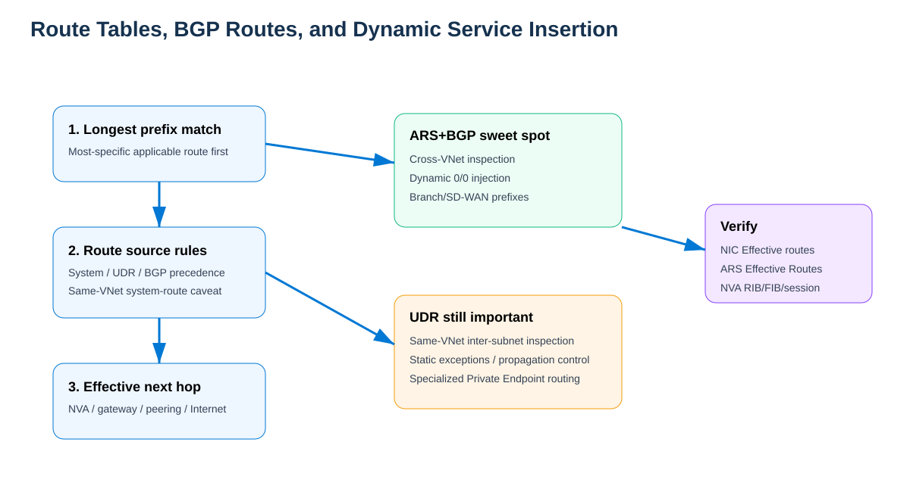

# Azure Route Server + Third-Party NVA for Dynamic Service Insertion — Comprehensive Study Guide

**Generated:** 2026-09-05  
**Scope:** Azure Route Server (ARS), Border Gateway Protocol (BGP), third-party Network Virtual Appliances (NVAs), dynamic service insertion, route tables, effective routes, hub-and-spoke, internet/Hybrid/East-West flow paths, high availability, symmetry, verification, and troubleshooting.

## Supplied / supporting URLs

- https://learn.microsoft.com/en-us/azure/route-server/route-injection-in-spokes
- https://learn.microsoft.com/en-us/azure/route-server/route-server-faq
- https://learn.microsoft.com/en-us/azure/route-server/configure-route-server
- https://learn.microsoft.com/en-us/azure/route-server/quickstart-create-route-server-cli
- https://learn.microsoft.com/en-us/azure/route-server/expressroute-vpn-support
- https://learn.microsoft.com/en-us/azure/route-server/hub-routing-preference
- https://learn.microsoft.com/en-us/azure/route-server/route-maps-about
- https://learn.microsoft.com/en-us/azure/route-server/route-maps-how-to
- https://learn.microsoft.com/en-us/azure/architecture/networking/guide/network-virtual-appliance-high-availability
- https://learn.microsoft.com/en-us/azure/virtual-network/tutorial-create-route-table-portal

---

## 1. The mental model

**Source information:** Azure Route Server is a managed **control-plane** service. It exchanges BGP routes with NVAs and integrates those routes into Azure virtual-network routing. It does **not** forward workload packets.

**Additional explanation:** A third-party firewall/NGFW, SD-WAN edge, router, or other NVA becomes the **data-plane next hop**. The NVA advertises prefixes such as `0.0.0.0/0`, branch prefixes, or inspection summaries; ARS distributes eligible routes into workload effective route tables. When an NVA route is withdrawn, Azure can reconverge without editing a UDR on every spoke.

**Reasonable inference:** Dynamic service insertion is best understood as moving part of route lifecycle management from static Azure route-table objects into BGP policy and NVA health. It does **not** eliminate UDRs in every topology.

> **Route Server = control plane. NVA = data plane. Workload NIC effective routes = forwarding truth.**


[Editable draw.io](images/09-05-26-13-55_ars_nva_control_data_plane.drawio)

**What this image shows:** BGP terminates between the NVA and Route Server, while application packets go directly between the workload and the NVA.

**What matters:** A healthy ARS BGP session does not prove the NVA can actually forward/inspect traffic.

**What to verify:** Both BGP sessions, learned/advertised routes, workload effective routes, NVA forwarding/NAT/session state.

---

## 2. Components and prerequisites

| Component | Function / requirement |
|---|---|
| **Azure Route Server** | Managed BGP route exchange. ARS ASN is **65515**. |
| **RouteServerSubnet** | Dedicated subnet named exactly `RouteServerSubnet`; current Microsoft quickstart requires **/26 or larger**. Do not attach a UDR or NSG. |
| **Third-party NVA** | Must support **multihop eBGP**, IP forwarding, and the vendor-supported HA/state model. |
| **ARS BGP endpoints** | ARS exposes two managed peer IPs. Each NVA should peer with **both**. |
| **Spoke peering** | Spokes that consume the hub Route Server use **Use the remote virtual network's gateway or Route Server** as required by the topology. |
| **Forwarded traffic** | Hub/spoke peerings carrying NVA transit must allow forwarded traffic as required. |
| **UDR** | Still used for same-VNet forced inspection, deterministic exceptions, propagation control, and specialized routing. |
| **Branch-to-branch** | Enables NVA ↔ ExpressRoute/VPN gateway route exchange in the same VNet; disabled by default. |

### ASN rules

ARS uses ASN `65515`; the NVA ASN must differ. The current FAQ lists Azure-reserved ASNs `8074`, `8075`, `12076`, `65515`, `65517`, `65518`, `65519`, `65520`, plus IANA-reserved `23456`, `64496-64511`, and `65535-65551`. ARS supports 16-bit/2-byte ASNs, not 32-bit ASNs.

If an NVA advertises a route whose AS_PATH already contains `65515`, ARS rejects it through normal BGP loop prevention.

---

## 3. How dynamic route injection works

1. The NVA establishes eBGP multihop with **both** ARS IPs.
2. ARS advertises Azure VNet/eligible peered-spoke prefixes to the NVA.
3. The NVA advertises selected service-insertion routes to ARS.
4. ARS injects eligible NVA-learned routes into Azure workload effective routes.
5. The Azure host performs the route lookup and sends the packet **directly to the NVA next hop**.
6. The NVA applies policy, state, NAT, inspection, and forwarding.
7. The return path performs an independent routing decision and must be designed for symmetry.

Conceptual NVA advertisements:

```text
0.0.0.0/0       -> NVA     # internet/default service insertion
10.100.0.0/16   -> NVA     # branch/SD-WAN prefix
172.16.0.0/12   -> NVA     # private inspection summary
```

Conceptual routes learned by the NVA from ARS:

```text
10.10.0.0/16    via ARS
10.20.0.0/16    via ARS
10.30.0.0/16    via ARS
```

These are illustrations, not vendor CLI output.

---

## 4. Route tables, BGP, system routes, and UDRs



[Editable draw.io](images/09-05-26-13-55_ars_nva_route_table_interplay.drawio)

**What this image shows:** ARS contributes BGP-learned paths to effective routing, while UDRs remain a separate policy mechanism.

**What matters:** The configured route table is not the final forwarding table; check the workload NIC's **Effective routes**.

**What to verify:** Prefix length, route source, next hop, propagation settings, and whether the selected route is the intended inspection path.

### Practical route-selection method

1. **Longest-prefix match first.** A more-specific applicable route wins over a less-specific one.
2. If prefix length is equal, Azure route-source precedence and documented special cases determine the winner.
3. The resulting effective route determines the next hop.

### When ARS/BGP is a strong fit

- Dynamic `0.0.0.0/0` injection into many spokes.
- Cross-VNet spoke-to-spoke inspection.
- Dynamic branch/SD-WAN route injection.
- Active/active or active/standby NVA route advertisements.
- Hybrid route exchange with ER/VPN when branch-to-branch is enabled.

### Where a UDR is still needed or commonly preferred

- **Same-VNet inter-subnet forced inspection.** Microsoft explicitly documents that ARS BGP routes cannot force traffic between subnets in the same VNet through an NVA because the relevant VNet system routes are preferred.
- Explicit subnet-specific exceptions.
- Deterministic static steering independent of BGP state.
- Route-table gateway propagation control.
- Certain Private Endpoint inspection designs.

### Gateway route propagation

Where a spoke route table must not learn gateway routes, disable **Propagate gateway routes** on that route table. This is a route-table property and is separate from ARS peering itself.

---

## 5. East-West: Spoke A → NVA → Spoke B


[Editable draw.io](images/09-05-26-13-55_ars_nva_east_west_service_insertion.drawio)

**What this image shows:** Two different spoke VNets receive NVA paths and send cross-spoke traffic through the firewall tier.

**What matters:** Both directions need inspection steering; stateful firewalls also need instance-level symmetry.

**What to verify:** Effective routes on VM-A and VM-B, NVA session table, NAT behavior, and selected NVA instance.

Example:

- Hub: `10.0.0.0/16`
- Spoke A: `10.10.0.0/16`
- Spoke B: `10.20.0.0/16`
- NVA-1: `10.0.2.4`
- NVA-2: `10.0.2.5`
- NVA advertises a private summary such as `10.0.0.0/8`

### Forward direction

1. VM-A `10.10.1.10` sends to VM-B `10.20.1.10`.
2. VM-A's host evaluates its effective routes.
3. The NVA-advertised inspection route is selected.
4. Azure forwards to the NVA private IP.
5. The NVA inspects and records state.
6. The NVA forwards toward Spoke B.
7. VM-B receives the packet.

### Return direction

1. VM-B sends to `10.10.1.10`.
2. VM-B's independent effective-route lookup must also steer the flow to the inspection tier.
3. The NVA must see/match the return session.
4. The packet returns to VM-A.

### Supernet strategy

Microsoft documents using an NVA-advertised **supernet** to attract private traffic, for example advertising `10.0.0.0/8` around more-specific Azure VNet spaces. This does not bypass the same-VNet inter-subnet limitation above.

---

## 6. Internet egress through an NVA-advertised default route


[Editable draw.io](images/09-05-26-13-55_ars_nva_internet_egress.drawio)

**What this image shows:** The NVA advertises `0.0.0.0/0`; ARS injects it into the spoke; internet-bound packets are sent to the NVA.

**What matters:** BGP can reduce per-spoke static `0/0 -> NVA` UDR management, but it does not provide NAT, firewall policy, or return symmetry by itself.

### Outbound path

1. Workload sends to a public destination.
2. Effective-route lookup selects BGP `0.0.0.0/0` toward the NVA.
3. NVA inspects traffic.
4. NVA performs SNAT where required by the vendor/stateful HA architecture.
5. NVA sends traffic toward the internet.

### Return path

1. Response returns to the translated/public path.
2. The correct NVA instance restores state/NAT.
3. NVA routes the original destination toward the spoke.
4. Azure peering/system routing delivers to the VM.

**Symmetry warning:** With multiple equal NVA next hops, Azure may ECMP different flows across the cluster. Microsoft notes that Route Server HA patterns require SNAT where symmetry is otherwise not guaranteed. Vendor clustering/session synchronization may alter the design; follow the NVA vendor's validated Azure architecture.

---

## 7. Hybrid: on-premises ↔ ER/VPN ↔ NVA ↔ Azure


[Editable draw.io](images/09-05-26-13-55_ars_nva_hybrid_branch_to_branch.drawio)

**What this image shows:** ARS can exchange routes between NVA peers and an ExpressRoute or VPN gateway in the same hub VNet.

**What matters:** This gateway/NVA exchange is **off by default**. Enable branch-to-branch only when that route exchange is required.

Enable it:

```cli
az network routeserver update \
  --name '<ROUTE_SERVER_NAME>' \
  --resource-group '<RESOURCE_GROUP>' \
  --allow-b2b-traffic true
```

For an Azure VPN gateway used with this integration, Microsoft requires active-active mode and ASN `65515`; BGP on the VPN gateway itself is not required merely for communication with ARS.

### Direction: on-prem → Azure workload

1. Prefix arrives through ER/VPN gateway.
2. With branch-to-branch enabled, ARS can make gateway-learned routes available to the NVA and NVA-learned routes available to the gateway.
3. The selected path sends traffic through the inspection NVA where intended.
4. NVA forwards to the Azure spoke.

### Direction: Azure workload → on-prem

1. Workload effective route selects the intended NVA/gateway path.
2. NVA inspects and forwards.
3. Gateway sends to on-prem.
4. On-prem return route must preserve the desired inspection symmetry.

---

## 8. ExpressRoute, VPN, and SD-WAN route preference

When ARS learns the same destination through multiple source types, use **hub routing preference** deliberately.

Portal:

1. Open **Route Server**.
2. **Settings** → **Configuration**.
3. Select **ExpressRoute** (default), **VPN**, or **ASPath**.
4. Select **Save**.

CLI:

```cli
az network routeserver update \
  --name '<ROUTE_SERVER_NAME>' \
  --resource-group '<RESOURCE_GROUP>' \
  --hub-routing-preference 'ASPath'
```

By default, Microsoft documents ExpressRoute preference over VPN/SD-WAN for the same route. Choosing `ASPath` lets AS-path length influence selection across those sources.

---

## 9. Active/active and active/standby NVAs


[Editable draw.io](images/09-05-26-13-55_ars_nva_ha_failover.drawio)

**What this image shows:** Equal advertisements can create ECMP; different AS-path lengths can implement a preferred/standby route pattern.

**What matters:** BGP convergence and firewall session convergence are separate.

### Active/active

Both NVAs advertise the same prefix with equal AS-path length. ARS can program multiple next hops and Azure uses ECMP per flow.

Validate:

- Whether the vendor supports active/active stateful processing in this topology.
- Session synchronization.
- SNAT requirements.
- Whether both directions of a flow reach compatible state.

### Active/standby

Primary advertises the shorter AS path; standby advertises a longer/prepended path.

Conceptual example:

```text
NVA-1: 0.0.0.0/0   AS_PATH 65001
NVA-2: 0.0.0.0/0   AS_PATH 65002 65002 65002
```

This is conceptual; use the vendor-supported policy syntax.

### Timers

Microsoft documents ARS keepalive **60 seconds** and hold timer **180 seconds**. Peers can negotiate lower timers, but setting them too low can destabilize BGP. Total application failover also includes NVA failure detection, route withdrawal, Azure route programming, state/NAT recovery, and application retry behavior.

---

## 10. BGP communities and route maps

### NO_ADVERTISE

ARS supports the BGP `NO_ADVERTISE` community:

```text
65535:65282
```

A route advertised with this community is not propagated by ARS to other peers, including ExpressRoute. This is useful for preventing route feedback or security-bypass paths.

### Route maps

**Source information:** Route maps for Azure Route Server are currently **Preview**. They can filter routes, aggregate prefixes, and modify BGP attributes such as AS_PATH and Community on NVA peerings and ER/VPN gateway connections.

Use cases:

- Prefix permit/deny.
- Summarization to control route scale.
- AS-path modification to influence preference.
- Community tagging.
- Preventing selected routes from leaking between domains.

The first route-map creation can trigger an ARS upgrade of roughly 30 minutes according to Microsoft documentation. Treat Preview support terms accordingly.

---

## 11. Current Route Server limits that affect NVA design

Current Microsoft FAQ limits per Route Server deployment:

| Resource | Limit |
|---|---:|
| BGP peers | **16** |
| Routes each BGP peer can advertise to ARS | **4,000** |
| VMs across VNet + peered VNets | **50,000** |
| VNets | **500** |
| Total on-prem + Azure VNet prefixes | **10,000** |

If an NVA exceeds the per-peer route limit, the BGP session can be dropped. Microsoft specifically notes that an update may be evaluated as current routes plus incoming routes; a large re-advertisement can therefore transiently exceed the limit.

**Documentation-version note:** An older Azure Architecture Center NVA-HA article still references eight BGP adjacencies for this pattern, while the current Route Server FAQ documents 16 peers. Use the current Route Server limits page/FAQ for deployment planning.

---

## 12. Azure CLI deployment skeleton

Create the required subnet:

```cli
az network vnet create \
  --resource-group '<RESOURCE_GROUP>' \
  --name '<HUB_VNET_NAME>' \
  --subnet-name 'RouteServerSubnet' \
  --subnet-prefixes '10.0.1.0/26'

subnetId=$(az network vnet subnet show \
  --name 'RouteServerSubnet' \
  --resource-group '<RESOURCE_GROUP>' \
  --vnet-name '<HUB_VNET_NAME>' \
  --query id -o tsv)
```

Create the Standard public IP used by the managed service:

```cli
az network public-ip create \
  --resource-group '<RESOURCE_GROUP>' \
  --name '<ROUTE_SERVER_PUBLIC_IP_NAME>' \
  --sku Standard \
  --version IPv4
```

Create Route Server:

```cli
az network routeserver create \
  --name '<ROUTE_SERVER_NAME>' \
  --resource-group '<RESOURCE_GROUP>' \
  --hosted-subnet "$subnetId" \
  --public-ip-address '<ROUTE_SERVER_PUBLIC_IP_NAME>'
```

Microsoft notes deployment can take up to about 30 minutes.

Create an NVA peer:

```cli
az network routeserver peering create \
  --name '<PEER_NAME>' \
  --peer-asn '<NVA_ASN>' \
  --peer-ip '<NVA_PRIVATE_IP>' \
  --resource-group '<RESOURCE_GROUP>' \
  --routeserver '<ROUTE_SERVER_NAME>'
```

Discover ARS ASN and both BGP IPs:

```cli
az network routeserver show \
  --name '<ROUTE_SERVER_NAME>' \
  --resource-group '<RESOURCE_GROUP>'
```

Configure the NVA to peer to **both** returned `virtualRouterIps`, with remote ASN `65515` and vendor-supported eBGP multihop.

---

## 13. Verification

### Route Server state

```cli
az network routeserver show \
  --name '<ROUTE_SERVER_NAME>' \
  --resource-group '<RESOURCE_GROUP>'
```

Check provisioning/routing state, `virtualRouterAsn`, both `virtualRouterIps`, `allowBranchToBranchTraffic`, and `hubRoutingPreference`.

### Peer object

```cli
az network routeserver peering show \
  --name '<PEER_NAME>' \
  --resource-group '<RESOURCE_GROUP>' \
  --routeserver '<ROUTE_SERVER_NAME>'
```

### Routes ARS learned from the NVA

```cli
az network routeserver peering list-learned-routes \
  --name '<PEER_NAME>' \
  --resource-group '<RESOURCE_GROUP>' \
  --routeserver '<ROUTE_SERVER_NAME>'
```

### Routes ARS advertises to the NVA

```cli
az network routeserver peering list-advertised-routes \
  --name '<PEER_NAME>' \
  --resource-group '<RESOURCE_GROUP>' \
  --routeserver '<ROUTE_SERVER_NAME>'
```

### Portal effective routes

On Route Server, **Routing** → **Effective Routes**. Inspect **Prefix**, **Next hop type**, **Next hop**, **Origin**, and **AS Path**.

On a workload NIC, inspect **Effective routes**. For internet service insertion you should conceptually see the selected `0.0.0.0/0` route toward the NVA; for private inspection, inspect the destination prefix actually being tested.

### NVA-side checks

Vendor syntax varies, but verify:

- Both BGP neighbors are Established.
- Expected Azure/spoke prefixes are received.
- Expected service-insertion prefixes are advertised.
- RIB and FIB agree.
- Security-policy counters increment.
- Session table shows both directions.
- NAT translations are correct.
- HA/session sync is healthy.
- IP forwarding/virtual-router state is correct.

---

## 14. Troubleshooting by symptom

### BGP never establishes

**Check:** NVA private IP, NVA ASN, remote ASN `65515`, eBGP multihop, reachability to both ARS IPs, reserved ASN use, and unsupported NSG/UDR association on `RouteServerSubnet`.

**Meaning:** No control plane; dynamic route insertion cannot occur.

**Next:** Fix peering before troubleshooting VM routing.

### BGP is up but spokes do not learn the NVA route

**Check:** `list-learned-routes`, spoke peering, remote gateway/Route Server option, prefix filtering, route scale, and the workload NIC's winning effective route.

**Next:** Compare Route Server effective routes to the VM NIC effective routes.

### Spoke-to-spoke traffic bypasses the NVA

**Check:** Whether the source/destination are actually in the **same VNet**; route specificity; a winning UDR/peering/system route; and both forward/return effective routes.

**Next:** If same-VNet forced inspection is required, use a UDR or supported load-balancer pattern.

### Forward path hits firewall; return path bypasses it

**Check:** Destination-side effective route, ECMP, SNAT, NVA session synchronization, hybrid route preference, and conflicting UDRs.

**Next:** Correct symmetry rather than adding only another forward route.

### ExpressRoute bypasses the NVA

**Check:** Default ExpressRoute hub-routing preference, branch-to-branch status, AS_PATHs, route maps, communities.

**Next:** Select the intended routing preference/policy deliberately.

### BGP resets during large route updates

**Check:** Per-peer 4,000-route limit and update behavior.

**Next:** Summarize/filter routes; evaluate route maps if Preview use is acceptable.

### Adding VNet peering disrupts BGP

Microsoft documents that creating VNet peering triggers a BGP route-refresh request to NVA peers. If the NVA does not support route refresh, ARS can perform a hard reset.

**Next:** Confirm route-refresh capability and schedule topology changes accordingly.

---

## 15. Design decision matrix

| Goal | ARS+BGP fit | UDR? | Stateful symmetry concern |
|---|---|---|---|
| Internet egress via NVA | Excellent | Often not for basic 0/0 injection | High |
| Spoke A ↔ Spoke B inspection | Strong | Usually not in clean cross-VNet design | High |
| Same-VNet subnet A ↔ subnet B | BGP alone unsuitable | **Yes** | High |
| SD-WAN branch ↔ Azure | Strong | Topology-dependent | High |
| ER/VPN ↔ NVA route exchange | Strong with branch-to-branch | Usually not for exchange itself | Medium/High |
| One-subnet exception | Mixed | Often simplest | Depends |
| Private Endpoint inspection | Specialized | Often policy/route-table work required | High |
| Active/active NVA | Strong | No for basic BGP injection | Very high |
| Active/standby NVA | Strong | No for basic BGP injection | Lower, still validate |

---

## 16. Common mistakes

1. Treating Route Server as an inline router/firewall.
2. Peering an NVA to only one ARS IP.
3. Assuming ARS replaces every UDR.
4. Trying to steer same-VNet inter-subnet traffic with BGP alone.
5. Ignoring the return route.
6. Ignoring SNAT/session-symmetry requirements in active/active stateful firewalls.
7. Forgetting branch-to-branch for NVA ↔ ER/VPN route exchange.
8. Using ASN `65515` on the NVA.
9. Advertising an AS_PATH that already contains `65515`.
10. Exceeding the 4,000-route peer limit.
11. Assuming ER, VPN, and SD-WAN have equal default preference.
12. Forgetting forwarded-traffic peering requirements.
13. Associating unsupported UDR/NSG policy with `RouteServerSubnet`.
14. Treating Preview route maps as generally available.
15. Looking only at the configured route table instead of the NIC's effective routes.

---

## 17. Final validation checklist

- [ ] `RouteServerSubnet` is dedicated and `/26` or larger.
- [ ] No UDR or NSG is associated with `RouteServerSubnet`.
- [ ] Route Server routing state is healthy.
- [ ] NVA ASN is allowed and different from `65515`.
- [ ] Every NVA peers with both ARS BGP IPs.
- [ ] eBGP multihop is configured as required.
- [ ] Spoke peering and remote Route Server/gateway setting are correct.
- [ ] Forwarded transit traffic is allowed as required.
- [ ] NVA advertisements contain only intended prefixes.
- [ ] Default route advertisement cannot blackhole management/control access.
- [ ] Branch-to-branch is enabled only when required.
- [ ] Hub routing preference matches the ER/VPN/SD-WAN design.
- [ ] Route-map Preview status is acknowledged.
- [ ] Both directions traverse the intended inspection tier.
- [ ] NAT/state/session synchronization has been tested.
- [ ] Representative workload NIC effective routes are validated.
- [ ] ARS learned/advertised route outputs are captured as a baseline.
- [ ] Route scale is below current limits.
- [ ] Real-session failover is tested, not only BGP neighbor state.

---

## Sources

- https://learn.microsoft.com/en-us/azure/route-server/route-injection-in-spokes
- https://learn.microsoft.com/en-us/azure/route-server/route-server-faq
- https://learn.microsoft.com/en-us/azure/route-server/configure-route-server
- https://learn.microsoft.com/en-us/azure/route-server/quickstart-create-route-server-cli
- https://learn.microsoft.com/en-us/azure/route-server/expressroute-vpn-support
- https://learn.microsoft.com/en-us/azure/route-server/hub-routing-preference
- https://learn.microsoft.com/en-us/azure/route-server/route-maps-about
- https://learn.microsoft.com/en-us/azure/route-server/route-maps-how-to
- https://learn.microsoft.com/en-us/azure/architecture/networking/guide/network-virtual-appliance-high-availability
- https://learn.microsoft.com/en-us/azure/virtual-network/tutorial-create-route-table-portal

### Source classification

**Source information:** Microsoft Learn/Azure Architecture Center statements, commands, limits, prerequisites, feature status, and documented behavior.

**Additional explanation:** Packet-flow sequencing, operational interpretation, and troubleshooting methodology built directly from the documented behavior.

**Reasonable inference:** Design judgments explicitly labeled as inference; these are not presented as undocumented Microsoft guarantees.
