# Azure Route Server + Third-Party NVA for Dynamic Service Insertion — Comprehensive Study Guide

**Generated:** 2026-09-05  
**Updated:** 2026-09-05 — expanded with NVA placement, route injection, and detailed hub/spoke peering requirements  
**Scope:** Azure Route Server (ARS), Border Gateway Protocol (BGP), third-party Network Virtual Appliances (NVAs), dynamic service insertion, route tables, effective routes, hub-and-spoke peering, internet/hybrid/East-West flow paths, high availability, symmetry, verification, and troubleshooting.

## Supplied / supporting URLs

- https://learn.microsoft.com/en-us/azure/route-server/route-injection-in-spokes
- https://learn.microsoft.com/en-us/azure/route-server/configure-route-server
- https://learn.microsoft.com/en-us/azure/route-server/route-server-faq
- https://learn.microsoft.com/en-us/azure/route-server/troubleshoot-route-server
- https://learn.microsoft.com/en-us/azure/route-server/quickstart-create-route-server-cli
- https://learn.microsoft.com/en-us/azure/route-server/expressroute-vpn-support
- https://learn.microsoft.com/en-us/azure/route-server/hub-routing-preference
- https://learn.microsoft.com/en-us/azure/route-server/route-maps-about
- https://learn.microsoft.com/en-us/azure/route-server/route-maps-scenario-drop-inbound-routes
- https://learn.microsoft.com/en-us/azure/virtual-network/manage-route-table
- https://learn.microsoft.com/en-us/azure/virtual-network/virtual-network-manage-peering
- https://learn.microsoft.com/en-us/azure/networking/design-guide/hub-spoke
- https://learn.microsoft.com/en-us/azure/architecture/networking/guide/network-virtual-appliance-high-availability
- https://learn.microsoft.com/en-us/azure/architecture/example-scenario/firewalls/

---

## 1. The single most important concept

**Source information:** Azure Route Server is a managed **BGP control-plane** service. It exchanges routes with an NVA and causes eligible Azure workloads to receive those routes in their **effective routing tables**. It is not an inline router and it does not carry workload packets.

**Additional explanation:** The third-party firewall, SD-WAN appliance, router, or other NVA is the **data-plane next hop**. Route Server distributes the NVA's reachability information through Azure's software-defined networking (SDN) control plane.

> **The NVA does not edit the spoke's Azure Route Table resource.**  
> **It advertises a BGP route to Route Server. Route Server causes Azure to program that route into eligible VM/NIC effective routes.**

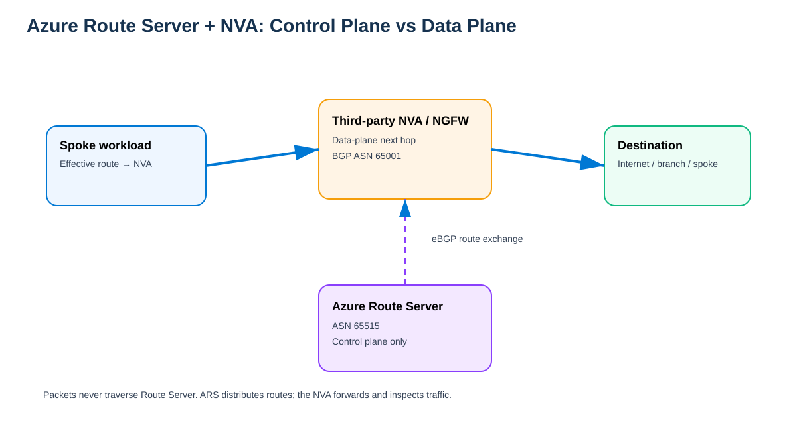

[Editable draw.io](images/09-05-26-13-55_ars_nva_control_data_plane.drawio)

**What this image shows:** BGP terminates between the NVA and Route Server, while workload packets go directly to the NVA.

**What matters:** BGP health and packet forwarding are separate things.

**What to verify:** BGP peering, ARS learned routes, VM NIC effective routes, Network Watcher next hop, and NVA dataplane/session state.

---

## 2. Three different "route tables" you must keep separate mentally

| Object | What it is | Who updates it | Can NVA BGP modify it? |
|---|---|---|---|
| **Azure Route Table resource** | ARM object containing user-defined routes (UDRs) | Administrator / IaC / automation | **No** |
| **Route Server BGP routing state** | Routes learned from NVA peers, gateways, and Azure connectivity | Route Server control plane | **Yes — learns dynamically** |
| **VM NIC effective routes** | Combined forwarding view used by Azure SDN | Azure combines system + BGP + UDR routes | **Yes — BGP routes appear here** |

Example:

```text
Azure Route Table resource attached to spoke subnet:
  No custom UDR entries

Route Server learned-routes:
  0.0.0.0/0 via NVA 10.0.2.4, AS_PATH 65001

Spoke VM NIC effective routes:
  0.0.0.0/0 -> VirtualAppliance 10.0.2.4, source BGP
```

The subnet's user-created Route Table resource can remain empty while workload forwarding changes dynamically.

---

## 3. Does the NVA have to be in the same VNet as Azure Route Server?

### Short answer

**No. The NVA does not inherently have to be in the same VNet as Azure Route Server.**

The most common and simplest design puts Route Server and the NVA in the same hub VNet, but Microsoft also documents topologies where Route Server and NVAs are in different **peered VNets**.

The real requirements are:

1. The NVA must be able to establish BGP to **both** Route Server BGP IP addresses.
2. The workload must have a valid Azure data-plane path to the NVA private IP used as the next hop.
3. The VNet peering configuration must allow the workload VNet to consume the remote Route Server where required.
4. Forwarded traffic must be allowed on peerings that carry NVA transit traffic.
5. Stateful return routing must be deliberately engineered.

### The common design: ARS and NVA in the same hub VNet

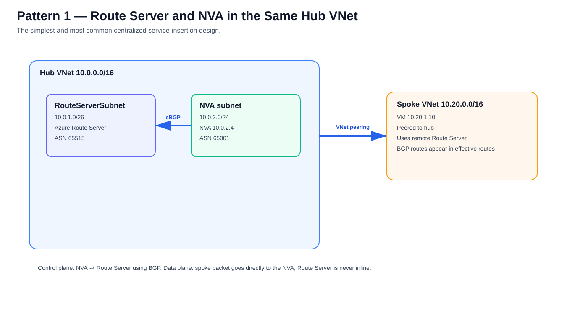

[Editable draw.io](images/09-05-26-13-55_ars_same_vnet_nva_requirement.drawio)

Example:

```text
Hub VNet:               10.0.0.0/16
RouteServerSubnet:      10.0.1.0/26
Route Server BGP IPs:   10.0.1.4, 10.0.1.5
Route Server ASN:       65515
NVA subnet:             10.0.2.0/24
NVA:                    10.0.2.4, ASN 65001
Spoke VNet:             10.20.0.0/16
```

Control plane:

```text
NVA 10.0.2.4
   |\
   | \ eBGP multihop
   |  \
   v   v
ARS 10.0.1.4
ARS 10.0.1.5
```

Data plane:

```text
Spoke VM
   |
   | effective route says next hop = NVA
   v
NVA 10.0.2.4
   |
   v
Destination
```

Route Server is **not** in the data path.

### Supported alternative: NVA in a different peered VNet

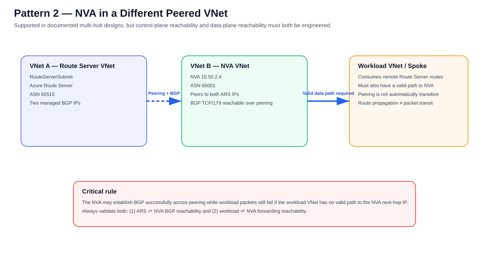

[Editable draw.io](images/09-05-26-13-55_ars_peered_vnet_nva_supported.drawio)

Successful BGP across a peering does not automatically prove that a third workload VNet can reach the NVA. **VNet peering is not automatically transitive.**

```text
Control plane:
Route Server VNet <---- BGP over peering ----> NVA VNet

Data plane:
Workload VNet <---- valid Azure forwarding path ----> NVA VNet
```

Therefore:

> **Route propagation is not the same thing as packet transit.**

For a different-VNet NVA design, deliberately provide the workload-to-NVA data path through direct peering or another supported transit architecture.

### What absolutely must be in the Route Server VNet?

- Azure Route Server itself.
- The dedicated `RouteServerSubnet`.
- Any other components that Microsoft specifically documents as colocated for a given integration pattern.

The **NVA itself does not universally have to be in that VNet**.

---

## 4. Peering requirements for a spoke to consume the hub Route Server

The spoke does **not** form BGP directly with Route Server.

For a common centralized hub-and-spoke design:

### Hub-to-spoke peering

Configure the hub side so the hub Route Server can be used by the spoke and so NVA-forwarded traffic can traverse the peering where required.

### Spoke-to-hub peering

Enable:

**Use the remote virtual network's gateway or Route Server**.

This is the key spoke-side opt-in that lets the spoke consume the Route Server in the remote hub.

### What the spoke VM does not need

The workload VM:

- does not run BGP,
- does not peer to Route Server,
- does not peer to the NVA,
- does not need a guest static route pointing at Route Server,
- does not need RBAC permission to Route Server.

Azure SDN supplies the effective route to the VM NIC.

---

## 5. Minute detail: exactly how an NVA route reaches a spoke VM

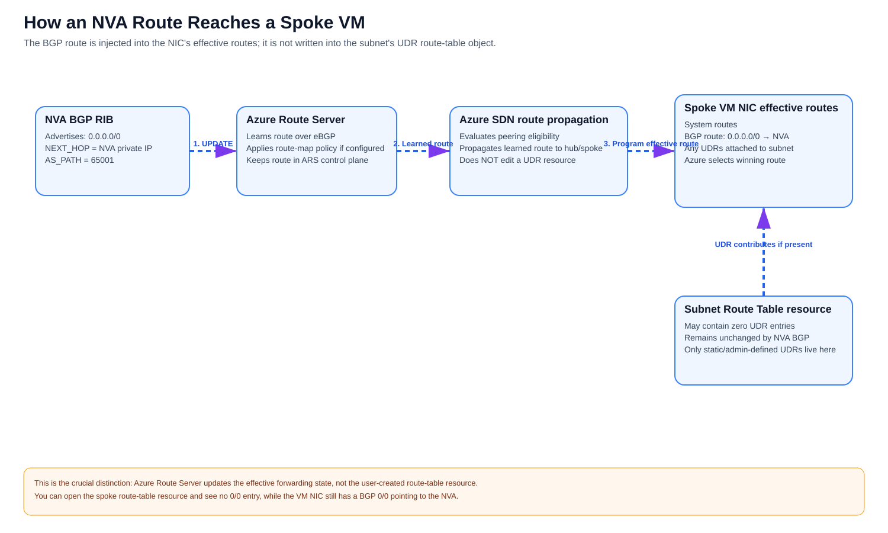

[Editable draw.io](images/09-05-26-13-55_ars_route_propagation_pipeline.drawio)

Assume:

```text
Hub VNet:                  10.0.0.0/16
RouteServerSubnet:         10.0.1.0/26
Route Server peer #1:      10.0.1.4
Route Server peer #2:      10.0.1.5
Route Server ASN:          65515
NVA:                       10.0.2.4, ASN 65001
Spoke VNet:                10.20.0.0/16
Spoke VM:                  10.20.1.10
NVA advertisement:         0.0.0.0/0
```

### Step 1 — NVA originates the route

Conceptually:

```text
NLRI:      0.0.0.0/0
AS_PATH:   65001
NEXT_HOP:  NVA reachability
```

The exact default-originate or redistribution mechanism is vendor-specific.

### Step 2 — NVA advertises it to both Route Server instances

```text
NVA 10.0.2.4, ASN 65001
  |-- BGP --> ARS IP #1, ASN 65515
  `-- BGP --> ARS IP #2, ASN 65515
```

### Step 3 — Route Server learns the route

```cli
az network routeserver peering list-learned-routes \
  --name '<PEER_NAME>' \
  --resource-group '<RESOURCE_GROUP>' \
  --routeserver '<ROUTE_SERVER_NAME>' \
  -o table
```

Conceptual output:

```text
Network      NextHop     Origin   ASPath
-----------  ----------  -------  ------
0.0.0.0/0    10.0.2.4    EBgp     65001
```

**Simulated output for explanation only.**

### Step 4 — Azure checks spoke eligibility

Azure evaluates VNet peering and remote Route Server usage. If ARS learned the route but the spoke NIC does not show it, inspect the spoke/hub peering before troubleshooting the firewall data plane.

### Step 5 — Azure SDN programs the spoke NIC effective route

The NVA does not modify a UDR resource. The effective route can become:

```text
0.0.0.0/0 -> VirtualAppliance 10.0.2.4   [BGP]
```

### Step 6 — Azure evaluates the destination

For `8.8.8.8`:

```text
0.0.0.0/0 -> Internet       [system]
0.0.0.0/0 -> 10.0.2.4      [BGP]
```

The BGP route normally wins over the ordinary system default for the same prefix length.

### Step 7 — Packet goes directly to the NVA

```text
10.20.1.10 -> 8.8.8.8

Spoke VM
   |
   | Azure effective route: 0/0 -> 10.0.2.4
   v
NVA
   |
   | inspect / NAT / route
   v
Internet
```

---

## 6. Before and after route injection

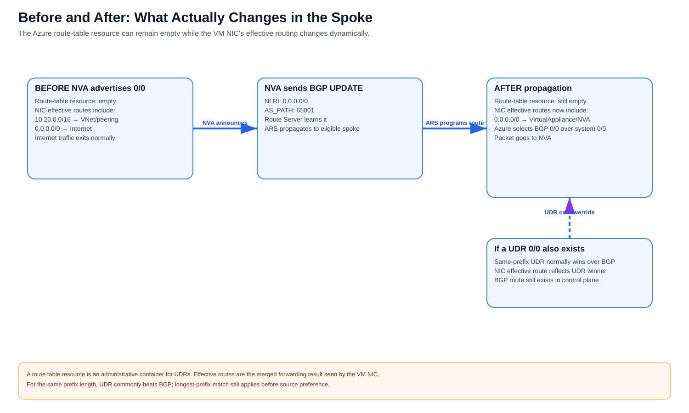

[Editable draw.io](images/09-05-26-13-55_ars_before_after_effective_routes.drawio)

Before the NVA advertises `0/0`:

```text
0.0.0.0/0 -> Internet [system]
```

After ARS propagates the NVA route:

```text
0.0.0.0/0 -> 10.0.2.4 [BGP]
0.0.0.0/0 -> Internet  [system]
```

The Azure Route Table resource attached to the subnet can still have **zero UDR entries**.

Verify:

```cli
az network nic show-effective-route-table \
  --resource-group '<RESOURCE_GROUP>' \
  --name '<NIC_NAME>' \
  -o table
```

---

## 7. How system routes, BGP routes, and UDRs interact

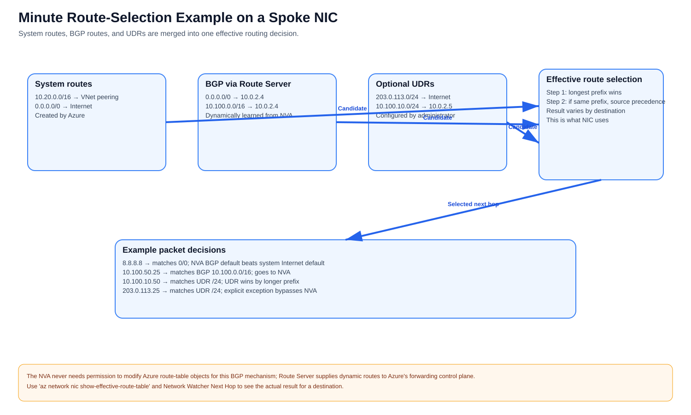

[Editable draw.io](images/09-05-26-13-55_ars_effective_route_selection_example.drawio)

Azure first uses **longest-prefix match**. For equal prefixes, route-source precedence and documented special cases determine the winner.

```text
System:
0.0.0.0/0 -> Internet

BGP via ARS:
0.0.0.0/0 -> NVA-1 10.0.2.4
10.100.0.0/16 -> NVA-1 10.0.2.4

UDR:
10.100.10.0/24 -> NVA-2 10.0.2.5
203.0.113.0/24 -> Internet
```

Results:

```text
8.8.8.8       -> BGP 0/0 -> NVA-1
10.100.50.25  -> BGP /16 -> NVA-1
10.100.10.50  -> UDR /24 -> NVA-2
203.0.113.25  -> UDR /24 -> Internet
```

This allows a mostly dynamic ARS/BGP design with narrowly scoped UDR exceptions.

---

## 8. Why Route Server does not eliminate every UDR

Microsoft documents an important limitation: BGP through Route Server cannot force traffic between subnets in the **same VNet** through an NVA in the normal case because Azure VNet system routing applies.

Therefore:

- **Spoke A VNet → Spoke B VNet:** ARS/BGP can be a strong service-insertion mechanism.
- **Subnet A → Subnet B in the same VNet:** use UDRs or another supported service-insertion architecture when forced inspection is required.

---

## 9. East-West service insertion between separate spokes

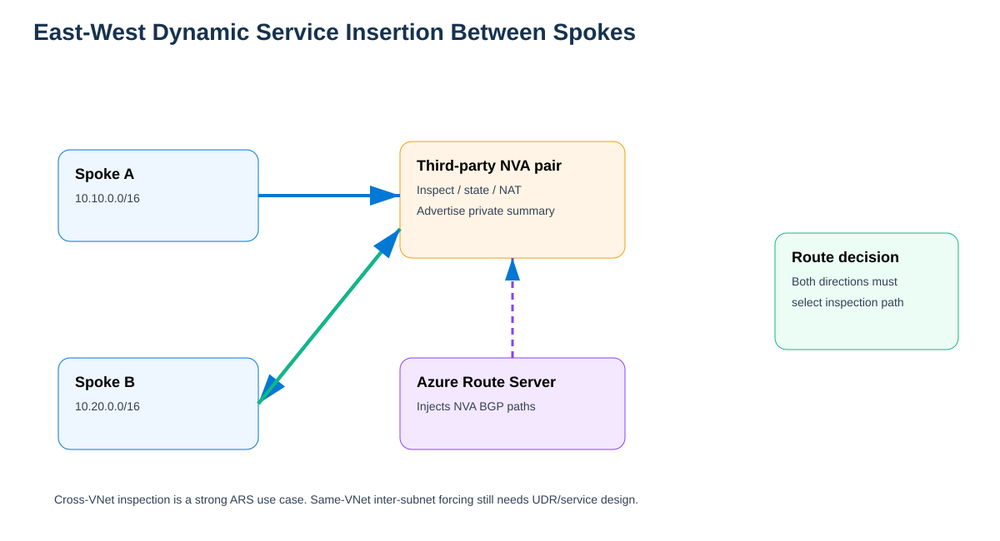

[Editable draw.io](images/09-05-26-13-55_ars_nva_east_west_service_insertion.drawio)

Example:

```text
Spoke A: 10.10.0.0/16
Spoke B: 10.20.0.0/16
NVA-1:   10.0.2.4
NVA-2:   10.0.2.5
```

Forward path:

1. VM-A sends to `10.20.1.10`.
2. Azure evaluates VM-A effective routes.
3. NVA-learned route wins.
4. Packet goes directly to the NVA.
5. NVA applies security/session policy.
6. NVA forwards toward Spoke B.

Return path is evaluated independently. VM-B must also have a route that steers the reply through the intended inspection tier, and the stateful NVA must see a compatible return path.

---

## 10. Internet egress with an NVA-advertised default

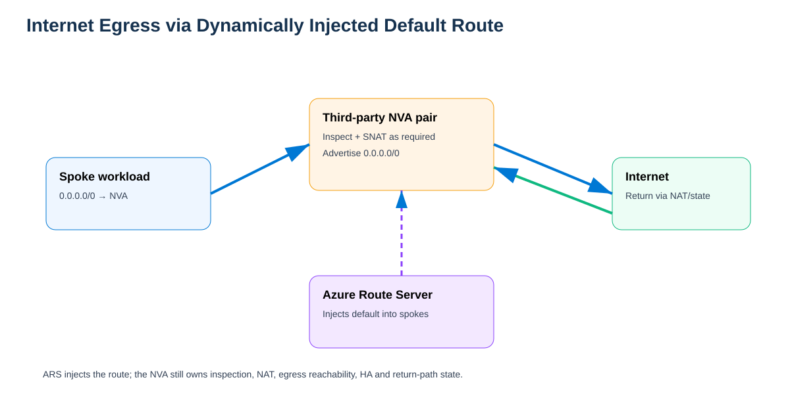

[Editable draw.io](images/09-05-26-13-55_ars_nva_internet_egress.drawio)

NVA advertises:

```text
0.0.0.0/0
```

Outbound:

```text
Spoke VM
 -> BGP 0/0 points to NVA
 -> NVA inspection
 -> SNAT if required
 -> internet
```

Return:

```text
Internet
 -> NVA public/SNAT path
 -> session/NAT lookup
 -> spoke workload
```

### NVA self-route caveat

Microsoft documents a case where an NVA advertising `0.0.0.0/0` can itself receive that learned default in effective routing. A suitable UDR on the NVA subnet can be required to preserve the NVA's intended management or internet egress path.

---

## 11. Dynamic withdrawal and failover

Suppose:

```text
0.0.0.0/0 -> NVA-1 [BGP]
```

If NVA-1 withdraws the route or its BGP session fails:

1. Route Server removes that learned path.
2. Azure recomputes affected effective routes.
3. Another NVA path can become active.
4. If no firewall route remains, another applicable route can win depending on the design.

A static UDR such as `0.0.0.0/0 -> 10.0.2.4` does not rewrite itself simply because the NVA failed.

---

## 12. Active/active and active/standby NVAs

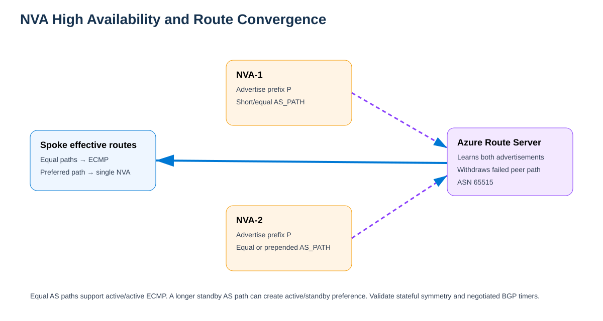

[Editable draw.io](images/09-05-26-13-55_ars_nva_ha_failover.drawio)

### Active/active

Both NVAs advertise equal paths:

```text
0.0.0.0/0 -> NVA-1
0.0.0.0/0 -> NVA-2
```

Azure can use ECMP across flows. For stateful firewalls validate session synchronization, vendor-supported clustering, SNAT, symmetry, and failover behavior.

### Active/standby

A common policy is a shorter AS_PATH on the active NVA and prepending on standby.

```text
NVA-1: 0.0.0.0/0 AS_PATH 65001
NVA-2: 0.0.0.0/0 AS_PATH 65002 65002 65002
```

Route Server default keepalive/hold timers are documented as 60/180 seconds; peers can negotiate lower values. Test end-to-end convergence rather than assuming BGP session loss equals instant application recovery.

---

## 13. Hybrid route exchange with ExpressRoute or VPN

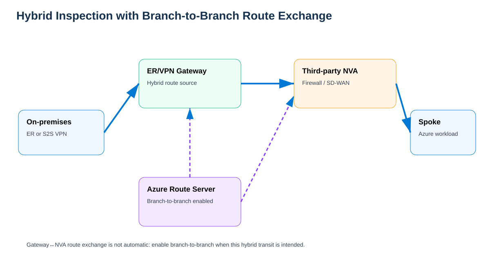

[Editable draw.io](images/09-05-26-13-55_ars_nva_hybrid_branch_to_branch.drawio)

For NVA ↔ ExpressRoute/VPN gateway route exchange, enable branch-to-branch when required:

```cli
az network routeserver update \
  --name '<ROUTE_SERVER_NAME>' \
  --resource-group '<RESOURCE_GROUP>' \
  --allow-b2b-traffic true
```

Route Server hub routing preference can influence destinations learned via ExpressRoute, VPN, or NVA/SD-WAN paths.

```cli
az network routeserver update \
  --name '<ROUTE_SERVER_NAME>' \
  --resource-group '<RESOURCE_GROUP>' \
  --hub-routing-preference 'ASPath'
```

---

## 14. Route maps and BGP policy

Azure Route Server route maps are currently documented as **Preview**.

Use cases include route filtering, aggregation, AS_PATH manipulation, BGP community policy, and controlling propagation between NVA and gateway domains.

Microsoft also documents `NO_ADVERTISE`:

```text
65535:65282
```

Treat preview features according to current Azure preview terms.

---

## 15. Route Server and NVA requirements checklist

### Azure Route Server

- Dedicated subnet named `RouteServerSubnet`.
- Minimum subnet size currently documented as `/26`.
- Do not attach a UDR to `RouteServerSubnet`.
- Do not attach an NSG to `RouteServerSubnet`.
- Route Server uses ASN `65515`.
- Route Server exposes two managed BGP IP addresses.

### NVA

- BGP support.
- A supported ASN different from `65515`.
- Reachability to both Route Server BGP IPs.
- eBGP multihop where required.
- BGP sessions to **both** Route Server instances.
- Consistent route advertisement to both peers.
- IP forwarding enabled.
- Vendor routing and firewall dataplane configured.
- HA/session design appropriate for stateful traffic.

### Spoke VNet

- VNet peering to the Route Server VNet.
- Remote gateway/Route Server usage enabled as required.
- Forwarded traffic enabled where NVA transit needs it.
- Valid data-plane reachability to the NVA next hop.

### Workload VM

Nothing special inside the guest is required for ARS route injection.

---

## 16. Current scale considerations

Use the current Microsoft Route Server FAQ as the source of truth. At this update, Microsoft documents values including:

| Item | Current documented value |
|---|---:|
| BGP peers per Route Server | 16 |
| Routes accepted from one BGP peer | 4,000 |
| Supported VNets | 500 |
| VMs across VNet + peered VNets | 50,000 |
| Total on-prem + Azure VNet prefixes | 10,000 |

Re-check these before production deployment because limits can change.

---

## 17. Verification chain — prove every stage

### Check 1 — Did the NVA advertise the prefix?

Verify both BGP neighbors, local BGP RIB, advertised routes, route policy, AS_PATH, and communities.

### Check 2 — Did Route Server learn it?

```cli
az network routeserver peering list-learned-routes \
  -g '<RESOURCE_GROUP>' \
  --routeserver '<ROUTE_SERVER_NAME>' \
  -n '<PEER_NAME>' \
  -o table
```

### Check 3 — What is Route Server advertising to the NVA?

```cli
az network routeserver peering list-advertised-routes \
  -g '<RESOURCE_GROUP>' \
  --routeserver '<ROUTE_SERVER_NAME>' \
  -n '<PEER_NAME>' \
  -o table
```

### Check 4 — Is the spoke consuming the hub Route Server?

Inspect spoke → hub peering and confirm remote Route Server/gateway usage.

### Check 5 — Did the route reach the workload NIC?

```cli
az network nic show-effective-route-table \
  -g '<RESOURCE_GROUP>' \
  -n '<NIC_NAME>' \
  -o table
```

### Check 6 — Which route wins for one exact destination?

Use Azure Network Watcher **Next hop**.

### Check 7 — Does the packet reach the NVA?

Check packet capture, policy hit counters, session table, NAT translation, NVA RIB/FIB, and HA/session state.

---

## 18. Symptom-based troubleshooting

### BGP is up, but spoke VM does not show NVA route

Check ARS learned-routes, spoke/hub peering, remote Route Server usage, route-map filtering, VM NIC effective routes, and more-specific competing routes.

### NVA is in another VNet; BGP works but packets never arrive

This strongly suggests a **data-plane reachability** issue rather than Route Server itself. Check direct/explicit transit to the NVA VNet, non-transitive peering assumptions, Network Watcher Next Hop, NVA next-hop reachability, and forwarded-traffic permissions.

### Route Table blade is empty

Expected in a pure ARS/BGP design. Check the VM NIC **Effective routes**, not only the UDR resource.

### Same-VNet subnet-to-subnet traffic bypasses NVA

Expected when relying on BGP alone. Use UDRs or another supported service-insertion architecture.

### NVA loses internet after advertising `0/0`

Check whether the NVA itself received the learned default and use an appropriate NVA-subnet UDR to preserve management/egress routing if required.

### ExpressRoute bypasses firewall/SD-WAN path

Check hub routing preference, prefix length, AS_PATH, branch-to-branch, route maps, and communities.

---

## 19. Static UDR versus ARS/BGP service insertion

| Characteristic | Static UDR | ARS/BGP dynamic insertion |
|---|---|---|
| Route stored in Azure Route Table resource | Yes | No |
| Appears in NIC effective routes | Yes | Yes |
| Requires BGP on NVA | No | Yes |
| Can withdraw dynamically | No | Yes |
| Per-spoke route maintenance | Often | Reduced in suitable designs |
| Same-VNet forced inspection | Strong fit | BGP alone insufficient |
| NVA may live in another VNet | Yes, with valid next-hop design | Yes in supported peered designs, with both BGP and data-path reachability |
| Stateful symmetry required | Yes | Yes |

---

## 20. Final mental model

When someone asks, **"Does the NVA need to be in the hub VNet?"**, the precise answer is:

> **No.** The common design puts the NVA and Route Server in the same hub because it is simpler. The actual requirement is that the NVA can establish BGP to both Route Server IPs and that workloads receiving the NVA route have a valid Azure packet path to the NVA next hop. Microsoft documents peered-VNet NVA designs, but VNet peering is not automatically transitive, so route propagation and workload packet reachability must be validated separately.

When someone asks, **"How does the NVA update the spoke route table?"**, the precise answer is:

> It normally does **not** update the Azure Route Table resource. The NVA advertises BGP prefixes to Azure Route Server. Route Server learns them and Azure SDN propagates eligible routes into the effective routing tables of workloads in the hub and peered spokes. Azure then selects among system, BGP, and UDR routes and forwards directly to the NVA when the NVA route wins.

### Recommended lab

1. Put ARS and one NVA in the same hub VNet.
2. Peer a spoke VNet to the hub.
3. Enable the spoke to use the remote Route Server.
4. Establish NVA BGP to both ARS IPs.
5. Advertise `0.0.0.0/0` from the NVA.
6. Confirm ARS learned it.
7. Confirm the spoke VM NIC receives a BGP default to the NVA.
8. Confirm Network Watcher Next Hop points to the NVA.
9. Withdraw the route and observe it disappear.
10. Only after that works, move the NVA to a separate peered VNet and deliberately solve both BGP reachability and workload-to-NVA data-plane reachability.

---

## 21. Exactly how the spoke is tied to the hub: the peering contract

This is the missing connection between the two VNets.

**Source information:** For Route Server route injection into a spoke, Microsoft requires the spoke VNet to be peered with the hub VNet and the spoke-side peering to have **Use the remote virtual network's gateway or Route Server** enabled. Azure VNet peering settings are directional: the hub side exposes its gateway/Route Server for use, while the spoke side opts in to using it.

**Additional explanation:** Think of the hub/spoke relationship as a three-part contract:

1. **VNet peering** creates direct private IP connectivity between the hub and spoke address spaces.
2. **Gateway/Route Server transit settings** connect the spoke to the hub Route Server's route-distribution domain.
3. **Allow forwarded traffic** permits traffic whose original source is not the directly peered VNet — important when an NVA is forwarding packets between networks.

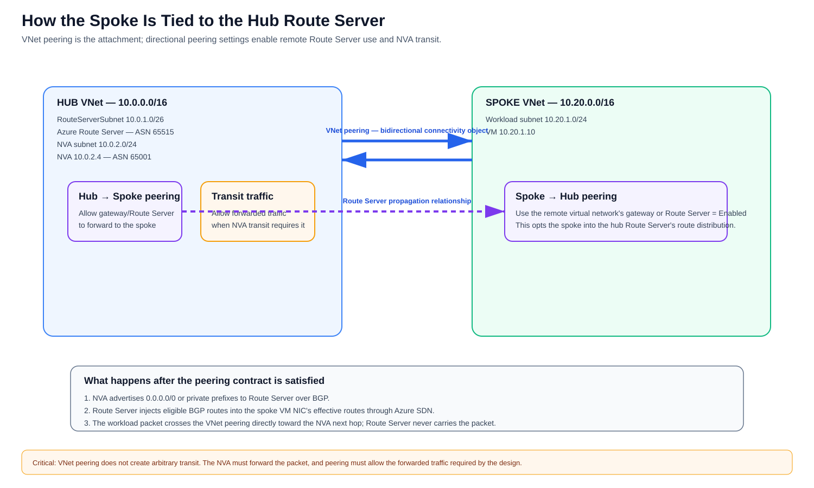

[Editable draw.io](images/09-05-26-13-55_ars_hub_spoke_peering_contract.drawio)

**What this image shows:** The exact directional peering relationship between a hub containing Route Server/NVA and a workload spoke.

**What matters:** The spoke does not automatically inherit a Route Server merely because the VNets are peered. The remote Route Server relationship must be enabled on the peering.

**What to verify:** Inspect **both** peering objects. Azure peering is represented directionally, so verify Hub→Spoke and Spoke→Hub rather than assuming one checkbox configures both directions.

### 21.1 What must the hub and spoke have in common?

They do **not** need:

- the same address range,
- the same subnet sizes,
- the same route table,
- the same resource group,
- the same subscription in all supported peering scenarios,
- BGP directly between the spoke VM and Route Server,
- a Route Server in every spoke.

They **do** need a supported VNet peering relationship and **non-overlapping address spaces** suitable for VNet peering/routing.

A simple topology is:

```text
HUB VNet 10.0.0.0/16
  |
  |-- RouteServerSubnet 10.0.1.0/26
  |     Azure Route Server
  |
  |-- NVA subnet 10.0.2.0/24
  |     Firewall 10.0.2.4
  |
  +=============================+
          VNet peering
  +=============================+
  |
SPOKE VNet 10.20.0.0/16
  |
  `-- Workload subnet 10.20.1.0/24
        VM 10.20.1.10
```

The peering is the actual Azure construct that ties the spoke to the hub.

### 21.2 The two peering objects are directional

Conceptually Azure maintains:

```text
HubToSpoke
SpokeToHub
```

They represent the two directional views of the same VNet relationship.

This matters because **gateway/Route Server transit settings are directional**.

### 21.3 Hub → Spoke settings

On the hub-side peering, the important settings are conceptually:

```text
Allow virtual network access                         = Enabled
Allow gateway or Route Server in HUB
  to forward traffic to SPOKE                       = Enabled
Allow forwarded traffic                             = Enabled when the NVA transit path requires it
Use remote gateway or Route Server                  = Disabled
```

The critical gateway/Route Server setting corresponds to the Azure peering property commonly exposed as `allowGatewayTransit`.

What it means:

> "This hub contains a gateway or Route Server, and the peer is allowed to consume that routing service."

The hub normally does **not** enable `useRemoteGateways` toward the spoke because the hub is the side providing Route Server.

### 21.4 Spoke → Hub settings

On the spoke-side peering:

```text
Allow virtual network access                         = Enabled
Use the remote virtual network's gateway
  or Route Server                                    = Enabled
Allow forwarded traffic                              = Enabled when the NVA transit path requires it
Allow gateway/Route Server transit toward hub        = Disabled
```

The crucial setting is:

> **Use the remote virtual network's gateway or Route Server**

This corresponds to the peering property commonly exposed as `useRemoteGateways`.

What it means:

> "I am the spoke, and I want Azure to use the gateway/Route Server in the remote hub as my routing service."

Microsoft's Route Server route-injection documentation explicitly calls out this spoke-side requirement.

### 21.5 Why both sides matter

A useful mental model is:

```text
Hub side:
"I OFFER my Route Server to this peer."

Spoke side:
"I ACCEPT and USE that remote Route Server."
```

If the hub does not expose the gateway/Route Server relationship, the spoke cannot consume it correctly.

If the spoke does not enable **Use remote gateway or Route Server**, ordinary peering can still provide direct hub/spoke IP connectivity, but the spoke is not attached to the hub Route Server's route-distribution relationship in the intended way.

### 21.6 What Route Server then learns and injects

Assume the NVA advertises:

```text
0.0.0.0/0
10.100.0.0/16
```

The sequence is:

```text
NVA
 |
 | BGP UPDATE
 v
Azure Route Server in HUB
 |
 | Azure SDN route propagation
 | across the eligible hub/spoke peering relationship
 v
SPOKE VM NIC effective routes
```

The resulting spoke effective routes can conceptually contain:

```text
Source   Prefix           Next hop type       Next hop
------   ---------------  ------------------  --------
BGP      0.0.0.0/0        Virtual appliance   10.0.2.4
BGP      10.100.0.0/16    Virtual appliance   10.0.2.4
```

Again, nothing was written into a user-created spoke UDR table.

### 21.7 How the data packet uses that same peering

For a packet:

```text
10.20.1.10 -> 8.8.8.8
```

Control-plane work already happened earlier. At packet time:

```text
Spoke VM 10.20.1.10
  |
  | Effective route:
  | 0.0.0.0/0 -> NVA 10.0.2.4
  |
  | crosses Spoke ↔ Hub VNet peering
  v
NVA 10.0.2.4
  |
  | inspect / NAT / route
  v
Internet
```

Route Server does not receive this packet.

### 21.8 What "Allow forwarded traffic" really means

This checkbox is often confused with Route Server propagation.

It does **not** make the NVA advertise routes and does **not** create a Route Server relationship by itself.

It controls whether a peering accepts traffic that was **forwarded by another device/network** rather than originated by the directly peered VNet.

Example:

```text
Spoke A
   |
   v
NVA in Hub
   |
   v
Spoke B
```

When the NVA forwards a packet from Spoke A toward Spoke B, that packet is transit/forwarded traffic. The applicable peering must permit forwarded traffic for that architecture.

So keep these concepts separate:

```text
Use remote gateway/Route Server
    = route-distribution relationship

Allow forwarded traffic
    = permit NVA/transit data-plane traffic
```

### 21.9 The hub and spoke do not become one VNet

Peering gives private connectivity, but they remain separate VNets.

That means each VNet retains its own:

- address space,
- subnets,
- NSGs,
- route tables/UDRs,
- DNS configuration,
- policies,
- resource ownership.

Route Server simply extends dynamic route distribution to eligible peered workloads.

### 21.10 Peering is not transitive

Suppose:

```text
Spoke-A <---- peering ----> Hub <---- peering ----> Spoke-B
```

This does **not** mean Azure automatically creates:

```text
Spoke-A <---- direct peering/transit ----> Spoke-B
```

For Spoke-A → Spoke-B traffic to traverse the hub NVA, you still need:

1. routes that point both directions toward the NVA,
2. the NVA to perform IP forwarding,
3. forwarded traffic permitted on the applicable peerings,
4. security policy permitting the flow,
5. return-route symmetry for a stateful firewall.

Route Server supplies the dynamic routing information; it does not magically turn peering into a transit router.

### 21.11 Why the spoke normally does not need a local Route Server

In the centralized design, the hub Route Server is intentionally shared through peering.

```text
             HUB
      Azure Route Server
          /        \
         /          \
      Spoke-A      Spoke-B
```

Each spoke opts into the **remote** Route Server.

A local Route Server in every spoke would be a different architecture and is not required for ordinary centralized service insertion.

### 21.12 Important remote-gateway constraint

Azure peering limits how remote gateway/Route Server usage can be configured. A spoke cannot arbitrarily select multiple remote gateway relationships at the same time, and a VNet that already has its own gateway can have constraints on using a remote gateway. Validate the specific topology when combining Route Server with VPN/ExpressRoute gateways or multiple hubs.

### 21.13 Concrete configuration checklist

For each spoke attached to a centralized Route Server hub, verify:

| Item | Hub side | Spoke side |
|---|---|---|
| VNet peering state | Connected | Connected |
| Allow VNet access | Yes | Yes |
| Allow gateway/Route Server transit | **Yes — hub provides ARS** | Normally No |
| Use remote gateway/Route Server | Normally No | **Yes — spoke consumes ARS** |
| Allow forwarded traffic | Yes when NVA transit requires it | Yes when NVA transit requires it |
| Route Server deployed locally | Yes | No |
| NVA BGP session to Route Server | Hub NVA peers to ARS | None required |

### 21.14 What failure looks like for each missing setting

**Peering not created or not Connected**

```text
Result: no normal hub/spoke private connectivity and no intended remote Route Server relationship.
```

**Hub does not expose gateway/Route Server transit**

```text
Result: spoke cannot correctly consume the hub routing service.
```

**Spoke does not enable Use remote gateway/Route Server**

```text
Result: ordinary peering can exist, but the spoke does not receive the intended remote Route Server route injection relationship.
```

**Allow forwarded traffic is missing where NVA transit needs it**

```text
Result: route can appear correct, but packets forwarded by the NVA across the peering can fail.
```

**NVA BGP is down**

```text
Result: peering is fine, but Route Server has no NVA route to inject.
```

**Effective route exists but NVA cannot forward**

```text
Result: control plane works, data plane fails at the NVA.
```

### 21.15 The easiest troubleshooting sequence

Do these checks in this order:

1. **Hub ↔ Spoke peering:** state is `Connected` in both directions.
2. **Hub peering:** gateway/Route Server transit is allowed.
3. **Spoke peering:** **Use remote gateway or Route Server** is enabled.
4. **Forwarded traffic:** enabled wherever the NVA transit path requires it.
5. **NVA BGP:** NVA is Established to both Route Server BGP IPs.
6. **ARS learned routes:** intended NVA prefixes are visible.
7. **Spoke NIC effective routes:** BGP route is visible with NVA next hop.
8. **Network Watcher Next Hop:** exact destination resolves to NVA.
9. **NVA packet capture/session:** packet arrives and is forwarded.
10. **Destination/return effective route:** reply returns through compatible firewall state.

### 21.16 Final one-sentence explanation

> **The hub and spoke are tied together by VNet peering; the hub-side peering exposes the hub Route Server for transit, the spoke-side peering opts into using that remote Route Server, Azure SDN then injects the NVA's BGP routes into the spoke NIC's effective routes, and the actual packet crosses the peering directly to the NVA.**

---

## Sources

- https://learn.microsoft.com/en-us/azure/route-server/route-injection-in-spokes
- https://learn.microsoft.com/en-us/azure/route-server/configure-route-server
- https://learn.microsoft.com/en-us/azure/route-server/route-server-faq
- https://learn.microsoft.com/en-us/azure/route-server/troubleshoot-route-server
- https://learn.microsoft.com/en-us/azure/route-server/quickstart-create-route-server-cli
- https://learn.microsoft.com/en-us/azure/route-server/expressroute-vpn-support
- https://learn.microsoft.com/en-us/azure/route-server/hub-routing-preference
- https://learn.microsoft.com/en-us/azure/route-server/route-maps-about
- https://learn.microsoft.com/en-us/azure/route-server/route-maps-scenario-drop-inbound-routes
- https://learn.microsoft.com/en-us/azure/virtual-network/manage-route-table
- https://learn.microsoft.com/en-us/azure/virtual-network/virtual-network-manage-peering
- https://learn.microsoft.com/en-us/azure/networking/design-guide/hub-spoke
- https://learn.microsoft.com/en-us/azure/architecture/networking/guide/network-virtual-appliance-high-availability
- https://learn.microsoft.com/en-us/azure/architecture/example-scenario/firewalls/

### Source classification

**Source information:** Microsoft Learn / Azure Architecture Center statements about Route Server, route injection, peering, gateway/Route Server transit, BGP behavior, route maps, limits, effective routes, and documented NVA architectures.

**Additional explanation:** The route propagation walkthroughs, placement comparisons, peering-contract model, packet-flow explanations, and troubleshooting sequences connect those documented behaviors into an operational network-engineering model.

**Reasonable inference:** Recommendations such as beginning with the same-VNet hub architecture and treating the peering settings as an offer/accept contract are explanatory architecture guidance rather than claims of undocumented Azure implementation behavior.
