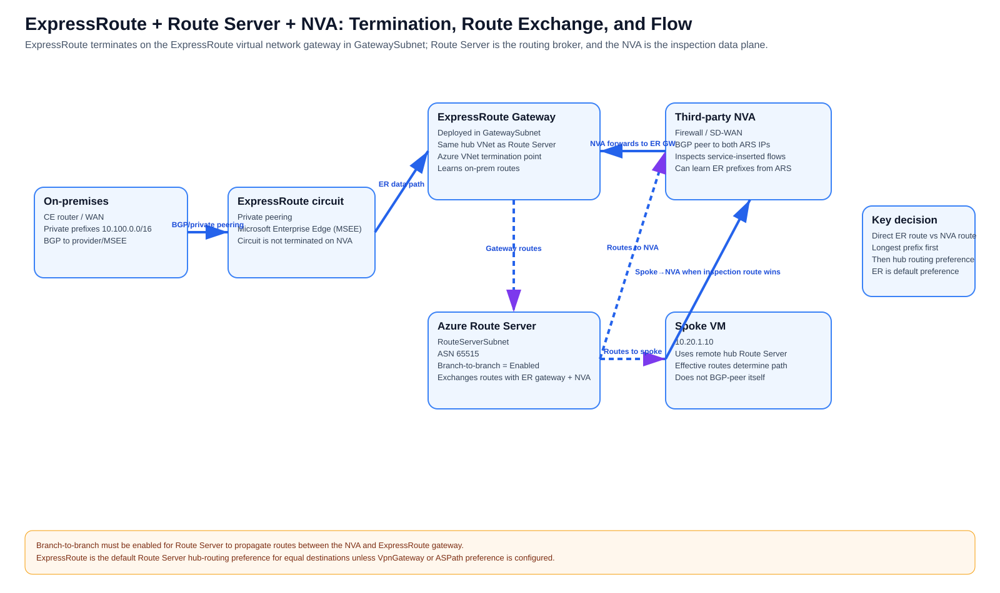
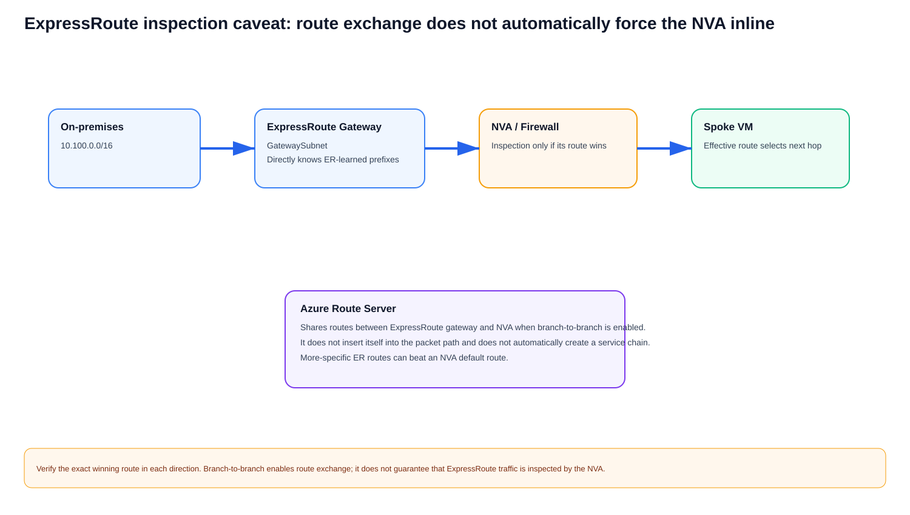
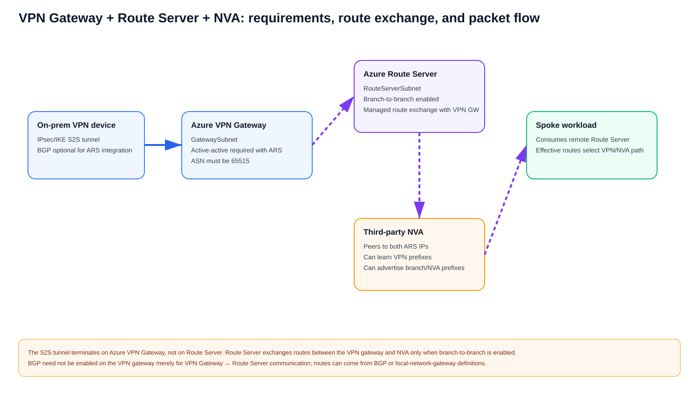

# Azure Route Server + Third-Party NVA for Dynamic Service Insertion — Comprehensive Study Guide

**Generated:** 2026-09-05  
**Updated:** 2026-09-07 — added section-by-section Azure CLI configuration, verification, expected state, and hybrid-route checks  
**Scope:** Azure Route Server (ARS), Border Gateway Protocol (BGP), third-party Network Virtual Appliances (NVAs), dynamic service insertion, route tables, effective routes, hub-and-spoke peering, internet/hybrid/East-West flow paths, high availability, symmetry, verification, and troubleshooting.

## Table of contents

- [1. The single most important concept](#1-the-single-most-important-concept)
- [2. Three different "route tables" you must keep separate mentally](#2-three-different-route-tables-you-must-keep-separate-mentally)
- [3. Does the NVA have to be in the same VNet as Azure Route Server?](#3-does-the-nva-have-to-be-in-the-same-vnet-as-azure-route-server)
- [4. Peering requirements for a spoke to consume the hub Route Server](#4-peering-requirements-for-a-spoke-to-consume-the-hub-route-server)
- [5. Minute detail: exactly how an NVA route reaches a spoke VM](#5-minute-detail-exactly-how-an-nva-route-reaches-a-spoke-vm)
- [6. Before and after route injection](#6-before-and-after-route-injection)
- [7. How system routes, BGP routes, and UDRs interact](#7-how-system-routes-bgp-routes-and-udrs-interact)
- [8. Why Route Server does not eliminate every UDR](#8-why-route-server-does-not-eliminate-every-udr)
- [9. East-West service insertion between separate spokes](#9-east-west-service-insertion-between-separate-spokes)
- [10. Internet egress with an NVA-advertised default](#10-internet-egress-with-an-nva-advertised-default)
- [11. Dynamic withdrawal and failover](#11-dynamic-withdrawal-and-failover)
- [12. Active/active and active/standby NVAs](#12-activeactive-and-activestandby-nvas)
- [13. Hybrid route exchange with ExpressRoute or VPN](#13-hybrid-route-exchange-with-expressroute-or-vpn)
- [14. Route maps and BGP policy](#14-route-maps-and-bgp-policy)
- [15. Route Server and NVA requirements checklist](#15-route-server-and-nva-requirements-checklist)
- [16. Current scale considerations](#16-current-scale-considerations)
- [17. Verification chain — prove every stage](#17-verification-chain--prove-every-stage)
- [18. Symptom-based troubleshooting](#18-symptom-based-troubleshooting)
- [19. Static UDR versus ARS/BGP service insertion](#19-static-udr-versus-arsbgp-service-insertion)
- [20. Final mental model](#20-final-mental-model)
- [21. Exactly how the spoke is tied to the hub: the peering contract](#21-exactly-how-the-spoke-is-tied-to-the-hub-the-peering-contract)
- [22. ExpressRoute + Route Server + NVA in detail](#22-expressroute--route-server--nva-in-detail)
- [23. VPN Gateway + Route Server + NVA in detail](#23-vpn-gateway--route-server--nva-in-detail)
- [24. Section-by-section Azure CLI configuration map](#24-section-by-section-azure-cli-configuration-map)
- [Sources](#sources)

## Supplied / supporting URLs

- https://learn.microsoft.com/en-us/azure/route-server/route-injection-in-spokes
- https://learn.microsoft.com/en-us/azure/route-server/configure-route-server
- https://learn.microsoft.com/en-us/azure/route-server/route-server-faq
- https://learn.microsoft.com/en-us/azure/route-server/troubleshoot-route-server
- https://learn.microsoft.com/en-us/azure/route-server/quickstart-create-route-server-cli
- https://learn.microsoft.com/en-us/azure/route-server/expressroute-vpn-support
- https://learn.microsoft.com/en-us/azure/route-server/about-dual-homed-network
- https://learn.microsoft.com/en-us/azure/vpn-gateway/vpn-gateway-bgp-overview
- https://learn.microsoft.com/en-us/azure/vpn-gateway/vpn-gateway-highlyavailable
- https://learn.microsoft.com/en-us/azure/route-server/hub-routing-preference
- https://learn.microsoft.com/en-us/azure/route-server/route-maps-about
- https://learn.microsoft.com/en-us/azure/route-server/route-maps-scenario-drop-inbound-routes
- https://learn.microsoft.com/en-us/azure/virtual-network/manage-route-table
- https://learn.microsoft.com/en-us/azure/virtual-network/virtual-network-manage-peering
- https://learn.microsoft.com/en-us/azure/networking/design-guide/hub-spoke
- https://learn.microsoft.com/en-us/azure/architecture/networking/guide/network-virtual-appliance-high-availability
- https://learn.microsoft.com/en-us/azure/architecture/example-scenario/firewalls/

---

## 1. The single most important concept

**Source information:** Azure Route Server is a managed **BGP control-plane** service. It exchanges routes with an NVA and causes eligible Azure workloads to receive those routes in their **effective routing tables**. It is not an inline router and it does not carry workload packets.

**Additional explanation:** The third-party firewall, SD-WAN appliance, router, or other NVA is the **data-plane next hop**. Route Server distributes the NVA's reachability information through Azure's software-defined networking (SDN) control plane.

> **The NVA does not edit the spoke's Azure Route Table resource.**  
> **It advertises a BGP route to Route Server. Route Server causes Azure to program that route into eligible VM/NIC effective routes.**


[Editable draw.io](images/09-05-26-13-55_ars_nva_control_data_plane.drawio)

**What this image shows:** BGP terminates between the NVA and Route Server, while workload packets go directly to the NVA.

**What matters:** BGP health and packet forwarding are separate things.

**What to verify:** BGP peering, ARS learned routes, VM NIC effective routes, Network Watcher next hop, and NVA dataplane/session state.

---

## 2. Three different "route tables" you must keep separate mentally

| Object | What it is | Who updates it | Can NVA BGP modify it? |
|---|---|---|---|
| **Azure Route Table resource** | ARM object containing user-defined routes (UDRs) | Administrator / IaC / automation | **No** |
| **Route Server BGP routing state** | Routes learned from NVA peers, gateways, and Azure connectivity | Route Server control plane | **Yes — learns dynamically** |
| **VM NIC effective routes** | Combined forwarding view used by Azure SDN | Azure combines system + BGP + UDR routes | **Yes — BGP routes appear here** |

Example:

```text
Azure Route Table resource attached to spoke subnet:
  No custom UDR entries

Route Server learned-routes:
  0.0.0.0/0 via NVA 10.0.2.4, AS_PATH 65001

Spoke VM NIC effective routes:
  0.0.0.0/0 -> VirtualAppliance 10.0.2.4, source BGP
```

The subnet's user-created Route Table resource can remain empty while workload forwarding changes dynamically.

---

## 3. Does the NVA have to be in the same VNet as Azure Route Server?

### Short answer

**No. The NVA does not inherently have to be in the same VNet as Azure Route Server.**

The most common and simplest design puts Route Server and the NVA in the same hub VNet, but Microsoft also documents topologies where Route Server and NVAs are in different **peered VNets**.

The real requirements are:

1. The NVA must be able to establish BGP to **both** Route Server BGP IP addresses.
2. The workload must have a valid Azure data-plane path to the NVA private IP used as the next hop.
3. The VNet peering configuration must allow the workload VNet to consume the remote Route Server where required.
4. Forwarded traffic must be allowed on peerings that carry NVA transit traffic.
5. Stateful return routing must be deliberately engineered.

### The common design: ARS and NVA in the same hub VNet


[Editable draw.io](images/09-05-26-13-55_ars_same_vnet_nva_requirement.drawio)

Example:

```text
Hub VNet:               10.0.0.0/16
RouteServerSubnet:      10.0.1.0/26
Route Server BGP IPs:   10.0.1.4, 10.0.1.5
Route Server ASN:       65515
NVA subnet:             10.0.2.0/24
NVA:                    10.0.2.4, ASN 65001
Spoke VNet:             10.20.0.0/16
```

Control plane:

```text
NVA 10.0.2.4
   |\
   | \ eBGP multihop
   |  \
   v   v
ARS 10.0.1.4
ARS 10.0.1.5
```

Data plane:

```text
Spoke VM
   |
   | effective route says next hop = NVA
   v
NVA 10.0.2.4
   |
   v
Destination
```

Route Server is **not** in the data path.

### Supported alternative: NVA in a different peered VNet


[Editable draw.io](images/09-05-26-13-55_ars_peered_vnet_nva_supported.drawio)

Successful BGP across a peering does not automatically prove that a third workload VNet can reach the NVA. **VNet peering is not automatically transitive.**

```text
Control plane:
Route Server VNet <---- BGP over peering ----> NVA VNet

Data plane:
Workload VNet <---- valid Azure forwarding path ----> NVA VNet
```

Therefore:

> **Route propagation is not the same thing as packet transit.**

For a different-VNet NVA design, deliberately provide the workload-to-NVA data path through direct peering or another supported transit architecture.

### What absolutely must be in the Route Server VNet?

- Azure Route Server itself.
- The dedicated `RouteServerSubnet`.
- Any other components that Microsoft specifically documents as colocated for a given integration pattern.

The **NVA itself does not universally have to be in that VNet**.

---

## 4. Peering requirements for a spoke to consume the hub Route Server

The spoke does **not** form BGP directly with Route Server.

For a common centralized hub-and-spoke design:

### Hub-to-spoke peering

Configure the hub side so the hub Route Server can be used by the spoke and so NVA-forwarded traffic can traverse the peering where required.

### Spoke-to-hub peering

Enable:

**Use the remote virtual network's gateway or Route Server**.

This is the key spoke-side opt-in that lets the spoke consume the Route Server in the remote hub.

### What the spoke VM does not need

The workload VM:

- does not run BGP,
- does not peer to Route Server,
- does not peer to the NVA,
- does not need a guest static route pointing at Route Server,
- does not need RBAC permission to Route Server.

Azure SDN supplies the effective route to the VM NIC.

---

## 5. Minute detail: exactly how an NVA route reaches a spoke VM


[Editable draw.io](images/09-05-26-13-55_ars_route_propagation_pipeline.drawio)

Assume:

```text
Hub VNet:                  10.0.0.0/16
RouteServerSubnet:         10.0.1.0/26
Route Server peer #1:      10.0.1.4
Route Server peer #2:      10.0.1.5
Route Server ASN:          65515
NVA:                       10.0.2.4, ASN 65001
Spoke VNet:                10.20.0.0/16
Spoke VM:                  10.20.1.10
NVA advertisement:         0.0.0.0/0
```

### Step 1 — NVA originates the route

Conceptually:

```text
NLRI:      0.0.0.0/0
AS_PATH:   65001
NEXT_HOP:  NVA reachability
```

The exact default-originate or redistribution mechanism is vendor-specific.

### Step 2 — NVA advertises it to both Route Server instances

```text
NVA 10.0.2.4, ASN 65001
  |-- BGP --> ARS IP #1, ASN 65515
  `-- BGP --> ARS IP #2, ASN 65515
```

### Step 3 — Route Server learns the route

```cli
az network routeserver peering list-learned-routes \
  --name '<PEER_NAME>' \
  --resource-group '<RESOURCE_GROUP>' \
  --routeserver '<ROUTE_SERVER_NAME>' \
  -o table
```

Conceptual output:

```text
Network      NextHop     Origin   ASPath
-----------  ----------  -------  ------
0.0.0.0/0    10.0.2.4    EBgp     65001
```

**Simulated output for explanation only.**

### Step 4 — Azure checks spoke eligibility

Azure evaluates VNet peering and remote Route Server usage. If ARS learned the route but the spoke NIC does not show it, inspect the spoke/hub peering before troubleshooting the firewall data plane.

### Step 5 — Azure SDN programs the spoke NIC effective route

The NVA does not modify a UDR resource. The effective route can become:

```text
0.0.0.0/0 -> VirtualAppliance 10.0.2.4   [BGP]
```

### Step 6 — Azure evaluates the destination

For `8.8.8.8`:

```text
0.0.0.0/0 -> Internet       [system]
0.0.0.0/0 -> 10.0.2.4      [BGP]
```

The BGP route normally wins over the ordinary system default for the same prefix length.

### Step 7 — Packet goes directly to the NVA

```text
10.20.1.10 -> 8.8.8.8

Spoke VM
   |
   | Azure effective route: 0/0 -> 10.0.2.4
   v
NVA
   |
   | inspect / NAT / route
   v
Internet
```

---

## 6. Before and after route injection


[Editable draw.io](images/09-05-26-13-55_ars_before_after_effective_routes.drawio)

Before the NVA advertises `0/0`:

```text
0.0.0.0/0 -> Internet [system]
```

After ARS propagates the NVA route:

```text
0.0.0.0/0 -> 10.0.2.4 [BGP]
0.0.0.0/0 -> Internet  [system]
```

The Azure Route Table resource attached to the subnet can still have **zero UDR entries**.

Verify:

```cli
az network nic show-effective-route-table \
  --resource-group '<RESOURCE_GROUP>' \
  --name '<NIC_NAME>' \
  -o table
```

---

## 7. How system routes, BGP routes, and UDRs interact


[Editable draw.io](images/09-05-26-13-55_ars_effective_route_selection_example.drawio)

Azure first uses **longest-prefix match**. For equal prefixes, route-source precedence and documented special cases determine the winner.

```text
System:
0.0.0.0/0 -> Internet

BGP via ARS:
0.0.0.0/0 -> NVA-1 10.0.2.4
10.100.0.0/16 -> NVA-1 10.0.2.4

UDR:
10.100.10.0/24 -> NVA-2 10.0.2.5
203.0.113.0/24 -> Internet
```

Results:

```text
8.8.8.8       -> BGP 0/0 -> NVA-1
10.100.50.25  -> BGP /16 -> NVA-1
10.100.10.50  -> UDR /24 -> NVA-2
203.0.113.25  -> UDR /24 -> Internet
```

This allows a mostly dynamic ARS/BGP design with narrowly scoped UDR exceptions.

---

## 8. Why Route Server does not eliminate every UDR

Microsoft documents an important limitation: BGP through Route Server cannot force traffic between subnets in the **same VNet** through an NVA in the normal case because Azure VNet system routing applies.

Therefore:

- **Spoke A VNet → Spoke B VNet:** ARS/BGP can be a strong service-insertion mechanism.
- **Subnet A → Subnet B in the same VNet:** use UDRs or another supported service-insertion architecture when forced inspection is required.

---

## 9. East-West service insertion between separate spokes


[Editable draw.io](images/09-05-26-13-55_ars_nva_east_west_service_insertion.drawio)

Example:

```text
Spoke A: 10.10.0.0/16
Spoke B: 10.20.0.0/16
NVA-1:   10.0.2.4
NVA-2:   10.0.2.5
```

Forward path:

1. VM-A sends to `10.20.1.10`.
2. Azure evaluates VM-A effective routes.
3. NVA-learned route wins.
4. Packet goes directly to the NVA.
5. NVA applies security/session policy.
6. NVA forwards toward Spoke B.

Return path is evaluated independently. VM-B must also have a route that steers the reply through the intended inspection tier, and the stateful NVA must see a compatible return path.

---

## 10. Internet egress with an NVA-advertised default


[Editable draw.io](images/09-05-26-13-55_ars_nva_internet_egress.drawio)

NVA advertises:

```text
0.0.0.0/0
```

Outbound:

```text
Spoke VM
 -> BGP 0/0 points to NVA
 -> NVA inspection
 -> SNAT if required
 -> internet
```

Return:

```text
Internet
 -> NVA public/SNAT path
 -> session/NAT lookup
 -> spoke workload
```

### NVA self-route caveat

Microsoft documents a case where an NVA advertising `0.0.0.0/0` can itself receive that learned default in effective routing. A suitable UDR on the NVA subnet can be required to preserve the NVA's intended management or internet egress path.

---

## 11. Dynamic withdrawal and failover

Suppose:

```text
0.0.0.0/0 -> NVA-1 [BGP]
```

If NVA-1 withdraws the route or its BGP session fails:

1. Route Server removes that learned path.
2. Azure recomputes affected effective routes.
3. Another NVA path can become active.
4. If no firewall route remains, another applicable route can win depending on the design.

A static UDR such as `0.0.0.0/0 -> 10.0.2.4` does not rewrite itself simply because the NVA failed.

---

## 12. Active/active and active/standby NVAs


[Editable draw.io](images/09-05-26-13-55_ars_nva_ha_failover.drawio)

### Active/active

Both NVAs advertise equal paths:

```text
0.0.0.0/0 -> NVA-1
0.0.0.0/0 -> NVA-2
```

Azure can use ECMP across flows. For stateful firewalls validate session synchronization, vendor-supported clustering, SNAT, symmetry, and failover behavior.

### Active/standby

A common policy is a shorter AS_PATH on the active NVA and prepending on standby.

```text
NVA-1: 0.0.0.0/0 AS_PATH 65001
NVA-2: 0.0.0.0/0 AS_PATH 65002 65002 65002
```

Route Server default keepalive/hold timers are documented as 60/180 seconds; peers can negotiate lower values. Test end-to-end convergence rather than assuming BGP session loss equals instant application recovery.

---

## 13. Hybrid route exchange with ExpressRoute or VPN


[Editable draw.io](images/09-05-26-13-55_ars_nva_hybrid_branch_to_branch.drawio)

For NVA ↔ ExpressRoute/VPN gateway route exchange, enable branch-to-branch when required:

```cli
az network routeserver update \
  --name '<ROUTE_SERVER_NAME>' \
  --resource-group '<RESOURCE_GROUP>' \
  --allow-b2b-traffic true
```

Route Server hub routing preference can influence destinations learned via ExpressRoute, VPN, or NVA/SD-WAN paths.

```cli
az network routeserver update \
  --name '<ROUTE_SERVER_NAME>' \
  --resource-group '<RESOURCE_GROUP>' \
  --hub-routing-preference 'ASPath'
```

---

## 14. Route maps and BGP policy

Azure Route Server route maps are currently documented as **Preview**.

Use cases include route filtering, aggregation, AS_PATH manipulation, BGP community policy, and controlling propagation between NVA and gateway domains.

Microsoft also documents `NO_ADVERTISE`:

```text
65535:65282
```

Treat preview features according to current Azure preview terms.

---

## 15. Route Server and NVA requirements checklist

### Azure Route Server

- Dedicated subnet named `RouteServerSubnet`.
- Minimum subnet size currently documented as `/26`.
- Do not attach a UDR to `RouteServerSubnet`.
- Do not attach an NSG to `RouteServerSubnet`.
- Route Server uses ASN `65515`.
- Route Server exposes two managed BGP IP addresses.

### NVA

- BGP support.
- A supported ASN different from `65515`.
- Reachability to both Route Server BGP IPs.
- eBGP multihop where required.
- BGP sessions to **both** Route Server instances.
- Consistent route advertisement to both peers.
- IP forwarding enabled.
- Vendor routing and firewall dataplane configured.
- HA/session design appropriate for stateful traffic.

### Spoke VNet

- VNet peering to the Route Server VNet.
- Remote gateway/Route Server usage enabled as required.
- Forwarded traffic enabled where NVA transit needs it.
- Valid data-plane reachability to the NVA next hop.

### Workload VM

Nothing special inside the guest is required for ARS route injection.

---

## 16. Current scale considerations

Use the current Microsoft Route Server FAQ as the source of truth. At this update, Microsoft documents values including:

| Item | Current documented value |
|---|---:|
| BGP peers per Route Server | 16 |
| Routes accepted from one BGP peer | 4,000 |
| Supported VNets | 500 |
| VMs across VNet + peered VNets | 50,000 |
| Total on-prem + Azure VNet prefixes | 10,000 |

Re-check these before production deployment because limits can change.

---

## 17. Verification chain — prove every stage

### Check 1 — Did the NVA advertise the prefix?

Verify both BGP neighbors, local BGP RIB, advertised routes, route policy, AS_PATH, and communities.

### Check 2 — Did Route Server learn it?

```cli
az network routeserver peering list-learned-routes \
  -g '<RESOURCE_GROUP>' \
  --routeserver '<ROUTE_SERVER_NAME>' \
  -n '<PEER_NAME>' \
  -o table
```

### Check 3 — What is Route Server advertising to the NVA?

```cli
az network routeserver peering list-advertised-routes \
  -g '<RESOURCE_GROUP>' \
  --routeserver '<ROUTE_SERVER_NAME>' \
  -n '<PEER_NAME>' \
  -o table
```

### Check 4 — Is the spoke consuming the hub Route Server?

Inspect spoke → hub peering and confirm remote Route Server/gateway usage.

### Check 5 — Did the route reach the workload NIC?

```cli
az network nic show-effective-route-table \
  -g '<RESOURCE_GROUP>' \
  -n '<NIC_NAME>' \
  -o table
```

### Check 6 — Which route wins for one exact destination?

Use Azure Network Watcher **Next hop**.

### Check 7 — Does the packet reach the NVA?

Check packet capture, policy hit counters, session table, NAT translation, NVA RIB/FIB, and HA/session state.

---

## 18. Symptom-based troubleshooting

### BGP is up, but spoke VM does not show NVA route

Check ARS learned-routes, spoke/hub peering, remote Route Server usage, route-map filtering, VM NIC effective routes, and more-specific competing routes.

### NVA is in another VNet; BGP works but packets never arrive

This strongly suggests a **data-plane reachability** issue rather than Route Server itself. Check direct/explicit transit to the NVA VNet, non-transitive peering assumptions, Network Watcher Next Hop, NVA next-hop reachability, and forwarded-traffic permissions.

### Route Table blade is empty

Expected in a pure ARS/BGP design. Check the VM NIC **Effective routes**, not only the UDR resource.

### Same-VNet subnet-to-subnet traffic bypasses NVA

Expected when relying on BGP alone. Use UDRs or another supported service-insertion architecture.

### NVA loses internet after advertising `0/0`

Check whether the NVA itself received the learned default and use an appropriate NVA-subnet UDR to preserve management/egress routing if required.

### ExpressRoute bypasses firewall/SD-WAN path

Check hub routing preference, prefix length, AS_PATH, branch-to-branch, route maps, and communities.

---

## 19. Static UDR versus ARS/BGP service insertion

| Characteristic | Static UDR | ARS/BGP dynamic insertion |
|---|---|---|
| Route stored in Azure Route Table resource | Yes | No |
| Appears in NIC effective routes | Yes | Yes |
| Requires BGP on NVA | No | Yes |
| Can withdraw dynamically | No | Yes |
| Per-spoke route maintenance | Often | Reduced in suitable designs |
| Same-VNet forced inspection | Strong fit | BGP alone insufficient |
| NVA may live in another VNet | Yes, with valid next-hop design | Yes in supported peered designs, with both BGP and data-path reachability |
| Stateful symmetry required | Yes | Yes |

---

## 20. Final mental model

When someone asks, **"Does the NVA need to be in the hub VNet?"**, the precise answer is:

> **No.** The common design puts the NVA and Route Server in the same hub because it is simpler. The actual requirement is that the NVA can establish BGP to both Route Server IPs and that workloads receiving the NVA route have a valid Azure packet path to the NVA next hop. Microsoft documents peered-VNet NVA designs, but VNet peering is not automatically transitive, so route propagation and workload packet reachability must be validated separately.

When someone asks, **"How does the NVA update the spoke route table?"**, the precise answer is:

> It normally does **not** update the Azure Route Table resource. The NVA advertises BGP prefixes to Azure Route Server. Route Server learns them and Azure SDN propagates eligible routes into the effective routing tables of workloads in the hub and peered spokes. Azure then selects among system, BGP, and UDR routes and forwards directly to the NVA when the NVA route wins.

### Recommended lab

1. Put ARS and one NVA in the same hub VNet.
2. Peer a spoke VNet to the hub.
3. Enable the spoke to use the remote Route Server.
4. Establish NVA BGP to both ARS IPs.
5. Advertise `0.0.0.0/0` from the NVA.
6. Confirm ARS learned it.
7. Confirm the spoke VM NIC receives a BGP default to the NVA.
8. Confirm Network Watcher Next Hop points to the NVA.
9. Withdraw the route and observe it disappear.
10. Only after that works, move the NVA to a separate peered VNet and deliberately solve both BGP reachability and workload-to-NVA data-plane reachability.

---

## 21. Exactly how the spoke is tied to the hub: the peering contract

This is the missing connection between the two VNets.

**Source information:** For Route Server route injection into a spoke, Microsoft requires the spoke VNet to be peered with the hub VNet and the spoke-side peering to have **Use the remote virtual network's gateway or Route Server** enabled. Azure VNet peering settings are directional: the hub side exposes its gateway/Route Server for use, while the spoke side opts in to using it.

**Additional explanation:** Think of the hub/spoke relationship as a three-part contract:

1. **VNet peering** creates direct private IP connectivity between the hub and spoke address spaces.
2. **Gateway/Route Server transit settings** connect the spoke to the hub Route Server's route-distribution domain.
3. **Allow forwarded traffic** permits traffic whose original source is not the directly peered VNet — important when an NVA is forwarding packets between networks.


[Editable draw.io](images/09-05-26-13-55_ars_hub_spoke_peering_contract.drawio)

**What this image shows:** The exact directional peering relationship between a hub containing Route Server/NVA and a workload spoke.

**What matters:** The spoke does not automatically inherit a Route Server merely because the VNets are peered. The remote Route Server relationship must be enabled on the peering.

**What to verify:** Inspect **both** peering objects. Azure peering is represented directionally, so verify Hub→Spoke and Spoke→Hub rather than assuming one checkbox configures both directions.

### 21.1 What must the hub and spoke have in common?

They do **not** need:

- the same address range,
- the same subnet sizes,
- the same route table,
- the same resource group,
- the same subscription in all supported peering scenarios,
- BGP directly between the spoke VM and Route Server,
- a Route Server in every spoke.

They **do** need a supported VNet peering relationship and **non-overlapping address spaces** suitable for VNet peering/routing.

A simple topology is:

```text
HUB VNet 10.0.0.0/16
  |
  |-- RouteServerSubnet 10.0.1.0/26
  |     Azure Route Server
  |
  |-- NVA subnet 10.0.2.0/24
  |     Firewall 10.0.2.4
  |
  +=============================+
          VNet peering
  +=============================+
  |
SPOKE VNet 10.20.0.0/16
  |
  `-- Workload subnet 10.20.1.0/24
        VM 10.20.1.10
```

The peering is the actual Azure construct that ties the spoke to the hub.

### 21.2 The two peering objects are directional

Conceptually Azure maintains:

```text
HubToSpoke
SpokeToHub
```

They represent the two directional views of the same VNet relationship.

This matters because **gateway/Route Server transit settings are directional**.

### 21.3 Hub → Spoke settings

On the hub-side peering, the important settings are conceptually:

```text
Allow virtual network access                         = Enabled
Allow gateway or Route Server in HUB
  to forward traffic to SPOKE                       = Enabled
Allow forwarded traffic                             = Enabled when the NVA transit path requires it
Use remote gateway or Route Server                  = Disabled
```

The critical gateway/Route Server setting corresponds to the Azure peering property commonly exposed as `allowGatewayTransit`.

What it means:

> "This hub contains a gateway or Route Server, and the peer is allowed to consume that routing service."

The hub normally does **not** enable `useRemoteGateways` toward the spoke because the hub is the side providing Route Server.

### 21.4 Spoke → Hub settings

On the spoke-side peering:

```text
Allow virtual network access                         = Enabled
Use the remote virtual network's gateway
  or Route Server                                    = Enabled
Allow forwarded traffic                              = Enabled when the NVA transit path requires it
Allow gateway/Route Server transit toward hub        = Disabled
```

The crucial setting is:

> **Use the remote virtual network's gateway or Route Server**

This corresponds to the peering property commonly exposed as `useRemoteGateways`.

What it means:

> "I am the spoke, and I want Azure to use the gateway/Route Server in the remote hub as my routing service."

Microsoft's Route Server route-injection documentation explicitly calls out this spoke-side requirement.

### 21.5 Why both sides matter

A useful mental model is:

```text
Hub side:
"I OFFER my Route Server to this peer."

Spoke side:
"I ACCEPT and USE that remote Route Server."
```

If the hub does not expose the gateway/Route Server relationship, the spoke cannot consume it correctly.

If the spoke does not enable **Use remote gateway or Route Server**, ordinary peering can still provide direct hub/spoke IP connectivity, but the spoke is not attached to the hub Route Server's route-distribution relationship in the intended way.

### 21.6 What Route Server then learns and injects

Assume the NVA advertises:

```text
0.0.0.0/0
10.100.0.0/16
```

The sequence is:

```text
NVA
 |
 | BGP UPDATE
 v
Azure Route Server in HUB
 |
 | Azure SDN route propagation
 | across the eligible hub/spoke peering relationship
 v
SPOKE VM NIC effective routes
```

The resulting spoke effective routes can conceptually contain:

```text
Source   Prefix           Next hop type       Next hop
------   ---------------  ------------------  --------
BGP      0.0.0.0/0        Virtual appliance   10.0.2.4
BGP      10.100.0.0/16    Virtual appliance   10.0.2.4
```

Again, nothing was written into a user-created spoke UDR table.

### 21.7 How the data packet uses that same peering

For a packet:

```text
10.20.1.10 -> 8.8.8.8
```

Control-plane work already happened earlier. At packet time:

```text
Spoke VM 10.20.1.10
  |
  | Effective route:
  | 0.0.0.0/0 -> NVA 10.0.2.4
  |
  | crosses Spoke ↔ Hub VNet peering
  v
NVA 10.0.2.4
  |
  | inspect / NAT / route
  v
Internet
```

Route Server does not receive this packet.

### 21.8 What "Allow forwarded traffic" really means

This checkbox is often confused with Route Server propagation.

It does **not** make the NVA advertise routes and does **not** create a Route Server relationship by itself.

It controls whether a peering accepts traffic that was **forwarded by another device/network** rather than originated by the directly peered VNet.

Example:

```text
Spoke A
   |
   v
NVA in Hub
   |
   v
Spoke B
```

When the NVA forwards a packet from Spoke A toward Spoke B, that packet is transit/forwarded traffic. The applicable peering must permit forwarded traffic for that architecture.

So keep these concepts separate:

```text
Use remote gateway/Route Server
    = route-distribution relationship

Allow forwarded traffic
    = permit NVA/transit data-plane traffic
```

### 21.9 The hub and spoke do not become one VNet

Peering gives private connectivity, but they remain separate VNets.

That means each VNet retains its own:

- address space,
- subnets,
- NSGs,
- route tables/UDRs,
- DNS configuration,
- policies,
- resource ownership.

Route Server simply extends dynamic route distribution to eligible peered workloads.

### 21.10 Peering is not transitive

Suppose:

```text
Spoke-A <---- peering ----> Hub <---- peering ----> Spoke-B
```

This does **not** mean Azure automatically creates:

```text
Spoke-A <---- direct peering/transit ----> Spoke-B
```

For Spoke-A → Spoke-B traffic to traverse the hub NVA, you still need:

1. routes that point both directions toward the NVA,
2. the NVA to perform IP forwarding,
3. forwarded traffic permitted on the applicable peerings,
4. security policy permitting the flow,
5. return-route symmetry for a stateful firewall.

Route Server supplies the dynamic routing information; it does not magically turn peering into a transit router.

### 21.11 Why the spoke normally does not need a local Route Server

In the centralized design, the hub Route Server is intentionally shared through peering.

```text
             HUB
      Azure Route Server
          /        \
         /          \
      Spoke-A      Spoke-B
```

Each spoke opts into the **remote** Route Server.

A local Route Server in every spoke would be a different architecture and is not required for ordinary centralized service insertion.

### 21.12 Important remote-gateway constraint

Azure peering limits how remote gateway/Route Server usage can be configured. A spoke cannot arbitrarily select multiple remote gateway relationships at the same time, and a VNet that already has its own gateway can have constraints on using a remote gateway. Validate the specific topology when combining Route Server with VPN/ExpressRoute gateways or multiple hubs.

### 21.13 Concrete configuration checklist

For each spoke attached to a centralized Route Server hub, verify:

| Item | Hub side | Spoke side |
|---|---|---|
| VNet peering state | Connected | Connected |
| Allow VNet access | Yes | Yes |
| Allow gateway/Route Server transit | **Yes — hub provides ARS** | Normally No |
| Use remote gateway/Route Server | Normally No | **Yes — spoke consumes ARS** |
| Allow forwarded traffic | Yes when NVA transit requires it | Yes when NVA transit requires it |
| Route Server deployed locally | Yes | No |
| NVA BGP session to Route Server | Hub NVA peers to ARS | None required |

### 21.14 What failure looks like for each missing setting

**Peering not created or not Connected**

```text
Result: no normal hub/spoke private connectivity and no intended remote Route Server relationship.
```

**Hub does not expose gateway/Route Server transit**

```text
Result: spoke cannot correctly consume the hub routing service.
```

**Spoke does not enable Use remote gateway/Route Server**

```text
Result: ordinary peering can exist, but the spoke does not receive the intended remote Route Server route injection relationship.
```

**Allow forwarded traffic is missing where NVA transit needs it**

```text
Result: route can appear correct, but packets forwarded by the NVA across the peering can fail.
```

**NVA BGP is down**

```text
Result: peering is fine, but Route Server has no NVA route to inject.
```

**Effective route exists but NVA cannot forward**

```text
Result: control plane works, data plane fails at the NVA.
```

### 21.15 The easiest troubleshooting sequence

Do these checks in this order:

1. **Hub ↔ Spoke peering:** state is `Connected` in both directions.
2. **Hub peering:** gateway/Route Server transit is allowed.
3. **Spoke peering:** **Use remote gateway or Route Server** is enabled.
4. **Forwarded traffic:** enabled wherever the NVA transit path requires it.
5. **NVA BGP:** NVA is Established to both Route Server BGP IPs.
6. **ARS learned routes:** intended NVA prefixes are visible.
7. **Spoke NIC effective routes:** BGP route is visible with NVA next hop.
8. **Network Watcher Next Hop:** exact destination resolves to NVA.
9. **NVA packet capture/session:** packet arrives and is forwarded.
10. **Destination/return effective route:** reply returns through compatible firewall state.

### 21.16 Final one-sentence explanation

> **The hub and spoke are tied together by VNet peering; the hub-side peering exposes the hub Route Server for transit, the spoke-side peering opts into using that remote Route Server, Azure SDN then injects the NVA's BGP routes into the spoke NIC's effective routes, and the actual packet crosses the peering directly to the NVA.**

---

## 22. ExpressRoute + Route Server + NVA in detail

### 22.1 Where ExpressRoute actually terminates

**Source information:** An ExpressRoute circuit does **not** terminate on Azure Route Server and does **not** terminate on the third-party NVA. At the Microsoft edge, private peering is established with Microsoft Enterprise Edge (MSEE). The circuit is attached to the Azure virtual network through an **ExpressRoute virtual network gateway** deployed in the hub VNet's `GatewaySubnet`.

For the Route Server integration described here, the **ExpressRoute gateway and Azure Route Server must be in the same VNet**. The NVA establishes BGP to Route Server separately.

```text
On-premises CE/WAN
      |
      | ExpressRoute private peering
      v
Provider / Microsoft Enterprise Edge (MSEE)
      |
      v
ExpressRoute circuit
      |
      v
ExpressRoute virtual network gateway
in HUB GatewaySubnet
```

So the clean answer to **"where does ExpressRoute terminate?"** is:

> The ExpressRoute circuit's Azure VNet attachment terminates at the **ExpressRoute virtual network gateway in `GatewaySubnet`**. Route Server is the route-exchange control plane, and the NVA is the inspection/forwarding data plane.



[Editable draw.io](images/09-05-26-13-55_ars_expressroute_termination_flow.drawio)

**What this image shows:** The physical/logical ExpressRoute path ends at the ExpressRoute gateway, while Route Server exchanges routing information between the gateway and the NVA.

**What matters:** Do not configure the NVA as if it were the ExpressRoute circuit endpoint. Its job is to learn/advertise routes through Route Server and forward traffic only when Azure selects it as the next hop.

**What to verify:** ExpressRoute private peering/circuit state, ExpressRoute gateway connection, Route Server branch-to-branch setting, NVA BGP sessions, and effective routes on spokes.

### 22.2 Required placement

A common supported topology is:

```text
HUB VNet 10.0.0.0/16
 |
 |-- GatewaySubnet
 |     ExpressRoute Gateway
 |
 |-- RouteServerSubnet
 |     Azure Route Server
 |
 |-- NVA subnet
 |     Firewall / SD-WAN NVA
 |
 +-- peering --> Spoke-A
 +-- peering --> Spoke-B
```

For **ExpressRoute Gateway ↔ Route Server route exchange**, both managed services must be in the **same hub VNet**. The NVA can be in the hub or in a supported reachable peered-VNet design, but the simplest architecture places it in the same hub.

### 22.3 Three separate control-plane relationships

Keep these independent:

```text
1. On-premises ↔ MSEE / ExpressRoute
   BGP on ExpressRoute private peering

2. ExpressRoute Gateway ↔ Azure Route Server
   Azure-managed route exchange
   No manual ARS BGP peer object is created for the gateway

3. NVA ↔ Azure Route Server
   Customer-configured eBGP multihop
   NVA peers to both ARS IPs
```

By default Route Server does **not** propagate routes between the NVA and the ExpressRoute gateway. Enable **branch-to-branch**:

```cli
az network routeserver update \
  --name '<ROUTE_SERVER_NAME>' \
  --resource-group '<RESOURCE_GROUP>' \
  --allow-b2b-traffic true
```

After that, Route Server can share:

```text
ExpressRoute/on-prem prefixes -> NVA
NVA/SD-WAN prefixes           -> ExpressRoute Gateway
```

This is useful when the NVA has additional branch networks, an SD-WAN fabric, or security/service routes that must be reachable from ExpressRoute-connected sites.

### 22.4 Example route exchange

Assume:

```text
On-prem over ExpressRoute: 10.100.0.0/16
SD-WAN behind NVA:         10.200.0.0/16
Azure spoke:               10.20.0.0/16
```

Before branch-to-branch:

```text
NVA knows Azure routes from ARS, but does not automatically receive ER-gateway routes.
ER gateway knows its ExpressRoute/on-prem routes, but does not automatically receive NVA-learned branch routes.
```

After branch-to-branch:

```text
ExpressRoute Gateway -> ARS -> NVA
  10.100.0.0/16

NVA -> ARS -> ExpressRoute Gateway
  10.200.0.0/16
```

The ExpressRoute gateway can then advertise eligible NVA-originated prefixes toward on-premises through ExpressRoute.

### 22.5 Spoke -> on-premises flow when the NVA is intended to inspect

Suppose the spoke VM is `10.20.1.10` and on-premises destination is `10.100.10.10`.

The critical question is **which route wins on the spoke**.

A spoke can simultaneously have:

```text
10.100.0.0/16 -> ExpressRoute gateway path
0.0.0.0/0     -> NVA 10.0.2.4
```

Longest-prefix match picks `10.100.0.0/16`, so the packet can go directly toward ExpressRoute and **bypass the NVA**.

This is why an NVA-advertised default route alone is not sufficient to force inspection of known on-premises prefixes.

Microsoft documents techniques such as controlling gateway-route propagation in spoke route tables and using explicit UDR/service-insertion policy when hybrid traffic must be inspected. Route maps can also control Route Server route exchange, but Route Server route maps are currently Preview.

### 22.6 On-premises -> spoke flow

Without deliberate inspection steering, the natural path is:

```text
On-premises
 -> ExpressRoute circuit
 -> ExpressRoute Gateway
 -> Azure routing / peering
 -> Spoke VM
```

If the NVA must inspect that traffic, the **gateway-to-spoke direction must also be steered through the NVA**. Branch-to-branch merely gives the gateway and NVA knowledge of each other's routes; it does not automatically force the packet through the NVA.



[Editable draw.io](images/09-05-26-13-55_ars_expressroute_inspection_caveat.drawio)

**What this image shows:** ExpressRoute can have a direct route to a spoke while Route Server simultaneously exchanges routes with the NVA.

**What matters:** **Route exchange is not service chaining.** The winning route must point to the NVA in both directions for a stateful firewall to inspect the session.

**What to verify:** Gateway-learned prefix specificity, spoke effective routes, any route-table propagation settings, Route Server hub routing preference, NVA routes, and Network Watcher Next Hop.

### 22.7 ExpressRoute versus NVA route preference

When Route Server learns the same prefix from ExpressRoute and an NVA/SD-WAN path, the default hub routing preference is **ExpressRoute**.

Available Route Server preferences are:

```text
ExpressRoute   (default)
VpnGateway
ASPath
```

Example:

```cli
az network routeserver update \
  --name '<ROUTE_SERVER_NAME>' \
  --resource-group '<RESOURCE_GROUP>' \
  --hub-routing-preference 'ASPath'
```

With `ASPath`, Route Server compares AS-path length regardless of whether the route came from ExpressRoute, VPN, or NVA. With `VpnGateway`, VPN Gateway and NVA routes are favored over ExpressRoute; if the same route is learned from VPN Gateway and NVA, the shorter AS path is used between those sources.

### 22.8 ExpressRoute AS-path nuance

Route Server preserves AS_PATH when it learns routes from the NVA. However, when ExpressRoute advertises NVA-originated routes to on-premises, Microsoft documents that private ASN information is removed and on-premises sees the Azure ExpressRoute ASN `12076` for the advertised prefix. Do not assume NVA private-AS prepends will remain visible end-to-end through ExpressRoute.

### 22.9 ExpressRoute design checklist

- ExpressRoute circuit and private peering operational.
- ExpressRoute virtual network gateway deployed in `GatewaySubnet`.
- ExpressRoute gateway and Route Server in the same hub VNet.
- NVA BGP established to both Route Server IPs.
- Branch-to-branch enabled if ER gateway and NVA must exchange routes.
- Hub routing preference selected intentionally.
- Spoke peering configured to consume the hub gateway/Route Server as required.
- Route specificity checked for every inspected on-prem prefix.
- Stateful forward and return paths both verified through the same compatible NVA state.
- `NO_ADVERTISE` or route maps used where route leakage must be prevented.
- Do not use ExpressRoute-to-ExpressRoute connectivity through Route Server; Microsoft directs that use case to ExpressRoute Global Reach.

---

## 23. VPN Gateway + Route Server + NVA in detail

### 23.1 Where the VPN terminates

The Site-to-Site (S2S) IPsec/IKE tunnel terminates on the **Azure VPN Gateway** deployed in the hub VNet's `GatewaySubnet`.

It does not terminate on Route Server.

```text
On-premises VPN device
      |
      | IPsec/IKE S2S tunnel
      v
Azure VPN Gateway public IP(s)
      |
      | GatewaySubnet
      v
Hub VNet
```

With active-active VPN Gateway, both gateway instances have public IPs and can establish tunnels to the on-premises VPN device.

### 23.2 Special Route Server requirements for VPN Gateway

Microsoft documents two specific requirements for Azure VPN Gateway to work with Azure Route Server:

```text
VPN Gateway mode: Active-active
VPN Gateway ASN:  65515
```

The VPN Gateway must be in the **same VNet** as Route Server for this managed route-exchange integration.

Important nuance:

> BGP does **not** have to be enabled on the Azure VPN Gateway merely for VPN Gateway ↔ Route Server communication.

If the S2S VPN itself uses BGP, the VPN Gateway learns on-premises prefixes dynamically. If BGP is not enabled on the S2S connection, the gateway learns remote prefixes from the **Local Network Gateway address-space definitions**. In either case, Route Server can advertise gateway-learned routes when branch-to-branch is enabled.



[Editable draw.io](images/09-05-26-13-55_ars_vpn_gateway_flow.drawio)

**What this image shows:** The IPsec tunnel ends on VPN Gateway, while Route Server exchanges VPN-gateway routes with the NVA and propagates eligible paths to spokes.

**What matters:** The NVA's BGP session is with Route Server, not with Azure VPN Gateway. The VPN Gateway ↔ Route Server relationship is Azure-managed.

**What to verify:** Active-active mode, ASN 65515, S2S tunnel state, branch-to-branch, NVA BGP, and spoke effective routes.

### 23.3 Control-plane sequence with BGP-enabled S2S VPN

Example:

```text
On-premises: 10.50.0.0/16
On-prem BGP ASN: 65050
Azure VPN Gateway ASN: 65515
NVA ASN: 65001
Spoke: 10.20.0.0/16
```

The route-learning sequence is:

```text
On-prem router
  -> BGP across IPsec tunnel
Azure VPN Gateway
  -> managed route exchange
Azure Route Server
  -> eBGP
NVA
```

In the opposite direction, NVA-originated branch/service prefixes can flow:

```text
NVA
  -> BGP
Route Server
  -> managed route exchange
VPN Gateway
  -> BGP across S2S tunnel
On-premises
```

### 23.4 Control-plane sequence without BGP on the S2S VPN

The Route Server integration still works, but the source of the on-premises routes changes:

```text
Local Network Gateway configured address spaces
  -> Azure VPN Gateway routing state
  -> Route Server
  -> NVA / eligible Azure routing
```

Topology changes on-premises are not dynamically learned in this mode; you must update the Local Network Gateway address-space configuration when prefixes change.

### 23.5 Branch-to-branch is still required

Without branch-to-branch:

```text
NVA <-> Route Server              works
VPN Gateway <-> Route Server      works
NVA routes <-> VPN Gateway routes are NOT propagated to each other
```

Enable it:

```cli
az network routeserver update \
  --name '<ROUTE_SERVER_NAME>' \
  --resource-group '<RESOURCE_GROUP>' \
  --allow-b2b-traffic true
```

After enabling it, the NVA can learn VPN-connected prefixes and the VPN Gateway can learn eligible NVA-originated prefixes through Route Server.

### 23.6 Spoke -> VPN-connected on-premises flow

Assume:

```text
Spoke VM: 10.20.1.10
On-prem:  10.50.10.10
```

If the spoke learns a specific VPN-gateway route:

```text
10.50.0.0/16 -> VPN Gateway
```

and the NVA advertises only:

```text
0.0.0.0/0 -> NVA
```

then `/16` wins over `/0`, and the packet can bypass the NVA.

Therefore, just as with ExpressRoute, **route sharing through Route Server does not automatically force VPN traffic through a firewall NVA**.

If inspection is mandatory, control route propagation/UDRs or otherwise ensure the NVA path is the selected route in both directions.

### 23.7 VPN-connected on-premises -> spoke flow

The natural path is:

```text
On-premises
 -> IPsec tunnel
 -> Azure VPN Gateway
 -> Azure routing
 -> Spoke
```

For firewall inspection, the VPN-gateway-to-spoke routing decision must select the NVA as the next hop before delivery to the spoke. Verify the return direction separately because stateful appliances require compatible symmetry.

### 23.8 Active-active impact

Active-active VPN Gateway means both Azure gateway instances can establish S2S tunnels. Your on-premises VPN device must be prepared for both gateway public IPs/tunnels if you want the full active-active design.

This gateway redundancy is separate from NVA redundancy:

```text
VPN Gateway HA  = tunnel/gateway availability
NVA HA          = firewall/session/inspection availability
Route Server HA = managed route-control-plane availability
```

All three failure domains should be tested independently.

### 23.9 If ExpressRoute and VPN coexist

When the same prefix exists through ExpressRoute and VPN, Route Server's default preference is **ExpressRoute**. You can change the hub routing preference to `VpnGateway` or `ASPath` where the design calls for it.

Remember that `VpnGateway` preference groups VPN Gateway and NVA routes ahead of ExpressRoute; it does not inherently distinguish VPN Gateway from NVA. When the same route is learned from VPN and NVA under that preference, shortest AS path is used between those choices.

### 23.10 VPN Gateway design checklist

- Route-based S2S VPN architecture for advanced/BGP designs.
- Azure VPN Gateway deployed in hub `GatewaySubnet`.
- VPN Gateway and Route Server in the same VNet.
- **Active-active** enabled.
- VPN Gateway ASN set to **65515** for Route Server integration.
- On-premises device configured for both active-active tunnels where required.
- BGP enabled on the S2S connection if dynamic on-prem route exchange is desired; otherwise maintain Local Network Gateway prefixes manually.
- NVA peers to both Route Server BGP IPs.
- Branch-to-branch enabled for VPN Gateway ↔ NVA route exchange.
- Spoke effective routes checked for more-specific VPN prefixes that might bypass an NVA default.
- Hub routing preference intentionally configured when VPN, ExpressRoute, and NVA paths coexist.
- Forward and return traffic tested through the stateful NVA.

### 23.11 ExpressRoute versus VPN Gateway summary

| Item | ExpressRoute | Azure VPN Gateway |
|---|---|---|
| Azure VNet termination | ExpressRoute VNet Gateway in `GatewaySubnet` | VPN Gateway in `GatewaySubnet` |
| Underlay | Private provider/Microsoft connectivity | IPsec/IKE over IP connectivity |
| Same VNet as Route Server for gateway integration | Yes | Yes |
| Manual BGP peer to Route Server | No | No |
| NVA manually peers to Route Server | Yes | Yes |
| Branch-to-branch needed for NVA↔gateway route exchange | Yes | Yes |
| Special gateway mode required by Route Server | Normal supported ER gateway design | **Active-active** |
| Gateway ASN requirement for ARS | Azure-managed behavior | **65515** |
| BGP required on WAN connection | ExpressRoute private peering uses BGP | Optional for S2S; recommended when dynamic route learning is desired |
| Default ARS preference when same prefix also exists elsewhere | **ExpressRoute** | Lower than ExpressRoute by default |
| Route exchange automatically forces firewall inspection | **No** | **No** |

The most important hybrid-routing takeaway is:

> **Route Server makes the ExpressRoute/VPN gateway and the NVA aware of each other's routes. It does not automatically put the NVA inline. Packet inspection still depends on which route wins at every forwarding point in both directions.**

---

## 24. Section-by-section Azure CLI configuration map

This section maps configuration and verification directly back to Sections 1 through 23. The examples use placeholders so they can be adapted without inventing resource IDs.

### Common variables used by the examples

```cli
RG='rg-network'
LOCATION='eastus'
HUB_VNET='vnet-hub'
SPOKE_A_VNET='vnet-spoke-a'
SPOKE_B_VNET='vnet-spoke-b'
ARS_NAME='ars-hub'
ARS_PIP='pip-ars-hub'
NVA1_PEER='nva01'
NVA1_IP='10.0.2.4'
NVA1_ASN='65001'
NVA2_PEER='nva02'
NVA2_IP='10.0.2.5'
NVA2_ASN='65002'
```

### 24.1 Configuration corresponding to Section 1 — control plane versus data plane

Create the required Route Server subnet, Standard public IP, and Route Server. The `RouteServerSubnet` must be dedicated to Route Server.

```cli
az network vnet subnet create \
  --resource-group "$RG" \
  --vnet-name "$HUB_VNET" \
  --name RouteServerSubnet \
  --address-prefixes 10.0.1.0/26

ARS_SUBNET_ID=$(az network vnet subnet show \
  --resource-group "$RG" \
  --vnet-name "$HUB_VNET" \
  --name RouteServerSubnet \
  --query id \
  --output tsv)

az network public-ip create \
  --resource-group "$RG" \
  --name "$ARS_PIP" \
  --location "$LOCATION" \
  --sku Standard \
  --allocation-method Static

az network routeserver create \
  --resource-group "$RG" \
  --name "$ARS_NAME" \
  --hosted-subnet "$ARS_SUBNET_ID" \
  --public-ip-address "$ARS_PIP"
```

Verify the control-plane identity:

```cli
az network routeserver show \
  --resource-group "$RG" \
  --name "$ARS_NAME" \
  --query '{provisioningState:provisioningState,ASN:virtualRouterAsn,BgpIPs:virtualRouterIps}' \
  --output yaml
```

**Expected state:** `provisioningState` is `Succeeded`, `virtualRouterAsn` is `65515`, and two Route Server BGP IP addresses are returned.

**Failure indicators:** deployment not `Succeeded`, missing BGP IPs, or Route Server placed in the wrong subnet.

### 24.2 Configuration corresponding to Section 2 — prove the three routing views

Inspect the user-created route-table resource separately from the NIC effective routing view.

```cli
az network route-table list \
  --resource-group "$RG" \
  --output table

az network route-table route list \
  --resource-group "$RG" \
  --route-table-name '<SPOKE_ROUTE_TABLE>' \
  --output table

az network nic show-effective-route-table \
  --resource-group "$RG" \
  --name '<SPOKE_VM_NIC>' \
  --output table
```

**Success criterion:** an NVA-learned BGP route can appear in the NIC effective routes even when no equivalent UDR exists in the Azure Route Table resource.

### 24.3 Configuration corresponding to Section 3 — same-VNet versus peered-VNet NVA placement

Create Azure-side BGP peering to the NVA private IP:

```cli
az network routeserver peering create \
  --resource-group "$RG" \
  --routeserver "$ARS_NAME" \
  --name "$NVA1_PEER" \
  --peer-ip "$NVA1_IP" \
  --peer-asn "$NVA1_ASN"
```

Retrieve the two Route Server BGP endpoints that must be configured on the NVA:

```cli
az network routeserver show \
  --resource-group "$RG" \
  --name "$ARS_NAME" \
  --query '{ASN:virtualRouterAsn,BgpIPs:virtualRouterIps}' \
  --output yaml
```

For a peered-VNet NVA design, verify the VNet peering that provides IP reachability:

```cli
az network vnet peering list \
  --resource-group "$RG" \
  --vnet-name '<ARS_VNET>' \
  --output table
```

**Success criterion:** the NVA can reach both Route Server BGP IPs and the workload has an actual Azure data-plane path to the NVA IP. BGP reachability alone does not prove workload transit.

### 24.4 Configuration corresponding to Section 4 — hub/spoke Route Server peering

Create the directional hub-to-spoke peering:

```cli
az network vnet peering create \
  --resource-group "$RG" \
  --vnet-name "$HUB_VNET" \
  --name hub-to-spoke-a \
  --remote-vnet "$SPOKE_A_VNET" \
  --allow-vnet-access \
  --allow-forwarded-traffic \
  --allow-gateway-transit
```

Create the spoke-to-hub direction and opt the spoke into the remote Route Server:

```cli
az network vnet peering create \
  --resource-group "$RG" \
  --vnet-name "$SPOKE_A_VNET" \
  --name spoke-a-to-hub \
  --remote-vnet "$HUB_VNET" \
  --allow-vnet-access \
  --allow-forwarded-traffic \
  --use-remote-gateways
```

Verify both directions:

```cli
az network vnet peering show \
  --resource-group "$RG" \
  --vnet-name "$HUB_VNET" \
  --name hub-to-spoke-a \
  --output yaml

az network vnet peering show \
  --resource-group "$RG" \
  --vnet-name "$SPOKE_A_VNET" \
  --name spoke-a-to-hub \
  --output yaml
```

**Success criteria:** peering state is connected; hub side exposes gateway/Route Server transit; spoke side uses the remote gateway/Route Server; forwarded traffic is enabled where the NVA transit path requires it.

### 24.5 Configuration corresponding to Section 5 — NVA route injection pipeline

Create the Azure-side NVA peer if it does not already exist:

```cli
az network routeserver peering create \
  --resource-group "$RG" \
  --routeserver "$ARS_NAME" \
  --name "$NVA1_PEER" \
  --peer-ip "$NVA1_IP" \
  --peer-asn "$NVA1_ASN"
```

After the NVA advertises a route, prove that Route Server learned it:

```cli
az network routeserver peering list-learned-routes \
  --resource-group "$RG" \
  --routeserver "$ARS_NAME" \
  --name "$NVA1_PEER" \
  --output table
```

Then prove that Azure programmed the workload forwarding view:

```cli
az network nic show-effective-route-table \
  --resource-group "$RG" \
  --name '<SPOKE_VM_NIC>' \
  --output table
```

**Success criterion:** the intended prefix appears as a BGP/effective route with the NVA path. Exact table columns vary with Azure CLI version, so validate prefix, route source/state, next-hop type, and next-hop address rather than relying on one fixed rendering.

### 24.6 Configuration corresponding to Section 6 — before/after route injection

Capture the effective route table before the NVA advertisement:

```cli
az network nic show-effective-route-table \
  --resource-group "$RG" \
  --name '<SPOKE_VM_NIC>' \
  --output json > before-effective-routes.json
```

After the NVA advertises the desired prefix, capture it again:

```cli
az network nic show-effective-route-table \
  --resource-group "$RG" \
  --name '<SPOKE_VM_NIC>' \
  --output json > after-effective-routes.json
```

Confirm Route Server learned the route at the same time:

```cli
az network routeserver peering list-learned-routes \
  --resource-group "$RG" \
  --routeserver "$ARS_NAME" \
  --name "$NVA1_PEER" \
  --output table
```

### 24.7 Configuration corresponding to Section 7 — UDR versus BGP route precedence

Create an explicit UDR exception when that is the intended design:

```cli
az network route-table create \
  --resource-group "$RG" \
  --name rt-spoke-a \
  --location "$LOCATION"

az network route-table route create \
  --resource-group "$RG" \
  --route-table-name rt-spoke-a \
  --name to-special-prefix-via-nva2 \
  --address-prefix 10.100.10.0/24 \
  --next-hop-type VirtualAppliance \
  --next-hop-ip-address "$NVA2_IP"
```

Associate the route table with the intended subnet:

```cli
az network vnet subnet update \
  --resource-group "$RG" \
  --vnet-name "$SPOKE_A_VNET" \
  --name '<WORKLOAD_SUBNET>' \
  --route-table rt-spoke-a
```

Verify the resulting forwarding decision:

```cli
az network nic show-effective-route-table \
  --resource-group "$RG" \
  --name '<SPOKE_VM_NIC>' \
  --output table
```

### 24.8 Configuration corresponding to Section 8 — same-VNet forced inspection still needs UDRs

For two subnets in the same VNet, create an explicit UDR toward the NVA:

```cli
az network route-table create \
  --resource-group "$RG" \
  --name rt-subnet-a-inspection \
  --location "$LOCATION"

az network route-table route create \
  --resource-group "$RG" \
  --route-table-name rt-subnet-a-inspection \
  --name subnet-b-via-nva \
  --address-prefix 10.30.2.0/24 \
  --next-hop-type VirtualAppliance \
  --next-hop-ip-address "$NVA1_IP"

az network vnet subnet update \
  --resource-group "$RG" \
  --vnet-name '<SAME_VNET>' \
  --name '<SUBNET_A>' \
  --route-table rt-subnet-a-inspection
```

Build a corresponding return route on the opposite subnet if the firewall is stateful and both directions must traverse the same inspection state.

### 24.9 Configuration corresponding to Section 9 — inter-spoke East-West inspection

The Route Server route-injection model can use an NVA-advertised **supernet** to attract traffic between separate spoke VNets. The NVA-side BGP command is vendor-specific, so do not invent a PAN-OS/FortiOS/other-vendor command here. On Azure, prove the result from both spokes:

```cli
az network nic show-effective-route-table \
  --resource-group "$RG" \
  --name '<SPOKE_A_VM_NIC>' \
  --output table

az network nic show-effective-route-table \
  --resource-group "$RG" \
  --name '<SPOKE_B_VM_NIC>' \
  --output table
```

Use Network Watcher to prove the exact next hop in each direction:

```cli
az network watcher show-next-hop \
  --resource-group "$RG" \
  --vm '<SPOKE_A_VM>' \
  --nic '<SPOKE_A_VM_NIC>' \
  --source-ip '<SPOKE_A_VM_IP>' \
  --dest-ip '<SPOKE_B_VM_IP>' \
  --output table

az network watcher show-next-hop \
  --resource-group "$RG" \
  --vm '<SPOKE_B_VM>' \
  --nic '<SPOKE_B_VM_NIC>' \
  --source-ip '<SPOKE_B_VM_IP>' \
  --dest-ip '<SPOKE_A_VM_IP>' \
  --output table
```

**Success criterion:** both directions resolve through the intended NVA/state domain rather than directly through an unintended path.

### 24.10 Configuration corresponding to Section 10 — Internet egress through an NVA default

After the NVA advertises `0.0.0.0/0`, verify that Route Server learned it:

```cli
az network routeserver peering list-learned-routes \
  --resource-group "$RG" \
  --routeserver "$ARS_NAME" \
  --name "$NVA1_PEER" \
  --output table
```

Verify the workload default route and exact next hop:

```cli
az network nic show-effective-route-table \
  --resource-group "$RG" \
  --name '<SPOKE_VM_NIC>' \
  --output table

az network watcher show-next-hop \
  --resource-group "$RG" \
  --vm '<SPOKE_VM>' \
  --nic '<SPOKE_VM_NIC>' \
  --source-ip '<SPOKE_VM_IP>' \
  --dest-ip 8.8.8.8 \
  --output table
```

Also inspect the NVA NIC effective routes so the firewall does not accidentally consume its own learned default in a way that breaks management or egress:

```cli
az network nic show-effective-route-table \
  --resource-group "$RG" \
  --name '<NVA_NIC>' \
  --output table
```

If the vendor architecture requires an NVA-subnet UDR to preserve its own egress, build that UDR according to the vendor/Microsoft design; do not guess the next hop without knowing whether that interface exits through Internet, NAT Gateway, load balancer, or another device.

### 24.11 Configuration corresponding to Section 11 — dynamic withdrawal and failover

Monitor the NVA peer and learned routes during a controlled failure:

```cli
az network routeserver peering show \
  --resource-group "$RG" \
  --routeserver "$ARS_NAME" \
  --name "$NVA1_PEER" \
  --output yaml

az network routeserver peering list-learned-routes \
  --resource-group "$RG" \
  --routeserver "$ARS_NAME" \
  --name "$NVA1_PEER" \
  --output table
```

After failure/withdrawal, verify the workload's new forwarding state:

```cli
az network nic show-effective-route-table \
  --resource-group "$RG" \
  --name '<SPOKE_VM_NIC>' \
  --output table
```

**Success criterion:** the failed path disappears and the expected backup path becomes active. Existing stateful sessions may still reset unless the NVA design synchronizes state.

### 24.12 Configuration corresponding to Section 12 — active/active and active/standby NVA peers

Create both Azure-side Route Server peer objects:

```cli
az network routeserver peering create \
  --resource-group "$RG" \
  --routeserver "$ARS_NAME" \
  --name "$NVA1_PEER" \
  --peer-ip "$NVA1_IP" \
  --peer-asn "$NVA1_ASN"

az network routeserver peering create \
  --resource-group "$RG" \
  --routeserver "$ARS_NAME" \
  --name "$NVA2_PEER" \
  --peer-ip "$NVA2_IP" \
  --peer-asn "$NVA2_ASN"
```

Compare what Route Server learns from each appliance:

```cli
az network routeserver peering list-learned-routes \
  --resource-group "$RG" \
  --routeserver "$ARS_NAME" \
  --name "$NVA1_PEER" \
  --output table

az network routeserver peering list-learned-routes \
  --resource-group "$RG" \
  --routeserver "$ARS_NAME" \
  --name "$NVA2_PEER" \
  --output table
```

**Active/active:** expect equivalent prefixes/attributes when ECMP is intended.  
**Active/standby:** the vendor NVA must advertise the preferred and backup path attributes; Azure-side peer creation alone does not create AS-path prepending.

### 24.13 Configuration corresponding to Section 13 — ExpressRoute/VPN branch-to-branch route exchange

Enable gateway↔NVA route exchange:

```cli
az network routeserver update \
  --resource-group "$RG" \
  --name "$ARS_NAME" \
  --allow-b2b-traffic true
```

Set route-source preference only when required by the design:

```cli
az network routeserver update \
  --resource-group "$RG" \
  --name "$ARS_NAME" \
  --hub-routing-preference ASPath
```

Verify the settings:

```cli
az network routeserver show \
  --resource-group "$RG" \
  --name "$ARS_NAME" \
  --query '{allowBranchToBranchTraffic:allowBranchToBranchTraffic,hubRoutingPreference:hubRoutingPreference}' \
  --output yaml
```

**Important:** this enables route exchange. It does **not** prove the NVA is inline. Verify the effective route and Network Watcher next hop for the actual hybrid destination.

### 24.14 Configuration corresponding to Section 14 — route maps and BGP policy

Route maps for Azure Route Server are currently documented as **Preview**. Microsoft documents portal configuration and route-map behavior; because the exact Azure CLI route-map command surface is not established in the source set used here, this guide deliberately does **not** invent an `az network routeserver routemap ...` command.

Use Azure CLI to inspect the Route Server and peer state around any route-map change:

```cli
az network routeserver show \
  --resource-group "$RG" \
  --name "$ARS_NAME" \
  --output yaml

az network routeserver peering list-learned-routes \
  --resource-group "$RG" \
  --routeserver "$ARS_NAME" \
  --name "$NVA1_PEER" \
  --output table

az network routeserver peering list-advertised-routes \
  --resource-group "$RG" \
  --routeserver "$ARS_NAME" \
  --name "$NVA1_PEER" \
  --output table
```

Then compare the route set/attributes before and after the route-map policy is applied.

### 24.15 Configuration corresponding to Section 15 — prerequisites and build validation

Verify the required dedicated subnet:

```cli
az network vnet subnet show \
  --resource-group "$RG" \
  --vnet-name "$HUB_VNET" \
  --name RouteServerSubnet \
  --query '{name:name,prefix:addressPrefix,routeTable:routeTable,networkSecurityGroup:networkSecurityGroup}' \
  --output yaml
```

Verify Route Server identity and BGP endpoints:

```cli
az network routeserver show \
  --resource-group "$RG" \
  --name "$ARS_NAME" \
  --query '{state:provisioningState,ASN:virtualRouterAsn,BgpIPs:virtualRouterIps}' \
  --output yaml
```

Verify all NVA peer objects:

```cli
az network routeserver peering list \
  --resource-group "$RG" \
  --routeserver "$ARS_NAME" \
  --output table
```

**Success criteria:** dedicated `/26` or larger `RouteServerSubnet`, no UDR/NSG associated with that subnet, Route Server succeeded, and every intended NVA has an Azure-side peer object.

### 24.16 Configuration corresponding to Section 16 — scale inventory

Count configured Route Server peers:

```cli
az network routeserver peering list \
  --resource-group "$RG" \
  --routeserver "$ARS_NAME" \
  --query 'length(@)'
```

Count learned routes from a specific peer:

```cli
az network routeserver peering list-learned-routes \
  --resource-group "$RG" \
  --routeserver "$ARS_NAME" \
  --name "$NVA1_PEER" \
  --query 'length(@)'
```

Use these as operational inventory checks, but always compare them with the current Microsoft Route Server limits documentation because quotas can change.

### 24.17 Configuration corresponding to Section 17 — complete verification chain

Use this repeatable sequence:

```cli
# 1. Route Server identity and BGP endpoints
az network routeserver show \
  -g "$RG" -n "$ARS_NAME" \
  --query '{state:provisioningState,ASN:virtualRouterAsn,BgpIPs:virtualRouterIps}' \
  -o yaml

# 2. Azure-side NVA peer object
az network routeserver peering show \
  -g "$RG" --routeserver "$ARS_NAME" -n "$NVA1_PEER" \
  -o yaml

# 3. Routes learned from NVA
az network routeserver peering list-learned-routes \
  -g "$RG" --routeserver "$ARS_NAME" -n "$NVA1_PEER" \
  -o table

# 4. Routes advertised toward NVA
az network routeserver peering list-advertised-routes \
  -g "$RG" --routeserver "$ARS_NAME" -n "$NVA1_PEER" \
  -o table

# 5. Workload effective routes
az network nic show-effective-route-table \
  -g "$RG" -n '<SPOKE_VM_NIC>' \
  -o table

# 6. Exact forwarding decision
az network watcher show-next-hop \
  -g "$RG" \
  --vm '<SPOKE_VM>' \
  --nic '<SPOKE_VM_NIC>' \
  --source-ip '<SPOKE_VM_IP>' \
  --dest-ip '<DESTINATION_IP>' \
  -o table
```

### 24.18 Configuration corresponding to Section 18 — symptom-driven CLI checks

**BGP/route exists on ARS but not on spoke:**

```cli
az network routeserver peering list-learned-routes \
  -g "$RG" --routeserver "$ARS_NAME" -n "$NVA1_PEER" -o table

az network vnet peering show \
  -g "$RG" --vnet-name "$SPOKE_A_VNET" --name spoke-a-to-hub -o yaml

az network nic show-effective-route-table \
  -g "$RG" -n '<SPOKE_VM_NIC>' -o table
```

**Route looks correct but packet still bypasses the NVA:**

```cli
az network watcher show-next-hop \
  -g "$RG" \
  --vm '<SPOKE_VM>' \
  --nic '<SPOKE_VM_NIC>' \
  --source-ip '<SPOKE_VM_IP>' \
  --dest-ip '<DESTINATION_IP>' \
  -o table
```

**ExpressRoute/VPN unexpectedly preferred:**

```cli
az network routeserver show \
  -g "$RG" -n "$ARS_NAME" \
  --query hubRoutingPreference -o tsv
```

### 24.19 Configuration corresponding to Section 19 — static UDR versus ARS/BGP

Static UDR example:

```cli
az network route-table create \
  -g "$RG" -n rt-static-nva -l "$LOCATION"

az network route-table route create \
  -g "$RG" \
  --route-table-name rt-static-nva \
  -n default-via-nva \
  --address-prefix 0.0.0.0/0 \
  --next-hop-type VirtualAppliance \
  --next-hop-ip-address "$NVA1_IP"
```

Dynamic ARS/BGP insertion on Azure requires the Route Server peer object; the actual route advertisement comes from the NVA:

```cli
az network routeserver peering create \
  -g "$RG" \
  --routeserver "$ARS_NAME" \
  -n "$NVA1_PEER" \
  --peer-ip "$NVA1_IP" \
  --peer-asn "$NVA1_ASN"
```

Compare the result at the workload NIC rather than only looking at the ARM route-table resource.

### 24.20 Configuration corresponding to Section 20 — reproducible lab sequence

The following Azure-side sequence supports the recommended lab:

```cli
# Route Server infrastructure
az network vnet subnet create \
  -g "$RG" --vnet-name "$HUB_VNET" \
  -n RouteServerSubnet --address-prefixes 10.0.1.0/26

ARS_SUBNET_ID=$(az network vnet subnet show \
  -g "$RG" --vnet-name "$HUB_VNET" \
  -n RouteServerSubnet --query id -o tsv)

az network public-ip create \
  -g "$RG" -n "$ARS_PIP" -l "$LOCATION" \
  --sku Standard --allocation-method Static

az network routeserver create \
  -g "$RG" -n "$ARS_NAME" \
  --hosted-subnet "$ARS_SUBNET_ID" \
  --public-ip-address "$ARS_PIP"

# NVA peer
az network routeserver peering create \
  -g "$RG" --routeserver "$ARS_NAME" \
  -n "$NVA1_PEER" --peer-ip "$NVA1_IP" --peer-asn "$NVA1_ASN"

# Hub -> Spoke
az network vnet peering create \
  -g "$RG" --vnet-name "$HUB_VNET" \
  -n hub-to-spoke-a --remote-vnet "$SPOKE_A_VNET" \
  --allow-vnet-access --allow-forwarded-traffic --allow-gateway-transit

# Spoke -> Hub
az network vnet peering create \
  -g "$RG" --vnet-name "$SPOKE_A_VNET" \
  -n spoke-a-to-hub --remote-vnet "$HUB_VNET" \
  --allow-vnet-access --allow-forwarded-traffic --use-remote-gateways
```

Then configure the NVA itself to peer with **both** Route Server BGP IPs and advertise the lab prefix/default using the vendor-supported syntax. Verify with Sections 24.5, 24.6, and 24.17.

### 24.21 Configuration corresponding to Section 21 — peering contract

For existing peerings, update the hub direction to expose gateway/Route Server transit:

```cli
az network vnet peering update \
  --resource-group "$RG" \
  --vnet-name "$HUB_VNET" \
  --name hub-to-spoke-a \
  --set allowGatewayTransit=true allowForwardedTraffic=true
```

Update the spoke direction to consume the remote Route Server:

```cli
az network vnet peering update \
  --resource-group "$RG" \
  --vnet-name "$SPOKE_A_VNET" \
  --name spoke-a-to-hub \
  --set useRemoteGateways=true allowForwardedTraffic=true
```

Verify the exact directional settings:

```cli
az network vnet peering show \
  -g "$RG" --vnet-name "$HUB_VNET" -n hub-to-spoke-a \
  --query '{state:peeringState,allowGatewayTransit:allowGatewayTransit,useRemoteGateways:useRemoteGateways,allowForwardedTraffic:allowForwardedTraffic}' \
  -o yaml

az network vnet peering show \
  -g "$RG" --vnet-name "$SPOKE_A_VNET" -n spoke-a-to-hub \
  --query '{state:peeringState,allowGatewayTransit:allowGatewayTransit,useRemoteGateways:useRemoteGateways,allowForwardedTraffic:allowForwardedTraffic}' \
  -o yaml
```

### 24.22 Configuration corresponding to Section 22 — ExpressRoute + Route Server + NVA

Verify the ExpressRoute gateway exists in the same hub VNet as Route Server:

```cli
az network vnet-gateway list \
  --resource-group "$RG" \
  --query "[?gatewayType=='ExpressRoute'].{name:name,gatewayType:gatewayType,provisioningState:provisioningState}" \
  --output table
```

Enable NVA↔ExpressRoute-gateway route exchange:

```cli
az network routeserver update \
  -g "$RG" -n "$ARS_NAME" \
  --allow-b2b-traffic true
```

Select hub route preference if the design requires something other than the default ExpressRoute preference:

```cli
az network routeserver update \
  -g "$RG" -n "$ARS_NAME" \
  --hub-routing-preference ASPath
```

Verify the Route Server setting and NVA route view:

```cli
az network routeserver show \
  -g "$RG" -n "$ARS_NAME" \
  --query '{b2b:allowBranchToBranchTraffic,preference:hubRoutingPreference}' \
  -o yaml

az network routeserver peering list-advertised-routes \
  -g "$RG" --routeserver "$ARS_NAME" -n "$NVA1_PEER" \
  -o table
```

Prove whether an on-premises prefix is actually forced through the NVA from a spoke:

```cli
az network watcher show-next-hop \
  -g "$RG" \
  --vm '<SPOKE_VM>' \
  --nic '<SPOKE_VM_NIC>' \
  --source-ip '<SPOKE_VM_IP>' \
  --dest-ip '<ON_PREM_IP>' \
  -o table
```

**Success criterion for inspection:** the winning next hop/path is the intended NVA service path in the forward direction, and the reverse path is engineered through compatible firewall state. Branch-to-branch being `true` by itself is not sufficient proof of inspection.

### 24.23 Configuration corresponding to Section 23 — VPN Gateway + Route Server + NVA

For a new Route Server-integrated VPN Gateway, build the gateway as active-active and use the required ASN `65515` for the integration. The exact gateway creation parameters can vary by SKU and generation, so validate the selected SKU first.

Create the two Standard public IPs needed for active-active mode:

```cli
az network public-ip create \
  -g "$RG" -n pip-vpngw-1 -l "$LOCATION" \
  --allocation-method Static --sku Standard --version IPv4

az network public-ip create \
  -g "$RG" -n pip-vpngw-2 -l "$LOCATION" \
  --allocation-method Static --sku Standard --version IPv4
```

Create the route-based active-active VPN Gateway. Microsoft examples use two public IPs for active-active mode:

```cli
az network vnet-gateway create \
  -g "$RG" \
  -n vpngw-hub \
  --vnet "$HUB_VNET" \
  --public-ip-addresses pip-vpngw-1 pip-vpngw-2 \
  --gateway-type Vpn \
  --vpn-type RouteBased \
  --sku VpnGw2AZ \
  --vpn-gateway-generation Generation2
```

Verify active-active state and ASN rather than assuming defaults:

```cli
az network vnet-gateway show \
  -g "$RG" -n vpngw-hub \
  --query '{activeActive:activeActive,asn:bgpSettings.asn,enableBgp:enableBgp,provisioningState:provisioningState}' \
  -o yaml
```

**Required Route Server integration state:** `activeActive: true` and `asn: 65515`. BGP on the S2S VPN itself is optional for Route Server↔VPN Gateway communication, though BGP is useful when you want dynamic on-premises prefix learning.

Enable gateway↔NVA route exchange:

```cli
az network routeserver update \
  -g "$RG" -n "$ARS_NAME" \
  --allow-b2b-traffic true
```

Verify the actual spoke→VPN/on-prem forwarding decision:

```cli
az network watcher show-next-hop \
  -g "$RG" \
  --vm '<SPOKE_VM>' \
  --nic '<SPOKE_VM_NIC>' \
  --source-ip '<SPOKE_VM_IP>' \
  --dest-ip '<VPN_CONNECTED_ON_PREM_IP>' \
  -o table
```

If the VPN gateway advertises a more-specific on-premises prefix than the NVA's default/supernet, longest-prefix routing can bypass the NVA. If inspection is mandatory, correct propagation/UDR/service-insertion policy and verify both directions.

---

## Sources

- https://learn.microsoft.com/en-us/azure/route-server/route-injection-in-spokes
- https://learn.microsoft.com/en-us/azure/route-server/configure-route-server
- https://learn.microsoft.com/en-us/azure/route-server/route-server-faq
- https://learn.microsoft.com/en-us/azure/route-server/troubleshoot-route-server
- https://learn.microsoft.com/en-us/azure/route-server/quickstart-create-route-server-cli
- https://learn.microsoft.com/en-us/azure/route-server/expressroute-vpn-support
- https://learn.microsoft.com/en-us/azure/route-server/about-dual-homed-network
- https://learn.microsoft.com/en-us/azure/vpn-gateway/vpn-gateway-bgp-overview
- https://learn.microsoft.com/en-us/azure/vpn-gateway/vpn-gateway-highlyavailable
- https://learn.microsoft.com/en-us/azure/route-server/hub-routing-preference
- https://learn.microsoft.com/en-us/azure/route-server/route-maps-about
- https://learn.microsoft.com/en-us/azure/route-server/route-maps-scenario-drop-inbound-routes
- https://learn.microsoft.com/en-us/azure/virtual-network/manage-route-table
- https://learn.microsoft.com/en-us/azure/virtual-network/virtual-network-manage-peering
- https://learn.microsoft.com/en-us/azure/networking/design-guide/hub-spoke
- https://learn.microsoft.com/en-us/azure/architecture/networking/guide/network-virtual-appliance-high-availability
- https://learn.microsoft.com/en-us/azure/architecture/example-scenario/firewalls/

### Source classification

**Source information:** Microsoft Learn / Azure Architecture Center statements about Route Server, route injection, peering, gateway/Route Server transit, BGP behavior, route maps, limits, effective routes, and documented NVA architectures.

**Additional explanation:** The route propagation walkthroughs, placement comparisons, peering-contract model, packet-flow explanations, section-by-section Azure CLI configuration map, and troubleshooting sequences connect those documented behaviors into an operational network-engineering model.

**Reasonable inference:** Recommendations such as beginning with the same-VNet hub architecture, treating the peering settings as an offer/accept contract, and validating both directions with effective-route/next-hop checks are explanatory architecture guidance rather than claims of undocumented Azure implementation behavior.
