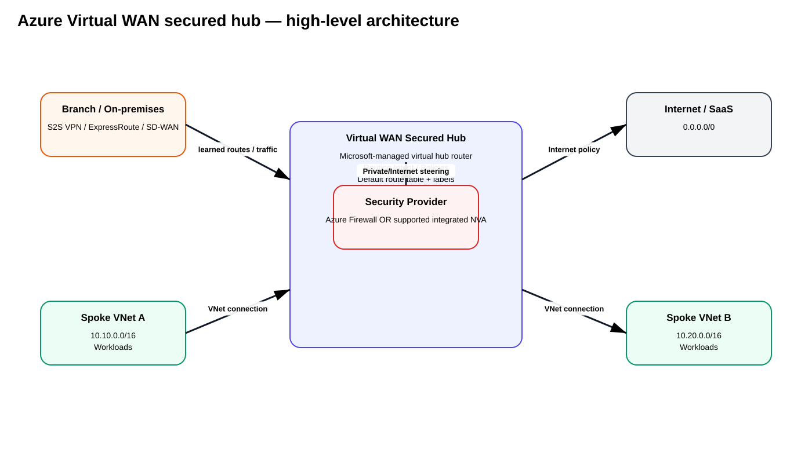
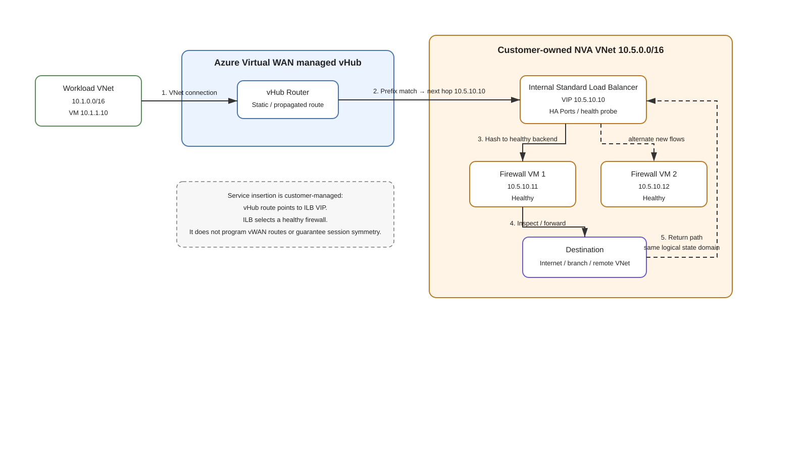
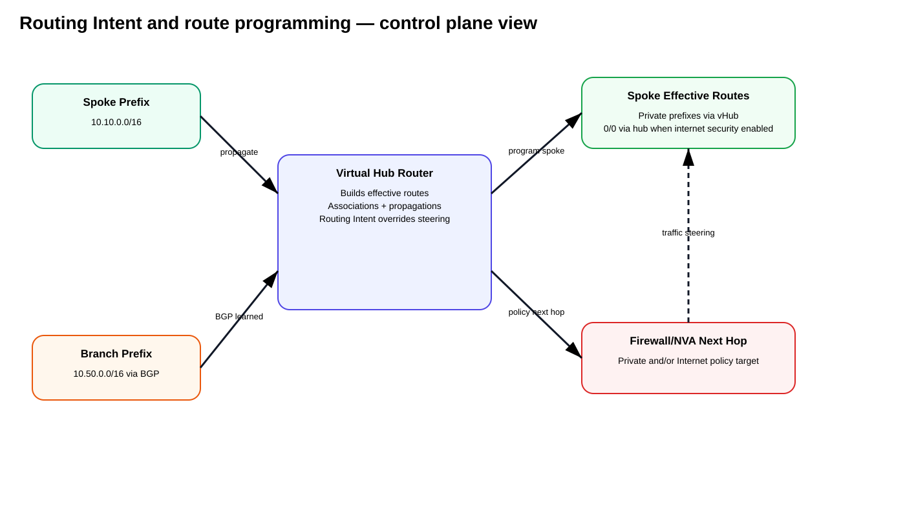
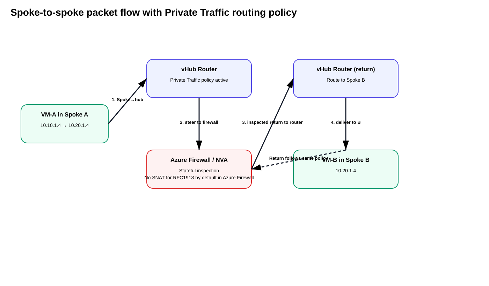
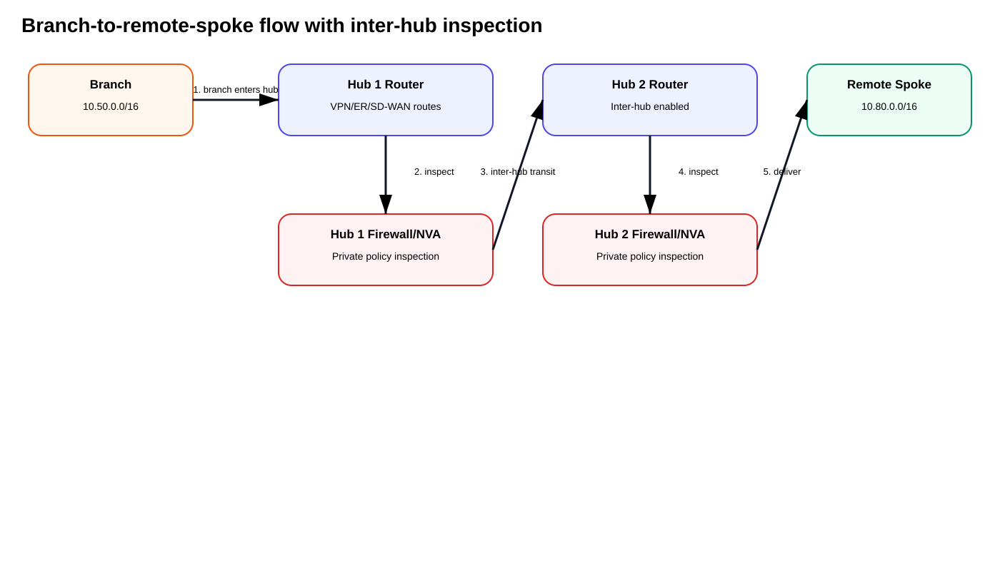

# Method 4 — Azure Virtual WAN Secured Hub with Azure Firewall or Integrated NVA

> Deep study guide for centralized inspection in **Azure Virtual WAN (vWAN)** using a **secured virtual hub**, with either **Azure Firewall** or a **supported Network Virtual Appliance (NVA)** integrated directly into the virtual hub.

## Source URLs

- https://learn.microsoft.com/en-us/azure/firewall-manager/secured-virtual-hub
- https://learn.microsoft.com/en-us/azure/firewall-manager/secure-cloud-network
- https://learn.microsoft.com/en-us/azure/virtual-wan/routing-deep-dive
- https://learn.microsoft.com/en-us/azure/virtual-wan/about-nva-hub
- https://learn.microsoft.com/en-us/azure/virtual-wan/third-party-integrations
- https://learn.microsoft.com/en-us/azure/virtual-wan/how-to-nva-hub
- https://learn.microsoft.com/en-us/azure/virtual-wan/howto-firewall
- https://learn.microsoft.com/en-us/security/zero-trust/azure-virtual-wan
- https://learn.microsoft.com/en-us/azure/virtual-wan/how-to-network-virtual-appliance-inbound
- https://learn.microsoft.com/en-us/azure/virtual-wan/howto-connect-vnet-hub
- https://learn.microsoft.com/en-us/azure/virtual-wan/hybrid-firewall-spoke-static
- https://learn.microsoft.com/en-us/azure/virtual-wan/next-hop-ip
- https://learn.microsoft.com/en-us/azure/networking/design-guide/virtual-wan
- https://learn.microsoft.com/en-us/azure/firewall-manager/private-link-inspection-secure-virtual-hub
- https://learn.microsoft.com/en-us/azure/virtual-wan/how-to-palo-alto-cloud-ngfw
- https://www.cisco.com/c/en/us/td/docs/security/firepower/quick_start/consolidated_ftdv_gsg/threat-defense-virtual-77-gsg/m_threat-defense-virtual-solution-on-tdv_virtual_wan_azure.html
- https://docs.fortinet.com/document/fortigate-public-cloud/7.6.0/azure-vwan-ngfw-deployment-guide/233362
- https://docs.paloaltonetworks.com/cloud-ngfw-azure/deployment/cloud-ngfw-for-azure-deployment-architectures/cloud-ngfw-for-azure-virtual-wan
- https://docs.paloaltonetworks.com/vm-series/deployment/public-cloud/set-up-the-vm-series-firewall-on-azure/panorama-orchestrated-deployments-in-azure

---

## 1. What this method is

**Source information:** Azure Virtual WAN is a Microsoft-managed global transit architecture. A **secured virtual hub** is a Virtual WAN hub with an integrated security provider. Azure Firewall can be deployed directly into the managed hub. Microsoft also supports a limited set of third-party NVAs engineered and validated specifically for deployment inside a Virtual WAN hub.

The key operational difference from a customer-managed hub VNet is that you do **not** own the hub subnet layout and you do not place arbitrary VMs inside it. Microsoft operates the virtual hub router. VNet, VPN, ExpressRoute, and supported integrated-NVA connections exchange routes with that routing fabric. **Routing Intent** and **Routing Policies** can steer private and Internet traffic through the selected security provider without requiring the classic per-spoke UDR model.

**Additional explanation:** Treat the vHub as a managed transit router plus gateway fabric. The firewall/NVA is a service-insertion point attached to that routing fabric. Instead of building a route-server + load-balancer + firewall chain yourself, you tell the vHub which traffic class must be inspected.

## 2. High-level topology



[Editable draw.io version](images/09-05-26-15-56_azure_vwan_architecture.drawio)

**What this image shows:** Spoke VNets, branches, and Internet destinations converge on the managed vHub. Routing Intent steers selected traffic through Azure Firewall or a supported integrated NVA.

**What matters:** A normal VM-based NVA in an arbitrary connected VNet is a different architecture and does not automatically receive integrated vHub routing behavior.

**What to verify:** Virtual WAN type is **Standard**, the security provider is healthy, and the required Private Traffic / Internet Traffic policies are enabled.

## 3. Azure Firewall versus integrated NVA

| Area | Azure Firewall in secured hub | Supported integrated NVA in vHub |
|---|---|---|
| Deployment | Native Microsoft service | Third-party managed application built for vWAN |
| Placement | Directly in vHub | Directly in vHub |
| Routing integration | Native Routing Intent | Integrated with vHub router; vendor capability dependent |
| HA | Platform managed | Azure + partner integrated HA model |
| SD-WAN termination | No | Some partner appliances support SD-WAN |
| NGFW features | Azure Firewall Standard/Premium | Vendor-specific |
| Lifecycle | Azure service lifecycle | Partner-specific |
| Internet DNAT | Azure Firewall DNAT | Supported only on specific integrated offers/features |
| Licensing | Azure service pricing | Azure infrastructure + vendor entitlement/Marketplace plan |

**Caveat:** “NVA in Azure” does not mean “NVA supported in a Virtual WAN hub.” Direct vHub deployment is restricted to approved partner offers.

### 3.1 How can an integrated NVA have multiple instances? Do you need your own ILB?

**No. For an NVA integrated directly into the Virtual WAN hub, you do not deploy your own Internal Load Balancer (ILB) inside the vHub.**

This is one of the most important differences between an **integrated NVA in a managed vHub** and an **NVA pair that you deploy as ordinary VMs in a customer-owned VNet**.

**Source information:** Microsoft documents integrated Virtual WAN NVAs as Microsoft-managed Infrastructure-as-a-Service solutions jointly developed with supported NVA vendors. The backing infrastructure is deployed **inside the Virtual WAN hub as a Microsoft-owned and managed Virtual Machine Scale Set (VMSS) with Azure Load Balancers**. You select an NVA scale/infrastructure unit, while Microsoft and the partner integration manage the underlying VM and load-balancer construction.

The customer-facing logical model is therefore:

| Component | Who owns/configures it? | What you interact with |
|---|---|---|
| Virtual WAN hub router | Microsoft | Hub routing, route tables, Routing Intent |
| Integrated NVA resource | Microsoft + NVA vendor integration | NVA resource, scale units, vendor policy/orchestrator |
| NVA backend instances | Microsoft-managed infrastructure + vendor software | Normally not individual customer-built firewall VMs |
| Azure Load Balancer(s) backing the integrated NVA | Microsoft-managed as part of the integration | You normally do **not** create or point UDRs at this ILB |
| NVA policy / security configuration | Vendor-specific | Vendor manager/orchestrator/firewall policy |

The Microsoft documentation currently maps NVA scale units to backend instance counts as follows:

| NVA scale units | Integrated NVA instances |
|---:|---:|
| `2-20` | `2` |
| `30-40` | `3` |
| `60` | `4` |
| `80` | `5` |

So when the guide says an integrated NVA can have **multiple NVAs/instances**, it does **not** mean that you manually deploy NVA-1, NVA-2, NVA-3 and then create your own ILB VIP in the vHub. It means that **one integrated NVA deployment can be backed by multiple Microsoft-managed NVA instances according to the selected scale unit**.

Microsoft's NVA hub documentation also shows that integrated NVA deployments consume hub IP addresses for both NVA interfaces and load-balancer infrastructure. For integrated NVA types that are not compatible with Internet Inbound, Microsoft documents an IP address allocated to the **Internal Load Balancer**. This is another indication that the load-balancer layer exists, but it is part of the managed integrated-NVA implementation rather than a customer-created service-insertion hop.

#### What Routing Intent points to

Routing Intent does **not** require you to configure a route such as:

```text
Private traffic -> customer ILB VIP -> NVA-1/NVA-2
```

Instead, the vHub security/routing integration selects the **integrated NVA security provider/resource**. The internal VMSS/load-balancer implementation is underneath that service abstraction.

Conceptually:

```text
Spoke / Branch
      |
      v
Managed vHub router
      |
      | Routing Intent / security policy
      v
Integrated NVA resource
      |
      | Microsoft/vendor-managed distribution
      v
One of the healthy NVA backend instances
```

The important operational point is that the **customer does not need to know or configure the internal load-balancer VIP as the next hop** in the same way that a customer-managed hub-VNet NVA design would.

#### Do not confuse this with an NVA in a connected VNet

Microsoft also documents a separate architecture where an **NVA Spoke VNet** contains ordinary customer-managed NVA VMs and a customer-managed load balancer. In that design, a Virtual WAN VNet connection can use a static route whose next-hop IP is the load balancer in the connected VNet.

That is a different architecture:

| Design | NVA location | Who creates the ILB? | How traffic is steered |
|---|---|---|---|
| **Integrated NVA in vHub** | Directly inside managed Virtual WAN hub | **Microsoft/integration** | Routing Intent / integrated vHub routing |
| **NVA VMs in connected VNet** | Customer-owned VNet attached to vHub | **Customer** | Custom vWAN connection routes/static next hop/UDRs as documented for that design |
| **NVA VMs in customer-managed hub VNet** | Customer-owned hub VNet | **Customer** | UDR/BGP/Route Server/ILB depending on architecture |

**Design rule:** If you are using the supported **integrated NVA directly in the Virtual WAN hub**, do not try to recreate the customer-managed hub pattern by adding your own ILB inside the vHub. The hub is Microsoft-managed and does not expose arbitrary customer subnet/VM placement for that purpose.

### 3.2 Can you deploy your own NVA VMs? Vendor examples from Cisco, Fortinet, and Palo Alto Networks

**Yes, but not as arbitrary VMs inside the managed Virtual WAN hub.** You have two fundamentally different deployment models:

1. **Integrated vHub NVA / SaaS security service** — deploy a supported partner integration directly into the managed vHub. Azure and the partner own the underlying service infrastructure model.
2. **Customer-managed NVA VMs in a connected VNet** — deploy ordinary firewall VMs in a VNet that is connected to the vHub. You own the VM lifecycle, interfaces, load balancer if required, routing, static next-hop design, HA, upgrades, and failure behavior.

The managed vHub does not let you create arbitrary subnets and place your own VM-Series, FortiGate VM, or FTDv VM directly inside the hub the same way you can in a normal VNet. If you want full VM ownership, put the appliances in a **customer-owned VNet connected to the vHub** and use the customer-managed service-insertion model.

#### Cisco example — Secure Firewall Threat Defense Virtual integrated directly into vHub

Cisco documents **Cisco Secure Firewall Threat Defense Virtual for Azure Virtual WAN** as a dedicated Azure Marketplace offering. You select the existing Virtual WAN hub and the NVA scale units; the scale units determine the number/type of Threat Defense Virtual instances. Cisco's example explicitly shows a scale-unit choice such as two Threat Defense Virtual instances for the selected throughput tier.

Logical model:

```text
Azure Virtual WAN hub
        |
        | integrated NVA deployment
        v
Cisco Secure Firewall Threat Defense Virtual resource
        |
        | Microsoft/Cisco managed infrastructure
        v
Multiple FTDv backend instances
```

Key operational points from Cisco's deployment guide:

- deploy from the **Cisco Secure Firewall Threat Defense Virtual for Azure VWAN** Marketplace solution;
- select the target Virtual WAN hub;
- select scale units rather than manually creating an ILB and individual firewall VMs;
- Cisco's Virtual WAN deployment supports a three-interface Threat Defense Virtual model;
- management is performed through Cisco management tooling such as Secure Firewall Management Center;
- BGP, interface routing, health probes, and firewall policy are configured according to the Cisco vWAN guide.

This is an **integrated NVA** deployment, not a generic pair of customer-created FTDv VMs in the vHub.

Official Cisco example:

- https://www.cisco.com/c/en/us/td/docs/security/firepower/quick_start/consolidated_ftdv_gsg/threat-defense-virtual-77-gsg/m_threat-defense-virtual-solution-on-tdv_virtual_wan_azure.html

#### Fortinet example — FortiGate integrated directly into vHub

Fortinet documents **Fortinet FortiGate Security for Azure Virtual WAN** as an Azure Marketplace managed application. The deployment workflow asks for the target vWAN hub and an NVA **Scale Unit**. Fortinet states that the scale unit controls the type and number of FortiGate NVAs created.

Logical model:

```text
Azure Virtual WAN hub
        |
        | Fortinet managed application
        v
FortiGate NVA resource/group
        |
        | scale-unit controlled deployment
        v
Multiple FortiGate NVA instances
        |
        +-- FortiManager policy / management
```

Fortinet's deployment documentation shows the FortiGate NVAs as a group in FortiManager and describes FortiManager authorization/licensing/configuration after the Azure deployment. Fortinet also documents FortiGate Session Life Support Protocol (FGSP) peering/session sharing in its vWAN architecture examples.

This is also an **integrated NVA** model. You are not expected to create your own vHub ILB and manually attach two FortiGate VMs behind it.

Official Fortinet examples:

- https://docs.fortinet.com/document/fortigate-public-cloud/7.6.0/azure-vwan-ngfw-deployment-guide/233362
- https://docs.fortinet.com/document/fortigate-public-cloud/7.6.0/azure-vwan-ngfw-deployment-guide/393938

#### Palo Alto Networks example — Cloud NGFW is SaaS in vHub, not VM-Series integrated NVA

Palo Alto Networks is different from Cisco FTDv and Fortinet FortiGate in the current Virtual WAN model.

Microsoft currently identifies **Palo Alto Networks Cloud NGFW** as a **software-as-a-service (SaaS) security solution** for Virtual WAN rather than an Integrated NVA partner. Microsoft documents Cloud NGFW as a cloud-native SaaS firewall deployed into the vHub and selected as the Routing Intent next-hop resource.

Logical model:

```text
Azure Virtual WAN hub
        |
        | Routing Intent
        v
Palo Alto Networks Cloud NGFW resource
        |
        | SaaS-managed scaling / lifecycle
        v
Palo Alto Networks cloud firewall service
```

Microsoft explicitly describes this as fully managed infrastructure/software lifecycle. You do not deploy VM-Series VMs or an ILB in the vHub for this model.

Official Microsoft/Palo Alto examples:

- https://learn.microsoft.com/en-us/azure/virtual-wan/how-to-palo-alto-cloud-ngfw
- https://docs.paloaltonetworks.com/cloud-ngfw-azure/deployment/cloud-ngfw-for-azure-deployment-architectures/cloud-ngfw-for-azure-virtual-wan

#### Palo Alto VM-Series example — customer-managed VMs in your own VNet

If you specifically want to own the Palo Alto firewall VMs, use **VM-Series in a customer-owned Azure VNet**, not Cloud NGFW SaaS inside the managed vHub.

Palo Alto Networks documents Azure VM-Series hub deployments where a VM Scale Set of VM-Series firewalls is placed behind an **Azure Internal Standard Load Balancer with HA Ports**. The ILB private frontend IP becomes the service-insertion next hop for traffic that you route toward the firewall stack.

Conceptually, when that VNet is connected to Virtual WAN:

```text
Virtual WAN hub
      |
      | VNet connection / custom static route design
      v
Customer-owned NVA VNet
      |
      v
Customer-managed ILB / HA Ports
      |
      +-- VM-Series firewall instance 1
      +-- VM-Series firewall instance 2
      +-- additional VMSS instances if used
```

This is the architecture in which **you** own the ILB, VMSS/VM-Series lifecycle, route tables, NAT, HA, health probes, Panorama integration, and service-insertion logic. It is not the same as a supported integrated NVA deployed inside the vHub.

Palo Alto's current VM-Series Azure orchestration documentation states that its hub stack can use an **Internal Standard Load Balancer with HA Ports** to distribute traffic across a firewall scale set and that routes in application VNets can point at the load balancer private IP for inspection.

Official Palo Alto VM-Series example:

- https://docs.paloaltonetworks.com/vm-series/deployment/public-cloud/set-up-the-vm-series-firewall-on-azure/panorama-orchestrated-deployments-in-azure

#### Side-by-side vendor summary

| Vendor / product | Directly inside managed vHub? | Deployment model | Do you create the ILB? | Who owns underlying firewall instances? |
|---|---:|---|---:|---|
| Cisco Secure Firewall Threat Defense Virtual for Azure vWAN | Yes | Integrated NVA | No | Microsoft/Cisco integrated infrastructure |
| Fortinet FortiGate Security for Azure vWAN | Yes | Integrated NVA | No | Microsoft/Fortinet integrated infrastructure |
| Palo Alto Networks Cloud NGFW | Yes | SaaS security solution | No | SaaS provider / Azure native integration |
| Palo Alto Networks VM-Series | No, not as arbitrary VMs in managed vHub | Customer-managed VMs in your VNet | Yes, when design uses ILB/HA Ports | Customer |
| Generic Cisco/Fortinet/Palo Alto VM appliance in connected VNet | No, not as arbitrary VMs in managed vHub | Customer-managed NVA VNet | Customer/vendor design | Customer |

#### Decision rule

Use this simple test:

```text
Do I want the firewall directly integrated into the managed vHub?
    |
    +-- Yes -> Use a supported Integrated NVA or SaaS partner offering.
    |          You do not create arbitrary firewall VMs or your own ILB in the vHub.
    |
    +-- No, I want full VM/network ownership -> Deploy the NVA VMs in my own VNet.
               Connect that VNet to Virtual WAN and design the static routes/ILB/UDRs/HA explicitly.
```

### 3.3 Customer-managed NVA VNet behind an ILB — does this break service insertion?

**No. It does not inherently break service insertion. It changes the service-insertion mechanism from a managed Routing Intent security provider to a customer-managed IP next hop.**

Microsoft explicitly supports an **NVA VNet connected to a Virtual WAN hub** where a static route on the VNet connection points to an NVA or load-balancer frontend IP. Microsoft also documents **Next Hop IP** support for BGP-peered NVAs, allowing an NVA to advertise routes whose next hop is a load balancer or another device rather than the advertising NVA itself.



[Editable draw.io version](images/09-05-26-15-56_customer_managed_nva_ilb_service_insertion.drawio)

**What this image shows:** A workload VNet sends traffic into the managed vHub. The vHub route lookup selects a customer-owned ILB VIP in the connected NVA VNet. The ILB distributes the flow to a healthy firewall VM, which performs inspection and forwards the permitted packet toward the destination.

**What matters:** The ILB does not replace the vHub router and does not create Virtual WAN routes. It is a **stable IP next hop and backend-selection point**. You are responsible for making sure the vHub learns or contains the correct route, that the route propagates to the intended connections, that the NVA can forward the packet onward, and that the return direction reaches the same logical firewall state domain.

**What to verify:** The exact route prefix, VNet connection on which the static route is defined, `Propagate static route` behavior, effective routes in the vHub and workload connection, ILB frontend IP, HA Ports/load-balancing rules as required by the vendor, backend health, firewall route table, IP forwarding, NAT, state synchronization, and reverse-path symmetry.

#### The two service-insertion models side by side

| Question | Integrated NVA / SaaS in vHub | Customer-managed NVA VNet + ILB |
|---|---|---|
| What represents the security next hop? | Integrated security resource | ILB VIP or NVA next-hop IP |
| How is traffic steered? | Routing Intent / integrated vHub policy | Static route, propagated static route, or supported BGP next-hop advertisement |
| Who owns the ILB? | Microsoft/vendor integration | Customer |
| Who owns NVA VMs? | Microsoft/vendor integration or SaaS provider | Customer |
| Who must design return symmetry? | Integration/vendor architecture | Customer + vendor architecture |
| Can arbitrary firewall VMs be used? | No | Yes, in a customer-owned connected VNet, subject to vendor support |
| Does the ILB itself advertise routes? | Not customer-visible | No; routing must be programmed separately unless an NVA advertises the route with the ILB as next hop |

#### Static-route service insertion

Microsoft documents static routes directly on a **Virtual WAN VNet connection**. The route contains a destination prefix and a **single next-hop IP**. For an NVA VNet, that next-hop IP can be the NVA or, in the documented load-balanced pattern, the ILB frontend.

Example addressing:

```text
Workload VNet: 10.1.0.0/16
NVA VNet:      10.5.0.0/16
ILB VIP:       10.5.10.10
Firewall-1:    10.5.10.11
Firewall-2:    10.5.10.12
```

For Internet egress, the service-insertion intent can look like:

```text
NVA VNet connection static route
Destination: 0.0.0.0/0
Next hop:    10.5.10.10
Propagate static route: enabled where required
```

Microsoft's current hybrid Virtual WAN example uses this same pattern conceptually: a `0.0.0.0/0` static route on the DMZ/NVA VNet connection points to the NVA for Internet inspection and breakout, while other private traffic can still use Azure Firewall. This proves that customer-managed NVA service insertion can coexist with Virtual WAN rather than automatically breaking it.

#### Detailed packet flow

Assume a client at `10.1.1.10` is accessing an Internet server at `203.0.113.50:443`.

1. The workload sends `10.1.1.10:<ephemeral> -> 203.0.113.50:443`.
2. The workload VNet connection sends the flow into the vHub.
3. The vHub route lookup matches the propagated/static `0.0.0.0/0` route whose next hop is `10.5.10.10`.
4. Azure forwards the packet to the NVA VNet and the ILB frontend `10.5.10.10`.
5. The ILB selects a healthy backend firewall according to its load-balancing rule and flow hash.
6. The selected firewall inspects the original flow, applies security policy, and performs NAT only if the firewall/vendor egress design requires it.
7. The firewall forwards the permitted packet toward the Internet egress mechanism.
8. The return packet must come back through a path that lets the same logical firewall state domain process the reverse flow.
9. The firewall reverses any NAT/state, and the packet returns through the NVA VNet/vHub path to `10.1.1.10`.

The service insertion therefore still exists:

```text
vHub route lookup
      -> ILB VIP
      -> healthy NVA
      -> inspection
      -> destination
```

The difference is that **you built and operate the service chain** instead of selecting a fully integrated security provider with Routing Intent.

#### What the ILB solves — and what it does not

The ILB gives you a stable next-hop address and can remove unhealthy backends from **new-flow** selection based on health probes. It can also distribute flows across an active-active firewall pool when the vendor supports that model.

The ILB does **not** by itself:

- install or withdraw Virtual WAN routes;
- prove that the firewall can forward traffic onward;
- synchronize firewall sessions;
- guarantee that forward and reverse packets select the same firewall in every topology;
- preserve long-lived sessions after a firewall failure;
- decide whether SNAT is required;
- configure BGP on the firewall;
- prevent a more specific route from bypassing the service chain.

Those remain routing and firewall-HA responsibilities.

#### Fail-closed behavior when all firewall backends are unhealthy

**Reasonable inference from the documented routing and load-balancer behavior:** a Virtual WAN static route does not disappear merely because the ILB loses all healthy firewall backends. The vHub can therefore continue to select the ILB VIP while the ILB has no healthy destination to receive the flow.

Conceptually:

```text
vHub route still exists
0.0.0.0/0 -> 10.5.10.10

ILB 10.5.10.10
  +-- FW-1 unhealthy
  +-- FW-2 unhealthy

Result: traffic can blackhole at the service-insertion point.
```

For a security design, that behavior may be desirable because it is effectively **fail closed**, but it must be tested rather than assumed. If the business requires fail-open behavior, that requires a separate routing/failover design; the ILB health probe alone does not rewrite the vHub route table.

#### Stateful symmetry is the hardest part

A valid Azure route and a healthy ILB do not guarantee a valid **stateful firewall path**.

This can still fail:

```text
Forward: client -> ILB -> Firewall-1 -> destination
Return:  destination -> ILB -> Firewall-2 -> client
```

unless the firewall vendor's architecture explicitly supports that state distribution. Depending on vendor/product, the design may rely on active/passive behavior, state/session synchronization, clustering, floating IP, source NAT, a single load-balancer flow domain, or other vendor-specific mechanisms.

**Design rule:** validate the exact Cisco/Fortinet/Palo Alto architecture for Azure ILB-based HA. Do not infer stateful symmetry merely from the fact that both firewalls are healthy members of the backend pool.

#### BGP Next Hop IP — dynamic routing to an ILB

Microsoft's Virtual WAN **Next Hop IP** feature allows a BGP-peered NVA or BGP endpoint in a connected VNet to advertise a route whose next hop is an address other than itself, including a load balancer in the same region.

Conceptually:

```text
NVA peers with vHub using BGP
NVA advertises: 10.222.222.0/24
BGP next hop:   10.5.10.10   # ILB VIP

vHub effective route:
10.222.222.0/24 -> 10.5.10.10
```

This is useful when you want the routing control plane to remain dynamic while the actual forwarding next hop is the load-balanced firewall pool. The NVA/BGP endpoint must still meet Microsoft's Virtual WAN BGP peering requirements, and Microsoft documents that the custom next-hop IP cannot be in a different region.

#### `Propagate static route` matters

When a static route is configured on an NVA VNet connection, **Propagate static route** controls whether that route is propagated into the Virtual WAN route tables/labels selected by the connection. If you intend workload VNets or branch connections to learn the route through Virtual WAN, validate this setting and the effective route tables rather than assuming that creating the static route alone makes it visible everywhere.

Microsoft's hybrid NVA example specifically uses propagated static routes so an Internet default route from the NVA/DMZ connection is injected into the appropriate Virtual WAN route tables.

#### The `Bypass Next Hop IP for workloads within this VNet` trap

Microsoft documents a specific NVA-spoke example with:

```text
NVA VNet
Load Balancer: 10.2.0.1
NVA-1:         10.2.0.2
NVA-2:         10.2.0.3
```

If a static route on that VNet connection covers the NVA VNet's own address space and **Bypass Next Hop IP for workloads within this VNet** is disabled, traffic actually destined to an NVA/workload IP inside that VNet can first be redirected to the ILB. The ILB can then hash the packet to a different backend than the original destination.

When **Bypass Next Hop IP** is enabled, traffic whose destination is within that VNet's own address space bypasses the static NVA next hop and goes directly to the intended local workload, while other prefixes covered by the static route continue to use the NVA/ILB next hop.

**Important:** Microsoft documents that this setting is chosen when the VNet connection is created; enabling it on an existing connection can require deleting and recreating the connection. Also, the setting does not alter the separate route-selection behavior of routes learned through BGP peering.

#### Does using your own NVA prevent Routing Intent elsewhere?

Not necessarily. Microsoft documents hybrid Virtual WAN designs where **Azure Firewall handles private traffic** while a **customer-managed NVA/Secure Web Gateway in a connected DMZ VNet handles Internet traffic** using a propagated `0.0.0.0/0` static route.

That means the design can intentionally combine managed and customer-managed inspection functions, provided the route tables, associations, propagations, and traffic classes are designed coherently.

For example:

```text
Private corporate prefixes -> Azure Firewall / secured path
Internet 0.0.0.0/0         -> NVA VNet ILB -> firewall pool
```

This is not the same as arbitrarily chaining multiple security providers for every flow. Treat each traffic class and route lookup separately and verify the effective route after every service-insertion decision.

#### Operational verification checklist for this model

For a customer-managed NVA VNet behind an ILB, verify in this order:

1. The NVA VNet is connected to the intended vHub.
2. The static route or BGP-advertised prefix is present in the vHub effective route table.
3. The route's next hop is the expected ILB frontend IP.
4. `Propagate static route`/route-table propagation sends the prefix to every connection that should use the inspection path.
5. `Bypass Next Hop IP for workloads within this VNet` is set appropriately for the NVA VNet design.
6. The ILB rule covers the required transit protocols/ports; use HA Ports when that is the vendor-supported generic NVA pattern.
7. All intended firewall dataplane NICs are in the backend pool.
8. The health probe represents real forwarding health, not merely VM power state.
9. Azure NIC IP forwarding and firewall forwarding are enabled.
10. The firewall has routes toward the final destination and back toward the source.
11. Firewall policy/NAT is correct.
12. Forward and reverse directions traverse a vendor-supported stateful HA path.
13. Test one-firewall failure and all-firewalls-unhealthy behavior separately.

## 4. Routing Intent — the key mechanism

Routing Intent tells Virtual WAN which security provider must receive a traffic class. The two central policies are:

1. **Private Traffic** — VNet and branch/private prefixes.
2. **Internet Traffic** — Internet/default-route traffic.

When these policies are enabled, the hub router changes forwarding behavior so traffic reaches the firewall/NVA before the final destination.

### Why this differs from classic UDR service insertion

In a traditional hub VNet, each spoke often needs a UDR whose next hop is Azure Firewall or an NVA. You must manually account for gateway propagation, route symmetry, load balancers, and return paths.

In a Virtual WAN secured hub, the **vHub router is the control point**. Connected VNet and branch routes are learned by the hub; Routing Intent changes how they are forwarded; and Virtual WAN programs/advertises the resulting route behavior toward connected networks.

## 5. Control-plane route programming



[Editable draw.io version](images/09-05-26-15-56_azure_vwan_routing-control-plane.drawio)

**What this image shows:** Spoke and branch prefixes enter the vHub routing system. Associations, propagations, and Routing Intent determine effective forwarding and what connected networks learn.

**What matters:** The firewall does **not** log in to every spoke and edit a route table. The Virtual WAN control plane owns the hub route programming.

**What to verify:** Inspect **Effective Routes** for the hub and VNet connections. Check route origin, next-hop type, and whether the expected default/private routes follow the secured-hub path.

## 6. Detailed packet flow — Spoke A to Spoke B

Example:

- Spoke A: `10.10.0.0/16`
- VM-A: `10.10.1.4`
- Spoke B: `10.20.0.0/16`
- VM-B: `10.20.1.4`
- Private Traffic policy: enabled
- Security provider: Azure Firewall or supported integrated NVA



[Editable draw.io version](images/09-05-26-15-56_azure_vwan_spoke-to-spoke-flow.drawio)

**What this image shows:** The vHub receives the packet, applies the Private Traffic routing policy, inserts the security provider, then performs the onward lookup to Spoke B.

**What matters:** Stateful inspection requires the return direction to traverse the same logical state domain. For an integrated NVA, the exact backend instance selection and state synchronization are implementation/vendor details beneath the integrated NVA service abstraction; you do not point the spoke at a customer-created ILB VIP.

**What to verify:** Firewall logs should show the expected source/destination and both directions; there should be no alternate UDR or branch route that bypasses inspection.

### Forward path

1. VM-A sends a packet to `10.20.1.4`.
2. Spoke A routing forwards the destination through its Virtual WAN VNet connection.
3. The packet enters the vHub routing fabric.
4. The vHub identifies `10.20.0.0/16` as private traffic.
5. The Private Traffic policy selects the firewall/NVA as service next hop.
6. For an integrated NVA, the managed NVA infrastructure delivers the flow to a healthy backend instance according to the Microsoft/vendor implementation; this is not a customer-created ILB next-hop decision.
7. The security provider evaluates network/application policy, threat controls, logging, and NAT where applicable.
8. If allowed, the packet returns to the vHub forwarding fabric.
9. The vHub resolves `10.20.0.0/16` through the Spoke B connection.
10. The packet enters Spoke B and reaches VM-B.

### Return path

1. VM-B replies to `10.10.1.4`.
2. The reply enters the vHub.
3. Private Traffic policy again inserts the security provider.
4. The integrated security service/vendor HA design ensures the return flow reaches the appropriate logical state domain; exact instance/state behavior is vendor-specific.
5. The firewall matches the stateful session/policy.
6. The vHub forwards the packet to Spoke A.
7. VM-A receives the reply.

### NAT caveat

For private-to-private traffic, unnecessary SNAT makes troubleshooting and source-based policy harder. Azure Firewall NAT behavior depends on destination classification and the configured private IP ranges. If the enterprise uses non-RFC1918 space internally, validate how those ranges are classified and add them where required. For third-party integrated NVAs, source-preservation/NAT behavior must be confirmed from that vendor's Virtual WAN integration documentation.

## 7. Branch to spoke flow

Assume a branch advertises `10.50.0.0/16` over site-to-site VPN, ExpressRoute, or a supported SD-WAN NVA.

1. The branch sends traffic to a spoke prefix.
2. The VPN/ER/SD-WAN connection lands in the vHub.
3. The vHub resolves the destination.
4. Private Traffic routing policy inserts the firewall/NVA.
5. The security provider allows or denies the session.
6. The vHub forwards the permitted packet to the spoke VNet connection.
7. The return direction follows the corresponding secured path toward the branch.

This same transit model is what makes Virtual WAN useful for branch-to-VNet, VNet-to-branch, branch-to-branch, VNet-to-VNet, and multi-region connectivity.

## 8. Multi-region inter-hub inspection



[Editable draw.io version](images/09-05-26-15-56_azure_vwan_interhub-branch-flow.drawio)

**What this image shows:** A branch connected to Hub 1 reaches a workload behind Hub 2 while secured routing is applied.

**What matters:** Having a firewall in each hub does not by itself guarantee inter-hub inspection. Microsoft documents the need for Routing Intent and the **Inter-hub** setting when private inter-hub traffic must traverse the security solution.

**What to verify:** In each affected hub, confirm Private Traffic policy and Inter-hub behavior, then inspect effective routes on both sides.

## 9. Internet egress

When **Internet Traffic → Azure Firewall/NVA** is enabled:

1. A workload sends traffic to an Internet destination.
2. The effective default route directs the traffic to the secured vHub path.
3. The vHub forwards it to the firewall/NVA.
4. Security policy is evaluated.
5. SNAT is typically applied for public egress as appropriate.
6. The packet exits through the security provider.
7. Return traffic reaches the same service and is matched to state.
8. The vHub forwards it back to the source spoke.

### Internet security on VNet connections

The VNet connection’s Internet security setting controls whether the secured default-route behavior is advertised/applied to the spoke. Always verify the effective `0.0.0.0/0`; otherwise a workload may continue to use a direct Azure system route to the Internet.

## 10. Internet inbound / DNAT

### Azure Firewall

Azure Firewall can publish workloads through DNAT rules subject to Azure Firewall capabilities and policy.

### Integrated NVA

Microsoft documents an Internet Inbound/DNAT integration for only specific supported NVA offers. Do not assume all integrated NVAs support this capability. The current Microsoft documentation also places requirements on the public IPs used for DNAT, including regional alignment with the NVA resource.

**Design rule:** Validate Internet inbound as a separate feature from east-west/private inspection.

## 11. Private Endpoint inspection

Private Endpoints can introduce very specific routing behavior. For secured Virtual WAN designs:

- enable the required network policies on the private-endpoint subnet;
- ensure the secured route is preferred;
- with Azure Firewall, add private endpoint prefixes to the secured private-traffic configuration where Microsoft documents it as necessary;
- verify DNS returns the private endpoint IP;
- inspect source effective routes and firewall logs.

When troubleshooting, examine DNS first, then the source NIC route, then the PE subnet network-policy setting, then firewall visibility and return routing.

## 12. Step-by-step configuration — Azure Firewall secured hub

### Prerequisites

- Azure Virtual WAN **Standard**.
- One or more Virtual Hubs.
- Non-overlapping address plan.
- Appropriate RBAC.
- Firewall Policy design.
- VPN/ExpressRoute gateways if branch connectivity is required.

### Step 1 — Create/select the Virtual WAN

1. Open **Virtual WANs**.
2. Create or select the required Virtual WAN.
3. Ensure **Type = Standard**.

### Step 2 — Create the virtual hub

1. Under the Virtual WAN, open **Hubs**.
2. Create the hub in the target region.
3. Allocate the hub address space.
4. Add VPN and/or ExpressRoute gateways when required.

### Step 3 — Deploy Azure Firewall into the hub

1. Open **Network Security** / Firewall Manager or the Virtual WAN hub security workflow.
2. Create/convert the hub to a secured hub.
3. Deploy Azure Firewall.
4. Select Standard or Premium according to security requirements.
5. Associate an Azure Firewall Policy.

Microsoft notes an important availability-zone caveat: when upgrading an existing hub through some portal/Firewall Manager paths, you cannot choose Azure Firewall Availability Zones. Microsoft recommends the PowerShell upgrade procedure when you need to specify zones during an upgrade. Also, when zones are available, Microsoft recommends aligning the firewall deployment with the hub’s resiliency model by selecting all available zones.

### Step 4 — Connect spoke VNets

1. Virtual WAN → **Virtual network connections**.
2. Add each spoke.
3. Select the correct hub.
4. Review route-table association and propagation.
5. Review **Internet security**.
6. Save.

### Step 5 — Configure Routing Intent

In the hub **Security configuration**:

1. **Internet traffic** → select Azure Firewall when Internet egress inspection is required.
2. **Private traffic** → **Send via Azure Firewall**.
3. **Inter-hub** → enable where hub-to-hub / branch-to-branch inspection is required.
4. Add non-RFC1918 corporate prefixes under **Private Traffic Prefixes** when they are intended to be treated as private.
5. Save and wait for route programming to converge. Microsoft’s tutorial notes that route-table updates can take a few minutes.

### Step 6 — Configure Firewall Policy

At minimum define:

- east-west allow rules;
- branch-to-spoke rules;
- Internet application/network rules;
- DNS dependencies;
- DNAT where publishing services;
- logging/diagnostics;
- Premium controls such as IDPS/TLS inspection where licensed and required.

### Step 7 — Validate before production

Check:

- vHub effective routes;
- VNet connection effective routes;
- VM NIC effective routes;
- branch BGP tables;
- firewall logs;
- test sessions in both directions.

## 13. Step-by-step configuration — supported integrated NVA

The exact workflow is vendor-specific, but the architecture is consistent:

1. Confirm the appliance is on Microsoft’s current supported Virtual WAN NVA partner list.
2. Deploy the vendor’s **managed application** from Azure Marketplace or the documented vendor orchestration workflow.
3. Select the Virtual WAN and target hub.
4. Select the vendor’s required NVA infrastructure/scale units. Understand that the selected scale can result in multiple Microsoft-managed NVA backend instances.
5. **Do not create a customer ILB inside the vHub.** The integrated NVA's VMSS/load-balancer backing infrastructure is part of the Microsoft/vendor-managed service integration.
6. Complete licensing/bootstrap in the vendor orchestrator.
7. Confirm the NVA resource is healthy and integrated with the vHub routing fabric.
8. Configure Routing Intent for the traffic classes that the offer supports.
9. If it also provides SD-WAN, terminate branch overlays and validate branch route exchange into the vHub.
10. Build vendor firewall policy.
11. Test HA, upgrade behavior, backend-instance failure, and convergence.

**Licensing caveat:** Azure consumption and vendor licensing are separate. Depending on the offer, the vendor may use PAYG, Marketplace subscription, or BYOL. Verify the current Marketplace plan and support entitlement.

## 14. Does the NVA need to be in the hub?

For the **integrated-NVA variant of this method**, yes: to get the native integrated Virtual WAN NVA behavior, use one of the supported NVAs deployed directly into the Virtual WAN hub.

However, Microsoft also supports a separate **customer-managed NVA VNet** service-insertion pattern. In that model, your firewall VMs and ILB live in a customer-owned VNet connected to the vHub, and Virtual WAN routes traffic to the NVA/ILB using static routes, propagated static routes, or supported BGP Next Hop IP behavior. That is still valid service insertion, but it is not the same abstraction as Routing Intent selecting an integrated NVA resource.

Keep these designs separate in your mental model:

| Architecture | Placement | Load balancer responsibility | Routing/service insertion |
|---|---|---|---|
| **Integrated NVA in vHub** | Supported NVA directly in managed hub | **Microsoft/vendor-managed** | Routing Intent / integrated vHub routing |
| **NVA in a connected VNet** | Customer VNet attached to vHub | **Customer-managed if architecture requires one** | Virtual WAN connection static route, propagated static route, supported BGP next-hop IP, and vendor design |
| **NVA in customer-managed hub VNet** | Customer hub VNet | **Customer-managed if architecture requires one** | UDR, BGP, Route Server, ILB, or vendor clustering model |

A useful test is: **If you are typing the private IP of your own ILB into a Virtual WAN VNet-connection route as the next hop, you are intentionally using the customer-managed NVA-VNet service-insertion architecture—not the integrated-NVA-in-vHub architecture.**

## 15. Route tables, association, propagation, and labels

A Virtual WAN hub has routing objects that determine what routes a connection uses and where its learned routes are advertised.

- **Association** — which hub route table a connection uses for lookup.
- **Propagation** — which route table(s) receive routes learned from that connection.
- **Labels** — logical grouping of route tables across hubs.
- **Default route table** — commonly used for general transit.

Routing Intent adds a security-steering layer to this model. When building a secured hub, treat Routing Intent as the primary service-insertion mechanism for integrated security providers. When deliberately using a customer-managed NVA VNet, static route propagation and/or supported BGP next-hop behavior become part of the service-insertion design and must be validated independently.

Microsoft’s Zero Trust guidance specifically warns that custom Virtual WAN route tables should not be treated as a substitute for Routing Intent and security policies when the requirement is the managed secured-hub model.

## 16. Common bypass mistakes

### UDR on a spoke overrides the secured path

A user with permission to associate a route table to a subnet can create a route that bypasses the firewall.

**Mitigation:** Restrict RBAC for route-table creation/association. Microsoft calls this out as a security concern in its Virtual WAN Zero Trust guidance.

### Internet security not enabled

The workload can continue using a direct Internet route.

**Mitigation:** Validate the VNet connection setting and the effective `0.0.0.0/0`.

### Inter-hub inspection assumed but not configured

Native vWAN hub-to-hub transit can carry private traffic without the inspection path you expected.

**Mitigation:** Enable Routing Intent/Private Traffic plus Inter-hub behavior.

### Non-RFC1918 corporate ranges are not classified as private

**Mitigation:** Add those prefixes explicitly under Private Traffic Prefixes.

### Unsupported NVA selected

A normal Marketplace firewall cannot simply be dropped into the managed vHub.

**Mitigation:** Use the current Microsoft supported-NVA list.

### Treating an integrated vHub NVA like customer-managed firewall VMs behind your own ILB

This mixes two different service-insertion architectures. The integrated vHub NVA already uses Microsoft-managed VMSS/load-balancer infrastructure underneath the service.

**Mitigation:** For the integrated-vHub method, configure the supported NVA resource, scale units, vendor policy, and Routing Intent. Only build your own ILB when you are intentionally deploying customer-managed NVA VMs in a customer-owned VNet architecture that requires it.

### Assuming a customer ILB automatically creates service insertion

The ILB is only the next-hop frontend/backend-selection component. Without the correct Virtual WAN static/BGP route, propagation, return route, firewall forwarding, and policy, the ILB does not insert itself into traffic.

**Mitigation:** Verify the vHub effective route first, then the ILB rule/backend health, then the NVA route/policy/state path.

### Ignoring `Bypass Next Hop IP for workloads within this VNet`

A broad static route on the NVA VNet connection can redirect traffic destined for the NVA VNet's own workloads back through the ILB when bypass is disabled.

**Mitigation:** Decide intentionally whether local NVA-VNet destinations should bypass the static next hop when the connection is created; validate Microsoft's documented `VNetLocalRouteOverrideCriteria` behavior.

### Assuming Palo Alto VM-Series is the same thing as Palo Alto Cloud NGFW in vHub

These are different products and deployment models. Cloud NGFW for Virtual WAN is a SaaS security solution with managed infrastructure. VM-Series is customer-managed firewall VM infrastructure deployed in your own VNet.

**Mitigation:** Decide first whether you want the SaaS vHub integration or customer-owned VM-Series service insertion, then follow the matching routing and HA model.

## 17. Asymmetric routing

Stateful inspection depends on forward and return traffic crossing the same state domain. Asymmetry can be introduced by:

- spoke UDR bypasses;
- branch direct/private WAN alternatives;
- inconsistent BGP advertisement/preference;
- Routing Intent enabled in only one hub;
- inter-hub inspection disabled;
- Internet return traffic using a different ingress path;
- SD-WAN overlay decisions that differ from vHub routing;
- customer ILB selecting a different firewall for the reverse path when the vendor HA design does not support that state distribution;
- static route propagation existing on one side of the flow but not the other.

### Practical verification

For one test flow record:

- source/destination IP;
- source/destination port;
- protocol;
- firewall instance/session ID where exposed by the vendor;
- branch path;
- vHub path;
- effective route in each direction;
- ILB backend selected for the forward and reverse flow when customer-managed NVAs are used.

If the firewall sees the SYN but no SYN-ACK, inspect the destination return route immediately.

## 18. High availability and failure behavior

### Azure Firewall

Availability is platform-managed. Do not model it as two ordinary firewall VMs behind your own load balancer.

### Integrated NVA

Microsoft documents the integrated-NVA backing infrastructure as a **Microsoft-owned and managed VM scale set with Azure Load Balancers in the Virtual WAN hub**. The selected NVA scale unit determines how many NVA instances are deployed; current Microsoft documentation lists two through five instances depending on scale.

This means there can be multiple NVA instances without you provisioning an ILB. The load-balancer and instance-distribution layer is part of the integrated service. However, exact firewall state synchronization, connection persistence, failover behavior, upgrade behavior, and long-lived-session survival remain partner/vendor specific.

Do not assume that “Microsoft-managed load balancing” automatically means every existing firewall session survives an instance failure. Validate the vendor's Virtual WAN HA documentation and test real sessions.

### Palo Alto Cloud NGFW SaaS

Cloud NGFW is not an Integrated NVA VMSS that you operate. Microsoft/Palo Alto provide the service with built-in resiliency, scaling, and lifecycle management. Troubleshoot the Cloud NGFW resource and Routing Intent integration rather than looking for individual VM-Series instances or a customer ILB.

### Customer-managed NVA VMs in a connected VNet

If you choose Cisco, Fortinet, Palo Alto VM-Series, or another NVA as ordinary customer-owned VMs in a VNet, **you own the HA design**. Depending on vendor architecture that can include ILB/HA Ports, VMSS, active/passive clustering, floating IP, state synchronization, BGP, health probes, and explicit Virtual WAN static next-hop routes.

The ILB can remove an unhealthy backend from new-flow distribution, but it does not by itself withdraw a Virtual WAN static route whose next hop is the ILB VIP. Test both **one-member failure** and **all-members unhealthy**. The latter can leave the route active while there is no viable firewall backend, producing a fail-closed blackhole until routing or backend health changes.

### Failure test plan

Measure:

1. session impact;
2. next-hop/route change;
3. convergence time;
4. branch tunnel failover;
5. state synchronization;
6. long-lived TCP survival;
7. logging continuity;
8. behavior when one integrated NVA backend instance becomes unhealthy;
9. behavior while scaling NVA infrastructure units;
10. behavior when one customer-managed firewall behind the ILB fails;
11. behavior when every ILB backend becomes unhealthy while the vWAN route remains installed.

Do not equate “HA” with guaranteed stateful session preservation unless the vendor explicitly documents it.

## 19. Monitoring and verification

### Hub

Check provisioning state, Routing Intent status, security provider health, effective routes, origin, and next-hop type.

For customer-managed NVA-VNet service insertion, also check the static/BGP prefix, exact next-hop IP, route-table propagation, and whether the intended workload/branch connections actually learn that route.

### Spoke VM/NIC

Check effective routes, especially `0.0.0.0/0`, the remote private prefix, and any unexpected UDR.

### Azure Firewall

Use Azure Monitor and firewall diagnostics for network/application rule logs, threat intelligence, and Premium features where applicable.

### Branch

Check BGP received/advertised routes, active tunnel/circuit, path preference, and overlap.

### NVA

Use the vendor’s route table, BGP, session, NAT, policy hit counters, HA status, dataplane utilization, and overlay tunnel tools. For an integrated NVA, also verify the Azure-side NVA resource health and configured infrastructure/scale units rather than looking for a customer-owned ILB resource.

For customer-managed NVA VMs in a connected VNet, also verify the VNet connection static routes, `Propagate static route`, next-hop IP, `Bypass Next Hop IP` setting, load-balancer rule/HA Ports, health probes/backend membership, VMSS/VM state, IP forwarding, firewall route table, NAT/session state, and effective routes.

## 20. Troubleshooting by symptom

### Spoke A cannot reach Spoke B

**Where:** source NIC effective routes → vHub effective routes → firewall logs.

**Test:** confirm the destination prefix is learned and the secured path is selected.

**Success:** the route exists and the firewall sees both directions.

**Failure means:** route propagation, policy, bypass, or return-path problem.

**Next action:** inspect VNet connection association/propagation and Routing Intent or the customer-managed static/BGP next-hop route, depending on the architecture.

### Branch reaches the hub but not the spoke

**Where:** branch BGP and vHub effective routes.

**Test:** confirm the branch learns the spoke prefix and the vHub learns the branch prefix.

**Failure means:** gateway/BGP propagation, route filtering, overlap, or route-table association problem.

### Internet works but bypasses firewall

**Where:** workload NIC effective routes.

**Test:** inspect `0.0.0.0/0`.

**Failure means:** Internet security/default-route programming is absent, static route propagation is missing, or another more specific route overrides the intended path.

### Firewall sees outbound SYN only

**Where:** destination effective route + firewall session table.

**Test:** trace the return route and identify the ILB/firewall backend selected in both directions when using customer-managed NVAs.

**Failure means:** asymmetry is likely.

### Customer ILB is healthy but the firewall never receives traffic

**Where:** vHub effective routes and NVA VNet connection routing.

**What it tests:** Whether Virtual WAN is actually selecting the ILB VIP as the next hop.

**Expected:** The destination prefix appears with the intended ILB frontend IP as next hop and is propagated to the source connection.

**Failure means:** The ILB exists, but service insertion was never programmed in the Virtual WAN control plane.

**Next action:** Fix the static route/BGP next-hop advertisement and propagation before troubleshooting firewall policy.

### One firewall fails and new sessions work, but existing sessions reset

**Where:** ILB backend health + vendor HA/session synchronization.

**What it tests:** Whether load-balancer failover and firewall state failover are being confused.

**Expected:** ILB removes the unhealthy member for new flows; existing-session survival depends on the vendor's state/cluster design.

**Failure means:** The Azure load-balancer path recovered, but the replacement firewall did not own or synchronize the old session state.

**Next action:** Validate vendor state synchronization/active-passive behavior and test session survival separately from next-hop reachability.

### All firewall backends fail and traffic blackholes

**Where:** vHub effective route → ILB health → backend pool.

**What it tests:** Whether the route is still installed while the service next hop has no healthy backend.

**Expected:** In a deliberately fail-closed design, the static route can remain selected while the ILB cannot deliver the flow.

**Failure means:** This may be expected security behavior rather than a route-programming defect.

**Next action:** Decide whether the requirement is fail closed or fail open. If fail open is required, design an explicit routing/failover mechanism; do not expect the ILB health probe itself to rewrite Virtual WAN routes.

### Traffic to an NVA management/data IP is unexpectedly sent through the ILB

**Where:** NVA VNet connection → `Bypass Next Hop IP for workloads within this VNet`.

**What it tests:** Whether the VNet's own prefix is covered by a static route that redirects local destinations through the service next hop.

**Expected:** If local direct access is required, Microsoft's bypass setting is enabled when the connection is created.

**Failure means:** A packet intended for an NVA/workload address in the NVA VNet can be redirected to the ILB and hashed to an unintended backend.

**Next action:** Review the connection's bypass design and Microsoft's documented recreation requirement for changing this property.

### Integrated NVA shows multiple instances and you cannot find the ILB in your resources

**Where:** Virtual WAN hub → integrated NVA resource and vendor management plane.

**What it tests:** Whether you are expecting customer-owned infrastructure that is actually part of the Microsoft-managed integrated-NVA backing service.

**Expected:** The NVA resource is healthy and scaled to the configured infrastructure units. You should not need a customer-created ILB resource or ILB VIP as the Routing Intent next hop.

**Failure means:** If the design documentation tells you to deploy your own ILB and point vWAN static routes at it, you may be looking at the separate **NVA-in-connected-VNet** architecture rather than an integrated NVA directly in the hub.

**Next action:** Confirm the deployment type first, then troubleshoot the correct architecture.

### You deployed your own NVA VMs but cannot select them as an integrated Routing Intent NVA

**Where:** Virtual WAN hub → third-party providers / Routing Intent.

**What it tests:** Whether the firewall deployment is a supported integrated NVA/SaaS resource or ordinary VMs in a connected VNet.

**Expected:** Only supported integrated partner resources appear as direct managed-vHub security next hops. Ordinary VM appliances require the customer-managed connected-VNet routing model.

**Failure means:** The design is mixing an ordinary VM deployment with integrated-vHub expectations.

**Next action:** Either redeploy using the vendor's supported integrated vHub offering or keep the VMs in the customer VNet and configure the static next-hop/ILB/route model explicitly.

### Inter-region traffic bypasses inspection

**Where:** both hub Security configuration blades.

**Test:** check Private Traffic and Inter-hub.

**Failure means:** native hub-to-hub transit is being used without the intended service insertion.

### Private Endpoint bypasses inspection

**Where:** DNS, PE subnet network policies, source effective route, firewall logs.

**Test:** confirm the PE route does not override the intended secured route.

## 21. Important Microsoft caveats and limits

- Virtual WAN must be **Standard** for the secured-hub architecture described here.
- Only supported integrated third-party NVA offers can be deployed directly inside a vHub.
- Arbitrary customer-created firewall VMs cannot be placed directly inside the Microsoft-managed vHub. Put them in a customer-owned connected VNet if you need full VM ownership.
- A customer-managed NVA VNet behind an ILB is a supported Virtual WAN service-insertion model when the vHub is programmed with the appropriate static/BGP next hop; it is separate from integrated Routing Intent NVA service insertion.
- Virtual WAN VNet-connection static routes support a single next-hop IP; Microsoft documents NVA/load-balancer use cases and route propagation behavior.
- Virtual WAN Next Hop IP support allows a BGP-peered NVA to advertise a route whose next hop is a load balancer or other same-region device.
- `Bypass Next Hop IP for workloads within this VNet` changes how static routes on an NVA VNet connection interact with destinations inside that same VNet and must be considered at connection creation.
- Integrated NVAs are backed by Microsoft-owned/managed VMSS and Azure Load Balancer infrastructure in the vHub; customers do not create an ILB inside the vHub for this integrated model.
- NVA scale units determine the number of integrated NVA instances; current Microsoft documentation lists `2` instances for scale units `2-20`, `3` for `30-40`, `4` for `60`, and `5` for `80`.
- Cisco Secure Firewall Threat Defense Virtual and Fortinet FortiGate are current examples of integrated vHub NVA offerings.
- Palo Alto Networks Cloud NGFW is currently a Virtual WAN **SaaS** security solution, not a VM-Series integrated-NVA deployment.
- Size the vHub address space for future NVA scale and multiple integrated NVA deployments because the NVA interfaces and load-balancer infrastructure consume hub IP addresses.
- Routing Intent is required when you need secured inter-hub and branch-to-branch traffic behavior through the integrated security-provider model.
- If internal networks use public IP ranges, add them to **Private Traffic Prefixes**.
- Microsoft documents that secured-hub Azure Firewall supports up to **80 public IP addresses** in standard deployments; a Bring Your Own Public IP preview can raise the documented limit to **250**. Validate current limits before production design.
- Microsoft’s tutorial states a new secured hub can take up to about **30 minutes** to create and route-table changes can take a few minutes to apply.
- When upgrading an existing hub through portal/Firewall Manager paths, Availability Zone selection for Azure Firewall has limitations; use the documented PowerShell method when zone selection is required.
- NVA DNAT/Internet Inbound is not universal; Microsoft currently restricts it to specific integrated offers.
- Private Endpoint inspection has additional subnet/network-policy and route considerations.
- Custom Virtual WAN route tables should not be treated as a substitute for Routing Intent when the requirement is secured traffic steering through an integrated security provider.

## 22. Design checklist

- [ ] Virtual WAN is Standard.
- [ ] Required regional hubs exist and are sized appropriately.
- [ ] Azure Firewall, supported integrated NVA, or supported SaaS security resource is healthy.
- [ ] Deployment model is explicitly identified: integrated NVA, SaaS security solution, or customer-managed NVA VMs in a connected VNet.
- [ ] For integrated NVA, selected scale units and expected instance count are understood.
- [ ] For integrated NVA, no customer ILB is being incorrectly introduced into the managed vHub design.
- [ ] For customer-managed NVA VMs, VNet connection static routes/BGP next-hop IP and ILB/HA architecture are documented.
- [ ] `Propagate static route` is enabled/targeted where the customer-managed route must be learned by other vWAN connections.
- [ ] `Bypass Next Hop IP for workloads within this VNet` is intentionally selected for the NVA VNet connection.
- [ ] ILB rule/HA Ports, backend membership, and health probes match the NVA vendor architecture.
- [ ] One-backend and all-backends-failed behavior is tested.
- [ ] Private Traffic policy enabled where supported/required.
- [ ] Internet Traffic policy enabled where required.
- [ ] Inter-hub inspection enabled where required.
- [ ] Non-RFC1918 enterprise private prefixes are explicitly classified.
- [ ] VNet connection association/propagation is correct.
- [ ] Internet security/default-route propagation enabled where required.
- [ ] No spoke UDR bypass exists.
- [ ] Branch BGP advertisements are symmetrical and non-overlapping.
- [ ] Firewall policy permits required east-west/north-south traffic.
- [ ] NAT behavior is understood.
- [ ] Forward and return traffic use a vendor-supported stateful HA path.
- [ ] Private Endpoint behavior is validated.
- [ ] NVA feature support, licensing, and support entitlement are confirmed.
- [ ] Failover/state behavior is tested.
- [ ] Logging/monitoring is enabled.

## 23. When to choose this method

Choose Virtual WAN secured hub when you need managed large-scale branch/VNet transit, multi-region hub connectivity, a Microsoft-managed transit control plane, centralized security insertion without maintaining UDRs on every spoke, and unified VPN/ExpressRoute/SD-WAN/VNet connectivity.

Choose an **integrated NVA** when you want a supported third-party firewall/SD-WAN appliance directly integrated into the managed vHub and are comfortable with the Microsoft/vendor-managed infrastructure model.

Choose a **Virtual WAN SaaS security solution** such as Palo Alto Networks Cloud NGFW when you want cloud-native NGFW capabilities in the vHub without managing firewall VM infrastructure.

Choose **customer-managed NVA VMs in a connected VNet** when you require direct control of VM instances, VMSS sizing, NICs, ILBs, HA Ports, clustering, custom static/BGP routes, or a firewall product that is not available as a supported integrated vHub NVA. This does not eliminate service insertion; it transfers the routing and HA responsibility to you.

Prefer a customer-managed hub VNet when you require arbitrary appliances, exact subnet/route control, or custom service chains that Virtual WAN Routing Intent does not expose.

## 24. Source information, explanation, and inference

**Source information:** Microsoft defines secured virtual hubs, automated routing, Routing Intent, Private/Internet policies, supported integrated NVAs, inter-hub behavior, integrated-NVA VMSS/load-balancer backing infrastructure, NVA scale-unit instance counts, Virtual WAN SaaS security integrations, connected-VNet static next-hop behavior, propagated static routes, Bypass Next Hop IP, BGP Next Hop IP to load balancers, and Private Endpoint inspection requirements. Cisco, Fortinet, and Palo Alto Networks provide vendor-specific deployment documentation for their respective Azure Virtual WAN and Azure VNet firewall architectures.

**Additional explanation:** The packet walks and control-plane descriptions in this guide translate those documented behaviors into network-engineering terms: ingress → route lookup → service insertion → managed integrated-NVA/SaaS distribution or customer-managed ILB next hop → stateful inspection → onward forwarding → symmetric return.

**Reasonable inference:** Exact convergence, per-flow backend selection details, state synchronization, session preservation, all-backend failure behavior, and scale behavior of a third-party NVA depend on the vendor implementation, selected scale units, topology, and active traffic. For customer-managed NVA VMs, those responsibilities shift much more directly to the customer and vendor architecture. Test them rather than assuming them from the generic Virtual WAN architecture.

## Sources

1. Microsoft Learn — What is a secured virtual hub?  
   https://learn.microsoft.com/en-us/azure/firewall-manager/secured-virtual-hub
2. Microsoft Learn — Secure your virtual hub using Azure Firewall Manager  
   https://learn.microsoft.com/en-us/azure/firewall-manager/secure-cloud-network
3. Microsoft Learn — Virtual WAN routing deep dive  
   https://learn.microsoft.com/en-us/azure/virtual-wan/routing-deep-dive
4. Microsoft Learn — About NVAs in a Virtual WAN hub  
   https://learn.microsoft.com/en-us/azure/virtual-wan/about-nva-hub
5. Microsoft Learn — About third-party integrations in Virtual WAN  
   https://learn.microsoft.com/en-us/azure/virtual-wan/third-party-integrations
6. Microsoft Learn — Create an Integrated NVA in a Virtual WAN hub  
   https://learn.microsoft.com/en-us/azure/virtual-wan/how-to-nva-hub
7. Microsoft Learn — Configure Azure Firewall in a Virtual WAN hub  
   https://learn.microsoft.com/en-us/azure/virtual-wan/howto-firewall
8. Microsoft Learn — Apply Zero Trust principles to Azure Virtual WAN  
   https://learn.microsoft.com/en-us/security/zero-trust/azure-virtual-wan
9. Microsoft Learn — Configure Destination NAT for NVA in the hub  
   https://learn.microsoft.com/en-us/azure/virtual-wan/how-to-network-virtual-appliance-inbound
10. Microsoft Learn — Connect a VNet to a Virtual WAN hub  
   https://learn.microsoft.com/en-us/azure/virtual-wan/howto-connect-vnet-hub
11. Microsoft Learn — Hybrid static routing with Azure Firewall and spoke NVAs  
   https://learn.microsoft.com/en-us/azure/virtual-wan/hybrid-firewall-spoke-static
12. Microsoft Learn — Next Hop IP support for Virtual WAN  
   https://learn.microsoft.com/en-us/azure/virtual-wan/next-hop-ip
13. Microsoft Learn — Configure Palo Alto Networks Cloud NGFW in Virtual WAN  
   https://learn.microsoft.com/en-us/azure/virtual-wan/how-to-palo-alto-cloud-ngfw
14. Cisco — Deploy Secure Firewall Threat Defense Virtual on Azure Virtual WAN  
   https://www.cisco.com/c/en/us/td/docs/security/firepower/quick_start/consolidated_ftdv_gsg/threat-defense-virtual-77-gsg/m_threat-defense-virtual-solution-on-tdv_virtual_wan_azure.html
15. Fortinet — Deploy FortiGate NVAs in a vWAN hub  
   https://docs.fortinet.com/document/fortigate-public-cloud/7.6.0/azure-vwan-ngfw-deployment-guide/233362
16. Fortinet — Fortinet deployment overview for Azure vWAN  
   https://docs.fortinet.com/document/fortigate-public-cloud/7.6.0/azure-vwan-ngfw-deployment-guide/393938
17. Palo Alto Networks — Cloud NGFW for Azure Virtual WAN  
   https://docs.paloaltonetworks.com/cloud-ngfw-azure/deployment/cloud-ngfw-for-azure-deployment-architectures/cloud-ngfw-for-azure-virtual-wan
18. Palo Alto Networks — Panorama-orchestrated VM-Series deployments in Azure  
   https://docs.paloaltonetworks.com/vm-series/deployment/public-cloud/set-up-the-vm-series-firewall-on-azure/panorama-orchestrated-deployments-in-azure
19. Microsoft Learn — Azure Virtual WAN network topology  
   https://learn.microsoft.com/en-us/azure/networking/design-guide/virtual-wan
20. Microsoft Learn — Secure traffic destined to private endpoints in Azure Virtual WAN  
   https://learn.microsoft.com/en-us/azure/firewall-manager/private-link-inspection-secure-virtual-hub
