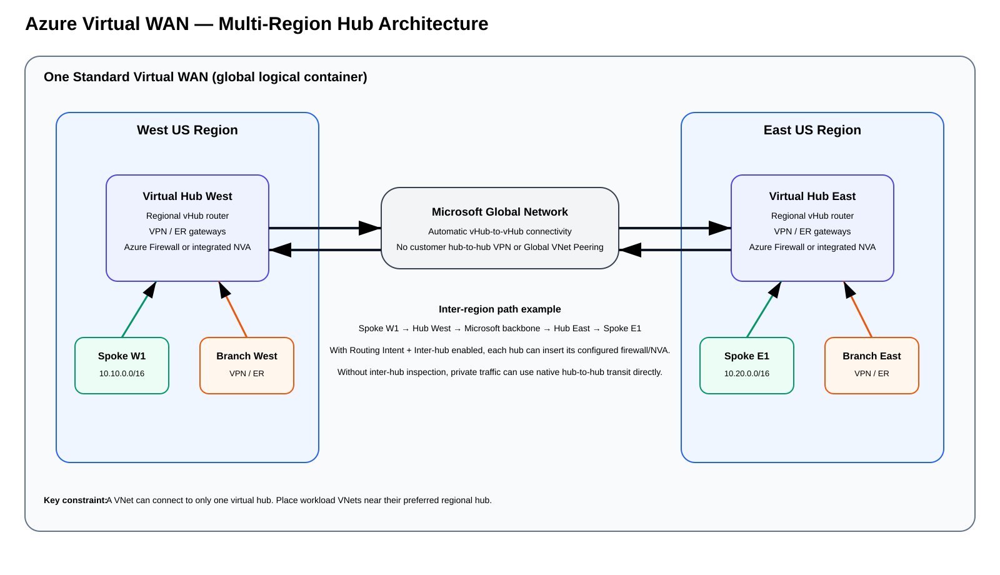

# Azure Virtual WAN Multi-Region Hubs — Deep Dive Expansion for Method 4

> **Scope:** This guide expands **Method 4 — Azure Virtual WAN secured hub with Azure Firewall or integrated NVA** and focuses specifically on how **multiple regional virtual hubs** work inside one Azure Virtual WAN, how inter-hub routes are propagated, how packet forwarding works, and how inspection changes the path.

## Source URLs

- https://learn.microsoft.com/en-us/azure/virtual-wan/virtual-wan-about
- https://learn.microsoft.com/en-us/azure/virtual-wan/hub-settings
- https://learn.microsoft.com/en-us/azure/networking/design-guide/virtual-wan
- https://learn.microsoft.com/en-us/azure/networking/design-guide/multi-region
- https://learn.microsoft.com/en-us/azure/virtual-wan/scenario-any-to-any
- https://learn.microsoft.com/en-us/azure/cloud-adoption-framework/ready/azure-best-practices/virtual-wan-network-topology
- https://learn.microsoft.com/en-us/azure/firewall-manager/secured-virtual-hub
- https://learn.microsoft.com/en-us/azure/firewall-manager/secure-cloud-network
- https://learn.microsoft.com/en-us/security/zero-trust/azure-virtual-wan
- https://learn.microsoft.com/en-us/cli/azure/network/vwan?view=azure-cli-latest
- https://learn.microsoft.com/en-us/cli/azure/network/vhub?view=azure-cli-latest
- https://learn.microsoft.com/en-us/cli/azure/network/vhub/connection?view=azure-cli-latest
- https://learn.microsoft.com/en-us/cli/azure/network/vhub/route-table?view=azure-cli-latest
- https://learn.microsoft.com/en-us/cli/azure/network/vhub/routing-intent?view=azure-cli-latest
- https://learn.microsoft.com/en-us/cli/azure/network/vpn-gateway?view=azure-cli-latest
- https://learn.microsoft.com/en-us/cli/azure/network/express-route/gateway?view=azure-cli-latest
- https://learn.microsoft.com/en-us/cli/azure/network/express-route/gateway/connection?view=azure-cli-latest

## Table of contents

- [1. Short answer](#1-short-answer)
- [2. Multi-region topology](#2-multi-region-topology)
- [3. Global versus regional components](#3-global-versus-regional-components)
- [4. Example two-region design](#4-example-two-region-design)
- [5. What routes does each hub learn?](#5-what-routes-does-each-hub-learn)
- [6. Packet flow — West spoke to East spoke without required inter-hub inspection](#6-packet-flow--west-spoke-to-east-spoke-without-required-inter-hub-inspection)
- [7. Packet flow — West spoke to East spoke with secured inter-hub routing](#7-packet-flow--west-spoke-to-east-spoke-with-secured-inter-hub-routing)
- [8. Why use one hub per region?](#8-why-use-one-hub-per-region)
- [9. More than one hub in the same region](#9-more-than-one-hub-in-the-same-region)
- [10. One VNet cannot attach to two hubs](#10-one-vnet-cannot-attach-to-two-hubs)
- [11. Branches and multiple regional hubs](#11-branches-and-multiple-regional-hubs)
- [12. Branch resiliency and symmetry](#12-branch-resiliency-and-symmetry)
- [13. ExpressRoute in a multi-region vWAN](#13-expressroute-in-a-multi-region-vwan)
- [14. Does every regional hub need its own firewall/NVA?](#14-does-every-regional-hub-need-its-own-firewallnva)
- [15. Routing Intent is a per-hub design decision](#15-routing-intent-is-a-per-hub-design-decision)
- [16. Regional Internet egress](#16-regional-internet-egress)
- [17. Route tables and isolation](#17-route-tables-and-isolation)
- [18. Address overlap remains a problem](#18-address-overlap-remains-a-problem)
- [19. Troubleshooting cross-region traffic](#19-troubleshooting-cross-region-traffic)
- [20. Recommended enterprise pattern](#20-recommended-enterprise-pattern)
- [21. Source information vs explanation vs inference](#21-source-information-vs-explanation-vs-inference)
- [22. Verification checklist](#22-verification-checklist)
- [Sources](#sources)

---

## 1. Short answer

**Yes. Azure Virtual WAN can contain multiple virtual hubs in multiple Azure regions.**

The easiest mental model is:

- **Virtual WAN** = the global logical transit container.
- **Virtual hub (vHub)** = a regional Microsoft-managed transit router/gateway fabric.
- **Standard Virtual WAN** = automatically interconnects the hubs in the same Virtual WAN.
- **Spokes and branches** attach to regional hubs.
- **Hub-to-hub traffic** traverses Microsoft's global network.
- **Routing Intent** determines whether private and/or Internet traffic is inserted into Azure Firewall or a supported NVA.
- A **VNet can connect to only one vHub**.

Microsoft also documents that more than one virtual hub can be created in the same Azure region, although one primary hub per active region is a common design unless scale, isolation, or migration requirements justify more.

### Azure CLI prerequisites

The Virtual WAN command families are provided through the `virtual-wan` extension. Microsoft currently documents Azure CLI `2.55.0` or later for these commands.

```cli
az login
az account set --subscription '<SUBSCRIPTION_ID_OR_NAME>'
az extension add --name virtual-wan --upgrade

RG='rg-network'
VWAN='Corp-vWAN'
HUB_WEST='Hub-West'
HUB_EAST='Hub-East'
WEST_LOCATION='westus'
EAST_LOCATION='eastus'
WEST_PREFIX='10.0.0.0/23'
EAST_PREFIX='10.0.2.0/23'
```

## 2. Multi-region topology



[Editable draw.io version](images/09-05-26-15-56_azure_vwan_multi-region-hubs.drawio)

**What this image shows:** One Standard Virtual WAN contains regional hubs in West US and East US. Each hub has its own regional routing, gateways, and security service. The hubs are automatically interconnected across Microsoft's backbone.

**What matters:** You do not build hub-to-hub IPsec tunnels, Global VNet Peering, or a transit VNet between Virtual WAN hubs in the same Standard Virtual WAN.

**What to verify:** Both hubs belong to the same Standard Virtual WAN, every VNet is connected to the intended hub, address spaces are non-overlapping, and expected remote prefixes appear in effective routes.

## 3. Global versus regional components

| Component | Scope | Key point |
|---|---|---|
| Virtual WAN | Global logical resource | Contains and interconnects vHubs |
| Virtual Hub | Regional | Routing/transit center in one Azure region |
| vHub router | Regional | Performs transit routing for that hub |
| Azure Firewall in secured vHub | Regional | Each secured hub has its own firewall service |
| Integrated NVA | Regional vHub deployment | Partner appliance deployed into a specific supported hub |
| S2S VPN gateway | Regional hub | Terminates VPN sites for that hub |
| ExpressRoute gateway | Regional hub | Connects ExpressRoute circuits to that hub |
| User VPN gateway | Regional hub | Terminates remote-user VPN |
| VNet connection | VNet-to-one-hub | A VNet can attach to only one vHub |
| Hub-to-hub transport | Global | Azure-managed inter-hub connectivity |

The **Virtual WAN is not one giant router in one region**. It is a global service made up of regional transit hubs.

## 4. Example two-region design

```text
Virtual WAN: Corp-vWAN

West US:
  Hub-West
  Spoke-W1: 10.10.0.0/16
  Branch-West: 10.50.0.0/16
  Azure Firewall West

East US:
  Hub-East
  Spoke-E1: 10.20.0.0/16
  Branch-East: 10.60.0.0/16
  Azure Firewall East
```

Conceptually:

```text
                       Corp-vWAN
                 (global logical container)
                           |
          +----------------+----------------+
          |                                 |
          v                                 v
     Hub-West                           Hub-East
      West US                            East US
          |                                 |
   +------+-------+                  +------+-------+
   |              |                  |              |
Spoke-W1      Branch-West         Spoke-E1      Branch-East
10.10/16      10.50/16            10.20/16      10.60/16

          <==== Microsoft backbone ====>
```

### Azure CLI — create the Standard Virtual WAN and two regional hubs

```cli
az network vwan create \
  --resource-group "$RG" \
  --name "$VWAN" \
  --location "$WEST_LOCATION" \
  --type Standard \
  --branch-to-branch-traffic true

az network vhub create \
  --resource-group "$RG" \
  --name "$HUB_WEST" \
  --vwan "$VWAN" \
  --location "$WEST_LOCATION" \
  --address-prefix "$WEST_PREFIX" \
  --sku Standard

az network vhub create \
  --resource-group "$RG" \
  --name "$HUB_EAST" \
  --vwan "$VWAN" \
  --location "$EAST_LOCATION" \
  --address-prefix "$EAST_PREFIX" \
  --sku Standard
```

Verify both hubs:

```cli
az network vhub list \
  --resource-group "$RG" \
  --query "[].{Hub:name,Region:location,Prefix:addressPrefix,State:provisioningState,VirtualWan:virtualWan.id}" \
  --output table
```

**Success criteria:** both hubs show the intended region and prefix, provisioning is `Succeeded`, and both `virtualWan.id` values reference `Corp-vWAN`.

## 5. What routes does each hub learn?

Hub-West locally learns:

```text
10.10.0.0/16 -> Spoke-W1 VNet connection
10.50.0.0/16 -> West branch VPN/ER/SD-WAN connection
```

Hub-East locally learns:

```text
10.20.0.0/16 -> Spoke-E1 VNet connection
10.60.0.0/16 -> East branch VPN/ER/SD-WAN connection
```

In an any-to-any design, inter-hub transit provides remote reachability. Hub-West can learn a path to East-side prefixes through Hub-East, and Hub-East can learn a path to West-side prefixes through Hub-West. You do **not** manually configure BGP neighbors between the vHubs.

### Azure CLI — connect each VNet to its regional hub

Unlike the traditional customer-managed hub-VNet pattern, you do **not** peer a spoke VNet to a managed vHub and you do not configure `allowGatewayTransit` / `useRemoteGateways`. Virtual WAN uses a **HubVirtualNetworkConnection**.

```cli
SPOKE_WEST_VNET='Spoke-W1'
SPOKE_EAST_VNET='Spoke-E1'

SPOKE_WEST_ID=$(az network vnet show \
  --resource-group "$RG" \
  --name "$SPOKE_WEST_VNET" \
  --query id -o tsv)

SPOKE_EAST_ID=$(az network vnet show \
  --resource-group "$RG" \
  --name "$SPOKE_EAST_VNET" \
  --query id -o tsv)

az network vhub connection create \
  --resource-group "$RG" \
  --vhub-name "$HUB_WEST" \
  --name conn-spoke-w1 \
  --remote-vnet "$SPOKE_WEST_ID"

az network vhub connection create \
  --resource-group "$RG" \
  --vhub-name "$HUB_EAST" \
  --name conn-spoke-e1 \
  --remote-vnet "$SPOKE_EAST_ID"
```

Verify placement:

```cli
az network vhub connection list \
  --resource-group "$RG" \
  --vhub-name "$HUB_WEST" \
  --output table

az network vhub connection list \
  --resource-group "$RG" \
  --vhub-name "$HUB_EAST" \
  --output table
```

### Azure CLI — inspect effective inter-hub routing

```cli
WEST_DEFAULT_RT=$(az network vhub route-table show \
  --resource-group "$RG" \
  --vhub-name "$HUB_WEST" \
  --name defaultRouteTable \
  --query id -o tsv)

EAST_DEFAULT_RT=$(az network vhub route-table show \
  --resource-group "$RG" \
  --vhub-name "$HUB_EAST" \
  --name defaultRouteTable \
  --query id -o tsv)

az network vhub get-effective-routes \
  --resource-group "$RG" \
  --name "$HUB_WEST" \
  --resource-type RouteTable \
  --resource-id "$WEST_DEFAULT_RT" \
  --output table

az network vhub get-effective-routes \
  --resource-group "$RG" \
  --name "$HUB_EAST" \
  --resource-type RouteTable \
  --resource-id "$EAST_DEFAULT_RT" \
  --output table
```

**Success criteria:** Hub-West has reachability for East-side prefixes such as `10.20.0.0/16`, and Hub-East has reachability for West-side prefixes such as `10.10.0.0/16`, subject to route-table association/propagation and security policy.

## 6. Packet flow — West spoke to East spoke without required inter-hub inspection

Source: `VM-W = 10.10.1.10`

Destination: `VM-E = 10.20.1.20`

```text
VM-W
  |
  v
Spoke-W1
  |
  | VNet connection
  v
Hub-West vHub router
  |
  | native Azure-managed inter-hub path
  v
Microsoft global backbone
  |
  v
Hub-East vHub router
  |
  | route to 10.20.0.0/16
  v
Spoke-E1
  |
  v
VM-E
```

Return traffic follows the corresponding East-to-West path.

### Critical security point

**Deploying Azure Firewall into Hub-West and Hub-East does not by itself prove that this flow is inspected.**

Virtual WAN has native hub-to-hub transit. If the security requirement says cross-hub private traffic must be inspected, explicitly configure Routing Intent and the Inter-hub behavior and verify the effective routes and firewall logs.

## 7. Packet flow — West spoke to East spoke with secured inter-hub routing

Conceptually, with Private Traffic Routing Intent and inter-hub inspection enabled:

```text
VM-W
  |
  v
Hub-West routing fabric
  |
  | Private Traffic policy
  v
Azure Firewall West / supported NVA
  |
  v
Hub-West routing fabric
  |
  | Microsoft backbone / vWAN inter-hub
  v
Hub-East routing fabric
  |
  | Private Traffic policy
  v
Azure Firewall East / supported NVA
  |
  v
Hub-East routing fabric
  |
  v
VM-E
```

The precise internal forwarding implementation is Microsoft-managed. The operational requirement is that the configured Routing Intent produces the intended security insertion in the cross-region path.

## 8. Why use one hub per region?

A common pattern is:

```text
West US workloads    -> Hub-West
Central US workloads -> Hub-Central
East US workloads    -> Hub-East
Europe workloads     -> Hub-Europe
```

Reasons include lower latency to the first transit/security hop, local VPN or ExpressRoute termination near branches, regional Internet breakout, regional firewall/NVA scaling, smaller failure domains, and simpler landing-zone placement.

## 9. More than one hub in the same region

Microsoft documents that multiple virtual hubs can be created in the same Azure region. Possible reasons include scale boundaries, administrative separation, migration, or different connectivity/security domains. Do not create extra hubs without a concrete requirement; one hub is operationally simpler when it satisfies scale and isolation requirements.

## 10. One VNet cannot attach to two hubs

This is one of the most important constraints.

Valid:

```text
Spoke-West -> Hub-West
Spoke-East -> Hub-East
```

Not a dual-homing design:

```text
                  +-> Hub-West
Shared-VNet ------|
                  +-> Hub-East
```

A VNet can connect to only one Virtual WAN hub. If an application needs regional resilience, use separate regional VNets and application replication/failover rather than trying to attach one VNet to multiple vHubs.

### Azure CLI — inspect an existing VNet connection

```cli
az network vhub connection show \
  --resource-group "$RG" \
  --vhub-name "$HUB_WEST" \
  --name conn-spoke-w1 \
  --query "{Connection:name,RemoteVnet:remoteVirtualNetwork.id,State:provisioningState}" \
  --output yaml
```

Before attempting a second attachment, inventory connections across the relevant hubs and confirm the VNet is not already connected elsewhere.

## 11. Branches and multiple regional hubs

Branches can follow a regional strategy:

```text
Los Angeles branches -> Hub-West
Dallas branches      -> Hub-Central
New York branches    -> Hub-East
```

A Los Angeles branch can reach an East US application through:

```text
LA Branch -> Hub-West -> vWAN inter-hub -> Hub-East -> East application VNet
```

The branch does not need a direct tunnel to every application region.

### Azure CLI — create regional Virtual WAN S2S VPN gateways

```cli
az network vpn-gateway create \
  --resource-group "$RG" \
  --name vpn-gw-west \
  --vhub "$HUB_WEST" \
  --location "$WEST_LOCATION"

az network vpn-gateway create \
  --resource-group "$RG" \
  --name vpn-gw-east \
  --vhub "$HUB_EAST" \
  --location "$EAST_LOCATION"
```

Verify regional placement:

```cli
az network vpn-gateway show \
  --resource-group "$RG" \
  --name vpn-gw-west \
  --query "{Name:name,Region:location,VirtualHub:virtualHub.id,State:provisioningState}" \
  --output yaml

az network vpn-gateway show \
  --resource-group "$RG" \
  --name vpn-gw-east \
  --query "{Name:name,Region:location,VirtualHub:virtualHub.id,State:provisioningState}" \
  --output yaml
```

## 12. Branch resiliency and symmetry

If the same branch prefix is reachable through multiple hubs, validate route preference and firewall symmetry carefully.

Example problem:

```text
Forward:
Spoke-East -> Hub-East -> Firewall-East -> Hub-West -> Branch

Return:
Branch -> Hub-West -> Firewall-West -> Hub-East -> Spoke-East
```

If the two firewalls do not share the required state, the session can fail. Multi-hub reachability is not the same as guaranteed stateful symmetry.

## 13. ExpressRoute in a multi-region vWAN

Each regional hub can contain an ExpressRoute gateway. Decide which hubs require ExpressRoute based on circuit peering location, latency, resiliency, cost, and failure-domain goals.

```text
On-prem DC-West
      |
ExpressRoute Circuit
      |
      v
Hub-West
      |
      | vWAN hub-to-hub
      v
Hub-East
      |
      v
East application VNet
```

Do not confuse this with **ExpressRoute Global Reach**. Virtual WAN hub-to-hub transit connects networks participating in vWAN; Global Reach connects on-premises networks through ExpressRoute circuits.

### Azure CLI — create vWAN ExpressRoute gateways

```cli
az network express-route gateway create \
  --resource-group "$RG" \
  --name er-gw-west \
  --virtual-hub "$HUB_WEST" \
  --min-val 2

az network express-route gateway create \
  --resource-group "$RG" \
  --name er-gw-east \
  --virtual-hub "$HUB_EAST" \
  --min-val 2
```

Verify:

```cli
az network express-route gateway show \
  --resource-group "$RG" \
  --name er-gw-west \
  --output yaml

az network express-route gateway show \
  --resource-group "$RG" \
  --name er-gw-east \
  --output yaml
```

### Azure CLI — connect an ExpressRoute circuit to the regional vHub gateway

```cli
ER_CIRCUIT='er-circuit-west'

ER_PEERING_ID=$(az network express-route peering show \
  --resource-group "$RG" \
  --circuit-name "$ER_CIRCUIT" \
  --name AzurePrivatePeering \
  --query id -o tsv)

az network express-route gateway connection create \
  --resource-group "$RG" \
  --gateway-name er-gw-west \
  --name erconn-west \
  --peering "$ER_PEERING_ID"
```

The current CLI also supports `--associated-route-table`, `--propagated-route-tables`, `--labels`, inbound/outbound route maps, and routing weight on the ExpressRoute gateway connection.

Verification:

```cli
az network express-route gateway connection show \
  --resource-group "$RG" \
  --gateway-name er-gw-west \
  --name erconn-west \
  --output yaml

az network express-route gateway get-resiliency-information \
  --resource-group "$RG" \
  --name er-gw-west \
  --output yaml
```

Microsoft's current CLI also exposes GA vWAN ExpressRoute-gateway route-information and failover-test operations, which are useful for planned resiliency validation.

## 14. Does every regional hub need its own firewall/NVA?

If you want regional secured-hub inspection, the typical design is one local security provider per secured hub:

```text
Hub-West -> Azure Firewall West
Hub-East -> Azure Firewall East
Hub-Europe -> Azure Firewall Europe
```

This supports local VNet-to-VNet inspection, branch-to-VNet inspection, and regional Internet egress without sending ordinary local traffic across a distant region.

A design with one centralized firewall hub can be created for specific requirements, but do not assume remote hubs automatically hairpin all traffic to it.

## 15. Routing Intent is a per-hub design decision

For every secured hub verify:

- **Internet Traffic** next hop;
- **Private Traffic** next hop;
- **Inter-hub** setting;
- Private Traffic Prefixes;
- security-provider health.

| Hub | Private | Internet | Inter-hub |
|---|---|---|---|
| Hub-West | Azure Firewall | Azure Firewall | Enabled |
| Hub-East | Azure Firewall | Azure Firewall | Enabled |
| Hub-Europe | Azure Firewall | Azure Firewall | Disabled |

### Azure CLI — configure Routing Intent independently in each hub

`az network vhub routing-intent` is currently marked **Preview** in the Azure CLI reference. The underlying Routing Intent feature is a core secured-hub capability; this Preview label applies to the CLI command group.

```cli
FW_WEST_ID=$(az network firewall show \
  --resource-group "$RG" \
  --name azfw-west \
  --query id -o tsv)

FW_EAST_ID=$(az network firewall show \
  --resource-group "$RG" \
  --name azfw-east \
  --query id -o tsv)

az network vhub routing-intent create \
  --resource-group "$RG" \
  --vhub "$HUB_WEST" \
  --name routing-intent-west \
  --routing-policies "[{name:InternetTraffic,destinations:[Internet],next-hop:$FW_WEST_ID},{name:PrivateTrafficPolicy,destinations:[PrivateTraffic],next-hop:$FW_WEST_ID}]"

az network vhub routing-intent create \
  --resource-group "$RG" \
  --vhub "$HUB_EAST" \
  --name routing-intent-east \
  --routing-policies "[{name:InternetTraffic,destinations:[Internet],next-hop:$FW_EAST_ID},{name:PrivateTrafficPolicy,destinations:[PrivateTraffic],next-hop:$FW_EAST_ID}]"
```

Verify both:

```cli
az network vhub routing-intent show \
  --resource-group "$RG" \
  --vhub "$HUB_WEST" \
  --name routing-intent-west \
  --output yaml

az network vhub routing-intent show \
  --resource-group "$RG" \
  --vhub "$HUB_EAST" \
  --name routing-intent-east \
  --output yaml
```

**Success criteria:** each hub references its intended regional security provider for `Internet` and/or `PrivateTraffic`.

**Important:** do not invent a CLI flag for every Firewall Manager GUI control. In particular, validate the current automation surface for **Inter-hub** and custom **Private Traffic Prefixes** rather than assuming those GUI controls map to undocumented CLI switches.

## 16. Regional Internet egress

A common design keeps egress regional:

```text
Spoke-West -> Hub-West -> Firewall-West -> Internet
Spoke-East -> Hub-East -> Firewall-East -> Internet
```

This generally shortens the path and keeps public-IP identity, policy, logging, and failure domains regional.

### Azure CLI — enable Internet security on the regional VNet connection

```cli
az network vhub connection update \
  --resource-group "$RG" \
  --vhub-name "$HUB_WEST" \
  --name conn-spoke-w1 \
  --internet-security true
```

Verify the property and then the effective route:

```cli
az network vhub connection show \
  --resource-group "$RG" \
  --vhub-name "$HUB_WEST" \
  --name conn-spoke-w1 \
  --output yaml

WEST_CONN_ID=$(az network vhub connection show \
  --resource-group "$RG" \
  --vhub-name "$HUB_WEST" \
  --name conn-spoke-w1 \
  --query id -o tsv)

az network vhub get-effective-routes \
  --resource-group "$RG" \
  --name "$HUB_WEST" \
  --resource-type HubVirtualNetworkConnection \
  --resource-id "$WEST_CONN_ID" \
  --output table
```

**Success criterion:** the effective forwarding view contains the intended secured default-route behavior; setting the property alone is not sufficient proof.

## 17. Route tables and isolation

Automatic inter-hub transport does not mean every logical network must communicate with every other network. Route-table associations and propagations can create segmentation.

Remember:

```text
Association = which vHub route table a connection LOOKS UP routes in.
Propagation = which vHub route tables RECEIVE routes from that connection.
```

### Azure CLI — inspect route tables

```cli
az network vhub route-table list \
  --resource-group "$RG" \
  --vhub-name "$HUB_WEST" \
  --output table

az network vhub route-table list \
  --resource-group "$RG" \
  --vhub-name "$HUB_EAST" \
  --output table
```

Create a deliberately isolated route table when the design requires it:

```cli
az network vhub route-table create \
  --resource-group "$RG" \
  --vhub-name "$HUB_WEST" \
  --name rt-west-isolated
```

The VNet-connection CLI supports route-table association/propagation and labels. For example:

```cli
WEST_ISO_RT_ID=$(az network vhub route-table show \
  --resource-group "$RG" \
  --vhub-name "$HUB_WEST" \
  --name rt-west-isolated \
  --query id -o tsv)

az network vhub connection update \
  --resource-group "$RG" \
  --vhub-name "$HUB_WEST" \
  --name conn-spoke-w1 \
  --associated-route-table "$WEST_ISO_RT_ID" \
  --propagated-route-tables "$WEST_ISO_RT_ID" \
  --labels west-isolated
```

When Routing Intent is also enforcing secured traffic classes, keep custom route-table segmentation simple and verify effective routes after every change.

## 18. Address overlap remains a problem

Automatic global transit does not solve duplicate CIDRs.

Avoid designs such as:

```text
West VNet: 10.10.0.0/16
East VNet: 10.10.0.0/16
```

unless a deliberate, documented NAT/isolation design handles the overlap. A scalable enterprise IP plan should reserve non-overlapping regional blocks.

## 19. Troubleshooting cross-region traffic

For a West-to-East application flow, check in this order:

1. Hub-West Security Configuration.
2. Hub-East Security Configuration.
3. Hub-West effective routes.
4. Hub-East effective routes.
5. Spoke-West effective routes.
6. Spoke-East effective routes.
7. West firewall/NVA session and logs.
8. East firewall/NVA session and logs.
9. Return-path route.
10. Conflicting UDRs in either spoke.
11. Branch BGP route preference if a branch is involved.

### Azure CLI — repeatable troubleshooting chain

```cli
# Hub state
az network vhub show -g "$RG" -n "$HUB_WEST" -o yaml
az network vhub show -g "$RG" -n "$HUB_EAST" -o yaml

# VNet connections
az network vhub connection list -g "$RG" --vhub-name "$HUB_WEST" -o table
az network vhub connection list -g "$RG" --vhub-name "$HUB_EAST" -o table

# Route tables
az network vhub route-table list -g "$RG" --vhub-name "$HUB_WEST" -o table
az network vhub route-table list -g "$RG" --vhub-name "$HUB_EAST" -o table

# Routing Intent, where used (Preview CLI group)
az network vhub routing-intent list -g "$RG" --vhub "$HUB_WEST" -o yaml
az network vhub routing-intent list -g "$RG" --vhub "$HUB_EAST" -o yaml
```

Inspect the workload NICs themselves:

```cli
az network nic show-effective-route-table \
  --resource-group '<WEST_WORKLOAD_RG>' \
  --name '<WEST_WORKLOAD_NIC>' \
  --output table

az network nic show-effective-route-table \
  --resource-group '<EAST_WORKLOAD_RG>' \
  --name '<EAST_WORKLOAD_NIC>' \
  --output table
```

Test one real destination with Network Watcher:

```cli
az network watcher show-next-hop \
  --resource-group '<WEST_WORKLOAD_RG>' \
  --vm '<WEST_VM>' \
  --nic '<WEST_WORKLOAD_NIC>' \
  --source-ip 10.10.1.10 \
  --dest-ip 10.20.1.20 \
  --output table
```

**Success criteria:** both regions have the expected remote-prefix reachability, Routing Intent is consistent with the security requirement, and there is no workload UDR that bypasses the secured path.

A useful verification rule remains:

```text
Firewall exists
+ Private Traffic Routing Intent configured
+ Inter-hub enabled when required
+ effective routes verified
+ firewall logs show both directions
= evidence that the intended secured cross-region path is active
```

## 20. Recommended enterprise pattern

```text
                         STANDARD VIRTUAL WAN
                           global transit
                                |
          +---------------------+---------------------+
          |                     |                     |
          v                     v                     v
      HUB-WEST             HUB-CENTRAL            HUB-EAST
       West US              Central US             East US
          |                     |                     |
      Firewall-W            Firewall-C            Firewall-E
          |                     |                     |
     West spokes          Central spokes          East spokes
          |                     |                     |
     West branches        Central branches        East branches
          \_____________________|_____________________/
                       Microsoft backbone
```

Recommended principles:

- use a hub near the workloads it primarily serves;
- use local security services in each secured region;
- connect each VNet to one intended hub;
- terminate branches regionally where practical;
- rely on Azure-managed hub-to-hub transit;
- enable Routing Intent for required traffic classes;
- enable **Inter-hub** when cross-hub inspection is required;
- maintain a non-overlapping global address plan;
- verify effective routes in both regions;
- test stateful symmetry during steady state and failure.

## 21. Source information vs explanation vs inference

**Source information:** Microsoft documents regional vHubs, multiple hubs in a Virtual WAN, automatic hub-to-hub connectivity in Standard Virtual WAN, the one-VNet-to-one-vHub constraint, any-to-any transit, and Routing Intent requirements for secured inter-hub paths. Microsoft also documents CLI surfaces for vWAN/vHub creation, VNet connections, route tables, Virtual WAN VPN/ExpressRoute gateways, ExpressRoute gateway connections, and Routing Intent.

**Additional explanation:** The route tables, packet walks, and CLI verification sequences above translate those service behaviors into a network-engineering and operations model.

**Reasonable inference:** The ideal number and placement of hubs depends on workload geography, branch geography, latency, throughput, security architecture, failure domains, organizational boundaries, and cost. There is no universal rule that every Azure region used by an organization must have a vHub.

## 22. Verification checklist

- [ ] Virtual WAN is **Standard**.
- [ ] Required regional hubs exist.
- [ ] All hubs belong to the intended Virtual WAN.
- [ ] Each VNet connects to one intended vHub using a HubVirtualNetworkConnection.
- [ ] No one is trying to use VNet-peering gateway-transit flags between a spoke and the managed vHub.
- [ ] Regional address spaces do not overlap.
- [ ] Local prefixes are learned in their regional hub.
- [ ] Remote prefixes appear through inter-hub transit.
- [ ] Routing Intent is configured in every secured hub that requires it.
- [ ] Private Traffic policy is correct.
- [ ] Internet Traffic policy is correct.
- [ ] Inter-hub inspection is enabled where required.
- [ ] Route-table associations and propagations match the intended segmentation model.
- [ ] Regional VPN/ExpressRoute gateways are attached to the intended vHub.
- [ ] No spoke UDR bypasses the intended secured path.
- [ ] Firewall/NVA logs show expected forward and return traffic.
- [ ] Branch BGP route preferences are understood.
- [ ] ExpressRoute resiliency/failover behavior has been tested where applicable.
- [ ] Cross-region failover behavior has been tested.

## Sources

1. Microsoft Learn — Azure Virtual WAN overview  
   https://learn.microsoft.com/en-us/azure/virtual-wan/virtual-wan-about
2. Microsoft Learn — About virtual hub settings  
   https://learn.microsoft.com/en-us/azure/virtual-wan/hub-settings
3. Microsoft Learn — Azure Virtual WAN network topology  
   https://learn.microsoft.com/en-us/azure/networking/design-guide/virtual-wan
4. Microsoft Learn — Multi-region network design  
   https://learn.microsoft.com/en-us/azure/networking/design-guide/multi-region
5. Microsoft Learn — Virtual WAN any-to-any scenario  
   https://learn.microsoft.com/en-us/azure/virtual-wan/scenario-any-to-any
6. Microsoft Learn — Virtual WAN network topology in an Azure landing zone  
   https://learn.microsoft.com/en-us/azure/cloud-adoption-framework/ready/azure-best-practices/virtual-wan-network-topology
7. Microsoft Learn — What is a secured virtual hub?  
   https://learn.microsoft.com/en-us/azure/firewall-manager/secured-virtual-hub
8. Microsoft Learn — Secure your virtual hub using Azure Firewall Manager  
   https://learn.microsoft.com/en-us/azure/firewall-manager/secure-cloud-network
9. Microsoft Learn — Apply Zero Trust principles to Azure Virtual WAN  
   https://learn.microsoft.com/en-us/security/zero-trust/azure-virtual-wan
10. Microsoft Learn — Azure CLI: `az network vwan`  
    https://learn.microsoft.com/en-us/cli/azure/network/vwan?view=azure-cli-latest
11. Microsoft Learn — Azure CLI: `az network vhub`  
    https://learn.microsoft.com/en-us/cli/azure/network/vhub?view=azure-cli-latest
12. Microsoft Learn — Azure CLI: `az network vhub connection`  
    https://learn.microsoft.com/en-us/cli/azure/network/vhub/connection?view=azure-cli-latest
13. Microsoft Learn — Azure CLI: vHub route tables  
    https://learn.microsoft.com/en-us/cli/azure/network/vhub/route-table?view=azure-cli-latest
14. Microsoft Learn — Azure CLI: Routing Intent  
    https://learn.microsoft.com/en-us/cli/azure/network/vhub/routing-intent?view=azure-cli-latest
15. Microsoft Learn — Azure CLI: Virtual WAN VPN Gateway  
    https://learn.microsoft.com/en-us/cli/azure/network/vpn-gateway?view=azure-cli-latest
16. Microsoft Learn — Azure CLI: Virtual WAN ExpressRoute Gateway  
    https://learn.microsoft.com/en-us/cli/azure/network/express-route/gateway?view=azure-cli-latest
17. Microsoft Learn — Azure CLI: ExpressRoute Gateway connection  
    https://learn.microsoft.com/en-us/cli/azure/network/express-route/gateway/connection?view=azure-cli-latest
