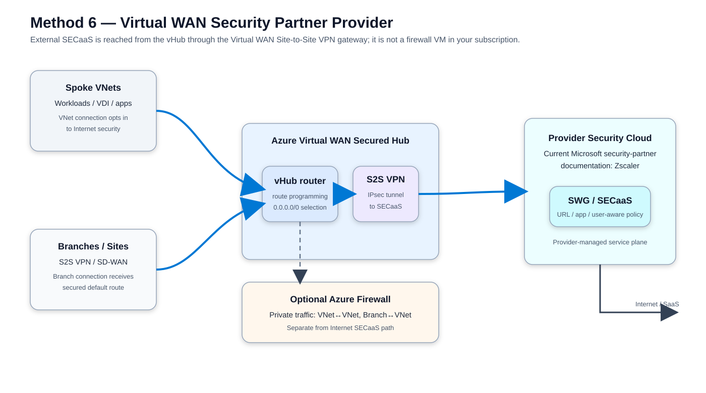
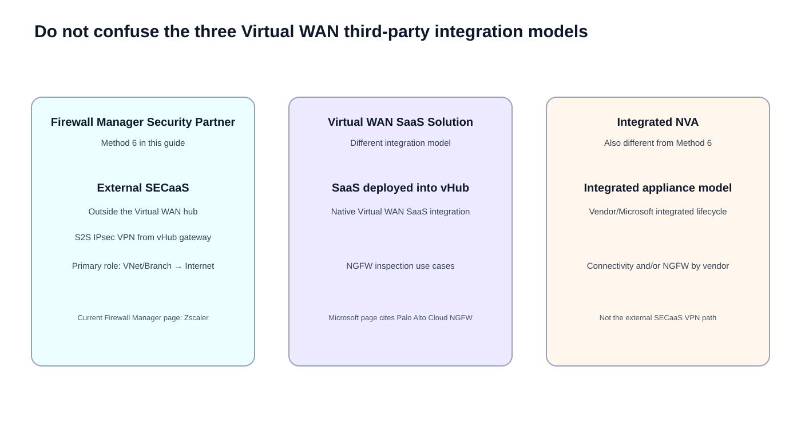
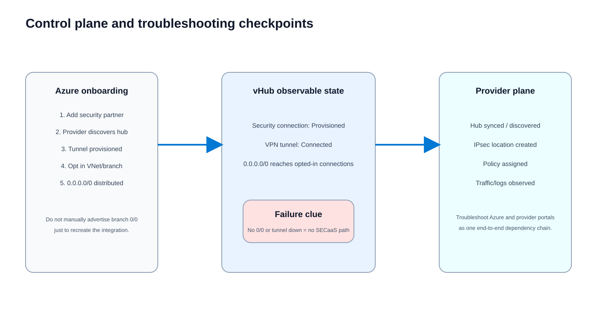
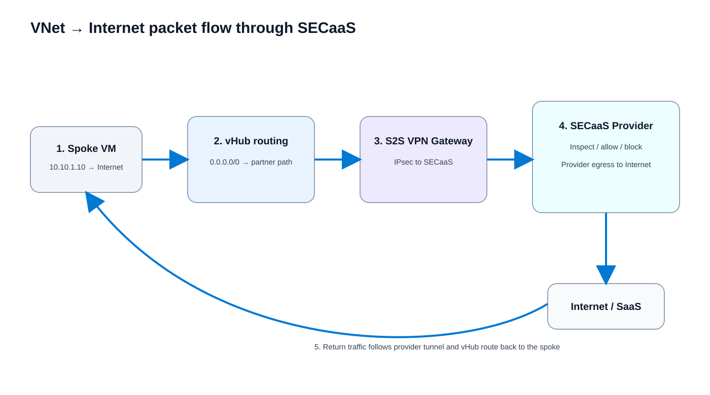
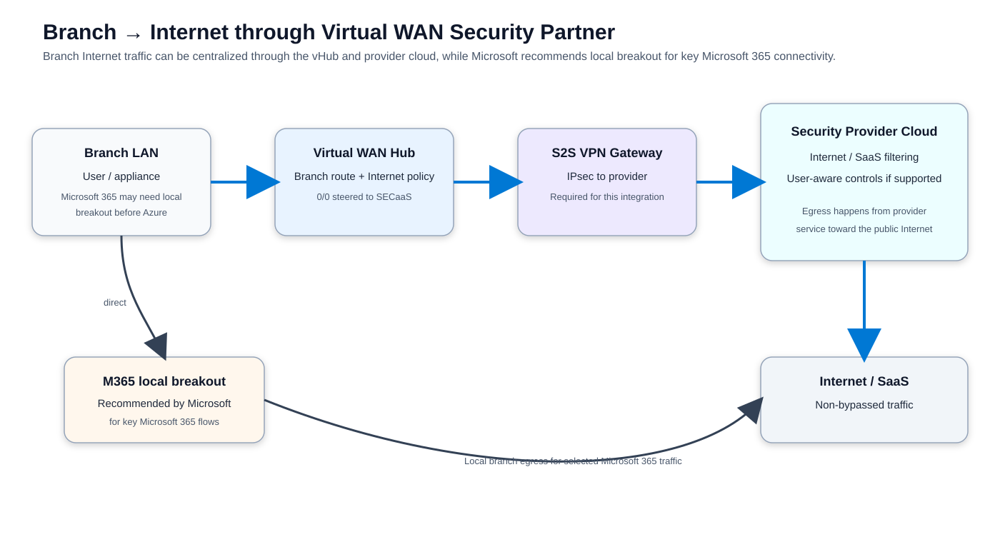
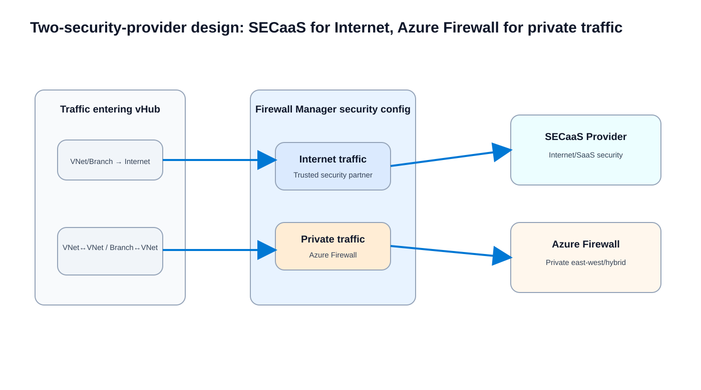

# Azure Virtual WAN Security SaaS Provider — Method 6 Deep Dive

> **Scope:** Azure Virtual WAN + Azure Firewall Manager **Security Partner Provider** integration for Internet/SaaS inspection.  
> **Important naming note:** Microsoft uses **Security Partner Provider** / **Security as a Service (SECaaS)** for this model. It is **not the same** as a third-party firewall VM, an Integrated NVA, or a SaaS NGFW deployed directly into the Virtual WAN hub.

## URLs reviewed

### Primary Microsoft documentation

- https://learn.microsoft.com/en-us/azure/firewall-manager/trusted-security-partners
- https://learn.microsoft.com/en-us/azure/firewall-manager/deploy-trusted-security-partner
- https://learn.microsoft.com/en-us/azure/firewall-manager/overview
- https://learn.microsoft.com/en-us/azure/virtual-wan/third-party-integrations
- https://learn.microsoft.com/en-us/azure/virtual-wan/virtual-wan-about
- https://learn.microsoft.com/en-us/azure/networking/design-guide/virtual-wan
- https://learn.microsoft.com/en-us/azure/architecture/networking/architecture/hub-spoke-virtual-wan-architecture
- https://learn.microsoft.com/en-us/rest/api/virtualwan/supported-security-providers/supported-security-providers?view=rest-virtualwan-2025-05-01

### Provider documentation

- https://help.zscaler.com/zia/integrating-microsoft-azure-virtual-wan
- https://help.zscaler.com/zia/about-partner-integrations

---

## 1. Executive summary

**Source information:** Azure Firewall Manager can connect a Virtual WAN secured hub to a supported third-party SECaaS provider for **VNet-to-Internet (V2I)** and **Branch-to-Internet (B2I)** filtering. Azure automates route management so selected hub connections can receive a secured default route without the normal requirement to build spoke-subnet UDRs for this service insertion.

The most important architectural fact is that the Security Partner Provider infrastructure is **not a firewall VM inside your subscription or VNet**. In this model, the security service remains provider-hosted and the Azure Virtual WAN hub reaches it through the hub's **Site-to-Site (S2S) VPN Gateway** over IPsec.

**Current support note:** Microsoft's current dedicated Firewall Manager pages list **Zscaler** as the current Security Partner Provider. An older Virtual WAN third-party-integration page still names Check Point, iboss, and Zscaler. Because those Microsoft pages conflict, use the current Firewall Manager documentation plus the live `supportedSecurityProviders` API for your actual Virtual WAN as the deployment-time source of truth.

**Additional explanation:** Think of Method 6 as **route-based redirection to an external cloud security service**. Azure Virtual WAN supplies transit and route programming; the hub S2S VPN gateway supplies the service tunnel; the provider supplies the Internet/SaaS inspection and provider-side egress.

---

## 2. Architecture: what is actually inserted



[Editable draw.io diagram](images/09-05-26-16-44_method6_architecture.drawio)

**What this image shows:** Spoke VNets and branches converge on a Virtual WAN hub. Internet traffic is selected by the secured-hub configuration and forwarded to the provider through the vHub S2S VPN gateway.

**What matters:** SECaaS is **external to the vHub**. Microsoft explicitly states that Security Partner Providers connect through VPN Gateway tunnels and that deleting the VPN Gateway breaks those connections.

**What to verify:** Hub provisioned state, provider security connection, S2S tunnel state, VNet/branch Internet-security opt-in, secured `0.0.0.0/0` route behavior, and provider traffic logs.

### Layer and plane placement

| Area | Role in Method 6 |
|---|---|
| Layer 2 | No customer-controlled L2 insertion. Virtual WAN is routed transit. |
| Layer 3 | Service insertion is route-driven, primarily around `0.0.0.0/0` for Internet traffic. |
| Control plane | Firewall Manager / Virtual WAN programs secured routing; provider onboarding synchronizes hub information and tunnel configuration. |
| Data plane | Packet traverses vHub routing → S2S VPN Gateway → IPsec → provider service → Internet/SaaS. |
| Security policy plane | Internet security rules are configured in the provider's management plane. |
| Optional private firewall | Azure Firewall can inspect private traffic while SECaaS owns Internet traffic. |

---

## 3. Do not confuse three Virtual WAN third-party integration models



[Editable draw.io diagram](images/09-05-26-16-44_method6_integration_model_comparison.drawio)

**What this image shows:** Microsoft documents Integrated NVAs, SaaS solutions deployed into the vHub, and Firewall Manager Security Partner Providers as distinct models.

**What matters:** Method 6 is specifically the **Firewall Manager Security Partner Provider** architecture. A product described as a “SaaS firewall” is not automatically using this integration model.

**What to verify:** Confirm the vendor's exact Virtual WAN integration class before carrying over routing, HA, licensing, NAT, scale, or traffic-class assumptions.

| Model | Where security runs | Attachment | Typical purpose |
|---|---|---|---|
| Firewall Manager Security Partner Provider | Provider-hosted SECaaS outside vHub | S2S IPsec VPN from vHub | VNet/Branch Internet and SaaS filtering |
| Virtual WAN SaaS solution | SaaS security solution deployed directly into vHub model | Native Virtual WAN SaaS integration | NGFW inspection; Microsoft currently cites Palo Alto Networks Cloud NGFW |
| Integrated NVA | Integrated appliance in Virtual WAN hub architecture | Microsoft/vendor integrated lifecycle | Connectivity and/or NGFW depending on vendor |

---

## 4. Prerequisites and dependencies

**Source information:** Microsoft's deployment procedure tells you to include a **VPN Gateway** when enabling Security Partner Providers. The partner integration depends on that gateway for its tunnels.

Minimum design dependencies:

1. Azure Virtual WAN with a compatible Standard virtual hub.
2. A Virtual WAN **S2S VPN Gateway** in the hub.
3. A currently supported Security Partner Provider for the environment.
4. Provider subscription/entitlement and tenant.
5. Microsoft Entra credentials/information required by the provider integration workflow.
6. Successful provider discovery/synchronization of the Azure vHub.
7. Provider tunnel status **Connected**.
8. Firewall Manager security configuration selecting the provider for Internet traffic.
9. Explicit VNet and/or branch connection opt-in for secured Internet routing.
10. Provider-side policy that permits the desired traffic.

### Why the S2S VPN Gateway is mandatory

**Source information:** Security Partner Providers connect to the hub using VPN Gateway tunnels. Microsoft warns that deleting the gateway removes the provider connections.

**Additional explanation:** This is one of the easiest ways to distinguish Method 6 from a SaaS NGFW directly deployed into the Virtual WAN hub.

---

## 5. Control plane: how the secured default route appears

The key routing question is: **how does a spoke or branch learn that Internet traffic must go to SECaaS?**

Microsoft documents that:

- The security-partner deployment causes a `0.0.0.0/0` default-route relationship to be created toward the secured service path.
- Merely connecting the provider does **not** automatically mean every VNet/site receives that default route.
- You select which connections are secured/opted in.
- Microsoft specifically warns **not to manually advertise `0.0.0.0/0` over BGP from branches** just to force this behavior, because doing so can interfere with the security-provider deployment.



[Editable draw.io diagram](images/09-05-26-16-44_method6_control_plane_troubleshooting.drawio)

**What this image shows:** Provider onboarding, tunnel establishment, route distribution, and the observability points on both Azure and provider sides.

**What matters:** A healthy packet path is impossible if the control plane never distributes the secured default route.

**What to verify:** Azure security-connection state, VPN tunnel state, connection Internet-security setting, effective route behavior, provider hub synchronization, provider location/tunnel object, policy attachment, and provider logs.

### Simulated route example

The following is explanatory, not vendor command output:

```text
Workload: 10.10.1.10
Destination: 8.8.8.8

More-specific private route: no match
Default route: 0.0.0.0/0
Selected path: Virtual WAN secured Internet path
Service next hop: Security Partner Provider
Transport from vHub to provider: S2S VPN Gateway / IPsec
```

---

## 6. VNet-to-Internet packet flow — minute detail



[Editable draw.io diagram](images/09-05-26-16-44_method6_vnet_internet_packet_flow.drawio)

**What this image shows:** An Azure workload reaching a public destination through the external SECaaS provider.

**What matters:** The vHub does not host the SECaaS firewall in Method 6. It routes to the VPN gateway/provider tunnel after choosing the secured Internet path.

**What to verify:** Secured default route, lack of unintended bypass, tunnel status, provider logs, policy action, and return traffic.

### Packet walk

1. A workload, for example `10.10.1.10`, opens a connection to a public destination.
2. The workload/VNet route lookup uses the Virtual WAN-connected path for Internet traffic.
3. The vHub sees the Internet destination and uses the secured default path selected by Firewall Manager.
4. The vHub forwards the packet to its S2S VPN gateway.
5. The gateway encrypts the traffic into the IPsec service tunnel toward the provider.
6. The provider receives the packet and applies its Internet/SaaS security policy.
7. Depending on provider capability and licensing, inspection can include SWG policy, URL categorization, application controls, user-aware controls, threat inspection, and TLS inspection.
8. If allowed, the provider sends the connection toward the Internet/SaaS destination.
9. Return traffic reaches the provider service edge.
10. Provider state/routing returns the packet through the Azure service tunnel.
11. The S2S VPN gateway decapsulates it and returns it to vHub routing.
12. The vHub forwards it to the originating spoke VNet.

### NAT consideration

**Source information:** Microsoft documents the route/service integration but does not define one universal SECaaS public-source-NAT behavior for all partners.

**Reasonable inference:** The public source IP visible to the Internet is provider-specific. Do not assume it is an Azure Firewall public IP or the original workload IP. Validate provider egress/NAT behavior and test the observed public source address.

---

## 7. Branch-to-Internet packet flow



[Editable draw.io diagram](images/09-05-26-16-44_method6_branch_internet_packet_flow.drawio)

**What this image shows:** A branch uses Azure Virtual WAN as transit and sends non-bypassed Internet traffic from its regional hub to SECaaS.

**What matters:** Microsoft recommends direct/local breakout for key Microsoft 365 traffic rather than hairpinning those flows through an Azure secured hub.

**What to verify:** Branch routing, hub association, secured default route receipt, local M365 breakout policy, provider tunnel health, service-edge selection, and provider logs.

### Branch packet walk

1. Branch client initiates an Internet flow.
2. Branch SD-WAN/router sends non-locally-broken-out traffic to its Azure Virtual WAN connectivity path.
3. Traffic enters the regional vHub.
4. Secured Internet routing selects the Security Partner Provider.
5. vHub forwards to the S2S VPN gateway.
6. IPsec carries traffic to the provider cloud.
7. Provider applies security policy and egresses permitted traffic.
8. Return traffic follows provider state/routing back through the tunnel and vHub to the branch.

### Microsoft 365 handling

Microsoft's security-partner guidance recommends that globally distributed branches send key Microsoft 365 connectivity **directly and locally** to the Microsoft network before steering remaining Internet traffic through the Azure secured hub. The rationale is latency, performance, and the characteristics of encrypted Microsoft 365 connections.

---

## 8. Two-security-provider design: SECaaS for Internet, Azure Firewall for private traffic



[Editable draw.io diagram](images/09-05-26-16-44_method6_dual_provider_split.drawio)

**What this image shows:** The supported split in which the Security Partner Provider handles Internet/SaaS traffic while Azure Firewall handles private traffic.

**What matters:** This is a **traffic-class split**, not arbitrary per-prefix chaining between unrelated firewall products.

**What to verify:** Firewall Manager security configuration assigns Internet traffic to the trusted provider and private traffic to Azure Firewall.

| Flow | Typical inspection owner in this design |
|---|---|
| Spoke VNet → Internet | Security Partner Provider |
| Branch → Internet | Security Partner Provider |
| Spoke VNet → Spoke VNet | Azure Firewall |
| Branch → Spoke VNet | Azure Firewall |
| Spoke VNet → Branch | Azure Firewall |
| Internet ingress to private workload | Not the primary Security Partner Provider use case; design separately |

### Why this matters for east-west inspection

A Security Partner Provider is **not automatically a full east-west stateful firewall replacement**. Microsoft's Security Partner Provider scenarios are centered on Internet filtering. If the requirement is “all private VNet-to-VNet or branch-to-VNet traffic must traverse a third-party NGFW,” choose a security model that actually owns the private traffic class, such as Azure Firewall, an appropriate Virtual WAN NVA/SaaS security integration, or another documented service-insertion architecture.

---

## 9. Routing Intent versus Security Partner Provider semantics

Modern Virtual WAN Routing Intent exposes private and Internet traffic policies with a single security next hop for each class, but the exact supported next-hop model depends on the integration type.

**Additional explanation:** For Method 6, operationally focus on Firewall Manager's Security Partner Provider workflow and its automatic secured-Internet route distribution. Do not assume every feature documented for an in-hub NVA or SaaS NGFW applies one-for-one to the external SECaaS VPN model.

---

## 10. Public IP ranges used internally

If your organization uses publicly routable-looking addresses internally in VNets or branches, Microsoft says to add them explicitly as **Private Traffic Prefixes** so they are not treated as Internet destinations.

Example:

```text
Corporate internal prefix: 198.51.100.0/24
Intent: private enterprise routing
Action: add to Private Traffic Prefixes
```

If Azure Firewall handles the private traffic class, also review its SNAT behavior for non-RFC1918 destinations because Azure Firewall normally treats such addresses differently from RFC1918 private space unless configured otherwise.

---

## 11. Configuration workflow

### A. Create or prepare the vHub

1. Open **Network Security** / **Firewall Manager**.
2. Go to **Secure your resources** → **Virtual hubs**.
3. Create a secured virtual hub or select an existing compatible hub.
4. For a new hub, include the **VPN Gateway** to enable the Security Partner Provider integration.
5. Size the VPN gateway for the connectivity requirements.
6. Decide whether Azure Firewall will also be enabled for private traffic.

### B. Add the Security Partner Provider

1. Select the **Security Partner Provider** step in the hub security workflow.
2. Select a provider currently offered for that environment.
3. Complete the Azure provisioning step.
4. Continue with the provider's onboarding procedure.

### C. Complete provider-side integration

Current Zscaler documentation describes a workflow that includes:

1. Open the Azure Virtual WAN partner integration in the Zscaler admin portal.
2. Supply Azure application/client credentials plus tenant and subscription information.
3. Test the Azure integration.
4. Sync/discover eligible Azure hubs.
5. Provision the provider location/tunnel configuration.
6. Wait for tunnel status to show connected in both Azure and the provider portal.

### D. Configure secured routing

1. Return to the vHub **Security Configurations**.
2. Set **Internet Traffic** to the trusted Security Partner Provider.
3. If using the split design, set **Private Traffic** to Azure Firewall.
4. Select/enable the VNet and branch connections that should receive secured Internet routing.
5. Save/apply the configuration.
6. Validate default-route behavior before removing temporary management paths.

### Management warning

Microsoft notes that once the secured default route is installed, assumptions about direct RDP/SSH can break. Their deployment guidance recommends using Azure Bastion in a peered VNet for controlled management rather than depending on direct public management paths.

---

## 12. Zscaler-specific current limitations to validate

The following come from the cited Zscaler Azure Virtual WAN integration documentation and are **provider-specific**, not universal Virtual WAN limitations:

- Redundant tunnels are documented as unsupported; Zscaler describes one outbound tunnel from an Azure Virtual WAN hub to a Zscaler tenant.
- Azure Government is documented as unsupported for this integration.
- Zscaler documents no failover to a different Zscaler data center based on unavailability/load in this integration because redundant tunnels are not supported.
- Sublocations are not supported; Zscaler locations are used.
- The integration has provider-documented tenancy/cloud constraints that must be validated before multitenant or multi-subscription design.
- Zscaler recommends BGP rather than relying on static-route propagation in the documented Virtual WAN scenario.

> **Version caution:** Re-check vendor documentation before production deployment. Partner limits can change independently of Azure Virtual WAN.

---

## 13. High availability, failure, and convergence

End-to-end availability depends on every component in this chain:

```text
Spoke/branch
  → Virtual WAN connection and route programming
  → vHub routing
  → vHub S2S VPN Gateway
  → IPsec service tunnel
  → provider security edge
  → provider policy/egress
  → Internet/SaaS destination
```

| Failure | Likely effect | First checks |
|---|---|---|
| Provider tunnel down | Secured Internet traffic fails/blackholes according to design/provider behavior | Azure and provider tunnel state |
| Provider policy deny | Routing works but application fails | Provider logs/policy |
| VNet/branch not opted in | No expected secured default route | Hub security configuration/effective routes |
| Public-looking corporate prefix misclassified | Corporate flow sent toward Internet security | Private Traffic Prefixes |
| Azure Firewall private-policy issue | East-west/hybrid fails while Internet may still work | Azure Firewall policy/private traffic configuration |
| Manual branch `0/0` advertisement | Route conflicts or provider deployment problems | Branch BGP advertisements |
| Provider API credentials invalid | Hub sync/onboarding fails | Provider integration test and Entra permissions |

### Convergence

**Source information:** Microsoft documents automated routing and tunnel status but does not publish one universal failover time across all partner failure modes.

**Reasonable inference:** Recovery time depends on IPsec liveness, Azure route state, provider service-edge behavior, provider policy propagation, and application TCP/TLS retry. Test actual failure and recovery in pre-production rather than assuming BFD-like subsecond convergence.

---

## 14. Verification checklist

### Azure checks

Verify:

- vHub is healthy/provisioned.
- Security Partner Provider connection is provisioned.
- Provider S2S tunnel is **Connected**.
- Intended VNet connections have Internet security enabled.
- Intended branches/sites have Internet security enabled.
- Secured `0.0.0.0/0` behavior is present where expected.
- Public-looking corporate prefixes are explicitly treated as private when needed.
- Azure Firewall is assigned to private traffic if using the split-provider model.
- No unauthorized UDR or branch default advertisement bypasses/conflicts with the design.

### Provider checks

Verify:

- Azure credentials/API integration succeeds.
- Correct vHub is discovered.
- Provider location/tunnel object exists.
- Tunnel is active.
- Correct security policy is assigned.
- Logs show the expected source/destination.
- Policy action is expected.
- Egress service edge/region is expected.

### Workload checks

```cli
nslookup example.com
```

```cli
curl -I https://example.com
```

Windows:

```cli
tracert 8.8.8.8
```

Linux:

```cli
traceroute 8.8.8.8
```

Traceroute through a cloud security service or encrypted tunnel can be incomplete. Correlate workload timestamp, destination, Azure route/tunnel state, provider logs, and observed public egress IP for definitive validation.

---

## 15. Troubleshooting by symptom

### VNet has Internet but provider sees no logs

**Where:** Spoke effective routes and vHub security configuration.  
**Tests:** Whether the connection actually received the secured Internet path.  
**Success:** Internet default directs to the Security Partner Provider.  
**Failure means:** Bypass or incomplete security configuration.  
**Next action:** Correct Internet-security opt-in and check competing UDRs/routes.

### VNet loses Internet immediately after enabling Method 6

**Where:** vHub VPN gateway and provider portal.  
**Tests:** Whether the default route was installed before a working provider tunnel/policy existed.  
**Success:** Tunnel is Connected and provider permits the test flow.  
**Failure means:** Secured route exists but the service path is broken.  
**Next action:** Restore tunnel/provider policy or temporarily remove the affected connection from the secured Internet configuration while troubleshooting.

### Branch cannot reach Internet but spokes can

**Where:** Branch routing, Virtual WAN connection, local SD-WAN policy.  
**Tests:** Whether the branch enters the same secured path and receives the intended default.  
**Success:** Non-bypassed branch Internet traffic reaches SECaaS.  
**Failure means:** Branch-specific routing or local-breakout issue.  
**Next action:** Compare branch route/connection state with a working spoke.

### SaaS performance is poor

**Where:** Provider service-edge selection, vHub region, branch geography.  
**Tests:** Whether traffic hairpins through a distant hub/provider edge.  
**Success:** Regional vHub/provider edge is reasonably close.  
**Failure means:** Excess centralization latency.  
**Next action:** Re-evaluate regional hubs and direct breakout for performance-sensitive services such as Microsoft 365.

### Corporate public-address prefix goes to SECaaS

**Where:** **Private Traffic Prefixes**.  
**Tests:** Classification of non-RFC1918 internal space.  
**Success:** Enterprise public-looking prefix is explicitly private.  
**Failure means:** Destination is treated as Internet.  
**Next action:** Add the private prefix and review Azure Firewall SNAT if Azure Firewall owns private traffic.

### Provider integration will not sync the vHub

**Where:** Provider Azure Virtual WAN integration page.  
**Tests:** Entra application credentials and Azure Security Partner Provider configuration.  
**Success:** Credential/API test succeeds and hub is discovered.  
**Failure means:** Identity/permission or hub-provider setup problem.  
**Next action:** Revalidate application/client ID, secret/key, tenant ID, subscription ID, and Azure provider configuration.

### RDP/SSH breaks after secured routing is enabled

**Where:** Management-path design.  
**Tests:** Whether management depended on the old Internet return path.  
**Success:** Administration uses Bastion or deliberate private connectivity.  
**Failure means:** Secured `0/0` altered the management return path.  
**Next action:** Use a controlled management path instead of creating a casual inspection bypass.

---

## 16. Common mistakes

1. Treating SECaaS as a universal east-west firewall.
2. Assuming “SaaS solution” and “Security Partner Provider” are synonyms.
3. Omitting or deleting the vHub S2S VPN Gateway.
4. Manually injecting branch `0.0.0.0/0` to imitate the secured-provider route.
5. Forgetting to opt in the actual VNet/branch connections.
6. Failing to declare public-looking enterprise prefixes as private.
7. Hairpinning key Microsoft 365 branch traffic when direct/local breakout is recommended.
8. Assuming provider HA equals Azure Virtual WAN hub HA.
9. Assuming old partner logos/lists are still current.
10. Assuming the Internet-facing public source IP is an Azure Firewall public IP; SECaaS NAT/egress is provider-specific.

---

## 17. Official Microsoft architecture image

The Microsoft figure below is useful for understanding the intended division between Internet partner security and Azure/private paths. The artwork contains historical partner logos, so **do not treat the logos themselves as the current supported-provider list**.


**What this image shows:** A secured Virtual WAN hub with partner security used for Internet access and Azure controls used for other traffic classes.

**What matters:** It reinforces that Method 6 is primarily Internet/SaaS service insertion.

**What to verify:** Use current Microsoft documentation and the live supported-security-provider API rather than inferring support from the historical image.

Image source: https://learn.microsoft.com/en-us/azure/firewall-manager/media/trusted-security-partners/all-scenarios.png

---

## 18. Design decision table

| Requirement | Method 6 fit | Why |
|---|---|---|
| Secure Web Gateway for Azure workload egress | **Yes** | Core documented use case |
| Branch Internet inspection through cloud security | **Yes** | Core documented use case |
| User-aware SaaS controls | **Potentially** | Provider capability/licensing dependent |
| Avoid firewall VM lifecycle | **Yes** | Provider hosts SECaaS infrastructure |
| Full third-party VNet-to-VNet NGFW inspection | **Not by itself** | Needs a private-traffic-capable security model |
| Internet ingress DNAT | **Not the primary use case** | Use an ingress firewall/WAF/DNAT design |
| Centralize key Microsoft 365 branch flows | **Usually avoid** | Microsoft recommends local breakout for key M365 connectivity |
| Same behavior as Palo Alto Cloud NGFW in vHub | **No** | Different Virtual WAN integration class |
| Guaranteed partner tunnel redundancy | **Provider-specific** | Validate current vendor architecture |

---

## 19. Recommended reference architecture

```text
Branches + Azure Spokes
        |
        v
 Azure Virtual WAN regional vHub
        |
        +-- Internet traffic -----------------------------+
        |                                                 |
        |        vHub S2S VPN Gateway                     |
        |                 |                               |
        |               IPsec                             |
        |                 v                               |
        |          Security Partner SECaaS --------------> Internet/SaaS
        |
        +-- Private traffic --> Azure Firewall --> VNet/Branch/private destinations
```

This gives each security platform the traffic class most clearly supported by Microsoft's Security Partner Provider architecture: **SECaaS for Internet** and **Azure Firewall for private traffic**.

---

## 20. Final takeaways

- Method 6 is an **external SECaaS insertion** architecture, not firewall-VM placement.
- Virtual WAN supplies global/regional transit and route programming.
- The vHub **S2S VPN Gateway** supplies the provider IPsec service connection.
- Firewall Manager distributes the secured Internet default route to opted-in connections.
- The most important route is `0.0.0.0/0` for Internet traffic.
- Do not manually advertise a branch default merely to reproduce the integration.
- The design is strongest for **VNet-to-Internet** and **Branch-to-Internet** inspection.
- Pairing SECaaS for Internet with **Azure Firewall for private traffic** is a clean supported pattern.
- Microsoft recommends local breakout for key Microsoft 365 branch connectivity.
- Provider NAT, identity, inspection depth, HA, service-edge behavior, tenancy, licensing, and limits are provider-specific.
- Current dedicated Firewall Manager documentation identifies **Zscaler** as the supported Security Partner Provider; validate the live API before production deployment because older Microsoft pages contain a broader historical list.

---

## Sources

### Microsoft

- https://learn.microsoft.com/en-us/azure/firewall-manager/trusted-security-partners
- https://learn.microsoft.com/en-us/azure/firewall-manager/deploy-trusted-security-partner
- https://learn.microsoft.com/en-us/azure/firewall-manager/overview
- https://learn.microsoft.com/en-us/azure/virtual-wan/third-party-integrations
- https://learn.microsoft.com/en-us/azure/virtual-wan/virtual-wan-about
- https://learn.microsoft.com/en-us/azure/networking/design-guide/virtual-wan
- https://learn.microsoft.com/en-us/azure/architecture/networking/architecture/hub-spoke-virtual-wan-architecture
- https://learn.microsoft.com/en-us/rest/api/virtualwan/supported-security-providers/supported-security-providers?view=rest-virtualwan-2025-05-01

### Zscaler

- https://help.zscaler.com/zia/integrating-microsoft-azure-virtual-wan
- https://help.zscaler.com/zia/about-partner-integrations

### Official Microsoft image

- https://learn.microsoft.com/en-us/azure/firewall-manager/media/trusted-security-partners/all-scenarios.png
