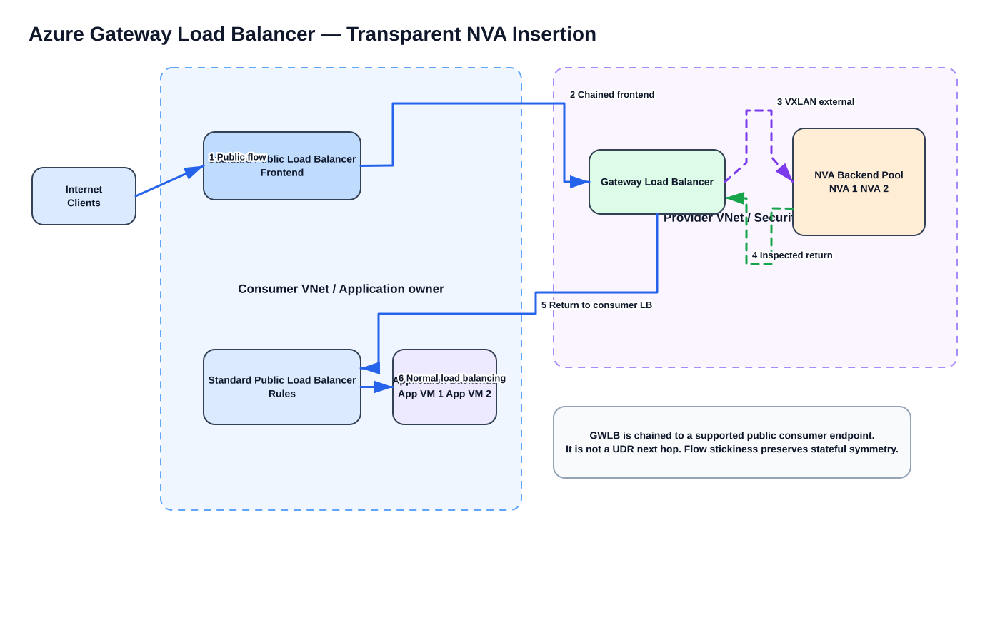
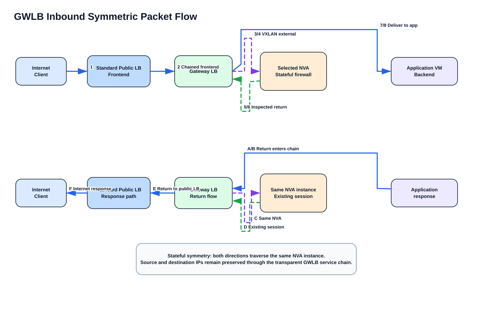
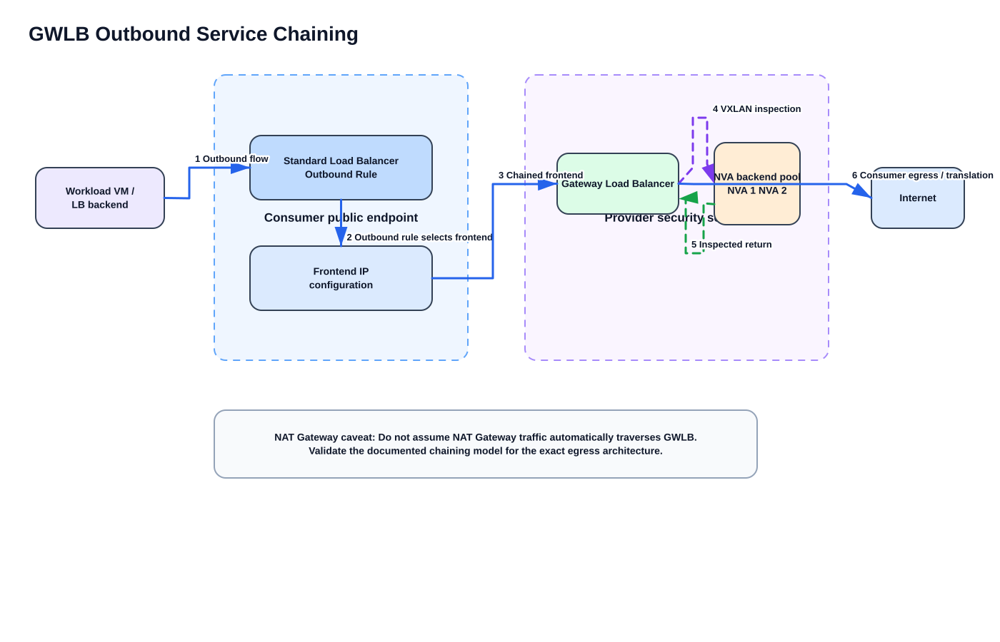
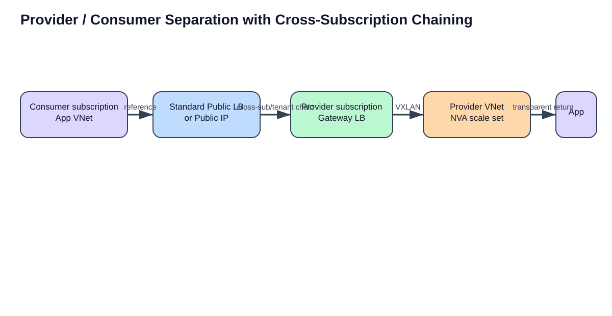

# Azure Gateway Load Balancer for Transparent NVA Insertion — Comprehensive Study Guide

> **Scope:** Azure Gateway Load Balancer (GWLB) as a transparent service-insertion mechanism for third-party Network Virtual Appliances (NVAs), including inbound and outbound traffic, VXLAN tunnels, symmetry, chaining, NVA requirements, HA, configuration, verification, failure behavior, and troubleshooting.

## Supplied topic

- Gateway Load Balancer for transparent NVA insertion

## Primary and supporting URLs

- https://learn.microsoft.com/en-us/azure/load-balancer/gateway-overview
- https://learn.microsoft.com/en-us/azure/load-balancer/tutorial-create-gateway-load-balancer
- https://learn.microsoft.com/en-us/azure/load-balancer/tutorial-gateway-outbound-connectivity
- https://learn.microsoft.com/en-us/azure/load-balancer/load-balancer-best-practices
- https://learn.microsoft.com/en-us/azure/architecture/networking/guide/network-virtual-appliance-high-availability
- https://learn.microsoft.com/en-us/samples/azure/azure-quickstart-templates/load-balancer-gateway/

## Source / explanation / inference convention

- **Source information** — directly supported by Microsoft documentation listed above.
- **Additional explanation** — networking explanation added to make the documented behavior easier to understand.
- **Reasonable inference** — design conclusions that follow from the documented mechanics but are not stated by Microsoft as a product guarantee. These are clearly identified.

---

# 1. What Gateway Load Balancer actually solves

**Source information:** Azure Gateway Load Balancer is a Gateway-SKU Azure Load Balancer designed to insert third-party NVAs transparently into the path of traffic associated with a supported public consumer endpoint. Microsoft describes it as a *bump-in-the-wire* service. It maintains flow stickiness to a selected NVA and provides flow symmetry, which is especially important for stateful firewalls and other appliances that require both directions of a connection to traverse the same instance.

Gateway Load Balancer is useful for appliances such as:

- firewalls;
- intrusion detection / prevention systems (IDS/IPS);
- advanced packet analytics;
- DDoS-focused appliances;
- traffic-processing or custom appliances.

The important word is **transparent**. The application does not normally route to the firewall as an IP next hop. Instead, the application-facing resource is **chained** to the GWLB. Azure intercepts the applicable flow, encapsulates it with **Virtual Extensible LAN (VXLAN)**, sends it to an NVA, receives the inspected packet back, and then continues normal processing at the consumer resource.

**Additional explanation:** This is very different from a traditional hub-and-spoke firewall design in which spoke route tables contain a user-defined route (UDR) whose next hop is the firewall. GWLB insertion is bound to a supported *consumer public endpoint*, not to a route-table next hop.

> **Critical limitation:** A Gateway Load Balancer frontend IP cannot be configured as a UDR next hop. A supported consumer resource must reference the GWLB through chaining.

---

# 2. Architecture at a glance



[Editable draw.io — GWLB transparent insertion architecture](images/09-05-26-17-03_GWLB_Transparent_Insertion_Architecture.drawio)

**What this image shows:** A Standard Public Load Balancer frontend is chained to a Gateway Load Balancer. The GWLB distributes traffic across a pool of NVAs using VXLAN and returns the inspected packet to the consumer resource so normal application load balancing can continue.

**What matters:** The NVA is not the public endpoint and the GWLB is not a UDR next hop. The chain is attached to the consumer frontend. The selected NVA remains sticky for the flow.

**What to verify:** Confirm that the Standard Public Load Balancer or supported public IP/NIC configuration actually references the intended Gateway Load Balancer frontend; confirm the NVA is healthy in the GWLB backend pool; confirm both tunnel interfaces are configured correctly on the appliance.

Microsoft's own high-level architecture figure is useful for comparison:


**What this image shows:** Microsoft separates the **consumer virtual network** containing the application from the **provider virtual network** containing the GWLB and NVAs.

**What matters:** The consumer and provider networks can be different virtual networks and can also be separated across subscriptions or tenants when the documented cross-tenant requirements are met.

**What to verify:** Confirm which subscription owns the application endpoint and which owns the provider GWLB/NVA stack. In cross-tenant designs, verify the required join permission and guest access.

---

# 3. Core components

| Component | Function | Key detail |
|---|---|---|
| Gateway Load Balancer frontend | Chaining target | Private-only frontend IP configuration |
| GWLB backend pool | NVA instances / VMSS instances | Holds the service appliances |
| HA Ports rule | Sends all relevant protocols/ports through the backend pool | GWLB rules are HA-port rules |
| Health probe | Determines whether an NVA is eligible for new flows | Probe must succeed for the appliance to receive new flows |
| External tunnel interface | Carries traffic entering the NVA from the untrusted/uninspected side | Microsoft recommends external for untrusted/not-yet-inspected traffic |
| Internal tunnel interface | Carries traffic on the trusted/inspected side | Microsoft recommends internal for inspected/trusted traffic |
| Consumer chain | Reference from Standard Public LB frontend or supported VM public-IP/NIC configuration to GWLB | This is what inserts the service transparently |

**Source information:** Each GWLB backend pool can have up to two tunnel interfaces. GWLB load-balancing rules are HA-port rules, and a rule can be associated with up to two backend pools.

**Additional explanation:** The internal/external tunnel labels are not physical NICs. They are logical directions encoded by VXLAN tunnel metadata/identifiers. The appliance vendor determines how those tunnel identifiers map into virtual wire, zones, interfaces, or service-chain constructs inside the NVA.

---

# 4. Why VXLAN is used

Gateway Load Balancer uses **VXLAN** between the Azure service and the NVA backend. VXLAN allows Azure to steer traffic to an appliance while preserving the original packet as the payload.

A simplified encapsulated packet looks like:

```text
Outer Ethernet/IP/UDP
  UDP destination = configured tunnel port (for example 10800 or 10801)
  VXLAN header
    VNI / tunnel identifier = configured tunnel identifier
    Original packet
      Source IP      = original flow source
      Destination IP = original flow destination at that stage of consumer processing
      Protocol/ports = original TCP/UDP/etc.
```

**Source information:** Microsoft states that Gateway Load Balancer is transparent and that source and destination IP addresses are unchanged while traffic traverses the GWLB/VXLAN path to the NVA and back.

**Additional explanation:** Because Azure adds encapsulation overhead, the NVA-facing data path must accept a larger frame than an ordinary 1500-byte guest packet. Microsoft specifically instructs custom NVA deployments to raise the NVA MTU to at least **1550 bytes** to accommodate VXLAN overhead and avoid fragmentation for a 1500-byte source packet. Azure Load Balancer best-practices guidance recommends up to **4000 bytes** where jumbo-frame scenarios require it.

## MTU design consequence

If the NVA interface remains at 1500 bytes, the following symptoms are plausible:

- large TCP transfers stall while small pings work;
- MSS-sized packets disappear only on the VXLAN leg;
- packet captures show fragmentation or drops near the NVA;
- TLS handshakes may work while larger records fail.

**Reasonable inference:** If only large packets fail, test MTU before assuming the firewall policy is wrong.

---

# 5. Inbound packet flow in exact order

The canonical deployment is Internet -> Standard Public Load Balancer -> chained GWLB -> NVA -> GWLB -> Standard Public Load Balancer -> application backend.



[Editable draw.io — inbound symmetric packet flow](images/09-05-26-17-03_GWLB_Inbound_Symmetric_Packet_Flow.drawio)

**What this image shows:** Both the request and return path traverse the same NVA instance because GWLB keeps flow stickiness and symmetry.

**What matters:** A stateful firewall sees both directions. The NVA does not need a UDR to force the return packet back through itself; the GWLB service chain provides that behavior for the chained endpoint flow.

**What to verify:** On the firewall, confirm request and response sessions appear on the same node. On Azure, confirm the consumer frontend is chained and the backend NVA remains probe-healthy.

## Forward direction: Internet client to application

1. The Internet client sends a packet to the **Standard Public Load Balancer frontend IP**.
2. Because that frontend is chained to the GWLB, Azure redirects the flow into the **Gateway Load Balancer** service path before final application delivery.
3. GWLB selects a healthy NVA backend using its load-balancing behavior and flow hash/stickiness.
4. GWLB encapsulates the flow in VXLAN and sends it to the appliance through the **external** tunnel side.
5. The NVA decapsulates or consumes the VXLAN tunnel according to its vendor integration, inspects the original packet, and applies firewall/IPS/analytics policy.
6. If allowed, the NVA returns the packet to GWLB over the **internal** tunnel side.
7. GWLB returns the packet to the consumer Standard Public Load Balancer.
8. The Standard Public Load Balancer performs its normal rule processing and distributes the packet to the selected application backend.

## Return direction: application to Internet client

1. The application sends the response toward the Standard Public Load Balancer flow.
2. The chained frontend causes the return traffic to enter GWLB again.
3. GWLB sends the return direction to the **same NVA instance** selected for the forward direction.
4. The NVA evaluates the packet against the existing state/session and sends the inspected traffic back to GWLB using the complementary tunnel direction.
5. GWLB returns the packet to the Standard Public Load Balancer.
6. The Standard Public Load Balancer performs the required source translation for the public frontend and sends the packet to the Internet client.

Microsoft's Quickstart sample explicitly documents a 12-step version of this flow and states that GWLB maintains stickiness and symmetry.

## What the firewall sees

**Source information:** Source and destination addresses are preserved during the GWLB VXLAN service traversal.

**Additional explanation:** This is why transparent insertion is useful for security devices: the firewall can make policy decisions using the actual client and destination context rather than seeing a proxy address introduced by the service chain itself.

---

# 6. Outbound inspection

Gateway Load Balancer can also inspect outbound traffic, but the important question is: **which public consumer resource owns the outbound path?**



[Editable draw.io — outbound service chaining](images/09-05-26-17-03_GWLB_Outbound_Service_Chaining.drawio)

**What this image shows:** A workload's outbound flow reaches a supported consumer public endpoint configuration that is chained to GWLB; the flow is sent through the NVA before final Internet egress.

**What matters:** Outbound inspection is not achieved by placing a `0.0.0.0/0` UDR toward the GWLB. Microsoft states that when using Standard Load Balancer outbound rules, the GWLB must be chained to the frontend IP configuration selected by those outbound rules.

**What to verify:** Determine the actual egress mechanism—Standard Load Balancer outbound rule, VM public IP, NAT Gateway, or something else. Only the documented supported consumer chaining path invokes GWLB.

## Standard Load Balancer outbound-rule case

**Source information:** To insert NVAs into outbound traffic when using Standard Load Balancer, chain GWLB to the frontend IP configuration referenced by the outbound rule.

**Additional explanation:** The service chain operates before the consumer resource completes its normal outbound handling. The NVA sees the workload flow, returns an allowed packet to GWLB, and then the consumer resource continues its outbound translation/forwarding.

## VM public-IP case

Microsoft also supports chaining a VM NIC IP configuration to GWLB, but the VM must have a public IP assigned before the NIC IP configuration can be chained.

This is useful when a workload is directly exposed through a Standard public IP rather than through a Standard Public Load Balancer.

## NAT Gateway caveat

**Reasonable inference:** Because Microsoft documents GWLB chaining to specific supported consumer public resources rather than to UDRs, do not assume that attaching a NAT Gateway to a subnet automatically causes NAT Gateway traffic to traverse a GWLB. Validate the documented chaining model for the exact egress architecture rather than treating GWLB as a generic subnet-wide next hop.

---

# 7. Consumer/provider separation

One of the strongest design features is that the application owner and security-service owner do not have to operate in the same virtual network.



[Editable draw.io — provider/consumer separation](images/09-05-26-17-03_GWLB_Cross_Subscription_Provider_Consumer.drawio)

**What this image shows:** The application/public endpoint is a consumer; the GWLB and NVA pool are a provider service. They can be separated organizationally.

**What matters:** Microsoft documents support for consumer and provider VNets in different subscriptions or tenants. Cross-tenant chaining requires the `Microsoft.Network/loadBalancers/frontendIPConfigurations/join/action` permission and guest access to the GWLB subscription. Cross-tenant chaining is not supported through the Azure portal.

**What to verify:** Check RBAC/guest access, resource IDs, and whether the method used for deployment supports cross-tenant chaining.

This model is attractive for:

- centralized network-security teams;
- managed-security service providers;
- shared firewall services;
- separate application and security subscriptions;
- productized NVA services where application teams consume the chain without managing appliances.

---

# 8. Why this avoids traditional UDR problems

A conventional routed NVA insertion pattern usually requires:

- a UDR from the source subnet toward the NVA;
- a return route that preserves symmetry;
- IP forwarding on the NVA;
- careful handling of Azure system routes, peering, gateway propagation, and default routes;
- separate designs for ingress and egress.

GWLB changes the model for supported public endpoint traffic:

| Traditional routed NVA | Gateway Load Balancer insertion |
|---|---|
| UDR selects firewall next hop | Consumer resource is chained to GWLB |
| Firewall IP often appears as next hop | GWLB frontend is not a valid UDR next hop |
| Symmetry must be designed with routing | GWLB provides flow stickiness/symmetry |
| Service insertion tied to subnet/route domain | Service insertion tied to supported consumer endpoint |
| Often requires firewall-routing awareness | Designed for transparent inline processing |

**Additional explanation:** GWLB therefore solves a different problem than Azure Route Server, Virtual WAN Routing Intent, or hub-spoke UDR service insertion. Those technologies steer routed traffic. GWLB transparently inserts an NVA into a specific public-endpoint service path.

---

# 9. HA and stateful-firewall behavior

Gateway Load Balancer improves NVA availability by distributing new flows among healthy appliance instances.

## Flow stickiness

For a given established flow, GWLB keeps traffic on the selected NVA instance so both directions traverse the same appliance.

This is essential for stateful controls such as:

- TCP state validation;
- firewall session tables;
- NAT performed by the appliance, if the vendor design uses it;
- TLS decryption state;
- IPS stream reassembly;
- application identification.

## Health-probe failure

When an NVA fails its health probe, it should no longer receive new eligible flows.

**Important operational nuance:** A load balancer health probe is not the same as session-state synchronization. If a stateful NVA fails during an established connection, the ability of another NVA to continue that session depends on vendor HA/state-sync behavior and the way the vendor integrates with GWLB.

**Reasonable inference:** Do not promise stateful session survival merely because multiple NVA instances are behind GWLB. Treat *instance availability* and *session preservation* as separate design requirements.

## Probe design

A probe should test something meaningful enough to determine whether the NVA can actually process service-chain traffic. A simple TCP-open probe proves less than a vendor-specific health endpoint that checks dataplane readiness.

However, use only probe behavior supported by the appliance vendor and Azure Load Balancer.

---

# 10. Tunnel-interface design

Microsoft recommends separating trusted and untrusted traffic on two tunnel interfaces:

- **External** — untrusted or not-yet-inspected traffic entering the appliance.
- **Internal** — trusted or inspected traffic leaving the appliance toward the application side.

Example values in Microsoft portal documentation:

| Direction | Port | Identifier |
|---|---:|---:|
| Internal | 10800 | 800 |
| External | 10801 | 801 |

The CLI tutorial uses an automatically created internal interface with identifier `900`/port `10800`, then adds an external interface with identifier `901`/port `10801`. This illustrates an important point:

> **Do not hard-code the portal example identifiers as universal defaults across every deployment method.** Use the identifiers/ports actually configured in your GWLB backend pool and the values expected by your NVA vendor.

The appliance must send inspected traffic back through the appropriate tunnel so Azure can continue the service chain.

---

# 11. Portal deployment sequence

The following sequence follows the current Microsoft tutorial conceptually.

## Step 1 — Create the provider virtual network

Create or select the VNet/subnet that will contain the NVA backend interfaces and GWLB frontend.

## Step 2 — Deploy the NVAs

Deploy a supported Marketplace NVA or custom NVA that explicitly supports the Azure GWLB tunnel model.

For a custom appliance, ensure:

- IP forwarding is enabled where required;
- the guest can process the configured VXLAN tunnels;
- the tunnel identifiers/UDP ports match Azure configuration;
- MTU is at least 1550 bytes;
- the health-probe listener is reachable;
- security policy allows Azure platform probe/tunnel traffic as required by the vendor design.

## Step 3 — Create Gateway Load Balancer

Navigate to **Load balancers** -> **Create**.

Set:

- **SKU:** Gateway
- **Type:** Internal
- **Region:** same target region as the GWLB deployment

Microsoft's current portal screenshot:


**What this image shows:** The Gateway SKU and Internal type selected in the Load Balancer creation page.

**What matters:** GWLB frontend IP configuration is private. The public exposure belongs to the consumer endpoint.

**What to verify:** Confirm **Gateway** SKU, not Standard; confirm the intended provider VNet/subnet.

## Step 4 — Configure frontend IP

Create the private GWLB frontend in the provider VNet/subnet.

## Step 5 — Create backend pool and tunnel interfaces

Create the NVA backend pool and configure **Internal and External** tunnel interfaces with the intended VXLAN ports and identifiers.

## Step 6 — Add the NVA NICs/instances to the backend pool

The NVA data interfaces participating in the service chain must be members of the GWLB backend pool.

## Step 7 — Create health probe

Choose the probe protocol/port/path that the appliance is designed to answer.

## Step 8 — Create HA Ports rule

GWLB rules use HA Ports so the service can process the required protocol/port space.

Microsoft's current portal screenshot:


**What this image shows:** A Gateway Load Balancer rule with High Availability ports enabled and a health probe selected.

**What matters:** The GWLB rule is not a traditional single application port rule such as TCP/443 only.

**What to verify:** Confirm the correct frontend, backend pool, probe, and HA Ports rule.

## Step 9 — Chain the consumer Standard Public Load Balancer frontend

Open the existing Standard Public Load Balancer -> **Frontend IP configuration** -> select the frontend -> choose the GWLB frontend in **Gateway load balancer** -> **Save**.

No application-subnet UDR is required merely to invoke the GWLB chain.

## Step 10 — Or chain a VM NIC IP configuration

For a VM with a public IP, open the NIC -> **IP configurations** -> select the relevant IP configuration -> set **Gateway Load balancer** -> **Save**.

---

# 12. Azure CLI configuration pattern

The examples below use placeholders and preserve the command structure Microsoft documents. Replace values deliberately.

## Create GWLB

```cli
az network lb create \
  --resource-group <RESOURCE_GROUP> \
  --name <GWLB_NAME> \
  --sku Gateway \
  --vnet-name <PROVIDER_VNET> \
  --subnet <NVA_SUBNET> \
  --backend-pool-name <BACKEND_POOL> \
  --frontend-ip-name <GWLB_FRONTEND>
```

**Where to run:** Azure Cloud Shell or a workstation with authenticated Azure CLI.

**Purpose:** Creates the Gateway SKU load balancer, provider-side frontend, and initial backend pool.

## Add an external tunnel interface

```cli
az network lb address-pool tunnel-interface add \
  --address-pool <BACKEND_POOL> \
  --identifier <EXTERNAL_TUNNEL_ID> \
  --lb-name <GWLB_NAME> \
  --protocol VXLAN \
  --resource-group <RESOURCE_GROUP> \
  --type External \
  --port <EXTERNAL_VXLAN_PORT>
```

Verify the internal interface that Azure CLI created automatically and ensure your appliance uses matching values.

## Create probe

```cli
az network lb probe create \
  --resource-group <RESOURCE_GROUP> \
  --lb-name <GWLB_NAME> \
  --name <PROBE_NAME> \
  --protocol http \
  --port <PROBE_PORT> \
  --path '/'
```

Use a protocol/port/path appropriate for the NVA; the above is a structural example based on Microsoft's tutorial.

## Create HA Ports rule

```cli
az network lb rule create \
  --resource-group <RESOURCE_GROUP> \
  --lb-name <GWLB_NAME> \
  --name <RULE_NAME> \
  --protocol All \
  --frontend-port 0 \
  --backend-port 0 \
  --frontend-ip-name <GWLB_FRONTEND> \
  --backend-pool-name <BACKEND_POOL> \
  --probe-name <PROBE_NAME>
```

## Chain a Standard Public Load Balancer frontend

First retrieve the GWLB frontend resource ID:

```cli
GWLB_FE_ID=$(az network lb frontend-ip show \
  --resource-group <GWLB_RESOURCE_GROUP> \
  --lb-name <GWLB_NAME> \
  --name <GWLB_FRONTEND> \
  --query id \
  --output tsv)
```

Then update the consumer frontend:

```cli
az network lb frontend-ip update \
  --resource-group <CONSUMER_RESOURCE_GROUP> \
  --name <CONSUMER_FRONTEND_NAME> \
  --lb-name <CONSUMER_LB_NAME> \
  --public-ip-address <CONSUMER_PUBLIC_IP_NAME> \
  --gateway-lb "$GWLB_FE_ID"
```

## Chain a VM NIC IP configuration

```cli
az network nic ip-config update \
  --resource-group <RESOURCE_GROUP> \
  --nic-name <NIC_NAME> \
  --name <IP_CONFIG_NAME> \
  --gateway-lb "$GWLB_FE_ID"
```

**Prerequisite:** The VM must already have a public IP before attempting this documented chaining method.

---

# 13. Control plane vs data plane

## Control plane

The control plane consists of Azure resource configuration:

- GWLB frontend configuration;
- backend-pool membership;
- internal/external tunnel definitions;
- health probe;
- HA Ports rule;
- consumer frontend/NIC chain reference;
- RBAC and cross-subscription/tenant permissions.

No BGP adjacency is required merely for the GWLB service chain itself.

## Data plane

The data plane consists of:

1. consumer flow reaches a chained public endpoint;
2. Azure redirects it to GWLB;
3. GWLB selects an eligible NVA;
4. packet is VXLAN encapsulated to the NVA;
5. NVA processes the packet;
6. NVA returns it over the appropriate tunnel;
7. GWLB hands the packet back to the consumer resource;
8. consumer resource completes normal load-balancing/NAT delivery.

**Additional explanation:** This separation is why a routing table can look completely normal while the packet still traverses the firewall. The insertion decision is not represented as a UDR hop.

---

# 14. Layer 2 / Layer 3 view

GWLB service insertion should not be thought of as extending the consumer Layer-2 domain through the firewall.

- The original workload packet is a Layer-3 packet carried inside a VXLAN overlay between Azure and the NVA.
- The NVA participates in a tunnel-aware service path rather than being a conventional routed hop in the application's subnet routing table.
- The underlay between Azure and the NVA transports the outer VXLAN packet.
- The original source/destination addresses are retained inside the service traversal.

**Additional explanation:** Depending on the NVA vendor, the firewall may model the two tunnel sides as virtual wire, Layer-2 zones, Layer-3 zones, or vendor-specific service interfaces. Follow the vendor's Azure GWLB deployment guide rather than assuming ordinary Ethernet NIC semantics.

---

# 15. NAT behavior

GWLB itself is intended to be transparent and does not require changing the original addresses merely to insert the appliance.

For the canonical public-LB ingress design:

- client sends to the public LB frontend;
- GWLB/NVA inspection occurs transparently in the chain;
- the consumer Standard Public Load Balancer performs its normal frontend/backend translations and application distribution;
- return traffic traverses the same security chain before Internet egress.

**Additional explanation:** If the NVA itself performs NAT, that becomes vendor/policy-specific and can affect transparency, symmetry, logging, and application behavior. Do not add firewall NAT rules unless the chosen vendor architecture requires them.

---

# 16. What Gateway Load Balancer does *not* replace

GWLB is not a universal inspection mechanism for every Azure packet path.

It does **not** by itself replace:

- hub-and-spoke UDR inspection for arbitrary east-west spoke traffic;
- Azure Route Server dynamic route exchange;
- Virtual WAN Routing Intent;
- Azure Firewall for routed centralized policy;
- private endpoint inspection patterns;
- generic `0.0.0.0/0` next-hop service insertion;
- application-layer reverse proxies or WAFs.

Use GWLB where the desired traffic is associated with a supported chained public endpoint and transparent NVA insertion is the goal.

---

# 17. Important limitations and restrictions

1. **No UDR next hop:** GWLB frontend cannot be used as a user-defined-route next hop.
2. **Consumer resource required:** A Standard Public Load Balancer frontend or supported Standard public-IP/NIC configuration must reference the GWLB.
3. **Private GWLB frontend:** Gateway Load Balancer frontend IP is private only.
4. **Global tier limitation:** GWLB does not work with Azure Global Load Balancer tier.
5. **Cross-tenant portal limitation:** Cross-tenant chaining is not supported through the Azure portal.
6. **Tunnel-interface maximum:** Each backend pool supports up to two tunnel interfaces.
7. **Rule model:** GWLB rules are HA Ports rules.
8. **Health-status UI/API caveat:** Azure Load Balancer's dedicated backend health-status feature documents that health status is not supported for Gateway Load Balancer, so do not assume the same per-backend health-status experience available on other LB scenarios.
9. **MTU:** Custom NVA VMs must support at least 1550 bytes for 1500-byte source packets through VXLAN encapsulation.
10. **Vendor integration required:** A generic VM does not automatically become a transparent firewall merely because it is in the backend pool; it must correctly process the GWLB tunnel model.

---

# 18. Common design mistakes

## Mistake 1 — Creating `0.0.0.0/0 -> GWLB frontend`

This is unsupported. GWLB is not a UDR next hop.

**Correct approach:** Chain the supported consumer resource to the GWLB frontend.

## Mistake 2 — Assuming two appliances guarantee established-session survival

GWLB gives load distribution, health-based eligibility, and flow symmetry; it does not by itself replicate a firewall's state table.

**Correct approach:** Validate vendor HA/session-sync behavior separately.

## Mistake 3 — Using one tunnel side for both trust directions without validating the vendor design

Microsoft recommends separate external and internal tunnel interfaces for untrusted and inspected traffic.

**Correct approach:** Match the appliance's documented tunnel mapping to Azure's internal/external definitions.

## Mistake 4 — Forgetting VXLAN MTU overhead

**Correct approach:** Raise NVA MTU to at least 1550 and validate end-to-end PMTU behavior.

## Mistake 5 — Chaining the wrong frontend

A Standard Public Load Balancer can have multiple frontends. Outbound rules can also reference specific frontends.

**Correct approach:** Verify the chain is attached to the exact frontend used by the desired inbound/outbound flow.

## Mistake 6 — Treating the NVA VNet as if it must be the application VNet

The consumer and provider networks can be separate.

**Correct approach:** Design the NVA service as a provider-side function when centralized ownership is desirable.

---

# 19. Verification workflow

## Azure control-plane checks

### Show GWLB

```cli
az network lb show \
  --resource-group <GWLB_RESOURCE_GROUP> \
  --name <GWLB_NAME> \
  --output jsonc
```

Verify:

- `sku.name` is Gateway;
- frontend exists;
- backend pool exists;
- load-balancing rule references the correct frontend/backend pool/probe.

### Show backend pool / tunnel configuration

```cli
az network lb address-pool show \
  --resource-group <GWLB_RESOURCE_GROUP> \
  --lb-name <GWLB_NAME> \
  --name <BACKEND_POOL> \
  --output jsonc
```

Verify tunnel interface type, identifier, protocol, and port.

### Show consumer frontend chain

```cli
az network lb frontend-ip show \
  --resource-group <CONSUMER_RESOURCE_GROUP> \
  --lb-name <CONSUMER_LB_NAME> \
  --name <CONSUMER_FRONTEND_NAME> \
  --output jsonc
```

Look for the Gateway Load Balancer reference on the consumer frontend.

## NVA checks

Perform these on the appliance itself using vendor-supported commands/GUI:

- tunnel interface up/operational state;
- health-probe listener state;
- session table entry for the test flow;
- ingress packets on external tunnel;
- egress packets on internal tunnel;
- return packets on internal tunnel;
- return-to-consumer packets on external tunnel;
- policy allow/deny result;
- MTU and drop counters.

## Packet-capture sequence

For one known TCP test flow, capture at four logical points if the vendor allows it:

1. external tunnel ingress;
2. decapsulated/pre-policy packet;
3. post-policy/internal tunnel egress;
4. reverse-direction session packet.

The most valuable check is whether both directions land on the same NVA and the same firewall session.

---

# 20. Troubleshooting by symptom

## Symptom: Public endpoint works after GWLB chain is removed, but fails when chain is enabled

**Where to check:** GWLB backend configuration and NVA.

**What it tests:** Whether the consumer endpoint is healthy and the failure is specifically in the inserted security path.

**Expected success:** Probe-healthy NVA receives VXLAN traffic and returns inspected traffic.

**Failure means:** Likely tunnel mismatch, NVA policy/drop, health probe issue, MTU problem, or backend membership problem.

**Next action:** Verify tunnel identifiers/ports, backend NIC membership, firewall session logs, and MTU.

## Symptom: NVA receives packets but application receives nothing

**Where to check:** NVA internal tunnel egress and GWLB backend configuration.

**What it tests:** Whether the firewall returns allowed packets through the expected inspected side.

**Expected success:** Packet exits NVA on the internal tunnel and reappears at the consumer LB path.

**Failure means:** The appliance is dropping, routing incorrectly inside its own dataplane, using the wrong tunnel, or returning malformed encapsulation.

**Next action:** Compare configured Azure tunnel ID/port with vendor tunnel interface configuration.

## Symptom: Request reaches the application but response fails

**Where to check:** Same NVA session table and reverse tunnel path.

**What it tests:** Symmetric return processing.

**Expected success:** Reverse packet returns to the same firewall node and matches established state.

**Failure means:** Vendor session/state problem, NVA return-tunnel problem, or a different egress mechanism is bypassing the chained frontend.

**Next action:** Validate that the return flow actually uses the same consumer frontend/outbound rule and that the firewall sees both directions.

## Symptom: Small packets succeed, large flows hang

**Where to check:** NVA MTU, packet captures, fragmentation/drop counters.

**What it tests:** VXLAN overhead handling.

**Expected success:** NVA supports at least 1550-byte MTU for normal 1500-byte Azure payloads.

**Failure means:** Encapsulation overhead causes fragmentation or drop.

**Next action:** Raise NVA MTU per Microsoft/vendor guidance and retest with DF/PMTU-aware tools.

## Symptom: Only one NVA gets traffic

**Where to check:** health probes, backend membership, load-balancing hash distribution, traffic sample size.

**What it tests:** Whether all intended NVA instances are eligible.

**Expected success:** Multiple healthy backends receive different new flows over time.

**Failure means:** Other NVAs may be probe-failed, not in the pool, or the test is reusing one sticky flow.

**Next action:** Generate multiple distinct flows and check health/probe configuration on every backend.

## Symptom: Existing sessions drop when one NVA fails

**Where to check:** vendor state synchronization / HA behavior.

**What it tests:** Whether firewall state is replicated independently of GWLB backend health.

**Expected success:** Only if the NVA vendor design supports stateful failover for this deployment.

**Failure means:** GWLB can move new flows away from the failed instance, but another NVA may not possess the old session state.

**Next action:** Review the vendor's documented HA/session-sync architecture; do not treat this as an Azure routing problem first.

## Symptom: Outbound traffic bypasses the firewall

**Where to check:** Standard LB outbound rule and the frontend it references, or VM public-IP/NIC chain.

**What it tests:** Whether the actual egress resource is the one chained to GWLB.

**Expected success:** The egress frontend/NIC IP configuration contains the GWLB reference.

**Failure means:** The workload is egressing through a different mechanism or frontend.

**Next action:** Identify the real SNAT/egress path and apply the supported chain to that resource.

---

# 21. Decision guidance: when GWLB is the right insertion method

Choose Gateway Load Balancer when:

- the traffic enters or exits through a supported Standard public consumer endpoint;
- you need transparent insertion without adding NVA UDR next hops;
- the NVA vendor supports Azure GWLB/VXLAN integration;
- stateful symmetry is important;
- the security provider stack should be separable from the consumer VNet/subscription;
- you want to scale a pool of appliances behind a managed Azure load-balancing service.

Prefer another Azure insertion model when:

- you need arbitrary spoke-to-spoke or east-west routed inspection;
- you need to steer private traffic based on route tables/BGP rather than a public endpoint chain;
- the firewall does not support GWLB VXLAN tunnel semantics;
- you require Virtual WAN integrated security or Routing Intent;
- NAT Gateway is the required egress architecture and the desired path cannot be represented through a documented GWLB consumer chain;
- you need Layer-7 reverse-proxy/WAF behavior rather than transparent packet inspection.

---

# 22. Fast mental model

Think of Azure GWLB as:

```text
Supported public consumer endpoint
          |
          | chain reference
          v
   Azure Gateway Load Balancer
          |
          | VXLAN external
          v
      selected NVA
          |
          | VXLAN internal
          v
   Azure Gateway Load Balancer
          |
          v
original consumer endpoint continues normal processing
```

Do **not** think of it as:

```text
Subnet UDR -> GWLB IP -> firewall
```

That second model is the wrong mental model for Azure Gateway Load Balancer.

---

# 23. Exam/interview-quality distinctions

| Question | Correct distinction |
|---|---|
| How is traffic steered to GWLB? | By chaining a supported consumer endpoint, not by UDR next hop |
| What protocol carries packets to NVAs? | VXLAN |
| Why two tunnel interfaces? | Separate untrusted/not-yet-inspected and trusted/inspected directions |
| Does GWLB preserve flow symmetry? | Yes, it maintains flow stickiness to a selected NVA |
| Does that automatically preserve firewall sessions after NVA failure? | No; session survival depends on vendor state/HA capability |
| Is GWLB frontend public? | No, it is private-only |
| Can consumer and provider VNets differ? | Yes; Microsoft also documents cross-subscription/tenant chaining |
| Can GWLB work behind Azure Global Load Balancer tier? | No, current Microsoft limitation |
| Minimum custom NVA MTU? | 1550 bytes for 1500-byte source packets through VXLAN |
| Is GWLB the same as a routed firewall hub? | No; it is transparent endpoint service insertion |

---

# 24. Sources

## Microsoft Learn

- Gateway Load Balancer overview: https://learn.microsoft.com/en-us/azure/load-balancer/gateway-overview
- Create a Gateway Load Balancer tutorial: https://learn.microsoft.com/en-us/azure/load-balancer/tutorial-create-gateway-load-balancer
- Outbound connectivity with Gateway Load Balancer: https://learn.microsoft.com/en-us/azure/load-balancer/tutorial-gateway-outbound-connectivity
- Azure Load Balancer best practices: https://learn.microsoft.com/en-us/azure/load-balancer/load-balancer-best-practices
- Highly available NVAs architecture guidance: https://learn.microsoft.com/en-us/azure/architecture/networking/guide/network-virtual-appliance-high-availability
- Microsoft Quickstart sample — Public Load Balancer chained to Gateway Load Balancer: https://learn.microsoft.com/en-us/samples/azure/azure-quickstart-templates/load-balancer-gateway/

## Official images used

- Gateway Load Balancer architecture: https://learn.microsoft.com/en-us/azure/load-balancer/media/gateway-overview/gateway-load-balancer-diagram.png
- Gateway Load Balancer creation screenshot: https://learn.microsoft.com/en-us/azure/load-balancer/media/tutorial-gateway-portal/create-load-balancer.png
- Gateway Load Balancer HA Ports rule screenshot: https://learn.microsoft.com/en-us/azure/load-balancer/media/tutorial-gateway-portal/add-load-balancing-rule.png

---

# 25. Final validation checklist

- [x] Transparent insertion model distinguished from UDR routing.
- [x] Inbound and outbound flow explained.
- [x] VXLAN, tunnel interfaces, MTU, HA Ports, health probes, and symmetry covered.
- [x] Cross-subscription/tenant provider-consumer architecture covered.
- [x] Current Microsoft limitations recorded.
- [x] Portal and Azure CLI configuration patterns included.
- [x] Verification and symptom-based troubleshooting included.
- [x] Official Microsoft architecture/screenshots included by stable HTTPS URL.
- [x] Every custom topology/packet-flow diagram has matching SVG and editable draw.io assets under `images/`.
