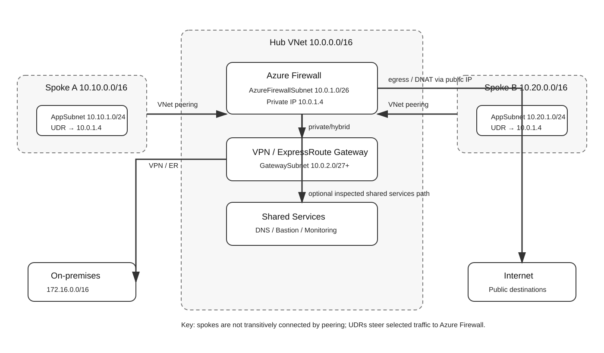
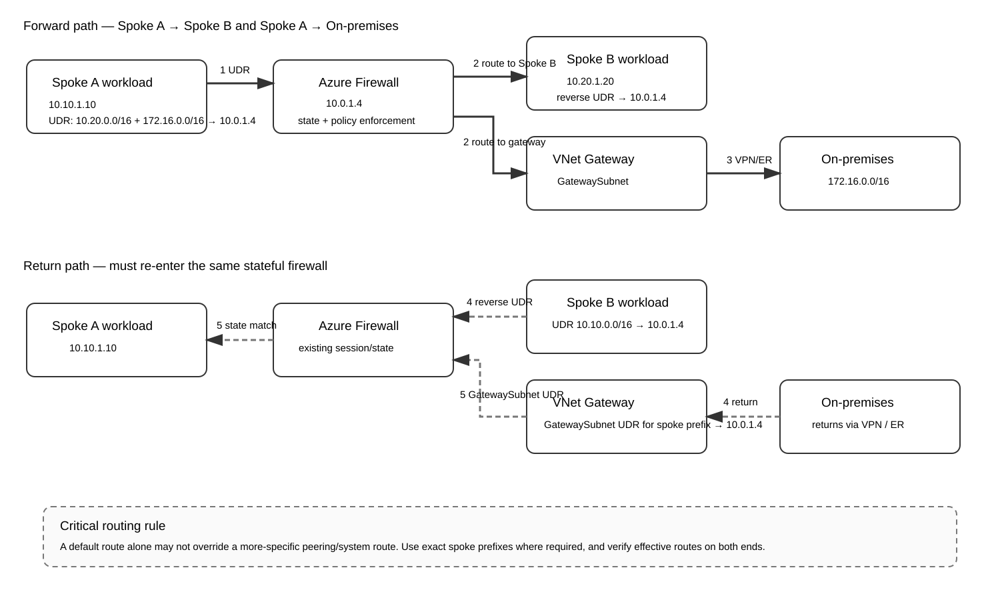
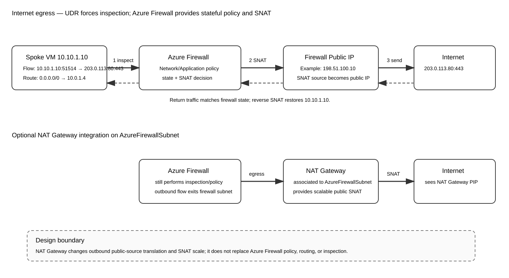
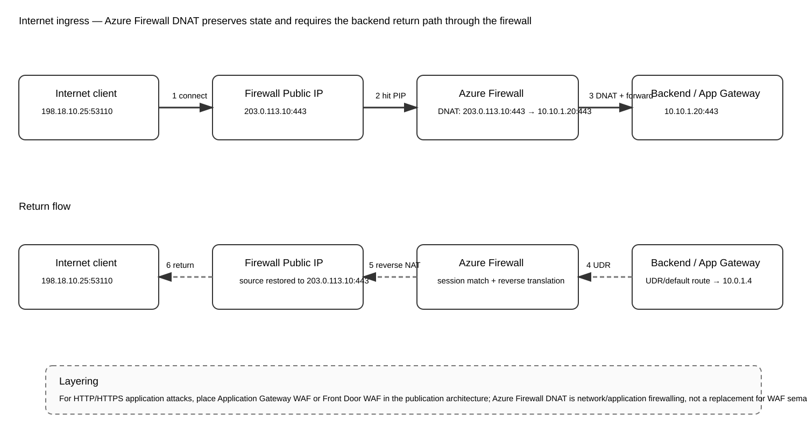

# Azure Firewall in a Customer-Managed Hub VNet — Method 1 Deep Dive

**Last validated:** 2026-09-05  
**Parent guide:** [Azure Firewall Inspection Methods — Comprehensive Architecture and Operations Study Guide](09-05-26-12-41_Azure_Firewall_Inspection_Methods_Comprehensive_Study_Guide.md)  
**Method:** 1 — Azure Firewall in a customer-managed hub VNet  
**Focus:** architecture, routing, UDR behavior, packet flow, NAT, peering, hybrid routing, symmetry, Azure Firewall policy processing, TLS/IDPS considerations, scale, verification, failover, common mistakes, and troubleshooting.

> **Source information** = behavior explicitly documented by Microsoft or an authoritative Microsoft technical source.  
> **Additional explanation** = networking detail added to explain why the documented behavior matters.  
> **Reasonable inference** = a design conclusion drawn from documented behavior; validate it against the exact production topology before deployment.

---

## Supplied and supporting URLs

Supplied parent guide:

- https://github.com/ccaiccie/knowledge/blob/main/09-05-26-12-41_Azure_Firewall_Inspection_Methods_Comprehensive_Study_Guide.md

Primary Microsoft references:

- https://learn.microsoft.com/en-us/azure/networking/design-guide/hub-spoke
- https://learn.microsoft.com/en-us/azure/architecture/networking/architecture/hub-spoke
- https://learn.microsoft.com/en-us/azure/firewall/firewall-multi-hub-spoke
- https://learn.microsoft.com/en-us/azure/firewall/tutorial-hybrid-portal
- https://learn.microsoft.com/en-us/azure/firewall/rule-processing
- https://learn.microsoft.com/en-us/azure/firewall/features-by-sku
- https://learn.microsoft.com/en-us/azure/firewall/premium-features
- https://learn.microsoft.com/en-us/azure/firewall/forced-tunneling
- https://learn.microsoft.com/en-us/azure/firewall/management-nic
- https://learn.microsoft.com/en-us/azure/firewall/snat-private-range
- https://learn.microsoft.com/en-us/azure/firewall/integrate-with-nat-gateway
- https://learn.microsoft.com/en-us/azure/nat-gateway/tutorial-hub-spoke-nat-firewall
- https://learn.microsoft.com/en-us/azure/virtual-network/virtual-networks-udr-overview
- https://learn.microsoft.com/en-us/azure/virtual-network/virtual-network-peering-overview
- https://learn.microsoft.com/en-us/azure/vpn-gateway/vpn-gateway-peering-gateway-transit
- https://learn.microsoft.com/en-us/azure/network-watcher/diagnose-vm-network-routing-problem
- https://learn.microsoft.com/en-us/azure/network-watcher/next-hop-overview
- https://learn.microsoft.com/en-us/azure/firewall/monitor-firewall-reference

Useful Microsoft community architecture discussion:

- https://techcommunity.microsoft.com/blog/azurenetworkingblog/understanding-and-building-an-azure-hybrid-meshed-hub-spoke-topology/4516879

---

# 1. What Method 1 actually is

Method 1 is the traditional **customer-managed hub-and-spoke architecture** in which you create and own the hub virtual network, deploy Azure Firewall into the dedicated `AzureFirewallSubnet`, peer one or more workload VNets to the hub, and use Azure route tables to force selected traffic through the firewall.

Unlike Azure Virtual WAN, there is no Microsoft-managed virtual hub routing fabric deciding the service-insertion path for you. You control the topology directly:

- the hub VNet address space;
- VNet peerings;
- the `AzureFirewallSubnet`;
- route tables and user-defined routes (UDRs);
- VPN Gateway or ExpressRoute gateway placement;
- gateway transit and remote-gateway peering options;
- shared services in the hub;
- firewall policy and logging;
- the reverse path required by the stateful firewall.

That control is the main strength of Method 1, but it is also why this design demands a precise understanding of Azure route selection.



[Editable draw.io source](images/09-05-26-18-55_method1_hub_spoke_architecture.drawio)

**What this image shows**  
A customer-owned hub VNet containing Azure Firewall, a hybrid gateway, and shared services. Spokes peer to the hub and use UDRs that reference the firewall private IP as a `VirtualAppliance` next hop.

**What matters**  
VNet peering itself is not a firewall service chain. Peering only provides IP reachability between VNets. You must deliberately override the routes that would otherwise bypass Azure Firewall.

**What to verify**  
Confirm spoke route tables, effective routes, peering flags, firewall private IP, `AzureFirewallSubnet`, gateway routes, and the return path.

---

# 2. Reference topology used throughout this guide

The examples use the following addresses.

| Component | Address / prefix | Purpose |
|---|---:|---|
| Hub VNet | `10.0.0.0/16` | Customer-managed hub |
| `AzureFirewallSubnet` | `10.0.1.0/26` | Azure Firewall data-plane subnet |
| Azure Firewall private IP | `10.0.1.4` | UDR next hop in examples |
| `GatewaySubnet` | `10.0.2.0/27` | VPN/ExpressRoute gateway |
| Shared-services subnet | `10.0.3.0/24` | DNS, monitoring, other shared services |
| Spoke A | `10.10.0.0/16` | Application VNet |
| Spoke A app subnet | `10.10.1.0/24` | VM `10.10.1.10` |
| Spoke B | `10.20.0.0/16` | Application VNet |
| Spoke B app subnet | `10.20.1.0/24` | VM `10.20.1.20` |
| On-premises | `172.16.0.0/16` | Hybrid network |
| Example firewall public IP | `203.0.113.10` | Documentation-only TEST-NET address |

The public documentation addresses in packet examples are intentionally non-routable TEST-NET-style examples. Replace them with real Azure public IP resources in an implementation.

---

# 3. The fundamental routing model

## 3.1 Azure Firewall does not magically attract traffic

**Source information:** Azure Firewall is stateful, but a packet is inspected only if Azure routing actually sends that packet through the firewall. In a traditional hub VNet, traffic steering normally comes from UDRs, VNet peering reachability, gateway routes, and Azure system routes.

The most common mistake is to think:

> “The firewall is in the hub, therefore traffic between spokes must pass through it.”

That is false. Azure VNet peering is non-transitive from a routing-design perspective, but each direct peering installs reachability for the peer address space. If two spokes are each peered to the hub, the firewall can be used as the transit hop only when the spoke route tables point the remote prefix toward the firewall.

## 3.2 Longest-prefix match comes first

Azure routing first chooses the most specific matching prefix. A `/16` route beats a `/0`, and a `/24` beats a `/16`.

That matters because a broad route such as:

```text
0.0.0.0/0 -> 10.0.1.4
```

is excellent for Internet egress, but it might not be sufficient to force east-west traffic through the firewall when Azure already has a more-specific route for a peered VNet.

For forced Spoke A to Spoke B inspection, use explicit remote-spoke routes, for example:

```text
10.20.0.0/16 -> VirtualAppliance 10.0.1.4
```

and on Spoke B:

```text
10.10.0.0/16 -> VirtualAppliance 10.0.1.4
```

## 3.3 UDR, BGP, and system-route interaction

**Source information:** Azure route selection considers prefix length and route source. UDRs are a major mechanism for deliberately overriding built-in connectivity. BGP-learned gateway routes can also appear in effective routes and can create a bypass path if you do not account for them.

**Additional explanation:** You should troubleshoot the route table that Azure actually installed on the NIC, not just the route table object you intended to configure. The effective route table is the operational truth.

---

# 4. Route-table design by traffic class

A clean design starts by deciding what must be inspected.

| Traffic class | Typical steering requirement |
|---|---|
| Spoke → Internet | `0.0.0.0/0` to firewall |
| Spoke A → Spoke B | Exact Spoke B prefix to firewall |
| Spoke B → Spoke A | Exact Spoke A prefix to firewall |
| Spoke → on-premises | On-prem prefix or controlled default to firewall |
| On-premises → spoke | Gateway-side route for spoke prefix to firewall when centralized inspection is required |
| Spoke → same-spoke subnet | Usually direct unless the design intentionally inserts another control |
| Spoke → hub shared services | Route through firewall only if the policy requires inspection |
| Azure Firewall → destination | Firewall relies on effective routes available to `AzureFirewallSubnet` and platform behavior |

## 4.1 Example Spoke A route table

A typical Spoke A route table might contain:

```text
Name                 Prefix           Next hop type      Next hop
-------------------  ---------------  -----------------  --------
Internet-via-fw      0.0.0.0/0        VirtualAppliance   10.0.1.4
SpokeB-via-fw        10.20.0.0/16     VirtualAppliance   10.0.1.4
OnPrem-via-fw        172.16.0.0/16    VirtualAppliance   10.0.1.4
```

This table must be associated with the workload subnet that originates the traffic.

## 4.2 Example Spoke B route table

```text
Name                 Prefix           Next hop type      Next hop
-------------------  ---------------  -----------------  --------
Internet-via-fw      0.0.0.0/0        VirtualAppliance   10.0.1.4
SpokeA-via-fw        10.10.0.0/16     VirtualAppliance   10.0.1.4
OnPrem-via-fw        172.16.0.0/16    VirtualAppliance   10.0.1.4
```

## 4.3 Why both directions matter

Azure Firewall maintains session state. If the forward packet goes:

```text
Spoke A -> Azure Firewall -> Spoke B
```

but the return packet goes directly:

```text
Spoke B -> Spoke A
```

then the firewall sees only half the connection. Stateful inspection, NAT state, and session enforcement become unreliable or fail completely.



[Editable draw.io source](images/09-05-26-18-55_method1_symmetric_routing.drawio)

**What this image shows**  
Forward and return paths for spoke-to-spoke and hybrid traffic, including the point at which the `GatewaySubnet` can require a spoke-prefix route toward Azure Firewall.

**What matters**  
Symmetry is a routing property, not a firewall-policy property. A perfect firewall rule cannot compensate for a return path that bypasses the firewall.

**What to verify**  
Check the effective route on the source subnet, destination subnet, and `GatewaySubnet` where hybrid inspection is required.

---

# 5. VNet peering settings in detail

Each spoke normally has two peering objects: spoke-to-hub and hub-to-spoke.

Important options include:

- **Allow virtual network access** — permits the basic peered-VNet data path.
- **Allow forwarded traffic** — important when packets arriving from the peer were forwarded by a third device such as Azure Firewall.
- **Allow gateway transit** — configured on the VNet that owns the gateway when that gateway is shared with peers.
- **Use remote gateways** — configured on the spoke when it consumes the hub VNet gateway.

**Source information:** Gateway transit lets a spoke use a gateway in the peered hub instead of deploying a gateway in every spoke.

**Additional explanation:** A firewall-forwarded packet is not the same as a packet generated by a VM in the hub. The peering must permit forwarded traffic where the topology requires it.

A common hybrid model is:

```text
Hub owns VPN/ExpressRoute gateway
Hub peering toward spoke: Allow gateway transit = enabled
Spoke peering toward hub: Use remote gateways = enabled
Forwarded traffic allowed as required by design
```

Validate the exact permitted combination for your topology because gateway-transit settings are directional.

---

# 6. Packet flow: Spoke → Internet

Assume:

```text
Source:      10.10.1.10:51514
Destination: 203.0.113.80:443
Firewall:    10.0.1.4
```

The flow is:

1. The VM emits the packet.
2. The Spoke A subnet effective route table matches `0.0.0.0/0 -> 10.0.1.4`.
3. Azure delivers the packet to Azure Firewall across the VNet peering path.
4. Azure Firewall evaluates the applicable policy.
5. If allowed, the firewall establishes session state.
6. For normal Internet egress, source NAT is applied according to Azure Firewall SNAT behavior.
7. The Internet server sees the public egress address rather than `10.10.1.10`.
8. Return traffic reaches the Azure Firewall public path.
9. Azure Firewall matches the existing state, reverses translation, and forwards the packet to `10.10.1.10`.



[Editable draw.io source](images/09-05-26-18-55_method1_internet_egress_nat.drawio)

**What this image shows**  
The ordinary firewall-public-IP egress path and the optional NAT Gateway integration on `AzureFirewallSubnet`.

**What matters**  
NAT Gateway can improve SNAT scale for Azure Firewall egress, but it does not become the security policy engine.

**What to verify**  
Inspect the spoke default route, firewall policy, public egress address, SNAT utilization/behavior, and return state.

---

# 7. Azure Firewall + NAT Gateway

Microsoft documents an architecture in which NAT Gateway is associated with `AzureFirewallSubnet`.

In this design:

- the spoke still sends traffic to Azure Firewall;
- Azure Firewall still performs security policy inspection;
- outbound traffic leaving the firewall subnet can use NAT Gateway for public source translation;
- the Internet sees the NAT Gateway public IP resource;
- NAT Gateway increases the available SNAT scale compared with relying only on a small set of firewall public IPs.

This is especially relevant for workloads that create large numbers of simultaneous outbound connections to the same destinations.

**Common misconception:** Do not associate NAT Gateway with workload subnets and expect traffic to still hit Azure Firewall automatically. A workload-subnet NAT Gateway can change the intended egress architecture. The Microsoft hub-spoke integration pattern specifically places NAT Gateway on the firewall subnet so the firewall remains inline.

---

# 8. Packet flow: Spoke A → Spoke B

Assume:

```text
Client: 10.10.1.10
Server: 10.20.1.20
```

Forward path:

1. Spoke A route lookup matches `10.20.0.0/16 -> 10.0.1.4`.
2. Packet enters Azure Firewall.
3. Firewall evaluates a network rule or other applicable policy for `10.10.1.10 -> 10.20.1.20`.
4. Firewall routes the packet toward Spoke B.
5. Spoke B receives the original private source unless a specific NAT design changes it.

Return path:

1. `10.20.1.20` replies to `10.10.1.10`.
2. Spoke B route table matches `10.10.0.0/16 -> 10.0.1.4`.
3. Azure Firewall receives the return packet.
4. Existing session state is matched.
5. Firewall forwards the packet back to Spoke A.

If Spoke B lacks the reverse UDR, Azure can select a more direct path. That creates asymmetry.

---

# 9. Packet flow: Spoke → on-premises

Assume on-premises is `172.16.0.0/16`.

Forward direction:

```text
Spoke workload
  -> UDR for 172.16.0.0/16
  -> Azure Firewall 10.0.1.4
  -> hub VPN/ExpressRoute gateway
  -> private circuit/tunnel
  -> on-premises
```

Return direction must be deliberately preserved:

```text
on-premises
  -> ExpressRoute/VPN
  -> hub gateway
  -> Azure Firewall
  -> spoke workload
```

## 9.1 Why GatewaySubnet routing matters

**Source information:** Microsoft hybrid hub-spoke guidance demonstrates placing a route table on `GatewaySubnet` with spoke prefixes pointing to the firewall when inbound hybrid traffic must be inspected.

Without that control, the gateway can know that a spoke prefix is reachable through VNet peering and forward traffic toward the spoke without first passing through Azure Firewall.

A gateway-side route might be:

```text
10.10.0.0/16 -> VirtualAppliance 10.0.1.4
10.20.0.0/16 -> VirtualAppliance 10.0.1.4
```

Use precise spoke prefixes and validate supported gateway-routing constraints. Do not casually install a catch-all route on `GatewaySubnet` without understanding the effect on gateway control and data traffic.

## 9.2 Gateway route propagation

Spoke route tables can learn gateway/BGP routes. If those learned prefixes create a more attractive direct path to the hub gateway, they can bypass the firewall.

For centralized inspection, consider disabling gateway route propagation on the spoke route table when that is consistent with your intended design, then install explicit UDRs toward Azure Firewall.

**Reasonable inference:** In a large hybrid estate, treat “propagate gateway routes” as an architectural decision, not a default checkbox. Disabling it simplifies forced service insertion but means you must deliberately provide reachability through the firewall path.

---

# 10. Packet flow: Internet ingress using DNAT

Azure Firewall can publish an internal service using Destination Network Address Translation (DNAT).

Example:

```text
Public listener: 203.0.113.10:443
Private target:  10.10.1.20:443
```

Forward direction:

1. Internet client connects to `203.0.113.10:443`.
2. Packet reaches Azure Firewall.
3. Firewall matches a DNAT rule.
4. Destination is translated to `10.10.1.20:443`.
5. Firewall records state.
6. Packet is forwarded to the backend.

Return direction:

1. Backend replies.
2. Backend subnet routing must return the packet through Azure Firewall.
3. Firewall matches the session and performs reverse translation.
4. Client sees the response from the firewall public endpoint.



[Editable draw.io source](images/09-05-26-18-55_method1_inbound_dnat.drawio)

**What this image shows**  
Inbound public traffic, DNAT, the private backend, and the stateful return path.

**What matters**  
The backend should not return directly to the Internet using another public path. The stateful DNAT flow must come back through the firewall.

**What to verify**  
DNAT rule, public IP association, backend route, NSGs, firewall state/logs, and backend listener.

---

# 11. Azure Firewall rule-processing behavior

Rule processing is easy to misunderstand because the numeric priority in one collection does not override the major rule-family order.

At a high level, understand the separation between:

- NAT rules;
- network rules;
- application rules;
- threat-intelligence behavior;
- Premium IDPS/TLS features where enabled.

**Source information:** Microsoft documents that DNAT rules are processed before network/application rules for the inbound NAT case, and network rules are evaluated before application rules. A matching network rule is terminating for that path; traffic is not then re-evaluated as an application rule simply because an application rule also exists.

This creates an important design trap:

```text
Broad network rule:
Allow TCP 443 from 10.10.0.0/16 to Internet
```

can defeat the intent of a more restrictive application-rule FQDN allowlist because the network rule matches first.

## 11.1 Network rules

Use network rules for IP/protocol/port policy such as:

```text
10.10.0.0/16 -> 10.20.0.0/16 TCP/443
10.10.0.0/16 -> 172.16.10.20 TCP/1433
```

## 11.2 Application rules

Use application rules when the policy intent is destination FQDN/URL/application-layer matching for supported protocols.

Example intent:

```text
Allow workload subnet to access approved Microsoft update FQDNs over HTTPS.
```

Avoid simultaneously creating a broader network-rule allow that matches the same flow first.

## 11.3 Default deny

Azure Firewall is fundamentally policy-driven. If traffic reaches the firewall but no applicable allow path exists, the result is a deny rather than transparent forwarding.

This gives a useful troubleshooting split:

- **No firewall log at all:** likely routing, peering, NSG, or reachability problem before the firewall.
- **Firewall deny log:** traffic reached the firewall; investigate policy and tuple/FQDN.
- **Firewall allow log but application fails:** investigate downstream NSG, route asymmetry, backend listener, DNS, MTU, TLS, or return path.

---

# 12. Standard vs Premium feature considerations

Azure Firewall SKU capabilities change over time, so use the current Microsoft feature matrix when selecting a tier.

For architecture purposes:

- all tiers provide managed firewalling appropriate to their feature level;
- Standard adds broader security capabilities compared with Basic;
- Premium is the SKU associated with features such as TLS inspection and Intrusion Detection and Prevention System (IDPS).

## 12.1 TLS inspection

TLS inspection requires the firewall to decrypt a supported TLS flow, inspect it, and re-encrypt it toward the destination.

That introduces PKI requirements:

- workloads must trust the CA chain used for TLS inspection;
- certificate lifecycle and policy scope must be managed;
- some certificate-pinned or mutually authenticated applications may not tolerate interception;
- encrypted traffic that is not decrypted cannot receive the same payload-level inspection as decrypted traffic.

## 12.2 IDPS

IDPS analyzes traffic against signatures and can be run in a detection/alerting or prevention posture according to supported modes and configuration.

**Additional explanation:** Routing still comes first. Premium features do not help if the packet never traverses the firewall.

---

# 13. Forced tunneling

Forced tunneling means sending Internet-bound traffic from Azure toward another egress/security location, commonly on-premises, instead of using Azure Firewall's own direct Internet egress path.

A conceptual flow is:

```text
Spoke
 -> Azure Firewall
 -> hub gateway
 -> ExpressRoute/VPN
 -> on-premises firewall/proxy
 -> Internet
```

This is a different architecture from ordinary Azure Firewall Internet egress.

Microsoft also documents a management-NIC model for Azure Firewall forced tunneling scenarios so management traffic is separated from the forced data-plane route.

Key design questions:

- Where does final SNAT occur?
- Does on-premises have a route back to every Azure spoke prefix?
- Is return traffic guaranteed to traverse the same stateful devices?
- Is inbound DNAT required? Forced-tunneling designs have important inbound-publication constraints that must be reviewed against current Microsoft documentation.
- Does the default route on the firewall subnet cause unintended reachability changes?

---

# 14. DNS and application-rule dependencies

FQDN-based policy is only as reliable as the DNS behavior behind it.

Troubleshoot DNS separately from routing:

1. What resolver is the workload using?
2. What IP address did the FQDN resolve to?
3. Did the firewall resolve the same destination identity as expected?
4. Is DNS proxy configured where the design requires it?
5. Is split-horizon/private DNS returning a private address instead of the expected public address?
6. Did a Private Endpoint change the destination path?

A user saying “HTTPS to `example.com` fails” is not enough. Determine the resolved IP, route next hop, firewall rule family, SNI/Host/FQDN behavior, and return path.

---

# 15. Private Endpoint considerations

Private Endpoint traffic uses private IP addresses from a VNet subnet. Inspection requires that routing and private-endpoint network-policy behavior support the intended service-insertion path.

Do not assume that creating a Private Endpoint automatically means its traffic crosses the hub firewall.

Validate:

- private DNS resolution;
- the private endpoint IP;
- subnet route-table behavior;
- private-endpoint network-policy settings where applicable;
- whether the source is in the same VNet or another VNet;
- return symmetry.

---

# 16. High availability and Azure Firewall scaling

Azure Firewall is a managed service; you do not build an active/passive VM pair yourself.

Operationally, this changes your responsibility:

- Microsoft manages the underlying firewall service instances;
- you still own routing correctness, zone/config choices, policy, capacity planning, and dependencies;
- the firewall private IP used as the UDR next hop remains the logical service endpoint for your design.

For resilient architecture, also examine the dependencies around the firewall:

- VPN/ExpressRoute gateway redundancy;
- zone choices where supported;
- DNS service resilience;
- NAT/SNAT capacity;
- route-table consistency;
- shared-service dependencies;
- monitoring and alerting.

A highly available firewall does not make a misconfigured route highly available.

---

# 17. Configuration example — Azure CLI for route steering

The following examples use documented Azure CLI route-table constructs.

Create a Spoke A route table:

```cli
az network route-table create \
  --resource-group RG-Network \
  --name RT-SpokeA \
  --location eastus
```

Create the default route to Azure Firewall:

```cli
az network route-table route create \
  --resource-group RG-Network \
  --route-table-name RT-SpokeA \
  --name Internet-via-AzureFirewall \
  --address-prefix 0.0.0.0/0 \
  --next-hop-type VirtualAppliance \
  --next-hop-ip-address 10.0.1.4
```

Create an explicit Spoke B route:

```cli
az network route-table route create \
  --resource-group RG-Network \
  --route-table-name RT-SpokeA \
  --name SpokeB-via-AzureFirewall \
  --address-prefix 10.20.0.0/16 \
  --next-hop-type VirtualAppliance \
  --next-hop-ip-address 10.0.1.4
```

Create an on-premises route:

```cli
az network route-table route create \
  --resource-group RG-Network \
  --route-table-name RT-SpokeA \
  --name OnPrem-via-AzureFirewall \
  --address-prefix 172.16.0.0/16 \
  --next-hop-type VirtualAppliance \
  --next-hop-ip-address 10.0.1.4
```

Associate the route table to the workload subnet:

```cli
az network vnet subnet update \
  --resource-group RG-Apps \
  --vnet-name SpokeA-VNet \
  --name AppSubnet \
  --route-table RT-SpokeA
```

**What these commands do:** They change the source subnet's route selection. They do not create firewall rules and do not guarantee the reverse path.

---

# 18. Example routing matrix before implementation

Before writing any UDR, fill in a matrix like this.

| Flow | Source route | Firewall policy | Firewall next route | Return route | Symmetric? |
|---|---|---|---|---|---|
| Spoke A → Internet | `/0 -> FW` | App/network allow | Internet | stateful return to FW | Yes |
| Spoke A → Spoke B | `10.20/16 -> FW` | network allow | Spoke B peering route | `10.10/16 -> FW` | Yes |
| Spoke A → on-prem | `172.16/16 -> FW` | network allow | gateway route | GatewaySubnet `10.10/16 -> FW` | Yes |
| Internet → published app | Internet → FW PIP | DNAT | Spoke A | backend UDR → FW | Yes |

If you cannot fill out the return-route column confidently, the architecture is not finished.

---

# 19. Verification workflow

## 19.1 Verify route-table objects

```cli
az network route-table route list \
  --resource-group RG-Network \
  --route-table-name RT-SpokeA \
  --output table
```

**What it tests:** The configured UDR objects.

**Success criteria:** The expected prefixes point to `VirtualAppliance` with next-hop IP `10.0.1.4`.

**Failure indicator:** Missing remote-spoke or on-prem route, wrong next-hop IP, or wrong route table.

**Next action:** Correct the UDR and then verify the effective route on the VM NIC.

## 19.2 Verify effective routes on the NIC

Use Network Watcher effective routes or the equivalent portal/CLI workflow for the VM NIC.

Important fields:

- destination prefix;
- next-hop type;
- next-hop IP;
- route source/origin;
- active/inactive status where displayed.

**Success criteria:** The actual destination prefix resolves to the firewall next hop.

**Failure indicator:** The active route is `VNetPeering`, `VirtualNetworkGateway`, `Internet`, or another unexpected source.

**Next action:** Compare prefix length and route source; add or correct the required UDR.

## 19.3 Verify Network Watcher next hop

Network Watcher Next Hop can answer the concrete question:

```text
From VM X to destination Y, what next hop will Azure use?
```

Use it for destinations such as:

```text
10.20.1.20
172.16.10.20
8.8.8.8
```

**Success criteria:** `VirtualAppliance` with the Azure Firewall private IP for an inspected path.

**Failure indicator:** Direct VNet peering, gateway, or Internet next hop when inspection is expected.

## 19.4 Verify firewall logs

Enable Azure Firewall diagnostic logging to Azure Monitor / Log Analytics using current resource-specific tables where possible.

Useful categories/tables include network-rule, application-rule, NAT, DNS proxy, threat-intelligence, and IDPS-related telemetry depending on SKU and configuration.

**Success criteria:** The firewall logs the flow with the expected source, destination, rule collection, action, and protocol.

**Failure indicator:** No matching firewall record at all.

**Next action:** Go back to routing and NSGs before changing firewall policy.

---

# 20. Troubleshooting by symptom

## Symptom A — Spoke can reach Internet but firewall shows no log

**Where:** Spoke subnet / NIC.  
**Tool:** Effective routes and Network Watcher Next Hop.  
**What it tests:** Whether `/0` actually points to the firewall.  
**Expected:** `VirtualAppliance 10.0.1.4`.  
**Failure means:** Another egress mechanism or system route is bypassing the firewall.  
**Next action:** Correct subnet association and route selection.

## Symptom B — Spoke A → Spoke B bypasses firewall

**Where:** Spoke A effective routes.  
**Tool:** Effective route table.  
**What it tests:** Route to `10.20.0.0/16`.  
**Expected:** Exact prefix or appropriate UDR toward `10.0.1.4`.  
**Failure means:** A more-specific peering/system route beats the default route.  
**Next action:** Add explicit remote-spoke UDR; repeat on Spoke B for symmetry.

## Symptom C — TCP SYN reaches destination, return traffic fails

**Where:** Destination subnet, gateway subnet, and firewall logs.  
**Tool:** Effective routes + firewall session/log correlation.  
**What it tests:** Reverse path.  
**Expected:** Return destination prefix points to firewall.  
**Failure means:** Asymmetric routing.  
**Next action:** Install the reverse UDR or correct gateway-side routing.

## Symptom D — Azure → on-premises works, on-premises → Azure fails

**Where:** `GatewaySubnet`.  
**Tool:** Route table/effective routes and gateway diagnostics.  
**What it tests:** Whether the gateway sends spoke-bound traffic directly or through firewall.  
**Expected:** If inspection is required, spoke prefixes resolve toward firewall.  
**Failure means:** Return path bypasses Azure Firewall or route is missing.  
**Next action:** Correct the supported `GatewaySubnet` UDR pattern and verify on-prem route advertisements.

## Symptom E — DNAT listener is reachable but application hangs

**Where:** Backend subnet.  
**Tool:** Effective route, NSG flow checks, firewall NAT logs.  
**What it tests:** Return symmetry and backend reachability.  
**Expected:** Backend returns through firewall; listener is active.  
**Failure means:** Direct Internet/default path, NSG block, wrong backend port, or unhealthy application.  
**Next action:** Fix backend route first, then validate application listener.

## Symptom F — FQDN application rule appears ignored

**Where:** Firewall policy.  
**Tool:** Rule review and logs.  
**What it tests:** Whether an earlier network rule already allowed the traffic.  
**Expected:** No broad network-rule match for traffic intended to be constrained by application rules.  
**Failure means:** Rule-family ordering is defeating the intended policy.  
**Next action:** Narrow/remove the network allow and retest.

## Symptom G — Only some Internet sessions fail under load

**Where:** Azure Firewall SNAT/metrics/logging.  
**Tool:** Firewall metrics and connection behavior.  
**What it tests:** SNAT capacity or destination-specific port pressure.  
**Expected:** Adequate public SNAT capacity.  
**Failure means:** Potential SNAT exhaustion.  
**Next action:** Review additional firewall public IPs or Microsoft-documented NAT Gateway integration.

## Symptom H — TLS inspection breaks one SaaS application

**Where:** Premium TLS policy and client trust.  
**Tool:** Certificate-chain validation, firewall TLS logs, application vendor guidance.  
**What it tests:** Whether interception is compatible.  
**Expected:** Trusted inspection CA and supported TLS behavior.  
**Failure means:** Certificate pinning, mutual TLS, unsupported cipher/flow, or trust issue.  
**Next action:** Apply a documented bypass/exclusion only after security review.

---

# 21. Common mistakes

1. **Using only a default route for east-west inspection.** More-specific peering routes can still win.
2. **Configuring only the forward UDR.** Stateful firewalls need the return path too.
3. **Forgetting `GatewaySubnet` behavior in hybrid designs.** The gateway can send traffic directly toward spokes unless you deliberately insert the firewall.
4. **Leaving propagated gateway routes enabled without checking the consequence.** A BGP route can create a bypass path.
5. **Assuming peering is transitive.** Spoke-to-hub and hub-to-spoke reachability does not create a general-purpose routing fabric by itself.
6. **Assuming a broad network allow and a restrictive application allow will both apply.** Network rules can terminate evaluation first.
7. **Treating Azure Firewall DNAT as a WAF.** DNAT/network firewalling does not replace HTTP request-level WAF protection.
8. **Ignoring DNS.** FQDN policy and Private Endpoint routing often fail because the resolved destination is not what the operator assumes.
9. **Ignoring SNAT scale.** Large egress fan-out can fail even when policy is correct.
10. **Thinking managed HA removes routing responsibility.** Azure Firewall service HA does not fix asymmetric UDRs.

---

# 22. When Method 1 is the right architecture

Choose Method 1 when you need:

- precise control of VNet routing;
- a classic enterprise hub VNet;
- centralized Azure Firewall inspection across spokes;
- VPN/ExpressRoute gateway coexistence in the customer-managed hub;
- custom shared services such as DNS, Bastion, management, or routing components;
- explicit UDR-based segmentation;
- an architecture that does not require Virtual WAN.

It is especially attractive when the organization already understands traditional hub-spoke routing and wants visibility into every route table rather than delegating much of the transit model to a managed vHub.

---

# 23. When another method can be better

Consider another insertion method when:

- you want Microsoft-managed global hub routing and Routing Intent → consider Virtual WAN secured hubs;
- you need a vendor NGFW feature set → consider a third-party NVA design;
- you need dynamic NVA BGP service insertion → consider Azure Route Server plus NVA;
- you need transparent service chaining in front of a public endpoint → consider Gateway Load Balancer;
- you need only HTTP application-layer protection → use Application Gateway WAF or Front Door WAF;
- you want cloud-delivered Secure Web Gateway service insertion → consider supported Virtual WAN security partner architectures.

---

# 24. Design checklist

Before production deployment, verify all of the following:

- [ ] `AzureFirewallSubnet` exists with an address size supported by the current Azure Firewall deployment guidance.
- [ ] Azure Firewall private IP is known and is the UDR next hop.
- [ ] Each spoke workload subnet has the required route table.
- [ ] Internet-bound traffic points to firewall when inspection is required.
- [ ] Remote-spoke prefixes point to firewall where east-west inspection is required.
- [ ] Reverse spoke routes also point to firewall.
- [ ] On-premises prefixes point to firewall on the Azure-to-on-prem direction.
- [ ] `GatewaySubnet` has the supported spoke-prefix routing required for inspected on-prem-to-Azure traffic.
- [ ] Gateway route propagation is deliberately enabled or disabled based on the intended architecture.
- [ ] Peering permits forwarded traffic where required.
- [ ] Gateway transit/remote gateway settings are correct.
- [ ] Network-rule vs application-rule ordering has been reviewed.
- [ ] DNAT backend return path traverses firewall.
- [ ] DNS resolution is validated from the actual workload.
- [ ] TLS inspection PKI requirements are satisfied if Premium TLS inspection is enabled.
- [ ] IDPS mode is intentional and monitored if enabled.
- [ ] SNAT scale is appropriate; NAT Gateway integration has been considered for high-volume egress.
- [ ] Diagnostic settings and Log Analytics queries are in place.
- [ ] Network Watcher Next Hop tests pass for every important traffic class.
- [ ] Failover testing includes VPN/ExpressRoute, DNS, routing, and firewall dependencies.

---

# 25. Sources

- Microsoft Learn — Hub-and-spoke network topology: https://learn.microsoft.com/en-us/azure/networking/design-guide/hub-spoke
- Azure Architecture Center — Hub-spoke network topology: https://learn.microsoft.com/en-us/azure/architecture/networking/architecture/hub-spoke
- Microsoft Learn — Use Azure Firewall to route a multi-hub and spoke topology: https://learn.microsoft.com/en-us/azure/firewall/firewall-multi-hub-spoke
- Microsoft Learn — Hybrid network with Azure Firewall: https://learn.microsoft.com/en-us/azure/firewall/tutorial-hybrid-portal
- Microsoft Learn — Azure Firewall rule processing: https://learn.microsoft.com/en-us/azure/firewall/rule-processing
- Microsoft Learn — Azure Firewall SKU features: https://learn.microsoft.com/en-us/azure/firewall/features-by-sku
- Microsoft Learn — Azure Firewall Premium features: https://learn.microsoft.com/en-us/azure/firewall/premium-features
- Microsoft Learn — Forced tunneling: https://learn.microsoft.com/en-us/azure/firewall/forced-tunneling
- Microsoft Learn — Management NIC: https://learn.microsoft.com/en-us/azure/firewall/management-nic
- Microsoft Learn — Azure Firewall SNAT private ranges: https://learn.microsoft.com/en-us/azure/firewall/snat-private-range
- Microsoft Learn — Integrate Azure Firewall with NAT Gateway: https://learn.microsoft.com/en-us/azure/firewall/integrate-with-nat-gateway
- Microsoft Learn — NAT Gateway + Azure Firewall hub-spoke tutorial: https://learn.microsoft.com/en-us/azure/nat-gateway/tutorial-hub-spoke-nat-firewall
- Microsoft Learn — Azure virtual network routing: https://learn.microsoft.com/en-us/azure/virtual-network/virtual-networks-udr-overview
- Microsoft Learn — VNet peering: https://learn.microsoft.com/en-us/azure/virtual-network/virtual-network-peering-overview
- Microsoft Learn — VPN gateway transit: https://learn.microsoft.com/en-us/azure/vpn-gateway/vpn-gateway-peering-gateway-transit
- Microsoft Learn — Network Watcher route diagnostics: https://learn.microsoft.com/en-us/azure/network-watcher/diagnose-vm-network-routing-problem
- Microsoft Learn — Network Watcher Next Hop: https://learn.microsoft.com/en-us/azure/network-watcher/next-hop-overview
- Microsoft Learn — Azure Firewall monitoring reference: https://learn.microsoft.com/en-us/azure/firewall/monitor-firewall-reference
- Microsoft Community Hub — Understanding and building an Azure hybrid meshed hub-spoke topology: https://techcommunity.microsoft.com/blog/azurenetworkingblog/understanding-and-building-an-azure-hybrid-meshed-hub-spoke-topology/4516879

---

## Final takeaway

Method 1 is not difficult because Azure Firewall itself is difficult. It is difficult because **stateful inspection depends on routing discipline**. The design succeeds when every important flow has a deliberate forward route, a deliberate return route, an understood firewall rule-processing path, and a verified effective next hop. If you can draw those four things for Internet, east-west, hybrid, and DNAT traffic, the architecture becomes predictable and straightforward to operate.