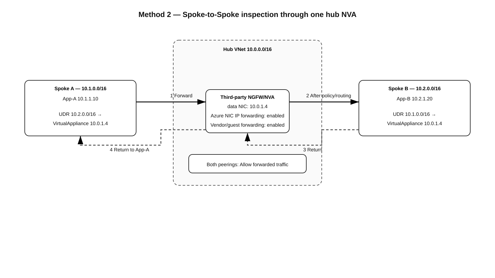
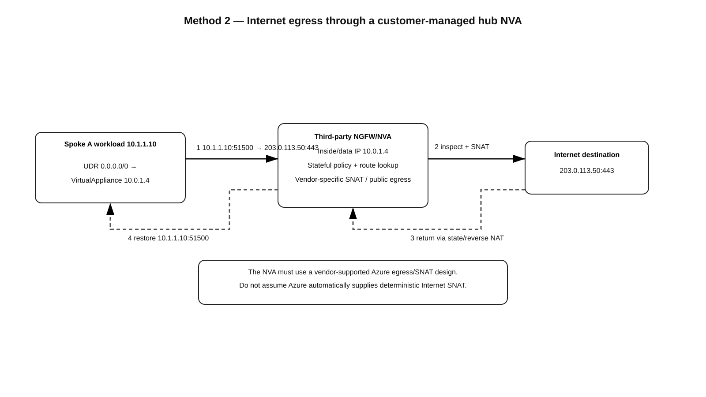
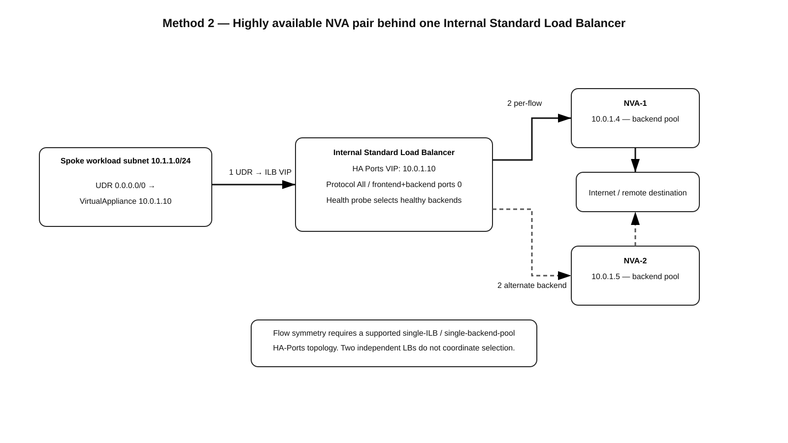

# Third-Party NGFW/NVA in a Customer-Managed Hub VNet — Method 2 Deep Dive

Last validated: 2026-09-05

> **Source information** = behavior explicitly documented by Microsoft or cited vendor-neutral Azure documentation.  
> **Additional explanation** = networking context added to make the documented behavior easier to operationalize.  
> **Reasonable inference** = a design conclusion that should be validated against the exact NVA vendor, image, version, licensing model, and Azure deployment guide.

---

## Supplied and supporting URLs

Supplied source:

- https://github.com/ccaiccie/knowledge/blob/main/09-05-26-12-41_Azure_Firewall_Inspection_Methods_Comprehensive_Study_Guide.md#4-method-2--third-party-ngfwnva-in-a-customer-managed-hub-vnet

Primary supporting Microsoft documentation:

- https://learn.microsoft.com/en-us/azure/architecture/networking/architecture/hub-spoke
- https://learn.microsoft.com/en-us/azure/networking/design-guide/hub-spoke
- https://learn.microsoft.com/en-us/azure/architecture/networking/guide/network-virtual-appliance-high-availability
- https://learn.microsoft.com/en-us/azure/load-balancer/load-balancer-ha-ports-overview
- https://learn.microsoft.com/en-us/azure/virtual-network/virtual-network-troubleshoot-nva
- https://learn.microsoft.com/en-us/azure/virtual-network/virtual-network-manage-peering
- https://learn.microsoft.com/en-us/azure/route-server/route-injection-in-spokes

---

# 1. What Method 2 actually is

Method 2 uses a **third-party Next-Generation Firewall (NGFW) or Network Virtual Appliance (NVA)** deployed as ordinary virtual-machine infrastructure inside a customer-owned Azure hub VNet. Examples can include vendor firewall, router, SD-WAN, IDS/IPS, proxy, or combined security appliances, but the exact dataplane, NAT, HA, licensing, management, and supported Azure topology are vendor-specific.

The important architectural fact is that Azure does **not** automatically insert an arbitrary VM-based firewall into traffic. You must deliberately create a routing path that makes the NVA the next hop. In the classic hub-and-spoke design that normally means:

1. Hub/spoke VNet peering.
2. `Allow forwarded traffic` on the relevant peerings.
3. User-defined routes (UDRs) on spoke workload subnets.
4. Azure NIC IP forwarding enabled on NVA dataplane NICs.
5. Packet forwarding enabled inside the appliance/guest OS.
6. Firewall security policy and routes inside the NVA.
7. A symmetric return path for stateful traffic.

This method differs from an NVA integrated directly into an Azure Virtual WAN hub. Here, **you own the VNet topology, subnets, route tables, load balancers, NVA lifecycle, vendor licensing, HA design, upgrades, and most failure-domain decisions**.

---

# 2. Reference addressing used throughout this guide

| Object | Example |
|---|---|
| Hub VNet | `10.0.0.0/16` |
| NVA subnet | `10.0.1.0/24` |
| NVA-1 dataplane IP | `10.0.1.4` |
| NVA-2 dataplane IP | `10.0.1.5` |
| Internal Load Balancer HA-Ports VIP | `10.0.1.10` |
| Spoke A | `10.1.0.0/16` |
| Spoke A workload | `10.1.1.10` |
| Spoke B | `10.2.0.0/16` |
| Spoke B workload | `10.2.1.20` |
| Example Internet server | `203.0.113.50:443` |

The examples are intentionally documentation addresses. Replace them with your actual prefixes and vendor-supported interface design.

---

# 3. Baseline single-NVA service insertion



[Editable draw.io diagram](images/09-05-26-19-45_method2_spoke_to_spoke.drawio)

**What this image shows**  
Spoke A and Spoke B are not directly peered. Each spoke has a route for the opposite spoke that points to the NVA's private dataplane IP `10.0.1.4` as a `VirtualAppliance` next hop. The NVA performs stateful inspection and routes the packet onward.

**What matters**  
The reverse direction must also traverse the NVA. Stateful firewalls normally require both directions of a connection to hit the same state owner. The peering setting `Allow forwarded traffic` permits traffic that did not originate in the hub VNet to cross the hub/spoke peering after the NVA forwards it.

**What to verify**  
The effective route on each workload NIC, route-table association, `VirtualAppliance` next hop IP, peering state, `allowForwardedTraffic`, Azure NIC IP forwarding, appliance routes/policy, and the reverse path.

## 3.1 Spoke A to Spoke B packet flow

Example flow:

```text
10.1.1.10:51500  ->  10.2.1.20:443
```

Step by step:

1. `10.1.1.10` performs its Azure route lookup.
2. A UDR for `10.2.0.0/16` wins and points to next-hop type `VirtualAppliance`, IP `10.0.1.4`.
3. Azure carries the packet over the Spoke-A-to-Hub peering to NVA-1.
4. NVA-1 receives the original packet, evaluates security/NAT policy, and performs its own routing decision.
5. Assuming no NAT is required for this private east-west flow, the source remains `10.1.1.10` and destination remains `10.2.1.20`.
6. NVA-1 forwards the packet through the Hub-to-Spoke-B peering.
7. Spoke B accepts forwarded traffic because the peering is configured to receive forwarded traffic.
8. `10.2.1.20` replies to `10.1.1.10`.
9. Spoke B's route for `10.1.0.0/16` points back to `10.0.1.4`.
10. The same NVA sees the reverse flow, finds the existing state, and forwards it to Spoke A.

**Success condition:** the effective routes on both spokes intentionally point remote-spoke prefixes through the NVA, rather than allowing a direct system route to bypass inspection.

---

# 4. Required Azure platform settings

## 4.1 Enable IP forwarding on each NVA dataplane NIC

Azure must permit the NIC to receive traffic whose destination is not the NIC itself and transmit forwarded traffic. Microsoft troubleshooting guidance explicitly checks `EnableIPForwarding` for NVAs.

```cli
az network nic update \
  --resource-group RG-Network \
  --name nva1-data-nic \
  --ip-forwarding true
```

Verify:

```cli
az network nic show \
  --resource-group RG-Network \
  --name nva1-data-nic \
  --query enableIPForwarding \
  --output tsv
```

Expected successful result:

```text
true
```

Microsoft's equivalent PowerShell verification presents the important field as:

```text
EnableIPForwarding : True
```

Enabling this Azure property is only half of the requirement. The firewall/router operating system must also be configured to forward packets between its interfaces or logical zones.

## 4.2 Allow forwarded traffic on peerings

For a hub NVA to forward traffic that originated in another VNet, configure the peerings so forwarded traffic is permitted.

Example:

```cli
az network vnet peering create \
  --resource-group RG-Network \
  --vnet-name VNet-Hub \
  --name Hub-to-SpokeA \
  --remote-vnet VNet-SpokeA \
  --allow-forwarded-traffic true \
  --allow-vnet-access true
```

Verify:

```cli
az network vnet peering show \
  --resource-group RG-Network \
  --vnet-name VNet-Hub \
  --name Hub-to-SpokeA \
  --query '{state:peeringState,forwarded:allowForwardedTraffic}'
```

Expected logical result for this design:

```text
{
  "forwarded": true,
  "state": "Connected"
}
```

Microsoft documents `Connected` as the healthy peering state.

---

# 5. UDR design

## 5.1 East-west spoke inspection

Spoke A route table:

| Destination | Next-hop type | Next-hop IP |
|---|---|---|
| `10.2.0.0/16` | `VirtualAppliance` | `10.0.1.4` |

Spoke B route table:

| Destination | Next-hop type | Next-hop IP |
|---|---|---|
| `10.1.0.0/16` | `VirtualAppliance` | `10.0.1.4` |

Example creation:

```cli
az network route-table route create \
  --resource-group RG-Network \
  --route-table-name RT-SpokeA \
  --name To-SpokeB-via-NVA \
  --address-prefix 10.2.0.0/16 \
  --next-hop-type VirtualAppliance \
  --next-hop-ip-address 10.0.1.4
```

Verify configured objects:

```cli
az network route-table route list \
  --resource-group RG-Network \
  --route-table-name RT-SpokeA \
  --output table
```

Expected result for the lab values in this guide:

```text
Name                 AddressPrefix   NextHopType       NextHopIpAddress
-------------------  --------------  ----------------  ----------------
To-SpokeB-via-NVA    10.2.0.0/16     VirtualAppliance  10.0.1.4
```

The exact CLI column formatting can vary with Azure CLI version; the **success criteria** are the destination prefix, `VirtualAppliance`, and expected NVA next-hop IP.

## 5.2 Internet egress



[Editable draw.io diagram](images/09-05-26-19-45_method2_internet_egress.drawio)

**What this image shows**  
A spoke workload uses a `0.0.0.0/0` UDR to send Internet traffic to the hub NVA. The NVA inspects the flow and uses a vendor-supported public egress/SNAT design.

**What matters**  
Do not assume that simply pointing `0.0.0.0/0` at an NVA automatically produces a correct deterministic public-source address. The firewall vendor's Azure design may use a public IP on a NIC, Public Load Balancer, separate egress interface, SNAT on the appliance, or another documented pattern.

**What to verify**  
Spoke effective default route, NVA state/NAT table, chosen Azure public egress mechanism, NSGs, public-IP association, next hop, and the return path.

Example spoke default route:

```cli
az network route-table route create \
  --resource-group RG-Network \
  --route-table-name RT-SpokeA \
  --name Default-via-NVA \
  --address-prefix 0.0.0.0/0 \
  --next-hop-type VirtualAppliance \
  --next-hop-ip-address 10.0.1.4
```

Packet before the NVA:

```text
Src 10.1.1.10:51500 -> Dst 203.0.113.50:443
```

After vendor-specific outbound SNAT, conceptually:

```text
Src <NVA-public-egress-IP>:<translated-port> -> Dst 203.0.113.50:443
```

The exact translated address/port must come from the configured vendor/Azure egress architecture; it should not be guessed.

---

# 6. Highly available NVA pair with Internal Standard Load Balancer HA Ports



[Editable draw.io diagram](images/09-05-26-19-45_method2_ha_ports.drawio)

**What this image shows**  
The route next hop is no longer an individual NVA IP. It is the internal Standard Load Balancer frontend VIP `10.0.1.10`. An HA-Ports rule distributes flows to healthy NVA instances.

**What matters**  
Microsoft documents HA Ports as the Standard Load Balancer feature intended to load-balance all ports/protocols for NVA scenarios. Selection is per flow using the five tuple. Microsoft also documents important symmetry boundaries: a supported **single internal load balancer / single backend pool** topology can preserve symmetry, while designs involving multiple independent load balancers do not coordinate flow selection.

**What to verify**  
Standard SKU, internal frontend, HA Ports rule, backend pool membership, health probe, supported NIC topology, vendor support for HA Ports, UDR next hop = ILB VIP, and NVA state synchronization requirements.

### 6.1 Route difference from single-NVA mode

Single NVA:

```text
0.0.0.0/0 -> VirtualAppliance 10.0.1.4
```

HA-Ports pair:

```text
0.0.0.0/0 -> VirtualAppliance 10.0.1.10
```

Do not leave some spokes pointing at an individual member while others point at the VIP unless that is an explicitly supported vendor design.

### 6.2 HA Ports facts that matter operationally

Microsoft currently documents:

- HA Ports are available on **Internal Standard Load Balancer**.
- The HA rule effectively covers all TCP/UDP ports by using frontend/backend port `0` and protocol `All`.
- Health probes remove unhealthy NVA instances from new-flow selection.
- ICMP is supported when HA Ports is enabled on an internal Standard Load Balancer.
- IP fragmentation is not supported by HA Ports.
- TCP idle timeout isn't supported for ILB HA Ports when a UDR is used to forward traffic to the ILB.
- Flow symmetry is not guaranteed when two or more load-balancer components make independent decisions.

Microsoft's NVA HA architecture guidance also notes that dual-NIC and multi-load-balancer designs can require SNAT to preserve symmetry. Treat the appliance vendor's reference architecture as authoritative for the exact NIC, LB, floating-IP, and SNAT model.

---

# 7. Hybrid VPN/ExpressRoute inspection

A hub can also contain VPN Gateway or ExpressRoute Gateway. Gateway transit by itself does not guarantee that hybrid traffic traverses the NVA.

For **Spoke -> on-premises** inspection, the spoke needs an on-premises-prefix UDR (or default route, depending on design) toward the NVA. The NVA then routes toward the hub gateway.

For **on-premises -> Spoke** inspection, the gateway-side routing must also direct the spoke destination through the NVA. In classic UDR designs this commonly means a route on `GatewaySubnet` for spoke prefixes whose next hop is the NVA or supported HA frontend.

Example intent:

```text
Spoke route:
172.16.0.0/12 -> NVA

GatewaySubnet route:
10.1.0.0/16 -> NVA
```

If only the spoke has a UDR but the gateway learns a direct path to the spoke, the return/inbound leg can bypass the firewall and create asymmetric state.

When using gateway transit:

- Hub-side peering: **Allow gateway transit**.
- Spoke-side peering: **Use remote gateways**.
- Relevant peerings: **Allow forwarded traffic**.

Also verify whether BGP-propagated on-premises routes should be enabled on each route table. Disabling propagation can be useful when static UDRs must remain authoritative, but it can also hide required prefixes if the static route set is incomplete.

---

# 8. Route selection and why effective routes matter more than configured UDRs

A configured route table proves only that a route object exists. It does **not** prove that a workload is actually using it.

Always inspect the effective route table of the workload NIC:

```cli
az network nic show-effective-route-table \
  --resource-group RG-Apps \
  --name spokeA-vm1-nic \
  --output table
```

For Spoke A -> Spoke B inspection, look for an effective route with these logical properties:

```text
Address prefix: 10.2.0.0/16
Next hop type:  VirtualAppliance
Next hop:       10.0.1.4     # or 10.0.1.10 in HA-Ports mode
State:          Active
```

Failure indicators include:

- A more specific route points somewhere else.
- A peering/system route bypasses the desired NVA path.
- A BGP route from a gateway or Route Server changes the selected path.
- The UDR is associated with the wrong subnet.
- The intended route is present but marked invalid/inactive.

---

# 9. Azure Network Watcher verification

## 9.1 Next Hop

```cli
az network watcher show-next-hop \
  --resource-group RG-NetworkWatcher \
  --vm spokeA-vm1 \
  --nic spokeA-vm1-nic \
  --source-ip 10.1.1.10 \
  --dest-ip 10.2.1.20
```

**What it tests:** the Azure-selected next hop for a specific source/destination pair.

**Success criteria:** the result resolves to the intended virtual appliance path.

**Failure indicator:** next hop is direct peering, Internet, virtual network gateway, `None`, or an unexpected IP.

**Next action:** inspect effective routes and route-table associations before troubleshooting firewall policy.

## 9.2 Peering state

```cli
az network vnet peering show \
  --resource-group RG-Network \
  --vnet-name VNet-Hub \
  --name Hub-to-SpokeA \
  --query peeringState \
  --output tsv
```

Expected:

```text
Connected
```

---

# 10. Stateful symmetry and NAT

Stateful NGFWs normally track a connection as a bidirectional session. A path such as:

```text
Forward: Spoke A -> NVA-1 -> Spoke B
Return:  Spoke B -> NVA-2 -> Spoke A
```

can fail unless the vendor synchronizes state in a way that explicitly supports that topology.

The most common symmetry tools are:

- Matching UDRs in both directions.
- A single ILB HA-Ports flow-selection domain.
- Vendor state synchronization.
- Vendor clustering/floating-IP mechanisms.
- SNAT when the architecture intentionally needs the return packet to target the same NVA instance.

Microsoft's HA guidance explicitly calls out SNAT in some NVA architectures where different load balancers would otherwise choose different members.

---

# 11. Internet ingress / DNAT

Internet ingress to VM-based third-party NVAs is **vendor and topology dependent**. Do not copy Virtual WAN integrated-NVA DNAT behavior into this customer-managed VNet design.

Common vendor patterns can include:

- Public IP directly associated with an NVA interface.
- Public Standard Load Balancer in front of an HA firewall pair.
- Vendor clustering with Azure LB health probes.
- DNAT on the NVA to a private workload IP.
- SNAT as required by the vendor design to preserve return symmetry.

The central rule is that the inbound and return path must be designed together. Microsoft documents that public + internal load-balancer combinations can lose symmetry because the load balancers make independent decisions. If a vendor requires two load balancers, follow the vendor's documented SNAT/state design rather than assuming Azure will pin both directions to one appliance.

---

# 12. Configuration order

A practical deployment order is:

1. Allocate non-overlapping hub/spoke address spaces.
2. Deploy dedicated NVA subnet(s) according to vendor guidance.
3. Deploy NVA instance(s), management interfaces, marketplace plan, and licenses.
4. Enable Azure NIC IP forwarding on dataplane NICs.
5. Configure guest/vendor routing and packet forwarding.
6. Create hub/spoke peerings.
7. Enable `Allow forwarded traffic` as required.
8. If hybrid gateway transit is used, configure `Allow gateway transit` and `Use remote gateways` correctly.
9. Build security zones, routes, objects, policy, and NAT on the NVA.
10. For HA, deploy the supported ILB/public-LB/vendor clustering components before pointing production routes at them.
11. Create UDRs.
12. Associate route tables to workload subnets and, where required, `GatewaySubnet`.
13. Validate effective routes and Network Watcher next hop.
14. Test stateful flows in both directions.
15. Validate failover before production cutover.

---

# 13. High availability and failover

For an ILB HA-Ports deployment, failover is driven by health-probe state for **new flows**. Microsoft documents that the NVA architecture commonly uses frequent probes and that failed-probe thresholds determine when a backend is removed. Existing-session behavior is NVA/vendor specific; a load balancer health decision alone does not recreate firewall state on another VM.

Test separately:

- NVA process failure.
- NVA VM shutdown.
- Dataplane NIC failure where meaningful.
- Health-probe failure.
- Availability-zone failure if using zonal/zone-redundant components.
- NVA state-sync failure.
- Route withdrawal/change if BGP is also used.

Measure both **new-session recovery** and **existing-session survival**. They are not the same metric.

---

# 14. Common mistakes

1. **Pointing a UDR directly at NVA-1 in an HA design.** The NVA may fail while the route still points to its IP.
2. **Using an ILB VIP but forgetting HA Ports.** A conventional port-specific rule is not generic firewall service insertion.
3. **Assuming `Allow forwarded traffic` creates routes.** Microsoft explicitly states that it permits forwarded traffic but does not create UDRs or NVAs.
4. **Enabling Azure NIC IP forwarding but not enabling forwarding in the appliance OS.** Both are required.
5. **Forcing only the forward path through the firewall.** Stateful symmetry must be designed in both directions.
6. **Mixing a single-NVA route and HA-VIP route in documentation without saying which architecture is active.** The next-hop IP is different and the failure behavior is different.
7. **Assuming two load balancers will choose the same firewall.** Microsoft says independent LBs do not coordinate flow selection.
8. **Assuming a default route solves hybrid inspection.** GatewaySubnet and reverse-direction routing still need deliberate design.
9. **Ignoring BGP route propagation.** A learned route can alter the effective path.
10. **Treating a vendor appliance like Azure Firewall.** DNAT/SNAT, HA, management NICs, licensing, upgrades, health checks, and state synchronization differ by product.

---

# 15. Symptom-based troubleshooting

## Symptom: Spoke A cannot reach Spoke B

**Where:** Spoke A VM NIC.  
**Tool:** Effective routes / Network Watcher Next Hop.  
**Tests:** Whether `10.2.0.0/16` resolves to the expected NVA or ILB VIP.  
**Expected:** `VirtualAppliance` with `10.0.1.4` or `10.0.1.10`.  
**Failure means:** route missing, wrong association, competing route, or propagation issue.  
**Next action:** fix routing before checking firewall rules.

Then verify:

- Peering is `Connected`.
- `Allow forwarded traffic = true`.
- NVA NIC IP forwarding is enabled.
- Vendor forwarding is enabled.
- NVA has a route to Spoke B.
- Security policy permits the flow.

## Symptom: SYN reaches the server but the connection never establishes

**Likely cause:** asymmetric return path or missing reverse policy/state.

Check the effective route from the destination subnet back to the source. Packet captures on both NVA directions are especially useful.

## Symptom: Internet works from the firewall but not from spokes

Check:

- `0.0.0.0/0` effective route on the spoke.
- NVA security rule.
- NVA outbound NAT/SNAT rule.
- Public egress IP/LB design.
- NSG on NVA interfaces.
- Vendor route/default route.

## Symptom: HA pair works until one NVA fails

Check:

- ILB health probe status.
- Backend-pool membership.
- HA-Ports rule.
- Whether the UDR points at the VIP rather than a member.
- NVA cluster/state-sync health.
- Whether existing sessions are expected to survive failover for that vendor.

## Symptom: On-premises -> spoke bypasses the NVA

Check the gateway-side route toward the spoke. If `GatewaySubnet` or the effective hybrid routing path points directly to the spoke, the inbound leg can bypass inspection even if the spoke's outbound path uses the NVA.

---

# 16. Design decision matrix

| Requirement | Recommended Method-2 pattern |
|---|---|
| Lab / simple POC | Single NVA next hop |
| Production stateful firewall | Vendor-supported HA pair |
| Generic all-port NVA load balancing | Internal Standard LB HA Ports, if vendor supports it |
| Spoke-to-spoke inspection | Reciprocal spoke UDRs through NVA/VIP |
| Internet egress | `0.0.0.0/0` through NVA plus vendor-supported SNAT/public egress |
| Hybrid inspection | Spoke UDRs plus symmetric gateway-side routing |
| Dynamic route injection | Consider Azure Route Server + NVA; see the separate Route Server deep dive |
| Transparent chaining around supported public endpoints | Consider Azure Gateway Load Balancer; see the separate GWLB deep dive |
| Fully Azure-managed firewall HA/lifecycle | Consider Azure Firewall instead of Method 2 |

---

# 17. Final validation checklist

- [ ] NVA vendor/image/version supports the planned Azure topology.
- [ ] Marketplace plan and licensing requirements are understood.
- [ ] Hub/spoke prefixes do not overlap.
- [ ] Dataplane NIC IP forwarding is enabled in Azure.
- [ ] Forwarding is enabled in the appliance OS.
- [ ] Peerings are `Connected`.
- [ ] `Allow forwarded traffic` is enabled where needed.
- [ ] Gateway transit settings are correct if hybrid connectivity is used.
- [ ] UDR next-hop IP matches the active architecture: appliance IP **or** HA frontend VIP.
- [ ] Effective routes are validated on workload NICs.
- [ ] Reverse paths traverse the same stateful inspection domain.
- [ ] NAT behavior is explicitly documented.
- [ ] HA probe, backend health, failover, and state synchronization are tested.
- [ ] Internet ingress and egress designs follow the NVA vendor's Azure guidance.
- [ ] No diagram mixes single-NVA and load-balanced next-hop models.

---

# Sources

- https://github.com/ccaiccie/knowledge/blob/main/09-05-26-12-41_Azure_Firewall_Inspection_Methods_Comprehensive_Study_Guide.md#4-method-2--third-party-ngfwnva-in-a-customer-managed-hub-vnet
- https://learn.microsoft.com/en-us/azure/architecture/networking/architecture/hub-spoke
- https://learn.microsoft.com/en-us/azure/networking/design-guide/hub-spoke
- https://learn.microsoft.com/en-us/azure/architecture/networking/guide/network-virtual-appliance-high-availability
- https://learn.microsoft.com/en-us/azure/load-balancer/load-balancer-ha-ports-overview
- https://learn.microsoft.com/en-us/azure/virtual-network/virtual-network-troubleshoot-nva
- https://learn.microsoft.com/en-us/azure/virtual-network/virtual-network-manage-peering
- https://learn.microsoft.com/en-us/azure/route-server/route-injection-in-spokes
