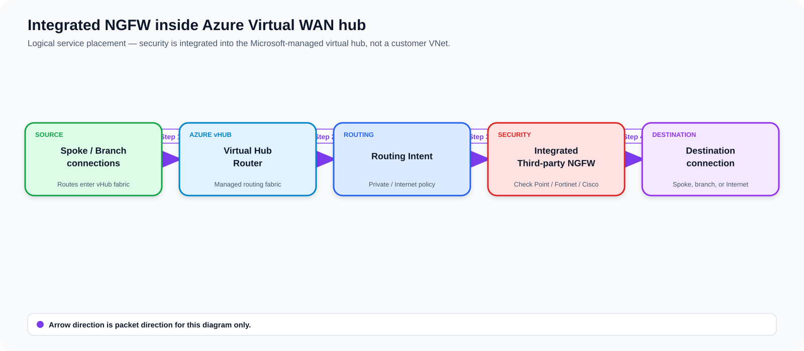
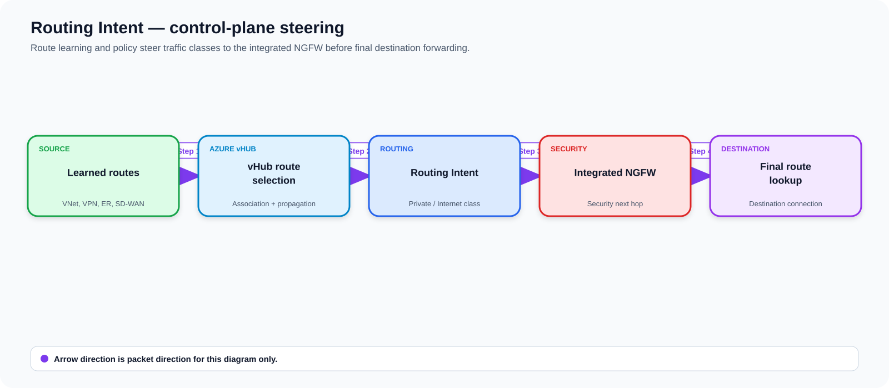
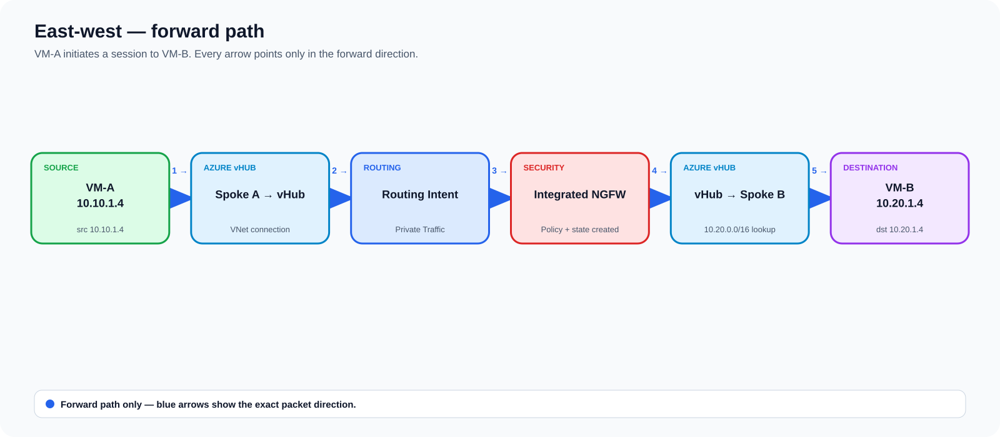
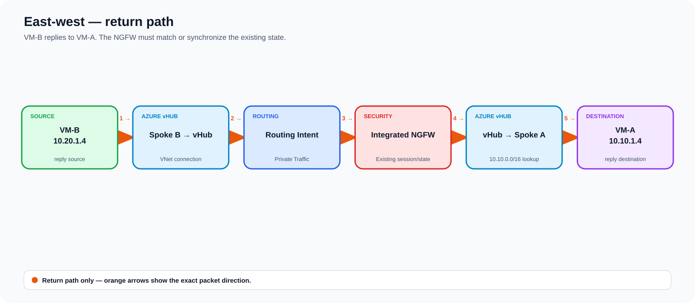
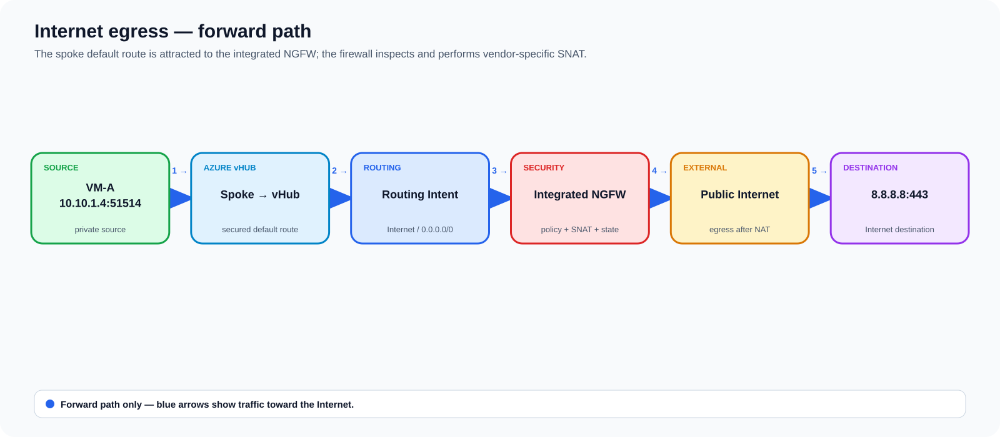
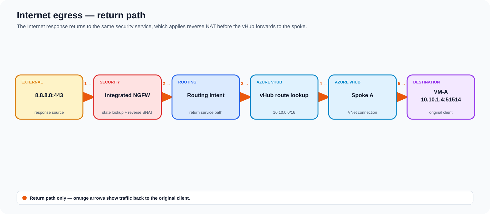
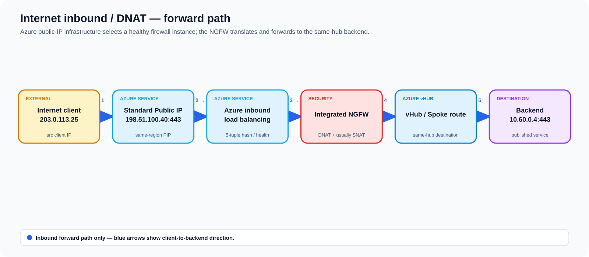
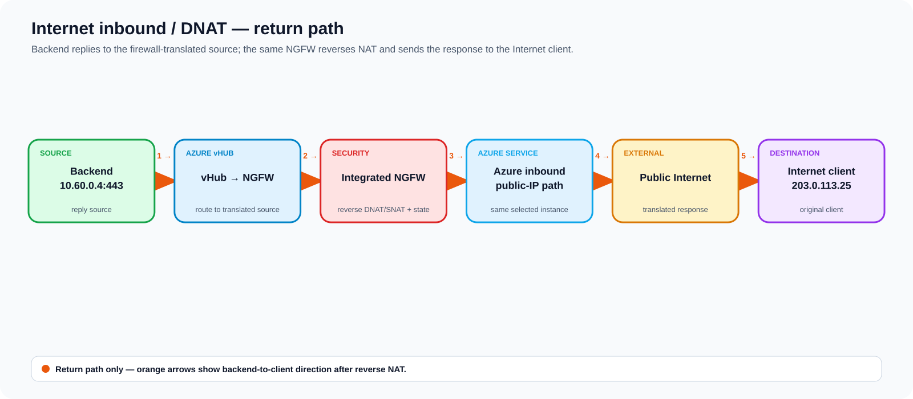

# Integrated Third-Party NGFW Directly Inside an Azure Virtual WAN Hub — Deep Dive

> A focused study guide for the **Integrated Network Virtual Appliance (NVA)** model where a supported third-party next-generation firewall is deployed **directly inside the Microsoft-managed Azure Virtual WAN virtual hub**. This is not the same as a VM firewall in a customer-managed hub VNet, and it is not the same as a SaaS security integration.

## Source URLs

- https://learn.microsoft.com/en-us/azure/virtual-wan/about-nva-hub
- https://learn.microsoft.com/en-us/azure/virtual-wan/third-party-integrations
- https://learn.microsoft.com/en-us/azure/virtual-wan/how-to-nva-hub
- https://learn.microsoft.com/en-us/azure/virtual-wan/about-virtual-hub-routing
- https://learn.microsoft.com/en-us/azure/virtual-wan/how-to-network-virtual-appliance-inbound
- https://learn.microsoft.com/en-us/azure/virtual-wan/route-maps-about
- https://learn.microsoft.com/en-us/azure/virtual-wan/hub-settings
- https://learn.microsoft.com/en-us/cli/azure/network/virtual-appliance?view=azure-cli-latest
- https://learn.microsoft.com/en-us/cli/azure/network/vhub/routing-intent?view=azure-cli-latest
- https://learn.microsoft.com/en-us/azure/architecture/networking/architecture/hub-spoke-virtual-wan-architecture
- https://learn.microsoft.com/en-us/security/zero-trust/azure-virtual-wan
- https://www.cisco.com/c/en/us/td/docs/security/firepower/quick_start/consolidated_ftdv_gsg/threat-defense-virtual-77-gsg/m_threat-defense-virtual-solution-on-tdv_virtual_wan_azure.html
- https://sc1.checkpoint.com/documents/IaaS/WebAdminGuides/EN/CP_CloudGuard_Network_for_Azure_vWAN/Content/Topics-Azure-vWAN/Introduction.htm

---

## 1. The precise architecture

**Source information:** Azure Virtual WAN supports a special class of **Integrated NVAs** engineered jointly by Microsoft and selected vendors. Their backing infrastructure is placed directly into the Virtual WAN hub as Microsoft-owned/managed virtual-machine-scale-set and load-balancer infrastructure. The customer does not create normal NVA NICs and subnets in a VNet and does not manage the hub VNet itself.

**Additional explanation:** The virtual hub is a managed transit router. Routing Intent inserts the NGFW into the forwarding path. Azure manages the plumbing between the hub router and the NVA instances; the vendor management plane manages firewall policy, licensing, signatures, and vendor-specific lifecycle functions.

**Reasonable inference:** Treat internal load-balancer addresses and internal vHub next-hop addresses as implementation details unless the vendor or Microsoft explicitly exposes them. Design against supported resource abstractions—Virtual Hub, Network Virtual Appliance, Routing Intent, VNet/branch connections—not against undocumented internal IPs.



[Editable draw.io source](images/09-05-26-20-00_integrated_ngfw_architecture_v2.drawio)

**What this image shows:** VNets and branches attach to the managed vHub. Routing Intent makes the integrated NGFW the service next hop for selected traffic classes.

**What matters:** The NVA is *inside the vHub service*, not in a peered customer VNet. Azure owns the insertion fabric and load-balancing infrastructure.

**What to verify:** Virtual WAN is Standard, the NVA resource is healthy, the intended routing policies are configured, and connected networks learn the required private/default routes.

## 2. Current NGFW choices and what is *not* the same thing

As of September 2026, Microsoft lists these security-capable Integrated NVA offers:

| Role | Vendor / offer | Virtual WAN vendor identifier | Notes |
|---|---|---|---|
| NGFW | Check Point CloudGuard Network Security | `checkpoint` | Direct vHub NVA; eligible for Routing Intent; documented DNAT support |
| NGFW | Fortinet Next-Generation Firewall | `fortinet-ngfw` | Direct vHub NGFW; Microsoft documents support up to 80 NVA scale units |
| NGFW | Cisco Secure Firewall Threat Defense Virtual | `cisco-tdv-vwan-nva` | Direct vHub NGFW; Cisco documents a three-interface deployment model |
| Dual-role SD-WAN + NGFW | Fortinet | `fortinet-sdwan-and-ngfw` | Terminates Fortinet SD-WAN and performs NGFW inspection; Microsoft documents up to 20 scale units |

### Important Palo Alto distinction

Palo Alto Networks **Cloud NGFW for Azure Virtual WAN** is currently documented by Microsoft as a **SaaS solution**, not as an Integrated NVA. It can still be selected as a Routing Intent next hop, but its lifecycle and resource model differ from the IaaS Integrated NVA model covered here.

## 3. Why this method exists

Use this architecture when you want:

- centralized third-party firewall inspection without maintaining a customer-owned hub VNet;
- automatic Virtual WAN route integration instead of per-spoke UDR service insertion;
- platform-managed NVA infrastructure placement, load balancing, and health integration;
- a supported vendor NGFW directly adjacent to Virtual WAN gateways and hub routing;
- branch/VNet/inter-hub inspection using Routing Intent;
- optionally, a dual-role device that combines SD-WAN termination with inspection.

Do **not** choose it merely because you want to run arbitrary marketplace firewall VMs. Only qualified Integrated NVA offers can occupy this vHub NVA role.

## 4. Hub constraints and prerequisites

- Virtual WAN must be **Standard**; Integrated NVAs are not supported in a Basic hub.
- A vHub has a constrained integrated-NVA slot; the Azure Architecture Center currently documents **one Integrated NVA per hub**, shared across connectivity, NGFW, and dual-role categories.
- You cannot use two separate Integrated NVAs in the same hub to create a vendor-A SD-WAN gateway plus vendor-B NGFW chain. Use a dual-role offer or another architecture.
- NVA licensing is vendor-provided. Microsoft currently documents **BYOL as the licensing model for Integrated NVAs**, plus Azure NVA Infrastructure Unit charges and normal networking charges.
- Deployment uses the vendor's Azure Marketplace Managed Application or other vendor-supported automation.
- The hub and NVA address/route design must avoid overlaps with connected VNets and branches.
- Required RBAC includes read access to the target virtual hub and write access to `Microsoft.Network/networkVirtualAppliances`; Internet inbound also requires public-IP join/inbound-rule permissions.

### MANA hardware transition

Microsoft currently applies a `LegacyVMNVA` tag to vHub NVA deployments to keep them off MANA hardware through **May 31, 2027**. Microsoft states that the tag stops being honored after that date. Validate a vendor software release that supports MANA before then.

## 5. NVA Infrastructure Units: what they actually mean

Microsoft defines one **NVA Infrastructure Unit** as infrastructure capable of approximately **500 Mbps aggregate throughput**. This is a capacity guideline for the Azure infrastructure, not a promise that the firewall software will forward 500 Mbps under every feature set.

Deep packet inspection, TLS decryption, IPsec encryption, threat prevention, URL filtering, logging, and packet size can reduce real application throughput. Always size from the vendor's tested throughput table for the exact feature profile.

Example reasoning:

- 4 infrastructure units → Azure infrastructure guideline of 2 Gbps aggregate;
- this does **not** mean 2 Gbps of threat-prevention + TLS-decryption throughput;
- vendor scale-unit limits can be lower than the platform's abstract unit mechanism.

## 6. The control plane: Routing Intent is the service-insertion mechanism



[Editable draw.io source](images/09-05-26-20-00_routing_intent_control_plane_v2.drawio)

**What this image shows:** Route sources feed the virtual hub router. Routing Intent makes the Integrated NGFW a next hop for a traffic class. After inspection, the hub performs the final destination lookup.

**What matters:** The firewall does not edit every spoke route table. Azure Virtual WAN programs hub/connection routing to attract the relevant traffic.

**What to verify:** Routing Intent state, vHub effective routes, NVA effective routes where exposed, spoke NIC effective routes, and branch BGP routes.

### 6.1 Private Traffic policy

The Private Traffic policy treats private connectivity as a traffic class and can steer:

- VNet-to-VNet;
- branch-to-VNet and VNet-to-branch;
- S2S VPN, P2S, and ExpressRoute-originated private traffic;
- branch-to-branch when the relevant inter-hub/branch-to-branch design is enabled;
- inter-hub private traffic when configured for inspection.

By default, Routing Intent private traffic uses the RFC 1918 aggregates:

```text
10.0.0.0/8
172.16.0.0/12
192.168.0.0/16
```

If your enterprise uses non-RFC1918 private ranges, add those prefixes to the private traffic configuration; otherwise they can fall outside the intended inspection class.

### 6.2 Internet Traffic policy

The Internet policy steers `0.0.0.0/0` toward the selected security next hop for direct Internet egress inspection.

For spoke VNets, verify the connection's **Enable Internet Security / propagate default route** behavior. A firewall policy existing in the hub does not help if the spoke never learns or selects the secured default route.

### 6.3 Routing Intent CLI

The Azure CLI routing-intent command group is currently documented as a **Preview extension** (Virtual WAN extension, Azure CLI 2.55.0+).

```cli
az network vhub routing-intent show   --resource-group RG-Network   --vhub vhub-westus2   --name routingIntent   --output json
```

**Expected successful state:** The returned object contains the intended routing policies and next-hop resource IDs. Do not validate only that the command succeeds; confirm the Private/Internet destinations point to the expected NVA resource.

A source-supported creation pattern is:

```cli
az network vhub routing-intent create   --name routingIntent   --resource-group RG-Network   --vhub vhub-westus2   --routing-policies "[{name:InternetTraffic,destinations:[Internet],next-hop:<NVA_RESOURCE_ID>},{name:PrivateTrafficPolicy,destinations:[PrivateTraffic],next-hop:<NVA_RESOURCE_ID>}]"
```

Replace `<NVA_RESOURCE_ID>` with the actual Integrated NVA Azure resource ID.

## 7. East-west packet flow: Spoke A to Spoke B

Example:

- VM-A: `10.10.1.4`
- VM-B: `10.20.1.4`
- Private Traffic policy: NVA

### Forward-path diagram



[Editable draw.io source](images/09-05-26-20-00_eastwest_forward.drawio)

**What this image shows:** Only the initiating VM-A → VM-B direction. Every blue arrow points in the packet's forward direction, so the service-insertion sequence is unambiguous.

**What matters:** The vHub classifies the destination as Private Traffic, Routing Intent sends it through the Integrated NGFW, and only after inspection does the vHub resolve the destination spoke.

**What to verify:** VM-A selects the vHub path, the NVA creates a session from `10.10.1.4` to `10.20.1.4`, and the post-inspection lookup resolves toward Spoke B.

### Return-path diagram



[Editable draw.io source](images/09-05-26-20-00_eastwest_return.drawio)

**What this image shows:** Only VM-B → VM-A reply traffic. Orange arrows distinguish the return path from the initiating direction.

**What matters:** The reply is reinserted through the same logical security service. The NGFW must match the existing session or synchronized state before the vHub forwards toward Spoke A.

**What to verify:** The firewall sees the return packet in the established session/state and no alternate route bypasses the security next hop.

### Forward packet

1. VM-A creates `src=10.10.1.4`, `dst=10.20.1.4`.
2. The Spoke A connection carries the packet to the vHub.
3. The vHub identifies the destination as Private Traffic.
4. Routing Intent sends the packet to the Integrated NGFW service.
5. Azure selects a healthy NVA backend according to the integrated service implementation.
6. The NGFW performs stateful policy/threat inspection.
7. For private-to-private traffic, avoid unnecessary SNAT unless the vendor design requires it.
8. The inspected packet returns to the vHub routing fabric.
9. The vHub resolves `10.20.0.0/16` to the Spoke B connection.
10. VM-B receives the original source address unless NAT policy changed it.

### Return packet

1. VM-B replies toward `10.10.1.4`.
2. The reply enters the same vHub.
3. Private Traffic Routing Intent reinserts the NGFW.
4. The NGFW matches the state/session or synchronized state.
5. The vHub resolves Spoke A and forwards the reply.

## 8. Branch-to-spoke and ExpressRoute packet flow

For a branch prefix `10.50.0.0/16` reaching Spoke A `10.10.0.0/16`:

1. Branch traffic arrives through the vHub S2S VPN gateway, ExpressRoute gateway, or a supported dual-role SD-WAN NVA path.
2. The vHub learns/owns the branch route in its managed routing fabric.
3. Private Traffic Routing Intent inserts the NGFW before the spoke lookup.
4. The firewall policy sees branch source and Azure destination.
5. After inspection, the vHub forwards to the VNet connection.
6. The return path is likewise attracted to the NGFW.

For branch-to-branch inspection, ensure the Virtual WAN design enables the required branch-to-branch/inter-hub behavior; simply deploying a firewall does not guarantee every branch transit path is inspected.

## 9. Internet egress

For VM-A `10.10.1.4` to `8.8.8.8:443`:

### Forward-path diagram



[Editable draw.io source](images/09-05-26-20-00_internet_egress_forward.drawio)

**What this image shows:** Only workload-to-Internet traffic. Blue arrows show the spoke default route entering the vHub, matching Internet Routing Intent, traversing the NGFW, and leaving after security policy and SNAT.

**What matters:** The workload must actually learn/select the secured `0.0.0.0/0`; otherwise the diagrammed path is bypassed.

**What to verify:** Effective routes contain the secured default route, the NGFW records the outbound session/NAT mapping, and the translated flow exits through the intended Internet path.

1. The spoke must have a secured default route learned through the vHub connection.
2. `0.0.0.0/0` matches the Internet routing policy.
3. The vHub inserts the Integrated NGFW.
4. The NGFW applies security policy and vendor-specific egress NAT.
5. Traffic exits toward the Internet through the integrated security path.
6. Return packets land on the security service, reverse NAT/state is applied, and the vHub returns traffic to the spoke.

### Return-path diagram



[Editable draw.io source](images/09-05-26-20-00_internet_egress_return.drawio)

**What this image shows:** Only Internet-to-workload response traffic. Orange arrows show the response reaching the security service, matching state, receiving reverse NAT, and returning through the vHub to VM-A.

**What matters:** Return traffic must reach compatible firewall state; reverse NAT restores the original private client before the vHub performs the spoke lookup.

**What to verify:** The response matches the existing firewall session/NAT entry and the final vHub lookup resolves `10.10.0.0/16` toward Spoke A.

**Common failure:** `0.0.0.0/0` is absent from the workload NIC's effective route table because Internet security/default-route propagation was not enabled for the VNet connection.

## 10. Internet inbound / DNAT — a distinct capability

Microsoft currently documents DNAT only for:

- `checkpoint`
- `fortinet-ngfw`
- `fortinet-sdwan-and-ngfw`

Cisco FTDv is not currently listed on Microsoft's vHub NVA DNAT support page.

### Inbound / forward-path diagram



[Editable draw.io source](images/09-05-26-20-00_dnat_inbound_forward.drawio)

**What this image shows:** Only Internet-client-to-backend traffic. Blue arrows show the client reaching the Standard public IP, Azure selecting a healthy NVA instance, the NGFW applying DNAT and usually SNAT, and the vHub forwarding to the same-hub backend.

**What matters:** DNAT is not merely a firewall rule. The NVA deployment must have been created as Internet-Inbound capable so Azure programs the public-IP and health/load-balancing infrastructure.

**What to verify:** Same-region Standard IPv4 public IP, deployment-time DNAT eligibility, healthy NVA probes, the expected pre/post-NAT tuple, and same-hub destination routing.

### Return-path diagram



[Editable draw.io source](images/09-05-26-20-00_dnat_inbound_return.drawio)

**What this image shows:** Only backend-to-Internet-client response traffic. Orange arrows make the reverse direction explicit: backend → vHub/NVA → reverse DNAT/SNAT → Azure public-IP path → original client.

**What matters:** This is why integrated inbound designs normally SNAT as well as DNAT: the backend replies to a firewall-owned translated source, keeping the response tied to the selected firewall instance/state.

**What to verify:** The backend reply targets the translated source, the same firewall instance/state reverses NAT, and the client receives the response from the published public IP.

### 10.1 DNAT requirements and limits

Microsoft currently documents:

- Standard SKU IPv4 public IP only;
- public IP must be in the same region as the NVA;
- public IP cannot already be attached elsewhere;
- **new NVA deployments must be created with at least one DNAT public IP**—an older/non-DNAT deployment cannot simply be converted later;
- DNAT destination must be connected to the **same vHub** as the NVA; inter-hub DNAT is unsupported;
- Azure uses five-tuple hashing across healthy NVA instances;
- Azure documents a 4-minute idle flow timeout for this integrated DNAT path;
- multi-flow applications such as FTP are not guaranteed to place related five-tuples on the same firewall instance;
- in most cases the NVA must **SNAT as well as DNAT** so return traffic goes directly back to the chosen firewall instance;
- Microsoft notes approximately 65,000 concurrent translated connections per NVA instance to the same backend tuple due to SNAT port uniqueness.

### 10.2 Before/after packet fields

Example source-supported conceptual transformation:

```text
Internet side before NAT
src = 203.0.113.25:51514
dst = 198.51.100.40:443

Trusted side after NVA NAT
src = <chosen-firewall-private-IP>:<translated-port>
dst = 10.60.0.4:443
```

The firewall applies the reverse translation for the response.

## 11. Azure health probes and failover

For DNAT-capable Fortinet and Check Point integrations, Microsoft documents three health-probe purposes:

1. Internet inbound / DNAT probe — external/untrusted interface health.
2. Datapath probe — trusted/internal interface health used for private routing policy traffic.
3. NVA health probe — overall NVA/VMSS instance health.

The probe source is Azure platform IP `168.63.129.16`.

Documented ports:

| Provider | Probe port |
|---|---:|
| Fortinet | 8008 |
| Check Point | 8117 |

If a probe is blocked, Azure can stop sending traffic to an otherwise running appliance. Troubleshooting must therefore distinguish **VM is powered on** from **Azure considers this datapath healthy**.

## 12. NVA resource operations

### Show the Integrated NVA resource

```cli
az network virtual-appliance show   --resource-group RG-NVA   --name nva-vwan-west   --output json
```

**Expected successful state:** The resource exists, references the expected virtual hub/vendor/version/scale configuration, and its provisioning state is successful. Field availability varies by offer/API version, so use the complete JSON rather than assuming a vendor-specific table schema.

### List NVAs

```cli
az network virtual-appliance list   --resource-group RG-NVA   --output table
```

**Success criteria:** The expected NVA resource is present in the intended region/resource group.

### List NVA connections

```cli
az network virtual-appliance connection list   --resource-group RG-NVA   --nva nva-vwan-west   --output json
```

**What it tests:** Azure-side connection objects under the NVA resource.

### Restart an instance

```cli
az network virtual-appliance restart   --resource-group RG-NVA   --network-virtual-appliance-name nva-vwan-west   --instance-ids 0
```

Use restart/reimage only after confirming the vendor's HA and state behavior. Restarting all instances simultaneously is a very different failure event from removing one unhealthy backend.

## 13. Deployment workflow

### Step 1 — Build the Standard Virtual WAN and vHub

1. **Virtual WANs** → create/select the WAN.
2. Ensure **Type = Standard**.
3. Create the regional **Virtual Hub** and allocate a nonoverlapping hub prefix.
4. Add S2S/P2S/ExpressRoute gateways where required.

### Step 2 — Create the Integrated NVA

1. Virtual Hub → **Third Party Providers** → **Network Virtual Appliances**.
2. Select **Create network virtual appliance**.
3. Select the supported vendor identifier.
4. Azure redirects to the vendor's Marketplace Managed Application workflow.
5. Provide licensing/management/bootstrap data required by that vendor.
6. Select scale units based on vendor throughput guidance.
7. If you require supported DNAT, make the deployment Internet-Inbound capable **at creation time** and associate at least one compliant public IP.

### Step 3 — Configure the vendor security plane

Typical tasks include:

- connect to central firewall management;
- install license/entitlements;
- apply zones/interfaces as defined by the vendor integration;
- configure security policy and threat profiles;
- configure logging;
- configure NAT where needed;
- confirm health-probe handling;
- validate the supported software release.

You generally do **not** log in to normal Azure VM NIC/subnet objects and wire the vHub NVA like a customer-managed firewall pair.

### Step 4 — Configure Routing Intent

1. Virtual Hub → **Routing Intent and policies**.
2. Private traffic → **Network Virtual Appliance** → select the NVA.
3. Internet traffic → **Network Virtual Appliance** when direct Internet inspection is required.
4. Add non-RFC1918 private prefixes if needed.
5. Enable the required inter-hub behavior for inspected hub-to-hub/branch transit.
6. Save and allow route programming to converge.

### Step 5 — Connect workloads and branches

- Add VNet connections.
- Connect S2S/P2S/ExpressRoute as needed.
- For a dual-role Fortinet deployment, follow Fortinet's branch overlay/SD-WAN workflow rather than assuming Azure VPN gateway resources are used for those proprietary tunnels.

## 14. Vendor-specific notes

### Check Point CloudGuard

Check Point's current Virtual WAN deployment guide uses a CloudGuard NVA in the vHub, connects it to a Security Management Server or Smart-1 Cloud, then configures Routing Intent for private and Internet traffic. DNAT is supported by the Azure integrated-NVA feature when the deployment is created appropriately.

### Fortinet NGFW

Microsoft currently exposes two Fortinet security-capable offers:

- NGFW-only (`fortinet-ngfw`), up to 80 scale units per Microsoft's partner page;
- dual-role SD-WAN + NGFW (`fortinet-sdwan-and-ngfw`), up to 20 scale units.

Use the dual-role offer when the same Fortinet service must terminate the proprietary SD-WAN overlay and inspect traffic.

### Cisco Secure Firewall Threat Defense Virtual

Cisco documents FTDv deployment directly in Azure Virtual WAN and currently states that the vWAN deployment model supports **three interfaces**. Use Cisco's deployment guide for FMC/CDO registration, interface/zone mapping, and policy deployment. Do not assume Microsoft vHub DNAT integration is supported simply because FTDv is a supported Routing Intent NGFW.

## 15. Route maps and BGP caveats

Route maps are useful in Virtual WAN, but Microsoft documents an important boundary: **route maps cannot be applied to connections between on-premises and an SD-WAN/Firewall NVA in the virtual hub**. They can still be used on other supported connections in a hub that contains an NVA.

For customer-managed NVAs peering to the hub using BGP, separate BGP-peer limits apply, but do not confuse that model with the Integrated NGFW service described here.

## 16. Custom route tables versus Routing Intent

Do not try to recreate an NVA-secured vHub by manually chaining custom vHub route tables when Routing Intent is the supported inspection mechanism. Microsoft Zero Trust guidance explicitly warns that custom route tables are not a substitute for Routing Intent and policies.

A spoke subnet UDR can still create a bypass if an operator has permission to attach routes that override the desired forwarding path. Restrict route-table RBAC in governed landing zones.

## 17. Verification runbook

### 17.1 Confirm NVA provisioning

**Where:** Azure CLI / NVA resource

**Command:**

```cli
az network virtual-appliance show -g RG-NVA -n nva-vwan-west -o json
```

**What it tests:** Azure resource provisioning and hub/vendor association.

**Expected state:** Provisioning successful and expected hub/vendor/scale information present.

**Failure means:** Managed application deployment, licensing bootstrap, provider orchestration, or Azure resource creation is incomplete.

**Next action:** Inspect deployment operations and vendor manager before touching routes.

### 17.2 Confirm Routing Intent

```cli
az network vhub routing-intent show   -g RG-Network   --vhub vhub-westus2   -n routingIntent   -o json
```

**Success criteria:** PrivateTraffic and/or Internet destinations are mapped to the intended NVA resource ID.

**Failure indicator:** Missing policy, wrong next hop, or stale/failed provisioning state.

### 17.3 Check workload effective routes

**Where:** VM NIC → **Effective routes**

For Internet inspection expect a secured default route rather than direct Internet bypass. For private inspection, verify the broad private route behavior installed by Routing Intent and ensure no more-specific UDR bypasses it.

### 17.4 Check firewall logs and sessions

**Where:** Vendor management plane

**What to correlate:** source/destination IP, port, action, rule, NAT translation, ingress/trusted-untrusted interface/zone, session ID, threat disposition, and timestamps.

**Success criteria:** Both directions appear in the expected stateful session.

### 17.5 Check DNAT health

For eligible Fortinet/Check Point deployments:

- confirm the public IP is associated under **Internet Inbound**;
- confirm Azure health probes from `168.63.129.16` complete TCP handshakes on the documented vendor port;
- packet-capture external and trusted sides;
- confirm trusted-side packet shows the expected DNAT and, where required, SNAT values.

## 18. Troubleshooting by symptom

### Symptom: Spoke can reach another spoke but firewall logs are empty

**Where:** Source NIC effective routes, vHub Routing Intent, subnet UDRs.

**What it tests:** Whether traffic actually enters the secured vHub path.

**Likely causes:** Private Traffic policy missing, more-specific UDR bypass, direct mesh connectivity, or wrong hub association.

**Next action:** Remove/adjust the bypass path, then retest while watching a session log.

### Symptom: Internet works but bypasses NGFW

**Where:** VNet connection Internet security/default-route propagation and NIC effective routes.

**Expected:** A default route attributable to the secured Virtual WAN path.

**Failure means:** The workload still selects Azure's direct system Internet route or another more-specific path.

### Symptom: NVA is running but traffic is not delivered

**Where:** NVA health, vendor logs, Azure health probes.

**What it tests:** Difference between compute liveness and datapath eligibility.

**Next action:** Verify probe handling, interface state, vendor process health, and NVA resource provisioning.

### Symptom: DNAT public IP receives SYN but server sees nothing

**Where:** NVA external/trusted packet capture.

**Expected:** SYN on the external side; translated packet on trusted side.

**Failure means:** DNAT/security policy, probe eligibility, or post-NAT routing issue.

### Symptom: Server receives DNAT packet but reply never reaches client

**Where:** Server effective routes and NVA trusted capture.

**Critical fact:** The common integrated design SNATs inbound traffic to the firewall private IP so return traffic goes directly to the same selected firewall instance.

**Next action:** Verify translated source address, hub-prefix reachability, and same-hub restriction.

### Symptom: DNAT works locally but not to a workload behind another vHub

**Cause:** Microsoft documents inter-hub DNAT as unsupported.

**Next action:** Publish through an NVA/DNAT service in the destination workload's local hub, or use an upstream application ingress architecture.

### Symptom: Related FTP/control and data flows hit different firewall instances

**Cause:** Azure's integrated inbound load balancing hashes each five-tuple independently; related flows are not guaranteed to land on the same NVA backend.

**Next action:** Follow vendor guidance for multi-flow applications or use an architecture that does not require backend affinity across separate five-tuples.

## 19. Common mistakes

1. Calling Palo Alto Cloud NGFW an “Integrated NVA.” It is currently a vWAN **SaaS** integration.
2. Assuming any Marketplace firewall VM can be deployed into the vHub.
3. Treating NVA Infrastructure Units as guaranteed inspected throughput.
4. Creating DNAT rules on an older NVA that was not deployed as Internet-Inbound capable.
5. Expecting Cisco FTDv to support Azure's integrated vHub DNAT merely because it supports vHub Routing Intent.
6. Forgetting non-RFC1918 corporate ranges in Private Traffic.
7. Leaving a spoke UDR that bypasses the secured path.
8. Assuming a running VM means Azure considers the datapath healthy.
9. Expecting inter-hub DNAT to work.
10. Mixing the Integrated NVA model with BGP peering to an NVA in a spoke VNet.
11. Ignoring MANA software compatibility before May 31, 2027.

## 20. When this method is better than a customer-managed hub VNet

Choose Integrated NVA in the vHub when you value:

- reduced Azure plumbing ownership;
- Virtual WAN-native route insertion;
- Azure-managed appliance infrastructure integration;
- direct support for Virtual WAN branch/VNet/transit patterns;
- vendor NGFW policy while retaining Microsoft-managed hub routing.

Choose a customer-managed hub VNet instead when you require:

- an unsupported firewall vendor/image;
- direct control of NICs/subnets/load balancers;
- custom service chains with multiple appliances;
- unusual routing/NAT constructs outside the Integrated NVA contract;
- architecture that cannot fit the one-integrated-NVA-per-hub model.

## 21. Final mental model

The cleanest way to remember this architecture is:

```text
Connected network
   -> Virtual WAN managed hub router
   -> Routing Intent classifies Private or Internet traffic
   -> Azure-managed service insertion to supported Integrated NGFW
   -> vendor firewall policy / NAT / inspection
   -> back to vHub managed routing fabric
   -> final connection / gateway / Internet path
```

The **vHub router controls the Azure routing plane**, while the **NGFW controls the security/session plane**. Azure and the vendor jointly hide much of the VMSS/load-balancer implementation detail. That is the central operational difference from building your own firewall pair in a hub VNet.

---

## Sources

- Microsoft Learn — About NVAs in a Virtual WAN hub: https://learn.microsoft.com/en-us/azure/virtual-wan/about-nva-hub
- Microsoft Learn — Third-party integrations with Virtual WAN Hub: https://learn.microsoft.com/en-us/azure/virtual-wan/third-party-integrations
- Microsoft Learn — Create an NVA in the hub: https://learn.microsoft.com/en-us/azure/virtual-wan/how-to-nva-hub
- Microsoft Learn — Virtual hub routing / Routing Intent: https://learn.microsoft.com/en-us/azure/virtual-wan/about-virtual-hub-routing
- Microsoft Learn — Integrated NVA Internet inbound / DNAT: https://learn.microsoft.com/en-us/azure/virtual-wan/how-to-network-virtual-appliance-inbound
- Microsoft Learn — Route maps considerations: https://learn.microsoft.com/en-us/azure/virtual-wan/route-maps-about
- Microsoft Learn — Virtual hub settings: https://learn.microsoft.com/en-us/azure/virtual-wan/hub-settings
- Microsoft Learn — Azure CLI Network Virtual Appliance: https://learn.microsoft.com/en-us/cli/azure/network/virtual-appliance?view=azure-cli-latest
- Microsoft Learn — Azure CLI vHub Routing Intent: https://learn.microsoft.com/en-us/cli/azure/network/vhub/routing-intent?view=azure-cli-latest
- Azure Architecture Center — Hub-spoke with Virtual WAN: https://learn.microsoft.com/en-us/azure/architecture/networking/architecture/hub-spoke-virtual-wan-architecture
- Microsoft Zero Trust guidance for Virtual WAN: https://learn.microsoft.com/en-us/security/zero-trust/azure-virtual-wan
- Cisco — Secure Firewall Threat Defense Virtual on Azure Virtual WAN: https://www.cisco.com/c/en/us/td/docs/security/firepower/quick_start/consolidated_ftdv_gsg/threat-defense-virtual-77-gsg/m_threat-defense-virtual-solution-on-tdv_virtual_wan_azure.html
- Check Point — CloudGuard Network for Azure Virtual WAN: https://sc1.checkpoint.com/documents/IaaS/WebAdminGuides/EN/CP_CloudGuard_Network_for_Azure_vWAN/Content/Topics-Azure-vWAN/Introduction.htm
