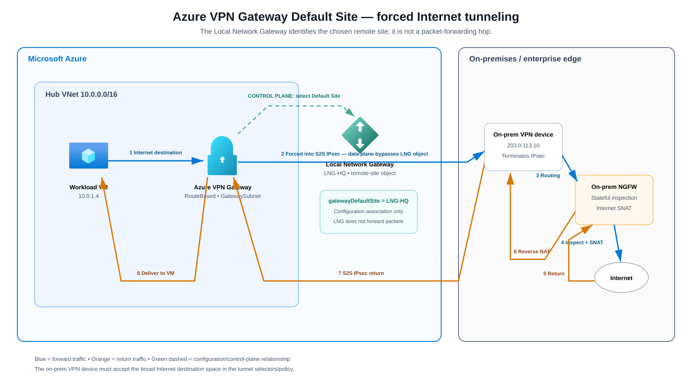

# Azure Forced Tunneling — Inspect Internet Traffic On-Premises

> **Scope:** Force Azure workload Internet egress to an on-premises security stack for inspection, logging, policy enforcement, and Internet breakout instead of allowing the workload to use Azure's normal Internet system route.

## Source URLs

- https://learn.microsoft.com/en-us/azure/vpn-gateway/about-site-to-site-tunneling
- https://learn.microsoft.com/en-us/azure/vpn-gateway/site-to-site-tunneling
- https://learn.microsoft.com/en-us/cli/azure/network/vnet-gateway?view=azure-cli-latest
- https://learn.microsoft.com/en-us/cli/azure/network/local-gateway?view=azure-cli-latest
- https://learn.microsoft.com/en-us/cli/azure/network/vpn-connection?view=azure-cli-latest
- https://learn.microsoft.com/en-us/azure/expressroute/expressroute-routing
- https://learn.microsoft.com/en-us/cli/azure/network/express-route?view=azure-cli-latest
- https://learn.microsoft.com/en-us/cli/azure/network/express-route/peering?view=azure-cli-latest
- https://learn.microsoft.com/en-us/azure/vpn-gateway/vpn-gateway-vpn-faq
- https://learn.microsoft.com/en-us/azure/firewall/management-nic
- https://learn.microsoft.com/en-us/azure/firewall/forced-tunneling
- https://learn.microsoft.com/en-us/azure/virtual-network/manage-route-table
- https://learn.microsoft.com/en-us/cli/azure/network/route-table?view=azure-cli-latest
- https://learn.microsoft.com/en-us/cli/azure/network/vnet/peering?view=azure-cli-latest
- https://learn.microsoft.com/en-us/azure/network-watcher/next-hop-overview
- https://learn.microsoft.com/en-us/azure/network-watcher/diagnose-vm-network-routing-problem-cli
- https://learn.microsoft.com/en-us/cli/azure/network/watcher?view=azure-cli-latest
- https://learn.microsoft.com/en-us/azure/networking/design-guide/hub-spoke

## Table of contents

- [1. What forced tunneling actually does](#1-what-forced-tunneling-actually-does)
- [2. Design variants](#2-design-variants)
- [3. VPN Gateway with a BGP-advertised default route](#3-vpn-gateway-with-a-bgp-advertised-default-route)
  - [3.1 Packet walk](#31-packet-walk)
  - [3.2 Why symmetry matters](#32-why-symmetry-matters)
  - [3.3 Azure CLI — inspect/build the BGP-side Azure objects](#33-azure-cli--inspectbuild-the-bgp-side-azure-objects)
  - [3.4 Azure CLI — verify BGP state and the learned default](#34-azure-cli--verify-bgp-state-and-the-learned-default)
- [4. VPN Gateway Default Site](#4-vpn-gateway-default-site)
  - [4.1 Resource relationship](#41-resource-relationship)
  - [4.2 Azure CLI — inspect or create the Local Network Gateway](#42-azure-cli--inspect-or-create-the-local-network-gateway)
  - [4.3 Azure CLI — set the Default Site](#43-azure-cli--set-the-default-site)
  - [4.4 Azure CLI — verify the configured Default Site](#44-azure-cli--verify-the-configured-default-site)
  - [4.5 Verify the S2S connection itself](#45-verify-the-s2s-connection-itself)
  - [4.6 Verify the workload actually uses the forced-tunnel path](#46-verify-the-workload-actually-uses-the-forced-tunnel-path)
  - [4.7 Default Site versus BGP default route](#47-default-site-versus-bgp-default-route)
  - [4.8 PowerShell equivalent](#48-powershell-equivalent)
- [5. ExpressRoute private-peering forced tunneling](#5-expressroute-private-peering-forced-tunneling)
  - [5.1 Azure CLI — verify circuit and private peering](#51-azure-cli--verify-circuit-and-private-peering)
  - [5.2 Azure CLI — inspect ExpressRoute routing tables](#52-azure-cli--inspect-expressroute-routing-tables)
  - [5.3 Critical route-withdrawal caveat](#53-critical-route-withdrawal-caveat)
- [6. Optional double inspection — Azure Firewall first, on-prem second](#6-optional-double-inspection--azure-firewall-first-on-prem-second)
  - [6.1 Azure CLI — spoke UDR to Azure Firewall](#61-azure-cli--spoke-udr-to-azure-firewall)
  - [6.2 Azure Firewall management plane](#62-azure-firewall-management-plane)
- [7. Azure route selection](#7-azure-route-selection)
  - [7.1 Azure CLI — inspect route table and propagation](#71-azure-cli--inspect-route-table-and-propagation)
- [8. Hub-and-spoke requirements](#8-hub-and-spoke-requirements)
  - [8.1 Azure CLI — configure gateway transit](#81-azure-cli--configure-gateway-transit)
  - [8.2 Verify the directional peering contract](#82-verify-the-directional-peering-contract)
- [9. DNS, MTU, and transport behavior](#9-dns-mtu-and-transport-behavior)
- [10. Verification — Azure](#10-verification--azure)
  - [10.1 Effective routes on the VM NIC](#101-effective-routes-on-the-vm-nic)
  - [10.2 Network Watcher Next Hop](#102-network-watcher-next-hop)
  - [10.3 VPN Gateway BGP peer status](#103-vpn-gateway-bgp-peer-status)
  - [10.4 VPN tunnel state](#104-vpn-tunnel-state)
  - [10.5 Optional Network Watcher troubleshooting session](#105-optional-network-watcher-troubleshooting-session)
- [11. Verification — on-premises](#11-verification--on-premises)
- [12. HA and failover](#12-ha-and-failover)
- [13. Common mistakes](#13-common-mistakes)
- [14. Symptom-based troubleshooting](#14-symptom-based-troubleshooting)
- [15. Design checklist](#15-design-checklist)
- [Sources](#sources)

---

## 1. What forced tunneling actually does

Forced tunneling is primarily a **routing design**. Azure must select an on-premises path for an Internet destination that would normally match Azure's system `0.0.0.0/0 -> Internet` route. The common forwarding objective is:

1. An Azure VM sends traffic to an Internet destination.
2. Azure route selection matches a default route that points toward the virtual network gateway or an inspection appliance.
3. Traffic crosses an S2S VPN or ExpressRoute path to the enterprise network.
4. An on-premises next-generation firewall (NGFW) inspects the session.
5. The on-premises edge performs source NAT (SNAT) to an enterprise public IP and sends the flow to the Internet.
6. The reply returns to the same enterprise public IP, reverse NAT/state is applied, and the packet is routed back to Azure.

### Source information

Microsoft documents two VPN Gateway forced-tunneling methods: advertise `0.0.0.0/0` from on-premises to Azure over Border Gateway Protocol (BGP), or configure a route-based VPN Gateway with a **Default Site**. For ExpressRoute, Microsoft accepts a default route on **private peering**, causing traffic from associated VNets to follow the customer network.

### Additional explanation

A VPN or ExpressRoute circuit by itself does not insert the firewall. The workload's **effective route** must first choose the hybrid path, and the on-premises routing domain must then steer that packet through the intended firewall and NAT path.

### Azure CLI lab variables

The examples below reuse these names where practical:

```cli
RG_NET='RG-Network'
RG_APP='RG-App'
LOCATION='eastus'
VNET_HUB='VNet-Hub'
VNET_SPOKE='VNet-Spoke'
VNG='VNG-Hub'
LNG='LNG-HQ'
VPN_CONN='CONN-HQ'
APP_VM='App01'
APP_NIC='NIC-App01'
APP_IP='10.10.1.4'
PUBLIC_TEST_IP='93.184.216.34'
ONPREM_VPN_PUBLIC_IP='203.0.113.10'
ONPREM_BGP_IP='169.254.21.2'
ONPREM_ASN='65010'
```

Use addresses and ASNs appropriate for your real design; the example public addresses are documentation-style placeholders.

---

## 2. Design variants

| Variant | How Azure obtains the default path | Transport | Best fit |
|---|---|---|---|
| **VPN Gateway + BGP** | On-premises advertises `0.0.0.0/0` | S2S IPsec | Dynamic routing, redundant VPNs, enterprise BGP designs |
| **VPN Gateway + Default Site** | A Local Network Gateway is assigned as the gateway default site | S2S IPsec | Route-based VPN when the default is not learned through BGP |
| **ExpressRoute private peering** | Customer advertises `0.0.0.0/0` on private peering | ExpressRoute private circuit | High-throughput private WAN Internet breakout |
| **Azure Firewall then on-prem** | Spoke UDR sends traffic to Azure Firewall; Azure Firewall is then forced on-prem | VPN or ExpressRoute | Explicit double-inspection requirement |

Do not collapse these into one topology. Their control planes, failure modes, and verification differ.

---

## 3. VPN Gateway with a BGP-advertised default route


[Editable draw.io source](images/09-05-26-20-53_Azure_Forced_Tunneling_On_Premises_Internet_Inspection_Deep_Dive_vpn_bgp_flow.drawio)

**What this image shows:** On-premises advertises `0.0.0.0/0` to Azure VPN Gateway. Internet traffic is then carried over the S2S IPsec tunnel to the enterprise firewall, which performs inspection and Internet SNAT.

**What matters:** BGP is the **control plane** that tells Azure where the default destination lives. IPsec is the **data-plane transport** used to carry the packets.

**What to verify:** The VM NIC has an active default route whose next-hop type is the virtual network gateway, the BGP peer is established, the S2S tunnel carries the traffic, the on-prem firewall sees the session, and the return path goes back through the same inspection domain.

### 3.1 Packet walk

Example:

```text
Azure VM:       10.10.1.4
Internet host:  93.184.216.34:443
Enterprise NAT: 203.0.113.25
```

Forward direction:

1. VM creates `10.10.1.4:51514 -> 93.184.216.34:443`.
2. Azure evaluates the effective routes for the VM NIC.
3. `93.184.216.34` matches the learned `0.0.0.0/0` route.
4. The selected next hop is the Azure virtual network gateway.
5. Azure VPN Gateway encrypts the inner packet into the S2S IPsec connection.
6. The on-prem VPN device decrypts it; the inner packet is still `10.10.1.4 -> 93.184.216.34`.
7. Enterprise routing forwards the packet through the on-prem NGFW.
8. The NGFW evaluates stateful security policy and performs Internet SNAT.

```text
Before on-prem SNAT:
10.10.1.4:51514 -> 93.184.216.34:443

After on-prem SNAT:
203.0.113.25:62001 -> 93.184.216.34:443
```

Return direction:

1. Internet server replies to `203.0.113.25:62001`.
2. The NGFW finds the session and reverses the NAT translation.
3. Destination becomes `10.10.1.4:51514` again.
4. The on-premises route to the Azure VNet points toward the S2S VPN.
5. The VPN device encrypts the return packet and sends it to Azure VPN Gateway.
6. Azure delivers it to the workload subnet.

### 3.2 Why symmetry matters

A stateful firewall normally must see both directions of the session. If the outbound flow goes through the firewall but the return takes another WAN/firewall path, the return can fail because the NAT state is absent, the security state is absent, or anti-spoofing/routing checks reject the flow.

### 3.3 Azure CLI — inspect/build the BGP-side Azure objects

The **on-premises device** is the component that actually advertises `0.0.0.0/0`; Azure CLI does not create that advertisement. Azure CLI configures the Azure-side peer metadata and lets you verify whether Azure receives it.

Inspect the VPN Gateway BGP settings:

```cli
az network vnet-gateway show \
  --resource-group "$RG_NET" \
  --name "$VNG" \
  --query "{gatewayType:gatewayType,vpnType:vpnType,enableBgp:enableBgp,bgpSettings:bgpSettings,provisioningState:provisioningState}" \
  --output yaml
```

If you are creating the Local Network Gateway with BGP metadata, the current CLI supports `--asn` and `--bgp-peering-address`:

```cli
az network local-gateway create \
  --resource-group "$RG_NET" \
  --name "$LNG" \
  --location "$LOCATION" \
  --gateway-ip-address "$ONPREM_VPN_PUBLIC_IP" \
  --asn "$ONPREM_ASN" \
  --bgp-peering-address "$ONPREM_BGP_IP"
```

Verify the resulting BGP identity:

```cli
az network local-gateway show \
  --resource-group "$RG_NET" \
  --name "$LNG" \
  --query "{gatewayIpAddress:gatewayIpAddress,bgpSettings:bgpSettings,provisioningState:provisioningState}" \
  --output yaml
```

**Success criteria:** the public VPN endpoint, BGP ASN, and BGP peer IP match the real on-premises VPN/router configuration.

**Failure indicators:** wrong ASN, wrong peer address, peer IP unreachable through the tunnel, or an LNG representing the wrong physical site.

### 3.4 Azure CLI — verify BGP state and the learned default

Check BGP peer status:

```cli
az network vnet-gateway list-bgp-peer-status \
  --resource-group "$RG_NET" \
  --name "$VNG" \
  --output table
```

Then prove the **workload** received the default route:

```cli
az network nic show-effective-route-table \
  --resource-group "$RG_APP" \
  --name "$APP_NIC" \
  --query "[?addressPrefix=='0.0.0.0/0']" \
  --output table
```

Do not stop at `BGP Connected`. A healthy BGP session with no accepted `0.0.0.0/0` does not implement forced tunneling.

**Success criteria:** BGP is connected and the VM NIC has an active `0.0.0.0/0` whose selected next-hop type is the Virtual Network Gateway.

---

## 4. VPN Gateway Default Site

Microsoft also supports forced tunneling on a **route-based VPN Gateway** by assigning one **Local Network Gateway (LNG)** as the gateway's **Default Site**. The LNG is an Azure configuration object that represents the remote on-premises site; it is **not** a packet-forwarding appliance. The actual data plane runs from the Azure VPN Gateway across the S2S IPsec tunnel to the real on-premises VPN device.



[Editable draw.io source](images/09-05-26-20-53_Azure_Forced_Tunneling_On_Premises_Internet_Inspection_Deep_Dive_vpn_default_site.drawio)

**What this image shows:** The Azure VPN Gateway is configured with `gatewayDefaultSite = LNG-HQ`. The green dashed relationship is configuration/control plane only. Internet-bound packets do not traverse the LNG object; they are forced into the S2S IPsec tunnel toward the on-premises VPN endpoint represented by `LNG-HQ`, then routed through the on-premises NGFW for inspection and Internet SNAT.

**What matters:** A Default Site is an explicit gateway configuration association. It is different from dynamically learning `0.0.0.0/0` through BGP. The on-premises VPN device must also accept the broad Internet destination space in its tunnel policy/traffic selectors.

**What to verify:** The gateway is `RouteBased`, `gatewayDefaultSite` references the intended LNG, the S2S connection to that LNG is connected, an Internet destination selects the Virtual Network Gateway rather than the Azure Internet system path, and the on-premises firewall sees both directions of the session.

### 4.1 Resource relationship

| Azure object | Example | Meaning |
|---|---|---|
| Virtual Network Gateway | `VNG-Hub` | Azure VPN Gateway that terminates the S2S tunnel |
| Local Network Gateway | `LNG-HQ` | Azure representation of the remote HQ VPN site |
| VPN connection | `CONN-HQ` | S2S connection between `VNG-Hub` and `LNG-HQ` |
| On-prem VPN public IP | `203.0.113.10` | Real public endpoint used by the remote VPN device |

The important relationship is:

`VNG-Hub.gatewayDefaultSite -> LNG-HQ`

That relationship tells Azure which represented remote site should receive forced-tunneled Internet traffic. It does **not** mean that `LNG-HQ` itself routes packets.

### 4.2 Azure CLI — inspect or create the Local Network Gateway

Inspect an existing LNG:

```cli
az network local-gateway show \
  --resource-group "$RG_NET" \
  --name "$LNG" \
  --output jsonc
```

For a non-BGP Default-Site design, a basic LNG can be created like this:

```cli
az network local-gateway create \
  --resource-group "$RG_NET" \
  --name "$LNG" \
  --location "$LOCATION" \
  --gateway-ip-address "$ONPREM_VPN_PUBLIC_IP" \
  --local-address-prefixes 10.50.0.0/16
```

**Important:** the address prefixes represent the remote private network ranges. The Default Site relationship—not an invented `0.0.0.0/0` entry on the LNG—is what tells the VPN Gateway to use that site for forced-tunneled Internet destinations.

### 4.3 Azure CLI — set the Default Site

Microsoft's current Azure CLI exposes `--gateway-default-site` on `az network vnet-gateway update`.

Using the LNG name:

```cli
az network vnet-gateway update \
  --resource-group "$RG_NET" \
  --name "$VNG" \
  --gateway-default-site "$LNG"
```

For automation, use the full resource ID:

```cli
LNG_ID=$(az network local-gateway show \
  --resource-group "$RG_NET" \
  --name "$LNG" \
  --query id \
  --output tsv)

az network vnet-gateway update \
  --resource-group "$RG_NET" \
  --name "$VNG" \
  --gateway-default-site "$LNG_ID"
```

**Configuration order recommendation:** Build and validate the S2S tunnel first, validate on-premises routing/firewall/NAT, then set the Default Site.

### 4.4 Azure CLI — verify the configured Default Site

```cli
az network vnet-gateway show \
  --resource-group "$RG_NET" \
  --name "$VNG" \
  --query gatewayDefaultSite.id \
  --output tsv
```

**Success criteria:** the ID ends with `/localNetworkGateways/LNG-HQ` or the actual intended LNG name.

### 4.5 Verify the S2S connection itself

```cli
az network vpn-connection show \
  --resource-group "$RG_NET" \
  --name "$VPN_CONN" \
  --query "{connectionStatus:connectionStatus,provisioningState:provisioningState,localNetworkGateway2:localNetworkGateway2.id}" \
  --output json
```

**Success criteria:** the connection references the intended LNG, provisioning is successful, and the tunnel is connected/healthy before production Internet traffic is forced through it.

### 4.6 Verify the workload actually uses the forced-tunnel path

```cli
az network nic show-effective-route-table \
  --resource-group "$RG_APP" \
  --name "$APP_NIC" \
  --output table
```

Test a concrete public destination with Network Watcher:

```cli
az network watcher show-next-hop \
  --resource-group "$RG_APP" \
  --vm "$APP_VM" \
  --nic "$APP_NIC" \
  --source-ip "$APP_IP" \
  --dest-ip "$PUBLIC_TEST_IP" \
  --output table
```

**Success criteria:** the selected path is the Virtual Network Gateway/forced-tunnel path rather than direct Azure Internet egress.

### 4.7 Default Site versus BGP default route

| Characteristic | VPN Gateway Default Site | BGP `0.0.0.0/0` |
|---|---|---|
| Control mechanism | Explicit gateway property | Dynamic BGP route advertisement |
| Azure object involved | Local Network Gateway referenced by `gatewayDefaultSite` | BGP peer/route learned by VPN Gateway |
| Dynamic withdrawal | No BGP withdrawal semantics inherent to the property | Yes; route can be withdrawn/reselected |
| Data plane | S2S IPsec | S2S IPsec |
| Best mental model | "Use this represented VPN site as the forced-tunnel site" | "On-prem dynamically tells Azure that default destinations are reachable through me" |

### 4.8 PowerShell equivalent

```cli
$LocalGateway = Get-AzLocalNetworkGateway `
  -Name "LNG-HQ" `
  -ResourceGroupName "RG-Network"

$VirtualGateway = Get-AzVirtualNetworkGateway `
  -Name "VNG-Hub" `
  -ResourceGroupName "RG-Network"

Set-AzVirtualNetworkGatewayDefaultSite `
  -GatewayDefaultSite $LocalGateway `
  -VirtualNetworkGateway $VirtualGateway
```

---

## 5. ExpressRoute private-peering forced tunneling


[Editable draw.io source](images/09-05-26-20-53_Azure_Forced_Tunneling_On_Premises_Internet_Inspection_Deep_Dive_expressroute_flow.drawio)

**What this image shows:** The customer advertises `0.0.0.0/0` into ExpressRoute **private peering**, so the VNet sends Internet-bound traffic over ExpressRoute to the corporate edge and firewall.

**What matters:** ExpressRoute private connectivity is not the same thing as IPsec encryption. If encryption is required by policy, it must be designed separately.

**What to verify:** The default route is present on private peering, the VNet is attached to the correct ExpressRoute gateway/circuit, on-premises has routes back to the Azure prefixes, and the firewall/NAT return path is symmetric.

### Packet fields

```text
Across ExpressRoute private path:
10.20.1.4:51514 -> 93.184.216.34:443

After on-prem Internet SNAT:
203.0.113.25:62001 -> 93.184.216.34:443
```

### 5.1 Azure CLI — verify circuit and private peering

```cli
ER_RG='RG-ExpressRoute'
ER_CIRCUIT='ER-Prod'
ER_PEERING='AzurePrivatePeering'

az network express-route show \
  --resource-group "$ER_RG" \
  --name "$ER_CIRCUIT" \
  --query "{serviceProviderProvisioningState:serviceProviderProvisioningState,circuitProvisioningState:circuitProvisioningState,serviceKey:serviceKey}" \
  --output yaml

az network express-route peering show \
  --resource-group "$ER_RG" \
  --circuit-name "$ER_CIRCUIT" \
  --name "$ER_PEERING" \
  --output yaml
```

**Success criteria:** circuit/provider provisioning is healthy and `AzurePrivatePeering` exists with the intended BGP parameters.

### 5.2 Azure CLI — inspect ExpressRoute routing tables

The current Azure CLI exposes ExpressRoute route-table inspection commands. Microsoft still marks `az network express-route list-route-tables` and the summary command as **Preview**, so pin/test the CLI version used for production automation.

Primary path:

```cli
az network express-route list-route-tables \
  --resource-group "$ER_RG" \
  --name "$ER_CIRCUIT" \
  --peering-name AzurePrivatePeering \
  --path primary \
  --output table
```

Secondary path:

```cli
az network express-route list-route-tables \
  --resource-group "$ER_RG" \
  --name "$ER_CIRCUIT" \
  --peering-name AzurePrivatePeering \
  --path secondary \
  --output table
```

Compact summary:

```cli
az network express-route list-route-tables-summary \
  --resource-group "$ER_RG" \
  --name "$ER_CIRCUIT" \
  --peering-name AzurePrivatePeering \
  --path primary \
  --output table
```

**What to look for:** `0.0.0.0/0` must be visible on the expected private-peering path if ExpressRoute is intended to supply the default route.

Then prove the workload consumes it:

```cli
az network nic show-effective-route-table \
  --resource-group "$RG_APP" \
  --name "$APP_NIC" \
  --query "[?addressPrefix=='0.0.0.0/0']" \
  --output table
```

### 5.3 Critical route-withdrawal caveat

Microsoft documents that if the ExpressRoute-advertised `0.0.0.0/0` disappears because of an outage or misconfiguration, Azure can again use the system Internet path. Therefore, **the presence of a BGP default route is not by itself a fail-closed security control**.

If the requirement is *Internet must never bypass on-prem inspection*, add an independent enforcement mechanism rather than assuming loss of the BGP route will automatically blackhole traffic.

---

## 6. Optional double inspection — Azure Firewall first, on-prem second


[Editable draw.io source](images/09-05-26-20-53_Azure_Forced_Tunneling_On_Premises_Internet_Inspection_Deep_Dive_azure_firewall_then_onprem.drawio)

**What this image shows:** Spoke traffic first follows a UDR to Azure Firewall. Azure Firewall then uses its forced-tunnel path to a VPN/ExpressRoute gateway and on-premises firewall.

**What matters:** This is a separate **double-inspection** design. It adds latency, cost, state, NAT, logging, and troubleshooting complexity.

**What to verify:** Spoke UDR points to Azure Firewall, Azure Firewall has the required management-NIC architecture, the firewall's post-inspection traffic reaches the hybrid gateway, and the on-prem firewall policy matches the source address it actually receives.

### Azure Firewall SNAT effect

Microsoft documents that in Azure Firewall forced tunneling, Internet-bound traffic is SNATed to one of the firewall's private IP addresses before it is sent on-premises. Therefore the downstream on-prem firewall generally does **not** see the original spoke IP as the packet source.

```text
Original workload:
10.30.1.4:51514 -> 93.184.216.34:443

After Azure Firewall forced-tunnel SNAT:
10.0.1.4:<translated-port> -> 93.184.216.34:443

After on-prem Internet SNAT:
203.0.113.25:<translated-port> -> 93.184.216.34:443
```

### 6.1 Azure CLI — spoke UDR to Azure Firewall

Assume the Azure Firewall private IP used as the next hop is `10.0.1.4`:

```cli
RT_SPOKE='RT-Spoke-ForcedTunnel'
SPOKE_FW_IP='10.0.1.4'

az network route-table create \
  --resource-group "$RG_APP" \
  --name "$RT_SPOKE" \
  --location "$LOCATION"

az network route-table route create \
  --resource-group "$RG_APP" \
  --route-table-name "$RT_SPOKE" \
  --name default-via-azure-firewall \
  --address-prefix 0.0.0.0/0 \
  --next-hop-type VirtualAppliance \
  --next-hop-ip-address "$SPOKE_FW_IP"
```

Associate the route table with the workload subnet:

```cli
az network vnet subnet update \
  --resource-group "$RG_APP" \
  --vnet-name "$VNET_SPOKE" \
  --name WorkloadSubnet \
  --route-table "$RT_SPOKE"
```

Verify the configured route object:

```cli
az network route-table route list \
  --resource-group "$RG_APP" \
  --route-table-name "$RT_SPOKE" \
  --output table
```

Then verify the NIC effective route; a configured UDR that is not associated with the correct subnet does nothing.

### 6.2 Azure Firewall management plane

Current Azure Firewall forced-tunneling architecture uses `AzureFirewallManagementSubnet` and a separate management NIC/public IP to keep platform operational traffic on an Azure-managed path rather than sending that management traffic through the customer forced-tunnel route. Microsoft specifies a minimum `/26` management subnet.

Do not attach an arbitrary `0.0.0.0/0 -> on-prem` UDR to the management subnet unless Microsoft explicitly documents that topology. The purpose of the management NIC is to preserve Azure Firewall platform management connectivity.

---

## 7. Azure route selection

Azure first applies **longest-prefix match**. When multiple candidate routes have the same prefix length, route source preference is:

| Route source at equal prefix length | Preference |
|---|---:|
| User-defined route (UDR) | 1 |
| BGP-propagated route | 2 |
| System route | 3 |

Important examples:

| Scenario | Prefix | Next hop | Source |
|---|---|---|---|
| Normal Azure Internet egress | `0.0.0.0/0` | Internet | System/default |
| BGP forced tunneling | `0.0.0.0/0` | Virtual Network Gateway | Gateway/BGP |
| Explicit NVA insertion | `0.0.0.0/0` | Virtual Appliance | User-defined route |

A same-length UDR can override a BGP default. A **more-specific** route always wins before route-source preference is considered.

### 7.1 Azure CLI — inspect route table and propagation

```cli
az network route-table show \
  --resource-group "$RG_APP" \
  --name "$RT_SPOKE" \
  --query "{disableBgpRoutePropagation:disableBgpRoutePropagation,routes:routes[].{name:name,prefix:addressPrefix,nextHopType:nextHopType,nextHopIpAddress:nextHopIpAddress}}" \
  --output yaml
```

If the BGP-based design depends on gateway-learned routes, `disableBgpRoutePropagation: true` can remove those learned routes from subnets associated with that route table.

To explicitly ensure propagation is enabled on an existing route table:

```cli
az network route-table update \
  --resource-group "$RG_APP" \
  --name "$RT_SPOKE" \
  --disable-bgp-route-propagation false
```

Do this only when that is the intended design; route propagation affects all gateway-learned prefixes associated with that route table, not just the default route.

---

## 8. Hub-and-spoke requirements

When the hybrid gateway is in a hub VNet and spokes consume it through peering:

- Hub-to-spoke peering must allow gateway transit.
- Spoke-to-hub peering must use the remote gateway.
- Address spaces must not overlap.
- Route-table association and BGP propagation settings must be reviewed together.
- If an NVA/Azure Firewall is inserted, forwarded-traffic permissions and symmetric UDRs matter.

### 8.1 Azure CLI — configure gateway transit

Hub side:

```cli
az network vnet peering create \
  --resource-group "$RG_NET" \
  --vnet-name "$VNET_HUB" \
  --name Hub-to-Spoke \
  --remote-vnet "/subscriptions/<SUBSCRIPTION_ID>/resourceGroups/$RG_APP/providers/Microsoft.Network/virtualNetworks/$VNET_SPOKE" \
  --allow-vnet-access true \
  --allow-forwarded-traffic true \
  --allow-gateway-transit true
```

Spoke side:

```cli
az network vnet peering create \
  --resource-group "$RG_APP" \
  --vnet-name "$VNET_SPOKE" \
  --name Spoke-to-Hub \
  --remote-vnet "/subscriptions/<SUBSCRIPTION_ID>/resourceGroups/$RG_NET/providers/Microsoft.Network/virtualNetworks/$VNET_HUB" \
  --allow-vnet-access true \
  --allow-forwarded-traffic true \
  --use-remote-gateways true
```

For existing peerings, update the directional properties rather than recreating them:

```cli
az network vnet peering update \
  --resource-group "$RG_NET" \
  --vnet-name "$VNET_HUB" \
  --name Hub-to-Spoke \
  --set allowGatewayTransit=true allowForwardedTraffic=true

az network vnet peering update \
  --resource-group "$RG_APP" \
  --vnet-name "$VNET_SPOKE" \
  --name Spoke-to-Hub \
  --set useRemoteGateways=true allowForwardedTraffic=true
```

### 8.2 Verify the directional peering contract

```cli
az network vnet peering show \
  --resource-group "$RG_NET" \
  --vnet-name "$VNET_HUB" \
  --name Hub-to-Spoke \
  --query "{state:peeringState,allowGatewayTransit:allowGatewayTransit,allowForwardedTraffic:allowForwardedTraffic}" \
  --output yaml

az network vnet peering show \
  --resource-group "$RG_APP" \
  --vnet-name "$VNET_SPOKE" \
  --name Spoke-to-Hub \
  --query "{state:peeringState,useRemoteGateways:useRemoteGateways,allowForwardedTraffic:allowForwardedTraffic}" \
  --output yaml
```

**Success criteria:** hub side offers gateway transit, spoke side consumes the remote gateway, peering state is connected, and workload effective routes include the expected gateway-learned prefixes.

### Do not disable BGP propagation casually

Disabling gateway route propagation on a spoke route table removes routes learned through the virtual network gateway. That can remove both specific on-premises routes **and the default route that implements forced tunneling** in BGP-based designs.

---

## 9. DNS, MTU, and transport behavior

Forced tunneling changes IP forwarding, not DNS architecture. Decide independently whether workloads use Azure-provided DNS, Azure DNS Private Resolver, custom Azure DNS servers, or on-prem DNS.

For S2S VPN, IPsec encapsulation reduces available packet size. A design can have correct routing and still fail for larger transfers if MTU/MSS/Path MTU Discovery is broken. Typical symptoms are successful TCP handshakes but stalled HTTPS/download traffic.

ExpressRoute does not use IPsec unless an additional overlay is added, so its encapsulation/MTU behavior is different.

---

## 10. Verification — Azure

### 10.1 Effective routes on the VM NIC

```cli
az network nic show-effective-route-table \
  --resource-group "$RG_APP" \
  --name "$APP_NIC" \
  --output table
```

**Where:** Workload NIC.

**What it tests:** The combined system, UDR, and BGP route set Azure is actually using.

**Expected state:** An active `0.0.0.0/0` points to the intended forced-tunnel path; for direct VPN/ER gateway tunneling the next-hop type should be the virtual network gateway rather than `Internet`.

**Failure indicators:** Default route absent; default still points to `Internet`; UDR unexpectedly wins; propagated routes are disabled.

Expected-state example is conceptual because output columns vary by CLI/API version:

```text
Source                    State   Address Prefix   Next Hop Type
------------------------  ------  ---------------  ----------------------
VirtualNetworkGateway     Active  0.0.0.0/0        VirtualNetworkGateway
Default                   Active  10.10.0.0/16      VnetLocal
```

### 10.2 Network Watcher Next Hop

```cli
az network watcher show-next-hop \
  --resource-group "$RG_APP" \
  --vm "$APP_VM" \
  --nic "$APP_NIC" \
  --source-ip "$APP_IP" \
  --dest-ip "$PUBLIC_TEST_IP" \
  --output table
```

Microsoft documents `show-next-hop` as a GA Azure CLI command. It requires Network Watcher availability in the VM's region.

**Success criteria:** next hop is the intended gateway/NVA path.

**Failure indicator:** `Internet` means that source/destination pair is not currently forced to on-premises.

### 10.3 VPN Gateway BGP peer status

```cli
az network vnet-gateway list-bgp-peer-status \
  --resource-group "$RG_NET" \
  --name "$VNG" \
  --output table
```

**What it tests:** BGP session state with VPN peers in the BGP forced-tunneling variant.

**Success criteria:** neighbor is connected and routes are being exchanged.

### 10.4 VPN tunnel state

```cli
az network vpn-connection show \
  --resource-group "$RG_NET" \
  --name "$VPN_CONN" \
  --query "{connectionStatus:connectionStatus,provisioningState:provisioningState,ingressBytesTransferred:ingressBytesTransferred,egressBytesTransferred:egressBytesTransferred}" \
  --output yaml
```

Run it before and during a test flow. Growing byte counters help prove whether the connection is carrying traffic, although they do not prove the correct firewall policy or NAT path by themselves.

### 10.5 Optional Network Watcher troubleshooting session

Azure Network Watcher exposes troubleshooting for VPN/gateway connectivity. Use it when the route points to the gateway but the hybrid connection itself appears unhealthy:

```cli
az network watcher troubleshooting start \
  --resource-group "$RG_NET" \
  --resource "$VPN_CONN" \
  --resource-type vpnConnection \
  --storage-account '<STORAGE_ACCOUNT_ID>' \
  --storage-path '<BLOB_CONTAINER_URL>'
```

Because required arguments and supported resource forms can vary by CLI/API revision, use `az network watcher troubleshooting start -h` against the installed CLI before embedding this in production automation. The core diagnostic goal is to separate **route selection** from **gateway/tunnel health**.

---

## 11. Verification — on-premises

Exact commands are vendor-specific, so verify the following states rather than inventing output.

### Azure-prefix return route

**Where:** Enterprise router/firewall RIB/FIB.  
**What it tests:** Return traffic for the Azure workload can reach the VPN/ExpressRoute path.  
**Success:** Azure prefix points to the intended hybrid adjacency.  
**Failure means:** Internet return can reach the enterprise but cannot get back to Azure.  
**Next action:** Inspect Azure route advertisements, VRFs, redistribution, and firewall virtual-router policy.

### Stateful firewall session

**Where:** On-prem NGFW session table.  
**What it tests:** Both directions belong to one session.  
**Success:** Original Azure source, Internet destination, translated source, and bidirectional counters are visible.  
**Failure means:** Policy deny, asymmetric path, missing NAT, or route mismatch.

### NAT translation

**Where:** On-prem NGFW NAT/session diagnostics.  
**Success:** Azure private source is translated to an enterprise Internet-routable public IP.  
**Failure means:** Upstream Internet receives a private source or wrong public source and return traffic fails.

---

## 12. HA and failover

Treat **availability** and **security** as two separate questions:

1. Which alternate inspected path becomes active when the primary route/tunnel/circuit fails?
2. What prevents direct uninspected Azure Internet egress if every inspected default disappears?

For dual data centers, BGP can steer the default route, but stateful inspection can still fail if outbound and return land on different firewall clusters or if failover changes the SNAT public IP. ExpressRoute-primary/VPN-backup designs therefore need explicit routing preference, NAT identity, session-recovery, and capacity testing.

### Suggested failover verification sequence

```cli
# Before failure: capture selected default and next hop
az network nic show-effective-route-table \
  -g "$RG_APP" -n "$APP_NIC" \
  --query "[?addressPrefix=='0.0.0.0/0']" -o table

az network watcher show-next-hop \
  -g "$RG_APP" --vm "$APP_VM" --nic "$APP_NIC" \
  --source-ip "$APP_IP" --dest-ip "$PUBLIC_TEST_IP" -o table

# VPN/BGP variant: capture peer state
az network vnet-gateway list-bgp-peer-status \
  -g "$RG_NET" -n "$VNG" -o table
```

After simulating the primary-path failure, repeat the same commands and compare next hop, route source, convergence time, on-prem firewall cluster, and translated public IP.

---

## 13. Common mistakes

- **"The VPN exists, so Internet traffic uses it."** A matching forced-tunnel mechanism must actually select the VPN.
- **"The Local Network Gateway forwards the packet."** It does not. It represents the remote site; the Azure VPN Gateway and real on-premises VPN device carry the data plane.
- **"BGP default and Default Site are identical."** They achieve a similar outcome through different control mechanisms.
- **"BGP Connected proves forced tunneling."** It does not; verify that `0.0.0.0/0` reaches the workload's effective route table.
- **"ExpressRoute automatically provides Internet transit."** The customer network must route, inspect, NAT, and provide Internet breakout.
- **"If the learned default disappears, Internet stops."** Not necessarily; remaining Azure routes determine what happens.
- **"A stateful firewall only needs outbound packets."** Return symmetry and NAT state are fundamental.
- **"Disable BGP propagation to simplify routing."** In BGP-based designs that may remove required on-prem/default routes.
- **"Azure Firewall preserves the spoke source when forced on-prem."** Azure Firewall forced-tunnel Internet flows are SNATed to a firewall private IP before reaching on-premises.
- **"ExpressRoute is encrypted."** ExpressRoute is private connectivity, not inherent IPsec encryption.
- **"A configured UDR proves steering."** The route table must be associated to the correct subnet and the NIC effective route must show the intended result.

---

## 14. Symptom-based troubleshooting

### Symptom: workload effective route still says `Internet`

**Where:** NIC effective routes / Network Watcher Next Hop.  
**Command/tool:** `az network nic show-effective-route-table`, `az network watcher show-next-hop`.  
**What it tests:** Whether Azure is actually selecting the hybrid/inspection path.  
**Likely causes:** Default Site not configured, BGP default not advertised, BGP down, route propagation disabled, UDR override, incorrect gateway transit.  
**Next action:** Fix the route/control-plane condition before troubleshooting the firewall.

### Symptom: BGP is connected but no default appears on the NIC

**Where:** VPN Gateway BGP state → spoke route table → NIC effective routes.  
**Command/tool:** `az network vnet-gateway list-bgp-peer-status`; `az network route-table show`; NIC effective routes.  
**What it tests:** Whether the problem is BGP adjacency versus route acceptance/propagation.  
**Failure means:** The peer may be established while on-prem is not advertising `0.0.0.0/0`, policy rejects it, or subnet route propagation is disabled.  
**Next action:** Validate the on-prem advertised route and `disableBgpRoutePropagation` state.

### Symptom: Azure selects gateway, but on-prem firewall sees no packet

**Where:** VPN/ER gateway diagnostics and on-prem edge counters.  
**Likely causes:** Tunnel selector/policy mismatch, tunnel down, ER routing issue, wrong VRF, or corporate routing bypasses firewall.  
**Next action:** Prove packet arrival at the hybrid edge first.

### Symptom: ExpressRoute is healthy but Azure still exits directly

**Where:** ER private-peering route table → workload effective routes.  
**Command/tool:** `az network express-route list-route-tables` (Preview) and NIC effective routes.  
**Failure means:** `0.0.0.0/0` is not present on private peering, is not propagated to the VNet, or another same/more-specific route wins.  
**Next action:** Correct the BGP advertisement/propagation, then retest with Network Watcher Next Hop.

### Symptom: firewall sees outbound SYN but no return

**Where:** Firewall session/NAT and ISP edge.  
**Likely causes:** Missing SNAT, wrong public route, upstream ACL, asymmetric public return.  
**Next action:** Confirm translated source and egress interface.

### Symptom: firewall sees return but VM does not

**Where:** On-prem return route, VPN/ER counters, Azure effective routes/NSGs.  
**Likely causes:** Missing Azure-prefix route, wrong tunnel/circuit, asymmetric hybrid path, NSG, route conflict.  
**Next action:** Trace the private destination from firewall back to Azure.

### Symptom: spoke does not learn gateway routes from the hub

**Where:** Both directions of VNet peering.  
**Command/tool:** `az network vnet peering show`.  
**Expected:** hub has `allowGatewayTransit:true`; spoke has `useRemoteGateways:true`.  
**Failure means:** the directional gateway-transit contract is incomplete.  
**Next action:** correct peering flags and re-check the spoke NIC effective routes.

### Symptom: small traffic works but HTTPS/downloads stall

**Where:** S2S IPsec path.  
**Likely cause:** MTU/MSS/PMTUD.  
**Next action:** Compare small/large packets, validate MSS handling, and ensure required ICMP is not unintentionally blocked.

---

## 15. Design checklist

- [ ] Choose VPN+BGP, VPN Default Site, or ExpressRoute private peering.
- [ ] For Default Site, verify `gatewayDefaultSite` references the intended LNG.
- [ ] For BGP, verify peer state **and** `0.0.0.0/0` at the workload NIC.
- [ ] For ExpressRoute, verify `0.0.0.0/0` on private peering and at the workload NIC.
- [ ] Confirm every target workload sees the expected effective forced-tunnel path.
- [ ] Validate hub/spoke `allowGatewayTransit` / `useRemoteGateways` where applicable.
- [ ] Validate BGP propagation and UDR precedence where BGP is used.
- [ ] Size VPN/ER bandwidth for Azure Internet egress.
- [ ] Size on-prem firewall throughput, sessions, TLS inspection, and NAT ports.
- [ ] Confirm on-prem routing forces the flow through the intended NGFW.
- [ ] Confirm Internet SNAT and return routing.
- [ ] Design symmetric multi-site failover.
- [ ] Decide whether default-route loss must fail closed.
- [ ] If fail closed is required, add an independent egress security control.
- [ ] Validate DNS, MTU/MSS, logs, and alerting.
- [ ] Test Network Watcher Next Hop for multiple real destinations.
- [ ] Capture firewall session/NAT evidence during normal and failover tests.

---

## Sources

1. Microsoft Learn — About forced tunneling for site-to-site configurations  
   https://learn.microsoft.com/en-us/azure/vpn-gateway/about-site-to-site-tunneling
2. Microsoft Learn — Configure forced tunneling using Default Site  
   https://learn.microsoft.com/en-us/azure/vpn-gateway/site-to-site-tunneling
3. Microsoft Learn — Azure CLI `az network vnet-gateway`  
   https://learn.microsoft.com/en-us/cli/azure/network/vnet-gateway?view=azure-cli-latest
4. Microsoft Learn — Azure CLI `az network local-gateway`  
   https://learn.microsoft.com/en-us/cli/azure/network/local-gateway?view=azure-cli-latest
5. Microsoft Learn — Azure CLI `az network vpn-connection`  
   https://learn.microsoft.com/en-us/cli/azure/network/vpn-connection?view=azure-cli-latest
6. Microsoft Learn — ExpressRoute routing requirements  
   https://learn.microsoft.com/en-us/azure/expressroute/expressroute-routing
7. Microsoft Learn — Azure CLI `az network express-route`  
   https://learn.microsoft.com/en-us/cli/azure/network/express-route?view=azure-cli-latest
8. Microsoft Learn — Azure CLI `az network express-route peering`  
   https://learn.microsoft.com/en-us/cli/azure/network/express-route/peering?view=azure-cli-latest
9. Microsoft Learn — Azure VPN Gateway FAQ  
   https://learn.microsoft.com/en-us/azure/vpn-gateway/vpn-gateway-vpn-faq
10. Microsoft Learn — Azure Firewall Management NIC  
    https://learn.microsoft.com/en-us/azure/firewall/management-nic
11. Microsoft Learn — Azure Firewall forced tunneling  
    https://learn.microsoft.com/en-us/azure/firewall/forced-tunneling
12. Microsoft Learn — Manage route tables / effective routes  
    https://learn.microsoft.com/en-us/azure/virtual-network/manage-route-table
13. Microsoft Learn — Azure CLI route tables  
    https://learn.microsoft.com/en-us/cli/azure/network/route-table?view=azure-cli-latest
14. Microsoft Learn — Azure CLI VNet peering  
    https://learn.microsoft.com/en-us/cli/azure/network/vnet/peering?view=azure-cli-latest
15. Microsoft Learn — Network Watcher Next Hop  
    https://learn.microsoft.com/en-us/azure/network-watcher/next-hop-overview
16. Microsoft Learn — Diagnose VM routing with Azure CLI  
    https://learn.microsoft.com/en-us/azure/network-watcher/diagnose-vm-network-routing-problem-cli
17. Microsoft Learn — Azure CLI Network Watcher  
    https://learn.microsoft.com/en-us/cli/azure/network/watcher?view=azure-cli-latest
18. Microsoft Learn — Hub-and-spoke topology  
    https://learn.microsoft.com/en-us/azure/networking/design-guide/hub-spoke
