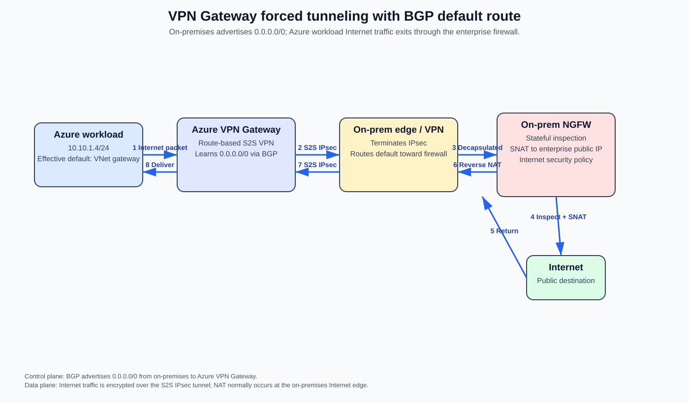
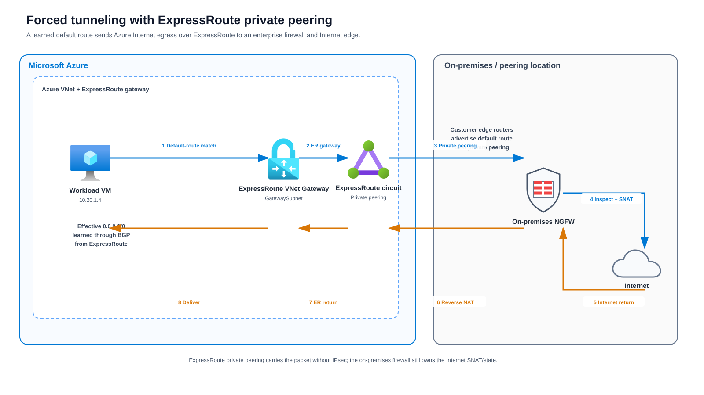
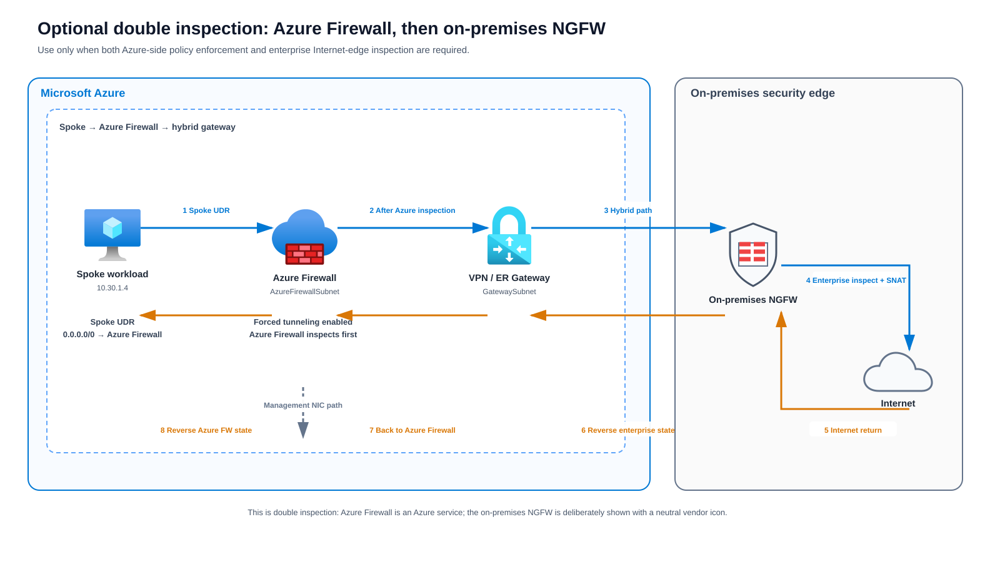

# Azure Forced Tunneling — Inspect Internet Traffic On-Premises

> **Scope:** Force Azure workload Internet egress to an on-premises security stack for inspection, logging, policy enforcement, and Internet breakout instead of allowing the workload to use Azure's normal Internet system route.

## Source URLs

- https://learn.microsoft.com/en-us/azure/vpn-gateway/about-site-to-site-tunneling
- https://learn.microsoft.com/en-us/azure/vpn-gateway/site-to-site-tunneling
- https://learn.microsoft.com/en-us/azure/expressroute/expressroute-routing
- https://learn.microsoft.com/en-us/azure/vpn-gateway/vpn-gateway-vpn-faq
- https://learn.microsoft.com/en-us/azure/firewall/management-nic
- https://learn.microsoft.com/en-us/azure/firewall/forced-tunneling
- https://learn.microsoft.com/en-us/azure/virtual-network/manage-route-table
- https://learn.microsoft.com/en-us/azure/network-watcher/next-hop-overview
- https://learn.microsoft.com/en-us/azure/network-watcher/diagnose-vm-network-routing-problem-cli
- https://learn.microsoft.com/en-us/azure/networking/design-guide/hub-spoke

---

## 1. What forced tunneling actually does

Forced tunneling is primarily a **routing design**. Azure must select an on-premises path for an Internet destination that would normally match Azure's system `0.0.0.0/0 -> Internet` route. The common forwarding objective is:

1. An Azure VM sends traffic to an Internet destination.
2. Azure route selection matches a default route that points toward the virtual network gateway or an inspection appliance.
3. Traffic crosses an S2S VPN or ExpressRoute path to the enterprise network.
4. An on-premises next-generation firewall (NGFW) inspects the session.
5. The on-premises edge performs source NAT (SNAT) to an enterprise public IP and sends the flow to the Internet.
6. The reply returns to the same enterprise public IP, reverse NAT/state is applied, and the packet is routed back to Azure.

### Source information

Microsoft documents two VPN Gateway forced-tunneling methods: advertise `0.0.0.0/0` from on-premises to Azure over Border Gateway Protocol (BGP), or configure a route-based VPN Gateway with a **Default Site**. For ExpressRoute, Microsoft accepts a default route on **private peering**, causing traffic from associated VNets to follow the customer network.

### Additional explanation

A VPN or ExpressRoute circuit by itself does not insert the firewall. The workload's **effective route** must first choose the hybrid path, and the on-premises routing domain must then steer that packet through the intended firewall and NAT path.

---

## 2. Design variants

| Variant | How Azure obtains the default path | Transport | Best fit |
|---|---|---|---|
| **VPN Gateway + BGP** | On-premises advertises `0.0.0.0/0` | S2S IPsec | Dynamic routing, redundant VPNs, enterprise BGP designs |
| **VPN Gateway + Default Site** | A local network gateway is assigned as the gateway default site | S2S IPsec | Route-based VPN when the default is not learned through BGP |
| **ExpressRoute private peering** | Customer advertises `0.0.0.0/0` on private peering | ExpressRoute private circuit | High-throughput private WAN Internet breakout |
| **Azure Firewall then on-prem** | Spoke UDR sends traffic to Azure Firewall; Azure Firewall is then forced on-prem | VPN or ExpressRoute | Explicit double-inspection requirement |

Do not collapse these into one topology. Their control planes, failure modes, and verification differ.

---

## 3. VPN Gateway with a BGP-advertised default route



[Editable draw.io source](images/09-05-26-20-53_Azure_Forced_Tunneling_On_Premises_Internet_Inspection_Deep_Dive_vpn_bgp_flow.drawio)

**What this image shows:** On-premises advertises `0.0.0.0/0` to Azure VPN Gateway. Internet traffic is then carried over the S2S IPsec tunnel to the enterprise firewall, which performs inspection and Internet SNAT.

**What matters:** BGP is the **control plane** that tells Azure where the default destination lives. IPsec is the **data-plane transport** used to carry the packets.

**What to verify:** The VM NIC has an active default route whose next-hop type is the virtual network gateway, the BGP peer is established, the S2S tunnel carries the traffic, the on-prem firewall sees the session, and the return path goes back through the same inspection domain.

### 3.1 Packet walk

Example:

```text
Azure VM:       10.10.1.4
Internet host:  93.184.216.34:443
Enterprise NAT: 203.0.113.25
```

Forward direction:

1. VM creates `10.10.1.4:51514 -> 93.184.216.34:443`.
2. Azure evaluates the effective routes for the VM NIC.
3. `93.184.216.34` matches the learned `0.0.0.0/0` route.
4. The selected next hop is the Azure virtual network gateway.
5. Azure VPN Gateway encrypts the inner packet into the S2S IPsec connection.
6. The on-prem VPN device decrypts it; the inner packet is still `10.10.1.4 -> 93.184.216.34`.
7. Enterprise routing forwards the packet through the on-prem NGFW.
8. The NGFW evaluates stateful security policy and performs Internet SNAT.

```text
Before on-prem SNAT:
10.10.1.4:51514 -> 93.184.216.34:443

After on-prem SNAT:
203.0.113.25:62001 -> 93.184.216.34:443
```

Return direction:

1. Internet server replies to `203.0.113.25:62001`.
2. The NGFW finds the session and reverses the NAT translation.
3. Destination becomes `10.10.1.4:51514` again.
4. The on-premises route to the Azure VNet points toward the S2S VPN.
5. The VPN device encrypts the return packet and sends it to Azure VPN Gateway.
6. Azure delivers it to the workload subnet.

### 3.2 Why symmetry matters

A stateful firewall normally must see both directions of the session. If the outbound flow goes through the firewall but the return takes another WAN/firewall path, the return can fail because the NAT state is absent, the security state is absent, or anti-spoofing/routing checks reject the flow.

---

## 4. VPN Gateway Default Site

Microsoft also supports forced tunneling on a **route-based** VPN Gateway by assigning one local network gateway as the default site. The on-premises VPN device must be configured to accept `0.0.0.0/0` as the relevant traffic selector.

### PowerShell

```cli
$LocalGateway = Get-AzLocalNetworkGateway `
  -Name "DefaultSiteHQ" `
  -ResourceGroupName "RG-Network"

$VirtualGateway = Get-AzVirtualNetworkGateway `
  -Name "VNG-Hub" `
  -ResourceGroupName "RG-Network"

Set-AzVirtualNetworkGatewayDefaultSite `
  -GatewayDefaultSite $LocalGateway `
  -VirtualNetworkGateway $VirtualGateway
```

**What it does:** Tells the route-based VPN gateway which on-premises site should receive forced-tunneled Internet traffic.

**Dependency:** The on-premises side must permit the broad Internet destination space in the tunnel policy/traffic selectors.

**Operational difference from BGP:** A Default Site is a gateway configuration association. BGP, by contrast, is a dynamic routing mechanism whose advertisement can be withdrawn and re-selected during convergence.

---

## 5. ExpressRoute private-peering forced tunneling



[Editable draw.io source](images/09-05-26-20-53_Azure_Forced_Tunneling_On_Premises_Internet_Inspection_Deep_Dive_expressroute_flow.drawio)

**What this image shows:** The customer advertises `0.0.0.0/0` into ExpressRoute **private peering**, so the VNet sends Internet-bound traffic over ExpressRoute to the corporate edge and firewall.

**What matters:** ExpressRoute private connectivity is not the same thing as IPsec encryption. If encryption is required by policy, it must be designed separately.

**What to verify:** The default route is present on private peering, the VNet is attached to the correct ExpressRoute gateway/circuit, on-premises has routes back to the Azure prefixes, and the firewall/NAT return path is symmetric.

### Packet fields

```text
Across ExpressRoute private path:
10.20.1.4:51514 -> 93.184.216.34:443

After on-prem Internet SNAT:
203.0.113.25:62001 -> 93.184.216.34:443
```

### Critical route-withdrawal caveat

Microsoft documents that if the ExpressRoute-advertised `0.0.0.0/0` disappears because of an outage or misconfiguration, Azure can again use the system Internet path. Therefore, **"the BGP default is present" is not a fail-closed security control**.

If the requirement is *Internet must never bypass on-prem inspection*, add an independent enforcement mechanism such as subnet egress policy/private-subnet design rather than assuming loss of the BGP route will automatically blackhole traffic.

---

## 6. Optional double inspection — Azure Firewall first, on-prem second



[Editable draw.io source](images/09-05-26-20-53_Azure_Forced_Tunneling_On_Premises_Internet_Inspection_Deep_Dive_azure_firewall_then_onprem.drawio)

**What this image shows:** Spoke traffic first follows a UDR to Azure Firewall. Azure Firewall then uses its forced-tunnel path to a VPN/ExpressRoute gateway and on-premises firewall.

**What matters:** This is a separate **double-inspection** design. It adds latency, cost, state, NAT, logging, and troubleshooting complexity.

**What to verify:** Spoke UDR points to Azure Firewall, Azure Firewall has the required management-NIC architecture, the firewall's post-inspection traffic reaches the hybrid gateway, and the on-prem firewall policy matches the source address it actually receives.

### Azure Firewall SNAT effect

Microsoft documents that in Azure Firewall forced tunneling, Internet-bound traffic is SNATed to one of the firewall's private IP addresses before it is sent on-premises. Therefore the downstream on-prem firewall generally does **not** see the original spoke IP as the packet source.

```text
Original workload:
10.30.1.4:51514 -> 93.184.216.34:443

After Azure Firewall forced-tunnel SNAT:
10.0.1.4:<translated-port> -> 93.184.216.34:443

After on-prem Internet SNAT:
203.0.113.25:<translated-port> -> 93.184.216.34:443
```

### Azure Firewall management plane

Current Azure Firewall architecture uses `AzureFirewallManagementSubnet` and a separate management NIC/public IP to keep platform operational traffic on an Azure-managed path rather than sending that management traffic through the customer forced-tunnel route. Microsoft specifies a minimum `/26` management subnet.

---

## 7. Azure route selection

Azure first applies **longest-prefix match**. When multiple candidate routes have the same prefix length, route source preference is:

```text
User-defined route (UDR) > BGP-propagated route > System route
```

Important examples:

```text
Normal Azure Internet egress:
0.0.0.0/0 -> Internet                Source: system/default

BGP forced tunneling:
0.0.0.0/0 -> VirtualNetworkGateway   Source: gateway/BGP

Explicit NVA insertion:
0.0.0.0/0 -> VirtualAppliance        Source: user-defined route
```

A same-length UDR can override a BGP default. This is a common reason forced tunneling appears to be configured correctly at the gateway but is not used by a workload subnet.

---

## 8. Hub-and-spoke requirements

When the hybrid gateway is in a hub VNet and spokes consume it through peering:

- Hub-to-spoke peering must allow gateway transit.
- Spoke-to-hub peering must use the remote gateway.
- Address spaces must not overlap.
- Route-table association and BGP propagation settings must be reviewed together.
- If an NVA/Azure Firewall is inserted, forwarded-traffic permissions and symmetric UDRs matter.

### Do not disable BGP propagation casually

Disabling gateway route propagation on a spoke route table removes routes learned through the virtual network gateway. That can remove both specific on-premises routes **and the default route that implements forced tunneling**.

---

## 9. DNS, MTU, and transport behavior

Forced tunneling changes IP forwarding, not DNS architecture. Decide independently whether workloads use Azure-provided DNS, Azure DNS Private Resolver, custom Azure DNS servers, or on-prem DNS.

For S2S VPN, IPsec encapsulation reduces available packet size. A design can have correct routing and still fail for larger transfers if MTU/MSS/Path MTU Discovery is broken. Typical symptoms are successful TCP handshakes but stalled HTTPS/download traffic.

ExpressRoute does not use IPsec unless an additional overlay is added, so its encapsulation/MTU behavior is different.

---

## 10. Verification — Azure

### 10.1 Effective routes on the VM NIC

```cli
az network nic show-effective-route-table \
  --resource-group RG-App \
  --name NIC-App01 \
  --output table
```

**Where:** Workload NIC.

**What it tests:** The combined system, UDR, and BGP route set Azure is actually using.

**Expected state:** An active `0.0.0.0/0` points to the intended forced-tunnel path; for direct VPN/ER gateway tunneling the next-hop type should be the virtual network gateway rather than `Internet`.

**Failure indicators:** Default route absent; default still points to `Internet`; UDR unexpectedly wins; propagated routes are disabled.

**Next action:** Check subnet route-table association, route propagation, gateway BGP state, and on-prem advertisements.

Expected-state example (columns vary by CLI version):

```text
Source                    State   Address Prefix   Next Hop Type
------------------------  ------  ---------------  ----------------------
VirtualNetworkGateway     Active  0.0.0.0/0        VirtualNetworkGateway
Default                   Active  10.10.0.0/16      VnetLocal
```

### 10.2 Network Watcher Next Hop

```cli
az network watcher show-next-hop \
  --resource-group RG-App \
  --vm App01 \
  --nic NIC-App01 \
  --source-ip 10.10.1.4 \
  --dest-ip 93.184.216.34 \
  --output table
```

**What it tests:** The selected Azure next hop for one concrete Internet destination.

**Success criteria:** Next hop is the intended gateway/NVA path.

**Failure indicator:** `Internet` means that source/destination pair is not currently forced to on-premises.

### 10.3 VPN Gateway BGP peer status

```cli
az network vnet-gateway list-bgp-peer-status \
  --resource-group RG-Network \
  --name VNG-Hub \
  --output table
```

**What it tests:** BGP session state with VPN peers.

**Success criteria:** Neighbor is connected and routes are being exchanged.

**Failure indicators:** Down/flapping session, wrong peer/ASN, or no learned routes.

**Next action:** Check IKE/IPsec state, BGP reachability, ASN/peer IP, route policy, and on-prem device logs.

---

## 11. Verification — on-premises

Exact commands are vendor-specific, so verify the following states rather than inventing output.

### Azure-prefix return route

**Where:** Enterprise router/firewall FIB/RIB.  
**What it tests:** Return traffic for the Azure workload can reach the VPN/ExpressRoute path.  
**Success:** Azure prefix points to the intended hybrid adjacency.  
**Failure means:** Internet return can reach the enterprise but cannot get back to Azure.  
**Next action:** Inspect Azure route advertisements, VRFs, redistribution, and firewall virtual-router policy.

### Stateful firewall session

**Where:** On-prem NGFW session table.  
**What it tests:** Both directions belong to one session.  
**Success:** Original Azure source, Internet destination, translated source, and bidirectional counters are visible.  
**Failure means:** Policy deny, asymmetric path, missing NAT, or route mismatch.

### NAT translation

**Where:** On-prem NGFW NAT/session diagnostics.  
**Success:** Azure private source is translated to an enterprise Internet-routable public IP.  
**Failure means:** Upstream Internet receives a private source or wrong public source and return traffic fails.

---

## 12. HA and failover

Treat **availability** and **security** as two separate questions:

1. Which alternate inspected path becomes active when the primary route/tunnel/circuit fails?
2. What prevents direct uninspected Azure Internet egress if every inspected default disappears?

For dual data centers, BGP can steer the default route, but stateful inspection can still fail if outbound and return land on different firewall clusters or if failover changes the SNAT public IP. ExpressRoute-primary/VPN-backup designs therefore need explicit routing preference, NAT identity, session-recovery, and capacity testing.

---

## 13. Common mistakes

- **"The VPN exists, so Internet traffic uses it."** A matching route must actually select the VPN.
- **"BGP default and Default Site are identical."** They achieve a similar outcome through different control mechanisms.
- **"ExpressRoute automatically provides Internet transit."** The customer network must route, inspect, NAT, and provide Internet breakout.
- **"If the learned default disappears, Internet stops."** Not necessarily; remaining Azure routes determine what happens.
- **"A stateful firewall only needs outbound packets."** Return symmetry and NAT state are fundamental.
- **"Disable BGP propagation to simplify routing."** That may remove required on-prem/default routes.
- **"Azure Firewall preserves the spoke source when forced on-prem."** Azure Firewall forced-tunnel Internet flows are SNATed to a firewall private IP before reaching on-premises.
- **"ExpressRoute is encrypted."** ExpressRoute is private connectivity, not inherent IPsec encryption.

---

## 14. Symptom-based troubleshooting

### Symptom: workload effective route still says `Internet`

**Where:** NIC effective routes / Network Watcher Next Hop.  
**Likely causes:** Default not advertised, BGP down, route propagation disabled, UDR override, incorrect gateway transit.  
**Next action:** Fix route control plane before troubleshooting the firewall.

### Symptom: Azure selects gateway, but on-prem firewall sees no packet

**Where:** VPN/ER gateway diagnostics and on-prem edge counters.  
**Likely causes:** Tunnel selector/policy mismatch, tunnel down, ER routing issue, wrong VRF, or corporate routing bypasses firewall.  
**Next action:** Prove packet arrival at the hybrid edge first.

### Symptom: firewall sees outbound SYN but no return

**Where:** Firewall session/NAT and ISP edge.  
**Likely causes:** Missing SNAT, wrong public route, upstream ACL, asymmetric public return.  
**Next action:** Confirm translated source and egress interface.

### Symptom: firewall sees return but VM does not

**Where:** On-prem return route, VPN/ER counters, Azure effective routes/NSGs.  
**Likely causes:** Missing Azure-prefix route, wrong tunnel/circuit, asymmetric hybrid path, NSG, route conflict.  
**Next action:** Trace the private destination from firewall back to Azure.

### Symptom: small traffic works but HTTPS/downloads stall

**Where:** S2S IPsec path.  
**Likely cause:** MTU/MSS/PMTUD.  
**Next action:** Compare small/large packets, validate MSS handling, and ensure required ICMP is not unintentionally blocked.

---

## 15. Design checklist

- [ ] Choose VPN+BGP, VPN Default Site, or ExpressRoute private peering.
- [ ] Confirm every target workload sees the expected effective `0.0.0.0/0`.
- [ ] Validate hub/spoke gateway transit where applicable.
- [ ] Validate BGP propagation and UDR precedence.
- [ ] Size VPN/ER bandwidth for Azure Internet egress.
- [ ] Size on-prem firewall throughput, sessions, TLS inspection, and NAT ports.
- [ ] Confirm on-prem routing forces the flow through the intended NGFW.
- [ ] Confirm Internet SNAT and return routing.
- [ ] Design symmetric multi-site failover.
- [ ] Decide whether default-route loss must fail closed.
- [ ] If fail closed is required, add an independent egress security control.
- [ ] Validate DNS, MTU/MSS, logs, and alerting.
- [ ] Test Network Watcher Next Hop for multiple real destinations.
- [ ] Capture firewall session/NAT evidence during normal and failover tests.

---

## Sources

1. Microsoft Learn — About forced tunneling for site-to-site configurations  
   https://learn.microsoft.com/en-us/azure/vpn-gateway/about-site-to-site-tunneling
2. Microsoft Learn — Configure forced tunneling using Default Site  
   https://learn.microsoft.com/en-us/azure/vpn-gateway/site-to-site-tunneling
3. Microsoft Learn — ExpressRoute routing requirements  
   https://learn.microsoft.com/en-us/azure/expressroute/expressroute-routing
4. Microsoft Learn — Azure VPN Gateway FAQ  
   https://learn.microsoft.com/en-us/azure/vpn-gateway/vpn-gateway-vpn-faq
5. Microsoft Learn — Azure Firewall Management NIC  
   https://learn.microsoft.com/en-us/azure/firewall/management-nic
6. Microsoft Learn — Azure Firewall forced tunneling  
   https://learn.microsoft.com/en-us/azure/firewall/forced-tunneling
7. Microsoft Learn — Manage route tables / effective routes  
   https://learn.microsoft.com/en-us/azure/virtual-network/manage-route-table
8. Microsoft Learn — Network Watcher Next Hop  
   https://learn.microsoft.com/en-us/azure/network-watcher/next-hop-overview
9. Microsoft Learn — Diagnose VM routing with Azure CLI  
   https://learn.microsoft.com/en-us/azure/network-watcher/diagnose-vm-network-routing-problem-cli
10. Microsoft Learn — Hub-and-spoke topology  
    https://learn.microsoft.com/en-us/azure/networking/design-guide/hub-spoke
