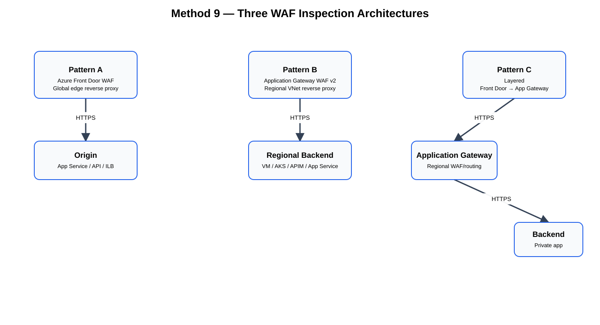
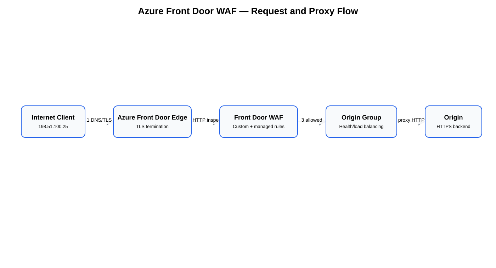
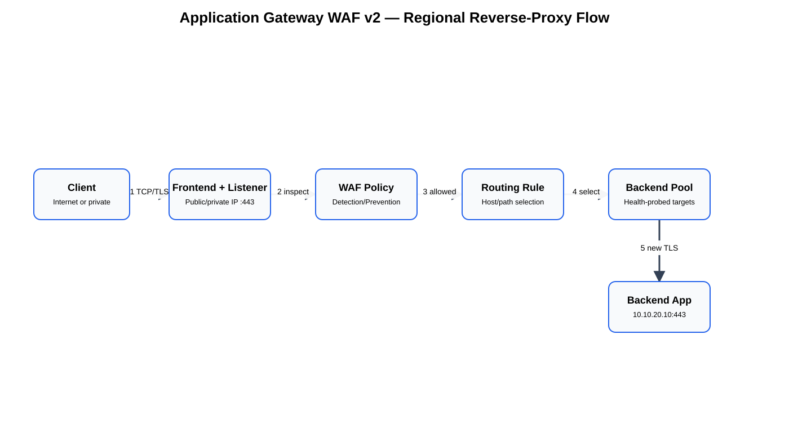
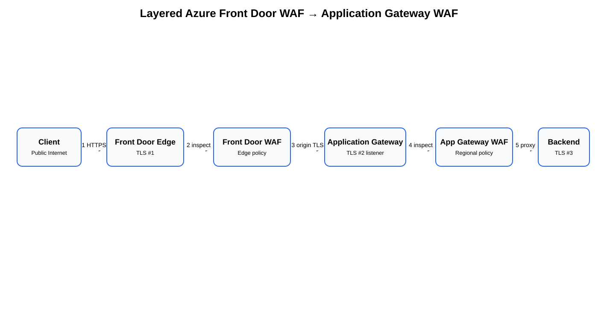

# Azure Front Door WAF and Application Gateway WAF — Method 9 Deep Dive

**Last validated:** 2026-09-06  
**Scope:** Layer-7 HTTP/HTTPS firewall inspection with Azure Front Door Web Application Firewall (WAF), Azure Application Gateway WAF v2, and a layered Azure Front Door → Application Gateway design.

> **Source information** = behavior explicitly documented by Microsoft.  
> **Additional explanation** = networking/security context added to make documented behavior operationally clear.  
> **Reasonable inference** = a design conclusion derived from documented behavior and identified as such.

---

## Supplied and supporting URLs

- https://github.com/ccaiccie/knowledge/blob/main/09-05-26-12-41_Azure_Firewall_Inspection_Methods_Comprehensive_Study_Guide.md#11-method-9--layer-7-web-firewall-inspection-with-azure-front-door-waf-and-application-gateway-waf
- https://learn.microsoft.com/en-us/azure/frontdoor/web-application-firewall
- https://learn.microsoft.com/en-us/azure/web-application-firewall/afds/afds-overview
- https://learn.microsoft.com/en-us/azure/web-application-firewall/afds/waf-front-door-drs
- https://learn.microsoft.com/en-us/azure/web-application-firewall/afds/waf-front-door-custom-rules
- https://learn.microsoft.com/en-us/azure/web-application-firewall/afds/waf-front-door-rate-limit
- https://learn.microsoft.com/en-us/azure/frontdoor/origin-security
- https://learn.microsoft.com/en-us/azure/frontdoor/private-link
- https://learn.microsoft.com/en-us/azure/frontdoor/how-to-enable-private-link-application-gateway
- https://learn.microsoft.com/en-us/azure/frontdoor/create-front-door-cli
- https://learn.microsoft.com/en-us/azure/application-gateway/quick-create-cli
- https://learn.microsoft.com/en-us/azure/web-application-firewall/ag/tutorial-restrict-web-traffic-cli
- https://learn.microsoft.com/en-us/azure/web-application-firewall/ag/application-gateway-crs-rulegroups-rules
- https://learn.microsoft.com/en-us/azure/architecture/example-scenario/gateway/firewall-application-gateway
- https://learn.microsoft.com/en-us/azure/architecture/example-scenario/gateway/application-gateway-before-azure-firewall
- https://learn.microsoft.com/en-us/azure/well-architected/service-guides/azure/front-door

---

# 1. What Method 9 actually is

Azure Front Door WAF and Application Gateway WAF are **reverse-proxy web firewalls**. They inspect HTTP/HTTPS requests that are explicitly published through them. They are not routed transit firewalls like Azure Firewall or a third-party next-generation firewall (NGFW)/network virtual appliance (NVA).

| Capability | Front Door WAF | Application Gateway WAF v2 | Azure Firewall / NGFW |
|---|---|---|---|
| Primary scope | Global HTTP/HTTPS ingress | Regional HTTP/HTTPS ingress | Routed L3/L4 and product-dependent L7 transit |
| Deployment location | Microsoft global edge | Customer VNet/subnet | VNet/vHub/appliance path |
| Traffic steering | DNS + endpoint + route | Frontend/listener + routing rule | UDR/BGP/routing intent/NAT |
| TLS termination | Yes | Yes | Product/design dependent |
| HTTP request inspection | Yes | Yes | Not equivalent |
| Generic east-west inspection | No | No | Yes |
| Generic Internet egress inspection | No | No | Yes |
| Arbitrary TCP/UDP publication | No | No | Yes/product-dependent |
| Path-based L7 routing | Yes | Yes | Not the same function |

**Source information:** Microsoft describes both Front Door WAF and Application Gateway WAF as Layer-7 web application protection services. Front Door is global and decentralized; Application Gateway is regional and VNet-integrated.

**Key design principle:** a WAF protects only traffic that reaches the WAF endpoint. If the origin remains directly reachable, clients can bypass WAF inspection. Origin lockdown is therefore part of the firewall design.

---

# 2. Three practical architectures



[Editable draw.io diagram](images/09-06-26-10-24_method9_architecture_variants.drawio)

**What this image shows**  
Three separate designs: Front Door WAF directly in front of an origin, Application Gateway WAF in a regional VNet, and a layered Front Door → Application Gateway design.

**What matters**  
These are reverse-proxy paths. DNS, Front Door routes, Application Gateway listeners/rules, and origin access restrictions place the WAF in the path. User-defined routes (UDRs) are not the insertion mechanism for the client-to-WAF leg.

**What to verify**  
DNS, certificate state, WAF policy association, origin/backend health, host-header/SNI behavior, and the absence of an unprotected direct-origin path.

## 2.1 Pattern A — Azure Front Door WAF only

Use Front Door when the application is public HTTP/HTTPS and you want globally distributed ingress, edge WAF, global health-based origin selection, acceleration, and—on Premium—Private Link to supported origins.

```text
Client
  -> Azure Front Door edge
  -> Front Door WAF
  -> Front Door route
  -> origin group
  -> selected origin
```

Best fits include multi-region web applications, public APIs, App Service, API Management, storage/static sites, Application Gateway origins, and supported services exposed through Private Link.

## 2.2 Pattern B — Application Gateway WAF v2 only

Use Application Gateway when you need a **regional, VNet-integrated reverse proxy** in front of private or public HTTP(S) backends.

```text
Client
  -> Application Gateway frontend
  -> listener
  -> WAF policy
  -> request-routing rule
  -> backend pool
  -> backend HTTP settings
  -> application
```

Good fits include VMs, VM scale sets, AKS, API Management, App Service, and other HTTP(S) services reachable from the Application Gateway subnet.

## 2.3 Pattern C — Front Door WAF → Application Gateway WAF

Use the layered design when you need both global edge functions and a regional reverse-proxy/security boundary.

Typical responsibility split:

- **Front Door:** global entry point, edge WAF, bot/rate controls, geo/IP rules, origin health/failover.
- **Application Gateway:** regional host/path routing, private backend integration, regional listener policy, optional application-specific second WAF layer.

Do not duplicate every WAF rule at both layers by default. Two identical WAFs increase false-positive and troubleshooting surfaces without automatically doubling security.

---

# 3. Azure Front Door WAF architecture and packet flow

Azure Front Door Standard/Premium is a global reverse proxy. A request enters a Microsoft edge location, matches a Front Door endpoint/domain and route, is evaluated by the associated WAF security policy, and—if allowed—is proxied to a selected healthy origin.

Important objects are:

1. **Profile** — parent Front Door resource and SKU.
2. **Endpoint** — Front Door-generated hostname and route container.
3. **Custom domain** — public application hostname such as `www.contoso.com`.
4. **Origin group** — health/load-balancing boundary.
5. **Origin** — concrete backend.
6. **Route** — maps domains/path patterns/protocols to an origin group.
7. **WAF policy** — custom and managed rules.
8. **Security policy** — associates the WAF policy with Front Door domains/endpoints.



[Editable draw.io diagram](images/09-06-26-10-24_frontdoor_waf_packet_flow.drawio)

**What this image shows**  
A client establishes TLS to Front Door, Front Door WAF inspects the HTTP request, and Front Door proxies allowed traffic to a healthy origin over a separate connection.

**What matters**  
Front Door terminates the client-side session and creates/reuses an origin-side session. The origin does not receive the original client TCP connection.

**What to verify**  
Endpoint/domain route match, certificate, WAF association, managed/custom rule state, origin health, origin host header, HTTPS port, Private Link approval if used, and origin lockdown.

## 3.1 Detailed request flow

Assume:

- Client: `198.51.100.25`
- Public URL: `https://www.contoso.com`
- Origin: `app.contoso.internal:443`

1. DNS resolves `www.contoso.com` to the Front Door custom domain/endpoint.
2. The client opens TCP/443 and TLS to a Front Door edge location.
3. Front Door terminates TLS and identifies the matching route/domain.
4. Custom WAF rules are evaluated according to policy priority.
5. Managed rules evaluate the HTTP request when configured.
6. If blocked, Front Door generates the response and **does not forward the request to the origin**.
7. If allowed, Front Door selects a healthy origin from the origin group.
8. Front Door opens or reuses an origin-side connection.
9. With end-to-end TLS, Front Door establishes a second TLS session to the origin.
10. Front Door forwards the HTTP request with documented proxy/forwarding context.
11. The origin responds to Front Door.
12. Front Door returns the response to the client over the client-side connection.

Conceptually:

```text
Client-side session:
198.51.100.25:ephemeral -> Front Door edge:443
TLS session #1 terminates at Front Door.

Origin-side session:
Front Door service -> origin:443
TLS session #2 terminates at the origin.
```

**Additional explanation:** because Front Door proxies the request, the origin-side transport source is Front Door infrastructure, not the original client. Use documented forwarding headers/log fields for client context, and do not trust arbitrary client-supplied forwarding headers from a path that can bypass Front Door.

---

# 4. Front Door WAF rule processing

## 4.1 Detection versus Prevention

Microsoft documents two core WAF modes:

- **Detection:** inspect and log matching requests without normal blocking enforcement.
- **Prevention:** enforce configured WAF actions.

A practical rollout is to start in Detection, collect representative traffic, tune narrow false-positive exclusions, and then move to Prevention.

## 4.2 Managed Default Rule Set (DRS)

Front Door WAF managed rules cover common web-attack classes such as:

- SQL injection.
- Cross-site scripting.
- Remote command execution.
- Local/remote file inclusion.
- Protocol anomalies and other exploit patterns.

For DRS 2.x, Microsoft documents anomaly scoring. Rule severities contribute to a cumulative score:

| Severity | Score contribution |
|---|---:|
| Critical | 5 |
| Error | 4 |
| Warning | 3 |
| Notice | 2 |

An anomaly score of 5 or greater is blocked in Prevention mode. A log entry whose action is only `Matched` can be a contributing event rather than the final block event.

## 4.3 Custom rules

Custom rules are evaluated before the managed rule set. This matters operationally: a broad custom `Allow` rule can short-circuit managed-rule inspection for matching requests.

Use custom rules for deliberate controls such as:

- IP ranges.
- Geography.
- Request headers.
- URI/path patterns.
- Rate limits.

Prefer narrowly scoped exceptions over broad Allow rules where the intent is only to eliminate a false positive.

## 4.4 Rate limiting

Front Door WAF supports rate-limit custom rules. Microsoft documents per-client/socket-IP thresholds over supported one-minute or five-minute windows. Because Front Door is distributed, operators should not assume a single centralized counter visible at every edge server at exactly the same instant.

---

# 5. Front Door origin lockdown

This is one of the most important parts of the design.

## 5.1 Preferred: Private Link with Front Door Premium

Front Door Premium supports Private Link to documented origin types, including Application Gateway and services exposed through internal load balancers.

The security effect is:

```text
Internet client
  -> public Front Door edge
  -> Microsoft private connectivity
  -> private origin
```

This prevents the normal application path from requiring a broadly reachable public origin.

## 5.2 Public origin: service tag plus Front Door profile ID

When Application Gateway is a public Front Door origin, Microsoft documents a layered restriction:

1. Allow the `AzureFrontDoor.Backend` service tag to the Application Gateway listener ports.
2. Deny general Internet access to those ports.
3. Use an Application Gateway WAF custom rule to verify `X-Azure-FDID` equals the expected Front Door profile identifier.

Why both?

- The service tag proves the traffic comes from Front Door infrastructure.
- `X-Azure-FDID` proves it came from **your intended Front Door profile**, not simply another customer's Front Door.

---

# 6. Front Door implementation example — Azure CLI

The commands below follow Microsoft's documented CLI object model. Replace names, IDs, origins, and probe paths for your environment.

## 6.1 Variables

```cli
RG="RG-WebEdge"
LOCATION="eastus"
AFD_PROFILE="afd-contoso-prod"
AFD_ENDPOINT="contoso-web"
ORIGIN_GROUP="og-web-prod"
WAF_POLICY="waf-afd-contoso-prod"
SEC_POLICY="afd-security-prod"
```

## 6.2 Create Front Door Premium

```cli
az group create \
  --name "$RG" \
  --location "$LOCATION"

az afd profile create \
  --profile-name "$AFD_PROFILE" \
  --resource-group "$RG" \
  --sku Premium_AzureFrontDoor
```

**Why Premium here:** the design uses capabilities such as managed WAF rules and Private Link origin connectivity. Verify current tier support for your exact feature set before deployment.

## 6.3 Create endpoint

```cli
az afd endpoint create \
  --resource-group "$RG" \
  --endpoint-name "$AFD_ENDPOINT" \
  --profile-name "$AFD_PROFILE" \
  --enabled-state Enabled
```

## 6.4 Create origin group

```cli
az afd origin-group create \
  --resource-group "$RG" \
  --origin-group-name "$ORIGIN_GROUP" \
  --profile-name "$AFD_PROFILE" \
  --probe-request-type GET \
  --probe-protocol Https \
  --probe-interval-in-seconds 60 \
  --probe-path /health \
  --sample-size 4 \
  --successful-samples-required 3 \
  --additional-latency-in-milliseconds 50
```

The health endpoint should be inexpensive, deterministic, and representative of application readiness.

## 6.5 Create WAF policy

```cli
az network front-door waf-policy create \
  --name "$WAF_POLICY" \
  --resource-group "$RG" \
  --sku Premium_AzureFrontDoor \
  --disabled false \
  --mode Prevention
```

## 6.6 Add managed rules

The Microsoft quickstart currently demonstrates these rule-set versions. For production, verify the newest supported version validated for your application.

```cli
az network front-door waf-policy managed-rules add \
  --policy-name "$WAF_POLICY" \
  --resource-group "$RG" \
  --type Microsoft_DefaultRuleSet \
  --action Block \
  --version 2.1

az network front-door waf-policy managed-rules add \
  --policy-name "$WAF_POLICY" \
  --resource-group "$RG" \
  --type Microsoft_BotManagerRuleSet \
  --version 1.0
```

## 6.7 Associate WAF with endpoint/domain

```cli
SUB_ID=$(az account show --query id -o tsv)

az afd security-policy create \
  --resource-group "$RG" \
  --profile-name "$AFD_PROFILE" \
  --security-policy-name "$SEC_POLICY" \
  --domains "/subscriptions/${SUB_ID}/resourceGroups/${RG}/providers/Microsoft.Cdn/profiles/${AFD_PROFILE}/afdEndpoints/${AFD_ENDPOINT}" \
  --waf-policy "/subscriptions/${SUB_ID}/resourceGroups/${RG}/providers/Microsoft.Network/frontdoorWebApplicationFirewallPolicies/${WAF_POLICY}"
```

A WAF policy that exists but is not associated with the domain/endpoint receiving requests performs no inspection for that path.

---

# 7. Application Gateway WAF v2 architecture and packet flow

Application Gateway is regional and VNet-integrated. It is deployed into a dedicated subnet and uses:

- Frontend IP configuration.
- Frontend ports.
- HTTP(S) listeners.
- Certificates.
- Request-routing rules/path maps.
- Backend pools.
- Backend HTTP settings.
- Health probes.
- WAF policy.



[Editable draw.io diagram](images/09-06-26-10-24_appgateway_waf_packet_flow.drawio)

**What this image shows**  
A client reaches a public or private Application Gateway frontend. The listener accepts the request, WAF evaluates it, the routing rule selects the backend, and Application Gateway opens a separate backend connection.

**What matters**  
Application Gateway is not an inline transparent hop. The backend connection is a new connection originated by the gateway.

**What to verify**  
Frontend IP, listener/certificate, rule priority, WAF policy, backend pool, backend HTTP settings, host/SNI, probe health, NSG/UDR reachability, DNS, and backend certificate trust.

## 7.1 Detailed flow

Assume:

- Client: `198.51.100.25`
- Gateway public frontend: `203.0.113.20`
- Application Gateway subnet: `10.10.1.0/24`
- Backend: `10.10.20.10:443`

1. DNS resolves `www.contoso.com` to the gateway frontend.
2. Client opens TCP/443 and TLS to `203.0.113.20`.
3. The HTTPS listener matches frontend IP/port and host name.
4. Application Gateway terminates client TLS.
5. WAF evaluates the HTTP request.
6. If blocked, the request never reaches the backend.
7. If allowed, the routing rule selects a backend pool/path map.
8. Backend HTTP settings determine protocol, port, host-name behavior, timeout, affinity, and related backend connection parameters.
9. Application Gateway opens or reuses a backend connection to `10.10.20.10:443`.
10. The backend responds to Application Gateway.
11. Application Gateway returns the response to the client.

```text
Client-side connection:
198.51.100.25:ephemeral -> 203.0.113.20:443

Backend-side connection:
Application Gateway -> 10.10.20.10:443
```

## 7.2 Routing still matters on the backend side

A UDR does not insert Application Gateway into arbitrary client transit. However, once Application Gateway proxies toward a backend, normal VNet routing applies. NSGs, UDRs, VNet peering, DNS, Private Endpoints, and inserted firewalls can all affect the gateway-to-backend connection.

If an Azure Firewall or NVA sits between Application Gateway and the workload, preserve the stateful firewall's return-path symmetry.

---

# 8. Application Gateway implementation example — Azure CLI

## 8.1 Network and public IP

```cli
RG="RG-AppGateway"
LOCATION="eastus"
VNET="VNet-Web"
AG_SUBNET="AppGatewaySubnet"
BACKEND_SUBNET="BackendSubnet"
PIP="pip-appgw-prod"
APPGW="agw-contoso-prod"
WAF_POLICY="waf-agw-contoso-prod"

az group create \
  --name "$RG" \
  --location "$LOCATION"

az network vnet create \
  --resource-group "$RG" \
  --name "$VNET" \
  --address-prefix 10.10.0.0/16 \
  --subnet-name "$AG_SUBNET" \
  --subnet-prefix 10.10.1.0/24

az network vnet subnet create \
  --resource-group "$RG" \
  --vnet-name "$VNET" \
  --name "$BACKEND_SUBNET" \
  --address-prefixes 10.10.20.0/24

az network public-ip create \
  --resource-group "$RG" \
  --name "$PIP" \
  --allocation-method Static \
  --sku Standard
```

## 8.2 Create WAF policy

Microsoft's documented CLI tutorial shows:

```cli
az network application-gateway waf-policy create \
  --name "$WAF_POLICY" \
  --resource-group "$RG" \
  --type OWASP \
  --version 3.2
```

Application Gateway WAF also supports newer Microsoft rule-set generations in supported configurations. Choose and validate the rule set/version deliberately for production.

## 8.3 Create WAF_v2 gateway

```cli
az network application-gateway create \
  --name "$APPGW" \
  --location "$LOCATION" \
  --resource-group "$RG" \
  --vnet-name "$VNET" \
  --subnet "$AG_SUBNET" \
  --capacity 2 \
  --sku WAF_v2 \
  --http-settings-cookie-based-affinity Disabled \
  --frontend-port 80 \
  --http-settings-port 80 \
  --http-settings-protocol Http \
  --public-ip-address "$PIP" \
  --waf-policy "$WAF_POLICY" \
  --priority 1
```

This is a bootstrap example. Production HTTPS normally adds an HTTPS listener, certificate, explicit backend pool, HTTPS backend settings if end-to-end TLS is required, and a custom health probe.

## 8.4 Listener example

```cli
az network application-gateway frontend-port create \
  --resource-group "$RG" \
  --gateway-name "$APPGW" \
  --name port-443 \
  --port 443

az network application-gateway listener create \
  --resource-group "$RG" \
  --gateway-name "$APPGW" \
  --name https-www \
  --frontend-port port-443 \
  --frontend-ip appGatewayFrontendIP \
  --host-names www.contoso.com \
  --ssl-cert www-contoso-cert
```

Before referencing a generated/default frontend object name, query it:

```cli
az network application-gateway frontend-ip list \
  --resource-group "$RG" \
  --gateway-name "$APPGW" \
  --output table
```

## 8.5 Routing rule example

```cli
az network application-gateway rule create \
  --resource-group "$RG" \
  --gateway-name "$APPGW" \
  --name rule-www \
  --priority 100 \
  --rule-type Basic \
  --http-listener https-www \
  --address-pool pool-web \
  --http-settings https-backend
```

---

# 9. Layered Front Door → Application Gateway design



[Editable draw.io diagram](images/09-06-26-10-24_frontdoor_to_appgateway_layered_flow.drawio)

**What this image shows**  
The request terminates first at Front Door, is WAF-inspected, then Front Door connects to Application Gateway. Application Gateway can apply a second deliberately scoped WAF policy and proxy the request to the backend.

**What matters**  
There can be three separate TLS/session legs: client → Front Door, Front Door → Application Gateway, Application Gateway → backend.

**What to verify**  
Front Door origin health, Private Link approval or public-origin lockdown, `AzureFrontDoor.Backend` NSG allowance when public, `X-Azure-FDID` validation, App Gateway listener/host-name match, both WAF associations, and backend health.

## 9.1 Public App Gateway origin

When Application Gateway has a **public frontend IP** and is used as an Azure Front Door origin, use both of these controls:

- An NSG rule that permits `AzureFrontDoor.Backend` to the Application Gateway listener ports and denies ordinary Internet clients.
- An Application Gateway WAF custom rule that blocks requests when `X-Azure-FDID` does not equal the expected Azure Front Door profile ID.

The controls are complementary: the service tag proves the TCP connection came from Azure Front Door infrastructure, while `X-Azure-FDID` proves that the request came through **your intended Front Door profile** rather than another Front Door customer.

### 9.1.1 Variables

```cli
APPGW_RG="RG-AppGateway"
APPGW_NSG="nsg-appgateway-subnet"
APPGW_WAF_POLICY="waf-agw-contoso-prod"
AFD_RG="RG-WebEdge"
AFD_PROFILE="afd-contoso-prod"
APPGW_SUBNET_PREFIX="10.10.1.0/24"
```

### 9.1.2 Retrieve the Front Door profile ID

Front Door inserts its profile identifier into `X-Azure-FDID` when it sends a request to an origin. Retrieve the expected value from the profile:

```cli
EXPECTED_FDID=$(az afd profile show \
  --resource-group "$AFD_RG" \
  --profile-name "$AFD_PROFILE" \
  --query frontDoorId \
  --output tsv)

echo "$EXPECTED_FDID"
```

Use the returned `frontDoorId` GUID. Do not substitute the Azure Resource Manager resource ID of the profile.

### 9.1.3 Inspect existing inbound NSG rules first

```cli
az network nsg rule list \
  --resource-group "$APPGW_RG" \
  --nsg-name "$APPGW_NSG" \
  --query "[?direction=='Inbound'].{Priority:priority,Name:name,Access:access,Source:sourceAddressPrefix,DestinationPorts:destinationPortRange}" \
  --output table
```

Choose unused priorities. Lower numeric priorities are evaluated first.

### 9.1.4 Allow `AzureFrontDoor.Backend` to the listener

For an HTTPS-only Application Gateway listener:

```cli
az network nsg rule create \
  --resource-group "$APPGW_RG" \
  --nsg-name "$APPGW_NSG" \
  --name Allow-AzureFrontDoor-Backend-HTTPS \
  --priority 100 \
  --direction Inbound \
  --access Allow \
  --protocol Tcp \
  --source-address-prefixes AzureFrontDoor.Backend \
  --source-port-ranges "*" \
  --destination-address-prefixes "$APPGW_SUBNET_PREFIX" \
  --destination-port-ranges 443 \
  --description "Allow Azure Front Door backend infrastructure to Application Gateway HTTPS listener"
```

If the gateway also intentionally listens on HTTP/80, use `--destination-port-ranges 80 443` instead.

### 9.1.5 Deny ordinary Internet clients from reaching the listener

Create a lower-precedence rule after the Front Door Allow rule:

```cli
az network nsg rule create \
  --resource-group "$APPGW_RG" \
  --nsg-name "$APPGW_NSG" \
  --name Deny-Direct-Internet-HTTPS \
  --priority 120 \
  --direction Inbound \
  --access Deny \
  --protocol Tcp \
  --source-address-prefixes Internet \
  --source-port-ranges "*" \
  --destination-address-prefixes "$APPGW_SUBNET_PREFIX" \
  --destination-port-ranges 443 \
  --description "Prevent direct Internet bypass of Azure Front Door"
```

The intended decision order is:

```text
Priority 100: AzureFrontDoor.Backend -> TCP/443 -> Allow
Priority 120: Internet               -> TCP/443 -> Deny
```

Do not overwrite or block Application Gateway platform traffic that your deployment requires. For conventional Application Gateway v2/WAF_v2 deployments without Network Isolation, verify the required `GatewayManager` and `AzureLoadBalancer` allowances remain intact.

### 9.1.6 Create the Application Gateway WAF custom rule

The safest pattern is a **negated Equal + Block** rule:

```text
IF X-Azure-FDID != expected Front Door profile ID
THEN Block
```

Create the custom rule:

```cli
az network application-gateway waf-policy custom-rule create \
  --resource-group "$APPGW_RG" \
  --policy-name "$APPGW_WAF_POLICY" \
  --name blockNonAFDTraffic \
  --priority 2 \
  --rule-type MatchRule \
  --action Block \
  --state Enabled
```

Add the header condition:

```cli
az network application-gateway waf-policy custom-rule match-condition add \
  --resource-group "$APPGW_RG" \
  --policy-name "$APPGW_WAF_POLICY" \
  --name blockNonAFDTraffic \
  --match-variables RequestHeaders.X-Azure-FDID \
  --operator Equal \
  --values "$EXPECTED_FDID" \
  --negate true
```

`--negate true` is critical: requests whose `X-Azure-FDID` equals the expected value do **not** match this Block rule and continue through the rest of the WAF policy. Requests with a missing or different value are blocked according to the WAF match behavior.

This is preferable to a broad custom `Allow` rule because an Allow rule can terminate evaluation and unintentionally bypass managed WAF inspection.

### 9.1.7 Verify the WAF custom rule

```cli
az network application-gateway waf-policy custom-rule show \
  --resource-group "$APPGW_RG" \
  --policy-name "$APPGW_WAF_POLICY" \
  --name blockNonAFDTraffic \
  --output jsonc

az network application-gateway waf-policy custom-rule match-condition list \
  --resource-group "$APPGW_RG" \
  --policy-name "$APPGW_WAF_POLICY" \
  --name blockNonAFDTraffic \
  --output jsonc
```

**Expected successful state:**

- `action` = `Block`.
- `state` = `Enabled`.
- Match variable targets request header `X-Azure-FDID`.
- Operator = `Equal`.
- Match value = the expected Front Door `frontDoorId`.
- Negation = `true`.

### 9.1.8 Verify the NSG rules

```cli
az network nsg rule show \
  --resource-group "$APPGW_RG" \
  --nsg-name "$APPGW_NSG" \
  --name Allow-AzureFrontDoor-Backend-HTTPS \
  --output jsonc

az network nsg rule show \
  --resource-group "$APPGW_RG" \
  --nsg-name "$APPGW_NSG" \
  --name Deny-Direct-Internet-HTTPS \
  --output jsonc
```

**Success criteria:**

- Azure Front Door can establish the origin-side TCP/443 connection.
- A normal Internet client cannot establish a direct TCP/443 connection to the Application Gateway public frontend.
- Requests from an unrelated Front Door profile are blocked by the `X-Azure-FDID` WAF rule.
- Requests from the intended Front Door profile continue through the remaining WAF managed/custom rules.

**Failure indicators:**

- Direct access to the Application Gateway public IP still works.
- Front Door origin health becomes unhealthy after the NSG change.
- All Front Door traffic gets a WAF-generated 403.

**Next actions:** verify NSG priority order, confirm the NSG is associated with the Application Gateway subnet, re-read `frontDoorId` from the correct Front Door profile, and inspect Application Gateway WAF logs for the actual header match.

## 9.2 Private Link App Gateway origin

Azure Front Door Premium can reach an Azure Application Gateway origin through **Azure Private Link**. This is different from the public-origin model in Section 9.1: Front Door does not need to connect to the Application Gateway public frontend over ordinary public reachability. Instead, the Front Door service uses a private endpoint that Microsoft creates for your Front Door profile inside an Azure Front Door-managed regional network, and that endpoint connects to a Private Link configuration attached to an Application Gateway frontend.

### 9.2.1 What Private Link means in this design

Private Link gives a consumer a private connection to a supported Azure service/resource without exposing the consumer-to-service path to the public Internet. For Application Gateway, the producer side is the **Application Gateway Private Link configuration** associated with one of its frontend IP configurations. The consumer side is a **Private Endpoint**.

For the Front Door integration, the consumer-side Private Endpoint is special: **Azure Front Door Premium creates and manages it on your behalf** inside a Microsoft-managed regional virtual network. You do not create a normal private endpoint in one of your own VNets for this Front Door-to-Application-Gateway path.

The logical object chain is:

```text
Internet client
  -> Azure Front Door global edge
  -> Front Door WAF
  -> Front Door route
  -> Front Door origin group
  -> Front Door origin with Private Link enabled
  -> Front Door-managed regional private endpoint
  -> Azure Private Link platform
  -> Application Gateway Private Link configuration
  -> selected Application Gateway frontend IP configuration
  -> Application Gateway listener
  -> Application Gateway WAF/routing rule
  -> backend
```

The client-facing Front Door endpoint remains public. **Only the Front Door-to-origin leg becomes private.**

### 9.2.2 Why use Private Link instead of the public-origin design

With the public design in Section 9.1, Application Gateway remains reachable through a public frontend and therefore requires explicit origin-lockdown controls such as `AzureFrontDoor.Backend` plus `X-Azure-FDID` validation.

Private Link moves the Front Door origin connection onto Microsoft private connectivity. This reduces the need to expose the Application Gateway origin path publicly and removes the shared-public-service-tag problem from that leg.

Use Private Link when:

- Azure Front Door **Premium** is available.
- You want the Front Door → Application Gateway origin leg to remain on private Microsoft networking.
- You want stronger origin isolation than a public frontend with NSG/header restrictions.
- Application Gateway already provides regional WAF, listener, path-routing, or private-backend functions that justify keeping it behind Front Door.

### 9.2.3 Components you must understand

There are four important Application Gateway Private Link components:

1. **Application Gateway frontend IP configuration** — the public or private frontend that the target listener uses.
2. **Application Gateway Private Link configuration** — enables Private Endpoint connectivity to that frontend.
3. **Dedicated Private Link subnet** — a subnet in the Application Gateway VNet used by the Private Link configuration's IP configuration. It must be separate from the Application Gateway subnet.
4. **Private Endpoint connection** — the approval relationship between Front Door's managed private endpoint and Application Gateway.

The Front Door-specific objects are:

1. **Front Door Premium profile and endpoint**.
2. **Origin group** dedicated to private origins.
3. **Origin with Private Link enabled**.
4. **Route** mapping the endpoint/custom domain to the private origin group.

### 9.2.4 Important prerequisites and limitations

Before changing anything, verify all of the following:

- Azure Front Door uses the **Premium** SKU; Standard does not provide this origin Private Link capability.
- Application Gateway already exists and is healthy.
- The Application Gateway frontend IP configuration that Private Link will target is actively used by a listener. If no listener uses the frontend, the frontend is not available as the Private Link target subresource.
- A **dedicated subnet** exists for the Application Gateway Private Link configuration. It cannot be the same subnet that contains Application Gateway instances.
- `privateLinkServiceNetworkPolicies` is disabled on that dedicated subnet.
- Application Gateway Private Link IP allocation is **dynamic**; static allocation isn't supported.
- Microsoft documents up to **eight IP addresses per Private Link configuration**. Each configured IP supports up to 65,536 concurrent TCP connections through Private Link, so capacity planning should account for connection concurrency.
- The combined Application Gateway name and Private Link configuration name must not exceed **70 characters**.
- Application Gateway Private Link has an idle timeout of approximately **300 seconds**. For long-lived idle TCP sessions, use TCP keepalives shorter than 300 seconds where applicable.
- Front Door does not allow **public and private origins in the same origin group**. Use a dedicated private-origin group.
- When Private Link is enabled for a Front Door origin, origin certificate subject-name validation matters. Use a DNS host name that matches the Application Gateway listener certificate rather than treating the Application Gateway IP address as the TLS identity.

### 9.2.5 Example topology and variables

Assume:

```text
Front Door resource group:        RG-WebEdge
Front Door profile:               afd-contoso-prod
Front Door endpoint:              contoso-web
Front Door private origin group:  og-appgw-private
Front Door origin:                appgw-private-origin
Front Door route:                 route-appgw-private

Application Gateway RG:           RG-AppGateway
Application Gateway:              agw-contoso-prod
VNet:                             VNet-Web
Application Gateway subnet:       10.10.1.0/24
Private Link subnet:              10.10.2.0/24
Target frontend IP config:        appGatewayFrontendIP
Listener host name:               www.contoso.com
Application Gateway region:       eastus
```

Set variables:

```cli
AFD_RG="RG-WebEdge"
AFD_PROFILE="afd-contoso-prod"
AFD_ENDPOINT="contoso-web"
AFD_ORIGIN_GROUP="og-appgw-private"
AFD_ORIGIN="appgw-private-origin"
AFD_ROUTE="route-appgw-private"

APPGW_RG="RG-AppGateway"
APPGW="agw-contoso-prod"
VNET="VNet-Web"
PL_SUBNET="AppGatewayPrivateLinkSubnet"
PL_SUBNET_PREFIX="10.10.2.0/24"
PL_CONFIG="appgw-pl-config"
APPGW_FRONTEND="appGatewayFrontendIP"
APP_HOST="www.contoso.com"
APPGW_REGION="eastus"

SUB_ID=$(az account show --query id -o tsv)
```

### 9.2.6 Verify the Front Door SKU

```cli
az afd profile show \
  --resource-group "$AFD_RG" \
  --profile-name "$AFD_PROFILE" \
  --query "{name:name,sku:sku.name,provisioningState:provisioningState}" \
  --output table
```

**Success criteria:** the profile is `Premium_AzureFrontDoor` and provisioning is successful.

If the profile is Standard, do not continue with this design.

### 9.2.7 Verify the Application Gateway frontend and listener relationship

First list frontends:

```cli
az network application-gateway frontend-ip list \
  --gateway-name "$APPGW" \
  --resource-group "$APPGW_RG" \
  --query "[].{Name:name,PrivateIP:privateIPAddress,PublicIP:publicIPAddress.id,PrivateLink:privateLinkConfiguration.id}" \
  --output table
```

Then list listeners:

```cli
az network application-gateway listener list \
  --gateway-name "$APPGW" \
  --resource-group "$APPGW_RG" \
  --query "[].{Name:name,FrontendIP:frontendIPConfiguration.id,FrontendPort:frontendPort.id,HostNames:hostNames}" \
  --output jsonc
```

The selected `$APPGW_FRONTEND` must be referenced by an active listener. This relationship matters because Front Door ultimately sends the private connection into that frontend/listener path.

### 9.2.8 Create the dedicated Application Gateway Private Link subnet

If the subnet does not already exist:

```cli
az network vnet subnet create \
  --resource-group "$APPGW_RG" \
  --vnet-name "$VNET" \
  --name "$PL_SUBNET" \
  --address-prefixes "$PL_SUBNET_PREFIX"
```

This subnet is **not** another Application Gateway instance subnet. It exists for the Application Gateway Private Link configuration IP addresses.

### 9.2.9 Disable Private Link Service network policies on that subnet

Microsoft requires Private Link Service network policies to be disabled on the subnet used by the Application Gateway Private Link configuration:

```cli
az network vnet subnet update \
  --resource-group "$APPGW_RG" \
  --vnet-name "$VNET" \
  --name "$PL_SUBNET" \
  --disable-private-link-service-network-policies true
```

Verify:

```cli
az network vnet subnet show \
  --resource-group "$APPGW_RG" \
  --vnet-name "$VNET" \
  --name "$PL_SUBNET" \
  --query "{name:name,prefix:addressPrefix,privateLinkServiceNetworkPolicies:privateLinkServiceNetworkPolicies}" \
  --output jsonc
```

**Expected state:** `privateLinkServiceNetworkPolicies` is `Disabled`.

Do not confuse this property with **private endpoint** network policies. Here you are preparing the producer-side subnet for the Application Gateway Private Link configuration.

### 9.2.10 Build the subnet resource ID

```cli
PL_SUBNET_ID=$(az network vnet subnet show \
  --resource-group "$APPGW_RG" \
  --vnet-name "$VNET" \
  --name "$PL_SUBNET" \
  --query id \
  --output tsv)

echo "$PL_SUBNET_ID"
```

#### What does Private Link actually attach to?

This is the point that is easy to miss: **Private Link attaches Front Door to a supported origin-facing service endpoint, not automatically to the final web server behind that service.** The exact termination point depends on the origin type you choose.

For the design in this section, the attachment point is the **Application Gateway frontend IP configuration** selected by `$APPGW_FRONTEND`:

```text
Front Door Premium
   |
   | Front Door-managed Private Endpoint
   v
Azure Private Link
   |
   v
Application Gateway Private Link configuration
   |
   v
Application Gateway frontend IP configuration   <-- Private Link lands here
   |
   v
HTTPS listener / WAF / request-routing rule
   |
   v
Application Gateway backend pool
   |
   +--> IIS / Apache / nginx VM
   +--> VM Scale Set
   +--> AKS ingress
   +--> App Service or other HTTP(S) backend
```

The servers in the Application Gateway backend pool do **not** need to be Private Link-capable merely because Front Door reaches Application Gateway through Private Link. Once Application Gateway accepts the request, it uses its normal backend connectivity, routing, DNS, NSGs, UDRs, peering, TLS settings, probes, and backend pool configuration.

So, for example, this is valid:

```text
Front Door Premium
   |
   | Private Link
   v
Application Gateway frontend
   |
   +--> WEB01 10.10.20.10:443
   +--> WEB02 10.10.20.11:443
```

Here the Private Link connection stops at the Application Gateway frontend. Application Gateway then opens a **separate backend connection** to `WEB01` or `WEB02` according to its routing rule and backend health.

Azure Front Door Premium can also use Private Link with other supported origin types. The service that Private Link terminates on changes with the architecture:

| Origin design | What Front Door Private Link connects to | What can sit behind it |
|---|---|---|
| Application Gateway | Application Gateway frontend IP configuration / Private Link configuration | VMs, VMSS, AKS ingress, private web/API backends, other HTTP(S) targets reachable by App Gateway |
| Azure Blob Storage / Storage static website | Storage service private origin endpoint | Blob content / static website content |
| Azure App Service / Function App | App Service private origin endpoint | The application hosted by that PaaS service |
| API Management | API Management private origin endpoint | APIs/services behind APIM |
| Internal Standard Load Balancer | **Private Link Service** associated with the ILB frontend | VMs, VMSS, appliances, AKS or other services behind the ILB |

Azure does not use the AWS term **bucket** for Storage; the comparable direct-origin case is typically **Blob Storage** or **Storage static website**.

For ordinary web servers behind an internal load balancer, the pattern is different from Application Gateway. Front Door does not Private-Link directly to an arbitrary VM NIC. Instead, expose the internal Standard Load Balancer frontend through an Azure **Private Link Service**:

```text
Front Door Premium
   |
   | Front Door-managed Private Endpoint
   v
Azure Private Link
   |
   v
Private Link Service
   |
   v
Internal Standard Load Balancer
   |
   +--> WEB01
   +--> WEB02
```

The easiest mental model is:

```text
Private Link provides a private entry point into the ORIGIN SERVICE.
It does not define the entire backend topology behind that service.
```

In this Section 9.2 architecture specifically:

```text
                         PRIVATE LINK TERMINATES HERE
                                    |
                                    v
Front Door Premium --------------> Application Gateway frontend
                                           |
                                           | normal App Gateway
                                           | Layer-7 processing
                                           v
                                      Backend pool
                                      /    |     \
                                    VM    AKS    other HTTP(S) backend
```

That distinction is why the next command supplies both `--frontend-ip "$APPGW_FRONTEND"` and the dedicated Private Link subnet: you are enabling Private Link **on a specific Application Gateway frontend**, not attaching Front Door directly to the individual backend servers.

### 9.2.11 Add Private Link to Application Gateway

Microsoft documents `az network application-gateway private-link add` for creating the Application Gateway Private Link configuration and associating it with a frontend IP configuration:

```cli
az network application-gateway private-link add \
  --frontend-ip "$APPGW_FRONTEND" \
  --name "$PL_CONFIG" \
  --subnet "$PL_SUBNET_ID" \
  --gateway-name "$APPGW" \
  --resource-group "$APPGW_RG"
```

Conceptually this creates:

```text
Application Gateway
  |
  +-- frontend IP configuration: appGatewayFrontendIP
        |
        +-- Private Link configuration: appgw-pl-config
              |
              +-- dynamic IP configuration(s)
                  in AppGatewayPrivateLinkSubnet
```

Microsoft notes that enabling or disabling the Application Gateway Private Link configuration can cause a brief traffic disruption, typically less than one minute, so perform this change during a suitable maintenance/low-traffic period.

### 9.2.12 Verify the Application Gateway Private Link configuration

```cli
az network application-gateway private-link list \
  --gateway-name "$APPGW" \
  --resource-group "$APPGW_RG" \
  --output jsonc
```

Also inspect the frontend again:

```cli
az network application-gateway frontend-ip show \
  --gateway-name "$APPGW" \
  --resource-group "$APPGW_RG" \
  --name "$APPGW_FRONTEND" \
  --output jsonc
```

**Success criteria:**

- The expected Private Link configuration exists.
- It points to the dedicated Private Link subnet.
- The target frontend references the Private Link configuration.
- The frontend remains attached to the intended listener.

### 9.2.13 Create a dedicated Front Door private origin group

Do not put the Private Link-enabled Application Gateway origin into an origin group containing public origins.

Create a dedicated group:

```cli
az afd origin-group create \
  --resource-group "$AFD_RG" \
  --origin-group-name "$AFD_ORIGIN_GROUP" \
  --profile-name "$AFD_PROFILE" \
  --probe-request-type GET \
  --probe-protocol Https \
  --probe-interval-in-seconds 60 \
  --probe-path /health \
  --sample-size 4 \
  --successful-samples-required 3 \
  --additional-latency-in-milliseconds 50
```

Use a health path that the Application Gateway listener can route and whose backend accurately represents application readiness.

### 9.2.14 Get the Application Gateway resource ID

```cli
APPGW_ID=$(az network application-gateway show \
  --resource-group "$APPGW_RG" \
  --name "$APPGW" \
  --query id \
  --output tsv)

echo "$APPGW_ID"
```

### 9.2.15 Add Application Gateway as a Front Door Private Link origin

Microsoft's current CLI pattern uses the Application Gateway resource ID together with the frontend IP configuration name as the Private Link subresource:

```cli
az afd origin create \
  --enabled-state Enabled \
  --resource-group "$AFD_RG" \
  --origin-group-name "$AFD_ORIGIN_GROUP" \
  --origin-name "$AFD_ORIGIN" \
  --profile-name "$AFD_PROFILE" \
  --host-name "$APP_HOST" \
  --origin-host-header "$APP_HOST" \
  --http-port 80 \
  --https-port 443 \
  --priority 1 \
  --weight 1000 \
  --enable-private-link true \
  --private-link-location "$APPGW_REGION" \
  --private-link-request-message "Azure Front Door private connectivity to Application Gateway" \
  --private-link-resource "$APPGW_ID" \
  --private-link-sub-resource-type "$APPGW_FRONTEND"
```

The key fields are:

```text
--private-link-resource
    Application Gateway resource ID

--private-link-sub-resource-type
    Application Gateway frontend IP configuration name

--private-link-location
    Region used for the Front Door managed private endpoint
```

The `--host-name` and `--origin-host-header` should normally be the DNS name expected by the Application Gateway listener and its TLS certificate. For Private Link-enabled origins, certificate-name validation is mandatory, so using a raw frontend IP as the TLS identity is normally the wrong design.

Microsoft's portal guidance requires the Front Door origin Private Link region to match the Application Gateway region. Microsoft also documents that CLI/PowerShell can be used when a different supported Front Door Private Link region is required because the Application Gateway region itself is not supported by Front Door Private Link. Validate current regional support before selecting a different value.

### 9.2.16 What Front Door creates after the origin command

After `az afd origin create` with `--enable-private-link true`, Azure Front Door creates a **managed private endpoint request** from a Front Door-managed regional VNet.

At this point the connection is normally pending approval:

```text
Front Door managed VNet
  |
  +-- managed Private Endpoint
         |
         | Pending approval
         v
Application Gateway privateEndpointConnections
```

Traffic cannot use the private path until the Application Gateway owner approves the connection.

### 9.2.17 List the pending private endpoint connection

```cli
az network private-endpoint-connection list \
  --name "$APPGW" \
  --resource-group "$APPGW_RG" \
  --type Microsoft.Network/applicationGateways \
  --query "[].{Name:name,Id:id,Status:properties.privateLinkServiceConnectionState.status,Description:properties.privateLinkServiceConnectionState.description}" \
  --output table
```

Look for the request associated with Azure Front Door whose state is `Pending`.

To capture its ID when there is only one relevant pending request:

```cli
PEC_ID=$(az network private-endpoint-connection list \
  --name "$APPGW" \
  --resource-group "$APPGW_RG" \
  --type Microsoft.Network/applicationGateways \
  --query "[?properties.privateLinkServiceConnectionState.status=='Pending'] | [0].id" \
  --output tsv)

echo "$PEC_ID"
```

If multiple pending requests exist, inspect them before approving and select the correct Front Door request explicitly.

### 9.2.18 Approve the Front Door private endpoint connection

```cli
az network private-endpoint-connection approve \
  --id "$PEC_ID" \
  --description "Approved Azure Front Door Premium private origin connection"
```

This approval is the trust boundary. Do not automatically approve an unidentified request simply because it is pending.

### 9.2.19 Verify approval state

```cli
az network private-endpoint-connection list \
  --name "$APPGW" \
  --resource-group "$APPGW_RG" \
  --type Microsoft.Network/applicationGateways \
  --query "[].{Name:name,Status:properties.privateLinkServiceConnectionState.status,Description:properties.privateLinkServiceConnectionState.description}" \
  --output table
```

**Expected state:** the intended Front Door connection is `Approved`.

Front Door can require several minutes after approval for the private connectivity to become fully established. During that convergence interval, origin requests can fail even though the approval has already been recorded.

### 9.2.20 Verify the Front Door origin Private Link state

```cli
az afd origin show \
  --resource-group "$AFD_RG" \
  --profile-name "$AFD_PROFILE" \
  --origin-group-name "$AFD_ORIGIN_GROUP" \
  --origin-name "$AFD_ORIGIN" \
  --output jsonc
```

Verify:

- Origin is enabled.
- Host name and origin host header are correct.
- HTTPS port is correct.
- Private Link is enabled.
- Private Link resource points to the intended Application Gateway.
- Private Link subresource matches the exact frontend IP configuration name.
- Private Link location is correct.

### 9.2.21 Create the Front Door route

Map the Front Door endpoint to the private origin group:

```cli
az afd route create \
  --resource-group "$AFD_RG" \
  --profile-name "$AFD_PROFILE" \
  --endpoint-name "$AFD_ENDPOINT" \
  --route-name "$AFD_ROUTE" \
  --forwarding-protocol MatchRequest \
  --https-redirect Enabled \
  --origin-group "$AFD_ORIGIN_GROUP" \
  --supported-protocols Http Https \
  --link-to-default-domain Enabled
```

If you use a custom Front Door domain, associate that custom domain with the route according to the deployment's domain design instead of relying only on the default Front Door endpoint hostname.

### 9.2.22 End-to-end TLS and HTTP flow

Assume the client opens:

```text
https://www.contoso.com
```

The detailed path is:

```text
1. Client -> Azure Front Door edge
   TCP/443 + TLS #1
   Front Door terminates client TLS.

2. Front Door WAF evaluates the HTTP request.

3. Front Door route selects og-appgw-private.

4. Origin group selects appgw-private-origin.

5. Front Door regional service uses its managed Private Endpoint.

6. Azure Private Link carries the origin-side connection over Microsoft networking.

7. Application Gateway Private Link configuration delivers the connection
   to appGatewayFrontendIP.

8. Application Gateway listener for www.contoso.com accepts TCP/443.

9. Front Door -> Application Gateway completes TLS #2.
   The listener certificate must satisfy Front Door origin certificate validation.

10. Application Gateway WAF evaluates the HTTP request.

11. Application Gateway request-routing rule selects the backend pool/path.

12. Application Gateway -> backend opens/reuses TLS #3 when HTTPS backend
    settings are configured.

13. Backend response returns to Application Gateway.

14. Application Gateway returns it through Private Link to Front Door.

15. Front Door returns the response over the original client connection.
```

The important distinction is that **Private Link does not tunnel the original client TCP session into Application Gateway**. Front Door remains a reverse proxy and originates a new origin-side session.

### 9.2.23 DNS behavior

For the Front Door integration, you normally do **not** create an Azure Private DNS zone merely so that Front Door can find the Application Gateway managed private endpoint. Front Door owns the consumer-side managed private endpoint and the Private Link service integration.

DNS still matters for the HTTP/TLS identity:

- `--host-name` identifies the origin host Front Door connects to logically.
- `--origin-host-header` controls the Host header sent toward Application Gateway.
- Application Gateway listener host-name matching must accept that host.
- The listener TLS certificate must match the host name that Front Door validates.

Application Gateway Private Link itself also does not automatically create a generic `*.privatelink` DNS record for unrelated private consumers. If you separately build private endpoints for your own VNets, you must design their DNS records/zones explicitly.

### 9.2.24 Routing and NSG implications

Private Link changes the **Front Door-to-Application-Gateway ingress path**, but it does not remove normal Application Gateway backend routing requirements.

After Application Gateway accepts the request:

```text
Application Gateway
   -> route lookup from Application Gateway subnet
   -> NSG/UDR/VNet peering/firewall path as configured
   -> backend
```

If an Azure Firewall or third-party NVA is inserted between Application Gateway and the backend, the stateful firewall still requires a symmetric return path.

The dedicated Private Link subnet is not a transit subnet that you manually route Front Door traffic through. The Private Link platform handles the consumer-to-service connection.

### 9.2.25 Public frontend and origin-bypass considerations

Adding Private Link to Application Gateway does not automatically mean every possible public listener/front-end exposure in your overall gateway design disappears. Treat **origin isolation** as an explicit validation item.

After the Front Door private path works:

- Confirm whether the Application Gateway public frontend is still required for any other application/listener.
- If it is not required, remove or restrict the public ingress design as appropriate for your Application Gateway architecture.
- If a public frontend must remain for another use case, make sure the Front Door-protected application cannot be bypassed through that alternate listener/path.

Do not assume Private Link alone protects an unrelated public listener that still accepts the same host/application.

### 9.2.26 Verify Front Door origin health

List the origin:

```cli
az afd origin list \
  --resource-group "$AFD_RG" \
  --profile-name "$AFD_PROFILE" \
  --origin-group-name "$AFD_ORIGIN_GROUP" \
  --output jsonc
```

Then use Azure Front Door health/diagnostic views and logs to confirm the private origin is healthy.

**Success criteria:**

- Private endpoint connection on Application Gateway is `Approved`.
- Front Door origin is enabled and Private Link properties are correct.
- Health probe reaches the correct Application Gateway listener/path.
- Listener host and certificate match the Front Door origin configuration.
- At least one backend behind Application Gateway is healthy.

### 9.2.27 Verify Application Gateway backend health

```cli
az network application-gateway show-backend-health \
  --resource-group "$APPGW_RG" \
  --name "$APPGW" \
  --output jsonc
```

**Expected successful state:** the backend pool used by the selected request-routing rule shows healthy members.

A healthy Private Link connection does not compensate for an unhealthy Application Gateway backend.

### 9.2.28 Test from the client side

Test the normal Front Door hostname/custom domain:

```cli
curl -I https://www.contoso.com/
```

A successful application-specific response verifies the complete path only when correlated with Front Door and Application Gateway logs.

The expected path is:

```text
Client
 -> Front Door
 -> Front Door WAF
 -> managed Private Endpoint
 -> Private Link
 -> Application Gateway listener/WAF
 -> backend
```

### 9.2.29 Troubleshooting — Front Door origin remains unhealthy after approval

**Where:** Front Door origin configuration and Application Gateway listener.

**Check:**

```cli
az afd origin show \
  --resource-group "$AFD_RG" \
  --profile-name "$AFD_PROFILE" \
  --origin-group-name "$AFD_ORIGIN_GROUP" \
  --origin-name "$AFD_ORIGIN" \
  --output jsonc
```

Then verify:

- Private endpoint state is `Approved`.
- `--private-link-sub-resource-type` exactly equals the Application Gateway frontend IP configuration name.
- Selected frontend has an active listener.
- `APP_HOST` matches listener host configuration.
- TLS certificate subject/SAN matches the origin host name.
- Front Door health-probe path is accepted by the listener/routing rule and backend.

**What failure means:** Private Link can be approved while the HTTP/TLS application path is still wrong.

### 9.2.30 Troubleshooting — no pending private endpoint request appears

**Where:** Front Door origin Private Link configuration and Application Gateway Private Link setup.

Verify:

```cli
az network application-gateway private-link list \
  --gateway-name "$APPGW" \
  --resource-group "$APPGW_RG" \
  --output jsonc

az afd origin show \
  --resource-group "$AFD_RG" \
  --profile-name "$AFD_PROFILE" \
  --origin-group-name "$AFD_ORIGIN_GROUP" \
  --origin-name "$AFD_ORIGIN" \
  --output jsonc
```

Common causes include:

- Application Gateway Private Link configuration wasn't created first.
- Frontend name supplied to `--private-link-sub-resource-type` is wrong.
- Frontend is not associated with a listener.
- Private Link location is invalid/unsupported.
- Front Door profile is not Premium.

### 9.2.31 Troubleshooting — certificate-name validation error

Private Link doesn't remove TLS identity checks.

Check:

```text
Front Door origin host name
       == DNS name expected by App Gateway listener
       == name covered by App Gateway listener certificate SAN/CN
```

Do not configure the Front Door private origin using an Application Gateway IP address as the origin identity when the certificate is issued to `www.contoso.com`.

### 9.2.32 Troubleshooting — Private Link works but application returns 502

Separate the failure domains:

```text
Front Door -> Private Link -> App Gateway     may be healthy
App Gateway -> backend                        may be unhealthy
```

Check Application Gateway backend health, probe path, DNS resolution, UDRs, NSGs, backend TLS trust/name, backend port, and any firewall/NVA inserted between Application Gateway and the workload.

### 9.2.33 Common mistakes specific to this design

1. Creating the Front Door origin before enabling Private Link on Application Gateway.
2. Creating a normal private endpoint in your own VNet and assuming Front Door will use it; Front Door creates its own managed private endpoint for this integration.
3. Using the Application Gateway subnet itself as the Private Link configuration subnet.
4. Forgetting to disable `privateLinkServiceNetworkPolicies` on the dedicated Private Link subnet.
5. Targeting a frontend IP configuration that has no active listener.
6. Supplying the wrong frontend name to `--private-link-sub-resource-type`.
7. Mixing public and Private Link-enabled origins in one Front Door origin group.
8. Using an IP address as the origin host identity and then hitting TLS certificate-name validation failures.
9. Approving the wrong pending private endpoint request without inspecting its resource ID/state.
10. Assuming Private Link fixes Application Gateway backend routing, WAF, TLS, or health-probe problems.
11. Forgetting the approximate 300-second idle timeout for Application Gateway Private Link connections.
12. Exceeding the 70-character combined Application Gateway name + Private Link configuration name limit.

### 9.2.34 Public-origin versus Private Link decision

| Item | Public App Gateway origin | Private Link App Gateway origin |
|---|---|---|
| Front Door SKU | Standard/Premium depending feature set | **Premium required** |
| Front Door → App Gateway path | Public reachability | Private Link over Microsoft networking |
| App Gateway origin exposure | Public frontend | Private origin path can be used |
| Primary origin-lockdown control | `AzureFrontDoor.Backend` + `X-Azure-FDID` | Private endpoint approval + Private Link configuration |
| Dedicated App Gateway Private Link subnet | No | Yes |
| Private endpoint consumer | N/A | Front Door-managed regional network |
| Manual PE in your VNet for Front Door | No | No — Front Door creates it |
| Public/private origins in same Front Door origin group | Public origins can coexist according to normal design | **Do not mix public and private origins** |
| TLS host/certificate correctness | Required | Required; certificate-name validation is especially important |

### 9.2.35 Recommended configuration order

Use this order to minimize ambiguity while troubleshooting:

```text
1. Build Application Gateway and validate listener/backend health.
2. Create a dedicated Private Link subnet.
3. Disable Private Link Service network policies on that subnet.
4. Add the Application Gateway Private Link configuration.
5. Confirm it is associated with the intended frontend.
6. Create a dedicated Front Door private origin group.
7. Create the Front Door origin with Private Link enabled.
8. Verify the pending private endpoint request on Application Gateway.
9. Approve the correct Front Door request.
10. Wait for the connection to establish.
11. Verify Front Door private origin health.
12. Create/associate the Front Door route/custom domain.
13. Validate end-to-end HTTP/TLS behavior and both WAF layers.
14. Remove/restrict any unnecessary public bypass path.
```

This order keeps each failure domain observable: Application Gateway first, producer-side Private Link second, Front Door-managed private endpoint third, application routing last.

---

# 10. TLS design

## 10.1 Front Door only

```text
Client -> Front Door     TLS #1
Front Door -> origin     TLS #2
```

For end-to-end encryption, configure HTTPS on both legs. Origin hostname/certificate validation must match Front Door's origin settings.

## 10.2 Application Gateway only

```text
Client -> App Gateway    TLS #1
App Gateway -> backend   TLS #2
```

For backend HTTPS, Application Gateway must be able to validate the backend certificate and SNI/host-name behavior used by the backend HTTP settings.

## 10.3 Layered design

```text
Client -> Front Door                 TLS #1
Front Door -> Application Gateway    TLS #2
Application Gateway -> backend       TLS #3
```

Each handshake can fail independently. A useful troubleshooting question is: **which TLS leg failed?**

---

# 11. Combining WAF with Azure Firewall or an NGFW

WAF and routed network firewall inspection solve different problems and can be complementary.

## 11.1 Application Gateway before Azure Firewall

Microsoft Architecture Center documents Application Gateway → Azure Firewall Premium → backend as a valid design.

Flow:

1. Application Gateway terminates client TLS.
2. Application Gateway WAF inspects the HTTP request.
3. Allowed request is proxied toward the backend.
4. Routing sends the gateway-to-backend flow through Azure Firewall.
5. Azure Firewall applies network/IDPS policy according to the deployed feature set.
6. The return path must remain symmetric through the stateful firewall.

Use this when you need both HTTP-aware WAF enforcement and routed firewall controls on the regional backend leg.

## 11.2 Azure Firewall before Application Gateway

Microsoft documents this topology but highlights a client-IP consequence: after firewall NAT/SNAT, Application Gateway can see the firewall as the transport source rather than the true Internet client. Microsoft notes that Front Door can be placed before the firewall so the original client context is inserted into HTTP forwarding headers before traffic enters the VNet.

---

# 12. High availability and failover

## Front Door

Front Door is a managed global edge service, but application availability still depends on origin design:

- Use multiple origins/regions when required.
- Configure health probes correctly.
- Set priorities/weights for intended failover/load distribution.
- Ensure the active routes and WAF policies cover every failover path.

## Application Gateway WAF v2

Application Gateway v2 is managed and scalable within a region. For resilient application design:

- Use autoscaling or validated fixed capacity.
- Use multiple backend instances/zones where supported.
- Configure health probes that represent application readiness.
- For regional disaster recovery, deploy a second regional gateway and use a global service such as Front Door to steer between regions.

## Layered failure domains

With Front Door → Application Gateway:

1. Front Door edge must accept the request.
2. WAF must allow it.
3. Front Door must find a healthy Application Gateway origin.
4. Application Gateway listener/rule/WAF must accept it.
5. Application Gateway must find a healthy backend.
6. The backend application must respond.

A 502/503 therefore requires identifying **which layer generated the error**.

---

# 13. Verification commands and expected state

Exact CLI formatting can vary by Azure CLI version, so the success criteria below focus on reliable state/fields rather than fabricated output.

## 13.1 Front Door profile and endpoint

```cli
az afd profile show \
  --resource-group RG-WebEdge \
  --profile-name afd-contoso-prod \
  --output jsonc

az afd endpoint show \
  --resource-group RG-WebEdge \
  --profile-name afd-contoso-prod \
  --endpoint-name contoso-web \
  --output jsonc
```

**Where:** Front Door control plane.  
**What it tests:** Resource existence, SKU, administrative state.  
**Expected successful state:** Correct SKU and enabled endpoint with expected hostname.  
**Failure indicator:** Missing/disabled endpoint or wrong resource group/profile.  
**Next action:** Fix control-plane configuration before debugging the origin.

## 13.2 Front Door origins

```cli
az afd origin-group list \
  --resource-group RG-WebEdge \
  --profile-name afd-contoso-prod \
  --output table

az afd origin list \
  --resource-group RG-WebEdge \
  --profile-name afd-contoso-prod \
  --origin-group-name og-web-prod \
  --output jsonc
```

**Expected successful state:** Intended origin enabled; hostname, ports, host header, and Private Link properties match design.  
**Failure indicators:** Wrong host/port, disabled origin, pending/rejected private endpoint.  
**Next action:** Correct origin configuration and re-check health.

## 13.3 Front Door WAF policy

```cli
az network front-door waf-policy show \
  --resource-group RG-WebEdge \
  --name waf-afd-contoso-prod \
  --output jsonc
```

**Expected successful state:** Policy enabled, intended mode, intended managed/custom rules.  
**Failure indicator:** Policy in Detection when blocking was expected, disabled policy, missing rule set.  
**Next action:** Correct policy state.

## 13.4 WAF security-policy association

```cli
az afd security-policy list \
  --resource-group RG-WebEdge \
  --profile-name afd-contoso-prod \
  --output jsonc
```

**Expected successful state:** Intended endpoint/custom domain associated with the correct WAF resource ID.  
**Failure indicator:** WAF exists but does not cover the domain receiving traffic.  
**Next action:** Fix association.

## 13.5 Application Gateway state

```cli
az network application-gateway show \
  --resource-group RG-AppGateway \
  --name agw-contoso-prod \
  --output jsonc
```

**Expected successful state:** Successful provisioning, `WAF_v2`, correct WAF policy reference and expected frontend/listener/backend objects.  
**Failure indicator:** Failed provisioning or missing/wrong object references.  
**Next action:** Fix gateway configuration before testing traffic.

## 13.6 Listeners

```cli
az network application-gateway listener list \
  --resource-group RG-AppGateway \
  --gateway-name agw-contoso-prod \
  --output table
```

**Expected successful state:** Correct frontend, port, host name and certificate association.  
**Failure indicator:** Host/port mismatch.  
**Next action:** Correct listener/TLS configuration.

## 13.7 Routing rules

```cli
az network application-gateway rule list \
  --resource-group RG-AppGateway \
  --gateway-name agw-contoso-prod \
  --output jsonc
```

**Expected successful state:** Correct listener → backend pool → HTTP settings relationship and expected priority.  
**Failure indicator:** Wrong backend or rule priority/path selection.  
**Next action:** Correct rule mapping.

## 13.8 Backend health

Use the Application Gateway backend-health view/CLI for the deployed Azure CLI version.

**Expected successful state:** Backends used by the active rule show `Healthy`.  
**Failure indicators:** `Unhealthy` or `Unknown`, with probe/TLS/DNS/timeout/reachability detail.  
**Next action:** Fix the stated backend-health cause before tuning WAF rules.

---

# 14. Logging and observability

Enable diagnostic logs before production cutover.

## Front Door

Collect:

- Access logs.
- WAF logs.
- Relevant origin/health diagnostics.

Correlate:

- Client/forwarded client context.
- Host and URI.
- WAF rule ID/action.
- Tracking/correlation ID.
- Origin response status.
- Front Door response status.

## Application Gateway

Collect:

- Access logs.
- WAF/firewall logs.
- Backend health/performance information.

Correlate:

- Listener.
- Routing rule/backend pool.
- Frontend status code.
- Backend response status/time.
- WAF rule ID/action.
- Forwarded client context.

**Additional explanation:** do not treat every non-200 response as a WAF problem. A 403 can be WAF or application policy; a 502 commonly points to backend connectivity/TLS/health; a 404 can be listener/routing/application behavior.

---

# 15. Troubleshooting by symptom

## Symptom A — Malicious request reaches the application

**Where:** DNS, WAF association, alternate origin path.  
**Command/tool:** `dig`/`nslookup`, Front Door security-policy list, Application Gateway WAF association, origin access controls.  
**What it tests:** Whether the request actually traversed the WAF.  
**Expected state:** Public hostname resolves to the WAF path; direct origin path is blocked.  
**What failure means:** WAF may be configured correctly but bypassed.  
**Next action:** Close direct-origin access and correct DNS/policy association.

## Symptom B — Legitimate request gets 403 after Prevention is enabled

**Where:** WAF logs.  
**Command/tool:** Azure Monitor / Log Analytics.  
**What it tests:** Custom/managed rule match and final enforcement action.  
**Expected state:** Logs identify the request attribute/rule responsible.  
**What failure means:** The 403 may be application-generated rather than WAF-generated.  
**Next action:** Confirm source; if WAF, use the narrowest safe exclusion/override.

## Symptom C — Front Door returns 502/503

**Where:** Front Door origin health and origin TLS/network path.  
**Command/tool:** Origin list, health diagnostics, origin logs.  
**Expected state:** At least one enabled healthy origin.  
**What failure means:** Host header, DNS, TLS, port, Private Link approval, or application health can be wrong.  
**Next action:** Resolve origin health before adjusting WAF.

## Symptom D — Application Gateway backend unhealthy

**Where:** Backend-health view.  
**Command/tool:** Backend health, NSG/UDR, DNS, backend certificate.  
**Expected state:** Probe is healthy.  
**What failure means:** Wrong probe path/status, blocked network path, DNS failure, TLS trust/name failure, or backend down.  
**Next action:** Fix the precise backend-health reason.

## Symptom E — Direct App Gateway works but Front Door path fails

**Where:** Front Door → Application Gateway leg.  
**Command/tool:** Front Door origin config, App Gateway listener host names, NSG, `X-Azure-FDID`, Private Link status.  
**Expected state:** Correct host header/SNI and permitted Front Door source/profile.  
**What failure means:** App Gateway accepts direct clients but rejects Front Door's origin request.  
**Next action:** Align origin host header, certificate, listener, NSG, and profile-ID rule.

## Symptom F — Client IP appears as proxy/firewall IP

**Where:** Backend application and forwarding-header handling.  
**Command/tool:** HTTP headers and access logs.  
**Expected state:** Application trusts only known proxy hops and extracts the documented forwarded client context.  
**What failure means:** Application is using transport source IP or trusting unsafe user-provided forwarding headers.  
**Next action:** Configure trusted-proxy handling and close bypass paths.

## Symptom G — WAF logs show `Matched` but request was not blocked

**Where:** WAF logs and policy mode.  
**What it tests:** Detection/Prevention and cumulative anomaly score.  
**Expected state:** In Prevention, final action follows the configured rule/action/scoring behavior; in Detection, the request is logged rather than normally blocked.  
**Next action:** Find the final enforcement event, not just a contributing rule match.

---

# 16. Common mistakes

1. **Treating WAF as a replacement for Azure Firewall.** WAF protects published HTTP/HTTPS, not arbitrary routed traffic.
2. **Leaving the origin directly reachable.** This creates a WAF bypass.
3. **Creating a WAF policy but not associating it with the active Front Door domain/endpoint.**
4. **Running Detection and expecting blocking.**
5. **Adding a broad custom Allow rule that bypasses managed rules.**
6. **Disabling an entire rule group to fix one false positive.** Use narrow exclusions.
7. **Ignoring host header and SNI.** Reverse proxies establish new backend TLS sessions.
8. **Treating every 502 as a WAF block.** It is frequently backend TLS/health/reachability.
9. **Assuming the original client remains the transport source at the backend.**
10. **Duplicating identical WAF policies at Front Door and App Gateway without a defined purpose.**
11. **Forgetting Private Link endpoint approval.**
12. **Applying a UDR and assuming that inserts Application Gateway.** The client must target the listener.

---

# 17. Decision matrix

| Requirement | Recommended starting point | Why |
|---|---|---|
| Global public multi-region web app | Front Door Premium + WAF | Global edge, WAF, health/failover, Private Link support |
| Single-region private/internal web app | Application Gateway WAF v2 | VNet-integrated regional reverse proxy/private frontend |
| Public regional web app | Application Gateway WAF v2 | Direct regional ingress with WAF/L7 routing |
| Global edge plus regional L7 routing | Front Door → Application Gateway | Separate global and regional responsibilities |
| Arbitrary TCP/UDP east-west inspection | Azure Firewall/NGFW | Routed firewall requirement |
| Internet egress inspection | Azure Firewall/NGFW/SECaaS | WAF is not generic egress inspection |
| HTTP WAF plus regional network firewall | App Gateway WAF → Azure Firewall/NGFW → backend | WAF for web attacks, firewall for routed controls |
| Hide origin from Internet | Front Door Premium + Private Link | Removes general public origin path |

---

# 18. Recommended production solution

For a modern Internet-facing Azure application that needs global reach and strong origin isolation, a strong default is:

```text
Internet client
  -> Azure Front Door Premium custom domain
  -> Front Door WAF
  -> Prevention mode after tuning
  -> Private Link to supported regional origin when possible
  -> Application Gateway WAF v2 only when regional reverse-proxy/WAF functions are required
  -> private application backends
```

Use Front Door alone when Application Gateway adds no needed regional function. Add Application Gateway when you need regional listener/path routing, private backend integration, regional application boundaries, or a deliberately different second WAF control plane.

If Application Gateway must be a public Front Door origin, lock it down with the documented `AzureFrontDoor.Backend` service tag and `X-Azure-FDID` validation so ordinary Internet clients and unrelated Front Door profiles cannot bypass your intended edge entry point.

---

# 19. Sources

- https://github.com/ccaiccie/knowledge/blob/main/09-05-26-12-41_Azure_Firewall_Inspection_Methods_Comprehensive_Study_Guide.md#11-method-9--layer-7-web-firewall-inspection-with-azure-front-door-waf-and-application-gateway-waf
- https://learn.microsoft.com/en-us/azure/frontdoor/web-application-firewall
- https://learn.microsoft.com/en-us/azure/web-application-firewall/afds/afds-overview
- https://learn.microsoft.com/en-us/azure/web-application-firewall/afds/waf-front-door-drs
- https://learn.microsoft.com/en-us/azure/web-application-firewall/afds/waf-front-door-custom-rules
- https://learn.microsoft.com/en-us/azure/web-application-firewall/afds/waf-front-door-rate-limit
- https://learn.microsoft.com/en-us/azure/frontdoor/origin-security
- https://learn.microsoft.com/en-us/azure/frontdoor/private-link
- https://learn.microsoft.com/en-us/azure/frontdoor/how-to-enable-private-link-application-gateway
- https://learn.microsoft.com/en-us/azure/frontdoor/create-front-door-cli
- https://learn.microsoft.com/en-us/azure/application-gateway/quick-create-cli
- https://learn.microsoft.com/en-us/azure/web-application-firewall/ag/tutorial-restrict-web-traffic-cli
- https://learn.microsoft.com/en-us/azure/web-application-firewall/ag/application-gateway-crs-rulegroups-rules
- https://learn.microsoft.com/en-us/azure/architecture/example-scenario/gateway/firewall-application-gateway
- https://learn.microsoft.com/en-us/azure/architecture/example-scenario/gateway/application-gateway-before-azure-firewall
- https://learn.microsoft.com/en-us/azure/well-architected/service-guides/azure/frontdoor