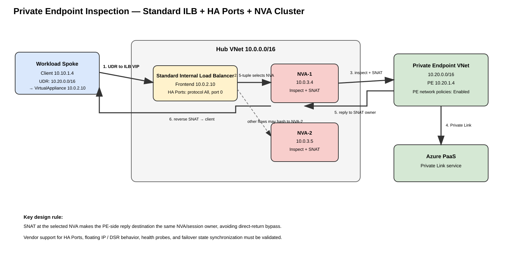

# Azure Private Endpoint Inspection — Azure Firewall and ILB-Backed Third-Party NVA Deep Dive

## Purpose

This guide explains how to force Azure Private Endpoint (PE) traffic through a stateful inspection device. It covers two deployment patterns:

1. **Azure Firewall** in a classic hub-and-spoke topology.
2. **Standard Internal Load Balancer (ILB) with HA Ports in front of third-party NVAs**, where the ILB frontend IP is used as the UDR next hop and one NVA instance performs policy, inspection, state tracking, and SNAT for the flow.

The routing problem is the same in both designs: Private Endpoints install highly specific routes and, unless Private Endpoint network policies are enabled and the source has an appropriate UDR, traffic can bypass centralized inspection. The HA-NVA design adds load-balancer hashing, health probing, vendor HA behavior, SNAT/state ownership, and failure-domain considerations.

Examples use Azure SQL terminology where useful, but the networking principles apply to Private Link-enabled services generally. Service-specific ports, DNS zones, FQDN behavior, and subresources must be validated for the actual PaaS service.

## URLs reviewed

- https://learn.microsoft.com/en-us/azure/private-link/inspect-traffic-with-azure-firewall
- https://learn.microsoft.com/en-us/azure/private-link/tutorial-inspect-traffic-azure-firewall
- https://learn.microsoft.com/en-us/azure/private-link/disable-private-endpoint-network-policy
- https://learn.microsoft.com/en-us/azure/private-link/private-endpoint-overview
- https://learn.microsoft.com/en-us/azure/private-link/secure-private-link
- https://learn.microsoft.com/en-us/azure/firewall/snat-private-range
- https://learn.microsoft.com/en-us/azure/load-balancer/load-balancer-ha-ports-overview
- https://learn.microsoft.com/en-us/azure/load-balancer/components
- https://learn.microsoft.com/en-us/azure/load-balancer/quickstart-load-balancer-standard-internal-cli
- https://learn.microsoft.com/en-us/cli/azure/network/lb/rule?view=azure-cli-latest
- https://learn.microsoft.com/en-us/azure/architecture/example-scenario/firewalls/

---

## 1. What makes Private Endpoint inspection special

A Private Endpoint is an Azure-managed network interface placed in a customer subnet. The NIC receives a private IP. Client DNS resolution maps the normal PaaS hostname to that private address, and the packet is delivered through the Private Link data plane to the service.

The important behavior is route specificity. A Private Endpoint installs a highly specific route for its address. A generic UDR such as:

```text
0.0.0.0/0 -> VirtualAppliance -> firewall/NVA
```

is not, by itself, sufficient to override a more-specific PE route. Microsoft documents that Private Endpoint network policies must be enabled when you want UDR/NSG policy enforcement for Private Endpoints, and the inspection UDR must be sufficiently specific relative to the VNet address space that contains the PE.

### Source information

Microsoft states that Private Endpoint traffic can be inspected by **Azure Firewall or a third-party network virtual appliance**. Microsoft also recommends SNAT when traffic is inspected on the way to a Private Endpoint because SNAT gives the destination side an unambiguous return destination through the stateful inspection device.

### Additional explanation

The Private Endpoint is not a normal dual-homed router or VM that you control. You cannot assume that attaching a route table to some other subnet forces the PE return path through the same firewall instance. If a stateful firewall receives only the forward direction, the session fails. SNAT solves that by making the inspection device the apparent source of the PE-facing flow.

---

## 2. Common routing requirement for Azure Firewall and NVA designs

Assume:

| Resource | Example |
|---|---|
| Workload VNet | `10.10.0.0/16` |
| Client subnet | `10.10.1.0/24` |
| Client VM | `10.10.1.4` |
| Hub VNet | `10.0.0.0/16` |
| Azure Firewall private IP | `10.0.1.4` |
| ILB frontend IP | `10.0.2.10` |
| NVA subnet | `10.0.3.0/24` |
| NVA-1 | `10.0.3.4` |
| NVA-2 | `10.0.3.5` |
| PE VNet | `10.20.0.0/16` |
| PE subnet | `10.20.1.0/24` |
| PE IP | `10.20.1.4` |

A useful source-subnet route is:

```text
10.20.0.0/16 -> VirtualAppliance -> inspection next hop
```

where `inspection next hop` is either:

```text
Azure Firewall design: 10.0.1.4
ILB/NVA design:         10.0.2.10
```

A `/24` or `/32` can be used when you need narrower steering. A dedicated PE subnet/VNet is operationally useful because it lets you aggregate many endpoints behind a small number of UDRs.

### Why `0.0.0.0/0` is not enough

The Private Endpoint route is more specific. Longest-prefix match wins. Microsoft explicitly notes that a default route does not override the PE route. When network policies are enabled, a UDR for the PE VNet/subnet or an individual `/32` can be used to force the inspection path.

---

## 3. Enable Private Endpoint network policies

```cli
RG=rg-pe-inspection
PE_VNET=vnet-pe
PE_SUBNET=snet-private-endpoints

az network vnet subnet update \
  --resource-group "$RG" \
  --vnet-name "$PE_VNET" \
  --name "$PE_SUBNET" \
  --disable-private-endpoint-network-policies false
```

Verify:

```cli
az network vnet subnet show \
  --resource-group "$RG" \
  --vnet-name "$PE_VNET" \
  --name "$PE_SUBNET" \
  --query '{Subnet:name,Prefix:addressPrefix,PENetworkPolicies:privateEndpointNetworkPolicies}' \
  --output table
```

**Success criteria:** `privateEndpointNetworkPolicies` reports an enabled state.

**Failure indicator:** it remains disabled. Fix this before troubleshooting firewall policy because the traffic can bypass the UDR inspection design.

---

# Part I — Azure Firewall

## 4. Azure Firewall architecture


[Editable draw.io source](images/09-06-26-12-37_private_endpoint_inspection_architecture.drawio)

**What this image shows**  
The workload sends PE traffic to Azure Firewall. The firewall evaluates policy, performs SNAT when an application rule is used, and forwards to the PE.

**What matters**  
DNS must return the PE address, the client subnet must have a PE-specific UDR, Private Endpoint network policies must be enabled, and the firewall must perform stateful inspection/SNAT.

**What to verify**  
Client effective routes, PE subnet policy state, firewall logs, and DNS resolution.

## 5. Azure Firewall forward and return path

Assume:

```text
Client:   10.10.1.4:53000
PE:       10.20.1.4:1433
Firewall: 10.0.1.4
```

Forward:

1. DNS resolves the PaaS hostname to `10.20.1.4`.
2. Client sends `10.10.1.4:53000 -> 10.20.1.4:1433`.
3. Client-subnet UDR matches `10.20.0.0/16` and sends the packet to `10.0.1.4`.
4. Azure Firewall evaluates network/application policy.
5. Application rules SNAT the session.
6. Azure Firewall forwards the translated flow to `10.20.1.4`.
7. Private Link carries the connection to the service.

Return:

1. Service response returns through the PE.
2. Because the forward flow was SNATed, the reply is addressed to the firewall-side translated source.
3. Azure Firewall receives the reply and matches session state.
4. Reverse NAT restores the original client destination.
5. The firewall forwards the packet to `10.10.1.4`.

For Azure SQL, application-rule FQDN inspection is aligned with SQL proxy-mode behavior on TCP/1433. Redirect mode can introduce additional ports/destinations and should be designed separately.

---

# Part II — Standard ILB -> NVA(s) -> Private Endpoint

## 6. Is this supported conceptually?

Yes. Microsoft documents both of these building blocks:

- Private Endpoint inspection can use a **third-party NVA**.
- An **internal Standard Load Balancer with HA Ports** can be used to provide high availability and scale for NVAs.

Microsoft's Azure Architecture Center also documents UDRs that use an internal load balancer frontend IP as the next hop to reach an NVA tier.

The combination therefore looks like this:

```text
Client subnet UDR
   |
   | destination = PE address space
   v
Standard Internal Load Balancer frontend IP
   |
   | HA Ports + per-flow hashing + health probe
   +------> NVA-1
   |
   +------> NVA-2
              |
              | inspect + SNAT
              v
        Private Endpoint
              |
              v
        Azure Private Link
              |
              v
          Azure PaaS
```

The ILB does **not** inspect traffic. It is the highly available next-hop abstraction. The selected NVA owns firewall policy, state, optional TLS inspection, logging, and NAT.

## 7. ILB/NVA architecture diagram



[Editable draw.io source](images/09-06-26-12-37_private_endpoint_ilb_nva_architecture.drawio)

**What this image shows**  
A workload UDR points at the internal Standard Load Balancer frontend `10.0.2.10`. The HA Ports rule hashes each incoming flow to a healthy NVA. The selected NVA inspects and SNATs the connection before sending it to the Private Endpoint.

**What matters**  
The UDR next hop is the **ILB frontend**, not an individual firewall VM. SNAT makes the return flow target the NVA/session owner rather than the original workload address.

**What to verify**  
ILB SKU, frontend IP, HA Ports rule, health probes, backend membership, NIC IP forwarding, NVA policy, SNAT, and the effective source route to the PE.

---

## 8. Exact ILB/NVA forward packet flow

Assume this connection:

```text
Client socket:       10.10.1.4:53000
Private Endpoint:    10.20.1.4:443
ILB frontend:        10.0.2.10
Selected NVA:        NVA-1 / 10.0.3.4
```

### Step 1 — client route lookup

The client sends:

```text
SRC 10.10.1.4:53000
DST 10.20.1.4:443
```

The effective route table contains:

```text
10.20.0.0/16 -> VirtualAppliance -> 10.0.2.10
```

The packet is therefore steered toward the ILB frontend.

### Step 2 — ILB HA Ports selection

The Standard ILB receives the flow on frontend `10.0.2.10`.

HA Ports is configured with:

```text
Protocol:      All
Frontend port: 0
Backend port:  0
```

Azure Load Balancer selects a healthy backend per flow using connection properties including source IP, source port, destination IP, destination port, and protocol.

Example decision:

```text
10.10.1.4:53000 -> 10.20.1.4:443/TCP
                         |
                         +--> NVA-1 selected
```

A different flow may be sent to NVA-2.

### Step 3 — selected NVA receives transit traffic

The NVA NIC must have Azure IP forwarding enabled, and the NVA operating system/application must actually forward transit packets.

NVA-1 receives the flow, performs policy lookup, state creation, optional application/security inspection, and then SNAT.

Conceptually:

```text
Before NVA SNAT
SRC 10.10.1.4:53000
DST 10.20.1.4:443

After NVA SNAT
SRC 10.0.3.4:<translated-port>
DST 10.20.1.4:443
```

The exact translated source IP may be a dedicated egress/data-plane IP, loopback, or vendor-specific interface address. Use the vendor-supported HA design; do not assume every appliance should SNAT to its Azure NIC primary IP.

### Step 4 — NVA routes toward the PE

The NVA must have a valid route to `10.20.0.0/16` that does **not** send the packet back to its own ILB frontend.

This matters because Azure Load Balancer documents that outbound traffic from a backend VM to the frontend of the same internal load balancer is not a supported normal hairpin path.

The NVA should forward directly toward the PE VNet over hub-to-PE connectivity, subject to the vendor topology and Azure VNet routes.

### Step 5 — Private Endpoint receives the packet

The PE sees the translated NVA source and forwards the flow through Private Link to the PaaS service.

---

## 9. Exact ILB/NVA return packet flow

The return direction is where SNAT becomes essential.

### With NVA SNAT

The service/PE sees the connection as coming from the selected NVA.

The response is therefore conceptually:

```text
SRC 10.20.1.4:443
DST 10.0.3.4:<translated-port>
```

Return sequence:

1. PaaS sends the response through Private Link to the PE.
2. PE-side routing sends the reply toward the translated NVA source.
3. NVA-1 receives the packet because NVA-1 owns that NAT/session entry.
4. NVA-1 performs reverse SNAT.
5. The packet becomes:

```text
SRC 10.20.1.4:443
DST 10.10.1.4:53000
```

6. NVA-1 forwards the restored reply to the workload VNet.
7. The client receives a symmetric stateful session.

### Without SNAT

The destination can see the original client address:

```text
SRC 10.10.1.4
DST 10.20.1.4
```

The reply can then be routed directly toward `10.10.1.4`, bypassing the selected NVA/ILB path. The firewall would see only one direction and stateful inspection would fail or behave unpredictably.

This is why SNAT is the preferred PE-inspection design unless the NVA vendor documents another supported symmetry mechanism.

---

## 10. HA behavior: what ILB does and does not provide

### What ILB HA Ports provides

- Per-flow distribution across healthy NVA backend instances.
- Health-probe-based removal of unhealthy instances.
- Active/active and some active/passive NVA patterns, depending on vendor support.
- A stable frontend next-hop IP for UDRs.

### What ILB does not automatically provide

- Firewall session-state synchronization between NVA-1 and NVA-2.
- Vendor policy synchronization.
- NAT-state synchronization.
- Guaranteed preservation of an existing stateful session if its NVA dies.
- NVA control-plane failover logic.

If NVA-1 fails after a session is established, ILB can stop sending **new** flows to it after health detection. Whether an existing connection survives depends on the appliance vendor's stateful HA mechanism. If NVA-2 does not possess NVA-1's session and NAT state, that session normally has to reconnect.

### Vendor validation checklist

Confirm with the NVA vendor:

- whether Standard ILB HA Ports is supported;
- whether Floating IP/direct-server-return behavior is required;
- which NIC/interface should be placed in the backend pool;
- whether one-arm or two-arm topology is supported;
- whether SNAT is required and to what address;
- how session synchronization works;
- health-probe port/path requirements;
- whether asymmetric return traffic is tolerated;
- whether the appliance supports active/active or active/passive behind ILB;
- whether multiple frontend IPs or multiple HA Ports rules are supported.

---

## 11. Azure CLI — create the ILB and NVA service insertion layer

The following commands create the Azure-side load-balancer constructs. They do **not** configure vendor firewall policy, HA clustering, NAT, or interface roles inside the NVA operating system.

### 11.1 Variables

```cli
RG=rg-pe-inspection
LOCATION=eastus2
HUB_VNET=vnet-hub
NVA_SUBNET=snet-nva
NVA_SUBNET_PREFIX=10.0.3.0/24

ILB=ilb-nva
ILB_FRONTEND=fe-nva
ILB_IP=10.0.2.10
ILB_BACKEND=be-nvas
ILB_PROBE=probe-nva
ILB_RULE=ha-ports-nva

NVA1_NIC=nic-nva1
NVA2_NIC=nic-nva2
```

### 11.2 Create NVA subnet if it does not already exist

```cli
az network vnet subnet create \
  --resource-group "$RG" \
  --vnet-name "$HUB_VNET" \
  --name "$NVA_SUBNET" \
  --address-prefixes "$NVA_SUBNET_PREFIX"
```

### 11.3 Create Standard internal Load Balancer

```cli
az network lb create \
  --resource-group "$RG" \
  --name "$ILB" \
  --location "$LOCATION" \
  --sku Standard \
  --vnet-name "$HUB_VNET" \
  --subnet "$NVA_SUBNET" \
  --frontend-ip-name "$ILB_FRONTEND" \
  --private-ip-address "$ILB_IP" \
  --backend-pool-name "$ILB_BACKEND"
```

Verify:

```cli
az network lb show \
  --resource-group "$RG" \
  --name "$ILB" \
  --query '{sku:sku.name,frontend:frontendIPConfigurations[0].privateIPAddress,backendPools:backendAddressPools[].name}' \
  --output json
```

**Expected state:** SKU `Standard`, frontend `10.0.2.10`, backend pool present.

### 11.4 Create an NVA health probe

Use a port that the appliance vendor explicitly documents for health checking. Example only:

```cli
az network lb probe create \
  --resource-group "$RG" \
  --lb-name "$ILB" \
  --name "$ILB_PROBE" \
  --protocol tcp \
  --port 9000
```

Do **not** blindly use TCP/9000 in production. The appliance must actually answer the configured probe in the intended health state.

### 11.5 Create the HA Ports rule

Microsoft documents HA Ports using protocol `All` and frontend/backend port `0`.

```cli
az network lb rule create \
  --resource-group "$RG" \
  --lb-name "$ILB" \
  --name "$ILB_RULE" \
  --protocol All \
  --frontend-port 0 \
  --backend-port 0 \
  --frontend-ip-name "$ILB_FRONTEND" \
  --backend-pool-name "$ILB_BACKEND" \
  --probe-name "$ILB_PROBE"
```

If your vendor requires Floating IP, use the vendor-supported rule form and validate it against current CLI help:

```cli
az network lb rule create --help
```

Do not enable Floating IP merely because an NVA is involved; Microsoft supports both floating and nonfloating HA Ports configurations, and the correct choice is architecture/vendor-specific.

### 11.6 Enable Azure NIC IP forwarding

```cli
az network nic update \
  --resource-group "$RG" \
  --name "$NVA1_NIC" \
  --ip-forwarding true

az network nic update \
  --resource-group "$RG" \
  --name "$NVA2_NIC" \
  --ip-forwarding true
```

Verify:

```cli
az network nic show \
  --resource-group "$RG" \
  --name "$NVA1_NIC" \
  --query '{nic:name,ipForwarding:enableIPForwarding,privateIPs:ipConfigurations[].privateIPAddress}' \
  --output json
```

**Success criteria:** `enableIPForwarding` is `true`.

### 11.7 Add NVA NICs to the ILB backend pool

The exact command depends on whether the backend pool is NIC-based or IP-based. For a NIC-based pool, update the relevant NIC IP configuration.

First inspect the IP configuration names:

```cli
az network nic ip-config list \
  --resource-group "$RG" \
  --nic-name "$NVA1_NIC" \
  --output table
```

Then associate the vendor-designated data-plane IP configuration with the backend pool using the current Azure CLI syntax for your deployment. Verify afterward with:

```cli
az network lb address-pool show \
  --resource-group "$RG" \
  --lb-name "$ILB" \
  --name "$ILB_BACKEND" \
  --output json
```

Because firewall vendors differ in NIC count, IP configuration, floating-IP requirements, and one-arm/two-arm architecture, this guide intentionally does not invent a universal NIC-association command that could place the wrong interface in the pool.

---

## 12. Create workload UDR to the ILB frontend

```cli
APP_VNET=vnet-app
APP_SUBNET=snet-app
APP_RT=rt-app-pe-via-nva
PE_PREFIX=10.20.0.0/16

az network route-table create \
  --resource-group "$RG" \
  --name "$APP_RT" \
  --location "$LOCATION"

az network route-table route create \
  --resource-group "$RG" \
  --route-table-name "$APP_RT" \
  --name pe-via-ilb-nva \
  --address-prefix "$PE_PREFIX" \
  --next-hop-type VirtualAppliance \
  --next-hop-ip-address "$ILB_IP"

az network vnet subnet update \
  --resource-group "$RG" \
  --vnet-name "$APP_VNET" \
  --name "$APP_SUBNET" \
  --route-table "$APP_RT"
```

Configured route verification:

```cli
az network route-table route list \
  --resource-group "$RG" \
  --route-table-name "$APP_RT" \
  --output table
```

Illustrative expected shape:

```text
Name            AddressPrefix   NextHopType       NextHopIpAddress
--------------  --------------  ----------------  ----------------
pe-via-ilb-nva  10.20.0.0/16    VirtualAppliance  10.0.2.10
```

---

## 13. Verify the source NIC effective route

```cli
CLIENT_NIC=<client-vm-nic-name>

az network nic show-effective-route-table \
  --resource-group "$RG" \
  --name "$CLIENT_NIC" \
  --output table
```

**What it tests:** the actual route Azure installed for the workload NIC.

**Success criteria:** the PE VNet/subnet or `/32` prefix resolves to `VirtualAppliance` and next-hop IP `10.0.2.10`.

**Failure indicators:**

- a more-specific `InterfaceEndpoint` route is still winning;
- route table is attached to the wrong subnet;
- destination prefix is too broad;
- PE network policies are disabled;
- UDR points directly to an NVA instead of the intended ILB VIP.

---

## 14. Verify ILB rule and health configuration

```cli
az network lb rule show \
  --resource-group "$RG" \
  --lb-name "$ILB" \
  --name "$ILB_RULE" \
  --output json
```

Important fields:

```text
protocol            = All
frontendPort        = 0
backendPort         = 0
frontendIP config   = fe-nva
backend pool        = be-nvas
probe               = probe-nva
```

Probe configuration:

```cli
az network lb probe show \
  --resource-group "$RG" \
  --lb-name "$ILB" \
  --name "$ILB_PROBE" \
  --output json
```

**Success criteria:** probe settings match the vendor's supported health endpoint and NVA instances are healthy.

**Failure means:** ILB may have no usable backend or may steer new flows away from an unhealthy appliance.

---

## 15. NVA routing requirements

The NVA needs three logical routing outcomes:

1. **From the client side:** accept transit traffic delivered by the ILB.
2. **Toward the PE:** route `10.20.0.0/16` toward the PE VNet, not back to the ILB VIP.
3. **Toward the workload:** after reverse NAT, route `10.10.0.0/16` back toward the workload spoke.

A generic conceptual NVA table is:

```text
10.10.0.0/16 -> Azure VNet path toward workload spoke
10.20.0.0/16 -> Azure VNet path toward PE spoke
0.0.0.0/0    -> vendor/enterprise-defined default path
```

The exact appliance CLI must come from the firewall vendor because route table names, zones, VRFs, next-hop rules, and HA semantics differ.

---

## 16. NAT policy on the NVA

The PE-inspection flow should normally be SNATed on the selected firewall instance or on a vendor-supported shared egress identity.

Conceptual rule:

```text
Source zone:       workload/transit
Source prefix:     10.10.0.0/16
Destination:       10.20.0.0/16 or PE objects
Service:           required PaaS ports
Action:            allow/inspect
Source NAT:        vendor-supported NVA egress identity
Destination NAT:   none
```

Do not DNAT the PE destination. The client must still address the real PE IP/FQDN. The firewall is inserted in the transit path; it is not replacing the Private Endpoint.

### Why a shared SNAT address may matter

Some active/active firewall products can synchronize NAT state or use a shared/floating identity. Others use node-local SNAT addresses. Either can work if the vendor supports it, but the failure behavior differs.

If NVA-1 SNATs to a node-local address and dies, existing sessions tied to that NAT state may fail. A shared stateful cluster can provide better continuity if supported.

---

## 17. Flow symmetry and HA Ports

Azure Load Balancer documentation describes HA Ports flow symmetry for supported NVA configurations behind one internal Standard Load Balancer. This does **not** replace NVA SNAT for Private Endpoint inspection.

There are two different symmetry problems:

### Problem A — ILB backend selection symmetry

For traffic that traverses the ILB in both directions in a supported topology, Azure can maintain a consistent backend mapping for the flow.

### Problem B — Private Endpoint return-path symmetry

The PE-side destination must still return through the same stateful inspection path. SNAT makes the return destination the firewall/session owner and is therefore the safer Private Endpoint design.

Do not confuse "HA Ports supports flow symmetry" with "Private Endpoint SNAT is unnecessary." They solve different parts of the path.

---

## 18. Important Azure Load Balancer constraints

### Standard SKU only

HA Ports is available on **internal Standard Load Balancer**.

### Per-flow load balancing

The ILB hashes each flow. It does not send every packet round-robin independently.

### Health probes affect backend eligibility

A failed probe removes an NVA from new-flow selection until it becomes healthy again.

### Backend-to-own-frontend hairpin limitation

Azure documents that outbound traffic from a backend VM to the frontend of its own internal load balancer fails. Design the NVA's PE-facing routing so it does not send the packet back into the same ILB frontend.

### IP fragmentation

Microsoft documents limitations around IP fragmentation with Load Balancer rules. Validate MTU/MSS behavior for overlays, VPNs, TLS inspection, or encapsulating NVA products.

### TCP idle timeout with UDR + HA Ports

Microsoft documents that TCP idle timeout is not supported for internal Load Balancer HA Ports when a UDR is used to forward traffic to the ILB. Account for application keepalives and vendor behavior.

---

## 19. DNS path remains unchanged

The inspection device is not the Private Endpoint DNS authority.

The client should resolve the normal service hostname, for example:

```text
myserver.database.windows.net
```

through the appropriate private DNS chain to the PE address, for example:

```text
myserver.privatelink.database.windows.net -> 10.20.1.4
```

Verify:

```cli
nslookup myserver.database.windows.net
```

or:

```cli
dig myserver.database.windows.net
```

If DNS returns a public address, you are not testing the PE inspection path.

---

## 20. Peering requirements

A common topology is:

```text
Workload spoke <-> Hub/NVA VNet <-> PE spoke
```

VNet peering is non-transitive by itself. The NVA is the routed transit point.

Enable forwarded traffic on the peerings where required:

```cli
az network vnet peering create \
  --resource-group "$RG" \
  --vnet-name vnet-app \
  --name app-to-hub \
  --remote-vnet <hub-vnet-resource-id> \
  --allow-vnet-access \
  --allow-forwarded-traffic
```

and corresponding reverse-direction peerings as appropriate.

Do not add a direct workload-to-PE peering path unless you deliberately control it; an alternate direct path can undermine centralized inspection.

---

## 21. Failure scenarios

### NVA-1 health probe fails before a new session

Expected behavior:

1. ILB marks NVA-1 unhealthy after the configured probe behavior.
2. New flows are sent to healthy backends such as NVA-2.
3. NVA-2 creates new firewall/NAT state.

### NVA-1 dies during an existing session

Possible outcomes depend on vendor HA:

- **No state sync:** existing session fails and client reconnects.
- **State/NAT sync:** NVA-2 may continue the flow if the vendor architecture supports takeover.
- **Shared/floating identity:** continuity depends on vendor implementation and Azure LB compatibility.

Do not claim zero-loss failover merely because ILB health probes are configured.

### Both NVAs unhealthy

No healthy backend exists. New flows fail. The UDR still points to the ILB VIP, so Azure does not automatically bypass inspection unless you build a separate fail-open routing mechanism.

### SNAT not configured

Symptoms commonly include:

- SYN reaches the NVA and PE;
- application times out;
- NVA sees only outbound direction;
- return path bypasses the appliance;
- session table remains incomplete.

### PE network policies disabled

The client effective route can still prefer the PE-specific route, bypassing the ILB/NVA.

---

## 22. Troubleshooting by symptom

### Symptom: NVA logs show nothing

**Where:** client NIC effective routes.  
**Command:**

```cli
az network nic show-effective-route-table -g "$RG" -n "$CLIENT_NIC" -o table
```

**What it tests:** whether the client sends PE traffic to the ILB VIP.

**Expected:** PE prefix -> `VirtualAppliance` -> `10.0.2.10`.

**Failure means:** route specificity, subnet association, or PE policy problem.

**Next action:** correct routing before debugging the NVA.

### Symptom: ILB receives flows but one NVA never gets traffic

**Where:** ILB backend pool and health probes.  
**Commands:**

```cli
az network lb address-pool show -g "$RG" --lb-name "$ILB" -n "$ILB_BACKEND" -o json
az network lb probe show -g "$RG" --lb-name "$ILB" -n "$ILB_PROBE" -o json
```

**What it tests:** membership and health configuration.

**Failure means:** wrong NIC/IP configuration, probe service down, NSG blocking probe, or vendor probe mismatch.

### Symptom: NVA receives forward traffic but client times out

**Where:** NVA session/NAT table and return routing.

**What it tests:** state symmetry.

**Expected:** a SNAT entry exists, response hits the same logical firewall state, reverse NAT occurs.

**Failure means:** no SNAT, wrong PE-facing route, state-sync issue, or vendor HA mismatch.

### Symptom: NVA sends traffic back to ILB frontend and it disappears

**Where:** NVA route table.

**Cause:** backend-to-own-frontend hairpin design.

**Next action:** give the NVA a direct routed path toward the PE VNet instead of sending the post-inspection leg back to its own ILB VIP.

### Symptom: PE connection works when firewall is bypassed but fails through NVA

Check in order:

1. client effective route;
2. ILB HA Ports rule;
3. health probe;
4. backend NIC IP forwarding;
5. NVA transit forwarding;
6. NVA security policy;
7. NVA SNAT;
8. PE subnet network-policy state;
9. PE connection approval;
10. DNS resolution;
11. PaaS-specific ports and connection mode.

---

## 23. Azure Firewall vs ILB/NVA comparison

| Area | Azure Firewall | ILB + third-party NVA |
|---|---|---|
| Managed HA | Azure-managed | ILB plus vendor HA design |
| UDR next hop | Firewall private IP | ILB frontend IP |
| Scale/failover | Service-managed | Health probe + backend pool + vendor clustering |
| SNAT for PE flow | Application rules always SNAT | Must be designed/configured in NVA |
| FQDN policy | Native firewall features | Vendor-specific |
| TLS inspection | Premium feature where supported | Vendor-specific |
| Session synchronization | Managed service behavior | Vendor-specific |
| CLI for Azure plumbing | Azure Firewall CLI | Azure LB + NIC + route CLI |
| Firewall policy CLI | Azure-native | Vendor CLI/API/Terraform/etc. |
| Operational complexity | Lower | Higher but more vendor flexibility |

---

## 24. Common mistakes

- Assuming Private Endpoint inspection requires Azure Firewall; third-party NVAs are valid.
- Assuming an NVA VM alone is highly available without an HA mechanism.
- Pointing the UDR directly at one NVA when the intended design is an ILB-backed NVA pool.
- Using Basic Load Balancer instead of Standard ILB.
- Creating a normal port-specific LB rule instead of HA Ports when the design requires all transit ports/protocols.
- Using an arbitrary health-probe port that the appliance does not support.
- Forgetting Azure NIC IP forwarding.
- Forgetting OS/appliance forwarding even though Azure NIC IP forwarding is enabled.
- Omitting SNAT on the PE-facing leg.
- Assuming HA Ports removes the need for firewall session-state synchronization.
- Hairpinning an NVA backend back into its own ILB frontend.
- Leaving Private Endpoint network policies disabled.
- Relying on `0.0.0.0/0` alone to capture PE traffic.
- Debugging routing while DNS still returns the public PaaS address.
- Creating an alternate direct spoke-to-PE path that bypasses inspection.

---

## 25. Recommended production design sequence

1. Put Private Endpoints in a dedicated subnet or VNet.
2. Enable Private Endpoint network policies for UDR support.
3. Build hub-to-workload and hub-to-PE connectivity with forwarded traffic allowed where required.
4. Deploy two or more vendor-supported NVA instances.
5. Enable IP forwarding on the NVA data-plane NICs.
6. Create an internal **Standard** Load Balancer.
7. Put the vendor-designated NVA interface/IP configuration in the backend pool.
8. Create a vendor-supported health probe.
9. Create an HA Ports rule (`All`, `0`, `0`).
10. Configure the NVA routing table so PE-facing traffic exits toward the PE VNet, not back into the ILB VIP.
11. Configure security policy and SNAT.
12. Add source-subnet UDRs for the PE prefix with next hop equal to the ILB frontend IP.
13. Validate DNS returns the PE private address.
14. Validate effective routes.
15. Establish a test connection and verify the exact session on the selected NVA.
16. Fail one NVA and measure new-flow behavior and existing-flow behavior separately.
17. Document whether the vendor provides state/NAT synchronization and what sessions are expected to survive failover.

---

## 26. Source information, additional explanation, and inference

### Source information

Microsoft documentation directly supports the following:

- Private Endpoint traffic can be inspected by Azure Firewall or a third-party NVA.
- Private Endpoint network policies must be enabled to use UDR/NSG enforcement for PEs.
- A generic default route does not automatically override a PE-specific route.
- SNAT is recommended for inspected Private Endpoint traffic.
- Azure Firewall application rules always SNAT.
- Internal Standard Load Balancer supports HA Ports for NVA high availability/scale.
- HA Ports uses protocol `All` and port `0`.
- Load Balancer uses per-flow selection and health probes.
- Azure Architecture Center documents UDR-to-ILB-frontend patterns for NVA service insertion.
- Outbound flow from an ILB backend VM to that same ILB frontend is a platform limitation.

### Additional explanation

The packet walks in this guide combine those documented primitives into a full PE inspection design: UDR -> ILB VIP -> selected NVA -> SNAT -> PE -> return to session owner -> reverse NAT -> client.

### Reasonable inference

The exact firewall-side SNAT address, session replication mechanics, zone names, VRFs, route-table identifiers, and failover behavior are vendor-specific. They must not be assumed from Azure ILB behavior alone.

---

## Sources

- Microsoft Learn — Azure Firewall scenarios to inspect traffic destined to a private endpoint: https://learn.microsoft.com/en-us/azure/private-link/inspect-traffic-with-azure-firewall
- Microsoft Learn — Tutorial: Inspect private endpoint traffic with Azure Firewall: https://learn.microsoft.com/en-us/azure/private-link/tutorial-inspect-traffic-azure-firewall
- Microsoft Learn — Manage network policies for private endpoints: https://learn.microsoft.com/en-us/azure/private-link/disable-private-endpoint-network-policy
- Microsoft Learn — Secure your Azure Private Link deployment: https://learn.microsoft.com/en-us/azure/private-link/secure-private-link
- Microsoft Learn — Azure Firewall SNAT private IP address ranges: https://learn.microsoft.com/en-us/azure/firewall/snat-private-range
- Microsoft Learn — High availability ports overview: https://learn.microsoft.com/en-us/azure/load-balancer/load-balancer-ha-ports-overview
- Microsoft Learn — Azure Load Balancer components: https://learn.microsoft.com/en-us/azure/load-balancer/components
- Microsoft Learn — Create an internal Standard Load Balancer with Azure CLI: https://learn.microsoft.com/en-us/azure/load-balancer/quickstart-load-balancer-standard-internal-cli
- Microsoft Learn — `az network lb rule`: https://learn.microsoft.com/en-us/cli/azure/network/lb/rule?view=azure-cli-latest
- Azure Architecture Center — Deploy highly available NVAs: https://learn.microsoft.com/en-us/azure/architecture/example-scenario/firewalls/
