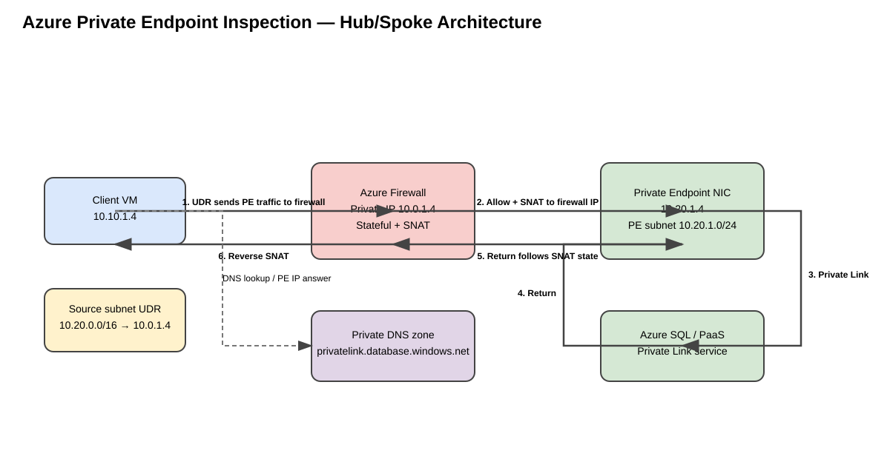
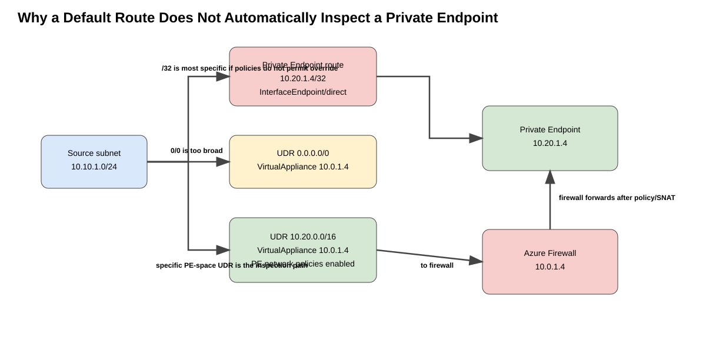
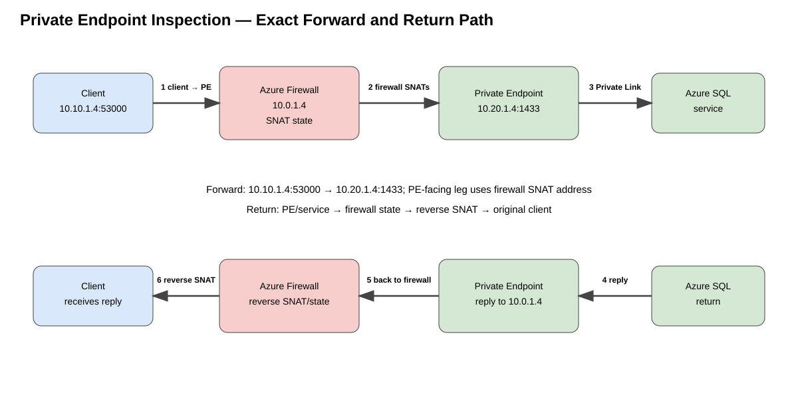

# Azure Private Endpoint Inspection with Azure Firewall — Deep Dive

## Purpose

This guide explains how to force traffic destined to Azure Private Endpoints through Azure Firewall for inspection, with emphasis on the routing mechanics that make this design different from ordinary hub-and-spoke inspection. It includes a reproducible Azure CLI pattern, exact forward and return packet flow, DNS behavior, User-Defined Route (UDR) requirements, Source Network Address Translation (SNAT), verification, failure modes, and troubleshooting.

The examples use Azure SQL as the Private Link target, but the routing concepts apply to other services that support Azure Private Endpoint. Service-specific ports, DNS zones, subresources, and firewall rule types must be adjusted for the actual PaaS service.

## URLs reviewed

- https://learn.microsoft.com/en-us/azure/private-link/inspect-traffic-with-azure-firewall
- https://learn.microsoft.com/en-us/azure/private-link/tutorial-inspect-traffic-azure-firewall
- https://learn.microsoft.com/en-us/azure/private-link/disable-private-endpoint-network-policy
- https://learn.microsoft.com/en-us/azure/private-link/private-endpoint-overview
- https://learn.microsoft.com/en-us/azure/private-link/secure-private-link
- https://learn.microsoft.com/en-us/azure/firewall/snat-private-range
- https://learn.microsoft.com/en-us/cli/azure/network/private-endpoint?view=azure-cli-latest
- https://learn.microsoft.com/en-us/cli/azure/network/firewall/policy/rule-collection-group/collection?view=azure-cli-latest

## 1. The core problem

A Private Endpoint (PE) creates a network interface in a customer VNet and assigns that interface a private IP address. Clients resolve the PaaS service name to that private IP and send traffic to the PE. Azure then carries the flow across the Private Link data plane to the service provider.

The important routing detail is that Azure programs a highly specific route for the PE address. If you simply deploy a hub firewall and attach a `0.0.0.0/0` UDR to a workload subnet, that default route does **not** necessarily force the PE flow through the firewall. Longest-prefix match favors the PE-specific route. To steer PE traffic through an inspection appliance, Azure requires Private Endpoint network policies to be enabled on the PE subnet and a sufficiently specific UDR to override the PE route behavior.

Microsoft's current guidance also recommends SNAT when traffic is inspected by a stateful firewall or NVA. Azure Firewall application rules always SNAT. If Azure Firewall network rules are used, or a third-party NVA is used, you must explicitly ensure SNAT behavior that preserves flow symmetry.

### Source information

Microsoft documents that Private Endpoint network policies are disabled by default and must be enabled to use UDR/NSG support for PE traffic. Microsoft also documents that a broad default route does not override the PE's more-specific route and recommends SNAT for inspected PE flows.

### Additional explanation

The reason SNAT matters is that the PaaS-side Private Link data plane is not a normal VM subnet that you control with a symmetric return UDR. Without SNAT, the destination can return toward the original client by a platform-selected path that does not necessarily traverse the same firewall instance/state table. SNAT makes the PE see the firewall as the source, so the reply naturally returns to the firewall, where stateful reverse NAT restores the original client address.

---

## 2. Reference architecture

The most scalable classic hub-and-spoke pattern places Private Endpoints in a dedicated VNet or dedicated PE subnet, with Azure Firewall in the hub. Workload subnets use UDRs toward the firewall for the PE address space. The PE subnet has Private Endpoint network policies enabled so UDR processing can override the default PE path.



[Editable draw.io source](images/09-06-26-12-37_private_endpoint_inspection_architecture.drawio)

**What this image shows**  
A client workload resolves the PaaS name to the PE private IP, routes that destination to Azure Firewall, is inspected and SNATed, then reaches the PE and Private Link service.

**What matters**  
The source subnet UDR, PE-subnet network-policy setting, firewall policy, DNS resolution, and SNAT behavior all participate. Missing any one of these can create a bypass or asymmetric flow.

**What to verify**  
Confirm the client NIC effective route points the PE prefix toward the firewall; confirm the PE subnet reports Private Endpoint network policies enabled; confirm the firewall logs the flow; and confirm DNS returns the PE IP.

### Example addressing

| Component | Example |
|---|---|
| Hub VNet | `10.0.0.0/16` |
| `AzureFirewallSubnet` | `10.0.1.0/26` |
| Azure Firewall private IP | `10.0.1.4` |
| Workload VNet | `10.10.0.0/16` |
| Workload subnet | `10.10.1.0/24` |
| Example client VM | `10.10.1.4` |
| Private Endpoint VNet | `10.20.0.0/16` |
| Private Endpoint subnet | `10.20.1.0/24` |
| Private Endpoint IP | `10.20.1.4` |
| SQL port | TCP/1433 |

The exact PE IP should normally be retrieved from the deployed PE NIC rather than assumed.

---

## 3. Route precedence: why `0.0.0.0/0` is not enough



[Editable draw.io source](images/09-06-26-12-37_private_endpoint_route_precedence.drawio)

**What this image shows**  
The source sees a PE-specific route and any configured UDRs. A generic default route is less specific than the PE route. A PE-address-space UDR can become the selected inspection route when PE network policies are enabled.

**What matters**  
Do not assume that an existing Internet-egress UDR automatically captures Private Endpoint traffic.

**What to verify**  
Use `az network nic show-effective-route-table` on the client NIC and verify the selected route for the PE destination points to `VirtualAppliance` with the firewall private IP.

### 3.1 Prefix-length rule

Microsoft states that a UDR used to override a Private Endpoint route must use a prefix that is sufficiently specific relative to the VNet address space containing the PE. A `0.0.0.0/0` UDR is broader than the PE's route and does not win longest-prefix match. In practice, a dedicated PE subnet or PE VNet makes this manageable because you can install one route for the PE subnet/VNet rather than one `/32` per endpoint.

For example:

```text
PE VNet:                10.20.0.0/16
PE subnet:              10.20.1.0/24
PE IP:                  10.20.1.4
Firewall:               10.0.1.4

Useful UDR pattern:     10.20.0.0/16 -> VirtualAppliance 10.0.1.4
or                      10.20.1.0/24 -> VirtualAppliance 10.0.1.4

Insufficient by itself: 0.0.0.0/0 -> VirtualAppliance 10.0.1.4
```

A `/32` UDR for each PE is also possible, but dedicated subnets/VNets reduce route-count and operational overhead.

---

## 4. Exact packet flow



[Editable draw.io source](images/09-06-26-12-37_private_endpoint_forward_return_flow.drawio)

**What this image shows**  
The forward and return sessions with address translation. The client starts the session using its own IP. Azure Firewall application-rule processing SNATs the source to a firewall address before the flow reaches the PE.

**What matters**  
SNAT causes the destination side to return to Azure Firewall, preserving stateful symmetry. Azure Firewall reverses the translation before delivering the reply to the client.

**What to verify**  
Firewall logs should show the client-to-PE decision, the correct rule collection/rule, and the destination FQDN/IP. A packet capture at a controllable NVA would show the translated source on the PE-facing leg; Azure Firewall itself is a managed service, so validation is normally log- and route-based.

### 4.1 DNS phase

1. The client queries `server-name.database.windows.net`.
2. Private DNS integration returns the PE private IP, for example `10.20.1.4`.
3. The client therefore creates a TCP session to `10.20.1.4:1433`, not to the public service address.
4. If DNS incorrectly returns the public endpoint, the routing and firewall policy described in this guide are not testing the PE path at all.

### 4.2 Forward path

Assume:

```text
Client socket: 10.10.1.4:53000
Destination:   10.20.1.4:1433
Firewall IP:   10.0.1.4
```

1. Client emits `10.10.1.4:53000 -> 10.20.1.4:1433`.
2. Source-subnet route lookup matches `10.20.0.0/16 -> VirtualAppliance 10.0.1.4`.
3. VNet peering carries the packet from the workload spoke to the hub firewall. Peering must allow forwarded traffic where required by the topology.
4. Azure Firewall evaluates the connection. With an application rule for SQL, the firewall proxies/SNATs the session.
5. The firewall sends a new/translated leg toward the PE. Conceptually the PE-facing source is a firewall private address, not the original workload address.
6. The PE receives the packet on `10.20.1.4` and the Azure Private Link data plane maps it to the target Azure SQL service/subresource.

### 4.3 Return path

1. The service returns toward the PE.
2. Because the inspected flow was SNATed, the PE-side destination for the reply is the firewall-side translated address/state.
3. The packet returns to Azure Firewall rather than attempting to route directly to `10.10.1.4`.
4. Azure Firewall matches the state table and performs reverse SNAT.
5. The firewall forwards the restored reply to the workload spoke.
6. Client receives the response from the expected PE/service flow.

### 4.4 Why application rules are preferred

Microsoft recommends application rules over network rules for Private Endpoint inspection because application rules always SNAT. That directly solves the symmetry problem. Application rules also allow FQDN-oriented policy for supported protocols.

For Azure SQL, FQDN filtering in application rules is supported in proxy mode on TCP/1433. SQL redirect mode has additional port behavior; if you must preserve redirect mode, Microsoft recommends using FQDN filtering in network rules instead and ensuring SNAT is configured.

---

## 5. Azure CLI lab — build the routing and inspection path

The following commands are a reproducible reference pattern. They intentionally separate resource creation from inspection policy so you can adapt them to an existing landing zone.

### 5.1 Variables

```cli
RG=rg-pe-inspection
LOCATION=eastus2

HUB_VNET=vnet-hub
FW_SUBNET=AzureFirewallSubnet
FW_NAME=azfw-hub
FW_PIP=pip-azfw-hub
FW_POLICY=fwpolicy-pe

APP_VNET=vnet-app
APP_SUBNET=snet-app
APP_RT=rt-app

PE_VNET=vnet-pe
PE_SUBNET=snet-private-endpoints

SQL_SERVER=<globally-unique-sql-server-name>
SQL_DB=appdb
PE_NAME=pe-sql
PE_CONN=pec-sql
DNS_ZONE=privatelink.database.windows.net
```

### 5.2 Create the resource group and VNets

```cli
az group create \
  --name "$RG" \
  --location "$LOCATION"

az network vnet create \
  --resource-group "$RG" \
  --name "$HUB_VNET" \
  --location "$LOCATION" \
  --address-prefixes 10.0.0.0/16 \
  --subnet-name "$FW_SUBNET" \
  --subnet-prefixes 10.0.1.0/26

az network vnet create \
  --resource-group "$RG" \
  --name "$APP_VNET" \
  --location "$LOCATION" \
  --address-prefixes 10.10.0.0/16 \
  --subnet-name "$APP_SUBNET" \
  --subnet-prefixes 10.10.1.0/24

az network vnet create \
  --resource-group "$RG" \
  --name "$PE_VNET" \
  --location "$LOCATION" \
  --address-prefixes 10.20.0.0/16 \
  --subnet-name "$PE_SUBNET" \
  --subnet-prefixes 10.20.1.0/24
```

### 5.3 Enable Private Endpoint network policies on the PE subnet

This is the critical setting that allows UDR and NSG processing for Private Endpoints in the subnet.

```cli
az network vnet subnet update \
  --resource-group "$RG" \
  --vnet-name "$PE_VNET" \
  --name "$PE_SUBNET" \
  --disable-private-endpoint-network-policies false
```

Verify:

```cli
az network vnet subnet show \
  --resource-group "$RG" \
  --vnet-name "$PE_VNET" \
  --name "$PE_SUBNET" \
  --query '{name:name,prefix:addressPrefix,privateEndpointNetworkPolicies:privateEndpointNetworkPolicies}' \
  --output table
```

**Expected successful state:** `privateEndpointNetworkPolicies` should show an enabled state. Exact table formatting can vary by CLI version.

**Failure indicator:** the property still shows disabled. In that case the PE-specific routing behavior can bypass the UDR inspection design.

### 5.4 Peer the VNets

```cli
HUB_ID=$(az network vnet show -g "$RG" -n "$HUB_VNET" --query id -o tsv)
APP_ID=$(az network vnet show -g "$RG" -n "$APP_VNET" --query id -o tsv)
PE_ID=$(az network vnet show -g "$RG" -n "$PE_VNET" --query id -o tsv)

az network vnet peering create \
  -g "$RG" --vnet-name "$HUB_VNET" -n hub-to-app \
  --remote-vnet "$APP_ID" \
  --allow-vnet-access \
  --allow-forwarded-traffic

az network vnet peering create \
  -g "$RG" --vnet-name "$APP_VNET" -n app-to-hub \
  --remote-vnet "$HUB_ID" \
  --allow-vnet-access \
  --allow-forwarded-traffic

az network vnet peering create \
  -g "$RG" --vnet-name "$HUB_VNET" -n hub-to-pe \
  --remote-vnet "$PE_ID" \
  --allow-vnet-access \
  --allow-forwarded-traffic

az network vnet peering create \
  -g "$RG" --vnet-name "$PE_VNET" -n pe-to-hub \
  --remote-vnet "$HUB_ID" \
  --allow-vnet-access \
  --allow-forwarded-traffic
```

A direct app-to-PE peering is **not** required for the centralized transit path shown here. Azure VNet peering is non-transitive, so the firewall is the routed transit point between the two spokes.

### 5.5 Deploy Azure Firewall and Firewall Policy

```cli
az network public-ip create \
  --resource-group "$RG" \
  --name "$FW_PIP" \
  --location "$LOCATION" \
  --sku Standard \
  --allocation-method Static

az network firewall policy create \
  --resource-group "$RG" \
  --name "$FW_POLICY" \
  --location "$LOCATION"

az network firewall create \
  --resource-group "$RG" \
  --name "$FW_NAME" \
  --location "$LOCATION" \
  --vnet-name "$HUB_VNET" \
  --firewall-policy "$FW_POLICY"

az network firewall ip-config create \
  --resource-group "$RG" \
  --firewall-name "$FW_NAME" \
  --name fw-ipconfig \
  --public-ip-address "$FW_PIP" \
  --vnet-name "$HUB_VNET"
```

Retrieve the firewall private IP dynamically:

```cli
FW_PRIVATE_IP=$(az network firewall show \
  --resource-group "$RG" \
  --name "$FW_NAME" \
  --query 'ipConfigurations[0].privateIPAddress' \
  --output tsv)

echo "$FW_PRIVATE_IP"
```

**Expected successful state:** a private IP from `10.0.1.0/26`, for example `10.0.1.4`.

### 5.6 Create the workload route table

```cli
az network route-table create \
  --resource-group "$RG" \
  --name "$APP_RT" \
  --location "$LOCATION"

az network route-table route create \
  --resource-group "$RG" \
  --route-table-name "$APP_RT" \
  --name route-private-endpoints-vnet \
  --address-prefix 10.20.0.0/16 \
  --next-hop-type VirtualAppliance \
  --next-hop-ip-address "$FW_PRIVATE_IP"

az network vnet subnet update \
  --resource-group "$RG" \
  --vnet-name "$APP_VNET" \
  --name "$APP_SUBNET" \
  --route-table "$APP_RT"
```

This is the route that forces the **client-to-PE** leg through the firewall.

### 5.7 Create Azure SQL and Private Endpoint

```cli
az sql server create \
  --resource-group "$RG" \
  --name "$SQL_SERVER" \
  --location "$LOCATION" \
  --admin-user sqladminuser \
  --admin-password '<use-a-secure-password>'

az sql db create \
  --resource-group "$RG" \
  --server "$SQL_SERVER" \
  --name "$SQL_DB" \
  --service-objective Basic

SQL_ID=$(az sql server show \
  --resource-group "$RG" \
  --name "$SQL_SERVER" \
  --query id -o tsv)

az network private-endpoint create \
  --resource-group "$RG" \
  --name "$PE_NAME" \
  --location "$LOCATION" \
  --vnet-name "$PE_VNET" \
  --subnet "$PE_SUBNET" \
  --private-connection-resource-id "$SQL_ID" \
  --group-id sqlServer \
  --connection-name "$PE_CONN"
```

Retrieve the PE IP dynamically:

```cli
PE_NIC_ID=$(az network private-endpoint show \
  --resource-group "$RG" \
  --name "$PE_NAME" \
  --query 'networkInterfaces[0].id' \
  --output tsv)

PE_NIC_NAME=${PE_NIC_ID##*/}

PE_IP=$(az network nic show \
  --resource-group "$RG" \
  --name "$PE_NIC_NAME" \
  --query 'ipConfigurations[0].privateIPAddress' \
  --output tsv)

echo "$PE_IP"
```

### 5.8 Create Private DNS integration

```cli
az network private-dns zone create \
  --resource-group "$RG" \
  --name "$DNS_ZONE"

az network private-dns link vnet create \
  --resource-group "$RG" \
  --zone-name "$DNS_ZONE" \
  --name link-app-vnet \
  --virtual-network "$APP_ID" \
  --registration-enabled false

az network private-dns link vnet create \
  --resource-group "$RG" \
  --zone-name "$DNS_ZONE" \
  --name link-pe-vnet \
  --virtual-network "$PE_ID" \
  --registration-enabled false

az network private-endpoint dns-zone-group create \
  --resource-group "$RG" \
  --endpoint-name "$PE_NAME" \
  --name default \
  --private-dns-zone "$DNS_ZONE" \
  --zone-name sql
```

Verify zone records:

```cli
az network private-dns record-set a list \
  --resource-group "$RG" \
  --zone-name "$DNS_ZONE" \
  --output table
```

### 5.9 Create a Firewall Policy application rule

```cli
az network firewall policy rule-collection-group create \
  --resource-group "$RG" \
  --policy-name "$FW_POLICY" \
  --name rcg-private-endpoints \
  --priority 200

az network firewall policy rule-collection-group collection add-filter-collection \
  --resource-group "$RG" \
  --policy-name "$FW_POLICY" \
  --rule-collection-group-name rcg-private-endpoints \
  --name allow-sql-private-endpoint \
  --collection-priority 100 \
  --action Allow \
  --rule-name allow-app-to-sql \
  --rule-type ApplicationRule \
  --source-addresses 10.10.1.0/24 \
  --protocols Mssql=1433 \
  --target-fqdns "$SQL_SERVER.database.windows.net"
```

Azure CLI surface area evolves. Before production automation, validate the syntax against the installed CLI version with:

```cli
az network firewall policy rule-collection-group collection add-filter-collection --help
```

---

## 6. Verification — with expected state

### 6.1 Verify PE network-policy state

```cli
az network vnet subnet show \
  -g "$RG" --vnet-name "$PE_VNET" -n "$PE_SUBNET" \
  --query '{Subnet:name,Prefix:addressPrefix,PENetworkPolicies:privateEndpointNetworkPolicies}' \
  -o table
```

**What it tests:** whether the PE subnet can honor UDR/NSG policies for Private Endpoints.

**Expected state:** `PENetworkPolicies` is enabled.

**Failure means:** the PE route can bypass the intended inspection route.

**Next action:** run the subnet update command with `--disable-private-endpoint-network-policies false` and re-check.

### 6.2 Verify the client effective route table

```cli
CLIENT_NIC=<client-vm-nic-name>

az network nic show-effective-route-table \
  --resource-group "$RG" \
  --name "$CLIENT_NIC" \
  --output table
```

**What it tests:** what Azure actually installed in the source NIC forwarding table.

**Expected state:** the PE VNet/subnet prefix (for example `10.20.0.0/16`) has next-hop type `VirtualAppliance` and next-hop IP equal to `$FW_PRIVATE_IP`.

**Failure indicators:** route absent, wrong next hop, a more-specific direct PE route still winning, or the route table attached to the wrong subnet.

### 6.3 Verify configured route objects

```cli
az network route-table route list \
  --resource-group "$RG" \
  --route-table-name "$APP_RT" \
  --output table
```

Illustrative expected shape:

```text
Name                         AddressPrefix   NextHopType       NextHopIpAddress
---------------------------  --------------  ----------------  ----------------
route-private-endpoints-vnet 10.20.0.0/16    VirtualAppliance  10.0.1.4
```

The actual firewall IP may differ; the output above is illustrative rather than guaranteed verbatim CLI output.

### 6.4 Verify PE connection and IP

```cli
az network private-endpoint show \
  --resource-group "$RG" \
  --name "$PE_NAME" \
  --query '{name:name,state:privateLinkServiceConnections[0].privateLinkServiceConnectionState.status,nics:networkInterfaces[].id}' \
  --output json
```

**Success criteria:** connection state is `Approved` and the endpoint has a NIC.

### 6.5 Verify DNS

```cli
nslookup "$SQL_SERVER.database.windows.net"
```

or:

```cli
dig "$SQL_SERVER.database.windows.net"
```

**Expected state:** the resolution chain ends at the Private Link name and returns the PE private IP.

**Failure indicator:** a public IP is returned.

### 6.6 Verify firewall policy

```cli
az network firewall policy rule-collection-group show \
  --resource-group "$RG" \
  --policy-name "$FW_POLICY" \
  --name rcg-private-endpoints \
  --output json
```

Check source subnet, destination FQDN, protocol/port, and Allow action.

### 6.7 Verify transport from the client

```cli
nc -vz "$SQL_SERVER.database.windows.net" 1433
```

or PowerShell:

```text
Test-NetConnection <server-name>.database.windows.net -Port 1433
```

A successful TCP handshake proves transport reachability, not SQL authentication or database authorization.

---

## 7. Network rules instead of application rules

Azure Firewall network rules can also inspect PE traffic. The crucial distinction is SNAT. For RFC1918 destinations Azure Firewall does not SNAT network-rule traffic by default, which can create asymmetric return behavior.

Microsoft documents this classic-rule example to force Azure Firewall to always SNAT network-rule traffic:

```cli
az network firewall update \
  --resource-group <resource-group> \
  --name <firewall-name> \
  --private-ranges 255.255.255.255/32
```

For firewalls associated with Firewall Policy, Microsoft states that the firewall object's private-range property is ignored; configure the policy SNAT property instead. Depending on tool/version, ARM or PowerShell may be required.

Use network rules when the protocol is not supported by application rules, when SQL redirect mode is required, or when policy must be IP/port based and you can guarantee SNAT symmetry.

---

## 8. DNS design in enterprise networks

Private Endpoint inspection fails operationally as often from DNS mistakes as from route mistakes.

### Azure-provided DNS

If the workload VNet uses Azure-provided DNS and is linked to the correct Private DNS zone, the private record can resolve directly.

### Custom DNS

If the VNet uses custom DNS servers, those servers must be able to resolve the Azure Private DNS namespace, typically by forwarding through Azure DNS Private Resolver or a DNS forwarder in the hub.

### Azure Firewall DNS Proxy

Azure Firewall can act as DNS proxy. This is especially useful for FQDN-based network rules, where Microsoft requires DNS proxy. Ensure client and firewall resolution agree on the PE address.

Applications should continue using the normal service FQDN such as `<server>.database.windows.net`; do not normally configure the application directly with the PE IP because certificates and protocol behavior commonly depend on the service FQDN.

---

## 9. Scenario variants

### 9.1 Dedicated PE VNet — preferred for scale

A dedicated PE VNet or subnet lets many workload subnets use one route for the PE address space rather than one `/32` per PE. It also improves route ownership, policy separation, and troubleshooting.

### 9.2 PE and workloads in the same VNet

Same-VNet inspection is possible, but routing is more subtle because the local VNet system route and the PE route coexist. Enable PE network policies and use a UDR for the PE subnet/address space toward the firewall. Confirm effective routes and avoid loops.

### 9.3 On-premises client to PE

On-premises DNS must resolve the service FQDN to the PE IP, and the Azure/on-prem route path must send PE traffic through the firewall. SNAT at the inspection point remains the cleanest method to guarantee symmetric return through the stateful device.

### 9.4 Azure Virtual WAN secured hub

Virtual WAN uses different routing constructs. Use Microsoft’s secured-vHub Private Endpoint guidance, Routing Intent/private traffic policies, and Private Traffic Prefixes where applicable. Do not copy classic hub-VNet UDR assumptions directly into Virtual WAN.

---

## 10. Common mistakes

- Assuming `0.0.0.0/0` to the firewall automatically captures Private Endpoint traffic.
- Leaving Private Endpoint network policies disabled.
- Using network rules or a third-party NVA without SNAT.
- Attaching a route to the PE subnet but not steering the client subnet.
- Troubleshooting routes while DNS is still resolving the public service endpoint.
- Creating direct spoke-to-PE paths that bypass the hub firewall.
- Treating a Private Endpoint like a normal VM that can originate arbitrary sessions.
- Ignoring Azure SQL proxy-versus-redirect behavior.

---

## 11. Troubleshooting by symptom

### Client reaches the PE but Azure Firewall has no log

**Where:** client NIC and PE subnet.  
**Command/tool:** `az network nic show-effective-route-table` and `az network vnet subnet show`.  
**Expected state:** PE destination prefix -> `VirtualAppliance` -> firewall private IP; PE network policies enabled.  
**What failure means:** routing bypass.  
**Next action:** fix source UDR and PE subnet policy before changing firewall rules.

### Firewall allows the forward flow but the application times out

**Where:** firewall policy and NAT behavior.  
**What it tests:** whether the selected rule type supplies SNAT and whether return traffic follows the firewall state.  
**Next action:** prefer an application rule where supported; otherwise configure network-rule/NVA SNAT and verify service-specific ports.

### FQDN rule never matches

**Where:** DNS path and firewall DNS configuration.  
**Command/tool:** `nslookup` or `dig`.  
**Expected state:** service name resolves to the PE private IP.  
**Failure means:** Private DNS zone, VNet link, custom forwarding, or DNS proxy is wrong.

### Effective route still points directly to the Private Endpoint

**Where:** PE subnet network-policy setting and UDR specificity.  
**Failure means:** network policy is disabled, route is too broad, or route table is attached to the wrong source subnet.  
**Next action:** enable PE network policies and use the PE VNet/subnet prefix or a `/32` route as appropriate.

### SQL works on 1433 then fails after login/redirect

**Where:** SQL connection policy.  
**Failure means:** redirect mode can introduce additional destinations/ports not covered by the proxy-mode application-rule design.  
**Next action:** use SQL proxy mode for application-rule FQDN inspection or design network-rule filtering plus SNAT for redirect mode.

---

## 12. Design recommendations

1. Put Private Endpoints in dedicated subnets, and for large environments consider a dedicated PE VNet.
2. Enable Private Endpoint network policies before relying on UDR/NSG inspection.
3. Steer the PE address space from source subnets to the firewall with a specific UDR; do not depend on `0.0.0.0/0` alone.
4. Prefer Azure Firewall application rules for supported PE protocols because they always SNAT and provide FQDN policy.
5. For network-rule or third-party NVA designs, explicitly configure SNAT to preserve stateful symmetry unless you have a vendor-supported alternative.
6. Validate DNS resolution before route debugging.
7. Use effective routes as the source of truth for what Azure will forward.
8. Prevent direct peerings or alternate paths from bypassing centralized inspection.
9. Document SQL proxy versus redirect behavior separately if Azure SQL is the target.
10. Monitor firewall logs and PE connection state together.

---

## 13. Source information vs inference

### Source information

Current Microsoft documentation directly supports these points:

- Private Endpoint network policies must be enabled to use UDR/NSG behavior for PEs.
- A generic default route does not override the PE's more-specific route.
- Azure Firewall application rules always SNAT.
- Microsoft recommends SNAT for traffic inspected on the way to a Private Endpoint.
- Azure Firewall can filter PE traffic using FQDN-aware network/application rules depending on protocol.
- Azure SQL application-rule FQDN filtering is supported in proxy mode on TCP/1433.

### Additional explanation

The packet walkthroughs and custom diagrams expand those documented mechanics into an operational model showing route lookup, firewall state, source translation, and return-path restoration.

### Reasonable inference

Exact ephemeral source-port values after Azure Firewall proxy/SNAT are implementation details and are not guaranteed, so the diagrams label them generically.

---

## Sources

- Microsoft Learn — Azure Firewall scenarios to inspect traffic destined to a private endpoint: https://learn.microsoft.com/en-us/azure/private-link/inspect-traffic-with-azure-firewall
- Microsoft Learn — Tutorial: Inspect private endpoint traffic with Azure Firewall: https://learn.microsoft.com/en-us/azure/private-link/tutorial-inspect-traffic-azure-firewall
- Microsoft Learn — Manage network policies for private endpoints: https://learn.microsoft.com/en-us/azure/private-link/disable-private-endpoint-network-policy
- Microsoft Learn — What is a private endpoint?: https://learn.microsoft.com/en-us/azure/private-link/private-endpoint-overview
- Microsoft Learn — Secure your Azure Private Link deployment: https://learn.microsoft.com/en-us/azure/private-link/secure-private-link
- Microsoft Learn — Azure Firewall SNAT private IP address ranges: https://learn.microsoft.com/en-us/azure/firewall/snat-private-range
- Microsoft Learn — Azure CLI `az network private-endpoint`: https://learn.microsoft.com/en-us/cli/azure/network/private-endpoint?view=azure-cli-latest
- Microsoft Learn — Azure Firewall Policy rule-collection-group collection CLI: https://learn.microsoft.com/en-us/cli/azure/network/firewall/policy/rule-collection-group/collection?view=azure-cli-latest
