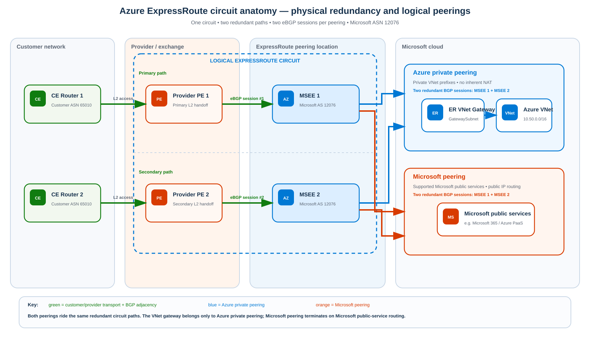
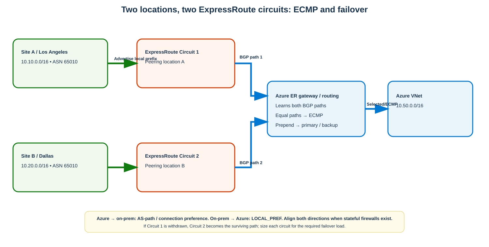
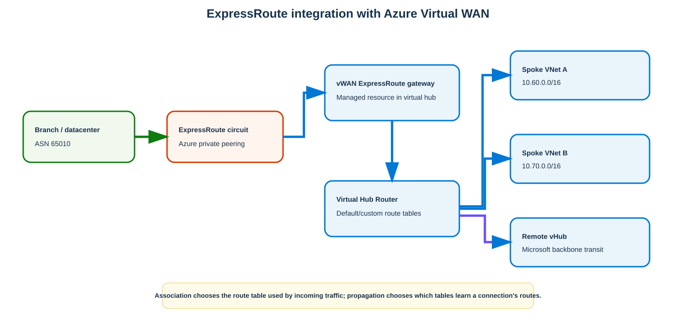
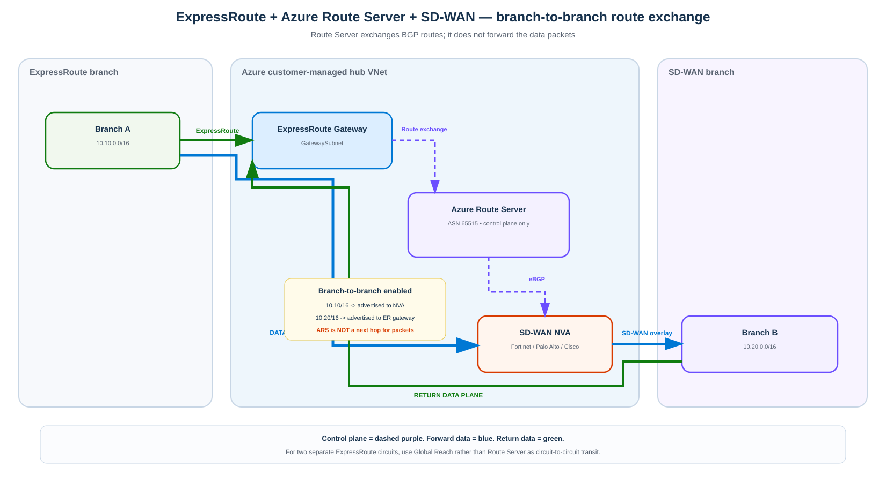

# Azure ExpressRoute — Comprehensive Routing, Multi-Circuit, Virtual WAN, and Route Server Study Guide

> **Scope:** Azure ExpressRoute architecture, circuit models and SKUs, BGP routing, Azure private and Microsoft peering, multi-circuit/multi-site load balancing and failover, Virtual WAN integration, Azure Route Server integration, FastPath, Global Reach, configuration, verification, failure behavior, and troubleshooting.
>
> **Validated against Microsoft documentation:** September 6, 2026.

## Source URLs

Primary Microsoft sources used for this guide:

- https://learn.microsoft.com/azure/expressroute/expressroute-introduction
- https://learn.microsoft.com/azure/expressroute/expressroute-circuit-peerings
- https://learn.microsoft.com/azure/expressroute/expressroute-connectivity-models
- https://learn.microsoft.com/azure/expressroute/expressroute-routing
- https://learn.microsoft.com/azure/expressroute/designing-for-disaster-recovery-with-expressroute-privatepeering
- https://learn.microsoft.com/azure/expressroute/metro
- https://learn.microsoft.com/azure/expressroute/expressroute-erdirect-about
- https://learn.microsoft.com/azure/expressroute/about-fastpath
- https://learn.microsoft.com/azure/expressroute/expressroute-global-reach
- https://learn.microsoft.com/azure/expressroute/expressroute-about-virtual-network-gateways
- https://learn.microsoft.com/azure/virtual-wan/virtual-wan-expressroute-about
- https://learn.microsoft.com/azure/virtual-wan/about-virtual-hub-routing
- https://learn.microsoft.com/azure/route-server/expressroute-vpn-support
- https://learn.microsoft.com/azure/route-server/quickstart-create-route-server-cli
- https://learn.microsoft.com/cli/azure/network/express-route
- https://learn.microsoft.com/cli/azure/network/express-route/peering
- https://learn.microsoft.com/cli/azure/network/express-route/gateway
- https://learn.microsoft.com/cli/azure/network/express-route/gateway/connection
- https://learn.microsoft.com/cli/azure/network/routeserver
- https://learn.microsoft.com/cli/azure/network/routeserver/peering

---

## 1. What ExpressRoute actually is

**Source information:** ExpressRoute provides private Layer-3 connectivity from a customer network to the Microsoft cloud through a provider, exchange, or direct connection. Dynamic route exchange uses external Border Gateway Protocol (**eBGP**). Microsoft uses autonomous system (**AS**) 12076 on ExpressRoute private and Microsoft peerings.

ExpressRoute has three different layers that are often incorrectly collapsed into one concept:

1. **Physical/provider connectivity** — how your router reaches the Microsoft Enterprise Edge (**MSEE**) routers at an ExpressRoute peering location.
2. **ExpressRoute circuit** — a logical Azure resource, identified by a service key, with a fixed purchased bandwidth.
3. **Peering/routing domain** — the BGP routing context carried over that circuit:
   - **Azure private peering** for private VNet connectivity.
   - **Microsoft peering** for supported Microsoft public services over public IP space.

A circuit is therefore not equivalent to a single cable and is not equivalent to a single BGP neighbor.

### 1.1 Redundancy inside one circuit

Every ExpressRoute peering is designed around **two independent BGP sessions**, one to each MSEE. Microsoft requires both sessions for the availability SLA.

For IPv4 private peering, allocate either:

- one `/29`, split into two `/30`s; or
- two independent `/30`s.

For each `/30`:

- customer/provider edge uses the **first usable** address;
- Microsoft MSEE uses the **second usable** address.

Example:

| Link | Subnet | Customer/PE | Microsoft MSEE |
|---|---|---:|---:|
| Primary | `192.168.100.128/30` | `192.168.100.129` | `192.168.100.130` |
| Secondary | `192.168.100.132/30` | `192.168.100.133` | `192.168.100.134` |

Microsoft does **not** rely on HSRP or VRRP between your routers and its routers. High availability is BGP-based.



[Download/edit the matching draw.io source](images/09-06-26-12-40_expressroute_circuit_anatomy.drawio)

**What this image shows:** One ExpressRoute circuit implemented as redundant primary and secondary Layer-2/provider paths into two MSEEs, with private and Microsoft peering as separate routing domains.

**What matters:** A single circuit already contains two redundant BGP paths, but both terminate in the same ExpressRoute peering location. This protects against a router/link failure, not every metro/site-wide failure.

**What to verify:** Both BGP sessions are Established, the service provider provisioning state is Provisioned, and the intended peerings are enabled.

---

## 2. ExpressRoute connectivity models and “types”

The word *type* can mean several different things. Keep these categories separate.

### 2.1 Connectivity model: how you physically reach Microsoft

| Model | What it is | Typical use |
|---|---|---|
| Cloud exchange / Ethernet exchange | Virtual cross-connect through an exchange provider | Colocation customers who already have exchange presence |
| Point-to-point Ethernet | Dedicated Ethernet from premises/provider to an ExpressRoute peering location | Simple private WAN extension |
| Any-to-any IP VPN | Managed Layer-3 WAN, commonly MPLS/IP-VPN, integrated by a provider | Enterprises wanting all branches connected through an existing carrier WAN |
| ExpressRoute Direct | Customer/service-provider routers connect directly to Microsoft dual ports | High scale, dedicated capacity, physical isolation, many circuits |

### 2.2 Circuit SKU: how far the circuit can reach

| SKU | Reach | Key purpose |
|---|---|---|
| **Local** | Only designated Azure region(s) near the peering location | Cost-efficient local/regional connectivity; separate egress treatment |
| **Standard** | Azure regions within the geopolitical area | Normal enterprise regional/geopolitical deployment |
| **Premium** | Global Azure reach and higher route/connectivity limits | Multinational/global networks, cross-geopolitical Global Reach |

**Additional explanation:** The SKU does not change BGP into a different protocol. It changes reach and service limits.

### 2.3 Billing family

A circuit also has a billing family such as `MeteredData` or `UnlimitedData` where supported. This is a commercial/data-transfer choice, not a routing behavior.

### 2.4 Provider circuit versus ExpressRoute Direct

**Provider circuit**

- Purchased as a logical circuit from an ExpressRoute connectivity provider.
- Common supported circuit bandwidths: 50 Mbps, 100 Mbps, 200 Mbps, 500 Mbps, 1 Gbps, 2 Gbps, 5 Gbps, and 10 Gbps.
- Provider may manage Layer 3/BGP for you or may hand off the VLAN so you configure BGP.

**ExpressRoute Direct**

- Dedicated dual Microsoft-facing ports.
- Current ExpressRoute Direct port options include dual 10-Gbps, 100-Gbps, or 400-Gbps connectivity.
- Multiple logical ExpressRoute circuits can be created on the port pair.
- Useful for very high-scale data ingestion, regulated physical-isolation requirements, or dividing circuits among business units/tenants.
- Supports Dot1Q or QinQ encapsulation, selected at Direct resource creation.

### 2.5 ExpressRoute Metro

**Source information:** ExpressRoute Metro is a high-resiliency topology where a circuit is dual-homed to **two distinct ExpressRoute peering locations within the same city/metro**.

Use Metro when you want to reduce the peering-location failure domain without necessarily building two entirely separate circuits in different metros.

### 2.6 ExpressRoute Global Reach

Global Reach links **two ExpressRoute circuits** so the on-premises networks behind those circuits can communicate over the Microsoft backbone.

Use it for:

- site-to-site private WAN transit between offices attached to different circuits;
- replacing or supplementing a carrier backbone between those offices.

Do **not** confuse this with Route Server. Azure Route Server does not provide circuit-to-circuit transit.

---

## 3. Private peering, Microsoft peering, and the legacy Public Peering name

### 3.1 First: what happened to Azure Public Peering?

**Source information:** New ExpressRoute circuits support **two** peering/routing domains: **Azure Private Peering** and **Microsoft Peering**. The older **Azure Public Peering** routing domain is deprecated and should not be designed into new deployments.

This causes terminology confusion because engineers still sometimes say “public peering” when they really mean **Microsoft Peering**.

| Term | Current status | What it means |
|---|---|---|
| **Azure Private Peering** | Current | Private connectivity to Azure VNets and resources reachable through private VNet addressing |
| **Microsoft Peering** | Current | Connectivity over ExpressRoute to supported Microsoft services that expose public IP endpoints |
| **Azure Public Peering / Public Peering** | Legacy/deprecated | Historical ExpressRoute routing domain; do not use it as the current design name |

**Important:** Microsoft Peering uses public addressing, but the customer-to-Microsoft-edge path still traverses the ExpressRoute circuit rather than general Internet transit.

### 3.2 Azure Private Peering — private addressing into your VNets

Use **Azure Private Peering** when the destination is a private resource inside an Azure virtual network.

Typical destinations include Azure VMs, internal load balancers, private IPs on Azure appliances, Private Endpoints/Private Link, and hub-and-spoke VNets reached through an ExpressRoute VNet gateway or Virtual WAN ExpressRoute gateway.

Typical route exchange:

- Customer advertises on-premises prefixes to Microsoft.
- Azure advertises VNet prefixes reachable through the ExpressRoute gateway.
- A default route may be advertised **only** on private peering.

Example:

```text
10.10.10.25
   -> enterprise router
   -> ExpressRoute private peering
   -> MSEE
   -> Microsoft backbone
   -> ER gateway / eligible FastPath path
   -> Azure VNet
   -> 10.50.20.10
```

No Internet routing or SNAT is inherently required.

### 3.3 Microsoft Peering — public Microsoft service endpoints over ExpressRoute

Use **Microsoft Peering** when the destination is a supported Microsoft service reached by a public IP address but you want the WAN-to-Microsoft path to use ExpressRoute.

Typical requirements include:

- two redundant BGP sessions;
- public peering link addressing;
- validated public prefixes;
- public source addressing before entering the Microsoft public-service routing domain, commonly through SNAT;
- route filters/BGP communities for the Microsoft service routes you intend to receive.

Example:

```text
10.10.10.25
   -> enterprise firewall/proxy
   -> SNAT to enterprise-owned public IP
   -> ExpressRoute Microsoft peering
   -> MSEE
   -> Microsoft network
   -> supported Microsoft public service
```

### 3.4 Why enable both on one circuit?

Because they solve different reachability problems:

```text
Datacenter -> Azure VM private IP
           -> Azure Private Peering

Datacenter -> Azure Private Endpoint
           -> Azure Private Peering

Datacenter -> supported Microsoft public SaaS/PaaS endpoint
           -> Microsoft Peering
```

One ExpressRoute circuit can carry both routing domains and shares its purchased bandwidth across enabled peerings.

### 3.5 Private Endpoint versus public PaaS endpoint

The same Azure service can use different routing domains depending on DNS and the resulting destination IP.

```text
Storage public endpoint
   -> Microsoft Peering when supported/selected

Storage Private Endpoint 10.50.40.5
   -> Azure Private Peering
```

### 3.6 Security-zone separation

A strong enterprise design typically places:

- **Private Peering** toward the private/core routing domain.
- **Microsoft Peering** toward a controlled DMZ/perimeter with firewall, proxy, NAT, and route filtering.

Do not redistribute all Microsoft-Peering routes blindly into the private core.

### 3.7 SNAT and asymmetric-routing caution

For a private client reaching Microsoft Peering:

```text
Before SNAT:
Src 10.10.10.25:53000
Dst <Microsoft-public-IP>:443

After SNAT:
Src <customer-owned-public-IP>:62001
Dst <Microsoft-public-IP>:443
```

Avoid advertising the same public NAT prefix with identical specificity to both the Internet and Microsoft Peering unless you have explicitly engineered the return path. Otherwise stateful devices can see asymmetric traffic.

### 3.8 Microsoft Peering is not general Internet transit

Microsoft Peering carries supported Microsoft service prefixes; it is not a generic private Internet service. General Internet destinations still use normal Internet connectivity unless another architecture provides them.

### 3.9 Practical decision table

| Destination/use case | Peering to use | Source addressing |
|---|---|---|
| Azure VM private IP | **Private** | Private |
| Internal Load Balancer | **Private** | Private |
| Azure Private Endpoint | **Private** | Private |
| Supported Azure PaaS public endpoint | **Microsoft** | Public/SNAT |
| Microsoft 365 approved ExpressRoute scenario | **Microsoft** | Public/SNAT |
| General Internet website | Neither as generic transit | Public/NAT |

---

## 4. BGP mechanics you must understand

### 4.1 ASNs

- Microsoft ExpressRoute ASN: **12076**
- Azure Route Server ASN: **65515**
- Customer ASN can be 16-bit or 32-bit, subject to reserved-value restrictions.

### 4.2 Prefix limits

Current documented private-peering limits include:

- up to **4,000 IPv4 prefixes** advertised to Microsoft with normal private peering;
- up to **10,000 IPv4 prefixes** with ExpressRoute Premium;
- up to **100 IPv6 prefixes** for private peering.

Microsoft peering accepts up to **200 prefixes per BGP session**.

If the limit is exceeded, the BGP session can be dropped. Summarize intentionally.

### 4.3 Default route

A default route can be advertised only through private peering. If on-premises advertises `0.0.0.0/0`, Azure workloads attached to that routing domain can be forced toward on-premises.

That is often used for centralized Internet inspection, but it has side effects and must be tested carefully. Azure platform/service reachability can require explicit design.

### 4.4 BGP communities

Microsoft tags routes it advertises with regional and service communities. For private peering, regional community values can help identify where Azure prefixes originate. Microsoft does **not** honor arbitrary communities you attach to routes advertised toward Microsoft as a generic inbound traffic-engineering mechanism.

### 4.5 Longest-prefix match still wins first

Before debating AS path or connection weight, remember IP routing selects the **most specific prefix** first. BGP attributes compare paths to the same NLRI/prefix.

Example:

- Circuit 1 advertises `10.10.0.0/16`.
- Circuit 2 advertises `10.10.10.0/24`.

Traffic to `10.10.10.25` follows the `/24` even if Circuit 1 otherwise has a more preferred BGP policy.

---

## 5. ExpressRoute to a customer-managed VNet

The conventional non-Virtual-WAN design has:

1. ExpressRoute circuit and private peering at the peering location.
2. ExpressRoute virtual network gateway in a VNet `GatewaySubnet`.
3. Connection object linking the VNet gateway to the circuit.
4. Optional hub-spoke VNet peering using gateway transit.

### 5.1 Control plane

The ExpressRoute gateway is the bridge between:

- routes learned on the circuit, and
- Azure VNet/system route propagation.

### 5.2 Data plane

Without FastPath:

`VM -> VNet routing -> ExpressRoute VNet gateway -> Microsoft backbone -> MSEE -> provider/customer edge -> on-premises`

Return traffic follows the inverse logical path, subject to routing policy.

### 5.3 FastPath

FastPath keeps the ExpressRoute gateway for route exchange/control plane, but allows eligible traffic to bypass the gateway in the data plane.

**Source information:** Current FastPath support differs by provider circuit vs Direct and by feature. For example, Virtual WAN FastPath is enabled by default for eligible ExpressRoute Direct circuits when the vWAN ExpressRoute gateway has at least the documented minimum scale.

**Operational consequence:** Do not remove the gateway because “FastPath bypasses it.” The gateway still participates in routing and acts as the fallback path if FastPath is unavailable.

---

## 6. Multi-location, multi-circuit design

This is the design most enterprises mean when they ask for “ExpressRoute redundancy.”

Assume:

- **Site A / Los Angeles** — `10.10.0.0/16`
- **Site B / Dallas** — `10.20.0.0/16`
- **Circuit 1** — peering location A
- **Circuit 2** — peering location B
- **Azure VNet** — `10.50.0.0/16`
- Enterprise ASN — `65010`



[Download/edit the matching draw.io source](images/09-06-26-12-40_expressroute_multi_circuit_bgp.drawio)

**What this image shows:** Two on-premises sites and two independent ExpressRoute circuits reaching the same Azure routing domain, with a separate enterprise WAN path between the sites.

**What matters:** Azure-to-on-premises and on-premises-to-Azure directions are controlled by different policy knobs. You must design both.

**What to verify:** The same prefix has the intended number of BGP paths, Azure and on-premises agree on primary versus backup, and the surviving circuit has sufficient failover capacity.

### 6.1 Active/active ECMP design

**Source information:** When identical routes are advertised through multiple ExpressRoute circuits, Azure can load-balance on-premises-bound traffic over equal-cost paths across a maximum of four ExpressRoute circuits.

To make true active/active behavior possible:

- advertise the same prefix from both circuits;
- avoid AS-path prepending on one circuit for that prefix;
- keep Azure connection/routing weights equivalent where applicable;
- on-premises, use equivalent BGP policy for Azure routes if you also want load sharing in the reverse direction.

**Important:** BGP/ECMP generally hashes flows; it does not send packets round-robin per packet. A single elephant flow is normally pinned to one path, while many flows distribute better.

### 6.2 Active/standby design

If you want Circuit 1 primary and Circuit 2 backup:

**Toward Azure (for Azure -> on-premises traffic):**

Advertise the same on-premises prefix on both circuits, but prepend your ASN on Circuit 2.

Conceptual route advertisements:

```text
Circuit 1: 10.10.0.0/16  AS_PATH 65010
Circuit 2: 10.10.0.0/16  AS_PATH 65010 65010 65010
```

Azure prefers the shorter path while both exist. If Circuit 1 disappears, Circuit 2 remains and wins by availability.

**Toward on-premises (for on-premises -> Azure traffic):**

Use BGP `LOCAL_PREF` inside your enterprise network:

```text
Routes learned from Circuit 1: LOCAL_PREF 200
Routes learned from Circuit 2: LOCAL_PREF 100
```

Higher local preference wins within the customer AS.

### 6.3 Why both directions must be engineered

A common mistake is to prepend Circuit 2 toward Azure but do nothing to customer-side route selection.

That can produce:

- outbound: Site A -> Azure through Circuit 2;
- return: Azure -> Site A through Circuit 1.

Azure does not require strict symmetry for the ExpressRoute service itself, but **stateful firewalls/NAT devices in your path may require it**. If inspection exists, align both directions.

### 6.4 Local-site preference versus global ECMP

There are two common goals:

**Goal A — each site uses its nearest circuit**

- Site A advertises `10.10.0.0/16` normally on Circuit 1 and prepended on Circuit 2.
- Site B advertises `10.20.0.0/16` normally on Circuit 2 and prepended on Circuit 1.
- Customer WAN sets local preference so each site exits through its local circuit.

**Goal B — all sites share both circuits**

- Advertise identical aggregate(s) equally.
- Use equal local preference.
- Ensure the WAN core can deliver traffic to either site from either circuit.
- Ensure any stateful middleboxes support this topology.

### 6.5 Failover sequence

Example: Circuit 1 fails.

1. Physical or BGP failure is detected.
2. BGP session(s) on Circuit 1 drop.
3. Routes learned only through Circuit 1 are withdrawn.
4. If Circuit 2 advertises the same prefixes, its path becomes best.
5. Azure FIB and customer routing converge.
6. New flows use Circuit 2.
7. Existing TCP sessions may survive or reset depending on application timeout, firewall/NAT state, and convergence duration.

**Source information:** Bidirectional Forwarding Detection (**BFD**) can accelerate failure detection on ExpressRoute, but end-to-end failover can still take significantly longer under some failure conditions; Microsoft documents that convergence to a redundant site can take up to 180 seconds in certain scenarios.

### 6.6 Capacity rule

If two 5-Gbps circuits normally carry 4 Gbps each, failover does **not** magically create a 10-Gbps surviving path. One 5-Gbps circuit must carry the post-failure offered load or traffic will congest.

Design the surviving path for the required business-critical load.

---

## 7. ExpressRoute with Azure Virtual WAN

Azure Virtual WAN (**vWAN**) changes the Azure-side hub architecture.

You no longer build a customer-managed hub VNet with a `GatewaySubnet` for ExpressRoute. Instead:

- create a **Standard** Virtual WAN;
- deploy one or more regional virtual hubs;
- deploy an **ExpressRoute gateway inside each required virtual hub**;
- connect the circuit private peering to the vWAN ExpressRoute gateway;
- associate/propagate routes through vHub route tables.



[Download/edit the matching draw.io source](images/09-06-26-12-40_expressroute_vwan_integration.drawio)

**What this image shows:** ExpressRoute terminates into a managed vWAN ExpressRoute gateway, then the virtual hub router distributes routes to spoke VNets and other hubs.

**What matters:** The hub route table, connection association, and route propagation replace much of the manual hub-spoke gateway-transit plumbing.

**What to verify:** The circuit is connected to the intended vHub gateway, the connection associates to the expected route table, and branch/VNet prefixes propagate to the correct labels/tables.

### 7.1 Supported circuit SKUs

Virtual WAN supports ExpressRoute Local, Standard, and Premium circuits, including ExpressRoute Direct-backed circuits where supported.

A Local circuit must connect to an ExpressRoute gateway in the appropriate local region, but vWAN routing can then provide access to connected spoke VNets according to the documented routing model.

### 7.2 vHub route-table model

Every vHub has a default route table and can have custom route tables.

Each connection has two different relationships:

- **Association** — which route table is used to look up traffic arriving from that connection.
- **Propagation** — which route tables learn the routes originating from that connection.

This distinction is essential.

Example:

```text
ExpressRoute connection
  associates -> defaultRouteTable
  propagates -> defaultRouteTable + label "Default"
```

Routes learned from on-premises can then be available to VNet connections that use that table.

### 7.3 Multiple hubs and multiple circuits

A strong global design is:

- West US vHub + West Coast ExpressRoute circuit
- East US vHub + East Coast ExpressRoute circuit
- Both hubs in one Standard Virtual WAN
- Inter-hub transit over Microsoft's backbone

You can then control which on-premises prefixes prefer which circuit using BGP and which vWAN connections receive/consume those routes using vHub route association/propagation.

### 7.4 vWAN routing weight

The ExpressRoute gateway connection resource supports a routing weight. Use it only with a clear understanding of how competing connections are selected; do not treat it as a universal replacement for BGP policy.

### 7.5 FastPath in Virtual WAN

Current Microsoft guidance states that FastPath is enabled automatically for eligible **ExpressRoute Direct** circuits connected to a Virtual WAN ExpressRoute gateway with the documented minimum scale units.

---

## 8. ExpressRoute with Azure Route Server, branch-to-branch, and SD-WAN

Azure Route Server (**ARS**) is a managed **BGP control-plane** service for a customer-managed VNet. It is especially useful when the hub contains both:

- an ExpressRoute and/or VPN virtual network gateway; and
- BGP-speaking network virtual appliances (**NVAs**) such as SD-WAN routers or firewalls.

Route Server does **not** forward user packets. It learns and advertises routes; the data plane flows directly through the gateway or NVA selected by Azure routing.



[Download/edit the matching draw.io source](images/09-06-26-13-15_expressroute_sdwan_branch_to_branch.drawio)

**What this image shows:** Branch A reaches Azure through ExpressRoute while Branch B reaches an SD-WAN NVA through the vendor overlay. Route Server exchanges the two branch route sets with the ExpressRoute gateway and SD-WAN NVA after branch-to-branch is enabled.

**What matters:** Route Server is not in the packet path. It makes the ExpressRoute gateway aware of SD-WAN prefixes and makes the SD-WAN NVA aware of ExpressRoute prefixes.

**What to verify:** Both NVA-to-Route-Server BGP sessions are Established, `allowBranchToBranchTraffic` is enabled, Branch A's prefixes are advertised toward the NVA, Branch B's prefixes are advertised toward the ExpressRoute gateway, and forwarding/security policy permits the actual traffic.

### 8.1 What “branch-to-branch” means

The name can be misleading. In Route Server, **branch-to-branch** means **route exchange between different routing peers attached to the hub**, such as:

- NVA ↔ ExpressRoute gateway
- NVA ↔ VPN gateway
- ExpressRoute gateway ↔ VPN gateway

By default, Route Server does **not** propagate the routes learned from an NVA into a virtual network gateway, nor gateway-learned routes toward the NVA.

When branch-to-branch is enabled, Route Server can re-advertise those routes.

Example:

```text
Branch A behind ExpressRoute:
10.10.0.0/16

Branch B behind SD-WAN:
10.20.0.0/16
```

Control plane:

```text
Branch A advertises 10.10.0.0/16
  -> ExpressRoute circuit
  -> ExpressRoute gateway
  -> Route Server learns the route

Branch B advertises 10.20.0.0/16
  -> SD-WAN overlay
  -> Azure SD-WAN NVA
  -> eBGP to Route Server
  -> Route Server learns the route
```

With branch-to-branch enabled:

```text
Route Server advertises 10.20.0.0/16
  -> ExpressRoute gateway
  -> ExpressRoute
  -> Branch A

Route Server advertises 10.10.0.0/16
  -> SD-WAN NVA
  -> SD-WAN overlay
  -> Branch B
```

The result is that both branches can have a route to each other through the Azure hub.

### 8.2 Actual Branch A -> Branch B packet path

For a packet:

```text
Source:      10.10.10.25
Destination: 10.20.20.25
```

a representative path is:

```text
Branch A
  -> customer CE
  -> ExpressRoute private peering
  -> MSEE
  -> ExpressRoute VNet gateway
  -> Azure VNet forwarding
  -> SD-WAN NVA
  -> vendor SD-WAN tunnel
  -> Branch B edge
  -> 10.20.20.25
```

**Route Server is absent from that data path.**

The return packet follows the corresponding reverse route:

```text
Branch B
  -> SD-WAN edge
  -> SD-WAN tunnel
  -> Azure SD-WAN NVA
  -> Azure VNet forwarding
  -> ExpressRoute VNet gateway
  -> ExpressRoute
  -> Branch A
```

Stateful firewalls/NAT inserted in either direction must see a symmetric path.

### 8.3 Why branch-to-branch is disabled by default

Automatic route leaking between an ExpressRoute gateway, VPN gateway, and third-party NVAs could unintentionally create transit paths.

For example, without deliberate policy you could accidentally turn Azure into:

- SD-WAN-to-ExpressRoute transit;
- VPN-to-ExpressRoute transit;
- a bypass around an inspection firewall;
- a route-leak point between otherwise segmented branch domains.

Enable branch-to-branch only when the topology intentionally requires this route exchange.

### 8.4 Enable branch-to-branch

```cli
az network routeserver update \
  --name ARS-Hub \
  --resource-group RG-Hub \
  --allow-b2b-traffic true
```

Verify:

```cli
az network routeserver show \
  --resource-group RG-Hub \
  --name ARS-Hub \
  --query "{asn:virtualRouterAsn,peerIPs:virtualRouterIps,allowB2B:allowBranchToBranchTraffic,preference:hubRoutingPreference}" \
  --output json
```

**Success criteria:** `allowB2B` is `true`.

### 8.5 Verify what the NVA learns and advertises

```cli
az network routeserver peering list-learned-routes \
  --resource-group RG-Hub \
  --routeserver ARS-Hub \
  --name SDWAN-NVA \
  --output table
```

```cli
az network routeserver peering list-advertised-routes \
  --resource-group RG-Hub \
  --routeserver ARS-Hub \
  --name SDWAN-NVA \
  --output table
```

**Expected state:**

- NVA-originated branch prefixes appear as learned routes.
- ExpressRoute/on-premises prefixes intended for the NVA appear in advertised routes.

### 8.6 Route preference when the same prefix exists on ExpressRoute and SD-WAN

If Route Server learns the same destination through multiple connection types, selection matters.

Microsoft documents that, by default, ExpressRoute-learned routes have preference over VPN/SD-WAN-learned routes. Route Server hub routing preference can be configured to influence this behavior.

This matters for designs such as:

```text
Primary: ExpressRoute
Backup:  SD-WAN Internet overlay
```

or the reverse.

Do not assume that advertising a backup route is enough. Verify the selected effective route and the failure behavior.

### 8.7 AS-path nuance

Route Server preserves the AS path it receives from NVA peers. However, when routes ultimately traverse the ExpressRoute gateway and are advertised toward on-premises, ExpressRoute has specific AS-path behavior and may remove private ASN information before presenting the route to the customer.

Therefore, validate the **actual route seen by the on-premises router** rather than assuming every NVA-side AS prepend will remain visible end to end.

### 8.8 Route Server is not ExpressRoute-circuit-to-circuit transit

This restriction is critical:

```text
ExpressRoute Circuit 1
      X
Azure Route Server
      X
ExpressRoute Circuit 2
```

Route Server does not provide ExpressRoute-circuit-to-circuit transit.

For site-to-site connectivity between networks attached to separate ExpressRoute circuits, evaluate **ExpressRoute Global Reach**.

### 8.9 Can ExpressRoute be integrated with Fortinet, Palo Alto, and Cisco SD-WAN?

**Yes — but ExpressRoute does not directly “speak the vendor SD-WAN protocol.”** Integration happens by combining Azure routing with a vendor NVA/SD-WAN gateway.

There are three common architectures.

#### Model A — Customer-managed hub VNet + Route Server

```text
ExpressRoute
    |
ER VNet Gateway
    |
Azure Route Server <--- eBGP ---> SD-WAN NVA
                                /    |     \
                         Fortinet  Palo Alto  Cisco
                                |
                         SD-WAN overlay
                                |
                             branches
```

This is the most general architecture.

Requirements:

- NVA supports BGP, including the Route Server peering requirements.
- NVA peers with **both** Route Server instance IPs.
- NVA ASN differs from Route Server ASN 65515.
- Branch-to-branch is enabled if ExpressRoute routes and SD-WAN routes must be exchanged.
- Security/UDR/effective-route design sends data to the intended NVA.
- NVA HA and stateful symmetry are handled by the vendor architecture.

#### Model B — Integrated NVA in Azure Virtual WAN

Some vendors support deployment directly into a Virtual WAN hub.

```text
ExpressRoute branch
      |
vWAN ExpressRoute Gateway
      |
Azure Virtual Hub Router
      |
Integrated SD-WAN / NGFW NVA
      |
SD-WAN branches
```

The virtual hub provides Azure route exchange and Microsoft-backbone connectivity between hub-connected spokes.

This is often cleaner for multi-region SD-WAN because you avoid building and maintaining a separate transit VNet.

#### Model C — SD-WAN NVA in a normal VNet connected to Virtual WAN

A vendor virtual CPE can also be deployed in an enterprise VNet and connected toward Virtual WAN, commonly using IPsec/BGP depending on the architecture.

This gives the customer more direct control of the NVA but also more responsibility for scale, HA, routing, and lifecycle.

### 8.10 Fortinet

Fortinet documents FortiGate-VM NVAs deployed **inside Azure Virtual WAN hubs** for combined SD-WAN and next-generation firewall functionality.

```text
FortiGate branch
   -> Fortinet SD-WAN overlay
   -> FortiGate-VM NVA in Azure vHub
   -> vHub route exchange
   -> Azure VNet / ExpressRoute-connected site
```

FortiManager can manage the FortiGate hub NVAs and branch FortiGates.

This means an ExpressRoute-connected datacenter can coexist with Fortinet SD-WAN branches through the Azure routing fabric, provided the relevant hub route tables/route exchange are configured.

Fortinet also supports ordinary FortiGate VMs in customer-managed VNets, where BGP to Azure Route Server is another valid integration pattern.

### 8.11 Palo Alto Networks

Palo Alto Networks supports Azure integration through **Prisma SD-WAN virtual ION (vION)** architectures and VM-Series firewall/NVA designs.

Prisma SD-WAN documents Azure Virtual WAN integration where vION connectivity extends branch SD-WAN into the Azure hub-and-spoke transit architecture.

```text
Prisma SD-WAN branch
   -> Prisma SD-WAN overlay
   -> vION / Palo Alto cloud NVA
   -> Azure routing
   -> VNet or ExpressRoute-connected network
```

For a customer-managed VNet, a BGP-capable Palo Alto NVA can also exchange dynamic routes with Azure Route Server when deployed according to Route Server requirements.

Do not confuse:

- **Prisma SD-WAN** — branch/connectivity overlay; and
- **VM-Series NGFW** — firewall/NVA.

They can participate in the same Azure architecture but serve different functions.

### 8.12 Cisco

Cisco has a documented, automated **Catalyst SD-WAN + Azure Virtual WAN** integration using **Catalyst 8000V** NVAs deployed inside Azure virtual hubs.

Cisco SD-WAN Manager/Cloud OnRamp can automate the deployment and mapping between branch VPNs and Azure VNets.

```text
Cisco branch / Catalyst SD-WAN edge
   -> Catalyst SD-WAN overlay
   -> Catalyst 8000V in Azure vHub
   -> Azure vHub routing
   -> Azure VNet or ExpressRoute-connected site
```

Cisco documents branch-to-VNet and inter-region vHub connectivity, plus service chaining with Azure Firewall in supported designs.

A manually deployed Catalyst 8000V in a customer-managed hub can also use BGP with Route Server where the chosen design satisfies Route Server requirements.

### 8.13 Vendor comparison

| Vendor | Azure SD-WAN integration examples | ExpressRoute coexistence model |
|---|---|---|
| **Fortinet** | FortiGate-VM SD-WAN/NGFW NVA in vWAN hub; FortiGate in customer VNet | vHub routing or Route Server BGP |
| **Palo Alto Networks** | Prisma SD-WAN vION Azure integration; VM-Series NVA | vWAN/vION architecture or Route Server with BGP-capable NVA |
| **Cisco** | Catalyst SD-WAN Cloud OnRamp + Catalyst 8000V in vWAN hub | vHub routing or customer-hub Route Server BGP |

### 8.14 Example hybrid design: ExpressRoute as primary, SD-WAN as backup

```text
Branch/datacenter
   |\
   | \__ Internet -> SD-WAN tunnel -> Azure NVA
   |
   +---- ExpressRoute ----------------> Azure
```

For the same Azure prefix:

- ExpressRoute can be preferred during normal operation.
- SD-WAN remains a backup path.
- If ExpressRoute is withdrawn, the SD-WAN route becomes active.

You must coordinate Route Server hub routing preference, NVA BGP advertisements, on-premises BGP/SD-WAN policy, firewall state/symmetry, and convergence timers.

### 8.15 Common mistakes with SD-WAN + ExpressRoute

1. **Assuming Route Server carries packets.** It only exchanges routes.
2. **Enabling branch-to-branch without understanding the new transit paths.**
3. **Expecting Route Server to provide ExpressRoute-circuit-to-circuit transit.**
4. **Advertising the same prefix from ER and SD-WAN without defining preference.**
5. **Forgetting that stateful firewalls need a symmetric forwarding design.**
6. **Using one NVA BGP session instead of peering to both Route Server instances.**
7. **Assuming all vendors use the same Azure integration model.**
8. **Confusing Virtual WAN integrated NVA routing with a normal NVA VM in a VNet.**

### 8.16 Sources for this section

- Microsoft: https://learn.microsoft.com/azure/route-server/expressroute-vpn-support
- Microsoft: https://learn.microsoft.com/azure/route-server/route-server-faq
- Microsoft: https://learn.microsoft.com/azure/route-server/configure-route-server
- Microsoft: https://learn.microsoft.com/azure/virtual-wan/about-nva-hub
- Microsoft: https://learn.microsoft.com/azure/virtual-wan/sd-wan-connectivity-architecture
- Fortinet: https://docs.fortinet.com/document/fortigate-public-cloud/7.6.0/azure-vwan-sd-wan-ngfw-deployment-guide/372408
- Palo Alto Networks: https://docs.paloaltonetworks.com/prisma-sd-wan/cloudblades/cloudblade-integrations/azure-virtual-wan-with-vion-cloudblade-integration
- Cisco: https://www.cisco.com/c/en/us/td/docs/routers/sdwan/26x-later/cloud-onramp/cloud-onramp-configuration-guide/cloud-onramp-multi-cloud-azure.html

---

## 9. Packet flow examples

### 9.1 On-premises to Azure through traditional ExpressRoute

Example packet:

```text
Source:      10.10.10.25:53000
Destination: 10.50.20.10:443
```

Flow:

1. Host forwards toward the enterprise default/router.
2. Enterprise routing matches `10.50.0.0/16` learned from ExpressRoute.
3. BGP policy chooses Circuit 1 or Circuit 2.
4. Customer/provider PE forwards over the private-peering VLAN.
5. Packet reaches the selected MSEE.
6. Microsoft backbone forwards toward the Azure region.
7. ExpressRoute gateway (or eligible FastPath data path) forwards into the VNet.
8. Azure VNet routing forwards to `10.50.20.10`.
9. Return route to `10.10.0.0/16` is selected from private-peering-learned routes.

**NAT:** No NAT is inherently required for private peering. Private source and destination IPs are preserved unless your own NVA/firewall performs NAT.

### 9.2 Azure to on-premises with two equal circuits

Suppose Azure knows:

```text
10.10.0.0/16 via Circuit 1, AS_PATH 65010
10.10.0.0/16 via Circuit 2, AS_PATH 65010
```

If all relevant attributes are equal and the topology is eligible for ECMP, Azure can place flows across both paths.

### 9.3 Azure to on-premises with Circuit 2 prepended

```text
10.10.0.0/16 via Circuit 1, AS_PATH 65010
10.10.0.0/16 via Circuit 2, AS_PATH 65010 65010 65010
```

Circuit 1 becomes preferred. Circuit 2 is retained as backup.

---

## 10. Azure CLI — provider circuit and private peering

> These examples use documentation-supported Azure CLI syntax. Replace example values with your provider, peering location, address plan, and ASN.

### 10.1 Discover providers and peering locations

```cli
az network express-route list-service-providers --output table
```

**What it tests/configures:** Lists service providers, peering locations, and bandwidths Azure knows about.

**Expected successful state:** Your provider and required peering location are present.

**Failure indicator:** Provider/location combination is absent or desired bandwidth is not offered.

**Next action:** Choose a supported pairing or work with the provider/Microsoft to confirm availability.

### 10.2 Create a Standard provider circuit

```cli
az network express-route create \
  --name ER-LA-01 \
  --resource-group RG-Network \
  --location westus \
  --provider "Equinix" \
  --peering-location "Silicon Valley" \
  --bandwidth 1000 \
  --sku-tier Standard \
  --sku-family MeteredData
```

**Important:** The Azure resource `--location` is where the circuit resource metadata is stored. The `--peering-location` is the physical/logical Microsoft edge location where the circuit connects. They are not the same concept.

### 10.3 Get the service key

```cli
az network express-route show \
  --name ER-LA-01 \
  --resource-group RG-Network \
  --query "{serviceKey:serviceKey,providerState:serviceProviderProvisioningState,circuitState:circuitProvisioningState}" \
  --output table
```

Give the service key to the connectivity provider.

**Success criteria:**

- provider provisioning state becomes `Provisioned`;
- circuit provisioning state is enabled/succeeded as documented by the command output.

### 10.4 Create Azure private peering

Example addressing:

- primary `/30`: `192.168.100.128/30`
- secondary `/30`: `192.168.100.132/30`
- customer ASN: `65010`
- VLAN: `200`

```cli
az network express-route peering create \
  --resource-group RG-Network \
  --circuit-name ER-LA-01 \
  --peering-type AzurePrivatePeering \
  --peer-asn 65010 \
  --vlan-id 200 \
  --primary-peer-subnet 192.168.100.128/30 \
  --secondary-peer-subnet 192.168.100.132/30
```

### 10.5 Verify private peering

```cli
az network express-route peering show \
  --resource-group RG-Network \
  --circuit-name ER-LA-01 \
  --name AzurePrivatePeering \
  --output json
```

Microsoft's documented output includes fields such as:

```text
azureASN: 12076
peeringType: AzurePrivatePeering
primaryPeerAddressPrefix: <primary /30>
secondaryPeerAddressPrefix: <secondary /30>
state: Enabled
```

Exact JSON shape can change with CLI/API versions; validate the semantic fields rather than depending on field order.

### 10.6 Check ARP and route/BGP state

Use the ExpressRoute peering statistics/route commands appropriate to the current CLI and portal to verify:

- both BGP peer sessions;
- prefixes received from Azure;
- prefixes Azure receives from you;
- ARP/MAC resolution on the peering VLANs.

---

## 11. Azure CLI — connect ExpressRoute to Virtual WAN

Assume:

- vWAN resource: `VWAN-Global`
- vHub: `vHub-West`
- ExpressRoute gateway: `ERGW-vHub-West`
- circuit: `ER-LA-01`

### 11.1 Create the vWAN ExpressRoute gateway

```cli
az network express-route gateway create \
  --name ERGW-vHub-West \
  --resource-group RG-vWAN \
  --virtual-hub vHub-West \
  --min-val 5
```

The current CLI also supports minimum/maximum values for scalable gateway behavior where applicable.

### 11.2 Get the private-peering resource ID

```cli
ER_PEERING_ID=$(az network express-route peering show \
  --resource-group RG-Network \
  --circuit-name ER-LA-01 \
  --name AzurePrivatePeering \
  --query id -o tsv)
```

### 11.3 Create the vWAN ExpressRoute connection

```cli
az network express-route gateway connection create \
  --resource-group RG-vWAN \
  --gateway-name ERGW-vHub-West \
  --name Conn-ER-LA-01 \
  --peering "$ER_PEERING_ID"
```

For advanced segmentation, use the supported `--associated-route-table`, `--propagated-route-tables`, `--labels`, and `--routing-weight` parameters.

### 11.4 Verify the connection

```cli
az network express-route gateway connection show \
  --resource-group RG-vWAN \
  --gateway-name ERGW-vHub-West \
  --name Conn-ER-LA-01 \
  --output json
```

**Success criteria:**

- provisioning state succeeded;
- peering points at the intended `AzurePrivatePeering`;
- associated and propagated route tables match the design.

**Failure indicators:**

- wrong circuit peering resource ID;
- route propagation omitted from the table consumed by spokes;
- Local circuit connected in an unsupported regional combination.

---

## 12. Azure CLI — Route Server with ExpressRoute gateway and NVA

### 12.1 Create the dedicated subnet

Route Server requires a subnet named `RouteServerSubnet`.

```cli
az network vnet subnet create \
  --resource-group RG-Hub \
  --vnet-name VNet-Hub \
  --name RouteServerSubnet \
  --address-prefixes 10.0.1.0/27
```

### 12.2 Create the Standard public IP used by Route Server management

```cli
az network public-ip create \
  --resource-group RG-Hub \
  --name RouteServerIP \
  --sku Standard \
  --version IPv4
```

### 12.3 Create Route Server

```cli
SUBNET_ID=$(az network vnet subnet show \
  --resource-group RG-Hub \
  --vnet-name VNet-Hub \
  --name RouteServerSubnet \
  --query id -o tsv)

az network routeserver create \
  --name ARS-Hub \
  --resource-group RG-Hub \
  --hosted-subnet "$SUBNET_ID" \
  --public-ip-address RouteServerIP
```

### 12.4 Peer the NVA

Assume NVA ASN `65050` and NVA inside IP `10.0.2.4`.

```cli
az network routeserver peering create \
  --name NVA-01 \
  --resource-group RG-Hub \
  --routeserver ARS-Hub \
  --peer-asn 65050 \
  --peer-ip 10.0.2.4
```

### 12.5 Retrieve Route Server BGP endpoints

```cli
az network routeserver show \
  --resource-group RG-Hub \
  --name ARS-Hub \
  --query "{asn:virtualRouterAsn,peerIPs:virtualRouterIps,allowB2B:allowBranchToBranchTraffic,preference:hubRoutingPreference}" \
  --output json
```

Microsoft's current documentation shows Route Server ASN `65515` and two instance IP addresses. Configure the NVA to peer with **both** IPs.

### 12.6 Enable route exchange / branch-to-branch

```cli
az network routeserver update \
  --name ARS-Hub \
  --resource-group RG-Hub \
  --allow-b2b-traffic true
```

### 12.7 Verify learned routes

```cli
az network routeserver peering list-learned-routes \
  --resource-group RG-Hub \
  --routeserver ARS-Hub \
  --name NVA-01 \
  --output table
```

```cli
az network routeserver peering list-advertised-routes \
  --resource-group RG-Hub \
  --routeserver ARS-Hub \
  --name NVA-01 \
  --output table
```

**Success criteria:**

- expected on-premises/ExpressRoute prefixes appear on the NVA-facing advertisement where supported by route-exchange rules;
- expected NVA prefixes appear as learned;
- NVA has two Established BGP sessions to the ARS IPs.

---

## 13. Multi-circuit BGP policy examples

The actual syntax belongs on your customer routers, not in Azure CLI. The examples below are **vendor-neutral policy logic**, not a claim of exact syntax for every platform.

### 13.1 Equal-active circuits

```text
OUTBOUND TO AZURE:
  advertise 10.10.0.0/16 on Circuit 1 with normal AS path
  advertise 10.10.0.0/16 on Circuit 2 with normal AS path

INBOUND FROM AZURE:
  set same LOCAL_PREF for Azure routes learned from Circuit 1 and Circuit 2
```

Result: both directions can use multiple equal routes if the rest of the network supports ECMP.

### 13.2 Primary/backup circuits

```text
OUTBOUND TO AZURE:
  Circuit 1: advertise 10.10.0.0/16 normally
  Circuit 2: prepend ASN 65010 two additional times

INBOUND FROM AZURE:
  Circuit 1 learned routes -> LOCAL_PREF 200
  Circuit 2 learned routes -> LOCAL_PREF 100
```

Result: Circuit 1 is normally preferred in both directions.

### 13.3 Per-site primary

```text
10.10.0.0/16:
  prefer Circuit 1
  Circuit 2 = backup

10.20.0.0/16:
  prefer Circuit 2
  Circuit 1 = backup
```

This is often the best balance of:

- low latency;
- bandwidth utilization;
- deterministic failure behavior.

---

## 14. Connection weight versus AS-path prepending

For private peering designs with multiple VNet/circuit connections, Azure also exposes **connection weight/routing weight** mechanisms in certain connection resources.

Think of them as different layers:

- **AS-path prepending** changes the BGP path seen through the circuit.
- **Connection/routing weight** influences Azure's choice among Azure-side connection objects where that feature applies.
- **LOCAL_PREF** is your on-premises iBGP policy.
- **Longest prefix** precedes these comparisons.

Do not configure conflicting policies at all four layers unless you can explain which one should win.

---

## 15. ExpressRoute and VNet peering

A single circuit can connect to multiple VNets through gateways.

Although traffic can sometimes transit between VNets through ExpressRoute-related paths, Microsoft recommends using **VNet peering** for VNet-to-VNet connectivity because it is the native Azure path.

For hub-spoke:

- Hub VNet has ExpressRoute gateway.
- Hub-to-spoke peering allows gateway transit.
- Spoke-to-hub peering uses remote gateway.

Do not configure a spoke to use remote gateways from two different hubs simultaneously.

---

## 16. Security and firewall insertion

ExpressRoute is private connectivity; it is **not a firewall** and it does not automatically encrypt payloads.

Security options include:

- NVA/Azure Firewall in the Azure hub path;
- on-premises firewalls before customer edge;
- IPsec overlays where supported and required;
- route-based service insertion using UDRs, Virtual WAN routing intent, or an NVA architecture.

### 16.1 Stateful symmetry

If a stateful firewall is inserted, make your BGP strategy preserve a predictable return path.

For example:

- Azure -> Site A uses Circuit 1 through Firewall A.
- Site A -> Azure should normally return through Circuit 1/Firewall A.

ECMP across two independent stateful appliances can break sessions unless the vendor architecture provides state synchronization and symmetric flow steering.

---

## 17. High availability hierarchy

Think in failure domains.

### Level 1 — single circuit, dual BGP sessions

Protects against:

- one MSEE failure;
- one customer/provider link failure;
- planned maintenance of one side.

Does not fully protect against:

- complete peering-location outage;
- provider metro failure;
- regional disaster.

### Level 2 — ExpressRoute Metro

Protects against a broader failure by dual-homing across two peering locations in the same metro.

### Level 3 — two circuits in different peering locations

Microsoft explicitly recommends geographically diverse circuits for disaster recovery.

Prefer:

- different peering locations;
- independent provider access where possible;
- independent customer-edge power/routers;
- different fiber paths;
- tested BGP failover.

### Level 4 — alternate technology

For some workloads, add site-to-site VPN over Internet as emergency failover for **private peering** traffic.

Microsoft documents that ExpressRoute is normally preferred over VPN for equal private prefixes. Still, test exact effective routes and on-premises policy.

---

## 18. Verification checklist

### 18.1 Circuit object

```cli
az network express-route show \
  --resource-group RG-Network \
  --name ER-LA-01 \
  --output json
```

**Important fields**

- `serviceProviderProvisioningState`
- `circuitProvisioningState`
- `bandwidthInMbps` or equivalent current bandwidth property
- `sku`
- `peerings`
- `serviceKey`

**Success:** provider side provisioned, Azure resource enabled/succeeded.

### 18.2 Peering

```cli
az network express-route peering show \
  --resource-group RG-Network \
  --circuit-name ER-LA-01 \
  --name AzurePrivatePeering \
  --output json
```

**Success:** private peering enabled and addresses/ASN/VLAN match the router/provider handoff.

### 18.3 Two-circuit route validation

On the customer routers, verify:

```text
show BGP route for 10.50.0.0/16
```

Expected conceptual result for active/active:

```text
Path 1 via Circuit 1  LOCAL_PREF 100
Path 2 via Circuit 2  LOCAL_PREF 100
```

Expected conceptual result for primary/backup:

```text
Best path via Circuit 1  LOCAL_PREF 200
Backup via Circuit 2     LOCAL_PREF 100
```

This output is **simulated vendor-neutral output**, not Azure CLI output.

### 18.4 Route Server

```cli
az network routeserver peering list-learned-routes \
  --resource-group RG-Hub \
  --routeserver ARS-Hub \
  --name NVA-01 \
  --output table
```

**Success:** NVA-originated prefixes are present with the intended next hop/AS path.

### 18.5 Virtual WAN

```cli
az network express-route gateway connection show \
  --resource-group RG-vWAN \
  --gateway-name ERGW-vHub-West \
  --name Conn-ER-LA-01 \
  --output json
```

**Success:** connection is provisioned and route association/propagation is correct.

---

## 19. Troubleshooting by symptom

### Symptom: only one of the two BGP sessions is up

**Where:** Customer/provider edge and ExpressRoute peering status.

**What to test:**

- primary and secondary `/30` addressing;
- VLAN ID;
- ASN;
- Layer-2 cross-connect;
- MD5 key if configured;
- provider provisioning.

**Expected:** Both peer sessions Established.

**Failure meaning:** You have lost circuit redundancy and may not meet the availability design/SLA prerequisites.

**Next action:** Fix the specific primary/secondary handoff before testing higher-level routing.

### Symptom: BGP is Established but Azure cannot reach on-premises

**Where:** MSEE-learned route view, customer BGP advertisements, effective route table.

**What it tests:** Whether the desired on-premises prefix is actually advertised and accepted.

**Failure causes:**

- prefix not in outbound policy;
- prefix summarized incorrectly;
- route limit exceeded;
- AS loop prevention;
- competing more-specific route;
- NVA/UDR overriding propagated gateway route.

### Symptom: Site A traffic unexpectedly exits through Site B

**Where:** Customer BGP table.

**What to inspect:**

- LOCAL_PREF;
- AS path;
- IGP cost to BGP next hop;
- more-specific advertisements;
- route-reflector policy.

**Next action:** Decide whether the requirement is “nearest exit,” “ECMP,” or “primary/backup,” then make policy consistent.

### Symptom: Azure sends traffic through the wrong circuit

**Where:** ExpressRoute path advertisements and Azure connection settings.

**What to inspect:**

- AS-path prepends on the on-premises prefix;
- whether one circuit advertises a more specific route;
- connection/routing weight;
- whether both paths are attached to the same relevant VNet/vHub routing domain.

### Symptom: failover works but takes too long

**Where:** Physical interface, BGP, BFD, enterprise IGP/iBGP, firewall session logs.

**What to test:**

1. Time from fault to BGP-down.
2. Time from BGP-down to withdrawal.
3. Time for alternate BGP route to become best.
4. Time for FIB programming.
5. Time for remote sites to converge.
6. Application retry/session timeout.

**Next action:** Enable/tune BFD where supported, remove unnecessarily long upstream failure-detection timers, and retest complete end-to-end convergence.

### Symptom: Route Server NVA learns VNet routes but not ExpressRoute routes

**Where:** Route Server configuration.

**Check:**

- ExpressRoute gateway and ARS are in the same VNet;
- branch-to-branch route exchange is enabled when required;
- NVA peers with both ARS IPs;
- no unsupported circuit-to-circuit expectation.

### Symptom: vWAN spoke cannot reach on-premises

**Where:** vHub route tables.

**Check:**

- ExpressRoute connection association;
- propagation target/labels;
- spoke connection association;
- custom route table isolation;
- routing intent/security configuration if present.

---

## 20. Common mistakes

1. **Calling the two BGP sessions “two circuits.”**  
   They are redundant paths inside one circuit.

2. **Assuming one circuit is disaster-proof because it has two MSEEs.**  
   A peering location can still be a failure domain.

3. **Treating Local/Standard/Premium as different physical circuit technologies.**  
   They are reach/SKU choices.

4. **Treating ExpressRoute Direct as one giant circuit.**  
   Direct provides dedicated port pairs on which logical circuits are provisioned.

5. **Using AS-path prepending only in one direction and forgetting LOCAL_PREF.**  
   This can create asymmetric traffic.

6. **Expecting per-packet load balancing.**  
   ECMP is normally flow-based.

7. **Assuming a 5-Gbps backup circuit can absorb 8 Gbps of failed-over traffic.**  
   Failover capacity must be engineered.

8. **Using Route Server to connect two ExpressRoute circuits to each other.**  
   Use Global Reach for circuit-to-circuit private WAN connectivity.

9. **Ignoring vWAN route association versus propagation.**  
   They answer different routing questions.

10. **Putting a firewall in one path while allowing the return path to bypass it.**  
    Stateful inspection fails even if BGP reachability looks correct.

11. **Advertising thousands of host routes without aggregation.**  
    Prefix limits are finite and exceeding them can drop BGP sessions.

12. **Confusing Azure region with ExpressRoute peering location.**  
    A peering location is the network edge entry point; an Azure region is where workloads run.

---

## 21. Design recommendations

### Small enterprise / one geography

- One provider circuit can be acceptable for noncritical workloads.
- Use both redundant BGP sessions.
- Consider VPN backup.

### Mission-critical regional enterprise

- Two circuits in different peering locations.
- Prefer distinct carrier/local-loop paths.
- Decide explicitly between ECMP and primary/backup.
- Size each circuit for failure load.
- Test failover at least periodically.

### Large multi-region enterprise

- Multiple circuits aligned to major on-premises regions.
- Per-site BGP policy for nearest-exit under normal conditions.
- Secondary advertisements over remote circuits.
- Virtual WAN when managed multi-region transit and route-table segmentation are desired.
- Global Reach when Microsoft backbone should provide site-to-site transit between ExpressRoute-attached locations.

### NVA/SD-WAN-heavy hub

- Customer-managed hub VNet.
- ExpressRoute gateway + Azure Route Server.
- Peer each NVA with both ARS instances.
- Enable route exchange only with a documented reason.
- Validate that the NVA does not accidentally re-advertise routes back toward their origin.

---

## 22. Decision table

| Requirement | Best-fit feature |
|---|---|
| Private connection from premises to Azure VNets | ExpressRoute private peering |
| Private reach to supported Microsoft public services | Microsoft peering |
| Dedicated Microsoft-facing physical ports | ExpressRoute Direct |
| Low-cost/localized Azure reach | Local SKU |
| Reach within geopolitical region | Standard SKU |
| Global Azure reach / larger limits | Premium |
| Two peering locations in same metro | ExpressRoute Metro |
| On-premises site-to-site transit between ER circuits | Global Reach |
| Managed global Azure hub routing | Virtual WAN + vHub ER gateway |
| Dynamic NVA + ER/VPN gateway route exchange in a VNet | Azure Route Server |
| Reduced gateway data-plane hop | FastPath |
| Backup private-peering path over Internet | Site-to-site VPN coexistence |

---

## 23. Final mental model

If you remember only one model, use this:

```text
Physical/provider access
        ↓
ExpressRoute circuit
        ↓
Two redundant BGP sessions per peering
        ↓
Private peering or Microsoft peering
        ↓
Azure-side termination:
  - VNet ExpressRoute gateway, or
  - Virtual WAN ExpressRoute gateway
        ↓
Azure route distribution
        ↓
Workload
```

For multiple circuits, add a second independent copy of the path and answer two questions separately:

1. **How does Azure choose the route toward on-premises?**
2. **How does on-premises choose the route toward Azure?**

Then verify what happens when either path disappears.

---

## Sources

- Microsoft, **Azure ExpressRoute overview**: https://learn.microsoft.com/azure/expressroute/expressroute-introduction
- Microsoft, **ExpressRoute circuits and peering**: https://learn.microsoft.com/azure/expressroute/expressroute-circuit-peerings
- Microsoft, **ExpressRoute connectivity models**: https://learn.microsoft.com/azure/expressroute/expressroute-connectivity-models
- Microsoft, **ExpressRoute routing requirements**: https://learn.microsoft.com/azure/expressroute/expressroute-routing
- Microsoft, **Designing for disaster recovery with ExpressRoute private peering**: https://learn.microsoft.com/azure/expressroute/designing-for-disaster-recovery-with-expressroute-privatepeering
- Microsoft, **ExpressRoute Metro**: https://learn.microsoft.com/azure/expressroute/metro
- Microsoft, **ExpressRoute Direct**: https://learn.microsoft.com/azure/expressroute/expressroute-erdirect-about
- Microsoft, **ExpressRoute FastPath**: https://learn.microsoft.com/azure/expressroute/about-fastpath
- Microsoft, **ExpressRoute Global Reach**: https://learn.microsoft.com/azure/expressroute/expressroute-global-reach
- Microsoft, **ExpressRoute virtual network gateways**: https://learn.microsoft.com/azure/expressroute/expressroute-about-virtual-network-gateways
- Microsoft, **ExpressRoute connections in Virtual WAN**: https://learn.microsoft.com/azure/virtual-wan/virtual-wan-expressroute-about
- Microsoft, **Virtual hub routing**: https://learn.microsoft.com/azure/virtual-wan/about-virtual-hub-routing
- Microsoft, **Route Server support for ExpressRoute and VPN**: https://learn.microsoft.com/azure/route-server/expressroute-vpn-support
- Microsoft, **Route Server CLI quickstart**: https://learn.microsoft.com/azure/route-server/quickstart-create-route-server-cli
- Microsoft, **Azure CLI — ExpressRoute**: https://learn.microsoft.com/cli/azure/network/express-route
- Microsoft, **Azure CLI — ExpressRoute peering**: https://learn.microsoft.com/cli/azure/network/express-route/peering
- Microsoft, **Azure CLI — Virtual WAN ExpressRoute gateway**: https://learn.microsoft.com/cli/azure/network/express-route/gateway
- Microsoft, **Azure CLI — Virtual WAN ExpressRoute connection**: https://learn.microsoft.com/cli/azure/network/express-route/gateway/connection
- Microsoft, **Azure CLI — Route Server**: https://learn.microsoft.com/cli/azure/network/routeserver
- Microsoft, **Azure CLI — Route Server peering**: https://learn.microsoft.com/cli/azure/network/routeserver/peering

---

## Information-quality labels used in this guide

- **Source information** — behavior stated directly in Microsoft documentation.
- **Additional explanation** — networking explanation that follows established BGP/IP behavior and is used to make the Microsoft design easier to understand.
- **Reasonable inference** — architecture conclusion derived from documented behavior; where used, it is not presented as a Microsoft product guarantee.