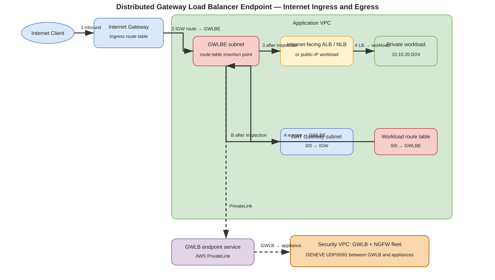
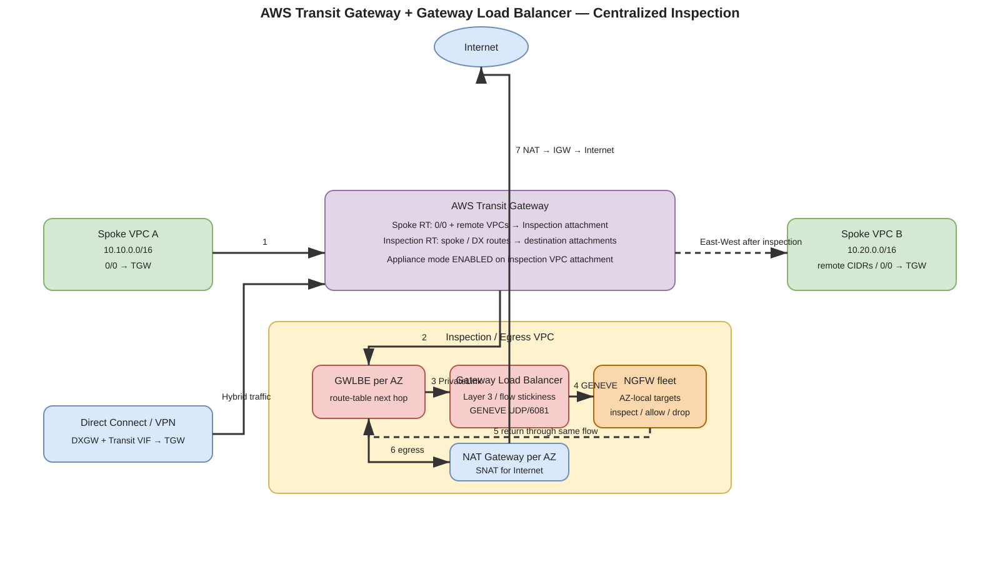
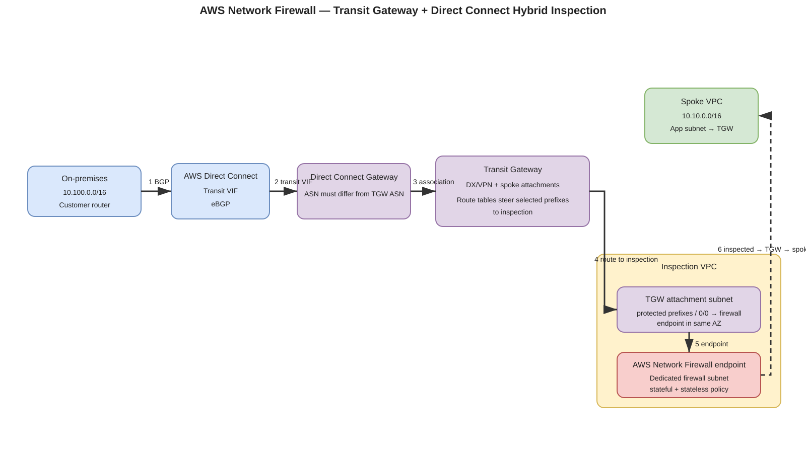
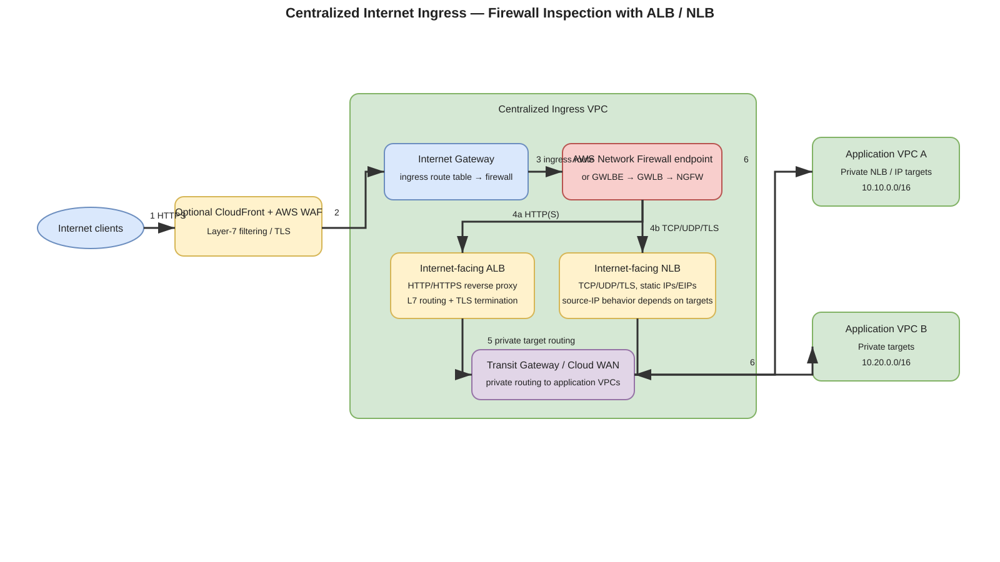

# AWS Firewall Inspection and Service Insertion — Comprehensive Study Guide

> **Scope:** All major AWS patterns for inserting native or third-party firewalls into north-south, east-west, hybrid, and application-ingress traffic paths, including AWS Transit Gateway (TGW), AWS Direct Connect (DX), Gateway Load Balancer (GWLB), Gateway Load Balancer Endpoint (GWLBE), AWS Network Firewall (ANFW), Application Load Balancer (ALB), Network Load Balancer (NLB), AWS Cloud WAN, NAT Gateway, AWS PrivateLink, VPC ingress routing, and advanced BGP-based appliance insertion.
>
> **Source information** = behavior stated by AWS documentation/blogs.  
> **Additional explanation** = networking explanation derived from standard routing/stateful-firewall behavior.  
> **Reasonable inference** = an architectural conclusion that follows from the documented behavior but is not itself a quoted AWS guarantee.

---

## URLs reviewed

Primary AWS sources used for this guide:

- https://docs.aws.amazon.com/elasticloadbalancing/latest/gateway/introduction.html
- https://docs.aws.amazon.com/elasticloadbalancing/latest/gateway/gateway-load-balancers.html
- https://aws.amazon.com/blogs/networking-and-content-delivery/introducing-aws-gateway-load-balancer-supported-architecture-patterns/
- https://aws.amazon.com/blogs/networking-and-content-delivery/scaling-network-traffic-inspection-using-aws-gateway-load-balancer/
- https://aws.amazon.com/blogs/networking-and-content-delivery/centralized-inspection-architecture-with-aws-gateway-load-balancer-and-aws-transit-gateway/
- https://aws.amazon.com/blogs/networking-and-content-delivery/best-practices-for-deploying-gateway-load-balancer/
- https://aws.amazon.com/blogs/networking-and-content-delivery/deployment-models-for-aws-network-firewall/
- https://docs.aws.amazon.com/network-firewall/latest/developerguide/what-is-aws-network-firewall.html
- https://docs.aws.amazon.com/network-firewall/latest/developerguide/architectures.html
- https://docs.aws.amazon.com/network-firewall/latest/developerguide/creating-firewall.html
- https://docs.aws.amazon.com/directconnect/latest/UserGuide/WorkingWithVirtualInterfaces.html
- https://docs.aws.amazon.com/directconnect/latest/UserGuide/create-transit-vif-for-gateway.html
- https://docs.aws.amazon.com/directconnect/latest/UserGuide/direct-connect-gateways.html
- https://aws.amazon.com/blogs/networking-and-content-delivery/design-your-firewall-deployment-for-internet-ingress-traffic-flows/
- https://aws.amazon.com/blogs/networking-and-content-delivery/how-to-integrate-third-party-firewall-appliances-into-an-aws-environment/
- https://docs.aws.amazon.com/network-manager/latest/cloudwan/cloudwan-policy-service-insertion.html
- https://aws.amazon.com/blogs/networking-and-content-delivery/simplify-global-security-inspection-with-aws-cloud-wan-service-insertion/
- https://aws.amazon.com/blogs/networking-and-content-delivery/centralized-vpc-inspection-with-amazon-vpc-route-server-and-aws-transit-gateway/

---

# 1. The problem AWS firewall insertion must solve

A stateful firewall does not become useful merely because it exists in a VPC. **Routing must force both directions of the connection through the inspection function.** In AWS this means you must deliberately control next hops in one or more of the following routing domains:

1. VPC subnet route tables.
2. Internet Gateway ingress route tables.
3. Transit Gateway route tables.
4. Cloud WAN segment and Network Function Group policy.
5. Route Server/BGP advertisements for an NVA-based design.
6. Load-balancer target relationships when inspection is implemented as a proxy or ELB sandwich.

The insertion mechanism is therefore separate from the firewall engine itself.

A useful mental model is:

```text
Traffic source
   ↓
Routing or proxy insertion point
   ↓
Inspection entry point
   ↓
Firewall engine
   ↓
Post-inspection routing
   ↓
Destination
```

For a stateful next-generation firewall (NGFW), the reverse direction must generally return through the same logical appliance/session owner. GWLB and Transit Gateway appliance mode exist largely to make that state symmetry manageable at scale.

---

# 2. Decision matrix — major inspection methods

| Method | Primary insertion mechanism | Best traffic classes | Firewall type | Centralized? | Key requirement |
|---|---|---|---|---|---|
| 1. AWS Network Firewall in a VPC | VPC route tables / IGW ingress routing | Internet ingress/egress, intra-VPC | AWS native | Distributed | Dedicated firewall subnets and symmetric routes |
| 2. AWS Network Firewall + TGW | TGW + inspection VPC routes | VPC-to-VPC, DX/VPN, centralized egress | AWS native | Yes | TGW inspection routing; AZ-aware firewall endpoints |
| 3. TGW-attached AWS Network Firewall | Firewall attached directly to TGW capability | Central multi-VPC inspection | AWS native | Yes | Supported TGW-attached firewall deployment |
| 4. GWLB + distributed GWLBE | VPC route table or IGW route → GWLBE | Per-VPC ingress/egress | Third-party NGFW/NVA | Control plane can be central; data plane distributed | Appliance supports GENEVE UDP/6081 |
| 5. GWLB + TGW inspection VPC | TGW route tables → inspection VPC → GWLBE | East-west, egress, DX/VPN | Third-party NGFW/NVA | Yes | Appliance mode on TGW inspection attachment |
| 6. Direct NVA next hop | VPC route → ENI/appliance | Small/simple deployments | Third-party firewall | Usually distributed | IP forwarding, route symmetry, vendor HA design |
| 7. Legacy TGW + NVA VPC attachment | TGW route → firewall VPC attachment | East-west/egress | Third-party firewall | Yes | Per-AZ routing; no native appliance load-balancing without GWLB |
| 8. TGW + VPN attachment to firewalls | TGW ECMP over VPN tunnels | Centralized firewall fleet | Third-party firewall | Yes | IPsec/BGP/ECMP and often SNAT for symmetry |
| 9. ELB sandwich | Front LB → firewall ASG → back LB | Internet ingress | Third-party proxy/firewall | Yes or distributed | Firewall must forward/proxy to backend LB/targets |
| 10. ALB/NLB + inline firewall endpoint | IGW ingress routing → ANFW/GWLBE → ALB/NLB | Internet ingress | Native or third-party | Yes or distributed | Correct ingress route table and return path |
| 11. Cloud WAN service insertion | Network Function Group + `send-via`/`send-to` | Multi-Region east-west, egress, hybrid | ANFW, GWLB, third-party | Global | Core network policy and NFG attachment design |
| 12. VPC Route Server + NVA | BGP advertisement into VPC routing | Active/standby, dynamic failover | Third-party NVA | Can be centralized | NVA supports BGP; careful route preference/failover |
| 13. AWS WAF / CloudFront / ALB WAF | Reverse-proxy L7 inspection | HTTP/HTTPS only | AWS WAF | Edge/regional | This is not general L3/L4 firewall insertion |

---

# 3. Gateway Load Balancer fundamentals

**Source information:** AWS Gateway Load Balancer operates at Layer 3, accepts IP packets across ports/protocols, distributes flows to registered virtual appliances, and exchanges traffic with those appliances using **GENEVE on UDP port 6081**. GWLB maintains flow stickiness using a 5-tuple by default, with 3-tuple and 2-tuple options also available.

The key components are:

- **Gateway Load Balancer (GWLB):** horizontally distributes traffic across firewall/NVA targets.
- **Gateway Load Balancer Endpoint (GWLBE):** a VPC endpoint that becomes a **route-table next hop**.
- **Endpoint service:** PrivateLink-based connection between the consumer VPC containing the GWLBE and the provider/security VPC containing the GWLB.
- **Firewall/NVA targets:** EC2-based virtual appliances that understand GENEVE.

The original packet is carried inside GENEVE between GWLB and the appliance. The appliance inspects the encapsulated flow and returns the allowed packet to GWLB, which returns it through the same service chain.

**Why GWLB is important:** Before GWLB, customers often built custom active/standby or ELB-sandwich designs. GWLB provides a purpose-built transparent service insertion and appliance load-balancing mechanism.

---

# 4. Method 1 — AWS Network Firewall inside a workload or edge VPC

AWS Network Firewall is a managed stateful firewall/IPS service. AWS documents that it can protect traffic to/from Internet Gateway, NAT Gateway, VPN, and Direct Connect paths. Stateful inspection uses Suricata-compatible rules.

## 4.1 Internet egress

A common single-VPC egress chain is:

```text
Private workload subnet
  route 0.0.0.0/0 → ANFW endpoint
      ↓
AWS Network Firewall endpoint
      ↓
NAT Gateway
      ↓
Internet Gateway
      ↓
Internet
```

The return path must reverse the sequence:

```text
Internet → IGW → NAT Gateway → firewall endpoint → workload
```

The NAT operation usually happens **after** firewall inspection on outbound traffic when you want the firewall to see the workload's private source address.

## 4.2 Internet ingress with VPC ingress routing

An Internet Gateway can have an ingress route table. A destination corresponding to a public-facing workload subnet can be pointed toward the Network Firewall endpoint.

Conceptually:

```text
Internet
 → IGW
 → IGW ingress route table
 → AWS Network Firewall endpoint
 → internet-facing ALB/NLB or public-IP workload
```

Return routing must take the reverse inspection path.

## 4.3 Important limitations

AWS Network Firewall architecture documentation lists unsupported cases including:

- VPC peering traffic inspection.
- AWS Global Accelerator traffic inspection.
- AmazonProvidedDNS traffic from EC2.

Always re-check current service documentation because capabilities evolve.

---

# 5. Method 2 — Distributed GWLBE with a centralized third-party firewall fleet

This pattern centralizes firewall ownership but **distributes the insertion point**. Each workload VPC has one or more GWLBE endpoints; the firewall appliances remain in a central security VPC behind GWLB.



[Editable draw.io source](images/09-06-26-15-03_aws_distributed_gwlbe_ingress_egress.drawio)

**What this image shows:** The application VPC owns the route-table insertion point, while the actual GWLB and NGFW fleet live in a separate Security VPC. The same concept can protect Internet ingress and egress.

**What matters:** GWLBE is the route next hop. PrivateLink transports traffic to the centralized GWLB. The firewall must support GENEVE/UDP 6081.

**What to verify:** GWLBE exists in the required AZs, subnet/IGW route tables actually point at the correct endpoint IDs, endpoint service acceptance is complete, GWLB targets are healthy, and appliance security groups/NACLs permit GENEVE.

## 5.1 Egress packet flow

Example:

- Workload: `10.10.20.15:49152`
- Destination: `1.1.1.1:443`

1. Workload emits `10.10.20.15:49152 → 1.1.1.1:443`.
2. Workload subnet route table has `0.0.0.0/0 → vpce-<gwlbe>`.
3. GWLBE privately sends the flow to the GWLB service.
4. GWLB chooses a healthy firewall target and wraps the packet in GENEVE/UDP 6081.
5. Firewall decapsulates and inspects the original tuple.
6. If allowed, firewall sends the packet back to GWLB.
7. GWLB/GWLBE returns the packet to the consumer VPC routing path.
8. A route after the inspection chain directs the traffic toward NAT Gateway.
9. NAT Gateway performs SNAT to its Elastic IP.
10. IGW sends the packet to the Internet.

The return flow reverses NAT and traverses the inspection chain before reaching the workload.

## 5.2 Why distributed endpoints are attractive

- Security appliances remain centrally managed.
- Individual VPCs can opt in by routing through GWLBE.
- No TGW is required purely for service insertion.
- Fault isolation is improved because each VPC has local endpoints.
- The data path may be shorter for per-VPC Internet inspection than hairpinning through a centralized TGW inspection VPC.

---

# 6. Method 3 — Centralized GWLB inspection VPC with Transit Gateway

This is the classic large-scale design for centralized third-party NGFW inspection of VPC-to-VPC, VPC-to-Internet, and VPC-to-on-premises traffic.



[Editable draw.io source](images/09-06-26-15-03_aws_gwlb_tgw_centralized_inspection.drawio)

**What this image shows:** Spokes attach to TGW. TGW route tables steer traffic to an Inspection/Egress VPC. The VPC uses GWLBE → GWLB → NGFW. Internet egress continues through NAT Gateway; east-west traffic returns to TGW and then to the destination spoke; DX/VPN attachments can also be treated as traffic sources/destinations.

**What matters:** The TGW **inspection VPC attachment must use appliance mode** for stateful symmetry. Routes inside the inspection VPC must keep AZ-local paths where practical.

**What to verify:** TGW route-table associations/propagations, static inspection routes, appliance mode, VPC subnet route tables, GWLBE routes, GWLB target health, NAT routing, and return routes.

## 6.1 TGW routing domains

A common design uses at least two TGW route tables:

### Spoke/egress TGW route table
Associated with workload VPC attachments.

```text
10.10.0.0/16 → local spoke attachment as applicable
10.20.0.0/16 → inspection VPC attachment   # when east-west inspection required
0.0.0.0/0    → inspection VPC attachment   # centralized egress
10.100.0.0/16 → inspection VPC attachment   # on-prem inspection example
```

### Inspection TGW route table
Associated with the inspection VPC attachment.

```text
10.10.0.0/16  → Spoke-A attachment
10.20.0.0/16  → Spoke-B attachment
10.100.0.0/16 → Direct Connect/VPN attachment
```

This separation prevents the TGW from simply routing directly between spokes before the firewall gets a chance to inspect.

## 6.2 Appliance mode

**Source information:** AWS documents Transit Gateway appliance mode specifically to help keep bidirectional traffic through a stateful appliance VPC symmetric. Without it, TGW AZ affinity can cause the forward direction and reverse direction to enter the appliance VPC through different AZ paths/endpoints.

### Enable appliance mode

```cli
aws ec2 modify-transit-gateway-vpc-attachment \
  --transit-gateway-attachment-id tgw-attach-INSPECTION \
  --options ApplianceModeSupport=enable
```

### Verify

```cli
aws ec2 describe-transit-gateway-vpc-attachments \
  --transit-gateway-attachment-ids tgw-attach-INSPECTION \
  --query 'TransitGatewayVpcAttachments[0].Options.ApplianceModeSupport' \
  --output text
```

**Expected successful state:** `enable`.

**Failure indicator:** `disable`, or inspection is occurring on an attachment different from the one you checked.

**Next action:** Enable appliance mode on the **inspection VPC attachment**, then retest a new session after old firewall state has aged out.

## 6.3 East-west flow

For `10.10.1.10 → 10.20.1.20`:

1. Spoke A subnet route sends `10.20.0.0/16` to TGW.
2. Spoke TGW route table sends `10.20.0.0/16` to the Inspection VPC attachment rather than directly to Spoke B.
3. Inspection VPC TGW-subnet route table forwards to the GWLBE in the appropriate AZ.
4. GWLBE → PrivateLink → GWLB.
5. GWLB sends GENEVE-encapsulated traffic to the selected firewall.
6. Firewall permits and returns it through GWLB/GWLBE.
7. Inspection VPC sends the packet back to TGW.
8. Inspection TGW route table sends `10.20.0.0/16` to Spoke B attachment.
9. Spoke B VPC routing delivers the packet to `10.20.1.20`.
10. Reverse traffic follows the inverse inspected path.

No NAT is inherently required for east-west inspection.

## 6.4 Centralized Internet egress

```text
Spoke → TGW → Inspection VPC → GWLBE → GWLB → NGFW
      → GWLBE return → NAT Gateway → IGW → Internet
```

A common mistake is placing NAT **before** the firewall when the intended policy needs original workload addresses. Whether that is acceptable depends on the policy model.

---

# 7. Method 4 — AWS Network Firewall centralized with Transit Gateway

AWS Network Firewall can be deployed into a dedicated inspection VPC for centralized routing, and AWS also supports a transit-gateway-attached firewall deployment model.

The inspection-VPC model still relies on TGW route tables to make the firewall path mandatory.

## 7.1 Hybrid Direct Connect path



[Editable draw.io source](images/09-06-26-15-03_aws_network_firewall_tgw_dx.drawio)

**What this image shows:** On-premises traffic reaches AWS using DX transit VIF → Direct Connect Gateway → TGW. TGW then steers the flow to the inspection VPC and AWS Network Firewall before the packet is delivered to a spoke VPC.

**What matters:** DX supplies reachability; TGW determines whether the traffic is forced through the firewall. A Direct Connect connection by itself does not guarantee firewall inspection.

**What to verify:** BGP session, transit VIF, DXGW/TGW association, TGW learned routes, TGW inspection route, firewall endpoint route, reverse propagation to DX, and state symmetry.

## 7.2 Direct Connect building blocks

AWS supports:

- **Private VIF:** private IP reachability to VPC resources through a virtual private gateway or Direct Connect Gateway architecture.
- **Public VIF:** AWS public service prefixes.
- **Transit VIF:** connectivity to one or more Transit Gateways associated through a Direct Connect Gateway.

For centralized TGW inspection, the transit VIF model is normally the relevant construct.

**Important AWS requirement:** If a TGW is associated with a Direct Connect Gateway, the TGW ASN and Direct Connect Gateway ASN must be different.

### Create a Direct Connect Gateway

```cli
aws directconnect create-direct-connect-gateway \
  --direct-connect-gateway-name corp-dxgw \
  --amazon-side-asn 64520
```

### Inspect Direct Connect Gateway objects

```cli
aws directconnect describe-direct-connect-gateways
```

### Inspect virtual interfaces

```cli
aws directconnect describe-virtual-interfaces
```

**Expected successful state:** The transit VIF is available and the BGP peer is established/up according to the virtual-interface state fields.

**Failure indicators:** VIF not available, BGP down, wrong VLAN/peer IP/ASN, missing DXGW/TGW association, or allowed-prefix policy not matching the routes you expect.

---

# 8. Method 5 — Direct NVA next-hop insertion without GWLB

This is the simplest conceptual design:

```text
Workload subnet route table
0.0.0.0/0 → firewall ENI / appliance next hop
```

It is useful for labs, small environments, or vendors whose architecture explicitly supports direct routing.

## 8.1 Requirements

- Source/destination checking must be disabled on an EC2 firewall that forwards traffic.
- The appliance OS must have IP forwarding enabled.
- Security groups and NACLs must permit both directions.
- The firewall must know how to route both inside and outside prefixes.
- Return routing must traverse the same stateful device or state-sharing cluster.

### Disable source/destination check

```cli
aws ec2 modify-instance-attribute \
  --instance-id i-FIREWALL \
  --no-source-dest-check
```

### Verify

```cli
aws ec2 describe-instances \
  --instance-ids i-FIREWALL \
  --query 'Reservations[0].Instances[0].SourceDestCheck'
```

**Expected successful state:** `false`.

## 8.2 Limitations

A direct appliance next hop does not automatically give you:

- scale-out load balancing,
- per-flow stickiness across many appliances,
- transparent cross-account service insertion,
- graceful target health removal equivalent to GWLB.

You must build vendor-specific HA/failover logic around it.

---

# 9. Method 6 — Legacy TGW + directly attached firewall VPC

Before GWLB, a common architecture placed multiple firewalls directly in an appliance VPC attached to TGW. Each TGW attachment subnet had a route table sending traffic to the firewall local to that AZ.

AWS's older integration guidance notes an important limitation: without a purpose-built load-balancing layer, traffic is not automatically balanced across firewall instances; one appliance can become hot while another is underused.

This architecture is still technically meaningful when a vendor requires active/standby behavior or a non-GENEVE path, but newer designs should normally evaluate GWLB first.

---

# 10. Method 7 — TGW + VPN attachment to firewall appliances

Another pre-GWLB pattern establishes IPsec VPN tunnels between TGW and third-party firewall appliances.

Benefits:

- TGW can use BGP and ECMP across VPN tunnels.
- Vendor firewall routing behavior is explicit.
- It may fit an appliance that already expects route-based VPN interfaces.

Costs/downsides:

- IPsec overhead.
- Tunnel throughput/scale constraints.
- More moving parts than a VPC attachment + GWLB design.
- Some designs use SNAT to force state symmetry, which hides original client IPs from downstream systems.

Use this only when it solves a real appliance/vendor requirement.

---

# 11. Method 8 — Internet ingress inspection before ALB or NLB

For inbound applications, the desired chain is often:

```text
Internet
 → IGW
 → firewall inspection
 → ALB or NLB
 → application targets
```



[Editable draw.io source](images/09-06-26-15-03_aws_alb_nlb_centralized_ingress.drawio)

**What this image shows:** An Ingress VPC can perform packet inspection before traffic reaches an internet-facing ALB or NLB. ALB/NLB can then send traffic to private applications, potentially across TGW/Cloud WAN depending on the selected architecture and target type.

**What matters:** ALB and NLB are not interchangeable. ALB is a Layer-7 reverse proxy; NLB is Layer 4 and has different source-IP and target semantics.

**What to verify:** IGW ingress route table, firewall endpoint health, LB scheme/listeners, target group type, backend routing, SG/NACL policy, and reverse-path symmetry.

## 11.1 ALB

ALB is appropriate when you need HTTP/HTTPS features such as:

- host/path routing,
- TLS termination,
- HTTP header processing,
- AWS WAF association.

Because ALB is a reverse proxy, it terminates the client connection and creates a new backend connection. The original client IP is normally represented at Layer 7 in HTTP forwarding headers rather than remaining the packet source IP to the target.

## 11.2 NLB

NLB is appropriate for TCP, UDP, or TLS at Layer 4. It can offer static IP behavior and Elastic IP support for internet-facing configurations. Source-IP preservation behavior depends on protocol/target type and NLB target-group settings; validate the exact target mode you deploy.

## 11.3 Centralized ingress to other VPCs

AWS architecture guidance describes centralized ingress where ALB/NLB or reverse-proxy tiers can front backends in other VPCs. The exact target pattern matters:

- ALB can target IP addresses.
- NLB can be used as a stable private frontend in application VPCs.
- PrivateLink can decouple producer/consumer VPC routing for service exposure.

Do not assume every load balancer can directly use every remote target type.

---

# 12. Method 9 — ELB sandwich

The classic ELB sandwich is:

```text
Client
 → front load balancer
 → firewall Auto Scaling group
 → back load balancer
 → application targets
```

It is most useful for **inbound** inspection when the firewall acts as a routed/proxy hop and does not integrate with GENEVE/GWLB.

Advantages:

- Firewall tier and application tier can scale independently.
- Health checks can remove failed firewalls.
- Can work with older vendor appliances.

Disadvantages:

- More load balancers and route/proxy semantics.
- Source-IP behavior depends on the front load balancer and firewall forwarding mode.
- Not as transparent as GWLB.
- More difficult to use for generic east-west L3 insertion.

AWS published this as a valid third-party firewall pattern before GWLB and later identified GWLB as the purpose-built service for this general problem.

---

# 13. Method 10 — AWS WAF / CloudFront / ALB WAF as Layer-7 inspection

AWS WAF is not a replacement for a general L3/L4 NGFW. It filters HTTP/HTTPS request semantics and integrates with services such as CloudFront and ALB.

A layered design can be:

```text
Internet
 → CloudFront + AWS WAF
 → IGW / regional ingress
 → AWS Network Firewall or GWLBE/GWLB NGFW
 → ALB
 → application
```

This gives two distinct controls:

- **WAF:** HTTP layer attacks, URI/query/header rules, managed rule groups.
- **Network firewall/NGFW:** IP, port, protocol, signatures, stateful flow inspection, and vendor-specific threat prevention.

Avoid describing WAF as “inline firewall inspection for all traffic.” It only applies to supported web request paths.

---

# 14. Method 11 — AWS Cloud WAN service insertion

AWS Cloud WAN service insertion uses **Network Function Groups (NFGs)** to steer same-segment or cross-segment traffic through network/security functions. AWS documents support for network functions such as AWS Network Firewall, GWLB-based functions, third-party NGFW/IDS/IPS, and attachments including VPC, VPN, Connect, Direct Connect Gateway, and TGW route-table attachments.

This is the global/multi-Region alternative to manually building many TGW inspection route tables.

## 14.1 Core concept

```text
Production segment ─┐
                    ├─ Cloud WAN policy → Inspection NFG → firewall VPC
Development segment ┘
```

A simplified policy action from AWS's documented model looks like:

```json
{
  "segment-actions": [
    {
      "action": "send-via",
      "segment": "prod",
      "mode": "single-hop",
      "when-sent-to": {
        "segments": ["dev"]
      },
      "via": {
        "network-function-groups": ["InspectionNFG"]
      }
    }
  ]
}
```

`send-via` is used for traffic that must traverse the inspection function between segments. Cloud WAN also has `send-to` service insertion use cases such as egress steering.

## 14.2 Why this matters

Cloud WAN can automate route redirection across Regions rather than requiring you to create a unique set of TGW static routes for every regional security domain.

**Critical failure mode:** AWS notes that a policy may successfully deploy even if an NFG has no attachment in the required Region; traffic directed to that NFG can then blackhole. Operational validation must therefore verify both policy state and actual NFG attachments.

---

# 15. Method 12 — VPC Route Server + BGP-based NVA insertion

In 2026 AWS published a centralized VPC inspection pattern using **Amazon VPC Route Server** with TGW and BGP-speaking inspection instances.

AWS recommends GWLB as the first choice for high availability with inspection appliances, but identifies cases where Route Server can be appropriate:

- The appliance does not support GENEVE.
- Active/standby is required rather than active/active.
- You need BGP attributes such as AS path or Multi-Exit Discriminator (MED) to control failover/preference.

This changes the insertion model from “static route to endpoint” to “dynamic route advertisement from the NVA.”

Conceptually:

```text
Firewall-A (preferred) --BGP--\
                              VPC Route Server → VPC routing
Firewall-B (backup)   --BGP--/
```

A failure can cause the active firewall's route to be withdrawn and the backup route to become preferred.

This is especially interesting for vendor appliances that already implement active/standby BGP and cannot operate behind GWLB.

---

# 16. Transit Gateway + Direct Connect inspection in detail

The correct mental model is:

```text
On-prem router
  ⇅ eBGP
Direct Connect transit VIF
  ↓
Direct Connect Gateway
  ↓ association
Transit Gateway
  ↓ routing decision
Inspection VPC
  ↓
Firewall
  ↓
TGW
  ↓
Spoke VPC
```

The Direct Connect Gateway is not a firewall insertion engine. It provides global attachment and routing connectivity between the transit VIF and associated TGWs. **The TGW route table is what forces traffic toward inspection.**

## 16.1 On-prem → VPC inspected flow

For on-prem `10.100.10.10 → 10.10.20.20`:

1. Customer router selects BGP route for AWS prefix.
2. Packet crosses DX circuit and transit VIF.
3. DXGW forwards to associated TGW.
4. TGW route table associated with DX attachment sends `10.10.0.0/16` to the inspection VPC attachment rather than directly to Spoke A.
5. Inspection VPC routes through ANFW or GWLBE/GWLB/NGFW.
6. Post-inspection packet returns to TGW.
7. Inspection TGW route table sends `10.10.0.0/16` to Spoke A.
8. Spoke route table sends return `10.100.0.0/16` to TGW.
9. TGW again forces the reverse flow through inspection.
10. Inspection TGW route table sends `10.100.0.0/16` toward DXGW/DX.

If step 9 instead routes directly to Direct Connect, the return direction bypasses the stateful firewall.

---

# 17. NAT placement and source-address visibility

NAT placement changes what the firewall sees.

## 17.1 Firewall before NAT

```text
Workload → Firewall → NAT Gateway → Internet
```

Firewall sees:

```text
Source = workload private IP
Destination = Internet server
```

This is usually preferred for identity/policy/logging tied to VPC addresses.

## 17.2 NAT before firewall

```text
Workload → NAT → Firewall → Internet
```

The firewall sees the translated source instead of the original workload address. This can collapse many sources behind one translated address and reduce policy granularity.

## 17.3 Inbound DNAT and third-party appliances

For an appliance that performs DNAT itself, the routing architecture must ensure that both pre-NAT inbound traffic and post-NAT return traffic traverse the same firewall state. If an ALB terminates the inbound connection instead, the ALB—not the firewall—is performing the application-side proxy boundary.

---

# 18. ALB, NLB, GWLB — do not confuse their roles

| Service | Layer | Typical purpose | Changes connection semantics? | Firewall fleet load-balancing? |
|---|---:|---|---|---|
| ALB | L7 | HTTP/HTTPS application delivery | Yes, reverse proxy | No |
| NLB | L4 | TCP/UDP/TLS high-performance load balancing | Depends on listener/targets; still a load balancer | Not purpose-built for transparent firewall insertion |
| GWLB | L3 | Transparent virtual-appliance insertion | Preserves original inner packet through GENEVE | Yes |

If the requirement is “insert Palo Alto/Fortinet/Check Point/F5/etc. transparently into arbitrary IP traffic,” GWLB is the AWS service specifically designed for that class of problem, assuming the vendor appliance supports GWLB/GENEVE.

---

# 19. Route-table configuration examples

The exact IDs are environment-specific; the following examples illustrate the documented AWS route constructs without inventing resource IDs.

## 19.1 Spoke default route to TGW

```cli
aws ec2 create-route \
  --route-table-id rtb-SPOKE \
  --destination-cidr-block 0.0.0.0/0 \
  --transit-gateway-id tgw-ID
```

## 19.2 Workload default route to GWLBE

```cli
aws ec2 create-route \
  --route-table-id rtb-WORKLOAD \
  --destination-cidr-block 0.0.0.0/0 \
  --vpc-endpoint-id vpce-GWLBE
```

## 19.3 TGW route forcing traffic to inspection attachment

```cli
aws ec2 create-transit-gateway-route \
  --transit-gateway-route-table-id tgw-rtb-SPOKES \
  --destination-cidr-block 0.0.0.0/0 \
  --transit-gateway-attachment-id tgw-attach-INSPECTION
```

For east-west inspection, create the remote VPC prefix route to the inspection attachment as well instead of permitting direct propagated reachability to bypass the firewall.

## 19.4 Inspect TGW routes

```cli
aws ec2 search-transit-gateway-routes \
  --transit-gateway-route-table-id tgw-rtb-SPOKES \
  --filters Name=state,Values=active
```

**Expected successful state:** Routes for the traffic classes you intend to inspect resolve to the inspection attachment.

**Failure indicators:** A more-specific route points directly to the destination spoke, default route points elsewhere, route is blackhole, or the route exists in a TGW route table that is not associated with the source attachment.

---

# 20. Gateway Load Balancer verification

## 20.1 Describe GWLB

```cli
aws elbv2 describe-load-balancers \
  --names inspection-gwlb
```

**Important fields:** `Type` should identify a gateway load balancer; verify VPC and Availability Zone mappings.

## 20.2 Target health

```cli
aws elbv2 describe-target-health \
  --target-group-arn arn:aws:elasticloadbalancing:REGION:ACCOUNT:targetgroup/TG/ID
```

**Success criteria:** Required firewall targets are healthy.

**Failure meaning:** GWLB cannot safely use failed targets; inspect vendor bootstrap, listener/target configuration, GENEVE reachability, health-check port/protocol, SG/NACL, and appliance dataplane readiness.

## 20.3 Endpoint state

```cli
aws ec2 describe-vpc-endpoints \
  --vpc-endpoint-ids vpce-GWLBE
```

**Success criteria:** Endpoint is available and references the intended GWLB endpoint service.

---

# 21. Transit Gateway verification workflow

## 21.1 Attachment inventory

```cli
aws ec2 describe-transit-gateway-attachments \
  --filters Name=transit-gateway-id,Values=tgw-ID
```

Check:

- source spoke attachment,
- inspection VPC attachment,
- destination spoke attachment,
- DXGW/VPN attachments.

## 21.2 Route-table association

```cli
aws ec2 get-transit-gateway-route-table-associations \
  --transit-gateway-route-table-id tgw-rtb-ID
```

## 21.3 Route propagation

```cli
aws ec2 get-transit-gateway-route-table-propagations \
  --transit-gateway-route-table-id tgw-rtb-ID
```

A frequent mistake is validating that a route exists but not validating that the **source attachment is associated with that route table**.

---

# 22. Network Firewall verification

## 22.1 Describe firewall

```cli
aws network-firewall describe-firewall \
  --firewall-name central-inspection
```

Review:

- firewall status,
- endpoint IDs by AZ,
- VPC/TGW attachment context,
- sync state.

## 22.2 Describe firewall policy

```cli
aws network-firewall describe-firewall-policy \
  --firewall-policy-name central-policy
```

Verify the policy references the intended stateless/stateful rule groups and that the expected default actions align with your design.

Do not treat “firewall status ready” as proof that traffic is traversing it. Routing must be verified separately.

---

# 23. Packet capture and telemetry strategy

For a third-party NGFW insertion problem, correlate at least four views:

1. **Source ENI/VPC Flow Logs** — did the source send the connection?
2. **TGW Flow Logs / route tables** — did TGW select the inspection attachment?
3. **Firewall session/traffic log** — did the firewall receive both directions and create state?
4. **Destination ENI/VPC Flow Logs** — did the post-inspection packet arrive?

For GWLB, also verify target health and vendor GENEVE counters/session details.

For Direct Connect, add:

- BGP peer state,
- advertised/received prefixes,
- DX virtual-interface state,
- on-prem router RIB/FIB.

---

# 24. High availability and failover

## 24.1 GWLB

GWLB provides a managed distribution point across healthy appliance targets. Existing flow stickiness is important: a stateful firewall session cannot arbitrarily jump to another appliance unless the vendor supports state synchronization or the old flow is re-established.

## 24.2 AWS Network Firewall

Deploy firewall endpoints in the AZs used by the architecture and route each AZ through its appropriate endpoint. Avoid accidental cross-AZ asymmetry.

## 24.3 TGW appliance mode

This is essential for centralized stateful appliances where normal TGW AZ affinity could cause the two directions to use different inspection-AZ paths.

## 24.4 Active/standby firewall vendors

If the product requires one active firewall with a floating route/IP, consider vendor-supported HA designs or the newer VPC Route Server/BGP pattern rather than trying to force an active/standby appliance behind an active/active mechanism it does not support.

---

# 25. MTU and encapsulation considerations

GWLB adds GENEVE encapsulation between GWLB and appliance targets. The appliance vendor must support the GWLB encapsulation model and appropriate MTU handling. Symptoms of an MTU/MSS problem often include:

- TCP handshake succeeds but large transfers stall.
- Small pings work while larger payloads fail.
- TLS negotiation stalls after initial packets.
- Firewall captures show retransmissions or fragmentation-related behavior.

Do not “fix” an MTU issue by weakening firewall routing or bypassing the service chain. Determine the effective path MTU and vendor-supported MSS/MTU settings.

---

# 26. Common mistakes

1. **Creating a firewall but not changing routing.** A firewall endpoint that is not the selected next hop inspects nothing.
2. **Allowing TGW propagation to create a direct spoke-to-spoke bypass.** More-specific routes can defeat the intended inspection path.
3. **Forgetting appliance mode on the TGW inspection VPC attachment.** This can produce asymmetric stateful flows.
4. **Putting NAT on the wrong side of the firewall.** The firewall may lose workload-level source identity.
5. **Treating ALB, NLB, and GWLB as equivalent.** They operate at different layers and solve different problems.
6. **Assuming Direct Connect implies inspection.** DX provides transport/routing; TGW/VPC/Cloud WAN routing must insert the firewall.
7. **Using VPC peering and expecting centralized AWS Network Firewall inspection.** AWS explicitly lists VPC peering as unsupported for Network Firewall architecture inspection.
8. **Forgetting GENEVE UDP/6081 for GWLB appliances.** Target health or data forwarding fails.
9. **Ignoring target health.** A perfect route table cannot make an unhealthy GWLB firewall process traffic.
10. **Only verifying the forward route.** Stateful inspection is a bidirectional design problem.
11. **Building one giant centralized path for every packet.** Consider latency, cross-AZ data transfer, blast radius, and whether the traffic truly requires inspection.
12. **Using AWS WAF as though it were a general network firewall.** WAF is HTTP/HTTPS application-layer protection.

---

# 27. Troubleshooting by symptom

## Symptom A — Spoke can reach Internet only when inspection route is removed

**Where:** Spoke subnet, TGW, inspection VPC, firewall, NAT Gateway.

**Commands/tools:**

```cli
aws ec2 describe-route-tables --route-table-ids rtb-SPOKE
aws ec2 search-transit-gateway-routes --transit-gateway-route-table-id tgw-rtb-SPOKES --filters Name=state,Values=active
aws ec2 describe-vpc-endpoints --vpc-endpoint-ids vpce-GWLBE
aws elbv2 describe-target-health --target-group-arn <target-group-arn>
```

**What it tests:** Whether every next hop in the forced path exists and is healthy.

**Expected state:** `0/0` goes Spoke → TGW → Inspection attachment → GWLBE/firewall → NAT → IGW.

**Failure meaning:** Broken service-chain hop or missing return route.

**Next action:** Find the first device/service that sees the outbound packet but not the next hop.

---

## Symptom B — TCP SYN reaches destination but SYN-ACK is dropped

**Where:** TGW and firewall session table.

**What it tests:** Asymmetry.

**Expected state:** SYN and SYN-ACK hit the same stateful inspection path.

**Failure indicators:** Forward direction logged on firewall-A/AZ-A, return direction on firewall-B/AZ-B, or return route bypasses inspection.

**Next action:** Verify TGW appliance mode, per-AZ VPC route tables, and reverse TGW route-table association.

---

## Symptom C — Direct Connect prefixes are learned, but on-prem traffic bypasses inspection

**Where:** TGW route table associated with the DXGW attachment.

**Command:**

```cli
aws ec2 search-transit-gateway-routes \
  --transit-gateway-route-table-id tgw-rtb-DX \
  --filters Name=state,Values=active
```

**What it tests:** Whether destination VPC prefixes point to the inspection attachment or directly to workload attachments.

**Failure meaning:** Connectivity is correct, security steering is wrong.

**Next action:** Separate source-side TGW route tables and insert the inspection attachment before allowing destination-spoke reachability.

---

## Symptom D — GWLBE exists but firewall sees no packets

**Where:** Consumer route table, endpoint service, GWLB, target group.

**Checks:**

- Is the prefix actually routed to `vpce-...`?
- Is the GWLBE endpoint `available`?
- Is the endpoint connected to the correct endpoint service?
- Are GWLB targets healthy?
- Does the appliance permit/understand GENEVE UDP/6081?

**Next action:** Test in that order. Do not begin with firewall policy if the packet never reaches the appliance.

---

## Symptom E — ALB target is healthy but client connection fails after adding firewall

**Where:** IGW ingress route, firewall endpoint, ALB subnet routes, return path.

**What it tests:** Whether the firewall was inserted only in the inbound direction.

**Failure meaning:** ALB/backend path may return directly through IGW or another path, bypassing firewall state.

**Next action:** Build and verify a full bidirectional route map, including the ALB-facing side of the service chain.

---

## Symptom F — Small traffic works; large HTTPS sessions stall

**Where:** GWLB/appliance interfaces, path MTU, TCP MSS.

**What it tests:** Encapsulation/MTU behavior.

**Failure meaning:** Likely fragmentation, PMTUD, or MSS issue rather than a security rule.

**Next action:** Validate appliance vendor GWLB MTU requirements and packet captures around the GENEVE path.

---

# 28. Architecture selection guidance

Choose **AWS Network Firewall** when:

- You want AWS-managed network firewall/IPS rather than operating vendor firewall VMs.
- Suricata-compatible stateful policy fits the requirement.
- Tight AWS service integration is more important than vendor-specific NGFW features.

Choose **GWLB + third-party NGFW** when:

- You need vendor firewall functionality.
- The vendor supports GWLB/GENEVE.
- You want transparent scale-out and managed health-based insertion.

Choose **distributed GWLBE** when:

- You want centralized appliance management but local insertion in each VPC.
- You do not want all traffic hairpinning through TGW merely to reach a firewall.

Choose **TGW + centralized inspection VPC** when:

- Many VPCs need a common regional policy point.
- VPC-to-VPC, on-prem, and centralized Internet egress all need inspection.

Choose **Cloud WAN service insertion** when:

- The environment is multi-Region/global.
- You want policy-driven service insertion rather than manually maintaining many regional TGW route tables.

Choose **VPC Route Server + NVA** when:

- The firewall cannot use GENEVE/GWLB.
- Active/standby routing is a hard requirement.
- BGP attributes and dynamic route withdrawal are central to your HA design.

Choose **ALB/CloudFront + WAF** when:

- The control requirement is specifically HTTP/HTTPS Layer 7.
- You may still layer a network firewall beneath it for L3/L4/stateful inspection.

---

# 29. Recommended enterprise reference architecture

For a large regional AWS estate with third-party NGFWs:

```text
                          Internet
                             |
                    [CloudFront/WAF optional]
                             |
                    Ingress/Egress VPC
                             |
               GWLBE → GWLB → NGFW fleet
                             |
                         NAT / ALB/NLB
                             |
                           TGW
               _____________|_____________
              /             |              \
         Spoke VPC A    Spoke VPC B     DXGW/VPN
                                           |
                                    Direct Connect
                                           |
                                      On-premises
```

The exact order changes by traffic class:

- **East-west:** Spoke A → TGW → inspection → TGW → Spoke B.
- **Internet egress:** Spoke → TGW → inspection → NAT → IGW.
- **Hybrid:** On-prem → DX → DXGW → TGW → inspection → TGW → spoke.
- **Internet ingress:** Internet → IGW ingress route → firewall → ALB/NLB → application.

Do not force all four traffic classes through one identical path just for conceptual neatness. Separate route domains and focused diagrams make the design easier to validate.

---

# 30. Final validation checklist

Before production rollout verify all of the following:

- [ ] Every required traffic class has a documented forward and reverse path.
- [ ] The exact route table associated with each source is known.
- [ ] More-specific routes cannot bypass inspection unexpectedly.
- [ ] TGW appliance mode is enabled on the centralized stateful inspection VPC attachment when required.
- [ ] GWLBE is present in required AZs.
- [ ] GWLB target health is green.
- [ ] Firewall appliances support GENEVE UDP/6081.
- [ ] Source/destination checking is disabled for directly routed EC2 NVAs.
- [ ] NAT location is deliberate and source-IP visibility is understood.
- [ ] DX transit VIF/DXGW/TGW association and BGP routes are validated.
- [ ] ALB/NLB target model is compatible with centralized ingress design.
- [ ] AWS Network Firewall endpoint routes are AZ-aware.
- [ ] Cloud WAN NFGs actually contain attachments in required Regions.
- [ ] MTU/MSS behavior is tested with large flows, not only ping.
- [ ] Firewall/session logs show both directions.
- [ ] Failure tests are performed for one appliance, one AZ, one TGW path, and one DX/VPN path as applicable.

---

# Sources

- AWS Gateway Load Balancer overview: https://docs.aws.amazon.com/elasticloadbalancing/latest/gateway/introduction.html
- Gateway Load Balancer details: https://docs.aws.amazon.com/elasticloadbalancing/latest/gateway/gateway-load-balancers.html
- GWLB architecture patterns: https://aws.amazon.com/blogs/networking-and-content-delivery/introducing-aws-gateway-load-balancer-supported-architecture-patterns/
- Scaling traffic inspection with GWLB: https://aws.amazon.com/blogs/networking-and-content-delivery/scaling-network-traffic-inspection-using-aws-gateway-load-balancer/
- Centralized GWLB + TGW inspection: https://aws.amazon.com/blogs/networking-and-content-delivery/centralized-inspection-architecture-with-aws-gateway-load-balancer-and-aws-transit-gateway/
- GWLB deployment best practices: https://aws.amazon.com/blogs/networking-and-content-delivery/best-practices-for-deploying-gateway-load-balancer/
- AWS Network Firewall deployment models: https://aws.amazon.com/blogs/networking-and-content-delivery/deployment-models-for-aws-network-firewall/
- AWS Network Firewall overview: https://docs.aws.amazon.com/network-firewall/latest/developerguide/what-is-aws-network-firewall.html
- AWS Network Firewall architecture examples: https://docs.aws.amazon.com/network-firewall/latest/developerguide/architectures.html
- AWS Network Firewall creation/deployment options: https://docs.aws.amazon.com/network-firewall/latest/developerguide/creating-firewall.html
- Direct Connect VIF types: https://docs.aws.amazon.com/directconnect/latest/UserGuide/WorkingWithVirtualInterfaces.html
- Direct Connect transit VIF: https://docs.aws.amazon.com/directconnect/latest/UserGuide/create-transit-vif-for-gateway.html
- Direct Connect Gateways: https://docs.aws.amazon.com/directconnect/latest/UserGuide/direct-connect-gateways.html
- Internet ingress firewall patterns: https://aws.amazon.com/blogs/networking-and-content-delivery/design-your-firewall-deployment-for-internet-ingress-traffic-flows/
- Third-party firewall integration / legacy patterns: https://aws.amazon.com/blogs/networking-and-content-delivery/how-to-integrate-third-party-firewall-appliances-into-an-aws-environment/
- AWS Cloud WAN service insertion: https://docs.aws.amazon.com/network-manager/latest/cloudwan/cloudwan-policy-service-insertion.html
- Cloud WAN security service insertion: https://aws.amazon.com/blogs/networking-and-content-delivery/simplify-global-security-inspection-with-aws-cloud-wan-service-insertion/
- VPC Route Server + TGW centralized NVA inspection: https://aws.amazon.com/blogs/networking-and-content-delivery/centralized-vpc-inspection-with-amazon-vpc-route-server-and-aws-transit-gateway/
