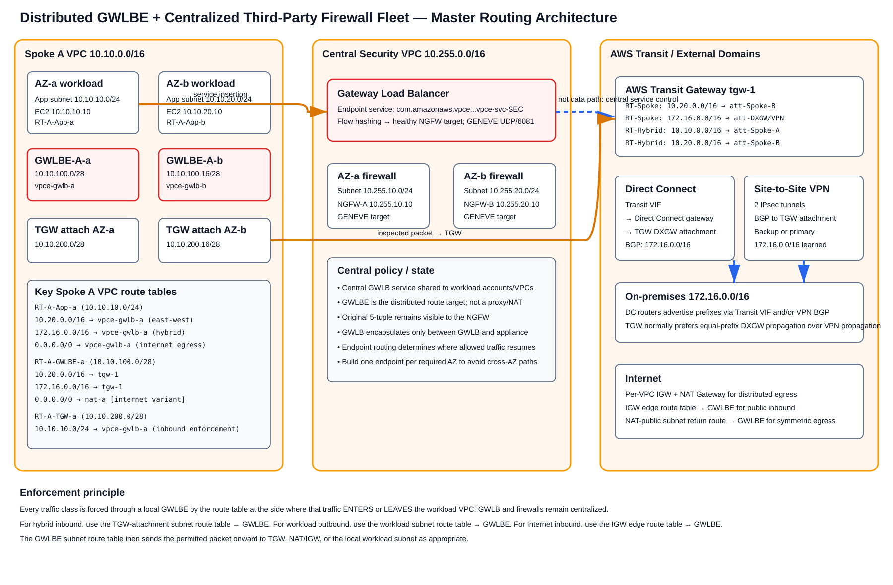
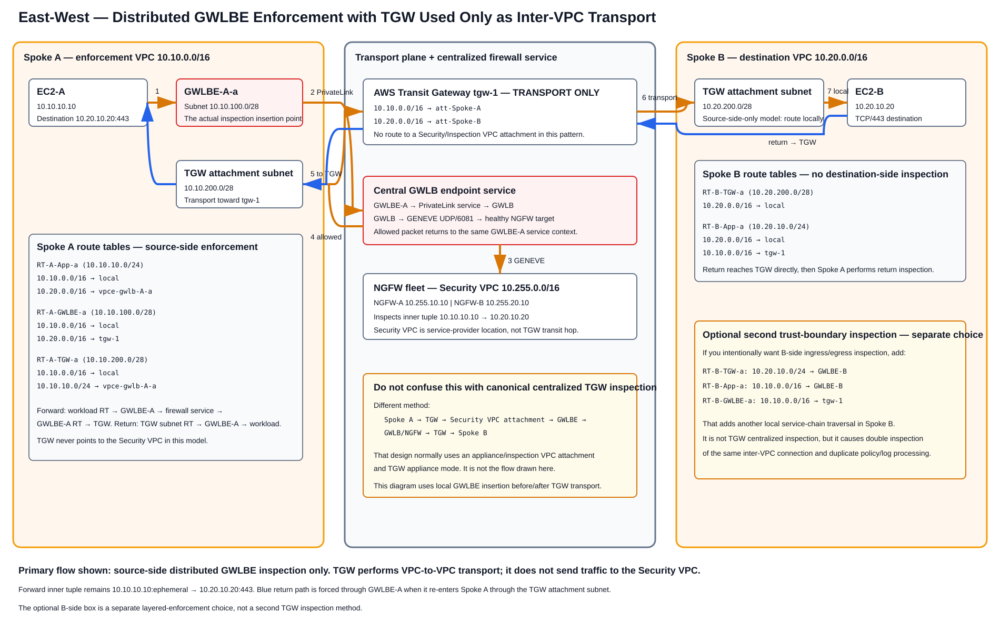
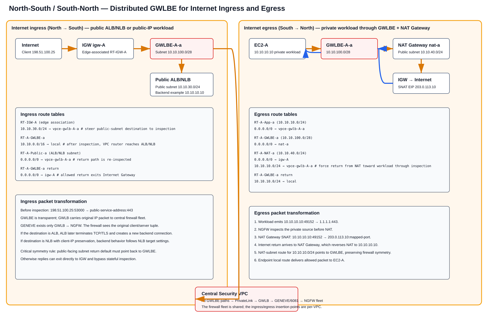
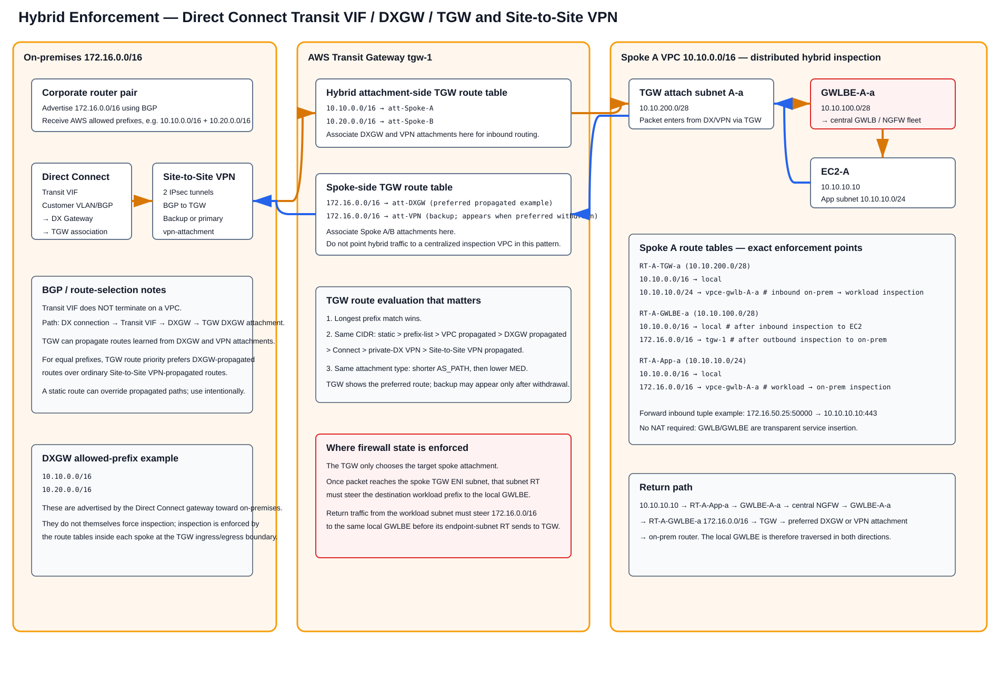

# Distributed GWLBE with a Centralized Third-Party Firewall Fleet — Deep Dive

> **Scope:** A distributed data-plane inspection architecture in which **Gateway Load Balancer Endpoints (GWLBE)** are deployed in workload/edge VPCs while the **Gateway Load Balancer (GWLB)** and third-party next-generation firewall (NGFW) fleet remain centralized in a Security VPC. This guide covers east-west VPC-to-VPC inspection, Internet north-south ingress, Internet south-north egress, AWS Direct Connect with a Transit VIF and Direct Connect Gateway (DXGW), AWS Site-to-Site VPN, AWS Transit Gateway (TGW), route-table enforcement, packet/session symmetry, NAT placement, high availability, verification, failover, limitations, and troubleshooting.
>
> **Source information** = behavior stated by AWS documentation/blogs.  
> **Additional explanation** = networking explanation derived from documented AWS forwarding behavior and normal stateful-firewall operation.  
> **Reasonable inference** = a design conclusion that follows from the documented behavior but is not itself an AWS guarantee.

---

## URLs reviewed

- https://docs.aws.amazon.com/elasticloadbalancing/latest/gateway/getting-started-cli.html
- https://docs.aws.amazon.com/vpc/latest/privatelink/gateway-load-balancer-endpoints.html
- https://docs.aws.amazon.com/vpc/latest/privatelink/create-gateway-load-balancer-endpoint-service.html
- https://docs.aws.amazon.com/reference-architecture-diagrams/latest/distributed-inspection-gwlb/distributed-east-west-inspection.html
- https://docs.aws.amazon.com/reference-architecture-diagrams/latest/distributed-inspection-gwlb/distributed-inbound-inspection.html
- https://docs.aws.amazon.com/reference-architecture-diagrams/latest/gwlb-east-west-inspection/gwlb-east-west-chapter.html
- https://aws.amazon.com/blogs/networking-and-content-delivery/introducing-aws-gateway-load-balancer-supported-architecture-patterns/
- https://aws.amazon.com/blogs/networking-and-content-delivery/vpc-routing-enhancements-and-gwlb-deployment-patterns/
- https://aws.amazon.com/blogs/networking-and-content-delivery/best-practices-for-deploying-gateway-load-balancer/
- https://aws.amazon.com/blogs/networking-and-content-delivery/design-your-firewall-deployment-for-internet-ingress-traffic-flows/
- https://docs.aws.amazon.com/vpc/latest/tgw/how-transit-gateways-work.html
- https://docs.aws.amazon.com/directconnect/latest/UserGuide/direct-connect-transit-gateways.html
- https://docs.aws.amazon.com/directconnect/latest/UserGuide/associate-tgw-with-direct-connect-gateway.html
- https://docs.aws.amazon.com/directconnect/latest/UserGuide/allowed-to-prefixes.html
- https://docs.aws.amazon.com/vpn/latest/s2svpn/create-tgw-cli-api.html
- https://docs.aws.amazon.com/vpn/latest/s2svpn/vpn-route-priority.html

---

# 1. What “distributed GWLBE, centralized firewall fleet” actually means

There are two GWLB architectures that are often confused:

1. **Centralized GWLB + centralized GWLBE:** TGW sends traffic to a Security/Inspection VPC. That VPC contains the GWLBE, GWLB, and firewalls. The inspection entry point is centralized.
2. **Centralized GWLB + distributed GWLBE:** each protected workload/edge VPC contains its own zonal GWLBE. Those endpoints connect through the GWLB endpoint service to the centralized GWLB and firewall fleet. The insertion point is distributed even though policy and appliance ownership are centralized.

This guide is about the **second** pattern.

The architecture separates three concerns:

| Function | Location | Purpose |
|---|---|---|
| GWLBE | Each protected workload/edge VPC, normally one per AZ | Routable insertion point |
| GWLB endpoint service | Security/provider account | PrivateLink service exposed to consumer VPCs/accounts |
| GWLB | Central Security VPC | Flow-aware load distribution to healthy appliances |
| NGFW appliances | Central Security VPC | Stateful inspection, IDS/IPS, URL/TLS functions depending on vendor/license |
| TGW | Shared network account | VPC-to-VPC and hybrid routing; not the firewall in this design |
| IGW/NAT Gateway | Workload/edge VPC for distributed Internet path | Internet ingress/egress and SNAT |
| Transit VIF/DXGW | Direct Connect path | Carries on-premises BGP reachability into TGW |
| Site-to-Site VPN | TGW attachment | Encrypted hybrid path and/or DX backup |

**Source information:** AWS documents GWLBE as a VPC endpoint that can be a route-table next hop. It is zonal; AWS recommends one endpoint per zone where the service is needed. GWLB forwards to virtual appliances and uses GENEVE between GWLB and appliances on UDP port 6081.

**Additional explanation:** The central firewall VPC does not need to be topologically in the routed path between the consumer VPC and its destination. The consumer VPC route sends the packet to GWLBE; the GWLB service transports the packet to the central appliance fleet and returns the allowed packet to the same service-insertion context.

---

# 2. Reference address plan used throughout this guide

The examples deliberately keep workload, GWLBE, TGW-attachment, and Internet/NAT subnets separate.

## 2.1 Spoke A

| Purpose | AZ-a | AZ-b |
|---|---|---|
| VPC | `10.10.0.0/16` | same VPC |
| Application subnet | `10.10.10.0/24` | `10.10.20.0/24` |
| GWLBE subnet | `10.10.100.0/28` | `10.10.100.16/28` |
| TGW attachment subnet | `10.10.200.0/28` | `10.10.200.16/28` |
| Public ALB/NLB subnet example | `10.10.30.0/24` | `10.10.31.0/24` |
| NAT Gateway subnet example | `10.10.40.0/24` | `10.10.41.0/24` |

Example host: `EC2-A = 10.10.10.10`.

## 2.2 Spoke B

| Purpose | AZ-a | AZ-b |
|---|---|---|
| VPC | `10.20.0.0/16` | same VPC |
| Application subnet | `10.20.10.0/24` | `10.20.20.0/24` |
| GWLBE subnet | `10.20.100.0/28` | `10.20.100.16/28` |
| TGW attachment subnet | `10.20.200.0/28` | `10.20.200.16/28` |

Example host: `EC2-B = 10.20.10.20`.

## 2.3 Central Security VPC

- VPC: `10.255.0.0/16`
- NGFW subnet AZ-a: `10.255.10.0/24`
- NGFW-A example: `10.255.10.10`
- NGFW subnet AZ-b: `10.255.20.0/24`
- NGFW-B example: `10.255.20.10`

## 2.4 On-premises

- Corporate aggregate: `172.16.0.0/16`
- Example client/server: `172.16.50.25`

These ranges are examples, not AWS-required values.

---

# 3. Master architecture and the route-table enforcement idea



[Editable draw.io source](images/09-06-26-15-23_distributed_gwlbe_master_architecture.drawio)

**What this image shows:** The workload VPC owns the insertion points. Each AZ has a workload subnet, a GWLBE subnet, and—when TGW is required—a TGW attachment subnet. The centralized Security VPC owns GWLB and the firewall fleet. Direct Connect and VPN attach to TGW, but inspection occurs in the workload VPC route path.

**What matters:** The route table associated with the subnet where traffic is currently being processed decides whether the next hop is GWLBE, TGW, NAT Gateway, IGW, or the VPC local route.

**What to verify:** Do not merely verify that a GWLBE exists. Verify the **specific route table associated with the source/ingress subnet** has the intended GWLBE target and that the **GWLBE subnet route table** has the intended post-inspection next hop.

## 3.1 The most important mental model

A GWLBE is a **route target**, not a magic global policy object.

For each traffic class ask two questions:

1. **Which route table sees the packet before inspection?**
2. **Which route table sees the packet after the endpoint returns the allowed packet?**

Examples:

- Workload to Internet: workload-subnet RT → GWLBE; GWLBE-subnet RT → NAT Gateway.
- Internet to public ALB: IGW edge RT → GWLBE; GWLBE-subnet RT → VPC local route to ALB subnet.
- On-prem to workload: TGW attachment-subnet RT → GWLBE; GWLBE-subnet RT → VPC local route to workload.
- Workload to on-prem: workload-subnet RT → GWLBE; GWLBE-subnet RT → TGW.
- Spoke A to Spoke B in the composed source-side distributed model: Spoke-A workload RT → GWLBE-A; after inspection GWLBE-A RT → TGW; TGW transports directly to Spoke B. The return flow re-enters Spoke A through its TGW attachment subnet and is redirected to GWLBE-A before reaching EC2-A.

---

# 4. GWLB/GWLBE packet mechanics

**Source information:** GWLB is designed for transparent inline virtual appliances. GWLB and the appliance exchange traffic using **GENEVE UDP/6081**. GWLBE connects a consumer VPC to the GWLB endpoint service using AWS PrivateLink semantics.

Conceptually:

```text
Original packet
10.10.10.10:49152 → 10.20.10.20:443
        |
        v
GWLBE in consumer VPC
        |
        v
GWLB service
        |
        | outer IP/UDP + GENEVE UDP/6081
        v
NGFW target
        |
        | inspect original packet
        v
GWLB
        |
        v
same GWLBE service chain context
        |
        v
consumer VPC routing resumes
```

The GWLBE itself does not SNAT the original connection. For east-west and hybrid routed traffic, the original source/destination IPs can therefore remain unchanged through service insertion.

## 4.1 Flow stickiness

GWLB uses a flow hash to keep a flow on a selected healthy target. AWS documentation currently supports configurable hashing modes and configurable TCP idle timeout. Verify your deployed GWLB attributes and your vendor's requirements before changing defaults.

## 4.2 Firewall-side requirements

The third-party appliance must support the AWS GWLB integration model, including GENEVE. Vendor-specific bootstrapping normally configures:

- GENEVE tunnel handling.
- Health-check handling.
- Security policy.
- Routing/session behavior expected by the vendor image.
- HA and licensing.
- Autoscaling if used.

Do not configure an ordinary EC2 firewall image behind GWLB unless the vendor explicitly supports GWLB/GENEVE.

---

# 5. East-west VPC-to-VPC enforcement — do not mix the two architectures



[Editable draw.io source](images/09-06-26-15-23_distributed_gwlbe_east_west_flow.drawio)

**What this image shows:** The primary path is a **source-side distributed GWLBE enforcement design**. Spoke A inserts the firewall service locally through `GWLBE-A`; after inspection, TGW is used only to transport the packet to Spoke B. The Security VPC is reached through the GWLB endpoint service/PrivateLink data plane, not through a TGW Security-VPC attachment.

**What matters:** There are two different east-west architectures and they must not be described as one flow:

1. **Distributed GWLBE + TGW transport:** workload route → local GWLBE → centralized GWLB/NGFW service → same local GWLBE → TGW → destination VPC.
2. **Canonical centralized TGW inspection VPC:** workload → TGW → Security/Inspection VPC attachment → GWLBE/GWLB/NGFW → TGW → destination VPC.

The second design is the AWS reference architecture commonly shown for TGW-based VPC-to-VPC inspection and normally uses **TGW appliance mode** on the appliance VPC attachment. It is **not** the path described in this guide's distributed-GWLBE section.

**Source information:** AWS's published GWLB/TGW east-west reference sends the source VPC to TGW, then from a TGW route table into a Security VPC attachment containing GWLBE/GWLB/appliances, and back to TGW before the destination VPC. AWS separately documents distributed GWLBE insertion for local VPC traffic paths.  
**Reasonable inference:** The source-side design below composes supported VPC route-to-GWLBE behavior, VPC more-specific routing, and ordinary TGW inter-VPC routing. Treat it as a deliberately engineered distributed enforcement pattern rather than claiming it is the same AWS reference topology as centralized TGW inspection.

## 5.1 Pattern A — source-side distributed GWLBE enforcement

Example connection:

```text
EC2-A 10.10.10.10:49152 → EC2-B 10.20.10.20:443
```

Forward path:

```text
EC2-A
 → RT-A-App-a
      10.20.0.0/16 → vpce-gwlb-A-a
 → GWLBE-A-a
 → GWLB endpoint service / PrivateLink
 → centralized GWLB
 → NGFW fleet
 → centralized GWLB
 → same GWLBE-A-a service-chain context
 → RT-A-GWLBE-a
      10.20.0.0/16 → tgw-1
 → Spoke-A TGW attachment
 → TGW route lookup
      10.20.0.0/16 → att-Spoke-B
 → Spoke-B TGW attachment subnet
 → RT-B-TGW-a
      10.20.0.0/16 → local
 → EC2-B 10.20.10.20
```

The important separation is:

```text
Inspection function:  GWLBE-A → PrivateLink → GWLB → NGFW
Inter-VPC transport:   TGW att-Spoke-A → TGW → att-Spoke-B
```

**TGW does not point to the Security VPC in this pattern.**

### Spoke A workload route table

| Destination | Target | Meaning |
|---|---|---|
| `10.10.0.0/16` | `local` | Native local VPC destinations |
| `10.20.0.0/16` | `vpce-gwlb-A-a` | Remote VPC traffic must first enter local inspection |

### Spoke A GWLBE subnet route table

| Destination | Target | Meaning |
|---|---|---|
| `10.10.0.0/16` | `local` | Reach local resources after GWLBE service return |
| `10.20.0.0/16` | `tgw-1` | After inspection, hand packet to TGW for inter-VPC transport |

### TGW route table associated with Spoke A

| Destination | Target | Meaning |
|---|---|---|
| `10.20.0.0/16` | `att-Spoke-B` | Deliver directly to Spoke B attachment |
| `10.10.0.0/16` | `att-Spoke-A` | Return destination toward Spoke A |

There is intentionally **no** entry such as:

```text
0.0.0.0/0 or 10.20.0.0/16 → att-Security-VPC
```

If that next hop exists and packets are deliberately sent there for inspection, you have moved into the centralized TGW inspection-VPC method.

## 5.2 Return path — how Spoke A remains the enforcement point

For a stateful firewall, the reverse direction must also traverse the source-side service chain.

Return packet:

```text
10.20.10.20:443 → 10.10.10.10:49152
```

Return path:

```text
EC2-B
 → RT-B-App-a
      10.10.0.0/16 → tgw-1
 → Spoke-B TGW attachment
 → TGW route lookup
      10.10.0.0/16 → att-Spoke-A
 → Spoke-A TGW attachment subnet 10.10.200.0/28
 → RT-A-TGW-a
      10.10.10.0/24 → vpce-gwlb-A-a
 → GWLBE-A-a
 → centralized GWLB / same firewall service
 → GWLBE-A-a
 → RT-A-GWLBE-a
      10.10.0.0/16 → local
 → EC2-A
```

### Spoke A TGW attachment-subnet route table

| Destination | Target | Meaning |
|---|---|---|
| `10.10.0.0/16` | `local` | Broad VPC local route |
| `10.10.10.0/24` | `vpce-gwlb-A-a` | More-specific route forces packets for the protected application subnet through the local GWLBE |

The more-specific `10.10.10.0/24 → GWLBE-A` route wins over the broader `10.10.0.0/16 → local` route. That is the return-path enforcement point.

### Spoke B route tables in source-side-only enforcement

Spoke B does **not** need to invoke its own GWLBE for this connection.

```text
RT-B-TGW-a
10.20.0.0/16 → local

RT-B-App-a
10.20.0.0/16 → local
10.10.0.0/16 → tgw-1
```

So Spoke B is simply the remote destination VPC for this particular trust-boundary decision.

## 5.3 Pattern B — optional destination-side GWLBE enforcement

This is a **separate policy choice**, not a TGW inspection-VPC hop.

If Spoke B also wants an ingress/egress trust boundary, add local B-side steering such as:

```text
RT-B-TGW-a
10.20.10.0/24 → vpce-gwlb-B-a

RT-B-App-a
10.10.0.0/16 → vpce-gwlb-B-a

RT-B-GWLBE-a
10.20.0.0/16 → local
10.10.0.0/16 → tgw-1
```

The forward path then becomes:

```text
EC2-A
 → GWLBE-A / central NGFW      # source-side policy
 → TGW                          # transport only
 → GWLBE-B / central NGFW      # destination-side policy
 → EC2-B
```

Return traffic reverses both local service chains.

This can be valid when the source and destination VPCs represent independent trust zones, but the operational consequence is important:

- the same connection is inspected twice per direction;
- the centralized NGFW fleet can generate duplicate-looking traffic/security logs;
- policy must be consistent enough that the second inspection does not unexpectedly deny traffic already allowed by the first;
- cost and processing load increase;
- troubleshooting must identify **which GWLBE service-chain traversal** produced a deny or reset.

## 5.4 Pattern C — centralized TGW inspection VPC, shown only for contrast

Do not implement the following route path and still call it the distributed-GWLBE east-west model:

```text
EC2-A
 → TGW
 → TGW route table: remote/default → att-Security-VPC
 → Security VPC TGW subnet
 → GWLBE in Security VPC
 → GWLB / NGFW
 → GWLBE
 → TGW
 → Spoke B
```

That is a different architecture: **centralized service insertion through a TGW-connected inspection VPC**.

Typical characteristics are:

- GWLBE resides in the central Inspection/Security VPC rather than the workload VPC.
- Spoke TGW route tables deliberately point remote/default traffic to the inspection VPC attachment.
- The inspection-VPC-associated TGW route table points inspected traffic toward destination spoke attachments.
- TGW appliance mode is used on the stateful appliance VPC attachment to preserve symmetric appliance/AZ handling.

The rest of this guide keeps that architecture separate.

## 5.5 Quick decision table

| Design | Where GWLBE resides | What TGW does | Security-VPC TGW attachment in data path? | Expected inspections per direction |
|---|---|---|---|---:|
| Source-side distributed GWLBE | Spoke A | Direct A↔B transport | No | 1 |
| Dual distributed GWLBE | Spoke A and Spoke B | Direct A↔B transport | No | 2 |
| Centralized TGW inspection VPC | Security/Inspection VPC | Sends flow into/out of inspection attachment | Yes | 1 centralized chain |

**What to verify:** Before troubleshooting packet flow, inspect the TGW route table. If the remote prefix points directly to the destination spoke, TGW is acting as transport. If it points to a Security/Inspection VPC attachment, you are using the centralized TGW inspection method.

---

# 6. Internet ingress — North to South



[Editable draw.io source](images/09-06-26-15-23_distributed_gwlbe_internet_north_south.drawio)

**What this image shows:** An Internet Gateway edge-associated route table sends traffic destined for a public-facing subnet to GWLBE. After inspection the endpoint subnet local route reaches the public ALB/NLB or other destination. The public-facing subnet return default points back to GWLBE.

**What matters:** The Internet Gateway route table is an **ingress route table**. It is the first enforcement point for traffic entering the VPC from the Internet.

**What to verify:** The destination CIDR in the IGW edge route table must match the public-facing subnet you intend to protect.

## 6.1 Inbound flow example

Client:

```text
198.51.100.25:53000 → public-service-address:443
```

Flow:

1. Internet packet reaches `igw-A`.
2. `RT-IGW-A` matches the destination public subnet, for example `10.10.30.0/24` after AWS public-address mapping into the VPC routing context.
3. Target is `vpce-gwlb-A-a`.
4. GWLBE invokes the central GWLB endpoint service.
5. GWLB sends the flow to a healthy NGFW using GENEVE/UDP 6081.
6. NGFW allows the flow and returns it to GWLB.
7. GWLBE returns the packet to the VPC route path.
8. GWLBE subnet route table's VPC `local` route reaches the public ALB/NLB subnet.
9. If ALB is used, ALB terminates the client connection and creates a backend connection according to ALB behavior.
10. If NLB is used, backend source-IP behavior depends on target type and the NLB client-IP-preservation setting.

### IGW edge route table

```text
Destination      Target
10.10.30.0/24    vpce-gwlb-A-a
10.10.31.0/24    vpce-gwlb-A-b
```

### Public-facing subnet route table

```text
Destination      Target
10.10.0.0/16     local
0.0.0.0/0        vpce-gwlb-A-a
```

That default route is what forces the **reply** through inspection instead of letting the public-facing service route directly to IGW.

### GWLBE subnet route table for ingress

```text
Destination      Target
10.10.0.0/16     local
0.0.0.0/0        igw-A      # used for the Internet-return direction
```

Be precise when combining Internet ingress and egress in one VPC. You might use separate endpoint subnets or route-table segmentation if a single table would create ambiguous post-inspection next hops.

---

# 7. Internet egress — South to North

A common distributed egress sequence is:

```text
Private workload
 → GWLBE
 → central GWLB/NGFW
 → GWLBE
 → NAT Gateway
 → Internet Gateway
 → Internet
```

## 7.1 Why NAT should normally happen after inspection

With this order, the firewall sees the private workload identity:

```text
Before NAT / at NGFW:
10.10.10.10:49152 → 1.1.1.1:443

After NAT Gateway:
203.0.113.10:mapped-port → 1.1.1.1:443
```

This is operationally useful for policy and logging.

## 7.2 Egress route tables

### Workload subnet

```text
Destination      Target
10.10.0.0/16     local
0.0.0.0/0        vpce-gwlb-A-a
```

### GWLBE subnet

```text
Destination      Target
10.10.0.0/16     local
0.0.0.0/0        nat-a
```

### NAT Gateway public subnet

```text
Destination      Target
10.10.0.0/16     local
10.10.10.0/24    vpce-gwlb-A-a
0.0.0.0/0        igw-A
```

The `10.10.10.0/24 → GWLBE` route is the crucial return-path enforcement route.

Return flow:

```text
Internet
 → IGW
 → NAT Gateway
 → DNAT/reverse-NAT to 10.10.10.10
 → NAT-subnet route 10.10.10.0/24 → GWLBE
 → central NGFW
 → GWLBE
 → local route
 → workload
```

**Common mistake:** Configuring workload `0/0 → GWLBE` but leaving the NAT subnet with only `0/0 → IGW` and the broad `local` route. That can allow the reverse-translated packet to use local routing directly to the workload, bypassing the firewall on the return direction.

---

# 8. Hybrid inspection with Direct Connect and Transit VIF



[Editable draw.io source](images/09-06-26-15-23_distributed_gwlbe_hybrid_dx_vpn.drawio)

**What this image shows:** Direct Connect and Site-to-Site VPN terminate as TGW-side attachments, while the spoke VPC performs distributed GWLBE inspection on the TGW-to-workload and workload-to-TGW path.

**What matters:** A **Transit VIF does not terminate directly on a workload VPC**. The path is Direct Connect connection → Transit VIF → Direct Connect Gateway → TGW association/attachment → TGW route table → VPC attachment.

**What to verify:** Check the BGP route on the Transit VIF, DXGW allowed prefixes, TGW route propagation/association, then the spoke TGW-subnet route that points the workload prefix to GWLBE.

## 8.1 Direct Connect control plane

Example:

```text
On-premises router AS 65020
   |
   | eBGP over Transit VIF
   v
Direct Connect
   |
   v
Direct Connect Gateway AS 65030
   |
   | DXGW association + allowed prefixes
   v
Transit Gateway tgw-1
```

Example DXGW allowed prefixes:

```text
10.10.0.0/16
10.20.0.0/16
```

**Source information:** For a DXGW-to-TGW association, the allowed-prefix list controls what the DXGW advertises toward the on-premises network. For TGW associations the allowed prefixes are originated by the DXGW.

## 8.2 On-premises to workload packet walk

Packet:

```text
172.16.50.25:50000 → 10.10.10.10:443
```

1. Corporate router chooses the Transit VIF based on BGP route to `10.10.0.0/16`.
2. Packet crosses Direct Connect.
3. Transit VIF passes it to the Direct Connect Gateway.
4. DXGW association delivers it to the TGW DXGW attachment.
5. The TGW route table associated with the DXGW attachment has `10.10.0.0/16 → Spoke-A attachment`.
6. TGW sends the packet to a TGW ENI in the Spoke-A attachment subnet.
7. That subnet's route table has `10.10.10.0/24 → vpce-gwlb-A-a`.
8. GWLBE invokes the central GWLB/NGFW service.
9. The NGFW inspects the original tuple `172.16.50.25 → 10.10.10.10`.
10. Allowed traffic returns to GWLBE.
11. GWLBE subnet route table uses `10.10.0.0/16 local` to reach `10.10.10.10`.

No SNAT is required merely to make this transparent path work.

## 8.3 Workload to on-premises return

1. `10.10.10.10` replies to `172.16.50.25`.
2. Workload subnet route: `172.16.0.0/16 → GWLBE-A-a`.
3. Central NGFW sees the reverse direction of the same flow.
4. GWLBE subnet route: `172.16.0.0/16 → tgw-1`.
5. TGW route table associated with Spoke-A selects the DXGW attachment.
6. DXGW → Transit VIF → on-premises router.

### Spoke-A hybrid route tables

```text
RT-A-TGW-a
10.10.0.0/16     local
10.10.10.0/24    vpce-gwlb-A-a

RT-A-App-a
10.10.0.0/16     local
172.16.0.0/16    vpce-gwlb-A-a

RT-A-GWLBE-a
10.10.0.0/16     local
172.16.0.0/16    tgw-1
```

This is the heart of distributed hybrid enforcement.

---

# 9. Site-to-Site VPN to Transit Gateway

A Site-to-Site VPN attached to TGW can be treated as another hybrid attachment.

```text
On-prem customer gateway
   ⇅ IPsec tunnel 1 / tunnel 2
AWS Site-to-Site VPN
   ⇅
TGW VPN attachment
   ⇅
TGW routing
   ⇅
Spoke TGW subnet → GWLBE → workload
```

## 9.1 Dynamic routing

When BGP is used, on-premises prefixes can propagate from the VPN attachment into selected TGW route tables.

Example:

```text
172.16.0.0/16 → vpn-attachment  [propagated]
```

The spoke-side TGW route table can therefore reach on-premises without manually creating every route, subject to the desired routing-domain design.

## 9.2 DX primary, VPN backup

**Source information:** TGW route evaluation uses longest prefix first. For the same CIDR from different attachment types, Direct Connect Gateway propagated routes rank ahead of ordinary Site-to-Site VPN propagated routes. AWS also documents that the TGW route table can display only the preferred route; a backup can appear after the preferred route is withdrawn.

Example preferred state:

```text
172.16.0.0/16 → dxgw-attachment   propagated, active/preferred
```

If DX withdraws the route:

```text
172.16.0.0/16 → vpn-attachment    propagated, becomes visible/active
```

Do not create a static route to the VPN for the same prefix if you expect DX propagation to win automatically. Static TGW routes have higher priority than propagated routes.

## 9.3 BGP attributes within the same attachment type

AWS documents that for equal CIDRs from the same attachment type, route choice uses BGP attributes including:

1. Shorter AS_PATH.
2. Lower MED.
3. eBGP over iBGP where applicable.

Use these carefully when you have multiple Direct Connect paths or multiple VPN paths.

---

# 10. Transit Gateway route-table design

Because the GWLBE is distributed, TGW is not the service-insertion device. TGW's job is to select the destination attachment.

A simple segmentation model uses two TGW route tables.

## 10.1 `TGW-RT-Spokes`

Associate Spoke-A and Spoke-B attachments.

```text
10.10.0.0/16   → att-Spoke-A
10.20.0.0/16   → att-Spoke-B
172.16.0.0/16  → att-DXGW        propagated/preferred
172.16.0.0/16  → att-VPN         backup when DX route is withdrawn
```

## 10.2 `TGW-RT-Hybrid`

Associate DXGW and VPN attachments.

```text
10.10.0.0/16   → att-Spoke-A
10.20.0.0/16   → att-Spoke-B
```

This prevents the hybrid attachment from accidentally learning destinations you do not want reachable.

## 10.3 Where appliance mode fits

**Important distinction:** TGW appliance mode is essential in the classic **centralized appliance-VPC** pattern because TGW must keep a stateful inspection VPC path symmetric across AZs.

In this distributed-GWLBE design, the GWLBE is in the workload VPC and TGW is not forwarding into a centralized appliance VPC attachment. Therefore, TGW appliance mode on a Security VPC attachment is not the mechanism that enforces these flows.

If you separately deploy a TGW-attached stateful appliance VPC in the same environment, enable appliance mode for that attachment according to AWS guidance.

---

# 11. Building the GWLB service — AWS CLI

The following commands are based on documented AWS CLI patterns. Substitute real IDs.

## 11.1 Create target group for GENEVE

```cli
aws elbv2 create-target-group \
  --name ngfw-geneve-tg \
  --protocol GENEVE \
  --port 6081 \
  --vpc-id vpc-SECURITY \
  --target-type instance
```

Record the returned target-group ARN.

## 11.2 Register supported firewall instances

```cli
aws elbv2 register-targets \
  --target-group-arn arn:aws:elasticloadbalancing:REGION:ACCOUNT:targetgroup/ngfw-geneve-tg/ID \
  --targets Id=i-FIREWALLA Id=i-FIREWALLB
```

## 11.3 Create GWLB

```cli
aws elbv2 create-load-balancer \
  --name centralized-ngfw-gwlb \
  --type gateway \
  --subnets subnet-SEC-A subnet-SEC-B
```

## 11.4 Create GWLB listener

```cli
aws elbv2 create-listener \
  --load-balancer-arn arn:aws:elasticloadbalancing:REGION:ACCOUNT:loadbalancer/gwy/centralized-ngfw-gwlb/ID \
  --default-actions Type=forward,TargetGroupArn=arn:aws:elasticloadbalancing:REGION:ACCOUNT:targetgroup/ngfw-geneve-tg/ID
```

## 11.5 Create GWLB endpoint service

AWS documents:

```cli
aws ec2 create-vpc-endpoint-service-configuration \
  --gateway-load-balancer-arns arn:aws:elasticloadbalancing:REGION:ACCOUNT:loadbalancer/gwy/centralized-ngfw-gwlb/ID \
  --no-acceptance-required
```

If you require explicit approval, do not use `--no-acceptance-required`.

## 11.6 Authorize consumer account

```cli
aws ec2 modify-vpc-endpoint-service-permissions \
  --service-id vpce-svc-SERVICE \
  --add-allowed-principals arn:aws:iam::123456789012:root
```

## 11.7 Create a GWLBE in a spoke AZ

```cli
aws ec2 create-vpc-endpoint \
  --vpc-endpoint-type GatewayLoadBalancer \
  --service-name com.amazonaws.vpce.REGION.vpce-svc-SERVICE \
  --vpc-id vpc-SPOKEA \
  --subnet-ids subnet-SPOKEA-GWLBE-A
```

Repeat for each AZ in which you require an endpoint.

---

# 12. Route programming examples

## 12.1 East-west route from Spoke A workload to GWLBE

```cli
aws ec2 create-route \
  --route-table-id rtb-A-APP-A \
  --destination-cidr-block 10.20.0.0/16 \
  --vpc-endpoint-id vpce-GWLBE-A-A
```

## 12.2 Post-inspection route from GWLBE subnet to TGW

```cli
aws ec2 create-route \
  --route-table-id rtb-A-GWLBE-A \
  --destination-cidr-block 10.20.0.0/16 \
  --transit-gateway-id tgw-1
```

## 12.3 Hybrid inbound route from TGW subnet to GWLBE

```cli
aws ec2 create-route \
  --route-table-id rtb-A-TGW-A \
  --destination-cidr-block 10.10.10.0/24 \
  --vpc-endpoint-id vpce-GWLBE-A-A
```

## 12.4 Workload-to-on-prem route

```cli
aws ec2 create-route \
  --route-table-id rtb-A-APP-A \
  --destination-cidr-block 172.16.0.0/16 \
  --vpc-endpoint-id vpce-GWLBE-A-A
```

## 12.5 Post-inspection hybrid route

```cli
aws ec2 create-route \
  --route-table-id rtb-A-GWLBE-A \
  --destination-cidr-block 172.16.0.0/16 \
  --transit-gateway-id tgw-1
```

## 12.6 Internet egress workload route

```cli
aws ec2 create-route \
  --route-table-id rtb-A-APP-A \
  --destination-cidr-block 0.0.0.0/0 \
  --vpc-endpoint-id vpce-GWLBE-A-A
```

## 12.7 GWLBE to NAT Gateway

```cli
aws ec2 create-route \
  --route-table-id rtb-A-GWLBE-A \
  --destination-cidr-block 0.0.0.0/0 \
  --nat-gateway-id nat-AAAAAAAA
```

---

# 13. Direct Connect Gateway and Transit VIF configuration relationships

The resource chain is easy to misread because several resources are involved:

```text
Physical/hosted/dedicated DX connection
      |
      +-- Transit VIF
              |
              +-- Direct Connect Gateway
                      |
                      +-- Association to Transit Gateway
                              |
                              +-- TGW route tables
                                      |
                                      +-- VPC attachments
```

## 13.1 Create/associate DXGW concepts

The exact Direct Connect creation command parameters depend on whether the connection is dedicated/hosted and on VLAN/BGP addressing supplied for the VIF. AWS documents `create-transit-virtual-interface` for the Transit VIF and `create-direct-connect-gateway-association` for associating DXGW with TGW.

Example association concept:

```cli
aws directconnect create-direct-connect-gateway-association \
  --direct-connect-gateway-id dxgw-EXAMPLE \
  --gateway-id tgw-EXAMPLE \
  --add-allowed-prefixes-to-direct-connect-gateway cidr=10.10.0.0/16 cidr=10.20.0.0/16
```

Verify exact syntax against your installed AWS CLI version before deployment because CLI structures can evolve.

---

# 14. Site-to-Site VPN creation concept

AWS documents creating a TGW-terminated VPN by specifying the TGW ID.

```cli
aws ec2 create-vpn-connection \
  --type ipsec.1 \
  --transit-gateway-id tgw-EXAMPLE \
  --customer-gateway-id cgw-EXAMPLE
```

For production, explicitly design:

- BGP versus static routing.
- Tunnel inside address family.
- IKE versions/crypto.
- Both tunnels.
- Customer gateway HA.
- Route preference relative to Direct Connect.

---

# 15. Verification — route tables first

## 15.1 Verify GWLBE state

```cli
aws ec2 describe-vpc-endpoints \
  --vpc-endpoint-ids vpce-GWLBE-A-A \
  --query 'VpcEndpoints[0].[VpcEndpointId,VpcEndpointType,State,ServiceName,SubnetIds]' \
  --output table
```

**Expected successful state:**

- `VpcEndpointType` = `GatewayLoadBalancer`.
- `State` = `available`.
- Service name matches the centralized endpoint service.
- Subnet ID is the intended AZ-specific GWLBE subnet.

**Failure indicators:** `pendingAcceptance`, `rejected`, wrong subnet, wrong service name.

**Next action:** Verify endpoint-service permissions/acceptance and account/Region.

## 15.2 Verify VPC route tables

```cli
aws ec2 describe-route-tables \
  --route-table-ids rtb-A-APP-A rtb-A-GWLBE-A rtb-A-TGW-A \
  --output json
```

Success criteria for hybrid inspection:

```text
RT-A-App-a:     172.16.0.0/16 → vpce-GWLBE-A-A
RT-A-GWLBE-a:   172.16.0.0/16 → tgw-1
RT-A-TGW-a:     10.10.10.0/24 → vpce-GWLBE-A-A
```

Do not only inspect the route-table object; verify each route table is associated with the intended subnet.

## 15.3 Verify GWLB target health

```cli
aws elbv2 describe-target-health \
  --target-group-arn arn:aws:elasticloadbalancing:REGION:ACCOUNT:targetgroup/ngfw-geneve-tg/ID \
  --output table
```

**Success criteria:** expected firewall targets are registered and healthy.

**Failure indicators:** unhealthy/unused/draining states, missing target, wrong AZ/subnet.

**Next action:** Check vendor bootstrap, health-check behavior, security groups/NACLs, appliance interface configuration, and GENEVE reachability.

---

# 16. Verify Transit Gateway routing

## 16.1 Search TGW route table

```cli
aws ec2 search-transit-gateway-routes \
  --transit-gateway-route-table-id tgw-rtb-SPOKES \
  --filters Name=route-search.exact-match,Values=172.16.0.0/16 \
  --output json
```

For normal DX-primary/VPN-backup behavior, expect the preferred DXGW-propagated route while it is available.

## 16.2 Verify attachment associations

```cli
aws ec2 get-transit-gateway-route-table-associations \
  --transit-gateway-route-table-id tgw-rtb-SPOKES \
  --output table
```

Check that Spoke attachments are associated with the route table that contains hybrid destinations.

```cli
aws ec2 get-transit-gateway-route-table-propagations \
  --transit-gateway-route-table-id tgw-rtb-SPOKES \
  --output table
```

Check that DXGW/VPN propagation is enabled according to your design.

---

# 17. Verify Direct Connect

Useful commands include:

```cli
aws directconnect describe-virtual-interfaces --output table
```

Important fields:

- VIF type should be transit for the TGW/DXGW design.
- BGP peer state.
- VLAN.
- Customer and Amazon addressing.
- Direct Connect Gateway association.

```cli
aws directconnect describe-direct-connect-gateway-associations \
  --direct-connect-gateway-id dxgw-EXAMPLE \
  --output json
```

Success criteria:

- Association state is `associated`.
- Target gateway is the intended TGW.
- Allowed prefixes contain the AWS ranges intended for advertisement toward on-premises.

---

# 18. Verify Site-to-Site VPN

```cli
aws ec2 describe-vpn-connections \
  --vpn-connection-ids vpn-EXAMPLE \
  --output json
```

Check both tunnel telemetry entries.

Success criteria:

- At least the intended tunnels are `UP`.
- BGP-learned route is present/propagated when dynamic routing is used.
- TGW route table selects the expected attachment.

Failure indicators:

- Both tunnels down.
- Tunnel up but no BGP prefixes.
- VPN route unexpectedly preferred over DX because of a static route.

---

# 19. Packet-level verification

For a hybrid test:

```text
Client: 172.16.50.25
Server: 10.10.10.10:443
```

Correlate:

1. On-prem router BGP table.
2. Direct Connect VIF or VPN tunnel state.
3. TGW route table.
4. Spoke TGW subnet route table.
5. GWLB target health.
6. NGFW traffic/session log.
7. VPC Flow Logs on workload/TGW/NAT-related ENIs where useful.
8. Application listener/backend health.

At the NGFW, the expected inner flow should still identify the original endpoints. Do not mistake the outer GENEVE flow for the application session.

---

# 20. High availability and failure behavior

## 20.1 GWLBE

GWLBE is zonal. Deploy one per required AZ and build AZ-local routing.

**Reasonable inference:** If a workload in AZ-a always routes through a GWLBE in AZ-b, you introduce cross-AZ dependency/cost and make an AZ failure more disruptive than necessary.

## 20.2 GWLB target fleet

GWLB removes unhealthy targets according to health status and selects healthy targets for new flows. Appliance behavior for existing sessions during target failure is vendor- and flow-state-dependent; do not assume state magically migrates to another firewall unless the vendor explicitly implements such state synchronization.

## 20.3 Direct Connect failure to VPN

With the same prefix propagated from DXGW and ordinary Site-to-Site VPN, TGW prefers the DXGW route based on documented route-type priority. When the DX route is withdrawn, the VPN route can become active.

Failover time is not only a TGW question. It includes:

- Physical/BFD/BGP detection on Direct Connect.
- BGP route withdrawal.
- TGW route update.
- VPN availability/BGP state.
- On-premises routing convergence.
- Existing firewall session behavior.

## 20.4 TGW attachment AZs

For VPC attachments, associate subnets in the AZs where TGW connectivity is required. The subnet route table associated with each TGW attachment ENI must have the correct GWLBE next hop for inbound enforcement.

---

# 21. Security groups, NACLs, and firewall policy

A routing-correct architecture can still fail because of policy.

Validate:

- Workload security group permits the intended source/destination.
- NACLs permit both directions including ephemeral ports where required.
- Firewall vendor policy permits the flow.
- GENEVE/health-check communication is permitted according to vendor/AWS deployment requirements.
- ALB/NLB security policy and target security groups are correct.
- On-prem ACL/firewall permits the AWS CIDRs and return path.

Do not add SNAT solely to hide a routing asymmetry. Fix the return routing first unless NAT is an explicit design requirement.

---

# 22. Common mistakes

## Mistake 1 — Calling this a centralized inspection-VPC data path

The firewalls are centralized, but the **GWLBE insertion points are distributed**. TGW does not need to hairpin all traffic through the Security VPC.

## Mistake 2 — Putting a GWLBE in the VPC but not routing to it

An endpoint with no route pointing to it does not inspect arbitrary traffic.

## Mistake 3 — Inspecting outbound but not return traffic

Stateful firewalls require both directions of the flow. Build a return-path route at the ingress side: TGW subnet, NAT subnet, or public ALB/NLB subnet as appropriate.

## Mistake 4 — Assuming the Transit VIF performs inspection

Transit VIF is a Direct Connect routing construct. Inspection is inserted later through VPC route tables and GWLBE.

## Mistake 5 — Using the same endpoint-subnet route table for incompatible post-inspection paths

If `0.0.0.0/0` must sometimes go to NAT and sometimes IGW, create clear subnet/endpoint segmentation rather than relying on an ambiguous design.

## Mistake 6 — Accidentally double-inspecting east-west flows

If both source and destination VPCs enforce egress and ingress, the flow can be serviced by the central NGFW fleet twice per direction.

## Mistake 7 — Static VPN route unintentionally overrides Direct Connect

TGW static routes outrank propagated routes for the same CIDR. If DX should be primary automatically, do not defeat the route hierarchy with an unintended static route.

## Mistake 8 — Treating DXGW allowed prefixes as a TGW security policy

Allowed prefixes control what the Direct Connect Gateway advertises toward on-premises for a TGW association. They do not replace TGW route-table segmentation or firewall policy.

## Mistake 9 — Treating a TGW Security-VPC attachment as part of the distributed east-west flow

If the TGW route table points the flow to a Security/Inspection VPC attachment before the destination VPC, that is the **centralized TGW inspection-VPC method**. In the source-side distributed model, TGW points directly from the source attachment to the destination attachment; GWLBE insertion happens inside the spoke VPC route path.

---

# 23. Troubleshooting by symptom

## Symptom: On-prem can reach TGW but not the workload

**Where:** Spoke TGW attachment subnet.  
**Command/tool:** `describe-route-tables`.  
**What it tests:** Whether the inbound destination subnet is redirected to GWLBE.  
**Expected:** `10.10.10.0/24 → vpce-gwlb-A-a`.  
**Failure means:** TGW traffic may be using VPC local routing directly or landing in a subnet with the wrong route table.  
**Next action:** Correct route-table association and more-specific GWLBE route.

## Symptom: Firewall sees SYN but never sees SYN/ACK

**Where:** Workload subnet and return path.  
**Command/tool:** VPC route table + NGFW session log.  
**What it tests:** Stateful symmetry.  
**Expected:** Workload's route to remote CIDR points to the same local GWLBE service chain.  
**Failure means:** Return bypass is likely.  
**Next action:** Fix workload/NAT/TGW/public-subnet return route.

## Symptom: East-west traffic bypasses the source-side firewall

**Where:** Spoke-A application route table and Spoke-A TGW attachment-subnet route table.  
**What it tests:** Whether both forward and return directions are locally inserted into `GWLBE-A`.  
**Expected forward:** `10.20.0.0/16 → vpce-gwlb-A-a`.  
**Expected return:** `10.10.10.0/24 → vpce-gwlb-A-a` on `RT-A-TGW-a`.  
**Failure means:** TGW can still deliver the packet, but one direction may use direct VPC local routing and bypass stateful inspection.  
**Next action:** Correct the spoke route tables; do not solve this by pointing TGW to a Security VPC unless you intentionally want to change architectures.

## Symptom: DX is healthy but traffic uses VPN

**Where:** TGW route table.  
**Command:** `search-transit-gateway-routes`.  
**Expected:** DXGW propagated route preferred for equal prefix, absent overriding static route.  
**Failure means:** Static route, more-specific VPN route, or BGP advertisement difference can be overriding the expected path.  
**Next action:** Compare exact prefixes and route types.

## Symptom: GWLBE is available but packets disappear

**Where:** GWLB target group / firewall.  
**Command:** `describe-target-health`.  
**Expected:** healthy supported NGFW targets.  
**Failure means:** Appliance bootstrap, GENEVE, health checks, policy, or vendor integration is wrong.  
**Next action:** Follow vendor GWLB deployment guide and inspect appliance logs.

## Symptom: Internet egress works, but return bypasses firewall

**Where:** NAT Gateway public-subnet route table.  
**Expected:** workload subnet CIDR → GWLBE.  
**Failure means:** reverse-translated packets can use the broad local VPC route directly.  
**Next action:** Add the more-specific return route through GWLBE.

## Symptom: Internet inbound reaches firewall but not ALB/NLB

**Where:** GWLBE subnet route table.  
**Expected:** local route can reach destination public subnet after inspection.  
**Failure means:** incorrect post-inspection route or public-facing subnet association.  
**Next action:** Verify the destination subnet and IGW edge routing pair.

---

# 24. Design recommendations

1. **Use one GWLBE per required AZ.** Keep source, endpoint, TGW/NAT, and destination routing AZ-aware.
2. **Use separate subnets and route tables for workload, GWLBE, TGW attachment, and NAT/public tiers.** This makes insertion deterministic.
3. **Choose an east-west architecture first.** For distributed source-side enforcement, TGW routes directly between spoke attachments and the spoke route tables invoke GWLBE. For centralized TGW inspection, TGW deliberately sends the flow through an inspection-VPC attachment. Do not combine the route logic from the two designs.
4. **Choose whether a second destination-side GWLBE traversal is intentional.** It is layered distributed enforcement, not centralized TGW inspection, and it doubles inspection work.
5. **Keep NAT after outbound inspection when you want private workload identity in firewall policy/logs.**
6. **Treat Direct Connect and VPN as TGW routing attachments, not inspection functions.** The spoke route tables implement the distributed inspection point.
7. **Use TGW route-table separation for spokes versus hybrid attachments.** This reduces accidental transit.
8. **Do not use static routes casually when DX/VPN failover depends on propagated route priority.**
9. **Validate route-table associations, not just routes.** The right route in the wrong table is operationally equivalent to no route.
10. **Correlate the inner application tuple at the NGFW.** GENEVE outer headers are transport between GWLB and the appliance.
11. **Document every direction separately.** A working forward path does not prove the stateful return path.

---

# 25. Summary traffic matrix

| Traffic class | Pre-inspection route table | GWLBE location | TGW role / post-inspection next hop | Return enforcement point |
|---|---|---|---|---|
| Spoke A → Spoke B, source-side distributed | A workload RT | Spoke A | GWLBE-A RT → TGW; TGW directly → Spoke B | A TGW-subnet RT → GWLBE-A |
| Spoke A → Spoke B, dual distributed | A workload RT + B TGW RT | Both spokes | TGW transports directly A↔B; each spoke inserts its own GWLBE locally | B workload RT + A TGW RT |
| Spoke A → Spoke B, centralized TGW inspection | Spoke route → TGW | Security/Inspection VPC | TGW → Security VPC attachment → GWLBE → TGW → destination | Reverse through same centralized inspection path; appliance mode normally required |
| Internet → public ALB/NLB | IGW edge RT | Workload VPC | VPC local to public subnet | Public subnet default → GWLBE |
| Private workload → Internet | Workload RT | Workload VPC | NAT Gateway | NAT subnet workload-CIDR route → GWLBE |
| On-prem → workload via DX | TGW attachment-subnet RT | Workload VPC | VPC local | Workload remote-CIDR route → GWLBE |
| Workload → on-prem via DX | Workload RT | Workload VPC | TGW → DXGW | TGW subnet inbound route → GWLBE |
| On-prem → workload via VPN | TGW attachment-subnet RT | Workload VPC | VPC local | Workload remote-CIDR route → GWLBE |
| Workload → on-prem via VPN | Workload RT | Workload VPC | TGW → VPN | TGW subnet inbound route → GWLBE |

---

# Sources

- AWS Elastic Load Balancing — Getting started with Gateway Load Balancers using AWS CLI: https://docs.aws.amazon.com/elasticloadbalancing/latest/gateway/getting-started-cli.html
- AWS PrivateLink — Access an inspection system using a Gateway Load Balancer endpoint: https://docs.aws.amazon.com/vpc/latest/privatelink/gateway-load-balancer-endpoints.html
- AWS PrivateLink — Create an inspection system as a Gateway Load Balancer endpoint service: https://docs.aws.amazon.com/vpc/latest/privatelink/create-gateway-load-balancer-endpoint-service.html
- AWS Architecture Center — East/West Distributed Inspection: https://docs.aws.amazon.com/reference-architecture-diagrams/latest/distributed-inspection-gwlb/distributed-east-west-inspection.html
- AWS Architecture Center — North/South Inbound Distributed Inspection: https://docs.aws.amazon.com/reference-architecture-diagrams/latest/distributed-inspection-gwlb/distributed-inbound-inspection.html
- AWS Architecture Center — Gateway Load Balancer East/West Inspection: https://docs.aws.amazon.com/reference-architecture-diagrams/latest/gwlb-east-west-inspection/gwlb-east-west-chapter.html
- AWS Networking Blog — Introducing AWS Gateway Load Balancer: Supported architecture patterns: https://aws.amazon.com/blogs/networking-and-content-delivery/introducing-aws-gateway-load-balancer-supported-architecture-patterns/
- AWS Networking Blog — VPC Routing Enhancements and GWLB Deployment Patterns: https://aws.amazon.com/blogs/networking-and-content-delivery/vpc-routing-enhancements-and-gwlb-deployment-patterns/
- AWS Networking Blog — Best practices for deploying Gateway Load Balancer: https://aws.amazon.com/blogs/networking-and-content-delivery/best-practices-for-deploying-gateway-load-balancer/
- AWS Networking Blog — Design your firewall deployment for Internet ingress traffic flows: https://aws.amazon.com/blogs/networking-and-content-delivery/design-your-firewall-deployment-for-internet-ingress-traffic-flows/
- AWS Transit Gateway — How AWS Transit Gateway works: https://docs.aws.amazon.com/vpc/latest/tgw/how-transit-gateways-work.html
- AWS Direct Connect — DXGW and TGW associations: https://docs.aws.amazon.com/directconnect/latest/UserGuide/direct-connect-transit-gateways.html
- AWS Direct Connect — Associate Direct Connect Gateway with TGW: https://docs.aws.amazon.com/directconnect/latest/UserGuide/associate-tgw-with-direct-connect-gateway.html
- AWS Direct Connect — Allowed prefixes interactions: https://docs.aws.amazon.com/directconnect/latest/UserGuide/allowed-to-prefixes.html
- AWS Site-to-Site VPN — Create a TGW VPN connection: https://docs.aws.amazon.com/vpn/latest/s2svpn/create-tgw-cli-api.html
- AWS Site-to-Site VPN — Route priority: https://docs.aws.amazon.com/vpn/latest/s2svpn/vpn-route-priority.html
