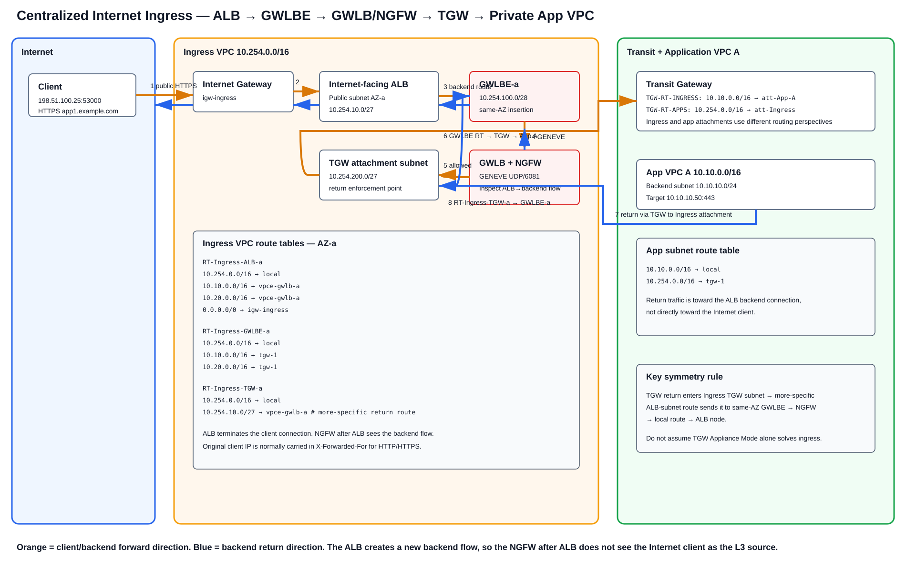

# AWS Transit Gateway + Centralized GWLB/GWLBE Inspection VPC — Deep Dive

> **Scope:** A centralized third-party firewall architecture using **AWS Transit Gateway (TGW)**, a dedicated **Inspection VPC**, **Gateway Load Balancer Endpoint (GWLBE)**, **Gateway Load Balancer (GWLB)**, and a horizontally scalable third-party NGFW/NVA fleet. This guide focuses on exact route-table relationships, Appliance Mode, east-west inspection, centralized Internet egress, **centralized Internet ingress**, Direct Connect Transit VIF/DXGW, Site-to-Site VPN, return-path symmetry, failure handling, configuration, verification, limitations, and troubleshooting.
>
> **Source information** = behavior documented by AWS.  
> **Additional explanation** = standard networking explanation derived from AWS forwarding behavior.  
> **Reasonable inference** = a design conclusion that follows from the documented behavior but is not itself an AWS guarantee.

---

## URLs reviewed

- https://docs.aws.amazon.com/reference-architecture-diagrams/latest/gwlb-east-west-inspection/gwlb-east-west-chapter.html
- https://aws.amazon.com/blogs/networking-and-content-delivery/centralized-inspection-architecture-with-aws-gateway-load-balancer-and-aws-transit-gateway/
- https://aws.amazon.com/blogs/networking-and-content-delivery/best-practices-for-deploying-gateway-load-balancer/
- https://docs.aws.amazon.com/vpc/latest/tgw/how-transit-gateways-work.html
- https://docs.aws.amazon.com/whitepapers/latest/building-scalable-secure-multi-vpc-network-infrastructure/using-gwlb-with-tg-for-cns.html
- https://docs.aws.amazon.com/prescriptive-guidance/latest/integrate-third-party-services/architecture-3.html
- https://docs.aws.amazon.com/prescriptive-guidance/latest/inline-traffic-inspection-third-party-appliances/introduction.html
- https://aws.amazon.com/blogs/networking-and-content-delivery/introducing-aws-gateway-load-balancer-supported-architecture-patterns/
- https://aws.amazon.com/blogs/networking-and-content-delivery/vpc-routing-enhancements-and-gwlb-deployment-patterns/
- https://aws.amazon.com/blogs/networking-and-content-delivery/design-your-firewall-deployment-for-internet-ingress-traffic-flows/
- https://aws.amazon.com/blogs/networking-and-content-delivery/experian-centralized-internet-ingress-using-aws-gateway-load-balancer-and-aws-transit-gateway/
- https://docs.aws.amazon.com/elasticloadbalancing/latest/application/load-balancer-target-groups.html
- https://docs.aws.amazon.com/elasticloadbalancing/latest/application/x-forwarded-headers.html
- https://docs.aws.amazon.com/directconnect/latest/UserGuide/direct-connect-transit-gateways.html
- https://docs.aws.amazon.com/directconnect/latest/UserGuide/associate-tgw-with-direct-connect-gateway.html
- https://docs.aws.amazon.com/vpn/latest/s2svpn/create-tgw-cli-api.html

---

# 1. What this architecture is

This is the **centralized TGW inspection-VPC pattern**.

Traffic requiring inspection is deliberately routed through a dedicated VPC attachment:

```text
Source VPC / DX / VPN
        ↓
AWS Transit Gateway
        ↓
TGW route table selects Inspection VPC attachment
        ↓
Inspection-VPC TGW attachment subnet
        ↓
VPC route table selects GWLBE
        ↓
GWLBE → GWLB → third-party NGFW fleet
        ↓
GWLBE returns allowed packet to Inspection VPC
        ↓
Inspection-VPC route table sends packet back to TGW
        ↓
TGW route table associated with Inspection attachment
        ↓
Destination VPC / DX / VPN / egress tier
```

This is fundamentally different from the distributed-GWLBE model where each workload VPC owns its own GWLBE.

## 1.1 Component roles

| Component | Role |
|---|---|
| Spoke VPC route table | Sends traffic requiring inspection to TGW |
| TGW spoke-side route table | Forces traffic to the Inspection VPC attachment |
| Inspection VPC TGW attachment | Entry/exit point between TGW and inspection VPC |
| TGW Appliance Mode | Preserves stateful-flow AZ symmetry through the Inspection VPC for TGW-transiting flows |
| Inspection TGW-subnet route table | Sends packets to the zonal GWLBE |
| GWLBE | Route-table next hop into the GWLB endpoint service |
| GWLB | Flow-aware distribution to healthy third-party appliances |
| NGFW/NVA | Stateful inspection and vendor security services |
| GWLBE-subnet route table | Sends post-inspection traffic either back to TGW or toward NAT/other egress tier |
| TGW inspection-side route table | Sends allowed traffic to final spoke/hybrid attachment |
| NAT Gateway | Performs centralized Internet SNAT after inspection when used |
| Public ALB/NLB ingress tier | Provides public application ingress; must be designed separately from TGW east-west symmetry |

---

# 2. Reference topology and address plan


[Editable draw.io source](images/09-06-26-15-45_tgw_centralized_gwlb_master.drawio)

**What this image shows:** Two spoke VPCs, hybrid DX/VPN attachments, TGW route-table separation, and a multi-AZ Inspection VPC containing TGW attachment subnets, GWLBE subnets, GWLB, NGFWs, NAT Gateways, and an IGW.

**What matters:** TGW decides **which attachment** receives the packet. The VPC route table inside the Inspection VPC decides **which GWLBE** receives the packet. GWLBE/GWLB then performs service insertion.

**What to verify:** Route-table association is as important as the route itself. A correct route in the wrong TGW route table or VPC subnet route table does nothing.

Reference CIDRs:

| Function | CIDR |
|---|---|
| Spoke A VPC | `10.10.0.0/16` |
| Spoke A app subnet | `10.10.10.0/24` |
| Spoke B VPC | `10.20.0.0/16` |
| Spoke B app subnet | `10.20.10.0/24` |
| Inspection/Ingress VPC | `10.255.0.0/16` |
| Inspection TGW subnet AZ-a | `10.255.200.0/28` |
| Inspection TGW subnet AZ-b | `10.255.200.16/28` |
| GWLBE subnet AZ-a | `10.255.100.0/28` |
| GWLBE subnet AZ-b | `10.255.100.16/28` |
| NGFW subnet AZ-a | `10.255.10.0/24` |
| NGFW subnet AZ-b | `10.255.20.0/24` |
| NAT subnet AZ-a | `10.255.40.0/24` |
| NAT subnet AZ-b | `10.255.41.0/24` |
| Public ALB subnet AZ-a example | `10.255.50.0/24` |
| Public ALB subnet AZ-b example | `10.255.51.0/24` |
| On-premises | `172.16.0.0/16` |

---

# 3. The TGW route-table split is the heart of the design

A single TGW route table is usually insufficient because you need two different routing perspectives:

1. **Traffic arriving from spokes/hybrid attachments must be forced to inspection.**
2. **Traffic returning from the Inspection VPC must be allowed to reach final destinations directly.**

## 3.1 `TGW-RT-SPOKES`

Associate workload VPC attachments here.

```text
Destination        Target
0.0.0.0/0          att-Inspection
10.20.0.0/16       att-Inspection
10.10.0.0/16       att-Inspection
172.16.0.0/16      att-Inspection
```

Do not propagate remote spoke attachments directly into this table when mandatory east-west inspection is required, or TGW can select the destination attachment without traversing inspection.

## 3.2 `TGW-RT-HYBRID`

Associate DXGW and VPN attachments here when inbound on-premises traffic must be inspected.

```text
Destination        Target
10.10.0.0/16       att-Inspection
10.20.0.0/16       att-Inspection
```

## 3.3 `TGW-RT-INSPECTION`

Associate the Inspection VPC attachment here.

```text
Destination        Target
10.10.0.0/16       att-Spoke-A
10.20.0.0/16       att-Spoke-B
172.16.0.0/16      att-DXGW
```

A VPN-learned route can serve as backup when the preferred Direct Connect route is withdrawn, depending on the exact propagated/static route design.

This route table decides where **post-inspection** traffic goes.

---

# 4. Appliance Mode — why it is required for east-west stateful inspection

**Source information:** AWS documents Appliance Mode for an appliance VPC attachment so TGW can maintain flow AZ affinity for stateful inspection appliances.

Without Appliance Mode, the two directions of a flow can enter the inspection attachment through different AZs:

```text
Forward:
Spoke A AZ-a → TGW → Inspection attachment ENI AZ-a → GWLBE-a → firewall session

Return:
Spoke B AZ-b → TGW → Inspection attachment ENI AZ-b → GWLBE-b → different service-chain context
```

With Appliance Mode:

```text
Forward and reverse TGW-transiting flow
        ↓
same Inspection-VPC attachment AZ for flow lifetime
        ↓
same zonal GWLBE service chain
        ↓
stateful inspection symmetry
```

AWS reference: [How AWS Transit Gateway works — Appliance Mode](https://docs.aws.amazon.com/vpc/latest/tgw/how-transit-gateways-work.html).

## 4.1 Enable Appliance Mode

```cli
aws ec2 modify-transit-gateway-vpc-attachment \
  --transit-gateway-attachment-id tgw-attach-INSPECTION \
  --options ApplianceModeSupport=enable
```

## 4.2 Verify

```cli
aws ec2 describe-transit-gateway-vpc-attachments \
  --transit-gateway-attachment-ids tgw-attach-INSPECTION \
  --query 'TransitGatewayVpcAttachments[0].Options.ApplianceModeSupport' \
  --output text
```

**Expected state:** `enable`.

**Failure indicator:** `disable` or the wrong attachment ID.

**Next action:** Enable Appliance Mode on the actual Inspection VPC attachment, not on the spoke attachment.

## 4.3 Important boundary

Do **not** interpret Appliance Mode as a universal symmetry feature for every packet entering the VPC. Internet ingress may begin at an Internet Gateway/public load balancer rather than at TGW, so the forward and return directions are not identical to an east-west TGW-to-TGW flow. Section 10 treats that architecture independently.

---

# 5. East-west VPC-to-VPC inspection


[Editable draw.io source](images/09-06-26-15-45_tgw_centralized_gwlb_east_west.drawio)

**What this image shows:** Spoke A sends traffic to TGW. TGW deliberately sends the flow into the Inspection VPC attachment, where a VPC route sends it to GWLBE/GWLB/NGFW. The allowed packet goes back to TGW and then to Spoke B.

**What matters:** The packet traverses TGW twice in the forward direction: once before inspection and once after inspection.

**What to verify:** `TGW-RT-SPOKES` must send the destination to `att-Inspection`, while `TGW-RT-INSPECTION` must send it to the actual destination spoke.

Example flow:

```text
10.10.10.10:49152 → 10.20.10.20:443
```

## 5.1 Forward path

1. EC2-A sends toward `10.20.10.20`.
2. Spoke A app RT matches `10.20.0.0/16 → tgw-1`.
3. Packet enters Spoke-A TGW attachment.
4. `TGW-RT-SPOKES` matches `10.20.0.0/16 → att-Inspection`.
5. TGW selects the Inspection VPC attachment/AZ under Appliance Mode.
6. Packet reaches the Inspection TGW subnet.
7. `RT-Insp-TGW-a` matches `10.20.0.0/16 → vpce-gwlb-a`.
8. GWLBE invokes GWLB.
9. GWLB encapsulates/transports the original packet to a healthy NGFW using GENEVE/UDP 6081.
10. NGFW evaluates policy and returns the allowed flow to GWLB.
11. GWLB returns through the same GWLBE service-chain context.
12. `RT-GWLBE-a` matches `10.20.0.0/16 → tgw-1`.
13. Packet re-enters TGW via `att-Inspection`.
14. `TGW-RT-INSPECTION` matches `10.20.0.0/16 → att-Spoke-B`.
15. TGW delivers into Spoke B.
16. Spoke B local routing reaches `10.20.10.20`.

No SNAT is required for this transparent east-west flow.

## 5.2 Return path

```text
10.20.10.20:443 → 10.10.10.10:49152
```

Spoke B sends the packet to TGW. Its associated spoke TGW route table again sends the remote prefix to `att-Inspection`. Appliance Mode preserves the inspection attachment AZ. The Inspection VPC routes the reverse flow through the same zonal GWLBE service chain, then `TGW-RT-INSPECTION` sends it to Spoke A.

---

# 6. Inspection-VPC subnet route tables

The centralized VPC normally separates at least:

1. TGW attachment subnets.
2. GWLBE/service-insertion subnets.
3. NAT/public egress subnets when centralized egress is used.
4. Public ALB/NLB subnets when centralized application ingress is used.

## 6.1 TGW attachment subnet route table

Example AZ-a:

```text
RT-Insp-TGW-a
Destination        Target
10.10.0.0/16       vpce-gwlb-a
10.20.0.0/16       vpce-gwlb-a
172.16.0.0/16      vpce-gwlb-a
0.0.0.0/0          vpce-gwlb-a
10.255.0.0/16      local
```

The route scope can be narrower than `0/0` if only selected traffic classes require inspection.

## 6.2 GWLBE subnet route table

For combined east-west/hybrid/egress:

```text
RT-GWLBE-a
Destination        Target
10.10.0.0/16       tgw-1
10.20.0.0/16       tgw-1
172.16.0.0/16      tgw-1
0.0.0.0/0          nat-a
10.255.0.0/16      local
```

Most-specific routing lets internal/hybrid destinations return to TGW while Internet traffic goes toward NAT.

## 6.3 NAT public-subnet route table

```text
RT-NAT-a
Destination        Target
0.0.0.0/0          igw-inspection
10.10.0.0/16       vpce-gwlb-a
10.20.0.0/16       vpce-gwlb-a
10.255.0.0/16      local
```

The spoke-specific routes force reverse-translated traffic back through inspection.

---

# 7. Centralized Internet egress — south to north


[Editable draw.io source](images/09-06-26-15-45_tgw_centralized_gwlb_egress.drawio)

**What this image shows:** Workload `0/0` sends Internet traffic to TGW; TGW forces it into the Inspection VPC; GWLBE/GWLB/NGFW inspects it; NAT Gateway then performs SNAT; IGW provides Internet connectivity.

Forward:

```text
EC2-A
 → RT-A-App 0/0 → TGW
 → TGW-RT-SPOKES 0/0 → att-Inspection
 → RT-Insp-TGW-a 0/0 → GWLBE-a
 → GWLB → NGFW
 → GWLBE-a
 → RT-GWLBE-a 0/0 → nat-a
 → NAT Gateway SNAT
 → RT-NAT-a 0/0 → IGW
 → Internet
```

At the NGFW before NAT:

```text
10.10.10.10:49152 → 1.1.1.1:443
```

Return:

```text
Internet
 → IGW
 → NAT Gateway reverse translation to 10.10.10.10
 → RT-NAT-a 10.10.0.0/16 → GWLBE-a
 → GWLB/NGFW
 → GWLBE-a
 → RT-GWLBE-a 10.10.0.0/16 → TGW
 → TGW-RT-INSPECTION → att-Spoke-A
 → EC2-A
```

---

# 8. Hybrid Direct Connect inspection


[Editable draw.io source](images/09-06-26-15-45_tgw_centralized_gwlb_hybrid.drawio)

A Transit VIF is transport/control-plane connectivity, not the inspection point.

```text
On-prem router
   ↓ eBGP
Direct Connect Transit VIF
   ↓
Direct Connect Gateway
   ↓
Transit Gateway DXGW attachment
   ↓
TGW-RT-HYBRID
   ↓
att-Inspection
   ↓
GWLBE/GWLB/NGFW
   ↓
TGW-RT-INSPECTION
   ↓
Spoke
```

For `172.16.50.25 → 10.10.10.10`, `TGW-RT-HYBRID` sends `10.10.0.0/16` to `att-Inspection`; the Inspection TGW subnet sends it to GWLBE; the GWLBE subnet sends it back to TGW; and the inspection-associated TGW table sends it to Spoke A.

Return traffic from Spoke A to `172.16.0.0/16` is also forced to `att-Inspection`, then post-inspection routing selects the DXGW attachment.

No SNAT is required merely to make the routed hybrid path work.

---

# 9. Site-to-Site VPN inspection and DX backup

A TGW-terminated Site-to-Site VPN can use the same centralized inspection chain:

```text
On-prem CGW
 ⇅ IPsec/BGP
VPN attachment
 ↓
TGW-RT-HYBRID
 ↓
att-Inspection
 ↓
GWLBE/GWLB/NGFW
 ↓
TGW-RT-INSPECTION
 ↓
Spoke
```

For DX-primary/VPN-backup designs, compare exact prefixes and route types. Avoid static TGW routes that unintentionally override the expected propagated-route preference.

---

# 10. Internet ingress — detailed centralized designs and why they differ from east-west

Internet ingress is not simply “east-west inspection with an IGW added.” The **connection origin, route-table sequence, NAT/proxy behavior, and symmetry mechanism are different**.

AWS references for this section:

- [Design your firewall deployment for Internet ingress traffic flows](https://aws.amazon.com/blogs/networking-and-content-delivery/design-your-firewall-deployment-for-internet-ingress-traffic-flows/)
- [Experian: Centralized internet ingress using AWS Gateway Load Balancer and AWS Transit Gateway](https://aws.amazon.com/blogs/networking-and-content-delivery/experian-centralized-internet-ingress-using-aws-gateway-load-balancer-and-aws-transit-gateway/)
- [VPC routing enhancements and GWLB deployment patterns](https://aws.amazon.com/blogs/networking-and-content-delivery/vpc-routing-enhancements-and-gwlb-deployment-patterns/)
- [ALB target groups](https://docs.aws.amazon.com/elasticloadbalancing/latest/application/load-balancer-target-groups.html)
- [ALB X-Forwarded headers](https://docs.aws.amazon.com/elasticloadbalancing/latest/application/x-forwarded-headers.html)
- [TGW Appliance Mode](https://docs.aws.amazon.com/vpc/latest/tgw/how-transit-gateways-work.html)

## 10.1 Recommended centralized application-ingress pattern: public ALB → GWLBE → GWLB/NGFW → TGW → private application



[Editable draw.io source](images/09-06-26-18-00_centralized_ingress_alb_gwlbe_tgw.drawio)

**What this image shows:** An Internet-facing ALB terminates the public client connection in the centralized Ingress/Inspection VPC. The ALB creates a separate backend connection to an IP target in a private application VPC. The ALB subnet route sends that backend connection through a same-AZ GWLBE. After firewall inspection, the GWLBE subnet route sends the backend flow to TGW, which forwards it to the application VPC. Return traffic comes from the application VPC through TGW to an ingress-VPC TGW attachment subnet, whose route table forces the ALB-subnet destination through the appropriate GWLBE before the ALB receives it.

**What matters:** In this placement, the NGFW sees the **ALB-to-target TCP connection**, not the original client-to-ALB TCP connection. For HTTP/HTTPS, the original client address is normally conveyed to the application using `X-Forwarded-For`; see [AWS ALB X-Forwarded headers](https://docs.aws.amazon.com/elasticloadbalancing/latest/application/x-forwarded-headers.html).

**What to verify:** Keep ALB, GWLBE, and TGW attachment routing deliberately AZ-aware. Do not depend on “Appliance Mode will fix it” without validating the actual ingress/return route sequence.

### 10.1.1 Example addressing

```text
Ingress/Inspection VPC: 10.255.0.0/16

AZ-a:
  Public ALB subnet:     10.255.50.0/24
  GWLBE subnet:          10.255.100.0/28
  TGW attachment subnet: 10.255.200.0/28

AZ-b:
  Public ALB subnet:     10.255.51.0/24
  GWLBE subnet:          10.255.100.16/28
  TGW attachment subnet: 10.255.200.16/28

Application VPC A:       10.10.0.0/16
Backend subnet:          10.10.10.0/24
Backend target:          10.10.10.20:8443
```

Internet client example:

```text
198.51.100.25:53000 → ALB-public-address:443
```

### 10.1.2 Connection 1 — Internet client to public ALB

The first TCP/TLS connection is:

```text
198.51.100.25:53000 → ALB:443
```

The IGW delivers Internet traffic to the Internet-facing ALB according to AWS load-balancer behavior. The ALB terminates the client-side connection. If HTTPS is terminated at ALB, TLS is terminated here unless you use a different load-balancer/protocol design.

This connection is **not** the same Layer-4 flow that the backend application sees.

### 10.1.3 Connection 2 — ALB to private backend

The ALB then creates a backend connection such as:

```text
ALB node private address:ephemeral → 10.10.10.20:8443
```

The backend target can be an IP target reachable through TGW when supported by the ALB target-group design. AWS reference: [Target groups for Application Load Balancers](https://docs.aws.amazon.com/elasticloadbalancing/latest/application/load-balancer-target-groups.html).

The ALB-subnet route table is what inserts the firewall into this backend connection.

Example AZ-a ALB-subnet route table:

```text
RT-ALB-a
Destination        Target
10.255.0.0/16      local
10.10.0.0/16       vpce-gwlb-a
10.20.0.0/16       vpce-gwlb-a
0.0.0.0/0          igw-ingress
```

For backend destination `10.10.10.20`, the `10.10.0.0/16 → vpce-gwlb-a` route wins.

### 10.1.4 Forward packet walk — ALB backend flow

```text
Internet client
  ↓
IGW
  ↓
Internet-facing ALB in 10.255.50.0/24
  ↓  ALB creates backend flow
RT-ALB-a: 10.10.0.0/16 → vpce-gwlb-a
  ↓
GWLBE-a
  ↓
GWLB
  ↓ GENEVE UDP/6081
NGFW fleet
  ↓ allowed
GWLB
  ↓
GWLBE-a
  ↓
RT-GWLBE-a: 10.10.0.0/16 → tgw-1
  ↓
Inspection/Ingress VPC TGW attachment
  ↓
TGW-RT-INSPECTION: 10.10.0.0/16 → att-Spoke-A
  ↓
Application VPC A
  ↓
10.10.10.20:8443
```

The key route tables are therefore:

```text
RT-ALB-a
10.10.0.0/16 → GWLBE-a

RT-GWLBE-a
10.10.0.0/16 → TGW

TGW-RT-INSPECTION
10.10.0.0/16 → att-Spoke-A
```

Unlike east-west traffic, this flow does **not** begin at a spoke-associated TGW route table. It begins at the ALB subnet inside the centralized ingress VPC.

### 10.1.5 Return packet walk — backend to ALB

The backend replies to the ALB-created connection:

```text
10.10.10.20:8443 → ALB-node-private-address:ephemeral
```

Application VPC route:

```text
RT-App-A
Destination        Target
10.255.0.0/16      tgw-1
```

TGW routing from Spoke A must deliver the Ingress/Inspection VPC prefix to the Ingress VPC attachment. Depending on segmentation, this can be a dedicated ingress route-table domain rather than the same “force-to-inspection” route table used for ordinary east-west flows.

The packet enters the Ingress VPC through a TGW attachment subnet. That subnet must contain a **more-specific route for the ALB subnet through GWLBE**, for example:

```text
RT-Ingress-TGW-a
Destination        Target
10.255.0.0/16      local
10.255.50.0/24     vpce-gwlb-a
```

Because `/24` is more specific than the VPC `local` `/16`, the backend return packet is forced through GWLBE instead of going directly to the ALB subnet.

Then:

```text
Application backend
  ↓
TGW
  ↓
Ingress TGW attachment subnet AZ-a
  ↓
RT-Ingress-TGW-a: 10.255.50.0/24 → GWLBE-a
  ↓
GWLBE-a → GWLB → NGFW
  ↓
GWLBE-a
  ↓
RT-GWLBE-a: 10.255.0.0/16 → local
  ↓
ALB subnet 10.255.50.0/24
  ↓
ALB
  ↓
Internet client
```

This is the **return-path enforcement route** for the centralized ALB ingress pattern.

### 10.1.6 Why this is not the same as east-west Appliance Mode

East-west:

```text
Spoke A → TGW → Inspection VPC → TGW → Spoke B
```

Both directions are TGW-transiting traffic through the appliance attachment.

Centralized ALB ingress:

```text
Forward application leg:
ALB subnet → GWLBE → TGW → backend

Return application leg:
backend → TGW → ingress TGW subnet → GWLBE → ALB
```

The public client connection terminates at ALB, which creates a new backend connection. That proxy split is why the routing/symmetry problem is manageable and why this design must be documented separately from transparent east-west forwarding.

### 10.1.7 What source IP does the firewall see?

For the backend connection the Layer-3 source is associated with the ALB-side flow, not the original Internet client TCP source.

For HTTP/HTTPS the client identity is normally passed using headers such as `X-Forwarded-For`.

This has direct policy implications:

- NGFW Layer-3 rules around the backend flow may see the ALB-side source.
- Application/WAF policy can use HTTP-layer client information.
- If you require the NGFW to inspect the original client source as the actual IP header source, a different architecture may be needed.

## 10.2 Centralized NLB ingress — different source-IP and protocol considerations

A Network Load Balancer can be preferable when you need Layer-4 pass-through behavior, static addresses, TCP/UDP/TLS listener behavior, or source-IP characteristics different from ALB.

However, do **not** assume the ALB route-table example translates byte-for-byte to NLB. NLB behavior depends on:

- Target type (`instance`, `ip`, or other supported form).
- Client IP preservation behavior.
- Protocol/listener type.
- Whether the firewall is before or after the NLB.
- Whether Proxy Protocol v2 is used.
- Whether the backend target is reachable across VPC/TGW boundaries for the chosen target model.

For NLB designs, validate the exact target/source-IP behavior against current AWS ELB documentation and your firewall vendor's GWLB architecture.

## 10.3 Alternative: distributed ingress routing in the application VPC

AWS also documents ingress-routing patterns where GWLBE is placed in the **application VPC**, rather than a centralized ingress VPC.

Conceptually:

```text
Internet
 ↓
IGW for Application VPC
 ↓
IGW edge-associated route table
 ↓ destination public subnet → GWLBE
GWLBE → central GWLB/NGFW
 ↓
public ALB/NLB/application subnet
```

The return path from the public service subnet is also steered through GWLBE before returning to IGW.

This is the **distributed GWLBE ingress** model, not the centralized TGW ingress-VPC model described in 10.1.

AWS reference: [VPC routing enhancements and GWLB deployment patterns](https://aws.amazon.com/blogs/networking-and-content-delivery/vpc-routing-enhancements-and-gwlb-deployment-patterns/).

## 10.4 Alternative: firewall before the public load balancer

Some vendors support architectures where the firewall or firewall service receives the Internet flow before an ALB/NLB/proxy tier.

Possible goals include:

- Firewall must see original Internet source/destination tuple.
- NGFW performs DNAT or proxy functions.
- Public IP ownership is on the firewall/ingress tier.
- Vendor-specific service chaining controls the public flow.

This is **not** equivalent to the ALB-first design and can have very different NAT, health-probe, scaling, and failover behavior. Use only a vendor/AWS documented design for the chosen appliance.

## 10.5 ELB/firewall sandwich pattern

A classic service chain can look like:

```text
Internet
 ↓
Public load balancer
 ↓
Firewall tier
 ↓
Internal load balancer / application tier
```

or a vendor-specific variation of it.

This may be useful where the firewall is explicitly acting as a routed/proxy tier and the load balancers define deterministic frontend/backend boundaries. It is operationally different from transparent GWLB service insertion because the firewall appliances may own routing/NAT/proxy functions directly.

## 10.6 Centralized ingress routing table summary

For the recommended ALB-first pattern:

### Public ALB subnet AZ-a

```text
RT-ALB-a
10.255.0.0/16   local
10.10.0.0/16    vpce-gwlb-a
10.20.0.0/16    vpce-gwlb-a
0.0.0.0/0       igw-ingress
```

### GWLBE subnet AZ-a

```text
RT-GWLBE-a
10.255.0.0/16   local
10.10.0.0/16    tgw-1
10.20.0.0/16    tgw-1
```

### Ingress-VPC TGW attachment subnet AZ-a

```text
RT-Ingress-TGW-a
10.255.0.0/16   local
10.255.50.0/24  vpce-gwlb-a
```

### Application VPC backend subnet

```text
RT-App-A
10.10.0.0/16    local
10.255.0.0/16   tgw-1
```

### TGW route table used by the Ingress/Inspection attachment

```text
10.10.0.0/16    → att-Spoke-A
10.20.0.0/16    → att-Spoke-B
```

### TGW route table used by Spoke A for return to ingress

```text
10.255.0.0/16   → att-Ingress
```

The exact TGW route-table segmentation depends on whether the Ingress VPC and east-west Inspection VPC are the same attachment or intentionally separated. The important requirement is that a return packet destined for the ALB is delivered to the intended ingress attachment, then the ingress TGW subnet route forces it through GWLBE before local delivery to ALB.

## 10.7 AZ locality and symmetry

A sound multi-AZ design normally keeps these aligned:

```text
ALB node in AZ-a
   ↕
GWLBE-a
   ↕
GWLB / healthy appliance selection
   ↕
TGW attachment ENI AZ-a
```

and similarly for AZ-b.

AWS's Experian centralized-ingress article is especially useful here because it illustrates a production centralized-ingress approach with zonal routing considerations: [Experian centralized internet ingress using GWLB and TGW](https://aws.amazon.com/blogs/networking-and-content-delivery/experian-centralized-internet-ingress-using-aws-gateway-load-balancer-and-aws-transit-gateway/).

Do not design cross-AZ service insertion accidentally. Cross-AZ paths can change cost, failure domains, and stateful symmetry behavior.

## 10.8 Security policy placement

For ALB-first ingress, policy can be split:

```text
Internet
 ↓
ALB listener / TLS / optional WAF
 ↓
GWLB / NGFW backend-flow inspection
 ↓
TGW routing / segmentation
 ↓
Application SG / host policy
```

The NGFW and WAF are not interchangeable:

- WAF evaluates HTTP-layer request semantics.
- NGFW can enforce network/application/security inspection supported by the vendor.
- Security Groups enforce stateful ENI-level access.
- TGW route tables provide reachability/segmentation, not content inspection.

## 10.9 Failure behavior

### GWLBE/GWLB/appliance failure

Check:

- GWLBE endpoint state.
- GWLB target health.
- Vendor firewall health/bootstrap.
- Whether a failed target causes existing sessions to reset; state migration is vendor-specific.

### ALB target failure

ALB can stop selecting unhealthy backend targets according to its target health. This is a different health system from GWLB target health; both layers must be healthy.

### TGW routing failure

If `10.10.0.0/16` is missing from the TGW route table associated with the ingress attachment, the firewall can allow the flow and the packet can still fail after inspection.

### Return-route failure

If the ingress TGW attachment subnet lacks:

```text
10.255.50.0/24 → GWLBE-a
```

then the backend response may use the broader VPC local route and reach ALB without traversing the firewall, breaking stateful symmetry.

## 10.10 Verification workflow for centralized ALB ingress

### Verify ALB target type and health

```cli
aws elbv2 describe-target-groups \
  --target-group-arns TARGET_GROUP_ARN \
  --output json
```

Check the target type and target-group attributes relevant to the chosen architecture.

```cli
aws elbv2 describe-target-health \
  --target-group-arn TARGET_GROUP_ARN \
  --output table
```

**Expected:** intended private backend IP targets are healthy.

### Verify ALB-subnet steering

```cli
aws ec2 describe-route-tables \
  --route-table-ids rtb-ALB-A \
  --output json
```

**Expected:** application CIDR such as `10.10.0.0/16 → vpce-GWLBE-A`.

### Verify ingress TGW-subnet return steering

```cli
aws ec2 describe-route-tables \
  --route-table-ids rtb-INGRESS-TGW-A \
  --output json
```

**Expected:** ALB subnet `10.255.50.0/24 → vpce-GWLBE-A`.

### Verify post-inspection route

```cli
aws ec2 describe-route-tables \
  --route-table-ids rtb-GWLBE-A \
  --output json
```

**Expected:** application CIDR `10.10.0.0/16 → tgw-1` and local route for the ingress VPC.

### Verify TGW destination route

```cli
aws ec2 search-transit-gateway-routes \
  --transit-gateway-route-table-id tgw-rtb-INSPECTION \
  --filters Name=route-search.exact-match,Values=10.10.0.0/16 \
  --output json
```

**Expected:** `att-Spoke-A`.

### Verify return TGW route

Search the TGW table associated with Spoke A for the ingress VPC CIDR.

**Expected:** `10.255.0.0/16 → att-Ingress` or the equivalent centralized attachment used by the design.

### Verify firewall session

At the NGFW, correlate the backend connection created by the ALB, not merely the Internet client's original tuple. For HTTP applications also correlate `X-Forwarded-For` at the application/WAF layer if client identity is required.

## 10.11 Common Internet-ingress mistakes

1. **Treating the client-to-ALB and ALB-to-backend connection as one flow.** ALB is a proxy and creates a backend connection.
2. **Expecting the NGFW behind ALB to see the original client IP as the Layer-3 source.** For HTTP/HTTPS, use the documented ALB client-IP headers where appropriate.
3. **Pointing the ALB subnet directly to TGW and bypassing GWLBE.** The application CIDR route must point to GWLBE if backend inspection is required.
4. **Forgetting the TGW-subnet more-specific return route to GWLBE.** This is the most common symmetry error in this pattern.
5. **Assuming Appliance Mode alone fixes IGW/ALB ingress.** Appliance Mode is not a substitute for correct ingress-VPC route tables.
6. **Using one route table for ALB, TGW attachment, GWLBE, and NAT subnets.** Their forwarding roles are different and generally need separate route tables.
7. **Ignoring AZ locality.** ALB/GWLBE/TGW paths should be intentionally zonal.
8. **Mixing ALB and NLB source-IP behavior.** Validate each separately.
9. **Assuming GWLB health means the application is healthy.** GWLB target health and ALB target health are independent.
10. **Using the centralized ingress pattern when the requirement is transparent inspection of the original Internet packet before any proxy/load balancer.** That requires a different ingress design.

## 10.12 Design-selection table

| Requirement | Better-fit pattern |
|---|---|
| Central public HTTP/HTTPS entry, private backends across VPCs | Centralized ALB → GWLBE → GWLB/NGFW → TGW |
| Need WAF + TLS termination before backend inspection | ALB/WAF-first centralized ingress |
| Need original client tuple preserved through firewall | Validate NLB/vendor-specific or firewall-first design |
| Need per-application-VPC transparent IGW ingress insertion | Distributed GWLBE / ingress routing in application VPC |
| Need firewall to own DNAT/proxy/public-IP functions | Vendor-documented firewall-first or ELB/firewall sandwich |
| Need simple east-west VPC inspection | TGW + centralized Inspection VPC + Appliance Mode |

---

# 11. GWLB and GWLBE configuration — AWS CLI

## 11.1 Create the GENEVE target group

```cli
aws elbv2 create-target-group \
  --name ngfw-geneve-tg \
  --protocol GENEVE \
  --port 6081 \
  --vpc-id vpc-INSPECTION \
  --target-type instance
```

## 11.2 Register supported NGFW instances

```cli
aws elbv2 register-targets \
  --target-group-arn arn:aws:elasticloadbalancing:REGION:ACCOUNT:targetgroup/ngfw-geneve-tg/ID \
  --targets Id=i-FIREWALL-A Id=i-FIREWALL-B
```

## 11.3 Create GWLB

```cli
aws elbv2 create-load-balancer \
  --name centralized-ngfw-gwlb \
  --type gateway \
  --subnets subnet-NGFW-A subnet-NGFW-B
```

## 11.4 Create listener

```cli
aws elbv2 create-listener \
  --load-balancer-arn arn:aws:elasticloadbalancing:REGION:ACCOUNT:loadbalancer/gwy/centralized-ngfw-gwlb/ID \
  --default-actions Type=forward,TargetGroupArn=arn:aws:elasticloadbalancing:REGION:ACCOUNT:targetgroup/ngfw-geneve-tg/ID
```

## 11.5 Create endpoint service

```cli
aws ec2 create-vpc-endpoint-service-configuration \
  --gateway-load-balancer-arns arn:aws:elasticloadbalancing:REGION:ACCOUNT:loadbalancer/gwy/centralized-ngfw-gwlb/ID \
  --no-acceptance-required
```

## 11.6 Create zonal GWLBE

```cli
aws ec2 create-vpc-endpoint \
  --vpc-endpoint-type GatewayLoadBalancer \
  --service-name com.amazonaws.vpce.REGION.vpce-svc-SERVICE \
  --vpc-id vpc-INSPECTION \
  --subnet-ids subnet-GWLBE-A
```

Repeat per inspection AZ.

---

# 12. Route programming examples

## 12.1 Spoke A to TGW

```cli
aws ec2 create-route \
  --route-table-id rtb-SPOKEA-APP \
  --destination-cidr-block 10.20.0.0/16 \
  --transit-gateway-id tgw-1
```

For centralized egress:

```cli
aws ec2 create-route \
  --route-table-id rtb-SPOKEA-APP \
  --destination-cidr-block 0.0.0.0/0 \
  --transit-gateway-id tgw-1
```

## 12.2 Inspection TGW subnet to GWLBE

```cli
aws ec2 create-route \
  --route-table-id rtb-INSP-TGW-A \
  --destination-cidr-block 10.20.0.0/16 \
  --vpc-endpoint-id vpce-GWLBE-A
```

## 12.3 Post-inspection GWLBE route back to TGW

```cli
aws ec2 create-route \
  --route-table-id rtb-GWLBE-A \
  --destination-cidr-block 10.20.0.0/16 \
  --transit-gateway-id tgw-1
```

## 12.4 Internet path from GWLBE to NAT

```cli
aws ec2 create-route \
  --route-table-id rtb-GWLBE-A \
  --destination-cidr-block 0.0.0.0/0 \
  --nat-gateway-id nat-AAAAAAAA
```

## 12.5 NAT return to GWLBE

```cli
aws ec2 create-route \
  --route-table-id rtb-NAT-A \
  --destination-cidr-block 10.10.0.0/16 \
  --vpc-endpoint-id vpce-GWLBE-A
```

## 12.6 Centralized ingress ALB subnet to GWLBE

```cli
aws ec2 create-route \
  --route-table-id rtb-ALB-A \
  --destination-cidr-block 10.10.0.0/16 \
  --vpc-endpoint-id vpce-GWLBE-A
```

## 12.7 Centralized ingress TGW subnet return route to GWLBE

```cli
aws ec2 create-route \
  --route-table-id rtb-INGRESS-TGW-A \
  --destination-cidr-block 10.255.50.0/24 \
  --vpc-endpoint-id vpce-GWLBE-A
```

---

# 13. Verification workflow

## 13.1 Verify TGW attachment Appliance Mode

```cli
aws ec2 describe-transit-gateway-vpc-attachments \
  --transit-gateway-attachment-ids tgw-attach-INSPECTION \
  --output json
```

**Expected:** `Options.ApplianceModeSupport = enable` for the centralized inspection attachment used by east-west stateful flows.

## 13.2 Verify TGW spoke route table

```cli
aws ec2 search-transit-gateway-routes \
  --transit-gateway-route-table-id tgw-rtb-SPOKES \
  --filters Name=route-search.exact-match,Values=10.20.0.0/16 \
  --output json
```

**Expected:** target is `att-Inspection`, not `att-Spoke-B`.

## 13.3 Verify TGW inspection route table

```cli
aws ec2 search-transit-gateway-routes \
  --transit-gateway-route-table-id tgw-rtb-INSPECTION \
  --filters Name=route-search.exact-match,Values=10.20.0.0/16 \
  --output json
```

**Expected:** `att-Spoke-B`.

## 13.4 Verify VPC route tables

```cli
aws ec2 describe-route-tables \
  --route-table-ids rtb-INSP-TGW-A rtb-GWLBE-A rtb-NAT-A \
  --output json
```

For east-west:

```text
RT-Insp-TGW-a: 10.20.0.0/16 → vpce-GWLBE-A
RT-GWLBE-a:    10.20.0.0/16 → tgw-1
```

For egress:

```text
RT-Insp-TGW-a: 0.0.0.0/0 → vpce-GWLBE-A
RT-GWLBE-a:    0.0.0.0/0 → nat-A
RT-NAT-a:      10.10.0.0/16 → vpce-GWLBE-A
RT-NAT-a:      0.0.0.0/0 → igw-Inspection
```

For centralized ALB ingress:

```text
RT-ALB-a:         10.10.0.0/16 → vpce-GWLBE-A
RT-GWLBE-a:       10.10.0.0/16 → tgw-1
RT-Ingress-TGW-a: 10.255.50.0/24 → vpce-GWLBE-A
```

## 13.5 Verify GWLBE

```cli
aws ec2 describe-vpc-endpoints \
  --vpc-endpoint-ids vpce-GWLBE-A \
  --query 'VpcEndpoints[0].[VpcEndpointType,State,SubnetIds,ServiceName]' \
  --output table
```

**Expected:** `GatewayLoadBalancer`, `available`, correct subnet/AZ.

## 13.6 Verify GWLB target health

```cli
aws elbv2 describe-target-health \
  --target-group-arn arn:aws:elasticloadbalancing:REGION:ACCOUNT:targetgroup/ngfw-geneve-tg/ID \
  --output table
```

**Expected:** intended firewall targets are healthy.

---

# 14. High availability and AZ behavior

GWLBE is zonal. Deploy an endpoint in each AZ where the inspection/ingress path can deliver traffic.

Keep normal flows AZ-local where the architecture expects zonal symmetry:

```text
TGW attachment ENI AZ-a
 → GWLBE-a
 → GWLB service / healthy appliance
```

For centralized ALB ingress, align ALB subnet, GWLBE, and return TGW-subnet steering intentionally per AZ.

GWLB target health determines whether appliances receive new flows. Existing-session behavior after an appliance failure depends on vendor state synchronization/failover behavior; do not assume session state automatically migrates.

AWS also warns that multiple TGWs attached to the same appliance VPC do not share flow state for Appliance Mode purposes.

---

# 15. Route propagation and bypass risks

**Bypass risk 1:** Spoke VPC has another more-specific route that avoids TGW.

**Bypass risk 2:** `TGW-RT-SPOKES` learns a direct route to another spoke instead of `att-Inspection`.

**Bypass risk 3:** Hybrid routes propagate directly to spokes and bypass inspection.

**Bypass risk 4:** `TGW-RT-INSPECTION` points a destination back to `att-Inspection`, causing a loop.

**Bypass risk 5:** Centralized ingress TGW-subnet route lacks the more-specific ALB-subnet → GWLBE route, causing return traffic to use VPC local routing directly to ALB.

**Bypass risk 6:** ALB subnet points application CIDRs directly to TGW rather than to GWLBE.

---

# 16. Common mistakes

1. Enabling Appliance Mode on the wrong VPC attachment.
2. Using one TGW route table for every attachment and losing pre-/post-inspection separation.
3. Pointing spokes directly at GWLBE while calling it the centralized TGW pattern.
4. Forgetting the second TGW traversal for east-west traffic.
5. Assuming GWLB itself is a TGW route target; TGW targets the VPC attachment, then a VPC RT targets GWLBE.
6. Forgetting NAT return routes for centralized egress.
7. Assuming Transit VIF or VPN performs inspection.
8. Assuming Appliance Mode fixes every Internet-ingress asymmetry.
9. Using an appliance image that does not support GWLB/GENEVE.
10. Treating the client-to-ALB and ALB-to-backend flow as the same TCP session.
11. Expecting an NGFW after ALB to see the original client IP as Layer-3 source.
12. Forgetting the ingress TGW-subnet more-specific ALB-subnet → GWLBE route.

---

# 17. Troubleshooting by symptom

## Spoke A reaches Spoke B but firewall logs show nothing

**Where:** `TGW-RT-SPOKES`  
**Expected:** `10.20.0.0/16 → att-Inspection`  
**Failure means:** TGW bypasses inspection.  
**Next action:** remove conflicting direct propagation/static route.

## Firewall sees SYN but not SYN/ACK

**Where:** Appliance Mode, reverse TGW route, Inspection VPC subnet routes.  
**Expected:** return also traverses the intended inspection service chain.  
**Next action:** verify attachment mode and both pre-/post-inspection route domains.

## Packet reaches Inspection VPC but not firewall

**Where:** Inspection TGW attachment-subnet route table.  
**Expected:** protected destination or `0/0 → GWLBE`.  
**Next action:** verify endpoint ID, AZ, and subnet association.

## Firewall allows traffic but destination never receives it

**Where:** GWLBE subnet RT and `TGW-RT-INSPECTION`.  
**Expected:** internal destination → TGW, then TGW → final attachment.

## Centralized Internet egress outbound works but return fails

**Where:** NAT public-subnet RT.  
**Expected:** spoke CIDR → GWLBE.

## Centralized ALB ingress reaches firewall but not backend

**Where:** GWLBE subnet route and TGW inspection route table.  
**Expected:** backend VPC CIDR → TGW; TGW → backend attachment.  
**Next action:** verify ALB target health independently from GWLB target health.

## Centralized ALB ingress backend receives request but reply bypasses firewall

**Where:** Ingress-VPC TGW attachment-subnet RT.  
**Expected:** ALB subnet `/24 → GWLBE`.  
**Failure means:** broader VPC local route is winning.  
**Next action:** install/repair the more-specific ALB-subnet GWLBE route.

## Firewall logs show ALB source instead of Internet client

**Where:** architecture expectation.  
**Meaning:** ALB created the backend connection.  
**Next action:** use `X-Forwarded-For`/application-layer client identity where appropriate, or choose a different ingress architecture if original-source L3 visibility at the firewall is mandatory.

---

# 18. When to use this architecture

Use centralized TGW + GWLB/GWLBE inspection when many VPCs need one centrally operated third-party NGFW service and east-west/hybrid/egress inspection is important.

Use the centralized ALB ingress variant when you want a shared public application-entry VPC, public ALB/WAF/TLS functionality, centralized backend-flow inspection, and private application targets reachable over TGW.

Consider distributed GWLBE ingress when each application VPC should own its own Internet ingress insertion point.

Consider vendor-specific firewall-first or ELB/firewall-sandwich designs when the firewall must see/own the original public flow, perform DNAT/proxying, or preserve different Layer-4 semantics.

---

# 19. Final packet-flow comparison

| Traffic class | First route decision | Pre-inspection steering | Post-inspection next hop | Final destination |
|---|---|---|---|---|
| Spoke A → Spoke B | Spoke A RT → TGW | `TGW-RT-SPOKES → att-Inspection`; Inspection TGW RT → GWLBE | GWLBE RT → TGW | `TGW-RT-INSPECTION → att-Spoke-B` |
| Spoke A → Internet | Spoke A `0/0 → TGW` | TGW → Inspection; Inspection TGW RT → GWLBE | GWLBE RT → NAT | IGW → Internet |
| On-prem DX → Spoke A | DXGW attachment/TGW | `TGW-RT-HYBRID → att-Inspection`; Inspection TGW RT → GWLBE | GWLBE RT → TGW | `TGW-RT-INSPECTION → att-Spoke-A` |
| Internet → centralized ALB → Spoke A | IGW/ALB | ALB subnet `10.10/16 → GWLBE` | GWLBE RT `10.10/16 → TGW` | `TGW-RT-INSPECTION → att-Spoke-A` |
| Spoke A backend → centralized ALB | Spoke A RT → TGW | Ingress TGW subnet `ALB-subnet/24 → GWLBE` | GWLBE local route | ALB → Internet client |

---

# Sources

- AWS Architecture Center — Gateway Load Balancer East/West Inspection: https://docs.aws.amazon.com/reference-architecture-diagrams/latest/gwlb-east-west-inspection/gwlb-east-west-chapter.html
- AWS Networking Blog — Centralized inspection architecture with AWS Gateway Load Balancer and AWS Transit Gateway: https://aws.amazon.com/blogs/networking-and-content-delivery/centralized-inspection-architecture-with-aws-gateway-load-balancer-and-aws-transit-gateway/
- AWS Networking Blog — Best practices for deploying Gateway Load Balancer: https://aws.amazon.com/blogs/networking-and-content-delivery/best-practices-for-deploying-gateway-load-balancer/
- AWS Transit Gateway — How AWS Transit Gateway works / Appliance Mode: https://docs.aws.amazon.com/vpc/latest/tgw/how-transit-gateways-work.html
- AWS Whitepaper — Using Gateway Load Balancer with Transit Gateway for centralized network security: https://docs.aws.amazon.com/whitepapers/latest/building-scalable-secure-multi-vpc-network-infrastructure/using-gwlb-with-tg-for-cns.html
- AWS Prescriptive Guidance — Architecture 3: AWS Transit Gateway: https://docs.aws.amazon.com/prescriptive-guidance/latest/integrate-third-party-services/architecture-3.html
- AWS Prescriptive Guidance — Implementing inline traffic inspection using third-party security appliances: https://docs.aws.amazon.com/prescriptive-guidance/latest/inline-traffic-inspection-third-party-appliances/introduction.html
- AWS Networking Blog — GWLB supported architecture patterns: https://aws.amazon.com/blogs/networking-and-content-delivery/introducing-aws-gateway-load-balancer-supported-architecture-patterns/
- AWS Networking Blog — VPC routing enhancements and GWLB deployment patterns: https://aws.amazon.com/blogs/networking-and-content-delivery/vpc-routing-enhancements-and-gwlb-deployment-patterns/
- AWS Networking Blog — Design your firewall deployment for Internet ingress traffic flows: https://aws.amazon.com/blogs/networking-and-content-delivery/design-your-firewall-deployment-for-internet-ingress-traffic-flows/
- AWS Networking Blog — Experian centralized Internet ingress using GWLB and TGW: https://aws.amazon.com/blogs/networking-and-content-delivery/experian-centralized-internet-ingress-using-aws-gateway-load-balancer-and-aws-transit-gateway/
- AWS ELB — ALB target groups: https://docs.aws.amazon.com/elasticloadbalancing/latest/application/load-balancer-target-groups.html
- AWS ELB — ALB X-Forwarded headers: https://docs.aws.amazon.com/elasticloadbalancing/latest/application/x-forwarded-headers.html
- AWS Direct Connect — Direct Connect gateways and Transit Gateway: https://docs.aws.amazon.com/directconnect/latest/UserGuide/direct-connect-transit-gateways.html
- AWS Direct Connect — Associate a Direct Connect Gateway with TGW: https://docs.aws.amazon.com/directconnect/latest/UserGuide/associate-tgw-with-direct-connect-gateway.html
- AWS Site-to-Site VPN — TGW VPN creation: https://docs.aws.amazon.com/vpn/latest/s2svpn/create-tgw-cli-api.html
