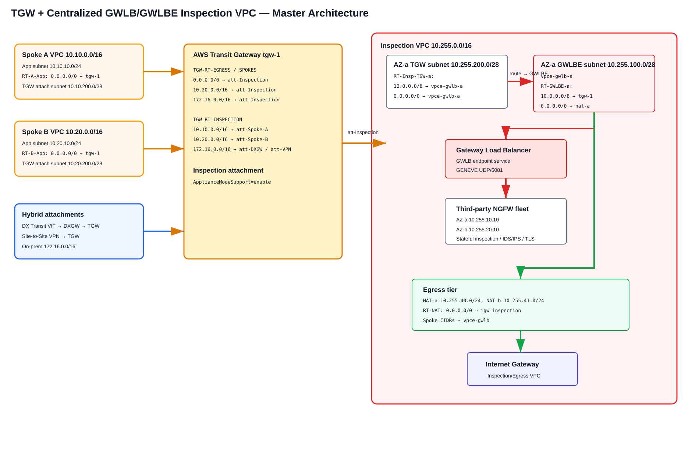
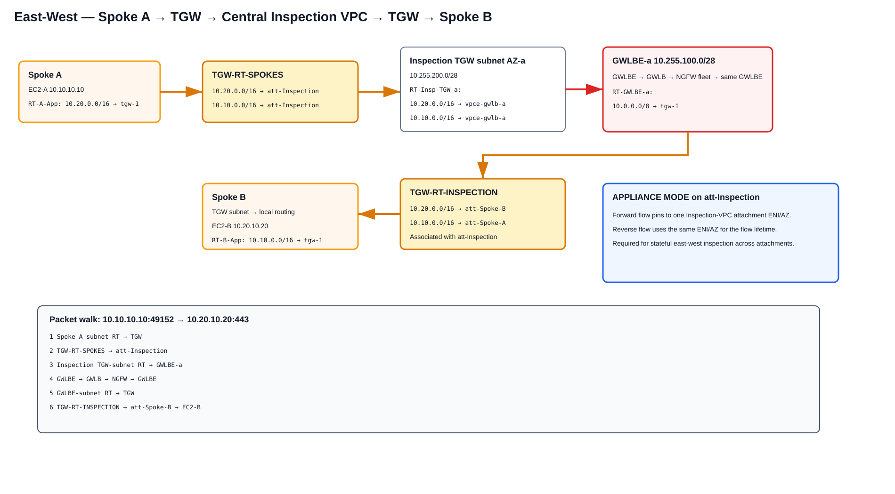
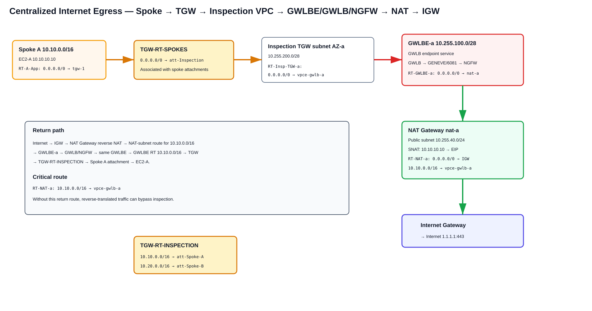
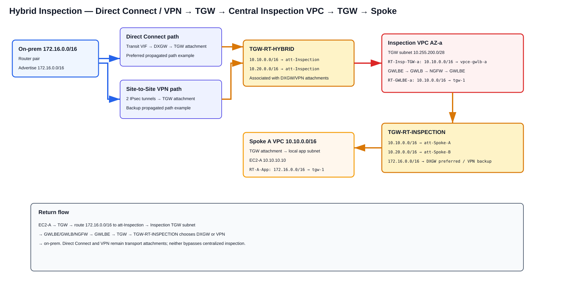

# AWS Transit Gateway + Centralized GWLB/GWLBE Inspection VPC — Deep Dive

> **Scope:** A centralized third-party firewall architecture using **AWS Transit Gateway (TGW)**, a dedicated **Inspection VPC**, **Gateway Load Balancer Endpoint (GWLBE)**, **Gateway Load Balancer (GWLB)**, and a horizontally scalable third-party NGFW/NVA fleet. This guide focuses on exact route-table relationships, Appliance Mode, east-west inspection, centralized Internet egress, Direct Connect Transit VIF/DXGW, Site-to-Site VPN, return-path symmetry, failure handling, configuration, verification, limitations, and troubleshooting.
>
> **Source information** = behavior documented by AWS.  
> **Additional explanation** = standard networking explanation derived from AWS forwarding behavior.  
> **Reasonable inference** = a design conclusion that follows from the documented behavior but is not itself an AWS guarantee.

---

## URLs reviewed

- https://docs.aws.amazon.com/reference-architecture-diagrams/latest/gwlb-east-west-inspection/gwlb-east-west-chapter.html
- https://aws.amazon.com/blogs/networking-and-content-delivery/centralized-inspection-architecture-with-aws-gateway-load-balancer-and-aws-transit-gateway/
- https://aws.amazon.com/blogs/networking-and-content-delivery/best-practices-for-deploying-gateway-load-balancer/
- https://docs.aws.amazon.com/vpc/latest/tgw/how-transit-gateways-work.html
- https://docs.aws.amazon.com/whitepapers/latest/building-scalable-secure-multi-vpc-network-infrastructure/using-gwlb-with-tg-for-cns.html
- https://docs.aws.amazon.com/prescriptive-guidance/latest/integrate-third-party-services/architecture-3.html
- https://docs.aws.amazon.com/prescriptive-guidance/latest/inline-traffic-inspection-third-party-appliances/introduction.html
- https://aws.amazon.com/blogs/networking-and-content-delivery/introducing-aws-gateway-load-balancer-supported-architecture-patterns/
- https://aws.amazon.com/blogs/publicsector/simplify-firewall-deployments-using-centralized-inspection-architecture-with-gateway-load-balancer/
- https://docs.aws.amazon.com/directconnect/latest/UserGuide/direct-connect-transit-gateways.html
- https://docs.aws.amazon.com/directconnect/latest/UserGuide/associate-tgw-with-direct-connect-gateway.html
- https://docs.aws.amazon.com/vpn/latest/s2svpn/create-tgw-cli-api.html

---

# 1. What this architecture is

This is the **centralized TGW inspection-VPC pattern**.

Traffic requiring inspection is deliberately routed through a dedicated VPC attachment:

```text
Source VPC / DX / VPN
        ↓
AWS Transit Gateway
        ↓
TGW route table selects Inspection VPC attachment
        ↓
Inspection-VPC TGW attachment subnet
        ↓
VPC route table selects GWLBE
        ↓
GWLBE → GWLB → third-party NGFW fleet
        ↓
GWLBE returns allowed packet to Inspection VPC
        ↓
Inspection-VPC route table sends packet back to TGW
        ↓
TGW route table associated with Inspection attachment
        ↓
Destination VPC / DX / VPN / egress tier
```

This is fundamentally different from the distributed-GWLBE model where each workload VPC owns its own GWLBE.

## 1.1 Component roles

| Component | Role |
|---|---|
| Spoke VPC route table | Sends traffic requiring inspection to TGW |
| TGW spoke-side route table | Forces traffic to the Inspection VPC attachment |
| Inspection VPC TGW attachment | Entry/exit point between TGW and inspection VPC |
| TGW Appliance Mode | Preserves stateful-flow AZ symmetry through the Inspection VPC |
| Inspection TGW-subnet route table | Sends packets to the zonal GWLBE |
| GWLBE | Route-table next hop into the GWLB endpoint service |
| GWLB | Flow-aware distribution to healthy third-party appliances |
| NGFW/NVA | Stateful inspection and vendor security services |
| GWLBE-subnet route table | Sends post-inspection traffic either back to TGW or toward NAT/IGW |
| TGW inspection-side route table | Sends allowed traffic to final spoke/hybrid attachment |
| NAT Gateway | Performs centralized Internet SNAT after inspection when used |

**Source information:** AWS continues to document TGW + GWLB/GWLBE as a centralized east-west and north-south inspection architecture. Appliance Mode is specifically documented for stateful inspection VPC attachments.

---

# 2. Reference topology and address plan



[Editable draw.io source](images/09-06-26-15-45_tgw_centralized_gwlb_master.drawio)

**What this image shows:** Two spoke VPCs, hybrid DX/VPN attachments, TGW route-table separation, and a multi-AZ Inspection VPC containing TGW attachment subnets, GWLBE subnets, GWLB, NGFWs, NAT Gateways, and an IGW.

**What matters:** TGW decides **which attachment** receives the packet. The VPC route table inside the Inspection VPC decides **which GWLBE** receives the packet. GWLBE/GWLB then performs service insertion.

**What to verify:** Route-table association is as important as the route itself. A correct route in the wrong TGW route table or VPC subnet route table does nothing.

Reference CIDRs:

| Function | CIDR |
|---|---|
| Spoke A VPC | `10.10.0.0/16` |
| Spoke A app subnet | `10.10.10.0/24` |
| Spoke B VPC | `10.20.0.0/16` |
| Spoke B app subnet | `10.20.10.0/24` |
| Inspection VPC | `10.255.0.0/16` |
| Inspection TGW subnet AZ-a | `10.255.200.0/28` |
| Inspection TGW subnet AZ-b | `10.255.200.16/28` |
| GWLBE subnet AZ-a | `10.255.100.0/28` |
| GWLBE subnet AZ-b | `10.255.100.16/28` |
| NGFW subnet AZ-a | `10.255.10.0/24` |
| NGFW subnet AZ-b | `10.255.20.0/24` |
| NAT subnet AZ-a | `10.255.40.0/24` |
| NAT subnet AZ-b | `10.255.41.0/24` |
| On-premises | `172.16.0.0/16` |

---

# 3. The TGW route-table split is the heart of the design

A single TGW route table is usually insufficient because you need two different routing perspectives:

1. **Traffic arriving from spokes/hybrid attachments must be forced to inspection.**
2. **Traffic returning from the Inspection VPC must be allowed to reach final destinations directly.**

A common model is:

## 3.1 `TGW-RT-SPOKES`

Associate workload VPC attachments here.

```text
Destination        Target
0.0.0.0/0          att-Inspection
10.20.0.0/16       att-Inspection
10.10.0.0/16       att-Inspection
172.16.0.0/16      att-Inspection
```

You do not normally propagate the other spoke attachments directly into this table if your requirement is mandatory east-west inspection; otherwise TGW could select the destination spoke directly and bypass the Inspection VPC.

## 3.2 `TGW-RT-HYBRID`

Associate DXGW and VPN attachments here when inbound on-premises traffic must also be inspected.

```text
Destination        Target
10.10.0.0/16       att-Inspection
10.20.0.0/16       att-Inspection
```

## 3.3 `TGW-RT-INSPECTION`

Associate the Inspection VPC attachment here.

```text
Destination        Target
10.10.0.0/16       att-Spoke-A
10.20.0.0/16       att-Spoke-B
172.16.0.0/16      att-DXGW   # preferred example
172.16.0.0/16      att-VPN    # backup propagated path after preferred withdrawal
```

This is the route table that decides where **post-inspection** traffic goes.

---

# 4. Appliance Mode — why it is required for east-west stateful inspection

**Source information:** AWS states that the Inspection/Appliance VPC attachment must use Appliance Mode for stateful east-west inspection when bidirectional traffic traverses the centralized VPC. Without Appliance Mode, TGW normally preserves source-AZ affinity across attachments, which can cause the two directions of a flow to enter the Inspection VPC through different AZs.

That is dangerous for a stateful firewall because:

```text
Forward:
Spoke A AZ-a → TGW → Inspection attachment ENI AZ-a → GWLBE-a → Firewall session

Return without appliance mode:
Spoke B AZ-b → TGW → Inspection attachment ENI AZ-b → GWLBE-b → different firewall/session context
```

With Appliance Mode enabled:

```text
Forward and reverse flow
        ↓
same Inspection-VPC attachment ENI / AZ for the lifetime of the flow
        ↓
same zonal GWLBE service chain
        ↓
stateful inspection symmetry
```

## 4.1 Enable Appliance Mode

```cli
aws ec2 modify-transit-gateway-vpc-attachment \
  --transit-gateway-attachment-id tgw-attach-INSPECTION \
  --options ApplianceModeSupport=enable
```

## 4.2 Verify

```cli
aws ec2 describe-transit-gateway-vpc-attachments \
  --transit-gateway-attachment-ids tgw-attach-INSPECTION \
  --query 'TransitGatewayVpcAttachments[0].Options.ApplianceModeSupport' \
  --output text
```

**Expected state:** `enable`.

**Failure indicator:** `disable` or the wrong attachment ID.

**Next action:** Enable Appliance Mode on the actual Inspection VPC attachment, not the spoke attachment.

## 4.3 Important AWS caveat

AWS documents that Appliance Mode flow stickiness is guaranteed when the source and destination traffic are both arriving at the centralized inspection VPC from the same TGW context. AWS warns that traffic can drop when one side enters the centralized VPC through a different gateway such as an Internet Gateway and the other direction exits through TGW.

Therefore do not assume that **Internet ingress through an IGW into the same Inspection VPC** automatically has the same symmetry guarantees as spoke-to-spoke traffic.

---

# 5. East-west VPC-to-VPC inspection



[Editable draw.io source](images/09-06-26-15-45_tgw_centralized_gwlb_east_west.drawio)

**What this image shows:** Spoke A does not invoke a local GWLBE. It sends traffic to TGW. TGW deliberately sends the flow into the Inspection VPC attachment, where a VPC route sends it to GWLBE/GWLB/NGFW. The allowed packet goes back to TGW and then to Spoke B.

**What matters:** The packet traverses TGW twice in the forward direction: once before inspection and once after inspection.

**What to verify:** `TGW-RT-SPOKES` must send the destination to `att-Inspection`, while `TGW-RT-INSPECTION` must send it to the actual destination spoke.

Example flow:

```text
10.10.10.10:49152 → 10.20.10.20:443
```

## 5.1 Forward path

1. EC2-A sends the packet toward `10.20.10.20`.
2. Spoke A app-subnet route table matches `10.20.0.0/16 → tgw-1`.
3. The packet enters the Spoke-A TGW attachment.
4. `TGW-RT-SPOKES` matches `10.20.0.0/16 → att-Inspection`.
5. TGW selects the Inspection VPC attachment and, with Appliance Mode, pins the flow to an Inspection attachment ENI/AZ.
6. Packet arrives in `10.255.200.0/28` or its AZ-b equivalent.
7. `RT-Insp-TGW-a` matches `10.20.0.0/16 → vpce-gwlb-a`.
8. GWLBE invokes the centralized GWLB endpoint service.
9. GWLB selects a healthy NGFW target and transports the original packet using GENEVE/UDP 6081.
10. NGFW evaluates security policy and returns an allowed packet to GWLB.
11. GWLB returns the packet through the same GWLBE service-chain context.
12. `RT-GWLBE-a` matches `10.20.0.0/16 → tgw-1`.
13. Packet re-enters TGW through `att-Inspection`.
14. `TGW-RT-INSPECTION` matches `10.20.0.0/16 → att-Spoke-B`.
15. TGW delivers the packet into Spoke B.
16. Spoke B local routing reaches `10.20.10.20`.

No SNAT is required for the transparent east-west path.

## 5.2 Return path

The return packet is:

```text
10.20.10.20:443 → 10.10.10.10:49152
```

Spoke B sends the packet to TGW. Its associated spoke TGW route table again sends the remote spoke CIDR to `att-Inspection`. Appliance Mode pins the return flow to the same inspection attachment ENI/AZ used in the forward direction. The Inspection VPC routes the packet through the same zonal service chain, then `TGW-RT-INSPECTION` sends it to `att-Spoke-A`.

That is the symmetry property the architecture depends on.

---

# 6. Inspection-VPC subnet route tables

The Inspection VPC normally separates at least three subnet roles per AZ:

1. TGW attachment subnet.
2. GWLBE/service-insertion subnet.
3. NAT/public egress subnet when centralized Internet egress is required.

## 6.1 TGW attachment subnet route table

Example AZ-a:

```text
RT-Insp-TGW-a
Destination        Target
10.10.0.0/16       vpce-gwlb-a
10.20.0.0/16       vpce-gwlb-a
172.16.0.0/16      vpce-gwlb-a
0.0.0.0/0          vpce-gwlb-a
10.255.0.0/16      local
```

The exact scope can be narrower than `0/0` if only selected traffic classes should be inspected.

## 6.2 GWLBE subnet route table

For a combined east-west/hybrid/egress design:

```text
RT-GWLBE-a
Destination        Target
10.10.0.0/16       tgw-1
10.20.0.0/16       tgw-1
172.16.0.0/16      tgw-1
0.0.0.0/0          nat-a
10.255.0.0/16      local
```

The most-specific route wins. Thus internal/hybrid destinations go back to TGW, while Internet traffic goes to NAT Gateway.

## 6.3 NAT public-subnet route table

```text
RT-NAT-a
Destination        Target
0.0.0.0/0          igw-inspection
10.10.0.0/16       vpce-gwlb-a
10.20.0.0/16       vpce-gwlb-a
10.255.0.0/16      local
```

The spoke-specific routes are the return-path enforcement routes after NAT performs reverse translation.

---

# 7. Centralized Internet egress — south to north



[Editable draw.io source](images/09-06-26-15-45_tgw_centralized_gwlb_egress.drawio)

**What this image shows:** A workload default route sends Internet traffic to TGW; TGW forces it to the Inspection VPC; the packet is inspected before NAT; NAT Gateway then performs SNAT and IGW provides Internet connectivity.

**What matters:** NAT occurs after inspection, so the firewall sees the original private workload address.

**What to verify:** The NAT subnet must contain return routes for spoke CIDRs pointing back to GWLBE. Otherwise reverse-NAT traffic can bypass the firewall.

Example flow:

```text
10.10.10.10:49152 → 1.1.1.1:443
```

Forward:

```text
EC2-A
 → RT-A-App 0/0 → TGW
 → TGW-RT-SPOKES 0/0 → att-Inspection
 → RT-Insp-TGW-a 0/0 → GWLBE-a
 → GWLB → NGFW
 → GWLBE-a
 → RT-GWLBE-a 0/0 → nat-a
 → NAT Gateway SNAT
 → RT-NAT-a 0/0 → IGW
 → Internet
```

At the NGFW before NAT:

```text
10.10.10.10:49152 → 1.1.1.1:443
```

After NAT Gateway:

```text
EIP:mapped-port → 1.1.1.1:443
```

Return:

```text
Internet
 → IGW
 → NAT Gateway reverse translation to 10.10.10.10
 → RT-NAT-a 10.10.0.0/16 → GWLBE-a
 → GWLB/NGFW
 → GWLBE-a
 → RT-GWLBE-a 10.10.0.0/16 → TGW
 → TGW-RT-INSPECTION → att-Spoke-A
 → EC2-A
```

For a dedicated egress-only Inspection VPC, AWS notes Appliance Mode can be optional because the architecture is not necessarily routing between two TGW VPC attachments. But if the same Inspection VPC also handles east-west stateful inspection, enable Appliance Mode.

---

# 8. Hybrid Direct Connect inspection



[Editable draw.io source](images/09-06-26-15-45_tgw_centralized_gwlb_hybrid.drawio)

**What this image shows:** Direct Connect and Site-to-Site VPN terminate as TGW-side attachments. Their TGW-associated route table forces AWS-destination traffic through the central Inspection VPC before it reaches a spoke.

**What matters:** A Transit VIF is not the inspection point. The chain is Transit VIF → Direct Connect Gateway → TGW → Inspection VPC.

## 8.1 DX control-plane chain

```text
On-prem router
   ↓ eBGP
Direct Connect Transit VIF
   ↓
Direct Connect Gateway
   ↓ association / allowed prefixes
Transit Gateway DXGW attachment
   ↓
TGW-RT-HYBRID
   ↓
att-Inspection
```

## 8.2 Inbound on-premises to Spoke A

Example:

```text
172.16.50.25:50000 → 10.10.10.10:443
```

1. On-premises router selects the AWS route over the Transit VIF.
2. Transit VIF delivers the route/traffic through DXGW to TGW.
3. `TGW-RT-HYBRID` matches `10.10.0.0/16 → att-Inspection`.
4. Packet enters the Inspection VPC TGW subnet.
5. Inspection subnet route sends `10.10.0.0/16` to GWLBE.
6. GWLB/NGFW inspects the original tuple.
7. GWLBE returns allowed packet.
8. GWLBE subnet route sends `10.10.0.0/16 → TGW`.
9. `TGW-RT-INSPECTION` sends `10.10.0.0/16 → att-Spoke-A`.
10. Spoke A local route reaches the workload.

## 8.3 Return from Spoke A to on-premises

Spoke-A routing sends `172.16.0.0/16` to TGW. `TGW-RT-SPOKES` or a dedicated spoke/hybrid inspection table sends `172.16.0.0/16 → att-Inspection`. The Inspection VPC again invokes GWLBE/GWLB/NGFW. The post-inspection TGW route selects the DXGW attachment.

No SNAT is required simply to make the routed hybrid path function.

---

# 9. Site-to-Site VPN inspection and DX backup

A TGW-terminated Site-to-Site VPN can use the same centralized inspection chain.

```text
On-prem CGW
 ⇅ IPsec/BGP
VPN attachment
 ↓
TGW-RT-HYBRID
 ↓
att-Inspection
 ↓
GWLBE/GWLB/NGFW
 ↓
TGW-RT-INSPECTION
 ↓
Spoke
```

For a DX-primary/VPN-backup design, make sure the same on-premises prefixes are learned appropriately and do not accidentally override the intended preference with static TGW routes.

A static TGW route can outrank propagated routes for the same prefix, so a manually configured static VPN route can defeat an expected DX-preferred design.

---

# 10. Internet ingress — treat separately from east-west

Do not assume the centralized egress/east-west pattern automatically translates into safe centralized Internet ingress.

A common Internet ingress architecture can use a public-facing load balancer or ingress tier in the Inspection VPC, but stateful symmetry must be evaluated separately because AWS explicitly warns that Appliance Mode stickiness guarantees do not cover every case where one side enters the centralized VPC through another gateway such as an IGW and the other side reaches TGW.

For public application ingress, choose a documented pattern such as:

- Public ALB/NLB with a supported firewall insertion design.
- Internet ingress routing to GWLBE in the application VPC.
- A dedicated ingress VPC pattern validated for the vendor appliance.
- An ELB/firewall sandwich where the firewall acts as a routed/proxy tier.

Do not simply reuse the east-west TGW Appliance Mode assumptions.

---

# 11. GWLB and GWLBE configuration — AWS CLI

## 11.1 Create the GENEVE target group

```cli
aws elbv2 create-target-group \
  --name ngfw-geneve-tg \
  --protocol GENEVE \
  --port 6081 \
  --vpc-id vpc-INSPECTION \
  --target-type instance
```

## 11.2 Register supported NGFW instances

```cli
aws elbv2 register-targets \
  --target-group-arn arn:aws:elasticloadbalancing:REGION:ACCOUNT:targetgroup/ngfw-geneve-tg/ID \
  --targets Id=i-FIREWALL-A Id=i-FIREWALL-B
```

## 11.3 Create GWLB

```cli
aws elbv2 create-load-balancer \
  --name centralized-ngfw-gwlb \
  --type gateway \
  --subnets subnet-NGFW-A subnet-NGFW-B
```

## 11.4 Create listener

```cli
aws elbv2 create-listener \
  --load-balancer-arn arn:aws:elasticloadbalancing:REGION:ACCOUNT:loadbalancer/gwy/centralized-ngfw-gwlb/ID \
  --default-actions Type=forward,TargetGroupArn=arn:aws:elasticloadbalancing:REGION:ACCOUNT:targetgroup/ngfw-geneve-tg/ID
```

## 11.5 Create endpoint service

```cli
aws ec2 create-vpc-endpoint-service-configuration \
  --gateway-load-balancer-arns arn:aws:elasticloadbalancing:REGION:ACCOUNT:loadbalancer/gwy/centralized-ngfw-gwlb/ID \
  --no-acceptance-required
```

## 11.6 Create zonal GWLBE

```cli
aws ec2 create-vpc-endpoint \
  --vpc-endpoint-type GatewayLoadBalancer \
  --service-name com.amazonaws.vpce.REGION.vpce-svc-SERVICE \
  --vpc-id vpc-INSPECTION \
  --subnet-ids subnet-GWLBE-A
```

Repeat for each AZ used by the TGW inspection attachment.

---

# 12. Route programming examples

## 12.1 Spoke A to TGW

```cli
aws ec2 create-route \
  --route-table-id rtb-SPOKEA-APP \
  --destination-cidr-block 10.20.0.0/16 \
  --transit-gateway-id tgw-1
```

For centralized egress:

```cli
aws ec2 create-route \
  --route-table-id rtb-SPOKEA-APP \
  --destination-cidr-block 0.0.0.0/0 \
  --transit-gateway-id tgw-1
```

## 12.2 Inspection TGW subnet to GWLBE

```cli
aws ec2 create-route \
  --route-table-id rtb-INSP-TGW-A \
  --destination-cidr-block 10.20.0.0/16 \
  --vpc-endpoint-id vpce-GWLBE-A
```

## 12.3 Post-inspection GWLBE route back to TGW

```cli
aws ec2 create-route \
  --route-table-id rtb-GWLBE-A \
  --destination-cidr-block 10.20.0.0/16 \
  --transit-gateway-id tgw-1
```

## 12.4 Internet path from GWLBE to NAT

```cli
aws ec2 create-route \
  --route-table-id rtb-GWLBE-A \
  --destination-cidr-block 0.0.0.0/0 \
  --nat-gateway-id nat-AAAAAAAA
```

## 12.5 NAT return to GWLBE

```cli
aws ec2 create-route \
  --route-table-id rtb-NAT-A \
  --destination-cidr-block 10.10.0.0/16 \
  --vpc-endpoint-id vpce-GWLBE-A
```

---

# 13. Verification workflow

## 13.1 Verify TGW attachment Appliance Mode

```cli
aws ec2 describe-transit-gateway-vpc-attachments \
  --transit-gateway-attachment-ids tgw-attach-INSPECTION \
  --output json
```

**Expected state:** `Options.ApplianceModeSupport` is `enable`.

**Failure means:** East-west stateful symmetry is not guaranteed by TGW.

**Next action:** Enable Appliance Mode on the Inspection VPC attachment.

## 13.2 Verify TGW spoke route table

```cli
aws ec2 search-transit-gateway-routes \
  --transit-gateway-route-table-id tgw-rtb-SPOKES \
  --filters Name=route-search.exact-match,Values=10.20.0.0/16 \
  --output json
```

**Expected state:** target attachment is `att-Inspection`, not `att-Spoke-B`.

**Failure means:** Traffic can bypass centralized inspection.

## 13.3 Verify TGW inspection route table

```cli
aws ec2 search-transit-gateway-routes \
  --transit-gateway-route-table-id tgw-rtb-INSPECTION \
  --filters Name=route-search.exact-match,Values=10.20.0.0/16 \
  --output json
```

**Expected state:** target attachment is `att-Spoke-B`.

## 13.4 Verify route-table associations

```cli
aws ec2 get-transit-gateway-route-table-associations \
  --transit-gateway-route-table-id tgw-rtb-SPOKES \
  --output table
```

**Expected:** spoke attachments are associated here.

```cli
aws ec2 get-transit-gateway-route-table-associations \
  --transit-gateway-route-table-id tgw-rtb-INSPECTION \
  --output table
```

**Expected:** Inspection VPC attachment is associated here.

## 13.5 Verify VPC subnet route tables

```cli
aws ec2 describe-route-tables \
  --route-table-ids rtb-INSP-TGW-A rtb-GWLBE-A rtb-NAT-A \
  --output json
```

Success criteria for east-west:

```text
RT-Insp-TGW-a: 10.20.0.0/16 → vpce-GWLBE-A
RT-GWLBE-a:    10.20.0.0/16 → tgw-1
```

Success criteria for egress:

```text
RT-Insp-TGW-a: 0.0.0.0/0 → vpce-GWLBE-A
RT-GWLBE-a:    0.0.0.0/0 → nat-A
RT-NAT-a:      10.10.0.0/16 → vpce-GWLBE-A
RT-NAT-a:      0.0.0.0/0 → igw-Inspection
```

## 13.6 Verify GWLBE

```cli
aws ec2 describe-vpc-endpoints \
  --vpc-endpoint-ids vpce-GWLBE-A \
  --query 'VpcEndpoints[0].[VpcEndpointType,State,SubnetIds,ServiceName]' \
  --output table
```

**Expected:** type `GatewayLoadBalancer`, state `available`, correct AZ-specific subnet.

## 13.7 Verify GWLB target health

```cli
aws elbv2 describe-target-health \
  --target-group-arn arn:aws:elasticloadbalancing:REGION:ACCOUNT:targetgroup/ngfw-geneve-tg/ID \
  --output table
```

**Expected:** intended firewall instances report healthy.

**Failure means:** Check vendor bootstrap, health-check support, GENEVE processing, interface state, licensing, or security controls.

---

# 14. High availability and AZ behavior

## 14.1 One GWLBE per inspection AZ

GWLBE is zonal. Deploy an endpoint in each AZ where the TGW inspection attachment can deliver traffic.

Keep the path AZ-local under normal conditions:

```text
TGW attachment ENI AZ-a
 → GWLBE-a
 → GWLB target in/for AZ-a
```

## 14.2 GWLB target health

GWLB sends new flows to healthy targets according to its configured behavior. Existing sessions during appliance failure depend on the firewall vendor's state synchronization and failover implementation; do not assume state migrates automatically.

## 14.3 Cross-zone load balancing

GWLB cross-zone behavior changes which appliances can receive a flow. Validate the setting against vendor guidance, expected AZ affinity, cost, and failure behavior.

## 14.4 Exactly one TGW for guaranteed appliance-mode stickiness

AWS warns that multiple TGWs attached to the same appliance VPC do not share flow state, so Appliance Mode cannot guarantee a common flow choice across independent TGWs.

---

# 15. Route propagation and bypass risks

The most dangerous failures are often route-policy failures rather than firewall failures.

## Bypass risk 1 — spoke route table points directly to destination

If Spoke A has direct VPC peering or another route that is more specific than the TGW route, centralized inspection can be bypassed.

## Bypass risk 2 — `TGW-RT-SPOKES` learns direct spoke routes

If `10.20.0.0/16 → att-Spoke-B` becomes active in the spoke-associated route table, east-west traffic can bypass `att-Inspection`.

## Bypass risk 3 — hybrid attachment propagates directly into spoke route table

If on-premises prefixes are propagated directly into the same TGW table used by spokes and the route points to DXGW/VPN instead of Inspection, outbound hybrid traffic can bypass the firewall.

## Bypass risk 4 — post-inspection table sends back to Inspection

A route loop occurs if `TGW-RT-INSPECTION` points the destination back to `att-Inspection` instead of the final destination attachment.

---

# 16. Common mistakes

1. **Enabling Appliance Mode on the wrong VPC attachment.** It belongs on the centralized Inspection VPC attachment.
2. **Using one TGW route table for every attachment.** This often destroys the pre-inspection/post-inspection routing separation.
3. **Pointing spokes directly at GWLBE.** That is the distributed model, not this centralized pattern.
4. **Forgetting the second TGW traversal.** East-west allowed traffic goes Inspection VPC → TGW → destination after firewall processing.
5. **Assuming GWLB itself is a route target from TGW.** TGW targets the Inspection VPC attachment; the VPC subnet route then targets GWLBE.
6. **Forgetting NAT return routes.** Reverse-translated Internet traffic must be sent back through GWLBE before TGW.
7. **Assuming Transit VIF or VPN provides inspection.** They only deliver traffic to TGW; TGW route policy performs service steering.
8. **Assuming Appliance Mode fixes every asymmetry.** AWS documents boundaries to its flow-stickiness guarantee, especially when another gateway such as IGW participates in the centralized VPC path.
9. **Using unsupported firewall images behind GWLB.** The appliance must support the AWS GWLB/GENEVE integration.
10. **Ignoring overlapping CIDRs.** TGW and VPC routing cannot transparently solve overlapping address space without additional NAT/design mechanisms.

---

# 17. Troubleshooting by symptom

## Symptom: Spoke A reaches Spoke B but firewall logs show nothing

**Where:** `TGW-RT-SPOKES`.  
**Command:** `search-transit-gateway-routes`.  
**What it tests:** Whether the destination is steered to `att-Inspection`.  
**Expected:** `10.20.0.0/16 → att-Inspection`.  
**Failure means:** TGW is bypassing inspection.  
**Next action:** Remove/disable direct propagation and install the intended inspection route.

## Symptom: Firewall sees SYN but not SYN/ACK

**Where:** Appliance Mode and reverse TGW route path.  
**What it tests:** Stateful symmetry.  
**Expected:** Inspection attachment Appliance Mode enabled; return destination is also forced to Inspection from the destination spoke.  
**Failure means:** Reverse flow may be entering another AZ/GWLBE or bypassing the Inspection VPC.  
**Next action:** Fix attachment mode and TGW route-table associations.

## Symptom: Packet reaches Inspection VPC but not firewall

**Where:** Inspection TGW attachment subnet route table.  
**Expected:** destination CIDR or `0/0 → vpce-gwlb-A/B`.  
**Failure means:** VPC local/default routing is bypassing service insertion.  
**Next action:** Correct the subnet route and verify the endpoint ID/AZ.

## Symptom: Firewall allows traffic but destination never receives it

**Where:** GWLBE subnet route table and `TGW-RT-INSPECTION`.  
**Expected:** internal destination → TGW; TGW inspection table → final attachment.  
**Failure means:** post-inspection routing is missing or looping.  
**Next action:** Verify both layers independently.

## Symptom: Internet egress works outbound but return fails

**Where:** NAT public-subnet route table.  
**Expected:** spoke CIDR → GWLBE.  
**Failure means:** reverse-NAT traffic may use VPC local routing and bypass the NGFW.  
**Next action:** Add/repair the spoke-specific GWLBE route.

## Symptom: DX traffic reaches TGW but bypasses firewall

**Where:** TGW route table associated with DXGW attachment.  
**Expected:** AWS spoke CIDRs → `att-Inspection`.  
**Failure means:** hybrid routes are pointing directly to spokes.  
**Next action:** Associate DXGW attachment with the hybrid inspection route table and remove conflicting direct propagation.

---

# 18. When to use this architecture

Use centralized TGW + GWLB/GWLBE inspection when:

- Many VPCs need the same third-party NGFW policy.
- You want one centrally operated firewall fleet.
- East-west inspection is a major requirement.
- Direct Connect and VPN traffic also require centralized enforcement.
- Centralized Internet egress is desired.
- You want GWLB to handle appliance-scale-out and transparent service insertion.

Consider distributed GWLBE instead when the insertion point should live inside each workload/edge VPC and you want to avoid routing every protected flow through a centralized TGW Inspection VPC.

AWS also now documents VPC Route Server/BGP-based centralized inspection alternatives for appliances that do not support GENEVE or when active/standby and BGP path control are required. AWS explicitly continues to recommend GWLB as the first-choice HA mechanism for supported inspection appliances in many cases.

---

# 19. Final packet-flow comparison

| Traffic class | First route decision | TGW pre-inspection route | Inspection VPC route | Post-inspection next hop | Final TGW route |
|---|---|---|---|---|---|
| Spoke A → Spoke B | Spoke A RT → TGW | `10.20/16 → att-Inspection` | `10.20/16 → GWLBE` | GWLBE RT → TGW | `10.20/16 → att-Spoke-B` |
| Spoke A → Internet | Spoke A `0/0 → TGW` | `0/0 → att-Inspection` | `0/0 → GWLBE` | `0/0 → NAT` | Return: spoke CIDR → spoke attachment |
| On-prem DX → Spoke A | TGW hybrid table | `10.10/16 → att-Inspection` | `10.10/16 → GWLBE` | GWLBE RT → TGW | `10.10/16 → att-Spoke-A` |
| Spoke A → on-prem DX | Spoke A → TGW | `172.16/16 → att-Inspection` | `172.16/16 → GWLBE` | GWLBE RT → TGW | `172.16/16 → att-DXGW` |
| On-prem VPN → Spoke A | TGW hybrid table | `10.10/16 → att-Inspection` | `10.10/16 → GWLBE` | GWLBE RT → TGW | `10.10/16 → att-Spoke-A` |

---

# Sources

- AWS Architecture Center — Gateway Load Balancer East/West Inspection: https://docs.aws.amazon.com/reference-architecture-diagrams/latest/gwlb-east-west-inspection/gwlb-east-west-chapter.html
- AWS Networking Blog — Centralized inspection architecture with AWS Gateway Load Balancer and AWS Transit Gateway: https://aws.amazon.com/blogs/networking-and-content-delivery/centralized-inspection-architecture-with-aws-gateway-load-balancer-and-aws-transit-gateway/
- AWS Networking Blog — Best practices for deploying Gateway Load Balancer: https://aws.amazon.com/blogs/networking-and-content-delivery/best-practices-for-deploying-gateway-load-balancer/
- AWS Transit Gateway — How AWS Transit Gateway works / appliance mode: https://docs.aws.amazon.com/vpc/latest/tgw/how-transit-gateways-work.html
- AWS Whitepaper — Using Gateway Load Balancer with Transit Gateway for centralized network security: https://docs.aws.amazon.com/whitepapers/latest/building-scalable-secure-multi-vpc-network-infrastructure/using-gwlb-with-tg-for-cns.html
- AWS Prescriptive Guidance — Architecture 3: AWS Transit Gateway: https://docs.aws.amazon.com/prescriptive-guidance/latest/integrate-third-party-services/architecture-3.html
- AWS Prescriptive Guidance — Implementing inline traffic inspection using third-party security appliances: https://docs.aws.amazon.com/prescriptive-guidance/latest/inline-traffic-inspection-third-party-appliances/introduction.html
- AWS Networking Blog — Introducing AWS Gateway Load Balancer: Supported architecture patterns: https://aws.amazon.com/blogs/networking-and-content-delivery/introducing-aws-gateway-load-balancer-supported-architecture-patterns/
- AWS Direct Connect — Direct Connect gateways and Transit Gateway: https://docs.aws.amazon.com/directconnect/latest/UserGuide/direct-connect-transit-gateways.html
- AWS Site-to-Site VPN — TGW VPN creation: https://docs.aws.amazon.com/vpn/latest/s2svpn/create-tgw-cli-api.html
