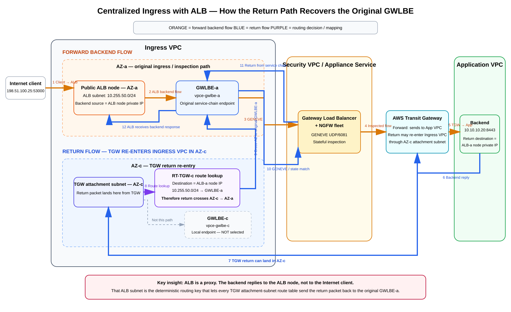
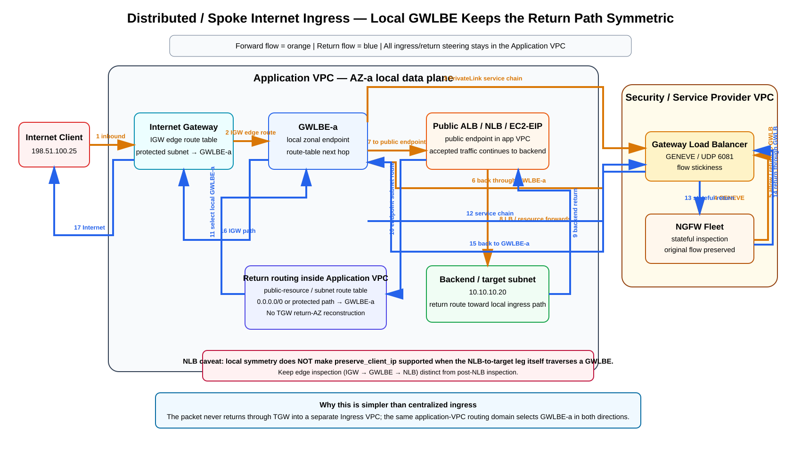

# Caveats for Centralized Ingress Routing — ALB, NLB, GWLB/GWLBE, TGW, and Distributed Alternatives

> **Scope:** This guide focuses on the design caveats that appear when Internet ingress is centralized through an Ingress VPC and AWS Transit Gateway (TGW), especially when Gateway Load Balancer Endpoints (GWLBE) and third-party stateful firewalls are inserted in the path. It explains why the Experian ALB pattern can recover the original GWLBE on the return path, why the same mechanism does not translate to a Network Load Balancer (NLB) with preserved client source IP, and why distributed/spoke ingress avoids the specific TGW return-AZ recovery problem.
>
> **Source information** = behavior documented by AWS.  
> **Additional explanation** = packet/routing interpretation derived from the documented behavior.  
> **Reasonable inference** = design conclusions that follow from those facts but are not themselves AWS guarantees.

---

## Key references and case studies

- [Experian: Centralized internet ingress using AWS Gateway Load Balancer and AWS Transit Gateway](https://aws.amazon.com/blogs/networking-and-content-delivery/experian-centralized-internet-ingress-using-aws-gateway-load-balancer-and-aws-transit-gateway/)
- [Design your firewall deployment for Internet ingress traffic flows](https://aws.amazon.com/blogs/networking-and-content-delivery/design-your-firewall-deployment-for-internet-ingress-traffic-flows/)
- [VPC Routing Enhancements and GWLB Deployment Patterns](https://aws.amazon.com/blogs/networking-and-content-delivery/vpc-routing-enhancements-and-gwlb-deployment-patterns/)
- [Introducing AWS Gateway Load Balancer: Supported architecture patterns](https://aws.amazon.com/blogs/networking-and-content-delivery/introducing-aws-gateway-load-balancer-supported-architecture-patterns/)
- [Edit target group attributes for your Network Load Balancer — client IP preservation restrictions](https://docs.aws.amazon.com/elasticloadbalancing/latest/network/edit-target-group-attributes.html)
- [Access an inspection system using a Gateway Load Balancer endpoint](https://docs.aws.amazon.com/vpc/latest/privatelink/gateway-load-balancer-endpoints.html)
- [AWS Network Firewall deployment models with VPC routing enhancements](https://aws.amazon.com/blogs/networking-and-content-delivery/deployment-models-for-aws-network-firewall-with-vpc-routing-enhancements/)
- [Centralized ingress inspection architecture in AWS Cloud WAN](https://aws.amazon.com/blogs/networking-and-content-delivery/centralized-ingress-inspection-architecture-in-aws-cloud-wan/)
- [ALB X-Forwarded headers](https://docs.aws.amazon.com/elasticloadbalancing/latest/application/x-forwarded-headers.html)

---

# 1. The central idea

There are two fundamentally different Internet-ingress data-plane models:

## 1.1 Centralized ingress

```text
Internet
  ↓
Ingress VPC
  ↓
public ALB/NLB or reverse proxy
  ↓
GWLBE → GWLB → stateful NGFW
  ↓
TGW
  ↓
Application VPC
```

The critical caveat is the **return path**. The backend returns through TGW into the centralized Ingress VPC, and TGW might deliver that flow into a different Availability Zone than the forward flow originally used. If GWLB state requires the return packet to re-enter the same GWLBE, the Ingress VPC must reconstruct that choice with routing.

## 1.2 Distributed / spoke ingress

```text
Internet
  ↓
IGW in application VPC
  ↓
local GWLBE
  ↓
central GWLB + NGFW service
  ↓
local public ALB/NLB/resource
  ↓
backend
```

The return remains inside the same application VPC routing domain and is forced back through the local GWLBE before it exits through the IGW. There is no TGW return into a centralized Ingress VPC, so the **Experian-specific “which GWLBE did this flow originate from?” recovery problem disappears**.

However, this does **not** mean every NLB/client-IP-preservation combination is supported. AWS separately documents that NLB client IP preservation is unsupported when the NLB-to-target flow traverses a GWLBE.

---

# 2. Why the Experian ALB pattern works

AWS’s Experian case study uses a centralized Ingress VPC with public ALBs, GWLBE/GWLB, third-party firewalls, and TGW. The key to the return-path design is that the ALB is a **proxy**.

The Internet-side connection terminates at the ALB:

```text
198.51.100.25:53000 → ALB-public:443
```

The ALB then creates a new backend connection:

```text
ALB-node-private-IP:ephemeral → 10.10.10.20:8443
```

Therefore the application backend does **not** return directly to the original Internet client. It returns to an ALB node address.

That fact gives the Ingress-VPC TGW attachment route table a deterministic destination prefix that can be mapped back to the GWLBE used on the forward path.



[Editable draw.io source](images/09-06-26-16-23_centralized_ingress_alb_symmetry.drawio)

**What this image shows:** The forward backend flow starts at ALB-a and enters GWLBE-a. The backend return can arrive from TGW into a different Ingress-VPC TGW subnet such as AZ-c. The AZ-c subnet route table still points the ALB-a subnet prefix to GWLBE-a.

**What matters:** The route decision is based on the **destination ALB subnet**, not on the AZ in which the return packet happened to enter the VPC.

**What to verify:** Every TGW attachment subnet route table must contain the same ALB-subnet-to-originating-GWLBE mapping.

---

# 3. Exact Experian-style return-path logic

Assume:

```text
ALB-a subnet       10.255.50.0/24
ALB-b subnet       10.255.51.0/24
ALB-c subnet       10.255.52.0/24

GWLBE-a             vpce-gwlbe-a
GWLBE-b             vpce-gwlbe-b
GWLBE-c             vpce-gwlbe-c
```

Forward backend flow:

```text
ALB-a private IP
 → RT-ALB-a: 10.10.0.0/16 → GWLBE-a
 → GWLB / NGFW
 → GWLBE-a
 → TGW
 → backend 10.10.10.20
```

Suppose the backend return arrives through the TGW ENI in **AZ-c**:

```text
10.10.10.20 → ALB-a private IP
                 ↓
                TGW
                 ↓
       Ingress VPC TGW subnet AZ-c
```

The AZ-c TGW-subnet route table is intentionally configured like this:

```text
RT-TGW-c
Destination          Target
10.255.50.0/24       GWLBE-a
10.255.51.0/24       GWLBE-b
10.255.52.0/24       GWLBE-c
```

The destination belongs to `10.255.50.0/24`, so the packet is sent **cross-AZ to GWLBE-a** even though it entered the VPC in AZ-c.

The same mapping must exist in every TGW attachment subnet route table:

| TGW return subnet | ALB-a destination | ALB-b destination | ALB-c destination |
|---|---|---|---|
| AZ-a TGW subnet | `→ GWLBE-a` | `→ GWLBE-b` | `→ GWLBE-c` |
| AZ-b TGW subnet | `→ GWLBE-a` | `→ GWLBE-b` | `→ GWLBE-c` |
| AZ-c TGW subnet | `→ GWLBE-a` | `→ GWLBE-b` | `→ GWLBE-c` |

This is the core mechanism described in the [Experian case study](https://aws.amazon.com/blogs/networking-and-content-delivery/experian-centralized-internet-ingress-using-aws-gateway-load-balancer-and-aws-transit-gateway/).

---

# 4. Why the ALB makes this possible

The ALB gives the network an AZ-specific return destination:

```text
backend response destination = ALB node private IP
```

The ALB node belongs to a known ALB subnet. That subnet maps to the GWLBE that originated the backend-side service chain.

Conceptually:

```text
ALB-a source
   ↓
GWLBE-a
   ↓
backend
   ↓
return destination = ALB-a subnet
   ↓
route table can infer GWLBE-a
```

For HTTP/HTTPS, the original Internet client address is normally carried at Layer 7 in `X-Forwarded-For`. AWS documents this behavior in [ALB X-Forwarded headers](https://docs.aws.amazon.com/elasticloadbalancing/latest/application/x-forwarded-headers.html).

This is why the centralized ALB architecture has a clean routing key even when TGW re-enters the Ingress VPC in another AZ.

---

# 5. Why the same idea does not translate to NLB with preserved client IP

If an NLB preserves the original client IP, the backend flow retains the Internet client as the Layer-3 source.

Conceptually:

```text
Client 198.51.100.25
   ↓
NLB
   ↓
Backend sees source = 198.51.100.25
```

The backend therefore returns toward:

```text
10.10.10.20 → 198.51.100.25
```

That return destination does not encode which NLB AZ or GWLBE handled the forward path.

If a centralized Ingress VPC receives the return through TGW in AZ-c, a route such as:

```text
0.0.0.0/0 → GWLBE-c
```

cannot know that the forward path originally traversed GWLBE-a.

More importantly, AWS documents a stronger limitation: **NLB client IP preservation is not supported when targets are reached through a Transit Gateway, and it is not supported when a GWLBE inspects traffic between the NLB and its target.** See [NLB target-group attributes](https://docs.aws.amazon.com/elasticloadbalancing/latest/network/edit-target-group-attributes.html) and [GWLBE considerations](https://docs.aws.amazon.com/vpc/latest/privatelink/gateway-load-balancer-endpoints.html).

Therefore this pattern is not merely difficult to make symmetric:

```text
Internet
 → centralized NLB with preserve_client_ip=true
 → GWLBE
 → TGW
 → remote target VPC
```

It conflicts with documented NLB client-IP-preservation requirements.

---

# 6. Important correction: NLB with client IP preservation requires a direct target path

AWS currently documents:

- With client IP preservation enabled, traffic must flow directly from the NLB to the target.
- The target must be in the same VPC or a peered VPC in the same Region.
- Client IP preservation is not supported when targets are reached through TGW.
- Client IP preservation is not supported when GWLBE inspects traffic between NLB and target, even if both are in the same VPC.

Reference: [Edit target group attributes for your Network Load Balancer](https://docs.aws.amazon.com/elasticloadbalancing/latest/network/edit-target-group-attributes.html).

So there are two distinct questions:

1. **Can a centralized return route recover the original GWLBE?** ALB makes that possible because the backend returns to an ALB subnet.
2. **Is NLB client IP preservation supported across the same GWLBE/TGW path?** No, not according to current AWS documentation.

---

# 7. Does distributed / spoke ingress remove the problem?

## Yes — it removes the centralized TGW return-AZ recovery problem

AWS documents a distributed ingress pattern where the GWLBE is placed in the same application VPC and the IGW edge route table steers inbound traffic to it. See:

- [Design your firewall deployment for Internet ingress traffic flows](https://aws.amazon.com/blogs/networking-and-content-delivery/design-your-firewall-deployment-for-internet-ingress-traffic-flows/)
- [VPC Routing Enhancements and GWLB Deployment Patterns](https://aws.amazon.com/blogs/networking-and-content-delivery/vpc-routing-enhancements-and-gwlb-deployment-patterns/)

In that architecture the forward and return routing stays local to the workload VPC.



[Editable draw.io source](images/09-06-26-16-23_spoke_ingress_gwlbe_symmetry.drawio)

**What this image shows:** The GWLBE is in the application VPC. Inbound traffic is inserted into the firewall chain using IGW ingress routing or more-specific subnet routes. Return traffic is forced back through the local GWLBE before leaving the application VPC.

**What matters:** TGW is not used to return the application flow into a centralized ingress VPC, so there is no need to reconstruct the original GWLBE from ALB-subnet routes.

**What to verify:** The exact insertion point matters. If the GWLBE is between an NLB and its backend target, NLB client-IP preservation is still unsupported.

---

# 8. Two distributed ingress placements must be distinguished

## 8.1 GWLBE before the public load balancer

AWS documents ingress routing where IGW edge routing sends the inbound packet through a GWLBE before it reaches a public resource such as an ALB, NLB, NAT Gateway, or public EC2 instance.

Conceptually:

```text
Internet
 → IGW edge route table
 → GWLBE-a
 → GWLB / NGFW
 → GWLBE-a
 → public NLB/ALB/resource
```

The firewall sees the original Internet flow before the public resource processes it.

This is the classic transparent north/south pattern described in [Introducing AWS Gateway Load Balancer: Supported architecture patterns](https://aws.amazon.com/blogs/networking-and-content-delivery/introducing-aws-gateway-load-balancer-supported-architecture-patterns/).

For return traffic, the public-resource subnet route table sends Internet-bound traffic back through GWLBE before IGW.

This removes the centralized TGW re-entry issue.

## 8.2 GWLBE between ALB/NLB and target

VPC routing enhancements also allow more-specific routes to insert GWLBE **between** an ALB/NLB and its backend subnet. AWS discusses this in [VPC Routing Enhancements and GWLB Deployment Patterns](https://aws.amazon.com/blogs/networking-and-content-delivery/vpc-routing-enhancements-and-gwlb-deployment-patterns/).

This placement can be attractive because the firewall only inspects traffic accepted by the load balancer.

However:

- For ALB, this is workable because ALB is a proxy and the backend connection originates from the ALB.
- For NLB with client IP preservation enabled, AWS explicitly says this placement is unsupported.

That distinction is critical.

---

# 9. NLB choices when client identity is required

If you need L4 NLB behavior but also need client identity, consider whether you truly need the original address in the Layer-3 source field.

## 9.1 Disable client IP preservation and use Proxy Protocol v2

AWS recommends Proxy Protocol v2 as an alternative in several scenarios where client identity is needed but direct preservation creates routing constraints.

With preservation disabled, the backend sees the NLB-side address as the IP source while client information can be carried in Proxy Protocol v2 metadata.

This can make centralized service insertion easier to reason about because the return is no longer directly addressed to the public client.

Whether your application or downstream proxy can consume Proxy Protocol v2 must be verified.

## 9.2 Put GWLBE before the NLB rather than between NLB and target

If the security requirement is Internet-edge inspection rather than inspection of the NLB-to-target leg, a distributed ingress model can place GWLBE between IGW and NLB.

That leaves the NLB-to-target relationship outside the GWLBE service chain.

Validate the exact client-IP-preservation behavior and target location against current NLB documentation.

## 9.3 Use ALB when HTTP/HTTPS proxy semantics are acceptable

For HTTP/HTTPS, ALB naturally solves the return-prefix problem because the backend response returns to ALB, not directly to the Internet client. Client identity is passed with HTTP headers rather than requiring IP-source preservation.

---

# 10. Why TGW Appliance Mode does not solve the Experian ingress problem by itself

TGW Appliance Mode is designed for centralized stateful inspection where bidirectional traffic traverses the appliance VPC through TGW attachments.

Typical case:

```text
Spoke A → TGW → Inspection VPC → TGW → Spoke B
```

Experian’s centralized ingress path differs:

```text
ALB in Ingress VPC → GWLBE → TGW → backend
backend → TGW → Ingress VPC
```

The forward flow originates inside the Ingress VPC rather than arriving from TGW. Therefore Experian used route-table steering to map return destinations back to the originating GWLBE rather than relying on TGW Appliance Mode alone.

AWS’s [Experian case study](https://aws.amazon.com/blogs/networking-and-content-delivery/experian-centralized-internet-ingress-using-aws-gateway-load-balancer-and-aws-transit-gateway/) is the best concrete example of this distinction.

---

# 11. Centralized vs distributed ingress comparison

| Property | Centralized ALB ingress | Centralized NLB + preserved client IP | Distributed/spoke ingress |
|---|---|---|---|
| Public ingress tier | Central Ingress VPC | Central Ingress VPC | Application VPC |
| TGW in backend path | Yes | Yes in proposed pattern | Not required for Internet ingress |
| Backend return destination | ALB private IP | Original client IP | Depends on load balancer/resource |
| Can route-table destination identify original GWLBE? | Yes, via ALB subnet | No generic mapping | Usually unnecessary; path remains local |
| TGW return may enter different AZ | Yes | Yes | Not applicable to Internet return path |
| Need TGW-subnet route matrix | Yes | Would not solve preserved-source problem | No |
| NLB preserve-client-IP support through TGW | N/A | **Unsupported** | Only if target path satisfies NLB restrictions |
| NLB preserve-client-IP support when NLB→target crosses GWLBE | N/A | **Unsupported** | **Unsupported for that placement** |
| Client identity with ALB | X-Forwarded-For | N/A | X-Forwarded-For |
| Operational model | Centralized | Invalid/unsupported if relying on preserved IP across TGW/GWLBE | Distributed data plane, centralized firewall service possible |

---

# 12. Case-study and architecture references worth reading

## 12.1 Experian — centralized ingress

[Experian: Centralized internet ingress using AWS Gateway Load Balancer and AWS Transit Gateway](https://aws.amazon.com/blogs/networking-and-content-delivery/experian-centralized-internet-ingress-using-aws-gateway-load-balancer-and-aws-transit-gateway/)

Why it matters:

- Real production centralized Ingress VPC.
- Public ALB front end.
- GWLBE/GWLB + third-party firewall fleet.
- TGW to application networks.
- Explicit discussion of asymmetric return behavior and route-table steering back to the original GWLBE.

## 12.2 AWS Internet-ingress design comparison

[Design your firewall deployment for Internet ingress traffic flows](https://aws.amazon.com/blogs/networking-and-content-delivery/design-your-firewall-deployment-for-internet-ingress-traffic-flows/)

Why it matters:

- Compares distributed and centralized firewall placement.
- Shows IGW ingress routing to GWLBE.
- Explains that GWLB is transparent and does not alter the original five-tuple.

## 12.3 VPC routing enhancements

[VPC Routing Enhancements and GWLB Deployment Patterns](https://aws.amazon.com/blogs/networking-and-content-delivery/vpc-routing-enhancements-and-gwlb-deployment-patterns/)

Why it matters:

- Shows distributed ingress in the application VPC.
- Shows more-specific routes that insert GWLBE between load balancer and target subnets.
- Calls out that GWLBE is zonal and asymmetric routing must be carefully avoided.

## 12.4 GWLB supported architecture patterns

[Introducing AWS Gateway Load Balancer: Supported architecture patterns](https://aws.amazon.com/blogs/networking-and-content-delivery/introducing-aws-gateway-load-balancer-supported-architecture-patterns/)

Why it matters:

- Shows centralized-control/distributed-data-plane GWLB models.
- Shows GWLBE between IGW and public resources such as ALB/NLB.
- Explains TGW Appliance Mode in stateful centralized inspection.

## 12.5 NLB client IP preservation requirements

[Edit target group attributes for your Network Load Balancer](https://docs.aws.amazon.com/elasticloadbalancing/latest/network/edit-target-group-attributes.html)

Why it matters:

- Authoritative statement that preserved-client-IP traffic must flow directly from NLB to target.
- Explicitly excludes TGW target paths.
- Explicitly excludes GWLBE inspection between NLB and target.

## 12.6 AWS Network Firewall deployment discussions

[Deployment models for AWS Network Firewall with VPC routing enhancements](https://aws.amazon.com/blogs/networking-and-content-delivery/deployment-models-for-aws-network-firewall-with-vpc-routing-enhancements/)

Why it matters:

- Although it discusses AWS Network Firewall rather than GWLB, it demonstrates the same route-table principle: multi-AZ ingress requires carefully programmed return routes so traffic returns through the correct zonal firewall endpoint.
- Useful corroborating discussion of the general symmetry problem.

## 12.7 Cloud WAN centralized ingress discussion

[Centralized ingress inspection architecture in AWS Cloud WAN](https://aws.amazon.com/blogs/networking-and-content-delivery/centralized-ingress-inspection-architecture-in-aws-cloud-wan/)

Why it matters:

- Modern centralized-ingress reference.
- Notes that the concepts also apply to GWLB third-party firewall deployments.
- Reinforces that centralized ingress normally requires an ALB/NLB/reverse-proxy tier because Cloud WAN/TGW are Layer-3 transit constructs, not application load balancers.

---

# 13. Common mistakes

1. **Assuming “same firewall” is enough.** GWLB endpoint/session symmetry can require return through the same GWLBE path.
2. **Assuming TGW Appliance Mode identifies the original Internet-ingress GWLBE.** It does not solve the Experian-style mixed-origin path by itself.
3. **Treating ALB and NLB as equivalent.** ALB proxies; NLB may preserve the client IP depending on target configuration.
4. **Designing NLB preserved-client-IP across TGW.** AWS documents this as unsupported.
5. **Placing GWLBE between NLB and target while preserving client IP.** AWS documents this as unsupported.
6. **Thinking distributed ingress automatically permits every client-IP-preservation design.** It removes the centralized TGW recovery issue, but NLB’s own preservation restrictions still apply.
7. **Forgetting cross-AZ cost/latency.** Experian’s route-table recovery can intentionally route from a TGW subnet in one AZ to a GWLBE in another.
8. **Failing to replicate route mappings in every TGW attachment subnet.** One missing route can create intermittent asymmetry tied to the TGW-selected return AZ.

---

# 14. Verification checklist

For centralized ALB ingress:

```cli
aws ec2 describe-route-tables \
  --route-table-ids rtb-TGW-A rtb-TGW-B rtb-TGW-C \
  --output json
```

Verify each TGW attachment subnet route table has deterministic ALB-subnet mappings:

```text
10.255.50.0/24 → vpce-gwlbe-a
10.255.51.0/24 → vpce-gwlbe-b
10.255.52.0/24 → vpce-gwlbe-c
```

For NLB target groups:

```cli
aws elbv2 describe-target-group-attributes \
  --target-group-arn <target-group-arn> \
  --output table
```

Check `preserve_client_ip.enabled`. If it is `true`, validate that the target path satisfies AWS requirements: direct reachability, no TGW, and no GWLBE between NLB and target.

For distributed ingress:

```cli
aws ec2 describe-route-tables \
  --filters Name=vpc-id,Values=<application-vpc-id> \
  --output table
```

Verify:

- IGW edge route steers protected prefixes to the local GWLBE where applicable.
- Public/resource subnet return route sends Internet-bound traffic back through GWLBE.
- No route accidentally bypasses the endpoint.

---

# 15. Design recommendations

Use **centralized ALB ingress** when:

- HTTP/HTTPS proxy semantics are acceptable.
- You want one centralized ingress/security platform.
- Backends live behind TGW in many VPCs/on-premises locations.
- You can maintain the return route matrix that maps ALB subnets to GWLBE endpoints.

Use **distributed/spoke ingress** when:

- You want a simpler, locally symmetric Internet data plane.
- Each application VPC can own its IGW and GWLBE insertion points.
- You want to avoid centralized TGW return-AZ reconstruction.
- You are comfortable with more endpoint objects and distributed routing configuration.

For **NLB with client IP preservation**, design from the NLB requirements first. Do not assume a TGW/GWLBE service chain is compatible simply because routing can technically be programmed. AWS explicitly documents restrictions that rule out preserved-client-IP operation across those paths.

---

# Sources

- AWS Networking Blog — [Experian: Centralized internet ingress using AWS Gateway Load Balancer and AWS Transit Gateway](https://aws.amazon.com/blogs/networking-and-content-delivery/experian-centralized-internet-ingress-using-aws-gateway-load-balancer-and-aws-transit-gateway/)
- AWS Networking Blog — [Design your firewall deployment for Internet ingress traffic flows](https://aws.amazon.com/blogs/networking-and-content-delivery/design-your-firewall-deployment-for-internet-ingress-traffic-flows/)
- AWS Networking Blog — [VPC Routing Enhancements and GWLB Deployment Patterns](https://aws.amazon.com/blogs/networking-and-content-delivery/vpc-routing-enhancements-and-gwlb-deployment-patterns/)
- AWS Networking Blog — [Introducing AWS Gateway Load Balancer: Supported architecture patterns](https://aws.amazon.com/blogs/networking-and-content-delivery/introducing-aws-gateway-load-balancer-supported-architecture-patterns/)
- AWS ELB documentation — [Edit target group attributes for your Network Load Balancer](https://docs.aws.amazon.com/elasticloadbalancing/latest/network/edit-target-group-attributes.html)
- AWS VPC documentation — [Access an inspection system using a Gateway Load Balancer endpoint](https://docs.aws.amazon.com/vpc/latest/privatelink/gateway-load-balancer-endpoints.html)
- AWS Networking Blog — [Deployment models for AWS Network Firewall with VPC routing enhancements](https://aws.amazon.com/blogs/networking-and-content-delivery/deployment-models-for-aws-network-firewall-with-vpc-routing-enhancements/)
- AWS Networking Blog — [Centralized ingress inspection architecture in AWS Cloud WAN](https://aws.amazon.com/blogs/networking-and-content-delivery/centralized-ingress-inspection-architecture-in-aws-cloud-wan/)
- AWS ELB documentation — [ALB X-Forwarded headers](https://docs.aws.amazon.com/elasticloadbalancing/latest/application/x-forwarded-headers.html)
