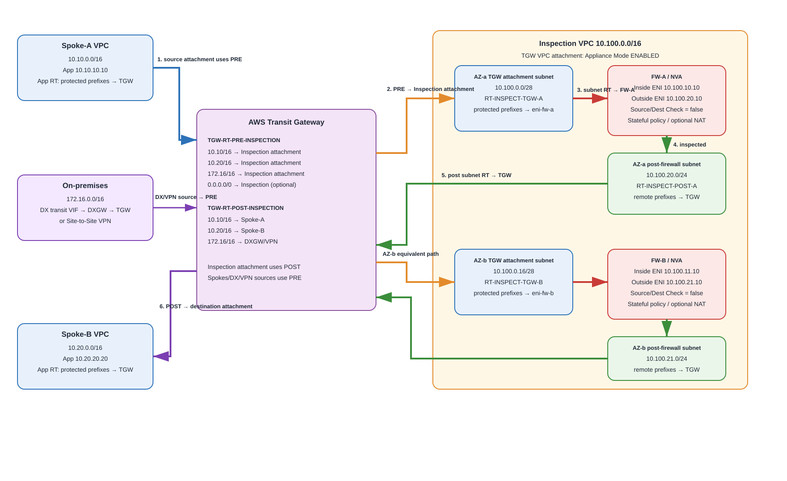
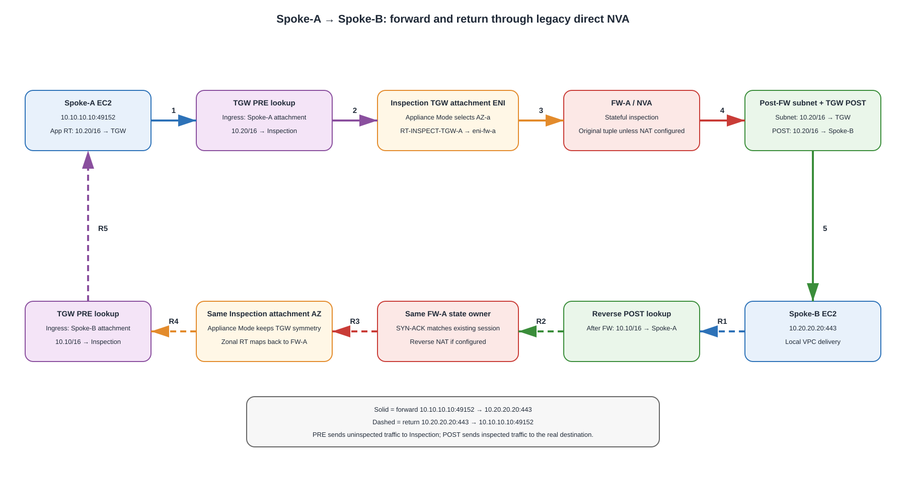

# Legacy AWS Transit Gateway + Direct NVA VPC Attachment — Deep Dive

> **Scope:** The pre-Gateway Load Balancer / direct-appliance service-insertion design in which AWS Transit Gateway (TGW) sends traffic into a customer-managed inspection VPC and VPC route tables steer packets directly to third-party firewall/NVA elastic network interfaces (ENIs). This is intentionally different from GWLB/GWLBE and from the newer native AWS Network Firewall TGW attachment.

## Source URLs

- https://docs.aws.amazon.com/vpc/latest/tgw/tgw-vpc-attachments.html
- https://docs.aws.amazon.com/vpc/latest/tgw/tgw-route-tables.html
- https://docs.aws.amazon.com/vpc/latest/tgw/how-transit-gateways-work.html
- https://docs.aws.amazon.com/vpc/latest/tgw/associate-tgw-route-table.html
- https://docs.aws.amazon.com/vpc/latest/tgw/enable-tgw-route-propagation.html
- https://docs.aws.amazon.com/vpc/latest/tgw/tgw-dcg-attachments.html
- https://docs.aws.amazon.com/directconnect/latest/UserGuide/direct-connect-transit-gateways.html
- https://docs.aws.amazon.com/directconnect/latest/UserGuide/create-transit-vif-for-gateway.html
- https://aws.amazon.com/blogs/networking-and-content-delivery/centralized-inspection-architecture-with-aws-gateway-load-balancer-and-aws-transit-gateway/
- https://aws.amazon.com/blogs/networking-and-content-delivery/best-practices-for-deploying-gateway-load-balancer/
- https://aws.amazon.com/blogs/networking-and-content-delivery/centralized-vpc-inspection-with-amazon-vpc-route-server-and-aws-transit-gateway/

## 1. What “legacy TGW + NVA VPC attachment” means

A **Network Virtual Appliance (NVA)** is a customer-managed EC2 instance running firewall, IPS/IDS, router, SD-WAN, or other packet-processing software. In this legacy centralized pattern:

1. Workload VPCs attach to a regional **AWS Transit Gateway (TGW)**.
2. A dedicated **Inspection VPC** also attaches to the TGW.
3. TGW route tables steer selected traffic to the Inspection VPC attachment.
4. The TGW attachment subnet route table in the Inspection VPC points the traffic to a firewall/NVA ENI.
5. After inspection, the NVA forwards the packet toward a second subnet whose route table sends it back to TGW, toward a NAT/Internet path, or toward another local VPC resource.
6. For stateful firewalls, the return direction must traverse the same stateful appliance path. **TGW Appliance Mode** on the Inspection VPC attachment is therefore a critical part of multi-AZ east-west designs.

**Source information:** A VPC attachment requires one subnet per selected Availability Zone (AZ); those subnets are the TGW entry/exit points. Each TGW attachment is associated with one TGW route table, while its routes can be propagated to multiple TGW route tables. AWS documents Appliance Mode specifically for stateful service insertion.

**Additional explanation:** TGW never “knows” the firewall ENI. TGW only knows that the next hop is the **Inspection VPC attachment**. Once the packet enters that VPC, the **VPC subnet route table** determines whether the packet goes to `eni-fw-a`, `eni-fw-b`, another local subnet, or back to TGW.

---

## 2. Why this pattern existed

Before GWLB/GWLBE provided managed transparent appliance insertion and horizontal flow distribution, customers commonly built centralized security VPCs with direct EC2 firewall routing. The design is still encountered in production and is useful for understanding TGW routing internals.

Typical reasons it remains in use:

- An existing firewall vendor deployment predates GWLB support.
- The appliance requires two-arm or multi-arm routed interfaces rather than GENEVE service chaining.
- The design relies on firewall-native routing, NAT, VPN, BGP, or vendor HA mechanisms.
- Migration risk makes an in-place legacy design preferable until a planned modernization.

The operational cost is higher than GWLB-based designs because the customer must explicitly engineer appliance health, route replacement/failover, AZ mapping, ENIs, source/destination checks, and routing symmetry.

---

## 3. Reference addressing and topology

This guide uses the following lab addressing so every route can be followed precisely.

| Component | CIDR / address | Notes |
|---|---:|---|
| Spoke-A VPC | `10.10.0.0/16` | Workload VPC |
| Spoke-A app subnet AZ-a | `10.10.10.0/24` | EC2 `10.10.10.10` |
| Spoke-A TGW subnet AZ-a | `10.10.250.0/28` | TGW attachment subnet |
| Spoke-B VPC | `10.20.0.0/16` | Workload VPC |
| Spoke-B app subnet AZ-b | `10.20.20.0/24` | EC2 `10.20.20.20` |
| Spoke-B TGW subnet AZ-b | `10.20.250.16/28` | TGW attachment subnet |
| Inspection VPC | `10.100.0.0/16` | Customer-managed firewall VPC |
| TGW-ingress subnet AZ-a | `10.100.0.0/28` | TGW ENI lives here |
| Firewall transit subnet AZ-a | `10.100.10.0/24` | FW-A inside/transit ENI `10.100.10.10` |
| Post-firewall subnet AZ-a | `10.100.20.0/24` | FW-A outside/transit ENI `10.100.20.10` |
| TGW-ingress subnet AZ-b | `10.100.0.16/28` | TGW ENI lives here |
| Firewall transit subnet AZ-b | `10.100.11.0/24` | FW-B inside/transit ENI `10.100.11.10` |
| Post-firewall subnet AZ-b | `10.100.21.0/24` | FW-B outside/transit ENI `10.100.21.10` |
| On-premises | `172.16.0.0/16` | DX or Site-to-Site VPN |
| Central egress VPC/prefix | example | optional Internet egress variant |



[Editable draw.io source](images/09-06-26-16-41_legacy_tgw_direct_nva_architecture.drawio)

**What this image shows:** TGW route-table service insertion, the Inspection VPC attachment subnets, direct ENI next hops for FW-A/FW-B, and the post-firewall return-to-TGW path.

**What matters:** There are two independent routing domains: **TGW route tables** select the VPC attachment, then **VPC subnet route tables** select the firewall ENI or TGW.

**What to verify:** The spoke attachments are associated with the pre-inspection TGW route table, the inspection attachment is associated with the post-inspection TGW route table, Appliance Mode is enabled on the inspection attachment, and each Inspection-VPC attachment subnet points to the correct zonal firewall ENI.

---

## 4. The two TGW route-table model

A clean design normally uses at least two TGW route tables.

### 4.1 `TGW-RT-PRE-INSPECTION`

Associate the **Spoke-A**, **Spoke-B**, Direct Connect gateway, VPN, or other source attachments whose traffic must first be inspected.

Example:

| Destination | Target attachment | Type | Purpose |
|---|---|---|---|
| `10.20.0.0/16` | Inspection VPC attachment | static | Force Spoke-A → Spoke-B through firewall |
| `10.10.0.0/16` | Inspection VPC attachment | static | Force Spoke-B → Spoke-A through firewall |
| `172.16.0.0/16` | Inspection VPC attachment | static | Force spoke → on-prem through firewall |
| `0.0.0.0/0` | Inspection VPC attachment | static | Force default/egress traffic through firewall when desired |

A broad `0.0.0.0/0 → Inspection` can reduce route count, but explicit internal prefixes make intent easier to audit and can avoid accidental forcing of traffic classes that should not enter the NVA.

### 4.2 `TGW-RT-POST-INSPECTION`

Associate the **Inspection VPC attachment** with a route table that contains the real destinations.

| Destination | Target attachment | Route source |
|---|---|---|
| `10.10.0.0/16` | Spoke-A attachment | propagated or static |
| `10.20.0.0/16` | Spoke-B attachment | propagated or static |
| `172.16.0.0/16` | DXGW/VPN attachment | propagated BGP |
| `0.0.0.0/0` | centralized egress attachment | static, if using separate egress VPC |

This is the key anti-bypass construct: once the packet leaves the firewall and re-enters TGW from the Inspection VPC, TGW evaluates the **route table associated with the Inspection VPC attachment**, not the route table that originally received the packet.

### 4.3 Static route precedence

AWS TGW route tables give a static route priority over a propagated route when the destination is identical. That makes static service-insertion routes useful for overriding direct propagated reachability. If the static inspection route is removed, an overlapping propagated route may become active and create a bypass path.

---

## 5. Inspection VPC subnet routing — the part people usually miss

TGW only delivers a packet into the Inspection VPC. The following subnet route tables complete the chain.

### 5.1 AZ-a TGW attachment subnet route table

`RT-INSPECT-TGW-A` associated with `10.100.0.0/28`:

| Destination | Target |
|---|---|
| `10.100.0.0/16` | local |
| `10.0.0.0/8` | `eni-fw-a-inside` |
| `172.16.0.0/16` | `eni-fw-a-inside` |
| `0.0.0.0/0` | `eni-fw-a-inside` when all traffic must be inspected |

### 5.2 AZ-a post-firewall subnet route table

`RT-INSPECT-POST-A` associated with `10.100.20.0/24`:

| Destination | Target |
|---|---|
| `10.100.0.0/16` | local |
| `10.10.0.0/16` | `tgw-...` |
| `10.20.0.0/16` | `tgw-...` |
| `172.16.0.0/16` | `tgw-...` |
| `0.0.0.0/0` | NAT/IGW path or `tgw-...`, depending on architecture |

The AZ-b tables are identical except they use `eni-fw-b-inside` and the AZ-b post-firewall subnet.

### 5.3 Why a single shared subnet route table can be dangerous

If both TGW attachment subnets share a route table and that route table has `0.0.0.0/0 → eni-fw-a`, then packets entering the VPC through the AZ-b TGW attachment can cross AZs to FW-A. That may be intentional for active/standby, but it defeats zonal scale and can create hidden inter-AZ dependencies. In active/active designs, use **zonal attachment subnet route tables** pointing to the local firewall.

---

## 6. Appliance Mode: what it fixes and what it does not

Enable **Appliance Mode** on the **Inspection VPC TGW attachment**, not on every spoke attachment.

AWS documents that Appliance Mode provides flow symmetry for stateful inspection by choosing a TGW attachment ENI/AZ for the lifetime of the flow and using it for both directions. AWS later enhanced Appliance Mode routing to consider source and destination AZs where possible, improving AZ locality.

What it fixes:

- Forward flow entering the inspection attachment in one AZ and reverse flow entering in another.
- Stateful firewall failures caused by the return packet being delivered through a different Inspection-VPC TGW ENI/AZ.

What it does **not** fix:

- A VPC route table that points forward traffic to FW-A but reverse traffic to FW-B.
- Vendor HA failover that changes the active ENI or next hop without updating routes.
- Asymmetry caused after the NVA, such as one direction using NAT Gateway A and the other returning through another independently selected path.
- Multi-TGW designs where separate TGWs have no shared per-flow state.

**Reasonable inference:** For direct-NVA active/active, Appliance Mode plus a deterministic one-firewall-per-AZ route table mapping is the closest equivalent to maintaining a consistent zonal stateful path. The actual firewall session owner is still controlled by your VPC routing and vendor appliance design, not TGW itself.

### CLI

```cli
aws ec2 modify-transit-gateway-vpc-attachment \
  --transit-gateway-attachment-id tgw-attach-INSPECTION \
  --options ApplianceModeSupport=enable
```

Verify:

```cli
aws ec2 describe-transit-gateway-vpc-attachments \
  --transit-gateway-attachment-ids tgw-attach-INSPECTION \
  --query 'TransitGatewayVpcAttachments[0].Options.ApplianceModeSupport' \
  --output text
```

Expected successful state:

```text
enable
```

---

## 7. Firewall/NVA instance requirements

A direct EC2 NVA is not a normal endpoint. It must be allowed to forward traffic not addressed to itself.

### 7.1 Disable source/destination check

```cli
aws ec2 modify-instance-attribute \
  --instance-id i-FIREWALLA \
  --no-source-dest-check
```

Verification:

```cli
aws ec2 describe-instances \
  --instance-ids i-FIREWALLA \
  --query 'Reservations[0].Instances[0].SourceDestCheck' \
  --output text
```

Expected state:

```text
False
```

### 7.2 Enable forwarding in the appliance OS

The vendor operating system must forward IPv4/IPv6 between interfaces/zones and security policy must permit the session. The exact command is vendor-specific; do not assume EC2 source/destination check alone makes the guest OS a router.

### 7.3 Security groups and NACLs

The firewall ENIs must permit the traffic required by the design. For appliances, overly restrictive security groups can be difficult because the firewall may see original workload/on-prem source and destination addresses rather than translated addresses.

### 7.4 ENI and routing model

Common direct-NVA layouts:

- **Two-arm routed firewall:** one ENI faces the TGW-ingress side, another faces the post-firewall side.
- **One-arm routed firewall:** same data ENI receives and forwards; simpler, but route-table behavior and vendor support must be verified carefully.
- **Active/standby:** both instances exist, but route tables or secondary ENIs move to the active node.
- **Active/active zonal:** TGW Attachment AZ-a maps to FW-A, AZ-b maps to FW-B.

---

## 8. East-west packet flow: Spoke-A → Spoke-B

Example connection:

```text
Source:      10.10.10.10:49152
Destination: 10.20.20.20:443
Protocol:    TCP
```



[Editable draw.io source](images/09-06-26-16-41_legacy_tgw_direct_nva_packet_flow.drawio)

**What this image shows:** The exact forward and reverse service-insertion path and which route table is evaluated at each routing stage.

**What matters:** The packet enters TGW twice in each direction: first from a workload attachment into inspection, then after the firewall from the inspection attachment toward the actual destination attachment.

**What to verify:** Both directions hit the same firewall state owner; the PRE route table never offers a direct Spoke-A↔Spoke-B route that can outrank/bypass inspection; POST contains direct destination routes.

### Forward direction

1. EC2 `10.10.10.10` sends to `10.20.20.20`.
2. Spoke-A app subnet route table has `10.20.0.0/16 → tgw-...` (or a broader `10.0.0.0/8` / default route).
3. TGW receives the packet from the Spoke-A attachment.
4. Because Spoke-A attachment is associated with `TGW-RT-PRE-INSPECTION`, TGW selects `10.20.0.0/16 → Inspection attachment`.
5. Appliance Mode selects the Inspection-VPC attachment ENI/AZ for the flow.
6. Packet enters `RT-INSPECT-TGW-A` (example AZ-a), which sends `10.20.0.0/16 → eni-fw-a-inside`.
7. FW-A performs policy, optional IPS/URL/TLS inspection, and optionally NAT depending on the security design.
8. FW-A forwards out its post-firewall ENI into `10.100.20.0/24`.
9. `RT-INSPECT-POST-A` contains `10.20.0.0/16 → tgw-...`.
10. TGW now receives the packet from the **Inspection VPC attachment** and therefore evaluates `TGW-RT-POST-INSPECTION`.
11. `TGW-RT-POST-INSPECTION` selects `10.20.0.0/16 → Spoke-B attachment`.
12. Spoke-B VPC local routing delivers the packet to `10.20.20.20`.

### Reverse direction

1. `10.20.20.20:443` replies to `10.10.10.10:49152`.
2. Spoke-B subnet sends `10.10.0.0/16 → TGW`.
3. Spoke-B attachment uses `TGW-RT-PRE-INSPECTION`: `10.10.0.0/16 → Inspection attachment`.
4. Appliance Mode sends the reverse direction to the same selected Inspection-VPC attachment AZ for the flow.
5. The local TGW attachment subnet route points to the same zonal firewall path.
6. FW-A matches the existing state/session and forwards.
7. Post-firewall route sends `10.10.0.0/16 → TGW`.
8. `TGW-RT-POST-INSPECTION` sends the packet to Spoke-A.
9. Spoke-A delivers to `10.10.10.10`.

No SNAT is inherently required for TGW Appliance Mode symmetry. Some legacy HA designs still use SNAT because it simplifies return-path ownership, but it sacrifices original source visibility and should be a deliberate vendor-specific decision.

---

## 9. Direct Connect Transit VIF → DXGW → TGW → NVA enforcement

A Direct Connect connection reaches TGW using a **transit virtual interface (transit VIF)** attached to a **Direct Connect gateway (DXGW)** that is associated with TGW. AWS requires the DXGW and TGW ASNs to differ for the association.

Example on-prem prefix: `172.16.0.0/16`.

### 9.1 On-prem → Spoke-A

1. On-prem router sends `172.16.10.10 → 10.10.10.10` over the transit VIF.
2. DXGW delivers the traffic to the TGW association.
3. The DXGW attachment is associated with `TGW-RT-PRE-INSPECTION`.
4. That route table intentionally sends `10.10.0.0/16 → Inspection VPC attachment`, not directly to Spoke-A.
5. Inspection VPC subnet route sends the packet to FW-A/FW-B.
6. Firewall permits the session and forwards to TGW.
7. Because the packet re-enters TGW from Inspection, `TGW-RT-POST-INSPECTION` selects `10.10.0.0/16 → Spoke-A attachment`.
8. Spoke-A delivers to the workload.

### 9.2 Spoke-A → on-prem return

1. Spoke-A sends `172.16.0.0/16 → TGW`.
2. PRE route sends it to Inspection.
3. Firewall sees the reverse session.
4. POST route sends `172.16.0.0/16 → DXGW attachment`.
5. DXGW/transit VIF sends the prefix toward the customer router.

### 9.3 BGP propagation design

AWS can propagate BGP-learned on-prem routes from the DXGW attachment into TGW route tables. A useful pattern is:

- Propagate `172.16.0.0/16` to `TGW-RT-POST-INSPECTION` so the firewall can reach on-prem after inspection.
- Do **not** rely on direct propagated workload routes in the PRE table if they would bypass inspection.
- Use static workload-prefix routes in PRE pointing to the Inspection attachment.

Remember: a static TGW route for the same destination overrides an overlapping propagated route of equal prefix length.

---

## 10. Site-to-Site VPN enforcement

The VPN attachment can be treated almost exactly like the DXGW attachment:

- Associate the VPN attachment with PRE if branch/on-prem traffic must be inspected before reaching VPCs.
- Propagate BGP-learned VPN prefixes to POST so the firewall can send approved traffic back toward the VPN.
- Ensure spoke prefixes advertised back to the VPN are consistent with the desired reachability.

For DX-primary / VPN-backup designs, AWS TGW route preference and BGP advertisements must be checked so the same connection does not leave via DX and return via VPN. Stateful inspection makes path symmetry a whole-network requirement, not merely an Inspection-VPC requirement.

---

## 11. Internet egress variants

### Variant A — firewall performs SNAT and owns public egress

The NVA has an outside path to an Internet Gateway or vendor-supported public-egress construct, and the firewall performs SNAT.

Flow:

```text
Spoke → TGW PRE → Inspection attachment → NVA → SNAT → IGW → Internet
Internet → IGW → NVA public/NAT mapping → NVA → TGW POST → Spoke
```

This is operationally simple for session symmetry but centralizes public NAT on the firewall and can constrain scale.

### Variant B — firewall inspects, NAT Gateway performs SNAT

The NVA forwards inspected traffic toward a NAT Gateway path.

```text
Spoke → TGW PRE → NVA → NAT Gateway → IGW → Internet
Internet → IGW → NAT Gateway reverse NAT → NVA → TGW POST → Spoke
```

The route tables must preserve the firewall on the NAT Gateway return path. A common failure is placing NAT Gateway such that its return traffic has a direct route to TGW or workload that skips the NVA.

### Variant C — separate centralized egress VPC

The Inspection VPC only inspects and returns traffic to TGW POST, which sends `0.0.0.0/0` to a dedicated egress VPC attachment containing NAT Gateway/IGW.

This cleanly separates security from NAT but adds another TGW hop and requires careful return routing so the egress VPC sends workload prefixes back through the Inspection attachment instead of directly to spokes.

---

## 12. Internet ingress limitations

Direct-NVA TGW service insertion is easier for **east-west**, branch, and egress traffic than arbitrary centralized Internet ingress. An Internet Gateway is VPC-scoped, and return-path symmetry through a centralized TGW path can become difficult with ALB/NLB source-address behavior and AZ selection.

For modern designs, distributed GWLBE, GWLB-based centralized inspection, or service-specific ingress architectures are often easier to reason about. If a legacy NVA must inspect inbound traffic, diagram the exact ingress and return route independently and prove that the return packet traverses the same NVA session owner.

---

## 13. High availability models

### 13.1 Active/active zonal

- FW-A handles flows selected into Inspection attachment AZ-a.
- FW-B handles flows selected into AZ-b.
- Each TGW attachment subnet route table points only to the local firewall ENI.
- Appliance Mode keeps both directions of a flow in the chosen Inspection-VPC attachment AZ.

Advantages: zonal scale and reduced single-node bottleneck.

Risks: firewall state is usually local to a node unless the vendor synchronizes it. A route change during failover can move an existing flow to another node that lacks state.

### 13.2 Active/standby route replacement

Both AZ route tables point to the active firewall ENI, or automation replaces ENI targets when the active node fails.

Advantages: simple single state owner.

Risks: cross-AZ hairpinning, automation convergence time, route-update failure, and possible state loss during failover.

### 13.3 Floating/secondary ENI model

Some vendors move a secondary ENI/IP between instances. Supportability is vendor-specific and must account for AZ restrictions: an ENI belongs to a subnet/AZ and cannot simply move across AZ boundaries.

### 13.4 Why GWLB largely replaced this

GWLB adds managed health checks, horizontal appliance target distribution, GENEVE encapsulation, and flow stickiness, reducing the custom route/HA machinery required by direct-ENI insertion. The direct-NVA pattern is therefore best viewed as a deliberate legacy or specialized architecture rather than the default modern design.

---

## 14. AWS CLI build skeleton

The commands below show the routing objects; replace placeholder IDs with your environment values.

### 14.1 Create the TGW route tables

```cli
aws ec2 create-transit-gateway-route-table \
  --transit-gateway-id tgw-0123456789abcdef0

aws ec2 create-transit-gateway-route-table \
  --transit-gateway-id tgw-0123456789abcdef0
```

### 14.2 Associate Spoke-A with PRE

```cli
aws ec2 associate-transit-gateway-route-table \
  --transit-gateway-route-table-id tgw-rtb-PRE \
  --transit-gateway-attachment-id tgw-attach-SPOKEA
```

Repeat for Spoke-B and any DXGW/VPN source attachment that must be inspected first.

### 14.3 Associate Inspection with POST

```cli
aws ec2 associate-transit-gateway-route-table \
  --transit-gateway-route-table-id tgw-rtb-POST \
  --transit-gateway-attachment-id tgw-attach-INSPECTION
```

### 14.4 Force PRE traffic to Inspection

```cli
aws ec2 create-transit-gateway-route \
  --transit-gateway-route-table-id tgw-rtb-PRE \
  --destination-cidr-block 10.20.0.0/16 \
  --transit-gateway-attachment-id tgw-attach-INSPECTION

aws ec2 create-transit-gateway-route \
  --transit-gateway-route-table-id tgw-rtb-PRE \
  --destination-cidr-block 10.10.0.0/16 \
  --transit-gateway-attachment-id tgw-attach-INSPECTION

aws ec2 create-transit-gateway-route \
  --transit-gateway-route-table-id tgw-rtb-PRE \
  --destination-cidr-block 172.16.0.0/16 \
  --transit-gateway-attachment-id tgw-attach-INSPECTION
```

### 14.5 Propagate real destinations to POST

```cli
aws ec2 enable-transit-gateway-route-table-propagation \
  --transit-gateway-route-table-id tgw-rtb-POST \
  --transit-gateway-attachment-id tgw-attach-SPOKEA

aws ec2 enable-transit-gateway-route-table-propagation \
  --transit-gateway-route-table-id tgw-rtb-POST \
  --transit-gateway-attachment-id tgw-attach-SPOKEB
```

For DXGW/VPN, enable propagation to POST when you want BGP-learned on-prem prefixes to be reachable after inspection.

### 14.6 Program Inspection-VPC attachment subnet routes

```cli
aws ec2 create-route \
  --route-table-id rtb-INSPECT-TGW-A \
  --destination-cidr-block 10.0.0.0/8 \
  --network-interface-id eni-FW-A-INSIDE

aws ec2 create-route \
  --route-table-id rtb-INSPECT-POST-A \
  --destination-cidr-block 10.0.0.0/8 \
  --transit-gateway-id tgw-0123456789abcdef0
```

Add the on-prem prefixes similarly.

---

## 15. Verification — commands, fields, success criteria, next action

### 15.1 Verify TGW attachment associations

**Where:** TGW control plane.

```cli
aws ec2 get-transit-gateway-route-table-associations \
  --transit-gateway-route-table-id tgw-rtb-PRE \
  --output table
```

**What it tests:** Which attachments use PRE for ingress route lookup.

**Expected state:** Spoke/DX/VPN source attachments appear as associated; Inspection does not.

**Failure means:** A source can use the wrong TGW route table and bypass inspection.

**Next action:** Correct associations with `associate-transit-gateway-route-table`.

### 15.2 Verify PRE routes

```cli
aws ec2 search-transit-gateway-routes \
  --transit-gateway-route-table-id tgw-rtb-PRE \
  --filters Name=state,Values=active \
  --output table
```

**Success criteria:** Protected spoke/on-prem prefixes point to `tgw-attach-INSPECTION`.

**Failure indicators:** A destination points directly to a spoke attachment, a blackhole route is active, or the intended prefix is missing.

### 15.3 Verify POST routes

```cli
aws ec2 search-transit-gateway-routes \
  --transit-gateway-route-table-id tgw-rtb-POST \
  --filters Name=state,Values=active \
  --output table
```

**Success criteria:** Real destinations point to Spoke-A, Spoke-B, DXGW, VPN, or egress attachments as intended.

### 15.4 Verify Inspection VPC subnet routes

```cli
aws ec2 describe-route-tables \
  --route-table-ids rtb-INSPECT-TGW-A rtb-INSPECT-POST-A \
  --output json
```

Important fields:

- `DestinationCidrBlock`
- `NetworkInterfaceId`
- `TransitGatewayId`
- `State`

Success:

```text
TGW attachment subnet: protected prefixes -> firewall ENI
Post-firewall subnet: protected prefixes -> TGW
```

### 15.5 Verify source/destination check

```cli
aws ec2 describe-instances \
  --instance-ids i-FIREWALLA i-FIREWALLB \
  --query 'Reservations[].Instances[].{Instance:InstanceId,SourceDestCheck:SourceDestCheck}' \
  --output table
```

Success criteria: `SourceDestCheck` is `False` for every forwarding appliance instance.

### 15.6 Verify data plane

Use all of the following, not only ping:

- VPC Flow Logs on workload, attachment, and NVA ENIs.
- Firewall session table / traffic logs.
- TGW Flow Logs where enabled.
- TCP test to a known destination/port.
- Traceroute only as supporting evidence; appliances can suppress TTL-expired replies.

Success criteria:

1. Forward packet reaches the expected NVA.
2. Firewall creates a state/session.
3. Return packet matches the same session owner.
4. Source/destination addresses are as designed before/after NAT.
5. Both TGW route-table lookups select the expected attachments.

---

## 16. Troubleshooting by symptom

### Symptom: Spoke-A can reach TGW but never reaches FW-A

**Where:** PRE TGW route table and Inspection-VPC TGW attachment subnet.

**Command/tool:** `search-transit-gateway-routes`, `describe-route-tables`, VPC Flow Logs.

**What it tests:** Whether TGW selected Inspection and whether the VPC route selected the firewall ENI.

**Failure means:** Missing PRE static route, wrong attachment association, wrong subnet route table, or wrong ENI target.

**Next action:** Correct TGW service-insertion route first, then the subnet ENI route.

### Symptom: Firewall sees SYN, but never sees SYN-ACK

**Where:** Appliance Mode, reverse PRE path, zonal route mapping.

**What it tests:** Stateful symmetry.

**Expected state:** Reverse traffic enters the same Inspection attachment flow/AZ and maps to the same firewall state owner.

**Failure means:** Appliance Mode disabled, route table points reverse path to another NVA, or downstream routing returns through another path.

**Next action:** Enable Appliance Mode and verify both AZ-specific subnet tables.

### Symptom: Firewall permits traffic but destination is unreachable

**Where:** Post-firewall subnet route and POST TGW route table.

**What it tests:** Second half of the service chain.

**Failure means:** The packet is inspected but has no post-inspection route to TGW/destination.

**Next action:** Check `RT-INSPECT-POST-*` then `TGW-RT-POST-INSPECTION`.

### Symptom: On-prem → AWS works, AWS → on-prem fails

**Where:** POST propagation, DXGW/VPN BGP, on-prem routing.

**Expected state:** POST contains active `172.16.0.0/16 → DXGW/VPN`; customer router receives the intended AWS prefixes.

**Failure means:** Missing propagation, allowed-prefix issue, BGP preference issue, or return route missing on-prem.

### Symptom: Existing sessions reset during firewall failover

**Where:** NVA HA/session synchronization and route replacement automation.

**What it tests:** Whether the standby has synchronized state and whether route/ENI movement preserves the path.

**Failure means:** This is often inherent in legacy direct-NVA active/standby if state is not synchronized.

**Next action:** Validate vendor HA state sync; consider GWLB-based horizontal service insertion if appropriate.

### Symptom: A workload bypasses the firewall

**Where:** PRE TGW table and spoke VPC route table.

**Common causes:**

- Spoke subnet has direct peering/local path that is more specific than TGW route.
- PRE TGW has propagated direct spoke route and no static inspection override.
- A more-specific TGW route points directly to the destination attachment.
- A second TGW route table is accidentally associated with the spoke.

---

## 17. Common mistakes

1. **Thinking TGW routes directly to an NVA ENI.** It does not. TGW routes to the Inspection VPC attachment; VPC routing then routes to the ENI.
2. **Enabling Appliance Mode on spokes instead of the inspection attachment.** The stateful service attachment is the one that needs it.
3. **Using one shared Inspection attachment subnet route table for active/active and accidentally sending every AZ to one firewall.**
4. **Leaving source/destination check enabled.** The EC2 NVA then cannot act as a transit router.
5. **Forgetting the post-firewall route back to TGW.** The packet reaches the firewall and dies after policy allows it.
6. **Propagating spoke routes into PRE without overriding them.** That can create a direct spoke-to-spoke bypass.
7. **Assuming Appliance Mode guarantees the same firewall instance.** It guarantees TGW inspection-attachment flow symmetry; your VPC routing must still select the same state owner.
8. **Treating Direct Connect allowed prefixes as the same thing as TGW route-table service insertion.** DXGW allowed prefixes control what AWS prefixes are advertised through the DXGW association; PRE/POST TGW tables control the actual TGW forwarding path.
9. **Ignoring failover convergence.** Legacy route replacement is a control-plane operation and can be slower/more fragile than managed GWLB target health handling.
10. **Applying SNAT reflexively.** SNAT can force symmetry but removes original source identity; Appliance Mode can remove the need for SNAT in many east-west TGW inspection designs.

---

## 18. Legacy direct NVA vs GWLB vs native Network Firewall TGW attachment

| Property | Legacy direct NVA VPC attachment | TGW + GWLB/GWLBE | Native AWS Network Firewall TGW attachment |
|---|---|---|---|
| Appliance next hop inside VPC | ENI/instance route | GWLBE | AWS-managed firewall attachment |
| Customer owns health-based routing | Yes | Mostly no; GWLB handles targets | No for attachment plumbing |
| Appliance Mode | Manual on Inspection VPC attachment | Manual on Inspection VPC attachment | Automatically handled for native firewall attachment |
| Horizontal scale | Customer/vendor engineered | Native GWLB target fleet | AWS managed |
| Encapsulation | Native routed IP | GENEVE | AWS managed |
| Vendor firewall routing flexibility | Highest | Must support GWLB | Not third-party NVA |
| Operational complexity | Highest | Moderate | Lower |
| Best fit | Existing/specialized legacy deployments | Modern third-party centralized inspection | AWS-native firewall policy |

---

## 19. Migration guidance

A safe migration from direct NVA to GWLB normally keeps the TGW PRE/POST segmentation model while replacing the direct ENI service chain inside the Inspection VPC with zonal GWLBE/GWLB routing. This lets you migrate one traffic class at a time and preserves the conceptual separation between “traffic that still needs inspection” and “traffic that has already been inspected.”

Before migration, inventory:

- NAT performed by the legacy firewall.
- Any BGP/static routing the firewall itself originates.
- Public IPs/EIPs bound to firewall interfaces.
- TLS decryption dependencies and certificate stores.
- Session synchronization behavior.
- Vendor HA route automation.
- MTU/MSS settings.
- Interfaces/zones used by policy.
- Logging destinations and source-IP expectations.

---

## 20. Final design checklist

- [ ] One Inspection-VPC TGW attachment spanning the required AZs.
- [ ] Appliance Mode enabled on that attachment.
- [ ] Separate PRE and POST TGW route tables.
- [ ] All protected source attachments associated with PRE.
- [ ] Inspection attachment associated with POST.
- [ ] PRE protected prefixes point to Inspection attachment.
- [ ] POST real prefixes point to spokes/DXGW/VPN/egress.
- [ ] Inspection TGW attachment subnet route tables point to the correct zonal firewall ENI.
- [ ] Post-firewall subnet route tables point back to TGW for remote prefixes.
- [ ] EC2 source/destination check disabled on all forwarding NVAs.
- [ ] Firewall OS forwarding, security policy, and NAT behavior verified.
- [ ] Forward and reverse VPC Flow Logs prove the same stateful path.
- [ ] DX/VPN BGP prefixes are propagated only where intended.
- [ ] HA route replacement/state synchronization tested with an active failure.
- [ ] No more-specific route bypasses inspection.

---

## Sources

- AWS Transit Gateway VPC attachments: https://docs.aws.amazon.com/vpc/latest/tgw/tgw-vpc-attachments.html
- AWS Transit Gateway route tables: https://docs.aws.amazon.com/vpc/latest/tgw/tgw-route-tables.html
- How Transit Gateway works: https://docs.aws.amazon.com/vpc/latest/tgw/how-transit-gateways-work.html
- TGW route table association: https://docs.aws.amazon.com/vpc/latest/tgw/associate-tgw-route-table.html
- TGW route propagation: https://docs.aws.amazon.com/vpc/latest/tgw/enable-tgw-route-propagation.html
- TGW Direct Connect gateway attachments: https://docs.aws.amazon.com/vpc/latest/tgw/tgw-dcg-attachments.html
- Direct Connect gateway + TGW associations: https://docs.aws.amazon.com/directconnect/latest/UserGuide/direct-connect-transit-gateways.html
- Transit VIF creation: https://docs.aws.amazon.com/directconnect/latest/UserGuide/create-transit-vif-for-gateway.html
- AWS centralized inspection / Appliance Mode background: https://aws.amazon.com/blogs/networking-and-content-delivery/centralized-inspection-architecture-with-aws-gateway-load-balancer-and-aws-transit-gateway/
- GWLB deployment best practices / Appliance Mode behavior: https://aws.amazon.com/blogs/networking-and-content-delivery/best-practices-for-deploying-gateway-load-balancer/
- VPC Route Server + centralized inspection example: https://aws.amazon.com/blogs/networking-and-content-delivery/centralized-vpc-inspection-with-amazon-vpc-route-server-and-aws-transit-gateway/
