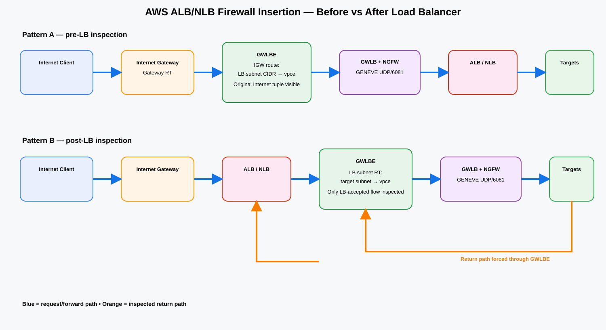
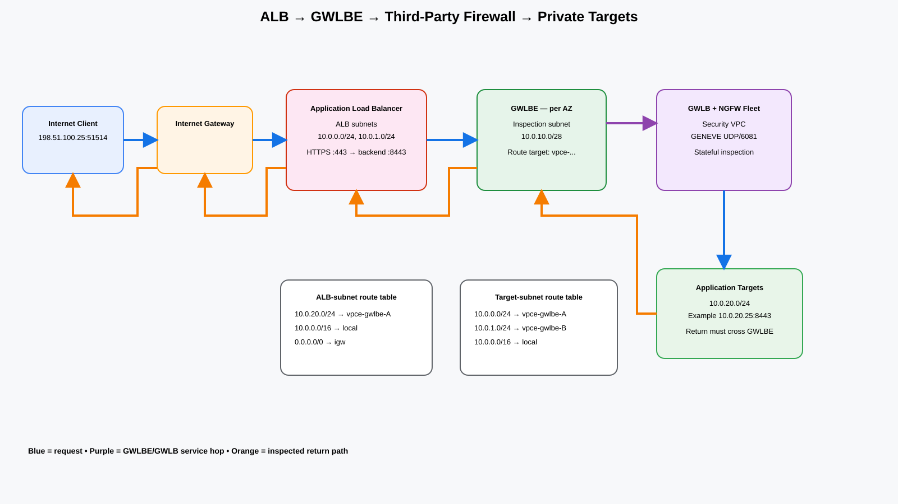
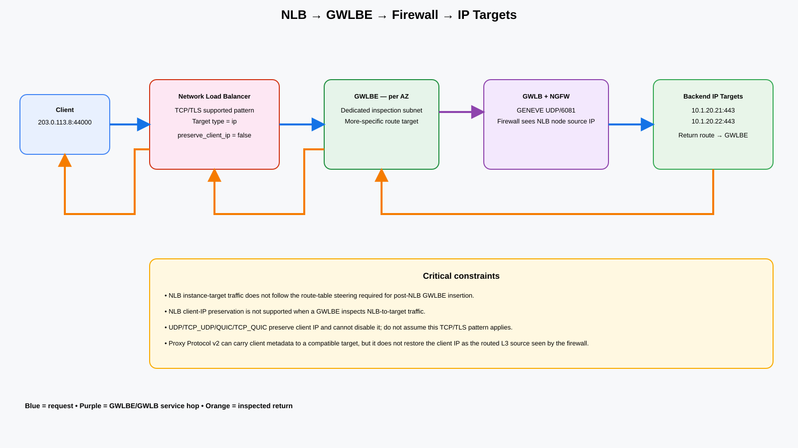

# AWS ALB/NLB + Inline Firewall Endpoint — GWLB/GWLBE Deep Dive

**Last reviewed:** 2026-09-06

## URLs reviewed

- https://aws.amazon.com/blogs/networking-and-content-delivery/vpc-routing-enhancements-and-gwlb-deployment-patterns/
- https://aws.amazon.com/blogs/networking-and-content-delivery/design-your-firewall-deployment-for-internet-ingress-traffic-flows/
- https://docs.aws.amazon.com/vpc/latest/userguide/gateway-route-tables.html
- https://docs.aws.amazon.com/vpc/latest/userguide/gwlb-route.html
- https://docs.aws.amazon.com/vpc/latest/userguide/subnet-route-tables.html
- https://docs.aws.amazon.com/vpc/latest/userguide/route-table-options.html
- https://docs.aws.amazon.com/elasticloadbalancing/latest/gateway/target-groups.html
- https://docs.aws.amazon.com/elasticloadbalancing/latest/gateway/getting-started-cli.html
- https://docs.aws.amazon.com/elasticloadbalancing/latest/network/edit-target-group-attributes.html
- https://docs.aws.amazon.com/elasticloadbalancing/latest/network/load-balancer-target-groups.html
- https://aws.amazon.com/blogs/networking-and-content-delivery/best-practices-for-deploying-gateway-load-balancer/

## Executive answer

There are two different insertion points around an Application Load Balancer (ALB) or Network Load Balancer (NLB):

1. **Pre-load-balancer:** Internet → Internet Gateway (IGW) → Gateway Load Balancer Endpoint (GWLBE) → Gateway Load Balancer (GWLB) / third-party NGFW → ALB/NLB → targets. This uses an IGW **gateway route table** to send the destination load-balancer subnet CIDR to the zonal GWLBE.
2. **Post-load-balancer:** Internet → IGW → ALB/NLB → GWLBE → GWLB/NGFW → targets. This uses **VPC more-specific routing** so the load-balancer subnet route table sends the entire backend target-subnet CIDR to GWLBE rather than using the broader VPC `local` route.

The post-LB model is especially clean with ALB. With NLB it has strict constraints: AWS documents that NLB-to-target traffic with **instance target type does not follow the VPC route-table steering needed for this pattern**, so use **IP targets**. AWS also documents that **NLB client-IP preservation is not supported when GWLBE inspects traffic between the NLB and target**.

> **Source information:** GWLB is a transparent, non-proxy service insertion construct; ALB/NLB are load-balancing/proxy constructs. GWLBE is a route-table next hop. AWS permits a route matching an entire subnet CIDR to be more specific than the VPC-wide `local` route and target GWLBE.
>
> **Additional explanation:** ALB/NLB chooses or creates the backend flow; GWLBE/GWLB inserts the stateful appliance into that network path. GWLBE is not an ALB/NLB target-group member.

## Core components

| Component | Function |
|---|---|
| ALB | Layer-7 HTTP/HTTPS reverse proxy, TLS termination, host/path/header rules, AWS WAF integration. |
| NLB | Layer-4 load balancer for TCP/TLS and other supported transport protocols; source-IP behavior depends on protocol, target type, and target-group attributes. |
| GWLBE | VPC endpoint used as a route-table next hop; privately reaches the GWLB endpoint service. |
| GWLB | Distributes transparent flows to healthy appliances and carries traffic to appliances with GENEVE over UDP/6081. |
| NGFW/NVA | Third-party firewall/IDS/IPS fleet registered behind GWLB. |
| Gateway route table | Edge-associated route table for IGW/VGW; can steer a VPC/subnet CIDR to GWLBE. |
| Subnet route table | Used for post-LB insertion with more-specific subnet routes. |

## Architecture choice



[Editable draw.io source](images/09-06-26-16-42_pre_vs_post_load_balancer_firewall_insertion.drawio)

**What this image shows:** pre-LB inspection through an IGW gateway route table versus post-LB inspection using subnet routing.

**What matters:** pre-LB inspection sees the original Internet-side packet; post-LB inspection sees the load balancer's backend flow.

**What to verify:** identify exactly which route table owns each steering decision and make the reverse path cross the same inspection layer.

## Pattern A — firewall before ALB/NLB

Forward flow:

1. Client sends traffic to the public ALB/NLB address.
2. IGW receives the packet and evaluates its associated gateway route table.
3. A route such as `10.0.0.0/24 -> vpce-...` sends traffic destined to the load-balancer subnet to the local-AZ GWLBE.
4. GWLBE transports the flow to the provider GWLB service.
5. GWLB selects a healthy appliance and encapsulates the original packet with GENEVE/UDP 6081.
6. The firewall inspects the inner packet and returns allowed traffic to GWLB/GWLBE.
7. The packet continues to the ALB/NLB subnet.
8. ALB/NLB applies listener/load-balancing logic and sends traffic to its target.

The return path must be symmetric. The load-balancer-side routing and gateway routing must send the response back through the inspection endpoint before IGW sends it to the client.

Use this pattern when a compliance requirement says the traffic must cross a firewall **before reaching the load balancer**, or when the firewall must make policy using the original Internet-side source/destination tuple.

## Pattern B — firewall between ALB/NLB and targets

This is the classic **ALB/NLB + inline firewall endpoint** design.

A VPC route table normally contains a VPC-wide route such as:

```text
10.0.0.0/16 -> local
```

AWS allows a more-specific route when the destination is the **entire CIDR of another subnet** and the target is a supported middlebox target such as GWLBE. Longest-prefix match makes the protected-subnet route win:

```text
10.0.20.0/24 -> vpce-gwlbe-a
10.0.0.0/16  -> local
```

Do not treat this as arbitrary host routing: the supported more-specific-local-route model is based on the whole subnet CIDR.

## ALB + inline GWLBE firewall



[Editable draw.io source](images/09-06-26-16-42_alb_post_lb_gwlbe_inline_firewall.drawio)

**What this image shows:** client → IGW → ALB → GWLBE → GWLB/NGFW → application target, with the target response routed back through GWLBE before returning to ALB.

**What matters:** ALB is a proxy. A firewall placed after ALB sees the ALB-to-target backend connection at Layer 3, not the original client TCP connection.

**What to verify:** every ALB subnet has a more-specific route to every protected target subnet through the correct GWLBE, and every target subnet has reverse routes to the ALB subnet CIDRs through GWLBE.

### Example addressing

```text
VPC:                10.0.0.0/16
ALB subnet A:       10.0.0.0/24
ALB subnet B:       10.0.1.0/24
GWLBE subnet A:     10.0.10.0/28
GWLBE subnet B:     10.0.11.0/28
App subnet A:       10.0.20.0/24
App subnet B:       10.0.21.0/24
ALB listener:       HTTPS/443
ALB target port:    HTTPS/8443 (example)
```

### Exact packet walk

Assume client `198.51.100.25:51514` connects to HTTPS/443.

Client-side packet before ALB:

```text
Src 198.51.100.25:51514
Dst ALB public-facing address:443
TCP/TLS
```

If ALB terminates TLS, that client TLS session ends on ALB. WAF/listener/rule processing happens before the post-LB firewall sees traffic.

ALB then creates or reuses a backend connection toward target `10.0.20.25:8443`:

```text
Src ALB node private IP:<ephemeral>
Dst 10.0.20.25:8443
```

The ALB-subnet route table performs longest-prefix match:

```text
10.0.20.0/24 -> vpce-gwlbe-a   # wins
10.0.0.0/16  -> local
0.0.0.0/0    -> igw
```

GWLBE carries the original backend packet to GWLB. GWLB sends it to the chosen firewall using GENEVE/UDP 6081. The firewall inspects the inner flow, returns allowed traffic to GWLB, and the packet returns through the endpoint and continues to the backend target.

The target response is:

```text
Src 10.0.20.25:8443
Dst ALB node private IP:<ephemeral>
```

The target subnet must have a more-specific route for the appropriate ALB subnet CIDR back to GWLBE. Otherwise the VPC `local` route can bypass the stateful firewall on the return direction.

### Why ALB is well suited to post-LB inspection

- ALB rejects traffic that does not match the application listener/rules before it consumes NGFW resources.
- AWS WAF can run on ALB before the NGFW backend stage.
- ALB can terminate the public TLS session using AWS Certificate Manager (ACM), so the firewall does not need the public certificate merely to receive the backend flow.
- If the ALB-to-target leg is HTTP, a post-ALB firewall sees cleartext HTTP. If the backend leg is HTTPS, the firewall sees the backend TLS session unless the selected firewall performs supported TLS decryption.
- Original client identity can still be propagated at Layer 7 using headers such as `X-Forwarded-For`, but that does not change the IP source visible to the firewall.

## NLB + inline GWLBE firewall



[Editable draw.io source](images/09-06-26-16-42_nlb_post_lb_gwlbe_inline_firewall.drawio)

**What this image shows:** supported routed inspection requires NLB → GWLBE → firewall → **IP targets**, with client-IP constraints shown explicitly.

**What matters:** NLB instance targets do not provide the route-table steering required between NLB and target for this design. Client-IP preservation is not supported through GWLBE between NLB and target.

**What to verify:** target type is `ip`; protocol is compatible with disabling client-IP preservation; the target-group attribute is correct; reverse routes return through GWLBE.

### NLB rules that matter

1. **Use IP targets.** AWS states that NLB traffic to `instance` target type does not follow the VPC route-table routes needed for post-NLB service insertion.
2. **Do not expect client-IP preservation through GWLBE.** AWS explicitly says it is unsupported when GWLBE inspects traffic between NLB and target.
3. **Protocol matters.** For TCP/TLS IP target groups, client-IP preservation can be disabled and is disabled by default for those IP target types. AWS documents preservation as enabled and non-disableable for UDP, TCP_UDP, QUIC, and TCP_QUIC target groups, so do not generalize the TCP/TLS pattern to those protocols.
4. **Proxy Protocol v2 does not change routing.** It can preserve client metadata to a compatible target after disabling source-IP preservation, but the firewall still sees the routed backend source address, not the original client IP at Layer 3.

### Create a suitable NLB target group

```cli
aws elbv2 create-target-group \
  --name nlb-inline-fw-tg \
  --protocol TCP \
  --port 443 \
  --target-type ip \
  --vpc-id vpc-0123456789abcdef0
```

Verify the target type:

```cli
aws elbv2 describe-target-groups \
  --target-group-arns arn:aws:elasticloadbalancing:REGION:ACCOUNT:targetgroup/nlb-inline-fw-tg/ID \
  --query 'TargetGroups[].{TargetType:TargetType,Protocol:Protocol,Port:Port,VpcId:VpcId}' \
  --output table
```

**Success criteria:** `TargetType` is `ip`.

For TCP/TLS routed inspection through GWLBE, ensure client-IP preservation is disabled:

```cli
aws elbv2 modify-target-group-attributes \
  --target-group-arn arn:aws:elasticloadbalancing:REGION:ACCOUNT:targetgroup/nlb-inline-fw-tg/ID \
  --attributes Key=preserve_client_ip.enabled,Value=false
```

Verify:

```cli
aws elbv2 describe-target-group-attributes \
  --target-group-arn arn:aws:elasticloadbalancing:REGION:ACCOUNT:targetgroup/nlb-inline-fw-tg/ID \
  --query 'Attributes[?Key==`preserve_client_ip.enabled`]'
```

**Expected state:** the returned attribute shows the intended value. Exact output ordering and additional attributes vary, so this guide does not fabricate a fixed output block.

## GWLB provider-side construction

GWLB is typically placed in a Security VPC with a third-party firewall fleet.

Create the GWLB target group:

```cli
aws elbv2 create-target-group \
  --name ngfw-gwlb-tg \
  --protocol GENEVE \
  --port 6081 \
  --vpc-id vpc-SECURITYVPC \
  --target-type instance \
  --health-check-protocol TCP \
  --health-check-port 22
```

`GENEVE/6081` is an AWS-defined GWLB data-plane requirement. The health-check port above is only an **example**; use the firewall vendor's documented health check.

Register appliances:

```cli
aws elbv2 register-targets \
  --target-group-arn arn:aws:elasticloadbalancing:REGION:ACCOUNT:targetgroup/ngfw-gwlb-tg/ID \
  --targets Id=i-0aaa1111 Id=i-0bbb2222
```

Create GWLB:

```cli
aws elbv2 create-load-balancer \
  --name ngfw-gwlb \
  --type gateway \
  --subnets subnet-sec-a subnet-sec-b
```

Create listener:

```cli
aws elbv2 create-listener \
  --load-balancer-arn arn:aws:elasticloadbalancing:REGION:ACCOUNT:loadbalancer/gwy/ngfw-gwlb/ID \
  --default-actions Type=forward,TargetGroupArn=arn:aws:elasticloadbalancing:REGION:ACCOUNT:targetgroup/ngfw-gwlb-tg/ID
```

Create the endpoint-service configuration:

```cli
aws ec2 create-vpc-endpoint-service-configuration \
  --gateway-load-balancer-arns arn:aws:elasticloadbalancing:REGION:ACCOUNT:loadbalancer/gwy/ngfw-gwlb/ID \
  --no-acceptance-required
```

Record the generated `com.amazonaws.vpce.REGION.vpce-svc-...` service name.

## Consumer-side GWLBE

Create one GWLBE per AZ used by the service chain:

```cli
aws ec2 create-vpc-endpoint \
  --vpc-id vpc-APPVPC \
  --vpc-endpoint-type GatewayLoadBalancer \
  --service-name com.amazonaws.vpce.REGION.vpce-svc-EXAMPLE \
  --subnet-ids subnet-gwlbe-a
```

Repeat for AZ B.

Verify endpoint state:

```cli
aws ec2 describe-vpc-endpoints \
  --filters Name=vpc-endpoint-type,Values=GatewayLoadBalancer \
  --query 'VpcEndpoints[].{Id:VpcEndpointId,State:State,SubnetIds:SubnetIds,ServiceName:ServiceName}' \
  --output table
```

**Success criteria:** endpoint state is `available`, the subnet is correct, and the service name matches the intended GWLB service.

## Route programming for post-LB inspection

Example objects:

```text
LB subnet A       10.0.0.0/24   RT rtb-lb-a
LB subnet B       10.0.1.0/24   RT rtb-lb-b
Target subnet A   10.0.20.0/24  RT rtb-app-a
Target subnet B   10.0.21.0/24  RT rtb-app-b
GWLBE A           vpce-aaa
GWLBE B           vpce-bbb
```

Forward interception:

```cli
aws ec2 create-route \
  --route-table-id rtb-lb-a \
  --destination-cidr-block 10.0.20.0/24 \
  --vpc-endpoint-id vpce-aaa

aws ec2 create-route \
  --route-table-id rtb-lb-b \
  --destination-cidr-block 10.0.21.0/24 \
  --vpc-endpoint-id vpce-bbb
```

If load-balancer nodes in either subnet can select targets in both backend subnets, install all required protected prefixes in every relevant LB-subnet route table while keeping the design zonally symmetric.

Reverse interception:

```cli
aws ec2 create-route \
  --route-table-id rtb-app-a \
  --destination-cidr-block 10.0.0.0/24 \
  --vpc-endpoint-id vpce-aaa

aws ec2 create-route \
  --route-table-id rtb-app-b \
  --destination-cidr-block 10.0.1.0/24 \
  --vpc-endpoint-id vpce-bbb
```

AWS also warns against routing traffic from AWS-managed services such as NLB, NAT Gateway, or Transit Gateway through a middlebox and then **back to the subnet where that same AWS-managed service is attached**. Keep the inspection endpoint and protected backend in distinct subnets and avoid unsupported hairpin service paths.

## Pre-LB IGW routing example

Create a gateway route table and point each protected load-balancer subnet to its zonal endpoint:

```cli
aws ec2 create-route \
  --route-table-id rtb-igw-edge \
  --destination-cidr-block 10.0.0.0/24 \
  --vpc-endpoint-id vpce-aaa

aws ec2 associate-route-table \
  --route-table-id rtb-igw-edge \
  --gateway-id igw-0123456789abcdef0
```

Repeat for each load-balancer subnet/AZ. Gateway route tables can steer traffic entering via IGW/VGW, but they are **not** a way to intercept Transit Gateway ingress; TGW inspection requires TGW/inspection-VPC routing.

## TLS placement

### ALB post-LB

- Client TLS can terminate on ALB.
- ALB-to-target HTTP lets the post-LB firewall see cleartext HTTP.
- ALB-to-target HTTPS creates a separate backend TLS session.
- Public ACM certificates can remain on ALB instead of being installed on the NGFW merely for the public client session.

### NLB post-LB

- A TLS listener may terminate TLS on NLB and create a backend flow.
- TCP passthrough keeps application TLS end-to-end, but the NLB/GWLBE routing and client-IP constraints still apply.

### Pre-LB

GWLB itself does not decrypt TLS. If deep TLS inspection must happen before ALB/NLB, the firewall appliance must provide a supported decrypt/re-encrypt model. AWS documents one-arm and two-arm GWLB appliance patterns; vendor support determines the exact certificate and flow behavior.

## Security policy implications

Build firewall policy around the tuple actually seen at the inspection point:

- **Pre-LB:** original client → public load-balancer address/port.
- **Post-ALB:** ALB node private IP → target IP/port.
- **Post-NLB:** NLB node private IP → target IP/port when client-IP preservation is disabled as required by the routed GWLBE design.

Security groups and NACLs still apply; GWLBE does not replace them.

## High availability and state

- Deploy one GWLBE per used AZ and route local-AZ traffic to the local endpoint where practical.
- Deploy multiple firewall appliances behind GWLB across AZs.
- GWLB flow affinity keeps a flow on a selected appliance so stateful inspection can work.
- Route symmetry remains mandatory. Healthy appliances do not compensate for a return route that bypasses inspection.
- Explicitly test appliance failure, endpoint failure, and AZ failure; existing-flow behavior depends on GWLB target-failover configuration and appliance behavior.

## Verification

### Route tables

```cli
aws ec2 describe-route-tables \
  --route-table-ids rtb-lb-a rtb-app-a \
  --query 'RouteTables[].{RouteTableId:RouteTableId,Routes:Routes}' \
  --output json
```

**What it tests:** forward and reverse protected-subnet routes.

**Success criteria:** protected target-subnet CIDR in the LB subnet route table points to the intended `vpce-*`; the corresponding LB-subnet CIDR in the target route table points back to GWLBE; routes are active.

### GWLB target health

```cli
aws elbv2 describe-target-health \
  --target-group-arn arn:aws:elasticloadbalancing:REGION:ACCOUNT:targetgroup/ngfw-gwlb-tg/ID
```

**Success criteria:** intended firewall appliances are healthy.

### Firewall packet/session view

Expected fields/state, not fabricated vendor output:

```text
Outer GWLB transport:
  UDP destination port 6081
  GENEVE encapsulation

Post-ALB inner flow:
  source = ALB node private address
  destination = backend target address
  destination port = target-group port

Supported post-NLB inner flow:
  source = NLB node private address when client-IP preservation is disabled
  destination = backend IP target
```

## Troubleshooting by symptom

### ALB target becomes unhealthy after insertion

**Where:** ALB subnet route table, target subnet route table, firewall policy, target security group.

**What it tests:** whether health-check/backend packets cross GWLBE in both directions.

**Failure meaning:** a missing reverse route often lets the response use the VPC `local` path and bypass the stateful firewall.

**Next action:** verify the exact ALB-subnet CIDR reverse route and allow the documented health-check/backend protocol/port.

### NLB traffic bypasses firewall

**Where:** NLB target group.

**Command:** `aws elbv2 describe-target-groups ...`

**Failure meaning:** `TargetType=instance` is incompatible with the VPC route-table insertion expectation between NLB and target.

**Next action:** redesign with supported IP targets.

### NLB target no longer sees original client IP

**Where:** NLB target-group attributes and insertion point.

**Meaning:** original client-IP preservation is not supported through GWLBE between NLB and target.

**Next action:** use Proxy Protocol v2 if the application only needs metadata and supports it; if the firewall itself needs the original source at Layer 3, move inspection before NLB.

### Forward direction is inspected but response bypasses firewall

**Where:** target subnet route table.

**Meaning:** `local` is taking the reply directly to the LB subnet.

**Next action:** add the entire LB subnet CIDR as a more-specific route to the correct GWLBE and re-test per AZ.

### GWLBE receives traffic but firewall shows no session

**Where:** GWLB target health and vendor GENEVE interface/configuration.

**Meaning:** target may be unhealthy, unregistered, or the appliance may not be decapsulating GENEVE correctly.

**Next action:** validate vendor-specific GWLB integration, health checks, and UDP/6081 processing.

## Common mistakes

1. Treating GWLBE as an ALB/NLB target instead of a **route target**.
2. Using NLB `instance` targets and expecting post-NLB route insertion to work.
3. Assuming NLB client-IP preservation works through GWLBE.
4. Forgetting reverse service-insertion routes.
5. Using a host prefix rather than the entire subnet CIDR for the supported more-specific-local-route pattern.
6. Hairpinning an AWS-managed service through a middlebox back to its own service subnet.
7. Assuming post-ALB firewall policy sees the Internet client IP at Layer 3.
8. Assuming GWLB performs TLS decryption.
9. Ignoring AZ mapping and stateful symmetry.
10. Trying to use an IGW gateway route table to intercept Transit Gateway traffic.

## Decision matrix

| Requirement | Best placement |
|---|---|
| Firewall must inspect original Internet source IP before LB logic | IGW → GWLBE → firewall → ALB/NLB |
| Want ALB WAF/listener to reject first | ALB → GWLBE → firewall → targets |
| Want ACM public certificate to remain on AWS LB | Usually post-ALB |
| NLB TCP/TLS inline inspection between NLB and target | NLB with **IP targets**, GWLBE, client-IP preservation disabled |
| NLB instance targets with post-NLB route insertion | Do not use |
| Firewall policy requires true Internet source IP behind NLB | Prefer pre-NLB inspection |
| UDP/TCP_UDP/QUIC post-NLB GWLBE | Do not assume TCP/TLS behavior; verify explicit supported architecture |

## Source information, explanation, and inference

### Source information

- GWLB target groups use GENEVE/UDP 6081.
- GWLBE is a VPC route-table next hop.
- Entire subnet CIDRs can be routed more specifically than the VPC local route to a supported middlebox target.
- IGW/VGW gateway route tables can steer VPC/subnet CIDRs to GWLBE.
- NLB client-IP preservation is not supported when GWLBE is used between NLB and target.
- NLB `instance` target traffic does not follow the VPC route-table steering required for this post-NLB insertion pattern.

### Additional explanation

The forward/return route examples connect AWS route behavior to the firewall requirement for symmetric state. The ALB and NLB tuple examples explain why moving the inspection point changes the IP identity visible to the firewall.

### Reasonable inference

Dedicated GWLBE subnets and per-AZ route tables usually make route ownership and stateful symmetry easier to operate. The sample `/28` endpoint subnet is a design example, not an AWS requirement.

## Sources

1. https://aws.amazon.com/blogs/networking-and-content-delivery/vpc-routing-enhancements-and-gwlb-deployment-patterns/
2. https://aws.amazon.com/blogs/networking-and-content-delivery/design-your-firewall-deployment-for-internet-ingress-traffic-flows/
3. https://docs.aws.amazon.com/vpc/latest/userguide/gateway-route-tables.html
4. https://docs.aws.amazon.com/vpc/latest/userguide/gwlb-route.html
5. https://docs.aws.amazon.com/vpc/latest/userguide/subnet-route-tables.html
6. https://docs.aws.amazon.com/vpc/latest/userguide/route-table-options.html
7. https://docs.aws.amazon.com/elasticloadbalancing/latest/gateway/target-groups.html
8. https://docs.aws.amazon.com/elasticloadbalancing/latest/gateway/getting-started-cli.html
9. https://docs.aws.amazon.com/elasticloadbalancing/latest/network/edit-target-group-attributes.html
10. https://docs.aws.amazon.com/elasticloadbalancing/latest/network/load-balancer-target-groups.html
11. https://aws.amazon.com/blogs/networking-and-content-delivery/best-practices-for-deploying-gateway-load-balancer/
