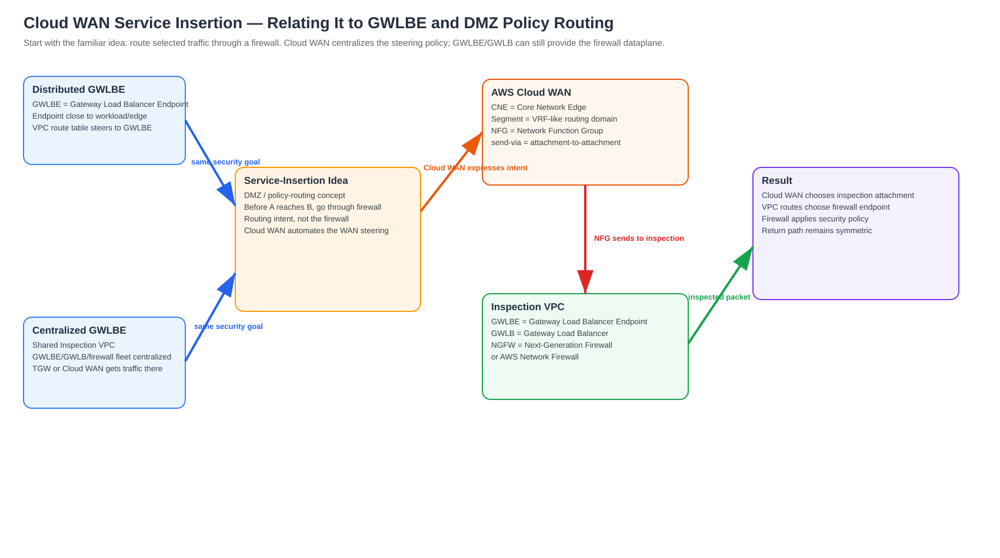
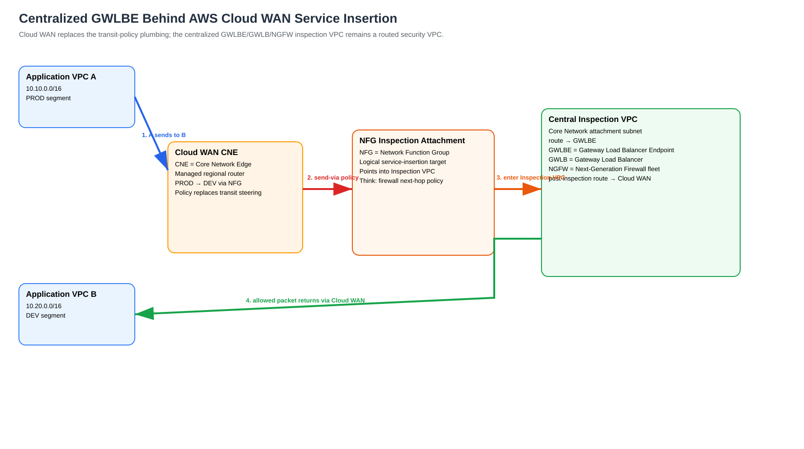
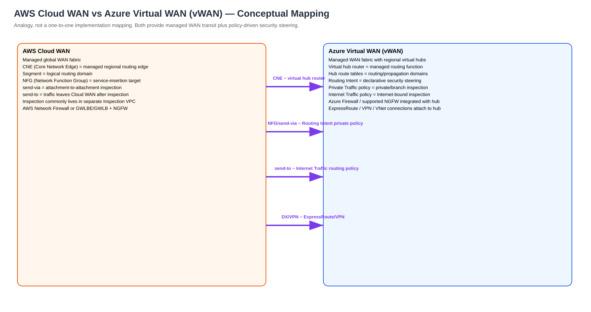

# AWS Cloud WAN Service Insertion — Explained from GWLBE, DMZ, Policy Routing, and Azure Virtual WAN Concepts

> **Rewritten:** 2026-09-06  
> **Audience:** Network/security engineers who understand firewall DMZ (demilitarized zone), route tables, policy routing, centralized inspection, Gateway Load Balancer, or Azure Virtual WAN, but are new to AWS Cloud WAN.  
> **Learning rule used in this guide:** Every important acronym is expanded inline so you do not have to jump back to a glossary.

## URLs used

- https://docs.aws.amazon.com/network-manager/latest/cloudwan/cloudwan-policy-service-insertion.html
- https://docs.aws.amazon.com/network-manager/latest/cloudwan/cloudwan-policy-network-function-groups.html
- https://docs.aws.amazon.com/network-manager/latest/cloudwan/cloudwan-policies-json.html
- https://aws.amazon.com/blogs/networking-and-content-delivery/simplify-global-security-inspection-with-aws-cloud-wan-service-insertion/
- https://aws.amazon.com/blogs/networking-and-content-delivery/centralized-ingress-inspection-architecture-in-aws-cloud-wan/
- https://aws.amazon.com/blogs/networking-and-content-delivery/centralized-outbound-inspection-architecture-in-aws-cloud-wan/
- https://learn.microsoft.com/en-us/azure/virtual-wan/about-virtual-hub-routing
- https://learn.microsoft.com/en-us/azure/firewall-manager/secured-virtual-hub
- https://learn.microsoft.com/en-us/azure/networking/design-guide/virtual-wan

---

# 1. Start with the routing problem, not with AWS terminology

Suppose you have:

```text
Production network  10.10.0.0/16
Development network 10.20.0.0/16
```

and the rule is:

```text
Production
   |
   v
Firewall
   |
   v
Development
```

On a traditional network you might achieve this with a DMZ (demilitarized zone), VRFs (Virtual Routing and Forwarding instances), route leaking through a firewall, policy-based routing, static routes toward firewall interfaces, or a service chain.

The concept is simple:

> **The routing system must not forward directly to the destination. It must first select the firewall as an intermediate service hop.**

AWS Cloud WAN service insertion applies that same idea to a managed multi-Region WAN (Wide Area Network).

---

# 2. Relate it to distributed GWLBE (Gateway Load Balancer Endpoint)

In a distributed GWLBE (Gateway Load Balancer Endpoint) design, inspection is inserted close to the workload or edge:

```text
Workload subnet
      |
      | VPC (Virtual Private Cloud) route table
      v
GWLBE (Gateway Load Balancer Endpoint)
      |
      v
GWLB (Gateway Load Balancer)
      |
      v
NGFW (Next-Generation Firewall)
      |
      v
Destination
```

The VPC (Virtual Private Cloud) route table performs the steering decision. The GWLBE (Gateway Load Balancer Endpoint) takes the flow into the GWLB (Gateway Load Balancer) service, and the GWLB (Gateway Load Balancer) selects a healthy NGFW (Next-Generation Firewall).

Think of this as **per-VPC service insertion**.

---

# 3. Relate it to centralized GWLBE (Gateway Load Balancer Endpoint)

In a centralized GWLBE (Gateway Load Balancer Endpoint) design, many VPCs (Virtual Private Clouds) share one Inspection VPC (Virtual Private Cloud):

```text
Application VPC
      |
      v
Transit fabric
      |
      v
Inspection VPC
      |
      v
GWLBE (Gateway Load Balancer Endpoint)
      |
      v
GWLB (Gateway Load Balancer)
      |
      v
NGFW (Next-Generation Firewall)
      |
      v
Transit fabric
      |
      v
Destination VPC
```

With TGW (Transit Gateway), you normally build explicit PRE-inspection and POST-inspection route-table behavior:

```text
Application attachment
 -> PRE-INSPECTION TGW (Transit Gateway) route table
 -> Inspection VPC attachment
 -> GWLBE (Gateway Load Balancer Endpoint)
 -> GWLB (Gateway Load Balancer)
 -> NGFW (Next-Generation Firewall)
 -> POST-INSPECTION path
 -> destination attachment
```

AWS Cloud WAN does **not** replace the GWLBE (Gateway Load Balancer Endpoint), GWLB (Gateway Load Balancer), or NGFW (Next-Generation Firewall). It replaces or simplifies much of the **transit steering logic above those components**.

---

# 4. Where AWS Cloud WAN fits

Compare the two models:

```text
Centralized TGW (Transit Gateway)

TGW route-table engineering
        |
        v
Inspection VPC
        |
        v
GWLBE -> GWLB -> NGFW
```

versus:

```text
AWS Cloud WAN

Central policy:
"PROD traffic going to DEV must use the firewall service"
        |
        v
NFG (Network Function Group)
        |
        v
Inspection VPC
        |
        v
GWLBE -> GWLB -> NGFW
```

The sentence to remember is:

> **NFG (Network Function Group) is not the firewall. NFG (Network Function Group) is the AWS Cloud WAN object representing where the firewall or other network function lives.**

---

# 5. Concept map



[Editable draw.io source](images/09-06-26-17-01_AWS_Cloud_WAN_Service_Insertion_Deep_Dive_concept_map.drawio)

**What this image shows**

Distributed GWLBE (Gateway Load Balancer Endpoint), centralized GWLBE (Gateway Load Balancer Endpoint), and AWS Cloud WAN service insertion all answer the same security-routing question: **how do I force selected traffic through a security service?**

**What matters**

AWS Cloud WAN adds a WAN-level policy layer. The firewall dataplane can still be the centralized GWLBE (Gateway Load Balancer Endpoint) + GWLB (Gateway Load Balancer) + NGFW (Next-Generation Firewall) architecture.

**What to verify**

```text
AWS Cloud WAN policy
    = Which traffic requires inspection?

Inspection VPC route tables
    = How does the packet physically reach the firewall endpoint?

GWLB (Gateway Load Balancer)
    = Which firewall appliance receives the flow?

NGFW (Next-Generation Firewall)
    = Is the packet/session permitted?
```

---

# 6. Translate AWS Cloud WAN terminology into familiar network concepts

| AWS Cloud WAN term | Think of it as |
|---|---|
| CNE (Core Network Edge) | AWS-managed regional router |
| Segment | VRF-like routing/security domain |
| Attachment | Logical interface/connection to the managed WAN router |
| NFG (Network Function Group) | Logical firewall/service-chain next-hop group |
| `send-via` | Policy route: “before reaching another attached network, traverse this service” |
| `send-to` | Policy route: “traverse this security/egress service and then leave AWS Cloud WAN” |
| Core Network Policy | Central declarative WAN configuration |
| Edge override | Prefer the network function in a particular AWS Region |
| Appliance mode | Attachment behavior used to preserve stateful middlebox symmetry |

---

# 7. CNE (Core Network Edge) — think managed regional router

A CNE (Core Network Edge) is the AWS-managed regional routing node for AWS Cloud WAN.

Do not picture a firewall. Picture an AWS-operated router:

```text
                 CNE (Core Network Edge)
                 /                    \
          PROD segment             DEV segment
```

You do not log into a CNE (Core Network Edge). AWS creates and operates it.

---

# 8. Segment — think VRF-like routing domain

A segment is conceptually similar to a VRF (Virtual Routing and Forwarding instance).

For example:

```text
PROD segment
DEV segment
SHARED segment
HYBRID segment
```

Attachments join a segment:

```text
PROD segment
  - App-VPC-A
  - App-VPC-B

DEV segment
  - Dev-VPC-A

HYBRID segment
  - DXGW (Direct Connect Gateway)
  - VPN (Virtual Private Network)
```

---

# 9. NFG (Network Function Group) — think service-chain next hop

The name NFG (Network Function Group) sounds like a firewall cluster, but that is the wrong mental model.

Use this instead:

> **NFG (Network Function Group) = a logical next-hop group that tells AWS Cloud WAN where the network/security service lives.**

Example:

```text
NFG (Network Function Group): Central-Firewall

Inspection VPC attachment in us-east-1
Inspection VPC attachment in us-west-2
```

Inside the Inspection VPC (Virtual Private Cloud) you could have:

```text
GWLBE (Gateway Load Balancer Endpoint)
      |
      v
GWLB (Gateway Load Balancer)
      |
      v
Palo Alto / Fortinet / Check Point NGFW (Next-Generation Firewall)
```

or AWS Network Firewall.

The NFG (Network Function Group) itself does not inspect packets.

---

# 10. DMZ (demilitarized zone) / policy-routing analogy

Traditional network:

```text
VRF PROD
   |
   | route/policy: DEV prefixes -> firewall
   v
Firewall
   |
   v
VRF DEV
```

AWS Cloud WAN service insertion is the same broad idea expressed declaratively:

```text
When traffic originates in PROD
and is sent to DEV,
send it through Central-Firewall NFG (Network Function Group).
```

That is a centrally managed service chain.

---

# 11. `send-via` — firewall between two AWS Cloud WAN attachments

Use `send-via` when the source and final destination are both represented by AWS Cloud WAN attachments.

Examples:

```text
VPC -> firewall -> VPC
VPC -> firewall -> Direct Connect
Direct Connect -> firewall -> VPC
VPN -> firewall -> VPC
VPC -> firewall -> VPN
```

Conceptually:

```text
Cloud WAN attachment
       |
       v
NFG (Network Function Group)
       |
       v
Firewall
       |
       v
AWS Cloud WAN again
       |
       v
Destination attachment
```

AWS documentation describes `send-via` as attachment-to-attachment/east-west service insertion.

A Direct Connect-to-VPC path can still be `send-via` because both sides are AWS Cloud WAN attachments.

---

# 12. `send-to` — firewall, then leave AWS Cloud WAN

Use `send-to` when the packet should leave the AWS Cloud WAN environment after inspection.

Most obvious case: Internet egress.

```text
Application VPC
     |
     v
AWS Cloud WAN
     |
     v
NFG (Network Function Group)
     |
     v
Inspection VPC
     |
     v
GWLBE (Gateway Load Balancer Endpoint)
     |
     v
GWLB (Gateway Load Balancer)
     |
     v
NGFW (Next-Generation Firewall)
     |
     v
NAT Gateway
     |
     v
Internet Gateway
     |
     v
Internet
```

Remember:

```text
send-via = AWS Cloud WAN -> firewall -> AWS Cloud WAN -> another attachment
send-to  = AWS Cloud WAN -> firewall -> outside
```

---

# 13. Centralized GWLBE (Gateway Load Balancer Endpoint) behind AWS Cloud WAN



[Editable draw.io source](images/09-06-26-17-01_AWS_Cloud_WAN_Service_Insertion_Deep_Dive_centralized_gwlbe_mapping.drawio)

**What this image shows**

The CNE (Core Network Edge) performs the managed WAN routing decision. The NFG (Network Function Group) identifies the inspection attachment. The Inspection VPC (Virtual Private Cloud) performs normal GWLBE (Gateway Load Balancer Endpoint), GWLB (Gateway Load Balancer), and NGFW (Next-Generation Firewall) forwarding.

**What matters**

There are two separate route decisions:

```text
AWS Cloud WAN decision:
Should this flow visit inspection?

Inspection VPC decision:
Which GWLBE (Gateway Load Balancer Endpoint) receives it,
and where should the packet go after inspection?
```

AWS Cloud WAN does not eliminate the second decision.

---

# 14. Exact packet walk — VPC A to VPC B

Assume:

```text
Application VPC A 10.10.0.0/16 -> PROD segment
Application VPC B 10.20.0.0/16 -> DEV segment
Inspection VPC    10.255.0.0/16
NFG (Network Function Group) = Central-Firewall
```

Security intent:

```text
PROD -> DEV must use Central-Firewall NFG (Network Function Group)
```

## Step 1 — source workload

```text
Source:      10.10.1.10
Destination: 10.20.1.20
Protocol:    TCP/443
```

## Step 2 — source VPC (Virtual Private Cloud) route table

Conceptually:

```text
10.20.0.0/16 -> AWS Cloud WAN attachment
```

## Step 3 — packet reaches CNE (Core Network Edge)

The CNE (Core Network Edge) performs the PROD segment lookup and applies service-insertion intent.

Instead of forwarding directly to DEV:

```text
PROD -> DEV -> Central-Firewall NFG (Network Function Group)
```

## Step 4 — packet enters the NFG (Network Function Group) attachment

The NFG (Network Function Group) selects the appropriate Inspection VPC attachment according to the AWS Cloud WAN policy and Regional placement.

## Step 5 — Inspection VPC (Virtual Private Cloud) routing takes over

Conceptually:

```text
Core Network attachment subnet route table
10.20.0.0/16 -> GWLBE (Gateway Load Balancer Endpoint)
```

## Step 6 — GWLBE (Gateway Load Balancer Endpoint)

The GWLBE (Gateway Load Balancer Endpoint) injects the flow into the GWLB (Gateway Load Balancer) service.

## Step 7 — GWLB (Gateway Load Balancer)

The GWLB (Gateway Load Balancer) selects a healthy NGFW (Next-Generation Firewall). AWS uses GENEVE (Generic Network Virtualization Encapsulation) between the GWLB (Gateway Load Balancer) service and participating appliances.

## Step 8 — NGFW (Next-Generation Firewall)

Example firewall policy:

```text
Source zone: PROD
Destination zone: DEV
Destination: 10.20.0.0/16
Service/application: HTTPS
Action: allow
```

## Step 9 — packet leaves the firewall service chain

The allowed packet returns through the GWLB (Gateway Load Balancer) / GWLBE (Gateway Load Balancer Endpoint) service path.

## Step 10 — Inspection VPC (Virtual Private Cloud) routes toward AWS Cloud WAN

Post-inspection VPC (Virtual Private Cloud) routing points back toward the AWS Cloud WAN attachment.

## Step 11 — AWS Cloud WAN continues to DEV

The NFG (Network Function Group) forwarding context returns the allowed packet to AWS Cloud WAN, and the DEV segment routes it to Application VPC B.

## Step 12 — destination host receives the packet

```text
10.20.1.20 receives TCP/443
```

---

# 15. Return path and appliance mode

A stateful NGFW (Next-Generation Firewall) must see both directions:

```text
10.10.1.10 -> 10.20.1.20
10.20.1.20 -> 10.10.1.10
```

AWS Cloud WAN service insertion is designed to preserve the service-insertion relationship in both directions.

The Inspection VPC (Virtual Private Cloud) still needs correct zonal routes.

Appliance mode is an attachment behavior for stateful middleboxes. Think:

> **Keep the flow associated with the stateful service path rather than allowing normal distributed routing to create asymmetric traversal.**

You still want a zonal pattern such as:

```text
AZ-A (Availability Zone A) flow
 -> AZ-A GWLBE (Gateway Load Balancer Endpoint)
 -> firewall path
 -> AZ-A return path
```

AWS Cloud WAN cannot fix a bad Inspection VPC (Virtual Private Cloud) route table that bypasses the firewall on the reverse path.

---

# 16. Distributed vs centralized vs AWS Cloud WAN steering

| Architecture | Where is steering decided? | Where is the firewall endpoint? |
|---|---|---|
| Distributed GWLBE (Gateway Load Balancer Endpoint) | Workload/edge VPC route table | Close to workload |
| Centralized GWLBE (Gateway Load Balancer Endpoint) + TGW (Transit Gateway) | TGW route tables + Inspection VPC route tables | Shared Inspection VPC |
| Centralized GWLBE (Gateway Load Balancer Endpoint) + AWS Cloud WAN | AWS Cloud WAN policy + Inspection VPC route tables | Shared Inspection VPC |
| AWS Network Firewall + AWS Cloud WAN | AWS Cloud WAN policy + Inspection VPC route tables | Shared Inspection VPC |

The firewall can be the same. The difference is primarily **who controls the transit steering**.

---

# 17. VPC (Virtual Private Cloud) route tables still matter

AWS Cloud WAN service insertion simplifies WAN-level routing policy. It does not remove VPC (Virtual Private Cloud) route tables.

A centralized GWLB (Gateway Load Balancer) inspection design can still need:

```text
Application VPC route table:
remote prefixes -> AWS Cloud WAN
0.0.0.0/0       -> AWS Cloud WAN   # if centralized Internet egress is required
```

```text
Inspection VPC Cloud WAN attachment subnet route table:
traffic requiring inspection -> GWLBE (Gateway Load Balancer Endpoint)
```

```text
Post-inspection routing:
application prefixes -> AWS Cloud WAN attachment
Internet default      -> NAT Gateway
```

```text
NAT Gateway subnet route table:
0.0.0.0/0 -> Internet Gateway
application return prefixes -> firewall path
```

Remember:

> **AWS Cloud WAN chooses the Inspection VPC (Virtual Private Cloud). The Inspection VPC (Virtual Private Cloud) route tables choose the firewall endpoint.**

---

# 18. Does AWS Cloud WAN resemble Azure Virtual WAN (vWAN)?

**Yes. Azure Virtual WAN (vWAN) is one of the best analogies.**

The closest Azure design is:

```text
Azure Virtual WAN (vWAN)
+
Routing Intent
+
Secured Virtual Hub
```

Microsoft documents Routing Intent as a way to steer private and Internet traffic through a security solution associated with an Azure Virtual WAN (vWAN) hub.

AWS Cloud WAN follows the same broad architecture principle:

```text
AWS Cloud WAN
+
Core Network Policy
+
NFG (Network Function Group)
```

Both allow you to declare security-routing intent rather than manually constructing every transit route.

---

# 19. AWS Cloud WAN vs Azure Virtual WAN (vWAN)



[Editable draw.io source](images/09-06-26-17-01_AWS_Cloud_WAN_Service_Insertion_Deep_Dive_azure_vwan_comparison.drawio)

**What this image shows**

A conceptual mapping between the AWS Cloud WAN and Azure Virtual WAN (vWAN) routing/security models.

**What matters**

This is an analogy. The implementations and resource models are not identical.

| AWS concept | Azure concept | Similar idea |
|---|---|---|
| AWS Cloud WAN | Azure Virtual WAN (vWAN) | Managed WAN/transit fabric |
| CNE (Core Network Edge) | Azure virtual hub router | Managed regional routing function |
| Segment | Azure virtual hub route-table/routing-domain design | Logical routing separation |
| Core Network Policy | Azure Virtual WAN routing configuration | Central network intent |
| NFG (Network Function Group) | Security next-hop used by Routing Intent | Service insertion target |
| `send-via` | Private Traffic Routing Policy | Force private/transit traffic through security |
| `send-to` | Internet Traffic Routing Policy | Force Internet-bound traffic through security |
| Direct Connect attachment | ExpressRoute connection | Private hybrid connectivity |
| VPN (Virtual Private Network) attachment | Site-to-site VPN connection | Encrypted hybrid connectivity |
| AWS Network Firewall | Azure Firewall | Cloud-native managed firewall |
| GWLB (Gateway Load Balancer) + NGFW (Next-Generation Firewall) | Supported third-party NVA (Network Virtual Appliance) patterns | Third-party security service |

---

# 20. Important Azure Virtual WAN (vWAN) difference

Azure Virtual WAN (vWAN) can integrate Azure Firewall or supported NGFW (Next-Generation Firewall) solutions with the virtual-hub security architecture.

AWS Cloud WAN commonly represents the security service through an NFG (Network Function Group) whose attachment leads into an Inspection VPC (Virtual Private Cloud).

Useful mental pictures:

```text
Azure

VNet (Virtual Network)
 |
 v
Azure Virtual WAN (vWAN) hub
 |
 v
Routing Intent
 |
 v
Azure Firewall / supported security next hop
```

versus:

```text
AWS

VPC (Virtual Private Cloud)
 |
 v
CNE (Core Network Edge)
 |
 v
send-via / send-to
 |
 v
NFG (Network Function Group)
 |
 v
Inspection VPC (Virtual Private Cloud)
 |
 v
GWLBE (Gateway Load Balancer Endpoint)
 |
 v
GWLB (Gateway Load Balancer)
 |
 v
NGFW (Next-Generation Firewall)
```

---

# 21. Internet egress — relate `send-to` to a default route through a firewall

Traditional enterprise:

```text
User VLAN
 -> 0.0.0.0/0
 -> Core
 -> Firewall
 -> NAT (Network Address Translation)
 -> Internet
```

AWS Cloud WAN:

```text
Application VPC
 -> 0.0.0.0/0 toward AWS Cloud WAN
 -> PROD segment
 -> send-to
 -> NFG (Network Function Group)
 -> Inspection VPC (Virtual Private Cloud)
 -> GWLBE (Gateway Load Balancer Endpoint)
 -> GWLB (Gateway Load Balancer)
 -> NGFW (Next-Generation Firewall)
 -> NAT Gateway
 -> Internet Gateway
 -> Internet
```

So `send-to` is easiest to remember as **managed security-egress/default-route service insertion**.

---

# 22. Direct Connect — relate it to a WAN-edge firewall

Suppose:

```text
Data center    192.168.0.0/16
Production VPC 10.10.0.0/16
```

AWS path:

```text
Data center router
 |
Direct Connect
 |
DXGW (Direct Connect Gateway)
 |
AWS Cloud WAN HYBRID segment
 |
send-via
 |
NFG (Network Function Group)
 |
Inspection VPC (Virtual Private Cloud)
 |
GWLBE (Gateway Load Balancer Endpoint)
 |
GWLB (Gateway Load Balancer)
 |
NGFW (Next-Generation Firewall)
 |
PROD segment
 |
Production VPC (Virtual Private Cloud)
```

This maps naturally to `send-via` because the Direct Connect side and VPC (Virtual Private Cloud) side are both AWS Cloud WAN attachments.

---

# 23. VPN (Virtual Private Network) and SD-WAN (Software-Defined Wide Area Network)

The same logic applies to VPN (Virtual Private Network) or Connect/SD-WAN (Software-Defined Wide Area Network) attachments:

```text
Branch
 |
VPN (Virtual Private Network) / SD-WAN (Software-Defined Wide Area Network)
 |
AWS Cloud WAN BRANCH segment
 |
send-via
 |
NFG (Network Function Group)
 |
Inspection VPC (Virtual Private Cloud)
 |
Firewall
 |
PROD segment
 |
Application VPC (Virtual Private Cloud)
```

The AWS Cloud WAN policy provides the service chain. VPN (Virtual Private Network), BGP (Border Gateway Protocol), or SD-WAN (Software-Defined Wide Area Network) still provides route reachability.

---

# 24. Single-hop and dual-hop in firewall language

## Single-hop

```text
VPC A
 -> AWS Cloud WAN
 -> one inspection location
 -> AWS Cloud WAN
 -> VPC B
```

Think: **inspect once**.

## Dual-hop

```text
VPC A
 -> source-Region firewall
 -> AWS global WAN
 -> destination-Region firewall
 -> VPC B
```

Think: **inspect at both regional service edges**.

This is not two firewalls in HA (High Availability). It is two separate service-insertion points.

---

# 25. Edge override in normal routing language

Suppose:

```text
Workload Region: us-west-2
Firewall Regions: us-east-1 and us-west-1
```

You prefer:

```text
us-west-2 -> us-west-1 inspection
```

An edge override tells AWS Cloud WAN which Regional NFG (Network Function Group) attachment should be preferred.

Think: **for this WAN edge, use this service-chain Region**.

---

# 26. Why AWS Cloud WAN instead of only TGW (Transit Gateway)?

TGW (Transit Gateway) can absolutely build centralized firewall inspection.

A multi-Region TGW (Transit Gateway) architecture can require:

```text
TGW (Transit Gateway) us-east-1
TGW (Transit Gateway) us-west-2
TGW (Transit Gateway) eu-west-1
TGW peering
PRE-inspection route tables
POST-inspection route tables
Regional firewalls
Inter-Region steering
Direct Connect / VPN integration
```

AWS Cloud WAN moves more of the global transit intent into one managed policy.

Use this comparison:

```text
TGW (Transit Gateway)
= regional transit router whose route tables you engineer

AWS Cloud WAN
= managed global WAN where you declare more of the routing intent
```

That resembles the difference between manually engineered Azure hub/spoke VNets (Virtual Networks) and Azure Virtual WAN (vWAN).

---

# 27. When distributed GWLBE (Gateway Load Balancer Endpoint) makes more sense

Use distributed GWLBE (Gateway Load Balancer Endpoint) when:

- inspection must happen close to the workload
- each VPC (Virtual Private Cloud) needs independent routing/security ownership
- traffic should not detour through a central Inspection VPC (Virtual Private Cloud)
- only selected subnets require inspection
- very fine-grained per-VPC (Virtual Private Cloud) insertion is required

Distributed GWLBE (Gateway Load Balancer Endpoint) can coexist with AWS Cloud WAN, but decide whether a flow is inspected locally, centrally, or both to avoid accidental double inspection.

---

# 28. When centralized GWLBE (Gateway Load Balancer Endpoint) + AWS Cloud WAN makes sense

This model fits when:

- many VPCs (Virtual Private Clouds) share one NGFW (Next-Generation Firewall) fleet
- several AWS Regions participate
- Direct Connect and VPN (Virtual Private Network) traffic need consistent inspection
- you want one global security-routing policy
- you want less TGW (Transit Gateway) PRE/POST route-table engineering
- centralized firewall policy and logging are desirable

---

# 29. Troubleshooting — follow the layers

## Layer 1 — Application VPC (Virtual Private Cloud)

Did the VPC (Virtual Private Cloud) route table send the flow toward AWS Cloud WAN?

```cli
aws ec2 describe-route-tables
```

## Layer 2 — AWS Cloud WAN segment

Did AWS Cloud WAN apply the service-insertion decision?

```cli
aws networkmanager get-network-routes \
  --global-network-id <global-network-id> \
  --core-network-id <core-network-id> \
  --segment-name PROD \
  --edge-location us-east-1
```

## Layer 3 — NFG (Network Function Group)

Does the NFG (Network Function Group) have an available inspection attachment in the expected Region?

```cli
aws networkmanager list-attachments \
  --core-network-id <core-network-id>
```

A service-insertion policy can exist even while the required NFG (Network Function Group) attachment is missing; affected traffic can then black-hole.

## Layer 4 — Inspection VPC (Virtual Private Cloud)

Did the Inspection VPC (Virtual Private Cloud) route table point to the GWLBE (Gateway Load Balancer Endpoint)?

```cli
aws ec2 describe-route-tables \
  --filters Name=vpc-id,Values=<inspection-vpc-id>
```

## Layer 5 — GWLBE (Gateway Load Balancer Endpoint)

```cli
aws ec2 describe-vpc-endpoints \
  --filters Name=vpc-endpoint-type,Values=GatewayLoadBalancer
```

Verify endpoint state, AZ (Availability Zone), and endpoint service.

## Layer 6 — GWLB (Gateway Load Balancer)

```cli
aws elbv2 describe-target-health \
  --target-group-arn <target-group-arn>
```

Expected: healthy firewall targets.

## Layer 7 — NGFW (Next-Generation Firewall)

Verify:

- session table
- security-policy match
- zone mapping
- source/destination addresses
- application/service
- threat-policy drops
- reverse session

## Layer 8 — return path

Verify:

```text
Destination
 -> AWS Cloud WAN
 -> NFG (Network Function Group)
 -> Inspection VPC (Virtual Private Cloud)
 -> GWLBE (Gateway Load Balancer Endpoint)
 -> GWLB (Gateway Load Balancer)
 -> NGFW (Next-Generation Firewall)
 -> AWS Cloud WAN
 -> Source
```

---

# 30. Quick memory model

```text
Segment
= routing/security domain

CNE (Core Network Edge)
= AWS-managed regional router

NFG (Network Function Group)
= logical firewall/service next hop

send-via
= firewall is between two AWS Cloud WAN attachments

send-to
= firewall is before traffic leaves AWS Cloud WAN

GWLBE (Gateway Load Balancer Endpoint)
= VPC route-table target entering the GWLB service

GWLB (Gateway Load Balancer)
= distributes flows to firewall appliances

NGFW (Next-Generation Firewall)
= firewall that actually permits or denies the flow
```

Complete hierarchy:

```text
Application VPC route table
        |
        v
CNE (Core Network Edge)
        |
        | AWS Cloud WAN service-insertion policy
        v
NFG (Network Function Group)
        |
        v
Inspection VPC route table
        |
        v
GWLBE (Gateway Load Balancer Endpoint)
        |
        v
GWLB (Gateway Load Balancer)
        |
        v
NGFW (Next-Generation Firewall)
        |
        v
Inspection VPC route table
        |
        v
AWS Cloud WAN or Internet
```

---

# 31. One-sentence Azure Virtual WAN (vWAN) comparison

> **AWS Cloud WAN `send-via` / `send-to` through an NFG (Network Function Group) is conceptually similar to Azure Virtual WAN (vWAN) Routing Intent steering Private Traffic or Internet Traffic through a secured virtual-hub security resource, while AWS commonly places the actual GWLB (Gateway Load Balancer) / NGFW (Next-Generation Firewall) service inside an attached Inspection VPC (Virtual Private Cloud).**

---

# Sources

- https://docs.aws.amazon.com/network-manager/latest/cloudwan/cloudwan-policy-service-insertion.html
- https://docs.aws.amazon.com/network-manager/latest/cloudwan/cloudwan-policy-network-function-groups.html
- https://docs.aws.amazon.com/network-manager/latest/cloudwan/cloudwan-policies-json.html
- https://aws.amazon.com/blogs/networking-and-content-delivery/simplify-global-security-inspection-with-aws-cloud-wan-service-insertion/
- https://aws.amazon.com/blogs/networking-and-content-delivery/centralized-ingress-inspection-architecture-in-aws-cloud-wan/
- https://aws.amazon.com/blogs/networking-and-content-delivery/centralized-outbound-inspection-architecture-in-aws-cloud-wan/
- https://learn.microsoft.com/en-us/azure/virtual-wan/about-virtual-hub-routing
- https://learn.microsoft.com/en-us/azure/firewall-manager/secured-virtual-hub
- https://learn.microsoft.com/en-us/azure/networking/design-guide/virtual-wan
