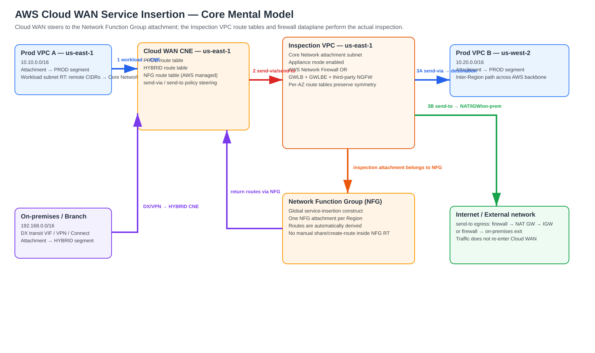
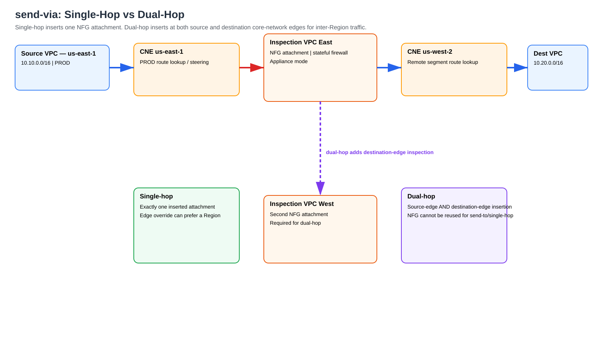
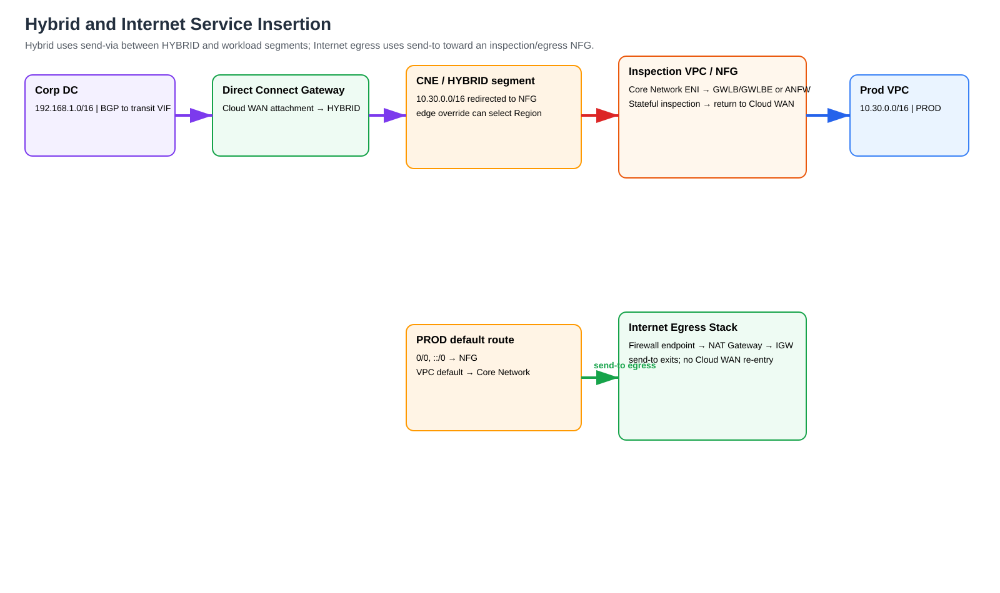

# AWS Cloud WAN Service Insertion — Deep Dive

> **Generated:** 2026-09-06  
> **Scope:** Network Function Groups (NFGs), `send-via`, `send-to`, single-hop/dual-hop inspection, same-segment and cross-segment steering, multi-Region selection, Direct Connect, VPN, Connect/SD-WAN, AWS Network Firewall, Gateway Load Balancer (GWLB), third-party NGFWs, Internet egress, routing, symmetry, CLI, verification, failover, limitations, and troubleshooting.

## Supplied and supporting URLs

### Primary AWS documentation
- https://docs.aws.amazon.com/network-manager/latest/cloudwan/cloudwan-policy-service-insertion.html
- https://docs.aws.amazon.com/network-manager/latest/cloudwan/cloudwan-policy-network-function-groups.html
- https://docs.aws.amazon.com/network-manager/latest/cloudwan/cloudwan-policy-network-actions-routes.html
- https://docs.aws.amazon.com/network-manager/latest/cloudwan/cloudwan-policies-json.html
- https://docs.aws.amazon.com/network-manager/latest/cloudwan/cloudwan-policy-examples.html

### AWS implementation references
- https://aws.amazon.com/blogs/networking-and-content-delivery/simplify-global-security-inspection-with-aws-cloud-wan-service-insertion/
- https://aws.amazon.com/blogs/networking-and-content-delivery/simplifying-egress-inspection-with-aws-cloud-wan-service-insertion-for-greenfield-deployments/
- https://aws.amazon.com/blogs/networking-and-content-delivery/simplify-hybrid-inspection-using-aws-cloud-wan-service-insertion/
- https://aws.amazon.com/blogs/networking-and-content-delivery/migration-to-aws-cloud-wan-multi-region-inspection-using-service-insertion/
- https://aws.amazon.com/cloud-wan/faqs/
- https://aws.amazon.com/cloud-wan/pricing/

---

## 1. The mental model

AWS Cloud WAN service insertion is **policy-driven route steering in the Cloud WAN core**. The Core Network Edge (CNE) does not become a firewall. Instead, AWS changes the next hop for selected traffic so the packet is delivered to an attachment that belongs to a **Network Function Group (NFG)**.

That NFG attachment normally leads to an Inspection VPC containing:

- AWS Network Firewall (ANFW), or
- Gateway Load Balancer (GWLB) + Gateway Load Balancer Endpoint (GWLBE) + third-party NGFW, or
- another supported network/security function.

After inspection, the flow either returns to Cloud WAN for another attachment or exits the Cloud WAN-connected environment.

| Action | Meaning | Re-enters Cloud WAN after inspection? | Typical use |
|---|---|---:|---|
| `send-via` | attachment-to-attachment steering | Yes | VPC↔VPC, VPC↔DX/VPN/Connect, segment↔segment |
| `send-to` | steer to function, then leave Cloud WAN | No | Internet egress or external/on-prem egress |
| `send-via` single-hop | insert one NFG attachment | Yes | inspect once |
| `send-via` dual-hop | insert at source and destination CNEs | Yes | inspect both sides of inter-Region traffic |

**Source information:** AWS documents `send-via` as bidirectional east-west steering and `send-to` as north-south steering. Service insertion works for same-Region and cross-Region traffic, and for both IPv4 and IPv6.

**Additional explanation:** In this context, “east-west” should be read as **Cloud WAN attachment-to-attachment**. A Direct Connect Gateway attachment in a `HYBRID` segment communicating with a VPC attachment in `PROD` is therefore a `send-via` design even though one endpoint is on-premises.

---

## 2. Architecture — Cloud WAN steering versus firewall dataplane



[Editable draw.io source](images/09-06-26-17-01_AWS_Cloud_WAN_Service_Insertion_Deep_Dive_architecture.drawio)

**What this image shows**

Workload and hybrid attachments enter the regional CNE. A service-insertion segment action redirects selected destinations toward an NFG attachment. Inside the Inspection VPC, VPC route tables send traffic through ANFW or GWLBE/GWLB/NGFW. The allowed packet either comes back to Cloud WAN (`send-via`) or leaves toward NAT Gateway/IGW or another external exit (`send-to`).

**What matters**

Cloud WAN gets traffic **to the inspection attachment**. It does not build the internal inspection-VPC route tables for you. The Inspection VPC must have correct routes from the Core Network attachment subnet to firewall endpoints and from the firewall back toward Cloud WAN or the egress stack.

**What to verify**

- attachment is associated with the intended NFG
- NFG has a usable attachment in the desired Region
- appliance mode is enabled on the inspection VPC attachment
- per-AZ routes point to the intended ANFW endpoint or GWLBE
- return traffic crosses the same stateful inspection path

---

## 3. Core components

### 3.1 Core Network Edge (CNE)

A CNE is the AWS-managed regional routing node for a Cloud WAN core network. Segments exist as routing domains at each enabled CNE, and CNEs are interconnected across the AWS backbone.

### 3.2 Segment

A segment is a global Layer-3 routing domain, conceptually similar to a VRF. Common examples are `PROD`, `DEV`, `SHARED`, and `HYBRID`.

### 3.3 Network Function Group (NFG)

The NFG is the key service-insertion construct.

AWS documents these properties:

- an NFG is global and can contain attachments from multiple Cloud WAN Regions;
- only **one attachment per NFG per Region** is allowed;
- an attachment can belong to a segment **or** an NFG, but not both;
- NFG route tables are managed as part of service insertion;
- you can inspect NFG routes, but you do not manually treat the NFG like a normal workload segment;
- Cloud WAN can successfully apply a policy referencing an NFG that currently has no attachment, but affected traffic is **black-holed** until an appropriate NFG attachment exists.

### 3.4 Supported attachment types

AWS currently documents these service-insertion-capable Cloud WAN attachment categories:

- VPC
- Direct Connect Gateway
- Site-to-Site VPN
- Connect
- Transit Gateway route table

This means service insertion is not limited to VPC-to-VPC traffic.

### 3.5 Attachment policies and tags

NFG association is driven by tags on the **Cloud WAN attachment**. Do not assume a tag on the underlying VPC resource by itself controls Cloud WAN association.

For example, an Inspection VPC attachment might be tagged:

```text
environment = InspectionNFG
```

and the attachment policy maps that attachment to `InspectionNFG`.

---

## 4. How Cloud WAN changes routing

Assume:

```text
Prod VPC A: 10.10.0.0/16, us-east-1
Prod VPC B: 10.20.0.0/16, us-west-2
Inspection NFG attachment: us-east-1
```

Without service insertion the source segment can have direct Cloud WAN reachability to the destination attachment.

Conceptually, `send-via` changes the effective forwarding relationship to:

```text
PROD / us-east-1
10.20.0.0/16 -> InspectionNFG attachment

InspectionNFG
10.20.0.0/16 -> destination workload attachment
10.10.0.0/16 -> source workload attachment
```

The exact route display should always be verified in Network Manager or with `get-network-routes` rather than inferred from the policy alone.

For egress `send-to`, AWS's published example describes a default route in the workload segment redirected to the local NFG attachment while the NFG has return reachability to the workload CIDR.

---

## 5. `send-via` — attachment-to-attachment inspection

Use `send-via` when the destination is another Cloud WAN attachment.

Examples:

- PROD VPC → DEV VPC
- VPC → VPC in the same segment
- VPC → VPC across Regions
- VPC → Direct Connect/on-premises
- Direct Connect/on-premises → VPC
- VPN/branch → VPC
- Connect/SD-WAN → VPC

AWS documents `send-via` as **bidirectional**. If PROD-to-HYBRID is configured through an NFG, an inverse HYBRID-to-PROD service-insertion statement is not required merely to force the return path through the same insertion construct.

### 5.1 Single-hop

Single-hop traverses one intermediate NFG attachment. When multiple candidate inspection Regions exist, Cloud WAN uses deterministic Region-selection behavior; edge overrides can be used to influence which Region is preferred.

Use single-hop when one inspection is enough and minimizing additional processing/latency is important.

### 5.2 Dual-hop

Dual-hop inserts network functions at both the source and destination CNEs for the flow.

```text
Source VPC
 -> source CNE
 -> source-Region inspection attachment
 -> AWS backbone
 -> destination-Region inspection attachment
 -> destination CNE
 -> destination VPC
```

AWS requires the appropriate inspection attachment in both Regions for this model.

**Important limitation:** if an NFG is used for a dual-hop `send-via` action, that NFG cannot also be reused for single-hop or `send-to`.

### 5.3 Diagram



[Editable draw.io source](images/09-06-26-17-01_AWS_Cloud_WAN_Service_Insertion_Deep_Dive_single_vs_dual.drawio)

**What this image shows**

Single-hop inserts one NFG attachment; dual-hop adds an inserted attachment on the other Regional edge.

**What matters**

Dual-hop is a Cloud WAN path behavior, not simply “two firewall VMs behind one GWLB.”

**What to verify**

- NFG attachment exists at both intended CNE Regions
- NFG is not also required for conflicting single-hop/`send-to` actions
- security policy is consistent between Regional firewall fleets

---

## 6. Same-segment service insertion

For VPCs that belong to the same segment, AWS requires **isolated mode** for mandatory service insertion.

Why: without isolation, attachments in the same segment can have direct connectivity and bypass the NFG.

Example intent:

```text
PROD-A 10.10.0.0/16
PROD-B 10.20.0.0/16
Both in PROD
All PROD-to-PROD flows must traverse InspectionNFG
```

The segment must be configured so direct attachment-to-attachment forwarding is not allowed to bypass the inserted function.

**Common mistake:** adding `send-via` for same-segment traffic but not isolating the segment.

---

## 7. Cross-segment packet flow

Assume:

```text
PROD VPC       10.10.0.0/16
DEV VPC        10.20.0.0/16
Inspection VPC 10.255.0.0/16
```

Forward path:

1. EC2 `10.10.1.10` sends to `10.20.1.20`.
2. Workload subnet route points the remote prefix/aggregate toward the Cloud WAN core attachment.
3. The VPC attachment delivers the packet to the local CNE.
4. The PROD segment route lookup is affected by the `send-via` action.
5. CNE selects the local/preferred `InspectionNFG` attachment.
6. Packet enters the Inspection VPC through the Cloud WAN attachment ENI.
7. The attachment-subnet route table directs it to ANFW or GWLBE.
8. Stateful firewall evaluates the packet.
9. Allowed packet returns to the Cloud WAN side of the Inspection VPC.
10. NFG routing sends it to the destination segment/attachment.
11. DEV VPC receives the packet.
12. Return traffic is steered back through the NFG, preserving the intended stateful path.

---

## 8. Multi-Region selection and edge overrides

If a Region does not have a local NFG attachment, Cloud WAN can use an inspection attachment in another Region according to its Region priority behavior.

This can produce a technically working but inefficient path such as:

```text
us-west-2 workload
 -> us-west-2 CNE
 -> us-east-1 inspection
 -> remote/local destination
```

AWS service insertion supports **edge overrides** to specify a preferred inspection edge for defined edge sets.

AWS's hybrid inspection example uses this to make `us-west-2` traffic prefer an Inspection VPC in `us-west-1` instead of a less desirable remote Region.

Example policy fragment:

```json
{
  "action": "send-via",
  "segment": "Production",
  "mode": "single-hop",
  "when-sent-to": {
    "segments": ["Hybrid"]
  },
  "via": {
    "network-function-groups": ["InspectionNFG"],
    "with-edge-overrides": [
      {
        "edge-sets": [["us-west-2"]],
        "use-edge-location": "us-west-1"
      }
    ]
  }
}
```

Use edge overrides for latency, deterministic firewall placement, Regional licensing strategy, compliance, and predictable return-path behavior.

---

## 9. Direct Connect service insertion

A native hybrid architecture can be:

```text
Corporate router
 -> Direct Connect
 -> transit VIF
 -> Direct Connect Gateway (DXGW)
 -> Cloud WAN Direct Connect attachment
 -> HYBRID segment
 -> send-via InspectionNFG
 -> firewall
 -> PROD segment
 -> workload VPC
```

This removes the need to insert Transit Gateway solely as a Direct Connect-to-Cloud-WAN bridge.

AWS notes:

- a DXGW can be associated with only one Cloud WAN segment;
- multiple DXGWs can be associated with one segment;
- a DX attachment can be associated with all or selected CNEs;
- Direct Connect BGP communities apply to DXGW behavior but do not by themselves determine Cloud WAN core routing decisions.

### 9.1 Direct Connect forward path

Assume:

```text
Corp:       192.168.10.0/24
Prod VPC:   10.30.0.0/16
Segments:   HYBRID and PROD
NFG:        InspectionNFG
```

1. Corporate router advertises `192.168.10.0/24` over BGP on the transit VIF.
2. DXGW receives the route.
3. Cloud WAN DX attachment makes the route available to the HYBRID routing domain according to the association/policy.
4. A packet toward `10.30.0.0/16` arrives at the CNE.
5. HYBRID↔PROD `send-via` redirects to `InspectionNFG`.
6. Firewall inspects the packet.
7. NFG returns the allowed packet to Cloud WAN.
8. PROD segment forwards to the Prod VPC attachment.
9. VPC routing delivers to the workload.

Reverse:

1. Prod workload routes `192.168.10.0/24` toward Cloud WAN.
2. PROD↔HYBRID service insertion sends it through the same NFG intent.
3. Firewall sees the reverse direction.
4. NFG sends back to Cloud WAN.
5. HYBRID selects DXGW.
6. DXGW sends the packet over the appropriate transit VIF/BGP path.

---

## 10. VPN and Connect/SD-WAN

A Site-to-Site VPN attachment can be associated with a branch/hybrid segment and inspected with the same `send-via` model:

```text
Branch
 -> IPsec/BGP
 -> Cloud WAN VPN attachment
 -> HYBRID/BRANCH segment
 -> InspectionNFG
 -> PROD/SHARED
 -> VPC
```

Verify:

- both VPN tunnels/BGP peers
- `vpn-ecmp-support` policy behavior
- equal-cost paths and stateful firewall expectations
- return reachability through the NFG

For Connect/SD-WAN:

```text
SD-WAN edge
 -> Connect peer/attachment
 -> BRANCH segment
 -> send-via InspectionNFG
 -> workload segment
```

The SD-WAN overlay control plane and Cloud WAN core policy are separate. Verify both route advertisements and Cloud WAN insertion routes.

---

## 11. Internet egress with `send-to`

Use `send-to` when the packet is sent to the network function and then **does not re-enter Cloud WAN** after the external exit.

Typical path:

```text
Prod workload
 -> Cloud WAN
 -> PROD default route
 -> InspectionNFG
 -> ANFW or GWLB/GWLBE/NGFW
 -> NAT Gateway
 -> Internet Gateway
 -> Internet
```

Example:

```json
{
  "action": "send-to",
  "segment": "PROD",
  "via": {
    "network-function-groups": ["InspectionNFG"]
  }
}
```

AWS's egress example describes Cloud WAN adding/using `0.0.0.0/0` and `::/0` redirections in the workload segment toward the NFG, and return reachability from the NFG toward the workload attachment.

### 11.1 Workload route table

Conceptually:

```text
Destination       Target
10.10.0.0/16      local
0.0.0.0/0         Cloud WAN core network attachment
```

### 11.2 Inspection entry subnet

```text
Destination       Target
0.0.0.0/0         ANFW endpoint or GWLBE
workload CIDRs    Cloud WAN return path
```

### 11.3 Firewall egress subnet

```text
0.0.0.0/0         NAT Gateway
```

### 11.4 NAT subnet

```text
0.0.0.0/0         Internet Gateway
workload CIDRs    firewall return path
```

### 11.5 Exact packet path

For `10.10.1.10:52144 -> 8.8.8.8:443`:

1. workload default route sends to Cloud WAN;
2. PROD CNE default is redirected to NFG;
3. Inspection VPC Core Network ENI receives the original packet;
4. VPC route sends it to ANFW/GWLBE;
5. firewall permits;
6. egress route sends to NAT Gateway;
7. NAT Gateway translates the private source to its public mapping;
8. IGW sends to the Internet;
9. response returns IGW → NAT Gateway;
10. NAT reverses translation;
11. NAT subnet's workload-return route forces the packet through the firewall again;
12. firewall matches reverse state;
13. packet returns to NFG/Cloud WAN;
14. NFG has reachability to the source workload attachment;
15. workload receives the response.

---

## 12. Hybrid and egress diagram



[Editable draw.io source](images/09-06-26-17-01_AWS_Cloud_WAN_Service_Insertion_Deep_Dive_hybrid_egress.drawio)

**What this image shows**

The upper flow is Direct Connect-to-VPC using `send-via`; the lower flow is Internet egress using `send-to`.

**What matters**

Do not classify DX-to-VPC as `send-to` merely because one endpoint is on-premises. If the final path returns to a Cloud WAN attachment, use the attachment-to-attachment model.

**What to verify**

- DXGW associated with HYBRID
- on-prem and VPC routes appear in expected CNE tables
- `send-via` points to the correct NFG attachment
- Internet default uses `send-to`
- return path is forced through the firewall before NFG/Cloud WAN

---

## 13. AWS Network Firewall inside the Inspection VPC

Cloud WAN and ANFW solve different layers:

- Cloud WAN: global routing/steering
- ANFW: packet inspection inside a VPC

Recommended zonal pattern:

```text
Cloud WAN attachment subnet AZ-a
 -> ANFW endpoint AZ-a
 -> NAT/egress subnet AZ-a
 -> NAT Gateway AZ-a
 -> IGW
```

Repeat per AZ where the service is deployed.

For east-west, the firewall's post-inspection route returns toward the Cloud WAN/NFG side rather than NAT/IGW.

Verify:

- firewall endpoint exists in every used AZ
- route tables select the same-AZ endpoint
- stateless default actions do not unintentionally bypass/drop expected traffic
- stateful rules match intended source/destination/application
- logs show both directions

---

## 14. GWLB + third-party NGFW

Typical dataplane:

```text
Cloud WAN Core Network ENI
 -> GWLBE
 -> GWLB
 -> third-party NGFW appliance fleet
 -> GWLB
 -> GWLBE
 -> Cloud WAN or NAT/IGW
```

GWLB contributes:

- transparent bump-in-the-wire service insertion
- target health management
- flow stickiness
- scale-out appliance fleets
- GENEVE encapsulation between GWLB and appliances

Cloud WAN is not aware of individual GWLB targets. It sees the NFG/VPC attachment.

For each AZ explicitly identify:

1. Core Network attachment subnet;
2. route to GWLBE;
3. GWLBE service/GWLB;
4. NGFW target group;
5. post-firewall route;
6. Cloud WAN return or NAT/IGW route;
7. reverse path.

GENEVE adds transport overhead on the GWLB-to-appliance path. Follow the firewall vendor's AWS GWLB MTU and interface requirements.

---

## 15. Appliance mode and state symmetry

AWS documents appliance mode as required for the Inspection VPC service-insertion attachment.

A stateful firewall tracks the 5-tuple:

```text
source IP
source port
destination IP
destination port
protocol
```

If forward and return packets traverse unrelated AZ paths or firewall state domains, sessions can fail even though routes appear reachable.

Appliance mode helps keep flows through the VPC attachment consistent for stateful middleboxes. It does **not** correct wrong VPC route tables. You must still design zonal symmetry through ANFW endpoints or GWLBE/GWLB and NAT Gateway where applicable.

---

## 16. Core Network Policy example

The following is a lab skeleton showing object relationships. Validate against the current Cloud WAN policy schema before deployment.

```json
{
  "version": "2021.12",
  "core-network-configuration": {
    "asn-ranges": ["64520-64529"],
    "edge-locations": [
      {"location": "us-east-1"},
      {"location": "us-west-2"}
    ],
    "vpn-ecmp-support": true,
    "dns-support": true,
    "security-group-referencing-support": false
  },
  "segments": [
    {
      "name": "PROD",
      "description": "Production workloads",
      "require-attachment-acceptance": false,
      "isolate-attachments": true
    },
    {
      "name": "DEV",
      "description": "Development workloads",
      "require-attachment-acceptance": false
    },
    {
      "name": "HYBRID",
      "description": "DX, VPN and branch connectivity",
      "require-attachment-acceptance": false
    }
  ],
  "network-function-groups": [
    {
      "name": "InspectionNFG",
      "description": "Regional inspection attachments",
      "require-attachment-acceptance": false
    }
  ],
  "segment-actions": [
    {
      "action": "send-via",
      "segment": "PROD",
      "mode": "single-hop",
      "when-sent-to": {
        "segments": ["DEV", "HYBRID"]
      },
      "via": {
        "network-function-groups": ["InspectionNFG"]
      }
    },
    {
      "action": "send-to",
      "segment": "PROD",
      "via": {
        "network-function-groups": ["InspectionNFG"]
      }
    }
  ]
}
```

### Policy version note

AWS currently documents policy versions `2021.12` and `2025.11`. Version `2025.11` is required for Cloud WAN Routing Policy and also enables BGP community propagation behavior through the core. Service insertion itself is a different feature from Routing Policy; select the schema required by the complete design.

---

## 17. AWS CLI deployment and verification

### 17.1 Read the core network

```cli
aws networkmanager get-core-network \
  --core-network-id core-network-0123456789abcdef0
```

**Expected fields:** Core Network ID, state, edges, owner/account metadata.

**Success criteria:** expected CNE Regions exist and the core network is operational.

### 17.2 Retrieve LIVE policy

```cli
aws networkmanager get-core-network-policy \
  --core-network-id core-network-0123456789abcdef0 \
  --alias LIVE
```

**What it tests:** currently deployed policy document and version.

**Next action:** save this before making changes.

### 17.3 Put a new policy version

```cli
aws networkmanager put-core-network-policy \
  --core-network-id core-network-0123456789abcdef0 \
  --policy-document file://cloudwan-service-insertion.json
```

### 17.4 Review the change set

```cli
aws networkmanager get-core-network-change-set \
  --core-network-id core-network-0123456789abcdef0 \
  --policy-version-id 7
```

**Success criteria:** intended NFG/service-insertion changes appear and no unrelated segment/attachment changes are present.

### 17.5 Execute

```cli
aws networkmanager execute-core-network-change-set \
  --core-network-id core-network-0123456789abcdef0 \
  --policy-version-id 7
```

### 17.6 Create Inspection VPC attachment

AWS's published egress example uses this pattern:

```cli
aws networkmanager create-vpc-attachment \
  --core-network-id "<core-network-id>" \
  --vpc-arn "<vpc-arn>" \
  --subnet-arns "<subnet-arn>" \
  --tags Key=environment,Value=InspectionNFG
```

Use the production-required AZ/subnet layout and ensure appliance mode is enabled for the inspection attachment.

### 17.7 List attachments

```cli
aws networkmanager list-attachments \
  --core-network-id core-network-0123456789abcdef0
```

Verify attachment type, state, edge location, tags, and association.

### 17.8 Verify workload segment routes

```cli
aws networkmanager get-network-routes \
  --global-network-id global-network-0123456789abcdef0 \
  --core-network-id core-network-0123456789abcdef0 \
  --segment-name PROD \
  --edge-location us-east-1
```

For `send-via`, destination workload/hybrid routes should resolve through the intended NFG redirection.

For `send-to`, verify the default destination points toward the intended NFG behavior.

### 17.9 Verify NFG routes

```cli
aws networkmanager get-network-routes \
  --global-network-id global-network-0123456789abcdef0 \
  --core-network-id core-network-0123456789abcdef0 \
  --network-function-group-name InspectionNFG \
  --edge-location us-east-1
```

**Success criteria:** source/destination workload or hybrid prefixes have the expected attachment destinations.

**Operational caveat:** AWS documents that BGP route updates for NFG route tables may take up to roughly 30 minutes to appear in the console/API in some situations. This display delay does not necessarily mean forwarding is broken.

---

## 18. Verify the Inspection VPC

### VPC route tables

```cli
aws ec2 describe-route-tables \
  --filters Name=vpc-id,Values=vpc-0abc123456789def0
```

Look for:

- Core Network attachment-side routes to ANFW/GWLBE
- post-inspection routes back to Cloud WAN or NAT
- NAT subnet return routes through the firewall
- absence of direct bypass routes

### GWLBE

```cli
aws ec2 describe-vpc-endpoints \
  --filters Name=vpc-endpoint-type,Values=GatewayLoadBalancer
```

Verify endpoint state, subnet/AZ and endpoint service.

### GWLB target health

```cli
aws elbv2 describe-target-health \
  --target-group-arn <target-group-arn>
```

Healthy appliances should exist in every intended AZ.

### AWS Network Firewall

```cli
aws network-firewall describe-firewall \
  --firewall-name central-inspection
```

Verify endpoint IDs and AZ mappings.

### Direct Connect BGP

```cli
aws directconnect describe-virtual-interfaces
```

Verify VIF state, BGP peer state, ASNs, and route advertisement design.

---

## 19. Failure behavior

### NFG referenced but no attachment exists

The policy can still apply, while traffic sent to that NFG is black-holed. Therefore **policy deployment success is not dataplane validation**.

### Firewall target failure behind GWLB

GWLB removes unhealthy appliance targets according to GWLB health behavior. Cloud WAN still sends traffic to the NFG/VPC attachment; GWLB target selection is a separate layer.

### Regional inspection attachment failure

Do not assume firewall target health automatically makes Cloud WAN select another Region. NFG attachment selection, Regional steering, GWLB/ANFW health, and firewall HA are separate systems and must be tested together.

### Direct Connect failure

BGP withdrawal removes the failed path. A secondary DX/VPN path must advertise valid reachability. Service insertion cannot create a hybrid path that is no longer present in the routing control plane.

### NAT/AZ failure

Internet egress can fail after successful Cloud WAN/firewall processing if NAT Gateway or zonal routes are broken. Per-AZ firewall and NAT designs reduce cross-AZ dependencies.

---

## 20. Limitations and constraints

1. One attachment per NFG per Region.
2. An attachment belongs to either a segment or an NFG, not both.
3. Same-segment service insertion requires isolated mode.
4. Inspection VPC attachment requires appliance mode.
5. An NFG used for dual-hop cannot also be reused for single-hop or `send-to`.
6. Static routes defined in normal Cloud WAN segments are not automatically propagated into NFG route tables; the service insertion policy must provide the required reachability behavior.
7. Multiple NFGs are supported, but AWS notes that multiple NFGs cannot be inserted for the same segment/segment pair.
8. A Direct Connect Gateway is associated with one Cloud WAN segment.
9. Missing NFG attachments can create a black hole even though policy execution succeeded.
10. Cloud WAN does not configure the VPC firewall/NAT/GWLB route tables.

---

## 21. Common mistakes

### Treating the NFG as a normal segment

NFG route state is managed as part of service insertion. Do not build it like an ordinary workload segment with arbitrary sharing/static route behavior.

### Using `send-to` for Direct Connect-to-VPC

DXGW attachment → VPC attachment is still attachment-to-attachment. Use `send-via`.

### Assuming service insertion configures GWLB

It does not. Cloud WAN selects the Inspection VPC/NFG attachment; GWLBE/GWLB/NVA routing remains a VPC responsibility.

### Forgetting appliance mode

A stateful firewall can fail due to asymmetric forward/return paths.

### Dual-hop with only one Regional firewall attachment

Dual-hop expects insertion at both CNE sides.

### Reusing a dual-hop NFG for Internet egress

AWS disallows this. Use separate NFGs when the architecture needs dual-hop east-west plus `send-to` Internet egress.

### Checking only Cloud WAN routes

Always validate the whole path:

```text
Cloud WAN segment RT
 -> NFG RT
 -> VPC attachment-subnet RT
 -> firewall/GWLBE RT
 -> NAT/IGW RT if applicable
 -> destination
 -> complete reverse path
```

---

## 22. Troubleshooting by symptom

### VPC-to-VPC traffic bypasses firewall

**Where:** segment action and same-segment isolation.

**Command:**

```cli
aws networkmanager get-core-network-policy \
  --core-network-id <id> \
  --alias LIVE
```

**What it tests:** correct `send-via`, segment pair and mode.

**Failure meaning:** missing insertion rule or direct same-segment connectivity.

**Next action:** correct policy; use isolated mode for same-segment enforcement.

### Traffic reaches Cloud WAN then disappears

**Where:** NFG association/Regional attachment.

```cli
aws networkmanager list-attachments \
  --core-network-id <id>
```

**Expected:** `InspectionNFG` attachment is available in the selected/preferred Region.

**Failure meaning:** likely NFG black hole.

### Firewall sees forward packet but not return

**Where:** appliance mode, NFG routes, zonal firewall path, destination return route.

```cli
aws networkmanager get-network-routes ...
aws ec2 describe-route-tables ...
```

**Expected:** destination and source prefixes are redirected through NFG and VPC return route crosses the same firewall chain.

### Internet egress reaches firewall but not Internet

**Where:** post-firewall NAT/IGW stack.

```cli
aws ec2 describe-route-tables
aws ec2 describe-nat-gateways
```

**Expected:** firewall egress `0/0 -> NAT GW`; NAT public subnet `0/0 -> IGW`.

### Internet return bypasses firewall

**Where:** NAT subnet route table.

**Expected:** workload prefixes return through ANFW/GWLBE before reaching the Cloud WAN attachment.

### Hybrid traffic is inspected in the wrong Region

**Where:** edge override / Regional selection.

**Expected:** `with-edge-overrides` maps the relevant CNE/edge set to the intended NFG Region.

### DX route is missing in Cloud WAN

**Where:** transit VIF BGP, DXGW association, Cloud WAN DX attachment.

```cli
aws directconnect describe-virtual-interfaces
aws networkmanager list-attachments --core-network-id <id>
aws networkmanager get-network-routes ...
```

**Expected:** BGP up, DX attachment available, on-prem prefix visible in HYBRID.

---

## 23. Recommended deployment patterns

### Local inspection in every Region

Best latency and Regional autonomy, highest firewall footprint.

```text
us-east-1 -> East NFG
us-west-2 -> West NFG
eu-west-1 -> Europe NFG
```

### Regional consolidation

Use edge overrides so groups of Regions use a selected firewall Region.

```text
us-east-1/us-east-2 -> East inspection
us-west-1/us-west-2 -> West inspection
```

### Single global inspection Region

Simple operationally but may add inter-Region latency and data-processing cost. Validate compliance and failure requirements carefully.

### Separate NFGs for dual-hop and egress

When dual-hop is required for east-west and Internet egress also needs `send-to`, create distinct NFGs:

```text
EastWestDualHopNFG
InternetEgressNFG
```

---

## 24. Final validation checklist

- [ ] Required CNE Regions exist.
- [ ] Workload attachments are in the correct segments.
- [ ] Inspection attachments are associated to the correct NFG.
- [ ] One-attachment-per-NFG-per-Region rule is satisfied.
- [ ] Inspection VPC appliance mode is enabled.
- [ ] Same-segment inspection uses isolation.
- [ ] `send-via` is used for attachment-to-attachment flows.
- [ ] `send-to` is used only where traffic exits after inspection.
- [ ] Dual-hop NFG is not reused for single-hop/`send-to`.
- [ ] Edge overrides are intentional and documented.
- [ ] ANFW/GWLBE exists in every required AZ.
- [ ] Route tables maintain zonal symmetry.
- [ ] NAT and IGW routing is correct.
- [ ] DX/VPN/Connect routes are visible.
- [ ] Segment and NFG route tables show the expected next hops.
- [ ] Firewall logs show both forward and reverse sessions.
- [ ] Failure testing covers appliance, AZ, Region, DX and VPN failures.

---

## 25. Source information, explanation, inference

### Source information

AWS explicitly documents NFGs, supported attachment classes, one NFG attachment per Region, `send-via`, `send-to`, single-hop, dual-hop, edge overrides, same-segment isolation, appliance mode, missing-NFG black-hole behavior, and Direct Connect hybrid inspection examples.

### Additional explanation

This guide expands the vendor material into explicit CNE/NFG route-table mental models, VPC firewall handoffs, complete forward/return packet walks, multi-AZ routing, and layered troubleshooting.

### Reasonable inference

Do not assume a specific cross-Region failover path solely from topology. Cloud WAN Regional selection, NFG attachment state, GWLB/ANFW health, firewall HA, NAT and BGP are separate systems. Validate the actual LIVE policy and route state.

---

## Sources

- https://docs.aws.amazon.com/network-manager/latest/cloudwan/cloudwan-policy-service-insertion.html
- https://docs.aws.amazon.com/network-manager/latest/cloudwan/cloudwan-policy-network-function-groups.html
- https://docs.aws.amazon.com/network-manager/latest/cloudwan/cloudwan-policy-network-actions-routes.html
- https://docs.aws.amazon.com/network-manager/latest/cloudwan/cloudwan-policies-json.html
- https://docs.aws.amazon.com/network-manager/latest/cloudwan/cloudwan-policy-examples.html
- https://aws.amazon.com/blogs/networking-and-content-delivery/simplify-global-security-inspection-with-aws-cloud-wan-service-insertion/
- https://aws.amazon.com/blogs/networking-and-content-delivery/simplifying-egress-inspection-with-aws-cloud-wan-service-insertion-for-greenfield-deployments/
- https://aws.amazon.com/blogs/networking-and-content-delivery/simplify-hybrid-inspection-using-aws-cloud-wan-service-insertion/
- https://aws.amazon.com/blogs/networking-and-content-delivery/migration-to-aws-cloud-wan-multi-region-inspection-using-service-insertion/
- https://aws.amazon.com/cloud-wan/faqs/
- https://aws.amazon.com/cloud-wan/pricing/
