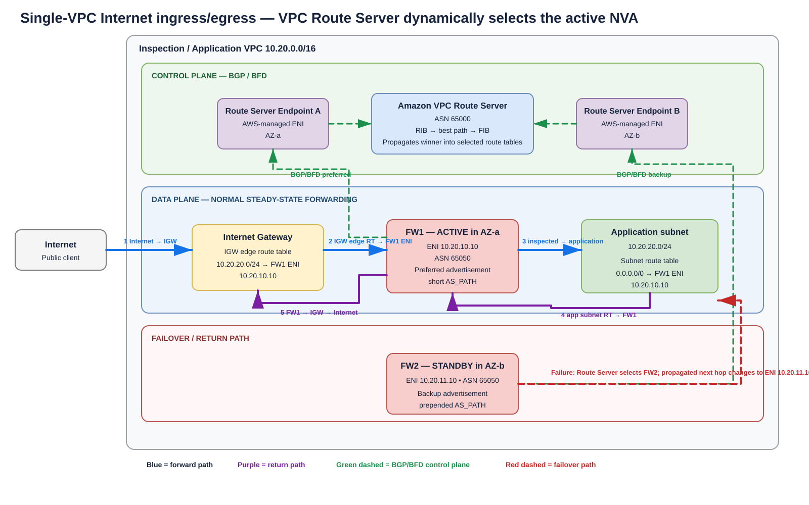

# AWS VPC Route Server + NVA — Dynamic Service Insertion Deep Dive

> **Scope:** Amazon VPC Route Server with BGP-capable third-party network virtual appliances (NVAs), especially next-generation firewalls (NGFWs), for dynamic service insertion, active/standby failover, Transit Gateway centralized inspection, Internet ingress/egress, and Availability Zone (AZ) affinity.
>
> **Validated:** 2026-09-06 against current AWS VPC Route Server documentation and the July 2026 AWS centralized-inspection reference architecture.

## URLs used

- https://docs.aws.amazon.com/vpc/latest/userguide/dynamic-routing-route-server.html
- https://docs.aws.amazon.com/vpc/latest/userguide/route-server-terms.html
- https://docs.aws.amazon.com/vpc/latest/userguide/route-server-tutorial.html
- https://docs.aws.amazon.com/vpc/latest/userguide/route-server-tutorial-enable-prop.html
- https://docs.aws.amazon.com/vpc/latest/userguide/route-server-peer-logging.html
- https://docs.aws.amazon.com/vpc/latest/userguide/amazon-vpc-limits.html
- https://docs.aws.amazon.com/vpc/latest/userguide/gateway-route-tables.html
- https://docs.aws.amazon.com/vpc/latest/userguide/internet-gateway-subnet.html
- https://docs.aws.amazon.com/cli/latest/reference/ec2/create-route-server.html
- https://docs.aws.amazon.com/cli/latest/reference/ec2/create-route-server-endpoint.html
- https://docs.aws.amazon.com/cli/latest/reference/ec2/create-route-server-peer.html
- https://docs.aws.amazon.com/cli/latest/reference/ec2/associate-route-server.html
- https://docs.aws.amazon.com/cli/latest/reference/ec2/get-route-server-routing-database.html
- https://aws.amazon.com/blogs/networking-and-content-delivery/dynamic-routing-using-amazon-vpc-route-server/
- https://aws.amazon.com/blogs/networking-and-content-delivery/centralized-vpc-inspection-with-amazon-vpc-route-server-and-aws-transit-gateway/
- https://aws.amazon.com/blogs/networking-and-content-delivery/how-magnite-uses-amazon-vpc-route-server-and-border-gateway-protocol-bgp-to-build-dynamic-hybrid-cloud-routing/

## 1. Executive summary

Amazon VPC Route Server brings **Border Gateway Protocol (BGP)** into the VPC routing control plane. A BGP-capable NVA establishes sessions to AWS-managed **Route Server Endpoints (RSEs)**, advertises prefixes, and lets VPC Route Server choose a best BGP path. The selected path enters the Route Server **Forwarding Information Base (FIB)** and is eligible to be propagated into explicitly selected VPC route tables. The practical result is that a route such as `10.0.0.0/8` or `0.0.0.0/0` can dynamically point to the ENI of whichever firewall is currently preferred.

This is important for direct-NVA service insertion. Without Route Server, active/standby firewall designs often require scripts, Lambda functions, vendor HA agents, or API automation to replace a failed appliance ENI in VPC route tables. With Route Server, health-dependent BGP advertisement and withdrawal can drive that next-hop change using standard routing behavior.

**Source information:** AWS documents that Route Server supports subnet route tables, VPC route tables not associated with subnets, and Internet Gateway route tables. It does **not** propagate routes into Transit Gateway route tables or route tables associated with Virtual Private Gateways. If dynamic BGP route exchange into Transit Gateway itself is required, AWS directs customers to Transit Gateway Connect.

**Additional explanation:** Treat VPC Route Server as a managed **BGP-to-VPC-route-table control plane**. The firewall does not edit an AWS route table itself. It advertises a route; AWS selects the best path and installs an ENI next hop into each route table where Route Server propagation is enabled.

## 2. Components and terminology

| Term | Meaning | Service-insertion relevance |
|---|---|---|
| **Route Server** | AWS-managed object with one RIB and one FIB | Chooses the best NVA-advertised path |
| **RIB** | Routing Information Base containing learned paths | Can hold multiple NVA paths for one prefix |
| **FIB** | Best-path routes selected from the RIB | These are the routes installed into propagated route tables |
| **Association** | Route Server-to-VPC association | Defines the VPC in which the Route Server operates |
| **Route Server Endpoint (RSE)** | AWS-managed endpoint/ENI in a subnet | AWS side of NVA BGP/BFD peering |
| **Route Server peer** | Session definition between an RSE and the NVA | Specifies peer IP, peer ASN, and liveness mode |
| **Propagation** | Route Server-to-route-table relationship | Determines which VPC/IGW route tables receive FIB routes |
| **NVA** | BGP-capable firewall/router/security appliance on EC2 | Advertises insertion routes and forwards inspected traffic |
| **BFD** | Bidirectional Forwarding Detection | Detects failure faster than BGP keepalives alone |

### What Route Server changes

- The ENI used as the next hop for a dynamically learned prefix.
- Which firewall is preferred using BGP attributes such as AS-path length or MED.
- Automatic route-table changes after BGP withdrawal/failure.
- Visibility into received routes, installation state, BGP/BFD state, and route events.

### What Route Server does not change

- Transit Gateway route-table association/propagation.
- The firewall's own forwarding table.
- Static routes required on the firewall subnet toward TGW, IGW, NAT, or another egress device.
- Security policy, NAT policy, TLS inspection, session synchronization, or vendor HA behavior.
- Stateful session preservation when the selected firewall changes.

## 3. Control-plane sequence

1. Create a Route Server with an AWS-side ASN, for example `65500`.
2. Associate it with the inspection VPC.
3. Create Route Server Endpoints in subnets reachable from the NVA. The current quota permits **two endpoints per Route Server per subnet**, which is useful for redundancy.
4. Create Route Server peers with the NVA peer IP, NVA ASN, and optional BFD liveness.
5. The **NVA initiates BGP** toward the RSE addresses.
6. The NVA advertises service-insertion routes such as `10.0.0.0/8`, application subnet prefixes, /32 VIPs, or `0.0.0.0/0`.
7. Route Server stores learned paths in its RIB and selects a best path.
8. The winning path enters the FIB.
9. On each route table where Route Server propagation is enabled, AWS installs that FIB route with the selected appliance ENI as target.
10. If the preferred peer goes down or withdraws its route, Route Server recomputes the FIB and can install a backup firewall ENI automatically.

## 4. Architecture A — single-VPC Internet ingress/egress



[Editable draw.io](images/09-06-26-17-01_vpc_route_server_single_vpc_ingress_egress.drawio)

**What this image shows:** An Internet Gateway gateway route table intercepts inbound traffic toward an application subnet and sends it to the active firewall ENI. The application subnet uses a Route Server-propagated default toward the same active firewall for return/egress traffic. BGP/BFD selects FW1 or FW2.

**What matters:** The IGW edge route table and application subnet route table are separate routing decisions. Both must be consistent for a stateful firewall. The firewall subnet still needs a route toward the IGW; that forwarding route is not created merely because the firewall advertises a route to VPC Route Server.

**What to verify:** The IGW route table has the application subnet prefix pointing at the current active firewall ENI, the application subnet default/specific route points at that same firewall ENI, and the firewall subnet can route onward to the IGW.

### Example addressing

| Component | Example |
|---|---|
| VPC | `10.20.0.0/16` |
| Firewall AZ-a subnet | `10.20.10.0/24` |
| FW1 ENI | `10.20.10.10` |
| Firewall AZ-b subnet | `10.20.11.0/24` |
| FW2 ENI | `10.20.11.10` |
| Application subnet | `10.20.20.0/24` |
| Route Server ASN | `65000` |
| Firewall ASN | `65050` |

### Inbound packet flow

Assume an Internet client connects to a public IPv4 address associated with a workload in `10.20.20.0/24`.

1. The packet reaches the **Internet Gateway (IGW)**.
2. For IPv4, the IGW performs the normal public-to-private address mapping associated with the public IPv4/EIP before VPC delivery.
3. The IGW edge-associated route table looks up the private destination. A more-specific `10.20.20.0/24 → FW1 ENI` route intercepts the packet.
4. FW1 receives routed/transit traffic; the EC2 NVA must be configured for forwarding and source/destination checking disabled where required.
5. FW1 applies security policy and forwards the permitted packet toward the application subnet.
6. The workload receives the connection. Whether the firewall performs additional SNAT/DNAT depends on the vendor policy; Route Server itself performs no firewall NAT.

### Return packet flow

1. The workload sends the response toward the Internet client.
2. Its subnet route table matches `0.0.0.0/0 → FW1 ENI`, installed through Route Server propagation while FW1 is preferred.
3. FW1 receives the reverse packet and finds the stateful session.
4. FW1 forwards toward the IGW through its subnet route `0.0.0.0/0 → igw-id`.
5. The IGW performs reverse public/private IPv4 mapping and sends the packet to the Internet.

**Symmetry is mandatory:** AWS gateway-route-table documentation explicitly states that return traffic through a middlebox must traverse the same appliance. Route Server can automate which ENI is selected, but only route tables participating in the intended path should receive the relevant propagation.

## 5. Active/standby BGP policy

A straightforward active/standby design uses **AS-path prepending**:

| Firewall | Advertised prefix | AS path | Result |
|---|---|---|---|
| FW1 active | `10.0.0.0/8` | `65050` | Preferred |
| FW2 standby | `10.0.0.0/8` | `65050 65050` | Backup |

The same method can advertise `0.0.0.0/0` or application prefixes.

### Failure sequence with BFD

1. FW1 or the path to FW1 fails.
2. BFD detects loss of liveness and the Route Server peer transitions down.
3. The preferred FW1 path is withdrawn from usable BGP paths.
4. Route Server recomputes RIB/FIB selection.
5. FW2's prepended route becomes the best remaining path.
6. Propagated route tables change their ENI target from FW1 to FW2.
7. New flows follow FW2.
8. Existing stateful sessions survive only if the firewall HA implementation synchronizes sufficient session/NAT state and supports this failover model.

AWS describes BFD failure detection as typically sub-second in its Route Server reference pattern. That is **detection time**, not a guarantee that end-to-end application failover is sub-second; route programming, appliance readiness, TCP/application behavior, and state synchronization also matter.

## 6. Architecture B — centralized inspection with AWS Transit Gateway


[Editable draw.io](images/09-06-26-17-01_vpc_route_server_tgw_centralized_inspection.drawio)

**What this image shows:** Transit Gateway (TGW) performs inter-VPC/hybrid routing and sends traffic to an Inspection VPC. Once the packet arrives in a TGW attachment subnet in the Inspection VPC, that subnet's VPC route table uses a Route Server-propagated ENI next hop to steer the packet to the active firewall.

**What matters:** There are two different routing control planes. **TGW route tables select the VPC attachment. VPC Route Server selects the NVA ENI inside the Inspection VPC.**

**What to verify:** Spoke/hybrid attachments use the pre-inspection TGW route table; the inspection attachment uses the post-inspection TGW route table; inspection VPC TGW-subnet route tables have Route Server propagation enabled and point inspection prefixes/default to the active firewall ENI.

### AWS July 2026 reference addressing

The AWS centralized-inspection example uses:

- Spoke1 VPC: `10.45.0.0/16`
- Spoke2 VPC: `10.46.0.0/16`
- Inspection VPC: `10.47.0.0/16`
- Route Server ASN: `65500`
- FW1 active AS path: `65550`
- FW2 standby AS path: `65550 65550`

### TGW pre-inspection route table

Associate spoke VPC attachments and any VPN/DX-derived traffic sources that must be inspected.

| Destination | Target |
|---|---|
| `0.0.0.0/0` or selected/summarized protected prefixes | Inspection VPC attachment |

### TGW post-inspection route table

Associate the Inspection VPC attachment here so traffic returned to TGW after firewall processing can reach its real destination rather than recursively re-entering inspection.

| Destination | Target |
|---|---|
| `10.45.0.0/16` | Spoke1 attachment |
| `10.46.0.0/16` | Spoke2 attachment |
| On-premises prefixes | VPN/DX-related attachment as appropriate |

### Inspection VPC TGW attachment-subnet route table

This is where Route Server provides dynamic firewall selection:

| Destination | Target | Origin |
|---|---|---|
| `10.47.0.0/16` | `local` | VPC |
| `10.0.0.0/8` | `eni-fw01` | Route Server propagated while FW1 wins |
| `0.0.0.0/0` | `eni-fw01` | Optional for centralized Internet egress |

After FW1 failure, Route Server can replace the target with `eni-fw02`.

### Firewall subnet route table

AWS's centralized inspection reference emphasizes that these are **static forwarding routes the Route Server does not manage**:

| Destination | Target | Purpose |
|---|---|---|
| `10.0.0.0/8` | TGW | Return inspected private traffic to TGW |
| `0.0.0.0/0` | IGW | Internet egress after inspection |

## 7. East-west packet walk — Spoke1 to Spoke2

Example packet:

```text
Source:      10.45.1.205
Destination: 10.46.1.48
Protocol:    TCP
```

### Forward path

1. Spoke1 subnet route table sends the destination toward TGW.
2. The TGW route table associated with Spoke1's attachment performs the ingress TGW lookup.
3. The TGW pre-inspection/spokes table sends the packet to the Inspection VPC attachment.
4. TGW delivers the packet into one of the Inspection VPC's TGW attachment subnets.
5. That subnet route table matches `10.0.0.0/8 → eni-fw01`, installed by VPC Route Server.
6. FW1 performs stateful firewall inspection. No NAT is normally required for transparent east-west inspection unless your design intentionally uses it.
7. FW1's forwarding lookup matches `10.0.0.0/8 → TGW` and returns the inspected packet to TGW.
8. The TGW post-inspection/inspection table matches `10.46.0.0/16 → Spoke2 attachment`.
9. TGW forwards to Spoke2 and VPC local routing delivers to `10.46.1.48`.

### Return path

The reverse path repeats the chain:

`Spoke2 → TGW pre-inspection table → Inspection VPC → same active firewall → TGW post-inspection table → Spoke1`.

With one Route Server, both AZ-specific interception route tables receive the same winning FIB path for a prefix. That simplifies active/standby symmetry but can cause steady-state cross-AZ forwarding.

## 8. North-south egress packet walk — Spoke to Internet

1. The spoke sends Internet-bound traffic to TGW.
2. TGW pre-inspection routing sends `0.0.0.0/0` to the Inspection VPC attachment.
3. The inspection TGW-subnet route table matches a Route Server-propagated `0.0.0.0/0 → active firewall ENI` if the firewall advertises the default.
4. The firewall inspects the packet and performs SNAT only if required by the chosen design/vendor architecture.
5. The firewall subnet route table has `0.0.0.0/0 → IGW`.
6. The IGW sends traffic to the Internet.
7. Return traffic is delivered back to the inspection path and the same stateful firewall.
8. The firewall routes the private destination, for example `10.45.1.205`, through `10.0.0.0/8 → TGW`.
9. TGW post-inspection routing sends `10.45.0.0/16` to Spoke1.

## 9. Direct Connect and Site-to-Site VPN enforcement

VPC Route Server does not replace the BGP control plane used by Direct Connect Gateway (DXGW), Transit Gateway, or Site-to-Site VPN. The service-insertion boundary is:

```text
On-premises BGP / Direct Connect or VPN
        ↓
DXGW / TGW / VPN attachment routing
        ↓
TGW pre-inspection route table
        ↓
Inspection VPC attachment
        ↓
Inspection VPC TGW-subnet route table
        ↓   VPC Route Server controls this ENI next hop
Active NVA / NGFW
        ↓
TGW post-inspection route table
        ↓
Destination attachment
```

### Direct Connect Transit VIF

For a Transit VIF design, on-prem routes are learned over BGP on Direct Connect and reach the TGW through a Direct Connect Gateway association. Configure TGW route-table associations so that traffic arriving from the hybrid side is sent to the Inspection VPC before it can reach protected spokes. Inside the Inspection VPC, Route Server selects the active NVA ENI. After inspection, the firewall sends the packet back to TGW, whose post-inspection table selects the destination attachment.

### Site-to-Site VPN

The same principle applies to a VPN attachment. The VPN/TGW BGP process learns hybrid routes; the TGW table must send protected destinations to inspection first. Route Server solves the **firewall next-hop HA problem inside the Inspection VPC**, not the VPN/TGW route-learning problem.

### Unsupported assumption to avoid

Do **not** expect VPC Route Server to advertise learned firewall routes directly into a TGW route table. AWS explicitly states that Route Server does not propagate into TGW route tables. Use supported TGW route propagation/static routing, or **Transit Gateway Connect** when dynamic routing into TGW itself is the requirement.

## 10. Architecture C — dual Route Servers for AZ affinity


[Editable draw.io](images/09-06-26-17-01_vpc_route_server_dual_rs_az_affinity.drawio)

**What this image shows:** A separate Route Server controls each AZ-specific interception route table. Each firewall advertises a shorter AS path to the local Route Server and a prepended path to the remote Route Server.

**What matters:** One Route Server has one FIB winner per prefix. If that one Route Server propagates to both AZ route tables, both receive the same winner. Two Route Servers let the AZ-a route table prefer FW1 while the AZ-b route table prefers FW2.

**What to verify:** RS-A installs FW1 into the AZ-a interception route table; RS-B installs FW2 into the AZ-b table. When FW1 fails, RS-A changes to FW2 while RS-B remains on FW2.

### AS-path matrix

| Firewall | To Route Server A | To Route Server B |
|---|---|---|
| FW1 in AZ-a | `65550` | `65550 65550` |
| FW2 in AZ-b | `65550 65550` | `65550` |

Normal behavior is AZ-local. Cross-AZ forwarding occurs only during the failure of the preferred local firewall/path.

## 11. AWS CLI deployment

Use environment-specific IDs and addresses; the examples below intentionally use placeholders.

### 11.1 Create the Route Server

```cli
aws ec2 create-route-server \
  --amazon-side-asn 65500 \
  --tag-specifications 'ResourceType=route-server,Tags=[{Key=Name,Value=inspection-rs}]'
```

**Expected reliable fields:** `RouteServerId`, `AmazonSideAsn`, `State`. A newly created Route Server can initially be `pending`; wait for `available`.

### 11.2 Associate the Route Server with the VPC

```cli
aws ec2 associate-route-server \
  --route-server-id rs-0123456789abcdef0 \
  --vpc-id vpc-0123456789abcdef0
```

AWS documents an initial association state of `associating`.

Verify:

```cli
aws ec2 get-route-server-associations \
  --route-server-id rs-0123456789abcdef0
```

**Success criterion:** state becomes `associated`.

### 11.3 Create Route Server Endpoints

```cli
aws ec2 create-route-server-endpoint \
  --route-server-id rs-0123456789abcdef0 \
  --subnet-id subnet-0aaa1111

aws ec2 create-route-server-endpoint \
  --route-server-id rs-0123456789abcdef0 \
  --subnet-id subnet-0aaa1111
```

Repeat in another subnet/AZ as required.

Verify:

```cli
aws ec2 describe-route-server-endpoints \
  --filters Name=route-server-id,Values=rs-0123456789abcdef0 \
  --output table
```

**Success:** endpoints are `available`. Record their endpoint ENI IPs because the NVA initiates BGP sessions to those addresses.

### 11.4 Create the NVA peer

```cli
aws ec2 create-route-server-peer \
  --route-server-endpoint-id rse-0123456789abcdef0 \
  --peer-address 10.47.3.42 \
  --bgp-options 'PeerAsn=65550,PeerLivenessDetection=bfd'
```

The AWS CLI supports `bgp-keepalive` and `bfd`; `bgp-keepalive` is the default when liveness detection is not specified.

### 11.5 Enable propagation

```cli
aws ec2 enable-route-server-propagation \
  --route-table-id rtb-0tgwsubnetaz1 \
  --route-server-id rs-0123456789abcdef0
```

AWS documents the initial propagation state as `pending`.

Verify:

```cli
aws ec2 get-route-server-propagations \
  --route-server-id rs-0123456789abcdef0
```

**Success:** the intended route table shows state `available`.

### 11.6 Inspect the routing database

```cli
aws ec2 get-route-server-routing-database \
  --route-server-id rs-0123456789abcdef0 \
  --output json
```

Important data includes the peer/endpoint that advertised a route and `RouteInstallationDetails`, including whether the route was `installed` or `rejected` in a target route table.

## 12. NVA BGP policy model

Vendor syntax differs. The following is **pseudoconfiguration**, not a claim that the same commands work on Palo Alto, Fortinet, Cisco, Check Point, or another appliance.

```text
router bgp 65550
  neighbor <RSE-A1-IP> remote-as 65500
  neighbor <RSE-A2-IP> remote-as 65500
  enable bfd

  advertise 10.0.0.0/8

  ACTIVE-EXPORT:
    no AS-path prepend

  STANDBY-EXPORT:
    prepend local AS one additional time
```

For dual Route Servers, export policy must be neighbor-specific: local-AZ Route Server peers receive the short path and remote-AZ peers receive the prepended backup path.

## 13. Route-table behavior and bypass risks

### Longest-prefix match still wins

Route Server propagation does not suspend normal VPC route selection. A more-specific route to another target can bypass a propagated default route to the firewall. If you advertise `0.0.0.0/0 → firewall` but a route table contains a more-specific destination to TGW, peering, NAT, GWLBE, or another ENI, that more-specific route can win.

### Gateway route-table constraints

Internet Gateway gateway route tables have special restrictions. AWS documents `local`, Gateway Load Balancer Endpoint, and network-interface targets for the supported middlebox use case, with destinations constrained to VPC address ranges. They are designed to steer traffic **entering the VPC**, not arbitrary external or TGW traffic.

### Avoid recursive TGW inspection

The inspection VPC attachment must use a post-inspection TGW table that knows how to reach the real destination. If its table instead points the destination back to the Inspection VPC attachment, the packet can loop.

## 14. BFD, health, and convergence

### BGP keepalive

BGP keepalives provide normal protocol liveness but can take longer to detect failure.

### BFD

BFD is intended for fast forwarding-path failure detection and is used by AWS's Route Server reference designs for quicker convergence. It does **not** prove that the firewall's policy engine, license, NAT pool, DNS dependency, TLS inspection service, or upstream Internet path is healthy. Where supported, tie route advertisement/withdrawal to deeper vendor health objects rather than relying only on peer liveness.

### Route persistence

`create-route-server` exposes `persist-routes` and `persist-routes-duration`. Treat persistence as a control-plane behavior to test carefully. Retaining a route during transient peer loss can reduce churn, but retaining a next hop toward a truly failed firewall can also prolong a blackhole. Validate the current AWS semantics and your failure objective before enabling it.

## 15. Security and forwarding prerequisites

### Control plane

Permit BGP **TCP/179** only between NVA control-plane interfaces and the required Route Server Endpoint addresses/subnets. Follow AWS and vendor documentation for any BFD-specific protocol/port requirements.

### Data plane

Permit only the protected workload and hybrid prefixes required by the design. A transit appliance does not automatically justify unrestricted security-group rules.

### Source/destination checking

An EC2-based NVA that routes traffic not addressed to itself normally requires source/destination checking to be disabled on the forwarding interface/instance.

### Network ACLs

NACLs are stateless. Permit both directions and the required ephemeral ports on firewall, TGW attachment, and workload subnets.

## 16. NAT design

### East-west

Prefer no NAT for ordinary transparent inspection when routing is unambiguous. Preserving original addresses improves policy and logging fidelity.

### Internet egress

The firewall may perform SNAT depending on the vendor architecture. A separate NAT device can be placed after inspection, but route design must still force the reply through the same stateful firewall.

### Internet ingress

IGW gateway route tables can intercept inbound traffic before workload delivery. Avoid unnecessary SNAT if the application needs the original client IP; use it only when the return-path/NAT design requires it.

### DNAT

If the NVA owns a public-facing destination and performs DNAT, document the tuple before and after translation and ensure the post-DNAT route cannot recursively re-enter the same inspection point.

## 17. MTU

Direct ENI service insertion through Route Server does **not** add GWLB GENEVE encapsulation between the route table and the NVA. The wider path can still include TGW, VPN/IPsec, Direct Connect, vendor overlay tunnels, or HA/state-sync transport. Validate Path MTU Discovery (PMTUD), ICMP handling, vendor MSS clamping where needed, and tunnel overhead.

## 18. Current relevant quotas

AWS VPC quota documentation currently lists:

| Quota | Documented value |
|---|---|
| Route Servers per VPC | 5 default, adjustable |
| Route Server Endpoints per Route Server | 10 default, adjustable |
| Endpoints per Route Server per subnet | 2, not adjustable |
| Peering sessions per network interface | 20 default, adjustable |
| Routes per Route Server peer | 100, not adjustable |
| Routes in a Route Server FIB | 100, not adjustable |
| Propagated routes per route table | 100, not adjustable |

These limits make safe summarization important. Advertising a controlled aggregate such as `10.0.0.0/8` can reduce route pressure, but only if the firewall has valid post-inspection reachability for every destination attracted by that aggregate.

## 19. Verification runbook

### Route Server state

```cli
aws ec2 describe-route-servers --output table
```

**Where:** AWS control plane.  
**Tests:** Route Server lifecycle.  
**Success:** `available`.  
**Failure:** pending/failed/modifying unexpectedly.  
**Next action:** inspect failure reason and CloudTrail/API errors.

### Association

```cli
aws ec2 get-route-server-associations \
  --route-server-id rs-0123456789abcdef0
```

**Success:** `associated` to the intended Inspection VPC.

### Endpoints

```cli
aws ec2 describe-route-server-endpoints \
  --filters Name=route-server-id,Values=rs-0123456789abcdef0
```

**Important fields:** endpoint ID, subnet ID, ENI ID/address, state.  
**Success:** intended endpoints are `available`.

### Peer objects

```cli
aws ec2 describe-route-server-peers \
  --filters Name=route-server-id,Values=rs-0123456789abcdef0 \
  --output table
```

**Success:** peer objects map to the expected RSEs, NVA peer IPs, and ASN.

### Appliance BGP state

AWS's GoBGP demonstration uses:

```cli
/usr/local/bin/gobgp neighbor
```

AWS shows an established result of this form:

```text
Peer                 AS       Up/Down        State       | #Received Accepted
<rs-endpoint-ip>     65500    00:05:00       Establ      | 0         0
```

This is AWS's demonstration output; vendor firewall output is different.

### Advertisement

AWS's GoBGP example uses:

```cli
/usr/local/bin/gobgp global rib
```

The reference design verifies `10.0.0.0/8` with the short AS path on the active firewall and a prepended path on the standby.

### Route Server RIB/FIB and installation

```cli
aws ec2 get-route-server-routing-database \
  --route-server-id rs-0123456789abcdef0 \
  --output json
```

**Success:** the expected advertisements are present and the winning route has successful installation details for the intended VPC route tables.

### Propagation state

```cli
aws ec2 get-route-server-propagations \
  --route-server-id rs-0123456789abcdef0
```

**Success:** required route tables show `available`.

### Actual VPC route table

```cli
aws ec2 describe-route-tables \
  --route-table-ids rtb-0tgwsubnetaz1 \
  --output json
```

**Success:** the expected destination points to the active firewall ENI. After an intentional failover, it changes to the standby firewall ENI.

### Route Server peer logging

Route Server peer logging can record `BGPStatus`, `BFDStatus`, and `RouteStatus` events and deliver them as vended logs to CloudWatch Logs, S3, or Firehose. AWS's documented JSON example includes prefix, AS path, MED, next-hop IP, and route status such as `ADVERTISED`.

## 20. Failover validation procedure

1. Establish steady-state traffic through FW1.
2. Capture the Route Server routing database.
3. Capture the interception route table showing the active ENI target.
4. Confirm BGP/BFD is up.
5. Stop FW1 or administratively withdraw the route.
6. Watch Route Server peer logs for BFD/BGP down and route withdrawal.
7. Re-run `get-route-server-routing-database`.
8. Re-run `describe-route-tables`; confirm the target changes to FW2's ENI.
9. Test traceroute/flows and verify packets actually traverse FW2.
10. Confirm destination reachability.
11. Restore FW1.
12. If FW1 resumes the shorter AS path, the AWS reference active/standby design becomes preemptive and preference returns to FW1.
13. Measure application/session impact separately from route convergence.

## 21. Troubleshooting by symptom

### BGP never establishes

**Where:** NVA↔RSE control plane.  
**Command/tool:** vendor BGP neighbor command, `describe-route-server-peers`, SGs, NACLs.  
**What it tests:** IP reachability, ASN correctness, peer address, TCP/179, NVA initiation.  
**Expected:** Established.  
**Failure means:** wrong RSE IP/ASN, blocked control traffic, wrong source address, or NVA not initiating.  
**Next action:** validate RSE address, local/remote ASN, SG/NACL, and NVA source interface.

### BGP Established but VPC route never changes

**Where:** Route Server RIB/FIB and propagation.  
**Command/tool:** `get-route-server-routing-database`, `get-route-server-propagations`, `describe-route-tables`.  
**Expected:** route is learned, selected, and `installed`.  
**Failure means:** no advertisement, path lost selection, propagation missing, route installation rejected, or unsupported route-table type.  
**Next action:** inspect `RouteInstallationDetails` and propagation scope.

### Traffic enters firewall but reply bypasses it

**Where:** destination subnet, IGW edge route table, and TGW route tables.  
**Expected:** both directions resolve to the same stateful firewall.  
**Failure means:** only one direction is propagated, a more-specific route bypasses inspection, or TGW table association is wrong.  
**Next action:** document every forward and reverse lookup and compare the selected ENI.

### East-west traffic loops

**Where:** TGW route-table associations.  
**Expected:** source attachments use pre-inspection; inspection attachment uses post-inspection.  
**Failure means:** traffic returned by the firewall is sent back to the Inspection VPC attachment.  
**Next action:** separate the TGW routing domains.

### Failover works but TCP sessions reset

**Where:** firewall HA/session state.  
**Meaning:** routing converged but session/NAT state did not.  
**Next action:** validate vendor-supported state synchronization or design clients for reconnection.

### Both AZs always use FW1

With a **single Route Server**, this can be expected: one FIB winner is propagated to both AZ route tables. If the requirement is AZ-local forwarding, deploy the dual-Route-Server pattern and use neighbor-specific AS-path policy.

### On-prem routes do not appear in TGW because of VPC Route Server

This is expected. VPC Route Server does not propagate into TGW route tables. Use TGW-supported route propagation/static routes or Transit Gateway Connect when BGP-based dynamic TGW routing is required.

## 22. Common mistakes

1. Treating VPC Route Server as a TGW route reflector. It only propagates to supported VPC/IGW route tables.
2. Enabling propagation on only one direction of a stateful path.
3. Forgetting the firewall subnet's own static routes to TGW/IGW.
4. Assuming BFD proves the entire security dataplane is healthy.
5. Using one Route Server while expecting independent per-AZ active firewalls.
6. Advertising too many specific routes and hitting the 100-route limits.
7. Creating TGW recursion by using the same pre/post inspection route table.
8. Leaving source/destination check enabled on a transit EC2 appliance.
9. Assuming route convergence preserves firewall sessions.
10. Ignoring more-specific VPC routes that bypass a propagated default.

## 23. VPC Route Server vs Gateway Load Balancer

AWS recommends Gateway Load Balancer (GWLB) as the first choice for many scalable appliance HA designs. VPC Route Server is particularly useful when the appliance does not support GENEVE/GWLB, active/standby behavior is required, or BGP attributes must control path preference.

| Characteristic | VPC Route Server + direct NVA | GWLB/GWLBE |
|---|---|---|
| Data plane | Direct ENI routing | GENEVE to GWLB targets |
| HA selection | BGP best path / withdrawal | Target health + load-balancing flow mapping |
| Common deployment | Active/standby or policy-driven paths | Active/active fleet |
| BGP path attributes | Directly useful | Not the service-insertion selection mechanism |
| Session survival | Vendor HA dependent | Vendor state still matters |
| Scale boundary | Route/peer/FIB quotas plus appliance scale | GWLB target-fleet scale |

## 24. Reasonable inferences and design guidance

**Reasonable inference:** Safe prefix summarization can simplify large centralized inspection designs and conserve Route Server/FIB capacity, but an aggregate must never attract traffic for destinations for which the firewall lacks a valid post-inspection path.

**Reasonable inference:** If a firewall can condition BGP advertisement on a deeper service-health object, it can provide better failure semantics than BFD alone. This is vendor-specific and must be validated in the firewall documentation.

**Reasonable inference:** Dual Route Servers are attractive for high-throughput multi-AZ inspection because they can minimize normal cross-AZ data transfer, but they add BGP policy and propagation complexity.

## 25. Design checklist

- [ ] Route Server is available in the target AWS Region.
- [ ] AWS-side ASN and NVA ASN plan documented.
- [ ] Redundant RSE placement defined.
- [ ] NVA supports initiating BGP toward RSEs.
- [ ] BFD capability validated if fast detection is required.
- [ ] Route advertisements fit the 100-route peer/FIB limits.
- [ ] Propagation enabled only on intended interception route tables.
- [ ] No assumption that Route Server updates TGW route tables.
- [ ] TGW pre- and post-inspection route tables are separated.
- [ ] Firewall subnet routes toward TGW/IGW/NAT are explicit.
- [ ] Source/destination check disabled where required.
- [ ] SG/NACL policy covers both control and data planes.
- [ ] Forward and return packet walks are symmetric.
- [ ] NAT behavior documented for each direction.
- [ ] Session-state failover tested independently of route failover.
- [ ] Route Server peer logging enabled for production observability.
- [ ] Failure testing proves the VPC route target changes to the backup ENI.

## Sources

1. AWS — Dynamic routing in your VPC using VPC Route Server: https://docs.aws.amazon.com/vpc/latest/userguide/dynamic-routing-route-server.html
2. AWS — VPC Route Server terminology: https://docs.aws.amazon.com/vpc/latest/userguide/route-server-terms.html
3. AWS — Route Server get started tutorial: https://docs.aws.amazon.com/vpc/latest/userguide/route-server-tutorial.html
4. AWS — Enable Route Server propagation: https://docs.aws.amazon.com/vpc/latest/userguide/route-server-tutorial-enable-prop.html
5. AWS — Route Server peer logging: https://docs.aws.amazon.com/vpc/latest/userguide/route-server-peer-logging.html
6. AWS — Amazon VPC quotas: https://docs.aws.amazon.com/vpc/latest/userguide/amazon-vpc-limits.html
7. AWS — Gateway route tables: https://docs.aws.amazon.com/vpc/latest/userguide/gateway-route-tables.html
8. AWS — Inspect traffic destined for a subnet: https://docs.aws.amazon.com/vpc/latest/userguide/internet-gateway-subnet.html
9. AWS CLI — create-route-server: https://docs.aws.amazon.com/cli/latest/reference/ec2/create-route-server.html
10. AWS CLI — create-route-server-endpoint: https://docs.aws.amazon.com/cli/latest/reference/ec2/create-route-server-endpoint.html
11. AWS CLI — create-route-server-peer: https://docs.aws.amazon.com/cli/latest/reference/ec2/create-route-server-peer.html
12. AWS CLI — associate-route-server: https://docs.aws.amazon.com/cli/latest/reference/ec2/associate-route-server.html
13. AWS CLI — get-route-server-routing-database: https://docs.aws.amazon.com/cli/latest/reference/ec2/get-route-server-routing-database.html
14. AWS Networking Blog — Dynamic routing using Amazon VPC Route Server (2025-09-02): https://aws.amazon.com/blogs/networking-and-content-delivery/dynamic-routing-using-amazon-vpc-route-server/
15. AWS Networking Blog — Centralized VPC inspection with Amazon VPC Route Server and AWS Transit Gateway (2026-07-24): https://aws.amazon.com/blogs/networking-and-content-delivery/centralized-vpc-inspection-with-amazon-vpc-route-server-and-aws-transit-gateway/
16. AWS Networking Blog — Magnite dynamic hybrid-cloud routing with VPC Route Server (2026-07-21): https://aws.amazon.com/blogs/networking-and-content-delivery/how-magnite-uses-amazon-vpc-route-server-and-border-gateway-protocol-bgp-to-build-dynamic-hybrid-cloud-routing/
