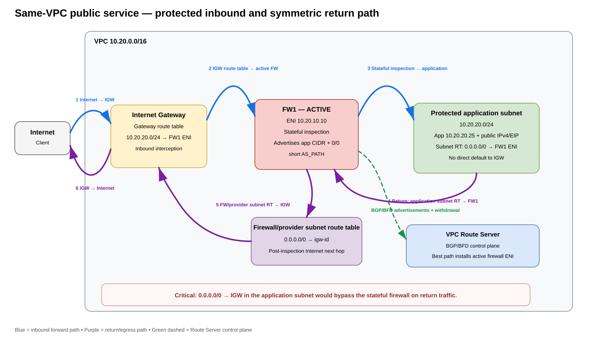
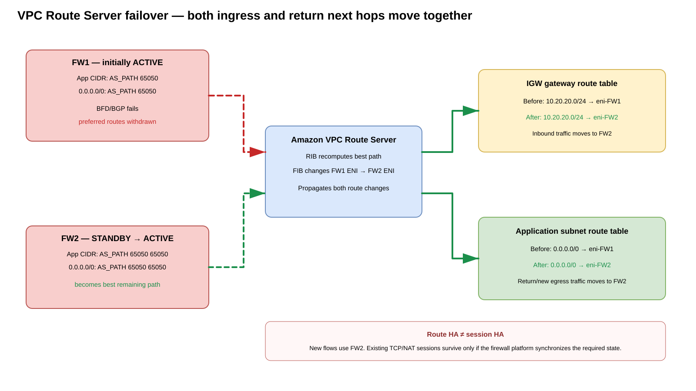
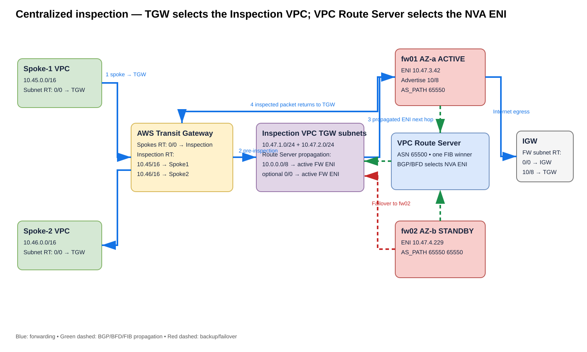
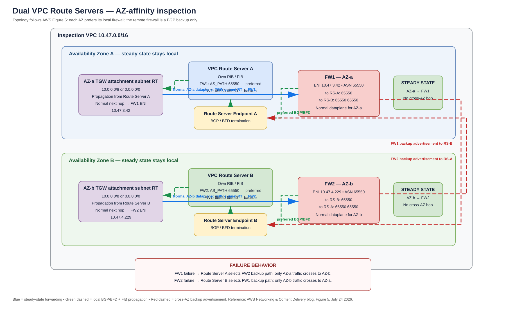

# AWS VPC Route Server + NVA — Dynamic Service Insertion Deep Dive

> **Scope:** Amazon VPC Route Server used with BGP-capable third-party network virtual appliances (NVAs), especially next-generation firewalls (NGFWs), for dynamic service insertion, active/standby failover, Transit Gateway centralized inspection, Internet ingress/egress, and Availability Zone (AZ) affinity.
>
> **Validated:** 2026-09-06 against current AWS VPC Route Server documentation and the July 2026 AWS centralized-inspection reference architecture.

## URLs used

- https://docs.aws.amazon.com/vpc/latest/userguide/dynamic-routing-route-server.html
- https://docs.aws.amazon.com/vpc/latest/userguide/route-server-terms.html
- https://docs.aws.amazon.com/vpc/latest/userguide/route-server-tutorial.html
- https://docs.aws.amazon.com/vpc/latest/userguide/route-server-tutorial-enable-prop.html
- https://docs.aws.amazon.com/vpc/latest/userguide/route-server-peer-logging.html
- https://docs.aws.amazon.com/vpc/latest/userguide/amazon-vpc-limits.html
- https://docs.aws.amazon.com/vpc/latest/userguide/gateway-route-tables.html
- https://docs.aws.amazon.com/vpc/latest/userguide/internet-gateway-subnet.html
- https://docs.aws.amazon.com/cli/latest/reference/ec2/create-route-server.html
- https://docs.aws.amazon.com/cli/latest/reference/ec2/create-route-server-endpoint.html
- https://docs.aws.amazon.com/cli/latest/reference/ec2/create-route-server-peer.html
- https://docs.aws.amazon.com/cli/latest/reference/ec2/associate-route-server.html
- https://docs.aws.amazon.com/cli/latest/reference/ec2/get-route-server-routing-database.html
- https://aws.amazon.com/blogs/networking-and-content-delivery/dynamic-routing-using-amazon-vpc-route-server/
- https://aws.amazon.com/blogs/networking-and-content-delivery/centralized-vpc-inspection-with-amazon-vpc-route-server-and-aws-transit-gateway/
- https://aws.amazon.com/blogs/networking-and-content-delivery/how-magnite-uses-amazon-vpc-route-server-and-border-gateway-protocol-bgp-to-build-dynamic-hybrid-cloud-routing/

## 1. Executive summary

Amazon VPC Route Server brings **Border Gateway Protocol (BGP)** into the VPC routing control plane. A BGP-capable NVA establishes sessions to AWS-managed **Route Server Endpoints (RSEs)**, advertises prefixes, and lets VPC Route Server select the best BGP path. The selected path enters the Route Server **Forwarding Information Base (FIB)** and can then be propagated into explicitly selected VPC route tables. The practical result is that a route such as `10.0.0.0/8` or `0.0.0.0/0` can dynamically point at the ENI of whichever firewall is currently preferred.

This changes the traditional direct-NVA design. Without VPC Route Server, operators commonly need Lambda functions, event-driven scripts, HA agents, or vendor-specific API automation to replace static ENI next hops after appliance failure. With VPC Route Server, health-dependent route advertisements and withdrawals can drive the VPC route-table next hop using standard BGP behavior.

**Source information:** AWS documents that Route Server supports subnet route tables, VPC route tables not associated with subnets, and Internet Gateway route tables. It does **not** propagate into Transit Gateway route tables or route tables associated with Virtual Private Gateways. For Transit Gateway routing, TGW continues to use its own route tables; Route Server controls selected route tables *inside the inspection VPC*.

**Additional explanation:** Think of VPC Route Server as a managed BGP-to-VPC-route-table translator. The NVA does not directly edit AWS route tables. It advertises routes over BGP; AWS computes the winning route and installs the corresponding ENI target into the route tables on which Route Server propagation is enabled.

## 2. Terminology and component model

| Term | Meaning | Why it matters for NVA insertion |
|---|---|---|
| **Route Server** | AWS-managed routing control-plane object with one RIB and one FIB | Chooses the best NVA-advertised path |
| **RIB** | Routing Information Base containing learned paths | Can contain multiple paths for the same prefix |
| **FIB** | Best-path routes selected from the RIB | These are the routes eligible for route-table installation |
| **Route Server association** | Association between one Route Server and one VPC | Defines the VPC in which the Route Server operates |
| **Route Server Endpoint (RSE)** | AWS-managed endpoint/ENI in a subnet | Terminates the AWS side of BGP/BFD connectivity |
| **Route Server peer** | Configuration representing the NVA↔RSE BGP session | Associates endpoint, NVA peer IP, peer ASN, and liveness mode |
| **Propagation** | Explicit link from Route Server to a route table | Determines which AWS route tables receive FIB routes |
| **NVA** | BGP-capable firewall/router/security appliance on EC2 | Advertises service-insertion routes and forwards inspected traffic |
| **BFD** | Bidirectional Forwarding Detection | Detects peer/path failure faster than BGP keepalives alone |

### What Route Server changes—and what it does not

**Route Server changes:**

- Which NVA ENI is the next hop for dynamically learned prefixes.
- How quickly and automatically route tables adapt after BGP path withdrawal.
- The ability to use BGP attributes such as AS-path length or MED to influence which NVA is preferred.
- Operational visibility through the Route Server RIB and peer logs.

**Route Server does not automatically change:**

- Transit Gateway route-table association and propagation.
- The NVA's own forwarding table.
- Static routes required on the NVA/firewall subnet to reach TGW, IGW, NAT, or other next hops.
- Security policy, NAT policy, session synchronization, or TLS inspection policy on the firewall.
- Stateful-flow preservation after a firewall changes; that depends on the appliance HA/session-sync implementation.

## 3. Core control-plane sequence

1. Create a Route Server with an AWS-side ASN, for example `65000`.
2. Associate the Route Server with the inspection VPC.
3. Create Route Server Endpoints in subnets reachable from the NVA. AWS recommends redundant endpoints; the current quota permits **two endpoints per Route Server per subnet**.
4. Create Route Server peers that identify the NVA's IP address and ASN and optionally request BFD.
5. The **device/NVA initiates the BGP session** toward the RSE addresses.
6. The NVA advertises routes such as `10.0.0.0/8`, an application subnet, a /32 VIP, or `0.0.0.0/0`.
7. Route Server stores received paths in its RIB and chooses a best path.
8. The winning path enters the FIB.
9. If propagation is enabled to `rtb-X`, the FIB route is installed in `rtb-X` with the selected appliance ENI as target.
10. If BFD/BGP goes down or policy changes, the preferred route can be withdrawn and a backup route can become the new FIB winner.

## 4. Architecture A — same-VPC publicly reachable application behind active/standby firewalls

This is the clean VPC Route Server north-south pattern. The **application and firewalls are in the same VPC**. The workload may have a public IPv4 address or Elastic IP, but the application subnet is **not a classic AWS public subnet for routing purposes** because its default route does **not** point directly to the Internet Gateway (IGW).



[Editable draw.io](images/09-06-26-17-01_vpc_route_server_public_service_flow.drawio)

**What this image shows:** Three different route tables perform three different jobs. The IGW gateway route table intercepts inbound traffic for the application subnet and sends it to the active firewall ENI. The application subnet sends return/egress traffic to that same active firewall ENI. The firewall/provider subnet alone has the direct default route to the IGW.

**What matters:** Do **not** put `0.0.0.0/0 -> igw-id` in the application subnet if you require stateful inspection. That would let the return path bypass the firewall. The workload can still be publicly reachable because the IGW owns the public/private IPv4 mapping and the IGW gateway route table steers the resulting VPC-destination traffic through the firewall.

**What to verify:** The same firewall wins both advertisements: the application subnet CIDR in the IGW gateway route table and `0.0.0.0/0` in the application subnet route table. The firewall subnet must have its own static `0.0.0.0/0 -> igw-id` route.

### 4.1 Route ownership — the key mental model

| Routing stage | Route table | Route | Purpose |
|---|---|---|---|
| Internet inbound | **IGW gateway route table** | `10.20.20.0/24 -> active FW ENI` | Insert the active firewall before the packet reaches the workload subnet |
| Application return / Internet egress | **Application subnet route table** | `0.0.0.0/0 -> active FW ENI` | Force the reverse/new outbound flow through the same firewall |
| Firewall to Internet | **Firewall/provider subnet route table** | `0.0.0.0/0 -> igw-id` | Let the firewall forward inspected traffic to the Internet |
| Intra-VPC delivery | VPC local route | `10.20.0.0/16 -> local` | Normal VPC delivery after firewall processing |

The workload subnet is therefore **publicly reachable**, but not a conventional public subnet whose default route is the IGW.

### 4.2 What the firewalls advertise

Both firewalls advertise the same two traffic classes to VPC Route Server, with FW1 preferred and FW2 less preferred:

| Advertisement | FW1 active example | FW2 standby example | Installed into |
|---|---|---|---|
| Application subnet | `10.20.20.0/24`, AS path `65050` | `10.20.20.0/24`, AS path `65050 65050` | IGW gateway route table |
| Internet default | `0.0.0.0/0`, AS path `65050` | `0.0.0.0/0`, AS path `65050 65050` | Application subnet route table |

The application-prefix advertisement does **not** mean that the firewall owns the application network. It means: **for this route table, traffic toward this prefix must first use my ENI as the service-insertion next hop**.

### 4.3 Inbound flow — no firewall DNAT required

Assume:

```text
VPC:                10.20.0.0/16
FW1 ENI:            10.20.10.10
FW2 ENI:            10.20.11.10
Application subnet: 10.20.20.0/24
Application host:   10.20.20.25
Public IPv4 / EIP:  associated with the application host
```

1. The Internet client sends traffic to the workload's public IPv4 address.
2. The IGW performs the normal AWS public/private IPv4 mapping for that address association.
3. The IGW gateway route table now looks up the private application destination and matches `10.20.20.0/24 -> eni-FW1` while FW1 is preferred.
4. FW1 receives the packet, performs stateful inspection, and routes it toward `10.20.20.25` using VPC-local reachability.
5. The application receives the packet.

**DNAT on the firewall is not required in this variant.** The public endpoint belongs to the workload/EIP association; the firewall is an inline routed inspection hop.

### 4.4 Return and outbound flow

1. The application sends the response toward the Internet client.
2. Its subnet route table matches `0.0.0.0/0 -> eni-FW1`, which was selected through Route Server propagation.
3. FW1 receives the reverse packet and matches the stateful session.
4. The firewall/provider subnet route table uses the static `0.0.0.0/0 -> igw-id` route.
5. The IGW performs the reverse public/private IPv4 mapping and sends the packet to the Internet.

If the application subnet instead had `0.0.0.0/0 -> igw-id`, the response could bypass FW1 and break stateful symmetry. This is why the application subnet should not be described as a normal public subnet even though it hosts a publicly reachable service.

### 4.5 Firewall failure and BGP/BFD convergence



[Editable draw.io](images/09-06-26-17-01_vpc_route_server_public_service_failover.drawio)

**What this image shows:** FW1 initially wins both the application-prefix and default-route advertisements. When FW1/BFD fails, Route Server withdraws the preferred paths, FW2 becomes best, and both route-table next hops change to FW2.

**What matters:** Route Server provides **route HA**, not firewall session/NAT-state HA. New connections use FW2 after convergence. Existing stateful sessions survive only when the firewall platform synchronizes the required state and supports that failover behavior.

**What to verify:** After failure, the IGW gateway route table shows `10.20.20.0/24 -> eni-FW2`, and the application subnet route table shows `0.0.0.0/0 -> eni-FW2`.

Failure sequence:

1. FW1 or its path to the Route Server Endpoints fails.
2. BFD/BGP marks the preferred FW1 paths unavailable.
3. Route Server removes FW1's preferred routes from the usable RIB/FIB selection.
4. FW2's longer-AS-path advertisements become the best remaining paths.
5. The IGW gateway route table changes `10.20.20.0/24 -> eni-FW1` to `eni-FW2`.
6. The application subnet route table changes `0.0.0.0/0 -> eni-FW1` to `eni-FW2`.
7. New inbound and outbound connections are symmetric through FW2.
8. Existing sessions may reset unless the firewall pair provides synchronized session/NAT state.

### 4.6 Scope limitation — same VPC versus centralized remote-spoke ingress

This same-VPC pattern should not be generalized to a centralized Security VPC publishing applications in remote spoke VPCs. An IGW gateway route table only supports middlebox destinations within the VPC address ranges and cannot be used as a general cross-VPC/TGW ingress routing table. For remote-spoke application publishing, use a supported ingress endpoint or ownership model such as an ALB, NLB, reverse proxy, GWLB/GWLBE architecture, or firewall-owned public VIP/EIP with vendor HA/DNAT behavior.

In short:

- **Same-VPC public service:** Route Server can dynamically select the active firewall for both inbound and return routing without firewall DNAT.
- **Centralized remote-spoke public service:** Route Server alone is not a complete service-publication mechanism.
- **Internet egress:** Route Server can dynamically select the active firewall, but existing SNAT sessions still depend on firewall state synchronization or application reconnection.
- **East-west/hybrid:** Route Server is a strong fit for dynamically selecting the active routed NVA ENI inside the inspection VPC.

## 5. Active/standby BGP design

A simple active/standby policy uses **AS-path prepending**:

| Firewall | Advertisement | AS path seen by Route Server | Role |
|---|---|---|---|
| FW1 | `10.0.0.0/8` | `65050` | Preferred |
| FW2 | `10.0.0.0/8` | `65050 65050` | Backup |

The same pattern can be used for `0.0.0.0/0` or a set of application prefixes.

### Failure sequence with BFD

1. FW1 or its dataplane/control-plane path fails.
2. BFD detects loss of liveness and the Route Server peer transitions down.
3. Routes learned exclusively from FW1 are removed from the usable path set.
4. Route Server recomputes its RIB/FIB.
5. FW2's prepended advertisement becomes best because the preferred path is gone.
6. Propagated VPC route tables change the target ENI from FW1 to FW2.
7. **New traffic** follows FW2.
8. Existing stateful sessions survive only if the NVA pair has appropriate state synchronization and the vendor supports preserving those sessions across this failure mode.

AWS's Route Server blog describes BFD-based failure detection as typically sub-second, but total application interruption also includes BGP/FIB recomputation, VPC route programming, appliance readiness, and application/session behavior. Do not equate BFD detection time with guaranteed end-to-end zero-loss failover.

## 6. Architecture B — Centralized inspection with AWS Transit Gateway



[Editable draw.io](images/09-06-26-17-01_vpc_route_server_tgw_centralized_inspection.drawio)

**What this image shows:** Transit Gateway (TGW) performs inter-VPC routing. Traffic is deliberately sent into an Inspection VPC. Once traffic lands in the inspection VPC's TGW attachment subnet, that subnet route table uses a Route Server-propagated route to select the currently active firewall ENI.

**What matters:** There are **two control planes**. TGW route tables decide *which VPC attachment* receives traffic. VPC Route Server decides *which NVA ENI inside the Inspection VPC* receives traffic after TGW has delivered it there.

**What to verify:** TGW spoke attachments are associated with the pre-inspection/spokes TGW route table; the inspection attachment is associated with the post-inspection/inspection TGW route table; TGW attachment subnet route tables in the inspection VPC have Route Server propagation enabled and point the inspection prefixes or default route to the active firewall ENI.

### AWS July 2026 reference addressing

The AWS centralized inspection example uses:

- Spoke1: `10.45.0.0/16`
- Spoke2: `10.46.0.0/16`
- Inspection VPC: `10.47.0.0/16`
- Route Server ASN: `65500`
- Active firewall AS path: `65550`
- Standby firewall AS path: `65550 65550`

### Transit Gateway route-table split

**TGW Spokes route table — pre-inspection**

| Destination | Target |
|---|---|
| `0.0.0.0/0` or summarized internal prefixes | Inspection VPC attachment |

Associate spoke VPC attachments, VPN attachments, and/or Direct Connect-derived routes with this table when you want their traffic sent to inspection first.

**TGW Inspection route table — post-inspection**

| Destination | Target |
|---|---|
| `10.45.0.0/16` | Spoke1 attachment |
| `10.46.0.0/16` | Spoke2 attachment |
| Other on-prem prefixes | VPN/DX-related attachment as appropriate |

Associate the Inspection VPC attachment with this table so that packets sent *back to TGW after firewall inspection* can reach their real destination instead of recursing into inspection again.

### Inspection VPC TGW subnet route table

This is the route table where VPC Route Server is most useful:

| Destination | Target | Origin |
|---|---|---|
| `10.47.0.0/16` | `local` | VPC local |
| `10.0.0.0/8` | `eni-fw01` | Route Server propagated, while FW1 wins |
| `0.0.0.0/0` | `eni-fw01` | Optional Route Server propagation for Internet-bound inspection |

If FW1 fails and FW2 becomes best, the target changes to `eni-fw02` automatically.

### Firewall subnet route table

The AWS reference architecture stresses that the following are **static forwarding routes and are not managed by Route Server**:

| Destination | Target | Purpose |
|---|---|---|
| `10.0.0.0/8` | TGW | Return inspected private traffic to TGW |
| `0.0.0.0/0` | IGW | Internet egress after inspection |

## 7. East-west packet walk: Spoke1 → Spoke2

Example packet before inspection:

```text
Source:      10.45.1.205
Destination: 10.46.1.48
Protocol:    TCP
Ingress:     Spoke1 workload subnet
```

### Forward path

1. **Spoke1 subnet route table** matches `0.0.0.0/0 → TGW` (or a more-specific Spoke2 prefix → TGW).
2. **TGW ingress lookup** uses the TGW route table associated with Spoke1's attachment.
3. The **Spokes TGW route table** sends the packet to the Inspection VPC attachment.
4. TGW delivers the packet to an **Inspection VPC TGW attachment subnet**.
5. That subnet's VPC route table matches `10.0.0.0/8 → eni-fw01`, a route propagated by VPC Route Server.
6. **FW1** receives the packet and performs stateful policy/IPS/URL/security processing according to vendor configuration. No NAT is required for ordinary east-west inspection unless your design specifically needs it.
7. FW1 performs its routing lookup. `10.0.0.0/8 → TGW` returns the packet to Transit Gateway.
8. The **TGW Inspection route table**, associated with the inspection attachment, matches `10.46.0.0/16 → Spoke2 attachment`.
9. TGW forwards into Spoke2; Spoke2's VPC local route delivers the packet to `10.46.1.48`.

### Return path

The reverse direction must repeat the same inspection chain:

`Spoke2 → TGW Spokes RT → Inspection attachment → inspection TGW-subnet RT → same active FW → TGW Inspection RT → Spoke1`.

If both directions enter the same single Route Server FIB, both AZs normally point at the same active firewall ENI. That makes state symmetry straightforward but may create cross-AZ traffic.

## 8. North-south egress packet walk: Spoke1 → Internet

1. Spoke1 sends Internet-bound traffic to TGW.
2. TGW's Spokes route table sends the default route to the Inspection VPC attachment.
3. The inspection TGW subnet route table matches `0.0.0.0/0 → active firewall ENI` if the firewall advertises and Route Server propagates the default.
4. The active firewall inspects and, if required by your design, performs SNAT.
5. The firewall's subnet route table has `0.0.0.0/0 → IGW`.
6. IGW sends the packet to the Internet. For a directly public-addressed firewall, normal IGW public/private mapping applies. If you use a different egress construct, account for its NAT behavior separately.
7. Return traffic reaches the inspection VPC and must be delivered back to the same stateful firewall.
8. The firewall routes the private destination such as `10.45.1.205` via `10.0.0.0/8 → TGW`.
9. TGW's Inspection route table sends `10.45.0.0/16` to Spoke1.

## 9. Direct Connect and Site-to-Site VPN enforcement

VPC Route Server does not replace the BGP control plane used by Direct Connect Gateway (DXGW), Transit Gateway, or Site-to-Site VPN. A useful mental model is:

```text
On-prem BGP / DX or VPN
        ↓
DXGW / TGW / VPN attachment routing
        ↓
TGW pre-inspection route table
        ↓
Inspection VPC attachment
        ↓
Inspection VPC TGW-subnet route table
        ↓  (VPC Route Server controls this next hop)
Active NVA ENI
        ↓
TGW post-inspection route table
        ↓
Destination attachment
```

### Direct Connect Transit VIF

For centralized inspection of on-premises traffic using a Transit VIF:

1. On-premises routes are learned over BGP on the Direct Connect connection.
2. The Transit VIF connects to a **Direct Connect Gateway** associated with the TGW.
3. The TGW sees the Direct Connect/on-prem route domain through the relevant attachment/association model.
4. Configure the TGW route-table associations so traffic arriving from the hybrid side is sent to the Inspection VPC before reaching spokes.
5. Inside the Inspection VPC, Route Server selects the active firewall ENI.
6. After inspection, the firewall returns traffic to TGW, whose post-inspection table sends it to the destination spoke or hybrid attachment.

### Site-to-Site VPN

The same service-insertion principle applies to a VPN attachment: its associated TGW route table must point the protected destinations toward the Inspection VPC first. Route Server then solves the **NVA next-hop HA problem inside the inspection VPC**, not the VPN/TGW BGP route-learning problem.

### Important unsupported/incorrect assumption

Do **not** expect VPC Route Server to advertise the firewall-learned route directly into a TGW route table. AWS explicitly says that VPC Route Server does not propagate into TGW route tables; **Transit Gateway Connect** is the AWS mechanism for dynamic routing into TGW route tables when that is the requirement.

## 10. Architecture C — Dual Route Servers for AZ affinity



[Editable draw.io](images/09-06-26-17-01_vpc_route_server_dual_rs_az_affinity.drawio)

**What this image shows:** A Route Server dedicated to each AZ-specific interception route table. Each firewall advertises a shorter AS path toward its local Route Server and a longer path toward the remote Route Server.

**What matters:** One Route Server has one FIB winner for a prefix. If its propagation feeds both AZ TGW subnet route tables, both route tables receive the same winning firewall. Two Route Servers allow each AZ route table to have a different best path under normal conditions.

**What to verify:** RS-A installs FW1 into the AZ-a route table and RS-B installs FW2 into the AZ-b route table; after FW1 failure, RS-A installs FW2 while RS-B remains on FW2.

### BGP advertisement matrix

| Firewall | To Route Server A | To Route Server B |
|---|---|---|
| FW1 in AZ-a | `65550` | `65550 65550` |
| FW2 in AZ-b | `65550 65550` | `65550` |

Normal result:

- AZ-a interception route table → FW1 ENI.
- AZ-b interception route table → FW2 ENI.
- Cross-AZ data transfer is avoided for healthy local paths.

Failure result:

- If FW1 fails, Route Server A loses the short FW1 path and selects FW2's prepended backup path.
- AZ-a crosses to FW2 only during the failure.
- Route Server B continues selecting FW2 locally.

## 11. AWS CLI deployment — Route Server control plane

The following commands use placeholders deliberately. Replace resource IDs and IP addresses with your environment values.

### 11.1 Create the Route Server

```cli
aws ec2 create-route-server \
  --amazon-side-asn 65500 \
  --tag-specifications 'ResourceType=route-server,Tags=[{Key=Name,Value=inspection-rs}]'
```

**Expected reliable fields:** `RouteServerId`, `AmazonSideAsn`, and `State`. Immediately after creation the state may be `pending`; wait for `available`.

### 11.2 Associate it with the Inspection VPC

```cli
aws ec2 associate-route-server \
  --route-server-id rs-0123456789abcdef0 \
  --vpc-id vpc-0123456789abcdef0
```

AWS documents an initial association state of `associating`.

Verify:

```cli
aws ec2 get-route-server-associations \
  --route-server-id rs-0123456789abcdef0
```

**Success criterion:** association state is `associated`.

### 11.3 Create redundant Route Server Endpoints

Create two endpoints per chosen subnet where redundancy is required:

```cli
aws ec2 create-route-server-endpoint \
  --route-server-id rs-0123456789abcdef0 \
  --subnet-id subnet-0aaa1111

aws ec2 create-route-server-endpoint \
  --route-server-id rs-0123456789abcdef0 \
  --subnet-id subnet-0aaa1111
```

Repeat in the second AZ/subnet if your design uses endpoints there.

Verify:

```cli
aws ec2 describe-route-server-endpoints \
  --filters Name=route-server-id,Values=rs-0123456789abcdef0 \
  --output table
```

**Success criteria:** endpoints show `available`; record each endpoint ENI IP because the NVA must initiate BGP to those addresses.

### 11.4 Create a peer for an NVA

```cli
aws ec2 create-route-server-peer \
  --route-server-endpoint-id rse-0123456789abcdef0 \
  --peer-address 10.47.3.42 \
  --bgp-options 'PeerAsn=65550,PeerLivenessDetection=bfd'
```

The AWS CLI currently supports `bgp-keepalive` and `bfd` as peer-liveness choices. The default is `bgp-keepalive` if not specified.

Create peers for every NVA↔RSE session required by the topology.

### 11.5 Enable propagation to the interception route table

```cli
aws ec2 enable-route-server-propagation \
  --route-table-id rtb-0tgwsubnetaz1 \
  --route-server-id rs-0123456789abcdef0
```

AWS's documented response initially shows propagation state `pending`.

Verify:

```cli
aws ec2 get-route-server-propagations \
  --route-server-id rs-0123456789abcdef0
```

**Success criterion:** target route table is listed with state `available`.

### 11.6 Inspect the Route Server routing database

```cli
aws ec2 get-route-server-routing-database \
  --route-server-id rs-0123456789abcdef0 \
  --output json
```

Important fields include the advertising peer/endpoint, route attributes, and `RouteInstallationDetails` with an installation status such as `installed` or `rejected`.

## 12. Example NVA BGP policy logic

Vendor syntax differs, so the following is **pseudoconfiguration**, not a claim that one exact CLI applies to Palo Alto, Fortinet, Cisco, Check Point, or another appliance.

```text
router bgp 65550
  neighbor <RSE-A1-IP> remote-as 65500
  neighbor <RSE-A2-IP> remote-as 65500
  enable bfd on both peers

  advertise 10.0.0.0/8

  policy ACTIVE-EXPORT:
    set as-path unchanged

  policy STANDBY-EXPORT:
    prepend local-as one additional time
```

For dual Route Servers, export policy is per neighbor set: local-AZ Route Server peers get the short path, remote-AZ Route Server peers get the prepended path.

## 13. Route-table interaction details

### Longest-prefix match still wins

Route Server propagation does not suspend ordinary VPC route selection. A more-specific static or propagated route can override a less-specific default. Therefore, if you propagate `0.0.0.0/0 → firewall` but a subnet route table has a more-specific route directly to another target, that more-specific route can bypass the firewall.

### VPC `local` behavior and middlebox interception

AWS supports middlebox routing with more-specific subnet prefixes or by replacing a local route target in supported contexts. Be deliberate: an NVA route must be present at the exact VPC routing decision point where the packet is leaving the source subnet or entering through an IGW gateway route table.

### Gateway route table limitations

IGW/VGW gateway route tables have special restrictions. They can use `local`, GWLBE, or an ENI as targets and can only redirect destinations within VPC CIDR ranges. They are specifically for controlling traffic entering the VPC, not for steering arbitrary external destinations or TGW traffic.

## 14. BFD, BGP keepalives, and convergence

### BGP keepalive mode

Pros:
- Standard BGP liveness.
- Simpler if the appliance does not support BFD toward Route Server.

Cons:
- Failure detection can take longer.

### BFD mode

Pros:
- Designed for rapid liveness detection.
- AWS reference patterns use it for fast active/standby convergence.

Cons/caveats:
- BFD only detects path/peer liveness; it does not prove the firewall application is semantically healthy unless your appliance withdraws routes based on its own deeper health conditions.
- A firewall can have BGP/BFD up while a security-engine, policy, license, NAT pool, or upstream Internet path is unusable. Vendor route-advertisement policy should tie route advertisement to the right health signal where supported.

## 15. Route persistence options

The `create-route-server` API/CLI exposes `persist-routes` and `persist-routes-duration` options. Treat route persistence as a control-plane availability feature, not a substitute for appliance state. If you enable persistence, validate carefully what happens during transient peer loss and whether retaining a route temporarily could blackhole packets toward a failed NVA. Use AWS's current command reference and your failure objectives before enabling it.

## 16. Security groups, NACLs, source/destination check, and forwarding

### Control plane

Permit BGP **TCP/179** between NVA control-plane ENIs and Route Server Endpoint IPs/subnet ranges as narrowly as possible. If BFD uses additional protocol/ports for your appliance/AWS implementation, follow the vendor and AWS requirements exactly.

### Data plane

Permit only the workload and hybrid prefixes the firewall is intended to inspect. Do not use a broad security-group rule merely because the appliance is a transit node if your policy can be constrained.

### Source/destination checking

An EC2-based NVA that forwards packets not addressed to itself normally requires source/destination checking to be disabled on the forwarding ENI/instance, consistent with AWS middlebox routing practices.

### NACLs

Network ACLs are stateless. Ensure both directions and ephemeral-port ranges needed by the inspected application are permitted on every NVA, TGW attachment, and workload subnet path.

## 17. NAT design

### East-west

Prefer **no NAT** when the goal is transparent stateful inspection and routing is unambiguous. Preserving original addresses improves logging and policy fidelity.

### Internet egress

The NVA may perform SNAT to an address that can be routed through the IGW, depending on vendor architecture. Alternatively, a separate NAT construct can be placed after inspection, but then both forward and return routing must preserve firewall symmetry.

### Internet ingress

An IGW gateway route table can intercept inbound traffic before delivery to an application subnet and send it to an NVA ENI. Do not casually add SNAT on ingress if the application needs the original client IP; whether SNAT is necessary depends on return-path determinism and the firewall architecture.

### DNAT

If the NVA itself owns a public-facing destination and performs DNAT, document both the original and translated tuple and make sure the post-DNAT destination route does not recursively send the packet back to the same interception point.

## 18. MTU and packet-size considerations

Unlike a GWLBE/GWLB design, direct ENI next-hop service insertion does not add GENEVE encapsulation between the VPC route table and the NVA. However, the end-to-end path may still traverse TGW, VPN/IPsec, Direct Connect, overlay tunnels used by the NVA, or vendor HA/state-sync channels. Validate PMTUD, ICMP handling, MSS clamping where appropriate, and any vendor-specific tunnel overhead.

## 19. Quotas and scale

Current AWS VPC quota documentation lists these defaults/limits relevant to Route Server:

| Quota | Current documented value |
|---|---|
| Route Servers per VPC | 5 default, adjustable |
| Route Server Endpoints per Route Server | 10 default, adjustable |
| Route Server Endpoints per Route Server per subnet | 2, not adjustable |
| Peering sessions per network interface | 20 default, adjustable |
| Routes per Route Server peer | 100, not adjustable |
| Routes per Route Server FIB | 100, not adjustable |
| Propagated routes per route table | 100, not adjustable |

These limits strongly favor route summarization. For a centralized inspection design, advertising `10.0.0.0/8` or another controlled aggregate may be operationally preferable to advertising hundreds of spoke prefixes, provided that the aggregate cannot attract unintended traffic or create a blackhole.

## 20. Verification runbook

### 20.1 Route Server object state

```cli
aws ec2 describe-route-servers --output table
```

**Where:** AWS control plane.  
**What it tests:** Route Server existence and lifecycle state.  
**Expected state:** `available`.  
**Failure means:** creation/modification is incomplete or failed.  
**Next action:** inspect object state/failure reason and CloudTrail/API errors.

### 20.2 Association

```cli
aws ec2 get-route-server-associations \
  --route-server-id rs-0123456789abcdef0
```

**Success:** `associated` to the intended Inspection VPC.

### 20.3 Endpoints

```cli
aws ec2 describe-route-server-endpoints \
  --filters Name=route-server-id,Values=rs-0123456789abcdef0
```

**Important fields:** endpoint ID, subnet ID, endpoint ENI ID/address, state.  
**Success:** endpoints are `available` in the intended AZ/subnets.

### 20.4 Peers

```cli
aws ec2 describe-route-server-peers \
  --filters Name=route-server-id,Values=rs-0123456789abcdef0 \
  --output table
```

**What it tests:** AWS peer objects exist and map to the expected endpoint/NVA IP/ASN.

### 20.5 Appliance BGP state

Use the vendor's BGP-neighbor command. AWS's GoBGP reference example uses:

```cli
/usr/local/bin/gobgp neighbor
```

AWS shows an established state similar to:

```text
Peer                 AS       Up/Down        State       | #Received Accepted
<rs-endpoint-ip>     65500    00:05:00       Establ      | 0         0
```

This output is from AWS's demonstration using GoBGP; vendor output differs.

### 20.6 Advertisement on appliance

AWS's GoBGP example uses:

```cli
/usr/local/bin/gobgp global rib
```

The AWS demonstration validates `10.0.0.0/8` with the shorter AS path on the active instance and a prepended AS path on the standby.

### 20.7 Route Server RIB/FIB

```cli
aws ec2 get-route-server-routing-database \
  --route-server-id rs-0123456789abcdef0 \
  --output json
```

**Success:** both paths can appear in routing information while the preferred path has successful installation details for the intended route tables.

### 20.8 Propagation state

```cli
aws ec2 get-route-server-propagations \
  --route-server-id rs-0123456789abcdef0
```

**Success:** required route tables show `available` propagation state.

### 20.9 Actual VPC route table

```cli
aws ec2 describe-route-tables \
  --route-table-ids rtb-0tgwsubnetaz1 \
  --output json
```

**Success:** expected destination points at the active firewall ENI. After an intentional failover, the target changes to the standby firewall ENI.

### 20.10 Peer logs

VPC Route Server peer logging can report `BGPStatus`, `BFDStatus`, and `RouteStatus` events and can be delivered as vended logs to CloudWatch Logs, S3, or Firehose. AWS provides a JSON log format including prefix, AS path, MED, next-hop IP, and route status such as `ADVERTISED`.

## 21. Failover test procedure

1. Establish steady-state traffic through FW1.
2. Capture the current Route Server routing database.
3. Capture the interception VPC route table showing the target ENI for the advertised prefix.
4. Confirm BGP/BFD peer state is up.
5. Stop FW1 or administratively withdraw the service-insertion route.
6. Watch Route Server peer logs for BFD/BGP down/route withdrawal.
7. Re-run `get-route-server-routing-database`.
8. Re-run `describe-route-tables` and confirm the route target is FW2's ENI.
9. Run traceroute/flow tests and verify the new path actually crosses FW2.
10. Verify the destination is still reachable.
11. Restore FW1.
12. Determine whether your policy is preemptive. If FW1 resumes the shorter AS path, AWS's reference design returns preference to FW1.
13. Measure application impact separately from route convergence.

## 22. Troubleshooting by symptom

### Symptom: BGP never establishes

**Where:** NVA↔RSE control plane.  
**Command/tool:** vendor BGP neighbor command, `describe-route-server-peers`, security groups, NACLs.  
**What it tests:** reachability, ASN correctness, peer IP correctness, TCP/179 allowance.  
**Expected:** NVA initiates BGP and peer reaches Established.  
**Failure means:** wrong RSE address, wrong ASN, blocked control-plane traffic, NVA not initiating, or unsupported/misconfigured BGP feature.  
**Next action:** test IP reachability to RSE, inspect SG/NACL, validate local/remote ASN and source IP.

### Symptom: BGP is Established but VPC route table never changes

**Where:** Route Server RIB/FIB and propagation.  
**Command/tool:** `get-route-server-routing-database`, `get-route-server-propagations`, `describe-route-tables`.  
**What it tests:** route received, best path selected, installation accepted, propagation enabled.  
**Expected:** route exists and installation is `installed` in the intended route table.  
**Failure means:** route was never advertised, lost best-path selection, route installation was rejected, propagation is missing, or an unsupported route-table type is being used.  
**Next action:** inspect route installation details and target route-table type.

### Symptom: Traffic enters firewall but return bypasses it

**Where:** destination subnet/IGW/TGW route tables.  
**What it tests:** symmetry.  
**Expected:** forward and reverse interception points resolve to the same active firewall.  
**Failure means:** only one direction has Route Server propagation, a more-specific route bypasses inspection, or TGW pre/post table associations are wrong.  
**Next action:** trace every routing lookup in both directions and compare the selected ENI.

### Symptom: East-west traffic loops through inspection repeatedly

**Where:** TGW route-table associations.  
**Expected:** spoke attachment uses pre-inspection table; inspection attachment uses post-inspection table.  
**Failure means:** the inspection attachment is associated with a TGW table whose destination points back to the inspection attachment.  
**Next action:** separate pre- and post-inspection TGW routing domains.

### Symptom: Firewall failover occurs but existing TCP sessions reset

**Where:** firewall HA/session state.  
**What it tests:** whether state is synchronized between appliances.  
**Expected:** behavior depends on the vendor HA architecture.  
**Failure means:** routing converged but session state did not survive.  
**Next action:** enable/validate vendor-supported state synchronization or design for connection retry.

### Symptom: Both AZs always use the AZ-a firewall

**Where:** Route Server architecture.  
**Expected:** with one Route Server, this can be correct because there is one winning FIB path for the prefix.  
**Failure means:** this is only a failure if AZ-local steady-state forwarding was intended.  
**Next action:** use the dual-Route-Server AZ-affinity pattern and neighbor-specific AS-path policy.

### Symptom: On-prem routes are not dynamically appearing in the TGW route table from VPC Route Server

**Where:** architecture/control plane.  
**Expected:** they will not; VPC Route Server does not propagate into TGW route tables.  
**Next action:** use TGW's supported routing mechanisms; if you need BGP-based dynamic route exchange into TGW, evaluate Transit Gateway Connect.

## 23. Common mistakes

1. **Treating VPC Route Server like Azure Route Server or a TGW route reflector.** Its propagation scope is selected VPC/IGW route tables, not TGW route tables.
2. **Enabling Route Server propagation only on one direction.** Stateful firewalls require deterministic reverse-path steering.
3. **Forgetting the firewall subnet's static routes.** The NVA still needs explicit forwarding toward TGW or IGW after inspection.
4. **Assuming BFD guarantees application health.** BFD proves forwarding/control-plane liveness, not necessarily that policy engines, licenses, or upstream paths work.
5. **Using one Route Server but expecting per-AZ active firewalls.** A single FIB winner can create cross-AZ forwarding. Use dual Route Servers for AZ-affinity.
6. **Advertising too many specifics.** Route Server and propagated-route quotas are finite; summarize safely.
7. **Creating a TGW recursion loop.** Separate pre-inspection and post-inspection TGW route tables.
8. **Leaving source/destination check enabled on a forwarding EC2 appliance.** Transit forwarding can fail even though BGP is established.
9. **Assuming failover preserves sessions.** Routing HA and stateful firewall HA are separate problems.
10. **Ignoring more-specific bypass routes.** Longest-prefix match can defeat a propagated default route.

## 24. VPC Route Server vs Gateway Load Balancer

AWS recommends Gateway Load Balancer (GWLB) as the first choice for many scalable inspection-appliance HA designs. VPC Route Server becomes especially attractive when:

- the appliance does not support GENEVE/GWLB;
- active/standby semantics are required;
- BGP attributes must control preference;
- you want standards-based route advertisement/withdrawal instead of load-balancer target selection;
- you need an architecture compatible with environments where GWLB is unsuitable.

| Characteristic | VPC Route Server + direct NVA | GWLB/GWLBE |
|---|---|---|
| Data-plane encapsulation | Direct ENI routing | GENEVE to GWLB targets |
| HA decision | BGP best path / withdrawal | Load-balancer target health and flow hashing |
| Typical mode | Active/standby or policy-driven active paths | Active/active fleet |
| Per-flow stickiness | Appliance/routing dependent | GWLB flow stickiness model |
| BGP attributes | Yes, for path preference | Not the service-insertion selection mechanism |
| Session survival | Vendor HA dependent | Flow remains mapped to target until health/failover behavior intervenes; state still vendor-dependent |
| Scale model | Route Server route/peer quotas + EC2 appliance scale | GWLB target-fleet scale |

## 25. Reasonable inferences and design guidance

**Reasonable inference:** For a large multi-spoke estate, advertising a carefully scoped summary from the active firewall can simplify Route Server state and reduce route-count pressure. This is a design inference, not an AWS mandate; the aggregate must not attract destinations for which the firewall cannot provide a valid post-inspection route.

**Reasonable inference:** If your firewall vendor can couple route advertisement to a health object that checks actual dataplane dependencies, that can produce better failure semantics than BFD alone. Validate this in vendor documentation before deploying.

**Reasonable inference:** Dual Route Servers are often preferable for high-throughput multi-AZ centralized inspection because they reduce steady-state cross-AZ data transfer; however, they add BGP policy complexity and require careful per-route-table propagation boundaries.

## 26. Design checklist

- [ ] VPC Route Server available in the target Region.
- [ ] Route Server ASN and NVA ASN plan documented.
- [ ] Two RSEs per critical subnet where redundancy is required.
- [ ] NVA supports initiating BGP sessions to RSE IPs.
- [ ] BFD support validated if fast detection is required.
- [ ] Route advertisements are summarized where safe and remain within quotas.
- [ ] Propagation enabled on every intended interception route table.
- [ ] No unsupported expectation that Route Server updates TGW route tables.
- [ ] TGW pre-inspection and post-inspection route tables separated.
- [ ] Firewall subnet routes toward TGW/IGW/NAT explicitly configured.
- [ ] Source/destination check disabled where required.
- [ ] SG/NACL policies allow required control and data-plane traffic.
- [ ] Forward and reverse packet walks are symmetric.
- [ ] NAT behavior documented per direction.
- [ ] Session-sync/failover behavior tested independently of route failover.
- [ ] Route Server peer logs enabled for production observability.
- [ ] Controlled failure test demonstrates ENI next-hop change and restored reachability.

## Sources

1. AWS — Dynamic routing in your VPC using VPC Route Server: https://docs.aws.amazon.com/vpc/latest/userguide/dynamic-routing-route-server.html
2. AWS — VPC Route Server terminology: https://docs.aws.amazon.com/vpc/latest/userguide/route-server-terms.html
3. AWS — VPC Route Server get started tutorial: https://docs.aws.amazon.com/vpc/latest/userguide/route-server-tutorial.html
4. AWS — Enable Route Server propagation: https://docs.aws.amazon.com/vpc/latest/userguide/route-server-tutorial-enable-prop.html
5. AWS — Route Server peer logging: https://docs.aws.amazon.com/vpc/latest/userguide/route-server-peer-logging.html
6. AWS — Amazon VPC quotas: https://docs.aws.amazon.com/vpc/latest/userguide/amazon-vpc-limits.html
7. AWS — Gateway route tables: https://docs.aws.amazon.com/vpc/latest/userguide/gateway-route-tables.html
8. AWS — Inspect traffic destined for a subnet: https://docs.aws.amazon.com/vpc/latest/userguide/internet-gateway-subnet.html
9. AWS CLI — create-route-server: https://docs.aws.amazon.com/cli/latest/reference/ec2/create-route-server.html
10. AWS CLI — create-route-server-endpoint: https://docs.aws.amazon.com/cli/latest/reference/ec2/create-route-server-endpoint.html
11. AWS CLI — create-route-server-peer: https://docs.aws.amazon.com/cli/latest/reference/ec2/create-route-server-peer.html
12. AWS CLI — associate-route-server: https://docs.aws.amazon.com/cli/latest/reference/ec2/associate-route-server.html
13. AWS CLI — get-route-server-routing-database: https://docs.aws.amazon.com/cli/latest/reference/ec2/get-route-server-routing-database.html
14. AWS Networking Blog — Dynamic routing using Amazon VPC Route Server (2025-09-02): https://aws.amazon.com/blogs/networking-and-content-delivery/dynamic-routing-using-amazon-vpc-route-server/
15. AWS Networking Blog — Centralized VPC inspection with Amazon VPC Route Server and AWS Transit Gateway (2026-07-24): https://aws.amazon.com/blogs/networking-and-content-delivery/centralized-vpc-inspection-with-amazon-vpc-route-server-and-aws-transit-gateway/
16. AWS Networking Blog — Magnite dynamic hybrid-cloud routing with VPC Route Server (2026-07-21): https://aws.amazon.com/blogs/networking-and-content-delivery/how-magnite-uses-amazon-vpc-route-server-and-border-gateway-protocol-bgp-to-build-dynamic-hybrid-cloud-routing/
