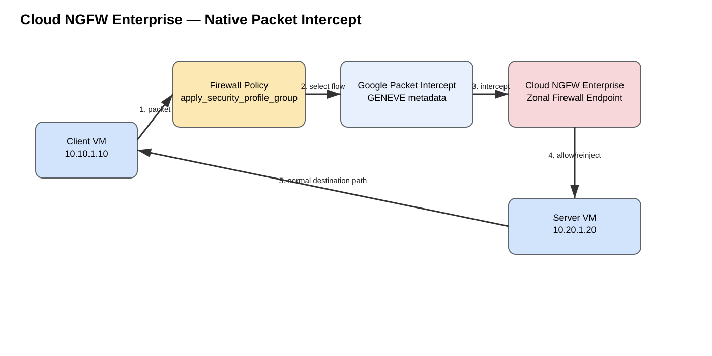
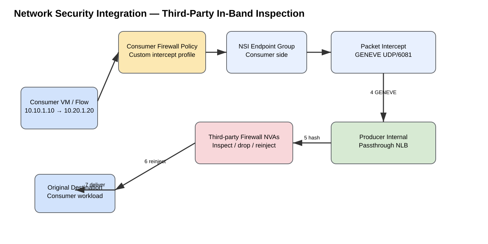
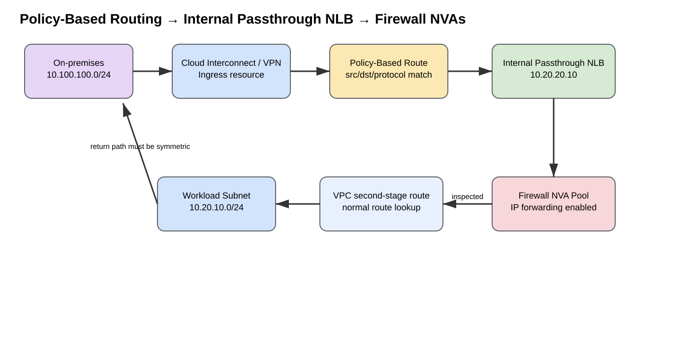

# Google Cloud Firewall Inspection and Service Insertion — Comprehensive Study Guide

> **Last reviewed:** 2026-09-07

## URLs reviewed

- https://docs.cloud.google.com/firewall/docs/about-firewalls
- https://docs.cloud.google.com/firewall/docs/firewall-policies
- https://docs.cloud.google.com/firewall/docs/about-firewall-endpoints
- https://docs.cloud.google.com/firewall/docs/manage-firewall-endpoints
- https://docs.cloud.google.com/firewall/docs/about-tls-inspection
- https://docs.cloud.google.com/network-security-integration/docs/nsi-overview
- https://docs.cloud.google.com/network-security-integration/docs/in-band/in-band-integration-tutorial
- https://docs.cloud.google.com/network-security-integration/docs/understand-geneve
- https://docs.cloud.google.com/network-security-integration/docs/out-of-band/out-of-band-integration-overview
- https://docs.cloud.google.com/vpc/docs/shared-vpc
- https://docs.cloud.google.com/vpc/docs/provisioning-shared-vpc
- https://docs.cloud.google.com/vpc/docs/policy-based-routes
- https://docs.cloud.google.com/vpc/docs/use-policy-based-routes
- https://docs.cloud.google.com/load-balancing/docs/internal/ilb-next-hop-overview
- https://docs.cloud.google.com/load-balancing/docs/internal/setting-up-ilb-next-hop
- https://docs.cloud.google.com/network-connectivity/docs/network-connectivity-center
- https://docs.cloud.google.com/network-connectivity/docs/network-connectivity-center/concepts/connectivity-topologies
- https://docs.cloud.google.com/network-connectivity/docs/network-connectivity-center/concepts/ra-overview
- https://docs.cloud.google.com/network-connectivity/docs/network-connectivity-center/how-to/creating-router-appliances
- https://docs.cloud.google.com/network-connectivity/docs/network-connectivity-center/how-to/connect-site-to-cloud
- https://docs.cloud.google.com/architecture/best-practices-vpc-design
- https://cloud.google.com/blog/products/networking/policy-based-routing-network-patterns-for-virtual-appliances

---

## Table of contents

- [Firewall insertion taxonomy](#firewall-insertion-taxonomy)
- [1. Cloud NGFW distributed firewall policy](#1-cloud-ngfw-distributed-firewall-policy)
- [2. Cloud NGFW Enterprise firewall endpoint insertion](#2-cloud-ngfw-enterprise-firewall-endpoint-insertion)
  - [Packet flow](#packet-flow)
  - [Representative configuration](#representative-configuration)
  - [Verification](#verification)
- [3. Network Security Integration in-band third-party packet intercept](#3-network-security-integration-in-band-third-party-packet-intercept)
  - [Packet flow](#packet-flow-1)
- [4. Policy-Based Route → internal passthrough NLB → firewall NVA](#4-policy-based-route--internal-passthrough-nlb--firewall-nva)
  - [Scope](#scope)
  - [Hybrid ingress example](#hybrid-ingress-example)
  - [Representative configuration and verification](#representative-configuration-and-verification)
- [5. Static route → internal passthrough NLB → firewall pool](#5-static-route--internal-passthrough-nlb--firewall-pool)
  - [Difference from PBR](#difference-from-pbr)
  - [Major limitation](#major-limitation)
  - [Internet egress packet flow](#internet-egress-packet-flow)
- [6. Direct next-hop VM / multi-NIC firewall between VPCs](#6-direct-next-hop-vm--multi-nic-firewall-between-vpcs)
- [7. Network Connectivity Center Router Appliance + BGP](#7-network-connectivity-center-router-appliance--bgp)
  - [Good use cases](#good-use-cases)
  - [Packet path](#packet-path)
- [8. NCC Gateway + Security Service Edge](#8-ncc-gateway--security-service-edge)
- [9. Load-balancer sandwich / proxy-fronted firewall](#9-load-balancer-sandwich--proxy-fronted-firewall)
- [10. Packet Mirroring / NSI out-of-band / Cloud IDS — not inline](#10-packet-mirroring--nsi-out-of-band--cloud-ids--not-inline)
- [11. Shared VPC centralized firewall architecture](#11-shared-vpc-centralized-firewall-architecture)
- [Method selection by traffic direction](#method-selection-by-traffic-direction)
  - [Same-VPC east-west](#same-vpc-east-west)
  - [Shared VPC service-project east-west](#shared-vpc-service-project-east-west)
  - [Multi-VPC east-west](#multi-vpc-east-west)
  - [Internet egress](#internet-egress)
  - [Internet ingress](#internet-ingress)
  - [Cloud Interconnect ingress](#cloud-interconnect-ingress)
  - [Cloud VPN ingress](#cloud-vpn-ingress)
- [Stateful symmetry, NAT, and HA](#stateful-symmetry-nat-and-ha)
- [Common mistakes](#common-mistakes)
- [Troubleshooting by symptom](#troubleshooting-by-symptom)
  - [Traffic bypasses the firewall](#traffic-bypasses-the-firewall)
  - [Shared VPC workload bypasses central inspection](#shared-vpc-workload-bypasses-central-inspection)
  - [ILB selected but appliance gets no packets](#ilb-selected-but-appliance-gets-no-packets)
  - [Firewall receives traffic but destination does not](#firewall-receives-traffic-but-destination-does-not)
  - [TCP handshake starts but return fails](#tcp-handshake-starts-but-return-fails)
  - [NSI in-band appliance sees nothing](#nsi-in-band-appliance-sees-nothing)
  - [Cloud NGFW Enterprise L7 inspection fails](#cloud-ngfw-enterprise-l7-inspection-fails)
  - [Router Appliance BGP is up but firewall is bypassed](#router-appliance-bgp-is-up-but-firewall-is-bypassed)
- [Recommended decision sequence](#recommended-decision-sequence)
- [Sources](#sources)
  - [Information classification](#information-classification)

---

# Firewall insertion taxonomy

Google Cloud does not use one universal service-insertion construct. Depending on the design, Google either enforces policy directly in the distributed VPC fabric, intercepts selected packets transparently, or changes routing so that a firewall/NVA becomes the next hop.

| # | Method | Steering point | Inline? | Best fit |
|---|---|---|---|---|
| 1 | [Cloud NGFW distributed policy](09-06-26-19-21_GCP_Cloud_NGFW_Distributed_Policy_Deep_Dive.md) | Hierarchical/global/regional firewall policy | Yes, distributed | Broad stateful L3/L4 segmentation |
| 2 | [Cloud NGFW Enterprise firewall endpoints](09-07-26-07-05_GCP_Cloud_NGFW_Enterprise_Firewall_Endpoints_Deep_Dive.md) | `apply_security_profile_group` + packet intercept | Yes | Native IPS, URL filtering, TLS inspection |
| 3 | [Network Security Integration (NSI) in-band](09-07-26-07-03_Palo_Alto_Networks_Firewalling_in_GCP_Deep_Dive.md) | Firewall policy + intercept endpoint | Yes | Transparent third-party inspection with GENEVE |
| 4 | [Policy-Based Route (PBR) → internal passthrough NLB → NVA](09-05-26-08-12_GCP_Policy_Based_Routing_Study_Guide.md) | Source/destination/protocol policy | Yes | Fine-grained service insertion, including hybrid ingress |
| 5 | [Static route → internal passthrough NLB → NVA](09-07-26-07-03_Palo_Alto_Networks_Firewalling_in_GCP_Deep_Dive.md) | Destination-prefix route | Yes | Default-route egress and transit firewall pools |
| 6 | [Direct next-hop VM / multi-NIC firewall](09-07-26-07-03_Palo_Alto_Networks_Firewalling_in_GCP_Deep_Dive.md) | Static route/topology | Yes | Traditional trust-zone bridge/router design |
| 7 | [NCC Router Appliance + BGP](09-07-26-09-03_GCP_NCC_Router_Appliance_BGP_Firewall_Insertion_Deep_Dive.md) | Dynamic BGP route exchange | Yes when routed through appliance | Hybrid/site-to-cloud/site-to-site transit |
| 8 | [NCC Gateway + Security Service Edge (SSE)](09-06-26-19-15_GCP_Network_Connectivity_Center_Comprehensive_Study_Guide.md) | NCC spoke-group/gateway topology | Yes for eligible paths | Cloud-delivered security service insertion |
| 9 | [Load-balancer sandwich / proxy-fronted firewall](09-07-26-07-03_Palo_Alto_Networks_Firewalling_in_GCP_Deep_Dive.md) | External/internal LB topology | Yes for application path | Published applications and proxy-centric security |
| 10 | [Packet Mirroring / NSI out-of-band / Cloud IDS](09-06-26-18-58_GCP_Firewall_Inspection_Insertion_Comprehensive_Study_Guide.md#10-packet-mirroring--nsi-out-of-band--cloud-ids--not-inline) | Mirroring policy | **No** | Passive detection and analysis |
| 11 | [Shared VPC centralized firewall architecture](09-07-26_GCP_Shared_VPC_Centralized_Firewall_Insertion_Method_11_Deep_Dive.md) | Shared host-project routing/policy domain + selected insertion mechanism | Depends on insertion method | Centralized multi-project inspection and hybrid security |

**Method 11 note:** Shared VPC is an architecture wrapper, not a new packet-forwarding primitive. It centralizes the VPC routing/policy domain; PBR, Cloud NGFW Enterprise, NSI, static next-hop ILB routes, or NCC Router Appliance provide the actual steering/inspection mechanism.

---

# 1. Cloud NGFW distributed firewall policy

Cloud Next Generation Firewall (Cloud NGFW) provides stateful distributed enforcement through hierarchical, global, and regional firewall policies. The packet is filtered in Google Cloud's virtual networking path; it is not routed through a customer-owned firewall VM.

Use it for organization-wide segmentation, same-VPC east-west controls, north-south stateful filtering, and Standard-tier features such as supported FQDN/threat-intelligence objects.

In a Shared VPC, a VM interface connected to the host project's Shared VPC network is governed by the hierarchical firewall-policy hierarchy of the **host project**, not by the service project's separate hierarchy. This is important for centralized policy ownership.

If the requirement is that Palo Alto, Fortinet, Check Point, Cisco, or another NVA must physically receive the packet, use NSI in-band, PBR/ILB insertion, static-route/ILB insertion, direct NVA routing, or NCC Router Appliance instead.

---

# 2. Cloud NGFW Enterprise firewall endpoint insertion

Cloud NGFW Enterprise provides Layer 7 inspection through **zonal firewall endpoints**. Firewall policy rules can use `apply_security_profile_group` to select traffic for Google Cloud packet intercept. The workload route does not need to point to a firewall VM.



[Editable draw.io](images/09-06-26-18-58_gcp_cloud_ngfw_enterprise_packet_intercept.drawio)

**What this image shows:** policy-selected traffic is intercepted, inspected by a zonal Cloud NGFW Enterprise endpoint, and then allowed/reinjected or dropped.

**What matters:** endpoints and endpoint associations are zonal; protected workloads need the required endpoint association in the relevant zone.

**What to verify:** endpoint state, association state, winning firewall rule, workload zone, security profile group, TLS trust, MTU, and endpoint utilization.

## Packet flow

For `10.10.1.10:51514 -> 10.20.1.20:443`:

1. Client emits the packet.
2. Hierarchical/global firewall policy evaluates the flow.
3. A matching rule uses `apply_security_profile_group`.
4. Packet intercept diverts the selected flow to the zonal firewall endpoint.
5. If TLS inspection is configured, Cloud NGFW decrypts, inspects, and re-encrypts the connection.
6. IDS/IPS, URL filtering, malware inspection, or other enabled Enterprise services evaluate it.
7. Approved traffic is reinjected to the original destination; denied traffic is not forwarded.
8. Return traffic is handled by the stateful inspection service.

Google currently documents up to **10 Gbps without TLS inspection** and **2 Gbps with TLS inspection** per endpoint, with per-connection maxima of **1.25 Gbps without TLS** and **250 Mbps with TLS**. Validate current limits before deployment.

## Representative configuration

```cli
gcloud network-security firewall-endpoints create endpoint-ips \
  --organization=ORGANIZATION_ID \
  --zone=ZONE \
  --billing-project=PROJECT_ID
```

```cli
gcloud network-security firewall-endpoint-associations create endpoint-association-ips \
  --endpoint=organizations/ORGANIZATION_ID/locations/ZONE/firewallEndpoints/endpoint-ips \
  --network=VPC_NAME \
  --zone=ZONE \
  --project=PROJECT_ID
```

## Verification

```cli
gcloud network-security firewall-endpoints list \
  --organization=ORGANIZATION_ID \
  --location=ZONE
```

```cli
gcloud network-security firewall-endpoint-associations list \
  --project=PROJECT_ID \
  --location=ZONE
```

**Success:** endpoint and association are active and reference the expected zone/VPC.

**Failure indicators:** wrong zone, inactive association, wrong profile, TLS trust failure, MTU mismatch, or endpoint saturation.

---

# 3. Network Security Integration in-band third-party packet intercept

NSI adds a producer-consumer model for third-party inspection. A security team can operate appliances in a producer VPC while consumer VPCs select traffic for interception through firewall policy.

The producer side contains zonal deployments backed by an **internal passthrough Network Load Balancer** and network-appliance VMs. The consumer references the inspection service through endpoint resources and a security profile group.



[Editable draw.io](images/09-06-26-18-58_gcp_nsi_inband_third_party_insertion.drawio)

**What this image shows:** consumer policy selects traffic; GCP encapsulates it in GENEVE; a producer ILB distributes it to a third-party firewall; allowed traffic is reinjected.

**What matters:** this is transparent packet interception, not a workload route to the firewall ILB.

**What to verify:** consumer endpoint association, security profile group, producer deployment, ILB health, appliance GENEVE handling, and UDP/6081 reachability.

## Packet flow

1. Consumer packet matches an NSI firewall-policy rule.
2. The rule references a security profile group containing a custom intercept profile.
3. Google Cloud encapsulates the packet in **GENEVE**.
4. The producer ILB receives the encapsulated flow and hashes it to a healthy appliance.
5. The firewall decapsulates and inspects the original packet.
6. It drops the packet or reinjects it through the logical bidirectional GENEVE mechanism.
7. Google Cloud resumes delivery toward the original destination.

Google-specific GENEVE metadata includes information such as network cookie, endpoint cookie, and profile ID, which is useful when centralized inspection must distinguish overlapping consumer networks.

Producer appliances must permit GENEVE from the documented subnet gateway source. The Google tutorial uses a rule similar to:

```cli
gcloud compute network-firewall-policies rules create 100 \
  --firewall-policy=producer-firewall-policy \
  --global-firewall-policy \
  --action=allow \
  --direction=INGRESS \
  --layer4-configs=udp:6081 \
  --src-ip-ranges=GATEWAY_IP/32
```

Use NSI in-band when the vendor supports this model and you want third-party inspection without rewriting consumer routes. Use PBR instead when you need explicit route-driven transit or the appliance/vendor is not integrated with NSI.

---

# 4. Policy-Based Route → internal passthrough NLB → firewall NVA

PBR is the strongest classic **fine-grained service-insertion** mechanism. It can classify on source range, destination range, and protocol, then send matching traffic to an internal passthrough NLB that fronts health-checked firewall VMs.



[Editable draw.io](images/09-06-26-18-58_gcp_pbr_ilb_nva_service_insertion.drawio)

**What this image shows:** hybrid traffic arriving from on-premises is selected by PBR, sent to an ILB-backed NVA pool, then returned to normal VPC routing after inspection.

**What matters:** PBR is evaluated before ordinary subnet/static/dynamic routes, after special routing paths. The firewall's second-stage route lookup must not send the packet back into the same intercept rule.

**What to verify:** PBR scope/priority, ILB global access when needed, backend IP forwarding, health checks, reverse-path symmetry, and a bypass rule or scope design that prevents reinsertion loops.

## Scope

Google documents PBR applicability to:

- all VM instances, Cloud Interconnect VLAN attachments, and Cloud VPN tunnels in the VPC;
- only tagged VM instances;
- only VLAN attachments in a specific region of the VPC.

Only VLAN attachments using the required current dataplane support can use PBR. Validate the Interconnect dataplane version before relying on this pattern.

PBR limitations include:

- no port-based matching;
- PBRs are not exchanged through VPC Network Peering;
- PBRs are not exchanged between NCC hubs and spokes;
- PBRs cannot route packets to Private Service Connect endpoints/backends in unsupported cases;
- a PBR must be deleted/recreated rather than edited in place;
- the next-hop internal passthrough NLB must use a dedicated VIP.

## Hybrid ingress example

For `10.100.100.10 on-prem -> 10.20.10.20 workload`:

1. Packet arrives on the Interconnect VLAN attachment.
2. PBR matches source `10.100.100.0/24` and destination `10.20.10.0/24`.
3. GCP sends it to the internal passthrough NLB instead of directly following the workload subnet route.
4. The ILB chooses a healthy firewall backend and preserves the original packet tuple.
5. Firewall inspects the packet and sends it back into the VPC fabric.
6. A new lookup follows the normal route to `10.20.10.0/24` because the appliance itself must not re-match the original intercept policy.
7. Return traffic must cross the same firewall state domain when stateful inspection requires symmetry.

Backend appliance VMs must have **IP forwarding enabled**.

## Representative configuration and verification

```cli
gcloud network-connectivity policy-based-routes create PBR_NAME \
  --network=VPC_URI \
  --priority=1000 \
  --source-range=SOURCE_CIDR \
  --destination-range=DESTINATION_CIDR \
  --protocol-version=IPV4 \
  --next-hop-ilb-ip=ILB_VIP
```

```cli
gcloud network-connectivity policy-based-routes list
```

```cli
gcloud network-connectivity policy-based-routes describe PBR_NAME
```

**Success:** correct network, source/destination filters, priority, scope, and ILB next hop.

**Failure indicators:** wrong scope, wrong priority, appliance re-matching the same PBR and looping, or asymmetric return routing.

---

# 5. Static route → internal passthrough NLB → firewall pool

A custom static route can use an **internal passthrough Network Load Balancer as the next hop**. The ILB distributes traffic to health-checked appliance VMs.

Best fits include:

- `0.0.0.0/0` to an Internet egress firewall pool;
- remote private prefixes to a transit firewall;
- shared-service prefixes that must cross a firewall zone.

## Difference from PBR

Static routes match destination prefix and participate in ordinary route selection. PBR is evaluated earlier and can classify by source and protocol.

Use PBR for selective policy. Use a static next-hop-ILB route for simple destination/default routing.

## Major limitation

Google documents that next-hop-ILB static routes **cannot override subnet routes**. Therefore a static route is not the tool for arbitrary same-VPC subnet-to-subnet interception. Use PBR, Cloud NGFW Enterprise packet intercept, or NSI in-band for that.

## Internet egress packet flow

1. Workload sends to an Internet IP.
2. Custom `0.0.0.0/0` points to the internal passthrough NLB.
3. ILB selects a healthy firewall backend.
4. Firewall applies policy and, if it owns Internet egress identity, performs SNAT.
5. Firewall forwards toward the default Internet gateway.
6. Return traffic must reach the same state/NAT domain.

```cli
gcloud compute routes create default-via-firewall-ilb \
  --network=VPC_NAME \
  --destination-range=0.0.0.0/0 \
  --next-hop-ilb=ILB_FORWARDING_RULE \
  --next-hop-ilb-region=REGION \
  --priority=900
```

Verify:

```cli
gcloud compute routes describe default-via-firewall-ilb
```

```cli
gcloud compute forwarding-rules describe ILB_FORWARDING_RULE --region=REGION
```

```cli
gcloud compute backend-services get-health BACKEND_SERVICE --region=REGION
```

Google cautions against routing Google APIs/services through next-hop VMs or next-hop internal passthrough NLBs without following the documented Google-service routing exceptions.

---

# 6. Direct next-hop VM / multi-NIC firewall between VPCs

This is the traditional trust-zone model. A firewall VM has multiple NICs, for example an outside NIC in an untrusted/transit VPC and an inside NIC in a protected VPC.

```text
Internet / On-prem
       |
Outside / transit VPC
       |
Firewall outside NIC
       |
policy + NAT + session state
       |
Firewall inside NIC
       |
Trusted workload VPC
```

Use this when explicit topology matters, the vendor firewall owns routing/NAT/VPN functions, or a legacy design depends on multi-NIC trust zones.

Tradeoffs include VM-scale chokepoints, more complex HA, and the need to engineer every forward and reverse route.

A direct next-hop VM can be used, but production designs often prefer an ILB-backed firewall pool because the ILB adds health-checked next-hop distribution.

---

# 7. Network Connectivity Center Router Appliance + BGP

NCC supports third-party **Router Appliance** VMs as spokes. The appliance forms BGP sessions with Cloud Router and can be a router, SD-WAN edge, or firewall/router combination.

This is a **dynamic-routing insertion pattern**: BGP makes selected prefixes reachable through the NVA. Cloud Router is the control plane; the Router Appliance VM is the data-plane forwarding hop.

## Good use cases

- site-to-cloud connectivity through a firewall/SD-WAN edge;
- site-to-site transit through GCP;
- dynamic route learning and advertisement;
- architectures where route policy should be controlled with BGP rather than many static/PBR objects.

Google documents TCP/179 reachability and RFC1918 addressing for the Router Appliance peering relationship.

## Packet path

1. External site advertises a prefix toward the NVA.
2. NVA exchanges routes with Cloud Router/NCC.
3. GCP installs/selects a path through the appliance.
4. Workload packet traverses the NVA.
5. Firewall policy/session inspection occurs.
6. NVA forwards toward the remote site.
7. Reverse advertisements must force the return flow through the same stateful path.

Verify:

```cli
gcloud network-connectivity spokes list
```

```cli
gcloud compute routers get-status CLOUD_ROUTER_NAME --region=REGION
```

**Success:** BGP peers are established and the expected prefixes are learned/advertised.

**Failure indicators:** idle/active BGP state, missing routes, equal/preferred alternate route causing bypass, or asymmetric route advertisement.

---

# 8. NCC Gateway + Security Service Edge

NCC Gateway spokes can integrate with third-party **Security Service Edge (SSE)** services. This is different from operating firewall VMs inside your own VPC.

Current NCC topology documentation states that SSE inspection is available for eligible traffic routed between an **NCC Gateway spoke in the gateways spoke group** and spokes in the appropriate workload/service spoke groups.

Use it when you want cloud-delivered security, workforce/hybrid access enforcement, and NCC as the connectivity fabric. Do not assume every Interconnect/VPN/Router-Appliance flow is automatically inspected; validate the actual spoke-group path and current provider support.

---

# 9. Load-balancer sandwich / proxy-fronted firewall

For published applications, a firewall or reverse-proxy appliance tier can sit between an external frontend and protected backend services:

```text
Internet
  |
External LB / public VIP
  |
Firewall / security proxy tier
  |
Internal LB / application service
  |
Backends
```

This is useful when the appliance intentionally proxies or terminates the application flow. It is not the same as transparent PBR/NSI insertion because the proxy can create new transport sessions and alter source IP, port, TLS, health-check, and return-path behavior.

**Cloud Armor note:** Cloud Armor is a WAF/DDoS policy service on supported Google Cloud load balancers. It is valuable application protection, but it is not a generic routed L3/L4 firewall insertion mechanism.

---

# 10. Packet Mirroring / NSI out-of-band / Cloud IDS — not inline

Packet Mirroring creates a **copy** of traffic. NSI out-of-band can use firewall-policy mirroring rules to deliver GENEVE-encapsulated copies to collector appliances. Cloud IDS is similarly a detection-oriented service.

The original packet does **not** traverse the collector.

If the requirement is "malicious traffic must be blocked before delivery," choose an inline method: Cloud NGFW Enterprise, NSI in-band, PBR/ILB/NVA, static-route/ILB/NVA, or a routed firewall topology.

---

# 11. Shared VPC centralized firewall architecture

Shared VPC deserves its own method because it changes the **enterprise ownership and routing domain** used for centralized inspection across service projects.

However, Shared VPC itself does not redirect packets. The actual insertion mechanism is one of the supported methods already described in this guide, most commonly:

- PBR → internal passthrough NLB → third-party NVA;
- static default/destination route → internal passthrough NLB → NVA where route constraints permit;
- Cloud NGFW Enterprise packet interception;
- NSI in-band third-party packet interception;
- NCC Router Appliance + BGP for dynamic routed appliance insertion.

A service-project VM NIC attached to a shared subnet participates in the **host project's Shared VPC routing domain**, which gives the network/security team centralized control over routes, PBRs, hybrid connectivity, and firewall insertion while application resources remain in separate service projects.

For the complete architecture, east-west and hybrid packet flows, PBR design, SNAT/state symmetry, Router Appliance restrictions, CLI verification, HA behavior, and troubleshooting, see:

**Deep dive:** [GCP Shared VPC Centralized Firewall Insertion — Method 11](09-07-26_GCP_Shared_VPC_Centralized_Firewall_Insertion_Method_11_Deep_Dive.md)

---

# Method selection by traffic direction

## Same-VPC east-west

Prefer Cloud NGFW distributed policy for L3/L4 segmentation, Cloud NGFW Enterprise for native L7 inspection, NSI in-band for third-party transparent inspection, or PBR→ILB→NVA for explicit third-party steering.

Static routes cannot override ordinary subnet routes for arbitrary same-VPC subnet traffic.

## Shared VPC service-project east-west

Treat the service-project interfaces as participants in the same Shared VPC routing domain. PBR→ILB→NVA is a strong choice when the traffic must traverse third-party firewalls. Cloud NGFW Enterprise and NSI in-band avoid explicit route-driven appliance insertion.

## Multi-VPC east-west

Use NSI producer/consumer insertion, Cloud NGFW Enterprise endpoint associations, a transit design with ILB-backed firewalls, or NCC Router Appliance when BGP-driven transit is required.

Do not assume PBR propagates across VPC peering or NCC.

## Internet egress

Common patterns are native Cloud NGFW, default static route to an ILB-backed firewall pool, selective PBR, a multi-NIC egress firewall that performs SNAT, or NCC Gateway/SSE where supported.

Decide explicitly **where SNAT occurs** and make the reverse path return through the state owner.

## Internet ingress

Options include external Application Load Balancer + Cloud Armor for HTTP(S) WAF, Cloud NGFW Enterprise, NSI in-band, or an explicit public-facing/multi-NIC firewall/load-balancer sandwich.

DNAT designs must preserve a symmetric return path for reverse NAT and session state.

## Cloud Interconnect ingress

PBR is especially useful because it can apply to regional VLAN attachments within the documented scope. Traffic can arrive from on-premises, match source/destination criteria, be sent to the firewall ILB, and then re-enter normal VPC routing after inspection.

Choose NCC Router Appliance instead when the firewall must participate directly in BGP transit.

## Cloud VPN ingress

PBR can apply to VPN traffic in its documented route scope. NCC Router Appliance is appropriate when the inspection device is also the dynamic routing edge.

---

# Stateful symmetry, NAT, and HA

For every stateful firewall design, draw both directions:

```text
Forward: source -> steering point -> firewall -> destination
Return:  destination -> steering point -> same state domain -> source
```

Verify:

- route/PBR/policy decision in each direction;
- load-balancer hashing behavior;
- vendor state synchronization;
- SNAT/DNAT location;
- competing more-specific routes;
- failure behavior and convergence.

The internal passthrough NLB is not an application proxy. Routing, filtering, proxying, and NAT are the NVA's responsibility. It can provide health-checked backend selection, but it does **not** imply that unrelated firewall nodes share session state.

Cloud NGFW firewall endpoints and NSI deployments are zonal constructs, so multi-zone application designs require matching deployment/association planning.

Router Appliance HA should use redundant appliances/BGP sessions and validate route withdrawal, convergence, ECMP behavior, and transient asymmetry.

---

# Common mistakes

1. Calling Packet Mirroring inline inspection.
2. Trying to override a same-VPC subnet route with a static next-hop-ILB route.
3. Forgetting IP forwarding on firewall VM backends.
4. Treating Cloud Router as a packet-forwarding hop.
5. Assuming the ILB automatically solves state synchronization.
6. Forgetting the PBR second-stage lookup and creating a loop.
7. Sending Google APIs/services through next-hop appliances contrary to current Google guidance.
8. Ignoring Cloud NGFW firewall-endpoint zones.
9. Ignoring MTU and GENEVE encapsulation overhead.
10. Assuming NCC SSE inspection applies to every spoke combination.
11. Treating Shared VPC and a peered security VPC as equivalent.
12. Assuming PBR is exchanged through VPC Network Peering or NCC.
13. Deploying Router Appliance in a Shared VPC service project instead of the supported host-project model.

---

# Troubleshooting by symptom

## Traffic bypasses the firewall

```cli
gcloud network-connectivity policy-based-routes list
```

```cli
gcloud compute routes list --filter='network:VPC_NAME'
```

**Tests:** installed steering objects, scope, priority, and competing routes.

**Failure means:** wrong PBR filter/scope, direct subnet route winning in a static-route design, wrong policy association, or a bypass route.

**Next:** describe the exact route/PBR and trace both directions separately.

## Shared VPC workload bypasses central inspection

Check:

```cli
gcloud compute shared-vpc get-host-project SERVICE_PROJECT_ID
```

```cli
gcloud compute shared-vpc list-associated-resources HOST_PROJECT_ID
```

Then inspect PBR scope and the effective route used by the workload.

**What failure means:** the workload might be in an unexpected standalone VPC/subnet, the service project might not be attached as expected, or a central PBR/policy might not apply to the traffic class.

## ILB selected but appliance gets no packets

```cli
gcloud compute backend-services get-health BACKEND_SERVICE --region=REGION
```

**Success:** intended NVA backends are healthy.

**Failure means:** health-check firewall, wrong probe port, interface binding, or appliance failure. Verify IP forwarding and interface counters next.

## Firewall receives traffic but destination does not

Check firewall policy/NAT/session table, NVA routing table, IP forwarding, and the VPC's second-stage route after the packet exits the appliance.

A common cause is a route loop or the packet matching the same insertion rule again.

## TCP handshake starts but return fails

Trace the destination-to-source path independently. Look for reverse-path bypass, return traffic hashing to a non-state-sharing peer, or an alternate BGP/static route.

## NSI in-band appliance sees nothing

Verify the winning consumer firewall rule, security profile group/custom intercept profile, endpoint/deployment association, producer ILB health, and GENEVE UDP/6081 reachability.

## Cloud NGFW Enterprise L7 inspection fails

Verify active endpoint/association, workload zone, security profile, TLS CA trust where required, VPC MTU compatibility, and endpoint capacity metrics.

## Router Appliance BGP is up but firewall is bypassed

```cli
gcloud compute routers get-status CLOUD_ROUTER_NAME --region=REGION
```

Check whether another direct/static/dynamic route is more preferred, whether multiple spoke types advertise the same prefix, or whether only one direction is being advertised through the NVA.

---

# Recommended decision sequence

1. Need only distributed stateful filtering? **Cloud NGFW policy**.
2. Need Google-managed L7/IPS/URL/TLS? **Cloud NGFW Enterprise firewall endpoints**.
3. Need transparent third-party inspection without route changes? **NSI in-band**.
4. Need selective source/destination/protocol steering? **PBR → internal passthrough NLB → NVA**.
5. Need default/destination-prefix steering? **Static route → internal passthrough NLB → NVA**.
6. Need explicit trust-zone VPC separation and firewall-owned routing/NAT? **Multi-NIC/direct NVA**.
7. Need dynamic hybrid BGP transit through firewall/SD-WAN? **NCC Router Appliance**.
8. Need cloud-delivered SSE integrated with NCC? **NCC Gateway/SSE**.
9. Need passive detection only? **NSI out-of-band / Packet Mirroring / Cloud IDS**.
10. Need centralized multi-project networking? **Use Shared VPC as the common routing/policy architecture and apply one or more of the insertion methods above inside it.**

---

# Sources

- https://docs.cloud.google.com/firewall/docs/about-firewalls
- https://docs.cloud.google.com/firewall/docs/firewall-policies
- https://docs.cloud.google.com/firewall/docs/about-firewall-endpoints
- https://docs.cloud.google.com/firewall/docs/manage-firewall-endpoints
- https://docs.cloud.google.com/firewall/docs/about-tls-inspection
- https://docs.cloud.google.com/network-security-integration/docs/nsi-overview
- https://docs.cloud.google.com/network-security-integration/docs/in-band/in-band-integration-tutorial
- https://docs.cloud.google.com/network-security-integration/docs/understand-geneve
- https://docs.cloud.google.com/network-security-integration/docs/out-of-band/out-of-band-integration-overview
- https://docs.cloud.google.com/vpc/docs/shared-vpc
- https://docs.cloud.google.com/vpc/docs/provisioning-shared-vpc
- https://docs.cloud.google.com/vpc/docs/policy-based-routes
- https://docs.cloud.google.com/vpc/docs/use-policy-based-routes
- https://docs.cloud.google.com/load-balancing/docs/internal/ilb-next-hop-overview
- https://docs.cloud.google.com/load-balancing/docs/internal/setting-up-ilb-next-hop
- https://docs.cloud.google.com/network-connectivity/docs/network-connectivity-center
- https://docs.cloud.google.com/network-connectivity/docs/network-connectivity-center/concepts/connectivity-topologies
- https://docs.cloud.google.com/network-connectivity/docs/network-connectivity-center/concepts/ra-overview
- https://docs.cloud.google.com/network-connectivity/docs/network-connectivity-center/how-to/creating-router-appliances
- https://docs.cloud.google.com/network-connectivity/docs/network-connectivity-center/how-to/connect-site-to-cloud
- https://docs.cloud.google.com/architecture/best-practices-vpc-design
- https://cloud.google.com/blog/products/networking/policy-based-routing-network-patterns-for-virtual-appliances

## Information classification

- **Source information:** documented Shared VPC host/service-project behavior, firewall-policy hierarchy behavior, PBR scopes and limitations, endpoint capacity/MTU, GENEVE use, Router Appliance Shared VPC support, NCC/SSE eligibility, and CLI patterns from the sources above.
- **Additional explanation:** packet walks, state/symmetry reasoning, NAT implications, Shared VPC architecture comparison, and operational guidance.
- **Reasonable inference:** vendor-specific HA/session-state behavior varies and must be validated against the current vendor deployment guide; this guide does not assume cross-node state synchronization unless documented by the vendor.
