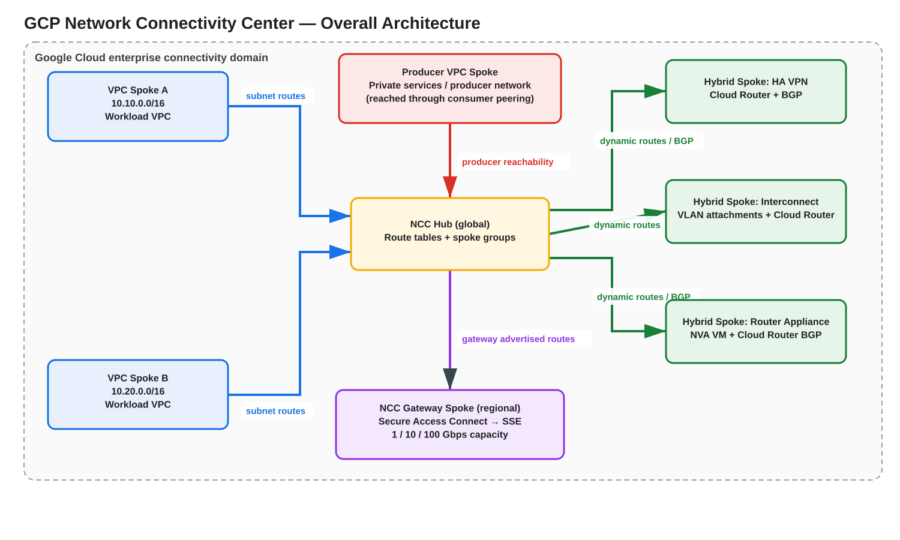
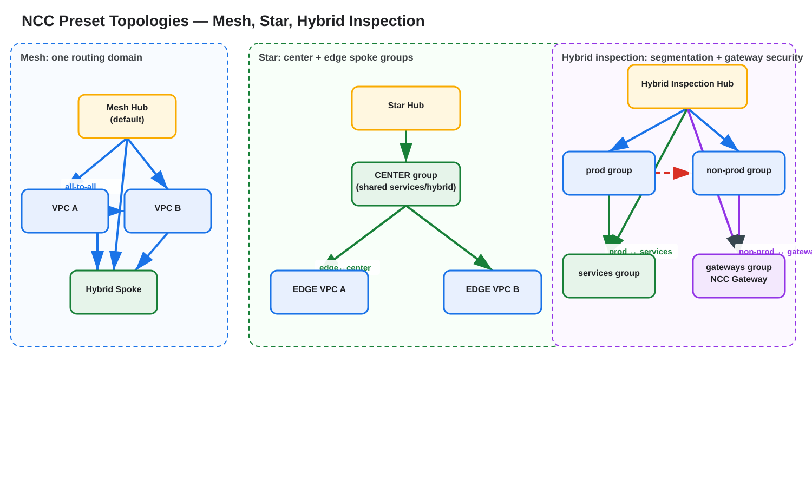
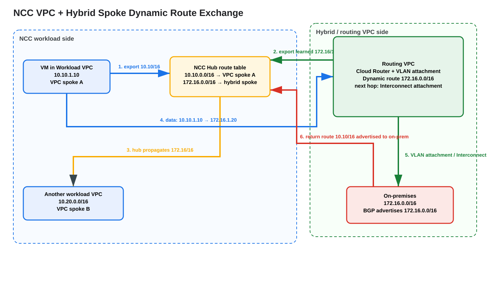
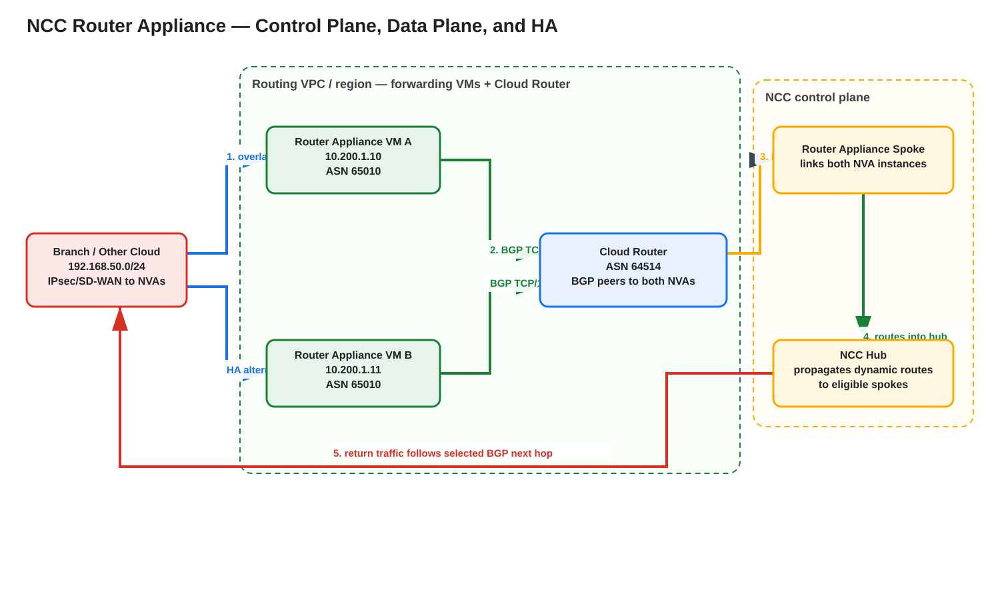
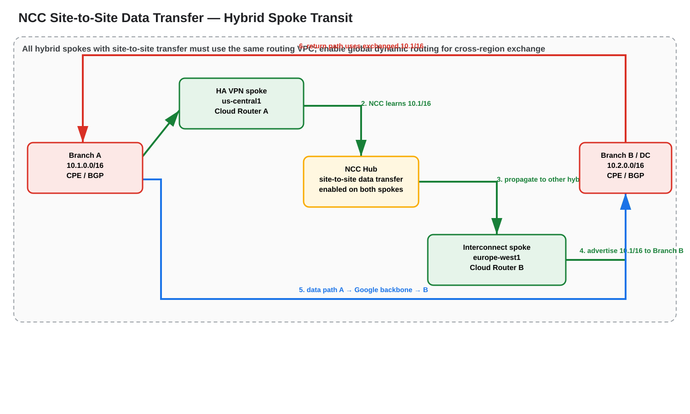
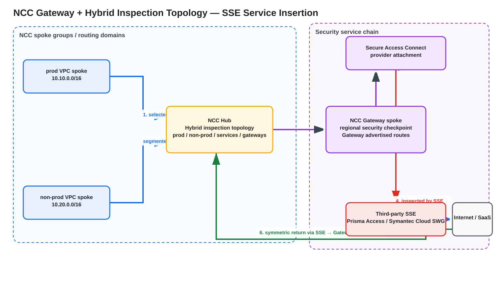

# Google Cloud Network Connectivity Center (NCC) — Comprehensive Study Guide

> **Scope:** Google Cloud Network Connectivity Center (NCC), including VPC spokes, producer VPC spokes, hybrid spokes (HA VPN, Cloud Interconnect VLAN attachments, Router appliance), route exchange, spoke filters, preset topologies, site-to-site data transfer, Private Service Connect propagation, Private NAT for NCC, NCC Gateway/Security Service Edge integration, high availability, configuration, verification, troubleshooting, quotas, limitations, and pricing.
>
> **Current as of:** 2026-09-06. Verify Preview/GA status, quotas, pricing, and regional availability before production deployment.

---

## Source URLs

Primary Google Cloud documentation used for this guide:

- https://docs.cloud.google.com/network-connectivity/docs/network-connectivity-center
- https://docs.cloud.google.com/network-connectivity/docs/network-connectivity-center/concepts/overview
- https://docs.cloud.google.com/network-connectivity/docs/network-connectivity-center/concepts/vpc-spokes-overview
- https://docs.cloud.google.com/network-connectivity/docs/network-connectivity-center/concepts/connectivity-topologies
- https://docs.cloud.google.com/network-connectivity/docs/network-connectivity-center/concepts/dynamic-route-exchange-with-vpc-spokes
- https://docs.cloud.google.com/network-connectivity/docs/network-connectivity-center/concepts/route-exchange
- https://docs.cloud.google.com/network-connectivity/docs/network-connectivity-center/concepts/spoke-filters-overview
- https://docs.cloud.google.com/network-connectivity/docs/network-connectivity-center/concepts/static-routes-overview
- https://docs.cloud.google.com/network-connectivity/docs/network-connectivity-center/concepts/site-to-cloud
- https://docs.cloud.google.com/network-connectivity/docs/network-connectivity-center/how-to/working-with-hubs-spokes
- https://docs.cloud.google.com/network-connectivity/docs/network-connectivity-center/how-to/vpc-configure-hub
- https://docs.cloud.google.com/network-connectivity/docs/network-connectivity-center/how-to/creating-router-appliances
- https://docs.cloud.google.com/network-connectivity/docs/network-connectivity-center/how-to/create-producer-vpc-spoke
- https://docs.cloud.google.com/network-connectivity/docs/network-connectivity-center/concepts/producer-vpc-spokes-supported-services
- https://docs.cloud.google.com/network-connectivity/docs/network-connectivity-center/concepts/ncc-gateway-overview
- https://docs.cloud.google.com/network-connectivity/docs/network-connectivity-center/how-to/ncc-gateway/create-spoke
- https://docs.cloud.google.com/network-connectivity/docs/network-connectivity-center/how-to/ncc-gateway/create-manage-advertised-routes
- https://docs.cloud.google.com/network-connectivity/docs/network-connectivity-center/how-to/ncc-gateway/connect-sac
- https://docs.cloud.google.com/network-connectivity/docs/network-connectivity-center/how-to/ncc-gateway/supported-locations
- https://docs.cloud.google.com/network-connectivity/docs/network-connectivity-center/quotas
- https://docs.cloud.google.com/network-connectivity/docs/network-connectivity-center/release-notes
- https://docs.cloud.google.com/network-connectivity/docs/reference/gcloud-sdk
- https://cloud.google.com/network-connectivity/pricing
- https://docs.cloud.google.com/nat/docs/about-private-nat-for-ncc

---

## 1. What NCC actually is

**Network Connectivity Center (NCC)** is Google Cloud's managed connectivity orchestration framework. A global **hub** contains **spokes** that represent VPC networks, hybrid connectivity resources, producer networks, or NCC Gateway resources.

The most important mental model is that **the NCC hub is a control-plane object, not a packet-forwarding VM**. It determines which routes can be exchanged among eligible spokes and which routing domain/spoke group they belong to. Packets are still forwarded by the underlying Google Cloud VPC data plane, Cloud Router, HA VPN, Cloud Interconnect, Router appliance VM, internal passthrough Network Load Balancer, or NCC Gateway.

### Source information

Google describes NCC as an orchestration framework that connects spoke resources to a central management resource called a hub. The hub is global and can contain regional resources from multiple regions.

### Additional explanation

This is why an NCC design should always be documented twice:

1. **Logical NCC view:** hub, topology, spoke groups, spokes, imported/exported prefixes.
2. **Actual packet view:** source NIC, selected VPC route, next hop, Cloud Router/BGP or gateway, tunnel/attachment, and return route.

A route being visible in NCC does not by itself prove the packet can traverse the whole path.

---

## 2. Building blocks

| Object | Scope | Purpose |
|---|---|---|
| **Hub** | Global | Central NCC management and route-distribution domain |
| **Spoke group** | Hub-level | Routing domain used by preset topology |
| **VPC spoke** | Global | Attaches a VPC network and exchanges eligible subnet/dynamic routes |
| **Producer VPC spoke** | Global | Extends supported producer-service connectivity through NCC |
| **Hybrid spoke** | Regional | Links HA VPN tunnels, VLAN attachments, or Router appliance instances |
| **NCC Gateway spoke** | Regional | Provides a security-service next hop for supported SSE integrations |

A spoke references actual resources. For example, a Router appliance spoke does not replace Cloud Router; it links the appliance instances into NCC while Cloud Router BGP performs route exchange with the appliance.

---

## 3. Overall architecture



[Editable draw.io source](images/09-06-26-19-15_gcp_ncc_overall_architecture.drawio)

**What this image shows**

A global NCC hub connecting VPC spokes, a producer VPC spoke, hybrid spokes based on HA VPN, Interconnect, and Router appliances, plus an NCC Gateway spoke.

**What matters**

- VPC spokes contribute eligible subnet routes.
- Hybrid spokes contribute dynamic routes learned through Cloud Router/BGP.
- NCC distributes eligible routes based on topology and spoke-group policy.
- Producer VPC spokes extend supported producer service reachability.
- NCC Gateway routes can direct selected traffic to a supported Security Service Edge (SSE) integration.

**What to verify**

- Every VPC is attached to the intended hub.
- Every spoke is in the intended spoke group.
- Hybrid resources use the correct routing VPC and region.
- Filters do not suppress required prefixes.
- Effective VPC routes agree with the logical NCC route table.

---

## 4. VPC spokes

A VPC spoke attaches a VPC network to an NCC hub. It provides centralized inter-VPC route exchange without creating a large full mesh of VPC Network Peering relationships.

Important characteristics:

- A VPC spoke can be in the hub project or another project/organization, subject to IAM and acceptance.
- A VPC network can be associated with only one NCC hub at a time.
- VPC spokes export eligible subnet routes.
- They can import eligible subnet routes from other VPC spokes.
- They can import eligible dynamic routes learned by hybrid spokes when VPC-hybrid route exchange is enabled.
- Static routes are not generally exchanged by the NCC hub.

### Important limitations

- Auto-mode VPC networks are not supported as VPC spokes; use custom mode.
- Avoid combining NCC connectivity with conflicting VPC Network Peering paths between the same VPCs.
- Reattaching the same VPC to a different hub has a documented cooldown; Google documents at least ten minutes in relevant VPC-spoke workflows.
- General static-route propagation is not an NCC VPC-spoke feature.

### Cross-project acceptance

A cross-project spoke can be created but remain **INACTIVE** until the hub administrator accepts it, unless the hub is configured to auto-accept spokes from approved projects. This is a frequent operational failure mode: the resource exists, but its routes are not participating because the spoke has not become `ACTIVE`.

---

## 5. Preset topologies

The hub's preset topology is selected when the hub is created and **cannot be changed later**. Treat this as an architectural decision, not a cosmetic setting.



[Editable draw.io source](images/09-06-26-19-15_gcp_ncc_preset_topologies.drawio)

**What this image shows**

The three preset models: mesh, star, and hybrid inspection.

**What matters**

- **Mesh** is the broadest all-to-all model.
- **Star** separates center and edge spoke groups; edge-to-edge communication is intentionally constrained while edge-to-center communication is supported.
- **Hybrid inspection** creates fixed groups such as production, non-production, services, and gateways for segmented routing and security-service insertion.

**What to verify**

- The hub was created with the intended topology.
- Every spoke was placed in the correct group.
- A site-to-site hybrid spoke is placed in the topology role required by Google documentation; in star designs, site-to-site hybrid spokes belong in the center.
- Security policy is still configured separately; route-domain segmentation is not a replacement for firewall policy.

### Mesh

Use mesh when you want broad route exchange among attached VPC and hybrid spokes. It is operationally simple but provides the least route-domain isolation.

### Star

Use star when central/shared-services connectivity should be available to edge VPCs but edge-to-edge communication should not be directly transitive. A common pattern is to put hybrid connectivity, DNS, shared services, or central appliances in the **center** group and application VPCs in the **edge** group.

### Hybrid inspection

Use hybrid inspection when you need stronger built-in route segmentation and NCC Gateway/SSE integration. Google defines topology-specific spoke groups and allowed route relationships. Production and non-production are intentionally not treated like a full mesh.

---

## 6. VPC and hybrid dynamic route exchange

One of NCC's most important capabilities is distributing hybrid routes learned by Cloud Router to VPC spokes while also advertising VPC subnet reachability back toward hybrid resources.



[Editable draw.io source](images/09-06-26-19-15_gcp_ncc_vpc_hybrid_route_exchange.drawio)

**What this image shows**

A workload VPC exporting `10.10.0.0/16` and a hybrid Interconnect path learning `172.16.0.0/16`. NCC distributes the eligible routes so the VPC and on-premises network have bidirectional reachability.

**What matters**

The route has to exist in both directions:

- Google Cloud VPC must have a selected route for the on-premises prefix.
- On-premises BGP must learn the VPC prefix and install it in its routing/FIB policy.

**What to verify**

- BGP is `ESTABLISHED`.
- Cloud Router learns the expected on-premises prefix.
- The NCC hub route table contains the dynamic route.
- The destination VPC receives/selects it.
- The hybrid side receives the VPC subnet route.

### Example packet flow

For `10.10.1.10 → 172.16.1.20`:

1. VM `10.10.1.10` performs a VPC route lookup for `172.16.1.20`.
2. The selected dynamic route originated from the eligible hybrid spoke.
3. Google Cloud forwards the packet toward the VLAN attachment/HA VPN/Router appliance path represented by that spoke.
4. For Interconnect, the packet exits the relevant VLAN attachment toward the customer router.
5. The on-premises router forwards toward `172.16.1.20`.
6. The return packet uses the BGP-learned `10.10.0.0/16` route back toward Google Cloud.
7. Google Cloud returns it to the workload VPC and VM.

No NAT is inherently required for non-overlapping private prefixes.

### IPv4/IPv6 nuance

Do not infer universal IPv6 support from a single feature announcement. Google introduced/expanded IPv6-related NCC features over time. As of the current documentation, the VPC-hybrid dynamic-route-exchange feature has feature-specific IP-family constraints, while August 2026 release notes announced Preview support for IPv6 dynamic routes in hybrid-spoke include/exclude filters. Validate the exact combination before using IPv6 in production.

---

## 7. Spoke route filters

NCC spoke filters let you control which CIDRs enter or leave the hub route-distribution domain.

- **VPC spokes:** export filtering.
- **Hybrid spokes:** import and export filtering.
- Include/exclude CIDR lists provide prefix-based control.
- When include and exclude logic overlap, documented precedence must be respected; exclude behavior can remove a prefix that would otherwise be included.
- Google currently documents a hard limit of **16 include/exclude CIDR ranges per spoke**.

### Design use cases

- Prevent development CIDRs from being exported to production routing domains.
- Export only summarized prefixes from a large VPC.
- Prevent a hybrid site from learning sensitive VPC ranges.
- Prevent routes learned from an external BGP domain from being re-exported to a particular NCC routing domain.

### Operational warning

Filters change reachability. Always verify both the hub route table and each destination VPC's effective routes after a filter change.

---

## 8. Static routes and cross-spoke NVA insertion

NCC does **not** generally distribute VPC static routes as hub routes. However, Google documents a special design where a static route in one VPC spoke can use the IPv4 address of an **internal passthrough Network Load Balancer** in another VPC spoke as the next hop.

This is valuable for centralized third-party firewall/NVA insertion.

### Supported design concept

```text
Workload VPC spoke
  static route: protected-prefix -> internal passthrough NLB IP
        |
        v
Security VPC spoke
  internal passthrough NLB
        |
        v
NVA / NGFW backend instances
```

Key constraints include:

- next hop is an IPv4 internal passthrough Network Load Balancer;
- destination is IPv4;
- route is not a generic static-route export through the hub;
- do not apply a network tag in a way that violates the documented cross-spoke static next-hop behavior;
- stateful firewall symmetry must be designed separately.

### Packet flow

1. Source workload sends toward the protected destination.
2. Its VPC route lookup matches the configured static route.
3. The next hop is the internal passthrough NLB frontend IP in another NCC VPC spoke.
4. The NLB selects an NVA backend according to its forwarding/health model.
5. The NVA inspects and routes the packet onward.
6. The return path must be deliberately routed back through the same stateful service tier or through a vendor-supported symmetric design.

NCC makes the VPCs reachable; it does not create state symmetry automatically.

---

## 9. Hybrid spokes

Hybrid spokes connect external networks to NCC by referencing one of these resource types:

1. **HA VPN tunnels**
2. **Cloud Interconnect VLAN attachments**
3. **Router appliance instances**

The backing resources use Cloud Router/BGP to learn and advertise prefixes.

### HA VPN hybrid spoke

Best for encrypted connectivity across the public internet or for VPN-based hybrid designs. Production HA typically uses redundant HA VPN interfaces/tunnels and redundant on-premises peer devices/paths.

### Interconnect hybrid spoke

Best for dedicated/private connectivity where Cloud Interconnect is appropriate. Availability depends on the Interconnect redundancy model, VLAN attachments, Cloud Router configuration, and customer router redundancy.

### Router appliance hybrid spoke

Best when a third-party NVA/SD-WAN/router VM must participate in BGP with Cloud Router and provide an overlay, custom routing behavior, or vendor-specific network function.

---

## 10. Router appliance deep dive



[Editable draw.io source](images/09-06-26-19-15_gcp_ncc_router_appliance.drawio)

**What this image shows**

Two Router appliance VMs in a routing VPC, both peering over BGP TCP/179 with Cloud Router. Their instances are linked by an NCC Router appliance spoke, allowing learned routes to be distributed through the hub.

**What matters**

- The NVA VM is the forwarding/data-plane device.
- Cloud Router is the managed BGP control-plane peer.
- NCC attaches the Router appliance resources to the larger route-distribution domain.
- Redundant appliance instances and BGP peers are strongly preferred.

**What to verify**

- IP forwarding is enabled where required by the appliance design.
- Firewall rules permit BGP TCP/179 between the appliance and Cloud Router addresses.
- Each Cloud Router BGP peer is `ESTABLISHED`.
- Intended prefixes are advertised by the NVA.
- NCC shows the spoke as active and learned routes appear in the intended hub route table.

### Example spoke creation

Google documents the following command pattern:

```cli
gcloud network-connectivity spokes linked-router-appliances create RA_SPOKE \
  --hub=NCC_HUB \
  --description="Redundant router appliance spoke" \
  --router-appliance=instance=VM_A_URI,ip=10.200.1.10 \
  --router-appliance=instance=VM_B_URI,ip=10.200.1.11 \
  --region=us-central1
```

For site-to-site data transfer, add the documented site-to-site flag when creating the hybrid spoke:

```cli
--site-to-site-data-transfer
```

### BGP design

Use normal BGP policy principles on the appliance/customer side:

- summarize routes where safe;
- avoid advertising overlapping or unintended prefixes;
- use attributes supported by the appliance/Cloud Router design for primary/backup behavior;
- validate both forward and reverse best paths;
- test withdrawal and reconvergence rather than assuming HA from the existence of two VMs.

### Failure behavior

If NVA A or its BGP session fails, its routes should be withdrawn. Cloud Router/NCC can then select an eligible alternative route through NVA B, subject to BGP/path-selection state. Stateful sessions might still reset because routing convergence does not replicate firewall session state unless the appliance vendor provides a separate HA/state-sync mechanism.

---

## 11. Site-to-site data transfer

Site-to-site data transfer allows hybrid spokes to exchange routes so external sites can communicate through Google's network instead of using NCC only for site-to-VPC connectivity.



[Editable draw.io source](images/09-06-26-19-15_gcp_ncc_site_to_site_data_transfer.drawio)

**What this image shows**

Branch A advertises `10.1.0.0/16` to one hybrid spoke. NCC propagates that route to another hybrid spoke, which advertises it toward Branch B. Traffic can then cross Google's backbone.

**What matters**

- Site-to-site must be enabled on the participating hybrid spokes.
- Google requires site-to-site hybrid resources to use the same routing VPC for the documented transit model.
- For cross-region route exchange, the routing VPC must use **global dynamic routing**.

**What to verify**

- Branch A prefix appears at Cloud Router A.
- NCC hub route table contains it.
- Cloud Router B advertises it to Branch B.
- Branch B installs it.
- The reverse prefix is exchanged in the opposite direction.

### Packet flow

For `10.1.1.10 → 10.2.1.20`:

1. Branch A router selects its Google hybrid path for `10.2.0.0/16`.
2. Packet enters HA VPN/Interconnect/Router appliance resource A.
3. Google Cloud forwarding uses the route learned/distributed through NCC.
4. Packet exits hybrid resource B toward Branch B.
5. Branch B forwards to `10.2.1.20`.
6. Return traffic follows the exchanged `10.1.0.0/16` route in the reverse direction.

### Common failure

A frequent mistake is enabling site-to-site on only one side, or placing participating hybrid resources in different routing VPCs. Another is forgetting global dynamic routing when the route exchange spans regions.

---

## 12. Producer VPC spokes

A **producer VPC spoke** addresses private managed-service connectivity. A consumer VPC can already be peered with a Google/third-party producer network through a supported service mechanism. The producer VPC spoke allows supported producer-service reachability to extend to other NCC-connected VPC spokes.

This is not a generic workaround for VPC Peering transitivity. Only supported producer-service combinations are eligible.

Operationally verify:

- the consumer-to-producer peering exists and is healthy;
- the producer service is on Google's supported-services list;
- the producer VPC spoke is active;
- overlapping routes do not create ambiguity;
- DNS/private service names resolve consistently from remote VPC spokes.

Common service-peering names include `servicenetworking-googleapis-com` for Service Networking-based services; some supported services use service-specific peering names. Follow the producer-specific documentation instead of assuming one universal peering name.

---

## 13. Private Service Connect propagation

NCC can support **Private Service Connect (PSC) propagation** when the hub is configured for it. This lets eligible PSC endpoint connectivity be propagated across NCC-connected VPCs instead of creating a separate endpoint in every VPC for every design.

Hub creation uses the documented PSC export option when required:

```cli
gcloud network-connectivity hubs create NCC_HUB \
  --description="Enterprise NCC hub" \
  --export-psc
```

Verify the current PSC propagation prerequisites, supported endpoint/service type, DNS design, and topology restrictions before rollout.

---

## 14. Private NAT for NCC

**Private NAT for NCC** is useful when connected private address spaces overlap or when you deliberately want translated private identities between NCC-connected networks.

This is NAT44 private-to-private translation. It is separate from public internet Cloud NAT.

### Example use case

```text
VPC A:     10.10.0.0/16
Partner:   10.10.0.0/16   <-- overlap

Private NAT translates VPC A source into a dedicated non-overlapping NAT pool
before the flow crosses the NCC connectivity path.
```

Important points:

- use the documented `PRIVATE` NAT type;
- allocate the required `PRIVATE_NAT` subnet/pool;
- plan the pool so it does not overlap any reachable destination domain;
- verify return routing points to the translated range;
- remember NAT state and regional failure behavior when designing HA.

Private NAT can be used for supported VPC-to-VPC and VPC-to-hybrid NCC scenarios. It does not fix bad routing automatically; it changes packet addresses so routing can become unambiguous.

---

## 15. NCC Gateway and SSE integration

NCC Gateway is a **regional** NCC construct for connecting Google Cloud traffic to supported Security Service Edge (SSE) providers through Secure Access Connect.

Google documentation currently describes supported integrations including Palo Alto Networks Prisma Access and Symantec Cloud SWG, with feature/provider availability potentially varying by Preview/GA status and location.

Documented gateway capacity choices are **1 Gbps, 10 Gbps, and 100 Gbps**. Google also documents an infrastructure IP reservation requirement based on a `/23` range for a gateway spoke. Verify the current location/capacity matrix before deployment.



[Editable draw.io source](images/09-06-26-19-15_gcp_ncc_gateway_hybrid_inspection.drawio)

**What this image shows**

Production/non-production VPC spokes reach an NCC Gateway spoke according to hybrid-inspection routing policy. The gateway is connected through Secure Access Connect to an SSE provider that inspects traffic before egress.

**What matters**

- Gateway advertised routes steer selected destinations toward the gateway.
- The gateway advertised route becomes usable in the intended way only when the security-service integration is active according to the documented state model.
- The SSE provider is responsible for its own inspection/policy and upstream egress behavior.
- Return traffic must traverse the corresponding security path for stateful policy/session consistency.

**What to verify**

- gateway region and capacity are supported;
- `/23` infrastructure range does not overlap connected prefixes and does not use a prohibited range such as `100.64.0.0/10` where Google documents that restriction;
- Secure Access Connect/provider attachment is active;
- gateway advertised routes are active in the hub route table;
- destination VPC effective routes select the gateway path;
- SSE provider health/policy is correct.

### Create a gateway spoke

Google documents this command pattern:

```cli
gcloud network-connectivity spokes gateways create SSE_GATEWAY \
  --region=us-central1 \
  --hub=NCC_HUB \
  --capacity=10 \
  --ip-range-reservations=10.250.0.0/23 \
  --group=gateways
```

Use the exact capacity syntax supported by the current `gcloud` release/documentation.

### Availability

Google documents a **99.9% SLA** for NCC Gateway in the relevant product documentation. This does not eliminate the need to design provider-side resilience and to understand what happens to routes when the security service is unavailable.

---

## 16. Creating the hub and VPC spokes

### Create a basic hub

```cli
gcloud network-connectivity hubs create NCC_HUB \
  --description="Enterprise Network Connectivity Center" \
  --labels=environment=production
```

### Create a hub with a preset topology

Google documents the preset-topology pattern:

```cli
gcloud network-connectivity hubs create NCC_HUB \
  --policy-mode=PRESET \
  --preset-topology=MESH \
  --description="Enterprise mesh NCC hub"
```

Use `STAR` or the documented hybrid-inspection topology value when that architecture is required. Because topology is immutable, validate this choice before creation.

### Create a VPC spoke

```cli
gcloud network-connectivity spokes linked-vpc-network create WORKLOAD_A \
  --hub=NCC_HUB \
  --description="Workload A VPC spoke" \
  --vpc-network=projects/PROJECT/global/networks/workload-a \
  --global \
  --group=GROUP_NAME
```

### Add export filters

```cli
--include-export-ranges=10.10.0.0/16,10.11.0.0/16 \
--exclude-export-ranges=10.10.99.0/24
```

Use filters only after designing exactly which prefixes each routing domain needs.

---

## 17. HA VPN and Interconnect spoke patterns

NCC does not replace the underlying hybrid resource configuration. Build the resource first, establish BGP, then link it to NCC.

### HA VPN pattern

```text
On-prem router A/B
        |
   HA VPN tunnels
        |
Cloud Router (BGP)
        |
HA VPN NCC hybrid spoke
        |
     NCC hub
```

Verify:

- both redundant tunnels are up;
- BGP sessions are established;
- learned routes are correct;
- priorities/MED/AS-path choices produce the intended preferred path;
- a single tunnel/router failure does not remove all reachability.

### Interconnect pattern

```text
Customer routers
      |
Dedicated/Partner Interconnect
      |
VLAN attachments
      |
Cloud Router BGP
      |
Interconnect NCC hybrid spoke
      |
NCC hub
```

Verify redundancy according to the Interconnect topology you purchased. NCC cannot turn a single physical Interconnect path into a redundant physical design.

---

## 18. Route selection and precedence

NCC distributes routes, but the VPC data plane still performs normal Google Cloud route selection. Troubleshooting therefore requires checking competing route types, not only NCC.

Potential competitors include:

- subnet routes;
- static routes;
- dynamic routes learned by Cloud Router;
- policy-based routes;
- special service/load-balancer routes where applicable.

### Critical rule

A more-specific or otherwise higher-precedence local route can cause the actual packet path to differ from the NCC design. For service insertion, especially check for static routes or policy-based routes that bypass the intended firewall/NVA/Gateway path.

### Static-route interaction

Google documents interactions where static routes in the routing VPC can interfere with hybrid dynamic route exchange, especially if an equal or more-specific static route masks the dynamic route that NCC was expected to propagate. Do not add static routes to a routing VPC without re-validating the dynamic route view.

---

## 19. NAT and address overlap

### No overlap

For private VPC-to-on-prem or VPC-to-VPC traffic with unique prefixes, NCC normally preserves source and destination addresses. NCC itself does not automatically SNAT packets simply because a hub is involved.

### Overlap

Use a deliberate translation architecture, such as Private NAT for NCC, where supported. Document packet fields before and after translation:

```text
Before NAT:
SRC 10.10.1.10  DST 10.10.50.20

After Private NAT example:
SRC 172.31.10.10 DST 10.10.50.20
```

The exact translated address comes from the configured NAT pool; do not assume a deterministic address unless the NAT configuration guarantees it.

### Stateful NVA

If a firewall performs SNAT/DNAT, route symmetry and firewall state become additional constraints. NCC route exchange does not synchronize firewall state or reverse NAT mappings between third-party appliances.

---

## 20. High availability and failure domains

NCC's control plane is managed, but end-to-end availability is determined by every backing component.

### VPC spoke failure domain

The VPC itself is global, but workloads/subnets can be zonal or regional. NCC does not make a single-zonal application highly available.

### HA VPN

Use redundant HA VPN tunnels and redundant customer devices/paths. Test tunnel and BGP withdrawal.

### Interconnect

Use the appropriate redundant Interconnect/VLAN-attachment design. Test maintenance/failure scenarios and verify BGP convergence.

### Router appliance

Use multiple appliance VMs, multiple BGP peers, and vendor-supported state/high-availability mechanisms. A route can reconverge while an existing firewall session still fails.

### NCC Gateway/SSE

Validate the NCC Gateway SLA, supported regions, provider availability, and behavior when the provider-side security attachment is unavailable. Do not assume fail-open; design and test the intended security failure policy.

---

## 21. Security model

NCC is primarily a connectivity/routing service. It does **not** replace:

- VPC firewall rules;
- hierarchical/network firewall policies;
- Cloud NGFW;
- NVA firewall policy;
- IAM;
- encryption requirements;
- SSE policy.

Route segmentation controls **reachability**, not application authorization. A star topology preventing edge-to-edge route exchange is useful segmentation, but any reachable route still requires appropriate firewall/security policy.

---

## 22. Verification workflow

Use the same order every time.

### Step 1 — Verify hub and topology

```cli
gcloud network-connectivity hubs describe NCC_HUB
```

**Expected state:** hub exists and reports the intended preset topology/policy mode.

**Failure indicators:** wrong hub, wrong topology, missing PSC export capability when required.

**Next action:** topology cannot be changed in place; if the wrong preset was chosen, plan migration to a correctly created hub.

### Step 2 — List spokes

```cli
gcloud network-connectivity spokes list
```

**Expected state:** required spokes are present and `ACTIVE`.

**Important fields:** spoke type, hub, group, state, region/global scope, linked resources.

**Failure indicators:** `INACTIVE`, wrong group, wrong hub, wrong linked resource.

**Next action:** resolve cross-project acceptance/IAM or recreate/update the spoke as supported.

### Step 3 — Inspect hub route tables

Use the NCC hub route/route-table commands supported by the current `gcloud network-connectivity` release.

**Expected state:** source VPC subnet prefixes and hybrid learned prefixes appear in the intended spoke-group route table.

**Failure indicator:** route exists at Cloud Router but not in NCC.

**Next action:** inspect spoke filters, topology/group restrictions, route limits, site-to-site setting, and backing-resource association.

### Step 4 — Verify Cloud Router BGP

```cli
gcloud compute routers get-status CLOUD_ROUTER \
  --region=us-central1
```

**Expected state:** required BGP peers show established/up status and intended learned/advertised routes are present.

**Failure indicators:** peer down, zero received prefixes, wrong next hop, unexpected route priority.

**Next action:** check peer addresses, ASN, BGP TCP/179 reachability for Router appliances, tunnel/attachment state, and customer-router policy.

### Step 5 — Inspect VPC routes

```cli
gcloud compute routes list \
  --filter='network:WORKLOAD_VPC'
```

Use the current effective-route tooling/Network Intelligence route view to verify the selected route for the exact destination.

**Success:** the most specific selected route points to the intended hybrid/gateway/NVA path.

**Failure:** a static or policy-based route wins unexpectedly.

### Step 6 — Verify return path

On the external router/firewall, confirm that the source VPC prefix was learned and installed. Do not stop after verifying only the Google Cloud forward route.

### Step 7 — Test reachability

Use Network Intelligence Center Connectivity Tests where supported plus targeted packet/application tests. For stateful appliances, inspect sessions on the exact appliance instance that receives the flow.

---

## 23. Troubleshooting by symptom

### Symptom: VPC A cannot reach VPC B

**Where:** NCC hub and both VPCs.

**What to test:** spoke state, topology group relationship, export filters, overlapping subnet prefixes, effective route.

**Expected state:** both spokes active and route relationship allowed by topology.

**Failure meaning:** a route was not exported/imported or the topology intentionally blocks the path.

**Next action:** correct group/filter/topology architecture; do not add ad hoc static routes until the reason for missing NCC reachability is understood.

### Symptom: VPC cannot reach on-premises

**Where:** Cloud Router, NCC hub, workload VPC.

**Command/tool:** `gcloud compute routers get-status`, NCC spoke/route view, VPC effective routes.

**What it tests:** whether the on-prem prefix was learned, distributed, and selected.

**Failure meaning:** BGP failure, spoke/filter issue, route quota, or local competing route.

**Next action:** follow the prefix hop by hop from customer router → Cloud Router → hybrid spoke → hub table → VPC effective route.

### Symptom: on-premises cannot return to VPC

**Where:** customer router/firewall.

**What it tests:** VPC prefix advertisement and installation.

**Failure meaning:** NCC forward route works, but the external routing domain never learned the reverse prefix.

**Next action:** inspect Cloud Router advertisements, BGP policy, prefix filters, and external RIB/FIB.

### Symptom: cross-project spoke exists but no routes

**Where:** NCC spoke state.

**Expected state:** `ACTIVE`.

**Failure meaning:** spoke awaiting hub-side acceptance or blocked by IAM/organization policy.

**Next action:** accept the spoke or configure the intended auto-accept policy for approved projects.

### Symptom: Router appliance BGP does not establish

**Where:** NVA VM and Cloud Router.

**What it tests:** Layer 3 reachability, peer addressing, ASN, TCP/179 firewall allowance.

**Failure meaning:** peer misconfiguration, firewall drop, VM forwarding/network-interface issue, wrong region/router.

**Next action:** validate the exact peer IPs/ASN, VPC firewall logs, NVA routing, and Cloud Router status.

### Symptom: site-to-site traffic works within a region but not across regions

**Where:** routing VPC dynamic routing mode.

**Expected state:** `GLOBAL` when cross-region hybrid route exchange requires it.

**Failure meaning:** regional dynamic routing prevents the required learned route from being available across regions.

**Next action:** validate the routing mode and the design impact before changing it.

### Symptom: static NLB next-hop firewall insertion is asymmetric

**Where:** workload VPC static routes, security VPC routes, NVA sessions, destination return routes.

**What it tests:** whether both flow directions traverse the stateful firewall tier.

**Failure meaning:** NCC reachability exists but reverse path bypasses the NVA or reaches a different state domain.

**Next action:** redesign reverse routing/NAT/load-balancer/NVA HA according to the firewall vendor's supported symmetric architecture.

### Symptom: NCC Gateway route exists but traffic does not reach SSE

**Where:** Gateway spoke, security attachment, advertised route, provider portal.

**What it tests:** gateway/provider activation and route eligibility.

**Failure meaning:** inactive attachment, unsupported region/capacity, wrong gateway route, provider policy/health problem.

**Next action:** validate Secure Access Connect status, provider state, gateway advertised routes, and VPC effective route.

---

## 24. Quotas and hard limits to design around

Google's current quota/limits documentation includes important hard limits such as:

| Item | Current documented limit |
|---|---:|
| VPN tunnels linked to one spoke | 8 |
| VLAN attachments linked to one spoke | 6 |
| Router appliance instances linked to one spoke | 8 |
| Active VPC spokes per hub | 250 |
| Active + inactive VPC spokes per hub | 1,000 |
| Include/exclude export CIDR ranges per spoke | 16 |
| Unique gateway-edge dynamic prefixes per spoke group per region | 1,000 |
| Gateway advertised routes per single gateway | 10 |

Always verify the live quota page before final design. Some limits are hard product limits while others are project/regional quotas that can have different increase behavior.

Route scale matters as much as spoke count. Summarize prefixes where operationally safe and monitor route-limit headroom.

---

## 25. Pricing model

Current Google Cloud pricing documentation identifies these major NCC cost elements:

- **NCC hub:** no direct hub charge.
- **Cloud Interconnect, Cloud VPN, and Router appliance spokes:** currently documented at `$0.075/spoke-hour` where chargeable.
- **VPC and producer VPC spokes:** currently documented at `$0.10/spoke-hour`.
- Google documents spoke-hour waivers for up to a limited number of VPN/Interconnect spokes (currently up to three of each under the described rules).
- **Advanced Data Networking (ADN):** currently documented at `$0.02/GiB` for applicable traffic from a spoke through the hub; hybrid-spoke-originated ADN treatment has specific current waivers/rules.
- **Site-to-site data transfer:** has separate tiered transfer pricing.
- NCC Gateway pricing documentation publishes a future/announced structure and states that billing activation will be preceded by notice. The currently published structure lists 1/10/100-Gbps hourly prices of `$0.45`, `$0.95`, and `$3.95` respectively when billing is enabled, plus applicable data processing.

Pricing changes. Use the live pricing page and Billing Calculator/estimate before production approval.

---

## 26. IAM and multi-project operations

NCC commonly spans networking host projects and application projects. Separate duties cleanly:

- hub administrators manage hub/topology/spoke acceptance;
- application/network owners create or authorize VPC spokes;
- hybrid connectivity administrators manage Cloud Router, VPN, Interconnect, and BGP;
- security administrators manage NVA/SSE/firewall policy.

A cross-project design must grant enough permissions to reference the backing VPC/resource and to create/accept the spoke without granting broad project owner access.

Organization policies can also prevent a technically valid cross-project/cross-organization design.

---

## 27. Terraform guidance

Google Cloud NCC resources are supported by the Google Terraform provider. For production, model hub and spokes as separate reusable modules and keep topology/group/filter intent in code review.

Illustrative structure:

```hcl
resource "google_network_connectivity_hub" "main" {
  name        = "enterprise-ncc"
  description = "Enterprise Network Connectivity Center"
}

resource "google_network_connectivity_spoke" "workload_a" {
  name     = "workload-a"
  location = "global"
  hub      = google_network_connectivity_hub.main.id

  linked_vpc_network {
    uri = google_compute_network.workload_a.self_link
  }
}
```

Provider schemas evolve as NCC adds preset topology, filters, producer spokes, and gateway capabilities. Treat the snippet as a relationship example and use the provider version's authoritative schema for exact arguments before `terraform apply`.

Recommended workflow:

```cli
terraform fmt -check
terraform validate
terraform plan
terraform apply
```

Review the plan for hub replacement risk, topology immutability, group assignments, and accidental spoke deletion.

---

## 28. Common mistakes

1. **Treating the NCC hub as a transit VM.** It is a route/connectivity control plane; packets use underlying data-plane next hops.
2. **Assuming all route types propagate.** Static routes do not generally propagate through the hub.
3. **Checking only the forward route.** Hybrid connectivity requires a valid return advertisement/path.
4. **Choosing the wrong preset topology.** The preset is immutable after hub creation.
5. **Inconsistent site-to-site settings.** Hybrid spokes must be configured consistently for intended site transit.
6. **Static-route conflicts in the routing VPC.** Equal/more-specific local routes can mask dynamic behavior.
7. **Assuming NCC provides firewall inspection.** Use Cloud NGFW, third-party NVA insertion, or NCC Gateway/SSE.
8. **Equating route segmentation with security policy.** VPC/firewall policy is still required.
9. **Forgetting cross-project spoke acceptance.** The spoke can exist but remain inactive.
10. **Ignoring route/spoke quotas.** Scale problems can appear as missing routes rather than obvious link failures.
11. **Ignoring appliance session state.** BGP reconvergence does not guarantee stateful firewall session survival.
12. **Assuming NAT is automatic.** NCC preserves addresses unless another component deliberately translates them.

---

## 29. Design patterns

### Multi-VPC enterprise transit

Use **VPC spokes + mesh** for broad connectivity, or **star** when application VPCs should communicate mainly with central shared services/hybrid connectivity.

### Shared hybrid connectivity

Use **VPC spokes + HA VPN/Interconnect hybrid spokes + dynamic route exchange** so many VPCs can use a common hybrid edge.

### Google Cloud as WAN transit

Use **site-to-site data transfer** when branches/data centers should communicate through Google's network and the documented routing-VPC requirements can be met.

### Third-party SD-WAN/NVA

Use **Router appliance spokes** when vendor VM appliances need to exchange BGP routes with Cloud Router and connect their overlay to NCC.

### Central NVA firewall tier

Use **cross-spoke static routes to an internal passthrough NLB** when Google's documented cross-spoke next-hop model fits the security architecture. Engineer return symmetry separately.

### SSE inspection

Use **NCC Gateway + Secure Access Connect** and, for greenfield segmentation, consider the hybrid-inspection topology.

### Overlapping address domains

Use **Private NAT for NCC** where supported instead of relying on ambiguous overlapping routes.

---

## 30. Decision table

| Requirement | Best-fit NCC construct |
|---|---|
| Connect many VPCs | VPC spokes |
| Full-mesh VPC connectivity | Mesh topology |
| Edge workloads with central shared services | Star topology |
| Prod/non-prod segmentation plus SSE | Hybrid inspection + NCC Gateway |
| Share Interconnect with many VPCs | Interconnect hybrid spoke + route exchange |
| Share HA VPN with many VPCs | HA VPN hybrid spoke + route exchange |
| Integrate SD-WAN/NVA VMs | Router appliance spoke |
| Branch-to-branch transit | Site-to-site data transfer |
| Extend supported producer private service reachability | Producer VPC spoke |
| Propagate eligible PSC endpoint connectivity | PSC propagation |
| Translate overlapping private space | Private NAT for NCC |
| Inline NVA behind ILB | Cross-spoke static route to internal passthrough NLB |

---

## 31. Production validation checklist

- [ ] Hub topology matches the intended routing model.
- [ ] Every spoke is in the intended group.
- [ ] Cross-project spokes are accepted and `ACTIVE`.
- [ ] VPC export filters contain only intended prefixes.
- [ ] Hybrid import/export filters contain only intended prefixes.
- [ ] Cloud Router peers are established.
- [ ] On-premises learned routes match intended VPC prefixes.
- [ ] NCC hub route tables contain expected subnet/dynamic/gateway routes.
- [ ] VPC effective routes select the intended next hop.
- [ ] No static or policy-based route bypasses the intended path.
- [ ] Return routing exists for every tested flow.
- [ ] Stateful NVA/firewall paths are symmetric or use supported state-sync/NAT design.
- [ ] Global dynamic routing is enabled where cross-region site-to-site exchange needs it.
- [ ] VPN/Interconnect/Router-appliance redundancy has been failover-tested.
- [ ] Private NAT pools do not overlap connected networks.
- [ ] NCC Gateway range, region, capacity, and provider are supported.
- [ ] Spoke/route quotas have operational headroom.
- [ ] Logging, Connectivity Tests, and monitoring are part of operations.
- [ ] Cost model includes NCC, data processing, site-to-site transfer, and underlying connectivity resources.

---

## 32. Final mental model

```text
NCC hub            = global connectivity policy + route-distribution control plane
Spoke group        = routing domain
VPC spoke          = VPC subnet-route participant
Hybrid spoke       = Cloud Router/BGP learned-route participant
Producer VPC spoke = supported producer-service reachability extension
NCC Gateway        = regional security/SSE next-hop participant
Underlying VPC/VPN/Interconnect/NVA/Gateway = actual packet data plane
```

When troubleshooting, do not stop at **"the spoke is connected."** Follow the prefix through every control-plane stage, then follow the packet through every actual data-plane next hop and back again.

---

## Sources

- Google Cloud — Network Connectivity Center documentation: https://docs.cloud.google.com/network-connectivity/docs/network-connectivity-center
- Google Cloud — NCC overview: https://docs.cloud.google.com/network-connectivity/docs/network-connectivity-center/concepts/overview
- Google Cloud — VPC spokes overview: https://docs.cloud.google.com/network-connectivity/docs/network-connectivity-center/concepts/vpc-spokes-overview
- Google Cloud — Preset connectivity topologies: https://docs.cloud.google.com/network-connectivity/docs/network-connectivity-center/concepts/connectivity-topologies
- Google Cloud — Dynamic route exchange with VPC spokes: https://docs.cloud.google.com/network-connectivity/docs/network-connectivity-center/concepts/dynamic-route-exchange-with-vpc-spokes
- Google Cloud — Route exchange / site-to-site data transfer: https://docs.cloud.google.com/network-connectivity/docs/network-connectivity-center/concepts/route-exchange
- Google Cloud — Spoke filters: https://docs.cloud.google.com/network-connectivity/docs/network-connectivity-center/concepts/spoke-filters-overview
- Google Cloud — Static routes: https://docs.cloud.google.com/network-connectivity/docs/network-connectivity-center/concepts/static-routes-overview
- Google Cloud — Site-to-cloud / Router appliances: https://docs.cloud.google.com/network-connectivity/docs/network-connectivity-center/concepts/site-to-cloud
- Google Cloud — Work with hubs and spokes: https://docs.cloud.google.com/network-connectivity/docs/network-connectivity-center/how-to/working-with-hubs-spokes
- Google Cloud — Configure a hub: https://docs.cloud.google.com/network-connectivity/docs/network-connectivity-center/how-to/vpc-configure-hub
- Google Cloud — Create Router appliance instances: https://docs.cloud.google.com/network-connectivity/docs/network-connectivity-center/how-to/creating-router-appliances
- Google Cloud — Producer VPC spoke: https://docs.cloud.google.com/network-connectivity/docs/network-connectivity-center/how-to/create-producer-vpc-spoke
- Google Cloud — Supported producer VPC services: https://docs.cloud.google.com/network-connectivity/docs/network-connectivity-center/concepts/producer-vpc-spokes-supported-services
- Google Cloud — NCC Gateway overview: https://docs.cloud.google.com/network-connectivity/docs/network-connectivity-center/concepts/ncc-gateway-overview
- Google Cloud — Create NCC Gateway spoke: https://docs.cloud.google.com/network-connectivity/docs/network-connectivity-center/how-to/ncc-gateway/create-spoke
- Google Cloud — NCC Gateway advertised routes: https://docs.cloud.google.com/network-connectivity/docs/network-connectivity-center/how-to/ncc-gateway/create-manage-advertised-routes
- Google Cloud — Secure Access Connect integration: https://docs.cloud.google.com/network-connectivity/docs/network-connectivity-center/how-to/ncc-gateway/connect-sac
- Google Cloud — NCC Gateway locations: https://docs.cloud.google.com/network-connectivity/docs/network-connectivity-center/how-to/ncc-gateway/supported-locations
- Google Cloud — NCC quotas and limits: https://docs.cloud.google.com/network-connectivity/docs/network-connectivity-center/quotas
- Google Cloud — NCC release notes: https://docs.cloud.google.com/network-connectivity/docs/network-connectivity-center/release-notes
- Google Cloud — NCC gcloud reference: https://docs.cloud.google.com/network-connectivity/docs/reference/gcloud-sdk
- Google Cloud — Network Connectivity pricing: https://cloud.google.com/network-connectivity/pricing
- Google Cloud — Private NAT for NCC spokes: https://docs.cloud.google.com/nat/docs/about-private-nat-for-ncc
