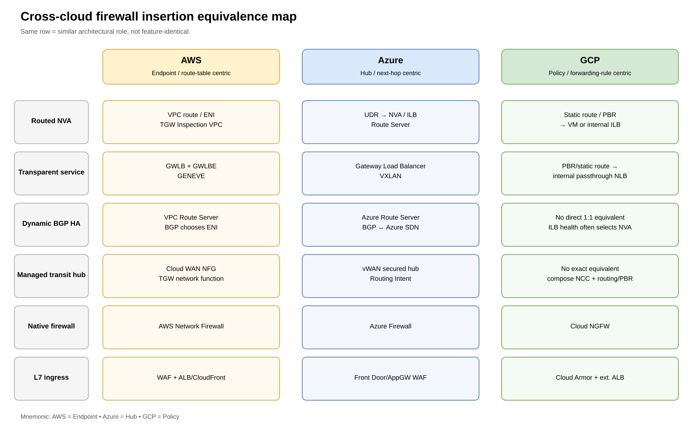
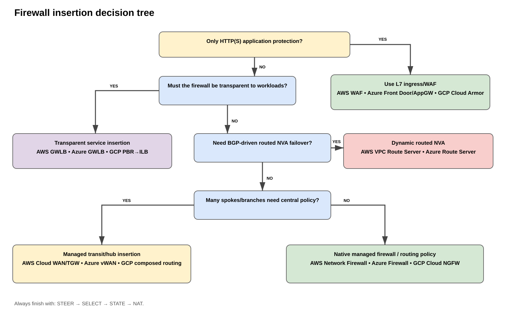

# AWS vs Azure vs GCP — Firewall Insertion Methods Compared

> **Purpose:** Build one mental model for firewall/service insertion across AWS, Azure, and Google Cloud, then map each cloud's products to that model.
>
> **Validated:** 2026-09-06 against current AWS, Microsoft, and Google Cloud documentation.

## Sources

### AWS
- https://docs.aws.amazon.com/vpc/latest/userguide/dynamic-routing-route-server.html
- https://docs.aws.amazon.com/vpc/latest/tgw/how-transit-gateways-work.html
- https://docs.aws.amazon.com/network-manager/latest/cloudwan/cloudwan-policy-service-insertion.html
- https://docs.aws.amazon.com/elasticloadbalancing/latest/gateway/introduction.html

### Azure
- https://learn.microsoft.com/azure/load-balancer/gateway-overview
- https://learn.microsoft.com/azure/architecture/example-scenario/firewalls/
- https://learn.microsoft.com/azure/firewall-manager/secured-virtual-hub

### Google Cloud
- https://docs.cloud.google.com/vpc/docs/policy-based-routes
- https://docs.cloud.google.com/load-balancing/docs/internal/setting-up-internal-next-hop-tags
- https://docs.cloud.google.com/firewall/docs/about-firewalls
- https://docs.cloud.google.com/firewall/docs/about-intrusion-prevention

---

# 1. The universal mental model

Every firewall-insertion design answers four questions:

1. **Who STEERS the traffic?** — route table, policy-based route, hub policy, firewall policy, or service chain.
2. **Who SELECTS the appliance?** — BGP/Route Server, load balancer, managed firewall service, or vendor HA.
3. **Who preserves STATE/symmetry?** — same next hop, appliance mode, flow stickiness, or firewall session synchronization.
4. **Who owns NAT/publication?** — firewall, NAT service, ALB/NLB/App Gateway, IGW/public-IP mapping, or another ingress service.

> **Memory phrase: STEER → SELECT → STATE → NAT**

If you can answer those four questions, you can understand almost any AWS, Azure, or GCP firewall design.

# 2. The six insertion families

| Family | AWS | Azure | GCP |
|---|---|---|---|
| **Routed NVA** | VPC route/ENI, TGW inspection VPC | UDR → NVA/ILB | Static route/PBR → VM or internal passthrough NLB |
| **Transparent service insertion** | GWLB + GWLBE | Gateway Load Balancer | PBR/static route → internal passthrough NLB |
| **Dynamic BGP NVA HA** | VPC Route Server | Azure Route Server | No direct 1:1 equivalent; ILB health + PBR/static routing is common |
| **Managed transit-hub insertion** | Cloud WAN NFG / TGW network-function attachment | vWAN secured hub + Routing Intent | No exact equivalent; compose NCC/routing/PBR/NVA |
| **Native managed firewall** | AWS Network Firewall | Azure Firewall | Cloud NGFW |
| **Layer-7 ingress/WAF** | WAF + ALB/CloudFront | Front Door/App Gateway WAF | Cloud Armor + external Application Load Balancer |

# 3. Routed NVA — “the route points at the firewall”

## AWS
- Workload or TGW-attachment subnet route points to a firewall ENI.
- TGW often chooses the Inspection VPC; the VPC route table chooses the firewall ENI.
- VPC Route Server can dynamically change the winning ENI.

**Memory:** `AWS routed NVA = ENI next hop`.

## Azure
- UDRs use `VirtualAppliance` next hops toward firewall private IPs or an ILB fronting HA NVAs.
- Azure Route Server can exchange BGP with NVAs and influence effective routes.

**Memory:** `Azure routed NVA = UDR / effective route → appliance`.

## GCP
- Static routes can use a next-hop VM or internal passthrough NLB.
- Policy-Based Routes can classify traffic and send it to an internal passthrough NLB.

**Memory:** `GCP routed NVA = PBR/route → VM or ILB`.

# 4. Transparent service insertion

## AWS — GWLB/GWLBE

```text
route → GWLBE → GWLB → firewall fleet
```

- Purpose-built appliance insertion.
- GWLBE is the route target in the consumer VPC.
- GWLB distributes flows across firewall appliances.
- GENEVE encapsulation is used to/from appliances.

## Azure — Gateway Load Balancer

```text
Public LB / VM public IP → chained Gateway LB → NVA pool
```

- Transparent bump-in-the-wire NVA insertion.
- Chained to a Standard Public Load Balancer frontend or VM public IP configuration.
- VXLAN used toward appliances.
- Flow stickiness preserves symmetry.

## GCP — internal passthrough NLB as next hop

```text
PBR/static route → internal passthrough NLB → firewall fleet
```

- GCP does not call this “Gateway Load Balancer.”
- The internal passthrough NLB can be a routing next hop.
- Health checks determine eligible NVA backends.

### Closest equivalence

> **AWS GWLB ≈ Azure Gateway Load Balancer ≈ GCP internal passthrough NLB-as-next-hop**

They solve a similar problem, but the chaining/routing mechanics are different.

# 5. Dynamic BGP/NVA HA

## AWS — VPC Route Server

```text
FW1 advertises prefix (preferred)
FW2 advertises same prefix (backup)
        ↓
VPC Route Server chooses best path
        ↓
selected VPC/IGW route table → winning FW ENI
```

AWS Route Server is best remembered as:

> **“BGP chooses the ENI.”**

## Azure — Route Server

Azure Route Server peers with NVAs and exchanges BGP routes between the appliances and Azure SDN. NVAs can learn Azure prefixes and advertise routes that affect effective routing.

Best remembered as:

> **“BGP teaches Azure and the NVA.”**

It is conceptually similar to AWS VPC Route Server but not identical in route-programming semantics.

## GCP

There is no direct one-for-one equivalent whose primary purpose is to make two in-VPC NVAs advertise the same service-insertion prefix and dynamically rewrite selected route tables to the winning appliance ENI.

A common GCP HA pattern instead is:

```text
PBR/static route → internal passthrough NLB → healthy NVA
```

Best remembered as:

> **“Policy chooses the ILB; health chooses the appliance.”**

# 6. Managed transit-hub insertion

## AWS

### Cloud WAN
- Network Function Groups (NFGs) identify security attachments.
- Service insertion can redirect same-segment or cross-segment traffic.
- Network functions can be third-party appliances, GWLB services, or AWS Network Firewall.

### Transit Gateway
- Classic Inspection VPC design.
- Newer network-function attachments can connect AWS Network Firewall directly to TGW-managed infrastructure.

**Memory:** `Cloud WAN/TGW chooses the security attachment`.

## Azure

### Virtual WAN secured hub
- Azure Firewall or supported security/NVA integration resides in the hub.
- Routing Intent can steer **Private Traffic** and/or **Internet Traffic** through the security provider.

**Memory:** `Routing Intent = security policy becomes routing`.

## GCP

There is no exact equivalent to Cloud WAN NFG or Azure vWAN Routing Intent. Similar outcomes are composed from connectivity hubs, VPC routing, PBR/static routes, internal passthrough NLBs, and Cloud NGFW.

**Memory:** `GCP composes the service chain instead of exposing one exact managed-hub insertion feature`.

# 7. Native managed firewall

## AWS Network Firewall
Think:

> **route traffic through managed firewall endpoints**

It is commonly inserted with VPC routes, centralized inspection VPCs, TGW, or Cloud WAN.

## Azure Firewall
Think:

> **managed routed firewall service**

It commonly appears in a customer hub VNet or Virtual WAN secured hub and can provide DNAT/SNAT plus L3-L7 policy depending SKU/features.

## GCP Cloud NGFW
Think:

> **distributed firewall policy with optional managed inspection endpoints**

Cloud NGFW is more policy-centric. Enterprise inspection can intercept traffic matched by firewall policy and send it to firewall endpoints for advanced inspection.

# 8. Layer-7 ingress/WAF

| Cloud | L7 security |
|---|---|
| AWS | AWS WAF with ALB/CloudFront/API Gateway patterns |
| Azure | Front Door WAF / Application Gateway WAF |
| GCP | Cloud Armor + external Application Load Balancer |

> **WAF protects the application conversation; NGFW protects the routed packet path.**

Do not treat WAF as a substitute for east-west, VPN, Direct Connect/ExpressRoute/Interconnect, or generic TCP/UDP inspection.

# 9. Cross-cloud equivalence map



[Editable draw.io](images/09-06-26-19-17_cross_cloud_firewall_insertion_equivalence.drawio)

**What this image shows:** Comparable architectural roles aligned across AWS, Azure, and GCP.

**What matters:** Same row means “solves a similar problem,” not “identical implementation.”

# 10. Decision tree



[Editable draw.io](images/09-06-26-19-17_cross_cloud_firewall_insertion_decision_tree.drawio)

# 11. Cloud personality — E-H-P mnemonic

A fast way to remember the design philosophy:

```text
AWS   = E = Endpoint
Azure = H = Hub
GCP   = P = Policy
```

## AWS = Endpoint
AWS frequently asks:
- Which route table?
- Which attachment?
- Which ENI/GWLBE/network-function endpoint?

## Azure = Hub
Azure frequently asks:
- Which hub?
- Which UDR/effective next hop?
- Which Route Server/vWAN Routing Intent/security provider?

## GCP = Policy
GCP frequently asks:
- Which PBR/firewall policy matches?
- Which forwarding rule/ILB next hop handles the packet?

# 12. North-south, south-north, east-west

| Flow | AWS | Azure | GCP |
|---|---|---|---|
| **East-west** | TGW/Cloud WAN + inspection VPC/GWLB/NFW/Route Server | Hub UDRs, vWAN secured hub, Azure Firewall/NVA, Route Server | PBR/static routes + internal passthrough NLB/NVA, Cloud NGFW |
| **South-north egress** | `0/0` to firewall/GWLBE/NFW; NAT ownership separate | `0/0` UDR or Routing Intent to firewall/NVA | PBR/static route to ILB/NVA or native policy |
| **North-south ingress** | IGW gateway RT, ALB/NLB, GWLB, firewall DNAT | Public LB/App Gateway/GWLB/firewall DNAT | External LB + Cloud Armor/NVA, direct public NVA patterns |
| **Hybrid** | TGW/DX/VPN → inspection | ER/VPN/vWAN → secured hub/NVA | Interconnect/VPN → routing/PBR/NVA |

# 13. Session state and failover

Universal rule:

> **Routing HA does not equal session HA.**

AWS Route Server can move a route from FW1 to FW2. Azure Route Server can change effective routing. GCP ILB health checks can stop choosing a failed NVA. None of those facts alone guarantee that an established NAT/TCP/TLS inspection session survives.

> **Memory: Path moves fast; state may not.**

# 14. NAT ownership

Always identify the NAT owner separately from the inspection mechanism.

- AWS: firewall, NAT Gateway, or ingress service depending design.
- Azure: Azure Firewall can SNAT/DNAT; third-party NVA or NAT Gateway may own translation in other designs.
- GCP: NVA or Cloud NAT depending architecture.

> **Service insertion and NAT are separate design decisions.**

# 15. When to choose each family

## Routed NVA
Choose when the firewall is a true router, BGP matters, vendor-specific NGFW features matter, and you want explicit routing control.

## Transparent load-balanced insertion
Choose when workloads should not know about appliances, you want horizontal scale, and health-based appliance selection is desirable.

## Managed hub insertion
Choose when many spokes/branches need common security policy and centralized transit.

## Native managed firewall
Choose when cloud-native lifecycle and policy integration matter more than third-party appliance parity.

## WAF/L7 ingress
Choose when the requirement is HTTP(S) application protection rather than generic routed inspection.

# 16. Interview/exam shortcut

```text
GWLB?                → transparent service insertion
Route Server?        → dynamic routed NVA control plane
TGW/vWAN/Cloud WAN?  → transit-hub steering
Network Firewall / Azure Firewall / Cloud NGFW? → native managed firewall
ALB/AppGW/Cloud LB + WAF? → Layer-7 ingress security
PBR/UDR/routes?      → steering mechanism
```

# 17. Common mistakes

1. **GWLB and Route Server are not the same thing.** GWLB/load balancing selects a healthy appliance per flow; Route Server/BGP selects a routed next hop.
2. **Azure Route Server is not identical to AWS VPC Route Server.** Both use BGP with NVAs, but their route-programming behavior differs.
3. **GCP internal passthrough NLB can be part of routing.** It is not “just a load balancer.”
4. **WAF is not NGFW.** WAF is HTTP(S) Layer 7; NGFW insertion is routed/transit security.
5. **Failover does not guarantee state survival.** Always verify session/NAT synchronization.
6. **NAT ownership must be explicit.** Do not assume the insertion feature also performs NAT.
7. **Centralized ingress needs a public service endpoint strategy.** Route symmetry alone does not publish an application.

# 18. One-page memory card

```text
                         FIREWALL INSERTION
                               |
          +--------------------+--------------------+
          |                    |                    |
       ROUTED              TRANSPARENT          MANAGED HUB
          |                    |                    |
 AWS   ENI/Route Server     GWLB/GWLBE         TGW / Cloud WAN
 Azure UDR/Route Server     Gateway LB         vWAN Secured Hub
 GCP   Route/PBR            PBR → ILB          Compose NCC + PBR

                            NATIVE FIREWALL
          AWS Network Firewall | Azure Firewall | GCP Cloud NGFW

                            L7 INGRESS
          AWS WAF/ALB | Azure Front Door/AppGW | GCP Cloud Armor/LB
```

Final memory anchors:

> **STEER → SELECT → STATE → NAT**  
> **AWS = Endpoint • Azure = Hub • GCP = Policy**
