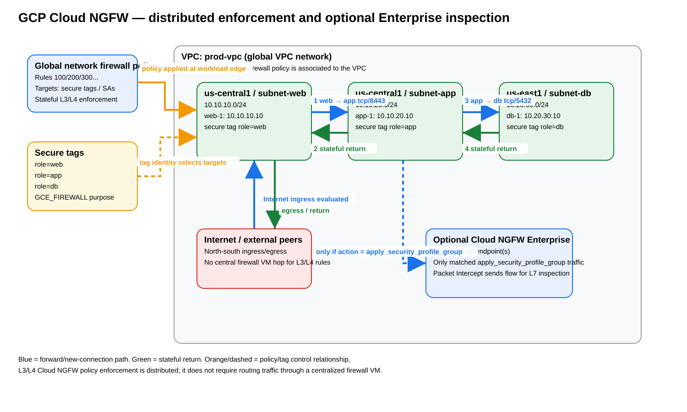
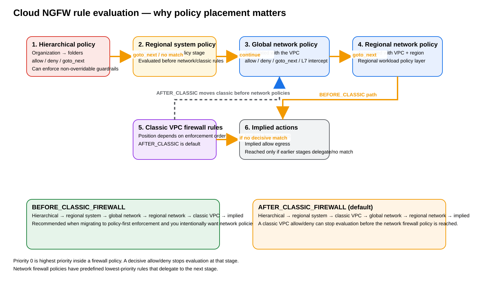
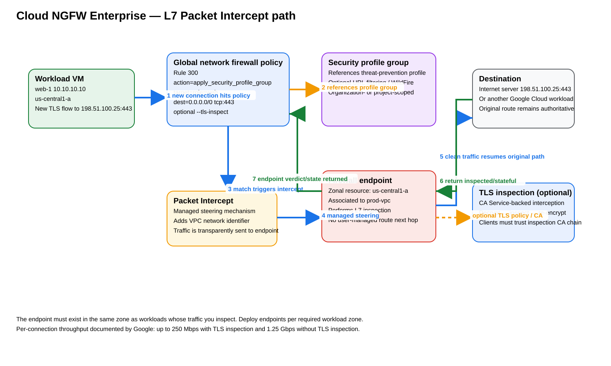

# GCP Cloud NGFW Distributed Policy — Architecture, gcloud Deployment, Packet Flow, Enterprise L7 Inspection, Verification, and Troubleshooting

## Purpose

This guide explains how Google Cloud Next Generation Firewall (Cloud NGFW) implements **distributed firewall policy enforcement** directly around Google Cloud workloads, how **global and regional network firewall policies** differ from classic VPC firewall rules and hierarchical policies, and how Cloud NGFW Enterprise adds **Layer 7 (L7) inspection** through zonal firewall endpoints without requiring you to build a centralized routing hop through a firewall virtual machine.

The guide includes a reproducible `gcloud` lab, secure-tag microsegmentation, rule-evaluation order, north-south and east-west packet walks, optional Cloud NGFW Enterprise intrusion detection and prevention, firewall endpoint insertion, TLS inspection considerations, verification commands, expected successful state, failure indicators, high availability behavior, and symptom-oriented troubleshooting.

> **Important terminology:** In this guide, **distributed policy** means policy enforcement is applied to supported workload interfaces and load-balancer targets throughout the VPC rather than forcing every L3/L4 flow through a customer-managed centralized firewall VM/NVA. Cloud NGFW Enterprise can still transparently intercept selected flows for L7 inspection by using managed Packet Intercept and a zonal firewall endpoint.

---

## Source URLs

Primary Google Cloud documentation used for this guide:

- https://docs.cloud.google.com/firewall/docs/about-firewalls
- https://docs.cloud.google.com/firewall/docs/network-firewall-policies
- https://docs.cloud.google.com/firewall/docs/use-network-firewall-policies
- https://docs.cloud.google.com/firewall/docs/use-regional-firewall-policies
- https://docs.cloud.google.com/firewall/docs/firewall-policies
- https://docs.cloud.google.com/firewall/docs/firewall-policies-rule-eval-order
- https://docs.cloud.google.com/firewall/docs/use-tags-for-firewalls
- https://docs.cloud.google.com/firewall/docs/about-firewall-endpoints
- https://docs.cloud.google.com/firewall/docs/configure-firewall-endpoints
- https://docs.cloud.google.com/firewall/docs/configure-security-profiles
- https://docs.cloud.google.com/firewall/docs/configure-security-profile-groups
- https://docs.cloud.google.com/firewall/docs/about-intrusion-prevention
- https://docs.cloud.google.com/firewall/docs/configure-intrusion-prevention
- https://docs.cloud.google.com/firewall/docs/tutorials/set-up-ips-tutorial
- https://docs.cloud.google.com/firewall/docs/about-tls-inspection
- https://docs.cloud.google.com/firewall/docs/setup-tls-inspection
- https://docs.cloud.google.com/resource-manager/docs/tags/tags-creating-and-managing
- https://cloud.google.com/blog/products/identity-security/announcing-next-gen-firewall-enterprise-now-in-ga-next24

---

## 1. Executive architecture summary

Cloud NGFW is a **stateful, distributed firewall service**. Google documents support for L3/L4 traffic control and, with the appropriate Cloud NGFW tier and configuration, L7 functions including intrusion detection and prevention, URL filtering, and advanced malware analysis.

The key architectural idea is that you normally **do not insert a virtual firewall appliance into the VPC route table for ordinary Cloud NGFW L3/L4 policy**. Instead:

1. You create a firewall policy object.
2. You add ordered ingress and egress rules.
3. You associate a network firewall policy with a VPC, or associate a hierarchical policy with an organization/folder.
4. Google applies those rules to matching targets throughout the policy scope.
5. A new flow is evaluated at the applicable target resource according to the documented firewall-policy evaluation sequence.
6. If an `allow` rule wins, Cloud NGFW creates state for the permitted connection; return traffic for that established connection is permitted statefully.
7. If a `deny` rule wins, the connection is blocked.
8. If `goto_next` wins or there is no decisive match, evaluation continues to the next policy layer.
9. If a rule uses `apply_security_profile_group`, Cloud NGFW uses managed Packet Intercept to send the matched flow to a Cloud NGFW firewall endpoint for advanced L7 inspection.

### Source information

Google describes Cloud NGFW as a distributed firewall service, supports global/regional network firewall policies and hierarchical firewall policies, and documents `allow`, `deny`, `goto_next`, and `apply_security_profile_group` actions for applicable policy types.

### Additional explanation

A centralized NVA design makes routing and the appliance data path inseparable: if traffic does not traverse the firewall next hop, it is not inspected. Cloud NGFW distributed enforcement separates the **policy decision** from customer-managed route insertion. Your VPC route lookup still determines where an allowed packet should go; Cloud NGFW decides whether the packet is allowed to use that path.

### Reasonable inference

Because the L3/L4 firewall decision is distributed and does not require a customer-managed firewall next hop, you avoid a large class of appliance-routing problems such as firewall-VM next-hop reachability, ECMP hashing across appliance interfaces, NVA SNAT dependency, and user-managed return-path symmetry. Enterprise L7 inspection introduces its own endpoint locality, capacity, MTU, and TLS considerations, discussed later.

---

## 2. Distributed enforcement architecture



[Editable draw.io source](images/09-06-26-19-21_gcp_cloud_ngfw_distributed_architecture.drawio)

**What this image shows**

The diagram separates the global policy/control objects from the VPC workload data path. A global network firewall policy is associated with the VPC, secure tags identify workload roles, and the policy applies wherever matching resources exist. Ordinary L3/L4 permitted flows continue directly along their normal VPC path. An optional Cloud NGFW Enterprise endpoint is shown separately because only traffic matching an `apply_security_profile_group` rule is transparently sent there for L7 inspection.

**What matters**

- The policy is not a VM next hop.
- Secure tags can represent workload identity such as `role=web`, `role=app`, and `role=db`.
- A single global network firewall policy can enforce a consistent rule set across the VPC.
- Statefulness means the reverse packets of an allowed established flow do not require a mirrored reverse-direction allow rule for the same connection.
- Enterprise L7 inspection is selective and rule-driven.

**What to verify**

- The network firewall policy is actually associated with the intended VPC.
- The effective policy order is what you intended.
- Secure tags are bound to the expected VM resources.
- For Enterprise inspection, a firewall endpoint and endpoint association exist in each required workload zone.

---

## 3. Cloud NGFW policy types

### 3.1 Hierarchical firewall policy

A hierarchical policy is attached to the **organization or folder hierarchy**, not directly to one VPC. It is the right tool for security guardrails that must be applied above individual project teams.

Important behavior:

- Organization-level policy is evaluated before folder-level policy.
- Lower layers cannot override a decisive higher-level allow/deny decision.
- `goto_next` explicitly delegates evaluation downward.
- A policy is not enforced merely because it exists; it must be associated with the organization or folder.
- Google notes eventual consistency for hierarchical policy changes and hierarchy moves.

Typical use:

- Deny administrative protocols from the public internet organization-wide.
- Require inspection for a class of traffic across many projects.
- Delegate application-specific policy to folders/projects by using `goto_next`.

### 3.2 Global network firewall policy

A global network firewall policy is a VPC-level policy object with global scope. It is well suited to consistent policy across subnets and regions of one VPC network.

Typical use:

- `role=web` may receive HTTPS from approved sources.
- `role=web` may initiate TCP/8443 to `role=app`.
- `role=app` may initiate TCP/5432 to `role=db`.
- Internet egress for selected workloads can be allowed, denied, filtered by supported objects, or sent for Enterprise inspection.

### 3.3 Regional network firewall policy

A regional network firewall policy applies to the associated VPC and region. It is useful when policy must intentionally differ by region or when a regional target type requires a regional policy.

### 3.4 Classic VPC firewall rules

Classic VPC firewall rules remain supported. Their position relative to global/regional network firewall policies depends on the network's `networkFirewallPolicyEnforcementOrder`.

For a policy-first architecture, it is common to deliberately move network firewall policies before classic rules and then migrate or minimize classic rules. Do this only after validating effective firewall behavior.

---

## 4. Rule evaluation order



[Editable draw.io source](images/09-06-26-19-21_gcp_cloud_ngfw_rule_evaluation.drawio)

**What this image shows**

The diagram shows the documented major evaluation stages and highlights the difference between `BEFORE_CLASSIC_FIREWALL` and the default `AFTER_CLASSIC_FIREWALL` order.

**What matters**

With `AFTER_CLASSIC_FIREWALL`, a classic VPC rule can make the allow/deny decision before the global network policy is reached. This surprises administrators who created a network firewall policy and assumed it automatically superseded classic rules.

**What to verify**

Run:

```cli
gcloud compute networks describe prod-vpc \
  --format='value(networkFirewallPolicyEnforcementOrder)'
```

and:

```cli
gcloud compute networks get-effective-firewalls prod-vpc
```

The second command lets you inspect the effective firewall layers and confirm their sequence.

### 4.1 Documented ordering

`AFTER_CLASSIC_FIREWALL` is the default:

1. Hierarchical firewall policies
2. Regional system firewall policies
3. Classic VPC firewall rules
4. Global network firewall policy
5. Regional network firewall policies
6. Implied actions

`BEFORE_CLASSIC_FIREWALL` changes the middle of the sequence:

1. Hierarchical firewall policies
2. Regional system firewall policies
3. Global network firewall policy
4. Regional network firewall policies
5. Classic VPC firewall rules
6. Implied actions

### 4.2 Priority inside a policy

Priority `0` is the highest priority. Lower numeric values win earlier.

Use spaced priorities such as `100`, `200`, `300`, `1000`, and `65000` so that you can insert new policy between existing rules later.

### 4.3 Decisive actions

- `allow`: permits the connection and stops evaluation.
- `deny`: blocks the connection and stops evaluation.
- `goto_next`: explicitly continues evaluation to the next policy stage.
- `apply_security_profile_group`: sends the selected flow to the configured advanced inspection path; the security profile controls the resulting verdict.

Global network firewall policies also contain predefined low-priority rules that delegate unmatched traffic to the next stage.

---

## 5. Secure tags versus network tags

Cloud NGFW secure tags are Resource Manager tags created specifically for firewall use. For firewall use, the tag key must have purpose `GCE_FIREWALL`.

They are useful because security policy can target **workload identity** instead of hard-coded addresses.

Example role model:

| Secure tag | Meaning | Intended policy |
|---|---|---|
| `role=web` | public/application frontend | HTTPS ingress; egress only to approved app tier and controlled internet |
| `role=app` | application tier | accept from web; initiate only required DB/API flows |
| `role=db` | database tier | accept only from app tier on DB port |

Secure tags are not the same as classic Compute Engine network tags. Do not substitute one for the other when using `--src-secure-tags` or `--target-secure-tags`.

---

# 6. Reproducible gcloud deployment

The following lab builds one VPC with three application tiers and a global network firewall policy. The Cloud NGFW Enterprise portion is optional and begins later.

## 6.1 Lab addressing

| Resource | Region/zone | CIDR / address | Role |
|---|---|---:|---|
| `prod-vpc` | global VPC | n/a | protected network |
| `subnet-web` | `us-central1` | `10.10.10.0/24` | web tier |
| `subnet-app` | `us-central1` | `10.10.20.0/24` | application tier |
| `subnet-db` | `us-east1` | `10.20.30.0/24` | database tier |
| `web-1` | `us-central1-a` | `10.10.10.10` | `role=web` |
| `app-1` | `us-central1-a` | `10.10.20.10` | `role=app` |
| `db-1` | `us-east1-b` | `10.20.30.10` | `role=db` |

## 6.2 Define variables

```cli
export PROJECT_ID='YOUR_PROJECT_ID'
export ORG_ID='YOUR_ORGANIZATION_ID'
export REGION1='us-central1'
export ZONE1='us-central1-a'
export REGION2='us-east1'
export ZONE2='us-east1-b'
export VPC='prod-vpc'
export POLICY='prod-distributed-fw'

gcloud config set project "$PROJECT_ID"
```

## 6.3 Enable required APIs

For base firewall policy and Compute Engine:

```cli
gcloud services enable \
  compute.googleapis.com \
  cloudresourcemanager.googleapis.com
```

For Cloud NGFW Enterprise endpoint/security-profile functions:

```cli
gcloud services enable \
  networksecurity.googleapis.com \
  privateca.googleapis.com
```

**Success criteria:** each service appears in the enabled-services list.

```cli
gcloud services list --enabled \
  --filter='NAME:(compute.googleapis.com OR cloudresourcemanager.googleapis.com OR networksecurity.googleapis.com OR privateca.googleapis.com)'
```

**Failure indicators:** API disabled errors, permission denied, service usage permission failure.

**Next action:** verify Service Usage permissions and organization policy restrictions before continuing.

---

## 6.4 Create the custom-mode VPC and subnets

```cli
gcloud compute networks create "$VPC" \
  --subnet-mode=custom

gcloud compute networks subnets create subnet-web \
  --network="$VPC" \
  --region="$REGION1" \
  --range=10.10.10.0/24

gcloud compute networks subnets create subnet-app \
  --network="$VPC" \
  --region="$REGION1" \
  --range=10.10.20.0/24

gcloud compute networks subnets create subnet-db \
  --network="$VPC" \
  --region="$REGION2" \
  --range=10.20.30.0/24
```

Verify:

```cli
gcloud compute networks subnets list \
  --filter="network:$VPC" \
  --format='table(name,region.basename(),ipCidrRange)'
```

**Expected successful state:** all three subnet names are present with the exact regions and CIDRs shown above.

---

## 6.5 Create workload VMs

The lab deliberately uses internal addresses and no external VM NIC addresses. Add Cloud NAT later if you need direct internet egress from these instances.

```cli
gcloud compute instances create web-1 \
  --zone="$ZONE1" \
  --subnet=subnet-web \
  --private-network-ip=10.10.10.10 \
  --no-address

gcloud compute instances create app-1 \
  --zone="$ZONE1" \
  --subnet=subnet-app \
  --private-network-ip=10.10.20.10 \
  --no-address

gcloud compute instances create db-1 \
  --zone="$ZONE2" \
  --subnet=subnet-db \
  --private-network-ip=10.20.30.10 \
  --no-address
```

Verify NIC addressing:

```cli
gcloud compute instances list \
  --filter='name=(web-1 app-1 db-1)' \
  --format='table(name,zone.basename(),networkInterfaces[0].networkIP)'
```

---

## 6.6 Create secure-tag keys and values

Create an organization-level secure tag key for firewall use:

```cli
gcloud resource-manager tags keys create role \
  --parent="organizations/$ORG_ID" \
  --purpose=GCE_FIREWALL \
  --purpose-data=organization=auto
```

Create role values:

```cli
gcloud resource-manager tags values create web \
  --parent="$ORG_ID/role"

gcloud resource-manager tags values create app \
  --parent="$ORG_ID/role"

gcloud resource-manager tags values create db \
  --parent="$ORG_ID/role"
```

List them:

```cli
gcloud resource-manager tags values list \
  --parent="$ORG_ID/role" \
  --format='table(name,shortName,namespacedName)'
```

**Expected successful state:** values for `web`, `app`, and `db` exist under the secure tag key.

### Why the permanent tag IDs matter

Resource bindings use permanent resource identifiers such as `tagValues/1234567890123`, even if policy rule syntax can use the namespaced secure-tag form.

Get the value IDs:

```cli
WEB_TAG_VALUE=$(gcloud resource-manager tags values describe "$ORG_ID/role/web" --format='value(name)')
APP_TAG_VALUE=$(gcloud resource-manager tags values describe "$ORG_ID/role/app" --format='value(name)')
DB_TAG_VALUE=$(gcloud resource-manager tags values describe "$ORG_ID/role/db" --format='value(name)')

printf '%s\n%s\n%s\n' "$WEB_TAG_VALUE" "$APP_TAG_VALUE" "$DB_TAG_VALUE"
```

---

## 6.7 Bind secure tags to the VMs

Get the project number and VM numeric instance IDs:

```cli
PROJECT_NUMBER=$(gcloud projects describe "$PROJECT_ID" --format='value(projectNumber)')
WEB_INSTANCE_ID=$(gcloud compute instances describe web-1 --zone="$ZONE1" --format='value(id)')
APP_INSTANCE_ID=$(gcloud compute instances describe app-1 --zone="$ZONE1" --format='value(id)')
DB_INSTANCE_ID=$(gcloud compute instances describe db-1 --zone="$ZONE2" --format='value(id)')
```

Bind tags:

```cli
gcloud resource-manager tags bindings create \
  --location="$ZONE1" \
  --tag-value="$WEB_TAG_VALUE" \
  --parent="//compute.googleapis.com/projects/$PROJECT_NUMBER/zones/$ZONE1/instances/$WEB_INSTANCE_ID"

gcloud resource-manager tags bindings create \
  --location="$ZONE1" \
  --tag-value="$APP_TAG_VALUE" \
  --parent="//compute.googleapis.com/projects/$PROJECT_NUMBER/zones/$ZONE1/instances/$APP_INSTANCE_ID"

gcloud resource-manager tags bindings create \
  --location="$ZONE2" \
  --tag-value="$DB_TAG_VALUE" \
  --parent="//compute.googleapis.com/projects/$PROJECT_NUMBER/zones/$ZONE2/instances/$DB_INSTANCE_ID"
```

Verify a binding, for example `web-1`:

```cli
gcloud resource-manager tags bindings list \
  --location="$ZONE1" \
  --parent="//compute.googleapis.com/projects/$PROJECT_NUMBER/zones/$ZONE1/instances/$WEB_INSTANCE_ID"
```

**Success criteria:** the output contains the permanent tag value representing `$ORG_ID/role/web`.

---

## 6.8 Create the global network firewall policy

```cli
gcloud compute network-firewall-policies create "$POLICY" \
  --description='Distributed production workload policy' \
  --global
```

Verify:

```cli
gcloud compute network-firewall-policies describe "$POLICY" \
  --global \
  --format='yaml(name,shortName,description,ruleTupleCount)'
```

The exact generated numeric identifiers vary by deployment. Do not compare them to sample IDs from another environment.

---

## 6.9 Associate the policy with the VPC

```cli
gcloud compute network-firewall-policies associations create \
  --firewall-policy="$POLICY" \
  --network="$VPC" \
  --name=prod-vpc-association \
  --global-firewall-policy
```

Verify:

```cli
gcloud compute network-firewall-policies associations list \
  --firewall-policy="$POLICY" \
  --global-firewall-policy
```

**Success criteria:** an association points to `prod-vpc`.

**Common failure:** the policy exists but is unassociated. In that state, its rules do not protect the VPC.

---

## 6.10 Put network firewall policy before classic VPC rules

Google documents `AFTER_CLASSIC_FIREWALL` as the default. In this lab we intentionally make the global network policy authoritative before classic VPC rules:

```cli
gcloud compute networks update "$VPC" \
  --network-firewall-policy-enforcement-order=BEFORE_CLASSIC_FIREWALL
```

Verify:

```cli
gcloud compute networks describe "$VPC" \
  --format='value(networkFirewallPolicyEnforcementOrder)'
```

Expected value:

```text
BEFORE_CLASSIC_FIREWALL
```

This is one of the few expected outputs in this guide that is deterministic because the command explicitly sets that enum value.

---

## 6.11 Create microsegmentation rules

### Rule 100 — permit web tier to app tier on TCP/8443

This is an **ingress** rule applied to the app target. The source is the web secure tag.

```cli
gcloud compute network-firewall-policies rules create 100 \
  --firewall-policy="$POLICY" \
  --global-firewall-policy \
  --direction=INGRESS \
  --action=ALLOW \
  --src-secure-tags="$ORG_ID/role/web" \
  --target-secure-tags="$ORG_ID/role/app" \
  --layer4-configs=tcp:8443 \
  --enable-logging \
  --description='Allow web role to app role on tcp/8443'
```

### Rule 200 — permit app tier to database on TCP/5432

```cli
gcloud compute network-firewall-policies rules create 200 \
  --firewall-policy="$POLICY" \
  --global-firewall-policy \
  --direction=INGRESS \
  --action=ALLOW \
  --src-secure-tags="$ORG_ID/role/app" \
  --target-secure-tags="$ORG_ID/role/db" \
  --layer4-configs=tcp:5432 \
  --enable-logging \
  --description='Allow app role to db role on tcp/5432'
```

### Rule 1000 — deny other RFC1918 ingress to the database role

```cli
gcloud compute network-firewall-policies rules create 1000 \
  --firewall-policy="$POLICY" \
  --global-firewall-policy \
  --direction=INGRESS \
  --action=DENY \
  --src-ip-ranges=10.0.0.0/8,172.16.0.0/12,192.168.0.0/16 \
  --target-secure-tags="$ORG_ID/role/db" \
  --layer4-configs=all \
  --enable-logging \
  --description='Deny other private-source ingress to DB role'
```

This deny has a lower precedence than priority 200, so permitted app-to-db TCP/5432 can match the earlier allow before the broad private-source deny.

### Optional rule — SSH only from IAP TCP forwarding

If you use Identity-Aware Proxy (IAP) TCP forwarding, Google documents source range `35.235.240.0/20` for this purpose. For example:

```cli
gcloud compute network-firewall-policies rules create 1100 \
  --firewall-policy="$POLICY" \
  --global-firewall-policy \
  --direction=INGRESS \
  --action=ALLOW \
  --src-ip-ranges=35.235.240.0/20 \
  --layer4-configs=tcp:22 \
  --enable-logging \
  --description='Allow SSH from IAP TCP forwarding range'
```

Use a narrower target selection in production if SSH should not reach every VM in the VPC.

---

## 6.12 Inspect the policy

```cli
gcloud compute network-firewall-policies rules list \
  --firewall-policy="$POLICY" \
  --global-firewall-policy \
  --format='table(priority,direction,action,disabled,enableLogging,description)'
```

**Expected successful state:** priorities `100`, `200`, `1000`, and any optional rules appear in ascending priority order with the intended direction/action.

Describe a single rule:

```cli
gcloud compute network-firewall-policies rules describe 200 \
  --firewall-policy="$POLICY" \
  --global-firewall-policy \
  --format=yaml
```

Important fields to examine:

- `priority`
- `direction`
- `action`
- `match`
- target secure tags
- logging state
- security profile group reference, if Enterprise inspection is enabled

---

# 7. Packet flow — east-west microsegmentation

## 7.1 Allowed `web-1` → `app-1` TCP/8443

Initial packet:

```text
Source:      10.10.10.10:ephemeral
Destination: 10.10.20.10:8443
Protocol:    TCP
Source role: web
Target role: app
```

Step-by-step:

1. `web-1` creates a TCP SYN for `10.10.20.10:8443`.
2. The VPC determines the destination is reachable by the VPC subnet route for `subnet-app`.
3. For the new connection delivered toward `app-1`, Cloud NGFW evaluates the applicable ingress firewall policy for `app-1`.
4. Rule 100 targets `role=app`.
5. Its source selector matches `role=web`.
6. Its L4 match permits TCP/8443.
7. Action `ALLOW` wins and rule evaluation stops.
8. Cloud NGFW creates state for the allowed connection.
9. `app-1` receives the SYN.
10. The SYN/ACK belongs to the established allowed connection and is permitted statefully.
11. No firewall VM/NVA next hop is traversed for this ordinary L3/L4 distributed policy decision.

### What does not happen

- There is no user-managed DNAT.
- There is no firewall SNAT.
- There is no GENEVE encapsulation merely because a normal `ALLOW` network firewall policy rule matched.
- There is no requirement to put a custom `10.10.20.0/24` route through a centralized security VPC.

---

## 7.2 Denied `web-1` → `db-1` arbitrary port

Example new packet:

```text
Source:      10.10.10.10:ephemeral
Destination: 10.20.30.10:22
Protocol:    TCP
```

The intended DB allow at priority 200 requires source `role=app` and destination target `role=db` on TCP/5432. `web-1` does not satisfy that rule. The broader private-source deny at priority 1000 can therefore block the attempted new connection.

This demonstrates why secure-tag identity is useful: the same RFC1918 source CIDR can contain multiple application roles, but only the designated source role receives the exception.

---

# 8. Packet flow — north-south internet traffic

For internet egress, Cloud NGFW decides whether a workload may establish the connection; **Cloud NAT or an external IP is still responsible for providing internet source NAT/connectivity where required**.

Cloud NGFW is not a replacement for Cloud NAT.

## 8.1 Example with Cloud NAT

Create a Cloud Router and NAT gateway for the `us-central1` subnets:

```cli
gcloud compute routers create prod-nat-router \
  --network="$VPC" \
  --region="$REGION1"

gcloud compute routers nats create prod-nat \
  --router=prod-nat-router \
  --region="$REGION1" \
  --auto-allocate-nat-external-ips \
  --nat-all-subnet-ip-ranges
```

A permitted egress packet can then follow this conceptual path:

```text
web-1 (10.10.10.10)
  -> Cloud NGFW egress policy decision
  -> VPC route toward default internet gateway
  -> Cloud NAT translation
  -> Internet destination
```

The return path reverses the Cloud NAT mapping and then reaches the stateful Cloud NGFW flow.

### Key distinction

- **Firewall policy** answers: “Is this connection permitted and/or should it be sent for advanced inspection?”
- **Routing** answers: “Which next-hop path reaches the destination?”
- **Cloud NAT** answers: “What internet-routable source address/port represents this private VM flow?”

Do not collapse these functions into one mental model.

---

# 9. Cloud NGFW Enterprise distributed L7 inspection

Ordinary distributed L3/L4 policy is only part of Cloud NGFW. Enterprise capabilities can perform deeper inspection of selected connections.

Google documents firewall endpoints as zonal resources that provide L7 advanced protection. A matching firewall policy rule using `apply_security_profile_group` causes traffic to be intercepted and transparently sent to the endpoint.



[Editable draw.io source](images/09-06-26-19-21_gcp_cloud_ngfw_enterprise_packet_intercept.drawio)

**What this image shows**

A new workload flow first matches a global network firewall policy rule. The rule references a security profile group. Managed Packet Intercept sends the selected traffic to a same-zone firewall endpoint for L7 inspection and then resumes the original path for permitted traffic.

**What matters**

- `apply_security_profile_group` is not a normal allow rule; it invokes advanced inspection.
- A firewall endpoint must be deployed in the workload zone that requires inspection.
- The VPC is associated with the firewall endpoint.
- The endpoint does not require you to install a user-defined route that points to it.
- TLS inspection is optional and adds CA/trust requirements.

**What to verify**

- Endpoint state is `ACTIVE` before you rely on it.
- Endpoint association points to the intended VPC.
- Security profile group references the intended threat-prevention/URL profile.
- The firewall policy rule references that security profile group.
- Workload zone and endpoint zone are compatible.

---

## 9.1 Official Google architecture image


**What this image shows**

Google's Cloud NGFW Enterprise architecture illustration shows workloads in a VPC, policy-driven Packet Intercept/TLS inspection, multiple zonal Cloud NGFW endpoints, and logging integration.

**What matters**

The vendor architecture reinforces the two important ideas: endpoint placement is distributed by zone, and inspection is policy-driven rather than implemented by forcing every VPC route through a user-managed firewall VM.

**What to verify**

When translating this reference architecture into your own project, verify endpoint coverage for every workload zone that will use Enterprise inspection and verify that logging is enabled where you need operational evidence.

---

# 10. Configure Cloud NGFW Enterprise intrusion prevention with gcloud

The following extends the lab for `us-central1-a` workloads.

## 10.1 Create a threat-prevention security profile

Organization-level example:

```cli
gcloud network-security security-profiles threat-prevention create sec-profile-ips \
  --organization="$ORG_ID" \
  --location=global \
  --project="$PROJECT_ID" \
  --description='Threat prevention profile for distributed Cloud NGFW'
```

Verify:

```cli
gcloud network-security security-profiles describe sec-profile-ips \
  --organization="$ORG_ID" \
  --location=global \
  --project="$PROJECT_ID"
```

**Expected successful state:** the profile exists as a threat-prevention security profile in global location.

## 10.2 Optional severity override

For example, if your tested policy calls for explicitly denying `CRITICAL` and `HIGH` threat severities:

```cli
gcloud network-security security-profiles threat-prevention add-override sec-profile-ips \
  --organization="$ORG_ID" \
  --location=global \
  --project="$PROJECT_ID" \
  --severities=CRITICAL,HIGH \
  --action=DENY
```

Only use overrides that reflect your security policy and application compatibility. Google documents additional supported actions and constraints by threat type.

Verify overrides:

```cli
gcloud network-security security-profiles threat-prevention list-overrides sec-profile-ips \
  --organization="$ORG_ID" \
  --location=global
```

---

## 10.3 Create a security profile group

```cli
gcloud network-security security-profile-groups create sec-profile-group-ips \
  --organization="$ORG_ID" \
  --location=global \
  --project="$PROJECT_ID" \
  --threat-prevention-profile="organizations/$ORG_ID/locations/global/securityProfiles/sec-profile-ips" \
  --description='Cloud NGFW Enterprise IPS profile group'
```

Verify:

```cli
gcloud network-security security-profile-groups describe sec-profile-group-ips \
  --organization="$ORG_ID" \
  --location=global \
  --project="$PROJECT_ID"
```

**Success criteria:** the group references the expected `sec-profile-ips` resource.

---

## 10.4 Create the zonal firewall endpoint

For workloads in `us-central1-a`:

```cli
gcloud network-security firewall-endpoints create endpoint-ips-central1a \
  --organization="$ORG_ID" \
  --zone="$ZONE1" \
  --billing-project="$PROJECT_ID"
```

Google notes that endpoint creation can take time. Do not create an inspection rule and immediately assume the endpoint is ready.

Verify endpoint state:

```cli
gcloud network-security firewall-endpoints describe endpoint-ips-central1a \
  --organization="$ORG_ID" \
  --zone="$ZONE1" \
  --billing-project="$PROJECT_ID"
```

**Success criteria:** the endpoint state becomes `ACTIVE`.

**Failure indicator:** endpoint remains in a failed/error state or never becomes active within the expected provisioning period.

**Next action:** check Network Security API permissions, quota, billing project, zone support, and organization policy restrictions.

---

## 10.5 Associate the endpoint with the VPC

```cli
gcloud network-security firewall-endpoint-associations create endpoint-association-central1a \
  --endpoint="organizations/$ORG_ID/locations/$ZONE1/firewallEndpoints/endpoint-ips-central1a" \
  --network="$VPC" \
  --zone="$ZONE1" \
  --project="$PROJECT_ID"
```

Verify:

```cli
gcloud network-security firewall-endpoint-associations describe endpoint-association-central1a \
  --zone="$ZONE1" \
  --project="$PROJECT_ID"
```

**Success criteria:** the association references both the expected endpoint resource and `prod-vpc`.

---

## 10.6 Create a policy rule that invokes L7 inspection

Example: inspect HTTPS egress from `role=web` workloads.

```cli
gcloud compute network-firewall-policies rules create 300 \
  --firewall-policy="$POLICY" \
  --project="$PROJECT_ID" \
  --global-firewall-policy \
  --direction=EGRESS \
  --action=apply_security_profile_group \
  --security-profile-group="organizations/$ORG_ID/locations/global/securityProfileGroups/sec-profile-group-ips" \
  --target-secure-tags="$ORG_ID/role/web" \
  --dest-ip-ranges=0.0.0.0/0 \
  --layer4-configs=tcp:443 \
  --no-tls-inspect \
  --enable-logging \
  --description='Inspect web-role HTTPS with IPS without TLS decryption'
```

### Important consequence of `--no-tls-inspect`

The endpoint can inspect what is observable without decrypting the TLS payload. If your detection or URL controls require decrypted application content, configure TLS inspection and use `--tls-inspect` instead.

### Why the endpoint is still “distributed”

You deploy endpoint capacity in workload zones and policy selectively intercepts matching traffic. You are not hairpinning the entire enterprise through one customer-managed firewall VPC.

---

# 11. TLS inspection

Google documents TLS inspection for inbound, outbound, and Google Cloud internal TLS flows. Cloud NGFW decrypts matching TLS traffic, performs L7 inspection, and re-encrypts permitted traffic.

TLS inspection requires additional certificate infrastructure:

- Certificate Authority Service (CAS)
- a CA pool
- optional trust config
- a TLS inspection policy
- attachment of the TLS inspection policy to the relevant firewall endpoint/network context
- a firewall policy rule using `--tls-inspect`
- client trust of the interception CA chain where applicable

Google documents TLS inspection policy and CA pools as **regional** resources. Therefore, design them per required region.

### Packet transformation concept

Client-visible TLS path:

```text
Client
  TLS session A
  -> Cloud NGFW interception certificate
Firewall endpoint
  decrypts plaintext for permitted inspection engines
  TLS session B
  -> original server
```

The application-layer payload is temporarily available to the inspection service in decrypted form; permitted traffic is re-encrypted before continuing.

### Failure modes

- client does not trust the Cloud NGFW inspection CA chain
- unsupported or incompatible application certificate behavior
- TLS policy not attached to the endpoint
- firewall rule uses `--no-tls-inspect`
- endpoint not active in the workload zone
- MTU exceeds endpoint support

---

# 12. Endpoint capacity and MTU

Google currently documents per-connection throughput maximums for a firewall endpoint of:

- **250 Mbps with TLS inspection**
- **1.25 Gbps without TLS inspection**

These are per-connection limits, not a statement that all endpoint deployments have only that aggregate throughput.

Google also documents packet-size requirements. Endpoint capabilities depend on whether jumbo-frame support was selected at endpoint creation.

Important constraints documented by Google include:

- with jumbo-frame support, the endpoint can accept larger packets and Google reserves extra bytes for GENEVE/inspection extensions;
- without jumbo-frame support, the supported packet size is lower;
- if the associated VPC MTU exceeds what the endpoint supports, advanced inspection can fail for that network;
- jumbo-frame support cannot simply be toggled on an existing endpoint; recreate the endpoint if the mode must change.

**Operational recommendation:** verify endpoint MTU mode and VPC MTU before production enablement. Do not troubleshoot every L7 drop as an IPS signature problem when packet size can prevent inspection.

---

# 13. High availability and multi-zone design

## 13.1 L3/L4 distributed policy

For ordinary distributed policy enforcement, you do not manage a firewall VM cluster. Google provides the managed firewall service; your operational responsibility centers on policy correctness, scope, quotas, logging, and supported target types.

## 13.2 Enterprise firewall endpoints

Firewall endpoints are zonal resources. Google instructs you to create endpoints in the same zones as workloads you want to inspect.

If a production application uses:

- `us-central1-a`
- `us-central1-b`
- `us-central1-c`

then plan endpoint coverage for those zones rather than creating one endpoint in `us-central1-a` and assuming it behaves as a regional next hop for all zones.

### Failure-domain design

A distributed application should retain multi-zone application redundancy. Security inspection coverage should be aligned with the same zone distribution so a zone failover does not move traffic onto instances in a zone with no inspection endpoint.

### What not to do

Do not build static workload routes to a Cloud NGFW firewall endpoint as though it were an internal load balancer or NVA NIC. Enterprise inspection uses managed Packet Intercept based on firewall policy.

---

# 14. Logging and observability

Enable firewall rule logging selectively on high-value rules and on rules under validation. Logging everywhere can be operationally noisy and can generate cost.

Policy rule configuration:

```cli
--enable-logging
```

Verification begins with policy state:

```cli
gcloud compute network-firewall-policies rules list \
  --firewall-policy="$POLICY" \
  --global-firewall-policy
```

Then use Cloud Logging to examine firewall decision records and Cloud NGFW Enterprise threat/endpoint telemetry as appropriate to the configured service.

For Enterprise deployments, monitor endpoint capacity utilization. An overloaded endpoint can drop traffic that would otherwise be legitimate because the endpoint must inspect before forwarding an approved flow.

---

# 15. Verification runbook

## 15.1 Verify effective firewall order

**Where:** VPC policy control plane

**Command:**

```cli
gcloud compute networks get-effective-firewalls "$VPC"
```

**What it tests:** Which firewall policy/rule layers can actually affect the network and in what sequence.

**Expected state:** the intended global network firewall policy appears in the effective configuration; with `BEFORE_CLASSIC_FIREWALL`, the network-policy layer is ahead of classic VPC rules.

**Important fields:** firewall type, policy identifier, rule details/priority.

**Failure means:** policy may not be associated, enforcement order may be wrong, or a higher-level policy may terminate evaluation first.

**Next action:** inspect VPC enforcement order, association, and hierarchical policies.

---

## 15.2 Verify policy association

**Command:**

```cli
gcloud compute network-firewall-policies associations list \
  --firewall-policy="$POLICY" \
  --global-firewall-policy
```

**What it tests:** Whether the policy is bound to the VPC.

**Expected state:** association references `prod-vpc`.

**Failure means:** an otherwise correct policy is inert for this VPC.

---

## 15.3 Verify rule semantics

**Command:**

```cli
gcloud compute network-firewall-policies rules describe 100 \
  --firewall-policy="$POLICY" \
  --global-firewall-policy \
  --format=yaml
```

**What it tests:** Exact source/target, protocol/port, action, logging, and priority.

**Failure indicators:** target tag reversed with source tag, wrong direction, wrong port, broader deny at a higher priority, disabled rule.

---

## 15.4 Verify secure-tag bindings

**Command:**

```cli
gcloud resource-manager tags bindings list \
  --location="$ZONE1" \
  --parent="//compute.googleapis.com/projects/$PROJECT_NUMBER/zones/$ZONE1/instances/$WEB_INSTANCE_ID"
```

**What it tests:** Whether the workload identity expected by firewall policy is actually attached to the VM.

**Expected state:** `web-1` has the role `web` value.

**Failure means:** the rule can be syntactically correct but never match the intended target/source identity.

---

## 15.5 Verify firewall endpoint

**Command:**

```cli
gcloud network-security firewall-endpoints describe endpoint-ips-central1a \
  --organization="$ORG_ID" \
  --zone="$ZONE1" \
  --billing-project="$PROJECT_ID"
```

**What it tests:** Enterprise L7 endpoint readiness.

**Expected state:** endpoint state is `ACTIVE`.

**Failure means:** do not expect `apply_security_profile_group` traffic to be inspected successfully through that endpoint.

---

## 15.6 Verify endpoint association

**Command:**

```cli
gcloud network-security firewall-endpoint-associations describe endpoint-association-central1a \
  --zone="$ZONE1" \
  --project="$PROJECT_ID"
```

**What it tests:** Endpoint-to-VPC relationship.

**Expected state:** correct endpoint URL and correct network.

---

## 15.7 Verify security profile and profile group

```cli
gcloud network-security security-profiles describe sec-profile-ips \
  --organization="$ORG_ID" \
  --location=global \
  --project="$PROJECT_ID"

gcloud network-security security-profile-groups describe sec-profile-group-ips \
  --organization="$ORG_ID" \
  --location=global \
  --project="$PROJECT_ID"
```

**Success criteria:** security profile exists; group references the intended profile.

---

# 16. Troubleshooting by symptom

## Symptom: “My network firewall policy exists but traffic ignores it”

**Where:** policy association and effective rule order

**Commands:**

```cli
gcloud compute network-firewall-policies associations list \
  --firewall-policy="$POLICY" \
  --global-firewall-policy

gcloud compute networks describe "$VPC" \
  --format='value(networkFirewallPolicyEnforcementOrder)'

gcloud compute networks get-effective-firewalls "$VPC"
```

**What it tests:** whether the policy is associated and whether classic/hierarchical policy has already made the decision.

**Likely causes:**

- no policy-to-VPC association
- `AFTER_CLASSIC_FIREWALL` lets an earlier classic VPC rule decide the connection
- higher-level hierarchical rule blocks/allows before the network policy
- rule targets do not match the workload

**Next action:** fix association/order or redesign rule delegation using `goto_next`.

---

## Symptom: “web cannot reach app even though I created an allow rule”

**Where:** rule direction, source tag, target tag, service port

**Command:**

```cli
gcloud compute network-firewall-policies rules describe 100 \
  --firewall-policy="$POLICY" \
  --global-firewall-policy \
  --format=yaml
```

**What it tests:** whether the rule is ingress toward app and permits TCP/8443 from `role=web` to target `role=app`.

**Failure meaning:** a common error is conceptual reversal. For an ingress rule protecting app, `app` belongs in the target selector and `web` belongs in the source selector.

**Next action:** correct rule semantics and confirm secure-tag bindings on both VMs.

---

## Symptom: “The first packet is allowed but return traffic seems blocked”

Cloud NGFW is stateful. For the same established connection, you normally do not create a reverse mirror allow merely to permit the SYN/ACK/return packets.

**Check instead:**

- Did the destination application actually listen on the expected port?
- Is the return packet part of the same connection tuple?
- Is another middlebox/NAT/proxy changing the flow such that the return is not part of the same state?
- Is the test actually two independent initiated connections rather than request/response traffic?

---

## Symptom: “Cloud NGFW Enterprise rule is present but there is no L7 inspection”

**Where:** rule action, profile group, endpoint, endpoint association, zone

**Commands:**

```cli
gcloud compute network-firewall-policies rules describe 300 \
  --firewall-policy="$POLICY" \
  --global-firewall-policy \
  --format=yaml

gcloud network-security firewall-endpoints describe endpoint-ips-central1a \
  --organization="$ORG_ID" \
  --zone="$ZONE1" \
  --billing-project="$PROJECT_ID"

gcloud network-security firewall-endpoint-associations describe endpoint-association-central1a \
  --zone="$ZONE1" \
  --project="$PROJECT_ID"
```

**Important fields:** `apply_security_profile_group`, security profile group URL, TLS inspection flag, endpoint state, association network, endpoint/workload zone.

**Failure meaning:** an ordinary `ALLOW` rule does not invoke Enterprise L7 interception. The inspection rule must use the advanced action and valid profile/endpoint configuration.

---

## Symptom: “TLS websites fail only after enabling `--tls-inspect`”

**Where:** client trust, TLS inspection policy, CA Service, endpoint

**What it tests:** whether interception certificates are trusted and whether the TLS inspection policy is correctly deployed.

**Likely causes:**

- client does not trust inspection CA chain
- application uses certificate pinning or another TLS behavior incompatible with interception
- TLS inspection policy/CA pool is missing or wrong region
- endpoint configuration is incomplete

**Next action:** validate CA chain/trust on a controlled client, validate TLS policy attachment, then test a known compatible TLS target before broad rollout.

---

## Symptom: “Large packets or high-throughput flows fail only when Enterprise inspection is enabled”

**Where:** endpoint MTU mode and endpoint capacity

**What it tests:** whether packet sizes exceed the endpoint mode or a single flow exceeds documented per-connection throughput.

**Next action:** compare VPC MTU with endpoint support, examine endpoint utilization metrics, and scale/test gradually.

---

## Symptom: “Traffic reaches the internet but I expected Cloud NGFW to provide the public source IP”

Cloud NGFW is a firewall service, not the general-purpose private-to-public source-NAT service for private instances.

**Next action:** configure Cloud NAT or an appropriate external-address/load-balancing design, and independently configure egress firewall policy.

---

# 17. Common mistakes

1. **Treating a global network firewall policy as a routing appliance.** It is a policy object, not an NVA next hop.
2. **Creating a policy and forgetting the VPC association.** Unassociated policy rules do not enforce on that VPC.
3. **Ignoring `AFTER_CLASSIC_FIREWALL`.** The default can let classic rules decide before the global network policy.
4. **Using classic network tags where secure tags are required.** Resource Manager secure tags for firewall use require the `GCE_FIREWALL` purpose.
5. **Reversing source and target secure tags.** The target identifies the protected workload to which the rule applies.
6. **Writing reverse allow rules for every stateful return packet.** A permitted established connection already has state.
7. **Expecting an `ALLOW` rule to perform IPS.** L7 Enterprise inspection requires `apply_security_profile_group` and the associated security resources.
8. **Deploying one firewall endpoint and assuming it covers all zones.** Firewall endpoints are zonal.
9. **Enabling TLS inspection without planning client trust.** Decryption changes the certificate relationship visible to the client.
10. **Forgetting MTU and endpoint throughput constraints.** Enterprise inspection adds a real data-plane service with documented packet-size and connection-rate limits.
11. **Assuming Cloud NGFW replaces Cloud NAT.** Security policy and NAT serve different functions.
12. **Putting a broad deny above a specific allow.** Priority is numeric; the lower number is evaluated first.
13. **Using contiguous priorities such as 1,2,3.** Leave gaps for safe policy insertion.
14. **Changing classic/network enforcement order without inspecting effective firewalls.** This can change production behavior immediately.

---

# 18. Distributed Cloud NGFW versus centralized third-party NVA

| Design property | Cloud NGFW distributed policy | Centralized VM-based NVA/firewall |
|---|---|---|
| Basic L3/L4 enforcement path | applied by managed distributed firewall | traffic must be routed through appliance path |
| User-managed route insertion | not required for ordinary policy | normally required |
| Stateful return | managed firewall state | appliance state and path symmetry are your design responsibility |
| Workload identity | secure tags / policy targets | depends on NVA integration and routing/topology |
| L7 inspection | Enterprise firewall endpoints through Packet Intercept | appliance performs L7 inline |
| SNAT dependency | not inherently part of firewall allow/deny | often used by NVA designs to preserve symmetry or provide egress |
| Appliance patching | Google-managed service | customer/vendor appliance lifecycle |
| Zone design | ordinary policy distributed; Enterprise endpoint is zonal | appliance instances/LBs must be designed per zone/region |
| Route asymmetry risk | much lower for base policy because no NVA next hop | major design consideration for stateful appliances |
| Custom vendor feature set | Google Cloud NGFW feature set | vendor-specific NGFW feature set |

Use Cloud NGFW distributed policy when your priority is Google-native, policy-centric segmentation and managed enforcement. Use third-party NVA service insertion when you require a specific vendor feature set, unified vendor operations across environments, explicit proxying/NAT behavior, or other capabilities not satisfied by Cloud NGFW.

---

# 19. Hierarchical + global policy design pattern

A mature enterprise often combines policy layers rather than forcing all responsibility into one policy.

Example:

### Organization hierarchical policy

- Priority 100: deny known forbidden administrative exposure from public sources.
- Priority 200: require Enterprise inspection for a sensitive class of traffic.
- Priority 60000: `goto_next` for delegated application traffic.

### Folder hierarchical policy

- Business-unit-specific compliance boundaries.
- `goto_next` for project/VPC application segmentation.

### Global network firewall policy

- secure-tag microsegmentation between web/app/db.
- VPC-specific egress policy.
- L7 inspection for selected workload roles.

### Regional network policy

- only when regional exceptions or regional target behavior is intentionally needed.

This layered approach preserves central guardrails while allowing the application teams to manage the policy they actually understand.

---

# 20. Optional hierarchical policy gcloud skeleton

Create an organization-level hierarchical policy:

```cli
gcloud compute firewall-policies create \
  --organization="$ORG_ID" \
  --short-name=org-security-guardrails
```

Creating it does **not** automatically attach it to the organization.

Associate it:

```cli
gcloud compute firewall-policies associations create \
  --firewall-policy=org-security-guardrails \
  --organization="$ORG_ID" \
  --name=org-security-guardrails-association
```

A hierarchical rule can use `goto_next` to delegate evaluation to lower layers. Always validate higher-level policy carefully because a decisive organization-level deny cannot be overridden by a lower project/VPC rule.

---

# 21. Regional network firewall policy gcloud skeleton

Create a regional policy:

```cli
gcloud compute network-firewall-policies create regional-prod-policy \
  --description='Regional policy for us-central1 workloads' \
  --policy-type=REGIONAL \
  --region=us-central1
```

Regional policies must then be associated with the intended VPC and region according to the regional policy workflow. Use them deliberately; a global policy is simpler when the same application policy should apply consistently across VPC regions.

---

# 22. Deployment sequence for production

Recommended sequence:

1. Inventory classic VPC firewall rules and hierarchical policies.
2. Decide whether global network policy should be before or after classic rules during migration.
3. Define secure-tag taxonomy and ownership.
4. Create policies with spaced priorities.
5. Add explicit logging to pilot rules.
6. Associate policy to a non-production VPC first.
7. Validate effective firewalls.
8. Validate positive and negative flow tests.
9. If using Enterprise, create security profiles/groups.
10. Create endpoint(s) in every pilot workload zone.
11. Validate endpoint state and association.
12. Enable `apply_security_profile_group` on narrowly targeted traffic.
13. Monitor endpoint metrics and threat logs.
14. Add TLS inspection only after CA/trust testing.
15. Expand target secure tags and zones gradually.
16. Remove or delegate redundant classic VPC rules only after verified equivalence.

---

# 23. Cleanup commands for the lab

Delete the Enterprise inspection rule before deleting referenced security resources:

```cli
gcloud compute network-firewall-policies rules delete 300 \
  --firewall-policy="$POLICY" \
  --global-firewall-policy
```

Delete endpoint association and endpoint:

```cli
gcloud network-security firewall-endpoint-associations delete endpoint-association-central1a \
  --zone="$ZONE1" \
  --project="$PROJECT_ID"

gcloud network-security firewall-endpoints delete endpoint-ips-central1a \
  --organization="$ORG_ID" \
  --zone="$ZONE1" \
  --billing-project="$PROJECT_ID"
```

Delete the policy association before deleting the policy:

```cli
gcloud compute network-firewall-policies associations delete prod-vpc-association \
  --firewall-policy="$POLICY" \
  --global-firewall-policy

gcloud compute network-firewall-policies delete "$POLICY" \
  --global
```

Delete VMs/subnets/network only if this is a disposable lab.

---

# 24. Study checklist

You should be able to explain all of the following without looking at the diagram:

- why Cloud NGFW base enforcement is called distributed;
- the difference between hierarchical, global network, regional network, and classic VPC firewall rules;
- why `BEFORE_CLASSIC_FIREWALL` versus `AFTER_CLASSIC_FIREWALL` can completely change which rule wins;
- how `goto_next` enables delegation;
- why secure tags are more useful than hard-coded IPs for application-tier policy;
- why stateful return traffic does not require a reverse allow for the same established connection;
- why Cloud NAT and Cloud NGFW are separate functions;
- what `apply_security_profile_group` does;
- why Cloud NGFW Enterprise firewall endpoints are zonal;
- how Packet Intercept differs from static route insertion;
- what TLS inspection changes in the connection;
- why endpoint MTU/capacity must be monitored;
- how to prove that a policy is actually effective with `get-effective-firewalls`;
- how to verify a secure-tag binding, endpoint state, association, and security profile group.

---

# Sources

Google Cloud documentation and vendor material:

- Cloud NGFW overview — https://docs.cloud.google.com/firewall/docs/about-firewalls
- Global network firewall policies — https://docs.cloud.google.com/firewall/docs/network-firewall-policies
- Create global network firewall policies and rules — https://docs.cloud.google.com/firewall/docs/use-network-firewall-policies
- Regional network firewall policies and rules — https://docs.cloud.google.com/firewall/docs/use-regional-firewall-policies
- Hierarchical firewall policies — https://docs.cloud.google.com/firewall/docs/firewall-policies
- Evaluation order for firewall policies and rules — https://docs.cloud.google.com/firewall/docs/firewall-policies-rule-eval-order
- Secure tags for firewalls — https://docs.cloud.google.com/firewall/docs/use-tags-for-firewalls
- Resource Manager tag creation/bindings — https://docs.cloud.google.com/resource-manager/docs/tags/tags-creating-and-managing
- Firewall endpoint overview — https://docs.cloud.google.com/firewall/docs/about-firewall-endpoints
- Create firewall endpoints and associations — https://docs.cloud.google.com/firewall/docs/configure-firewall-endpoints
- Threat-prevention security profiles — https://docs.cloud.google.com/firewall/docs/configure-security-profiles
- Security profile groups — https://docs.cloud.google.com/firewall/docs/configure-security-profile-groups
- Intrusion detection and prevention overview — https://docs.cloud.google.com/firewall/docs/about-intrusion-prevention
- Configure intrusion detection and prevention — https://docs.cloud.google.com/firewall/docs/configure-intrusion-prevention
- IPS setup tutorial — https://docs.cloud.google.com/firewall/docs/tutorials/set-up-ips-tutorial
- TLS inspection overview — https://docs.cloud.google.com/firewall/docs/about-tls-inspection
- Set up TLS inspection — https://docs.cloud.google.com/firewall/docs/setup-tls-inspection
- Google Cloud blog: Cloud NGFW Enterprise architecture — https://cloud.google.com/blog/products/identity-security/announcing-next-gen-firewall-enterprise-now-in-ga-next24

---

## Validation notes

- Commands in this guide follow current Google Cloud documentation available in September 2026.
- Exact generated IDs, operation names, timestamps, and long-form resource URLs are environment-specific and therefore are not fabricated as fixed expected output.
- Where deterministic output is appropriate, the guide states the exact expected enum/state; otherwise it identifies the fields and success criteria to inspect.
- The `.drawio` files are the editable source diagrams and the corresponding `.svg` files use the same nodes, labels, paths, and relationships.
