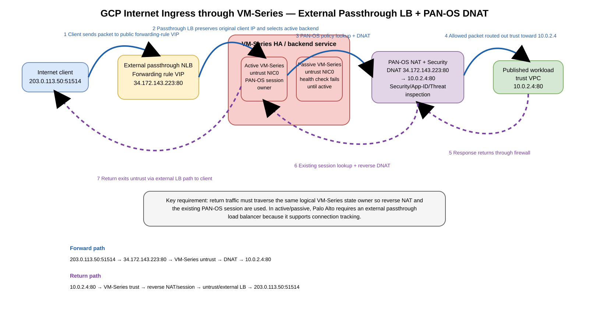

# Palo Alto Networks Firewalling in Google Cloud — Cloud NGFW Enterprise Integration vs VM-Series Service Insertion

## Purpose

This guide separates three concepts that are easy to conflate:

1. **Google Cloud NGFW Enterprise** — a Google-managed firewall service whose advanced threat prevention is powered by Palo Alto Networks technology.
2. **Palo Alto Networks VM-Series on Google Cloud** — PAN-OS firewalls that you deploy and operate as Compute Engine virtual machines.
3. **Google Cloud Network Security Integration (NSI) with VM-Series** — Google-managed packet interception that can transparently deliver selected packets to VM-Series over **GENEVE (Generic Network Virtualization Encapsulation)** without changing the consumer VPC's normal routes.

> **Important correction:** Palo Alto Networks currently documents its standalone managed **Cloud NGFW** product family for AWS and Azure. Do not model a separate product called “Palo Alto Cloud NGFW for Google Cloud.” In GCP, the Palo Alto paths are Google Cloud NGFW Enterprise using Palo Alto threat-prevention technology, or customer-deployed Palo Alto products such as VM-Series.

## Table of contents

- [Purpose](#purpose)
- [Source URLs](#source-urls)
- [1. Product boundary](#1-product-boundary)
  - [1.1 Google Cloud NGFW Enterprise](#11-google-cloud-ngfw-enterprise)
  - [1.2 VM-Series on GCP](#12-vm-series-on-gcp)
  - [1.3 Correct product mapping](#13-correct-product-mapping)
- [2. VM-Series deployment models in GCP](#2-vm-series-deployment-models-in-gcp)
  - [2.1 Modern model — VM-Series + Network Security Integration](#21-modern-model--vm-series--network-security-integration)
  - [2.2 Traditional model — internal passthrough LB + PBR/custom routes](#22-traditional-model--internal-passthrough-lb--pbrcustom-routes)
- [3. NSI architecture and packet flow](#3-nsi-architecture-and-packet-flow)
  - [3.1 GENEVE packet model](#31-geneve-packet-model)
  - [3.2 Enable GENEVE inspection on VM-Series](#32-enable-geneve-inspection-on-vm-series)
- [4. End-to-end NSI build with gcloud](#4-end-to-end-nsi-build-with-gcloud)
  - [4.1 Enable APIs](#41-enable-apis)
  - [4.2 Create producer VPC](#42-create-producer-vpc)
  - [4.3 Build the producer internal passthrough Network Load Balancer](#43-build-the-producer-internal-passthrough-network-load-balancer)
    - [4.3.1 Create the regional health check](#431-create-the-regional-health-check)
    - [4.3.2 Create the regional UDP backend service](#432-create-the-regional-udp-backend-service)
    - [4.3.3 Launch the VM-Series appliances and put them in an instance group](#433-launch-the-vm-series-appliances-and-put-them-in-an-instance-group)
      - [4.3.3.1 Understand the required order](#4331-understand-the-required-order)
      - [4.3.3.2 Discover the official VM-Series image](#4332-discover-the-official-vm-series-image)
      - [4.3.3.3 Create a management VPC and subnet](#4333-create-a-management-vpc-and-subnet)
      - [4.3.3.4 Launch the first VM-Series instance](#4334-launch-the-first-vm-series-instance)
      - [4.3.3.5 Verify GCE NIC order before touching PAN-OS](#4335-verify-gce-nic-order-before-touching-pan-os)
      - [4.3.3.6 Swap the PAN-OS management interface for standard NSI behind the ILB](#4336-swap-the-pan-os-management-interface-for-standard-nsi-behind-the-ilb)
      - [4.3.3.7 Enable GENEVE inspection and verify PAN-OS](#4337-enable-geneve-inspection-and-verify-pan-os)
      - [4.3.3.8 Create the unmanaged instance group and add the firewall](#4338-create-the-unmanaged-instance-group-and-add-the-firewall)
      - [4.3.3.9 Add a second firewall and verify membership](#4339-add-a-second-firewall-and-verify-membership)
      - [4.3.3.10 Standard NSI versus NSI Overlay NIC model](#43310-standard-nsi-versus-nsi-overlay-nic-model)
    - [4.3.4 Attach the instance group to the backend service](#434-attach-the-instance-group-to-the-backend-service)
    - [4.3.5 Create the actual internal passthrough ILB frontend](#435-create-the-actual-internal-passthrough-ilb-frontend)
    - [4.3.6 Allow GENEVE and health-check traffic to the VM-Series backends](#436-allow-geneve-and-health-check-traffic-to-the-vm-series-backends)
    - [4.3.7 Verify the complete ILB, not only the backend service](#437-verify-the-complete-ilb-not-only-the-backend-service)
  - [4.4 Create the producer intercept deployment group — the global service umbrella](#44-create-the-producer-intercept-deployment-group--the-global-service-umbrella)
  - [4.5 Create the zonal intercept deployment — map one zone to one producer ILB frontend](#45-create-the-zonal-intercept-deployment--map-one-zone-to-one-producer-ilb-frontend)
  - [4.6 Create the consumer intercept endpoint group — consumer-side pointer to the producer service](#46-create-the-consumer-intercept-endpoint-group--consumer-side-pointer-to-the-producer-service)
  - [4.7 Associate the endpoint group with the consumer VPC](#47-associate-the-endpoint-group-with-the-consumer-vpc)
  - [4.8 Create custom-intercept security profile](#48-create-custom-intercept-security-profile)
  - [4.9 Create security profile group](#49-create-security-profile-group)
  - [4.10 Create global network firewall policy](#410-create-global-network-firewall-policy)
  - [4.11 Create interception rule](#411-create-interception-rule)
    - [4.11.1 Firewall-policy actions and why they matter](#4111-firewall-policy-actions-and-why-they-matter)
  - [4.12 Associate firewall policy with VPC](#412-associate-firewall-policy-with-vpc)
- [5. East-west packet flow with NSI](#5-east-west-packet-flow-with-nsi)
  - [5.1 Return path — NSI firewall rules are stateful](#51-return-path--nsi-firewall-rules-are-stateful)
  - [5.2 New-session policy selection versus reverse-session state](#52-new-session-policy-selection-versus-reverse-session-state)
  - [5.3 Partial TCP-session caveat](#53-partial-tcp-session-caveat)
- [6. NSI Internet egress — complete forward and return path](#6-nsi-internet-egress--complete-forward-and-return-path)
  - [6.1 Model A — standard in-band reinjection with Cloud NAT or a workload external IP](#61-model-a--standard-in-band-reinjection-with-cloud-nat-or-a-workload-external-ip)
  - [6.2 Model B — direct Internet egress through VM-Series](#62-model-b--direct-internet-egress-through-vm-series)
  - [6.3 Standard versus direct Internet egress](#63-standard-versus-direct-internet-egress)
  - [6.4 Verification for Internet egress](#64-verification-for-internet-egress)
- [7. Traditional internal passthrough ILB + PBR/static-route architecture — full deep dive](#7-traditional-internal-passthrough-ilb--pbrstatic-route-architecture--full-deep-dive)
  - [7.1 Traditional model building blocks](#71-traditional-model-building-blocks)
  - [7.2 How an ILB next hop differs from a normal load-balanced application](#72-how-an-ilb-next-hop-differs-from-a-normal-load-balanced-application)
  - [7.3 PBR versus custom static route](#73-pbr-versus-custom-static-route)
  - [7.4 East-west inspection — subnet/VPC A to subnet/VPC B](#74-east-west-inspection--subnetvpc-a-to-subnetvpc-b)
  - [7.5 Intra-VPC east-west inspection](#75-intra-vpc-east-west-inspection)
  - [7.6 Inter-VPC / hub-and-spoke east-west inspection](#76-inter-vpc--hub-and-spoke-east-west-inspection)
  - [7.7 Internet egress — workload to Internet](#77-internet-egress--workload-to-internet)
  - [7.8 Internet ingress — Internet to published workload](#78-internet-ingress--internet-to-published-workload)
    - [7.8.1 Concrete Internet-ingress example](#781-concrete-internet-ingress-example)
    - [7.8.2 Create the private application](#782-create-the-private-application)
    - [7.8.3 Create an Internet-facing forwarding rule for the application](#783-create-an-internet-facing-forwarding-rule-for-the-application)
    - [7.8.4 Configure PAN-OS DNAT and Security policy](#784-configure-pan-os-dnat-and-security-policy)
    - [7.8.5 Forward packet walk — Internet client to private workload](#785-forward-packet-walk--internet-client-to-private-workload)
    - [7.8.6 Return packet walk — private workload back to Internet client](#786-return-packet-walk--private-workload-back-to-internet-client)
    - [7.8.7 Test and verify the published application](#787-test-and-verify-the-published-application)
    - [7.8.8 Active/passive HA behavior and caveats](#788-activepassive-ha-behavior-and-caveats)
    - [7.8.9 Can the same VM-Series fleet handle NSI and Internet ingress?](#789-can-the-same-vm-series-fleet-handle-nsi-and-internet-ingress)
  - [7.9 On-premises inspection through Cloud Interconnect](#79-on-premises-inspection-through-cloud-interconnect)
  - [7.10 On-premises inspection through HA VPN](#710-on-premises-inspection-through-ha-vpn)
  - [7.11 Avoid PBR recursion through the firewall backends](#711-avoid-pbr-recursion-through-the-firewall-backends)
  - [7.12 Cloud Interconnect versus HA VPN for this inspection design](#712-cloud-interconnect-versus-ha-vpn-for-this-inspection-design)
  - [7.13 Symmetric hashing and PAN-OS state](#713-symmetric-hashing-and-pan-os-state)
  - [7.14 HA and failure behavior](#714-ha-and-failure-behavior)
  - [7.15 Traditional design verification](#715-traditional-design-verification)
  - [7.16 Troubleshooting traditional ILB/PBR by symptom](#716-troubleshooting-traditional-ilbpbr-by-symptom)
- [8. Inbound Internet and interface constraints](#8-inbound-internet-and-interface-constraints)
- [9. HA and scaling](#9-ha-and-scaling)
- [10. NAT behavior](#10-nat-behavior)
- [11. Verification](#11-verification)
- [12. Troubleshooting by symptom](#12-troubleshooting-by-symptom)
- [13. Common mistakes](#13-common-mistakes)
- [14. Design decision matrix](#14-design-decision-matrix)
- [Sources](#sources)

---

## Source URLs

### Palo Alto Networks
- https://docs.paloaltonetworks.com/ngfw
- https://docs.paloaltonetworks.com/vm-series
- https://docs.paloaltonetworks.com/vm-series/deployment/public-cloud/set-up-the-vm-series-firewall-on-google-cloud-platform/securing-vpc-with-vm-on-gcp
- https://docs.paloaltonetworks.com/vm-series/deployment/public-cloud/set-up-the-vm-series-firewall-on-google-cloud-platform/deployment-models-for-vm-series-on-gcp
- https://docs.paloaltonetworks.com/vm-series/deployment/public-cloud/set-up-the-vm-series-firewall-on-google-cloud-platform/configuring-gcp-load-balancer
- https://docs.paloaltonetworks.com/vm-series/deployment/public-cloud/set-up-the-vm-series-firewall-on-google-cloud-platform/google-cloud-network-security-integration-nsi-with-vm-series-firewall
- https://docs.paloaltonetworks.com/vm-series/deployment/public-cloud/set-up-the-vm-series-firewall-on-google-cloud-platform/configure-gcp-nsi-overlay-support
- https://docs.paloaltonetworks.com/vm-series/deployment/public-cloud/set-up-the-vm-series-firewall-on-google-cloud-platform/deployment-models-for-vm-series-on-gcp/active-passive-model
- https://docs.paloaltonetworks.com/vm-series/getting-started/vm-series-on-google-performance-and-capacity/vm-series-on-google-cloud-platform-supported-gcp-instance-types
- https://docs.paloaltonetworks.com/vm-series/deployment/public-cloud/set-up-the-vm-series-firewall-on-google-cloud-platform/deploy-the-vm-series-firewall-on-gcp/use-custom-templates-or-the-gcloud-cli-to-deploy-the-vm-series-firewall
- https://docs.paloaltonetworks.com/vm-series/deployment/public-cloud/set-up-the-vm-series-firewall-on-google-cloud-platform/deploy-the-vm-series-firewall-on-gcp/management-interface-mapping-for-google-internal-load-balancing
- https://docs.paloaltonetworks.com/vm-series/deployment/public-cloud/set-up-the-vm-series-firewall-on-google-cloud-platform/deploy-the-vm-series-firewall-on-gcp/use-the-vm-series-firewall-cli-to-swap-the-management-interface-on-google

### Google Cloud
- https://cloud.google.com/security/products/firewall
- https://cloud.google.com/blog/products/identity-security/announcing-next-gen-firewall-enterprise-now-in-ga-next24
- https://docs.cloud.google.com/firewall/docs/about-intrusion-prevention
- https://docs.cloud.google.com/firewall/docs/firewall-policies
- https://docs.cloud.google.com/firewall/docs/firewall-policies-rule-details
- https://docs.cloud.google.com/firewall/docs/use-network-firewall-policies
- https://docs.cloud.google.com/firewall/docs/troubleshoot/layer-7-inspection-setup
- https://docs.cloud.google.com/network-security-integration/docs/nsi-overview
- https://docs.cloud.google.com/network-security-integration/docs/understand-geneve
- https://docs.cloud.google.com/network-security-integration/docs/in-band/in-band-integration-overview
- https://docs.cloud.google.com/network-security-integration/docs/in-band/firewall-policies-overview
- https://docs.cloud.google.com/network-security-integration/docs/in-band/in-band-integration-tutorial
- https://docs.cloud.google.com/network-security-integration/docs/in-band/configure-intercept-deployments
- https://docs.cloud.google.com/network-security-integration/docs/in-band/configure-intercept-endpoint-groups
- https://docs.cloud.google.com/network-security-integration/docs/in-band/configure-endpoint-group-associations
- https://docs.cloud.google.com/network-security-integration/docs/in-band/configure-security-profiles
- https://docs.cloud.google.com/network-security-integration/docs/in-band/configure-security-profile-groups
- https://docs.cloud.google.com/network-security-integration/docs/in-band/configure-firewall-rules
- https://docs.cloud.google.com/network-security-integration/docs/in-band/configure-consumer-service
- https://docs.cloud.google.com/network-security-integration/docs/release-notes
- https://docs.cloud.google.com/vpc/docs/policy-based-routes
- https://docs.cloud.google.com/vpc/docs/use-policy-based-routes
- https://docs.cloud.google.com/sdk/gcloud/reference/network-connectivity/policy-based-routes/create
- https://docs.cloud.google.com/load-balancing/docs/internal/ilb-next-hop-overview
- https://docs.cloud.google.com/load-balancing/docs/internal/setting-up-ilb-next-hop
- https://cloud.google.com/blog/products/networking/policy-based-routing-network-patterns-for-virtual-appliances

---

# 1. Product boundary


[Editable draw.io](images/09-07-26-07-03_pan_gcp_product_boundary.drawio)

**What this image shows:** Google Cloud NGFW Enterprise, VM-Series, and NSI + VM-Series are related but distinct architectures.

**What matters:** Google owns the Cloud NGFW service; VM-Series is PAN-OS running on Compute Engine; NSI is the Google service-insertion fabric that can deliver traffic to VM-Series.

**What to verify:** Decide which control plane owns policy and where the firewall session state lives before designing routing.

## 1.1 Google Cloud NGFW Enterprise

**Source information:** Google describes Cloud NGFW as a distributed, stateful firewall embedded in the Google Cloud networking fabric. Its advanced intrusion-prevention capabilities are powered by Palo Alto Networks threat-prevention technology.

**Additional explanation:** This does not mean a PAN-OS VM is hidden in your project. You configure Google firewall policies, security profiles, firewall endpoints, and TLS inspection resources with Google APIs and IAM. Google operates the inspection data plane.

Use it when you want Google-managed lifecycle, native distributed L3/L4 enforcement, managed L7 threat prevention, and no customer-managed firewall fleet.

## 1.2 VM-Series on GCP

VM-Series is Palo Alto Networks' virtualized NGFW. It runs PAN-OS and exposes the familiar Palo Alto constructs: zones, virtual routers, Security policy, App-ID, NAT policy, logging, and licensed cloud-delivered security services. It can be centrally managed with Panorama and supported Strata management workflows.

Use VM-Series when you require PAN-OS policy semantics or operational consistency with Palo Alto firewalls elsewhere.

## 1.3 Correct product mapping

| Requirement | Correct design |
|---|---|
| Native Google distributed firewall with PAN threat prevention | Google Cloud NGFW Enterprise |
| PAN-OS firewall in GCP | VM-Series |
| Transparent interception into PAN-OS firewall VMs | VM-Series + NSI |
| Explicit routed service chain | VM-Series + internal passthrough NLB + PBR/custom routes |

---

# 2. VM-Series deployment models in GCP

Palo Alto documents multiple GCP architectures. Two are especially important for service insertion.

## 2.1 Modern model — VM-Series + Network Security Integration

NSI divides the design into a **producer** and a **consumer**.

The producer side contains the VM-Series inspection service: producer VPC, VM-Series instances, an internal passthrough Network Load Balancer (ILB), a global intercept deployment group, and one or more zonal intercept deployments that reference ILB forwarding rules.

The consumer side contains application workloads, an intercept endpoint group, endpoint-group association, custom-intercept security profile, security profile group, and a global network or hierarchical firewall policy rule using `apply_security_profile_group`.

## 2.2 Traditional model — internal passthrough LB + PBR/custom routes

Palo Alto's classic multi-interface architecture attaches VM-Series dataplane NICs to workload/trust/untrust networks. Internal passthrough Network Load Balancers front firewall interfaces, while custom static routes or **Policy-Based Routes (PBRs)** steer traffic to the load balancer.

Unlike NSI, this is a true **routed service chain**. Google sends the packet to a VM-Series dataplane interface as the next hop, PAN-OS makes a routing/security/NAT decision, and the packet re-enters the Google VPC data plane after the firewall forwards it.

---

# 3. NSI architecture and packet flow


[Editable draw.io](images/09-07-26-07-03_pan_gcp_nsi_packet_flow.drawio)

**What this image shows:** A consumer firewall policy selects a flow and resolves it through a custom-intercept profile and endpoint group to a producer-side ILB and VM-Series service.

**What matters:** The consumer VPC's normal route does not point to the firewall. NSI is invoked by firewall-policy action, not by an ordinary route next hop.

**What to verify:** endpoint group association, security profile group reference, zonal intercept deployment state, ILB health, GENEVE enablement on VM-Series, and successful reinjection.

## 3.1 GENEVE packet model

NSI in-band interception encapsulates the original packet in GENEVE and adds Google-specific metadata. Conceptually:

```text
Outer inspection transport
+----------------------------------------------------------+
| Outer IP | UDP | GENEVE | Google metadata | Inner packet|
+----------------------------------------------------------+

Inner packet example:
10.10.1.10:51514 -> 10.10.2.20:443 TCP
```

The VM-Series inspects the inner packet, not merely the GENEVE outer transport.

## 3.2 Enable GENEVE inspection on VM-Series

Palo Alto documents:

```cli
request plugins vm_series geneve-inspect enable yes
```

A reboot is required when enabling this feature. Bootstrap can also include:

```text
geneve-inspect=enable
```

Verify VM interface mapping with:

```cli
debug show vm-series interfaces all
```

---

# 4. End-to-end NSI build with gcloud

Example objects:

| Item | Example |
|---|---|
| Producer project | `pan-sec-prod` |
| Consumer project | `app-prod-1` |
| Region / zone | `us-central1` / `us-central1-a` |
| Producer VPC | `pan-inspection-vpc` |
| Consumer VPC | `app-vpc` |
| Deployment group | `pan-idg` |
| Zonal deployment | `pan-id-uscentral1a` |
| Endpoint group | `pan-ieg` |
| Security profile | `pan-custom-intercept` |
| Security profile group | `pan-spg` |
| Firewall policy | `pan-nsi-policy` |

## 4.1 Enable APIs

```cli
gcloud services enable compute.googleapis.com networksecurity.googleapis.com --project=pan-sec-prod
gcloud services enable compute.googleapis.com networksecurity.googleapis.com --project=app-prod-1
```

## 4.2 Create producer VPC

```cli
gcloud compute networks create pan-inspection-vpc \
  --project=pan-sec-prod \
  --subnet-mode=custom

gcloud compute networks subnets create pan-inspection-uscentral1 \
  --project=pan-sec-prod \
  --network=pan-inspection-vpc \
  --region=us-central1 \
  --range=10.250.10.0/24
```

The next section now shows the previously missing step: actually launching the VM-Series appliances before creating the instance group that contains them.

## 4.3 Build the producer internal passthrough Network Load Balancer

The producer-side load balancer is not just a backend service. For NSI in-band inspection, the complete chain is:

```text
NSI intercept deployment
        |
        v
regional internal forwarding rule
UDP/6081 on pan-inspection-vpc
        |
        v
regional INTERNAL backend service
protocol UDP
        |
        v
zonal VM-Series instance group(s)
        |
        v
VM-Series GENEVE inspection
```

The forwarding rule is especially important because **the zonal NSI intercept deployment references this forwarding rule directly**. Google sends intercepted traffic to the forwarding rule as GENEVE over UDP port `6081`.

### 4.3.1 Create the regional health check

The load balancer needs a health check that proves a VM-Series backend is available before Google selects it. This example uses TCP port `80`, matching Google's NSI in-band tutorial. The appliance must actually answer the configured health-check port; change the port if your VM-Series deployment uses a different supported health-monitoring method.

```cli
gcloud compute health-checks create tcp pan-nsi-hc \
  --project=pan-sec-prod \
  --region=us-central1 \
  --port=80
```

### 4.3.2 Create the regional UDP backend service

For NSI in-band GENEVE delivery, Google's documented producer backend service uses protocol `UDP` and load-balancing scheme `INTERNAL`.

```cli
gcloud compute backend-services create pan-nsi-ilb-bs \
  --project=pan-sec-prod \
  --region=us-central1 \
  --protocol=UDP \
  --health-checks=pan-nsi-hc \
  --health-checks-region=us-central1 \
  --load-balancing-scheme=INTERNAL
```

The backend service is the regional load-balancing object that owns backend membership and health state; it is **not** the ILB frontend/VIP by itself.

### 4.3.3 Launch the VM-Series appliances and put them in an instance group

The earlier version of this guide jumped directly to `gcloud compute instance-groups unmanaged add-instances ... --instances=pan-fw-a1` without showing where `pan-fw-a1` came from. That sequence was incomplete.

For an unmanaged instance-group design, the correct order is:

```text
1. Select an official VM-Series image and licensing model
2. Create the required GCP networks/subnets
3. Create each VM-Series Compute Engine instance
4. Verify GCE NIC order and IP forwarding
5. Initialize/license PAN-OS
6. For standard NSI behind the producer ILB, make the primary GCE NIC a PAN-OS dataplane interface
7. Enable GENEVE inspection
8. Create the unmanaged zonal instance group
9. Add the already-created VM-Series instance(s) to the group
10. Attach that group to pan-nsi-ilb-bs
```

#### 4.3.3.1 Understand the required order

An **unmanaged instance group does not launch the firewalls for you**. It is a container for Compute Engine VM instances that already exist.

That means this is invalid as an end-to-end mental model:

```text
Create group
   -> add pan-fw-a1
```

unless `pan-fw-a1` was created earlier.

The complete relationship is:

```text
Official Palo Alto VM-Series Marketplace image
                 |
                 v
Compute Engine VM pan-fw-a1
  +-- GCE nic0: producer inspection subnet
  +-- GCE nic1: management subnet
  +-- canIpForward = true
                 |
                 v
PAN-OS initialization / licensing
                 |
                 v
management-interface swap for this standard-NSI ILB model
                 |
                 v
PAN-OS dataplane on primary GCE NIC
                 |
                 v
GENEVE inspection enabled
                 |
                 v
unmanaged instance group pan-nsi-fw-ig-a
                 |
                 v
backend service pan-nsi-ilb-bs
                 |
                 v
internal forwarding rule UDP/6081
                 |
                 v
NSI intercept deployment
```

#### 4.3.3.2 Discover the official VM-Series image

Palo Alto Networks publishes official VM-Series Marketplace images from the Google Cloud project:

```text
paloaltonetworksgcp-public
```

Palo Alto documents these naming patterns:

```text
BYOL:          vmseries-byol-<version>
PAYG Bundle 1: vmseries-bundle1-<version>
PAYG Bundle 2: vmseries-bundle2-<version>
```

Do not hard-code an old PAN-OS image name. List the images that are currently available:

```cli
gcloud compute images list \
  --project=paloaltonetworksgcp-public \
  --no-standard-images
```

To see the full image URIs:

```cli
gcloud compute images list \
  --project=paloaltonetworksgcp-public \
  --no-standard-images \
  --uri
```

Choose the PAN-OS release and licensing model that your Palo Alto entitlement and supported GCP machine type allow. For the remainder of this example:

```cli
export PAN_IMAGE_PROJECT="paloaltonetworksgcp-public"
export PAN_IMAGE="vmseries-byol-REPLACE_WITH_SUPPORTED_VERSION"
export PAN_MACHINE_TYPE="REPLACE_WITH_PALO_ALTO_SUPPORTED_MACHINE_TYPE"
```

**Why placeholders are deliberate:** VM-Series-supported machine types and PAN-OS image versions change. Validate the current Palo Alto supported-instance table instead of copying a stale machine type from an example.

#### 4.3.3.3 Create a management VPC and subnet

The producer inspection VPC created in section 4.2 carries the internal-load-balancer/GENEVE dataplane. Use a separate management network when your design requires isolated PAN-OS administrative access.

```cli
gcloud compute networks create pan-mgmt-vpc \
  --project=pan-sec-prod \
  --subnet-mode=custom

gcloud compute networks subnets create pan-mgmt-uscentral1 \
  --project=pan-sec-prod \
  --network=pan-mgmt-vpc \
  --region=us-central1 \
  --range=10.250.20.0/24
```

If administrators reach the management interface privately through VPN, Interconnect, IAP-compatible access, a bastion, or another approved management path, the interface does not need a public IP simply for this example.

If you create management firewall rules, restrict them to your actual administrative source prefixes rather than `0.0.0.0/0`. Conceptually:

```cli
export ADMIN_CIDR="REPLACE_WITH_ADMIN_SOURCE_CIDR"

gcloud compute firewall-rules create pan-mgmt-admin \
  --project=pan-sec-prod \
  --network=pan-mgmt-vpc \
  --direction=INGRESS \
  --allow=tcp:22,tcp:443 \
  --source-ranges="$ADMIN_CIDR"
```

#### 4.3.3.4 Launch the first VM-Series instance

For the **standard NSI producer ILB example in this section**, place the inspection/load-balancer-facing interface first so that it becomes GCE `nic0`. Palo Alto documents that GCP internal load balancing sends traffic to the primary interface of the backend VM; the later management-interface swap makes that primary interface usable by PAN-OS as dataplane.

Create the firewall:

```cli
gcloud compute instances create pan-fw-a1 \
  --project=pan-sec-prod \
  --zone=us-central1-a \
  --machine-type="$PAN_MACHINE_TYPE" \
  --image="$PAN_IMAGE" \
  --image-project="$PAN_IMAGE_PROJECT" \
  --can-ip-forward \
  --network-interface=network=pan-inspection-vpc,subnet=pan-inspection-uscentral1,no-address \
  --network-interface=network=pan-mgmt-vpc,subnet=pan-mgmt-uscentral1,no-address
```

Important fields:

| Setting | Why it matters |
|---|---|
| First `--network-interface` | Becomes GCE `nic0`, the primary interface that the internal passthrough load balancer uses for this standard NSI design. |
| Second `--network-interface` | Provides the separate management-side GCE NIC before PAN-OS interface mapping is swapped. |
| `--can-ip-forward` | Enables the Compute Engine instance to operate as a network appliance rather than only as an endpoint host. |
| `--image-project` | Points to Palo Alto Networks' official public VM-Series image project. |
| `--image` | Selects the supported BYOL/PAYG PAN-OS image you deliberately chose. |

This example intentionally uses `no-address` on both interfaces and assumes private management reachability. If your approved deployment requires a public management address or additional bootstrap metadata, add it using the current Palo Alto deployment procedure rather than assuming the example's private-management model.

**License/onboarding:** after the VM boots, complete the appropriate Palo Alto BYOL/PAYG activation, bootstrap, Panorama, or Strata management onboarding workflow for your environment. The GCP instance group does not license or initialize PAN-OS.

#### 4.3.3.5 Verify GCE NIC order before touching PAN-OS

Confirm the VM exists and that the GCP interfaces are in the intended order:

```cli
gcloud compute instances describe pan-fw-a1 \
  --project=pan-sec-prod \
  --zone=us-central1-a \
  --format='yaml(name,canIpForward,networkInterfaces.name,networkInterfaces.network,networkInterfaces.subnetwork,networkInterfaces.networkIP)'
```

**Expected state, not verbatim output:**

```text
name: pan-fw-a1
canIpForward: true
networkInterfaces:
  - name: nic0
    network: pan-inspection-vpc
    subnetwork: pan-inspection-uscentral1
  - name: nic1
    network: pan-mgmt-vpc
    subnetwork: pan-mgmt-uscentral1
```

The actual assigned IP addresses are runtime values unless you reserved them explicitly.

**Failure indicators:**

- `canIpForward` is false;
- `nic0` is on the wrong VPC/subnet;
- the management network was accidentally created as `nic0` for this standard-NSI ILB model;
- only one NIC exists, which would make the management-interface swap unsafe.

#### 4.3.3.6 Swap the PAN-OS management interface for standard NSI behind the ILB

This subsection is specifically for the **standard NSI producer internal-load-balancer design in section 4**.

Palo Alto states that when VM-Series is behind a GCP internal load balancer, the firewall must be able to receive dataplane traffic on GCE `eth0`/`nic0`, because the load balancer sends traffic to the backend's primary interface. Palo Alto therefore supports swapping the PAN-OS management interface and the first dataplane interface.

Before changing anything, check the current mapping from PAN-OS:

```cli
debug show vm-series interfaces all
```

Conceptually, before the swap:

```text
PAN-OS MGT        -> GCE eth0 / nic0
PAN-OS ethernet1/1-> GCE eth1 / nic1
```

Enable the swap:

```cli
set system setting mgmt-interface-swap enable yes
```

Confirm the prompt and reboot the firewall:

```cli
request restart system
```

After the reboot:

```cli
debug show vm-series interfaces all
```

Expected conceptual mapping:

```text
PAN-OS ethernet1/1 -> GCE eth0 / nic0 -> pan-inspection-vpc
PAN-OS MGT         -> GCE eth1 / nic1 -> pan-mgmt-vpc
```

**Critical caution:** Palo Alto explicitly warns that the VM must have at least two interfaces before you perform this swap. A one-interface VM can boot into maintenance mode after the swap command.

This is why the GCE interfaces were created in the deliberate order shown in section 4.3.3.4.

#### 4.3.3.7 Enable GENEVE inspection and verify PAN-OS

Now enable the VM-Series GENEVE inspection capability used by standard NSI:

```cli
request plugins vm_series geneve-inspect enable yes
```

Palo Alto documents a reboot requirement when enabling this capability. After the required restart, verify the interface mapping again:

```cli
debug show vm-series interfaces all
```

Also confirm that the PAN-OS configuration required by your inspection design exists, including:

- the correct dataplane interface/zone assignment;
- Security policy permitting the intended inspected traffic;
- threat/content profiles as required;
- management reachability through the management VPC;
- license and content status;
- GENEVE inspection enabled.

At this stage `pan-fw-a1` is an actual VM-Series appliance. Only now does it make sense to place it into the GCP backend instance group.

#### 4.3.3.8 Create the unmanaged instance group and add the firewall

Create the zonal unmanaged instance group:

```cli
gcloud compute instance-groups unmanaged create pan-nsi-fw-ig-a \
  --project=pan-sec-prod \
  --zone=us-central1-a
```

Then add the **already-created** firewall:

```cli
gcloud compute instance-groups unmanaged add-instances pan-nsi-fw-ig-a \
  --project=pan-sec-prod \
  --zone=us-central1-a \
  --instances=pan-fw-a1
```

The important relationship is now explicit:

```text
pan-fw-a1 Compute Engine VM
        |
        | added as member
        v
pan-nsi-fw-ig-a unmanaged instance group
        |
        | later attached as backend
        v
pan-nsi-ilb-bs
```

#### 4.3.3.9 Add a second firewall and verify membership

For another firewall in the same zone, create a second VM using the same supported image/machine type and the same GCE NIC ordering. Its primary `nic0` must be on the appropriate producer inspection subnet used by this load-balancer backend design.

Example skeleton:

```cli
gcloud compute instances create pan-fw-a2 \
  --project=pan-sec-prod \
  --zone=us-central1-a \
  --machine-type="$PAN_MACHINE_TYPE" \
  --image="$PAN_IMAGE" \
  --image-project="$PAN_IMAGE_PROJECT" \
  --can-ip-forward \
  --network-interface=network=pan-inspection-vpc,subnet=pan-inspection-uscentral1,no-address \
  --network-interface=network=pan-mgmt-vpc,subnet=pan-mgmt-uscentral1,no-address
```

Perform the same PAN-OS initialization, management-interface swap, and GENEVE enablement on `pan-fw-a2`, then add it:

```cli
gcloud compute instance-groups unmanaged add-instances pan-nsi-fw-ig-a \
  --project=pan-sec-prod \
  --zone=us-central1-a \
  --instances=pan-fw-a2
```

Verify membership:

```cli
gcloud compute instance-groups unmanaged list-instances pan-nsi-fw-ig-a \
  --project=pan-sec-prod \
  --zone=us-central1-a
```

**Expected state, not verbatim output:** both `pan-fw-a1` and `pan-fw-a2` appear as group members.

Do not confuse **group membership** with **load-balancer health**. A VM can be in the instance group and still be unhealthy in `pan-nsi-ilb-bs` because PAN-OS, the health-check service, interface mapping, or GCP firewall rules are incorrect.

For inspection capacity in another zone, use a separate zonal instance group for the VM-Series instances in that zone, then add that group to the regional backend service where the supported architecture calls for it.

#### 4.3.3.10 Standard NSI versus NSI Overlay NIC model

Do not mix the NIC procedure in this section with the **NSI Overlay/direct Internet egress** procedure in section 6.2.

| Design | Relevant Palo Alto NIC model |
|---|---|
| Standard NSI producer ILB in section 4 | The producer internal load balancer delivers to the primary GCE NIC; Palo Alto's management-interface swap is used so that primary NIC can map to a dataplane interface. |
| NSI Overlay / direct Internet egress in section 6.2 | Palo Alto currently documents `nic0 = Management`, `nic1 = Trust`, `nic2 = Untrust`; the NSI Overlay feature performs the documented inner-routing/direct-egress behavior. |

Those are different deployment variants. Follow the Palo Alto documentation for the specific NSI mode you are implementing rather than applying the standard-ILB interface-swap recipe to the Overlay topology.

### 4.3.4 Attach the instance group to the backend service

Now that `pan-nsi-fw-ig-a` contains real VM-Series instances, attach it to the producer backend service:

```cli
gcloud compute backend-services add-backend pan-nsi-ilb-bs \
  --project=pan-sec-prod \
  --region=us-central1 \
  --instance-group=pan-nsi-fw-ig-a \
  --instance-group-zone=us-central1-a
```

If you deploy inspection capacity in more than one zone, add the corresponding zonal instance groups as additional backends where the documented NSI/load-balancer design supports them.

### 4.3.5 Create the actual internal passthrough ILB frontend

Now create the **regional internal forwarding rule**. This creates the ILB frontend IP and maps UDP/6081 to `pan-nsi-ilb-bs`.

```cli
gcloud compute forwarding-rules create pan-nsi-ilb-fr \
  --project=pan-sec-prod \
  --backend-service=pan-nsi-ilb-bs \
  --region=us-central1 \
  --network=pan-inspection-vpc \
  --subnet=pan-inspection-uscentral1 \
  --ip-protocol=UDP \
  --load-balancing-scheme=INTERNAL \
  --ports=6081
```

At this point the forwarding rule is the actual ILB frontend used by NSI. Unless you explicitly reserve and specify an internal address, Google assigns an available frontend address from the selected subnet.

Retrieve it:

```cli
ILB_IP=$(gcloud compute forwarding-rules describe pan-nsi-ilb-fr \
  --project=pan-sec-prod \
  --region=us-central1 \
  --format='get(IPAddress)')

echo "$ILB_IP"
```

Also obtain the producer subnet gateway address:

```cli
GW_IP=$(gcloud compute networks subnets describe pan-inspection-uscentral1 \
  --project=pan-sec-prod \
  --region=us-central1 \
  --format='get(gatewayAddress)')

echo "$GW_IP"
```

### 4.3.6 Allow GENEVE and health-check traffic to the VM-Series backends

```cli
gcloud compute network-firewall-policies create pan-producer-fw-policy \
  --project=pan-sec-prod \
  --global

gcloud compute network-firewall-policies associations create \
  --project=pan-sec-prod \
  --name=pan-producer-fw-policy-assoc \
  --firewall-policy=pan-producer-fw-policy \
  --global-firewall-policy \
  --network=pan-inspection-vpc

gcloud compute network-firewall-policies rules create 100 \
  --project=pan-sec-prod \
  --firewall-policy=pan-producer-fw-policy \
  --global-firewall-policy \
  --action=allow \
  --direction=INGRESS \
  --layer4-configs=udp:6081 \
  --src-ip-ranges=${GW_IP}/32

gcloud compute network-firewall-policies rules create 101 \
  --project=pan-sec-prod \
  --firewall-policy=pan-producer-fw-policy \
  --global-firewall-policy \
  --action=allow \
  --direction=INGRESS \
  --layer4-configs=tcp:80 \
  --src-ip-ranges=35.191.0.0/16,130.211.0.0/22
```

These GCP firewall-policy rules only permit the transport to reach the producer appliances. PAN-OS still needs the correct interface mapping, GENEVE inspection state, Security policy, and vendor-required service configuration.

### 4.3.7 Verify the complete ILB, not only the backend service

```cli
gcloud compute backend-services describe pan-nsi-ilb-bs \
  --project=pan-sec-prod \
  --region=us-central1

gcloud compute backend-services get-health pan-nsi-ilb-bs \
  --project=pan-sec-prod \
  --region=us-central1

gcloud compute forwarding-rules describe pan-nsi-ilb-fr \
  --project=pan-sec-prod \
  --region=us-central1 \
  --format='yaml(name,IPAddress,IPProtocol,ports,backendService,loadBalancingScheme,network,subnetwork)'
```

**Success criteria:**

- intended instance group is attached and healthy;
- `IPProtocol` is UDP;
- port `6081` is present;
- `loadBalancingScheme` is `INTERNAL`;
- the forwarding rule points to `pan-nsi-ilb-bs` and has an internal IP.

## 4.4–4.7 Tie the producer service to the consumer VPC


[Editable draw.io](images/09-07-26-07-03_nsi_producer_consumer_object_chain.drawio)

**What this image shows:** The consumer-side policy objects ultimately point to a producer-side **intercept deployment group**. That global producer object owns one or more **zonal intercept deployments**, and each zonal deployment references the internal forwarding rule that fronts the VM-Series service.

**What matters:** The consumer never points directly to `pan-nsi-ilb-fr`. The stable cross-project contract is the **intercept deployment group**. The consumer creates its own **intercept endpoint group** as a pointer to that producer service, and an **endpoint-group association** binds that pointer to the actual consumer VPC.

**What to verify:**

```text
Consumer firewall rule
  -> security profile group
  -> custom-intercept profile
  -> intercept endpoint group (pan-ieg)
  -> producer intercept deployment group (pan-idg)
  -> selected zonal intercept deployment (pan-id-uscentral1a)
  -> producer forwarding rule (pan-nsi-ilb-fr)
  -> backend service
  -> healthy VM-Series
```

### 4.4 Create the producer intercept deployment group — the global service umbrella

The **intercept deployment group** is the producer's global logical representation of the inspection service. It has no data-plane IP of its own. It groups zonal deployments and gives consumers one stable producer object to reference.

```cli
gcloud network-security intercept-deployment-groups create pan-idg \
  --project=pan-sec-prod \
  --location=global \
  --network=projects/pan-sec-prod/global/networks/pan-inspection-vpc \
  --no-async
```

Conceptually:

```text
Producer project: pan-sec-prod
Producer VPC:     pan-inspection-vpc
Global NSI offer: pan-idg
Actual packet entry point: supplied by zonal intercept deployments
```

Verify:

```cli
gcloud network-security intercept-deployment-groups describe pan-idg \
  --project=pan-sec-prod \
  --location=global
```

### 4.5 Create the zonal intercept deployment — map one zone to one producer ILB frontend

```cli
gcloud network-security intercept-deployments create pan-id-uscentral1a \
  --project=pan-sec-prod \
  --location=us-central1-a \
  --forwarding-rule=pan-nsi-ilb-fr \
  --forwarding-rule-location=us-central1 \
  --intercept-deployment-group=projects/pan-sec-prod/locations/global/interceptDeploymentGroups/pan-idg \
  --no-async
```

This creates:

```text
pan-idg
  -> pan-id-uscentral1a
       -> pan-nsi-ilb-fr
            -> pan-nsi-ilb-bs
                 -> VM-Series backends
```

Verify:

```cli
gcloud network-security intercept-deployments describe pan-id-uscentral1a \
  --project=pan-sec-prod \
  --location=us-central1-a
```

### 4.6 Create the consumer intercept endpoint group — consumer-side pointer to the producer service

```cli
gcloud network-security intercept-endpoint-groups create pan-ieg \
  --project=app-prod-1 \
  --location=global \
  --intercept-deployment-group=projects/pan-sec-prod/locations/global/interceptDeploymentGroups/pan-idg \
  --no-async
```

Conceptually:

```text
CONSUMER                                   PRODUCER
pan-ieg  --------------------------------> pan-idg
(endpoint group)                           (deployment group)
```

### 4.7 Associate the endpoint group with the consumer VPC

```cli
gcloud network-security intercept-endpoint-group-associations create pan-ieg-app-vpc \
  --project=app-prod-1 \
  --location=global \
  --intercept-endpoint-group=projects/app-prod-1/locations/global/interceptEndpointGroups/pan-ieg \
  --network=app-vpc \
  --no-async
```

| Object | Question it answers |
|---|---|
| `pan-ieg` | Which producer inspection service do I want to consume? |
| `pan-ieg-app-vpc` | Which consumer VPC is bound to that service? |

After Step 4.7:

```text
app-vpc
  -> pan-ieg-app-vpc association
  -> pan-ieg endpoint group
  -> pan-idg deployment group
  -> pan-id-uscentral1a zonal deployment
  -> pan-nsi-ilb-fr
  -> pan-nsi-ilb-bs
  -> VM-Series
```

But **no workload flow is intercepted merely because these objects exist**. Steps 4.8–4.12 add the policy-selection layer.

## 4.8 Create custom-intercept security profile

```cli
gcloud network-security security-profiles custom-intercept create pan-custom-intercept \
  --organization=ORG_ID \
  --location=global \
  --billing-project=app-prod-1 \
  --intercept-endpoint-group=projects/app-prod-1/locations/global/interceptEndpointGroups/pan-ieg \
  --no-async
```

## 4.9 Create security profile group

```cli
gcloud network-security security-profile-groups create pan-spg \
  --organization=ORG_ID \
  --location=global \
  --custom-intercept-profile=pan-custom-intercept \
  --billing-project=app-prod-1 \
  --no-async
```

## 4.10 Create global network firewall policy

```cli
gcloud compute network-firewall-policies create pan-nsi-policy \
  --project=app-prod-1
```

## 4.11 Create interception rule

```cli
gcloud compute network-firewall-policies rules create 1000 \
  --project=app-prod-1 \
  --firewall-policy=pan-nsi-policy \
  --action=APPLY_SECURITY_PROFILE_GROUP \
  --security-profile-group=organizations/ORG_ID/locations/global/securityProfileGroups/pan-spg \
  --direction=INGRESS \
  --layer4-configs=tcp:443 \
  --src-ip-ranges=10.10.1.0/24 \
  --global-firewall-policy \
  --enable-logging
```

For egress rules, use destination matching instead of ingress source matching.

### 4.11.1 Firewall-policy actions and why they matter

The `--action` field decides what Google Cloud does **after a firewall-policy rule matches**. For global network firewall policies and hierarchical firewall policies, the actions you need to understand are:

| Action | Meaning | Does evaluation stop in the current policy? | Relevance to this NSI design |
|---|---|---:|---|
| `allow` | Permit the matching connection. | Yes | Use for traffic that should be allowed without VM-Series interception. |
| `deny` | Block the matching connection. | Yes | Use for traffic that should be dropped by Google before it reaches the NSI inspection service. |
| `goto_next` | Stop evaluating the current policy and continue at the next step in Google's firewall-policy evaluation order. | Yes, for the current policy; evaluation continues elsewhere. | Useful when an organization/folder policy deliberately delegates the decision to the next policy layer. It is **not** equivalent to `allow`. |
| `apply_security_profile_group` | Send matching traffic to a firewall endpoint or NSI intercept endpoint group referenced through the security profile group. | Yes | This is the action that performs NSI in-band service insertion into the VM-Series inspection service. |

**Source information:** Google documents `allow`, `deny`, `goto_next`, and `apply_security_profile_group` as valid actions for global network firewall policies. For NSI in-band integration, the interception rule must use `apply_security_profile_group` and reference the security profile group containing the custom-intercept profile.

The high-level decision tree is:

```text
Packet matches firewall-policy rule
                |
                +--> allow
                |      |
                |      +--> permit connection
                |           stop current rule evaluation
                |
                +--> deny
                |      |
                |      +--> drop connection
                |           stop current rule evaluation
                |
                +--> goto_next
                |      |
                |      +--> do not allow yet
                |           do not deny yet
                |           do not intercept yet
                |           continue at next firewall-policy stage
                |
                +--> apply_security_profile_group
                       |
                       +--> security profile group pan-spg
                              |
                              +--> custom-intercept profile
                                     |
                                     +--> intercept endpoint group pan-ieg
                                            |
                                            +--> producer deployment group pan-idg
                                                   |
                                                   +--> VM-Series inspection
```

#### `allow` versus `goto_next`

This distinction is easy to miss.

An `allow` action is a final permit decision for that firewall-policy evaluation path:

```cli
gcloud compute network-firewall-policies rules create 500 \
  --project=app-prod-1 \
  --firewall-policy=pan-nsi-policy \
  --action=allow \
  --direction=INGRESS \
  --src-ip-ranges=10.20.0.0/16 \
  --layer4-configs=all \
  --global-firewall-policy
```

Conceptually:

```text
match rule 500
   -> ALLOW
   -> permit connection
```

By contrast, `goto_next` means that this policy is **delegating**, not permitting:

**For more details:** [GCP Firewall Policy Hierarchy, `goto_next`, and NSI — Deep Dive](09-07-26_GCP_Firewall_Policy_Hierarchy_Goto_Next_NSI_Deep_Dive.md)

```cli
gcloud compute network-firewall-policies rules create 500 \
  --project=app-prod-1 \
  --firewall-policy=pan-nsi-policy \
  --action=goto_next \
  --direction=INGRESS \
  --src-ip-ranges=10.20.0.0/16 \
  --layer4-configs=all \
  --global-firewall-policy
```

Conceptually:

```text
match rule 500
   -> GOTO_NEXT
   -> stop evaluating this policy
   -> continue to the next policy/evaluation stage
   -> later policy or implied rule decides allow/deny/interception
```

This matters most with hierarchical policies, where an organization-level or folder-level policy can intentionally defer a subset of traffic to a lower policy layer.

#### Why `apply_security_profile_group` is special for NSI

For this guide's VM-Series + NSI design, `apply_security_profile_group` is not just another permit/deny action. It changes the processing path:

```text
normal VPC packet
      |
      v
firewall-policy rule matches
      |
      v
APPLY_SECURITY_PROFILE_GROUP
      |
      v
pan-spg
      |
      v
pan-custom-intercept
      |
      v
pan-ieg
      |
      v
NSI producer service
      |
      v
VM-Series
```

Google stops evaluating other firewall rules once this action matches. The security appliance path then determines whether the intercepted traffic is allowed or blocked.

For supported stateful connections, Google also creates firewall connection-tracking state for an `apply_security_profile_group` match. That is why subsequent packets in both directions of the established connection remain intercepted without requiring a separate reverse-direction interception rule merely for reply traffic.

#### Critical fallback behavior

Google documents an important operational caveat: the default fallback action for `apply_security_profile_group` rules is **allow**.

If advanced inspection cannot be applied because the inspection setup is invalid—for example, the expected endpoint/association is missing—Google can allow the traffic instead of silently converting the condition into an implicit deny. In firewall-policy logs, this condition is represented with:

```text
rule_details.action="APPLY_SECURITY_PROFILE_GROUP"
rule_details.apply_security_profile_fallback_action="ALLOW"
```

That means **logging and alerting are part of the security design**, not just troubleshooting convenience.

A useful log-based monitoring condition is conceptually:

```text
jsonPayload.rule_details.action="APPLY_SECURITY_PROFILE_GROUP"
jsonPayload.rule_details.apply_security_profile_fallback_action="ALLOW"
```

**Success state:** intercepted connections normally show that the rule action was `APPLY_SECURITY_PROFILE_GROUP` and the traffic was sent to the intended NSI endpoint chain.

**Failure indicator:** `apply_security_profile_fallback_action=ALLOW` appears when traffic that was intended for advanced inspection fell back to allow.

**Next action:** immediately validate the consumer endpoint-group association, security profile group, custom-intercept profile, producer deployment health, and VM-Series service availability before treating the flow as successfully inspected.

#### Regional-policy limitation

Do not attempt to build this NSI interception rule in a **regional network firewall policy**. Google documents that `apply_security_profile_group` is not supported there. Use a global network firewall policy or a supported hierarchical firewall policy for NSI in-band interception.

## 4.12 Associate firewall policy with VPC

```cli
gcloud compute network-firewall-policies associations list \
  --project=app-prod-1 \
  --firewall-policy=pan-nsi-policy
```

---

# 5. East-west packet flow with NSI

Example:

```text
Client: 10.10.1.10:51514
Server: 10.10.2.20:443
```

1. The client sends a SYN using the ordinary consumer VPC route.
2. The VPC firewall policy evaluates the new connection.
3. The matching rule invokes `APPLY_SECURITY_PROFILE_GROUP`.
4. The security profile group resolves to the custom-intercept profile.
5. The profile resolves to `pan-ieg`.
6. The endpoint group maps to producer deployment group `pan-idg`.
7. NSI selects the zonal intercept deployment.
8. The intercept deployment references the producer ILB forwarding rule.
9. The ILB chooses a healthy VM-Series backend.
10. GENEVE carries the original packet and metadata to VM-Series.
11. PAN-OS evaluates zones, Security policy, App-ID/content inspection, and enabled security subscriptions.
12. A deny verdict drops the packet; an allow verdict causes the appliance to re-encapsulate the unmodified original packet.
13. The appliance sends that GENEVE packet back by **Direct Server Return (DSR)**, bypassing the producer ILB on reinjection.
14. Google resumes the original consumer-network delivery toward `10.10.2.20`.

## 5.1 Return path — NSI firewall rules are stateful

A **separate reverse-direction `APPLY_SECURITY_PROFILE_GROUP` rule is not required for return packets that belong to an already tracked NSI session**. Google explicitly documents that intercept firewall rules are stateful: when a **new session** matches an intercept rule, all subsequent **ingress and egress** packets associated with that session are intercepted automatically and are encapsulated with the appropriate security-profile-group context.


[Editable draw.io](images/09-07-26-08-06_pan_gcp_nsi_stateful_session_return.drawio)

**What this image shows:** The first SYN is selected by one directional NSI intercept rule. Once Google has created state for that connection, the reverse SYN-ACK and later packets are automatically intercepted as members of the same tracked session.

**What matters:** Rule direction determines which **new connections** enter NSI inspection. It does not require every packet direction of an already established connection to independently match a second `APPLY_SECURITY_PROFILE_GROUP` rule.

**What to verify:** Confirm the initiating packet matches the intended intercept rule; endpoint/deployment resources are healthy; VM-Series receives the GENEVE packet; and both traffic directions appear in the expected PAN-OS session.

For example, if this new connection is selected by an egress intercept rule:

```text
10.10.1.10:51514 -> 10.10.2.20:443
```

then the response:

```text
10.10.2.20:443 -> 10.10.1.10:51514
```

is recognized by Google as the reverse direction of the tracked NSI session and is automatically sent through the same inspection service. It does **not** need to independently match a newly created ingress interception rule simply to preserve stateful symmetry.

| Traffic case | Separate opposite-direction intercept rule required? |
|---|---|
| Return packet for a session that already matched NSI | **No** — automatically intercepted as part of the tracked session |
| Later packets in either direction of that same session | **No** — NSI session state preserves interception |
| Brand-new connection initiated from the opposite direction | **Yes**, if that independently initiated connection must be inspected |
| TCP non-SYN packet that is not part of a known active tracked session | Cannot establish a new intercepted TCP session; Google documents that matching partial TCP sessions are dropped |

### 5.2 New-session policy selection versus reverse-session state

This distinction is important when designing policy. A reverse-direction intercept rule is useful when the opposite endpoint is allowed to initiate **new** connections. It is not required merely because TCP has response packets traveling in the opposite direction.

Correct mental model:

```text
First packet of NEW connection
        |
        v
Directional firewall rule matches
APPLY_SECURITY_PROFILE_GROUP
        |
        v
Google creates tracked NSI session
        |
        +-------------------------------+
        |                               |
        v                               v
Forward packets                    Reverse packets
automatically intercepted          automatically intercepted
        |                               |
        +-------------> VM-Series <-----+
```

### 5.3 Partial TCP-session caveat

Google cautions that intercept rules cannot process arbitrary partial TCP sessions. Non-SYN TCP packets that match an intercept rule but do not belong to a known, tracked active connection are dropped. This is another indication that NSI interception is connection-state-aware rather than a stateless per-packet redirect mechanism.

**Source information:** Google states that intercept firewall rules are stateful and that all subsequent ingress and egress packets associated with a matching new session are intercepted automatically.

**Additional explanation:** PAN-OS remains stateful too. Because Google keeps both directions in the NSI inspection path, the VM-Series can inspect both halves of a connection in its PAN-OS session without you creating a second consumer-VPC route or duplicate reverse-direction intercept rule.

**Reasonable inference:** For an established intercepted connection with return-path problems, first validate the NSI endpoint/deployment state, GENEVE delivery/reinjection, and PAN-OS session before assuming the fix is another reverse-direction intercept rule.

---

# 6. NSI Internet egress — complete forward and return path


[Editable draw.io](images/09-07-26-07-03_nsi_internet_egress_return_paths.drawio)

**What this image shows:** NSI has two materially different Internet-egress models: **standard in-band reinjection**, in which the consumer VPC still owns Internet routing/NAT, and **direct Internet egress**, in which the producer VM-Series sends allowed packets directly to the Internet and returns responses to the consumer over GENEVE.

**What matters:** In standard NSI, once the outbound connection has matched an intercept rule, return packets belonging to that same tracked connection are automatically intercepted by NSI. You do not need a separate ingress `APPLY_SECURITY_PROFILE_GROUP` rule merely for the response leg. In direct Internet egress the response lands on VM-Series itself and is GENEVE-reinjected to the consumer.

**What to verify:** identify which model your VM-Series deployment is actually configured for before troubleshooting routes, NAT, or interception state.

## 6.1 Model A — standard in-band reinjection with Cloud NAT or a workload external IP

Example original flow:

```text
Consumer VM:       10.10.1.10:51514
Internet server:   198.51.100.25:443
```

### 6.1.1 Forward path

1. `10.10.1.10` creates the TCP connection toward `198.51.100.25:443`.
2. The consumer VPC's **egress** firewall policy matches the **new session** and invokes `APPLY_SECURITY_PROFILE_GROUP`.
3. NSI resolves the security profile group → custom-intercept profile → `pan-ieg` → `pan-idg` → the zonal intercept deployment.
4. Google GENEVE-encapsulates the original packet and sends it to the producer internal passthrough ILB on UDP/6081.
5. The ILB selects a healthy VM-Series backend.
6. VM-Series decapsulates the packet and PAN-OS inspects the original tuple:

```text
10.10.1.10:51514 -> 198.51.100.25:443
```

7. If PAN-OS denies it, the connection stops there.
8. If PAN-OS allows it, the appliance re-encapsulates the **original packet** using the GENEVE metadata and sends it back using DSR. The producer ILB is not traversed on this reinjection leg.
9. Google restores the packet to the consumer VPC's normal forwarding path.
10. The consumer VPC then follows its ordinary Internet route.
11. If **Cloud NAT** is the Internet egress mechanism, Cloud NAT performs SNAT. Conceptually:

```text
Before Cloud NAT:
10.10.1.10:51514 -> 198.51.100.25:443

After Cloud NAT:
NAT_PUBLIC_IP:translated-source-port -> 198.51.100.25:443
```

The exact translated source port is implementation/runtime state and should not be fabricated in a design document.
12. The packet reaches the Internet server.

### 6.1.2 Return path — automatically intercepted as part of the existing NSI session

The Internet response does **not** need a second independent ingress intercept-rule match simply to return through VM-Series.

1. The server replies:

```text
198.51.100.25:443 -> NAT_PUBLIC_IP:translated-source-port
```

2. The response reaches the consumer's Internet edge.
3. If Cloud NAT was used, Cloud NAT performs reverse translation and restores the destination to the consumer VM's private tuple:

```text
198.51.100.25:443 -> 10.10.1.10:51514
```

4. Google recognizes the response as the reverse direction of the **existing tracked NSI connection** created when the outbound session first matched the egress intercept rule.
5. Because intercept firewall rules are stateful, NSI automatically intercepts this response packet. A separate ingress `APPLY_SECURITY_PROFILE_GROUP` rule is not required for the return traffic of this established session.
6. NSI GENEVE-encapsulates the response with the appropriate security-profile context and sends it to the producer VM-Series service.
7. VM-Series decapsulates the response and evaluates it against the existing PAN-OS session/security state.
8. If allowed, VM-Series re-encapsulates the response and reinjects it by DSR.
9. Google delivers the restored response to `10.10.1.10`.
10. The client TCP stack receives the response and the session continues.

The standard model still has **four logical consumer/producer boundary crossings** for a full bidirectional exchange, but the third crossing is triggered by the state of the already intercepted session—not by a requirement for a separately authored reverse-direction intercept rule:

```text
Hop 1  consumer -> producer   new outbound session inspection
Hop 2  producer -> consumer   outbound reinjection
Hop 3  consumer -> producer   automatic reverse-packet interception for tracked session
Hop 4  producer -> consumer   inbound response reinjection
```

### 6.1.3 Who owns state?

There are three relevant state domains to keep distinct:

- **Google NSI intercept-session state** — determines that subsequent ingress and egress packets belong to the connection selected for interception.
- **PAN-OS session state** — App-ID, Security policy, threat inspection, and PAN-OS connection/session processing.
- **Cloud NAT state** — the private-to-public source translation and reverse mapping, if Cloud NAT is used.

Do not treat those as one shared state table. PAN-OS is not performing Cloud NAT's translation merely because it inspected the packet first, and an additional reverse NSI rule is not what preserves interception for an already tracked NSI session.

### 6.1.4 Why the consumer default route still matters

In this standard NSI model, the appliance is an inspection service, not the final Internet next hop. After an allow verdict and GENEVE reinjection, the consumer VPC still needs a valid Internet path such as:

```text
consumer default route -> default internet gateway -> Cloud NAT / external IP -> Internet
```

If the consumer has no usable Internet path, NSI can inspect and reinject successfully and the flow can still fail after reinjection.

## 6.2 Model B — direct Internet egress through VM-Series

Google added NSI **direct Internet egress** on **August 20, 2026**. Google documents that, in this model, the network security appliance in the producer VPC inspects an outbound packet and sends the allowed packet **directly to the Internet through the appliance's external network interface**. The Internet response returns to the appliance, which then sends the response **directly to the consumer VM over GENEVE**, avoiding the standard-NSI hairpin back through the consumer VPC before Internet egress.

Google also states that enabling direct Internet egress does **not** require additional NSI producer resources, consumer resources, Cloud NAT, or a consumer default Internet route. The appliance itself must be configured for direct egress according to its vendor documentation.

Palo Alto Networks documents the corresponding VM-Series implementation as **GCP NSI Overlay Support**. Palo Alto describes this mode as enabling **direct packet egress** and **inner routing**, which lets PAN-OS use its own routing table to forward an inspected inner packet instead of always re-encapsulating the allowed outbound packet back to the consumer VPC first.

**Primary references:**

- Palo Alto Networks — Configure GCP NSI Overlay Support: https://docs.paloaltonetworks.com/vm-series/deployment/public-cloud/set-up-the-vm-series-firewall-on-google-cloud-platform/configure-gcp-nsi-overlay-support
- Google Cloud — NSI in-band integration overview / Direct Internet Egress: https://docs.cloud.google.com/network-security-integration/docs/in-band/in-band-integration-overview
- Google Cloud — NSI release notes, August 20, 2026: https://docs.cloud.google.com/network-security-integration/docs/release-notes

### 6.2.1 Palo Alto prerequisites and topology

Palo Alto documents these requirements for GCP NSI Overlay Support:

- **VM-Series** firewall;
- **PAN-OS 12.1.8 or later**;
- an already deployed Google Cloud NSI environment;
- `nic0` used for **Management**;
- `nic1` used for **Trust**;
- `nic2` used for **Untrust**;
- security endpoint placement and target consumer workloads must satisfy Google's documented regional-placement requirements;
- **autoscaling is currently not supported** for GCP NSI Overlay.

The topology difference is:

```text
Standard NSI
Consumer VM
  -> NSI / GENEVE
  -> VM-Series
  -> GENEVE reinjection to consumer VPC
  -> consumer Internet route / Cloud NAT
  -> Internet

GCP NSI Overlay / direct Internet egress
Consumer VM
  -> NSI / GENEVE
  -> VM-Series Trust (ethernet1/1)
  -> PAN-OS inner route lookup
  -> Trust-to-Untrust Security/NAT processing
  -> VM-Series Untrust (ethernet1/2)
  -> Internet
```

The producer firewall therefore becomes both the NSI inspection engine and the routed Internet egress/return point for the selected flow.

### 6.2.2 Configure Trust and Untrust interfaces on PAN-OS

Palo Alto's documented CLI example assigns intercepted workload traffic to `ethernet1/1` and direct Internet egress to `ethernet1/2`.

Trust:

```cli
set network interface ethernet ethernet1/1 layer3 dhcp-client enable yes
set network virtual-router default interface ethernet1/1
set zone Trust network layer3 ethernet1/1
```

Untrust:

```cli
set network interface ethernet ethernet1/2 layer3 dhcp-client enable yes
set network virtual-router default interface ethernet1/2
set zone Untrust network layer3 ethernet1/2
```

`ethernet1/1` receives the inner workload packet after GENEVE decapsulation. With NSI Overlay enabled, PAN-OS can perform an inner-packet route lookup and forward the packet out `ethernet1/2` instead of returning it to the consumer VPC.

### 6.2.3 Disable the Trust-interface default route

Palo Alto specifically instructs you to disable the default route learned on the application-facing dataplane interface:

```cli
set network interface ethernet1/1 layer3 config-type static no-default-route yes
```

Replace `ethernet1/1` if your Trust/application dataplane interface uses a different name.

**Why:** the Trust-facing interface should not install a competing default route that can send Internet-bound inner traffic back toward the Trust/inspection side. The desired direct-egress path is through Untrust.

Commit the interface/routing changes.

### 6.2.4 Configure NAT for east-west and Internet traffic

Palo Alto documents a **no-NAT** rule for Trust-to-Trust east-west traffic:

```cli
set rulebase nat rules no-nat-east-west from Trust to Trust
set rulebase nat rules no-nat-east-west source any destination any service any
```

For Internet-bound Trust-to-Untrust traffic, Palo Alto documents source NAT using the Untrust interface address:

```cli
set rulebase nat rules egress-nat from Trust to Untrust
set rulebase nat rules egress-nat source any destination any service any
set rulebase nat rules egress-nat source-translation dynamic-ip-and-port interface-address interface ethernet1/2
```

Commit the NAT changes.

Before PAN-OS SNAT, the inner packet still has the consumer workload's private source address. After the Trust-to-Untrust NAT rule, PAN-OS translates the source to the address associated with `ethernet1/2` and owns the Internet-leg NAT/session state.

```text
Before PAN-OS SNAT:
10.10.1.10:51514 -> 198.51.100.25:443

After PAN-OS SNAT:
UNTRUST_INTERFACE_ADDRESS:translated-port -> 198.51.100.25:443
```

Verify the actual translated source port from PAN-OS session/NAT state rather than assuming it.

### 6.2.5 Enable Palo Alto GCP NSI Overlay inspection

Palo Alto documents this feature-specific command:

```cli
request plugins vm_series gcp nsi inspect enable yes
```

Verify status:

```cli
show plugins vm_series gcp nsi status
```

Verify GENEVE encapsulation and decapsulation activity:

```cli
show counter global filter delta yes | match geneve
```

Palo Alto specifically recommends confirming that `geneve_encap` and `geneve_decap` counters increment while test traffic flows.

To disable the feature:

```cli
request plugins vm_series gcp nsi inspect enable no
```

Commit configuration changes where PAN-OS requires it.

### 6.2.6 PAN-OS Security policy is still required

NSI interception does not replace PAN-OS policy enforcement. After VM-Series decapsulates the packet, the inner flow must be permitted by the applicable PAN-OS **Security policy** and any attached App-ID/content-security profiles.

The logical Internet-egress policy relationship is normally:

```text
Source zone:       Trust
Destination zone:  Untrust
Source:            intended consumer workloads
Destination:       approved Internet destinations / any as required
Application:       explicitly allowed applications
Service:           application-default or required service policy
Action:            allow
Security profiles: attach as required
```

Palo Alto's NSI Overlay setup page focuses on interface, routing, NAT, and plugin requirements rather than prescribing one universal Security rule, so build the actual Security policy to your organization's requirements.

### 6.2.7 Forward packet flow after Overlay is enabled

Example:

```text
Consumer: 10.10.1.10:51514
Internet: 198.51.100.25:443
```

1. The consumer VM initiates the connection.
2. The consumer NSI firewall rule matches the new session and invokes `APPLY_SECURITY_PROFILE_GROUP`.
3. Google sends the packet to the producer service in GENEVE.
4. The producer ILB selects a healthy VM-Series backend.
5. VM-Series decapsulates the packet and sees the original inner tuple.
6. PAN-OS performs Security/App-ID/threat inspection.
7. NSI Overlay enables **inner routing**, so PAN-OS performs its route lookup for the inspected inner packet.
8. The Internet route selects Untrust (`ethernet1/2`).
9. The Trust-to-Untrust NAT rule source-NATs the connection using the `ethernet1/2` interface address.
10. VM-Series sends the packet directly to the Internet instead of GENEVE-reinjecting this allowed outbound packet back into the consumer VPC.

### 6.2.8 Return path — Internet response back to the consumer

1. The Internet server replies to the public source identity created by VM-Series Untrust/NAT state.
2. The response arrives on the VM-Series Untrust path.
3. PAN-OS performs existing-session lookup and reverse NAT.
4. PAN-OS applies stateful inspection to the response.
5. VM-Series uses metadata from the original NSI/GENEVE flow to construct the response GENEVE packet for the consumer.
6. Google documents that the appliance sends the Internet response **directly to the consumer VM using GENEVE**.
7. Google reinjects the decapsulated response to the original consumer workload.
8. The consumer receives the response without Cloud NAT or a consumer default Internet route participating in this inspected direct-egress flow.

This produces two producer/consumer boundary crossings:

```text
Hop 1  consumer -> producer   intercepted outbound flow
Hop 2  producer -> consumer   inspected Internet response over GENEVE
```

Google contrasts this with standard in-band NSI, which has four crossings because the allowed outbound packet is first reinjected to the consumer VPC for Internet egress and the response later traverses inspection again.

### 6.2.9 Google-side configuration: what changes and what does not

Once standard NSI producer/consumer resources are working, Google states that direct Internet egress does **not** require additional producer-VPC, consumer-VPC, or in-band NSI resource configuration solely to turn on direct egress. Configure the network appliance according to vendor documentation.

The NSI object chain remains:

```text
consumer firewall policy
 -> APPLY_SECURITY_PROFILE_GROUP
 -> security profile group
 -> custom-intercept profile
 -> intercept endpoint group
 -> deployment group
 -> zonal deployment
 -> internal passthrough ILB
 -> VM-Series
```

What changes is what VM-Series does **after inspection** of an allowed Internet-bound packet.

For selected direct-egress flows, Google documents that the consumer VPC does **not** require Cloud NAT or a consumer default Internet route.

### 6.2.10 Verification on VM-Series

```cli
show plugins vm_series gcp nsi status
show counter global filter delta yes | match geneve
show session all filter source 10.10.1.10 destination 198.51.100.25
show routing route
```

**Success criteria:**

- NSI Overlay reports enabled/healthy;
- `geneve_decap` increases when consumer traffic arrives;
- PAN-OS creates the expected session for the original inner flow;
- routing selects the Untrust Internet path;
- the egress NAT rule translates Trust-to-Untrust traffic;
- Internet response traffic returns to VM-Series;
- reverse NAT/session lookup succeeds;
- `geneve_encap` increases when responses are returned to the consumer;
- the consumer receives the response without depending on Cloud NAT.

### 6.2.11 Troubleshooting direct Internet egress

#### Outbound GENEVE reaches VM-Series but traffic does not leave Untrust

**Where:** PAN-OS interface/routing/NAT state.

**Check:**

```cli
show plugins vm_series gcp nsi status
show routing route
show session all filter source 10.10.1.10 destination 198.51.100.25
show counter global filter severity drop delta yes
```

**What failure means:** NSI delivered the packet, but PAN-OS likely lacks a usable inner route, Security policy, or Trust-to-Untrust NAT path.

#### Traffic exits the wrong interface

**Where:** PAN-OS virtual router and DHCP/default-route behavior.

**Check:** verify `ethernet1/1` has `no-default-route yes` and the Internet route resolves through Untrust.

#### Internet server receives traffic but response does not reach consumer

**Where:** PAN-OS NAT/session state and GENEVE response encapsulation.

**Check:** confirm the response reaches Untrust, matches the established PAN-OS session, reverse NAT succeeds, and `geneve_encap` increments when the return packet is sent toward the consumer.

#### GENEVE counters do not increment

**Where:** Palo Alto NSI plugin and Google NSI producer chain.

**Check:** `show plugins vm_series gcp nsi status`, producer ILB health, intercept deployment state, and consumer policy selection.

### 6.2.12 Limitations and design cautions

- Palo Alto requires **PAN-OS 12.1.8 or later** for GCP NSI Overlay Support.
- Palo Alto currently states that **autoscaling is not supported** for GCP NSI Overlay.
- Keep the documented `nic0` Management, `nic1` Trust, and `nic2` Untrust role mapping unless newer Palo Alto documentation explicitly supports another topology.
- Direct Internet egress changes the NAT owner: PAN-OS can own the Internet SNAT/session state instead of consumer Cloud NAT.
- Do not troubleshoot this model as though the allowed outbound packet must be reinjected into the consumer VPC; that is standard NSI, not Overlay direct egress.
- A working NSI control-plane chain does not prove PAN-OS has the correct inner route, Security policy, NAT policy, or Internet-facing Untrust connectivity.

**Source information:** Palo Alto Networks documents GCP NSI Overlay Support, its PAN-OS 12.1.8 requirement, three-interface role mapping, Trust default-route suppression, Trust-to-Trust no-NAT, Trust-to-Untrust interface-address SNAT, the `request plugins vm_series gcp nsi inspect enable yes` command, status/counter verification, and the current no-autoscaling limitation.

**Additional explanation:** Google's direct-egress feature supplies the interception/reinjection framework, while PAN-OS becomes responsible for inner-packet routing, Security/NAT policy, and the Internet-facing forwarding leg.

**Reasonable inference:** Operationally, direct Internet egress is a hybrid of transparent NSI insertion on the consumer-to-firewall leg and a conventional routed/NATed PAN-OS Internet edge on the firewall-to-Internet leg.

## 6.3 Standard versus direct Internet egress

| Characteristic | Standard NSI | Direct Internet egress |
|---|---|---|
| Allowed outbound packet returns to consumer before Internet | Yes | No |
| Consumer needs its own Internet route | Yes | Not for the inspected direct-egress flow |
| Consumer Cloud NAT required | If private workloads need it | No |
| VM-Series sends packet directly to Internet | No | Yes |
| Internet response first lands in consumer Internet path | Yes | No |
| Internet response first lands on producer firewall | No | Yes |
| Response inspected | **Yes — automatically as reverse traffic of the tracked NSI session** | Yes, directly on VM-Series |
| Separate ingress intercept rule required for response leg | **No** | No; response is already on VM-Series |
| Cross-VPC boundary crossings per bidirectional Internet exchange | Four logical hops | Two logical hops |

## 6.4 Verification for Internet egress

### Standard model

**Where:** consumer VPC, Cloud NAT, NSI, PAN-OS.

**Check:**

```cli
gcloud compute routes list --project=app-prod-1 \
  --filter='network:app-vpc'

gcloud compute routers nats list \
  --router=ROUTER_NAME \
  --region=us-central1 \
  --project=app-prod-1
```

Also verify PAN-OS sees both directions of the private inner flow.

**Success criteria:**

- outbound new session is inspected and reinjected;
- consumer route/NAT sends it to the Internet;
- response reverse-NATs back to the private VM;
- Google recognizes it as reverse traffic for the existing NSI session and automatically intercepts it;
- PAN-OS sees the response in the expected session and NSI reinjects it to the VM.

### Direct Internet egress

**Where:** producer VM-Series untrust/trust path and NSI.

Verify:

```cli
show session all filter source 10.10.1.10 destination 198.51.100.25
show routing route
show counter global filter severity drop delta yes
```

**Success criteria:** PAN-OS sees the outbound inner flow, routes/NATs it to untrust, receives the Internet response, associates it with the same logical session, and sends a GENEVE return packet to the consumer.

---

# 7. Traditional internal passthrough ILB + PBR/static-route architecture — full deep dive


[Editable draw.io](images/09-07-26-07-03_traditional_ilb_pbr_east_west_internet.drawio)


[Editable draw.io](images/09-07-26-07-03_traditional_ilb_pbr_hybrid_interconnect_havpn.drawio)

**What these images show:** The first diagram separates east-west service insertion from Internet north-south routing. The second shows how on-premises traffic arriving through **Cloud Interconnect** or **HA VPN** can be steered through a trust-side internal passthrough ILB and VM-Series fleet before reaching workloads, with the reverse direction also inspected.

**What matters:** In the traditional model, the firewall is a **real L3 forwarding hop**. Google PBR/static-route logic gets the packet to an ILB-backed firewall interface; PAN-OS then performs its own route lookup and forwards the packet out another dataplane interface. The packet re-enters Google VPC routing after leaving VM-Series.

**What to verify:** both forward and return steering, ILB health, symmetric hashing, PAN-OS route/NAT/security state, Cloud Router dynamic routes for on-prem prefixes, and PBR recursion exclusions.

## 7.1 Traditional model building blocks

A typical multi-interface VM-Series design contains:

| Component | Typical purpose |
|---|---|
| Untrust VPC/interface | Internet-facing path; external LB/external IP/Cloud NAT design depending architecture |
| Management VPC/interface | GUI/API/Panorama/Strata management |
| Trust VPC/interface | Workload/hub-facing routed inspection path |
| Internal passthrough ILB | Highly available next hop in front of firewall dataplane NICs |
| Backend service | Health and backend membership for VM-Series instances |
| PBR | Selective service insertion based on source, destination, protocol, and endpoint scope |
| Custom static route | Destination-prefix steering to a next-hop ILB |
| Cloud Router | BGP route exchange for Cloud Interconnect or HA VPN |
| PAN-OS virtual router | Routing decision after the firewall receives the packet |
| PAN-OS Security/NAT policies | Stateful inspection and optional translation |

Palo Alto recommends the trust interface as a backend of an internal passthrough Network Load Balancer for egress from trust/workload networks. Palo Alto also explicitly identifies custom routes as appropriate for **inter-VPC, VPC-to-on-premises, and VPC-to-Internet** steering and PBRs for **intra-VPC** inspection.

## 7.2 How an ILB next hop differs from a normal load-balanced application

When an internal passthrough Network Load Balancer is used as a **route next hop**, it is acting as a gateway-selection mechanism rather than as the final application VIP.

Important behavior:

- Google forwards the original packet to a selected backend VM without rewriting the packet's source/destination tuple merely because the ILB is the next hop.
- The backend VM is expected to route/forward the packet.
- All VPC-supported protocol traffic can be sent through a next-hop ILB; it is not limited to the forwarding rule's nominal TCP/UDP service ports in the way a normal application listener would be.
- The firewall VM therefore needs IP forwarding/routing behavior appropriate to the Palo Alto deployment.
- After VM-Series forwards the packet, Google performs a **new VPC route lookup** on the egressing dataplane interface.

That last point is the essence of **multi-stage routing**:

```text
Stage 1: source endpoint / hybrid attachment
         -> PBR or static route
         -> internal passthrough ILB
         -> selected VM-Series backend

Stage 2: VM-Series PAN-OS route/security/NAT decision
         -> firewall egress interface
         -> packet re-enters Google VPC routing
         -> final workload / hybrid path / Internet
```

## 7.3 PBR versus custom static route

### Use a PBR when

You need to match more than the destination prefix, for example:

- only source `10.10.1.0/24`;
- only TCP/443;
- only VMs with a particular network tag;
- traffic entering through Cloud Interconnect VLAN attachments in a particular region;
- subnet-to-subnet traffic where ordinary subnet routing would otherwise be preferred.

### Use a custom static route when

A destination prefix alone is enough to select the firewall service, such as:

```text
0.0.0.0/0      -> trust ILB for Internet egress
10.100.0.0/16  -> trust ILB for on-premises destinations
10.20.0.0/16   -> trust ILB for a remote workload network
```

For next-hop ILBs, the route and load balancer must satisfy Google's same-network/global-access requirements.

## 7.4 East-west inspection — subnet/VPC A to subnet/VPC B

Example:

```text
Workload A: 10.10.1.10
Workload B: 10.20.1.20
Firewall service: VM-Series fleet behind ILB-A / ILB-B
```

### Forward path

1. `10.10.1.10` emits traffic toward `10.20.1.20`.
2. A PBR or custom route associated with the source side selects the appropriate internal passthrough ILB as the next hop.
3. The ILB hashes the flow and selects a healthy VM-Series backend.
4. The packet arrives at the firewall-facing NIC **with the original source/destination tuple preserved**.
5. PAN-OS performs:
   - ingress zone determination;
   - session lookup/creation;
   - Security policy evaluation;
   - App-ID/threat inspection;
   - NAT policy if the design requires translation;
   - virtual-router route lookup.
6. PAN-OS forwards the packet out the interface toward the destination side.
7. The packet re-enters the Google VPC fabric.
8. The destination-side route lookup delivers it toward `10.20.1.20`.

### Return path

1. `10.20.1.20` replies to `10.10.1.10`.
2. The destination-side PBR/static-route design must steer that reverse packet to the firewall service rather than allowing a direct bypass.
3. A corresponding ILB selects an eligible VM-Series backend.
4. **Symmetric hashing** on modern internal passthrough ILB next-hop designs helps the reverse five-tuple select the same eligible backend because the hash is direction-independent.
5. PAN-OS finds the existing session, performs reverse NAT if any, and applies stateful inspection.
6. PAN-OS routes the packet toward side A.
7. Google delivers it to `10.10.1.10`.

### Critical symmetry point

Symmetric hashing helps only when the architecture is built correctly. Google documents additional requirements when two internal passthrough ILBs use the same multi-NIC backend firewall VMs:

- the load balancers need the same eligible backend set;
- health state must be consistent across the paired load balancers;
- failover configuration must align if used.

If the reverse PBR is missing entirely, symmetric hashing cannot save the session because the return packet never reaches the ILB/firewall service.

## 7.5 Intra-VPC east-west inspection

Palo Alto specifically identifies PBR as the mechanism for intra-VPC subnet-to-subnet inspection.

Example source-tagged PBR:

```cli
gcloud services enable networkconnectivity.googleapis.com \
  --project=SEC_PROJECT

gcloud network-connectivity policy-based-routes create pbr-app-to-db \
  --project=SEC_PROJECT \
  --network="projects/SEC_PROJECT/global/networks/trust-vpc" \
  --source-range=10.10.1.0/24 \
  --destination-range=10.10.2.0/24 \
  --ip-protocol=ALL \
  --protocol-version=IPv4 \
  --next-hop-ilb-ip=10.10.10.25 \
  --priority=500 \
  --tags=inspect-eastwest \
  --description="Inspect app to database traffic through VM-Series"
```

Create the opposite-direction steering as required for stateful inspection:

```cli
gcloud network-connectivity policy-based-routes create pbr-db-to-app \
  --project=SEC_PROJECT \
  --network="projects/SEC_PROJECT/global/networks/trust-vpc" \
  --source-range=10.10.2.0/24 \
  --destination-range=10.10.1.0/24 \
  --ip-protocol=ALL \
  --protocol-version=IPv4 \
  --next-hop-ilb-ip=10.10.10.25 \
  --priority=500 \
  --tags=inspect-eastwest \
  --description="Return-path inspection database to app"
```

**Important:** tags apply to VMs that emit the packet. Ensure the intended source VMs actually carry the tag and do not accidentally tag the firewall backends into the same steering rule.

## 7.6 Inter-VPC / hub-and-spoke east-west inspection

This design deserves special attention because **VPC Network Peering is not transitive**. If `spoke-a-vpc` peers only with `hub-vpc`, and `spoke-b-vpc` also peers only with `hub-vpc`, Spoke A does **not** automatically learn or use Spoke B's subnet route through the hub.

The supported service-insertion pattern is different: create an **untagged custom static route in the hub whose next hop is an internal passthrough Network Load Balancer**, export that custom route over the hub's VPC peerings, and import it in each spoke. The imported route sends otherwise-unreachable remote-spoke traffic to VM-Series. After VM-Series inspects and re-emits the packet into the hub VPC, the hub's own directly learned peering subnet route reaches the destination spoke.

**Source information:** Google documents internal passthrough Network Load Balancers as static-route next hops and specifically documents hub-and-spoke deployments in which custom routes using the load balancer as a next hop are exported over VPC Network Peering. Google also documents that VPC peering is non-transitive and that tagged static routes are not exchanged over peering.

**Primary references:**

- https://docs.cloud.google.com/load-balancing/docs/internal/ilb-next-hop-overview
- https://docs.cloud.google.com/load-balancing/docs/internal/deploying-ilb-next-hop-vm
- https://docs.cloud.google.com/vpc/docs/vpc-peering

### 7.6.1 Concrete topology

```text
Project: SEC_PROJECT
Region:  us-central1

hub-vpc
  hub-trust-subnet      10.0.0.0/24
  trust ILB VIP         10.0.0.10
  VM-Series trust NICs  10.0.0.20, 10.0.0.21

spoke-a-vpc
  app-a subnet          10.10.0.0/16
  app-a VM              10.10.1.10

spoke-b-vpc
  app-b subnet          10.20.0.0/16
  app-b VM              10.20.1.20
```

The only peerings are:

```text
spoke-a-vpc <---- VPC Network Peering ----> hub-vpc
spoke-b-vpc <---- VPC Network Peering ----> hub-vpc
```

There is no direct Spoke A-to-Spoke B peering. Consequently:

```text
Spoke A does not receive 10.20.0.0/16 as a transitively learned subnet route.
Spoke B does not receive 10.10.0.0/16 as a transitively learned subnet route.
```

That absence is important: it leaves room for a broader imported inspection route to catch the remote-spoke destination.

### 7.6.2 Why a broader inspection route is used

A useful private-only inspection route is:

```text
10.0.0.0/8 -> next hop internal passthrough ILB 10.0.0.10
```

The hub owns that route. Each spoke imports it from the hub.

The route should be **less specific** than the actual workload subnet routes. This gives you two different outcomes at two routing stages.

Before inspection, in Spoke A:

```text
Destination: 10.20.1.20

10.10.0.0/16  local Spoke A subnet       no match
10.20.0.0/16  transit peering route       does not exist
10.0.0.0/8    imported hub custom route   MATCH

Result:
10.20.1.20 -> imported 10.0.0.0/8 -> trust ILB -> VM-Series
```

After inspection, when VM-Series emits the packet into `hub-vpc`:

```text
Destination: 10.20.1.20

10.0.0.0/8   hub inspection static route  matches
10.20.0.0/16 direct hub-to-Spoke-B route   matches and is more specific

Result:
10.20.1.20 -> 10.20.0.0/16 peering subnet route -> Spoke B
```

That second, more-specific lookup prevents the packet from being sent straight back to the ILB after inspection.

Do not blindly use `10.0.0.0/8` if your environment uses a different addressing plan. Use an aggregate that covers the private destinations you intend to inspect while remaining broader than the destination spoke subnet routes.

### 7.6.3 Why `0.0.0.0/0` is another valid pattern

Google's documented hub-and-spoke next-hop-ILB example uses an exported custom default route:

```text
0.0.0.0/0 -> internal passthrough ILB
```

That also catches an otherwise-unreachable remote-spoke destination because local and directly peered subnet routes are more specific than `0.0.0.0/0`.

The architectural difference is scope:

| Hub route exported to spokes | Effect |
|---|---|
| `10.0.0.0/8 -> ILB` | Steers destinations in that private aggregate; Internet can continue using a different default route |
| `0.0.0.0/0 -> ILB` | Makes the firewall service the broad next hop for otherwise-unmatched destinations, potentially including Internet egress |

Use the default route only if that broader steering is intentional.

### 7.6.4 PBR is not exchanged through peering

Do not try to build this particular design by creating a hub PBR and expecting the spokes to import it.

**Policy-Based Routes are not exchanged by VPC Network Peering.** In addition, a static route that uses a **network tag** is not exported/imported across VPC Network Peering.

Therefore the peering-based inter-spoke service-insertion route should be:

```text
custom static route
+ untagged
+ next hop = internal passthrough NLB
+ created in hub-vpc
+ exported by hub peering
+ imported by spoke peering
```

Use PBR for the same-VPC traffic-selection cases described in section 7.5, where source, destination, protocol, tag, or hybrid-ingress context must influence service insertion.

### 7.6.5 Create or verify the trust-side internal passthrough ILB

The ILB must exist before the static route can reference it.

Verify the forwarding rule:

```cli
gcloud compute forwarding-rules describe pan-trust-ilb \
  --project=SEC_PROJECT \
  --region=us-central1 \
  --format='yaml(name,IPAddress,network,subnetwork,backendService,loadBalancingScheme,allowGlobalAccess)'
```

Verify backend health:

```cli
gcloud compute backend-services get-health pan-trust-ilb-bs \
  --project=SEC_PROJECT \
  --region=us-central1
```

**Success criteria:**

- forwarding rule is in `hub-vpc`;
- frontend address is the intended trust VIP, for example `10.0.0.10`;
- load-balancing scheme is internal passthrough;
- intended VM-Series instances are healthy backends;
- global access is enabled if clients in other regions need to use this ILB as a route next hop.

The static route and its next-hop ILB must belong to the same VPC. The route is global, but the regional ILB still needs global access for sources outside the ILB's region.

### 7.6.6 Create the hub static route for private east-west inspection

```cli
gcloud compute routes create pan-east-west-summary \
  --project=SEC_PROJECT \
  --network=hub-vpc \
  --destination-range=10.0.0.0/8 \
  --priority=800 \
  --next-hop-ilb=pan-trust-ilb \
  --next-hop-ilb-region=us-central1 \
  --description="Exportable private-summary route for VM-Series inter-spoke inspection"
```

Verify it:

```cli
gcloud compute routes describe pan-east-west-summary \
  --project=SEC_PROJECT \
  --format='yaml(name,network,destRange,priority,nextHopIlb,tags)'
```

**What to verify:**

- `network` is `hub-vpc`;
- destination is the intended aggregate;
- next hop is the intended internal passthrough ILB;
- `tags` is empty if this route must be exchanged over peering.

If you intentionally want the hub firewall to be the default service for the spokes, create the broader alternative instead:

```cli
gcloud compute routes create pan-default-via-firewall \
  --project=SEC_PROJECT \
  --network=hub-vpc \
  --destination-range=0.0.0.0/0 \
  --priority=800 \
  --next-hop-ilb=pan-trust-ilb \
  --next-hop-ilb-region=us-central1 \
  --description="Exportable default route through VM-Series"
```

Do not create both merely because both examples are shown. Pick the route that matches the desired traffic scope.

### 7.6.7 Configure VPC peerings to exchange the hub custom route

Peering is configured independently from each network's side. For the hub-to-Spoke-A relationship:

```cli
gcloud compute networks peerings create hub-to-spoke-a \
  --project=SEC_PROJECT \
  --network=hub-vpc \
  --peer-network=spoke-a-vpc \
  --peer-project=SEC_PROJECT \
  --export-custom-routes

gcloud compute networks peerings create spoke-a-to-hub \
  --project=SEC_PROJECT \
  --network=spoke-a-vpc \
  --peer-network=hub-vpc \
  --peer-project=SEC_PROJECT \
  --import-custom-routes
```

For the hub-to-Spoke-B relationship:

```cli
gcloud compute networks peerings create hub-to-spoke-b \
  --project=SEC_PROJECT \
  --network=hub-vpc \
  --peer-network=spoke-b-vpc \
  --peer-project=SEC_PROJECT \
  --export-custom-routes

gcloud compute networks peerings create spoke-b-to-hub \
  --project=SEC_PROJECT \
  --network=spoke-b-vpc \
  --peer-network=hub-vpc \
  --peer-project=SEC_PROJECT \
  --import-custom-routes
```

If the peerings already exist, update them instead of recreating them:

```cli
gcloud compute networks peerings update hub-to-spoke-a \
  --project=SEC_PROJECT \
  --network=hub-vpc \
  --export-custom-routes

gcloud compute networks peerings update spoke-a-to-hub \
  --project=SEC_PROJECT \
  --network=spoke-a-vpc \
  --import-custom-routes

gcloud compute networks peerings update hub-to-spoke-b \
  --project=SEC_PROJECT \
  --network=hub-vpc \
  --export-custom-routes

gcloud compute networks peerings update spoke-b-to-hub \
  --project=SEC_PROJECT \
  --network=spoke-b-vpc \
  --import-custom-routes
```

If the hub and spokes live in different projects, replace `--peer-project=SEC_PROJECT` with the appropriate project ID for the opposite network.

The control-plane intent is:

```text
hub-vpc
   custom static route 10.0.0.0/8 -> pan-trust-ilb
        |
        +-- hub-to-spoke-a: export custom routes
        |       |
        |       +-- spoke-a-to-hub: import custom routes
        |
        +-- hub-to-spoke-b: export custom routes
                |
                +-- spoke-b-to-hub: import custom routes
```

This does **not** mean the hub re-exports Spoke A's subnet routes to Spoke B. The exported object of interest is the hub's own eligible custom static route.

### 7.6.8 Verify peering route-exchange state

```cli
gcloud compute networks peerings list \
  --project=SEC_PROJECT \
  --network=hub-vpc

gcloud compute networks peerings list \
  --project=SEC_PROJECT \
  --network=spoke-a-vpc

gcloud compute networks peerings list \
  --project=SEC_PROJECT \
  --network=spoke-b-vpc
```

Verify:

```text
hub-to-spoke-a  exportCustomRoutes = true
spoke-a-to-hub  importCustomRoutes = true
hub-to-spoke-b  exportCustomRoutes = true
spoke-b-to-hub  importCustomRoutes = true
```

### 7.6.9 Verify the effective route in each spoke

Start with route inventory:

```cli
gcloud compute routes list \
  --project=SEC_PROJECT \
  --filter='network:spoke-a-vpc' \
  --format='table(name,destRange,priority,nextHopIlb,nextHopGateway,nextHopPeering,routeType)'

gcloud compute routes list \
  --project=SEC_PROJECT \
  --filter='network:spoke-b-vpc' \
  --format='table(name,destRange,priority,nextHopIlb,nextHopGateway,nextHopPeering,routeType)'
```

Also use the VPC effective-routes view / Network Intelligence Center when you need the resolved imported route perspective.

For Spoke A, the important state is conceptually:

```text
10.10.0.0/16  local subnet route                 present
10.0.0.0/8    imported hub custom inspection     present
10.20.0.0/16  direct transit peering route        absent
```

For Spoke B:

```text
10.20.0.0/16  local subnet route                 present
10.0.0.0/8    imported hub custom inspection     present
10.10.0.0/16  direct transit peering route        absent
```

The absence of the direct remote-spoke subnet route is normal in this topology. It is precisely why the imported broader route can steer the packet to VM-Series.

### 7.6.10 PAN-OS route for the post-inspection packet

The ILB sends the original packet to VM-Series without changing the workload tuple merely because it is a route next hop. Example:

```text
10.10.1.10:51514 -> 10.20.1.20:443
```

PAN-OS must route the allowed packet back toward GCP's hub/trust forwarding plane.

Assume:

```text
PAN-OS Trust interface: ethernet1/1
hub-trust-subnet:        10.0.0.0/24
GCP subnet gateway:      10.0.0.1
private workload range:  10.0.0.0/8
```

Representative PAN-OS configuration:

```cli
set network virtual-router default interface ethernet1/1
set network virtual-router default routing-table ip static-route gcp-private-spokes destination 10.0.0.0/8
set network virtual-router default routing-table ip static-route gcp-private-spokes interface ethernet1/1
set network virtual-router default routing-table ip static-route gcp-private-spokes nexthop ip-address 10.0.0.1
```

Commit the configuration.

This route does not mean PAN-OS knows the GCP peering topology. It simply sends matching private destinations to the GCP trust-side gateway. Once the packet leaves the firewall VM, Google performs a new `hub-vpc` route lookup and chooses the more-specific destination-spoke peering subnet route.

### 7.6.11 PAN-OS Security policy and NAT

In a one-trust-interface hub design, an inter-spoke packet can enter and leave the same logical Trust zone. Define the intended security rule explicitly rather than accidentally relying on a permissive intrazone rule.

Example policy intent:

```text
Rule:        inter-spoke-east-west
From zone:   Trust
To zone:     Trust
Source:      10.10.0.0/16, 10.20.0.0/16
Destination: 10.10.0.0/16, 10.20.0.0/16
Application: approved applications
Service:     application-default or required ports
Action:      allow
Profiles:    required Threat Prevention / WildFire / URL profiles
Logging:     session end
```

Private east-west traffic normally does not require SNAT merely to make the routing model work. Preserving the original source address is useful for policy and logging. If a broader NAT rule might catch Trust-to-Trust traffic, place an appropriate no-NAT rule above it. Palo Alto's CLI syntax for a conceptual no-NAT match begins with:

```cli
set rulebase nat rules no-nat-interspoke from Trust to Trust
set rulebase nat rules no-nat-interspoke source any destination any service any
```

Complete the NAT rule according to the PAN-OS version and interface topology you actually deploy, and commit it.

### 7.6.12 Forward packet flow: Spoke A -> Spoke B

Example connection:

```text
10.10.1.10:51514 -> 10.20.1.20:443
```

1. `10.10.1.10` emits the packet in `spoke-a-vpc`.
2. Spoke A has no transitively learned `10.20.0.0/16` subnet route.
3. Its imported `10.0.0.0/8` custom route matches `10.20.1.20`.
4. The route identifies the hub internal passthrough ILB as next hop.
5. Google sends the packet across the peering-supported next-hop path to the ILB.
6. The ILB hashes the flow and selects a healthy VM-Series backend.
7. VM-Series receives the packet with the original source/destination tuple.
8. PAN-OS performs ingress-zone determination, session creation, Security policy, App-ID/content inspection, NAT policy evaluation, and its virtual-router lookup.
9. PAN-OS chooses the private-spoke route via Trust and emits the allowed packet toward the GCP hub subnet gateway.
10. The packet re-enters `hub-vpc` as traffic emitted by the firewall VM.
11. Google performs a fresh hub VPC route lookup.
12. Both `10.0.0.0/8 -> ILB` and `10.20.0.0/16 -> Spoke B peering` match.
13. `10.20.0.0/16` is more specific, so the destination-spoke peering route wins.
14. Google sends the packet across the hub-to-Spoke-B peering.
15. Spoke B's local subnet route delivers it to `10.20.1.20`.

With no NAT, the tuple stays:

```text
Before ILB:      10.10.1.10:51514 -> 10.20.1.20:443
At VM-Series:    10.10.1.10:51514 -> 10.20.1.20:443
After VM-Series: 10.10.1.10:51514 -> 10.20.1.20:443
At destination:  10.10.1.10:51514 -> 10.20.1.20:443
```

### 7.6.13 Return packet flow: Spoke B -> Spoke A

The server replies:

```text
10.20.1.20:443 -> 10.10.1.10:51514
```

1. Spoke B does not have a transitively learned `10.10.0.0/16` route.
2. Its imported `10.0.0.0/8 -> hub ILB` route matches the destination.
3. The packet returns to the same logical internal passthrough ILB inspection service.
4. The ILB's symmetric hashing behavior helps the reverse five-tuple select the same eligible firewall backend when backend membership, health, and configuration meet Google's requirements.
5. PAN-OS finds the existing session and applies stateful return processing and reverse NAT if any translation was used.
6. PAN-OS routes the packet toward the GCP trust gateway.
7. The firewall emits the packet into `hub-vpc`.
8. The hub's direct `10.10.0.0/16` peering subnet route is more specific than the `10.0.0.0/8` inspection route.
9. Google selects the hub-to-Spoke-A peering route.
10. Spoke A delivers the packet to `10.10.1.10`.

The complete stateful path is therefore:

```text
Forward
Spoke A
  -> imported 10.0.0.0/8
  -> hub trust ILB
  -> VM-Series session
  -> hub 10.20.0.0/16 peering subnet route
  -> Spoke B

Return
Spoke B
  -> imported 10.0.0.0/8
  -> hub trust ILB
  -> existing VM-Series session
  -> hub 10.10.0.0/16 peering subnet route
  -> Spoke A
```

### 7.6.14 What peering is actually doing

There are three different forwarding functions in the design:

```text
Function 1: Spoke -> firewall service
            imported hub custom route
            -> internal passthrough ILB

Function 2: Firewall -> destination spoke
            PAN-OS forwards into hub
            -> hub's directly learned peering subnet route

Function 3: Spoke A -> Spoke B generic transit
            NOT provided by VPC Network Peering
```

This is why saying “the hub makes VPC peering transitive” is inaccurate. The firewall insertion creates a new forwarding stage; generic peering transit still does not exist.

### 7.6.15 Route specificity is the anti-loop mechanism

For the example flow:

```text
IN SPOKE A
10.10.0.0/16  local subnet
10.0.0.0/8    imported inspection route -> ILB

IN HUB AFTER VM-SERIES
10.20.0.0/16  direct peering subnet route -> Spoke B
10.0.0.0/8    inspection route -> ILB
```

The `/16` wins over the `/8` after inspection. If the hub loses the destination-spoke peering route or you create an erroneous route that changes this outcome, the packet can loop back toward the firewall or become unreachable.

### 7.6.16 Cross-region spokes and ILB global access

An internal passthrough NLB is regional. Google supports using it as a next hop from other regions when **global access** is enabled on the forwarding rule.

A route can be visible to a remote-region spoke while its next hop is unusable from that region if global access is not configured.

Check:

```cli
gcloud compute forwarding-rules describe pan-trust-ilb \
  --project=SEC_PROJECT \
  --region=us-central1 \
  --format='yaml(name,IPAddress,allowGlobalAccess)'
```

**Success:** `allowGlobalAccess` is enabled when clients outside `us-central1` must use the ILB next hop.

### 7.6.17 GCP firewall policy remains independent in every VPC

VPC Network Peering exchanges routes; it does not merge firewall policies.

You must separately ensure:

- hub firewall rules/policies allow the spoke source ranges to reach the VM-Series backend path;
- health-check sources can reach the VM-Series health-check listener;
- Spoke B's firewall policy allows the intended application flow from Spoke A's source range;
- the return direction is allowed where a new connection could originate independently.

PAN-OS allowing the session does not override a later GCP firewall-policy deny on the destination workload.

### 7.6.18 HA and symmetric-hashing considerations

For a stateful firewall, both directions need to reach the same PAN-OS state owner or a supported state-synchronized peer.

Google's symmetric hashing for modern next-hop internal passthrough load balancers is helpful because the hash is direction-independent, but it assumes a compatible eligible-backend set and health state.

Verify:

- both spokes import a route to the same logical firewall service;
- the intended firewall backend set is healthy;
- paired/HA VM-Series state and session synchronization are healthy where applicable;
- backend failover behavior is compatible with the Palo Alto deployment model;
- no alternate more-specific route bypasses inspection in only one direction.

### 7.6.19 Verification workflow

#### Verify the hub inspection route

```cli
gcloud compute routes describe pan-east-west-summary \
  --project=SEC_PROJECT \
  --format='yaml(name,network,destRange,priority,nextHopIlb,tags)'
```

**Expected state:** `hub-vpc`, intended aggregate, next-hop ILB, and no network tag.

#### Verify peering configuration

```cli
gcloud compute networks peerings list \
  --project=SEC_PROJECT \
  --network=hub-vpc

gcloud compute networks peerings list \
  --project=SEC_PROJECT \
  --network=spoke-a-vpc

gcloud compute networks peerings list \
  --project=SEC_PROJECT \
  --network=spoke-b-vpc
```

**Expected state:** hub exports custom routes; each spoke imports custom routes.

#### Verify ILB health

```cli
gcloud compute backend-services get-health pan-trust-ilb-bs \
  --project=SEC_PROJECT \
  --region=us-central1
```

**Expected state:** intended VM-Series backends are healthy.

#### Verify PAN-OS route and session

```cli
show routing route
show session all filter source 10.10.1.10 destination 10.20.1.20
show counter global filter severity drop delta yes
```

**Success:** private route resolves through Trust, the session is created on the expected firewall, and no relevant policy/routing drops increment.

Also use **Monitor > Traffic** to confirm the original source and destination addresses, security rule, zones, application, session end reason, and bytes in both directions.

### 7.6.20 Troubleshooting by symptom

#### Spoke A never reaches VM-Series

**Where:** Spoke A route import and hub ILB.

**Check:**

- hub peering has `export-custom-routes`;
- Spoke A peering has `import-custom-routes`;
- hub inspection route is untagged;
- imported aggregate appears in Spoke A's effective routes;
- ILB is usable from Spoke A's region;
- VM-Series backends are healthy.

**What failure means:** first-stage service insertion is not established.

#### VM-Series sees the packet but Spoke B never receives it

**Where:** PAN-OS route and hub post-inspection lookup.

**Check:**

```cli
show routing route
```

Then verify the hub has the directly learned `10.20.0.0/16` peering subnet route.

**What failure means:** inspection succeeded, but the second routing stage cannot reach the destination spoke.

#### Packet loops through the firewall repeatedly

**Where:** hub route specificity.

**Check:** destination-spoke peering subnet route must exist and be more specific than the exported inspection aggregate. Look for an erroneous more-specific static route that sends the same destination back to the ILB.

#### Forward path works but response fails

**Where:** Spoke B route import, ILB backend selection, and PAN-OS state.

**Check:** Spoke B imports the same inspection route; reverse flow reaches the ILB; backend health/eligibility is consistent; the expected PAN-OS session exists.

#### Internet traffic unexpectedly uses VM-Series

**Where:** exported route prefix.

**Check:** whether the hub exported `0.0.0.0/0` when you intended only a private summary such as `10.0.0.0/8`.

#### Remote-region route exists but packets disappear

**Where:** ILB global access.

**Check:** `allowGlobalAccess` on the trust forwarding rule.

#### Hub route exists but does not appear in a spoke

**Where:** custom route export eligibility.

**Check:** route has no network tag, hub exports custom routes, spoke imports custom routes, and the route satisfies Google's VPC peering route-exchange rules.

### 7.6.21 Common mistakes

1. **Assuming peering is transitive.** Spoke A does not learn Spoke B's subnet simply because both peer with the hub.
2. **Trying to export a PBR.** PBRs are not the route-exchange mechanism for this design.
3. **Tagging the hub static route.** Tagged static routes are not exchanged over VPC Network Peering.
4. **Using a destination route that conflicts with subnet-route constraints.** Use an appropriate broader aggregate/default route and let the hub's more-specific peering subnet route win after inspection.
5. **Forgetting the PAN-OS post-inspection route.** GCP route knowledge is not automatically copied into the PAN-OS virtual router.
6. **Importing `0.0.0.0/0` unintentionally.** That can turn an east-west-only design into broad egress steering.
7. **Assuming firewall policy is shared over peering.** It is not.
8. **Forgetting ILB global access for other-region spokes.** Route visibility and next-hop usability are separate checks.
9. **Relying on forward-only steering.** Spoke B must also send the reverse flow through the firewall service for stateful symmetry.
10. **Assuming symmetric hashing fixes incorrect routes.** It helps select the same backend only after both directions actually reach the ILB.

## 7.7 Internet egress — workload to Internet

Example:

```text
10.10.1.10 -> 198.51.100.25:443
```

### Forward path

1. Workload sends Internet-bound traffic.
2. A default static route (`0.0.0.0/0`) or a suitable PBR sends it to the **trust-side internal passthrough ILB**.
3. The ILB selects a healthy VM-Series backend.
4. VM-Series receives the original private source packet on trust.
5. PAN-OS Security/App-ID/Threat policy is evaluated.
6. PAN-OS virtual routing selects the untrust/Internet-facing path.
7. If PAN-OS is the Internet NAT device in this architecture, a source NAT rule translates the private source.
8. The packet leaves the untrust dataplane path and reaches the Internet by the configured GCP Internet-edge mechanism.

Palo Alto documents that for outbound Internet traffic the untrust side can use an external IP or a Cloud NAT design depending deployment model. For active/passive architectures, Palo Alto specifically calls for an **external passthrough load balancer** for both Internet inbound and outbound because of connection-tracking requirements.

### Return path

1. Internet server replies to the public source identity used by the firewall design.
2. The Google Internet-facing construct delivers the response to the VM-Series untrust path.
3. The response must return to the appropriate PAN-OS state owner.
4. PAN-OS performs reverse NAT, session lookup, and response inspection.
5. PAN-OS routes the restored private response out trust.
6. The packet re-enters the trust/workload VPC.
7. Google routing delivers it to `10.10.1.10`.

In this traditional design, **PAN-OS can own the Internet NAT state**, unlike standard NSI where consumer Cloud NAT may be the translator.

## 7.8 Internet ingress — Internet to published workload

The untrust side is different from the trust-side ILB next-hop mechanism. Palo Alto documents a concrete north-south design in which a **Google Cloud external passthrough Network Load Balancer** distributes Internet traffic to the VM-Series **untrust** interfaces, and PAN-OS then performs destination NAT (DNAT), Security/App-ID/Threat inspection, and routing toward the private application.

Palo Alto also documents that Google external load balancers deliver traffic to a VM's **primary interface**. In the traditional multi-interface VM-Series design, plan NIC ordering and the management-interface swap so the intended untrust dataplane interface is NIC0/primary and can receive the external load-balancer traffic.

For active/passive VM-Series HA, Palo Alto specifically requires an **external passthrough load balancer** for Internet inbound and outbound because that load-balancer type provides the connection-tracking behavior used by the HA design.

### 7.8.1 Concrete Internet-ingress example

Use the following documented-style example:

```text
Internet client:             203.0.113.50:51514
External LB forwarding VIP:  34.172.143.223:80
VM-Series untrust:            NIC0 / primary dataplane interface
Published application:        10.0.2.4:80
Trust VPC:                    private workload network
```



[Editable draw.io](images/09-08-26_pan_gcp_internet_ingress_ext_passthrough_lb.drawio)

**What this image shows:** Internet traffic enters through an external passthrough NLB forwarding-rule VIP, reaches the active VM-Series untrust interface, is inspected and DNATed by PAN-OS, and is then routed to the private workload. The dashed lower path is the stateful return flow.

**What matters:** the public forwarding-rule address is the address the client connects to and the address PAN-OS matches in the original-packet side of the DNAT rule. The external passthrough load balancer does not replace PAN-OS NAT or Security policy.

**What to verify:** the forwarding rule points to the VM-Series external backend service, the active firewall is healthy, the untrust interface is the load-balancer-facing primary dataplane NIC, PAN-OS DNAT matches the public VIP, the Security rule allows the translated flow, PAN-OS has a route to the private application, and the return flow comes back through the same logical state owner.

### 7.8.2 Create the private application

Palo Alto's active/passive tutorial uses a private application VM in the trust VPC. The documented example creates a VM without an external IP and records its internal address:

```cli
gcloud compute instances create my-app2 \
  --network-interface subnet="panw-us-central1-trust",no-address \
  --zone=us-central1-a \
  --image-project=panw-gcp-team-testing \
  --image=ubuntu-2004-lts-apache-ac \
  --machine-type=f1-micro
```

The Palo Alto example shows the resulting application address as:

```text
INTERNAL_IP: 10.0.2.4
EXTERNAL_IP:
status: RUNNING
```

The important design point is that the application itself does **not** need a public IP. Internet publication is owned by the external load-balancer forwarding rule and the VM-Series DNAT policy.

### 7.8.3 Create an Internet-facing forwarding rule for the application

Assume the external passthrough load balancer backend service already exists and uses the VM-Series untrust interfaces as its backends. Palo Alto's documented active/passive onboarding example creates an additional forwarding rule for the application:

```cli
gcloud compute forwarding-rules create panw-vmseries-extlb-rule2 \
  --load-balancing-scheme=EXTERNAL \
  --region=us-central1 \
  --ip-protocol=L3_DEFAULT \
  --ports=ALL \
  --backend-service=panw-vmseries-extlb
```

Retrieve the public forwarding-rule address:

```cli
gcloud compute forwarding-rules describe panw-vmseries-extlb-rule2 \
  --region=us-central1 \
  --format='get(IPAddress)'
```

Palo Alto's example output is:

```text
34.172.143.223
```

That address becomes the Internet-facing identity for the published application in this example.

**Success criteria:**

- the forwarding rule is regional and external;
- its backend service is the VM-Series external/untrust backend service;
- the intended active VM-Series backend is healthy;
- the public VIP is recorded for the PAN-OS NAT rule and client testing.

### 7.8.4 Configure PAN-OS DNAT and Security policy

Palo Alto documents the following GUI workflow on the active VM-Series firewall:

1. Go to **Policies > NAT > Add**.
2. In **Original Packet**, configure:
   - **Source Zone:** `untrust`
   - **Destination Zone:** `untrust`
   - **Service:** `service-http`
   - **Destination Address:** `34.172.143.223` — the external forwarding-rule VIP.
3. In **Translated Packet**, configure destination translation:
   - **Translated Type:** `Static IP`
   - **Translated Address:** `10.0.2.4` — the private application address.
4. Commit the NAT policy.
5. Create/verify the corresponding **Security policy** that permits the intended inbound application traffic and attaches the required App-ID/content-security profiles.
6. Commit the Security policy.

The NAT transformation is therefore:

```text
Before PAN-OS DNAT:
203.0.113.50:51514 -> 34.172.143.223:80

After PAN-OS DNAT:
203.0.113.50:51514 -> 10.0.2.4:80
```

The original client source address is preserved in the passthrough-NLB model, which is useful for PAN-OS policy and logging. PAN-OS owns the DNAT/session state that maps the public forwarding-rule address to the private application.

### 7.8.5 Forward packet walk — Internet client to private workload

1. The client sends a TCP SYN to `34.172.143.223:80`.
2. The Google Cloud external passthrough NLB forwarding rule matches the public VIP and protocol/port.
3. The external backend service selects the healthy VM-Series backend. In active/passive, the active firewall is the backend whose dataplane health check succeeds.
4. The packet reaches the VM-Series **untrust NIC0** with the original client source address preserved.
5. PAN-OS performs session setup, NAT policy lookup, Security policy lookup, App-ID/content inspection as configured, and routing.
6. The DNAT rule matches destination `34.172.143.223` and translates it to `10.0.2.4`.
7. PAN-OS routes the translated packet out the trust dataplane toward the application.
8. The packet re-enters the Google VPC dataplane on the trust side.
9. Normal trust-VPC routing delivers the packet to `10.0.2.4:80`.

The forward path is:

```text
203.0.113.50:51514
        |
        v
34.172.143.223:80
external passthrough NLB
        |
        v
VM-Series untrust NIC0
        |
        | PAN-OS DNAT
        | 34.172.143.223 -> 10.0.2.4
        v
VM-Series trust
        |
        v
10.0.2.4:80
```

### 7.8.6 Return packet walk — private workload back to Internet client

The response must return through the VM-Series stateful path. A typical traditional design uses the trust-side routing/PBR/internal-ILB mechanisms described in Sections 7.3 and 7.7 so workload Internet-bound traffic returns to VM-Series instead of bypassing it.

1. `10.0.2.4:80` sends the response toward `203.0.113.50:51514`.
2. The workload's effective route/steering sends the response toward the VM-Series trust-side service.
3. The same logical PAN-OS state owner receives the response.
4. PAN-OS finds the established session.
5. PAN-OS performs reverse DNAT, restoring the public source identity associated with the original inbound connection.
6. The response is inspected according to the existing stateful session.
7. PAN-OS routes the packet out untrust.
8. The external passthrough load-balancer/forwarding path returns the flow to the Internet client.

Conceptually:

```text
Before reverse NAT:
10.0.2.4:80 -> 203.0.113.50:51514

After PAN-OS reverse NAT:
34.172.143.223:80 -> 203.0.113.50:51514
```

If the application's return route sends the packet directly to another Internet path and bypasses VM-Series, PAN-OS never gets the response needed for reverse NAT/session processing. The inbound SYN can reach the application while the TCP connection still fails.

### 7.8.7 Test and verify the published application

Palo Alto's documented test is to access the application through the forwarding-rule address:

```text
http://34.172.143.223/
```

Verify the Google-side objects:

```cli
gcloud compute forwarding-rules describe panw-vmseries-extlb-rule2 \
  --region=us-central1 \
  --format='yaml(name,IPAddress,IPProtocol,allPorts,backendService,loadBalancingScheme)'
```

Verify the external backend service health using the actual backend-service name and region:

```cli
gcloud compute backend-services get-health panw-vmseries-extlb \
  --region=us-central1
```

On PAN-OS, verify the session and dataplane state with the appropriate filters for the real client/application tuple, for example:

```cli
show session all filter destination 10.0.2.4
show routing route
show counter global filter severity drop delta yes
```

Also use **Monitor > Traffic** and confirm:

- source IP is the real Internet client for the passthrough-LB flow;
- destination/NAT fields show the expected public-to-private translation;
- the intended Security rule is hit;
- the session has traffic in both directions;
- the session end reason is normal rather than aged-out or policy-denied.

### 7.8.8 Active/passive HA behavior and caveats

Palo Alto's active/passive GCP model puts each firewall in an unmanaged instance group and uses load-balancer health checks to identify the active dataplane. The passive firewall does not normally pass the dataplane health check until it becomes active.

For this model:

- the external passthrough load balancer is required for Internet inbound/outbound because Palo Alto relies on its connection-tracking behavior;
- HA synchronization maintains PAN-OS configuration/state between the peers according to the supported Palo Alto HA design;
- after failover, the newly active firewall begins passing the dataplane health check and becomes eligible for traffic;
- do not assume that an arbitrary external proxy load balancer has the same client-IP preservation or failover semantics as the documented external passthrough design;
- the external forwarding rule places the packet on **untrust**; it does not replace PAN-OS DNAT, Security policy, routing, or return-path design.

**Source information:** Palo Alto Networks documents Internet inbound through external load balancers to VM-Series untrust interfaces, the primary-interface requirement, active/passive use of an external passthrough load balancer, application onboarding with an `L3_DEFAULT`/`ALL` forwarding rule, DNAT from forwarding-rule VIP `34.172.143.223` to private application `10.0.2.4`, and validation by accessing the public forwarding-rule address.

**Additional explanation:** The external passthrough NLB is the Internet-facing distribution/HA layer. PAN-OS remains the stateful firewall, NAT owner, routing decision point, and inspection engine.

**Reasonable inference:** Treat ingress as two coupled routing stages: Google chooses the VM-Series untrust backend first; after PAN-OS DNAT and inspection, the firewall's trust-side route plus normal VPC routing delivers the translated packet to the private application.


### 7.8.9 Can the same VM-Series fleet handle NSI and Internet ingress?

This is where the **primary-interface (`nic0`) constraint** becomes critical.

For Palo Alto's traditional Google Cloud Internet-ingress model, Palo Alto documents that Google external load balancers deliver traffic to the VM's **primary interface**. The supported VM-Series pattern therefore places the **Untrust dataplane on `nic0`** by using the management-interface swap model:

```text
Traditional Internet ingress

Internet
   |
   v
External passthrough NLB
   |
   v
VM-Series nic0
   |
   v
PAN-OS Untrust
   |
   | DNAT + Security policy
   v
Trust / private application
```

For passthrough load balancers that use **instance-group backends**, Google documents that load-balanced traffic is delivered to the backend VM's `nic0` interface. A second ordinary instance-group-backed ILB does **not** let you simply say "send this service to `nic2`."

That means this naive combined design is not valid:

```text
nic0 = Untrust
nic1 = Management
nic2 = NSI/inspection

External LB -> nic0       valid for classic ingress
NSI ILB     -> nic2       not achievable merely by adding a second
                         instance-group-backed passthrough LB
```

The problem is not the number of load balancers. The problem is **which VM interface each load balancer can actually target**.

#### Why this collides with NSI

Standard NSI producer delivery also uses an **internal passthrough Network Load Balancer** in front of the inspection appliances. If that producer backend is built with an instance group, the same `nic0` delivery rule applies.

So a shared fleet can create a role collision:

```text
                         SAME VM-SERIES INSTANCE

External passthrough NLB --------> nic0
                                      |
                                      +--> expected PAN-OS Untrust

NSI producer internal ILB --------> nic0
                                      |
                                      +--> would also arrive on nic0
```

You cannot solve that by assigning another logical PAN-OS interface to `nic2` unless the Google backend type and Palo Alto deployment model explicitly support targeting that non-primary NIC.

#### Google NEG exception — useful, but do not assume Palo Alto support

Google now documents that passthrough Network Load Balancers can also use zonal Network Endpoint Groups (NEGs) with `GCE_VM_IP` endpoints. This backend model can target a non-`nic0` interface in supported multi-NIC designs, unlike ordinary instance-group backends.

That changes the Google Cloud capability boundary, but it does **not** by itself prove that Palo Alto supports a combined VM-Series topology where:

```text
External LB -> nic0 / Untrust
NSI producer ILB -> non-nic0 / NSI dataplane
```

Treat that as a **version- and vendor-support question**, not as a generic architecture pattern. Verify the exact PAN-OS release, VM-Series plugin, NSI mode, backend type, NIC mapping, health-check model, and HA design in Palo Alto documentation before deploying it.

#### Safe design recommendation

Unless Palo Alto explicitly documents the combined topology you intend to use, the safer design is to separate the roles:

```text
Fleet A — traditional Internet ingress

External passthrough NLB
        |
        v
nic0 / PAN-OS Untrust
        |
        | DNAT + Security policy
        v
private workloads
```

and:

```text
Fleet B — NSI inspection

Consumer firewall policy
        |
        v
NSI producer internal passthrough NLB
        |
        v
VM-Series NIC layout required by the
current Palo Alto NSI deployment model
        |
        v
GENEVE inspection / reinjection
```

This avoids coupling two different insertion mechanisms to one primary interface and makes health checks, NAT ownership, session symmetry, upgrades, and failure domains easier to reason about.

#### Mental model

```text
External LB VIP
= public application publication
= Internet-facing
= reaches VM-Series primary/untrust path
= PAN-OS owns DNAT/session state

NSI producer ILB VIP
= internal interception transport endpoint
= not the application VIP
= carries NSI-delivered traffic to the appliance service
```

**Source information:** Palo Alto states that Google external load balancers distribute traffic to the VM-Series primary interface and therefore documents `nic0` on the Untrust VPC with management-interface swap for traditional load-balanced deployments. Google documents that instance-group-backed internal and regional external passthrough Network Load Balancers deliver load-balanced traffic through the backend VM's `nic0`; Google also documents zonal `GCE_VM_IP` NEG backends as the mechanism for targeting non-`nic0` interfaces in supported multi-NIC designs.

**Additional explanation:** Two different load balancer objects do not create two independently selectable VM interfaces when both use instance-group backends. The backend type and NIC mapping determine the actual receive interface.

**Reasonable inference:** Unless Palo Alto explicitly validates a combined NSI + Internet-ingress topology using a backend model that targets distinct dataplane NICs, use separate VM-Series fleets rather than assuming that a second ILB and a second NIC are sufficient.

## 7.9 On-premises inspection through Cloud Interconnect

Yes — **Cloud Interconnect is a supported and important traditional PBR service-insertion use case**.

### 7.9.1 Where is the PBR actually applied?

This is different from AWS or Azure and is the most important point to understand:

> **A Google Cloud Policy-Based Route is not attached to a subnet and it is not associated with a customer-managed route table.**

The PBR is created as a **global resource that belongs to one VPC network**. The `--network` parameter is the VPC attachment:

```cli
--network="projects/SEC_PROJECT/global/networks/trust-vpc"
```

After the PBR belongs to `trust-vpc`, the route's own **scope** determines which packet sources are eligible to use it.

Google supports three practical scope models:

| PBR scope | How configured | Which packet sources are eligible |
|---|---|---|
| Network-wide | Omit `--tags` and `--interconnect-attachment-region` | All applicable VMs, Cloud VPN tunnels, and Cloud Interconnect VLAN attachments in the VPC |
| Selected VM sources | `--tags=TAG` | Only packets emitted by VMs in the VPC that have the specified network tag |
| Cloud Interconnect ingress | `--interconnect-attachment-region=REGION` or `all` | Packets entering the VPC through Cloud Interconnect VLAN attachments in that region, or all regions |

There is therefore **no later step such as “associate this PBR with subnet 10.10.0.0/24.”** The source/destination filters identify packet characteristics, while the route scope identifies the VPC endpoints where the PBR is applicable.

Mental model:

```text
Policy-Based Route
        |
        +-- belongs to trust-vpc
        |      --network=trust-vpc
        |
        +-- scope decides WHERE it can be evaluated
        |      |
        |      +-- network-wide
        |      +-- tagged VMs
        |      +-- Interconnect VLAN attachments by region
        |
        +-- filter decides WHICH packets match
               source CIDR
               destination CIDR
               protocol
        |
        +-- action
               next-hop internal passthrough ILB
```

Google's PBR is a **global Network Connectivity Center/Network Connectivity API resource**, but its routing applicability is tied to the specified VPC and route scope. It does not create a separate user-visible per-subnet route table.

### 7.9.2 Inbound Cloud Interconnect traffic — how the PBR is scoped

Google PBRs can be installed specifically for **Cloud Interconnect VLAN attachments by region**. This lets the PBR intercept packets as they enter the VPC from on-premises before ordinary dynamic/subnet routing sends them directly to a workload.

Example:

```text
On-prem source:                 10.100.0.0/16
GCP workload:                   10.10.0.0/16
Trust ILB VIP:                  10.250.10.25
Interconnect attachment region: us-central1
VPC:                            trust-vpc
```

The PBR:

```cli
gcloud network-connectivity policy-based-routes create pbr-interconnect-to-apps \
  --project=SEC_PROJECT \
  --network="projects/SEC_PROJECT/global/networks/trust-vpc" \
  --source-range=10.100.0.0/16 \
  --destination-range=10.10.0.0/16 \
  --ip-protocol=ALL \
  --protocol-version=IPv4 \
  --next-hop-ilb-ip=10.250.10.25 \
  --priority=400 \
  --interconnect-attachment-region=us-central1 \
  --description="Inspect on-prem traffic arriving through us-central1 Interconnect attachments"
```

Read that command literally as:

```text
Create PBR pbr-interconnect-to-apps
        |
        +-- belongs to trust-vpc
        |
        +-- eligible ingress points:
        |      Cloud Interconnect VLAN attachments in us-central1
        |
        +-- if source      = 10.100.0.0/16
        +-- and destination = 10.10.0.0/16
        |
        +-- next hop = 10.250.10.25
                        internal passthrough ILB
                        -> VM-Series
```

You **do not** attach the PBR to the Cloud Router, VLAN attachment, subnet, or a route table after this command. `--interconnect-attachment-region=us-central1` is what makes the route applicable to packets entering through the qualifying VLAN attachments.

Google does not let you scope the route to one individual VLAN attachment. The documented granularity is the VLAN-attachment **region**, or `all` attachment regions.

Only VLAN attachments that meet Google's current PBR dataplane requirements can use policy-based routes; verify the current Cloud Interconnect dataplane version requirements before deployment.

### 7.9.3 Inbound on-prem → GCP packet walk

1. On-prem router sends the packet across Dedicated or Partner Interconnect toward Google.
2. The packet enters `trust-vpc` through a VLAN attachment in `us-central1`.
3. Because `pbr-interconnect-to-apps` has `--interconnect-attachment-region=us-central1`, this PBR is applicable at that ingress point.
4. Google evaluates the PBR filter:

```text
source      10.100.0.0/16
             matches

destination 10.10.0.0/16
             matches

protocol    ALL
             matches
```

5. The PBR wins before ordinary destination routing and selects the internal passthrough ILB `10.250.10.25`.
6. The ILB selects a healthy VM-Series backend.
7. PAN-OS performs Security/App-ID/threat inspection and its own route lookup.
8. VM-Series forwards the packet toward the workload side.
9. The packet re-enters the Google VPC dataplane.
10. Normal VPC routing delivers it to the final workload in `10.10.0.0/16`.

So the forward path is:

```text
On-prem
   |
   v
Cloud Interconnect
VLAN attachment in us-central1
   |
   | PBR applies HERE because of
   | --interconnect-attachment-region=us-central1
   v
PBR filter match
   |
   v
Trust ILB 10.250.10.25
   |
   v
VM-Series
   |
   v
normal VPC routing
   |
   v
10.10.0.0/16 workload
```

### 7.9.4 Return GCP → on-prem — the Interconnect-scoped PBR does not apply to the workload VM

This is where designs commonly become confusing.

The inbound PBR is scoped to **Interconnect VLAN attachments**. A workload VM sending a return packet is a different packet source, so the `--interconnect-attachment-region` scope does not make that route automatically applicable to the workload VM.

For the workload-to-on-prem direction, use an appropriate return steering method. A clean PBR example is to tag the workload VMs that should send hybrid traffic through VM-Series.

Tag the workload:

```cli
gcloud compute instances add-tags app-vm-1 \
  --project=SEC_PROJECT \
  --zone=us-central1-a \
  --tags=inspect-hybrid
```

Then create the return-side PBR in the **same VPC**, scoped to that VM tag:

```cli
gcloud network-connectivity policy-based-routes create pbr-apps-to-onprem \
  --project=SEC_PROJECT \
  --network="projects/SEC_PROJECT/global/networks/trust-vpc" \
  --source-range=10.10.0.0/16 \
  --destination-range=10.100.0.0/16 \
  --ip-protocol=ALL \
  --protocol-version=IPv4 \
  --next-hop-ilb-ip=10.250.10.25 \
  --priority=400 \
  --tags=inspect-hybrid \
  --description="Inspect workload traffic returning to on-prem"
```

Again, there is no subnet/route-table association. The logic is:

```text
app-vm-1 has network tag inspect-hybrid
        |
        v
VM emits packet to 10.100.0.0/16
        |
        v
pbr-apps-to-onprem is applicable
because --tags=inspect-hybrid
        |
        v
PBR sends packet to trust ILB
        |
        v
VM-Series
        |
        v
Google performs normal routing after firewall
        |
        v
Cloud Router dynamic route
        |
        v
Interconnect VLAN attachment
        |
        v
On-prem
```

The two PBRs therefore solve **different source contexts**:

| Direction | Packet source | PBR scope |
|---|---|---|
| On-prem → GCP | Interconnect VLAN attachment | `--interconnect-attachment-region=us-central1` |
| GCP → on-prem | Workload VM | `--tags=inspect-hybrid` |

### 7.9.5 Return packet walk

1. Workload sends traffic to `10.100.0.0/16`.
2. Because the workload VM has the `inspect-hybrid` network tag, `pbr-apps-to-onprem` is applicable to packets it emits.
3. Source and destination ranges match.
4. PBR selects the trust ILB.
5. ILB sends the flow to the VM-Series service.
6. PAN-OS finds the existing session, inspects the response, and routes toward the on-prem prefix.
7. VM-Series emits the packet back into `trust-vpc`.
8. Section 7.11's firewall-bypass PBR prevents this post-inspection packet from being recursively sent to the ILB again.
9. Google resumes ordinary VPC routing.
10. The Cloud Router-learned dynamic route identifies the appropriate Interconnect path.
11. The packet exits through the selected VLAN attachment and reaches on-prem.

This separation is important:

```text
PBR scope:        Where can this PBR apply?
PBR filter:       Does this packet match source/destination/protocol?
PBR next hop:     Should it visit VM-Series first?
PAN-OS:           Is it allowed and which firewall egress path is used?
Cloud Router/BGP: After inspection, which hybrid path reaches on-prem?
```

### 7.9.6 Verification — prove scope instead of looking for a subnet association

Because there is no subnet attachment to inspect, verify the PBR object itself and the resource that provides its scope.

Describe the Interconnect ingress PBR:

```cli
gcloud network-connectivity policy-based-routes describe pbr-interconnect-to-apps \
  --project=SEC_PROJECT
```

Verify:

- `network` points to `trust-vpc`;
- source/destination ranges are correct;
- next-hop ILB IP is correct;
- priority is correct;
- Interconnect attachment region is `us-central1`.

Describe the workload return PBR:

```cli
gcloud network-connectivity policy-based-routes describe pbr-apps-to-onprem \
  --project=SEC_PROJECT
```

Verify that its VM scope contains `inspect-hybrid`.

Verify the workload actually has the tag:

```cli
gcloud compute instances describe app-vm-1 \
  --project=SEC_PROJECT \
  --zone=us-central1-a \
  --format='yaml(name,tags.items,networkInterfaces.networkIP)'
```

**Success criteria:** the workload shows `inspect-hybrid`, the return PBR references the same tag, and the PBR belongs to the expected VPC.

## 7.10 On-premises inspection through HA VPN

Yes — **HA VPN traffic can also be inspected using traditional PBR + ILB insertion**.

However, the scoping model differs from Cloud Interconnect.

Google documents that if a PBR has neither `--tags` nor `--interconnect-attachment-region`, the route is installed for **all applicable network endpoints**, including:

- VM instances;
- Cloud VPN tunnels;
- Cloud Interconnect attachments.

Therefore a network-wide PBR can match packets arriving through HA VPN and steer them to the ILB.

Conceptual inbound path:

```text
On-prem router
 -> IPsec / HA VPN tunnel
 -> Cloud Router
 -> packet enters VPC
 -> network-wide PBR matches on-prem source + workload destination
 -> trust ILB
 -> VM-Series
 -> workload
```

Return:

```text
workload
 -> workload PBR/static route
 -> trust ILB
 -> VM-Series
 -> VPC route lookup
 -> Cloud Router-selected HA VPN tunnel
 -> on-prem
```

### HA VPN PBR example

A route that deliberately applies network-wide might look like:

```cli
gcloud network-connectivity policy-based-routes create pbr-hybrid-to-apps \
  --project=SEC_PROJECT \
  --network="projects/SEC_PROJECT/global/networks/trust-vpc" \
  --source-range=10.100.0.0/16 \
  --destination-range=10.10.0.0/16 \
  --ip-protocol=ALL \
  --protocol-version=IPv4 \
  --next-hop-ilb-ip=10.250.10.25 \
  --priority=500 \
  --description="Inspect matching packets from VPN/Interconnect/network endpoints"
```

Because no VM tag or Interconnect-specific scope is supplied, understand the broad installation scope before deploying this in production.

## 7.11 Avoid PBR recursion through the firewall backends

This is one of the most important traditional-service-insertion design details.

If a network-wide PBR also applies to packets emitted by the VM-Series backend after inspection, the firewall can send a packet back into Google and have Google immediately steer it **back to the ILB/firewall again**, creating a loop.

### 7.11.1 Where is the bypass PBR applied?

Just like the inspection PBRs, the bypass PBR is **not attached to the firewall subnet or to a route table**.

The bypass PBR:

1. belongs to `trust-vpc` because of `--network`;
2. is scoped to VM instances carrying the `pan-fw` **network tag** because of `--tags=pan-fw`;
3. uses `--next-hop-other-routes=DEFAULT_ROUTING` so matching packets skip lower-priority PBRs and continue with normal Google VPC destination routing.

Therefore the effective association is:

```text
VM-Series VM
   |
   | network tag: pan-fw
   v
PBR pbr-pan-fw-bypass
   |
   | belongs to trust-vpc
   | --tags=pan-fw
   | priority 100
   | DEFAULT_ROUTING
   v
skip lower-priority interception PBRs
   |
   v
normal VPC routing
```

You do not apply it to `10.250.10.0/24`. You apply the **tag to the firewall VM**, and the PBR itself says that VMs with that tag are in scope.

### 7.11.2 First tag every VM-Series backend that must bypass interception

For example:

```cli
gcloud compute instances add-tags pan-fw-a1 \
  --project=SEC_PROJECT \
  --zone=us-central1-a \
  --tags=pan-fw
```

If there is another firewall backend:

```cli
gcloud compute instances add-tags pan-fw-b1 \
  --project=SEC_PROJECT \
  --zone=us-central1-b \
  --tags=pan-fw
```

The tag is a **GCP Compute Engine network tag** on the VM instance. It is not a PAN-OS tag, security tag, subnet tag, or firewall-policy tag.

Verify:

```cli
gcloud compute instances describe pan-fw-a1 \
  --project=SEC_PROJECT \
  --zone=us-central1-a \
  --format='yaml(name,tags.items,networkInterfaces.networkIP)'
```

Expected state includes:

```text
tags:
  items:
  - pan-fw
```

### 7.11.3 Create the higher-priority bypass PBR in the same VPC

```cli
gcloud network-connectivity policy-based-routes create pbr-pan-fw-bypass \
  --project=SEC_PROJECT \
  --network="projects/SEC_PROJECT/global/networks/trust-vpc" \
  --source-range=0.0.0.0/0 \
  --destination-range=0.0.0.0/0 \
  --ip-protocol=ALL \
  --protocol-version=IPv4 \
  --next-hop-other-routes=DEFAULT_ROUTING \
  --priority=100 \
  --tags=pan-fw \
  --description="Prevent VM-Series post-inspection traffic from re-entering interception PBRs"
```

Read the command as:

```text
PBR pbr-pan-fw-bypass
        |
        +-- belongs to trust-vpc
        |
        +-- only applies to VMs tagged pan-fw
        |
        +-- matches any IPv4 source/destination/protocol
        |
        +-- priority 100
        |
        +-- action = DEFAULT_ROUTING
                |
                +-- ignore lower-priority PBRs
                +-- resume normal VPC destination routing
```

The lower numeric priority wins between matching PBRs. Therefore a priority `100` firewall bypass is evaluated before inspection PBRs at priority `400` or `500`.

### 7.11.4 Why this stops the loop

Assume the inbound Interconnect PBR sends this packet to VM-Series:

```text
10.100.1.10 -> 10.10.1.20
```

Forward inspection:

```text
Interconnect VLAN attachment
    |
    | pbr-interconnect-to-apps priority 400
    v
Trust ILB
    |
    v
VM-Series pan-fw-a1
```

PAN-OS allows the packet and emits it toward `10.10.1.20`.

At that moment this is a **new GCP routing decision for a packet emitted by the VM-Series VM**. Because that VM has tag `pan-fw`, the bypass PBR is applicable:

```text
VM-Series emits post-inspection packet
    |
    | source endpoint = VM tagged pan-fw
    v
pbr-pan-fw-bypass priority 100
    |
    | DEFAULT_ROUTING
    v
skip interception PBRs
    |
    v
normal subnet/dynamic/static route selection
    |
    v
10.10.1.20
```

Without the bypass, a broad network-wide PBR could match the packet after VM-Series emits it:

```text
VM-Series
   -> broad PBR
   -> ILB
   -> VM-Series
   -> broad PBR
   -> ILB
   -> loop
```

### 7.11.5 Why tagging the firewall is different from tagging the workload

The two tags have opposite purposes:

| Tag | Applied to | Purpose |
|---|---|---|
| `inspect-hybrid` | Application/workload VMs | Make their emitted traffic eligible for inspection PBRs |
| `pan-fw` | VM-Series firewall VMs | Make their post-inspection emitted traffic eligible for the high-priority `DEFAULT_ROUTING` bypass PBR |

Example evaluation for a workload return packet:

```text
app-vm-1 tag = inspect-hybrid
        |
        v
pbr-apps-to-onprem priority 400
        |
        v
Trust ILB -> VM-Series
        |
        v
pan-fw-a1 emits inspected packet
pan-fw-a1 tag = pan-fw
        |
        v
pbr-pan-fw-bypass priority 100
        |
        v
DEFAULT_ROUTING
        |
        v
Cloud Router dynamic route
        |
        v
Interconnect / HA VPN
```

There is no route-table association anywhere in this sequence. Applicability follows the **VPC + endpoint scope + packet filter** model.

### 7.11.6 Scope alternatives and design cautions

Typical techniques include:

1. Scope interception PBRs only to tagged workload VMs where possible.
2. Do not give firewall backend VMs the workload interception tag.
3. Tag firewall VMs separately with `pan-fw`.
4. Create a higher-priority `DEFAULT_ROUTING` PBR for `pan-fw` VMs.
5. Make source/destination match ranges precise enough to avoid unwanted matches.
6. Use network-wide PBR scope cautiously because Google explicitly warns that it can also apply to packets emitted by an internal passthrough ILB backend VM.

The bypass PBR is particularly valuable when the inspection rule must be network-wide, such as when it needs to apply to Cloud VPN tunnel traffic and cannot be limited with a VM tag.

### 7.11.7 Verify the bypass PBR

```cli
gcloud network-connectivity policy-based-routes describe pbr-pan-fw-bypass \
  --project=SEC_PROJECT
```

Verify:

- network is `trust-vpc`;
- VM scope/tag is `pan-fw`;
- priority is `100`;
- next-hop-other-routes is `DEFAULT_ROUTING`;
- source and destination cover the intended bypass traffic.

Also verify firewall instance tags:

```cli
gcloud compute instances describe pan-fw-a1 \
  --project=SEC_PROJECT \
  --zone=us-central1-a \
  --format='yaml(name,tags.items)'
```

**Success criteria:** the VM contains `pan-fw`, the bypass PBR contains the same tag, and all lower-priority interception PBRs have numerically larger priorities.

If the VM does not have the tag, the bypass PBR is not applicable to packets emitted by that VM even though the PBR exists in the same VPC.

## 7.12 Cloud Interconnect versus HA VPN for this inspection design

| Item | Cloud Interconnect | HA VPN |
|---|---|---|
| On-prem routing | BGP through Cloud Router | BGP through Cloud Router |
| Traffic can be inserted through PBR/ILB | Yes | Yes |
| PBR can be scoped specifically by hybrid attachment region | Yes, `--interconnect-attachment-region` | No equivalent tunnel-specific PBR scope |
| Network-wide PBR can affect it | Yes | Yes |
| Return path after firewall uses dynamic hybrid route | Yes | Yes |
| Need firewall-backend recursion protection | Yes | Yes |
| HA/failover controlled partly by | Interconnect redundancy + BGP | HA VPN tunnel redundancy + BGP |

## 7.13 Symmetric hashing and PAN-OS state

Google's internal passthrough Network Load Balancer provides **symmetric hashing** for modern next-hop designs. It calculates a direction-independent hash for a flow, helping both directions select the same eligible backend.

This is extremely useful for stateful NGFWs, but it is not a substitute for correct routing.

Success requires:

- forward traffic actually reaching an ILB next hop;
- return traffic also reaching the paired ILB/service path;
- compatible backend sets and health state;
- appropriate session-affinity configuration;
- PAN-OS state on the selected firewall.

SNAT is therefore **not inherently required merely to force path symmetry** in a correctly built modern ILB-next-hop design. Use NAT only when the addressing/Internet/security architecture requires it.

## 7.14 HA and failure behavior

### Active/active or scale-out fleet

Internal passthrough ILB health checks can remove unhealthy backends for new flow selection. Symmetric hashing helps maintain bidirectional backend affinity while the eligible set is stable.

If backend eligibility changes during a live session, a later packet can end up on a different firewall that does not own the session unless state is synchronized by the selected Palo Alto architecture.

### Active/passive VM-Series

Palo Alto's active/passive GCP model uses load-balancer health and firewall HA so production traffic is directed to the active peer. Palo Alto specifically requires an **external passthrough load balancer** for active/passive Internet inbound/outbound because that load balancer supports the needed connection tracking.

For hybrid/east-west trust paths, verify:

- active peer is healthy in the internal backend service;
- passive peer is not unintentionally selected for production traffic;
- HA state synchronization is healthy;
- both firewalls have consistent routing/security/NAT configuration.

## 7.15 Traditional design verification

### Verify PBR objects

```cli
gcloud network-connectivity policy-based-routes list \
  --project=SEC_PROJECT

gcloud network-connectivity policy-based-routes describe pbr-interconnect-to-apps \
  --project=SEC_PROJECT
```

**Verify:** source range, destination range, protocol, priority, endpoint scope, next-hop ILB IP.

### Verify ILB health

```cli
gcloud compute backend-services get-health TRUST_BACKEND_SERVICE \
  --region=us-central1 \
  --project=SEC_PROJECT
```

**Success:** intended VM-Series backends are healthy.

### Verify forwarding rule/global access

```cli
gcloud compute forwarding-rules describe TRUST_ILB_FORWARDING_RULE \
  --region=us-central1 \
  --project=SEC_PROJECT
```

For PBR use across regions, Google recommends enabling global access on the next-hop internal passthrough ILB.

### Verify Cloud Router routes

```cli
gcloud compute routers get-status HYBRID_ROUTER \
  --region=us-central1 \
  --project=SEC_PROJECT
```

**Verify:** on-prem prefixes are learned and expected advertisements are being sent.

### Verify PAN-OS

```cli
show session all filter source 10.100.1.10 destination 10.10.1.20
show routing route
show counter global filter severity drop delta yes
show interface all
```

Also inspect **Monitor > Traffic** and **Monitor > Threat**.

## 7.16 Troubleshooting traditional ILB/PBR by symptom

### Workload sends traffic directly and bypasses firewall

**Where:** PBR/static route selection.

**Check:** PBR scope/tag, source/destination match, route priority, next-hop ILB validity.

**Likely cause:** workload is not in PBR scope or a different routing path is winning.

### Forward path works but return traffic bypasses firewall

**Where:** destination-side/workload return steering.

**Check:** reverse PBR/static route and ILB backend symmetry.

**Failure meaning:** the state owner never sees the return packet.

### Packet loops repeatedly through VM-Series

**Where:** PBR scope on firewall backend VMs.

**Check:** whether post-inspection firewall egress traffic matches the same network-wide PBR.

**Next action:** apply a firewall-tag bypass PBR or refine interception match/scope.

### Interconnect traffic bypasses inspection

**Where:** PBR attachment scope.

**Check:** `--interconnect-attachment-region`, source/destination ranges, and next-hop ILB global access.

### HA VPN traffic bypasses inspection

**Where:** PBR installation scope.

**Check:** whether the PBR is network-wide. A VM-tag-scoped PBR does not mean “apply to VPN tunnels.”

### Cloud Router knows on-prem prefix but firewall cannot forward to it

**Where:** PAN-OS virtual router and firewall interface topology.

**Check:** firewall route table and next-hop path after the packet leaves VM-Series. Google Cloud's VPC/Cloud Router route knowledge does not automatically populate PAN-OS with an equivalent route unless your design/configuration provides it.

### ILB has healthy backends but stateful sessions still fail intermittently

**Where:** eligible backend symmetry/session affinity/HA state.

**Check:** paired ILBs use the same eligible backend set, health is consistent, session affinity isn't incompatible with symmetric hashing, and PAN-OS HA/session synchronization is functioning if required.

---

# 8. Inbound Internet and interface constraints

Palo Alto documents that Google Cloud external load balancers deliver traffic to a VM's primary interface. VM-Series designs therefore commonly require careful NIC ordering and, in some load-balanced architectures, a management-interface swap.

Palo Alto documents:

```cli
set system setting mgmt-interface-swap enable yes
request restart system
```

Verify after reboot:

```cli
debug show vm-series interfaces all
```

Do not enable the swap on a one-interface firewall; Palo Alto warns this can cause maintenance-mode behavior.

---

# 9. HA and scaling

## Active/passive

Palo Alto's GCP active/passive model uses load balancers and health checks so only the active firewall receives production dataplane traffic. The pair synchronizes configuration/state and is intended to preserve sessions during failover.

Use it when session continuity and deterministic HA matter more than horizontal scale.

## Autoscale

Autoscaling VM-Series is appropriate when inspection throughput changes materially and a horizontally scalable firewall fleet is preferred. Panorama-driven templates and lifecycle automation are commonly used.

## NSI zonal coverage

An intercept deployment is **zonal**. Build the producer service in every required zone and confirm the backing ILB has healthy inspection capacity in those zones.

Palo Alto's NSI overlay documentation currently notes that autoscaling is not supported for that overlay mode; verify current vendor release notes before designing elastic direct-egress NSI capacity.

---

# 10. NAT behavior

## NSI standard reinjection

- PAN-OS SNAT is not automatically required.
- Consumer Cloud NAT can remain the Internet translation point.
- Outbound inspected traffic is reinjected to the consumer before Internet routing.
- Return traffic is reverse-NATed in the consumer path and is **automatically intercepted again because it belongs to the existing tracked NSI session**.

## NSI direct Internet egress

- VM-Series becomes the Internet-facing routed inspection point for selected flows.
- PAN-OS can own the routing/NAT needed by the direct-egress appliance architecture.
- Consumer Cloud NAT/default Internet routing is not required for those direct-egress inspected flows.

## Traditional routed VM-Series

A classic route-based VM-Series deployment can perform normal PAN-OS source NAT and destination NAT because the firewall is a real forwarding hop.

---

# 11. Verification

## NSI control plane

```cli
gcloud network-security intercept-deployment-groups list \
  --project=pan-sec-prod \
  --location=global

gcloud network-security intercept-deployments list \
  --project=pan-sec-prod \
  --location=-

gcloud network-security intercept-endpoint-groups list \
  --project=app-prod-1 \
  --location=global
```

## Producer ILB health

```cli
gcloud compute backend-services get-health pan-nsi-ilb-bs \
  --project=pan-sec-prod \
  --region=us-central1
```

## Consumer firewall policy

```cli
gcloud compute network-firewall-policies rules list \
  --project=app-prod-1 \
  --firewall-policy=pan-nsi-policy \
  --global-firewall-policy
```

## VM-Series

```cli
show session all filter source 10.10.1.10 destination 10.10.2.20
show counter global filter severity drop delta yes
show routing route
show interface all
```

Also inspect **Monitor > Traffic**, **Monitor > Threat**, plugin state, and HA state.

Exact output varies by PAN-OS/plugin release, so success should be judged by the expected inner source/destination/application and intended policy verdict rather than by fabricated sample output.

---

# 12. Troubleshooting by symptom

## Policy matches but no traffic appears on VM-Series

**Where:** consumer firewall policy and NSI resource chain.

**Check:** rule → security profile group → custom-intercept profile → endpoint group → deployment group → zonal deployment.

## Deployment is active but packets do not pass

```cli
gcloud compute backend-services get-health pan-nsi-ilb-bs \
  --region=us-central1 \
  --project=pan-sec-prod
```

Check health check, VM-Series interface mapping, HA state, backend registration, and producer UDP/6081 reachability.

## VM-Series sees GENEVE but not inner sessions

```cli
request plugins vm_series geneve-inspect enable yes
```

Verify required reboot and interface/plugin state.

## Standard NSI Internet outbound works but responses do not reach the VM

**Check in order:**

1. consumer Cloud NAT/external-IP return path;
2. reverse NAT back to the private consumer VM;
3. Google NSI state for the already intercepted connection;
4. automatic reverse-packet interception to the producer VM-Series service;
5. PAN-OS response session state;
6. GENEVE DSR reinjection.

A missing standalone ingress `APPLY_SECURITY_PROFILE_GROUP` rule is **not** normally the explanation for return packets that already belong to the tracked outbound NSI session.

## `apply_security_profile_group` unexpectedly falls back to allow

**Where:** consumer firewall-policy logging and the NSI endpoint/profile chain.

**Check:** search firewall logs for:

```text
jsonPayload.rule_details.action="APPLY_SECURITY_PROFILE_GROUP"
jsonPayload.rule_details.apply_security_profile_fallback_action="ALLOW"
```

**What it tests:** whether traffic that was intended for advanced inspection failed to use a valid inspection path and used Google's documented fallback action instead.

**Failure meaning:** the connection may have been permitted without the intended VM-Series inspection.

**Next action:** verify `pan-spg` → `pan-custom-intercept` → `pan-ieg`, the endpoint-group association to `app-vpc`, the producer deployment group, zonal intercept deployment, ILB health, and VM-Series availability.

## Direct Internet egress sends outbound traffic but receives no usable response

**Check:** PAN-OS untrust return route/NAT state, Security policy, response session lookup, and GENEVE response reinjection metadata.

## Traditional ILB/PBR design has one-way sessions

**Check:** reverse PBR/custom route, paired ILB eligible backends, symmetric hashing requirements, and PAN-OS state owner.

---

# 13. Common mistakes

1. Calling Google Cloud NGFW Enterprise a Palo Alto-managed firewall.
2. Assuming a standalone product named “Palo Alto Cloud NGFW for Google Cloud” exists because Palo Alto has Cloud NGFW for AWS/Azure.
3. Adding a route next hop to VM-Series in an NSI consumer VPC; standard NSI selection is firewall-policy driven.
4. Forgetting GENEVE inspection enablement on VM-Series.
5. Associating the producer VPC itself as the consumer endpoint-group network.
6. Ignoring zonal intercept-deployment coverage.
7. Treating an unhealthy ILB backend as a firewall-policy problem.
8. Assuming standard NSI Internet responses bypass inspection.
9. **Assuming return packets for an established NSI session need a second ingress `APPLY_SECURITY_PROFILE_GROUP` rule.** They are automatically intercepted as part of the tracked session; the opposite-direction rule is for independently initiated new connections.
10. Confusing standard NSI Cloud NAT state with PAN-OS NAT state.
11. Assuming direct Internet egress still requires consumer Cloud NAT.
12. Expecting a forward-only PBR to provide stateful symmetry in the traditional routed model.
13. Applying a broad PBR to VM-Series backend traffic and creating recursive service insertion.
14. Assuming an Interconnect-region-scoped PBR also means the same thing for HA VPN tunnels.
15. Assuming Cloud Router's dynamic route automatically exists inside the PAN-OS virtual router.
16. Ignoring GCP primary-interface/load-balancer constraints for Internet ingress.
17. Creating an unmanaged instance group and trying to add `pan-fw-a1` before actually creating the VM-Series Compute Engine instance.
18. Using the standard-NSI management-interface-swap NIC model and the NSI Overlay `nic0=Management, nic1=Trust, nic2=Untrust` model as though they were the same topology.
19. Treating `goto_next` as equivalent to `allow`; `goto_next` delegates evaluation to the next firewall-policy stage rather than making a final permit decision.
20. Assuming `apply_security_profile_group` fails closed by default. Google documents a default fallback of `allow`; monitor `apply_security_profile_fallback_action=ALLOW` and treat it as a security-relevant condition.

---

# 14. Design decision matrix

| Requirement | Google Cloud NGFW Enterprise | VM-Series + NSI | VM-Series + ILB/PBR |
|---|---:|---:|---:|
| Google-managed firewall lifecycle | Yes | No | No |
| PAN-OS policy | No | Yes | Yes |
| App-ID / PAN-OS subscriptions | No PAN-OS control plane | Yes | Yes |
| No route changes for service insertion | Yes | Yes | No |
| Explicit firewall L3 hop | No | Standard: no; direct egress: firewall routes Internet leg | Yes |
| Google firewall policy selects inspection | Yes | Yes | Optional/No |
| GENEVE inspection | Google-managed internal path | Yes | Not required |
| Customer controls firewall VMs | No | Yes | Yes |
| Consumer Cloud NAT can remain Internet NAT | N/A/design-specific | Yes in standard model | Not normally if PAN-OS owns routed Internet NAT |
| Direct appliance Internet egress | No PAN-OS appliance | Yes, supported direct-egress model | Yes |
| PBR/static route required | No | No for standard NSI selection | Yes |
| Cloud Interconnect/HA VPN route-based insertion | Not this model | Firewall-policy interception | Yes |
| Best fit | Native GCP security | PAN-OS with transparent insertion | Explicit routed service chain and traditional PAN-OS topology |

---

# Sources

- https://docs.paloaltonetworks.com/vm-series
- https://docs.paloaltonetworks.com/vm-series/deployment/public-cloud/set-up-the-vm-series-firewall-on-google-cloud-platform/securing-vpc-with-vm-on-gcp
- https://docs.paloaltonetworks.com/vm-series/deployment/public-cloud/set-up-the-vm-series-firewall-on-google-cloud-platform/deployment-models-for-vm-series-on-gcp
- https://docs.paloaltonetworks.com/vm-series/deployment/public-cloud/set-up-the-vm-series-firewall-on-google-cloud-platform/google-cloud-network-security-integration-nsi-with-vm-series-firewall
- https://docs.paloaltonetworks.com/vm-series/deployment/public-cloud/set-up-the-vm-series-firewall-on-google-cloud-platform/configure-gcp-nsi-overlay-support
- https://docs.paloaltonetworks.com/vm-series/deployment/public-cloud/set-up-the-vm-series-firewall-on-google-cloud-platform/configuring-gcp-load-balancer
- https://docs.paloaltonetworks.com/vm-series/deployment/public-cloud/set-up-the-vm-series-firewall-on-google-cloud-platform/deploy-the-vm-series-firewall-on-gcp/use-custom-templates-or-the-gcloud-cli-to-deploy-the-vm-series-firewall
- https://docs.paloaltonetworks.com/vm-series/deployment/public-cloud/set-up-the-vm-series-firewall-on-google-cloud-platform/deploy-the-vm-series-firewall-on-gcp/management-interface-mapping-for-google-internal-load-balancing
- https://docs.paloaltonetworks.com/vm-series/deployment/public-cloud/set-up-the-vm-series-firewall-on-google-cloud-platform/deploy-the-vm-series-firewall-on-gcp/use-the-vm-series-firewall-cli-to-swap-the-management-interface-on-google
- https://cloud.google.com/security/products/firewall
- https://docs.cloud.google.com/firewall/docs/firewall-policies
- https://docs.cloud.google.com/firewall/docs/firewall-policies-rule-details
- https://docs.cloud.google.com/firewall/docs/use-network-firewall-policies
- https://docs.cloud.google.com/firewall/docs/troubleshoot/layer-7-inspection-setup
- https://docs.cloud.google.com/network-security-integration/docs/nsi-overview
- https://docs.cloud.google.com/network-security-integration/docs/understand-geneve
- https://docs.cloud.google.com/network-security-integration/docs/in-band/in-band-integration-overview
- https://docs.cloud.google.com/network-security-integration/docs/in-band/firewall-policies-overview
- https://docs.cloud.google.com/network-security-integration/docs/in-band/in-band-integration-tutorial
- https://docs.cloud.google.com/network-security-integration/docs/in-band/configure-consumer-service
- https://docs.cloud.google.com/network-security-integration/docs/in-band/configure-firewall-rules
- https://docs.cloud.google.com/network-security-integration/docs/release-notes
- https://docs.cloud.google.com/vpc/docs/policy-based-routes
- https://docs.cloud.google.com/vpc/docs/use-policy-based-routes
- https://docs.cloud.google.com/sdk/gcloud/reference/network-connectivity/policy-based-routes/create
- https://docs.cloud.google.com/load-balancing/docs/internal/ilb-next-hop-overview
- https://docs.cloud.google.com/load-balancing/docs/internal/setting-up-ilb-next-hop
- https://cloud.google.com/blog/products/networking/policy-based-routing-network-patterns-for-virtual-appliances
